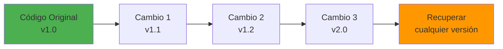
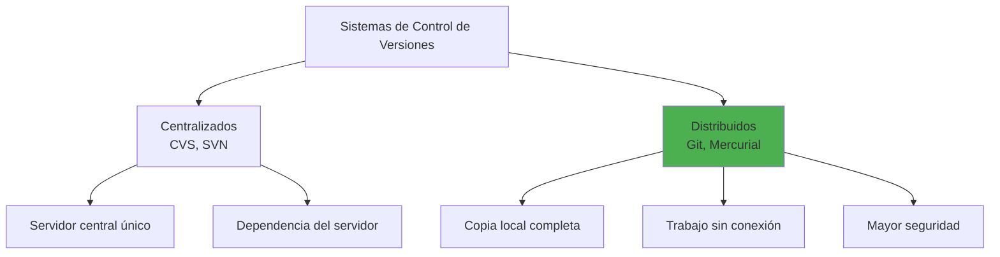
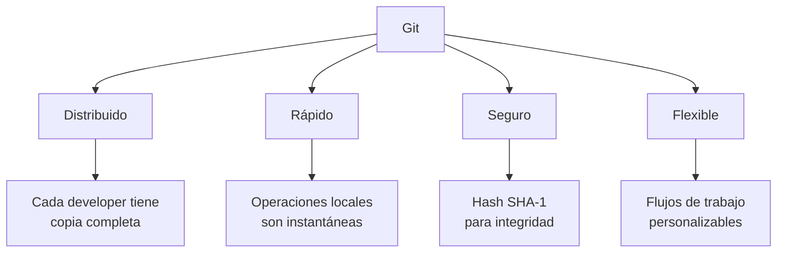
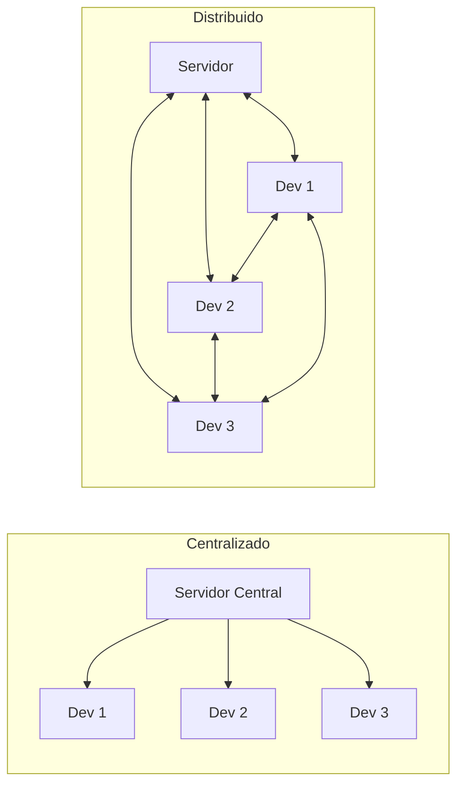
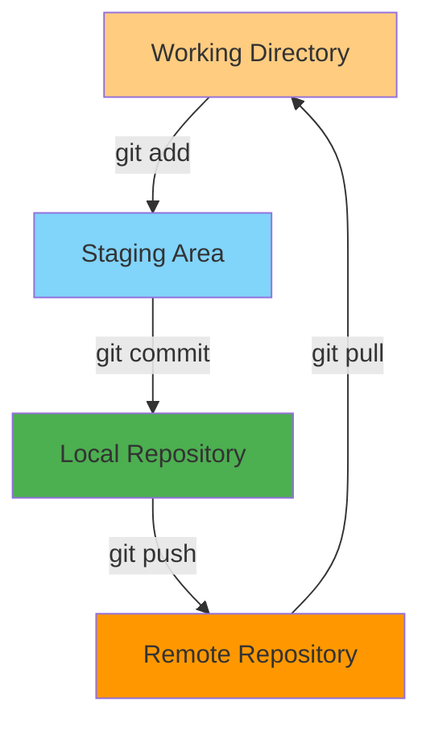
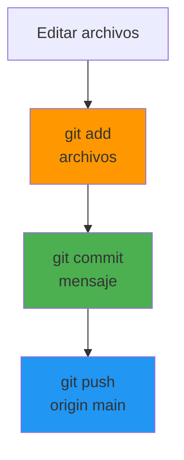
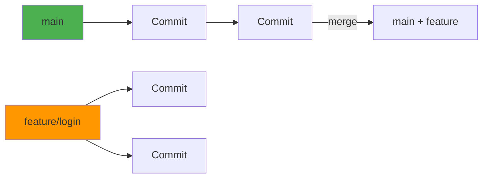
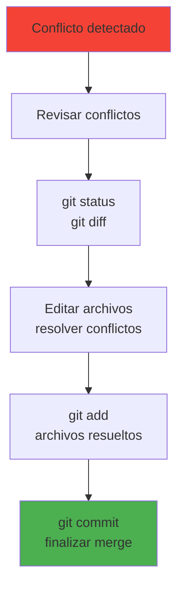
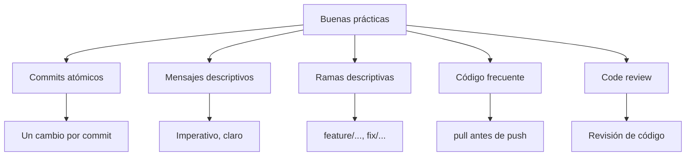

- [1. Control de Versiones](#1-control-de-versiones)
  - [1.1. ¿Qué es un Sistema de Control de Versiones?](#11-qué-es-un-sistema-de-control-de-versiones)
    - [🧠 Analogía: El control de versiones como máquina del tiempo](#-analogía-el-control-de-versiones-como-máquina-del-tiempo)
  - [1.2. Git: El sistema de control de versiones distribuido](#12-git-el-sistema-de-control-de-versiones-distribuido)
    - [🧠 Analogía: Centralizado vs Distribuido](#-analogía-centralizado-vs-distribuido)
  - [1.3. GitHub y plataformas de colaboración](#13-github-y-plataformas-de-colaboración)
  - [1.4. Conceptos fundamentales de Git](#14-conceptos-fundamentales-de-git)
  - [1.5. Comandos básicos de Git](#15-comandos-básicos-de-git)
  - [1.6. Flujo de trabajo con ramas](#16-flujo-de-trabajo-con-ramas)
    - [🧠 Analogía: Las ramas como hojas de ruta](#-analogía-las-ramas-como-hojas-de-ruta)
  - [1.7. Resolución de conflictos](#17-resolución-de-conflictos)
  - [1.8. Buenas prácticas](#18-buenas-prácticas)
    - [📝 Resumen del Capítulo](#-resumen-del-capítulo)
    - [💡 Ejercicio Propuesto](#-ejercicio-propuesto)
  - [1.9. Resumen](#19-resumen)

# 1. Control de Versiones

El control de versiones es una de las habilidades más importantes que debe dominar cualquier desarrollador. Permite rastrear cambios, colaborar en equipo y mantener un historial completo del desarrollo de un proyecto.

## 1.1. ¿Qué es un Sistema de Control de Versiones?

Un **Sistema de Control de Versiones (VCS)** es una herramienta que registra los cambios realizados sobre archivos a lo largo del tiempo. Permite recuperar versiones específicas, comparar cambios entre versiones, y mantener un historial completo del desarrollo.



### 🧠 Analogía: El control de versiones como máquina del tiempo

Imagina que Git es una máquina del tiempo para tu código:
- Cada **commit** es como tomar una foto instantánea de tu proyecto
- Puedes volver a cualquier momento del pasado
- Puedes crear "líneas temporales alternativas" (ramas)
- Puedes fusionar diferentes líneas temporales

📝 **Nota del Profesor**: El control de versiones no es opcional en el desarrollo profesional. Incluso para proyectos personales, usar Git desde el principio te ahorrará innumerables problemas cuando cometamos errores.

**Tipos de sistemas de control de versiones:**



## 1.2. Git: El sistema de control de versiones distribuido

**Git** es un sistema de control de versiones distribuido, creado por Linus Torvalds en 2005. Es el estándar de la industria y el más utilizado en el mundo.

**Características principales de Git:**



### 🧠 Analogía: Centralizado vs Distribuido

| Centralizado (SVN) | Distribuido (Git) |
|--------------------|--------------------|
| Como una biblioteca central | Como tener tu propia copia del libro |
| Dependes del servidor | Trabajas sin conexión |
| Si el servidor falla, pierdes acceso | Cada copia es autónoma |
| Un solo punto de fallo | Múltiples copias de seguridad |



💡 **Tip del Examinador**: Git usa hashes SHA-1 para identificar cada commit. Esto hace imposible modificar el historial sin que nadie lo note. La seguridad es una característica fundamental.

## 1.3. GitHub y plataformas de colaboración

**GitHub** es una plataforma en línea que utiliza Git para alojar proyectos de software. Es el "Facebook de los desarrolladores".

```mermaid
graph LR
    A["Desarrollador 1"] -->|push| G["GitHub"]
    A -->|pull| G
    B["Desarrollador 2"] -->|push| G
    B -->|pull| G
    C["Desarrollador 3"] -->|push| G
    C -->|pull| G
    
    style G fill:#24292e
    style A fill:#4CAF50
    style B fill:#4CAF50
    style C fill:#4CAF50
```



**Plataformas similares:**

| Plataforma | Características |
|------------|-----------------|
| **GitHub** | Más popular, gran comunidad, GitHub Actions |
| **GitLab** | CI/CD integrado, opción self-hosted |
| **Bitbucket** | Integrado con Jira, útil para empresas |
| **Azure DevOps** | Integrado con ecosistema Microsoft |

📝 **Nota del Profesor**: GitHub tiene más de 100 millones de desarrolladores y más de 400 millones de repositorios. Es fundamental tener presencia en GitHub para tu carrera profesional.

## 1.4. Conceptos fundamentales de Git



**Estados de un archivo en Git:**

1. **Modified (Modificado)**: El archivo ha cambiado pero no está preparado
2. **Staged (Preparado)**: El archivo está marcado para el próximo commit
3. **Committed (Confirmado)**: El cambio está guardado en el repositorio local

⚠️ **Advertencia**: Un archivo "modificado" pero no "staged" se perderá si no lo preparas. Siempre revisa el estado con `git status`.

**El flujo de trabajo básico:**



## 1.5. Comandos básicos de Git

**Configuración inicial:**

```bash
# Configurar nombre y email
git config --global user.name "Tu Nombre"
git config --global user.email "tu@email.com"

# Configurar editor
git config --global core.editor "code --wait"

# Ver configuración
git config --list
```

**Comandos fundamentales:**

```bash
# Inicializar un repositorio
git init

# Clonar un repositorio existente
git clone https://github.com/usuario/repositorio.git

# Ver estado del repositorio
git status

# Ver diferencias
git diff                    # Cambios no preparados
git diff --staged           # Cambios preparados

# Preparar archivos
git add archivo.txt         # Archivo específico
git add .                   # Todos los archivos
git add *.cs                # Por patrón

# Confirmar cambios
git commit -m "Mensaje descriptivo"
git commit -am "Mensaje"    # add + commit (solo archivos ya rastreados)

# Ver historial
git log                     # Historial completo
git log --oneline           # Historial resumido
git log -n 5                # Últimos 5 commits
git log --graph             # Con representación gráfica
```

**Comandos de trabajo remoto:**

```bash
# Ver remotos configurados
git remote -v

# Agregar remoto
git remote add origin https://github.com/usuario/repo.git

# Cambiar remoto
git remote set-url origin nueva-url.git

# Sincronizar con remoto
git fetch          # Descargar sin fusionar
git pull           # fetch + merge
git push           # Subir cambios
git push -u origin main  # Primera vez con tracking
```

💡 **Tip del Examinador**: Siempre haz `git pull` antes de empezar a trabajar y `git push` cuando termines. Esto reduce conflictos.

## 1.6. Flujo de trabajo con ramas

Las **ramas** permiten desarrollar características en paralelo sin afectar el código principal.



**Comandos de ramas:**

```bash
# Listar ramas
git branch              # Locales
git branch -r           # Remotas
git branch -a           # Todas

# Crear rama
git branch nombre-rama

# Cambiar a otra rama
git checkout nombre-rama
git switch nombre-rama  # C# 10+ (más intuitivo)

# Crear y cambiar
git checkout -b nombre-rama
git switch -c nombre-rama

# Eliminar rama
git branch -d nombre-rama       # Solo si está fusionada
git branch -D nombre-rama       # Forzar eliminación

# Fusionar rama
git merge nombre-rama

# Rebase (historial lineal)
git rebase main
```

📝 **Nota del Profesor**: El flujo más común es:
1. Crear rama desde `main`
2. Desarrollar en la rama
3. Mantener actualizada con `main`
4. Fusionar cuando esté listo

### 🧠 Analogía: Las ramas como hojas de ruta

Imagina el desarrollo como una autopista:
- **main** es la carretera principal
- Cada **rama** es un desvío para trabajar en algo nuevo
- El **merge** es volver a la carretera principal
- El **rebase** es como si hubieras estado en la carretera principal todo el tiempo

## 1.7. Resolución de conflictos

Los conflictos ocurren cuando dos desarrolladores modifican las mismas líneas de código.



**Marcadores de conflicto en el código:**

```csharp
<<<<<<< HEAD
// Tu versión
int resultado = Sumar(a, b);
=======
// Versión de la rama
int resultado = a + b;
>>>>>>> feature/rama
```

**Pasos para resolver:**

```bash
# Ver archivos en conflicto
git status

# Ver conflictos específicos
git diff

# Editar manualmente y resolver

# Marcar como resuelto
git add archivo_resuelto.cs

# Completar el merge
git commit -m "Resuelto conflicto en archivo.cs"
```

⚠️ **Advertencia**: Nunca ignores un conflicto. El código no compilará hasta que esté resuelto. Comunícate con tu equipo cuando ocurran conflictos.

## 1.8. Buenas prácticas

**Commits atómicos:**

```bash
# ✅ BUENO: Un cambio por commit
git commit -m "Añadir validación de email"

# ❌ MALO: Muchos cambios juntos
git commit -m "Añadir login, arreglar bugs, mejorar UI"
```

**Mensajes de commit efectivos:**

```bash
# ✅ BUENO: Descriptivo y específico
git commit -m "Fix: Corregir NullReferenceException en login"
git commit -m "Feat: Implementar autenticación JWT"
git commit -m "Docs: Actualizar README con instrucciones"

# ❌ MALO: Vago o genérico
git commit -m "cambios"
git commit -m "arreglar cosas"
```

**Estructura de mensajes:**

```
[Tipo]: Descripción breve

Cuerpo explicativo (opcional)

- Punto clave 1
- Punto clave 2
```

**Tipos convencionales:**

| Tipo | Descripción |
|------|-------------|
| `feat` | Nueva característica |
| `fix` | Corrección de bug |
| `docs` | Documentación |
| `style` | Formato, sin cambios de código |
| `refactor` | Reestructuración de código |
| `test` | Tests |
| `chore` | Mantenimiento |



💡 **Tip del Examinador**: Git es tu seguro contra desastres. Committea frecuentemente, incluso cambios pequeños. Es más fácil deshacer cambios pequeños que grandes.

### 📝 Resumen del Capítulo

En este capítulo hemos aprendido:

1. **Control de versiones**: Herramienta esencial para rastrear cambios
2. **Git**: Sistema distribuido, seguro y rápido
3. **GitHub**: Plataforma de colaboración más popular
4. **Estados de Git**: Modified → Staged → Committed
5. **Comandos básicos**: init, add, commit, push, pull, branch, merge
6. **Ramas**: Desarrollo paralelo sin afectar main
7. **Resolución de conflictos**: Comunicación y edición manual
8. **Buenas prácticas**: Commits atómicos, mensajes descriptivos

### 💡 Ejercicio Propuesto

**Configurar Git y crear tu primer repositorio:**

```bash
# 1. Configurar Git
git config --global user.name "Tu Nombre"
git config --global user.name "tu@email.com"

# 2. Crear carpeta de proyecto
mkdir mi-primer-proyecto
cd mi-primer-proyecto

# 3. Inicializar repositorio
git init

# 4. Crear archivo
echo "# Mi Proyecto" > README.md

# 5. Hacer primer commit
git add .
git commit -m "Initial commit"

# 6. Crear repositorio en GitHub y vincular
git remote add origin https://github.com/usuario/repo.git
git push -u origin main
```

## 1.9. Resumen
Usa Git desde el primer día. Practica los comandos básicos, trabaja con ramas y sigue las buenas prácticas para convertirte en un desarrollador profesional. Aquí tienes un resumen rápido de los puntos clave:
- Control de versiones es esencial para cualquier proyecto.
- Git es el sistema distribuido más popular.
- Usa GitHub para colaborar y alojar tus proyectos.
- Comprende los estados de los archivos en Git.
- Domina los comandos básicos: init, add, commit, push, pull, branch, merge.
- Trabaja con ramas para desarrollar características en paralelo.
- Resuelve conflictos comunicándote con tu equipo.
- Sigue buenas prácticas para mantener un historial limpio y comprensible. ¡Feliz codificación con Git!
