- [2. Gestión de Proyectos y Construcción en .NET](#2-gestión-de-proyectos-y-construcción-en-net)
  - [2.1. Soluciones, Proyectos y Namespaces](#21-soluciones-proyectos-y-namespaces)
    - [2.1.1. ¿Qué es una Solución?](#211-qué-es-una-solución)
    - [2.1.2. Formatos de Solución: .sln vs .slnx](#212-formatos-de-solución-sln-vs-slnx)
    - [2.1.3. Cómo Portar de .sln a .slnx](#213-cómo-portar-de-sln-a-slnx)
    - [2.1.4. ¿Qué es un Proyecto?](#214-qué-es-un-proyecto)
    - [2.1.5. Estructura de una Solución con Múltiples Proyectos](#215-estructura-de-una-solución-con-múltiples-proyectos)
    - [2.1.6. Namespaces y Organización del Código](#216-namespaces-y-organización-del-código)
    - [2.1.7. La Directiva using](#217-la-directiva-using)
    - [2.1.8. Using Static y Global Using](#218-using-static-y-global-using)
    - [2.1.9. Referencias entre Proyectos](#219-referencias-entre-proyectos)
   - [2.2. dotnet CLI y Archivo .csproj](#22-dotnet-cli-y-archivo-csproj)
     - [2.2.1. Ejemplo de solución (.sln y .slnx)](#221-ejemplo-de-solución-sln-y-slnx)
     - [2.2.2. NuGet: Gestor de paquetes](#222-nuget-gestor-de-paquetes)
   - [2.3. Generación de código y reducción de boilerplate](#23-generación-de-código-y-reducción-de-boilerplate)
     - [2.3.1. Source Generators](#231-source-generators)
     - [2.3.2. Records para POCOs inmutables](#232-records-para-pocos-inmutables)
     - [2.3.3. Primary Constructors (C# 12+)](#233-primary-constructors-c-12)
  - [2.4. Buenas prácticas de organización](#24-buenas-prácticas-de-organización)
  - [2.5. Resumen](#25-resumen)
    - [💡 Ejercicio Propuesto](#-ejercicio-propuesto)

# 2. Gestión de Proyectos y Construcción en .NET

La gestión eficiente de proyectos y la automatización de builds son fundamentales para el desarrollo profesional. .NET ofrece herramientas integradas que simplifican todo el ciclo de desarrollo.

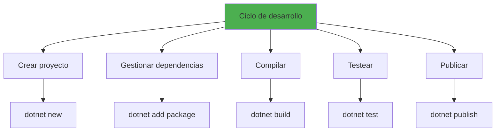

## 2.1. Soluciones, Proyectos y Namespaces

En .NET, el código se organiza en una jerarquía clara: **Soluciones** contienen **Proyectos**, y ** los **Namespaces** agrupan el código dentro de cada proyecto.

### 2.1.1. ¿Qué es una Solución?

Una **solución** es un contenedor que agrupa múltiples proyectos relacionados. Una solución puede contener tantos proyectos como necesites.

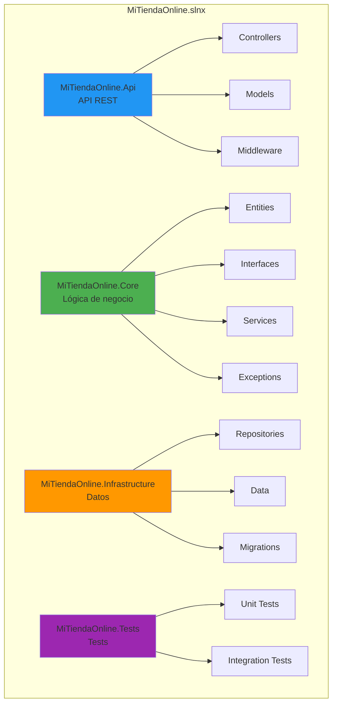

**Comandos para gestionar soluciones:**

```bash
# Crear solución (formato .slnx por defecto en .NET 9+)
dotnet new sln -n MiTiendaOnline

# Crear solución legacy (.sln)
dotnet new sln -n MiTiendaOnline --force

# Agregar proyectos a la solución
dotnet sln add src/Api/Api.csproj
dotnet sln add src/Core/Core.csproj
dotnet sln add src/Infrastructure/Infrastructure.csproj
dotnet sln add tests/Tests/Tests.csproj

# Listar proyectos en la solución
dotnet sln list

# Remover proyecto de la solución
dotnet sln remove src/Old/Old.csproj

# Ver proyectos huérfanos (no en solución)
dotnet sln list --orphan
```

### 2.1.2. Formatos de Solución: .sln vs .slnx

.NET soporta dos formatos de solución:

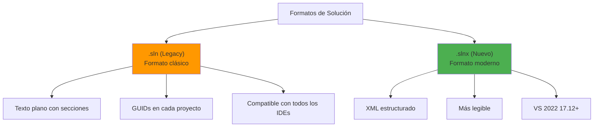

**Comparación de formatos:**

| Aspecto | .sln | .slnx |
|---------|------|-------|
| **Formato** | Texto plano con secciones | XML estructurado |
| **Legibilidad** | Difícil de leer manualmente | XML claro y formateado |
| **Versionado Git** | Conflictos frecuentes | Mejor manejo de merge |
| **Rendimiento** | Parsing más lento | Parsing más rápido |
| **Compatibilidad** | VS, Rider, VS Code, CLI | VS 2022 17.12+ |
| **GUIDs** | Secciones Project(GUID) | Paths simples |

**Ejemplo de archivo .sln (legacy):**
```text
Microsoft Visual Studio Solution File, Format Version 12.00
# Visual Studio Version 17
VisualStudioVersion = 17.0.31903.59
MinimumVisualStudioVersion = 10.0.40219.1

Project("{FAE04EC0-301F-11D3-BF4B-00C04F79EFBC}") = "Api", "src\Api\Api.csproj", "{A1B2C3D4-E5F6-7890-ABCD-EF1234567890}"
EndProject

Project("{FAE04EC0-301F-11D3-BF4B-00C04F79EFBC}") = "Core", "src\Core\Core.csproj", "{B2C3D4E5-F678-9012-BCDE-F12345678901}"
EndProject

Global
    GlobalSection(SolutionConfigurationPlatforms) = preSolution
        Debug|Any CPU = Debug|Any CPU
        Release|Any CPU = Release|Any CPU
    EndGlobalSection
EndGlobal
```

**Ejemplo de archivo .slnx (moderno):**

```xml
<Solution>
  <Configurations>
    <Platform Name="Any CPU" />
    <Platform Name="x64" />
    <Platform Name="x86" />
  </Configurations>
  <Project Path="src/Api/Api.csproj" />
  <Project Path="src/Core/Core.csproj" />
  <Project Path="src/Infrastructure/Infrastructure.csproj" />
  <Project Path="tests/Tests/Tests.csproj" />
</Solution>
```

**Diferencias clave entre formatos:**

| Aspecto | .sln (Legacy) | .slnx (Nuevo) |
|---------|---------------|---------------|
| **Formato** | Texto plano con secciones | XML estructurado |
| **Legibilidad** | Difícil de leer manualmente | XML claro y formateado |
| **Versionado Git** | Conflictos frecuentes | Mejor manejo de merge |
| **Rendimiento** | Parsing más lento | Parsing más rápido |
| **Compatibilidad** | VS, Rider, VS Code, CLI | VS 2022 17.12+ |
| **Configuración** | Secciones Global complejas | XML simple |

📝 **Nota del Profesor**: El formato `.slnx` usa **XML**, no JSON. Esto facilita la edición manual y el merge en Git, ya que los conflictos son más fáciles de resolver que en el formato tradicional de Visual Studio.

### 2.1.3. dotnet sln migrate: Migración Automática

El comando `dotnet sln migrate` automatiza la conversión de soluciones del formato `.sln` al nuevo formato `.slnx`.

**Comando básico:**

```bash
# Migrar una solución existente (genera .slnx automáticamente)
dotnet sln migrate

# Especificar archivo de entrada
dotnet sln migrate MiSolucion.sln

# Especificar archivo de salida
dotnet sln migrate MiSolucion.sln --output MiSolucion.slnx
```

**Ejemplo de ejecución:**

```bash
PS C:\Users\chethusk\Code\example> dotnet sln migrate
.slnx file C:\Users\chethusk\Code\example\example.slnx generated.

PS C:\Users\chethusk\Code\example> cat .\example.slnx
<Solution>
  <Configurations>
    <Platform Name="Any CPU" />
    <Platform Name="x64" />
    <Platform Name="x86" />
  </Configurations>
  <Project Path="my-app/my-app.csproj" />
</Solution>
```

**Proceso de migración:**

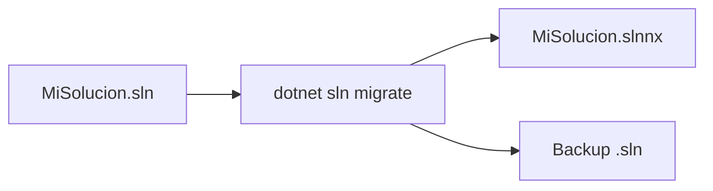

**Qué hace el comando migrate:**

1. Lee el archivo `.sln` existente
2. Extrae la lista de proyectos y sus paths
3. Genera un nuevo archivo `.slnx` en formato XML
4. Mantiene el archivo `.sln` original (puedes eliminarlo manualmente)
5. Configura los proyectos correctamente

**Opciones disponibles:**

```bash
# Ver ayuda del comando
dotnet sln migrate --help

# Especificar archivo de entrada
dotnet sln migrate MiSolucion.sln

# Forzar sobreescritura si existe
dotnet sln migrate MiSolucion.sln --force
```

### 2.1.4. Comandos del dotnet sln

El comando `dotnet sln` proporciona todas las operaciones necesarias para gestionar soluciones.

**Crear solución:**

```bash
# Crear solución (formato .slnx por defecto en .NET 9+)
dotnet new sln -n MiApi

# Crear solución legacy (.sln) si necesitas compatibilidad
dotnet new sln -n MiApi --force
```

**Gestionar proyectos:**

```bash
# Agregar proyectos a la solución
dotnet sln add src/Api/Api.csproj
dotnet sln add src/**/*.csproj
dotnet sln add tests/**/*.csproj

# Listar proyectos en la solución
dotnet sln list

# Remover proyecto de la solución
dotnet sln remove src/Old/Old.csproj

# Ver proyectos huérfanos (no en solución)
dotnet sln list --orphan
```

**Migración:**

```bash
# Migrar de .sln a .slnx
dotnet sln convert MiSolucion.sln --output MiSolucion.slnx

# Convertir solución actual
dotnet sln convert
```

**Operaciones de build:**

```bash
# Compilar toda la solución
dotnet build

# Compilar configuración específica
dotnet build --configuration Release

# Restaurar paquetes
dotnet restore
```

### 2.1.5. ¿Qué es un Proyecto?

Un **proyecto** es un archivo `.csproj` que define la configuración, dependencias, referencias y estructura del código. Cada proyecto produce un ensamblado (DLL o EXE).

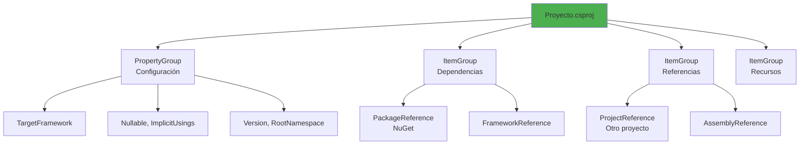

**Tipos de proyectos:**

```bash
# Consola
dotnet new console -n MiConsola

# API REST
dotnet new webapi -n MiApi

# Blazor
dotnet new blazorwasm -n MiBlazor

# Class Library
dotnet new classlib -n MiLibreria

# Unit Tests (NUnit)
dotnet new nunit -n MisTests

# Unit Tests (xUnit)
dotnet new xunit -n MisTestsXUnit

# MSTest
dotnet new mstest -n MisTestsMSTest
```

### 2.1.5. Estructura de una Solución con Múltiples Proyectos

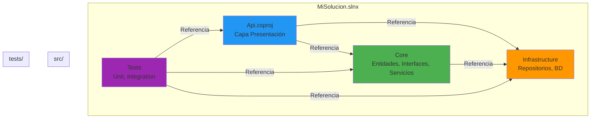

**Estructura física en disco:**

```
MiSolucion/
├── MiSolucion.slnx                    # Archivo de solución
├── src/
│   ├── Api/                           # Proyecto API
│   │   ├── Api.csproj
│   │   ├── Program.cs
│   │   ├── Controllers/
│   │   │   └── WeatherForecastController.cs
│   │   ├── Models/
│   │   ├── DTOs/
│   │   ├── Middleware/
│   │   ├── appsettings.json
│   │   └── appsettings.Development.json
│   │
│   ├── Core/                          # Proyecto Core (Lógica de negocio)
│   │   ├── Core.csproj
│   │   ├── Entities/
│   │   │   ├── User.cs
│   │   │   ├── Product.cs
│   │   │   └── Order.cs
│   │   ├── Interfaces/
│   │   │   ├── IUserRepository.cs
│   │   │   ├── IProductRepository.cs
│   │   │   └── IOrderRepository.cs
│   │   ├── Services/
│   │   │   ├── UserService.cs
│   │   │   └── ProductService.cs
│   │   ├── Exceptions/
│   │   └── Validations/
│   │
│   └── Infrastructure/                # Proyecto Infrastructure
│       ├── Infrastructure.csproj
│       ├── Data/
│       │   └── AppDbContext.cs
│       ├── Repositories/
│       │   ├── UserRepository.cs
│       │   └── ProductRepository.cs
│       └── Migrations/
│
└── tests/
    ├── Api.Tests/                     # Proyecto de tests
    │   ├── Api.Tests.csproj
    │   ├── Usings.cs
    │   ├── UserServiceTests.cs
    │   └── ControllersTests/
    └── Api.IntegrationTests/
        ├── Api.IntegrationTests.csproj
        └── ApiTests.cs
```

### 2.1.6. Namespaces y Organización del Código

Los **namespaces** organizan el código en grupos lógicos, evitando conflictos de nombres y facilitando la navegación.

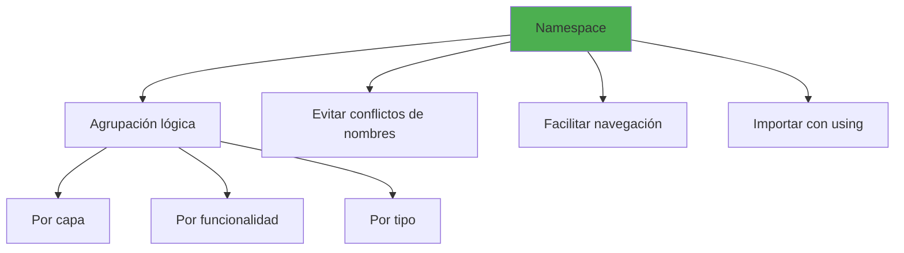

**Convenciones de nombres:**

```csharp
// Por capa (Clean Architecture)
namespace MiAplicacion.Api.Controllers
namespace MiAplicacion.Core.Entities
namespace MiAplicacion.Core.Interfaces
namespace MiAplicacion.Core.Services
namespace MiAplicacion.Infrastructure.Data
namespace MiAplicacion.Infrastructure.Repositories

// Por funcionalidad
namespace MiAplicacion.Core.Users.Entities
namespace MiAplicacion.Core.Products.Entities
namespace MiAplicacion.Core.Orders.Entities

// Por tipo
namespace MiAplicacion.Core.Entities
namespace MiAplicacion.Core.ValueObjects
namespace MiAplicacion.Core.Events
namespace MiAplicacion.Core.Exceptions
```

**File-scoped namespaces (C# 10+):**

```csharp
// Namespace tradicional
namespace MiAplicacion.Core.Entities
{
    public class User
    {
        public int Id { get; set; }
        public string Name { get; set; } = string.Empty;
    }
}

// File-scoped namespace (más conciso)
namespace MiAplicacion.Core.Entities;

public class User
{
    public int Id { get; set; }
    public string Name { get; set; } = string.Empty;
}
```

### 2.1.7. La Directiva using

La directiva `using` importa namespaces para no tener que escribir el nombre completo de los tipos.

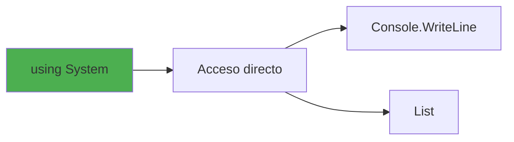

**Tipos de using:**

```csharp
// Using básico - importa el namespace completo
using System;
using System.Collections.Generic;
using System.Linq;
using System.Threading.Tasks;

// Using alias - crear alias para tipos o namespaces
using Cliente = MiAplicacion.Core.Entities.Customer;
using ProductoList = System.Collections.Generic.List<MiAplicacion.Core.Entities.Product>;
using DictStringInt = System.Collections.Generic.Dictionary<string, int>;

public class DemoAlias
{
    public void Metodo()
    {
        // Usar alias
        Cliente c = new Cliente();
        ProductoList productos = new ProductoList();
        DictStringInt diccionario = new();
    }
}

// Using para tipos anidados
using var lista = new System.Collections.Generic.List<string>();
```

**Namespace completo vs using:**

```csharp
// Sin using - nombre completo
var lista = new System.Collections.Generic.List<string>();
var dict = new System.Collections.Generic.Dictionary<string, int>();
var fecha = new System.DateTime(2025, 1, 15);

// Con using - más limpio
using System.Collections.Generic;

var lista = new List<string>();
var dict = new Dictionary<string, int>();
var fecha = DateTime.Now;
```

### 2.1.8. Using Static y Global Using

**Using static:**

```csharp
// Importa miembros estáticos directamente
using static System.Console;      // WriteLine, ReadLine
using static System.Math;          // PI, Sin, Cos, Max, Min
using static System.Enum;          // GetValues, Parse
using static System.ConsoleColor; // Red, Green, Blue
using static System.DateTime;      // Now, Today

public class DemoUsingStatic
{
    public void Calcular()
    {
        // Sin using static
        System.Console.WriteLine(System.Math.PI);
        System.Console.WriteLine(System.Math.Sin(System.Math.PI / 2));
        var max = System.Int32.MaxValue;

        // Con using static
        WriteLine(PI);              // System.Math.PI
        WriteLine(Sin(PI / 2));     // System.Math.Sin
        WriteLine(MaxValue);        // System.Int32.MaxValue
        WriteLine(Now);             // System.DateTime.Now
        
        // ConsoleColor
        ForegroundColor = Green;
        WriteLine("Éxito");
        ResetColor();
    }
}
```

**Global using (C# 10+):**

```csharp
// Archivo "Usings.cs" o al inicio de cualquier archivo
global using System;
global using System.Collections.Generic;
global using System.Linq;
global using System.Threading.Tasks;
global using FluentAssertions;

// Ahora disponible en todos los archivos del proyecto
public class CualquierClase
{
    public void Metodo()
    {
        // System está disponible sin escribir using
        var lista = new List<string>();  // Funciona
        var ahora = DateTime.Now;        // Funciona
    }
}
```

**Implicit Usings (C# 10+):**

```xml
<!-- En el .csproj -->
<PropertyGroup>
  <ImplicitUsings>enable</ImplicitUsings>
</PropertyGroup>
```

Con `ImplicitUsings` enabled, .NET incluye automáticamente los using más comunes según el tipo de proyecto:

```csharp
// Console app - incluye System, System.Collections.Generic, etc.
// Web API - incluye System, System.Collections.Generic, Microsoft.AspNetCore.Http, etc.
// Class library - incluye System, System.Collections.Generic
```

### 2.1.9. Referencias entre Proyectos

Los proyectos pueden referenciarse para compartir código.

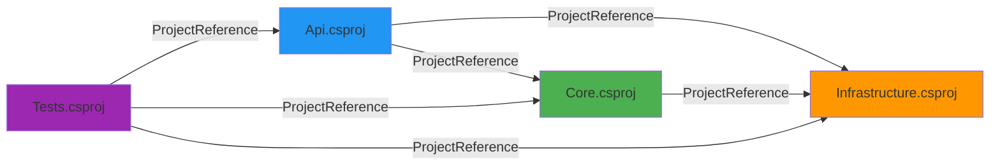

**Agregar referencias:**

```bash
# Agregar referencia a otro proyecto
dotnet add reference ../Core/Core.csproj
dotnet add reference ../Infrastructure/Infrastructure.csproj

# Desde el directorio del proyecto
cd src/Api
dotnet add reference ../Core/Core.csproj
dotnet add reference ../Infrastructure/Infrastructure.csproj
```

**En el archivo .csproj:**

```xml
<ItemGroup>
  <!-- Referencias a otros proyectos -->
  <ProjectReference Include="..\Core\Core.csproj" />
  <ProjectReference Include="..\Infrastructure\Infrastructure.csproj" />
</ItemGroup>
```

**Ver referencias:**

```bash
# Listar referencias de un proyecto
dotnet list reference

# Ver todas las referencias de la solución
dotnet sln list --include-projects
```

**Ciclo de dependencias recomendado:**

```
Tests --> Api --> Core --> Infrastructure
                ^           |
                |___________|
```

El proyecto **Core** no debe depender de nadie. **Infrastructure** implementa las interfaces de **Core**. **Api** depende de Core e Infrastructure. **Tests** prueba todo.

## 2.2. dotnet CLI y Archivo .csproj

📝 **Nota del Profesor**: A diferencia de Java que tiene Maven/Gradle separados, .NET consolida todo en una única herramienta. Esto reduce la curva de aprendizaje y simplifica la configuración.

```xml
<Project Sdk="Microsoft.NET.Sdk.Web">

  <!-- CONFIGURACIÓN BÁSICA -->
  <PropertyGroup>
    <!-- Framework objetivo -->
    <TargetFramework>net10.0</TargetFramework>
    
    <!-- Versión de C# -->
    <LangVersion>14</LangVersion>
    
    <!-- Habilitar nullable reference types -->
    <Nullable>enable</Nullable>
    
    <!-- Habilitar implicit usings (C# 10+) -->
    <ImplicitUsings>enable</ImplicitUsings>
    
    <!-- Tratar warnings como errores -->
    <TreatWarningsAsErrors>true</TreatWarningsAsErrors>
    
    <!-- Información del ensamblado -->
    <AssemblyName>MiAplicacion.Api</AssemblyName>
    <RootNamespace>MiAplicacion.Api</RootNamespace>
    <Version>1.0.0</Version>
    <Authors>Tu Nombre</Authors>
    <Company>Tu Empresa</Company>
    <Product>Mi Aplicación API</Product>
    <Description>API REST para gestión de productos</Description>
    
    <!-- Generar documentación XML -->
    <GenerateDocumentationFile>true</GenerateDocumentationFile>
    <NoWarn>$(NoWarn);1591</NoWarn>
  </PropertyGroup>

  <!-- DEPENDENCIAS DE NUGET -->
  <ItemGroup>
    <!-- ASP.NET Core -->
    <PackageReference Include="Microsoft.AspNetCore.OpenApi" Version="10.0.0" />
    <PackageReference Include="Swashbuckle.AspNetCore" Version="6.5.0" />
    
    <!-- Entity Framework Core -->
    <PackageReference Include="Microsoft.EntityFrameworkCore" Version="10.0.0" />
    <PackageReference Include="Microsoft.EntityFrameworkCore.Design" Version="10.0.0">
      <PrivateAssets>all</PrivateAssets>
      <IncludeAssets>runtime; build; native; contentfiles; analyzers; buildtransitive</IncludeAssets>
    </PackageReference>
    <PackageReference Include="Npgsql.EntityFrameworkCore.PostgreSQL" Version="10.0.0" />
    
    <!-- Validación y mapeo -->
    <PackageReference Include="FluentValidation.AspNetCore" Version="11.3.0" />
    <PackageReference Include="AutoMapper.Extensions.Microsoft.DependencyInjection" Version="12.0.0" />
    
    <!-- Funcional y Railway Oriented Programming -->
    <PackageReference Include="CSharpFunctionalExtensions" Version="2.40.0" />
    
    <!-- Autenticación JWT -->
    <PackageReference Include="Microsoft.AspNetCore.Authentication.JwtBearer" Version="10.0.0" />
    
    <!-- Cliente HTTP -->
    <PackageReference Include="Refit" Version="7.0.0" />
    <PackageReference Include="Refit.HttpClientFactory" Version="7.0.0" />
    
    <!-- Observabilidad -->
    <PackageReference Include="Serilog.AspNetCore" Version="8.0.0" />
    <PackageReference Include="Serilog.Sinks.Console" Version="5.0.0" />
  </ItemGroup>

  <!-- REFERENCIAS A OTROS PROYECTOS -->
  <ItemGroup>
    <ProjectReference Include="..\MiAplicacion.Core\MiAplicacion.Core.csproj" />
    <ProjectReference Include="..\MiAplicacion.Infrastructure\MiAplicacion.Infrastructure.csproj" />
  </ItemGroup>

  <!-- CONFIGURACIÓN DE PUBLICACIÓN -->
  <PropertyGroup Condition="'$(Configuration)' == 'Release'">
    <DebugType>none</DebugType>
    <DebugSymbols>false</DebugSymbols>
    <Optimize>true</Optimize>
  </PropertyGroup>

</Project>
```

**Ejemplo de proyecto de biblioteca de clases:**

```xml
<Project Sdk="Microsoft.NET.Sdk">

  <PropertyGroup>
    <TargetFramework>net10.0</TargetFramework>
    <LangVersion>14</LangVersion>
    <Nullable>enable</Nullable>
    <ImplicitUsings>enable</ImplicitUsings>
    
    <!-- Información del paquete NuGet -->
    <PackageId>MiEmpresa.MiLibreria</PackageId>
    <Version>1.0.0</Version>
    <Authors>Tu Nombre</Authors>
    <Company>Tu Empresa</Company>
    <PackageLicenseExpression>MIT</PackageLicenseExpression>
    <PackageProjectUrl>https://github.com/tuusuario/milibreria</PackageProjectUrl>
    <RepositoryUrl>https://github.com/tuusuario/milibreria</RepositoryUrl>
    <RepositoryType>git</RepositoryType>
    <PackageTags>utilidades; helpers; extensions</PackageTags>
    <Description>Librería de utilidades comunes</Description>
    
    <!-- Generar paquete NuGet en cada build -->
    <GeneratePackageOnBuild>true</GeneratePackageOnBuild>
  </PropertyGroup>

  <ItemGroup>
    <PackageReference Include="System.Text.Json" Version="10.0.0" />
  </ItemGroup>

</Project>
```

**Ejemplo de proyecto de tests:**

```xml
<Project Sdk="Microsoft.NET.Sdk">

  <PropertyGroup>
    <TargetFramework>net10.0</TargetFramework>
    <LangVersion>14</LangVersion>
    <Nullable>enable</Nullable>
    <ImplicitUsings>enable</ImplicitUsings>
    
    <!-- Marcar como proyecto de test -->
    <IsPackable>false</IsPackable>
    <IsTestProject>true</IsTestProject>
  </PropertyGroup>

  <ItemGroup>
    <!-- Framework de testing -->
    <PackageReference Include="NUnit" Version="4.1.0" />
    <PackageReference Include="NUnit3TestAdapter" Version="4.5.0" />
    <PackageReference Include="Microsoft.NET.Test.Sdk" Version="17.9.0" />
    
    <!-- Mocking y assertions -->
    <PackageReference Include="Moq" Version="4.20.0" />
    <PackageReference Include="FluentAssertions" Version="6.12.0" />
    
    <!-- Testcontainers -->
    <PackageReference Include="Testcontainers" Version="3.7.0" />
    <PackageReference Include="Testcontainers.PostgreSql" Version="3.7.0" />
    
    <!-- Cobertura de código -->
    <PackageReference Include="coverlet.collector" Version="6.0.0">
      <PrivateAssets>all</PrivateAssets>
      <IncludeAssets>runtime; build; native; contentfiles; analyzers; buildtransitive</IncludeAssets>
    </PackageReference>
  </ItemGroup>

  <ItemGroup>
    <!-- Proyecto a testear -->
    <ProjectReference Include="..\MiAplicacion.Api\MiAplicacion.Api.csproj" />
  </ItemGroup>

</Project>
```

⚠️ **Advertencia**: El atributo `Version` en los PackageReference es crítico. Usa versiones específicas en producción para evitar "dependency hell" cuando se actualicen paquetes.

### 2.2.1. Ejemplo de solución (.sln y .slnx)

Una **solución** agrupa múltiples proyectos relacionados. Una solución puede contener tantos proyectos como necesites, organizando tu código en capas y facilitando la gestión de dependencias.

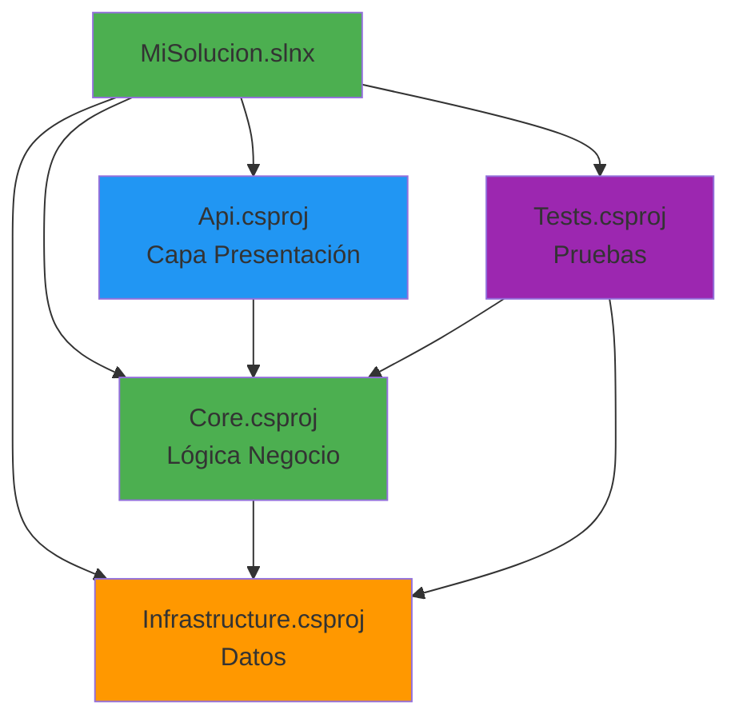

**Estructura típica de solución:**

```
MiAplicacion/
├── MiAplicacion.slnx                   # Archivo de solución (formato moderno)
├── src/
│   ├── MiAplicacion.Api/               # Proyecto API (Capa Presentación)
│   │   ├── MiAplicacion.Api.csproj
│   │   ├── Program.cs
│   │   ├── Controllers/
│   │   ├── Models/
│   │   ├── DTOs/
│   │   ├── Middleware/
│   │   └── appsettings.json
│   ├── MiAplicacion.Core/              # Proyecto Core (Lógica de negocio)
│   │   ├── MiAplicacion.Core.csproj
│   │   ├── Entities/
│   │   ├── Interfaces/
│   │   ├── Services/
│   │   ├── Exceptions/
│   │   └── Validations/
│   └── MiAplicacion.Infrastructure/    # Proyecto Infrastructure (Datos)
│       ├── MiAplicacion.Infrastructure.csproj
│       ├── Data/
│       ├── Repositories/
│       └── Migrations/
└── tests/
    ├── MiAplicacion.UnitTests/         # Tests unitarios
    │   └── MiAplicacion.UnitTests.csproj
    └── MiAplicacion.IntegrationTests/   # Tests integración
        └── MiAplicacion.IntegrationTests.csproj
```

**Comandos para gestionar soluciones:**

```bash
# Crear solución (formato .slnx por defecto en .NET 9+)
dotnet new sln -n MiAplicacion

# Crear solución legacy (.sln) si necesitas compatibilidad
dotnet new sln -n MiAplicacion --force

# Agregar proyectos a la solución
dotnet sln add src/MiAplicacion.Api/MiAplicacion.Api.csproj
dotnet sln add src/MiAplicacion.Core/MiAplicacion.Core.csproj
dotnet sln add src/MiAplicacion.Infrastructure/MiAplicacion.Infrastructure.csproj
dotnet sln add tests/MiAplicacion.UnitTests/MiAplicacion.UnitTests.csproj

# Listar proyectos en la solución
dotnet sln list

# Eliminar proyecto de la solución
dotnet sln remove tests/MiAplicacion.UnitTests/MiAplicacion.UnitTests.csproj

# Ver proyectos huérfanos (no en solución)
dotnet sln list --orphan

# Compilar toda la solución
dotnet build

# Ejecutar tests de toda la solución
dotnet test
```

💡 **Tip del Examinador**: Mantén la estructura "src/ tests/" para proyectos grandes. Es el estándar de la industria y facilita la navegación.

**Nuevo Formato de Solución: .slnx**

A partir de .NET 9 y Visual Studio 2022 17.12, Microsoft introdujo un nuevo formato de solución con extensión `.slnx` que reemplaza al formato tradicional `.sln`.

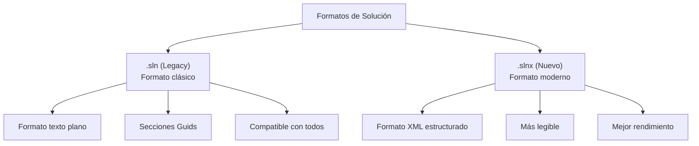

**Diferencias entre .sln y .slnx:**

| Aspecto | .sln (Legacy) | .slnx (Nuevo) |
|---------|---------------|---------------|
| **Formato** | Texto plano con secciones | XML estructurado |
| **Legibilidad** | Difícil de leer manualmente | XML claro y formateado |
| **Versionado** | Conflictos frecuentes en Git | Mejor manejo de merge |
| **Rendimiento** | Parsing más lento | Parsing más rápido |
| **Compatibilidad** | VS + CLI + Rider | VS 2022 17.12+ |
| **Guid** | Secciones Project(GUID) | Paths simples |

**Ejemplo de archivo .slnx:**

```xml
<Solution>
  <Configurations>
    <Platform Name="Any CPU" />
    <Platform Name="x64" />
  </Configurations>
  <Project Path="src/MiApi/MiApi.csproj" />
  <Project Path="src/MiCore/MiCore.csproj" />
  <Project Path="src/MiInfrastructure/MiInfrastructure.csproj" />
  <Project Path="tests/MiApi.Tests/MiApi.Tests.csproj" />
</Solution>
```

**Ejemplo real de migración:**

```bash
PS C:\Users\dev\Code\MiApi> dotnet sln migrate
.slnx file C:\Users\dev\Code\MiApi\MiApi.slnx generated.

PS C:\Users\dev\Code\MiApi> cat .\MiApi.slnx
<Solution>
  <Configurations>
    <Platform Name="Any CPU" />
  </Configurations>
  <Project Path="src/Api/Api.csproj" />
  <Project Path="src/Core/Core.csproj" />
</Solution>
```

**Cómo portar de .sln a .slnx:**

```bash
# Opción 1: Usar Visual Studio 2022 17.12+
# Archivo > Convertir a nuevo formato de solución

# Opción 2: Usar dotnet CLI (recomendado)
dotnet sln migrate

# Especificar archivo de entrada
dotnet sln migrate MiSolucion.sln

# Especificar archivo de salida
dotnet sln migrate MiSolucion.sln --output MiSolucion.slnx

# Opción 3: Crear nuevo archivo slnx y migrar proyectos
dotnet new slnx -n MiSolucion
dotnet sln add src/**/*.csproj
dotnet sln add tests/**/*.csproj
```

📝 **Nota del Profesor**: El nuevo formato `.slnx` usa **XML**, no JSON. Esto facilita la edición manual y reduce los merge conflicts en Git porque los conflictos de XML son más fáciles de resolver que las secciones complejas del formato tradicional de Visual Studio.

### 2.2.2. NuGet: Gestor de paquetes

**NuGet** es el gestor de paquetes oficial de .NET, equivalente a Maven Central o npm.

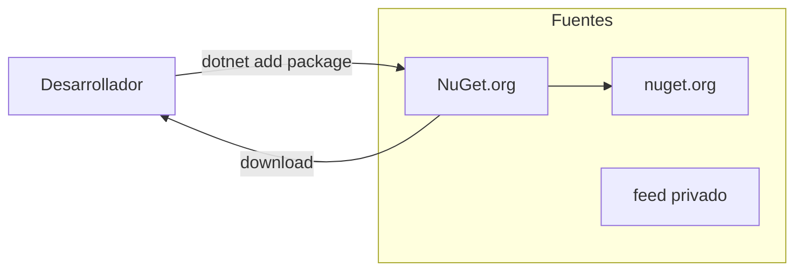

**Fuentes de paquetes:**

```bash
# Listar fuentes configuradas
dotnet nuget list source

# Agregar fuente personalizada
dotnet nuget add source https://api.nuget.org/v3/index.json -n "NuGet Official"

# Agregar fuente privada con autenticación
dotnet nuget add source https://pkgs.dev.azure.com/myorg/_packaging/myfeed/nuget/v3/index.json \
  -n "Azure DevOps" \
  -u myusername \
  -p mypassword \
  --store-password-in-clear-text
```

**Archivo nuget.config:**

```xml
<?xml version="1.0" encoding="utf-8"?>
<configuration>
  <packageSources>
    <clear />
    <add key="nuget.org" value="https://api.nuget.org/v3/index.json" protocolVersion="3" />
    <add key="MyPrivateFeed" value="https://my-company.com/nuget/v3/index.json" />
  </packageSources>
  
  <packageSourceCredentials>
    <MyPrivateFeed>
      <add key="Username" value="myuser" />
      <add key="ClearTextPassword" value="mypassword" />
    </MyPrivateFeed>
  </packageSourceCredentials>
</configuration>
```

**Crear y publicar un paquete:**

```bash
# Empaquetar el proyecto
dotnet pack -c Release

# Publicar a NuGet.org (requiere API key)
dotnet nuget push bin/Release/MiLibreria.1.0.0.nupkg \
  --api-key tu-api-key \
  --source https://api.nuget.org/v3/index.json
```

📝 **Nota del Profesor**: NuGet.org es el repositorio público principal. Para paquetes privados, puedes usar Azure Artifacts, GitHub Packages, o self-hosted NuGet Server.

## 2.3. Generación de código y reducción de boilerplate

C# tiene características nativas que eliminan código repetitivo, sin necesidad de librerías externas como Lombok.

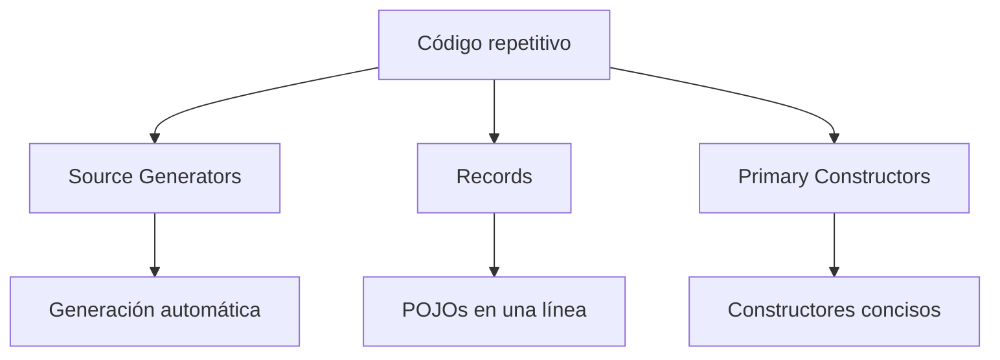

### 2.3.1. Source Generators

**Source Generators** (C# 9+) generan código durante la compilación.

```csharp
using System.Text.Json.Serialization;

namespace MiAplicacion.Models;

// El source generator genera automáticamente el código de serialización
[JsonSerializable(typeof(Producto))]
[JsonSerializable(typeof(List<Producto>))]
internal partial class ProductoJsonContext : JsonSerializerContext
{
}

public record Producto(int Id, string Nombre, decimal Precio);

// Uso
var producto = new Producto(1, "Laptop", 1200m);
var json = JsonSerializer.Serialize(producto, ProductoJsonContext.Default.Producto);
```

💡 **Tip del Examinador**: Los Source Generators son ideales para:
1. Serialización JSON optimizada
2. Inyección de dependencias
3. generación de boilerplate repetitivo

### 2.3.2. Records para POCOs inmutables

Los **records** (C# 9+) son el equivalente a `@Data` de Lombok, pero nativos.

```csharp
// Una línea = clase completa con:
// - Constructor
// - Propiedades de solo lectura
// - Equals por valor
// - ToString descriptivo
// - Deconstruction
// - With expressions
public record Producto(int Id, string Nombre, decimal Precio);

// Uso
var producto = new Producto(1, "Laptop", 1200m);

// With expression (copia inmutable con cambios)
var productoRebajado = producto with { Precio = 1000m };

// Deconstruction
var (id, nombre, precio) = producto;

// Comparación por valor
var producto2 = new Producto(1, "Laptop", 1200m);
Console.WriteLine(producto == producto2); // True

// ToString automático
Console.WriteLine(producto);
// Salida: Producto { Id = 1, Nombre = Laptop, Precio = 1200 }
```

📝 **Nota del Profesor**: Los records son perfectos para:
- DTOs (Data Transfer Objects)
- Entidades de dominio inmutables
- Respuestas de API
- Configuración

### 2.3.3. Primary Constructors (C# 12+)

Los **Primary Constructors** eliminan aún más código repetitivo.

```csharp
// Primary Constructor: parámetros en la declaración de la clase
public class ServicioProducto(IRepositorio repositorio, ILogger<ServicioProducto> logger)
{
    // Los parámetros están disponibles directamente
    public void Guardar(Producto p)
    {
        logger.LogInformation("Guardando producto");
        repositorio.Save(p);
    }
}
```

**Comparación:**

```csharp
// ANTES (mucho código repetitivo)
public class Producto
{
    private readonly int _id;
    private readonly string _nombre;
    private readonly decimal _precio;
    
    public Producto(int id, string nombre, decimal precio)
    {
        _id = id;
        _nombre = nombre;
        _precio = precio;
    }
    
    public int Id => _id;
    public string Nombre => _nombre;
    public decimal Precio => _precio;
}

// AHORA (C# 12+)
public record Producto(int Id, string Nombre, decimal Precio);
```

⚠️ **Advertencia**: Los Primary Constructors son diferentes de los records. Los records son inmutables por defecto, las clases son mutables.

## 2.4. Buenas prácticas de organización

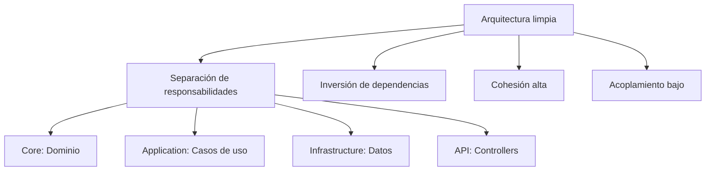

**Comparación final: Lombok vs C# nativo:**

| Característica | Java (Lombok) | C# (Nativo) |
|:---------------|:--------------|:------------|
| Getters/Setters | @Getter/@Setter | Propiedades automáticas |
| Constructor sin args | @NoArgsConstructor | Por defecto |
| Constructor completo | @AllArgsConstructor | Primary Constructor |
| ToString | @ToString | record (automático) |
| Equals/HashCode | @EqualsAndHashCode | record (automático) |
| POJO completo | @Data | record |
| Builder | @Builder | with expressions |
| Inmutabilidad | @Value | record (defecto) |

💡 **Tip del Examinador**: Usa records para DTOs y entidades de dominio. Son más seguros (inmutables) y menos propensos a errores.

## 2.5. Resumen

En este capítulo hemos aprendido:

1. **dotnet CLI**: Herramienta unificada para todo el ciclo de desarrollo
2. **Archivo .csproj**: Configuración del proyecto, dependencias y compilación
3. **Soluciones (.sln)**: Agrupación de múltiples proyectos
4. **NuGet**: Gestor de paquetes oficial de .NET
5. **Source Generators**: Generación automática de código
6. **Records**: POJOs inmutables en una línea
7. **Primary Constructors**: Eliminación de boilerplate
8. **Buenas prácticas**: Estructura src/tests, separación de responsabilidades

### 💡 Ejercicio Propuesto

**Crear una solución completa:**

```bash
# 1. Crear estructura
mkdir MiTienda
cd MiTienda

# 2. Crear solución
dotnet new sln -n MiTienda

# 3. Crear proyectos
dotnet new classlib -n MiTienda.Core -o src/MiTienda.Core
dotnet new classlib -n MiTienda.Infrastructure -o src/MiTienda.Infrastructure
dotnet new webapi -n MiTienda.Api -o src/MiTienda.Api
dotnet new nunit -n MiTienda.Tests -o tests/MiTienda.Tests

# 4. Agregar proyectos a la solución
dotnet sln add src/MiTienda.Core/MiTienda.Core.csproj
dotnet sln add src/MiTienda.Infrastructure/MiTienda.Infrastructure.csproj
dotnet sln add src/MiTienda.Api/MiTienda.Api.csproj
dotnet sln add tests/MiTienda.Tests/MiTienda.Tests.csproj

# 5. Agregar referencias
dotnet add src/MiTienda.Api/MiTienda.Api.csproj reference src/MiTienda.Core/MiTienda.Core.csproj
dotnet add src/MiTienda.Api/MiTienda.Api.csproj reference src/MiTienda.Infrastructure/MiTienda.Infrastructure.csproj
dotnet add tests/MiTienda.Tests/MiTienda.Tests.csproj reference src/MiTienda.Core/MiTienda.Core.csproj

# 6. Compilar todo
dotnet build
```

