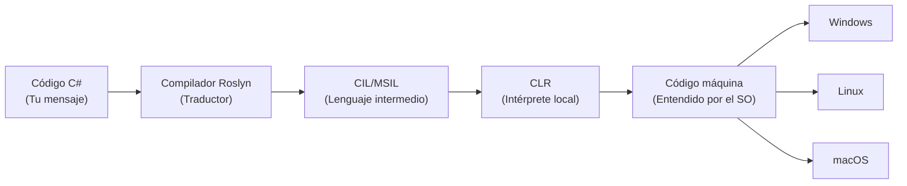
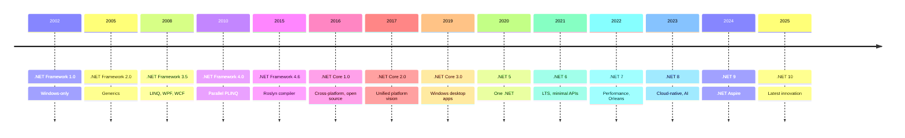
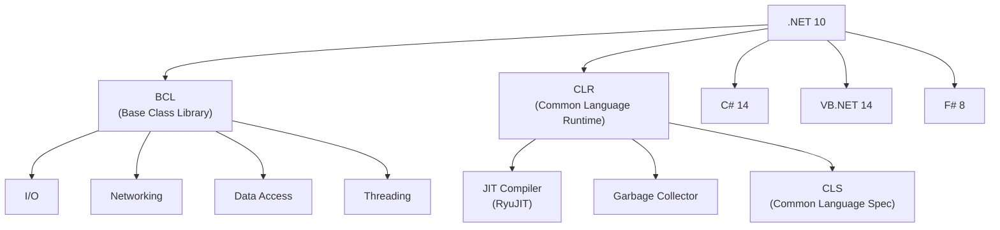
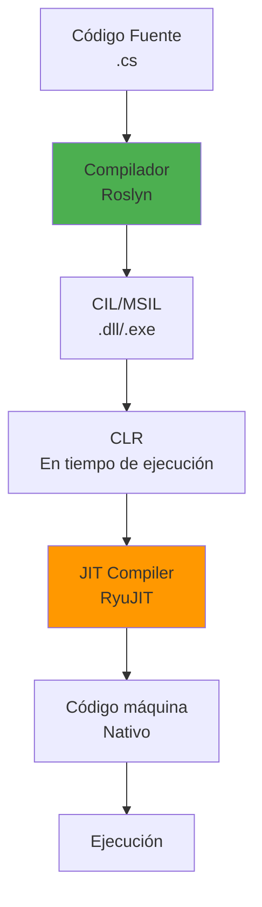

- [3. Introducción a C# y .NET](#3-introducción-a-c-y-net)
  - [3.1. ¿Qué es C# y por qué usarlo?](#31-qué-es-c-y-por-qué-usarlo)
    - [3.1.1. 🧠 Analogía: C# como un idioma universal](#311--analogía-c-como-un-idioma-universal)
    - [3.1.2. Historia de C#](#312-historia-de-c)
  - [3.2. Evolución de .NET: De .NET Framework a .NET 10](#32-evolución-de-net-de-net-framework-a-net-10)
  - [3.3. El y ejecución: El papel del CLR proceso de compilación](#33-el-y-ejecución-el-papel-del-clr-proceso-de-compilación)
    - [3.3.1. 🧠 Analogía: El proceso de traducción](#331--analogía-el-proceso-de-traducción)
    - [3.3.2. Optimizaciones del JIT](#332-optimizaciones-del-jit)
  - [3.4. Instalación y herramientas de desarrollo](#34-instalación-y-herramientas-de-desarrollo)
  - [3.5. Tu primer programa en C#](#35-tu-primer-programa-en-c)
    - [3.5.1. 🧠 Analogía: Desglose del código](#351--analogía-desglose-del-código)
  - [3.6. Resumen](#36-resumen)

# 3. Introducción a C# y .NET

## 3.1. ¿Qué es C# y por qué usarlo?

C# (pronunciado "C Sharp") es un lenguaje de programación de propósito general, orientado a objetos y de tipado estático, desarrollado por Microsoft como parte de la plataforma .NET. Está diseñado para ser moderno, seguro y eficiente, con un equilibrio perfecto entre productividad y rendimiento.

**Características principales de C#:**

- **Orientado a objetos y funcional**: C# soporta programación orientada a objetos pura, pero también incorpora características funcionales avanzadas como expresiones lambda, LINQ y pattern matching.
- **Multiplataforma**: Gracias a **.NET**, el código C# puede ejecutarse en Windows, macOS, Linux, dispositivos móviles (iOS/Android con .NET MAUI) y en la web (con Blazor).
- **Seguro y tipado**: El sistema de tipos fuerte y las características de seguridad nula (nullable reference types) ayudan a prevenir errores comunes en tiempo de compilación.
- **Alto rendimiento**: Con .NET 10, el runtime ha sido optimizado para ofrecer rendimientos comparables a lenguajes de bajo nivel.
- **Ecosistema rico**: Cuenta con un enorme ecosistema de librerías, frameworks (ASP.NET Core, Entity Framework, etc.) y herramientas de desarrollo de clase mundial.
- **Evolución constante**: C# evoluciona rápidamente, con nuevas características en cada versión que mejoran la expresividad y productividad del desarrollador.

### 3.1.1. 🧠 Analogía: C# como un idioma universal

Imagina que .NET es como un "traductor universal" que permite que tu código C# se entienda en cualquier país (sistema operativo). C# es el idioma que hablas, y el CLR (Common Language Runtime) es tu traductor simultáneo que convierte lo que dices a lo que entienden los locales.



📝 **Nota del Profesor**: C# es actualmente uno de los lenguajes más versátiles del mercado. Desde desarrollo web con ASP.NET Core, hasta aplicaciones móviles con MAUI, juegos con Unity, y microservicios en la nube. Dominar C# abre puertas a múltiples sectores.

💡 **Tip del Examinador**: En el examen,know the diferencia entre:
- **Lenguaje**: C# (la sintaxis que escribimos)
- **Plataforma**: .NET (el entorno de ejecución)
- **Runtime**: CLR (el motor que ejecuta el código)

### 3.1.2. Historia de C#

| Año | Versión | Hito Principal |
|-----|---------|----------------|
| 2002 | C# 1.0 | Primera versión, similar a Java |
| 2005 | C# 2.0 | Genéricos, tipos nulos |
| 2008 | C# 3.0 | LINQ, expresiones lambda |
| 2010 | C# 4.0 | dynamic, parámetros opcionales |
| 2012 | C# 5.0 | async/await, programación asíncrona |
| 2015 | C# 6.0 | Expression-bodied members, null-conditional |
| 2017 | C# 7.0 | Tuplas, pattern matching |
| 2019 | C# 8.0 | Indices, ranges, nullable reference types |
| 2020 | C# 9.0 | Records, init-only properties |
| 2021 | C# 10.0 | Global using, file-scoped namespaces |
| 2022 | C# 11.0 | Raw string literals, static abstract members |
| 2023 | C# 12.0 | Primary constructors, collection expressions |
| 2024 | C# 13.0 | Params collections, ref struct improvements |

📝 **Nota del Profesor**: Cada versión de C# añade características que simplifican el código. Por ejemplo, lo que antes requería 10 líneas de código ahora puede hacerse en 2 gracias a las nuevas características.

## 3.2. Evolución de .NET: De .NET Framework a .NET 10

**Historia de .NET:**



**¿Qué es .NET 10?**

.NET 10 es la última versión de la plataforma de desarrollo unificada de Microsoft. Representa la culminación de años de trabajo para crear un entorno de desarrollo verdaderamente multiplataforma, de alto rendimiento y con un ecosistema rico.

**Componentes principales de .NET 10:**



💡 **Tip del Examinador**: .NET 5 unificó .NET Framework, .NET Core y .NET Standard. A partir de .NET 5, solo existe ".NET" (no ".NET Core"). Always use the latest version for new projects.

## 3.3. El y ejecución: El papel del CLR proceso de compilación

Comprender este proceso es fundamental para entender cómo funciona .NET. C# utiliza un proceso de compilación en dos etapas, similar al modelo de Java pero con optimizaciones adicionales.

**El proceso en dos etapas:**



**Etapa 1: Compilación**

El código fuente, escrito en un archivo con extensión `.cs`, es procesado por el **compilador de C# (Roslyn)**. Este paso verifica la sintaxis, realiza análisis de tipos y transforma el código legible para humanos en un formato intermedio llamado **CIL (Common Intermediate Language)**, anteriormente conocido como MSIL.

```csharp
// HolaMundo.cs
namespace MiAplicacion;

class HolaMundo
{
    static void Main(string[] args)
    {
        Console.WriteLine("¡Hola, mundo!");
    }
}
```

Para compilarlo:

```bash
dotnet build
```

Esto creará un archivo `MiAplicacion.dll` en la carpeta `bin/Debug/net10.0/`.

📝 **Nota del Profesor**: El CIL es como el "esperanto" de los lenguajes .NET. Cualquier lenguaje .NET (C#, VB.NET, F#) se compila a CIL, y el CLR puede ejecutarlo. This is why you can mix languages in a single project!

**Etapa 2: Ejecución**

El archivo compilado (`.dll` o `.exe`) contiene código CIL que es interpretado y ejecutado por el **Common Language Runtime (CLR)**. El CLR es el corazón de .NET, equivalente a la JVM de Java.

En tiempo de ejecución, el CLR utiliza un compilador **Just-In-Time (JIT)** llamado **RyuJIT** que convierte el CIL a código máquina nativo específico del sistema operativo y arquitectura del procesador.

```bash
dotnet run
```

El CLR cargará el CIL, lo compilará a código nativo y lo ejecutará, mostrando la salida:

```
¡Hola, mundo!
```

### 3.3.1. 🧠 Analogía: El proceso de traducción

Imagina que eres un hablante de español (C#) que quiere dar una conferencia en Japón (Windows), China (Linux) y Estados Unidos (macOS):

1. **Roslyn** es tu asistente que transcribe tu discurso a un documento universal (CIL).
2. **El CLR** es tu traductor local que:
   - En Japón: Traduce a japonés nativo (código máquina Windows)
   - En China: Traduce a chino nativo (código máquina Linux)
   - En USA: Traduce a inglés nativo (código máquina macOS)

### 3.3.2. Optimizaciones del JIT

El compilador JIT de .NET 10 incluye varias optimizaciones:

- **Inlining**: Elimina llamadas a métodos pequeños insertando el código directamente.
- **Loop unrolling**: Desenrolla bucles para reducir overhead.
- **Tiered compilation**: Compila código "tibio" primero y luego "caliente" con más optimizaciones.
- **Branch prediction**: Predice saltos para optimizar el flujo.

💡 **Tip del Examinador**: El JIT compila "en caliente", es decir, solo compila el código que realmente se ejecuta. Esto mejora el tiempo de inicio comparado con lenguajes compilados completamente ahead-of-time (AOT).

⚠️ **Advertencia**: El proceso JIT ocurre en tiempo de ejecución, lo que significa que la primera ejecución de un método puede ser más lenta. Sin embargo, el código nativo generado se cachea para ejecuciones posteriores.

## 3.4. Instalación y herramientas de desarrollo

**Instalación de .NET SDK:**

```bash
# Verificar instalación
dotnet --version

# Información detallada
dotnet --info

# Listar SDKs instalados
dotnet --list-sdks
```

**Estructura de un proyecto .NET:**

```
MiProyecto/
├── MiProyecto.csproj    # Archivo de proyecto
├── Program.cs           # Punto de entrada
├── README.md
└── obj/                # Archivos temporales de compilación
    └── bin/            # Salida compilada
```

**El archivo .csproj:**

```xml
<Project Sdk="Microsoft.NET.Sdk">

  <PropertyGroup>
    <OutputType>Exe</OutputType>
    <TargetFramework>net10.0</TargetFramework>
    <Nullable>enable</Nullable>
    <ImplicitUsings>enable</ImplicitUsings>
  </PropertyGroup>

</Project>
```

📝 **Nota del Profesor**: El archivo `.csproj` es el corazón de tu proyecto. Define el SDK, el framework objetivo, y las dependencias. Desde .NET Core, el formato es muy minimalista comparado con el antiguo formato XML pesado.

## 3.5. Tu primer programa en C#

Vamos a crear un programa que demuestra los conceptos básicos:

```csharp
// Program.cs
using System;

namespace MiPrimeraApp
{
    // Entry point de la aplicación
    class Program
    {
        static void Main(string[] args)
        {
            Console.WriteLine("¡Bienvenido a C#!");
            Console.WriteLine($"Estás usando .NET {Environment.Version}");
            
            // Variables y tipos
            string nombre = "Estudiante";
            int edad = 20;
            bool esActivo = true;
            
            Console.WriteLine($"\nDatos del estudiante:");
            Console.WriteLine($"  Nombre: {nombre}");
            Console.WriteLine($"  Edad: {edad}");
            Console.WriteLine($"  Activo: {esActivo}");
            
            // Estructura de control
            if (edad >= 18)
            {
                Console.WriteLine("\nEres mayor de edad.");
            }
            else
            {
                Console.WriteLine("\nEres menor de edad.");
            }
        }
    }
}
```

**Para ejecutar:**

```bash
dotnet run
```

### 3.5.1. 🧠 Analogía: Desglose del código

| Concepto | Analogía |
|----------|----------|
| `namespace` | Una carpeta para organizar archivos |
| `class` | El "plano" del objeto |
| `static void Main()` | La "puerta principal" del programa |
| `Console.WriteLine()` | Imprimir en la pantalla |
| `string` | Una cadena de caracteres (texto) |
| `int` | Números enteros |
| `bool` | Valores verdadero/falso |

💡 **Tip del Examinador**: En C# moderno, puedes usar file-scoped namespaces y top-level statements para reducir el código repetitivo:

```csharp
// Program.cs (C# 10+)
Console.WriteLine("¡Hola, mundo!");
```

📝 **Nota del Profesor**: Los "top-level statements" permiten escribir código directamente sin necesidad de una clase Main(). Esto es ideal para scripts y aprendizaje, pero en proyectos grandes se recomienda la estructura tradicional.

## 3.6. Resumen
En este capítulo hemos cubierto los fundamentos de C# y .NET, incluyendo su historia, evolución, y el proceso de compilación y ejecución. También hemos creado nuestro primer programa en C#. Aquí tienes algunos puntos clave para recordar:
- C# es un lenguaje moderno, seguro y versátil, ideal para múltiples tipos de aplicaciones.
- .NET 10 es una plataforma unificada y multiplataforma que soporta C# y otros lenguajes.
- El proceso de compilación en dos etapas (Roslyn y CLR) permite que el código C# se ejecute eficientemente en cualquier sistema operativo.
- Herramientas como el SDK de .NET y Visual Studio facilitan el desarrollo y la gestión de proyectos.
- Crear programas en C# es sencillo y directo, con una sintaxis clara y poderosa.
- Dominar estos conceptos te preparará para avanzar en el desarrollo de aplicaciones robustas y eficientes con C# y .NET.
