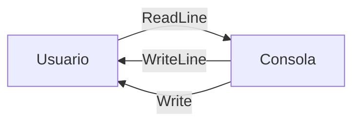
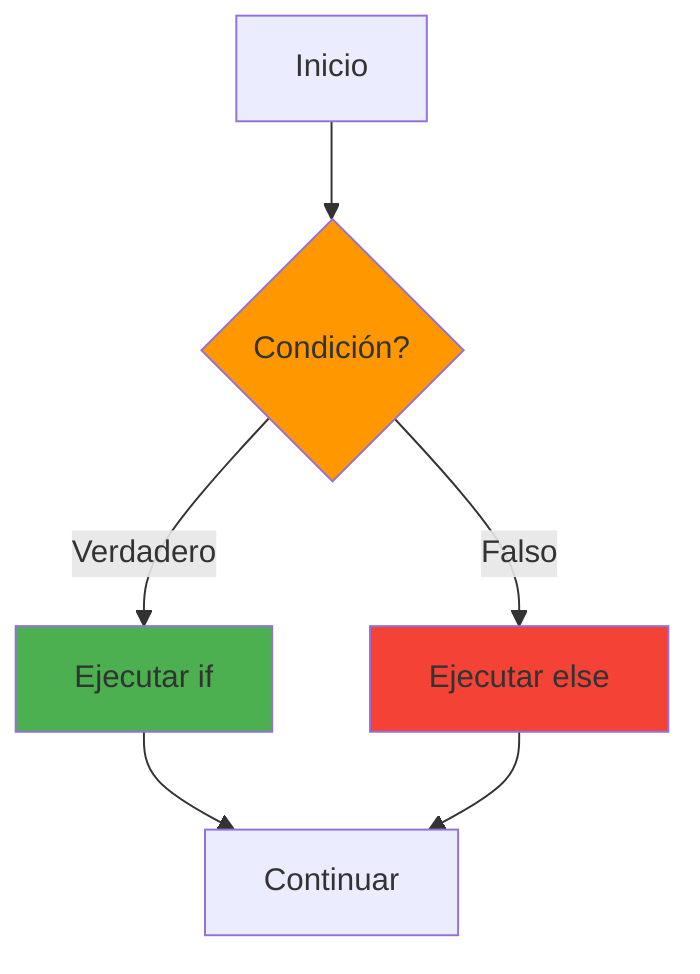
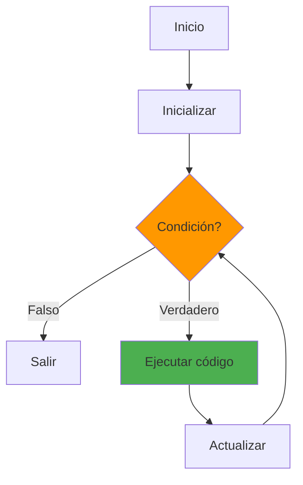
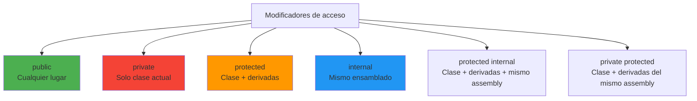
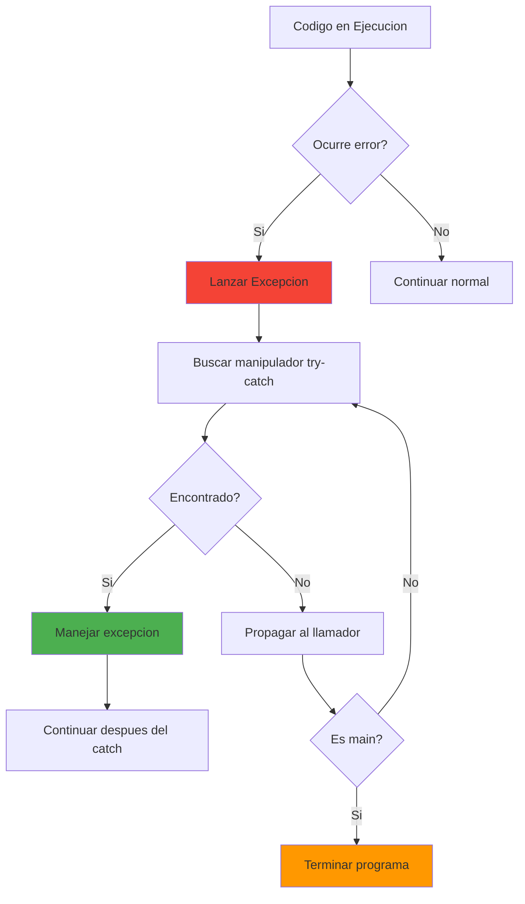
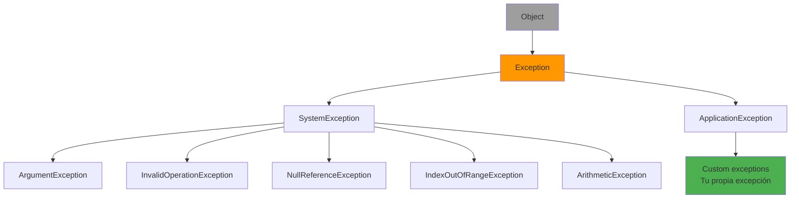
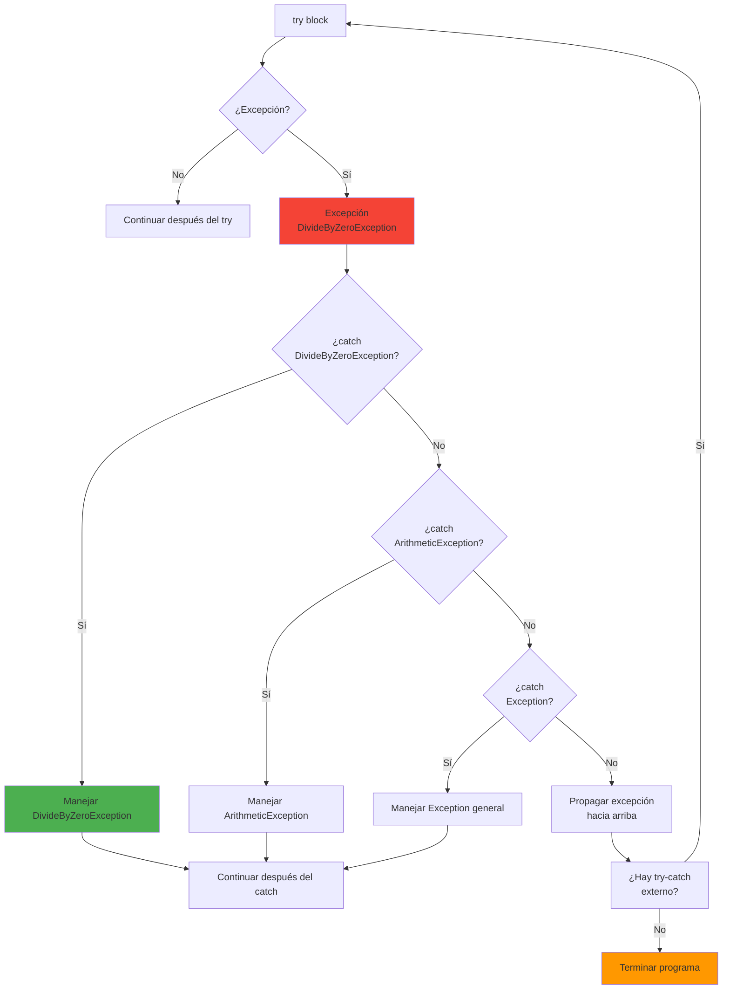

- [4. Fundamentos de la programación en C#](#4-fundamentos-de-la-programación-en-c)
  - [4.1. Entrada y Salida por Consola](#41-entrada-y-salida-por-consola)
  - [4.2. Analogía: Value Types vs Reference Types](#42-analogía-value-types-vs-reference-types)
  - [4.3. Estructuras de control](#43-estructuras-de-control)
    - [4.3.1. Condicionales](#431-condicionales)
    - [4.3.2. Bucles](#432-bucles)
  - [4.4. Arrays: Tipos compuestos](#44-arrays-tipos-compuestos)
  - [4.5. Modificadores de acceso](#45-modificadores-de-acceso)
  - [4.6. Modificadores de comportamiento](#46-modificadores-de-comportamiento)
  - [4.7. Excepciones](#47-excepciones)
    - [4.7.1. ¿Qué es una Excepción?](#471-qué-es-una-excepción)
    - [4.7.2. Excepciones Comunes en C#](#472-excepciones-comunes-en-c)
    - [4.7.3. Lanzar Excepciones con throw](#473-lanzar-excepciones-con-throw)
    - [4.7.4. Capturar Excepciones con try-catch](#474-capturar-excepciones-con-try-catch)
    - [4.7.5. Flujo de Excepciones: Orden de Captura](#475-flujo-de-excepciones-orden-de-captura)
    - [4.7.6. try-catch con Recursos: using](#476-try-catch-con-recursos-using)
    - [4.7.7. Excepciones Personalizadas](#477-excepciones-personalizadas)
    - [4.7.8. Re-lanzar Excepciones](#478-re-lanzar-excepciones)
    - [4.7.9. Excepciones y el Patrón Result vs Excepciones](#479-excepciones-y-el-patrón-result-vs-excepciones)
    - [4.7.10. Diferencia con Java: No Hay Checked vs Unchecked](#4710-diferencia-con-java-no-hay-checked-vs-unchecked)
    - [4.7.11. Mejores Prácticas con Excepciones](#4711-mejores-prácticas-con-excepciones)
      - [El Arquitecto Previsor: If vs Excepciones](#el-arquitecto-previsor-if-vs-excepciones)
    - [](#)
  - [4.8. Programación Orientada a Objetos (POO)](#48-programación-orientada-a-objetos-poo)
    - [4.8.1. Clases y Propiedades](#481-clases-y-propiedades)
    - [4.8.2. Constructores](#482-constructores)
    - [4.8.3. Backing Fields en C# 14](#483-backing-fields-en-c-14)
    - [4.8.4. Métodos](#484-métodos)
    - [4.8.5. Herencia y Polimorfismo](#485-herencia-y-polimorfismo)
    - [4.8.6. Clases Abstractas](#486-clases-abstractas)
    - [4.8.7. Interfaces](#487-interfaces)
    - [4.8.8. Structs](#488-structs)
    - [4.8.9. Records](#489-records)
    - [4.8.10. Sobrecarga de Operadores](#4810-sobrecarga-de-operadores)
    - [4.8.11. Miembros de Object: Equals, GetHashCode, ToString](#4811-miembros-de-object-equals-gethashcode-tostring)
    - [4.8.12. Miembros estáticos y clases estáticas](#4812-miembros-estáticos-y-clases-estáticas)
    - [4.8.13. Clases Inner](#4813-clases-inner)
    - [4.8.14. Clases Parciales](#4814-clases-parciales)
    - [4.8.15. Enums](#4815-enums)
  - [4.9. Parámetros](#49-parámetros)
  - [4.10. Strings y Plantillas](#410-strings-y-plantillas)
  - [4.11. Null Safety](#411-null-safety)
  - [4.12. Culturas e Internacionalización](#412-culturas-e-internacionalización)
  - [4.13. Tuplas y Objetos Anónimos](#413-tuplas-y-objetos-anónimos)
  - [4.14. Resumen](#414-resumen)

# 4. Fundamentos de la programación en C#

Este capítulo establece los cimientos sobre los que construirás todo tu conocimiento de C#. Dominar estos conceptos es esencial antes de avanzar hacia programación orientada a objetos y características más avanzadas del lenguaje.

## 4.1. Entrada y Salida por Consola

La entrada y salida por consola es la forma más básica de interactuar con un programa en C#.

Usamos `Console.WriteLine` para mostrar texto en la consola y `Console.ReadLine` para leer la entrada del usuario.
Usamos `Console.Read` y `Console.ReadKey` para leer caracteres individuales o teclas., se usa `TryParse` para convertir cadenas a tipos numéricos de forma segura, porque nos permite manejar errores sin lanzar excepciones. Si pasa el parseo, devuelve `true` y asigna el valor convertido a la variable de salida proporcionada junto con el `out` keyword.



**Salida por consola:**

```csharp
namespace Fundamentos.Consola
{
    public class EntradaSalida
    {
        // WriteLine - escribe y salto de línea
        public static void DemoWriteLine()
        {
            Console.WriteLine("Hola Mundo");           // Con salto de línea
            Console.Write("Sin salto de línea");     // Sin salto
            Console.WriteLine();                     // Línea vacía

            // Interpolación de strings
            string nombre = "Juan";
            int edad = 30;
            Console.WriteLine($"Hola, me llamo {nombre} y tengo {edad} años.");

            // Formatos
            decimal precio = 1234.56m;
            Console.WriteLine($"Precio: {precio:C2}");  // Moneda
            Console.WriteLine($"Decimal: {precio:F2}"); // 2 decimales
            Console.WriteLine($"Entero: {precio:D5}");  // 5 dígitos con ceros

            // Tablas y alineación
            Console.WriteLine($"{"Nombre",-10} | {"Edad",5}");
            Console.WriteLine($"{nombre,-10} | {edad,5}");
            // Sale: Juan        |    30
        }

        // ReadLine - entrada por teclado
        public static void DemoReadLine()
        {
            Console.Write("¿Cómo te llamas? ");
            string? nombre = Console.ReadLine();

            Console.Write("¿Cuántos años tienes? ");
            string? edadStr = Console.ReadLine();

            // Parseo de strings a tipos
            if (int.TryParse(edadStr, out int edad))
            {
                Console.WriteLine($"Hola {nombre}, el año que viene tendrás {edad + 1} años.");
            }
            else
            {
                Console.WriteLine("Edad no válida.");
            }

            // Read - leer un solo carácter
            Console.WriteLine("\nPresiona una tecla...");
            ConsoleKeyInfo key = Console.ReadKey();
            Console.WriteLine($"\nHas pulsado: {key.Key}");

            // ReadKey con interceptación (no muestra la tecla)
            Console.Write("\nContraseña: ");
            Console.TreatControlCAsInput = true;
            var password = new System.Text.StringBuilder();
            ConsoleKeyInfo k;
            do
            {
                k = Console.ReadKey(true);
                if (k.Key == ConsoleKey.Enter) break;
                if (k.Key == ConsoleKey.Backspace)
                {
                    if (password.Length > 0)
                    {
                        password.Length--;
                        Console.Write("\b \b");
                    }
                }
                else if (k.KeyChar != '\0')
                {
                    password.Append(k.KeyChar);
                    Console.Write("*");
                }
            } while (k.Key != ConsoleKey.Enter);
            Console.WriteLine();
        }

        // Colores en consola
        public static void DemoColores()
        {
            Console.ForegroundColor = ConsoleColor.Green;
            Console.WriteLine("Texto en verde");

            Console.BackgroundColor = ConsoleColor.DarkGray;
            Console.ForegroundColor = ConsoleColor.White;
            Console.WriteLine("Fondo gris, texto blanco");

            // Restaurar colores por defecto
            Console.ResetColor();

            // Limpiar pantalla
            // Console.Clear();
        }

        // Tablas con formato
        public static void DemoTabla()
        {
            string[] headers = { "Nombre", "Edad", "Ciudad" };
            var datos = new[]
            {
                ("Ana", 25, "Madrid"),
                ("Carlos", 30, "Barcelona"),
                ("María", 28, "Valencia")
            };

            // Encabezado
            Console.WriteLine($"{headers[0],-10} | {headers[1],5} | {headers[2],10}");
            Console.WriteLine(new string('-', 32));

            // Datos
            foreach (var (nom, ed, ciu) in datos)
            {
                Console.WriteLine($"{nom,-10} | {ed,5} | {ciu,10}");
            }
        }

        public static void Demo()
        {
            DemoWriteLine();
            DemoReadLine();
            DemoColores();
            DemoTabla();
        }
    }
}
```

## 4.2. Analogía: Value Types vs Reference Types

Los tipos por valor almacenan el dato directamente, mientras que los tipos por referencia almacenan una dirección de memoria.

- **Tipos por valor** son como fotocopiar un documento. La copia es independiente del original.
- **Tipos por referencia** son como darle a alguien la dirección de archivo. Si alguien modifica el archivo, todos ven los cambios.

- **Tipos por valor** son como photocopiar el documento. Si cambias la copia, el original no se ve afectado.
- **Tipos por referencia** son como darle a alguien la ubicación del archivo original en el archivador.

```csharp
// Value Types: Copia independiente
int a = 10;
int b = a;  // Copia del valor
b = 20;
Console.WriteLine(a);  // 10 (a no cambió)

// Reference Types: Misma referencia
int[] array1 = { 1, 2, 3 };
int[] array2 = array1;  // Copia la referencia
array2[0] = 99;
Console.WriteLine(array1[0]);  // 99 (array1 también cambió)
```

## 4.3. Estructuras de control

Las estructuras de control dirigen el flujo de ejecución del programa.

### 4.3.1. Condicionales



**If-else:**

```csharp
int nota = 7;

if (nota >= 9)
    Console.WriteLine("Sobresaliente");
else if (nota >= 7)
    Console.WriteLine("Notable");
else if (nota >= 5)
    Console.WriteLine("Aprobado");
else
    Console.WriteLine("Suspenso");

// Operador ternario
string resultado = nota >= 5 ? "Aprobado" : "Suspenso";

// Null-coalescing condicional
string nombre = input ?? "Desconocido";
```

**Switch expressions (C# 8+):**

```csharp
int dia = 3;

string nombreDia = dia switch
{
    1 => "Lunes",
    2 => "Martes",
    3 => "Miércoles",
    4 => "Jueves",
    5 => "Viernes",
    6 => "Sábado",
    7 => "Domingo",
    _ => "Día no válido"
};

// Switch con when (condiciones)
string categoria = nota switch
{
    int n when n >= 9 => "Sobresaliente",
    int n when n >= 7 => "Notable",
    int n when n >= 5 => "Aprobado",
    _ => "Suspenso"
};

// Pattern matching en switch
object obj = 42;
string tipo = obj switch
{
    int i => $"Entero: {i}",
    string s => $"String: {s}",
    null => "Null",
    _ => $"Otro: {obj.GetType().Name}"
};
```

### 4.3.2. Bucles



**For:**

```csharp
for (int i = 0; i < 5; i++)
{
    Console.WriteLine($"Iteración {i}");
}

// For inverso
for (int i = 5; i >= 0; i--)
{
    Console.WriteLine(i);
}

// For con múltiples variables
for (int i = 0, j = 10; i < j; i++, j--)
{
    Console.WriteLine($"i={i}, j={j}");
}
```

**Foreach:**

```csharp
string[] nombres = { "Ana", "Pedro", "Luis" };

foreach (var nombre in nombres)
{
    Console.WriteLine($"Hola, {nombre}");
}

// Con índice
foreach (var (nombre, indice) in nombres.Select((n, i) => (n, i)))
{
    Console.WriteLine($"{indice}: {nombre}");
}
```

**While:**

```csharp
int contador = 0;
while (contador < 3)
{
    Console.WriteLine(contador);
    contador++;
}
```

**Do-while:**

```csharp
string? input;
do
{
    Console.Write("Ingresa 'salir' para terminar: ");
    input = Console.ReadLine();
} while (input?.ToLower() != "salir");
```

**Break, continue, return:**

```csharp
for (int i = 0; i < 10; i++)
{
    if (i == 3) continue;  // Saltar iteración
    if (i == 7) break;     // Salir del bucle
    Console.WriteLine(i);
}
```

## 4.4. Arrays: Tipos compuestos

Los arrays permiten almacenar múltiples valores del mismo tipo.

```csharp
// Unidimensionales
int[] numeros = new int[3];
numeros[0] = 10;
numeros[1] = 20;
numeros[2] = 30;

// Inicialización rápida
string[] frutas = { "Manzana", "Naranja", "Plátano" };

// Matrices 2D
// en C# usamos mejor estos arrays, [,] para matrices rectangulares
// nos permiten tener filas y columnas
int[,] matriz = {
    { 1, 2, 3 },
    { 4, 5, 6 }
};
Console.WriteLine(matriz[0, 1]);  // 2

// Jagged Arrays (array de arrays)
// nos permiten tener arrays irregulares
int[][] jagged = new int[2][];
jagged[0] = new int[] { 1, 2, 3 };
jagged[1] = new int[] { 4, 5 };

// Propiedades
Console.WriteLine(frutas.Length);       // 3
Console.WriteLine(frutas.Rank);         // 1
Console.WriteLine(matriz.GetLength(0)); // 2 (filas)
Console.WriteLine(matriz.GetLength(1)); // 3 (columnas)

// Métodos útiles
Array.Sort(numeros);
Array.Reverse(numeros);
Array.Clear(numeros);
Array.Copy(numeros, numeros2, 3);
```

## 4.5. Modificadores de acceso
Los modificadores de acceso controlan la visibilidad de clases, métodos y propiedades.



```csharp
public class Persona
{
    public string Nombre { get; set; }      // Accesible desde cualquier lugar
    private int _edad;                       // Solo dentro de Persona
    protected string _dni;                   // Persona y derivadas
    internal DateTime FechaCreacion { get; } // Mismo ensamblado
    protected internal string Telefono { get; }
    private protected string Pin { get; }
}
```

## 4.6. Modificadores de comportamiento
Los modificadores de comportamiento cambian cómo se comportan las clases y sus miembros. 

```csharp
public class EjemploModificadores
{
    // static - compartido por todas las instancias, son de la clase
    public static int Contador = 0;

    // const - constante en tiempo de compilación
    public const double Pi = 3.14159;

    // readonly - asignable en declaración o constructor
    public readonly string Version;
    public static readonly DateTime Inicio;

    public EjemploModificadores(string version)
    {
        Version = version;
        Contador++;
    }

    static EjemploModificadores()
    {
        Inicio = DateTime.UtcNow;
    }
}
```

## 4.7. Excepciones

Las **excepciones** son eventos que ocurren durante la ejecución de un programa y que interrumpen el flujo normal de instrucciones. Representan errores o condiciones excepcionales que deben ser manejadas para evitar que la aplicación termine abruptamente.



### 4.7.1. ¿Qué es una Excepción?

Una **excepción** es un objeto que encapsula información sobre un error que ha ocurrido durante la ejecución. Deriva de la clase base `System.Exception`.

🧠 **Analogía**: Imagina que estás conduciendo y de repente aparece un obstáculo en la carretera. La excepción es como activar el airbag: cambia el flujo normal (seguir conduciendo) a un estado de emergencia (detenerse y manejar la situación).

**Jerarquía de excepciones:**



### 4.7.2. Excepciones Comunes en C#

| Excepción | Descripción | Ejemplo |
|-----------|-------------|---------|
| `ArgumentException` | Argumento inválido pasado a método | `null` donde no se permite |
| `ArgumentNullException` | Argumento `null` | `Metodo(null)` cuando no permite `null` |
| `ArgumentOutOfRangeException` | Argumento fuera de rango | Índice negativo en array |
| `InvalidOperationException` | Operación inválida estado actual | Modificar colección mientras se itera |
| `NotImplementedException` | Método no implementado | Código placeholder |
| `NullReferenceException` | Referencia a `null` | `obj.Metodo()` cuando `obj` es `null` |
| `IndexOutOfRangeException` | Índice fuera de límites | `array[10]` cuando solo tiene 5 |
| `DivideByZeroException` | División por cero | `x / 0` con enteros |
| `InvalidCastException` | Conversión de tipos fallida | `(Tipo)obj` cuando no es compatible |
| `OverflowException` | Desbordamiento en operación | `int.MaxValue + 1` |
| `FormatException` | Formato inválido | `int.Parse("abc")` |
| `KeyNotFoundException` | Clave no encontrada en diccionario | `dict["clave"]` inexistente |

```csharp
namespace Fundamentos.Excepciones
{
    public class DemoExcepcionesComunes
    {
        public void DemonstrarExcepciones()
        {
            // NullReferenceException - Referencia nula
            string? texto = null;
            // Console.WriteLine(texto.Length); // ❌ NullReferenceException

            // ArgumentNullException - Argumento nulo
            void Procesar(string? dato)
            {
                if (dato == null)
                    throw new ArgumentNullException(nameof(dato), "El dato no puede ser null");
            }

            // ArgumentOutOfRangeException - Índice fuera de rango
            int[] numeros = { 1, 2, 3 };
            // int valor = numeros[10]; // ❌ IndexOutOfRangeException

            // InvalidOperationException - Operación inválida
            var lista = new List<int> { 1, 2, 3 };
            foreach (var num in lista)
            {
                // lista.Add(num); // ❌ InvalidOperationException
            }

            // FormatException - Formato inválido
            // int.Parse("no-es-un-numero"); // ❌ FormatException

            // DivideByZeroException - División por cero
            // int resultado = 5 / 0; // ❌ DivideByZeroException
        }
    }
}
```

### 4.7.3. Lanzar Excepciones con throw

La palabra clave `throw` se usa para lanzar una excepción manualmente.

```csharp
namespace Fundamentos.Excepciones
{
    public class CuentaBancaria
    {
        private decimal _saldo;
        public decimal Saldo => _saldo;

        public void Depositar(decimal cantidad)
        {
            if (cantidad <= 0)
            {
                throw new ArgumentException("La cantidad debe ser mayor que cero", nameof(cantidad));
            }
            if (cantidad > 10000)
            {
                throw new ArgumentOutOfRangeException(nameof(cantidad), 
                    "El depósito máximo es 10,000");
            }
            _saldo += cantidad;
        }

        public void Retirar(decimal cantidad)
        {
            if (cantidad <= 0)
            {
                throw new ArgumentException("La cantidad debe ser mayor que cero", nameof(cantidad));
            }
            if (cantidad > _saldo)
            {
                throw new InvalidOperationException($"Saldo insuficiente. Saldo: {_saldo}, Solicitado: {cantidad}");
            }
            _saldo -= cantidad;
        }

        // Lanzar excepciones personalizadas
        public void Transferir(CuentaBancaria destino, decimal cantidad)
        {
            if (destino == null)
                throw new ArgumentNullException(nameof(destino), "La cuenta de destino no puede ser null");
            
            if (cantidad <= 0)
                throw new ArgumentException("La cantidad debe ser positiva", nameof(cantidad));
            
            if (cantidad > _saldo)
                throw new SaldoInsuficienteException(
                    $"No hay suficiente saldo para la transferencia. Saldo: {_saldo}, Transferencia: {cantidad}");
            
            _saldo -= cantidad;
            destino._saldo += cantidad;
        }
    }

    // Excepción personalizada
    public class SaldoInsuficienteException : InvalidOperationException
    {
        public decimal SaldoSolicitado { get; }
        public decimal SaldoActual { get; }

        public SaldoInsuficienteException(string mensaje) : base(mensaje) { }

        public SaldoInsuficienteException(string mensaje, decimal saldoSolicitado, decimal saldoActual)
            : base(mensaje)
        {
            SaldoSolicitado = saldoSolicitado;
            SaldoActual = saldoActual;
        }
    }
}
```

📝 **Nota del Profesor**: Es una buena práctica lanzar excepciones específicas en lugar de genéricas. Esto permite un manejo más preciso de errores y mejor información de depuración.

### 4.7.4. Capturar Excepciones con try-catch

El bloque `try-catch` se usa para capturar y manejar excepciones.

```csharp
namespace Fundamentos.Excepciones
{
    public class ManejoExcepciones
    {
        public void EjemplosTryCatch()
        {
            // try-catch básico
            try
            {
                int resultado = Dividir(10, 0);
            }
            catch (DivideByZeroException ex)
            {
                Console.WriteLine($"Error: No se puede dividir por cero - {ex.Message}");
            }

            // Múltiples catch (de más específica a más general)
            try
            {
                ProcesarDatos("archivo.txt");
            }
            catch (FileNotFoundException ex)
            {
                Console.WriteLine($"Archivo no encontrado: {ex.FileName}");
            }
            catch (UnauthorizedAccessException ex)
            {
                Console.WriteLine($"Acceso denegado: {ex.Message}");
            }
            catch (IOException ex)
            {
                Console.WriteLine($"Error de E/S: {ex.Message}");
            }
            catch (Exception ex)
            {
                Console.WriteLine($"Error general: {ex.Message}");
            }

            // catch con filtros (when)
            try
            {
                var resultado = Calcular(100);
            }
            catch (ArgumentException ex) when (ex.ParamName == "valor")
            {
                Console.WriteLine($"Error en el parámetro 'valor': {ex.Message}");
            }
            catch (ArgumentException ex) when (ex.ParamName == "divisor")
            {
                Console.WriteLine($"Error en el parámetro 'divisor': {ex.Message}");
            }

            // Bloque finally (siempre se ejecuta)
            StreamReader? reader = null;
            try
            {
                reader = new StreamReader("archivo.txt");
                string contenido = reader.ReadToEnd();
                Console.WriteLine(contenido);
            }
            catch (FileNotFoundException)
            {
                Console.WriteLine("El archivo no existe.");
            }
            finally
            {
                reader?.Close();
                Console.WriteLine("Recursos liberados.");
            }

            // using (alternativa a try-finally para IDisposable)
            try
            {
                using var file = new StreamReader("archivo.txt");
                string contenido = file.ReadToEnd();
                Console.WriteLine(contenido);
            }
            catch (FileNotFoundException)
            {
                Console.WriteLine("El archivo no existe.");
            }
            // El archivo se cierra automáticamente aquí
        }

        private int Dividir(int a, int b)
        {
            if (b == 0)
                throw new DivideByZeroException("No se puede dividir por cero");
            return a / b;
        }

        private void ProcesarDatos(string archivo)
        {
            if (!File.Exists(archivo))
                throw new FileNotFoundException("El archivo no existe", archivo);
            
            // Simular otro error
            throw new UnauthorizedAccessException("No tiene permisos");
        }

        private int Calcular(int valor)
        {
            if (valor < 0)
                throw new ArgumentException("Valor negativo", nameof(valor));
            
            int divisor = 0;
            if (divisor == 0)
                throw new ArgumentException("Divisor no puede ser cero", nameof(divisor));
            
            return valor / divisor;
        }
    }
}
```

### 4.7.5. Flujo de Excepciones: Orden de Captura

⚠️ **Advertencia Importante**: Las excepciones deben capturarse **de la más específica a la más general**. Si colocas `catch (Exception)` primero, nunca llegarás a los bloques más específicos.

```csharp
// ❌ INCORRECTO - Exception捕获 todo
try
{
    CodigoQuePuedeFallar();
}
catch (Exception ex)  // Esto captura TODAS las excepciones
{
    Console.WriteLine(ex.Message);
}
catch (DivideByZeroException ex)  // ❌ NUNCA se ejecutará
{
    Console.WriteLine("División por cero");
}

// ✅ CORRECTO - De específica a general
try
{
    CodigoQuePuedeFallar();
}
catch (DivideByZeroException ex)  // Primero las específicas
{
    Console.WriteLine("División por cero");
}
catch (ArgumentNullException ex)  // Luego las específicas
{
    Console.WriteLine("Argumento nulo");
}
catch (InvalidOperationException ex)
{
    Console.WriteLine("Operación inválida");
}
catch (Exception ex)  // Finalmente el caso general
{
    Console.WriteLine($"Error general: {ex.Message}");
}
```

**Diagrama del flujo de excepciones:**



### 4.7.6. try-catch con Recursos: using

La declaración `using` garantiza que los recursos se liberen correctamente, incluso si ocurre una excepción.

```csharp
namespace Fundamentos.Excepciones
{
    public class UsingExamples
    {
        // Formato antiguo (C# 8-)
        public void FormatoAntiguo()
        {
            using (var stream = new StreamReader("archivo.txt"))
            {
                string contenido = stream.ReadToEnd();
                Console.WriteLine(contenido);
            } // stream.Dispose() se llama automáticamente
        }

        // Formato moderno (C# 9+)
        public void FormatoModerno()
        {
            using var stream = new StreamReader("archivo.txt");
            string contenido = stream.ReadToEnd();
            Console.WriteLine(contenido);
        } // stream.Dispose() se llama automáticamente

        // with-lock
        public void EjemploConLock()
        {
            using var lockObj = new ReaderWriterLockSlim();
            lockObj.EnterReadLock();
            try
            {
                // Leer datos compartidos
                Console.WriteLine("Leyendo...");
            }
            finally
            {
                lockObj.ExitReadLock();
            }
        }

        // Múltiples using
        public void MultiplesUsing()
        {
            using var reader1 = new StreamReader("archivo1.txt");
            using var reader2 = new StreamReader("archivo2.txt");
            
            string a = reader1.ReadToEnd();
            string b = reader2.ReadToEnd();
            
            Console.WriteLine(a + b);
        }
    }
}
```

### 4.7.7. Excepciones Personalizadas

Puedes crear tus propias excepciones heredando de `Exception` o de una excepción más específica.

```csharp
namespace Fundamentos.Excepciones
{
    // Excepción personalizada básica
    public class MiExcepcionPersonalizada : Exception
    {
        public MiExcepcionPersonalizada() : base() { }
        
        public MiExcepcionPersonalizada(string mensaje) : base(mensaje) { }
        
        public MiExcepcionPersonalizada(string mensaje, Exception inner) 
            : base(mensaje, inner) { }
    }

    // Excepción con propiedades adicionales
    public class ValidacionException : Exception
    {
        public string Campo { get; }
        public string Valor { get; }
        public string CodigoError { get; }

        public ValidacionException(string campo, string valor, string mensaje)
            : base($"Error de validación en {campo}: {mensaje}")
        {
            Campo = campo;
            Valor = valor;
            CodigoError = $"VAL-{campo.ToUpper()}-{DateTime.Now:yyyyMMdd}";
        }

        public ValidacionException(string campo, string valor, string mensaje, Exception inner)
            : base($"Error de validación en {campo}: {mensaje}", inner)
        {
            Campo = campo;
            Valor = valor;
            CodigoError = $"VAL-{campo.ToUpper()}-{DateTime.Now:yyyyMMdd}";
        }
    }

    // Excepción de dominio (negocio)
    public class DominioException : Exception
    {
        public string Codigo { get; }

        public DominioException(string codigo, string mensaje) : base(mensaje)
        {
            Codigo = codigo;
        }

        public DominioException(string codigo, string mensaje, Exception inner) 
            : base(mensaje, inner)
        {
            Codigo = codigo;
        }
    }

    public class ProductoNoEncontradoException : DominioException
    {
        public int ProductoId { get; }

        public ProductoNoEncontradoException(int productoId) 
            : base("PRODUCTO_NO_ENCONTRADO", $"Producto con ID {productoId} no encontrado")
        {
            ProductoId = productoId;
        }
    }

    public class StockInsuficienteException : DominioException
    {
        public int ProductoId { get; }
        public int StockActual { get; }
        public int StockSolicitado { get; }

        public StockInsuficienteException(int productoId, int stockActual, int stockSolicitado)
            : base("STOCK_INSUFICIENTE", 
                  $"Stock insuficiente para producto {productoId}. Actual: {stockActual}, Solicitado: {stockSolicitado}")
        {
            ProductoId = productoId;
            StockActual = stockActual;
            StockSolicitado = stockSolicitado;
        }
    }

    // Uso de excepciones personalizadas
    public class InventarioService
    {
        private readonly Dictionary<int, int> _stock = new();

        public int ObtenerStock(int productoId)
        {
            if (!_stock.ContainsKey(productoId))
                throw new ProductoNoEncontradoException(productoId);
            
            return _stock[productoId];
        }

        public void ReducirStock(int productoId, int cantidad)
        {
            if (!_stock.ContainsKey(productoId))
                throw new ProductoNoEncontradoException(productoId);
            
            if (_stock[productoId] < cantidad)
                throw new StockInsuficienteException(productoId, _stock[productoId], cantidad);
            
            _stock[productoId] -= cantidad;
        }

        public void EjemploTryCatch()
        {
            try
            {
                ReducirStock(1, 100);
            }
            catch (ProductoNoEncontradoException ex)
            {
                Console.WriteLine($"❌ {ex.Message} (Código: {ex.Codigo})");
                // Loggear o notificar al usuario
            }
            catch (StockInsuficienteException ex)
            {
                Console.WriteLine($"⚠️ {ex.Message}");
                Console.WriteLine($"   Stock actual: {ex.StockActual}");
                Console.WriteLine($"   Solicitado: {ex.StockSolicitado}");
            }
        }
    }
}
```

### 4.7.8. Re-lanzar Excepciones

Puedes capturar una excepción, realizar alguna acción, y luego volver a lanzarla.

```csharp
namespace Fundamentos.Excepciones
{
    public class ReLanzarExcepciones
    {
        public void EjemploReLanzar()
        {
            try
            {
                ProcesarPeticion();
            }
            catch (Exception ex)
            {
                // Registrar el error
                Console.WriteLine($"Error registrado: {ex.Message}");
                
                // Volver a lanzar la misma excepción
                throw;
            }
        }

        public void EjemploAgregarInformacion()
        {
            try
            {
                ProcesarPeticion();
            }
            catch (Exception ex) when (AgregarContexto(ex))
            {
                // Solo se ejecuta si AgregarContexto retorna true
            }
        }

        private bool AgregarContexto(Exception ex)
        {
            // Agregar información adicional a la excepción
            Console.WriteLine("Agregando contexto...");
            return true; // Permite que el catch se ejecute
        }

        public void EjemploInnerException()
        {
            try
            {
                MetodoNivel1();
            }
            catch (Exception ex)
            {
                Console.WriteLine($"Error: {ex.Message}");
                
                // Verificar si hay inner exception
                if (ex.InnerException != null)
                {
                    Console.WriteLine($"Causa original: {ex.InnerException.Message}");
                }
            }
        }

        private void MetodoNivel1()
        {
            try
            {
                MetodoNivel2();
            }
            catch (Exception ex)
            {
                // Envolver la excepción original
                throw new ApplicationException("Error en nivel 1", ex);
            }
        }

        private void MetodoNivel2()
        {
            throw new InvalidOperationException("Error en nivel 2");
        }
    }
}
```

### 4.7.9. Excepciones y el Patrón Result vs Excepciones

Hay debate sobre cuándo usar excepciones vs **valores de retorno de error**. C# favorece excepciones, pero algunos patrones modernos usan `Result<T>`.

```csharp
namespace Fundamentos.Excepciones
{
    // Enfoque 1: Excepciones (estándar en C#)
    public class ServicioConExcepciones
    {
        public User BuscarUsuario(int id)
        {
            var usuario = _repositorio.Buscar(id);
            if (usuario == null)
                throw new UsuarioNoEncontradoException(id);
            return usuario;
        }
    }

    // Enfoque 2: Result pattern (alternativa)
    public class Result<T>
    {
        public T? Value { get; }
        public Exception? Error { get; }
        public bool IsSuccess => Error == null;

        private Result(T? value, Exception? error)
        {
            Value = value;
            Error = error;
        }

        public static Result<T> Success(T value) => new(value, null);
        public static Result<T> Failure(Exception error) => new(default, error);
    }

    public class ServicioConResult
    {
        public Result<User> BuscarUsuario(int id)
        {
            try
            {
                var usuario = _repositorio.Buscar(id);
                if (usuario == null)
                    return Result<User>.Failure(new UsuarioNoEncontradoException(id));
                return Result<User>.Success(usuario);
            }
            catch (Exception ex)
            {
                return Result<User>.Failure(ex);
            }
        }
    }

    // Uso del Result pattern
    public class ClienteDelServicio
    {
        public void Ejemplo()
        {
            var resultado = _servicio.BuscarUsuario(123);
            
            if (resultado.IsSuccess)
            {
                Console.WriteLine($"Usuario encontrado: {resultado.Value!.Nombre}");
            }
            else
            {
                Console.WriteLine($"Error: {resultado.Error!.Message}");
            }

            // Con pattern matching (C# 8+)
            if (resultado is { IsSuccess: true, Value: var usuario })
            {
                Console.WriteLine(usuario.Nombre);
            }
        }
    }
}
```

### 4.7.10. Diferencia con Java: No Hay Checked vs Unchecked

⚠️ **Diferencia Importante con Java**: A diferencia de Java, **C# NO tiene el concepto de excepciones checked (verificadas) y unchecked (no verificadas)**.

**En Java:**
```java
// Java tiene checked exceptions obligatorias
public void leerArchivo(String path) throws IOException, FileNotFoundException {
    // El compilador OBLIGA a manejar o declarar estas excepciones
    FileReader reader = new FileReader(path);
    BufferedReader br = new BufferedReader(reader);
    br.readLine();
}

// Si no las manejas, el código no compila
```

**En C#:**
```csharp
// C# NO tiene checked exceptions
public void LeerArchivo(string path)
{
    // No hay obligación de capturar ni declarar excepciones
    var reader = new StreamReader(path);
    var contenido = reader.ReadToEnd(); // Puede lanzar FileNotFoundException
}

// ¿Por qué C# no tiene checked exceptions?

// 🧠 Analogía:
// En Java: Las excepciones son como require("seguro") - obligatorio
// En C#: Las excepciones son como insurance("seguro") - opcional

// Ventajas de no tener checked exceptions:
// ✅ Código más limpio (no throws en cada método)
// ✅ Más flexible (decides cómo manejar errores
// ✅ Sigue el principio: fail fast, handle appropriately

// Desventajas:
// ❌ El compilador no te obliga a pensar en errores
// ❌ Documentación más importante
// ❌ Riesgo de olvidar manejar excepciones
```

📝 **Nota del Profesor**: En C# todas las excepciones son "unchecked". Esto significa que:
1. No estás obligado a capturar ninguna excepción específica
2. No estás obligado a declarar excepciones con `throws`
3. **Tú decides** qué excepciones capturar y cuáles dejar propagar
4. Es tu responsabilidad como desarrollador manejar los casos de error apropiadamente

**Buenas prácticas en C#:**

```csharp
// ✅ Capturar solo las excepciones que puedes manejar
try
{
    _servicio.Procesar(datos);
}
catch (TimeoutException)  // Capturamos lo que podemos manejar
{
    _logger.LogWarning("Timeout al procesar, reintentando...");
    Thread.Sleep(1000);
    _servicio.Procesar(datos);
}
// No capturamos Exception general si no sabemos qué hacer

// ❌ NO capturar todo indiscriminadamente
try
{
    _servicio.Procesar(datos);
}
catch (Exception ex)  // Captura TODO - MAL PRÁCTICA
{
    Console.WriteLine(ex.Message); // Silencia el error
}
```

### 4.7.11. Mejores Prácticas con Excepciones

#### El Arquitecto Previsor: If vs Excepciones

Un **arquitecto previsor** sabe que **lanzar una excepción es costoso**. Cada excepción implica:

1. **Crear el objeto de excepción** (reasignación y cambio de contexto en memoria)
2. **Capturar el stack trace** (recorrido de la pila de llamadas)
3. **Desenrollar la pila** (buscar manipuladores try-catch)
4. **Posible impacto en rendimiento** si ocurre frecuentemente

🧠 **Analogía**: Lanzar una excepción es como activar la alarma de un edificio. Funciona, pero consume muchos recursos. A veces es mejor simplemente verificar la puerta antes de entrar.

Por eso, **siempre que puedas validar con un `if`, úsalo** en lugar de depender de excepciones para control de flujo.

**Ejemplo clásico: División por cero**

```csharp
// ❌ MAL: Usar excepción para control de flujo
public decimal DividirConExcepcion(decimal numerador, decimal denominador)
{
    try
    {
        return numerador / denominador;
    }
    catch (DivideByZeroException)
    {
        return 0; // o throw new Exception("No se puede dividir")
    }
}

// ✅ BIEN: Usar if para validación anticipada
public decimal DividirConIf(decimal numerador, decimal denominador)
{
    if (denominador == 0)
    {
        Console.WriteLine("Advertencia: División por cero. Retornando 0.");
        return 0;
    }
    return numerador / denominador;
}

// ✅ ÓPTIMO: Validar y devolver resultado compuesto
public Result<decimal> DividirSeguro(decimal numerador, decimal denominador)
{
    if (denominador == 0)
    {
        return Result<decimal>.Failure(new DivideByZeroException(
            $"No se puede dividir {numerador} entre 0"));
    }
    return Result<decimal>.Success(numerador / denominador);
}
```

**Comparación de rendimiento:**

| Enfoque | Cuando denominador = 0 | Cuando válido |
|---------|------------------------|---------------|
| try-catch | Exception + catch + return | Sin overhead |
| if | Solo comparación | Sin overhead |
| Result<T> | New Result + return | Sin overhead |

**Otros casos donde `if` es mejor que excepción:**

```csharp
// ❌ MAL: Buscar en diccionario con excepción
public Usuario? BuscarUsuarioMalo(int id)
{
    try
    {
        return _diccionario[id]; // KeyNotFoundException si no existe
    }
    catch (KeyNotFoundException)
    {
        return null;
    }
}

// ✅ BIEN: Usar TryGetValue
public Usuario? BuscarUsuarioBueno(int id)
{
    if (_diccionario.TryGetValue(id, out var usuario))
        return usuario;
    return null;
}

// ✅ AÚN MEJOR: Devolver bool + out
public bool TryGetUsuario(int id, out Usuario? usuario)
{
    return _diccionario.TryGetValue(id, out usuario);
}

// ❌ MAL: Validar con excepción
public void ProcesarPedidoMalo(Pedido pedido)
{
    try
    {
        if (pedido.Total <= 0)
            throw new InvalidOperationException("Total inválido");
        // ... procesar
    }
    catch (InvalidOperationException)
    {
        // Manejar error
    }
}

// ✅ BIEN: Validar con if y devolver Result
public Result ProcesarPedidoBueno(Pedido pedido)
{
    if (pedido.Total <= 0)
        return Result.Failure("El total debe ser mayor que cero");
    
    // ... procesar
    return Result.Success();
}

// ❌ MAL: Convertir string con excepción
public int ParsearEnteroMalo(string texto)
{
    try
    {
        return int.Parse(texto); // FormatException si no es número
    }
    catch
    {
        return -1;
    }
}

// ✅ BIEN: Usar TryParse (mucho más eficiente)
public int ParsearEnteroBueno(string texto)
{
    if (int.TryParse(texto, out int resultado))
        return resultado;
    return -1;
}
```

💡 **Tip del Examinador**: La regla de oro es:

- **Usa excepciones** para situaciones **excepcionales** (errores reales, bugs, condiciones irrecuperables)
- **Usa `if`** para validación de **flujo normal** (entrada inválida, datos no encontrados)

> *"No uses excepciones para controlar el flujo de tu programa. Las excepciones son para circunstancias excepcionales."*
> — Microsoft C# Guidelines

**Resumen de cuándo usar cada enfoque:**

| Situación | Enfoque Recomendado | Razón |
|-----------|---------------------|-------|
| Datos no encontrados en colección | `TryGetValue()` o `ContainsKey()` | Flujo normal, no es error |
| Conversión de string a número | `TryParse()` | Entrada inválida es común |
| Validación de parámetros | `if` + return early | Validación anticipada |
| Error irrecuperable (BD caída) | Excepción | Situación excepcional |
| Recurso no disponible | Excepción | Situación excepcional |
| Error de programación (null) | Excepción | Bug, debe fallar rápido |

💡 **Tip del Examinador**: En entrevistas técnicas, cuando preguntan sobre manejo de excepciones, menciona siempre esta distinción. Los entrevistadores buscan desarrolladores que entiendan que **lanzar excepciones tiene un coste** y que saben cuándo usar validación simple vs excepciones.

###

💡 **Tip del Examinador**: En entrevistas técnicas preguntan frecuentemente sobre manejo de excepciones. Estos son los puntos clave:

```csharp
namespace Fundamentos.Excepciones
{
    public class MejoresPracticas
    {
        // ✅ HACER: Usar excepciones específicas
        public void Correcto()
        {
            if (archivo == null)
                throw new ArgumentNullException(nameof(archivo));
        }

        // ❌ NO HACER: Usar Exception genérica
        public void Incorrecto()
        {
            if (archivo == null)
                throw new Exception("Archivo null"); // ❌ Genérica
        }

        // ✅ HACER: Incluir información útil
        public void CorrectoConInfo()
        {
            throw new InvalidOperationException(
                $"No se puede procesar la orden {ordenId}. " +
                $"El estado actual es {estado} y solo se aceptan órdenes 'Pendiente'.");
        }

        // ❌ NO HACER: Mensajes vagos
        public void IncorrectoMensaje()
        {
            throw new Exception("Error"); // ❌ Sin información útil
        }

        // ✅ HACER: Liberar recursos con using
        public void CorrectoRecursos()
        {
            using var conexion = new SqlConnection(connectionString);
            conexion.Open();
            // El recurso se libera automáticamente
        }

        // ❌ NO HACER: Olvidar liberar recursos
        public void IncorrectoRecursos()
        {
            var conexion = new SqlConnection(connectionString);
            conexion.Open();
            // Si hay excepción, conexion nunca se cierra
        }

        // ✅ HACER: Usar throw; para re-lanzar
        public void CorrectoReLanzar()
        {
            try
            {
                _servicio.Procesar();
            }
            catch (Exception ex)
            {
                _logger.LogError(ex, "Error al procesar");
                throw; // Mantiene el stack trace original
            }
        }

        // ❌ NO HACER: throw ex (pierde stack trace)
        public void IncorrectoReLanzar()
        {
            try
            {
                _servicio.Procesar();
            }
            catch (Exception ex)
            {
                _logger.LogError(ex, "Error al procesar");
                throw ex; // ❌ Pierde stack trace original
            }
        }
    }
}
```

## 4.8. Programación Orientada a Objetos (POO)

### 4.8.1. Clases y Propiedades
Una clase es una plantilla para crear objetos. Las propiedades encapsulan datos con lógica de acceso.
En C#, las propiedades pueden ser completas, auto-implementadas, de solo lectura, y usar expression bodies. De esta manera nos ahorramos hacer los famosos getters y setters manuales.

```csharp
namespace POO.Clases
{
    public class Persona
    {
        // Campos privados
        private string _nombre = string.Empty;
        private int _edad;
        private DateTime _fechaNacimiento;

        // Propiedades completas, si necesitan lógica adicional
        public string Nombre
        {
            get => _nombre;
            set
            {
                if (string.IsNullOrWhiteSpace(value))
                    throw new ArgumentException("El nombre no puede estar vacío");
                _nombre = value.Trim();
            }
        }

        // Propiedad auto-implementada (C# 3+)
        // No necesita campo privado explícito, se crea implícitamente
        public string Email { get; set; } = string.Empty;

        // Propiedad de solo lectura
        public int Edad
        {
            get => _edad;
        }

        // Property expression body (C# 6+)
        public string Info => $"{Nombre}, {_edad} años";

        // Override de ToString()
        public override string ToString() => $"{Nombre} ({_edad} años)";
    }
}
```

### 4.8.2. Constructores

```csharp
namespace POO.Constructores
{
    public class Producto
    {
        public string Nombre { get; set; }
        public decimal Precio { get; set; }
        public int Stock { get; set; }
        public string Categoria { get; set; }

        // Constructor con todos los parámetros
        public Producto(string nombre, decimal precio, int stock, string categoria)
        {
            Nombre = nombre;
            Precio = precio;
            Stock = stock;
            Categoria = categoria;
        }

        // Constructor con valores por defecto
        public Producto(string nombre, decimal precio) 
            : this(nombre, precio, 0, "General") { }

        // Constructor que copia
        public Producto(Producto otro) 
            : this(otro.Nombre, otro.Precio, otro.Stock, otro.Categoria) { }

        // Constructor estático
        public static Producto CrearPremium(string nombre, decimal precio)
        {
            return new Producto(nombre, precio * 1.5m, 100, "Premium");
        }
    }

    // Constructores primarios (C# 12+)
    public class Cliente(string nombre, string email, int edad)
    {
        public string Nombre { get; } = nombre;
        public string Email { get; } = email;
        public int Edad { get; } = edad;
        public DateTime FechaRegistro { get; } = DateTime.UtcNow;
        public int Pedidos { get; init; }
        public string Info => $"{Nombre} ({email})";
    }
}
```

### 4.8.3. Backing Fields en C# 14

C# 14 introduce **backing fields** con la keyword `field`, lo que simplifica la creación de propiedades con lógica personalizada sin necesidad de declarar campos privados explícitos.

```csharp
namespace POO.BackingFields
{
    public class PersonaC14
    {
        // Sintaxis C# 14 con field keyword
        public string Nombre
        {
            get => field;
            set
            {
                if (string.IsNullOrWhiteSpace(value))
                    throw new ArgumentException("Nombre requerido");
                field = value.Trim();
            }
        }

        // Con valor por defecto
        public int Edad
        {
            get => field;
            set => field = value >= 0 ? value : throw new ArgumentException("Edad inválida");
        }

        // Private set con field
        public Guid Id { get; private set; } = field;

        // Init-only con field
        public string? Apodo { get; init; } = field;

        // Expression-bodied property con field
        public string Info => $"{Nombre}, {Edad} años";
    }

    // Antes de C# 14, se requería:
    public class PersonaOldStyle
    {
        private string _nombre = string.Empty;
        public string Nombre
        {
            get => _nombre;
            set
            {
                if (string.IsNullOrWhiteSpace(value))
                    throw new ArgumentException("Nombre requerido");
                _nombre = value.Trim();
            }
        }
    }

    // Comparación de modificadores de propiedad
    public class ComparacionPropiedades
    {
        // Auto-property (backing field implícito)
        public string Normal { get; set; } = "valor";

        // Private set - solo la clase puede modificar
        public string PrivateSet { get; private set; } = "private";

        // Init-only (C# 9+) - asignable en constructor/initializer
        public string InitOnly { get; init; } = "init";

        // Read-only con initializer (C# 6+)
        public string ReadOnly => "solo lectura";

        // Con valor por defecto
        public int Contador { get; private set; } = 0;

        public void Demo()
        {
            // Normal - público
            Normal = "cambiado";  // ✅

            // PrivateSet - solo desde la clase
            PrivateSet = "cambiado";  // ✅ Desde la clase
            Contador = 5;  // ✅ Desde la clase

            // InitOnly - solo en constructor/initializer
            var obj = new ComparacionPropiedades { InitOnly = "valor" };
            // obj.InitOnly = "otro";  // ❌ Error después de construir
        }
    }
}
```

### 4.8.4. Métodos

```csharp
namespace POO.Metodos
{
    public class Calculadora
    {
        // Métodos estáticos
        public static int Sumar(int a, int b) => a + b;
        public static int Multiplicar(int a, int b) => a * b;

        // Métodos de instancia
        public int Dividir(int dividendo, int divisor, out int resto)
        {
            resto = dividendo % divisor;
            return dividendo / divisor;
        }

        // Métodos con parámetros opcionales
        public string Formatear(string texto, string prefijo = "[", string sufijo = "]")
        {
            return $"{prefijo}{texto}{sufijo}";
        }

        // Métodos con params
        public int Sumar(params int[] numeros)
        {
            return numeros.Sum();
        }

        // Métodos locales
        public double CalcularArea(double radio)
        {
            double Cuadrado(double x) => x * x;
            return Math.PI * Cuadrado(radio);
        }

        // Métodos con expresión switch
        public string DescribirNumero(int numero)
        {
            return numero switch
            {
                < 0 => "Negativo",
                0 => "Cero",
                > 0 and < 10 => "Pequeño",
                >= 10 and < 100 => "Mediano",
                _ => "Grande"
            };
        }
    }
}
```

### 4.8.5. Herencia y Polimorfismo

```csharp
namespace POO.Herencia
{
    // Clase base
    public class Animal
    {
        public string Nombre { get; set; }
        public int Edad { get; set; }

        public Animal(string nombre, int edad)
        {
            Nombre = nombre;
            Edad = edad;
        }

        // Virtual - puede ser sobrescrito
        public virtual void EmitirSonido()
        {
            Console.WriteLine("Sonido de animal");
        }

        public virtual string Describir() => $"{Nombre}, {Edad} años";
    }

    // Clase derivada
    public class Perro : Animal
    {
        public string Raza { get; set; }

        public Perro(string nombre, int edad, string raza) 
            : base(nombre, edad) => Raza = raza;

        // Override - sobrescribe el método virtual
        public override void EmitirSonido()
        {
            Console.WriteLine("Guau guau!");
        }

        // Sealed - no puede sobrescribirse en derivadas
        public sealed override string Describir() => $"{Nombre} ({Raza}), {Edad} años";
    }

    // New - oculta el método del padre (NO es polimórfico)
    public class Gato : Animal
    {
        public Gato(string nombre, int edad) : base(nombre, edad) { }

        public new void EmitirSonido()  // Oculta, no sobrescribe
        {
            Console.WriteLine("Miau miau!");
        }
    }

    public class DemoPolimorfismo
    {
        public static void Demo()
        {
            // Polimorfismo con override
            Animal[] animales = new Animal[]
            {
                new Perro("Max", 5, "Labrador"),
                new Gato("Luna", 3)
            };

            foreach (var animal in animales)
            {
                // Con override - se usa el método derivado
                animal.EmitirSonido();  // Polimórfico
                Console.WriteLine(animal.Describir());
            }

            // Operador is - verificar tipo
            Animal a = new Perro("Fido", 4, "Golden");
            if (a is Perro perro)
            {
                Console.WriteLine($"Es un perro de raza: {perro.Raza}");
            }

            // is con pattern matching (C# 7+)
            if (a is Perro { Edad: > 3 })  // Property pattern con condición
            {
                Console.WriteLine("Perro mayor de 3 años");
            }

            // is {} - pattern matching no null (C# 9+)
            if (a is Perro p && p.Raza is { } raza)  // {} verifica que no es null
            {
                Console.WriteLine($"Raza: {raza}");
            }

            // Operador as - conversión segura
            Animal g = new Gato("Luna", 3);
            Perro? perro = g as Perro;  // null si no es Perro
            if (perro != null)
            {
                Console.WriteLine(perro.Raza);
            }

            // Switch expression con tipos
            string tipo = a switch
            {
                Perro p => $"Perro: {p.Raza}",
                Gato { Edad: > 2 } g => $"Gato mayor de 2 años",
                Gato g => $"Gato: {g.Nombre}",
                _ => "Otro animal"
            };

            // Override vs New - diferencia crucial
            Animal ag = new Gato("Luna", 3);
            ag.EmitirSonido();  // "Sonido de animal" (usa tipo Animal)
        }
    }
}
```

### 4.8.6. Clases Abstractas

```csharp
namespace POO.Abstractas
{
    public abstract class Figura
    {
        public string Color { get; set; }

        protected Figura(string color) => Color = color;

        // Método abstracto - debe implementarse
        public abstract double CalcularArea();

        // Método virtual con implementación
        public virtual string Describir() => $"Figura {Color}";

        // Método no virtual
        public void Rotar() => Console.WriteLine("Rotando");
    }

    public class Circulo : Figura
    {
        public double Radio { get; set; }

        public Circulo(double radio, string color) : base(color) => Radio = radio;

        public override double CalcularArea() => Math.PI * Radio * Radio;

        public override string Describir() => $"Círculo {Color} de radio {Radio}";
    }
}
```

### 4.8.7. Interfaces

```csharp
namespace POO.Interfaces
{
    public interface IAnimal
    {
        string Nombre { get; }
        void EmitirSonido();
    }

    // Interface con implementación default (C# 8+)
    public interface IVolador
    {
        void Volar();
        public void Aterrizar() => Console.WriteLine("Aterrizando...");
    }

    // Interface con métodos estáticos (C# 11+)
    public interface IMathUtils
    {
        static double Pi => 3.14159;
        static double AreaCirculo(double radio) => Pi * radio * radio;
    }

    public class Pajaro : IAnimal, IVolador
    {
        public string Nombre { get; }

        public Pajaro(string nombre) => Nombre = nombre;

        public void EmitirSonido() => Console.WriteLine("Pío pío");
        public void Volar() => Console.WriteLine($"{Nombre} está volando");
    }

    // Interface segregation
    public interface IReadable { string Leer(); }
    public interface IWritable { void Escribir(string contenido); }
    public interface IBuscable : IReadable { bool Buscar(string termino); }
}
```

### 4.8.8. Structs
Los structs son tipos por valor que permiten agrupar datos relacionados. Son útiles para representar objetos pequeños e inmutables.

```csharp
namespace POO.Structs
{
    public struct Punto
    {
        public double X { get; }
        public double Y { get; }

        public Punto(double x, double y) { X = x; Y = y; }

        public double Distancia(Punto otro) =>
            Math.Sqrt(Math.Pow(X - otro.X, 2) + Math.Pow(Y - otro.Y, 2));

        // Operador +
        public static Punto operator +(Punto a, Punto b) =>
            new Punto(a.X + b.X, a.Y + b.Y);

        // Deconstruct
        public void Deconstruct(out double x, out double y) => (x, y) = (X, Y);

        // Record struct (C# 10+)
        public record struct Rectangulo(double Ancho, double Alto)
        {
            public double Area => Ancho * Alto;
        }
    }

    public class DemoStructs
    {
        public static void Demo()
        {
            var p1 = new Punto(3, 4);
            var p2 = p1;  // Copia, no referencia
            p2.X = 10;
            Console.WriteLine($"p1.X = {p1.X}");  // 3 (no cambió)

            // Deconstruct
            var (x, y) = p1;
        }
    }
}
```

### 4.8.9. Records
Los records son tipos por referencia diseñados para almacenar datos inmutables y proporcionar funcionalidades como comparación por valor, clonación y desestructuración.

```csharp
namespace POO.Records
{
    // Record básico (class implícito)
    public record Persona(string Nombre, int Edad);

    // Record con lógica
    public record PersonaConValidacion(string Nombre, int Edad)
    {
        public bool EsMayorDeEdad => Edad >= 18;

        public string Saludar(string idioma) => idioma.ToLower() switch
        {
            "es" => $"Hola, soy {Nombre}",
            "en" => $"Hello, I'm {Nombre}",
            _ => $"Hi, I'm {Nombre}"
        };
    }

    // Record struct (C# 10+)
    public record struct Direccion(string Calle, string Ciudad, string Pais);

    // Record con herencia
    public abstract record PersonaBase(string Dni, string Nombre);
    public record Empleado(string Dni, string Nombre, decimal Salario) 
        : PersonaBase(Dni, Nombre);

    public class DemoRecords
    {
        public static void Demo()
        {
            var p1 = new Persona("Juan", 30);
            var p2 = new Persona("Juan", 30);
            Console.WriteLine(p1 == p2);  // True (comparación por valor)

            // Clone con with
            var p3 = p1 with { Edad = 31 };

            // Desestructuración
            var (nombre, edad) = p1;
        }
    }
}
```

### 4.8.10. Sobrecarga de Operadores

```csharp
namespace POO.Operadores
{
    public struct Vector2D
    {
        public double X { get; }
        public double Y { get; }

        public Vector2D(double x, double y) => (X, Y) = (x, y);

        public static Vector2D operator +(Vector2D a, Vector2D b) =>
            new Vector2D(a.X + b.X, a.Y + b.Y);

        public static Vector2D operator *(Vector2D v, double escalar) =>
            new Vector2D(v.X * escalar, v.Y * escalar);

        public static bool operator ==(Vector2D a, Vector2D b) =>
            a.X == b.X && a.Y == b.Y;

        public static bool operator !=(Vector2D a, Vector2D b) => !(a == b);

        public override bool Equals(object? obj) =>
            obj is Vector2D other && this == other;

        public override int GetHashCode() => HashCode.Combine(X, Y);

        public void Deconstruct(out double x, out double y) => (x, y) = (X, Y);
    }
}
```

### 4.8.11. Miembros de Object: Equals, GetHashCode, ToString
Los métodos `Equals`, `GetHashCode` y `ToString` son miembros fundamentales de la clase base `Object`. Sobrescribirlos permite personalizar el comportamiento de comparación, generación de hash y representación en cadena de los objetos.

```csharp
namespace POO.ObjectMembers
{
    public class Persona
    {
        public string Nombre { get; set; }
        public string Dni { get; set; }

        public override bool Equals(object? obj)
        {
            if (obj is null) return false;
            if (ReferenceEquals(this, obj)) return true;
            if (GetType() != obj.GetType()) return false;
            return string.Equals(Dni, ((Persona)obj).Dni, StringComparison.Ordinal);
        }

        public override int GetHashCode() =>
            StringComparer.Ordinal.GetHashCode(Dni ?? "");

        public static bool operator ==(Persona a, Persona b) =>
            a?.Dni == b?.Dni;

        public static bool operator !=(Persona a, Persona b) =>
            !(a == b);

        public override string ToString() => $"{Nombre} - DNI: {Dni}";
    }

    // Record - automáticos
    public record PersonaRecord(string Nombre, string Dni);

    public class DemoObjectMembers
    {
        public static void Demo()
        {
            var p1 = new Persona { Nombre = "Ana", Dni = "12345678A" };
            var p2 = new Persona { Nombre = "Ana", Dni = "12345678A" };
            Console.WriteLine(p1 == p2);  // True (Equals override)
            Console.WriteLine(p1.ToString());  // Ana - DNI: 12345678A

            // Records comparan por valor
            var r1 = new PersonaRecord("Carlos", "87654321B");
            var r2 = new PersonaRecord("Carlos", "87654321B");
            Console.WriteLine(r1 == r2);  // True
        }
    }
}
```

### 4.8.12. Miembros estáticos y clases estáticas
Los miembros estáticos pertenecen a la clase en sí, no a instancias individuales. Las clases estáticas solo pueden contener miembros estáticos y no pueden ser instanciadas.

```csharp
namespace POO.Estaticos
{
    public static class Utilidades
    {
        // Método estático
        public static int Sumar(int a, int b) => a + b;

        // Propiedad estática
        public static DateTime FechaActual => DateTime.Now;

        // Campo estático
        private static int _contador = 0;

        public static void IncrementarContador() => _contador++;

        public static int ObtenerContador() => _contador;
    }

    public class DemoEstaticos
    {
        public static void Demo()
        {
            int resultado = Utilidades.Sumar(5, 3);
            Console.WriteLine($"Suma: {resultado}");
            Console.WriteLine($"Fecha actual: {Utilidades.FechaActual}");

            Utilidades.IncrementarContador();
            Utilidades.IncrementarContador();
            Console.WriteLine($"Contador: {Utilidades.ObtenerContador()}");
        }
    }
}
``` 

### 4.8.13. Clases Inner
Las clases inner (anidadas) son clases definidas dentro de otra clase. Pueden acceder a los miembros privados de la clase contenedora.

```csharp
namespace POO.ClasesInner
{
    public class Contenedor
    {
        private string _mensaje = "Hola desde la clase contenedora";

        // Clase inner
        public class Inner
        {
            private Contenedor _padre;

            public Inner(Contenedor padre)
            {
                _padre = padre;
            }

            public void MostrarMensaje()
            {
                Console.WriteLine(_padre._mensaje);
            }
        }

        public Inner CrearInner() => new Inner(this);
    }

    public class DemoClasesInner
    {
        public static void Demo()
        {
            var contenedor = new Contenedor();
            var inner = contenedor.CrearInner();
            inner.MostrarMensaje();  // Muestra el mensaje de la clase contenedora
        }
    }
}
```

### 4.8.14. Clases Parciales
Las clases parciales permiten dividir la definición de una clase en múltiples archivos. Esto es útil para organizar código y trabajar en equipo.

```csharp
// Archivo Persona.Part1.cs
namespace POO.ClasesParciales
{
    public partial class Persona
    {
        public string Nombre { get; set; }
        public int Edad { get; set; }

        public void Saludar()
        {
            Console.WriteLine($"Hola, soy {Nombre} y tengo {Edad} años.");
        }
    }
}
```

```csharp
// Archivo Persona.Part2.cs
namespace POO.ClasesParciales
{
    public partial class Persona
    {
        public void CumplirAnios()
        {
            Edad++;
            Console.WriteLine($"¡Feliz cumpleaños {Nombre}! Ahora tienes {Edad} años.");
        }
    }
}
```

### 4.8.15. Enums
Los enums (enumeraciones) son tipos de valor que representan un conjunto de constantes nombradas. Son enteros subyacentes por defecto.

```csharp
namespace POO.Enums
{
    public enum DiaSemana
    {
        Lunes = 1,
        Martes,
        Miércoles,
        Jueves,
        Viernes,
        Sábado,
        Domingo
    }

    public enum NivelAcceso : byte
    {
        Invitado = 0,
        Usuario = 1,
        Moderador = 2,
        Administrador = 3
    }

    public class DemoEnums
    {
        public static void Demo()
        {
            DiaSemana hoy = DiaSemana.Miércoles;
            Console.WriteLine($"Hoy es: {hoy} ({(int)hoy})"); // Salida: Hoy es: Miércoles (3)

            NivelAcceso nivel = NivelAcceso.Administrador;
            Console.WriteLine($"Nivel de acceso: {nivel} ({(byte)nivel})"); // Salida: Nivel de acceso: Administrador (3)

            // Parsear desde string
            if (Enum.TryParse("Viernes", out DiaSemana dia))
            {
                Console.WriteLine($"Día parseado: {dia}"); // Salida: Día parseado: Viernes
            }

            // Obtener todos los valores
            foreach (var d in Enum.GetValues<DiaSemana>())
            {
                Console.WriteLine($"{d} = {(int)d}");
            }
        }
    }
}
```

## 4.9. Parámetros
Los parámetros permiten pasar datos a los métodos. C# ofrece varias formas de definir y usar parámetros.

```csharp
namespace POO.Parametros
{
    public class ParametrosDemo
    {
        // Parámetros opcionales
        public static int Sumar(int a, int b, int incremento = 1) =>
            a + b + incremento;

        // Parámetros nombrados
        public static void Configurar(
            bool habilitado = true,
            int puerto = 8080,
            string host = "localhost",
            int timeout = 30)
        {
            Console.WriteLine($"Host: {host}, Puerto: {puerto}");
        }

        // out - múltiples valores de retorno
        public static bool TryParsearNumero(string texto, out int resultado) =>
            int.TryParse(texto, out resultado);

        public static void Dividir(int a, int b, out int cociente, out int resto)
        {
            cociente = a / b;
            resto = a % b;
        }

        // ref - modificación en lugar
        public static void Intercambiar(ref int a, ref int b)
        {
            int temp = a;
            a = b;
            b = temp;
        }

        // in - solo lectura (optimización)
        public static double Distancia(in Punto3D p1, in Punto3D p2)
        {
            double dx = p2.X - p1.X;
            double dy = p2.Y - p1.Y;
            double dz = p2.Z - p1.Z;
            return Math.Sqrt(dx * dx + dy * dy + dz * dz);
        }

        // params - número variable
        public static int Sumar(params int[] numeros) => numeros.Sum();

        // Estructura para el ejemplo
        public struct Punto3D(double x, double y, double z)
        {
            public double X = x;
            public double Y = y;
            public double Z = z;
        }

        public static void Demo()
        {
            // Opcionales
            Console.WriteLine(Sumar(5, 3));      // 9
            Console.WriteLine(Sumar(5, 3, 10));  // 18

            // Nombrados
            Configurar(puerto: 3000, timeout: 60);

            // Out
            if (TryParsearNumero("42", out int num))
                Console.WriteLine($"Parseado: {num}");

            // Ref
            int x = 10, y = 20;
            Intercambiar(ref x, ref y);

            // Params
            Console.WriteLine(Sumar(1, 2, 3, 4, 5));  // 15
        }
    }
}
```

## 4.10. Strings y Plantillas
Los strings en C# son inmutables y ofrecen múltiples funcionalidades para manipulación y formateo.

```csharp
namespace Fundamentos.Strings
{
    public class StringDemo
    {
        public static void Demo()
        {
            string nombre = "Juan";
            int edad = 30;
            decimal precio = 99.99m;

            // Interpolación básica
            string saludo = $"Hola, me llamo {nombre} y tengo {edad} años.";

            // Con expresiones
            string info = $"El año que viene tendrá {edad + 1} años.";

            // Formato condicional
            string estado = $"El producto está {(precio > 100 ? "caro" : "barato")}";

            // Alineación
            string tabla = $"Nombre: {nombre,-10} | Edad: {edad,3}";
            // Sale: "Nombre: Juan      | Edad:  30"

            // Verbatim string (@) - ignora escapes
            string ruta = @"C:\Users\Juan\Documentos\archivo.txt";

            // Verbatim + interpolación (C# 8+)
            string mensaje = $@"Nombre: {nombre}
Edad: {edad}
Ruta: {ruta}";

            // Métodos comunes
            string texto = "  Hola Mundo  ";
            Console.WriteLine(texto.Trim());  // "Hola Mundo"
            Console.WriteLine(texto.ToUpper());  // "  HOLA MUNDO  "
            Console.WriteLine(texto.Contains("Mundo"));  // True
            Console.WriteLine(texto.Replace("Mundo", "C#"));  // "  Hola C#  "
            Console.WriteLine(texto.Substring(2, 4));  // "Hola"
            Console.WriteLine("a,b,c".Split(','));  // ["a", "b", "c"]
            Console.WriteLine(string.Join(" | ", new[] { "a", "b" }));  // "a | b"

            // StringBuilder
            var sb = new StringBuilder();
            sb.Append("Hola");
            sb.AppendLine(" Mundo");
            sb.AppendFormat("Precio: {0:C2}", 99.99m);
            Console.WriteLine(sb.ToString());

            // Null-conditional con strings
            string? nullable = null;
            int? len = nullable?.Length;
            Console.WriteLine(len ?? 0);
        }
    }
}
```

## 4.11. Null Safety
Los tipos nullable y las características de seguridad contra null en C# ayudan a prevenir errores comunes relacionados con referencias nulas. Para que la característica de nullable reference types funcione, debe estar habilitada en el proyecto con `#nullable enable` o en el archivo .csproj y `TreatWarningsAsErrors true` configurado adecuadamente.

```csharp
namespace Fundamentos.NullSafety
{
    public class NullSafetyDemo
    {
        public static void Demo()
        {
            string? texto = null;

            // null-conditional ?.
            int? longitud = texto?.Length;  // null si texto es null

            // null-coalescing ??
            int len = texto?.Length ?? 0;   // 0 si es null

            // null-coalescing assignment ??= (C# 8+)
            texto ??= "valor por defecto";

            // Encadenamiento seguro
            string? nombre = null;
            char? primer = nombre?.ToUpper()?.FirstOrDefault();

            // .HasValue para tipos nullable (Value Types)
            int? numero = 42;
            if (numero.HasValue)
            {
                Console.WriteLine($"Valor: {numero.Value}");
            }

            // !! (null-forgiving operator - C# 8+)
            // Obliga al compilador a confiar que no es null Cuidado con las excepciones en tiempo de ejecución si es null
            string? input = null;
            string noNull = input!;  // ! indica que confiamos que no es null
        
            // Pattern matching con is
            if (texto is null)
                Console.WriteLine("Es null");

            if (texto is string s && s.Length > 0)
                Console.WriteLine($"String de {s.Length} chars");

            // is {} - pattern matching no null (C# 9+)
            if (texto is { } noNullString)  // {} verifica que no es null
            {
                Console.WriteLine($"Longitud: {noNullString.Length}");
            }

            // is not null
            if (texto is not null)
            {
                Console.WriteLine("No es null");
            }

            // Pattern matching compuesto
            object? obj = "texto";
            if (obj is string { Length: > 5 })  // Property pattern con condición
            {
                Console.WriteLine("String de más de 5 caracteres");
            }

            // Nullable reference types (C# 8+ enable en proyecto)
            // #nullable enable
            string normal = "texto";        // No puede ser null
            string? nullable = null;        // Puede ser null
            // #nullable restore
        }

        public class Persona
        {
            public string? Nombre { get; set; }
            public int? Edad { get; set; }
        }

        public static void DemoBestPractices()
        {
            Persona? persona = null;

            // Safe access con null-coalescing
            string nombre = persona?.Nombre ?? "Desconocido";
            int edad = persona?.Edad ?? -1;

            // ArgumentNullException helper
            public void Process(string? input)
            {
                input = input ?? throw new ArgumentNullException(nameof(input));
            }

            // Safe navigation con listas
            var lista = new List<string>?();
            int count = lista?.Count ?? 0;
            foreach (var item in lista ?? Enumerable.Empty<string>())
            {
                Console.WriteLine(item);
            }
        }
    }
}
```

## 4.12. Culturas e Internacionalización
El namespace `System.Globalization` proporciona clases para manejar diferentes culturas, formatos de fecha, números y monedas, así como para poder redondear, o formatear fechas y números según la cultura deseada.

```csharp
namespace Fundamentos.Culturas
{
    using System.Globalization;

    public class CultureDemo
    {
        public static void Demo()
        {
            var es = new CultureInfo("es-ES");
            var us = new CultureInfo("en-US");

            var fecha = new DateTime(2025, 1, 15, 14, 30, 0);
            decimal precio = 1234.56m;

            // Fechas
            Console.WriteLine(fecha.ToString("D", es));  // miércoles, 15 de enero de 2025
            Console.WriteLine(fecha.ToString("D", us));  // Wednesday, January 15, 2025

            // Moneda
            Console.WriteLine(precio.ToString("C", es)); // 1.234,56 €
            Console.WriteLine(precio.ToString("C", us)); // $1,234.56

            // Parsing seguro
            string numeroStr = "1.234,56";
            if (decimal.TryParse(numeroStr, NumberStyles.Currency, es, out decimal num))
            {
                Console.WriteLine($"Parseado: {num}");
            }

            // Comparación cultural
            string.Compare("ñ", "n", es, CompareOptions.None);  // 1 (ñ > n)

            // Culture actual
            var actual = CultureInfo.CurrentCulture;
            Console.WriteLine($"Cultura: {actual.Name}");
        }
    }
}
```

## 4.13. Tuplas y Objetos Anónimos
Las tuplas y los objetos anónimos son estructuras ligeras para agrupar datos sin necesidad de definir clases completas.

```csharp
// Tuplas
var punto = (X: 10, Y: 20);
Console.WriteLine($"X: {punto.X}, Y: {punto.Y}");
var (x, y) = punto;  // Deconstruct
Console.WriteLine($"X: {x}, Y: {y}");

// Se pueden usar para devolver en funciones
(string Nombre, int Edad) ObtenerPersona()
{
    return ("Ana", 25);
}

var persona = ObtenerPersona();
Console.WriteLine($"Nombre: {persona.Nombre}, Edad: {persona.Edad}");
```
Los objetos anónimos permiten crear objetos sin definir una clase explícita, ideal para estructuras temporales.

```csharp
var anonimo = new { Nombre = "Carlos", Edad = 30 };
Console.WriteLine($"Nombre: {anonimo.Nombre}, Edad: {anonimo.Edad}");
```


## 4.14. Resumen

Has aprendido los fundamentos completos de C#:

**E/S por Consola**
- ReadLine, ReadKey, WriteLine, Write
- Parseo con TryParse, Formatos

**Tipos y Datos**
- Tipos por valor vs referencia
- Nullable types (? para value y reference types)
- Arrays, Enums, DateTime, Guid

**Estructuras de Control**
- if-else, switch expressions, switch con when
- for, foreach, while, do-while
- break, continue

**Modificadores**
- Acceso: public, private, protected, internal
- Comportamiento: static, const, readonly

**Excepciones**
- try-catch-finally
- Lanzar con throw
- Excepciones comunes
- Creación de excepciones personalizadas

**POO Completa**
- Clases con constructores (primarios C# 12+), propiedades
- Backing fields con field keyword (C# 14)
- Herencia: virtual, override, new, sealed
- Clases abstractas e interfaces (default implementations C# 8+)
- Structs (tipos por valor) y Records (inmutabilidad)
- Sobrecarga de operadores
- Equals/GetHashCode/ToString

**Polimorfismo**
- Operadores `is`, `as`
- Pattern matching con `is {}`, `is Type { prop: condition }`
- Switch expressions con tipos

**Null Safety**
- Operador null-conditional `?.`
- Null-coalescing `??` y assignment `??=`
- `.HasValue` y `.Value` para nullable value types
- Null-forgiving `!`
- Pattern matching `is null`, `is {}`, `is not null`

**Strings**
- Interpolación `$"texto {variable}"`
- Verbatim `@"ruta\con\backslash"`
- StringBuilder para múltiples operaciones
- Métodos: Trim, Replace, Split, Join

**Culturas**
- CultureInfo para diferentes regiones
- Formatos de fecha, número y moneda
- Parse/TryParse con CultureInfo

**Tuplas y Objetos Anónimos**
- Tuplas con nombres y deconstructing
- Objetos anónimos para estructuras ligeras
  
