- [5. Patrones y Arquitecturas en .NET](#5-patrones-y-arquitecturas-en-net)
  - [5.1. Principios SOLID](#51-principios-solid)
    - [5.1.1. 🧠 Analogía: SOLID como construcción de un edificio](#511--analogía-solid-como-construcción-de-un-edificio)
    - [5.1.2. SRP: Principio de Responsabilidad Única](#512-srp-principio-de-responsabilidad-única)
    - [5.1.3. OCP: Principio Abierto/Cerrado](#513-ocp-principio-abiertocerrado)
    - [5.1.4. LSP: Principio de Sustitución de Liskov](#514-lsp-principio-de-sustitución-de-liskov)
    - [🧠 Analogía: El LSP en la vida real](#-analogía-el-lsp-en-la-vida-real)
    - [5.1.5. ISP: Principio de Segregación de Interfaces](#515-isp-principio-de-segregación-de-interfaces)
    - [5.1.6. DIP: Principio de Inversión de Dependencias](#516-dip-principio-de-inversión-de-dependencias)
  - [5.2. Patrones de Diseño](#52-patrones-de-diseño)
    - [5.2.1. Patrones de Creación](#521-patrones-de-creación)
    - [5.2.2. Patrones Estructurales](#522-patrones-estructurales)
    - [5.2.3. Patrones de Comportamiento](#523-patrones-de-comportamiento)
    - [5.2.4. 📊 Diagrama de clasificación de patrones](#524--diagrama-de-clasificación-de-patrones)
  - [5.3. Arquitecturas Software](#53-arquitecturas-software)
    - [5.3.1. 🧠 Analogía: Arquitectura como plano de ciudad](#531--analogía-arquitectura-como-plano-de-ciudad)
    - [5.3.2. Arquitectura Monolítica](#532-arquitectura-monolítica)
    - [5.3.3. Arquitectura en Capas](#533-arquitectura-en-capas)
    - [5.3.4. Clean Architecture](#534-clean-architecture)
    - [5.3.5. Microservicios](#535-microservicios)
  - [5.4. Arquitecturas en aplicaciones .NET modernas](#54-arquitecturas-en-aplicaciones-net-modernas)
    - [5.4.1. 📊 Estructura de proyecto Clean Architecture](#541--estructura-de-proyecto-clean-architecture)
    - [5.4.2. Configuración de Inyección de Dependencias](#542-configuración-de-inyección-de-dependencias)
    - [5.4.3. Comunicación entre Microservicios](#543-comunicación-entre-microservicios)
  - [5.5. APIs Web en ASP.NET Core](#55-apis-web-en-aspnet-core)
    - [5.5.1. Tipos de APIs Web](#551-tipos-de-apis-web)
    - [5.5.2. REST APIs con Minimal APIs](#552-rest-apis-con-minimal-apis)
    - [5.5.3. WebSockets en ASP.NET Core](#553-websockets-en-aspnet-core)
  - [5.6. Resumen](#56-resumen)

# 5. Patrones y Arquitecturas en .NET

Este capítulo aborda los fundamentos del diseño de software profesional: los principios SOLID, los patrones de diseño clásicos y las arquitecturas modernas que se utilizan en aplicaciones .NET.

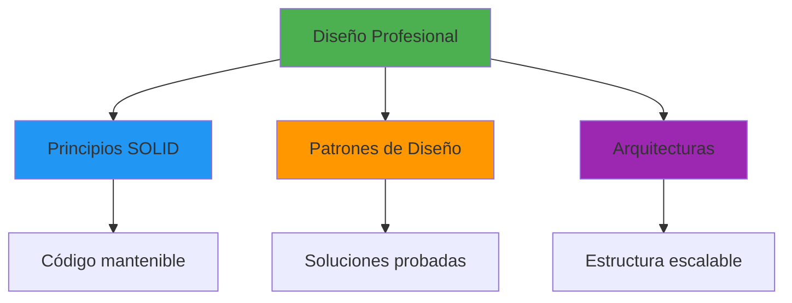

## 5.1. Principios SOLID

Los cinco principios SOLID son un conjunto de reglas y mejores prácticas para el diseño de software orientado a objetos. Aplicados correctamente, producen código más mantenible, escalable y testeable.

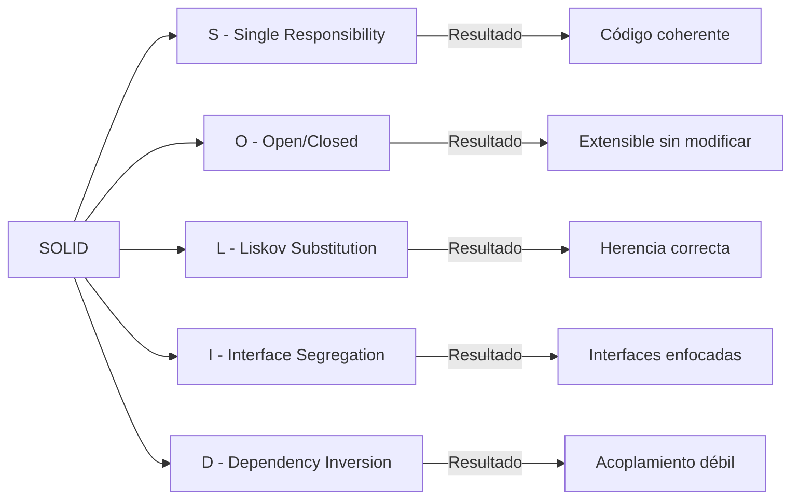

### SRP: Principio de Responsabilidad Única

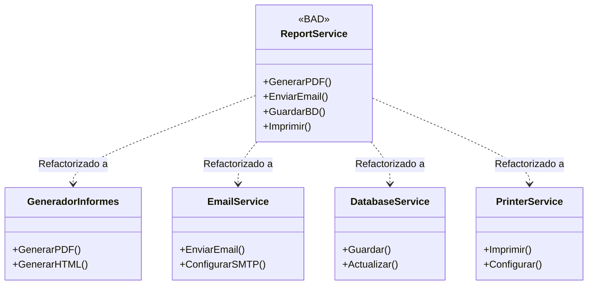

### OCP: Principio Abierto/Cerrado

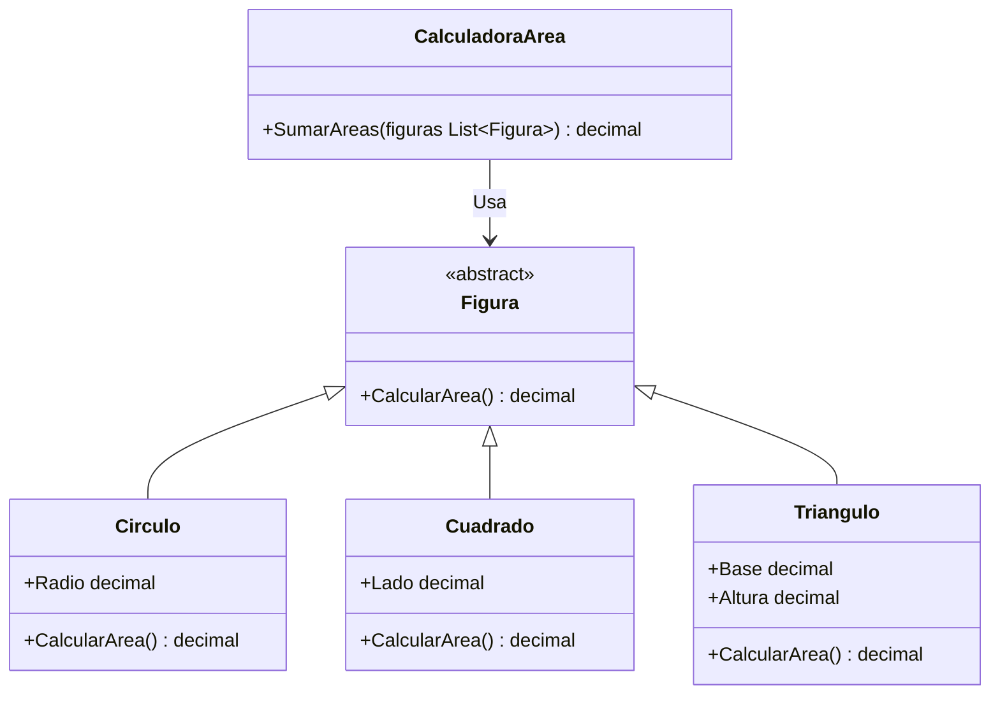

### LSP: Principio de Sustitución de Liskov

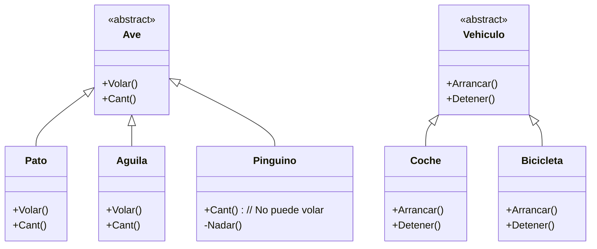

### ISP: Principio de Segregación de Interfaces

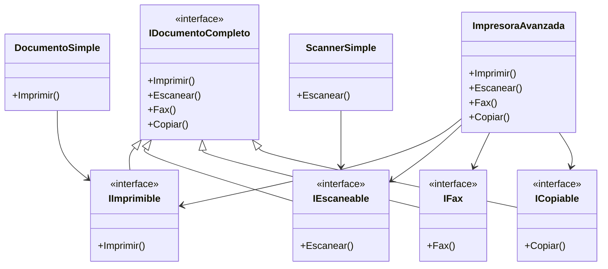

### DIP: Principio de Inversión de Dependencias

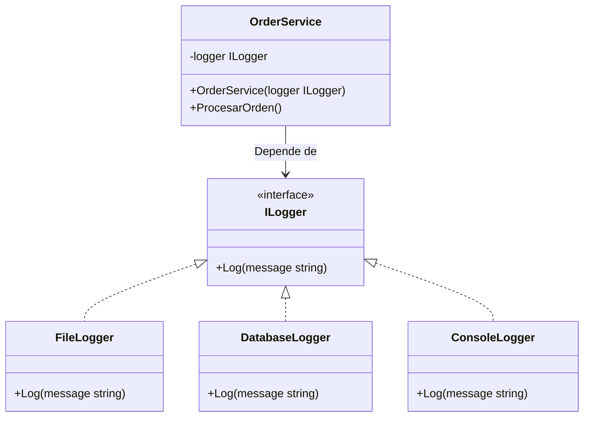

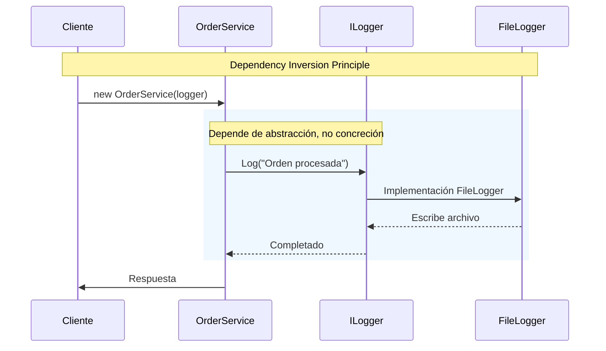

### 5.1.1. Analogía: SOLID como construcción de un edificio

Imagina que estás construyendo un edificio de varios pisos:

- **SRP** es como asignar un equipo especializado a cada oficio (electricistas, fontaneros, albañiles) en lugar de que uno haga todo
- **OCP** es diseñar el edificio para poder añadir más pisos sin tener que reconstruir los existentes
- **LSP** es usar materiales de sustitución que funcionen igual de bien que los originales
- **ISP** es dar instrucciones específicas a cada trabajador en lugar de un manual enorme
- **DIP** es que los pisos altos dependan de "conexiones" no de los materiales específicos del sótano

📝 **Nota del Profesor**: SOLID no es dogma, es guía. A veces violates un principio por una buena razón, pero debes poder justificarla. En proyectos pequeños, aplicar SOLID rigurosamente puede ser overkill.

💡 **Tip del Examinador**: En el examen,know the acrónimo y sepuede explicar cada principio con tus propias palabras. Los entrevistadores valoran más la comprensión conceptual que la memorización.

### 5.1.2. SRP: Principio de Responsabilidad Única

Una clase debe tener una, y solo una, razón para cambiar. Esto significa que una clase debe tener solo una tarea o responsabilidad.

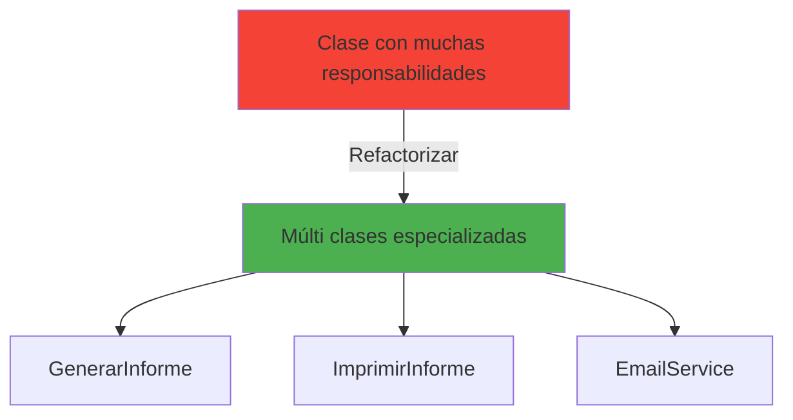

**Ejemplo práctico:**

```csharp
// ❌ MAL - Múltiples responsabilidades
public class Informe
{
    public void GenerarInforme()
    {
        // Lógica para generar el informe
    }

    public void ImprimirInforme()
    {
        // Lógica para imprimir el informe
    }

    public void EnviarPorEmail()
    {
        // Lógica para enviar por email
    }
}

// ✅ BIEN - Una sola responsabilidad por clase
public class Informe
{
    public void Generar()
    {
        // Solo generar el informe
    }
}

public class ImpresoraInforme
{
    public void Imprimir(Informe informe)
    {
        // Solo imprimir
    }
}

public class ServicioEmail
{
    public void EnviarInforme(Informe informe, string destinatario)
    {
        // Solo enviar por email
    }
}
```

⚠️ **Advertencia**: No lleves el SRP al extremo. Una clase "Usuario" que solo tenga "ID" y nothing else es ridículo. El contexto importa.

### 5.1.3. OCP: Principio Abierto/Cerrado

Las entidades de software deben estar abiertas para la extensión, pero cerradas para la modificación.

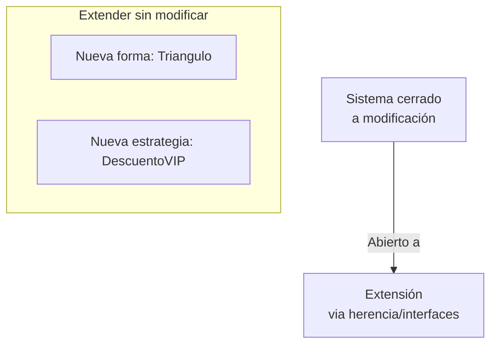

**Ejemplo práctico:**

```csharp
// ❌ MAL - Necesita modificarse para añadir nuevas formas
public class CalculadorArea
{
    public double Calcular(object forma)
    {
        if (forma is Circulo c)
            return Math.PI * c.Radio * c.Radio;
        else if (forma is Cuadrado cu)
            return cu.Lado * cu.Lado;
        else
            throw new NotSupportedException();
    }
}

// ✅ BIEN - Abierto para extensión, cerrado para modificación
public abstract class Forma
{
    public abstract double CalcularArea();
}

public class Circulo : Forma
{
    public double Radio { get; set; }

    public override double CalcularArea()
    {
        return Math.PI * Radio * Radio;
    }
}

public class Cuadrado : Forma
{
    public double Lado { get; set; }

    public override double CalcularArea()
    {
        return Lado * Lado;
    }
}

// Para añadir una nueva forma, solo extendemos, no modificamos
public class Triangulo : Forma
{
    public double Base { get; set; }
    public double Altura { get; set; }

    public override double CalcularArea()
    {
        return (Base * Altura) / 2;
    }
}
```

💡 **Tip del Examinador**: El OCP se logra principalmente mediante:
- Clases abstractas
- Interfaces
- Herencia
- Composición sobre herencia

### 5.1.4. LSP: Principio de Sustitución de Liskov

Los objetos de una superclase deben poder ser reemplazados por objetos de una subclase sin afectar la corrección del programa.

**Ejemplo práctico:**

```csharp
// ❌ MAL - Violación del LSP
public class Pajaro
{
    public virtual void Volar()
    {
        Console.WriteLine("El pájaro vuela");
    }
}

public class Pinguino : Pajaro
{
    public override void Volar()
    {
        throw new NotSupportedException("Los pingüinos no pueden volar");
    }
}

// ✅ BIEN - Respeta el LSP
public abstract class Pajaro
{
    public abstract void Moverse();
}

public interface IPajaroVolador
{
    void Volar();
}

public class Paloma : Pajaro, IPajaroVolador
{
    public override void Moverse()
    {
        Volar();
    }

    public void Volar()
    {
        Console.WriteLine("La paloma vuela");
    }
}

public class Pinguino : Pajaro
{
    public override void Moverse()
    {
        Console.WriteLine("El pingüino nada");
    }
}
```

### 🧠 Analogía: El LSP en la vida real

Imagina un contrato que dice "todo vehículo tiene un método acelerar()". Si diseñas un bicycle (bicicleta) que lanza excepción cuando llamas a acelerar(), estás violando el LSP. La solución es: o el bicycle no implementa IVehiculo, o creas una interfaz IMotorizado para vehículos con motor.

### 5.1.5. ISP: Principio de Segregación de Interfaces

Los clientes no deben ser forzados a depender de interfaces que no usan.

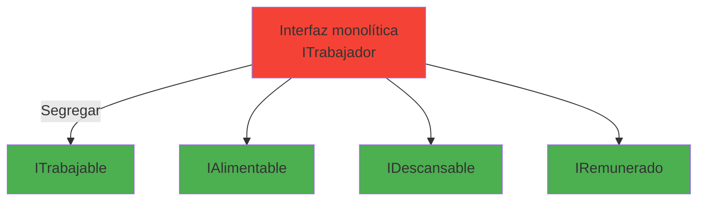

**Ejemplo práctico:**

```csharp
// ❌ MAL - Interfaz demasiado grande
public interface ITrabajador
{
    void Trabajar();
    void Comer();
    void Dormir();
    void Cobrar();
}

// ✅ BIEN - Interfaces segregadas
public interface ITrabajable
{
    void Trabajar();
}

public interface IAlimentable
{
    void Comer();
}

public interface IDescansable
{
    void Dormir();
}

public interface IRemunerado
{
    void Cobrar();
}

// Un empleado humano implementa todas
public class Empleado : ITrabajable, IAlimentable, IDescansable, IRemunerado
{
    public void Trabajar() { /* ... */ }
    public void Comer() { /* ... */ }
    public void Dormir() { /* ... */ }
    public void Cobrar() { /* ... */ }
}

// Un robot solo implementa las que necesita
public class Robot : ITrabajable
{
    public void Trabajar() { /* ... */ }
}
```

⚠️ **Advertencia**: Crear interfaces de un solo método para todo es el extremo opuesto (Interface Pollution). Busca el equilibrio.

### 5.1.6. DIP: Principio de Inversión de Dependencias

Los módulos de alto nivel no deben depender de los módulos de bajo nivel. Ambos deben depender de abstracciones.

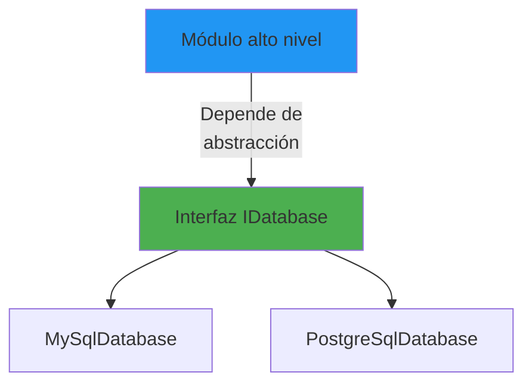

**Ejemplo práctico:**

```csharp
// ❌ MAL - Dependencia directa de implementación concreta
public class Aplicacion
{
    private MySqlDatabase _database = new MySqlDatabase();

    public void GuardarDatos(string datos)
    {
        _database.Guardar(datos);
    }
}

// ✅ BIEN - Inversión de dependencias con inyección
public interface IDatabase
{
    void Guardar(string datos);
}

public class MySqlDatabase : IDatabase
{
    public void Guardar(string datos)
    {
        Console.WriteLine($"Guardando en MySQL: {datos}");
    }
}

public class PostgreSqlDatabase : IDatabase
{
    public void Guardar(string datos)
    {
        Console.WriteLine($"Guardando en PostgreSQL: {datos}");
    }
}

public class Aplicacion(IDatabase database)
{
    public void GuardarDatos(string datos)
    {
        database.Guardar(datos);
    }
}

// Uso con inyección de dependencias
var app = new Aplicacion(new PostgreSqlDatabase());
app.GuardarDatos("Datos importantes");
```

📝 **Nota del Profesor**: La Inyección de Dependencias (DI) es la implementación práctica del DIP. En ASP.NET Core, DI viene integrado. Úsalo siempre que sea posible.

## 5.2. Patrones de Diseño

Los patrones de diseño son soluciones probadas a problemas comunes en el desarrollo de software. No son código copy-paste, son plantillas de pensamiento.

### 5.2.1. Patrones de Creación

Controlan cómo se crean los objetos, ocultando la lógica de instanciación.

| Patrón | Propósito | Ejemplo en .NET |
|--------|-----------|-----------------|
| **Singleton** | Una única instancia global | `ILogger` en algunos contextos |
| **Factory Method** | Crear objetos sin especificar clase | `HttpClientFactory` |
| **Abstract Factory** | Crear familias de objetos relacionados | `DbProviderFactory` |
| **Builder** | Construir objetos complejos paso a paso | `StringBuilder`, `HttpRequestBuilder` |

### 5.2.2. Patrones Estructurales

Definen cómo se componen clases y objetos para formar estructuras más grandes.

| Patrón | Propósito | Ejemplo en .NET |
|--------|-----------|-----------------|
| **Adapter** | Interfaces incompatibles | `HttpClient` vs `HttpWebRequest` |
| **Decorator** | Añadir funcionalidad dinámicamente | `Stream` decorators |
| **Proxy** | Placeholder de otro objeto | `Lazy<T>`, proxies de EF Core |
| **Composite** | Estructuras de árbol | `Control` en WinForms/WPF |

### 5.2.3. Patrones de Comportamiento

Definen cómo los objetos interactúan y se comunican.

| Patrón | Propósito | Ejemplo en .NET |
|--------|-----------|-----------------|
| **Observer** | Dependencia uno-a-muchos | `IObservable`, eventos |
| **Strategy** | Algoritmos intercambiables | `IEnumerable.OrderBy` |
| **Template Method** | Esqueleto de algoritmo | `ASP.NET Core Middleware` |
| **Command** | Petición como objeto | `ICommand` en CQRS |

### 5.2.4. 📊 Diagrama de clasificación de patrones

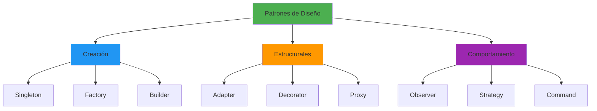

**Ejemplo de patrón Strategy con C# moderno:**

```csharp
// Estrategia de cálculo de precios
public interface IEstrategiaDescuento
{
    decimal CalcularDescuento(decimal precioBase);
}

public class DescuentoNormal : IEstrategiaDescuento
{
    public decimal CalcularDescuento(decimal precioBase) => precioBase * 0.05m;
}

public class DescuentoVIP : IEstrategiaDescuento
{
    public decimal CalcularDescuento(decimal precioBase) => precioBase * 0.20m;
}

public class DescuentoEmpleado : IEstrategiaDescuento
{
    public decimal CalcularDescuento(decimal precioBase) => precioBase * 0.30m;
}

public class CarritoCompra(IEstrategiaDescuento estrategiaDescuento)
{
    private readonly IEstrategiaDescuento _estrategiaDescuento = estrategiaDescuento;

    public decimal CalcularTotal(decimal precioBase)
    {
        var descuento = _estrategiaDescuento.CalcularDescuento(precioBase);
        return precioBase - descuento;
    }
}

// Uso
var carritoNormal = new CarritoCompra(new DescuentoNormal());
var totalNormal = carritoNormal.CalcularTotal(1000m); // 950

var carritoVIP = new CarritoCompra(new DescuentoVIP());
var totalVIP = carritoVIP.CalcularTotal(1000m); // 800
```

💡 **Tip del Examinador**: El patrón Strategy es el más común en entrevistas. Prepáralo bien. La clave es entender que intercambias algoritmos en tiempo de ejecución.

## 5.3. Arquitecturas Software

Una arquitectura de software define la estructura organizativa fundamental de un sistema.

### 5.3.1. 🧠 Analogía: Arquitectura como plano de ciudad

Imagina diseñar una ciudad:

- **Monolítico** es un pueblo donde todo está cerca
- **Capas** es como zonas especializadas (industrial, residencial, comercial)
- **Clean Architecture** es una ciudad con anillo de circunvalación que protege el centro histórico
- **Microservicios** son pueblos independientes conectados por carreteras

### 5.3.2. Arquitectura Monolítica

Todos los componentes en un solo bloque.

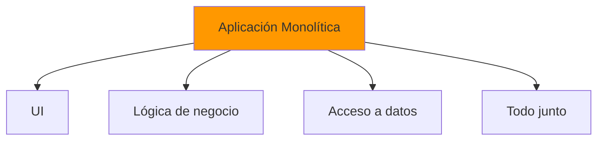

**Ventajas:**
- Simple de desarrollar inicialmente
- Deployment simple
- Menor complejidad operativa

**Desventajas:**
- Difícil de escalar selectivamente
- Acoplamiento alto
- Cambios afectan a todo el sistema

### 5.3.3. Arquitectura en Capas

Divide la aplicación en capas lógicas con responsabilidades específicas.

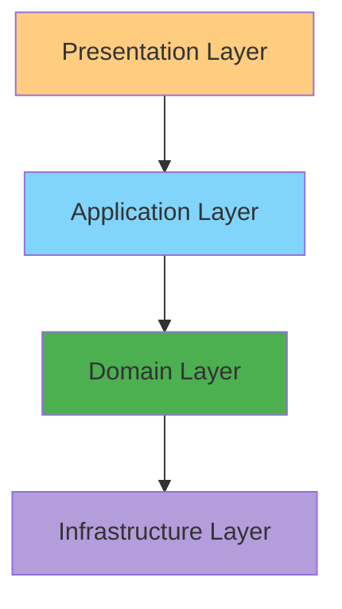

### 5.3.4. Clean Architecture

Separa las preocupaciones en círculos concéntricos, donde las capas internas no dependen de las externas.

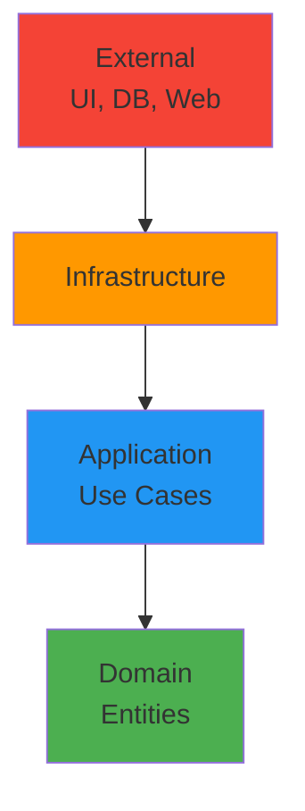

**Regla de dependencia:** Las flechas siempre van hacia dentro. El dominio (centro) no conoce nada de infraestructura.

### 5.3.5. Microservicios

Servicios independientes que se comunican entre sí.

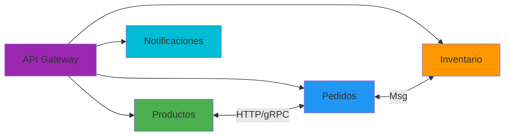

**Características:**
- Cada microservicio es autónomo
- Despliegue independiente
- Comunicación mediante HTTP/REST, gRPC o mensajería

## 5.4. Arquitecturas en aplicaciones .NET modernas

### 5.4.1. 📊 Estructura de proyecto Clean Architecture

```
MiAplicacion/
├── src/
│   ├── MiAplicacion.Domain/           # Entidades y lógica de negocio pura
│   │   ├── Entities/
│   │   │   ├── Producto.cs
│   │   │   └── Pedido.cs
│   │   ├── Interfaces/
│   │   │   └── IProductoRepository.cs
│   │   └── ValueObjects/
│   │       └── Precio.cs
│   │
│   ├── MiAplicacion.Application/      # Casos de uso y lógica de aplicación
│   │   ├── DTOs/
│   │   │   └── ProductoDto.cs
│   │   ├── Services/
│   │   │   └── ProductoService.cs
│   │   └── Interfaces/
│   │       └── IProductoService.cs
│   │
│   ├── MiAplicacion.Infrastructure/   # Implementaciones de acceso a datos
│   │   ├── Data/
│   │   │   ├── ApplicationDbContext.cs
│   │   │   └── Repositories/
│   │   │       └── ProductoRepository.cs
│   │   └── ExternalServices/
│   │       └── EmailService.cs
│   │
│   └── MiAplicacion.Api/              # API REST (Presentation Layer)
│       ├── Controllers/
│       │   └── ProductosController.cs
│       ├── Program.cs
│       └── appsettings.json
│
└── tests/
    ├── MiAplicacion.UnitTests/
    └── MiAplicacion.IntegrationTests/
```

### 5.4.2. Configuración de Inyección de Dependencias

```csharp
using MiAplicacion.Application.Interfaces;
using MiAplicacion.Application.Services;
using MiAplicacion.Domain.Interfaces;
using MiAplicacion.Infrastructure.Data;
using MiAplicacion.Infrastructure.Data.Repositories;
using Microsoft.EntityFrameworkCore;

var builder = WebApplication.CreateBuilder(args);

// Configurar servicios
builder.Services.AddControllers();
builder.Services.AddEndpointsApiExplorer();
builder.Services.AddSwaggerGen();

// Configurar DbContext
builder.Services.AddDbContext<ApplicationDbContext>(options =>
    options.UseNpgsql(builder.Configuration.GetConnectionString("DefaultConnection")));

// Inyección de dependencias - Repositorios
builder.Services.AddScoped<IProductoRepository, ProductoRepository>();

// Inyección de dependencias - Servicios
builder.Services.AddScoped<IProductoService, ProductoService>();

// Configurar AutoMapper
builder.Services.AddAutoMapper(AppDomain.CurrentDomain.GetAssemblies());

// Configurar FluentValidation
builder.Services.AddValidatorsFromAssemblyContaining<ProductoDtoValidator>();

var app = builder.Build();

// Configurar pipeline HTTP
if (app.Environment.IsDevelopment())
{
    app.UseSwagger();
    app.UseSwaggerUI();
}

app.UseHttpsRedirection();
app.UseAuthorization();
app.MapControllers();

app.Run();
```

### 5.4.3. Comunicación entre Microservicios

```csharp
// Definir el cliente del microservicio
public interface IInventarioApi
{
    [Get("/api/inventario/{productoId}")]
    Task<int> ObtenerStock(int productoId);

    [Post("/api/inventario/reservar")]
    Task<bool> ReservarStock([Body] ReservaRequest request);
}

// Registrar en Program.cs
builder.Services.AddRefitClient<IInventarioApi>()
    .ConfigureHttpClient(c => c.BaseAddress = new Uri("http://inventario-api:5000"));

// Uso en el servicio de pedidos
public class PedidoService(IInventarioApi inventarioApi)
{
    public async Task<Result<Pedido>> CrearPedido(CrearPedidoRequest request)
    {
        // Verificar stock en el microservicio de inventario
        var stockDisponible = await inventarioApi.ObtenerStock(request.ProductoId);

        if (stockDisponible < request.Cantidad)
            return Result.Failure<Pedido>("Stock insuficiente");

        // Reservar stock
        await inventarioApi.ReservarStock(new ReservaRequest
        {
            ProductoId = request.ProductoId,
            Cantidad = request.Cantidad
        });

        // Crear pedido...
        return Result.Success(pedido);
    }
}
```

## 5.5. APIs Web en ASP.NET Core

### 5.5.1. Tipos de APIs Web

| Tipo | Características | Caso de uso |
|------|-----------------|-------------|
| **REST** | HTTP estándar, recursos | APIs generales |
| **GraphQL** | Consultas flexibles | Frontends complejos |
| **WebSocket** | Comunicación bidireccional | Tiempo real |
| **gRPC** | Alto rendimiento, binario | Microservicios |

### 5.5.2. REST APIs con Minimal APIs

```csharp
using Microsoft.AspNetCore.Mvc;
using MiAplicacion.Application.Interfaces;
using MiAplicacion.Application.DTOs;

var builder = WebApplication.CreateBuilder(args);

builder.Services.AddEndpointsApiExplorer();
builder.Services.AddSwaggerGen();

var app = builder.Build();

if (app.Environment.IsDevelopment())
{
    app.UseSwagger();
    app.UseSwaggerUI();
}

var productosGroup = app.MapGroup("/api/productos")
    .WithTags("Productos");

// GET: Obtener todos los productos
productosGroup.MapGet("/", async (IProductoService service) =>
{
    var productos = await service.ObtenerTodosAsync();
    return Results.Ok(productos);
})
.WithName("ObtenerProductos")
.WithOpenApi();

// GET: Obtener producto por ID
productosGroup.MapGet("/{id:int}", async (int id, IProductoService service) =>
{
    var resultado = await service.ObtenerPorIdAsync(id);
    
    return resultado.Match(
        onSuccess: producto => Results.Ok(producto),
        onFailure: error => Results.NotFound(new { error })
    );
})
.WithName("ObtenerProductoPorId")
.WithOpenApi();

// POST: Crear producto
productosGroup.MapPost("/", async ([FromBody] CrearProductoDto dto, IProductoService service) =>
{
    var resultado = await service.CrearAsync(dto);
    
    return resultado.Match(
        onSuccess: producto => Results.Created($"/api/productos/{producto.Id}", producto),
        onFailure: error => Results.BadRequest(new { error })
    );
})
.WithName("CrearProducto")
.WithOpenApi();

// PUT: Actualizar producto
productosGroup.MapPut("/{id:int}", async (int id, [FromBody] ActualizarProductoDto dto, IProductoService service) =>
{
    var resultado = await service.ActualizarAsync(id, dto);
    
    return resultado.Match(
        onSuccess: producto => Results.Ok(producto),
        onFailure: error => Results.BadRequest(new { error })
    );
})
.WithName("ActualizarProducto")
.WithOpenApi();

// DELETE: Eliminar producto
productosGroup.MapDelete("/{id:int}", async (int id, IProductoService service) =>
{
    var resultado = await service.EliminarAsync(id);
    
    return resultado.IsSuccess
        ? Results.NoContent()
        : Results.NotFound(new { error = resultado.Error });
})
.WithName("EliminarProducto")
.WithOpenApi();

app.Run();
```

### 5.5.3. WebSockets en ASP.NET Core

```csharp
using System.Net.WebSockets;
using System.Text;

var builder = WebApplication.CreateBuilder(args);
var app = builder.Build();

app.UseWebSockets();

app.Map("/ws", async context =>
{
    if (context.WebSockets.IsWebSocketRequest)
    {
        using var webSocket = await context.WebSockets.AcceptWebSocketAsync();
        await Echo(webSocket);
    }
    else
    {
        context.Response.StatusCode = 400;
    }
});

async Task Echo(WebSocket webSocket)
{
    var buffer = new byte[1024 * 4];
    var result = await webSocket.ReceiveAsync(new ArraySegment<byte>(buffer), CancellationToken.None);

    while (!result.CloseStatus.HasValue)
    {
        await webSocket.SendAsync(
            new ArraySegment<byte>(buffer, 0, result.Count),
            result.MessageType,
            result.EndOfMessage,
            CancellationToken.None);

        result = await webSocket.ReceiveAsync(new ArraySegment<byte>(buffer), CancellationToken.None);
    }

    await webSocket.CloseAsync(result.CloseStatus.Value, result.CloseStatusDescription, CancellationToken.None);
}

app.Run();
```

## 5.6. Resumen
En este capítulo hemos explorado los principios SOLID, patrones de diseño y arquitecturas de software esenciales para desarrollar aplicaciones .NET robustas y mantenibles. Hemos visto cómo aplicar estos conceptos en proyectos reales, desde la estructura del código hasta la comunicación entre microservicios y la creación de APIs web modernas con ASP.NET Core. Al dominar estos fundamentos, estarás mejor preparado para enfrentar desafíos complejos en el desarrollo de software profesional.

Los principios SOLID son:
- SRP: Mantén las clases enfocadas en una sola responsabilidad.
- OCP: Diseña para la extensión sin modificar el código existente.
- LSP: Asegura que las subclases puedan sustituir a sus superclases sin problemas.
- ISP: Crea interfaces específicas y enfocadas.
- DIP: Invierte las dependencias para lograr un acoplamiento débil.