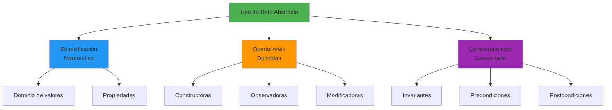
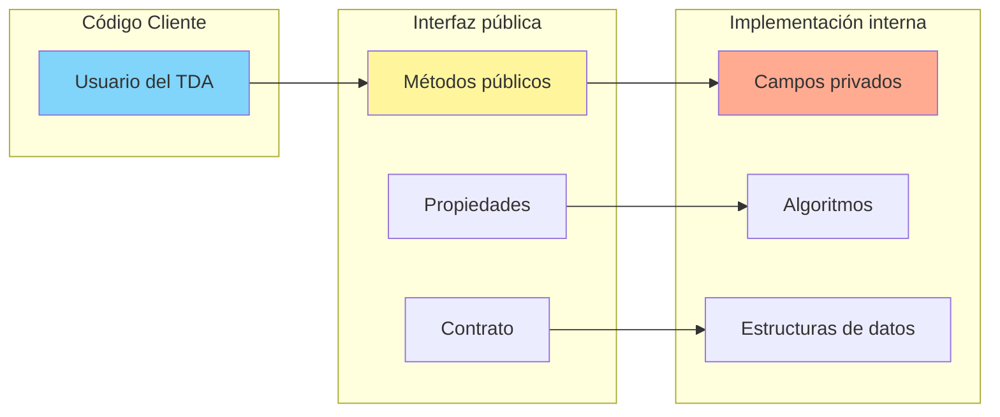
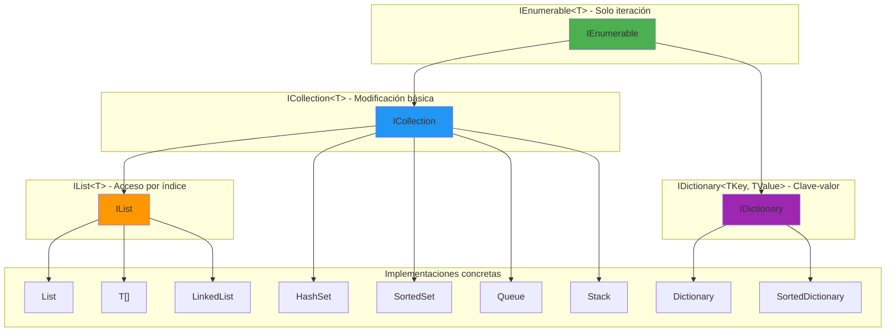
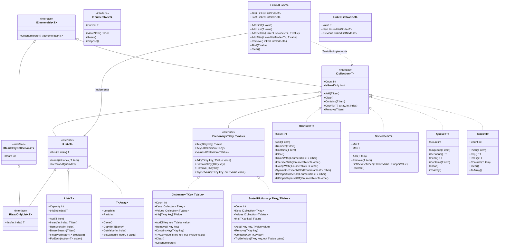
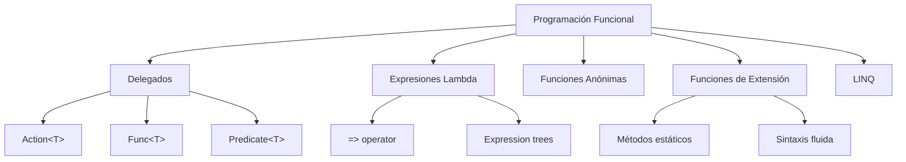

- [6. Tipos de Datos Abstractos, Colecciones y Programación Funcional en .NET](#6-tipos-de-datos-abstractos-colecciones-y-programación-funcional-en-net)
  - [6.1. Tipos de datos abstractos](#61-tipos-de-datos-abstractos)
    - [6.1.1. Concepto y definición formal de TDA](#611-concepto-y-definición-formal-de-tda)
    - [6.1.2. Principios fundamentales de abstracción](#612-principios-fundamentales-de-abstracción)
    - [6.1.3. Interfaz vs implementación: el contrato público](#613-interfaz-vs-implementación-el-contrato-público)
    - [6.1.4. Ejemplo detallado: TDA Pila (Stack)](#614-ejemplo-detallado-tda-pila-stack)
    - [6.1.5. Ejemplo detallado: TDA Cola (Queue)](#615-ejemplo-detallado-tda-cola-queue)
  - [6.2. Programación con genéricos](#62-programación-con-genéricos)
    - [6.2.1. Evolución histórica: de object a genéricos](#621-evolución-histórica-de-object-a-genéricos)
    - [6.2.2. Fundamentos teóricos de la genericidad](#622-fundamentos-teóricos-de-la-genericidad)
    - [6.2.3. Clases genéricas: diseño y implementación](#623-clases-genéricas-diseño-y-implementación)
    - [6.2.4. Métodos genéricos: flexibilidad y reutilización](#624-métodos-genéricos-flexibilidad-y-reutilización)
    - [6.2.5. Restricciones de tipos: límites a la genericidad](#625-restricciones-de-tipos-límites-a-la-genericidad)
    - [6.2.6. Varianza en genéricos: covarianza y contravianza](#626-varianza-en-genéricos-covarianza-y-contravianza)
  - [6.3. Colecciones en .NET](#63-colecciones-en-net)
    - [6.3.1. Jerarquía de interfaces en el ecosistema .NET](#631-jerarquía-de-interfaces-en-el-ecosistema-net)
    - [6.3.2. IEnumerable\<T\> y el patrón iterador](#632-ienumerablet-y-el-patrón-iterador)
    - [6.3.3. ICollection\<T\> y las operaciones de modificación](#633-icollectiont-y-las-operaciones-de-modificación)
    - [6.3.4. IList\<T\> y el acceso por índice](#634-ilistt-y-el-acceso-por-índice)
    - [6.3.5. IDictionary\<TKey, TValue\> y las tablas hash](#635-idictionarytkey-tvalue-y-las-tablas-hash)
    - [6.3.6. LINQ y las colecciones: querying declarativo](#636-linq-y-las-colecciones-querying-declarativo)
  - [6.6. Programación Funcional en C#](#66-programación-funcional-en-c)
    - [6.6.1. Delegados](#661-delegados)
    - [6.6.2. Expresiones Lambda](#662-expresiones-lambda)
    - [6.6.3. Funciones Anónimas](#663-funciones-anónimas)
    - [6.6.4. Funciones de Extensión](#664-funciones-de-extensión)
    - [6.6.5. Funciones de Orden Superior](#665-funciones-de-orden-superior)
    - [6.6.6. Inmutabilidad y Funciones Puras](#666-inmutabilidad-y-funciones-puras)
    - [6.6.7. Pattern Matching Funcional](#667-pattern-matching-funcional)
  - [6.5. Resumen](#65-resumen)

# 6. Tipos de Datos Abstractos, Colecciones y Programación Funcional en .NET

Este capítulo constituye uno de los pilares fundamentales de la programación avanzada en C# y .NET. A lo largo de este módulo, exploraremos en profundidad tres conceptos interrelacionados que son esenciales para cualquier desarrollador que aspire a dominar este ecosistema: los Tipos de Datos Abstractos (TDAs), las colecciones de datos y los principios de programación funcional. Estos conceptos no son meras características técnicas del lenguaje, sino que representan formas de pensar y estructurar el código que tienen profundas implicaciones en la calidad, mantenibilidad y eficiencia del software que desarrollamos.

La comprensión profunda de estos temas permitirá al estudiante diseñar estructuras de datos apropiadas para cada situación, escribir código más expresivo y conciso mediante el uso de genéricos, y aprovechar las capacidades funcionales de C# para resolver problemas de manera elegante. Además, estos conocimientos son prerequisito indispensable para comprender tecnologías más avanzadas como Entity Framework Core, la programación reactiva y las arquitecturas basadas en pipelines de datos.

## 6.1. Tipos de datos abstractos

### 6.1.1. Concepto y definición formal de TDA

Un Tipo de Dato Abstracto, conocido comúnmente por sus siglas TDA (Abstract Data Type en inglés), constituye un concepto fundamental en la teoría de la programación y el diseño de software. Formalmente, un TDA se define como un modelo matemático que especifica un tipo de dato junto con las operaciones que pueden realizarse sobre dicho tipo, independientemente de cómo estas operaciones estén implementadas a nivel técnico. Esta separación entre la interfaz pública (qué puede hacer el tipo) y la implementación interna (cómo lo hace) es lo que otorga a los TDAs su poder y versatilidad en el diseño de sistemas software complejos.

El concepto de abstracción es central en la ingeniería de software moderna, y los TDAs representan una de las formas más puras de implementar este principio. Cuando utilizamos un TDA, no necesitamos conocer ni nos preocupamos por los detalles internos de cómo se almacenan los datos o cómo se ejecutan las operaciones. Simplemente confiamos en que la interfaz pública proporcionada será consistente, eficiente y correcta. Esta separación de concerns permite que los desarrolladores trabajen a diferentes niveles de abstracción, facilitando el mantenimiento, la evolución y las pruebas del código.

La importancia histórica de los TDAs radica en que surgieron como una respuesta a la creciente complejidad del software en las décadas de 1960 y 1970. Investigadores como Barbara Liskov y outros pioneros de la informática formalizaron estos conceptos, estableciendo las bases teóricas que hoy utilizamos diariamente. En el contexto de .NET, los TDAs se implementan principalmente a través de interfaces y clases abstractas, aunque el lenguaje ha evolucionado para ofrecer mecanismos adicionales como los registros (records) que proporcionan semánticas de valor.



### 6.1.2. Principios fundamentales de abstracción

La abstracción en los TDAs se manifiesta a través de varios principios fundamentales que todo diseñador de software debe comprender. El primer principio es el **encapsulamiento**, que establece que los detalles internos de implementación deben estar ocultos detrás de una interfaz bien definida. Este principio protege la integridad de los datos al prevenir accesos directos no controlados y garantiza que las invariantes del tipo se mantengan en todo momento.

El segundo principio es la **independencia de representación**, que asegura que el uso de un TDA no dependa de cómo están representados internamente los datos. Esto significa que podemos cambiar la implementación subyacente sin afectar el código cliente, siempre que respetemos el contrato establecido por la interfaz. Esta independencia es crucial para la evolución del software, ya que permite optimizar el rendimiento o corregir errores sin propagar cambios a través de todo el sistema.

El tercer principio es la **composición**, que permite construir tipos complejos combinando tipos más simples. Los TDAs pueden contener otros TDAs como componentes, creando estructuras de datos sofisticadas que resuelven problemas específicos. Esta capacidad de composición es lo que permite construir desde estructuras simples como listas hasta estructuras complejas como grafos o árboles balanceados.



### 6.1.3. Interfaz vs implementación: el contrato público

La distinción entre interfaz e implementación es quizás el aspecto más crítico de los TDAs. La interfaz define el **contrato público** entre el proveedor del tipo y sus usuarios. Este contrato especifica qué operaciones están disponibles, cuáles son sus firmas (parámetros y tipos de retorno), y qué comportamiento se puede esperar de ellas. En .NET, las interfaces son el mecanismo principal para expresar estos contratos, aunque las clases abstractas también juegan un rol importante cuando necesitamos proporcionar implementaciones parciales.

La implementación, por otro lado, contiene los detalles internos que hacen que el TDA funcione. Incluye las estructuras de datos utilizadas para almacenar la información, los algoritmos que implementan las operaciones declaradas en la interfaz, y las optimizaciones que mejoran el rendimiento. Lo fundamental es que la implementación puede evolucionar independientemente de la interfaz, siempre que se respete el contrato establecido.

En el contexto de C#, esta separación se materializa en el patrón de diseño conocido como "programar contra abstracciones". En lugar de depender de implementaciones concretas, el código debe depender de interfaces o clases abstractas. Esto se logra típicamente mediante la inyección de dependencias, donde las implementaciones concretas se proporcionan en tiempo de ejecución en lugar de estar codificadas en el código fuente.

```csharp
// Interfaz: el contrato público
public interface IPila<T>
{
    // Documentación de la operación
    /// <summary>
    /// Agrega un elemento a la parte superior de la pila.
    /// </summary>
    /// <param name="elemento">El elemento a agregar.</param>
    void Push(T elemento);
    
    /// <summary>
    /// Removes and returns the top element of the stack.
    /// </summary>
    /// <returns>El elemento en la parte superior.</returns>
    /// <exception cref="InvalidOperationException">Si la pila está vacía.</exception>
    T Pop();
    
    /// <summary>
    /// Returns the top element without removing it.
    /// </summary>
    T Peek();
    
    /// <summary>
    /// Indicates whether the stack is empty.
    /// </summary>
    bool IsEmpty { get; }
    
    /// <summary>
    /// Gets the number of elements in the stack.
    /// </summary>
    int Count { get; }
}

// Implementación: detalles internos ocultos
public class Pila<T> : IPila<T>
{
    // Los detalles de implementación están encapsulados
    private readonly List<T> _elementos = new();
    
    public void Push(T elemento) => _elementos.Add(elemento);
    
    public T Pop()
    {
        if (IsEmpty)
            throw new InvalidOperationException("La pila está vacía");
            
        var elemento = _elementos[^1];
        _elementos.RemoveAt(_elementos.Count - 1);
        return elemento;
    }
    
    public T Peek() => IsEmpty ? throw new InvalidOperationException() : _elementos[^1];
    
    public bool IsEmpty => _elementos.Count == 0;
    public int Count => _elementos.Count;
}
```

### 6.1.4. Ejemplo detallado: TDA Pila (Stack)

La pila es uno de los TDAs más fundamentales y ampliamente utilizados en programación. Su funcionamiento se basa en el principio LIFO (Last In, First Out), que significa "el último en entrar es el primero en salir". Este comportamiento es análogo a una pila de platos en un restaurante: el último plato que colocamos es el primero que retiramos. La pila aparece constantemente en algoritmos importantes, como la evaluación de expresiones, la navegación en estructuras jerárquicas (como el DOM de HTML o el árbol de llamadas de un programa), y la implementación de la recursión en tiempo de compilación.

La historia de la pila como estructura de datos se remonta a los primeros días de la computación. Alan Turing, uno de los padres de la informática moderna, conceptualizó las "subrutinas apiladas" en sus diseños teóricos. La pila es tan fundamental que está implementada directamente en hardware de prácticamente todos los procesadores modernos, donde se utiliza para gestionar las llamadas a funciones y el paso de parámetros.

La interfaz de una pila típicamente incluye las operaciones Push (añadir elemento), Pop (extraer elemento), Peek (observar elemento superior), y propiedades como Count (número de elementos) e IsEmpty (verificar si está vacía). Algunas implementaciones también incluyen operaciones como Clear (vaciar pila), Contains (verificar existencia), o ToArray (convertir a array).

```csharp
namespace TDAs.Ejemplos
{
    /// <summary>
    /// Implementación genérica del TDA Pila (Stack).
    /// Cumple con el principio LIFO: Last In, First Out.
    /// </summary>
    /// <typeparam name="T">El tipo de elementos almacenados en la pila.</typeparam>
    public class Pila<T>(IEnumerable<T>? coleccion = null)
    {
        private readonly List<T> _elementos = new(coleccion ?? Enumerable.Empty<T>());

        public void Push(T elemento) => _elementos.Add(elemento);

        public T Pop()
        {
            if (IsEmpty)
                throw new InvalidOperationException(
                    "No se puede realizar Pop en una pila vacía. " +
                    "Verifique IsEmpty antes de llamar a Pop().");

            var elemento = _elementos[^1];
            _elementos.RemoveAt(_elementos.Count - 1);
            return elemento;
        }

        public T Peek()
        {
            if (IsEmpty)
                throw new InvalidOperationException(
                    "No se puede realizar Peek en una pila vacía.");

            return _elementos[^1];
        }

        public bool TryPop(out T? elemento)
        {
            if (IsEmpty)
            {
                elemento = default;
                return false;
            }

            elemento = Pop();
            return true;
        }

        public bool TryPeek(out T? elemento)
        {
            if (IsEmpty)
            {
                elemento = default;
                return false;
            }

            elemento = Peek();
            return true;
        }

        public void Clear() => _elementos.Clear();

        public bool Contains(T elemento) => _elementos.Contains(elemento);

        public T[] ToArray()
        {
            var array = new T[Count];
            for (int i = 0; i < Count; i++)
                array[i] = _elementos[i];
            return array;
        }

        public void CopyTo(T[] array, int arrayIndex) => _elementos.CopyTo(array, arrayIndex);

        public IEnumerator<T> GetEnumerator() => _elementos.GetEnumerator();

        IEnumerator IEnumerable.GetEnumerator() => GetEnumerator();

        public int Count => _elementos.Count;

        public bool IsEmpty => Count == 0;
    }
}
```

### 6.1.5. Ejemplo detallado: TDA Cola (Queue)

La cola es otro TDA fundamental que sigue el principio FIFO (First In, First Out), es decir, "el primero en entrar es el primero en salir". Este comportamiento es análogo a una cola de personas en un banco o supermercado: la primera persona que llega es la primera en ser atendida. Las colas son esenciales en muchos escenarios de programación, incluyendo la gestión de solicitudes en servidores web, la comunicación entre procesos, y la implementación de algoritmos de búsqueda en grafos (BFS).

A diferencia de la pila, la implementación eficiente de una cola presenta desafíos interesantes. Una implementación naive con una lista requiere O(n) para la operación Dequeue porque necesitamos desplazar todos los elementos. Para解决这个问题, existen técnicas como el buffer circular (ring buffer) que mantiene operaciones O(1) para ambas operaciones principales. .NET proporciona Queue<T> con una implementación optimizada que utiliza estas técnicas internamente.

La interfaz de una cola típicamente incluye Enqueue (añadir al final), Dequeue (extraer del frente), Peek (observar frente), y propiedades similares a las de la pila. Algunas implementaciones también ofrecen TryDequeue y TryPeek como alternativas seguras que no lanzan excepciones.

```csharp
namespace TDAs.Ejemplos
{
    /// <summary>
    /// Implementación genérica del TDA Cola (Queue).
    /// Cumple con el principio FIFO: First In, First Out.
    /// </summary>
    /// <typeparam name="T">El tipo de elementos almacenados en la cola.</typeparam>
    public class Cola<T>(IEnumerable<T>? coleccion = null)
    {
        private readonly Queue<T> _colaInterna = new(coleccion ?? Enumerable.Empty<T>());

        public void Enqueue(T elemento) => _colaInterna.Enqueue(elemento);

        public T Dequeue() => _colaInterna.Dequeue();

        public bool TryDequeue(out T? elemento) => _colaInterna.TryDequeue(out elemento);

        public T Peek() => _colaInterna.Peek();

        public bool TryPeek(out T? elemento) => _colaInterna.TryPeek(out elemento);

        public void Clear() => _colaInterna.Clear();

        public bool Contains(T elemento) => _colaInterna.Contains(elemento);

        public T[] ToArray() => _colaInterna.ToArray();

        public IEnumerator<T> GetEnumerator() => _colaInterna.GetEnumerator();

        IEnumerator IEnumerable.GetEnumerator() => GetEnumerator();

        public int Count => _colaInterna.Count;

        public bool IsEmpty => Count == 0;
    }
}
```

## 6.2. Programación con genéricos

### 6.2.1. Evolución histórica: de object a genéricos

La evolución del sistema de tipos en C# representa una fascinante historia de aprendizaje y mejora continua en el diseño de lenguajes de programación. En las primeras versiones de C# (1.0), la única forma de crear estructuras de datos reutilizables era mediante el uso del tipo base `object`. Este enfoque, aunque funcional, presentaba problemas significativos que afectaban tanto la seguridad del tipo como el rendimiento del código.

El problema fundamental del uso de `object` era la falta de seguridad en tiempo de compilación. Cuando almacenamos un `int` en un `ArrayList`, el compilador no puede verificar que solo estamos extrayendo enteros. El código siguiente, aunque problemático, compilaría sin errores:

```csharp
// C# 1.0 - Enfoque con object (problemático)
ArrayList lista = new ArrayList();
lista.Add(42);              // Boxing implícito
lista.Add("texto");         // Compila, pero es problemático

int valor = (int)lista[0];  // Funciona
string texto = (string)lista[1];  // Funciona

// Pero esto también compila... y falla en tiempo de ejecución
int valorIncorrecto = (int)lista[1];  // InvalidCastException
```

Este código ilustra dos problemas graves. Primero, el **boxing** de tipos por valor (como `int`) introduce overhead de memoria y procesamiento. Segundo, el casting desde `object` no es verificado en tiempo de compilación, lo que significa que los errores de tipo se descubren solo en tiempo de ejecución, cuando el usuario ya está ejecutando la aplicación.

Los genéricos, introducidos en C# 2.0 (2005), resolvieron estos problemas de manera elegante. Ahora podemos especificar el tipo exacto de elementos que una colección contendrá, permitiendo al compilador verificar la corrección del código y eliminando la necesidad de boxing para tipos por valor.

```csharp
// C# 2.0+ - Enfoque con genéricos (correcto)
List<int> listaEnteros = new List<int>();
listaEnteros.Add(42);  // Sin boxing, directo

// listaEnteros.Add("texto");  // ERROR de compilación - imposible de cometer

int valor = listaEnteros[0];  // Sin casting, seguro
```

La introducción de genéricos requirió cambios significativos en el CLR y el compilador de C#. El CLR fue extendido para soportar instrucciones IL específicas para operaciones genéricas, y se implementó un mecanismo de **reificación de tipos** que preserva la información de tipo genérico en tiempo de ejecución, permitiendo optimizaciones como el avoidance de boxing.

### 6.2.2. Fundamentos teóricos de la genericidad

La genericidad es un concepto teórico fundamental en la teoría de tipos y el diseño de lenguajes de programación. Formalmente, se define como la capacidad de un lenguaje para parametrizar tipos por otros tipos, creando estructuras de datos y algoritmos que pueden operar sobre cualquier tipo que satisfaga ciertas restricciones. Esta parametrización permite la reutilización de código sin sacrificar la seguridad de tipos.

En el contexto de la teoría de tipos, los genéricos implementan lo que se conoce como **polimorfismo paramétrico**. A diferencia del polimorfismo basado en herencia (que requiere que los tipos estén en una relación de subtipado), el polimorfismo paramétrico permite que una función o tipo funcione uniformemente sobre un conjunto无限 de tipos, sin requerir ninguna relación entre ellos más allá de satisfacer las restricciones impuestas.

.NET implementa lo que se llama **genericidad reificada**, donde los tipos genéricos son "reales" en tiempo de ejecución, no solo "sintácticos" como en algunos lenguajes que realizan erasure. Esto significa que en tiempo de ejecución podemos inspeccionar el tipo genérico, y diferentes especializaciones de un tipo genérico producen diferentes códigos generados.

```csharp
// Diferentes especializaciones generan diferentes tipos en tiempo de ejecución
List<int> listaInt = new List<int>();
List<string> listaString = new List<string>();
List<Customer> listaCustomer = new List<Customer>();

// ¿Son del mismo tipo?
Console.WriteLine(listaInt.GetType());    // System.Collections.Generic.List`1[[System.Int32]]
Console.WriteLine(listaString.GetType());  // System.Collections.Generic.List`1[[System.String]]
Console.WriteLine(listaCustomer.GetType()); // System.Collections.Generic.List`1[[Customer]]

// typeof revela las especializaciones diferentes
Console.WriteLine(typeof(List<int>) == typeof(List<string>));  // False
```

Esta reificación tiene implicaciones importantes: permite el uso de genéricos en contextos que requieren metadatos de tipo (como reflexión, serialización y comparación de tipos), y facilita el debugging al mantener información de tipo clara. Sin embargo, también significa que cada especialización genera código separado, lo que puede aumentar el tamaño del assembly resultante.

### 6.2.3. Clases genéricas: diseño y implementación

El diseño de clases genéricas requiere comprender cómo los parámetros de tipo se utilizan en la definición de la clase. Un parámetro de tipo (típicamente nombrado con una letra mayúscula como T, K, V, etc.) actúa como un marcador de posición que será reemplazado por un tipo concreto cuando la clase sea instanciada.

El principio de diseño más importante para clases genéricas es que la clase debe ser **genuinamente genérica**, es decir, la parametrización por tipo debe ser esencial para la funcionalidad que proporciona. Si una clase podría funcionar igual de bien con un único tipo, probablemente no debería ser genérica.

```csharp
namespace Generics.Clases
{
    /// <summary>
    /// Contenedor genérico que almacena un valor de cualquier tipo.
    /// Ejemplo clásico de clase genérica.
    /// </summary>
    /// <typeparam name="T">El tipo del valor almacenado.</typeparam>
    public class Contenedor<T>(T valor)
    {
        private T _valor = valor;

        public T Valor
        {
            get => _valor;
            set => _valor = value;
        }

        public Type ObtenerTipo() => typeof(T);

        public override string ToString() => _valor?.ToString() ?? "null";
    }
    
    /// <summary>
    /// Contenedor genérico con restricciones que requiere que T implemente IComparable.
    /// Permite comparaciones y ordenamiento.
    /// </summary>
    /// <typeparam name="T">Tipo que debe ser comparable.</typeparam>
    public class ContenedorOrdenable<T>(T valor1, T valor2) where T : IComparable<T>
    {
        public int Comparar() => valor1.CompareTo(valor2);

        public T ObtenerMayor() => valor1.CompareTo(valor2) >= 0 ? valor1 : valor2;
    }
    
    /// <summary>
    /// Diccionario genérico que mapea claves a valores.
    /// Ejemplo de tipo genérico con dos parámetros.
    /// </summary>
    /// <typeparam name="TKey">Tipo de las claves.</typeparam>
    /// <typeparam name="TValue">Tipo de los valores.</typeparam>
    public class Diccionario<TKey, TValue>() where TKey : notnull
    {
        private readonly Dictionary<TKey, TValue> _datos = new();

        public void Agregar(TKey clave, TValue valor) => _datos.Add(clave, valor);

        public bool TryObtener(TKey clave, out TValue? valor) => _datos.TryGetValue(clave, out valor);

        public TValue this[TKey clave]
        {
            get => _datos[clave];
            set => _datos[clave] = value;
        }

        public int Count => _datos.Count;
    }
}
```

### 6.2.4. Métodos genéricos: flexibilidad y reutilización

Los métodos genéricos extienden el concepto de genericidad a nivel de funciones individuales, permitiendo que un método opere sobre tipos que se especifican en tiempo de llamada. Los métodos genéricos son especialmente útiles para operaciones de utilidad que necesitan trabajar con cualquier tipo, como algoritmos de ordenamiento, conversión, o búsqueda.

Un método genérico se declara especificando uno o más parámetros de tipo en la firma del método, típicamente después del modificador de acceso y antes del tipo de retorno. Estos parámetros pueden tener restricciones, al igual que las clases genéricas.

```csharp
namespace Generics.Metodos
{
    /// <summary>
    /// Clase de utilidad con métodos genéricos diversos.
    /// </summary>
    public static class Utilidades
    {
        /// <summary>
        /// Intercambia los valores de dos variables.
        /// Este es un ejemplo clásico de método genérico.
        /// </summary>
        /// <typeparam name="T">Tipo de los elementos a intercambiar.</typeparam>
        /// <param name="a">Referencia al primer elemento.</param>
        /// <param name="b">Referencia al segundo elemento.</param>
        public static void Intercambiar<T>(ref T a, ref T b)
        {
            T temp = a;
            a = b;
            b = temp;
        }
        
        /// <summary>
        /// Encuentra el máximo de dos valores comparables.
        /// </summary>
        public static T Maximo<T>(T a, T b) where T : IComparable<T>
            => a.CompareTo(b) >= 0 ? a : b;
        
        /// <summary>
        /// Encuentra el mínimo de dos valores comparables.
        /// </summary>
        public static T Minimo<T>(T a, T b) where T : IComparable<T>
            => a.CompareTo(b) <= 0 ? a : b;
        
        /// <summary>
        /// Invierte un array in-place.
        /// </summary>
        public static void InvertirArray<T>(T[] array)
        {
            int inicio = 0;
            int fin = array.Length - 1;
            
            while (inicio < fin)
            {
                Intercambiar(ref array[inicio], ref array[fin]);
                inicio++;
                fin--;
            }
        }
        
        /// <summary>
        /// Clona una lista genérica.
        /// </summary>
        public static List<T> ClonarLista<T>(List<T> lista) where T : ICloneable
        {
            return lista.Select(item => (T)item.Clone()).ToList();
        }
        
        /// <summary>
        /// Convierte una colección a otra colección de tipo diferente.
        /// </summary>
        public static List<TOutput> Convertir<TInput, TOutput>(
            IEnumerable<TInput> coleccion,
            Func<TInput, TOutput> conversor)
        {
            var resultado = new List<TOutput>();
            foreach (var item in coleccion)
            {
                resultado.Add(conversor(item));
            }
            return resultado;
        }
        
        /// <summary>
        /// Filtra una colección usando un predicado.
        /// </summary>
        public static List<T> Filtrar<T>(
            IEnumerable<T> coleccion,
            Func<T, bool> predicado)
        {
            return coleccion.Where(predicado).ToList();
        }
        
        /// <summary>
        /// Aplica una acción a cada elemento de una colección.
        /// </summary>
        public static void ParaCada<T>(IEnumerable<T> coleccion, Action<T> accion)
        {
            foreach (var item in coleccion)
            {
                accion(item);
            }
        }
        
        /// <summary>
        /// Determina si todos los elementos cumplen una condición.
        /// </summary>
        public static bool Todos<T>(IEnumerable<T> coleccion, Func<T, bool> condicion)
        {
            foreach (var item in coleccion)
            {
                if (!condicion(item))
                    return false;
            }
            return true;
        }
        
        /// <summary>
        /// Determina si algún elemento cumple una condición.
        /// </summary>
        public static bool Alguno<T>(IEnumerable<T> coleccion, Func<T, bool> condicion)
        {
            foreach (var item in coleccion)
            {
                if (condicion(item))
                    return true;
            }
            return false;
        }
    }
}
```

### 6.2.5. Restricciones de tipos: límites a la genericidad

Las restricciones de tipos (constraints en inglés) permiten limitar los tipos que pueden ser utilizados como argumentos genéricos, habilitando operaciones específicas que requieren capacidades particulares del tipo. Sin restricciones, un parámetro de tipo solo puede realizar operaciones válidas para `object`, como ToString(), Equals(), y GetHashCode().

Las restricciones disponibles en C# incluyen:

- `where T : class` - T debe ser un tipo por referencia
- `where T : struct` - T debe ser un tipo por valor (no nullable)
- `where T : new()` - T debe tener un constructor sin parámetros público
- `where T : NombreClase` - T debe heredar de la clase especificada
- `where T : INombreInterfaz` - T debe implementar la interfaz especificada
- `where T : unmanaged` - T debe ser un tipo no complejo (blad, char, int, etc.)
- `where T : notnull` - T no puede ser un tipo nullable

```csharp
namespace Generics.Restricciones
{
    /// <summary>
    /// Ejemplos de restricciones de tipos en diferentes contextos.
    /// </summary>
    public class EjemplosRestricciones
    {
        public class Repositorio<T>(List<T> items) where T : class
        {
            public void Guardar(T item) => items.Add(item);

            public T? ObtenerPorIndice(int indice)
            {
                return indice >= 0 && indice < items.Count ? items[indice] : null;
            }
        }
        
        public class Buffer<T>(T[] datos) where T : struct
        {
            public T Obtener(int indice) => datos[indice];
            public void Asignar(int indice, T valor) => datos[indice] = valor;
        }
        
        public class Fabrica<T>() where T : new()
        {
            public T Crear() => new T();

            public T[] CrearArray(int cantidad)
            {
                var array = new T[cantidad];
                for (int i = 0; i < cantidad; i++)
                    array[i] = new T();
                return array;
            }
        }
        
        public class Ordenador<T>(List<T> lista) where T : IComparable<T>
        {
            public void Ordenar()
            {
                for (int i = 0; i < lista.Count - 1; i++)
                {
                    for (int j = 0; j < lista.Count - 1 - i; j++)
                    {
                        if (lista[j].CompareTo(lista[j + 1]) > 0)
                        {
                            var temp = lista[j];
                            lista[j] = lista[j + 1];
                            lista[j + 1] = temp;
                        }
                    }
                }
            }

            public T? EncontrarMaximo(IEnumerable<T> coleccion)
            {
                T? maximo = default;
                bool primero = true;
                
                foreach (var item in coleccion)
                {
                    if (primero || item.CompareTo(maximo!) > 0)
                    {
                        maximo = item;
                        primero = false;
                    }
                }
                
                return maximo;
            }
        }
        
        public class GestorRecursos<T>(Action<T> uso) where T : class, IDisposable, new()
        {
            public T CrearYUsar()
            {
                using var recurso = new T();
                uso(recurso);
                return recurso;
            }
        }
        
        public class AlmacenEntidades<T>(List<T> entidades) where T : Entidad
        {
            public void Guardar(T entidad)
            {
                if (entidad.Id == 0)
                    entidades.Add(entidad);
            }

            public T? ObtenerPorId(int id)
                => entidades.FirstOrDefault(e => e.Id == id);
        }
        
        public class Comparador<T, TKey>(IEnumerable<T> coleccion) 
            where T : IKeyed<TKey> 
            where TKey : IComparable<TKey>
        {
            public T? EncontrarPorClave(TKey clave)
            {
                return coleccion.FirstOrDefault(item => 
                    item.Clave.CompareTo(clave) == 0);
            }
        }
        
        public class ProcesadorBytes<T>(T valor) where T : unmanaged
        {
            public unsafe byte[] Serializar()
            {
                var tamaño = sizeof(T);
                var bytes = new byte[tamaño];
                
                fixed (byte* ptr = bytes)
                {
                    *(T*)ptr = valor;
                }
                
                return bytes;
            }
        }
    }
    
    public abstract class Entidad
    {
        public int Id { get; set; }
    }
    
    public interface IKeyed<TKey>
    {
        TKey Clave { get; }
    }
}
```

### 6.2.6. Varianza en genéricos: covarianza y contravianza

La varianza es un concepto avanzado en el sistema de tipos que describe cómo los tipos genéricos se relacionan cuando sus parámetros de tipo están relacionados por herencia. En .NET, los tipos genéricos pueden ser covariantes, contravariantes, o invariantes, dependiendo de cómo se usen los parámetros de tipo.

**Invarianza** significa que `List<Animal>` y `List<Perro>` son tipos completamente diferentes, aunque `Perro` herede de `Animal`. No hay relación de subtipado entre ellos.

**Covarianza** (con la palabra clave `out`) permite usar un tipo más derivado donde se espera un tipo más general. Solo es segura cuando el tipo genérico solo **produce** valores del tipo paramétrico, nunca los consume.

**Contravarianza** (con la palabra clave `in`) permite usar un tipo más general donde se espera uno más específico. Solo es segura cuando el tipo genérico solo **consume** valores del tipo paramétrico, nunca los produce.

```csharp
namespace Generics.Varianza
{
    /// <summary>
    /// Ejemplos de covarianza y contravarianza en C#.
    /// </summary>
    public class EjemplosVarianza
    {
        // Definición de clases para el ejemplo
        public class Animal { }
        public class Perro : Animal { }
        public class Gato : Animal { }
        
        // Interfaces para demostrar varianza
        
        // IEnumerable<T> es covariante (out T)
        // Puedes iterar sobre IEnumerable<Perro> como IEnumerable<Animal>
        public static void DemoCovarianza()
        {
            IEnumerable<Perro> perros = new List<Perro>();
            
            // Covarianza permite esta asignación
            IEnumerable<Animal> animales = perros;
            
            foreach (var animal in animales)
            {
                Console.WriteLine(animal.GetType().Name);
            }
        }
        
        // IComparer<T> es contravariante (in T)
        // Un comparador de Animal puede comparar Perros
        public class ComparadorAnimal : IComparer<Animal>
        {
            public int Compare(Animal? x, Animal? y)
            {
                if (x == null && y == null) return 0;
                if (x == null) return -1;
                if (y == null) return 1;
                return x.GetHashCode().CompareTo(y.GetHashCode());
            }
        }
        
        public static void DemoContravarianza()
        {
            var comparadorAnimal = new ComparadorAnimal();
            
            // Contravarianza: comparador de Animal puede comparar Perros
            IComparer<Perro> comparadorPerros = comparadorAnimal;
            
            Perro perro1 = new Perro();
            Perro perro2 = new Perro();
            
            int resultado = comparadorPerros.Compare(perro1, perro2);
        }
        
        // Interface covariante personalizada
        public interface IProductor<out T>
        {
            T Producir();
            IEnumerable<T> ProducirMultiples(int cantidad);
        }
        
        public class Granja<T>(T valorInicial) : IProductor<T> where T : new()
        {
            public T Producir() => new T();
            
            public IEnumerable<T> ProducirMultiples(int cantidad)
            {
                for (int i = 0; i < cantidad; i++)
                    yield return Producir();
            }
        }

        public class ConsumidorAnimal<T>(T valorInicial) : IConsumidor<T> where T : Animal
        {
            public void Consumir(T item)
            {
                Console.WriteLine($"Consumiendo {item.GetType().Name}");
            }

            public bool EstaInteresadoEn(T item) => item != null;
        }
            }
        }
        
        public static void DemoInterfaceCovariante()
        {
            IProductor<Perro> productoresPerros = new Granja<Perro>();
            
            // Covarianza: un productor de Perros es un productor de Animales
            IProductor<Animal> productoresAnimales = productoresPerros;
            
            // Puedo obtener animales del productor
            Animal animal = productoresAnimales.Producir();
        }
        
        // Interface contravariante personalizada
        public interface IConsumidor<in T>
        {
            void Consumir(T item);
            bool EstaInteresadoEn(T item);
        }
        
        public class ConsumidorAnimal<T> : IConsumidor<T> where T : Animal
        {
            public void Consumir(T item)
            {
                Console.WriteLine($"Consumiendo {item.GetType().Name}");
            }
            
            public bool EstaInteresadoEn(T item)
            {
                return item != null;
            }
        }
        
        public static void DemoInterfaceContravariante()
        {
            IConsumidor<Perro> consumidorPerros = new ConsumidorAnimal<Perro>();
            
            // Contravariancia: consumidor de Perros puede ser usado como consumidor de Animal
            IConsumidor<Animal> consumidorAnimales = consumidorPerros;
            
            // Puedo pasar cualquier Animal al consumidor
            consumidorAnimales.Consumir(new Gato());
        }
        
        // Funciones como contravariantes
        public static void DemoFunciones()
        {
            // Func<T, R> es covariante en R, contravariante en T
            Func<Perro, Animal> convertirPerroAAnimal = (perro) => new Animal();
            
            // Puedo asignar a Func<Animal, Animal> porque:
            // - R=Animal es covariante: Animal puede ser más específico
            // - T=Perro es contravariante: Animal puede ser más general
            Func<Animal, Animal> resultado = convertirPerroAAnimal;
            
            // Action<T> es contravariante en T
            Action<Animal> actionAnimal = (animal) => { };
            
            // Puedo asignar Action<Perro> porque Perro es más específico que Animal
            Action<Perro> actionPerro = actionAnimal;
        }
    }
}
```

📝 **Nota del Profesor**: La varianza es un concepto que frecuentemente confunde a los desarrolladores. Recuerde la regla nemotécnica: **COV**arianza = **O**ut (sale), **CONTRA**varianza = **IN** (entra). Un parámetro `out` solo puede devolver valores, un parámetro `in` solo puede recibirlos.

## 6.3. Colecciones en .NET

### 6.3.1. Jerarquía de interfaces en el ecosistema .NET

El ecosistema de colecciones de .NET está construido sobre una jerarquía de interfaces cuidadosamente diseñada que refleja diferentes niveles de funcionalidad y capacidades. Esta jerarquía permite a los desarrolladores elegir la abstracción más apropiada para sus necesidades específicas, y facilita la interoperabilidad entre diferentes tipos de colecciones.

La jerarquía comienza con `IEnumerable<T>`, que representa la capacidad más básica: iterar sobre una colección. Esta interfaz es la base del patrón iterador y es compatible con LINQ. A continuación viene `ICollection<T>`, que añade capacidades de modificación. `IList<T>` extiende `ICollection<T>` añadiendo operaciones específicas de acceso por índice. Finalmente, `IDictionary<TKey, TValue>` representa colecciones de pares clave-valor con su propia jerarquía separada.





### 6.3.2. IEnumerable\<T\> y el patrón iterador

`IEnumerable<T>` es la interfaz fundamental para todas las colecciones en .NET. Representa una colección que puede ser recorrida secuencialmente mediante un enumerador. Esta simplicidad aparente oculta un poder considerable: `IEnumerable<T>` es la puerta de entrada al mundo de LINQ y permite procesamiento perezoso (lazy evaluation).

El patrón iterador, introducido por Design Patterns de Gang of Four, permite recorrer estructuras de datos sin exponer su representación interna. En .NET, este patrón se manifiesta a través de dos interfaces: `IEnumerator<T>` (que proporciona la lógica de iteración) e `IEnumerable<T>` (que produce enumeradores).

```csharp
namespace Colecciones.IEnumerable
{
    /// <summary>
    /// Ejemplos detallados del uso de IEnumerable<T> y el patrón iterador.
    /// </summary>
    public class EjemplosIEnumerable
    {
        // IEnumerable<T> permite LINQ y foreach
        public static void DemoEnumerable()
        {
            List<int> numeros = new List<int> { 1, 2, 3, 4, 5 };
            
            // foreach internamente usa GetEnumerator()
            foreach (var n in numeros)
            {
                Console.WriteLine(n);
            }
            
            // LINQ usa IEnumerable<T> extensivamente
            var pares = numeros.Where(n => n % 2 == 0);
            
            // foreach con sintaxis manual
            using (var enumerator = numeros.GetEnumerator())
            {
                while (enumerator.MoveNext())
                {
                    Console.WriteLine(enumerator.Current);
                }
            }
        }
        
        // Implementación de IEnumerable<T>
        public class ColeccionPersonalizada<T> : IEnumerable<T>
        {
            private readonly T[] _datos;
            
            public ColeccionPersonalizada(T[] datos) => _datos = datos;
            
            // Método requerido por IEnumerable<T>
            public IEnumerator<T> GetEnumerator()
            {
                foreach (var item in _datos)
                {
                    yield return item;
                }
            }
            
            // Implementación explícita de IEnumerable
            IEnumerator IEnumerable.GetEnumerator() => GetEnumerator();
        }
        
        // Iterador con yield return
        public class GeneradorNumeros : IEnumerable<int>
        {
            private readonly int _inicio;
            private readonly int _fin;
            
            public GeneradorNumeros(int inicio, int fin)
            {
                _inicio = inicio;
                _fin = fin;
            }
            
            // El compilador genera una clase IEnumerator
            public IEnumerator<int> GetEnumerator()
            {
                for (int i = _inicio; i <= _fin; i++)
                {
                    // yield return pausa la ejecución y возвращает el valor
                    yield return i;
                    // La ejecución continúa aquí en la siguiente llamada
                }
            }
            
            IEnumerator IEnumerable.GetEnumerator() => GetEnumerator();
        }
        
        // Yield return para filtrado
        public static IEnumerable<T> Filtrar<T>(
            IEnumerable<T> fuente, 
            Func<T, bool> predicado)
        {
            foreach (var item in fuente)
            {
                if (predicado(item))
                {
                    yield return item;
                }
            }
        }
        
        // Yield return para transformación
        public static IEnumerable<TResult> Transformar<T, TResult>(
            IEnumerable<T> fuente,
            Func<T, TResult> transformacion)
        {
            foreach (var item in fuente)
            {
                yield return transformacion(item);
            }
        }
        
        // Combinación de iteradores
        public static IEnumerable<T> Intercalar<T>(
            IEnumerable<T> primera,
            IEnumerable<T> segunda)
        {
            foreach (var item in primera)
            {
                yield return item;
            }
            
            foreach (var item in segunda)
            {
                yield return item;
            }
        }
        
        // Iterador con finally (cleanup)
        public static IEnumerable<T> ConRecursos<T>(
            IEnumerable<T> fuente,
            Action<T> enCadaItem,
            Action alFinalizar)
        {
            try
            {
                foreach (var item in fuente)
                {
                    enCadaItem(item);
                    yield return item;
                }
            }
            finally
            {
                // Se ejecuta al terminar o si hay exception
                alFinalizar?.Invoke();
            }
        }
    }
}
```

### 6.3.3. ICollection\<T\> y las operaciones de modificación

`ICollection<T>` extiende `IEnumerable<T>` añadiendo la capacidad de modificar la colección. Esta interfaz define operaciones para agregar, remover y limpiar elementos, así como propiedades que proporcionan información sobre la colección como el conteo de elementos y si la colección es de solo lectura.

La implementación de `ICollection<T>` requiere considerar cuidadosamente las invariantes de la colección y los requisitos de thread-safety. Las operaciones de modificación deben mantener la consistencia de la colección, y las colecciones de solo lectura deben lanzar excepciones apropiadas cuando se intenta modificar.

```csharp
namespace Colecciones.ICollection
{
    /// <summary>
    /// Ejemplos de ICollection<T> y operaciones de modificación.
    /// </summary>
    public class EjemplosICollection
    {
        // ICollection<T> añade operaciones de modificación
        public static void DemoColeccion()
        {
            List<int> lista = new List<int> { 1, 2, 3 };
            
            // Propiedades de ICollection<T>
            int conteo = lista.Count;  // O(1)
            bool esSoloLectura = lista.IsReadOnly;  // False para List
            
            // Agregar elementos
            lista.Add(4);  // O(1) amortizado
            lista.AddRange(new[] { 5, 6 });  // O(n)
            
            // Verificar existencia
            bool contiene3 = lista.Contains(3);  // O(n)
            
            // Remover elementos
            bool removido = lista.Remove(3);  // O(n), busca primero
            lista.RemoveAt(0);  // O(n), requiere shift
            
            // Limpiar
            lista.Clear();  // O(n) o O(1) dependiendo de implementación
            
            // Copiar a array
            int[] array = new int[lista.Count];
            lista.CopyTo(array, 0);
        }
        
        // Implementación personalizada de ICollection<T>
        public class ColeccionConRestricciones<T> : ICollection<T>
        {
            private readonly List<T> _elementos = new();
            private readonly int _capacidadMaxima;
            
            public ColeccionConRestricciones(int capacidadMaxima = 100)
            {
                _capacidadMaxima = capacidadMaxima;
            }
            
            public int Count => _elementos.Count;
            
            public bool IsReadOnly => false;
            
            public void Add(T item)
            {
                if (Count >= _capacidadMaxima)
                {
                    throw new InvalidOperationException(
                        $"La colección ha alcanzado su capacidad máxima de {_capacidadMaxima}");
                }
                _elementos.Add(item);
            }
            
            public void Clear()
            {
                _elementos.Clear();
            }
            
            public bool Contains(T item)
            {
                return _elementos.Contains(item);
            }
            
            public void CopyTo(T[] array, int arrayIndex)
            {
                _elementos.CopyTo(array, arrayIndex);
            }
            
            public IEnumerator<T> GetEnumerator()
            {
                return _elementos.GetEnumerator();
            }
            
            public bool Remove(T item)
            {
                return _elementos.Remove(item);
            }
            
            IEnumerator IEnumerable.GetEnumerator()
            {
                return GetEnumerator();
            }
        }
    }
}
```

### 6.3.4. IList\<T\> y el acceso por índice

`IList<T>` extiende `ICollection<T>` añadiendo operaciones específicas para colecciones indexadas. Esto incluye la capacidad de acceder a elementos por su posición ordinal, insertar en posiciones específicas, y remover por índice. `List<T>` es la implementación más común de esta interfaz.

El acceso por índice en `IList<T>` es típicamente O(1) para implementaciones como `List<T>` (que usa arrays internos) pero puede ser O(n) para implementaciones como `LinkedList<T>` (que requiere traversal).

```csharp
namespace Colecciones.IList
{
    /// <summary>
    /// Ejemplos de IList<T> y acceso por índice.
    /// </summary>
    public class EjemplosIList
    {
        public static void DemoIList()
        {
            List<string> frutas = new List<string>
            {
                "Manzana", "Plátano", "Naranja", "Uva", "Mango"
            };
            
            // Acceso por índice
            string primera = frutas[0];      // O(1)
            string tercera = frutas[2];      // O(1)
            string ultima = frutas[^1];      // O(1) (C# 8+)
            
            // Indices desde el final (C# 8+)
            string penultima = frutas[^2];
            
            // Modificación por índice
            frutas[0] = "Pera";  // O(1)
            
            // Insertar en posición específica
            frutas.Insert(2, "Fresa");  // O(n), requiere shift
            
            // Ranges y slices (C# 8+)
            var sublista = frutas[1..3];  // ["Plátano", "Naranja"]
            var desdeInicio = frutas[..3];  // ["Manzana", "Plátano", "Naranja"]
            var hastaFinal = frutas[2..];  // ["Naranja", "Uva", "Mango"]
            
            // Remover por índice
            string removida = frutas.RemoveAt(0);  // O(n)
            
            // FindIndex para buscar
            int indiceNaranja = frutas.IndexOf("Naranja");  // O(n)
            int indiceConLambda = frutas.FindIndex(f => f.Length > 5);
        }
        
        // Implementación de IList<T>
        public class ListaPersonalizada<T> : IList<T>
        {
            private T[] _elementos = Array.Empty<T>();
            private int _count = 0;
            
            public T this[int index]
            {
                get
                {
                    if (index < 0 || index >= _count)
                        throw new ArgumentOutOfRangeException(nameof(index));
                    return _elementos[index];
                }
                set
                {
                    if (index < 0 || index >= _count)
                        throw new ArgumentOutOfRangeException(nameof(index));
                    _elementos[index] = value;
                }
            }
            
            public int Count => _count;
            
            public bool IsReadOnly => false;
            
            public void Add(T item)
            {
                if (_count == _elementos.Length)
                {
                    Array.Resize(ref _elementos, _elementos.Length == 0 ? 4 : _elementos.Length * 2);
                }
                _elementos[_count++] = item;
            }
            
            public void Clear()
            {
                _elementos = Array.Empty<T>();
                _count = 0;
            }
            
            public bool Contains(T item) => IndexOf(item) >= 0;
            
            public void CopyTo(T[] array, int arrayIndex)
            {
                Array.Copy(_elementos, 0, array, arrayIndex, _count);
            }
            
            public IEnumerator<T> GetEnumerator()
            {
                for (int i = 0; i < _count; i++)
                {
                    yield return _elementos[i];
                }
            }
            
            public int IndexOf(T item)
            {
                for (int i = 0; i < _count; i++)
                {
                    if (EqualityComparer<T>.Default.Equals(_elementos[i], item))
                        return i;
                }
                return -1;
            }
            
            public void Insert(int index, T item)
            {
                if (index < 0 || index > _count)
                    throw new ArgumentOutOfRangeException(nameof(index));
                    
                if (_count == _elementos.Length)
                {
                    Array.Resize(ref _elementos, _elementos.Length == 0 ? 4 : _elementos.Length * 2);
                }
                
                Array.Copy(_elementos, index, _elementos, index + 1, _count - index);
                _elementos[index] = item;
                _count++;
            }
            
            public bool Remove(T item)
            {
                int index = IndexOf(item);
                if (index < 0) return false;
                RemoveAt(index);
                return true;
            }
            
            public void RemoveAt(int index)
            {
                if (index < 0 || index >= _count)
                    throw new ArgumentOutOfRangeException(nameof(index));
                    
                _count--;
                Array.Copy(_elementos, index + 1, _elementos, index, _count - index);
                _elementos[_count] = default!;
            }
            
            IEnumerator IEnumerable.GetEnumerator() => GetEnumerator();
        }
    }
}
```

### 6.3.5. IDictionary\<TKey, TValue\> y las tablas hash

`IDictionary<TKey, TValue>` representa una colección de pares clave-valor donde cada clave es única. Esta interfaz es fundamental para implementar tablas hash, que proporcionan acceso O(1) promedio a los valores a través de sus claves. Las claves deben implementar correctamente Equals() y GetHashCode().

```csharp
namespace Colecciones.IDictionary
{
    /// <summary>
    /// Ejemplos de IDictionary<TKey, TValue>.
    /// </summary>
    public class EjemplosDictionary
    {
        public static void DemoDictionary()
        {
            Dictionary<string, int> edades = new Dictionary<string, int>();
            
            // Agregar pares clave-valor
            edades.Add("Ana", 25);  // O(1) promedio
            edades["Carlos"] = 30;   // También O(1)
            
            // Acceso por clave
            int edadAna = edades["Ana"];  // O(1)
            
            // TryGetValue para claves que pueden no existir
            if (edades.TryGetValue("Juan", out int edadJuan))
            {
                Console.WriteLine($"Juan tiene {edadJuan} años");
            }
            else
            {
                Console.WriteLine("Juan no está en el diccionario");
            }
            
            // ContainsKey para verificar existencia
            if (edades.ContainsKey("Ana"))
            {
                Console.WriteLine("Ana está registrada");
            }
            
            // Modificar valor
            edades["Ana"] = 26;  // O(1)
            
            // Remover
            bool removido = edades.Remove("Carlos");  // O(1)
            edades.Remove("Pedro", out int edadRemovida);  // TryRemove (C# 7+)
            
            // Iterar sobre diccionario
            foreach (var par in edades)
            {
                Console.WriteLine($"{par.Key}: {par.Value}");
            }
            
            // Keys y Values son colecciones independientes
            foreach (var nombre in edades.Keys)
            {
                Console.WriteLine($"Clave: {nombre}");
            }
            
            foreach (var edad in edades.Values)
            {
                Console.WriteLine($"Edad: {edad}");
            }
        }
        
        // Importancia de GetHashCode y Equals
        public class Persona
        {
            public string Nombre { get; }
            public int Id { get; }
            
            public Persona(string nombre, int id)
            {
                Nombre = nombre;
                Id = id;
            }
            
            public override bool Equals(object? obj)
            {
                if (obj is Persona otra)
                {
                    return Id == otra.Id && Nombre == otra.Nombre;
                }
                return false;
            }
            
            public override int GetHashCode() => HashCode.Combine(Id, Nombre);
        }
        
        public static void DemoConClasesPersonalizadas()
        {
            var personas = new Dictionary<Persona, string>();
            
            var p1 = new Persona("Ana", 1);
            personas.Add(p1, "Desarrolladora");
            
            // GetHashCode y Equals determinan cómo se agrupa y encuentra
            var p2 = new Persona("Ana", 1);  // Equals() devuelve true
            Console.WriteLine(personas.ContainsKey(p2));  // True
        }
        
        // SortedDictionary para claves ordenadas
        public static void DemoSortedDictionary()
        {
            // SortedDictionary mantiene las claves ordenadas
            SortedDictionary<string, int> diccionarioOrdenado = 
                new SortedDictionary<string, int>();
            
            diccionarioOrdenado["Manzana"] = 5;
            diccionarioOrdenado["Zanahoria"] = 3;
            diccionarioOrdenado["Banana"] = 2;
            
            // Iteración está ordenada alfabéticamente
            foreach (var par in diccionarioOrdenado)
            {
                Console.WriteLine($"{par.Key}: {par.Value}");
            }
            // Output: Banana, Manzana, Zanahoria
        }
    }
}
```

### 6.3.6. LINQ y las colecciones: querying declarativo

LINQ (Language Integrated Query) revolucionó la forma de trabajar con colecciones en C#, introduciendo una sintaxis declarativa similar a SQL para filtrar, ordenar, transformar y los datos. LINQ funciona con cualquier implementación de `IEnumerable<T>`, lo que lo hace universalmente aplicable.

```csharp
namespace Colecciones.Linq
{
    /// <summary>
    /// Ejemplos de LINQ con colecciones.
    /// </summary>
    public class EjemplosLinq
    {
        // Datos de ejemplo
        private static readonly List<int> Numeros = new() { 1, 2, 3, 4, 5, 6, 7, 8, 9, 10 };
        private static readonly List<string> Palabras = new() { "casa", "arbol", "coche", "perro", "gato", "sol" };
        private static readonly List<Persona> Personas = new()
        {
            new Persona("Ana", 25, "Madrid"),
            new Persona("Carlos", 30, "Barcelona"),
            new Persona("María", 28, "Madrid"),
            new Persona("Pedro", 35, "Valencia"),
            new Persona("Laura", 22, "Barcelona")
        };

        // Filtrado con Where
        public static void DemoFiltrado()
        {
            // Sintaxis de método
            var pares = Numeros.Where(n => n % 2 == 0);
            
            // Sintaxis de query (similar a SQL)
            var mayores5 = 
                from n in Numeros
                where n > 5
                select n;
            
            // Filtrado con múltiples condiciones
            var resultado = Numeros
                .Where(n => n > 2 && n < 8)
                .Where(n => n % 2 == 0);
        }

        // Proyección con Select
        public static void DemoProyeccion()
        {
            // Transformación simple
            var cuadrados = Numeros.Select(n => n * n);
            
            // Proyección a otro tipo
            var nombresMayuscula = Palabras.Select(p => p.ToUpper());
            
            // Select con índice
            var conIndice = Palabras.Select((p, i) => $"{i}: {p}");
            
            // Proyección a tipo anónimo
            var anonimato = Personas.Select(p => new { p.Nombre, p.Edad });
            
            // SelectMany paraflatten colecciones anidadas
            var letras = Palabras.SelectMany(p => p.ToCharArray());
        }

        // Ordenamiento
        public static void DemoOrdenamiento()
        {
            // OrderBy - orden ascendente
            var ordenados = Numeros.OrderBy(n => n);
            
            // OrderByDescending - orden descendente
            var desc = Numeros.OrderByDescending(n => n);
            
            // ThenBy - segundo criterio
            var porCiudadYNombre = Personas
                .OrderBy(p => p.Ciudad)
                .ThenBy(p => p.Nombre);
            
            // OrderBy con comparación personalizada
            var porLongitud = Palabras.OrderBy(p => p.Length);
            
            // Reverse
            var invertidos = Numeros.Reverse();
        }

        // Agregación
        public static void DemoAgregacion()
        {
            // Count
            int count = Numeros.Count();
            int countCondicional = Numeros.Count(n => n > 5);
            
            // Sum
            int suma = Numeros.Sum();
            int sumaPares = Numeros.Where(n => n % 2 == 0).Sum();
            
            // Average
            double promedio = Numeros.Average();
            
            // Min/Max
            int min = Numeros.Min();
            int max = Numeros.Max();
            
            // Aggregate (acumulador)
            int factorial = Numeros.Aggregate(1, (acc, n) => acc * n);
            
            // First/FirstOrDefault/Last/LastOrDefault
            int primero = Numeros.First();
            int primeroPar = Numeros.First(n => n % 2 == 0);
            int porDefecto = Numeros.FirstOrDefault(n => n > 100);  // 0
            
            // Single/SingleOrDefault
            int unicoPar = Numeros.Single(n => n == 5);
        }

        // Elementos
        public static void DemoElementos()
        {
            // ElementAt/ElementAtOrDefault
            int elemento = Numeros.ElementAt(2);
            int elemDefault = Numeros.ElementAtOrDefault(20);  // 0
            
            // Single/SingleOrDefault
            int unico = Numeros.Single(n => n == 7);
            
            // Take/TakeWhile/Skip/SkipWhile
            var primeros3 = Numeros.Take(3);
            var primerosPares = Numeros.TakeWhile(n => n % 2 == 0);
            var ultimos3 = Numeros.TakeLast(3);
            var desde4 = Numeros.Skip(3);
            var skipWhile = Numeros.SkipWhile(n => n < 5);
        }

        // Cuantificadores (Any/All/Contains)
        public static void DemoCuantificadores()
        {
            // Any - ¿alguno cumple?
            bool hayPares = Numeros.Any(n => n % 2 == 0);
            bool hayNegativos = Numeros.Any(n => n < 0);
            
            // All - ¿todos cumplen?
            bool todosPositivos = Numeros.All(n => n > 0);
            bool todosMenores100 = Numeros.All(n => n < 100);
            
            // Contains
            bool contiene7 = Numeros.Contains(7);
        }

        // Conjuntos (Distinct/Union/Intersect/Except)
        public static void DemoConjuntos()
        {
            int[] a = { 1, 2, 3, 4, 5 };
            int[] b = { 3, 4, 5, 6, 7 };
            
            var distintos = a.Distinct();
            var union = a.Union(b);           // { 1, 2, 3, 4, 5, 6, 7 }
            var interseccion = a.Intersect(b); // { 3, 4, 5 }
            var diferencia = a.Except(b);      // { 1, 2 }
        }

        // Join y Group
        public static void DemoJoinGroup()
        {
            var pedidos = new[]
            {
                new { ClienteId = 1, Producto = "Laptop", Cantidad = 1 },
                new { ClienteId = 2, Producto = "Mouse", Cantidad = 3 },
                new { ClienteId = 1, Producto = "Teclado", Cantidad = 1 }
            };
            
            var clientes = new[]
            {
                new { Id = 1, Nombre = "Ana" },
                new { Id = 2, Nombre = "Carlos" }
            };
            
            // Join
            var join = from p in pedidos
                       join c in clientes on p.ClienteId equals c.Id
                       select new { c.Nombre, p.Producto, p.Cantidad };
            
            // GroupBy
            var porCliente = from p in pedidos
                             group p by p.ClienteId into g
                             select new { ClienteId = g.Key, Total = g.Sum(p => p.Cantidad) };
            
            // GroupJoin
            var clientesConPedidos = from c in clientes
                                     join p in pedidos on c.Id equals p.ClienteId into pedidosCliente
                                     select new { c.Nombre, Pedidos = pedidosCliente };
        }

        // ZIP - combinar secuencias
        public static void DemoZip()
        {
            var numeros = new[] { 1, 2, 3 };
            var palabras = new[] { "uno", "dos", "tres" };
            
            var combinados = numeros.Zip(palabras);  // { (1, "uno"), (2, "dos"), (3, "tres") }
            
            var conIndice = numeros.Zip(palabras, (n, p) => $"{n} = {p}");
        }
    }

    public record Persona(string Nombre, int Edad, string Ciudad);
}
```

🧠 **Analogía**: LINQ es como usar SQL en tu código. Imagina que tienes una bandeja de ingredientes (tu colección) y quieres preparar diferentes platos (resultados). Con LINQ, en lugar de manualmente seleccionar, cortar y mezclar cada ingrediente, simplemente describes qué quieres y el lenguaje lo hace por ti: "dame los ingredientes rojos que pesen más de 100g, ordenados por tamaño".

## 6.6. Programación Funcional en C#

La programación funcional es un paradigma que trata la computación como evaluación de funciones matemáticas, enfatizando **inmutabilidad**, **funciones de primera clase** y **composición**. C# soporta programación funcional de forma elegante, especialmente desde C# 3.0 con la introducción de LINQ y expresiones lambda.



### 6.6.1. Delegados

Un **delegado** es un tipo que representa referencias a métodos con firma específica. Es la base de callbacks y eventos en C#.

```csharp
namespace ProgramacionFuncional.Delegados
{
    // Definición de delegados
    public delegate void Operacion(int a, int b);
    public delegate int Transformacion(int x);
    public delegate bool Predicado<T>(T valor);
    public delegate TResult Funccon3<T1, T2, T3, TResult>(T1 a, T2 b, T3 c);

    // Delegados genéricos predefinidos (BCL)
    public class EjemplosDelegados
    {
        public static void Demo()
        {
            // Action<T> - delegate void sin retorno
            Action<string> saludar = nombre => Console.WriteLine($"Hola {nombre}");
            saludar("Mundo");  // Hola Mundo

            Action<int, int> sumar = (a, b) => Console.WriteLine(a + b);
            sumar(5, 3);  // 8

            // Func<T, TResult> - delegate con retorno
            Func<int, int> cuadrado = x => x * x;
            Console.WriteLine(cuadrado(4));  // 16

            Func<string, int> longitud = s => s.Length;
            Console.WriteLine(longitud("Hola"));  // 4

            Func<int, int, int> multiplicar = (a, b) => a * b;
            Console.WriteLine(multiplicar(6, 7));  // 42

            // Predicate<T> - delegate bool (equivalente a Func<T, bool>)
            Predicate<int> esPar = n => n % 2 == 0;
            Console.WriteLine(esPar(4));  // True

            // Delegate многократного действия
            Operacion[] operaciones = 
            {
                (a, b) => Console.WriteLine($"Suma: {a + b}"),
                (a, b) => Console.WriteLine($"Resta: {a - b}"),
                (a, b) => Console.WriteLine($"Producto: {a * b}")
            };

            foreach (var op in operaciones)
            {
                op(10, 5);  // Ejecuta cada operación
            }

            // Multicast delegate
            Action<string> multi = null;
            multi += s => Console.WriteLine($"1: {s}");
            multi += s => Console.WriteLine($"2: {s}");
            multi += s => Console.WriteLine($"3: {s}");
            multi("Hola");  // Imprime 3 líneas

            // Remover handlers
            Action<string> handler = s => Console.WriteLine(s);
            multi -= handler;
        }
    }

    // Delegados con tipos personalizados
    public class EjemplosConTipos
    {
        public record Persona(string Nombre, int Edad);

        public static void Demo()
        {
            // Predicado sobre tipo personalizado
            Predicado<Persona> mayorDeEdad = p => p.Edad >= 18;

            var personas = new[]
            {
                new Persona("Ana", 25),
                new Persona("Juan", 15)
            };

            foreach (var p in personas.Where(mayorDeEdad))
            {
                Console.WriteLine($"{p.Nombre} es mayor de edad");
            }

            // Transformación
            Func<Persona, string> obtenerInfo = p => $"{p.Nombre} ({p.Edad} años)";
            var infos = personas.Select(obtenerInfo);

            // Composicion de funciones
            Func<int, int> doble = x => x * 2;
            Func<int, int> triple = x => x * 3;
            Func<int, int> sextuple = x => doble(triple(x));  // Composicion manual
            Console.WriteLine(sextuple(2));  // 12
        }
    }
}
```

### 6.6.2. Expresiones Lambda

Las **expresiones lambda** son funciones anónimas que permiten escribir código funcional conciso. Se usan extensivamente con LINQ y delegados.

```csharp
namespace ProgramacionFuncional.Lambdas
{
    public class EjemplosLambdas
    {
        public static void Demo()
        {
            // Lambda con expresión (single expression)
            Func<int, int> cuadrado = x => x * x;
            Console.WriteLine(cuadrado(5));  // 25

            // Lambda con bloque de código
            Func<int, bool> esPositivo = n =>
            {
                return n > 0;
            };

            // Lambda con múltiples parámetros
            Func<int, int, int> potencia = (base, exp) =>
            {
                int resultado = 1;
                for (int i = 0; i < exp; i++)
                    resultado *= base;
                return resultado;
            };

            // Lambda sin parámetros
            Func<DateTime> ahora = () => DateTime.Now;
            Console.WriteLine(ahora());  // Fecha actual

            // Captura de variables (closure)
            int factor = 10;
            Func<int, int> multiplicarPorFactor = x => x * factor;
            Console.WriteLine(multiplicarPorFactor(5));  // 50

            factor = 20;  // El closure captura la referencia
            Console.WriteLine(multiplicarPorFactor(5));  // 100

            // Lambda con foreach
            var nombres = new[] { "Ana", "Carlos", "María" };
            nombres.ToList().ForEach(n => Console.WriteLine(n));

            // Lambda con índices
            var conIndice = numeros.Select((n, i) => $"{i}: {n}");

            // Expression trees (para LINQ providers)
            // using System.Linq.Expressions;
            Expression<Func<int, int>> expressionTree = x => x * x;
            var compiled = expressionTree.Compile();
            Console.WriteLine(compiled(4));  // 16
        }

        // Captura de variables - closure
        public class ClosureDemo
        {
            public static Func<int> Contador()
            {
                int contador = 0;
                return () => ++contador;  // Closure sobre 'contador'
            }

            public static void Demo()
            {
                var contador1 = Contador();
                var contador2 = Contador();

                Console.WriteLine(contador1());  // 1
                Console.WriteLine(contador1());  // 2
                Console.WriteLine(contador1());  // 3

                Console.WriteLine(contador2());  // 1 (nueva instancia)
            }

            // Closure con múltiples variables
            public static Func<int, int> Acumulador(int inicio)
            {
                int total = inicio;
                return n => total += n;
            }
        }
    }
}
```

### 6.6.3. Funciones Anónimas

Las **funciones anónimas** son funciones sin nombre, incluyendo **delegados anónimos** y **métodos anónimos**.

```csharp
namespace ProgramacionFuncional.Anonimas
{
    public class EjemplosAnonimas
    {
        // Delegate anónimo (C# 2+)
        public static void DemoDelegadosAnonimos()
        {
            // Forma tradicional con delegate
            Transformacion transformar = delegate (int x) { return x * 2; };
            Console.WriteLine(transformar(5));  // 10

            // Con múltiples statements
            Func<int, string> fibonacci = delegate (int n)
            {
                if (n <= 1) return n.ToString();
                int a = 0, b = 1;
                for (int i = 2; i <= n; i++)
                {
                    int temp = a + b;
                    a = b;
                    b = temp;
                }
                return b.ToString();
            };

            // Usos comunes
            var numeros = new List<int> { 1, 2, 3, 4, 5 };
            
            // Filtrado con método anónimo
            var pares = numeros.FindAll(delegate (int n) { return n % 2 == 0; });

            // Búsqueda
            var primerMayor3 = numeros.Find(delegate (int n) { return n > 3; });

            // foreach con delegate (poco común)
            foreach (var item in numeros.ConvertAll<int, string>(delegate (int n) { return n.ToString(); }))
            {
                Console.WriteLine(item);
            }
        }

        // Comparadores personalizados
        public static void DemoComparadores()
        {
            var personas = new[]
            {
                ("Ana", 25),
                ("Carlos", 30),
                ("María", 20)
            };

            // Array.Sort con delegate anónimo
            Array.Sort(personas, delegate ((string Nombre, int Edad) a, (string Nombre, int Edad) b)
            {
                return a.Edad.CompareTo(b.Edad);
            });

            // Con LINQ - OrderBy con lambda
            var ordenados = personas.OrderBy(p => p.Edad);

            // Distinct con comparator personalizado
            var unique = personas.DistinctBy(p => p.Nombre.First());
        }
    }
}
```

### 6.6.4. Funciones de Extensión

Las **funciones de extensión** permiten agregar métodos a tipos existentes sin modificar el tipo original ni crear un tipo derivado.

```csharp
namespace ProgramacionFuncional.ExtensionMethods
{
    // Clase estática para métodos de extensión
    public static class StringExtensions
    {
        // Extension method - 'this' modifica el primer parámetro
        public static bool IsPalindromo(this string texto)
        {
            var limpio = new string(texto.Where(char.IsLetterOrDigit).ToArray())
                .ToLower();
            return limpio.SequenceEqual(limpio.Reverse());
        }

        public static string Truncar(this string texto, int longitudMaxima)
        {
            if (texto.Length <= longitudMaxima) return texto;
            return texto.Substring(0, longitudMaxima) + "...";
        }

        public static int ContarPalabras(this string texto)
        {
            return texto.Split(new[] { ' ', '\t', '\n' }, 
                StringSplitOptions.RemoveEmptyEntries).Length;
        }

        public static string MayusculaPrimera(this string texto)
        {
            if (string.IsNullOrEmpty(texto)) return texto;
            return texto[0].ToString().ToUpper() + texto.Substring(1).ToLower();
        }

        public static T? GetOrDefault<T>(this string input, 
            Func<string, T> parser, T @default = default!)
        {
            try
            {
                return string.IsNullOrEmpty(input) ? @default : parser(input);
            }
            catch
            {
                return @default;
            }
        }
    }

    public static class NumericExtensions
    {
        public static bool EsPar(this int numero) => numero % 2 == 0;
        public static bool EsImpar(this int numero) => numero % 2 != 0;

        public static int Factorial(this int n)
        {
            if (n < 0) throw new ArgumentException("Debe ser no negativo");
            int resultado = 1;
            for (int i = 2; i <= n; i++) resultado *= i;
            return resultado;
        }

        public static double GradosARadianes(this double grados)
            => grados * Math.PI / 180;

        public static int Clamp(this int valor, int min, int max)
            => Math.Max(min, Math.Min(max, valor));

        // Extension con tipo genérico
        public static T Max<T>(this T a, T b) where T : IComparable<T>
            => a.CompareTo(b) > 0 ? a : b;
    }

    public static class CollectionExtensions
    {
        public static void AddRange<T>(this ICollection<T> coleccion, 
            IEnumerable<T> elementos)
        {
            foreach (var elemento in elementos)
                coleccion.Add(elemento);
        }

        public static IEnumerable<T> Filtrar<T>(
            this IEnumerable<T> coleccion, 
            Func<T, bool> predicado)
        {
            foreach (var item in coleccion)
                if (predicado(item))
                    yield return item;
        }

        public static void ForEach<T>(this IEnumerable<T> coleccion, 
            Action<T> accion)
        {
            foreach (var item in coleccion)
                accion(item);
        }

        public static IEnumerable<(int Indice, T Item)> 
            ConIndice<T>(this IEnumerable<T> coleccion)
        {
            int i = 0;
            foreach (var item in coleccion)
            {
                yield return (i++, item);
            }
        }

        // Chunk - dividir en grupos
        public static IEnumerable<T[]> DividirEnChunks<T>(
            this IEnumerable<T> coleccion, int tamanoChunk)
        {
            var lista = new List<T>();
            foreach (var item in coleccion)
            {
                lista.Add(item);
                if (lista.Count >= tamanoChunk)
                {
                    yield return lista.ToArray();
                    lista.Clear();
                }
            }
            if (lista.Count > 0)
                yield return lista.ToArray();
        }
    }

    public static class DateTimeExtensions
    {
        public static bool EsFinDeSemana(this DateTime fecha)
            => fecha.DayOfWeek == DayOfWeek.Saturday || 
               fecha.DayOfWeek == DayOfWeek.Sunday;

        public static int DiasHasta(this DateTime fecha, DateTime otraFecha)
            => (otraFecha - fecha).Days;

        public static DateTime IrAlPrimerDiaDelMes(this DateTime fecha)
            => new DateTime(fecha.Year, fecha.Month, 1);
    }

    public class DemoExtensions
    {
        public static void Demo()
        {
            // String extensions
            string texto = "Anita lava la tina";
            Console.WriteLine(texto.IsPalindromo());  // True
            Console.WriteLine(texto.Truncar(10));  // "Anita lav..."

            // Numeric extensions
            int numero = 7;
            Console.WriteLine(numero.EsPar());  // False
            Console.WriteLine(numero.Factorial());  // 5040

            // Collection extensions
            var numeros = new List<int> { 1, 2, 3, 4, 5 };
            numeros.ConIndice().ForEach(t => 
                Console.WriteLine($"[{t.Indice}] = {t.Item}"));

            // Chaining de extensiones
            var resultado = new[] { "hola", "adiós", "sí", "no", "test" }
                .Filtrar(s => s.Length > 3)
                .ConIndice()
                .Where(t => t.Indice % 2 == 0)
                .Select(t => t.Item.MayusculaPrimera());

            // DateTime extensions
            DateTime hoy = DateTime.Now;
            Console.WriteLine(hoy.EsFinDeSemana());  // False (probablemente)
            Console.WriteLine(hoy.IrAlPrimerDiaDelMes());
        }
    }
}
```

### 6.6.5. Funciones de Orden Superior

Las **funciones de orden superior** son funciones que reciben otras funciones como parámetros o las devuelven como resultado.

```csharp
namespace ProgramacionFuncional.HigherOrder
{
    public class FuncionesOrdenSuperior
    {
        // Función que recibe una función como parámetro
        public static IEnumerable<T> Filtrar<T>(
            IEnumerable<T> coleccion, 
            Func<T, bool> predicado)
        {
            foreach (var item in coleccion)
                if (predicado(item))
                    yield return item;
        }

        public static IEnumerable<TResult> Mapear<T, TResult>(
            IEnumerable<T> coleccion,
            Func<T, TResult> transformacion)
        {
            foreach (var item in coleccion)
                yield return transformacion(item);
        }

        public static TResult Reducir<T, TResult>(
            IEnumerable<T> coleccion,
            TResult acumulador,
            Func<TResult, T, TResult> combinacion)
        {
            foreach (var item in coleccion)
                acumulador = combinacion(acumulador, item);
            return acumulador;
        }

        // Función que devuelve una función
        public static Func<int, int> CrearMultiplicador(int factor)
        {
            return x => x * factor;
        }

        public static Func<string, bool> CrearValidador(
            int longitudMinima,
            bool requiereMayuscula)
        {
            return s =>
            {
                if (s.Length < longitudMinima) return false;
                if (requiereMayuscula && !s.Any(char.IsUpper)) return false;
                return true;
            };
        }

        // Compose - composición de funciones
        public static Func<T, T> Compose<T>(Func<T, T> f, Func<T, T> g)
        {
            return x => g(f(x));
        }

        // Curry - transformar función multi-parametro en cadena de funciones
        public static Func<T1, Func<T2, TResult>> Curry<T1, T2, TResult>(
            Func<T1, T2, TResult> func)
        {
            return a => b => func(a, b);
        }

        // Uncurry - inversa de Curry
        public static Func<T1, T2, TResult> Uncurry<T1, T2, TResult>(
            Func<T1, Func<T2, TResult>> func)
        {
            return (a, b) => func(a)(b);
        }

        // Memoization - cacheo de resultados
        public static Func<T, TResult> Memoize<T, TResult>(
            Func<T, TResult> func) where T : notnull
        {
            var cache = new Dictionary<T, TResult>();
            return arg =>
            {
                if (cache.TryGetValue(arg, out var result))
                    return result;
                result = func(arg);
                cache[arg] = result;
                return result;
            };
        }

        public static void Demo()
        {
            var numeros = new[] { 1, 2, 3, 4, 5, 6, 7, 8, 9, 10 };

            // Filtrar con función como parámetro
            var pares = Filtrar(numeros, n => n % 2 == 0);
            var mayores5 = Filtrar(numeros, n => n > 5);

            // Mapear con función
            var cuadrados = Mapear(numeros, n => n * n);

            // Reducir (fold)
            int suma = Reducir(numeros, 0, (acc, n) => acc + n);
            int producto = Reducir(numeros, 1, (acc, n) => acc * n);

            // Función que devuelve función
            var doble = CrearMultiplicador(2);
            var triple = CrearMultiplicador(3);
            Console.WriteLine(doble(5));  // 10
            Console.WriteLine(triple(5));  // 15

            // Validador factory
            var validador = CrearValidador(8, true);
            Console.WriteLine(validador("MiPassword123"));  // True

            // Compose
            var incrementar = CrearMultiplicador(1);
            var duplicar = CrearMultiplicador(2);
            var quadruple = Compose(duplicar, duplicar);
            Console.WriteLine(quadruple(3));  // 12

            // Memoize - útil para funciones costosas
            var fibMemo = Memoize<int, int>(n =>
                n <= 1 ? n : fibMemo(n - 1) + fibMemo(n - 2));
            Console.WriteLine(fibMemo(10));  // 55 (rápido con cache)
        }
    }
}
```

### 6.6.6. Inmutabilidad y Funciones Puras

Los principios de **inmutabilidad** y **funciones puras** son centrales en la programación funcional.

```csharp
namespace ProgramacionFuncional.Pureza
{
    // Registro inmutable (C# 9+)
    public record Producto(string Nombre, decimal Precio, int Stock)
    {
        // Método que retorna nuevo registro (inmutable)
        public Producto ConPrecioActualizado(decimal nuevoPrecio) 
            => this with { Precio = nuevoPrecio };

        public Producto ConStock(int cantidad) 
            => this with { Stock = Stock + cantidad };

        public bool Disponible => Stock > 0;
    }

    // Fluent builder inmutable
    public class PersonaBuilder
    {
        private string _nombre = "";
        private int _edad = 0;
        private string _email = "";
        private string _telefono = "";

        public PersonaBuilder SetNombre(string nombre)
        {
            _nombre = nombre;
            return this;
        }

        public PersonaBuilder SetEdad(int edad)
        {
            _edad = edad;
            return this;
        }

        public PersonaBuilder SetEmail(string email)
        {
            _email = email;
            return this;
        }

        public PersonaBuilder SetTelefono(string telefono)
        {
            _telefono = telefono;
            return this;
        }

        // Build retorna nueva instancia (inmutable record)
        public Persona Build() => new(_nombre, _edad, _email);

        public void Reset()
        {
            _nombre = "";
            _edad = 0;
            _email = "";
            _telefono = "";
        }
    }

    public record Persona(string Nombre, int Edad, string Email);

    public class FuncionesPuras
    {
        // ✅ Función pura - mismo input, mismo output, sin side effects
        public static int Sumar(int a, int b) => a + b;

        public static int[] DuplicarElementos(int[] array)
        {
            // ✅ Pura - crea nuevo array, no modifica el original
            return array.Select(x => x * 2).ToArray();
        }

        public static string FormatearNombre(string nombre, string apellido)
            => $"{apellido}, {nombre}".ToUpper();

        // ❌ No pura - tiene side effect
        public static int Contador = 0;
        public static int IncrementarNoPuro()
        {
            Contador++;  // Modifica estado externo
            return Contador;
        }

        // ❌ No pura - depende de estado externo
        private static Random _random = new();
        public static int RandomNoPuro() => _random.Next();

        // Versión pura
        public static int RandomPuro(Random random) => random.Next();

        // Pipeline funcional (method chaining)
        public static string Pipeline(string input)
        {
            return input
                .Trim()                    // Quitar espacios
                .ToLower()                 // Minúsculas
                .Replace(" ", "-")         // Reemplazar espacios
                .Replace("á", "a")         // Normalizar acentos
                .Replace("é", "e")
                .Replace("í", "i")
                .Replace("ó", "o")
                .Replace("ú", "u");
        }

        // Fold/Reduce funcional
        public static T Reduce<T>(IEnumerable<T> items, T accum, 
            Func<T, T, T> reducer)
        {
            foreach (var item in items)
                accum = reducer(accum, item);
            return accum;
        }

        public static void Demo()
        {
            // Uso de funciones puras
            var original = new[] { 1, 2, 3 };
            var duplicado = DuplicarElementos(original);
            Console.WriteLine(string.Join(", ", original));   // 1, 2, 3 (sin cambios)
            Console.WriteLine(string.Join(", ", duplicado));  // 2, 4, 6

            // Pipeline
            var resultado = Pipeline(" Hola Mundo Á É Í  ");
            Console.WriteLine(resultado);  // hola-mundo-a-e-i

            // Reduce
            var suma = Reduce(new[] { 1, 2, 3, 4, 5 }, 0, (a, b) => a + b);
            Console.WriteLine(suma);  // 15

            // Builder inmutable
            var persona = new PersonaBuilder()
                .SetNombre("Ana")
                .SetEdad(30)
                .SetEmail("ana@email.com")
                .Build();
            Console.WriteLine(persona);  // Persona { Nombre = Ana, Edad = 30, Email = ana@email.com }

            // Inmutabilidad con records
            var producto = new Producto("Laptop", 999.99m, 10);
            var productoConDescuento = producto with { Precio = 899.99m };
            var productoConStock = producto.ConStock(-2);  // Reduce stock
            Console.WriteLine(producto);              // Original sin cambios
            Console.WriteLine(productoConDescuento);  // Nuevo con precio modificado
        }
    }
}
```

### 6.6.7. Pattern Matching Funcional

El **pattern matching** en C# permite escribir código declarativo que descompone y evalúa estructuras de datos.

```csharp
namespace ProgramacionFuncional.PatternMatching
{
    public class PatternMatchingDemo
    {
        public static string Describir(object obj)
        {
            return obj switch
            {
                int n when n > 0 => $"Entero positivo: {n}",
                int n when n < 0 => $"Entero negativo: {n}",
                int => "Cero",
                string s when string.IsNullOrEmpty(s) => "String vacío",
                string s => $"String de longitud {s.Length}",
                null => "Valor nulo",
                _ => $"Otro tipo: {obj.GetType().Name}"
            };
        }

        // Type patterns con propiedades
        public static string Classificar(object obj)
        {
            return obj switch
            {
                int { } => "Es un entero",
                string { Length: > 10 } => "String largo",
                string => "String corto",
                IEnumerable { } => "Es una colección",
                _ => "Otro"
            };
        }

        // Tuple patterns
        public static string Operar(int a, int b, string op)
        {
            return (a, b, op) switch
            {
                (_, _, "+") => (a + b).ToString(),
                (_, _, "-") => (a - b).ToString(),
                (_, _, "*") => (a * b).ToString(),
                (_, 0, "/") => "Error: división por cero",
                (_, _, "/") => (a / b).ToString(),
                _ => "Operación desconocida"
            };
        }

        // Property patterns anidados
        public record Direccion(string Ciudad, string Pais);
        public record Persona(string Nombre, int Edad, Direccion Direccion);

        public static string ClasificarPersona(Persona p)
        {
            return p switch
            {
                { Edad: < 18 } => "Menor de edad",
                { Edad: >= 18 and < 65 } => "Adulto",
                { Direccion.Pais: "España" } => "Español",
                { Direccion.Ciudad: "Madrid" } => "Madrileño",
                _ => "Otra persona"
            };
        }

        // List patterns (C# 11+)
        public static string AnalizarLista(int[] lista)
        {
            return lista switch
            {
                [] => "Lista vacía",
                [1] => "Lista con solo 1",
                [1, 2] => "Lista con 1 y 2",
                [.. var resto] => $"Empieza con elementos, resto: {resto.Length}",
                _ => "Otro"
            };
        }

        // Deconstruction + pattern matching
        public static void Demo()
        {
            Console.WriteLine(Describir(42));      // Entero positivo
            Console.WriteLine(Describir("hola"));  // String de longitud 4
            Console.WriteLine(Describir(null));    // Valor nulo

            Console.WriteLine(Operar(5, 3, "+"));  // 8

            var p = new Persona("Ana", 25, new Direccion("Madrid", "España"));
            Console.WriteLine(ClasificarPersona(p));  // Español

            Console.WriteLine(AnalizarLista(new[] { 1, 2, 3, 4 }));  // Empieza con...
        }
    }
}
```

## 6.5. Resumen

Los Tipos de Datos Abstractos, las colecciones y la programación funcional forman un trinomio esencial en el desarrollo profesional con C# y .NET.

**TDAs y Abstraccion**
- Los TDAs separan la interfaz pública de la implementación interna
- El encapsulamiento protege la integridad de los datos
- Pilas (LIFO) y Colas (FIFO) son los TDAs más fundamentales
- La elección de implementación afecta el rendimiento (O(1) vs O(n))

**Programacion con Genericos**
- Los genéricos proporcionan seguridad de tipos en tiempo de compilación
- Eliminan el boxing de tipos por valor y los casts inseguros
- Las restricciones permiten operaciones específicas sobre tipos genéricos
- La varianza (covarianza/contravarianza) permite conversiones seguras entre tipos genéricos relacionados

**Colecciones en .NET**
- IEnumerable<T> es la base: solo iteración, compatible con LINQ
- ICollection<T> añade modificación
- IList<T> añade acceso por índice
- IDictionary<TKey, TValue> gestiona pares clave-valor
- Cada implementación tiene características de rendimiento distintas

**LINQ**
- Permite consultas declarativas sobre cualquier colección
- Soporta filtrado, proyección, ordenamiento, agregación y más
- Ejecuta de forma diferida (lazy) hasta que se materializa el resultado
- Puede usar sintaxis de método o sintaxis de query

**Programación Funcional**
- **Delegados**: Action<T>, Func<T>, Predicate<T> para callbacks
- **Lambdas**: Expresiones concisas con => operator
- **Funciones de extensión**: Añaden métodos a tipos existentes
- **Funciones de orden superior**: Reciben/devuelven funciones
- **Inmutabilidad**: Records, with expressions, funciones puras
- **Pattern Matching**: Descomposición declarativa de datos

