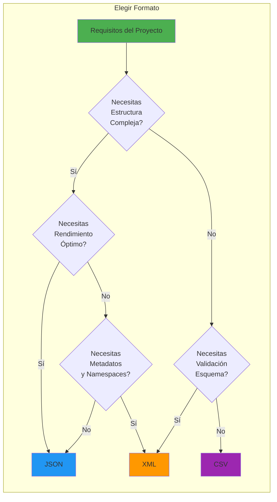
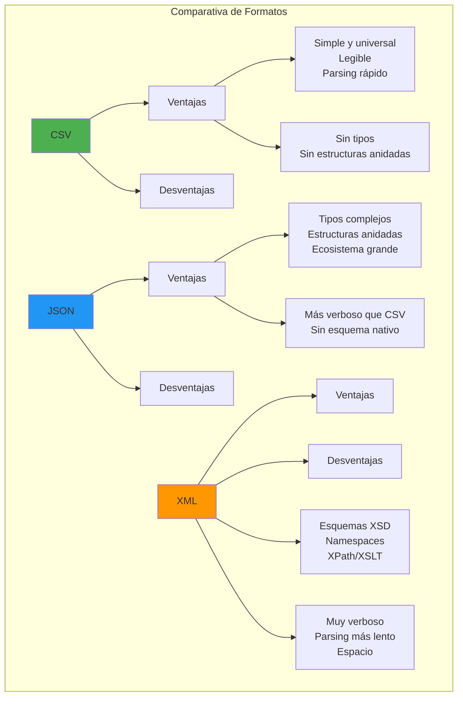

- [7. Ficheros y Formatos de Intercambio en .NET](#7-ficheros-y-formatos-de-intercambio-en-net)
  - [7.1. Gestión de recursos y archivos](#71-gestión-de-recursos-y-archivos)
    - [7.1.1. El patrón IDisposable y la gestión de recursos no administrados](#711-el-patrón-idisposable-y-la-gestión-de-recursos-no-administrados)
    - [7.1.2. La declaración using: sintaxis y semántica](#712-la-declaración-using-sintaxis-y-semántica)
    - [7.1.3. La API System.IO: visión general](#713-la-api-systemio-visión-general)
    - [7.1.4. Stream: la abstracción fundamental de flujos de datos](#714-stream-la-abstracción-fundamental-de-flujos-de-datos)
    - [7.1.5. Clases derivadas de Stream: FileStream, MemoryStream, NetworkStream](#715-clases-derivadas-de-stream-filestream-memorystream-networkstream)
    - [7.1.6. Lectura y escritura con StreamReader y StreamWriter](#716-lectura-y-escritura-con-streamreader-y-streamwriter)
    - [7.1.7. La clase File: operaciones de alto nivel](#717-la-clase-file-operaciones-de-alto-nivel)
    - [7.1.8. La clase Directory y Path: gestión del sistema de archivos](#718-la-clase-directory-y-path-gestión-del-sistema-de-archivos)
    - [7.1.9. Clases BinaryReader y BinaryWriter: formato binario estructurado](#719-clases-binaryreader-y-binarywriter-formato-binario-estructurado)
  - [7.2. Formatos de intercambio de datos](#72-formatos-de-intercambio-de-datos)
    - [7.2.1. Fundamentos de los formatos de intercambio](#721-fundamentos-de-los-formatos-de-intercambio)
    - [7.2.2. CSV: formato de valores separados por comas](#722-csv-formato-de-valores-separados-por-comas)
    - [7.2.3. JSON: JavaScript Object Notation](#723-json-javascript-object-notation)
    - [7.2.4. XML: Extensible Markup Language](#724-xml-extensible-markup-language)
    - [7.2.5. Comparativa técnica de formatos](#725-comparativa-técnica-de-formatos)
  - [7.3. Resumen](#73-resumen)

# 7. Ficheros y Formatos de Intercambio en .NET

El manejo de archivos y la serialización de datos son competencias fundamentales para cualquier desarrollador. A lo largo de este capítulo, exploraremos en profundidad las APIs de .NET para la gestión de archivos y los tres formatos de intercambio más utilizados en el desarrollo moderno: CSV, JSON y XML. Estos conocimientos son esenciales para aplicaciones que necesitan persistir datos, intercambiar información con otros sistemas, o configurar su comportamiento mediante archivos externos.

La correcta gestión de recursos externos, especialmente la memoria no administrada que utilizan los flujos de datos, es crucial para evitar fugas de memoria y garantizar el rendimiento de nuestras aplicaciones. Asimismo, la elección del formato de intercambio apropiado tiene implicaciones significativas en la legibilidad del código, el rendimiento de serialización, y la interoperabilidad con otros sistemas.

## 7.1. Gestión de recursos y archivos

### 7.1.1. El patrón IDisposable y la gestión de recursos no administrados

El paradigma de programación en entornos administrados como .NET establece que el **Garbage Collector (GC)** es responsable de liberar la memoria de los objetos que ya no son alcanzables. Sin embargo, existen recursos que no están bajo el control del GC: identificadores de archivos, conexiones de red, handles de ventana, etc. Estos recursos, conocidos como **recursos no administrados** o **recursos nativos**, deben ser liberados explícitamente cuando ya no son necesarios.

El patrón **IDisposable** es la solución de .NET para este problema. Define un mecanismo mediante el cual los objetos que adquieren recursos no administrados pueden indicar cuándo deben ser liberados. La interfaz es extremadamente simple, pero su correcta implementación y uso son fundamentales para escribir código robusto.

```csharp
namespace GestionRecursos.Ejemplos
{
    /// <summary>
    /// Ejemplos del patrón IDisposable y la gestión de recursos.
    /// </summary>
    public class EjemplosIDisposable
    {
        public class GestorRecursos(IntPtr handle, IntPtr otroHandle) : IDisposable
        {
            private bool _disposed = false;

            ~GestorRecursos()
            {
                Dispose(false);
            }

            public void Dispose()
            {
                Dispose(true);
                GC.SuppressFinalize(this);
            }

            protected virtual void Dispose(bool disposing)
            {
                if (!_disposed)
                {
                    if (disposing)
                    {
                    }

                    if (handle != IntPtr.Zero)
                    {
                        handle = IntPtr.Zero;
                    }

                    if (otroHandle != IntPtr.Zero)
                    {
                        otroHandle = IntPtr.Zero;
                    }

                    _disposed = true;
                }
            }
        }
    }
}
```

### 7.1.2. La declaración using: sintaxis y semántica

La declaración `using` en C# es una construcción sintáctica que garantiza la llamada a `Dispose()` al final del bloque de código, incluso si ocurre una excepción. Esta característica la hace ideal para trabajar con recursos que implementan `IDisposable`, incluyendo flujos de archivos, conexiones de red, identificadores de gráficos, y cualquier otro recurso que requiera liberación explícita.

C# 8 introdujo la **declaración using** (como alternativa a la **sentencia using** tradicional), que permite un código más limpio al eliminar la necesidad de bloques anidados y llaves adicionales.

```csharp
namespace GestionRecursos.Using
{
    /// <summary>
    /// Ejemplos de la declaración using en C#.
    /// </summary>
    public class EjemplosUsing
    {
        // SENTENCIA using (C# 1.0+)
        // Requiere llaves explícitas
        public static void DemoSentenciaUsing()
        {
            using (var reader = new StreamReader("archivo.txt"))
            {
                string contenido = reader.ReadToEnd();
                Console.WriteLine($"Leído {contenido.Length} caracteres");
            } // reader.Dispose() se llama aquí automáticamente
            
            // Aunque ocurra una excepción, Dispose() se asegura de llamar
            try
            {
                using (var writer = new StreamWriter("salida.txt"))
                {
                    writer.WriteLine("Hola mundo");
                } // writer.Dispose() se llama
            }
            catch (Exception)
            {
                // writer.Dispose() ya fue llamado
                Console.WriteLine("Ocurrió un error");
            }
        }
        
        // DECLARACIÓN using (C# 8+)
        // Sintaxis más limpia sin llaves adicionales
        public static void DemoDeclaracionUsing()
        {
            using var reader = new StreamReader("archivo.txt");
            string contenido = reader.ReadToEnd();
            Console.WriteLine($"Leído {contenido.Length} caracteres");
            // reader.Dispose() se llama al final del scope actual
            
            // Múltiples declaraciones using
            using var reader1 = new StreamReader("archivo1.txt");
            using var reader2 = new StreamReader("archivo2.txt");
            
            string contenido1 = reader1.ReadToEnd();
            string contenido2 = reader2.ReadToEnd();
            // Ambos se disposed al final del método
            
            // Anidar usando statements
            using (var readerInterno = new StreamReader("interno.txt"))
            using var writerInterno = new StreamWriter("salida.txt");
            
            string linea;
            while ((linea = readerInterno.ReadLine()) != null)
            {
                writerInterno.WriteLine(linea.ToUpper());
            }
        }
        
        // Combinación de técnicas
        public static void ProcesarArchivos(string entrada, string salida)
        {
            try
            {
                using var reader = new StreamReader(entrada);
                using var writer = new StreamWriter(salida);
                
                string? linea;
                int contador = 0;
                
                while ((linea = reader.ReadLine()) != null)
                {
                    writer.WriteLine(linea);
                    contador++;
                }
                
                Console.WriteLine($"Procesadas {contador} líneas");
            }
            catch (FileNotFoundException)
            {
                Console.WriteLine("Archivo no encontrado");
            }
            catch (UnauthorizedAccessException)
            {
                Console.WriteLine("Acceso denegado");
            }
            // reader y writer ya están disposed gracias a using
        }
        
        // Patrón async con IAsyncDisposable (C# 8+)
        public static async Task DemoAsyncDisposable()
        {
            using var stream = new FileStream("archivo.txt", FileMode.Open);
            
            byte[] buffer = new byte[1024];
            int bytesLeidos;
            
            while ((bytesLeidos = await stream.ReadAsync(buffer.AsMemory(0, buffer.Length))) > 0)
            {
                await Console.Out.WriteAsync(Encoding.UTF8.GetString(buffer, 0, bytesLeidos));
            }
        }
    }
}
```

### 7.1.3. La API System.IO: visión general

El namespace `System.IO` es el namespace central en .NET para todas las operaciones de entrada/salida. Proporciona clases para manipular archivos, directorios, y flujos de datos, así como utilidades para trabajar con rutas del sistema de archivos y serialización básica.

La API está organizada en varias categorías funcionales:

- **Clases de flujo (Stream, FileStream, MemoryStream, NetworkStream, etc.)**: Abstracciones para leer y escribir bytes
- **Lectores y escritores de texto (StreamReader, StreamWriter)**: Facilitan el trabajo con texto
- **Clases de archivo y directorio (File, FileInfo, Directory, DirectoryInfo)**: Operaciones de alto nivel
- **Clases de acceso aleatorio (FileStream)**: Lectura/escritura en posiciones específicas
- **Clases de serialización (BinaryReader, BinaryWriter)**: Formato binario estructurado

```csharp
namespace SystemIO.Ejemplos
{
    /// <summary>
    /// Visión general de las clases principales de System.IO.
    /// </summary>
    public class VisionGeneralAPI
    {
        public static void DemoClasesPrincipales()
        {
            // File - métodos estáticos de alto nivel
            string contenido = File.ReadAllText("archivo.txt");
            File.WriteAllText("salida.txt", contenido);
            File.Copy("origen.txt", "destino.txt");
            File.Move("antiguo.txt", "nuevo.txt");
            File.Delete("obsoleto.txt");
            
            // FileInfo - información detallada sobre archivos
            var info = new FileInfo("documento.pdf");
            Console.WriteLine($"Nombre: {info.Name}");
            Console.WriteLine($"Tamaño: {info.Length} bytes");
            Console.WriteLine($"Creado: {info.CreationTime}");
            Console.WriteLine($"Extensión: {info.Extension}");
            
            // Directory - métodos estáticos para directorios
            Directory.CreateDirectory("nueva-carpeta");
            string[] archivos = Directory.GetFiles("carpeta");
            string[] subdirs = Directory.GetDirectories("carpeta", "*", SearchOption.AllDirectories);
            
            // DirectoryInfo - información sobre directorios
            var dirInfo = new DirectoryInfo("proyecto");
            Console.WriteLine($"Nombre: {dirInfo.Name}");
            Console.WriteLine($"Archivos: {dirInfo.GetFiles().Length}");
            Console.WriteLine($"Subdirectorios: {dirInfo.GetDirectories().Length}");
            
            // Path - manipulación de rutas multiplataforma
            string ruta = @"C:\Users\Documents\archivo.txt";
            string directorio = Path.GetDirectoryName(ruta);  // "C:\Users\Documents"
            string nombre = Path.GetFileName(ruta);           // "archivo.txt"
            string extension = Path.GetExtension(ruda);       // ".txt"
            string sinExtension = Path.GetFileNameWithoutExtension(ruta);  // "archivo"
            
            // Combinar rutas de forma segura
            string rutaCompleta = Path.Combine(directorio, "subdir", nombre);
        }
    }
}
```

### 7.1.4. Stream: la abstracción fundamental de flujos de datos

`Stream` es la clase base abstracta que representa una secuencia de bytes. Todos los flujos en .NET derivan de `Stream`, proporcionando una interfaz común para operaciones de lectura, escritura y búsqueda. Esta abstracción permite escribir código que funciona uniformemente con diferentes fuentes de datos: archivos en disco, memoria, conexiones de red, etc.

Los flujos operan fundamentalmente en tres modos: lectura (obtener datos del flujo hacia el programa), escritura (enviar datos del programa hacia el flujo), y búsqueda (modificar la posición actual de lectura/escritura).

```csharp
namespace SystemIO.Stream
{
    /// <summary>
    /// Ejemplos detallados del uso de Stream.
    /// </summary>
    public class EjemplosStream
    {
        // Propiedades fundamentales de Stream
        public static void DemoPropiedadesStream()
        {
            using var stream = new FileStream("datos.bin", FileMode.Open);
            
            // CanRead: ¿el stream permite lectura?
            if (stream.CanRead)
            {
                byte[] buffer = new byte[1024];
                int bytesLeidos = stream.Read(buffer, 0, buffer.Length);
            }
            
            // CanWrite: ¿el stream permite escritura?
            if (stream.CanWrite)
            {
                byte[] datos = Encoding.UTF8.GetBytes("Hola");
                stream.Write(datos, 0, datos.Length);
            }
            
            // CanSeek: ¿el stream permite búsqueda?
            if (stream.CanSeek)
            {
                // Posición actual
                long posicion = stream.Position;
                
                // Ir al inicio
                stream.Seek(0, SeekOrigin.Begin);
                
                // Ir al final
                stream.Seek(0, SeekOrigin.End);
                
                // Ir a posición específica
                stream.Seek(100, SeekOrigin.Begin);
                
                // Longitud del stream
                long longitud = stream.Length;
                
                // Establecer longitud
                stream.SetLength(2048);
            }
        }
        
        // Métodos fundamentales de Stream
        public static void DemoMetodosStream()
        {
            using var stream = new MemoryStream();
            
            // Read - lee bytes del stream
            byte[] buffer = new byte[1024];
            int bytesLeidos = stream.Read(buffer, 0, buffer.Length);
            
            // Write - escribe bytes al stream
            byte[] datos = Encoding.UTF8.GetBytes("Mensaje");
            stream.Write(datos, 0, datos.Length);
            
            // ReadByte/WriteByte - operaciones de byte individual
            int byteLeido = stream.ReadByte();
            if (byteLeido >= 0)
            {
                Console.WriteLine($"Byte leído: {(char)byteLeido}");
            }
            stream.WriteByte(65);  // Escribir 'A'
            
            // Flush - asegurar que los datos escritos se envíen
            // Importante para streams con buffer
            stream.Flush();
            
            // CopyTo - copiar todo el contenido a otro stream
            using var destino = new MemoryStream();
            stream.Position = 0;  // Ir al inicio
            stream.CopyTo(destino);
        }
        
        // Implementación personalizada de Stream
        public class StreamPersonalizado : Stream
        {
            private readonly byte[] _datos;
            private int _posicion;
            
            public StreamPersonalizado(byte[] datos)
            {
                _datos = datos;
                _posicion = 0;
            }
            
            public override bool CanRead => true;
            public override bool CanSeek => true;
            public override bool CanWrite => false;
            
            public override long Length => _datos.Length;
            
            public override long Position
            {
                get => _posicion;
                set => _posicion = (int)value;
            }
            
            public override int Read(byte[] buffer, int offset, int count)
            {
                int bytesDisponibles = _datos.Length - _posicion;
                int bytesALeer = Math.Min(count, bytesDisponibles);
                
                Array.Copy(_datos, _posicion, buffer, offset, bytesALeer);
                _posicion += bytesALeer;
                
                return bytesALeer;
            }
            
            public override long Seek(long offset, SeekOrigin origin)
            {
                _posicion = origin switch
                {
                    SeekOrigin.Begin => (int)offset,
                    SeekOrigin.Current => _posicion + (int)offset,
                    SeekOrigin.End => _datos.Length + (int)offset,
                    _ => throw new ArgumentException("Origin inválido")
                };
                return _posicion;
            }
            
            public override void SetLength(long value)
            {
                throw new NotSupportedException();
            }
            
            public override void Write(byte[] buffer, int offset, int count)
            {
                throw new NotSupportedException();
            }
        }
    }
}
```

### 7.1.5. Clases derivadas de Stream: FileStream, MemoryStream, NetworkStream

.NET proporciona múltiples implementaciones concretas de `Stream`, cada una optimizada para un caso de uso específico. Comprender cuándo usar cada una es crucial para escribir código eficiente.

**FileStream** se utiliza para leer y escribir archivos en el sistema de archivos. Soporta operaciones sincrónicas y asíncronas, y puede configurarse con diferentes modos de compartición y acceso.

**MemoryStream** opera sobre un buffer en memoria en lugar de un archivo. Es extremadamente rápido para operaciones temporales o cuando los datos no necesitan persistirse.

**NetworkStream** representa un flujo de datos sobre una conexión de red, típicamente mediante sockets TCP.

```csharp
namespace SystemIO.Stream.Derivadas
{
    /// <summary>
    /// Ejemplos de las principales clases derivadas de Stream.
    /// </summary>
    public class EjemplosStreamsDerivados
    {
        // FileStream - operaciones con archivos
        public static void DemoFileStream()
        {
            // Crear archivo nuevo para escritura
            using (var fs = new FileStream(
                "datos.bin", 
                FileMode.Create,      // Crear o sobrescribir
                FileAccess.Write,     // Solo escritura
                FileShare.None))      // No compartir mientras está abierto
            {
                byte[] datos = { 1, 2, 3, 4, 5 };
                fs.Write(datos, 0, datos.Length);
            }
            
            // Abrir archivo existente para lectura
            using (var fs = new FileStream(
                "datos.bin",
                FileMode.Open,
                FileAccess.Read,
                FileShare.Read))
            {
                byte[] buffer = new byte[fs.Length];
                int bytesLeidos = fs.Read(buffer, 0, buffer.Length);
                Console.WriteLine($"Leídos {bytesLeidos} bytes");
            }
            
            // FileMode opciones:
            // - CreateNew: crea nuevo, falla si existe
            // - Create: crea o sobrescribe
            // - Open: abre existente, falla si no existe
            // - OpenOrCreate: abre o crea
            // - Truncate: abre y trunca a 0
            // - Append: abre para append, crea si no existe
            
            // Modo asíncrono (C# 8+)
            using (var fs = new FileStream(
                "async.txt",
                FileMode.Create,
                FileAccess.Write,
                FileShare.None,
                bufferSize: 4096,
                useAsync: true))
            {
                byte[] datos = Encoding.UTF8.GetBytes("Escritura asíncrona");
                await fs.WriteAsync(datos.AsMemory(0, datos.Length));
            }
        }
        
        // MemoryStream - operaciones en memoria
        public static void DemoMemoryStream()
        {
            // Crear MemoryStream vacío
            using var memory = new MemoryStream();
            
            // Crear con capacidad inicial
            using var memoryConCapacidad = new MemoryStream(1024);
            
            // Crear desde byte[]
            byte[] datosExistentes = { 1, 2, 3, 4, 5 };
            using var desdeArray = new MemoryStream(datosExistentes);
            
            // Escribir bytes
            byte[] nuevosDatos = { 10, 20, 30 };
            memory.Write(nuevosDatos, 0, nuevosDatos.Length);
            
            // Obtener bytes como array
            byte[] resultado = memory.ToArray();
            
            // Obtener bytes como ReadOnlySpan
            ReadOnlySpan<byte> span = memory.ToArray();
            
            // Resetear posición para releer
            memory.Position = 0;
            
            // Copiar a archivo
            using var fileStream = new FileStream("desde-memory.bin", FileMode.Create);
            memory.CopyTo(fileStream);
        }
        
        // BufferedStream - agregar buffer a otro stream
        public static void DemoBufferedStream()
        {
            using var fileStream = new FileStream("buffered.bin", FileMode.Create);
            using var buffered = new BufferedStream(fileStream, bufferSize: 8192);
            
            // Las operaciones de lectura/escritura usan el buffer
            byte[] datos = Enumerable.Range(0, 1000).Select(i => (byte)(i % 256)).ToArray();
            buffered.Write(datos, 0, datos.Length);
            // El buffer se flush al dispose o cuando se llena
        }
        
        // Stream cero/null - para descartar datos
        public static void DemoNullStream()
        {
            using var nullStream = Stream.Null;
            
            // Escribir a NullStream no hace nada
            byte[] datos = Encoding.UTF8.GetBytes("No se guarda");
            nullStream.Write(datos, 0, datos.Length);
            
            // Leer de NullStream devuelve 0
            byte[] buffer = new byte[1024];
            int leido = nullStream.Read(buffer, 0, buffer.Length);
            Console.WriteLine($"Leído: {leido} bytes");  // 0
        }
    }
}
```

### 7.1.6. Lectura y escritura con StreamReader y StreamWriter

`StreamReader` y `StreamWriter` son clases especializadas que facilitan la lectura y escritura de texto, respectivamente. Manejan automáticamente la codificación de caracteres, las líneas de texto, y proporcionan métodos convenientes para trabajar con strings en lugar de bytes.

```csharp
namespace SystemIO.Stream.Texto
{
    /// <summary>
    /// Ejemplos de StreamReader y StreamWriter.
    /// </summary>
    public class EjemplosLecturaEscritura
    {
        // StreamReader - lectura de texto
        public static void DemoStreamReader()
        {
            using var reader = new StreamReader("archivo.txt", Encoding.UTF8);
            
            // Leer todo el contenido
            string contenido = reader.ReadToEnd();
            
            // Leer línea por línea
            string? linea;
            while ((linea = reader.ReadLine()) != null)
            {
                Console.WriteLine(linea);
            }
            
            // Leer un carácter
            int caracter = reader.Read();
            char caracterChar = (char)caracter;
            
            // Leer bloque de caracteres
            char[] buffer = new char[1024];
            int caracteresLeidos = reader.Read(buffer, 0, buffer.Length);
            
            // Peek - ver siguiente carácter sin avanzar
            int siguiente = reader.Peek();
            
            // Volver al inicio
            reader.BaseStream.Position = 0;
            reader.DiscardBufferedData();  // Limpiar buffer interno
        }
        
        // StreamWriter - escritura de texto
        public static void DemoStreamWriter()
        {
            using var writer = new StreamWriter("salida.txt", append: false, Encoding.UTF8);
            
            // Escribir línea
            writer.WriteLine("Primera línea");
            writer.Write("Sin salto de línea");
            
            // Escribir múltiples líneas
            writer.WriteLine();
            writer.WriteLine("Línea con formato: {0}", DateTime.Now);
            
            // Auto-flush
            writer.AutoFlush = true;  // Cada WriteLine.flush() inmediatamente
            
            // Escribir caracteres individuales
            writer.Write('A');
            writer.Write('B');
            writer.Write('C');
        }
        
        // Combinación completa de lectura y procesamiento
        public static void ProcesarArchivo(string entrada, string salida)
        {
            using var reader = new StreamReader(entrada, Encoding.UTF8);
            using var writer = new StreamWriter(salida, append: false, Encoding.UTF8);
            
            string? linea;
            int numeroLinea = 0;
            
            while ((linea = reader.ReadLine()) != null)
            {
                numeroLinea++;
                var procesada = ProcesarLinea(linea);
                writer.WriteLine($"{numeroLinea:0000}: {procesada}");
            }
        }
        
        private static string ProcesarLinea(string linea)
        {
            // Procesamiento de ejemplo
            return linea.ToUpperInvariant();
        }
        
        // Uso de 'using' con múltiples readers/writers
        public static void CompararArchivos(string archivo1, string archivo2)
        {
            using var reader1 = new StreamReader(archivo1);
            using var reader2 = new StreamReader(archivo2);
            
            string? linea1, linea2;
            int lineaNum = 0;
            
            do
            {
                linea1 = reader1.ReadLine();
                linea2 = reader2.ReadLine();
                lineaNum++;
                
                if (linea1 != linea2)
                {
                    Console.WriteLine($"Diferencia en línea {lineaNum}");
                    Console.WriteLine($"  Archivo 1: {linea1}");
                    Console.WriteLine($"  Archivo 2: {linea2}");
                }
            } while (linea1 != null || linea2 != null);
        }
    }
}
```

### 7.1.7. La clase File: operaciones de alto nivel

La clase `File` proporciona métodos estáticos convenientes para operaciones comunes de archivos. Aunque menos flexible que `FileStream`, es ideal para escenarios donde necesitamos leer o escribir archivos completos de forma simple y directa.

```csharp
namespace SystemIO.File
{
    /// <summary>
    /// Ejemplos de la clase File.
    /// </summary>
    public class EjemplosFile
    {
        // Lectura completa
        public static void DemoLecturaCompleta()
        {
            // Leer todo como texto
            string contenido = File.ReadAllText("archivo.txt");
            
            // Leer todo como bytes
            byte[] bytes = File.ReadAllBytes("imagen.png");
            
            // Leer todas las líneas
            string[] lineas = File.ReadAllLines("log.txt");
            
            // Leer con Encoding específico
            string utf8Content = File.ReadAllText("texto_utf8.txt", Encoding.UTF8);
        }

        // Escritura completa
        public static void DemoEscrituraCompleta()
        {
            // Escribir texto (crea o sobrescribe)
            File.WriteAllText("salida.txt", "Hola mundo");
            
            // Escribir array de bytes
            byte[] datos = { 0x48, 0x65, 0x6C, 0x6C, 0x6F };
            File.WriteAllBytes("binario.bin", datos);
            
            // Escribir líneas (sobrescribe)
            string[] lineas = { "Línea 1", "Línea 2", "Línea 3" };
            File.WriteAllLines("multiples.txt", lineas);
            
            // Escribir con Encoding
            File.WriteAllText("utf8.txt", "Ñoño", Encoding.UTF8);
            
            // Append (añadir al final)
            File.AppendAllText("log.txt", $"{DateTime.Now}: Nueva entrada\n");
            
            // Append con líneas
            File.AppendAllLines("log.txt", new[] { "Entrada 1", "Entrada 2" });
        }

        // Copiar, mover, eliminar
        public static void DemoGestiónArchivos()
        {
            // Copiar (falla si existe destino)
            File.Copy("origen.txt", "copia.txt");
            
            // Copiar (sobrescribir si existe)
            File.Copy("origen.txt", "copia.txt", overwrite: true);
            
            // Mover (renombrar)
            File.Move("viejo.txt", "nuevo.txt");
            
            // Mover (sobrescribir)
            File.Move("viejo.txt", "existente.txt", overwrite: true);
            
            // Eliminar
            File.Delete("obsoleto.txt");
            
            // Verificar existencia
            if (File.Exists("archivo.txt"))
            {
                var info = new FileInfo("archivo.txt");
                Console.WriteLine($"Tamaño: {info.Length} bytes");
            }
        }

        // Metadatos
        public static void DemoMetadatos()
        {
            var archivo = new FileInfo("documento.pdf");
            
            // Propiedades de solo lectura
            Console.WriteLine($"Nombre: {archivo.Name}");
            Console.WriteLine($"Directorio: {archivo.DirectoryName}");
            Console.WriteLine($"Extensión: {archivo.Extension}");
            Console.WriteLine($"Tamaño: {archivo.Length} bytes");
            Console.WriteLine($"Creación: {archivo.CreationTime}");
            Console.WriteLine($"Último acceso: {archivo.LastAccessTime}");
            Console.WriteLine($"Última modificación: {archivo.LastWriteTime}");
            
            // Modificar timestamps
            archivo.CreationTime = DateTime.Now;
            archivo.LastWriteTime = DateTime.Now;
        }

        // File con opciones de texto
        public static void DemoOpcionesTexto()
        {
            // Lectura con diferentes encodings
            string utf8 = File.ReadAllText("texto.txt", Encoding.UTF8);
            string ascii = File.ReadAllText("texto.txt", Encoding.ASCII);
            
            // Escritura con diferentes encodings
            File.WriteAllText("utf8.txt", "Ñoño", new UTF8Encoding(false));  // sin BOM
            File.WriteAllText("utf8_bom.txt", "Ñoño", new UTF8Encoding(true));  // con BOM
        }
    }
}
```

### 7.1.8. La clase Directory y Path: gestión del sistema de archivos

La clase `Directory` proporciona métodos para manipular directorios, mientras que `Path` ofrece utilidades para trabajar con rutas de archivos de forma multiplataforma.

```csharp
namespace SystemIO.Directory
{
    /// <summary>
    /// Ejemplos de Directory y Path.
    /// </summary>
    public class EjemplosDirectoryPath
    {
        // Directory - operaciones básicas
        public static void DemoOperacionesDirectorios()
        {
            // Crear directorio
            Directory.CreateDirectory("nueva-carpeta");
            
            // Crear estructura anidada
            Directory.CreateDirectory(@"carpeta\subcarpeta\mas-profundo");
            
            // Verificar existencia
            if (Directory.Exists("mi-carpeta"))
            {
                // Listar archivos
                string[] archivos = Directory.GetFiles("mi-carpeta");
                string[] archivosRecursivo = Directory.GetFiles("mi-carpeta", "*", SearchOption.AllDirectories);
                
                // Listar subdirectorios
                string[] subdirectorios = Directory.GetDirectories("mi-carpeta");
                string[] subdirRecursivo = Directory.GetDirectories("mi-carpeta", "*", SearchOption.AllDirectories);
            }
            
            // Mover directorio
            Directory.Move("viejo-nombre", "nuevo-nombre");
            
            // Eliminar directorio (vacío)
            Directory.Delete("obsoleto");
            
            // Eliminar directorio con contenido
            Directory.Delete("con-archivos", recursive: true);
        }

        // DirectoryInfo - versión orientada a objetos
        public static void DemoDirectoryInfo()
        {
            var dir = new DirectoryInfo("proyecto");
            
            // Información del directorio
            Console.WriteLine($"Nombre: {dir.Name}");
            Console.WriteElemento($"Path completo: {dir.FullName}");
            Console.WriteLine($"Padre: {dir.Parent?.Name}");
            Console.WriteLine($"Raíz: {dir.Root.Name}");
            
            // Metadatos
            Console.WriteLine($"Creación: {dir.CreationTime}");
            Console.WriteLine($"Última modificación: {dir.LastWriteTime}");
            
            // Contenido
            var archivos = dir.GetFiles();
            var subdirs = dir.GetDirectories();
            
            // Búsqueda con patrón
            var csFiles = dir.GetFiles("*.cs", SearchOption.AllDirectories);
        }

        // Path - manipulación de rutas
        public static void DemoPath()
        {
            string ruta = @"C:\Users\Documents\proyecto\archivo.txt";
            
            // Componentes de la ruta
            string directorio = Path.GetDirectoryName(ruta);     // C:\Users\Documents\proyecto
            string nombre = Path.GetFileName(ruta);              // archivo.txt
            string extension = Path.GetExtension(ruta);          // .txt
            string sinExtension = Path.GetFileNameWithoutExtension(ruta);  // archivo
            
            // Combinar rutas (multiplataforma)
            string combinada = Path.Combine(directorio, "subdir", "archivo.txt");
            // Windows: C:\Users\Documents\proyecto\subdir\archivo.txt
            // Linux: /home/user/documents/proyecto/subdir/archivo.txt
            
            // Cambiar extensión
            string nuevoNombre = Path.ChangeExtension(ruta, ".md");
            
            // Generar nombre temporal
            string tempFile = Path.GetTempFileName();
            string tempPath = Path.GetTempPath();
            
            // Caracteres inválidos
            char[] caracteresInvalidos = Path.GetInvalidPathChars();
            char[] caracteresInvalidosNombre = Path.GetInvalidFileNameChars();
            
            // Random filename (para archivos temporales)
            string randomName = Path.GetRandomFileName();
            
            // Path relativo
            string relativa = Path.GetRelativePath(@"C:\Users", @"C:\Users\Documents\archivo.txt");
            // Resultado: Documents\archivo.txt
        }

        // Información del sistema de archivos
        public static void DemoInfoSistema()
        {
            // Unidad actual
            string unidadRaiz = Path.GetPathRoot(Environment.CurrentDirectory);
            
            // Directorios especiales
            string appData = Environment.GetFolderPath(Environment.SpecialFolder.ApplicationData);
            string desktop = Environment.GetFolderPath(Environment.SpecialFolder.Desktop);
            string documents = Environment.GetFolderPath(Environment.SpecialFolder.MyDocuments);
            
            // Carpeta actual
            string actual = Environment.CurrentDirectory;
            
            // Drives/discos disponibles
            var drives = DriveInfo.GetDrives();
            foreach (var drive in drives)
            {
                if (drive.IsReady)
                {
                    Console.WriteLine($"{drive.Name}: {drive.TotalFreeSpace} bytes libres de {drive.TotalSize}");
                }
            }
        }

        // Operaciones prácticas
        public static void CopiarDirectorio(string origen, string destino)
        {
            // Crear directorio destino
            Directory.CreateDirectory(destino);
            
            // Copiar archivos
            foreach (string archivo in Directory.GetFiles(origen))
            {
                string nombre = Path.GetFileName(archivo);
                string destinoArchivo = Path.Combine(destino, nombre);
                File.Copy(archivo, destinoArchivo);
            }
            
            // Copiar subdirectorios recursivamente
            foreach (string subdir in Directory.GetDirectories(origen))
            {
                string nombre = Path.GetFileName(subdir);
                string destinoSubdir = Path.Combine(destino, nombre);
                CopiarDirectorio(subdir, destinoSubdir);
            }
        }
    }
}
```

### 7.1.9. Clases BinaryReader y BinaryWriter: formato binario estructurado

Para datos binarios estructurados, `BinaryReader` y `BinaryWriter` proporcionan métodos convenientes para leer y escribir tipos primitivos directamente en binario.

```csharp
namespace SystemIO.Binary
{
    /// <summary>
    /// Ejemplos de BinaryReader y BinaryWriter.
    /// </summary>
    public class EjemplosBinario
    {
        // Escritura binaria
        public static void DemoEscrituraBinaria()
        {
            using var stream = new FileStream("datos.bin", FileMode.Create);
            using var writer = new BinaryWriter(stream);
            
            // Escribir tipos primitivos
            writer.Write(42);                    // int
            writer.Write(3.14159);              // double
            writer.Write(true);                  // bool
            writer.Write('A');                   // char
            writer.Write("Hola mundo");          // string
            writer.Write(new byte[] { 1, 2, 3 }); // byte[]
            
            // Escribir diferentes tipos explícitamente
            writer.Write((byte)255);
            writer.Write((short)32000);
            writer.Write((long)1000000000L);
            writer.Write(1.5f);                  // float
            writer.Write(0.123m);                // decimal
        }

        // Lectura binaria
        public static void DemoLecturaBinaria()
        {
            using var stream = new FileStream("datos.bin", FileMode.Open);
            using var reader = new BinaryReader(stream);
            
            // Leer tipos primitivos
            int entero = reader.ReadInt32();
            double real = reader.ReadDouble();
            bool booleano = reader.ReadBoolean();
            char caracter = reader.ReadChar();
            string texto = reader.ReadString();
            byte[] bytes = reader.ReadBytes(3);
        }

        // Formato personalizado
        public static void EscribirRegistro(string archivo, Persona persona)
        {
            using var stream = new FileStream(archivo, FileMode.Append);
            using var writer = new BinaryWriter(stream);
            
            // Escribir longitud del nombre primero (para strings de longitud variable)
            writer.Write(persona.Nombre.Length);
            writer.Write(persona.Nombre.ToCharArray());
            writer.Write(persona.Edad);
            writer.Write(persona.Saldo);
        }
        
        public static List<Persona> LeerRegistros(string archivo)
        {
            var personas = new List<Persona>();
            
            using var stream = new FileStream(archivo, FileMode.Open);
            using var reader = new BinaryReader(stream);
            
            try
            {
                while (stream.Position < stream.Length)
                {
                    int longitudNombre = reader.ReadInt32();
                    char[] chars = reader.ReadChars(longitudNombre);
                    int edad = reader.ReadInt32();
                    decimal saldo = reader.ReadDecimal();
                    
                    personas.Add(new Persona(
                        new string(chars), 
                        edad, 
                        saldo
                    ));
                }
            }
            catch (EndOfStreamException)
            {
                // Fin de archivo alcanzado normalmente
            }
            
            return personas;
        }
    }
    
    public record Persona(string Nombre, int Edad, decimal Saldo);
}
```

## 7.2. Formatos de intercambio de datos

### 7.2.1. Fundamentos de los formatos de intercambio

Los formatos de intercambio de datos son estándares que permiten representar información estructurada de forma que pueda ser leída y escrita por diferentes sistemas, lenguajes y plataformas. La elección del formato apropiado tiene implicaciones significativas en rendimiento, legibilidad, y interoperabilidad.

**Características deseables de un formato de intercambio:**
- **Legibilidad humana**: Que los desarrolladores puedan entender el contenido
- **Eficiencia de parsing**: Tiempo y recursos para procesar el formato
- **Tamaño**: Ocupación de almacenamiento y ancho de banda
- **Typed support**:表达能力 de tipos complejos y estructuras anidadas
- **Schema evolution**: Capacidad de añadir campos sin romper compatibilidad
- **Ecosistema**: Bibliotecas disponibles en diferentes lenguajes

**Los tres grandes formatos:**
- **CSV**: Simple, universal, pero limitado en estructura
- **JSON**: Equilibrio entre simplicidad y表达能力
- **XML**: Potente, autocontenido, pero verboso



### 7.2.2. CSV: formato de valores separados por comas

CSV es el formato más simple y universal para datos tabulares. Su simplicidad lo hace ideal para exportación/importación de datos, logs, y configuraciones simples. Sin embargo, carece de soporte nativo para tipos complejos o estructuras anidadas.

```csharp
namespace Formatos.CSV
{
    /// <summary>
    /// Ejemplos de lectura y escritura CSV.
    /// </summary>
    public class EjemplosCSV
    {
        // Lectura básica con string.Split (no recomendado para producción)
        public static void DemoLecturaBasica()
        {
            string[] lineas = File.ReadAllLines("datos.csv");
            
            foreach (string linea in lineas)
            {
                string[] campos = linea.Split(',');
                Console.WriteLine($"Columna 1: {campos[0]}, Columna 2: {campos[1]}");
            }
        }

        // Problemas con Split: campos que contienen comas
        public static void DemoProblemasCSV()
        {
            // Este campo contiene coma: "Smith, John"
            string linea = "John,Smith,45,\"Smith, John\"";
            
            // NO usar Split directamente - necesita parsing especial
        }

        // Usando TextFieldParser (.NET Framework) o bibliotecas externas
        // Recomendado: CsvHelper (NuGet) para producción
        public static void DemoCsvHelper()
        {
            // Instalación: Install-Package CsvHelper
            
            // Escritura
            var registros = new List<Persona>
            {
                new Persona("Ana", 25, "Madrid"),
                new Persona("Carlos", 30, "Barcelona")
            };
            
            using var writer = new StreamWriter("personas.csv");
            using var csv = new CsvHelper.CsvWriter(writer, CultureInfo.InvariantCulture);
            
            csv.WriteRecords(registros);
            
            // Lectura
            using var reader = new StreamReader("personas.csv");
            using var csvReader = new CsvHelper.CsvReader(reader, CultureInfo.InvariantCulture);
            
            var personasLeidas = csvReader.GetRecords<Persona>().ToList();
        }

        // Escritura manual (para casos simples)
        public static void EscrituraManual()
        {
            var personas = new List<(string Nombre, int Edad, string Ciudad)>
            {
                ("Ana", 25, "Madrid"),
                ("Carlos", 30, "Barcelona")
            };
            
            using var writer = new StreamWriter("personas.csv");
            
            // Escribir header
            writer.WriteLine("Nombre,Edad,Ciudad");
            
            // Escribir datos (escapar comillas y comas)
            foreach (var p in personas)
            {
                string nombre = EscapeCSV(p.Nombre);
                string ciudad = EscapeCSV(p.Ciudad);
                writer.WriteLine($"{nombre},{p.Edad},{ciudad}");
            }
        }
        
        private static string EscapeCSV(string valor)
        {
            if (valor.Contains(',') || valor.Contains('"') || valor.Contains('\n'))
            {
                return $"\"{valor.Replace("\"", "\"\"")}\"";
            }
            return valor;
        }

        // Lectura manual con manejo de edge cases
        public static List<Persona> LecturaManual()
        {
            var personas = new List<Persona>();
            var lineas = File.ReadAllLines("personas.csv");
            
            // Saltar header
            foreach (string linea in lineas.Skip(1))
            {
                var campos = ParseCSVLine(linea);
                if (campos.Length >= 3)
                {
                    personas.Add(new Persona(
                        campos[0],
                        int.Parse(campos[1]),
                        campos[2]
                    ));
                }
            }
            
            return personas;
        }
        
        private static string[] ParseCSVLine(string linea)
        {
            var campos = new List<string>();
            var campoActual = new StringBuilder();
            bool entreComillas = false;
            
            foreach (char c in linea)
            {
                if (c == '"')
                {
                    entreComillas = !entreComillas;
                }
                else if (c == ',' && !entreComillas)
                {
                    campos.Add(campoActual.ToString());
                    campoActual.Clear();
                }
                else
                {
                    campoActual.Append(c);
                }
            }
            
            campos.Add(campoActual.ToString());
            return campos.ToArray();
        }

        // CSV con diferentes delimitadores
        public static void DemoDelimitadores()
        {
            // Usar punto y coma (;) como separador
            var config = new CsvHelper.Configuration.CsvConfiguration(CultureInfo.InvariantCulture)
            {
                Delimiter = ";"
            };
        }
    }
    
    public record Persona(string Nombre, int Edad, string Ciudad);
}
```

🧠 **Analogía**: CSV es como una hoja de cálculo simple. Cada línea es una fila, cada coma separa las columnas. Es perfecto para datos tabulares pero se complica cuando un celda necesita contener una coma (como direcciones con "Calle Principal, 123").

### 7.2.3. JSON: JavaScript Object Notation

JSON se ha convertido en el formato de intercambio predominante en aplicaciones web y APIs modernas. Combina legibilidad humana con soporte para estructuras de datos complejas, tipos primitivos, y estructuras anidadas.

C# proporciona soporte nativo para JSON a través del espacio de nombres `System.Text.Json`, que es eficiente y fácil de usar.

```csharp
namespace Formatos.JSON
{
    /// <summary>
    /// Ejemplos de JSON en .NET con System.Text.Json.
    /// </summary>
    public class EjemplosJSON
    {
        // Serialización básica
        public static void DemoSerializacion()
        {
            var persona = new Persona
            {
                Nombre = "Ana",
                Edad = 25,
                Ciudad = "Madrid",
                Activo = true
            };
            
            // Serializar a string
            string json = JsonSerializer.Serialize(persona);
            // {"nombre":"Ana","edad":25,"ciudad":"Madrid","activo":true}
            
            // Serializar con indentación
            string jsonFormateado = JsonSerializer.Serialize(persona, new JsonSerializerOptions
            {
                WriteIndented = true
            });
        }

        // Deserialización
        public static void DemoDeserializacion()
        {
            string json = "{\"nombre\":\"Carlos\",\"edad\":30,\"ciudad\":\"Barcelona\",\"activo\":true}";
            
            var persona = JsonSerializer.Deserialize<Persona>(json);
        }

        // Tipos anidados y colecciones
        public static void DemoTiposComplejos()
        {
            var empresa = new Empresa
            {
                Nombre = "TechCorp",
                Fundacion = new DateTime(2020, 1, 15),
                Empleados = new List<Empleado>
                {
                    new Empleado { Nombre = "Ana", Cargo = " CTO", Salario = 80000 },
                    new Empleado { Nombre = "Carlos", Cargo = " Developer", Salario = 60000 }
                },
                Oficinas = new Dictionary<string, string>
                {
                    ["Madrid"] = "Calle Principal 1",
                    ["Barcelona"] = "Avenida del Mar 5"
                }
            };
            
            string json = JsonSerializer.Serialize(empresa, new JsonSerializerOptions
            {
                WriteIndented = true
            });
        }

        // Atributos de personalización
        public static void DemoAtributos()
        {
            var producto = new Producto
            {
                Id = 1,
                Nombre = "Laptop",
                Precio = 999.99m,
                Categoria = "Electrónica"
            };
            
            string json = JsonSerializer.Serialize(producto, new JsonSerializerOptions
            {
                PropertyNamingPolicy = JsonNamingPolicy.CamelCase
            });
            // {"id":1,"nombre":"Laptop","precio":999.99,"categoria":"Electrónica"}
        }

        // Propiedades ignoradas
        public static void DemoIgnorarPropiedades()
        {
            var orden = new Orden
            {
                Id = 123,
                Total = 99.99m,
                // Password nunca se serializa
                Password = "secreto"
            };
            
            string json = JsonSerializer.Serialize(orden);
            // {"id":123,"total":99.99}
        }

        //manejo de nulos
        public static void DemoNulos()
        {
            var persona = new Persona { Nombre = "Ana" };  // Edad y Ciudad son null
            
            // Incluir nulos
            string conNulos = JsonSerializer.Serialize(persona, new JsonSerializerOptions
            {
                DefaultIgnoreCondition = JsonIgnoreCondition.Never
            });
            // {"nombre":"Ana","edad":null,"ciudad":null}
            
            // Ignorar nulos
            string sinNulos = JsonSerializer.Serialize(persona, new JsonSerializerOptions
            {
                DefaultIgnoreCondition = JsonIgnoreCondition.WhenWritingNull
            });
            // {"nombre":"Ana"}
        }

        // JSON con referencias (preserve references)
        public static void DemoReferencias()
        {
            var config = new JsonSerializerOptions
            {
                ReferenceHandler = ReferenceHandler.Preserve
            };
            
            string json = JsonSerializer.Serialize(objeto, config);
        }

        // Streaming JSON (para archivos grandes)
        public static async Task DemoStreaming()
        {
            using var stream = new FileStream("grande.json", FileMode.Open);
            
            // Leer elemento por elemento
            await foreach (var persona in JsonSerializer.DeserializeAsyncEnumerable<Persona>(stream))
            {
                Console.WriteLine(persona.Nombre);
            }
        }
    }

    // Clases para los ejemplos
    public class Persona
    {
        public string? Nombre { get; set; }
        public int Edad { get; set; }
        public string? Ciudad { get; set; }
        public bool Activo { get; set; }
    }
    
    public class Empresa
    {
        public string Nombre { get; set; } = "";
        public DateTime Fundacion { get; set; }
        public List<Empleado> Empleados { get; set; } = new();
        public Dictionary<string, string> Oficinas { get; set; } = new();
    }
    
    public class Empleado
    {
        public string Nombre { get; set; } = "";
        public string Cargo { get; set; } = "";
        public decimal Salario { get; set; }
    }
    
    public class Producto
    {
        [JsonPropertyName("id")]
        public int Id { get; set; }
        
        [JsonPropertyName("nombre")]
        public string Nombre { get; set; } = "";
        
        [JsonIgnore]
        public string? Password { get; set; }
    }
    
    public class Orden
    {
        public int Id { get; set; }
        public decimal Total { get; set; }
        
        [JsonIgnore]
        public string Password { get; set; } = "";
    }
}
```

### 7.2.4. XML: Extensible Markup Language

XML es un formato verbose pero poderoso que proporciona validación mediante esquemas (XSD), espacios de nombres, y procesamiento estándar mediante XPath/XSLT. Todavía es común en sistemas empresariales, configuración (app.config, web.config), y documentos Office.

```csharp
namespace Formatos.XML
{
    /// <summary>
    /// Ejemplos de XML en .NET con System.Xml.
    /// </summary>
    public class EjemplosXML
    {
        // Serialización con XmlSerializer
        public static void DemoXmlSerializer()
        {
            var persona = new Persona
            {
                Nombre = "Ana",
                Edad = 25,
                Ciudad = "Madrid"
            };
            
            var serializer = new XmlSerializer(typeof(Persona));
            
            // A string
            using var writer = new StringWriter();
            serializer.Serialize(writer, persona);
            string xml = writer.ToString();
            
            // A file
            using var stream = new FileStream("persona.xml", FileMode.Create);
            serializer.Serialize(stream, persona);
        }

        // Deserialización
        public static void DemoDeserializacion()
        {
            var serializer = new XmlSerializer(typeof(Persona));
            
            using var stream = new FileStream("persona.xml", FileMode.Open);
            var persona = (Persona)serializer.Deserialize(stream);
        }

        // Atributos de personalización
        public static void DemoAtributos()
        {
            var producto = new Producto
            {
                Id = "P001",
                Nombre = "Laptop",
                Precio = 999.99m
            };
            
            var serializer = new XmlSerializer(typeof(Producto));
            serializer.Serialize(Console.Out, producto);
        }

        // XML con namespaces
        public static void DemoNamespaces()
        {
            var pedido = new Pedido
            {
                Id = 123,
                Cliente = "Ana",
                Items = new List<Item>
                {
                    new Item { Producto = "Laptop", Cantidad = 1 },
                    new Item { Producto = "Mouse", Cantidad = 2 }
                }
            };
            
            var namespaces = new XmlSerializerNamespaces();
            namespaces.Add("pc", "http://www.ejemplo.com/pedidos");
            namespaces.Add("xsi", "http://www.w3.org/2001/XMLSchema-instance");
            
            var serializer = new XmlSerializer(typeof(Pedido));
            serializer.Serialize(Console.Out, pedido, namespaces);
        }

        // LINQ to XML (XDocument) - API moderna
        public static void DemoLinqToXML()
        {
            // Crear documento
            var doc = new XDocument(
                new XDeclaration("1.0", "utf-8", "yes"),
                new XElement("personas",
                    new XElement("persona",
                        new XAttribute("id", 1),
                        new XElement("nombre", "Ana"),
                        new XElement("edad", 25)
                    ),
                    new XElement("persona",
                        new XAttribute("id", 2),
                        new XElement("nombre", "Carlos"),
                        new XElement("edad", 30)
                    )
                )
            );
            
            // Guardar
            doc.Save("personas.xml");
            
            // Cargar
            var docCargado = XDocument.Load("personas.xml");
            
            // Query LINQ to XML
            var mayores25 = docCargado.Descendants("persona")
                .Where(p => (int)p.Element("edad") > 25)
                .Select(p => (string)p.Element("nombre"))
                .ToList();
            
            // Navegación XPath
            var primerNombre = docCargado.XPathSelectElement("//persona[1]/nombre")?.Value;
        }

        // XML con XmlReader/XmlWriter (streaming)
        public static void DemoStreamingXML()
        {
            // Escritura streaming
            using var writer = XmlWriter.Create("stream.xml");
            writer.WriteStartElement("personas");
            
            foreach (var persona in ObtenerPersonas())
            {
                writer.WriteStartElement("persona");
                writer.WriteElementString("nombre", persona.Nombre);
                writer.WriteElementString("edad", persona.Edad.ToString());
                writer.WriteEndElement();
            }
            
            writer.WriteEndElement();
            
            // Lectura streaming
            using var reader = XmlReader.Create("stream.xml");
            while (reader.Read())
            {
                if (reader.NodeType == XmlNodeType.Element && reader.Name == "nombre")
                {
                    Console.WriteLine(reader.ReadElementContentAsString());
                }
            }
        }
    }

    // Clases para serialización XML
    [XmlRoot("persona")]
    public class Persona
    {
        [XmlElement("nombre")]
        public string? Nombre { get; set; }
        
        [XmlElement("edad")]
        public int Edad { get; set; }
        
        [XmlAttribute("ciudad")]
        public string? Ciudad { get; set; }
    }
    
    [XmlRoot("producto", Namespace = "http://www.ejemplo.com")]
    public class Producto
    {
        [XmlAttribute("id")]
        public string Id { get; set; } = "";
        
        [XmlElement("nombre")]
        public string Nombre { get; set; } = "";
        
        [XmlElement("precio")]
        public decimal Precio { get; set; }
    }
    
    public class Pedido
    {
        [XmlElement("id")]
        public int Id { get; set; }
        
        [XmlElement("cliente")]
        public string Cliente { get; set; } = "";
        
        [XmlArray("items")]
        [XmlArrayItem("item")]
        public List<Item> Items { get; set; } = new();
    }
    
    public class Item
    {
        [XmlElement("producto")]
        public string Producto { get; set; } = "";
        
        [XmlElement("cantidad")]
        public int Cantidad { get; set; }
    }
}
```

### 7.2.5. Comparativa técnica de formatos



| Característica | CSV | JSON | XML |
|----------------|-----|------|-----|
| **Legibilidad** | Alta | Alta | Media |
| **Typed support** | No | Sí | Sí |
| **Estructuras anidadas** | No | Sí | Sí |
| **Schema validation** | No | No (JSON Schema) | Sí (XSD) |
| **Namespace support** | No | No | Sí |
| **Tamaño** | Pequeño | Medio | Grande |
| **Parsing speed** | Rápido | Rápido | Lento |
| **Ecosistema** | Universal | Muy grande | Grande |
| **Casos de uso** | Exports, logs | APIs web, config | Enterprise, config |


## 7.3. Resumen

La gestión de archivos y formatos de intercambio son competencias fundamentales que todo desarrollador debe dominar.

**Gestión de Recursos y Archivos**
- El patrón `IDisposable` es esencial para liberar recursos no administrados
- La declaración `using` garantiza la liberación incluso con excepciones
- `Stream` es la abstracción central para读写 datos
- `File`, `Directory` y `Path` proporcionan operaciones de alto nivel
- `BinaryReader`/`BinaryWriter` para datos binarios estructurados

**Formatos de Intercambio**
- **CSV**: Ideal para datos tabulares simples, universal pero limitado
- **JSON**: Formato predominante para APIs web, equilibrado y expressivo
- **XML**: Potente con validación de esquemas, verbose pero estructurado

**Consideraciones de Rendimiento**
- Para archivos grandes, usar streaming (`JsonSerializer.DeserializeAsyncEnumerable`)
- Preferir `System.Text.Json` sobre `Newtonsoft.Json` para rendimiento
- Considerar compresión para transferencia de datos
