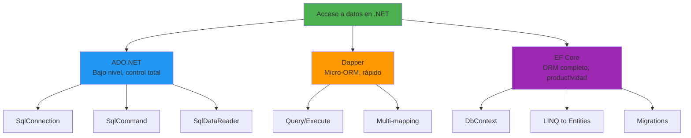
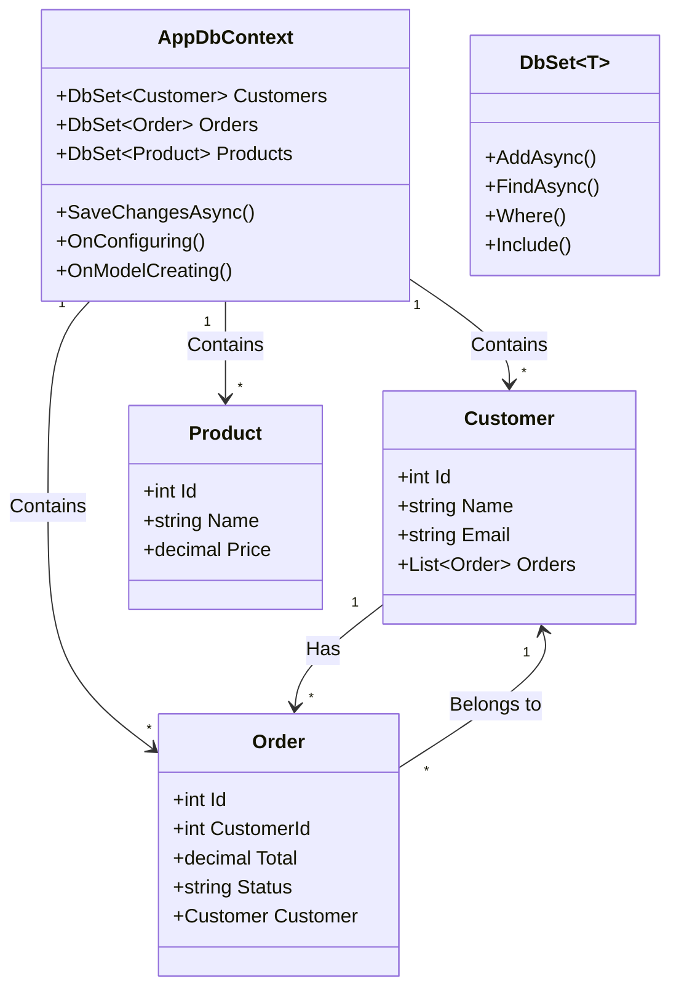
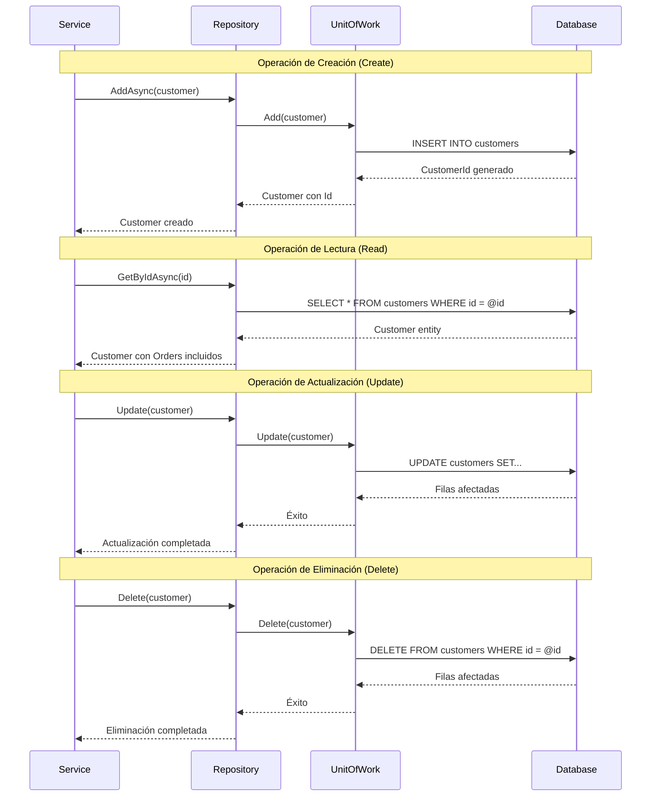
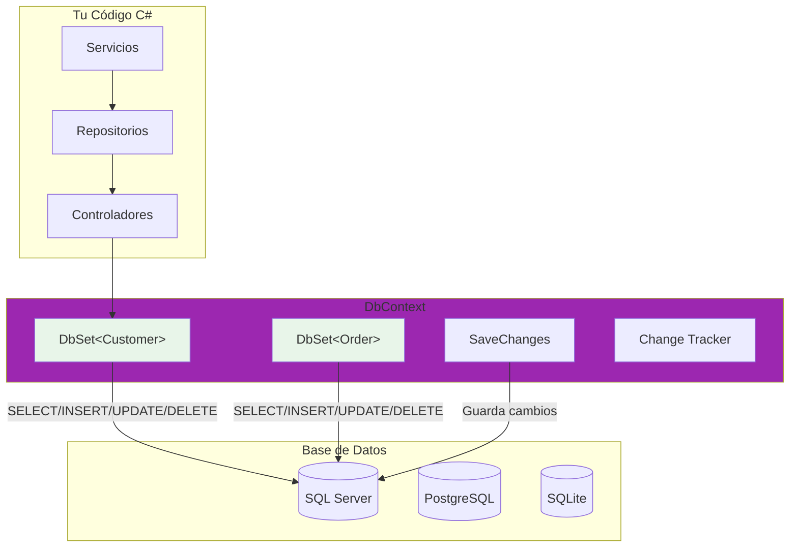

- [8. Bases de Datos Relacionales en .NET](#8-bases-de-datos-relacionales-en-net)
    - [8.1.0. Instalación de Librerías](#810-instalación-de-librerías)
  - [8.1. Acceso a bases de datos en .NET](#81-acceso-a-bases-de-datos-en-net)
    - [8.1.1. ADO.NET: El nivel más bajo](#811-adonet-el-nivel-más-bajo)
    - [8.1.2. Dapper: Micro-ORM de alto rendimiento](#812-dapper-micro-orm-de-alto-rendimiento)
    - [8.1.3. Entity Framework Core: ORM completo](#813-entity-framework-core-orm-completo)
  - [8.2. Entity Framework Core](#82-entity-framework-core)
    - [8.2.1. ¿Qué es el DbContext?](#821-qué-es-el-dbcontext)
    - [8.2.2. Partes del DbContext](#822-partes-del-dbcontext)
    - [8.2.3. Configuración de entidades](#823-configuración-de-entidades)
    - [8.2.4. Relaciones entre entidades](#824-relaciones-entre-entidades)
      - [8.2.4.1. Data Annotations (Anotaciones en el Modelo)](#8241-data-annotations-anotaciones-en-el-modelo)
      - [8.2.4.2. Fluent API (Configuración Avanzada)](#8242-fluent-api-configuración-avanzada)
      - [8.2.4.3. Comparación: Data Annotations vs Fluent API](#8243-comparación-data-annotations-vs-fluent-api)
  - [8.3. Patrón Repository](#83-patrón-repository)
    - [8.3.1. Principios del Repository](#831-principios-del-repository)
    - [8.3.2. Implementación genérica](#832-implementación-genérica)
    - [8.3.3. Unit of Work](#833-unit-of-work)
  - [8.4. CRUD con EF Core](#84-crud-con-ef-core)
    - [8.4.1. Operaciones básicas](#841-operaciones-básicas)
    - [8.4.2. Consultas optimizadas](#842-consultas-optimizadas)
    - [8.4.3. Concurrency y concurrencia](#843-concurrency-y-concurrencia)
  - [8.5. Consultas LINQ y SQL raw](#85-consultas-linq-y-sql-raw)
    - [8.5.1. LINQ to Entities](#851-linq-to-entities)
    - [8.5.2. SQL interpolado y FromSqlRaw](#852-sql-interpolado-y-fromsqlraw)
    - [8.5.3. Ejecución y optimización](#853-ejecución-y-optimización)
  - [8.6. Migraciones y esquema](#86-migraciones-y-esquema)
    - [8.6.1. Code First migrations](#861-code-first-migrations)
    - [8.6.2. Gestión del historial](#862-gestión-del-historial)
    - [8.6.3. Seed data](#863-seed-data)
      - [8.6.3.1. Seed Data con HasData (En migraciones)](#8631-seed-data-con-hasdata-en-migraciones)
      - [8.6.3.2. Seed Data con servicio (En tiempo de ejecución)](#8632-seed-data-con-servicio-en-tiempo-de-ejecución)
      - [8.6.3.3. Seed Data con archivos JSON](#8633-seed-data-con-archivos-json)
      - [8.6.3.4. Comparación de métodos de Seed Data](#8634-comparación-de-métodos-de-seed-data)
  - [8.7. Resumen](#87-resumen)

# 8. Bases de Datos Relacionales en .NET

El acceso a datos es uno de los pilares fundamentales de cualquier aplicación empresarial. .NET proporciona un ecosistema completo de tecnologías para interactuar con bases de datos relacionales, desde el acceso de bajo nivel con ADO.NET hasta el mapeo objeto-relacional completo con Entity Framework Core. La elección de la tecnología apropiada depende del contexto del proyecto, los requisitos de rendimiento, y la complejidad del dominio.



🧠 **Analogía**: Piensa en las tecnologías de acceso a datos como diferentes niveles de un coche. ADO.NET es como conducir un coche manual donde controlas cada marcha y pedal. Dapper es como un automático que hace algunas cosas por ti pero mantiene el control. EF Core es como un Tesla autónomo que prácticamente conduce solo.

### 8.1.0. Instalación de Librerías

Para trabajar con bases de datos en .NET, necesitas instalar los paquetes NuGet correspondientes a tu proveedor de base de datos y las librerías de acceso a datos:

```bash
# PostgreSQL
dotnet add package Npgsql
dotnet add package Npgsql.EntityFrameworkCore.PostgreSQL

# MySQL/MariaDB
dotnet add package MySql.Data
dotnet add package Pomelo.EntityFrameworkCore.MySql

# SQL Server
dotnet add package Microsoft.EntityFrameworkCore.SqlServer

# Dapper (Micro-ORM)
dotnet add package Dapper

# Herramientas CLI de EF Core
dotnet tool install --global dotnet-ef
```





## 8.1. Acceso a bases de datos en .NET

### 8.1.1. ADO.NET: El nivel más bajo

ADO.NET es la API fundamental de .NET para acceso a datos. Proporciona clases de bajo nivel para conectarse a bases de datos, ejecutar comandos, y leer resultados.

```csharp
namespace BBDD.ADONet
{
    public class EjemplosADONet
    {
        private const string ConnectionString = "Host=localhost;Database=tienda;Username=user;Password=pass";

        public static async Task DemoConexion()
        {
            await using var connection = new NpgsqlConnection(ConnectionString);
            await connection.OpenAsync();
            Console.WriteLine("Conexión establecida");
        }

        public static async Task DemoComandos()
        {
            await using var connection = new NpgsqlConnection(ConnectionString);
            await connection.OpenAsync();

            await using var command = new NpgsqlCommand(
                "SELECT * FROM customers WHERE email = @email AND active = @active",
                connection);

            command.Parameters.AddWithValue("email", "juan@email.com");
            command.Parameters.AddWithValue("active", true);

            await using var reader = await command.ExecuteReaderAsync();
            
            while (await reader.ReadAsync())
            {
                int id = reader.GetInt32(reader.GetOrdinal("id"));
                string name = reader.GetString(reader.GetOrdinal("name"));
                Console.WriteLine($"ID: {id}, Name: {name}");
            }
        }

        public static async Task DemoTransaccion()
        {
            await using var connection = new NpgsqlConnection(ConnectionString);
            await connection.OpenAsync();

            await using var transaction = await connection.BeginTransactionAsync();
            
            try
            {
                await using var cmd1 = new NpgsqlCommand(
                    "INSERT INTO orders (customer_id, total) VALUES (1, 100) RETURNING id",
                    connection, transaction);
                var orderId = await cmd1.ExecuteScalarAsync();

                await transaction.CommitAsync();
            }
            catch (Exception ex)
            {
                await transaction.RollbackAsync();
                throw;
            }
        }
    }
}
```

⚠️ **Advertencia**: NUNCA concatenes strings para construir consultas SQL. Usa SIEMPRE parámetros para evitar SQL Injection.

### 8.1.2. Dapper: Micro-ORM de alto rendimiento

Dapper es un micro-ORM desarrollado por Stack Overflow que proporciona mapeo ligero con rendimiento cercano a ADO.NET puro.

```csharp
namespace BBDD.Dapper
{
    public class EjemplosDapper(IDbConnection connection)
    {
        public async Task<List<Customer>> ObtenerTodosClientes()
        {
            var sql = "SELECT * FROM customers";
            return (await connection.QueryAsync<Customer>(sql)).ToList();
        }

        public async Task<Customer?> ObtenerPorId(int id)
        {
            var sql = "SELECT * FROM customers WHERE id = @Id";
            return await connection.QueryFirstOrDefaultAsync<Customer>(sql, new { Id = id });
        }

        public async Task<(Customer customer, List<Order> orders)> ObtenerClienteConPedidos(int customerId)
        {
            var sql = @"
                SELECT c.*, o.* FROM customers c
                LEFT JOIN orders o ON c.id = o.customer_id
                WHERE c.id = @Id";

            var customerDictionary = new Dictionary<int, Customer>();

            var resultado = await connection.QueryAsync<Customer, Order, Customer>(
                sql, (customer, order) =>
                {
                    if (!customerDictionary.TryGetValue(customer.Id, out var custEntry))
                    {
                        custEntry = customer;
                        custEntry.Orders = new List<Order>();
                        customerDictionary.Add(customer.Id, custEntry);
                    }
                    if (order != null)
                        custEntry.Orders.Add(order);
                    return custEntry;
                }, new { Id = customerId }, splitOn: "id");

            return (customerDictionary.Values.FirstOrDefault()!, 
                    customerDictionary.Values.FirstOrDefault()?.Orders ?? new List<Order>());
        }

        public async Task<int> CrearCliente(Customer customer)
        {
            var sql = @"
                INSERT INTO customers (name, email, city, created_at)
                VALUES (@Name, @Email, @City, NOW())
                RETURNING id";

            return await connection.ExecuteScalarAsync<int>(sql, customer);
        }
    }

    public class Customer
    {
        public int Id { get; set; }
        public string Name { get; set; } = "";
        public string Email { get; set; } = "";
        public string? City { get; set; }
        public List<Order> Orders { get; set; } = new();
    }

    public class Order
    {
        public int Id { get; set; }
        public int CustomerId { get; set; }
        public decimal Total { get; set; }
        public string Status { get; set; } = "";
    }
}
```

💡 **Tip**: Dapper es ideal para microservicios de alto rendimiento o cuando trabajas con bases de datos legacy.

### 8.1.3. Entity Framework Core: ORM completo

Entity Framework Core es el ORM de Microsoft que proporciona el mayor nivel de abstracción y productividad.

```csharp
namespace BBDD.EFCore
{
    public class AppDbContext : DbContext
    {
        public DbSet<Customer> Customers { get; set; } = null!;
        public DbSet<Order> Orders { get; set; } = null!;
        public DbSet<Product> Products { get; set; } = null!;

        protected override void OnConfiguring(DbContextOptionsBuilder options)
        {
            options.UseNpgsql("Host=localhost;Database=tienda;Username=user;Password=pass");
        }

        protected override void OnModelCreating(ModelBuilder modelBuilder)
        {
            modelBuilder.Entity<Customer>(entity =>
            {
                entity.ToTable("customers");
                entity.HasKey(e => e.Id);
                entity.Property(e => e.Name).HasMaxLength(100).IsRequired();
                entity.HasIndex(e => e.Email).IsUnique();
                entity.HasMany(e => e.Orders)
                    .WithOne(o => o.Customer)
                    .HasForeignKey(o => o.CustomerId);
            });

            modelBuilder.Entity<Order>(entity =>
            {
                entity.ToTable("orders");
                entity.HasKey(e => e.Id);
                entity.Property(e => e.Status).HasConversion<string>();
            });
        }
    }

    public class Customer
    {
        public int Id { get; set; }
        public string Name { get; set; } = "";
        public string Email { get; set; } = "";
        public string? City { get; set; }
        public bool Active { get; set; } = true;
        public DateTime CreatedAt { get; set; }
        public List<Order> Orders { get; set; } = new();
    }

    public class Order
    {
        public int Id { get; set; }
        public int CustomerId { get; set; }
        public Customer Customer { get; set; } = null!;
        public decimal Total { get; set; }
        public OrderStatus Status { get; set; } = OrderStatus.Pending;
        public DateTime CreatedAt { get; set; }
    }

    public enum OrderStatus { Pending, Confirmed, Shipped, Delivered, Cancelled }
}
```

📝 **Nota**: EF Core es la opción recomendada para nuevos proyectos porque maximiza la productividad del desarrollador.

## 8.2. Entity Framework Core

### 8.2.1. ¿Qué es el DbContext?

El **DbContext** es la clase principal de EF Core que representa una sesión con la base de datos. Es como un **carrito de compras** en un supermercado:

- **Añadir productos** → `Add()` o `AddAsync()`
- **Ver qué llevas** → `Find()` o `Where()`
- **Quitar productos** → `Remove()`
- **Pagar todo junto** → `SaveChanges()`

🧠 **Analogía**: El DbContext es el intermediario entre tu código C# y la base de datos. Tú le hablas en objetos C# y él traduce a SQL.



### 8.2.2. Partes del DbContext

El DbContext tiene 4 partes principales que debes conocer:

| Parte               | Descripción                              | Ejemplo                                                       |
| :------------------ | :--------------------------------------- | :------------------------------------------------------------ |
| **DbSet&lt;T&gt;**  | Representa una tabla                     | `public DbSet<Customer> Customers { get; set; }`              |
| **Constructor**     | Recibe opciones de configuración         | `public AppDbContext(DbContextOptions opts) : base(opts) { }` |
| **OnConfiguring**   | Configura la conexión                    | `options.UseSqlServer(connectionString)`                      |
| **OnModelCreating** | Define el modelo (entidades, relaciones) | `modelBuilder.Entity<Customer>()...`                          |

**Ejemplo completo de DbContext:**

```csharp
using Microsoft.EntityFrameworkCore;

namespace Tienda.Data;

public class AppDbContext : DbContext
{
    // 1. DbSet<T> - Representan las tablas de la BD
    public DbSet<Customer> Customers { get; set; } = null!;
    public DbSet<Order> Orders { get; set; } = null!;
    public DbSet<Product> Products { get; set; } = null!;
    
    // 2. Constructor con opciones
    public AppDbContext(DbContextOptions<AppDbContext> options)
        : base(options) { }
    
    // 3. Configuración del modelo (entidades, relaciones)
    protected override void OnModelCreating(ModelBuilder modelBuilder)
    {
        base.OnModelCreating(modelBuilder);
        
        modelBuilder.Entity<Customer>(entity =>
        {
            entity.HasKey(e => e.Id);
            entity.Property(e => e.Name).IsRequired().HasMaxLength(100);
            entity.HasMany(e => e.Orders)
                  .WithOne(o => o.Customer)
                  .HasForeignKey(o => o.CustomerId);
        });
    }
}
```

**Registro del DbContext en Program.cs (Inyección de Dependencias):**

```csharp
var builder = WebApplication.CreateBuilder(args);

// Registrar DbContext con SQL Server
builder.Services.AddDbContext<AppDbContext>(options =>
    options.UseSqlServer(builder.Configuration.GetConnectionString("DefaultConnection")));

// O con PostgreSQL
builder.Services.AddDbContext<AppDbContext>(options =>
    options.UseNpgsql(builder.Configuration.GetConnectionString("PostgreSQL")));

// O con SQLite (ideal para desarrollo)
builder.Services.AddDbContext<AppDbContext>(options =>
    options.UseSqlite(builder.Configuration.GetConnectionString("SQLite")));
```

**Uso del DbContext en un servicio:**

```csharp
public class CustomerService(AppDbContext context)
{
    public async Task<List<Customer>> GetAllAsync()
    {
        return await context.Customers.ToListAsync();
    }

    public async Task<Customer?> GetByIdAsync(int id)
    {
        return await context.Customers.FindAsync(id);
    }

    public async Task<Customer> CreateAsync(Customer customer)
    {
        context.Customers.Add(customer);
        await context.SaveChangesAsync();
        return customer;
    }
}
```

### 8.2.3. Configuración de entidades

EF Core ofrece Fluent API para configuraciones complejas.

```csharp
namespace BBDD.EFCore.Configuracion
{
    public class ConfiguracionAvanzada
    {
        public class ExtendedDbContext : DbContext
        {
            protected override void OnModelCreating(ModelBuilder modelBuilder)
            {
                // === PROPIEDADES ===
                modelBuilder.Entity<Product>()
                    .Property(p => p.Price)
                    .HasColumnType("decimal(18,4)")
                    .HasPrecision(18, 4);

                modelBuilder.Entity<Order>()
                    .Property(o => o.Total)
                    .IsRequired();

                // === ÍNDICES ===
                modelBuilder.Entity<Order>()
                    .HasIndex(o => o.CreatedAt);

                modelBuilder.Entity<Customer>()
                    .HasIndex(c => c.Email)
                    .IsUnique();

                // === CHECK CONSTRAINT ===
                modelBuilder.Entity<Order>()
                    .ToTable(t => t.HasCheckConstraint("CK_Order_Total_Positive", "total >= 0"));
            }
        }
    }
}
```

### 8.2.4. Relaciones entre entidades

Las relaciones en EF Core pueden configurarse de dos formas:
1. **Data Annotations** (atributos en las clases) - Más simple
2. **Fluent API** (en OnModelCreating) - Más flexible

#### 8.2.4.1. Data Annotations (Anotaciones en el Modelo)

```csharp
using System.ComponentModel.DataAnnotations;
using System.ComponentModel.DataAnnotations.Schema;

namespace BBDD.EFCore.Relaciones.DataAnnotations
{
    // === RELACIÓN UNO A MUCHOS (Customer -> Orders) ===
    
    public class Customer
    {
        public int Id { get; set; }

        [Required]
        [StringLength(100)]
        public string Name { get; set; } = "";

        [EmailAddress]
        public string? Email { get; set; }

        // Navigation property (colección de pedidos)
        public List<Order> Orders { get; set; } = new();
    }

    public class Order
    {
        public int Id { get; set; }

        public decimal Total { get; set; }

        [Required]
        public string Status { get; set; } = "";

        // Foreign Key con anotación
        [ForeignKey("CustomerId")]
        public int CustomerId { get; set; }

        // Navigation property (referencia al cliente)
        public Customer Customer { get; set; } = null!;
    }

    // === RELACIÓN UNO A UNO (Customer -> CustomerProfile) ===

    public class CustomerProfile
    {
        [Key]  // PK también es FK
        public int CustomerId { get; set; }

        [StringLength(20)]
        public string? Phone { get; set; }

        public DateTime? BirthDate { get; set; }

        // Navigation property inversa
        public Customer Customer { get; set; } = null!;
    }

    public class Customer
    {
        public int Id { get; set; }
        public string Name { get; set; } = "";

        // Relación 1:1
        public CustomerProfile? Profile { get; set; }
    }

    // === RELACIÓN MUCHOS A MUCHOS (Product <-> Category) ===

    public class Product
    {
        public int Id { get; set; }

        [Required]
        [StringLength(100)]
        public string Name { get; set; } = "";

        public decimal Price { get; set; }

        // Colección de categorías (sin clave foránea explícita)
        public ICollection<Category> Categories { get; set; } = new List<Category>();
    }

    public class Category
    {
        public int Id { get; set; }

        [Required]
        [StringLength(50)]
        public string Name { get; set; } = "";

        // Colección de productos (bidireccional)
        public ICollection<Product> Products { get; set; } = new List<Product>();
    }
}
```

#### 8.2.4.2. Fluent API (Configuración Avanzada)

```csharp
namespace BBDD.EFCore.Relaciones.Fluent
{
    public class ExtendedDbContext : DbContext
    {
        protected override void OnModelCreating(ModelBuilder modelBuilder)
        {
            // === UNO A MUCHOS (Customer -> Orders) ===
            modelBuilder.Entity<Order>()
                .HasOne(o => o.Customer)
                .WithMany(c => c.Orders)
                .HasForeignKey(o => o.CustomerId)
                .OnDelete(DeleteBehavior.Cascade);  // Si se borra customer, se borran sus orders

            // === UNO A UNO (Customer -> Profile) ===
            modelBuilder.Entity<CustomerProfile>()
                .HasOne(cp => cp.Customer)
                .WithOne(c => c.Profile)
                .HasForeignKey<CustomerProfile>(cp => cp.CustomerId);

            // === MUCHOS A MUCHOS (Product <-> Category) ===
            modelBuilder.Entity<Product>()
                .HasMany(p => p.Categories)
                .WithMany(c => c.Products)
                .UsingEntity(j => j.ToTable("product_categories"));

            // === CONFIGURACIÓN DE PROPIEDADES ===
            modelBuilder.Entity<Customer>()
                .Property(c => c.Name)
                .IsRequired()
                .HasMaxLength(100);

            modelBuilder.Entity<Order>()
                .Property(o => o.Total)
                .HasPrecision(18, 2);

            // === ÍNDICES ===
            modelBuilder.Entity<Order>()
                .HasIndex(o => o.Status);

            modelBuilder.Entity<Customer>()
                .HasIndex(c => c.Email)
                .IsUnique();
        }
    }

    // Entidades (sin anotaciones)
    public class Customer
    {
        public int Id { get; set; }
        public string Name { get; set; } = "";
        public CustomerProfile? Profile { get; set; }
        public List<Order> Orders { get; set; } = new();
    }

    public class Order
    {
        public int Id { get; set; }
        public decimal Total { get; set; }
        public string Status { get; set; } = "";
        public int CustomerId { get; set; }
        public Customer Customer { get; set; } = null!;
    }

    public class CustomerProfile
    {
        public int CustomerId { get; set; }
        public string? Phone { get; set; }
        public Customer Customer { get; set; } = null!;
    }

    public class Product
    {
        public int Id { get; set; }
        public string Name { get; set; } = "";
        public decimal Price { get; set; }
        public ICollection<Category> Categories { get; set; } = new List<Category>();
    }

    public class Category
    {
        public int Id { get; set; }
        public string Name { get; set; } = "";
        public ICollection<Product> Products { get; set; } = new List<Product>();
    }
}
```

#### 8.2.4.3. Comparación: Data Annotations vs Fluent API

| Aspecto             | Data Annotations  |     Fluent API      |
| :------------------ | :---------------: | :-----------------: |
| **Legibilidad**     |   ✅ En la clase   | ⚠️ Fuera de la clase |
| **Complejidad**     |     ✅ Simple      |    ⚠️ Más código     |
| **Validaciones**    |   ✅ Integradas    |      ❌ Manual       |
| **Relaciones**      |    ⚠️ Limitado     |     ✅ Completo      |
| **Delete Behavior** | ❌ No configurable |        ✅ Sí         |

💡 **Tip**: Usa Data Annotations para configuraciones simples y Fluent API para casos avanzados.

🧠 **Analogía**: Las relaciones en EF Core son como las relaciones familiares. Un cliente tiene muchos pedidos (padre → hijos), y los productos pueden pertenecer a múltiples categorías (primos que se visitan en ambas direcciones).

```csharp
namespace BBDD.EFCore.Context
{
    public class ExtendedDbContext(DbContextOptions<ExtendedDbContext> options) : DbContext(options)
    {
        public DbSet<Customer> Customers { get; set; } = null!;
        public DbSet<Order> Orders { get; set; } = null!;
        public DbSet<OrderItem> OrderItems { get; set; } = null!;

        protected override void OnConfiguring(DbContextOptionsBuilder optionsBuilder)
        {
            optionsBuilder.UseNpgsql("ConnectionString");
            optionsBuilder.UseLoggerFactory(LoggerFactory.Create(builder => builder.AddConsole()));
            optionsBuilder.EnableSensitiveDataLogging();
        }

        protected override void OnModelCreating(ModelBuilder modelBuilder)
        {
            modelBuilder.Entity<Customer>(entity =>
            {
                entity.Property(e => e.Id).UseIdentityColumn();
                entity.Property(e => e.Name).IsRequired().HasMaxLength(100);
                entity.Property(e => e.CreatedAt).HasDefaultValueSql("NOW()");
                entity.HasMany(e => e.Orders)
                    .WithOne(o => o.Customer)
                    .HasForeignKey(o => o.CustomerId)
                    .OnDelete(DeleteBehavior.Cascade);
            });

            modelBuilder.Entity<Order>(entity =>
            {
                entity.Property(e => e.Total).HasColumnType("decimal(18,2)");
                entity.HasMany(e => e.Items)
                    .WithOne()
                    .HasForeignKey(oi => oi.OrderId);
            });

            modelBuilder.Entity<Product>().HasData(
                new Product { Id = 1, Name = "Laptop", Price = 999.99m },
                new Product { Id = 2, Name = "Mouse", Price = 29.99m }
            );
        }
    }

    public class Product
    {
        public int Id { get; set; }
        public string Name { get; set; } = "";
        public decimal Price { get; set; }
    }

    public class OrderItem
    {
        public int Id { get; set; }
        public int OrderId { get; set; }
        public int ProductId { get; set; }
        public int Quantity { get; set; }
        public decimal UnitPrice { get; set; }
    }
}
```

## 8.3. Patrón Repository

### 8.3.1. Principios del Repository

```csharp
namespace BBDD.Repository
{
    public interface ICustomerRepository
    {
        Task<Customer?> GetByIdAsync(int id);
        Task<List<Customer>> GetAllAsync();
        Task<List<Customer>> GetActiveCustomersAsync();
        Task<PagedResult<Customer>> GetPagedAsync(int page, int pageSize);
        Task<bool> ExistsAsync(int id);
        Task<Customer> AddAsync(Customer customer);
        Task UpdateAsync(Customer customer);
        Task DeleteAsync(Customer customer);
    }

    public class CustomerRepository(AppDbContext context) : ICustomerRepository
    {
        public async Task<Customer?> GetByIdAsync(int id)
        {
            return await context.Customers
                .Include(c => c.Orders)
                .FirstOrDefaultAsync(c => c.Id == id);
        }

        public async Task<List<Customer>> GetAllAsync()
        {
            return await context.Customers.ToListAsync();
        }

        public async Task<List<Customer>> GetActiveCustomersAsync()
        {
            return await context.Customers
                .Where(c => c.Active)
                .OrderBy(c => c.Name)
                .ToListAsync();
        }

        public async Task<PagedResult<Customer>> GetPagedAsync(int page, int pageSize)
        {
            var totalCount = await context.Customers.CountAsync();
            var items = await context.Customers
                .OrderBy(c => c.Id)
                .Skip((page - 1) * pageSize)
                .Take(pageSize)
                .ToListAsync();

            return new PagedResult<Customer>(items, totalCount, page, pageSize);
        }

        public async Task<bool> ExistsAsync(int id)
        {
            return await context.Customers.AnyAsync(c => c.Id == id);
        }

        public async Task<Customer> AddAsync(Customer customer)
        {
            customer.CreatedAt = DateTime.UtcNow;
            await context.Customers.AddAsync(customer);
            await context.SaveChangesAsync();
            return customer;
        }

        public async Task UpdateAsync(Customer customer)
        {
            customer.UpdatedAt = DateTime.UtcNow;
            context.Customers.Update(customer);
            await context.SaveChangesAsync();
        }

        public async Task DeleteAsync(Customer customer)
        {
            context.Customers.Remove(customer);
            await context.SaveChangesAsync();
        }
    }

    public class PagedResult<T>(List<T> items, int totalCount, int page, int pageSize)
    {
        public List<T> Items { get; } = items;
        public int TotalCount { get; } = totalCount;
        public int Page { get; } = page;
        public int PageSize { get; } = pageSize;
        public int TotalPages => (int)Math.Ceiling(TotalCount / (double)PageSize);
    }
}
```

### 8.3.2. Implementación genérica

```csharp
namespace BBDD.Repository.Generic
{
    public interface IRepository<T> where T : class
    {
        Task<T?> GetByIdAsync(int id);
        Task<List<T>> GetAllAsync();
        Task<List<T>> FindAsync(Expression<Func<T, bool>> predicate);
        Task<T?> FirstOrDefaultAsync(Expression<Func<T, bool>> predicate);
        Task<bool> ExistsAsync(Expression<Func<T, bool>> predicate);
        Task<T> AddAsync(T entity);
        Task UpdateAsync(T entity);
        Task DeleteAsync(T entity);
        IQueryable<T> Query();
        IQueryable<T> QueryNoTracking();
    }

    public class Repository<T>(DbContext context) : IRepository<T> where T : class
    {
        protected readonly DbContext _context = context;
        protected readonly DbSet<T> _dbSet = context.Set<T>();

        public virtual async Task<T?> GetByIdAsync(int id)
        {
            return await _dbSet.FindAsync(id);
        }

        public virtual async Task<List<T>> GetAllAsync()
        {
            return await _dbSet.ToListAsync();
        }

        public virtual async Task<List<T>> FindAsync(Expression<Func<T, bool>> predicate)
        {
            return await _dbSet.Where(predicate).ToListAsync();
        }

        public virtual async Task<T?> FirstOrDefaultAsync(Expression<Func<T, bool>> predicate)
        {
            return await _dbSet.FirstOrDefaultAsync(predicate);
        }

        public virtual async Task<bool> ExistsAsync(Expression<Func<T, bool>> predicate)
        {
            return await _dbSet.AnyAsync(predicate);
        }

        public virtual async Task<T> AddAsync(T entity)
        {
            await _dbSet.AddAsync(entity);
            await _context.SaveChangesAsync();
            return entity;
        }

        public virtual async Task UpdateAsync(T entity)
        {
            _dbSet.Update(entity);
            await _context.SaveChangesAsync();
        }

        public virtual async Task DeleteAsync(T entity)
        {
            _dbSet.Remove(entity);
            await _context.SaveChangesAsync();
        }

        public virtual IQueryable<T> Query()
        {
            return _dbSet;
        }

        public virtual IQueryable<T> QueryNoTracking()
        {
            return _dbSet.AsNoTracking();
        }
    }
}
```

### 8.3.3. Unit of Work

```csharp
namespace BBDD.Repository.UoW
{
    public interface IUnitOfWork : IDisposable
    {
        ICustomerRepository Customers { get; }
        IOrderRepository Orders { get; }
        Task BeginTransactionAsync();
        Task CommitAsync();
        Task RollbackAsync();
    }

    public class UnitOfWork(AppDbContext context, ICustomerRepository customers, IOrderRepository orders) : IUnitOfWork
    {
        private readonly AppDbContext _context = context;
        private IDbContextTransaction? _transaction;

        public ICustomerRepository Customers { get; } = customers;
        public IOrderRepository Orders { get; } = orders;

        public async Task BeginTransactionAsync()
        {
            _transaction = await _context.Database.BeginTransactionAsync();
        }

        public async Task CommitAsync()
        {
            try
            {
                await _context.SaveChangesAsync();
                _transaction?.Commit();
            }
            catch
            {
                await RollbackAsync();
                throw;
            }
        }

        public async Task RollbackAsync()
        {
            _transaction?.Rollback();
            await _transaction?.DisposeAsync()!;
        }

        public void Dispose()
        {
            _transaction?.Dispose();
            _context.Dispose();
        }
    }
}
```

## 8.4. CRUD con EF Core

### 8.4.1. Operaciones básicas

```csharp
namespace BBDD.EFCore.CRUD
{
    public class CrudService(AppDbContext context)
    {
        private readonly AppDbContext _context = context;

        public async Task<Customer> CreateCustomer(string name, string email, string? city)
        {
            var customer = new Customer
            {
                Name = name,
                Email = email,
                City = city,
                Active = true,
                CreatedAt = DateTime.UtcNow
            };

            _context.Customers.Add(customer);
            await _context.SaveChangesAsync();
            return customer;
        }

        public async Task<Order> CreateOrderWithItems(int customerId, List<OrderItemDto> items)
        {
            var customer = await _context.Customers.FindAsync(customerId);
            if (customer == null)
                throw new ArgumentException("Cliente no encontrado");

            var order = new Order
            {
                CustomerId = customerId,
                Status = OrderStatus.Pending,
                CreatedAt = DateTime.UtcNow
            };

            decimal total = 0;
            foreach (var itemDto in items)
            {
                var product = await _context.Products.FindAsync(itemDto.ProductId);
                if (product == null)
                    throw new ArgumentException($"Producto {itemDto.ProductId} no encontrado");

                order.Items.Add(new OrderItem
                {
                    ProductId = product.Id,
                    Quantity = itemDto.Quantity,
                    UnitPrice = product.Price
                });
                total += product.Price * itemDto.Quantity;
            }

            order.Total = total;
            _context.Orders.Add(order);
            await _context.SaveChangesAsync();
            return order;
        }

        public async Task<Customer?> GetCustomer(int id)
        {
            return await _context.Customers.FindAsync(id);
        }

        public async Task<bool> UpdateCustomer(int id, string name, string email)
        {
            var customer = await _context.Customers.FindAsync(id);
            if (customer == null) return false;

            customer.Name = name;
            customer.Email = email;
            customer.UpdatedAt = DateTime.UtcNow;
            await _context.SaveChangesAsync();
            return true;
        }

        public async Task<bool> DeleteCustomer(int id)
        {
            var customer = await _context.Customers.FindAsync(id);
            if (customer == null) return false;

            _context.Customers.Remove(customer);
            await _context.SaveChangesAsync();
            return true;
        }

        public async Task<bool> SoftDeleteCustomer(int id)
        {
            var customer = await _context.Customers.FindAsync(id);
            if (customer == null) return false;

            customer.Active = false;
            customer.UpdatedAt = DateTime.UtcNow;
            await _context.SaveChangesAsync();
            return true;
        }
    }

    public class OrderItemDto
    {
        public int ProductId { get; set; }
        public int Quantity { get; set; }
    }
}
```

### 8.4.2. Consultas optimizadas

```csharp
namespace BBDD.EFCore.Optimizacion
{
    public class QueryOptimizer(AppDbContext context)
    {
        private readonly AppDbContext _context = context;

        public async Task<List<Customer>> GetCustomersNoTracking()
        {
            return await _context.Customers.AsNoTracking().ToListAsync();
        }

        public async Task<List<CustomerDto>> GetCustomerDtos()
        {
            return await _context.Customers
                .Select(c => new CustomerDto
                {
                    Id = c.Id,
                    Name = c.Name,
                    Email = c.Email,
                    OrderCount = c.Orders.Count
                })
                .ToListAsync();
        }

        public async Task<List<Order>> GetOrdersWithDetailsSplit(int customerId)
        {
            return await _context.Orders
                .Where(o => o.CustomerId == customerId)
                .Include(o => o.Items)
                .ThenInclude(oi => oi.Product)
                .AsSplitQuery()
                .ToListAsync();
        }

        public async Task<PagedResult<Order>> GetOrdersPaged(int page, int pageSize)
        {
            var totalCount = await _context.Orders.CountAsync();
            var orders = await _context.Orders
                .Include(o => o.Customer)
                .OrderBy(o => o.CreatedAt)
                .Skip((page - 1) * pageSize)
                .Take(pageSize)
                .ToListAsync();

            return new PagedResult<Order>(orders, totalCount, page, pageSize);
        }
    }

    public class CustomerDto
    {
        public int Id { get; set; }
        public string Name { get; set; } = "";
        public string Email { get; set; } = "";
        public int OrderCount { get; set; }
    }
}
```

### 8.4.3. Concurrency y concurrencia

```csharp
namespace BBDD.EFCore.Concurrency
{
    public class ConcurrencyService(AppDbContext context)
    {
        private readonly AppDbContext _context = context;

        public async Task<bool> UpdateWithTimestamp(Customer customer)
        {
            try
            {
                _context.Customers.Update(customer);
                await _context.SaveChangesAsync();
                return true;
            }
            catch (DbUpdateConcurrencyException ex)
            {
                var entry = ex.Entries[0];
                var databaseValues = await entry.GetDatabaseValuesAsync();
                
                if (databaseValues == null)
                {
                    Console.WriteLine("El registro fue eliminado por otro usuario");
                }
                else
                {
                    var dbCustomer = (Customer)databaseValues.ToObject();
                    Console.WriteLine($"Conflicto de concurrencia detectado");
                }
                return false;
            }
        }
    }

    public class Customer
    {
        public int Id { get; set; }
        public string Name { get; set; } = "";
        
        [Timestamp]
        public byte[] Version { get; set; } = null!;
    }
}
```

## 8.5. Consultas LINQ y SQL raw

### 8.5.1. LINQ to Entities

```csharp
namespace BBDD.EFCore.Linq
{
    public class LinqQueries(AppDbContext context)
    {
        private readonly AppDbContext _context = context;

        public async Task<List<Order>> GetOrdersByStatus(OrderStatus status)
        {
            return await _context.Orders
                .Where(o => o.Status == status)
                .ToListAsync();
        }

        public async Task<List<Customer>> GetCustomersByCity(string city)
        {
            return await _context.Customers
                .Where(c => c.City != null && c.City.StartsWith(city))
                .ToListAsync();
        }

        public async Task<List<OrderSummary>> GetOrderSummaries()
        {
            return await _context.Orders
                .Select(o => new OrderSummary
                {
                    OrderId = o.Id,
                    CustomerName = o.Customer.Name,
                    Total = o.Total,
                    ItemCount = o.Items.Count,
                    Status = o.Status.ToString()
                })
                .ToListAsync();
        }

        public async Task<List<OrdersByStatus>> GetOrdersGroupedByStatus()
        {
            return await _context.Orders
                .GroupBy(o => o.Status)
                .Select(g => new OrdersByStatus
                {
                    Status = g.Key,
                    Count = g.Count(),
                    TotalAmount = g.Sum(o => o.Total)
                })
                .ToListAsync();
        }

        public async Task<bool> HasActiveCustomers()
        {
            return await _context.Customers.AnyAsync(c => c.Active);
        }

        public async Task<OrderStatistics> GetOrderStatistics()
        {
            var stats = await _context.Orders
                .GroupBy(o => 1)
                .Select(g => new OrderStatistics
                {
                    Count = g.Count(),
                    Sum = g.Sum(o => o.Total),
                    Average = g.Average(o => o.Total),
                    Min = g.Min(o => o.Total),
                    Max = g.Max(o => o.Total)
                })
                .FirstAsync();

            return stats;
        }
    }

    public class OrderSummary
    {
        public int OrderId { get; set; }
        public string CustomerName { get; set; } = "";
        public decimal Total { get; set; }
        public int ItemCount { get; set; }
        public string Status { get; set; } = "";
    }

    public class OrdersByStatus
    {
        public OrderStatus Status { get; set; }
        public int Count { get; set; }
        public decimal TotalAmount { get; set; }
    }

    public class OrderStatistics
    {
        public int Count { get; set; }
        public decimal Sum { get; set; }
        public double Average { get; set; }
        public decimal Min { get; set; }
        public decimal Max { get; set; }
    }
}
```

### 8.5.2. SQL interpolado y FromSqlRaw

```csharp
namespace BBDD.EFCore.SqlRaw
{
    public class SqlRawExamples(AppDbContext context)
    {
        private readonly AppDbContext _context = context;

        public async Task<List<Customer>> GetCustomersFromSql()
        {
            return await _context.Customers
                .FromSqlRaw("SELECT * FROM customers WHERE active = true")
                .ToListAsync();
        }

        public async Task<List<Order>> GetOrdersByStatusSql(string status)
        {
            return await _context.Orders
                .FromSqlRaw("SELECT * FROM orders WHERE status = @status",
                    new NpgsqlParameter("status", status))
                .ToListAsync();
        }

        public async Task<int> UpdateCustomerStatusInterpolated(int customerId, bool active)
        {
            return await _context.Database
                .ExecuteSqlInterpolatedAsync(
                    $"UPDATE customers SET active = {active} WHERE id = {customerId}");
        }
    }
}
```

### 8.5.3. Ejecución y optimización

```csharp
namespace BBDD.EFCore.Execution
{
    public class QueryExecution(AppDbContext context)
    {
        private readonly AppDbContext _context = context;

        public async Task DemoShowSql()
        {
            var query = _context.Orders
                .Where(o => o.Status == OrderStatus.Pending)
                .Include(o => o.Customer)
                .Take(10);

            var sql = query.ToQueryString();
            Console.WriteLine(sql);
        }

        public async Task DemoNPlusOneProblem()
        {
            var orders = await _context.Orders.ToListAsync();
            foreach (var order in orders)
            {
                Console.WriteLine(order.Customer.Name);
            }

            var ordersFixed = await _context.Orders
                .Include(o => o.Customer)
                .ToListAsync();

            foreach (var order in ordersFixed)
            {
                Console.WriteLine(order.Customer.Name);
            }
        }

        public async Task DemoFilteredInclude()
        {
            var customers = await _context.Customers
                .Include(c => c.Orders.Where(o => o.Status == OrderStatus.Pending))
                .ToListAsync();
        }
    }
}
```

## 8.6. Migraciones y esquema

### 8.6.1. Code First migrations

```csharp
namespace BBDD.EFCore.Migrations
{
    public partial class AddCustomerPhone : Migration
    {
        protected override void Up(MigrationBuilder migrationBuilder)
        {
            migrationBuilder.AddColumn<string>(
                name: "phone",
                table: "customers",
                type: "varchar(20)",
                nullable: true);

            migrationBuilder.CreateIndex(
                name: "IX_customers_phone",
                table: "customers",
                column: "phone");

            migrationBuilder.InsertData(
                table: "customers",
                columns: new[] { "id", "name", "email", "phone", "created_at" },
                values: new object[] { 1, "Admin", "admin@email.com", "123456789", DateTime.UtcNow });
        }

        protected override void Down(MigrationBuilder migrationBuilder)
        {
            migrationBuilder.DropIndex(name: "IX_customers_phone", table: "customers");
            migrationBuilder.DropColumn(name: "phone", table: "customers");
        }
    }
}
```

### 8.6.2. Gestión del historial

```csharp
namespace BBDD.EFCore.MigrationHistory
{
    public class MigrationHistoryService(AppDbContext context)
    {
        private readonly AppDbContext _context = context;

        public async Task ApplyMigrations()
        {
            var pendingMigrations = await _context.Database.GetPendingMigrationsAsync();
            if (pendingMigrations.Any())
            {
                await _context.Database.MigrateAsync();
            }
        }
    }
}
```

### 8.6.3. Seed data

**Seed Data** son datos iniciales que se insertan automáticamente cuando se crea o migra la base de datos. Se usa para datos de referencia, configuraciones por defecto o datos de prueba.

🧠 **Analogía**: El Seed Data es como el "equipamiento inicial" de un video juego. Cuando starts el juego, ya tienes ciertos items, niveles o personajes creados por defecto.

#### 8.6.3.1. Seed Data con HasData (En migraciones)

Este método guarda los datos en la migración y se ejecuta con `dotnet ef database update`.

```csharp
namespace BBDD.EFCore.SeedData.HasData
{
    public class SeededDbContext(DbContextOptions<SeededDbContext> options) : DbContext(options)
    {
        public DbSet<Product> Products { get; set; } = null!;
        public DbSet<Category> Categories { get; set; } = null!;
        public DbSet<OrderStatus> OrderStatuses { get; set; } = null!;

        protected override void OnModelCreating(ModelBuilder modelBuilder)
        {
            base.OnModelCreating(modelBuilder);

            modelBuilder.Entity<Product>().HasData(
                new Product { Id = 1, Name = "Laptop", Price = 999.99m, Stock = 50 },
                new Product { Id = 2, Name = "Mouse", Price = 29.99m, Stock = 200 },
                new Product { Id = 3, Name = "Keyboard", Price = 79.99m, Stock = 100 }
            );

            modelBuilder.Entity<Category>().HasData(
                new Category { Id = 1, Name = "Electronics" },
                new Category { Id = 2, Name = "Accessories" }
            );

            modelBuilder.Entity<OrderStatus>().HasData(
                new OrderStatus { Id = 1, Name = "Pending", Description = "Awaiting processing" },
                new OrderStatus { Id = 2, Name = "Confirmed", Description = "Payment received" },
                new OrderStatus { Id = 3, Name = "Shipped", Description = "On the way" },
                new OrderStatus { Id = 4, Name = "Delivered", Description = "Received by customer" }
            );
        }
    }

    public class Product
    {
        public int Id { get; set; }
        public string Name { get; set; } = "";
        public decimal Price { get; set; }
        public int Stock { get; set; }
    }

    public class Category
    {
        public int Id { get; set; }
        public string Name { get; set; } = "";
    }

    public class OrderStatus
    {
        public int Id { get; set; }
        public string Name { get; set; } = "";
        public string Description { get; set; } = "";
    }
}
```

#### 8.6.3.2. Seed Data con servicio (En tiempo de ejecución)

Este método inserta datos cuando la aplicación starts, sin depender de migraciones.

```csharp
namespace BBDD.EFCore.SeedData.Service
{
    public class SeedDataService(AppDbContext context, ILogger<SeedDataService> logger)
    {
        private readonly AppDbContext _context = context;
        private readonly ILogger<SeedDataService> _logger = logger;

        public async Task SeedAsync()
        {
            if (await _context.Products.AnyAsync())
            {
                _logger.LogInformation("Ya existen productos. Seed Data omitido.");
                return;
            }

            _logger.LogInformation("Insertando Seed Data...");

            var categorias = new List<Category>
            {
                new Category { Name = "Electronics" },
                new Category { Name = "Accessories" },
                new Category { Name = "Gaming" }
            };
            await _context.Categories.AddRangeAsync(categorias);

            var productos = new List<Product>
            {
                new Product { Name = "Laptop", Price = 999.99m, Stock = 50 },
                new Product { Name = "Mouse", Price = 29.99m, Stock = 200 },
                new Product { Name = "Keyboard", Price = 79.99m, Stock = 100 },
                new Product { Name = "Monitor", Price = 349.99m, Stock = 30 }
            };
            await _context.Products.AddRangeAsync(productos);

            await _context.SaveChangesAsync();
            _logger.LogInformation("Seed Data insertado correctamente.");
        }
    }
}
```

#### 8.6.3.3. Seed Data con archivos JSON

Puedes cargar datos desde archivos JSON para mantener el código limpio.

```csharp
namespace BBDD.EFCore.SeedData.Json
{
    public class JsonSeedDataService(AppDbContext context)
    {
        private readonly AppDbContext _context = context;

        public async Task SeedFromJsonAsync(string filePath)
        {
            if (await _context.Products.AnyAsync())
                return;

            var json = await File.ReadAllTextAsync(filePath);
            var products = System.Text.Json.JsonSerializer.Deserialize<List<Product>>(json);

            if (products != null)
            {
                await _context.Products.AddRangeAsync(products);
                await _context.SaveChangesAsync();
            }
        }
    }
}
```

#### 8.6.3.4. Comparación de métodos de Seed Data

| Aspecto              | HasData (Migración) | Servicio (Runtime) |      JSON      |
| :------------------- | :-----------------: | :----------------: | :------------: |
| **Ejecución**        |    Con migración    |   Al iniciar app   | Al iniciar app |
| **Re-ejecutable**    |        ❌ No         |        ✅ Sí        |      ✅ Sí      |
| **Rollback**         |    Con migración    |       Manual       |     Manual     |
| **Datos complejos**  |        ✅ Sí         |        ✅ Sí        |      ✅ Sí      |
| **Facilidad de uso** |        Media        |        Alta        |      Alta      |

💡 **Tip**: Usa **HasData** para datos de referencia (estados, tipos) que cambian poco. Usa **Servicio** para datos que necesitan regenerarse frecuentemente.

## 8.7. Resumen

El acceso a datos en .NET ofrece un espectro de tecnologías:

**Tecnologías de Acceso**
- **ADO.NET**: Control completo, ideal para SQL complejo
- **Dapper**: Micro-ORM de alto rendimiento
- **EF Core**: ORM completo con LINQ, change tracking y migraciones

**Entity Framework Core**
- DbContext representa una sesión con la base de datos
- Fluent API ofrece configuración detallada de entidades
- Las relaciones se configuran con navegaciones

**Patrón Repository**
- Abstrae la capa de datos
- Facilita el testing con mocks
- Unit of Work coordina múltiples operaciones

**Consultas y Rendimiento**
- LINQ to Entities traduce consultas tipadas a SQL
- AsNoTracking() para consultas de solo lectura
- Include() carga relaciones relacionadas

**Migraciones**
- Code First migrations versiona el esquema
- Seed data inicializa datos necesarios