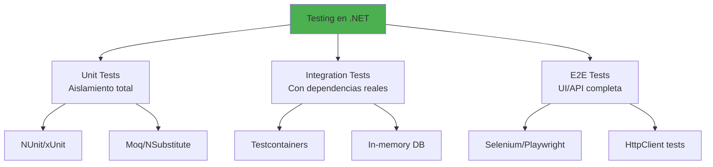

- [9. Testing en .NET](#9-testing-en-net)
  - [9.1. Fundamentos del testing](#91-fundamentos-del-testing)
    - [9.1.1. 🧠 Analogía: Tests como cinturón de seguridad](#911--analogía-tests-como-cinturón-de-seguridad)
    - [9.1.2. Tipos de tests](#912-tipos-de-tests)
  - [9.2. Test unitarios con NUnit](#92-test-unitarios-con-nunit)
  - [9.3. Test con Moq](#93-test-con-moq)
  - [9.4. FluentAssertions](#94-fluentassertions)
  - [9.5. Test de integración](#95-test-de-integración)
  - [9.6. Coverage y métricas](#96-coverage-y-métricas)
  - [9.7. Resumen](#97-resumen)

# 9. Testing en .NET

El testing es una práctica fundamental en el desarrollo de software profesional. Los tests proporcionan una red de seguridad que permite refactorizar código con confianza, detectar regresiones tempranamente, y documentar el comportamiento esperado del sistema. En el ecosistema .NET, existen múltiples herramientas para implementar una estrategia de testing efectiva.



## 9.1. Fundamentos del testing

### 9.1.1. 🧠 Analogía: Tests como cinturón de seguridad

Sin tests, conduces sin cinturón. Con tests, tienes protección cuando algo sale mal. Los tests te permiten refactorizar con confianza, detectar problemas antes de que lleguen a producción, y dormir tranquilo sabiendo que tu código funciona según lo esperado.

### 9.1.2. Tipos de tests

**Unit Tests**: Prueban unidades de código de forma aislada. No dependen de bases de datos, archivos, o servicios externos. Usan mocks para simular dependencias.

**Integration Tests**: Prueban cómo múltiples componentes trabajan juntos. Pueden usar bases de datos reales, sistemas de archivos, o servicios externos.

**End-to-End Tests**: Prueban la aplicación completa desde la perspectiva del usuario. Automatizan interacciones con la UI o API.

## 9.2. Test unitarios con NUnit

Necesitamos instalar el paquete NuGet de NUnit:

```bash
dotnet add package NUnit
dotnet add package NUnit3TestAdapter
dotnet add package Microsoft.NET.Test.Sdk
```

```csharp
namespace Testing.NUnit
{
    [TestFixture]
    public class CalculatorTests
    {
        private Calculator _calculator = null!;

        [SetUp]
        public void SetUp() => _calculator = new Calculator();

        [TearDown]
        public void TearDown() => _calculator?.Dispose();

        [Test]
        public void Sumar_DosNumeros_RetornaSuma()
        {
            int a = 5, b = 3;
            int resultado = _calculator.Sumar(a, b);
            Assert.That(resultado, Is.EqualTo(8));
        }

        [Test]
        public void Restar_DosNumeros_RetornaResta()
        {
            int resultado = _calculator.Restar(10, 4);
            Assert.That(resultado, Is.EqualTo(6));
        }

        [Test]
        public void Dividir_DosNumeros_RetornaCociente()
        {
            decimal resultado = _calculator.Dividir(10, 2);
            Assert.That(resultado, Is.EqualTo(5));
        }

        [Test]
        public void Dividir_PorCero_LanzaExcepcion()
        {
            Assert.Throws<DivideByZeroException>(() => 
                _calculator.Dividir(10, 0));
        }

        [TestCase(2, 2, 4)]
        [TestCase(3, 5, 8)]
        [TestCase(10, 0, 10)]
        [TestCase(-5, 3, -2)]
        public void Sumar_Casos_RetornaSuma(int a, int b, int esperado)
        {
            int resultado = _calculator.Sumar(a, b);
            Assert.That(resultado, Is.EqualTo(esperado));
        }

        [Test]
        public void Sumar_Coleccion_RetornaSumaTotal()
        {
            var numeros = new[] { 1, 2, 3, 4, 5 };
            int resultado = _calculator.SumarColeccion(numeros);
            Assert.That(resultado, Is.EqualTo(15));
        }

        [Test]
        public async Task SumarAsync_DosNumeros_RetornaSuma()
        {
            int resultado = await _calculator.SumarAsync(5, 3);
            Assert.That(resultado, Is.EqualTo(8));
        }

        [Test]
        public void Equals_DosObjetosIguales_RetornaTrue()
        {
            var p1 = new Point(2, 3);
            var p2 = new Point(2, 3);
            Assert.That(p1, Is.EqualTo(p2));
        }

        [Test]
        public void Contains_ElementoExistente_RetornaTrue()
        {
            var lista = new List<string> { "a", "b", "c" };
            Assert.That(lista, Does.Contain("b"));
        }

        [Test]
        public void StartsWith_CadenaValida_RetornaTrue()
        {
            string texto = "Hola Mundo";
            Assert.That(texto, Does.StartWith("Hola"));
        }
    }

    [TestFixture]
    public class CustomerServiceTests
    {
        private CustomerService _service = null!;
        private Mock<ICustomerRepository> _mockRepo = null!;

        [SetUp]
        public void SetUp()
        {
            _mockRepo = new Mock<ICustomerRepository>();
            _service = new CustomerService(_mockRepo.Object);
        }

        [Test]
        public void GetCustomer_WithValidId_ReturnsCustomer()
        {
            var expectedCustomer = new Customer { Id = 1, Name = "Juan" };
            _mockRepo.Setup(r => r.GetByIdAsync(1)).ReturnsAsync(expectedCustomer);

            var result = _service.GetCustomer(1);

            Assert.That(result.Name, Is.EqualTo("Juan"));
            _mockRepo.Verify(r => r.GetByIdAsync(1), Times.Once);
        }

        [Test]
        public void GetCustomer_WithInvalidId_ReturnsNull()
        {
            _mockRepo.Setup(r => r.GetByIdAsync(999)).ReturnsAsync((Customer?)null);

            var result = _service.GetCustomer(999);

            Assert.That(result, Is.Null);
        }

        [Test]
        public void CreateCustomer_WithValidData_ReturnsNewCustomer()
        {
            var newCustomer = new CreateCustomerDto { Name = "Ana", Email = "ana@email.com" };
            var createdCustomer = new Customer { Id = 1, Name = "Ana", Email = "ana@email.com" };
            
            _mockRepo.Setup(r => r.AddAsync(It.IsAny<Customer>())).ReturnsAsync(createdCustomer);

            var result = _service.CreateCustomer(newCustomer);

            Assert.That(result.Name, Is.EqualTo("Ana"));
            _mockRepo.Verify(r => r.AddAsync(It.IsAny<Customer>()), Times.Once);
        }
    }

    public class Calculator : IDisposable
    {
        public int Sumar(int a, int b) => a + b;
        public int Restar(int a, int b) => a - b;
        public decimal Dividir(decimal a, decimal b)
        {
            if (b == 0) throw new DivideByZeroException();
            return a / b;
        }
        public int SumarColeccion(IEnumerable<int> numeros) => numeros.Sum();
        public async Task<int> SumarAsync(int a, int b) => await Task.FromResult(a + b);
        public void Dispose() { }
    }

    public class Point : IEquatable<Point>
    {
        public int X { get; }
        public int Y { get; }

        public Point(int x, int y) { X = x; Y = y; }

        public bool Equals(Point? other) => other != null && X == other.X && Y == other.Y;
        public override bool Equals(object? obj) => Equals(obj as Point);
        public override int GetHashCode() => HashCode.Combine(X, Y);
    }

    public record Customer(int Id, string Name, string Email);
    public record CreateCustomerDto(string Name, string Email);
}
```

## 9.3. Test con Moq

Necesitamos instalar el paquete NuGet de Moq:

```bash
dotnet add package Moq
```

```csharp
namespace Testing.Moq
{
    [TestFixture]
    public class MoqExamples
    {
        [Test]
        public void Setup_MethodWithReturnValue_ReturnsConfiguredValue()
        {
            var mock = new Mock<IRepository<Customer>>();
            
            mock.Setup(r => r.GetByIdAsync(It.IsAny<int>()))
                .ReturnsAsync((Customer?)null);

            var result = mock.Object.GetByIdAsync(5);
            Assert.That(result.Result, Is.Null);
        }

        [Test]
        public void Setup_MethodWithParameter_ReturnsSpecificValue()
        {
            var mock = new Mock<IRepository<Customer>>();
            
            mock.Setup(r => r.GetByIdAsync(1))
                .ReturnsAsync(new Customer(1, "Juan", "juan@email.com"));

            var result = mock.Object.GetByIdAsync(1);
            Assert.That(result.Result?.Name, Is.EqualTo("Juan"));
        }

        [Test]
        public void Setup_Property_ReturnsValue()
        {
            var mock = new Mock<ICustomerService>();
            mock.SetupGet(s => s.CustomerCount).Returns(42);

            Assert.That(mock.Object.CustomerCount, Is.EqualTo(42));
        }

        [Test]
        public void Setup_PropertySetter_CapturesValue()
        {
            var mock = new Mock<ICustomerService>();
            string? capturedName = null;
            
            mock.SetupSet(s => s.CurrentCustomerName = It.IsAny<string>())
                .Callback<string>(name => capturedName = name);

            mock.Object.CurrentCustomerName = "Ana";
            Assert.That(capturedName, Is.EqualTo("Ana"));
        }

        [Test]
        public void Verify_MethodCalled_CorrectNumberOfTimes()
        {
            var mock = new Mock<IRepository<Customer>>();
            mock.Setup(r => r.GetByIdAsync(It.IsAny<int>()))
                .ReturnsAsync(new Customer(1, "Test", "test@email.com"));

            var service = new CustomerService(mock.Object);
            service.GetCustomer(1);
            service.GetCustomer(1);

            mock.Verify(r => r.GetByIdAsync(1), Times.AtLeast(2));
        }

        [Test]
        public void Verify_MethodNeverCalled()
        {
            var mock = new Mock<IRepository<Customer>>();
            var service = new CustomerService(mock.Object);
            
            service.GetCustomer(999);

            mock.Verify(r => r.AddAsync(It.IsAny<Customer>()), Times.Never);
        }

        [Test]
        public void Verify_PropertyGet_Called()
        {
            var mock = new Mock<ICustomerService>();
            mock.SetupGet(s => s.CustomerCount).Returns(5);
            var service = mock.Object;
            
            var count = service.CustomerCount;

            mock.VerifyGet(s => s.CustomerCount, Times.Once);
        }

        [Test]
        public void ItIs_MatchesCondition()
        {
            var mock = new Mock<IRepository<Customer>>();
            mock.Setup(r => r.GetByIdAsync(It.Is<int>(id => id > 0)))
                .ReturnsAsync(new Customer(1, "Test", "test@email.com"));

            var result = mock.Object.GetByIdAsync(5);
            Assert.That(result.Result, Is.Not.Null);
        }

        [Test]
        public void ItIsAny_MatchesAnyValue()
        {
            var mock = new Mock<IRepository<Customer>>();
            mock.Setup(r => r.GetByIdAsync(It.IsAny<int>()))
                .ReturnsAsync(new Customer(1, "Test", "test@email.com"));

            mock.Object.GetByIdAsync(1);
            mock.Object.GetByIdAsync(2);
            mock.Object.GetByIdAsync(3);

            mock.Verify(r => r.GetByIdAsync(It.IsAny<int>()), Times.AtLeast(3));
        }

        [Test]
        public void LazyMock_ProvidesDefaultBehavior()
        {
            var mock = new Mock<IRepository<Customer>>(MockBehavior.Loose);
            var result = mock.Object.GetByIdAsync(1);
            Assert.That(result.Result, Is.Null);
        }

        [Test]
        public async Task Async_MethodSetup_ReturnsTask()
        {
            var mock = new Mock<IServiceAsync>();
            mock.Setup(s => s.ProcessAsync(It.IsAny<string>()))
                .Returns<string>(name => Task.CompletedTask);

            await mock.Object.ProcessAsync("test");
            mock.Verify(s => s.ProcessAsync("test"), Times.Once);
        }

        [Test]
        public void OutParameter_SetupWithOut()
        {
            var mock = new Mock<IDictionaryService>();
            var outValue = "found";
            
            mock.Setup(s => s.TryGetValue(It.IsAny<string>(), out outValue))
                .Returns(true);

            bool result = mock.Object.TryGetValue("key", out var value);
            Assert.That(result, Is.True);
            Assert.That(value, Is.EqualTo("found"));
        }

        [Test]
        public void RefParameter_SetupWithRef()
        {
            var mock = new Mock<IService>();
            var customer = new Customer(1, "Test", "test@email.com");
            
            mock.Setup(s => s.UpdateCustomer(ref customer))
                .Callback<Customer>(c => c.Name = "Updated");

            mock.Object.UpdateCustomer(ref customer);
            Assert.That(customer.Name, Is.EqualTo("Updated"));
        }
    }

    public interface IRepository<T> where T : class
    {
        Task<T?> GetByIdAsync(int id);
        Task<T> AddAsync(T entity);
        Task UpdateAsync(T entity);
        Task DeleteAsync(int id);
    }

    public interface ICustomerService
    {
        int CustomerCount { get; }
        string? CurrentCustomerName { get; set; }
        Task<Customer?> GetCustomer(int id);
        void UpdateCustomer(ref Customer customer);
    }

    public interface IService
    {
        void UpdateCustomer(ref Customer customer);
    }

    public interface IServiceAsync
    {
        Task ProcessAsync(string input);
    }

    public interface IDictionaryService
    {
        bool TryGetValue(string key, out string? value);
    }

    public class Customer
    {
        public int Id { get; set; }
        public string Name { get; set; } = "";
        public string Email { get; set; } = "";
    }

    public class CustomerService(IRepository<Customer> repository)
    {
        public async Task<Customer?> GetCustomer(int id)
        {
            return await repository.GetByIdAsync(id);
        }
    }
}
```

## 9.4. FluentAssertions
Necesitamos instalar el paquete NuGet de FluentAssertions:

```bash
dotnet add package FluentAssertions
```

```csharp
namespace Testing.FluentAssertions
{
    [TestFixture]
    public class FluentAssertionsExamples
    {
        [Test]
        public void StringAssertions()
        {
            string name = "Juan García";
            
            name.Should().NotBeNullOrEmpty();
            name.Should().Be("Juan García");
            name.Should().NotBe("Pedro");
            name.Should().StartWith("Juan");
            name.Should().EndWith("García");
            name.Should().Contain("García");
            name.Should().NotContain("López");
            name.Should().HaveLength(11);
            name.Should().Match("* *");
        }

        [Test]
        public void NumericAssertions()
        {
            int edad = 25;
            
            edad.Should().Be(25);
            edad.Should().BePositive();
            edad.Should().BeGreaterThan(18);
            edad.Should().BeLessThan(100);
            edad.Should().BeInRange(18, 65);
            edad.Should().NotBe(0);
        }

        [Test]
        public void CollectionAssertions()
        {
            var personas = new List<Persona>
            {
                new Persona("Juan", 25),
                new Persona("Ana", 30),
                new Persona("Carlos", 25)
            };

            personas.Should().NotBeEmpty();
            personas.Should().HaveCount(3);
            personas.Should().Contain(p => p.Nombre == "Juan");
            personas.Should().ContainSingle(p => p.Edad == 30);
            personas.Should().OnlyContain(p => p.Edad > 0);
            personas.Should().BeInAscendingOrder(p => p.Nombre);
            
            personas.Should().Subject.Should().AllBeOfType<Persona>();
        }

        [Test]
        public void ObjectAssertions()
        {
            var persona = new Persona("Juan", 25);
            
            persona.Should().NotBeNull();
            persona.Should().BeOfType<Persona>();
            persona.Should().NotBeOfType<string>();
            persona.Should().BeEquivalentTo(new Persona("Juan", 25));
            
            persona.Nombre.Should().Be("Juan");
            persona.Edad.Should().Be(25);
        }

        [Test]
        public void DateTimeAssertions()
        {
            var fecha = new DateTime(2024, 1, 15);
            var ahora = DateTime.Now;
            
            fecha.Should().BeAfter(new DateTime(2020, 1, 1));
            fecha.Should().BeBefore(DateTime.Now.AddDays(1));
            fecha.Should().BeOnOrAfter(new DateTime(2024, 1, 15));
            
            ahora.Should().BeCloseTo(DateTime.Now, TimeSpan.FromSeconds(1));
        }

        [Test]
        public void ExceptionAssertions()
        {
            Action action = () => throw new ArgumentException("Error");

            action.Should().Throw<ArgumentException>()
                .WithMessage("Error")
                .WithParameterName("param");

            Action noException = () => { };
            noException.Should().NotThrow();
        }

        [Test]
        public async Task AsyncAssertions()
        {
            async Task<int> GetValue() => await Task.FromResult(42);
            
            var result = await GetValue();
            result.Should().Be(42);
        }

        [Test]
        public void DictionaryAssertions()
        {
            var diccionario = new Dictionary<string, int>
            {
                ["Juan"] = 25,
                ["Ana"] = 30
            };

            diccionario.Should().ContainKey("Juan");
            diccionario.Should().ContainValue(25);
            diccionario.Should().HaveCount(2);
            diccionario.Should().NotContainKey("Pedro");
        }

        [Test]
        public void EnumerableAssertions()
        {
            IEnumerable<int> numeros = Enumerable.Range(1, 5);
            
            numeros.Should().AllBeGreaterThan(0);
            numeros.Should().BeInAscendingOrder();
            numeros.Should().NotContain(n => n > 10);
        }

        [Test]
        public void ChainedAssertions()
        {
            var resultado = new Resultado
            {
                Success = true,
                Data = new List<string> { "a", "b" },
                Message = "OK"
            };

            resultado.Should()
                .NotBeNull()
                .And
                .HaveProperty(r => r.Success)
                .And
                .Subject.Success.Should().BeTrue();
        }
    }

    public class Persona(string nombre, int edad)
    {
        public string Nombre { get; } = nombre;
        public int Edad { get; } = edad;
    }

    public class Resultado(bool success, List<string> data, string message)
    {
        public bool Success { get; set; } = success;
        public List<string> Data { get; set; } = data;
        public string Message { get; set; } = message;
    }
}
```

## 9.5. Test de integración

```csharp
namespace Testing.Integration
{
    [TestFixture]
    public class CustomerRepositoryIntegrationTests
    {
        private AppDbContext _context = null!;
        private CustomerRepository _repository = null!;
        private PostgreSqlContainer _container = null!;

        [OneTimeSetUp]
        public async Task OneTimeSetUp()
        {
            _container = new PostgreSqlBuilder()
                .WithImage("postgres:15")
                .Build();
            
            await _container.StartAsync();
        }

        [OneTimeTearDown]
        public async Task OneTimeTearDown()
        {
            await _container.StopAsync();
        }

        [SetUp]
        public void SetUp()
        {
            var options = new DbContextOptionsBuilder<AppDbContext>()
                .UseNpgsql(_container.GetConnectionString())
                .Options;
            
            _context = new AppDbContext(options);
            _context.Database.EnsureCreated();
            _repository = new CustomerRepository(_context);
        }

        [TearDown]
        public void TearDown()
        {
            _context.Customers.RemoveRange(_context.Customers);
            _context.SaveChanges();
            _context.Dispose();
        }

        [Test]
        public async Task AddAsync_AddCustomer_ReturnsCustomerWithId()
        {
            var customer = new Customer { Name = "Test", Email = "test@email.com" };

            var result = await _repository.AddAsync(customer);

            result.Id.Should().BeGreaterThan(0);
            result.Name.Should().Be("Test");
        }

        [Test]
        public async Task GetByIdAsync_ExistingCustomer_ReturnsCustomer()
        {
            var customer = new Customer { Name = "Juan", Email = "juan@email.com" };
            await _repository.AddAsync(customer);

            var result = await _repository.GetByIdAsync(customer.Id);

            result.Should().NotBeNull();
            result!.Name.Should().Be("Juan");
        }

        [Test]
        public async Task GetByIdAsync_NonExistingCustomer_ReturnsNull()
        {
            var result = await _repository.GetByIdAsync(999);
            result.Should().BeNull();
        }

        [Test]
        public async Task GetAllAsync_ReturnsAllCustomers()
        {
            await _repository.AddAsync(new Customer { Name = "A", Email = "a@email.com" });
            await _repository.AddAsync(new Customer { Name = "B", Email = "b@email.com" });

            var result = await _repository.GetAllAsync();

            result.Should().HaveCount(2);
        }

        [Test]
        public async Task UpdateAsync_ValidCustomer_UpdatesSuccessfully()
        {
            var customer = await _repository.AddAsync(new Customer { Name = "Original", Email = "orig@email.com" });
            customer.Name = "Actualizado";

            await _repository.UpdateAsync(customer);

            var result = await _repository.GetByIdAsync(customer.Id);
            result!.Name.Should().Be("Actualizado");
        }

        [Test]
        public async Task DeleteAsync_ExistingCustomer_RemovesFromDatabase()
        {
            var customer = await _repository.AddAsync(new Customer { Name = "Delete", Email = "del@email.com" });

            await _repository.DeleteAsync(customer);

            var result = await _repository.GetByIdAsync(customer.Id);
            result.Should().BeNull();
        }

        [Test]
        public async Task ExistsAsync_ExistingCustomer_ReturnsTrue()
        {
            var customer = await _repository.AddAsync(new Customer { Name = "Exists", Email = "ex@email.com" });

            var result = await _repository.ExistsAsync(customer.Id);

            result.Should().BeTrue();
        }

        [Test]
        public async Task CountAsync_WithData_ReturnsCorrectCount()
        {
            await _repository.AddAsync(new Customer { Name = "A", Email = "a@email.com" });
            await _repository.AddAsync(new Customer { Name = "B", Email = "b@email.com" });

            var count = await _repository.CountAsync();

            count.Should().Be(2);
        }
    }

    public class AppDbContext : DbContext
    {
        public DbSet<Customer> Customers { get; set; } = null!;

        public AppDbContext(DbContextOptions<AppDbContext> options) : base(options) { }

        protected override void OnModelCreating(ModelBuilder modelBuilder)
        {
            modelBuilder.Entity<Customer>(entity =>
            {
                entity.ToTable("customers");
                entity.HasKey(e => e.Id);
                entity.Property(e => e.Id).UseIdentityColumn();
                entity.Property(e => e.Name).IsRequired().HasMaxLength(100);
                entity.Property(e => e.Email).IsRequired().HasMaxLength(200);
            });
        }
    }

    public class Customer
    {
        public int Id { get; set; }
        public string Name { get; set; } = "";
        public string Email { get; set; } = "";
        public DateTime CreatedAt { get; set; } = DateTime.UtcNow;
    }

    public class CustomerRepository(AppDbContext context)
    {
        public async Task<Customer?> GetByIdAsync(int id)
        {
            return await context.Customers.FindAsync(id);
        }

        public async Task<List<Customer>> GetAllAsync()
        {
            return await context.Customers.ToListAsync();
        }

        public async Task<Customer> AddAsync(Customer customer)
        {
            customer.CreatedAt = DateTime.UtcNow;
            await context.Customers.AddAsync(customer);
            await context.SaveChangesAsync();
            return customer;
        }

        public async Task UpdateAsync(Customer customer)
        {
            context.Customers.Update(customer);
            await context.SaveChangesAsync();
        }

        public async Task DeleteAsync(Customer customer)
        {
            context.Customers.Remove(customer);
            await context.SaveChangesAsync();
        }

        public async Task<bool> ExistsAsync(int id)
        {
            return await context.Customers.AnyAsync(c => c.Id == id);
        }

        public async Task<int> CountAsync()
        {
            return await context.Customers.CountAsync();
        }
    }
}
```

## 9.6. Coverage y métricas
Necesitamos instalar el paquete NuGet de Coverlet:

```bash
dotnet add package coverlet.collector
```

```csharp
namespace Testing.Coverage
{
    [TestFixture]
    public class CoverageExamples
    {
        [Test]
        public void CalculateDiscount_VipCustomer_HighDiscount()
        {
            var calculator = new DiscountCalculator();
            decimal discount = calculator.CalculateDiscount(CustomerType.Vip, 1000);
            discount.Should().Be(20);
        }

        [Test]
        public void CalculateDiscount_RegularCustomer_MediumDiscount()
        {
            var calculator = new DiscountCalculator();
            decimal discount = calculator.CalculateDiscount(CustomerType.Regular, 1000);
            discount.Should().Be(10);
        }

        [Test]
        public void CalculateDiscount_NewCustomer_NoDiscount()
        {
            var calculator = new DiscountCalculator();
            decimal discount = calculator.CalculateDiscount(CustomerType.New, 1000);
            discount.Should().Be(0);
        }

        [Test]
        public void CalculateDiscount_PremiumAmount_HigherDiscount()
        {
            var calculator = new DiscountCalculator();
            decimal discount = calculator.CalculateDiscount(CustomerType.Regular, 5000);
            discount.Should().Be(15);
        }

        [Test]
        public void ValidateEmail_ValidEmail_ReturnsTrue()
        {
            var validator = new EmailValidator();
            validator.Validate("test@email.com").Should().BeTrue();
        }

        [Test]
        public void ValidateEmail_InvalidEmail_ReturnsFalse()
        {
            var validator = new EmailValidator();
            validator.Validate("invalid-email").Should().BeFalse();
        }
    }

    public enum CustomerType { New, Regular, Vip }

    public class DiscountCalculator
    {
        public decimal CalculateDiscount(CustomerType type, decimal amount)
        {
            decimal discount = type switch
            {
                CustomerType.Vip => amount > 1000 ? 20 : 15,
                CustomerType.Regular => amount > 1000 ? 15 : 10,
                CustomerType.New => 0,
                _ => 0
            };
            return discount;
        }
    }

    public class EmailValidator
    {
        public bool Validate(string email)
        {
            if (string.IsNullOrEmpty(email))
                return false;

            try
            {
                var addr = new System.Net.Mail.MailAddress(email);
                return addr.Address == email;
            }
            catch
            {
                return false;
            }
        }
    }
}
```

## 9.7. Resumen

**Fundamentos del Testing**
- Los tests proporcionan seguridad al refactorizar y detectar regresiones
- Unit tests aíslan el código bajo prueba con mocks
- Integration tests verifican la interacción entre componentes

**Herramientas Principales**
- **NUnit/xUnit**: Frameworks de testing con atributos y aserciones
- **Moq**: Biblioteca de mocking para crear stubs y mocks
- **FluentAssertions**: Aserciones fluidas y legibles

**Estrategia de Testing**
- Tests unitarios para lógica de negocio aislada
- Tests de integración para verificar interacciones
- Testcontainers para bases de datos aisladas en tests

**Coverage**
- El coverage indica qué porcentaje del código está probado
- Alto coverage no garantiza calidad, pero bajo coverage indica riesgos