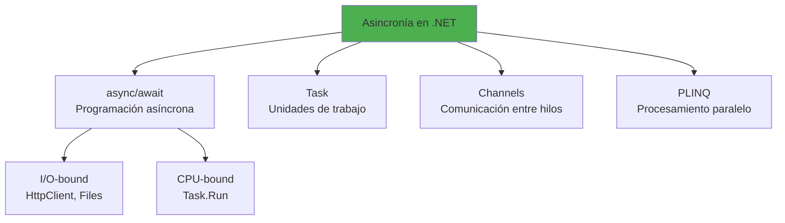
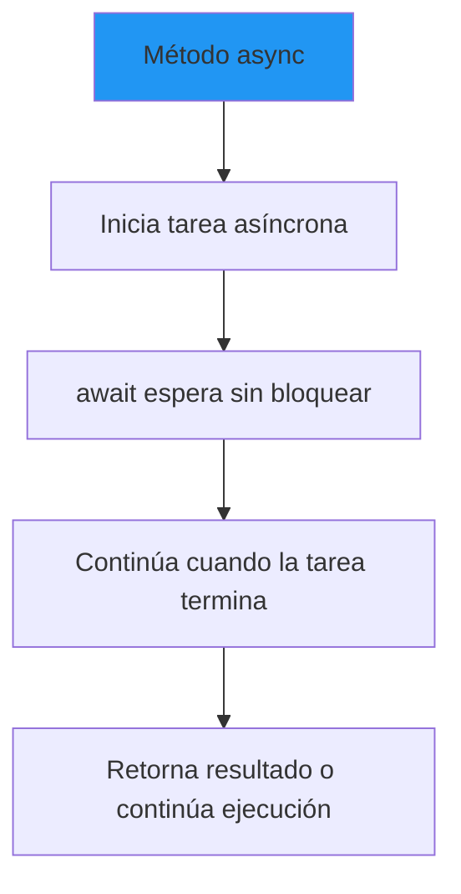
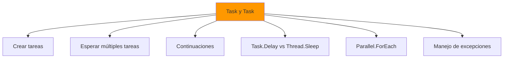

- [10. Concurrencia y Asincronía en .NET](#10-concurrencia-y-asincronía-en-net)
  - [10.1. Fundamentos de asincronía](#101-fundamentos-de-asincronía)
    - [🧠 Analogía: Cocina](#-analogía-cocina)
  - [10.2. Async/Await](#102-asyncawait)
  - [10.3. Task y Task\<T\>](#103-task-y-taskt)
  - [10.4. Sincronización de hilos](#104-sincronización-de-hilos)
  - [10.5. Colecciones concurrentes](#105-colecciones-concurrentes)
  - [10.6. Channels](#106-channels)
  - [10.7. PLINQ](#107-plinq)
  - [10.8. Resumen](#108-resumen)

# 10. Concurrencia y Asincronía en .NET

La programación asíncrona y concurrente es esencial en aplicaciones modernas para maximizar el rendimiento, mantener UI responsiva, y escalar eficientemente. .NET proporciona un modelo unificado para manejar tanto la asincronía basada en I/O como la concurrencia de CPU.



## 10.1. Fundamentos de asincronía

¿Qué es asincronía? Es la capacidad de iniciar una operación y continuar con otras tareas sin esperar a que la primera termine. Esto es crucial para mantener aplicaciones responsivas y eficientes.

La asincronía se basa en el concepto de "tareas" (Tasks) que representan operaciones que pueden completarse en el futuro. En .NET, las tareas se manejan principalmente con las palabras clave `async` y `await`. ¿Qué diferencias hay entre síncrono, asíncrono y paralelo?
- **Síncrono**: Las tareas se ejecutan una tras otra, bloqueando el hilo actual hasta que cada tarea termine.
- **Asíncrono**: Las tareas se inician y el hilo puede continuar con otras operaciones mientras espera que las tareas se completen.
- **Paralelo**: Las tareas se ejecutan simultáneamente en múltiples hilos, aprovechando múltiples núcleos de CPU.

### 🧠 Analogía: Cocina

- **Síncrono**: Cocinar un plato completo antes de empezar el siguiente. Cada plato espera su turno.
- **Asíncrono**: Poner varios platos a cocinar y atenderlos mientras se cocinan. El chef puede hacer otras cosas mientras espera.

```csharp
namespace Concurrencia.Fundamentos
{
    public class SincronoVsAsincrono
    {
        // SÍNCRONO: Espera cada tarea secuencialmente
        public void ProcesoSincrono()
        {
            var resultado1 = Tarea1(); // Espera
            var resultado2 = Tarea2(); // Espera
            var resultado3 = Tarea3(); // Espera
            Console.WriteLine("Todas completadas");
        }

        // ASÍNCRONO: Inicia todas y espera que terminen
        public async Task ProcesoAsincrono()
        {
            var t1 = Tarea1Async();
            var t2 = Tarea2Async();
            var t3 = Tarea3Async();
            
            await Task.WhenAll(t1, t2, t3);
            Console.WriteLine("Todas completadas");
        }

        // PARALELO: Ejecuta simultáneamente
        public async Task ProcesoParalelo()
        {
            await Task.WhenAll(
                Task.Run(() => Tarea1()),
                Task.Run(() => Tarea2()),
                Task.Run(() => Tarea3())
            );
        }

        private string Tarea1() { Thread.Sleep(1000); return "Tarea 1"; }
        private string Tarea2() { Thread.Sleep(1000); return "Tarea 2"; }
        private string Tarea3() { Thread.Sleep(1000); return "Tarea 3"; }
        private Task<string> Tarea1Async() => Task.FromResult("Tarea 1");
        private Task<string> Tarea2Async() => Task.FromResult("Tarea 2");
        private Task<string> Tarea3Async() => Task.FromResult("Tarea 3");
    }
}
```

## 10.2. Async/Await
Que son `async` y `await`? Son palabras clave en C# que permiten escribir código asíncrono de manera más legible y mantenible. Un método marcado con `async` puede contener `await`, que indica que la ejecución debe esperar a que una tarea se complete sin bloquear el hilo.

**¿Cómo funciona?**
Se inicia una tarea asíncrona, y cuando se encuentra un `await`, el control se devuelve al llamador hasta que la tarea se complete. Una vez completada, la ejecución continúa desde el punto del `await`. De esta forma, el hilo no queda bloqueado, permitiendo que otras operaciones se realicen mientras se espera.



```csharp
namespace Concurrencia.AsyncAwait
{
    public class AsyncAwaitExamples
    {
        // Método asíncrono básico
        public async Task<string> ObtenerDatosAsync()
        {
            using var httpClient = new HttpClient();
            return await httpClient.GetStringAsync("https://api.ejemplo.com/datos");
        }

        // Procesamiento asíncrono
        public async Task ProcesoCompletoAsync()
        {
            Console.WriteLine("Inicio");
            var datos = await ObtenerDatosAsync();
            Console.WriteLine($"Recibidos {datos.Length} caracteres");
            Console.WriteLine("Fin");
        }

        // Múltiples llamadas en paralelo
        public async Task<List<string>> ObtenerMultiplesRecursosAsync()
        {
            var urls = new[]
            {
                "https://api1.com/data",
                "https://api2.com/data",
                "https://api3.com/data"
            };

            var tareas = urls.Select(url => ObtenerRecursoAsync(url));
            var resultados = await Task.WhenAll(tareas);
            return resultados.ToList();
        }

        // Primera tarea en terminar
        public async Task<string> ObtenerElPrimeroAsync()
        {
            var tareas = new[]
            {
                ObtenerRecursoAsync("https://slow.api.com/data"),
                ObtenerRecursoAsync("https://fast.api.com/data")
            };

            var primera = await Task.WhenAny(tareas);
            return await primera;
        }

        // Cancelación con CancellationToken
        public async Task<string> ObtenerConCancelacion(CancellationToken token)
        {
            using var httpClient = new HttpClient();
            var response = await httpClient.GetAsync("https://api.ejemplo.com/datos", token);
            return await response.Content.ReadAsStringAsync();
        }

        // Configuración de timeout
        public async Task<string> ObtenerConTimeout()
        {
            using var cts = new CancellationTokenSource(TimeSpan.FromSeconds(5));
            try
            {
                return await ObtenerConCancelacion(cts.Token);
            }
            catch (OperationCanceledException)
            {
                return "Timeout";
            }
        }

        // Progress reporting
        public async Task ProcesarConProgreso(IProgress<int> progreso)
        {
            for (int i = 0; i <= 100; i++)
            {
                await Task.Delay(50);
                progreso.Report(i);
            }
        }

        private async Task<string> ObtenerRecursoAsync(string url)
        {
            using var httpClient = new HttpClient();
            return await httpClient.GetStringAsync(url);
        }

        // ValueTask para casos donde el resultado puede estar disponible inmediatamente
        public async ValueTask<int> ObtenerOContarAsync(bool usarCache)
        {
            if (usarCache)
            {
                return _cachedValue;
            }
            return await CalcularValorAsync();
        }

        private int _cachedValue = 42;
        private async Task<int> CalcularValorAsync() => await Task.FromResult(100);
    }
}
```

## 10.3. Task y Task\<T\>
Las clases `Task` y `Task<T>` representan operaciones asíncronas en .NET. `Task` se utiliza para operaciones que no devuelven un valor, mientras que `Task<T>` devuelve un valor de tipo `T` cuando la operación se completa.

Al trabajar con `Task`, es posible crear, iniciar, y gestionar tareas de diversas maneras. Además, se pueden combinar múltiples tareas utilizando métodos como `Task.WhenAll` y `Task.WhenAny`.

De igual forma, las continuaciones permiten encadenar tareas que se ejecutan después de que una tarea previa haya finalizado, facilitando la creación de flujos de trabajo asíncronos complejos. Con `Task.Delay`, es posible simular esperas sin bloquear el hilo, a diferencia de `Thread.Sleep`, que bloquea el hilo actual.



```csharp
namespace Concurrencia.Task
{
    public class TaskExamples
    {
        // Crear tasks de diferentes formas
        public void DemoCreacionTasks()
        {
            // Task.Run: Ejecuta en thread pool
            Task tarea1 = Task.Run(() => Console.WriteLine("Tarea 1"));

            // Task.FromResult: Para resultados ya disponibles
            Task<string> tarea2 = Task.FromResult("Resultado");

            // Task.CompletedTask: Para tareas completadas
            Task tarea3 = Task.CompletedTask;

            // Task.FromException: Para tareas con excepción
            Task<string> tarea4 = Task.FromException<string>(
                new InvalidOperationException("Error"));
        }

        // Esperar múltiples tasks
        public async Task DemoEsperarTasks()
        {
            var tarea1 = Task.Delay(1000);
            var tarea2 = Task.Delay(2000);
            var tarea3 = Task.Delay(500);

            // Esperar todas
            await Task.WhenAll(tarea1, tarea2, tarea3);

            // Esperar cualquiera
            var primera = await Task.WhenAny(tarea1, tarea2, tarea3);

            // Con timeout
            var timeout = Task.Delay(3000);
            var resultado = await Task.WhenAny(tarea1, timeout);
            
            if (resultado == timeout)
            {
                Console.WriteLine("Timeout");
            }
        }

        // Continuaciones
        public async Task DemoContinuaciones()
        {
            var tarea = Task.FromResult(42);
            
            var continuation = tarea.ContinueWith(t => 
            {
                Console.WriteLine($"Resultado: {t.Result}");
                return t.Result * 2;
            });

            var resultado = await continuation;

            // Continuación con estado
            var continuationConEstado = tarea.ContinueWith((t, state) => 
            {
                var valor = (int)state;
                return t.Result + valor;
            }, 100);

            // Continuación solo si exitosa
            var continuationExitosa = tarea.ContinueWith(
                t => t.Result * 2,
                TaskContinuationOptions.OnlyOnRanToCompletion);

            // Continuación en contexto específico
            await tarea.ConfigureAwait(false);
        }

        // Task.Delay vs Thread.Sleep
        public async Task DemoDelayVsSleep()
        {
            var inicio = DateTime.Now;
            
            // NO bloquea el hilo actual
            await Task.Delay(1000);
            
            var duracion1 = DateTime.Now - inicio;
            Console.WriteLine($"Task.Delay: {duracionacion1.TotalMilliseconds}ms");

            inicio = DateTime.Now;
            
            // Thread.Sleep SÍ bloquea el hilo
            Thread.Sleep(1000);
            
            var duracion2 = DateTime.Now - inicio;
            Console.WriteLine($"Thread.Sleep: {duracion2.TotalMilliseconds}ms");
        }

        // Parallel.ForEach para procesamiento paralelo
        public void DemoParallelForEach()
        {
            var items = Enumerable.Range(1, 100).ToList();

            Parallel.ForEach(items, item =>
            {
                Console.WriteLine($"Procesando {item} en hilo {Thread.CurrentThread.ManagedThreadId}");
            });

            // Con opciones
            Parallel.ForEach(items, new ParallelOptions 
            { 
                MaxDegreeOfParallelism = Environment.ProcessorCount 
            }, item =>
            {
                Console.WriteLine($"Procesando {item}");
            });
        }

        // Manejo de excepciones en tasks
        public async Task DemoExcepciones()
        {
            var tareas = new List<Task>
            {
                Task.CompletedTask,
                Task.FromException(new InvalidOperationException("Error 1")),
                Task.FromException(new ArgumentException("Error 2"))
            };

            try
            {
                await Task.WhenAll(tareas);
            }
            catch (Exception ex)
            {
                var excepciones = ((AggregateException)ex).InnerExceptions;
                foreach (var inner in excepciones)
                {
                    Console.WriteLine($"Excepción: {inner.Message}");
                }
            }

            // Unwrap para async anidado
            try
            {
                await DemoExcepcionesInterno();
            }
            catch (Exception ex)
            {
                Console.WriteLine($"Excepción capturada: {ex.Message}");
            }
        }

        private async Task DemoExcepcionesInterno()
        {
            var tarea = Task.FromException(new InvalidOperationException("Error interno"));
            await tarea;
        }
    }
}
```

## 10.4. Sincronización de hilos
La sincronización de hilos es crucial en aplicaciones concurrentes para evitar condiciones de carrera y garantizar la integridad de los datos compartidos. .NET ofrece varias primitivas de sincronización, cada una adecuada para diferentes escenarios.
- **lock**: Simplifica la protección de secciones críticas.
- **SemaphoreSlim**: Controla el acceso concurrente a recursos limitados.
- **Mutex**: Permite la sincronización entre procesos.
- **ReaderWriterLockSlim**: Optimiza el acceso concurrente para escenarios de lectura/escritura.
- **Monitor**: Proporciona control avanzado sobre bloqueos con soporte para timeouts y señales.
- **ManualResetEventSlim**: Facilita la señalización entre hilos.
- **CountdownEvent**: Permite esperar a que múltiples operaciones se completen.
- **Barrier**: Sincroniza múltiples hilos en fases específicas.
- **Interlocked**: Realiza operaciones atómicas en variables compartidas.   

```csharp
namespace Concurrencia.Sincronizacion
{
    public class SincronizacionExamples
    {
        private readonly object _lock = new();
        private int _contador = 0;
        private readonly SemaphoreSlim _semaphore = new(3);
        private readonly Mutex _mutex = new();
        private readonly ReaderWriterLockSlim _rwLock = new();
        private int _datoCompartido = 0;

        // lock para sección crítica
        private void IncrementarContador()
        {
            lock (_lock)
            {
                _contador++;
                Console.WriteLine($"Contador: {_contador} en hilo {Thread.CurrentThread.ManagedThreadId}");
            }
        }

        // SemaphoreSlim para limitar concurrencia
        public async Task DescargarRecursosAsync(IEnumerable<string> urls)
        {
            var tareas = urls.Select(async url =>
            {
                await _semaphore.WaitAsync();
                try
                {
                    await DescargarAsync(url);
                }
                finally
                {
                    _semaphore.Release();
                }
            });

            await Task.WhenAll(tareas);
        }

        private async Task DescargarAsync(string url)
        {
            await Task.Delay(100);
            Console.WriteLine($"Descargado: {url}");
        }

        // ReaderWriterLockSlim para lecturas/escrituras
        public int LeerDato()
        {
            _rwLock.EnterReadLock();
            try
            {
                return _datoCompartido;
            }
            finally
            {
                _rwLock.ExitReadLock();
            }
        }

        public void EscribirDato(int valor)
        {
            _rwLock.EnterWriteLock();
            try
            {
                _datoCompartido = valor;
            }
            finally
            {
                _rwLock.ExitWriteLock();
            }
        }

        // Monitor con timeout
        public bool IntentarAcceder(TimeSpan timeout)
        {
            if (Monitor.TryEnter(_lock, timeout))
            {
                try
                {
                    _contador++;
                    return true;
                }
                finally
                {
                    Monitor.Exit(_lock);
                }
            }
            return false;
        }

        // ManualResetEventSlim para señales
        private readonly ManualResetEventSlim _signal = new(false);

        public async Task EsperarSenalAsync()
        {
            Console.WriteLine("Esperando...");
            _signal.Wait();
            Console.WriteLine("Señal recibida");
        }

        public void EnviarSenal()
        {
            _signal.Set();
        }

        // CountdownEvent
        private readonly CountdownEvent _countdown = new(3);

        public void DemoCountdown()
        {
            for (int i = 0; i < 3; i++)
            {
                new Thread(() =>
                {
                    Thread.Sleep(100);
                    _countdown.Signal();
                }).Start();
            }

            _countdown.Wait();
            Console.WriteLine("Todas las tareas completadas");
        }

        // Barrier para sincronización de fases
        public void DemoBarrier()
        {
            var barrier = new Barrier(2);

            new Thread(() =>
            {
                Console.WriteLine("Fase 1 - Hilo 1");
                barrier.SignalAndWait();
                Console.WriteLine("Fase 2 - Hilo 1");
            }).Start();

            new Thread(() =>
            {
                Console.WriteLine("Fase 1 - Hilo 2");
                barrier.SignalAndWait();
                Console.WriteLine("Fase 2 - Hilo 2");
            }).Start();
        }

        // Interlocked para operaciones atómicas
        public void DemoInterlocked()
        {
            int valor = 0;
            
            Interlocked.Increment(ref valor);
            Interlocked.Decrement(ref valor);
            Interlocked.Add(ref valor, 10);
            Interlocked.Exchange(ref valor, 42);
            Interlocked.CompareExchange(ref valor, 100, 42);
        }
    }
}
```

## 10.5. Colecciones concurrentes
Las colecciones concurrentes en .NET están diseñadas para ser seguras en entornos multihilo, permitiendo que múltiples hilos accedan y modifiquen la colección simultáneamente sin necesidad de bloqueos explícitos. Algunas de las colecciones concurrentes más comunes incluyen:
- **ConcurrentDictionary<TKey, TValue>**: Un diccionario thread-safe que permite operaciones de lectura y escritura concurrentes.
- **ConcurrentQueue<T>**: Una cola FIFO (First In, First Out) que permite encolar y desencolar elementos de manera segura desde múltiples hilos.
- **ConcurrentStack<T>**: Una pila LIFO (Last In, First Out) que permite apilar y desapilar elementos de manera segura desde múltiples hilos.
- **ConcurrentBag<T>**: Una colección sin orden específico, optimizada para escenarios donde los elementos son añadidos y consumidos principalmente por el mismo hilo.
- **BlockingCollection<T>**: Proporciona una colección thread-safe con soporte para escenarios de productor-consumidor, permitiendo bloquear y esperar cuando la colección está vacía o llena.

```csharp
namespace Concurrencia.Colecciones
{
    public class ColeccionesConcurrentes
    {
        // ConcurrentDictionary
        public void DemoConcurrentDictionary()
        {
            var contador = new ConcurrentDictionary<string, int>();
            
            Parallel.For(0, 1000, i =>
            {
                contador.AddOrUpdate("items", 1, (_, count) => count + 1);
                contador.IncrementOrAdd("visitas", 1);
            });

            var valor = contador["items"];
            Console.WriteLine($"Total items: {valor}");
        }

        // ConcurrentQueue (FIFO)
        public void DemoConcurrentQueue()
        {
            var cola = new ConcurrentQueue<string>();
            
            Parallel.For(0, 100, i =>
            {
                cola.Enqueue($"Item {i}");
            });

            while (cola.TryDequeue(out var item))
            {
                Console.WriteLine($"Procesando: {item}");
            }
        }

        // ConcurrentStack (LIFO)
        public void DemoConcurrentStack()
        {
            var pila = new ConcurrentStack<string>();
            
            Parallel.For(0, 100, i =>
            {
                pila.Push($"Item {i}");
            });

            while (pila.TryPop(out var item))
            {
                Console.WriteLine($"Procesando: {item}");
            }
        }

        // ConcurrentBag (sin orden específico, optimizado para mismo hilo)
        public void DemoConcurrentBag()
        {
            var bag = new ConcurrentBag<int>();
            
            Parallel.For(0, 100, i =>
            {
                bag.Add(i);
            });

            Console.WriteLine($"Total elementos: {bag.Count}");
        }

        // Producer-Consumer con BlockingCollection
        public async Task DemoProducerConsumer()
        {
            var buffer = new BlockingCollection<int>(boundedCapacity: 10);
            
            var producer = Task.Run(() =>
            {
                for (int i = 0; i < 20; i++)
                {
                    buffer.Add(i);
                    Console.WriteLine($"Producido: {i}");
                }
                buffer.CompleteAdding();
            });

            var consumer = Task.Run(() =>
            {
                foreach (var item in buffer.GetConsumingEnumerable())
                {
                    Console.WriteLine($"Consumido: {item}");
                }
            });

            await Task.WhenAll(producer, consumer);
        }
    }
}
```

## 10.6. Channels
Los Channels en .NET proporcionan una forma eficiente y segura de comunicar datos entre productores y consumidores en un entorno asíncrono. Son especialmente útiles para escenarios de productor-consumidor, donde múltiples productores generan datos que deben ser procesados por uno o más consumidores.


```csharp
namespace Concurrencia.Channels
{
    public class ChannelExamples
    {
        // Channel unbounded
        public async Task DemoUnboundedChannel()
        {
            var channel = Channel.CreateUnbounded<string>();
            
            // Productor
            async Task EscribirMensajesAsync()
            {
                for (int i = 0; i < 10; i++)
                {
                    await channel.Writer.WriteAsync($"Mensaje {i}");
                }
                channel.Writer.Complete();
            }

            // Consumidor
            async Task LeerMensajesAsync()
            {
                await foreach (var mensaje in channel.Reader.ReadAllAsync())
                {
                    Console.WriteLine(mensaje);
                }
            }

            await Task.WhenAll(EscribirMensajesAsync(), LeerMensajesAsync());
        }

        // Channel bounded
        public async Task DemoBoundedChannel()
        {
            var channel = Channel.CreateBounded<string>(2);
            
            async Task Productor()
            {
                for (int i = 0; i < 5; i++)
                {
                    await channel.Writer.WriteAsync($"Item {i}");
                    Console.WriteLine($"Producido: {i}");
                }
                channel.Writer.Complete();
            }

            async Task Consumidor()
            {
                while (await channel.Reader.WaitToReadAsync())
                {
                    while (channel.Reader.TryRead(out var item))
                    {
                        Console.WriteLine($"Consumido: {item}");
                        await Task.Delay(100);
                    }
                }
            }

            await Task.WhenAll(Productor(), Consumidor());
        }

        // Multiple producers, single consumer
        public async Task DemoMultipleProducers()
        {
            var channel = Channel.CreateUnbounded<int>();
            var producers = Enumerable.Range(0, 3).Select(async producerId =>
            {
                for (int i = 0; i < 5; i++)
                {
                    await channel.Writer.WriteAsync(producerId * 10 + i);
                }
            });

            await Task.WhenAll(producers);
            channel.Writer.Complete();

            await foreach (var item in channel.Reader.ReadAllAsync())
            {
                Console.WriteLine($"Recibido: {item}");
            }
        }

        // Con CancellationToken
        public async Task DemoConCancelacion()
        {
            var channel = Channel.CreateUnbounded<string>();
            using var cts = new CancellationTokenSource();

            var producer = Task.Run(async () =>
            {
                try
                {
                    for (int i = 0; i < 100; i++)
                    {
                        await channel.Writer.WriteAsync($"Item {i}", cts.Token);
                        await Task.Delay(50, cts.Token);
                    }
                }
                catch (OperationCanceledException)
                {
                    Console.WriteLine("Productor cancelado");
                }
                channel.Writer.Complete();
            });

            var consumer = Task.Run(async () =>
            {
                try
                {
                    await foreach (var item in channel.Reader.ReadAllAsync(cts.Token))
                    {
                        Console.WriteLine(item);
                    }
                }
                catch (OperationCanceledException)
                {
                    Console.WriteLine("Consumidor cancelado");
                }
            });

            await Task.Delay(500);
            cts.Cancel();

            await Task.WhenAll(producer, consumer);
        }
    }
}
```

## 10.7. PLINQ
PLINQ (Parallel LINQ) es una extensión de LINQ que permite realizar consultas en paralelo sobre colecciones, aprovechando múltiples núcleos de CPU para mejorar el rendimiento en operaciones intensivas en datos. PLINQ divide automáticamente la carga de trabajo entre varios hilos, lo que puede acelerar significativamente las consultas en grandes conjuntos de datos.

```csharp
namespace Concurrencia.PLINQ
{
    public class PLINQExamples
    {
        // Procesamiento en paralelo
        public void DemoPLINQBasico()
        {
            var numeros = Enumerable.Range(1, 1000000);
            
            var sumaPares = numeros
                .AsParallel()
                .Where(n => n % 2 == 0)
                .Sum();

            Console.WriteLine($"Suma de pares: {sumaPares}");
        }

        // Con configuración
        public void DemoPLINQConfigurado()
        {
            var datos = Enumerable.Range(1, 10000).ToList();
            
            var resultado = datos
                .AsParallel()
                .WithDegreeOfParallelism(4)  // Máximo 4 hilos
                .WithExecutionMode(ParallelExecutionMode.ForceParalleling)  // Forzar paralelismo
                .Select(n => n * n)
                .Where(n => n > 1000)
                .Take(100)
                .ToList();
        }

        // Merge options
        public void DemoMergeOptions()
        {
            var datos = Enumerable.Range(1, 1000).ToList();
            
            // AutoBuffering: resultados en lotes
            var resultadoAuto = datos
                .AsParallel()
                .WithMergeOptions(ParallelMergeOptions.AutoBuffered)
                .Select(n => n * n)
                .ToList();

            // NotBuffered: resultados inmediatamente
            var resultadoNotBuffered = datos
                .AsParallel()
                .WithMergeOptions(ParallelMergeOptions.NotBuffered)
                .Select(n => n * n)
                .ToList();

            // FullyBuffered: espera a que todo termine
            var resultadoFully = datos
                .AsParallel()
                .WithMergeOptions(ParallelMergeOptions.FullyBuffered)
                .Select(n => n * n)
                .ToList();
        }

        // ForAll para procesamiento paralelo sin colección de resultados
        public void DemoForAll()
        {
            var datos = Enumerable.Range(1, 1000).ToList();
            var contador = 0;
            var lockObj = new object();

            datos
                .AsParallel()
                .ForAll(item =>
                {
                    lock (lockObj)
                    {
                        contador++;
                    }
                });

            Console.WriteLine($"Procesados: {contador}");
        }

        // Aggregate con función personalizada
        public void DemoAggregate()
        {
            var texto = "Hello World Parallel LINQ";
            
            var resultado = texto
                .AsParallel()
                .Aggregate(
                    seed: new Dictionary<char, int>(),
                    func: (dict, c) =>
                    {
                        lock (dict)
                        {
                            dict[c] = dict.TryGetValue(c, out var count) ? count + 1 : 1;
                            return dict;
                        }
                    });

            foreach (var par in resultado.Take(5))
            {
                Console.WriteLine($"'{par.Key}': {par.Value}");
            }
        }

        // Select con índices
        public void DemoSelectWithIndex()
        {
            var datos = Enumerable.Range(1, 100).ToList();
            
            var resultado = datos
                .AsParallel()
                .Select((n, index) => new { Index = index, Value = n, Square = n * n })
                .Where(x => x.Square > 100)
                .Take(10);

            foreach (var item in resultado)
            {
                Console.WriteLine($"Index: {item.Index}, Value: {item.Value}, Square: {item.Square}");
            }
        }

        // Exception handling
        public void DemoExcepciones()
        {
            var datos = new[] { 1, 2, 3, 4, 5 };
            
            try
            {
                var resultado = datos
                    .AsParallel()
                    .Select(n =>
                    {
                        if (n == 3) throw new InvalidOperationException("Error en 3");
                        return n;
                    })
                    .ToList();
            }
            catch (AggregateException ex)
            {
                foreach (var inner in ex.InnerExceptions)
                {
                    Console.WriteLine($"Excepción: {inner.Message}");
                }
            }
        }
    }
}
```

## 10.8. Resumen

Ten en en cuenta estos puntos clave al trabajar con concurrencia y asincronía en .NET:

**Fundamentos de Asincronía**
- async/await simplifica la programación asíncrona
- Task representa una operación asíncrona
- Task.WhenAll espera múltiples tareas
- Task.WhenAny espera la primera tarea en completar

**Sincronización**
- lock para secciones críticas simples
- SemaphoreSlim limita concurrencia
- ReaderWriterLockSlim optimiza lecturas/escrituras
- Interlocked para operaciones atómicas

**Colecciones Concurrentes**
- ConcurrentDictionary para diccionarios thread-safe
- ConcurrentQueue/Stack para estructuras FIFO/LIFO
- BlockingCollection para producer-consumer
- Channel para comunicación asíncrona entre productores y consumidores

**Procesamiento Paralelo**
- Parallel.ForEach para iteraciones paralelas
- PLINQ para consultas paralelas sobre colecciones
- ForAll para procesamiento sin recolección de resultados
- Aggregate para reducciones personalizadas paralelas