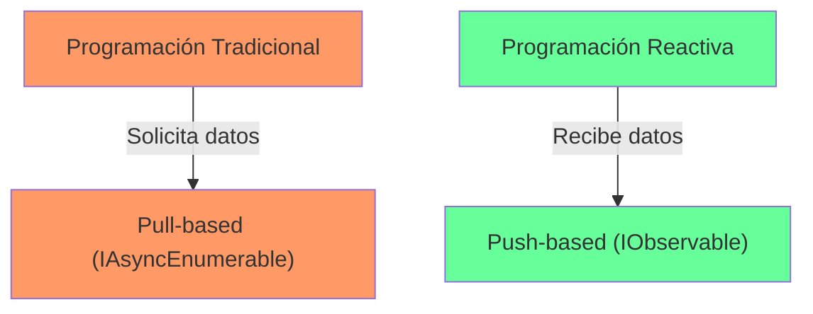
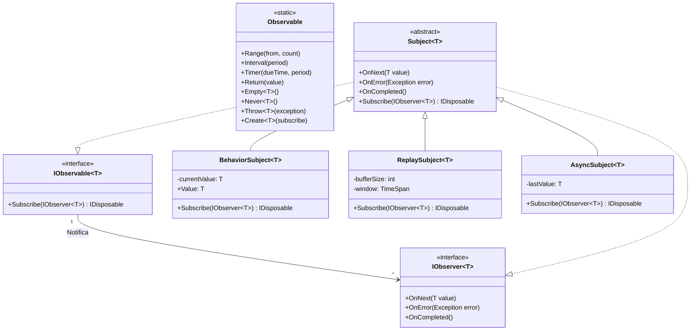
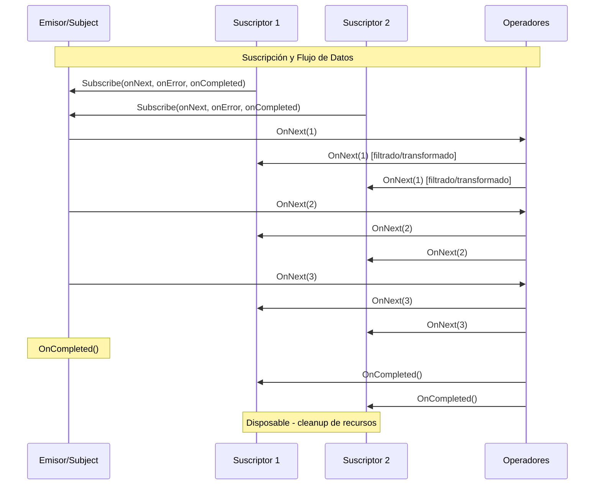

- [11. Programación Reactiva en .NET](#11-programación-reactiva-en-net)
    - [11.0. Instalación de Rx.NET](#110-instalación-de-rxnet)
  - [11.1. Fundamentos de programación reactiva](#111-fundamentos-de-programación-reactiva)
    - [11.1.1. 🧠 Analogía: Tubería de datos](#1111--analogía-tubería-de-datos)
  - [11.2. IAsyncEnumerable\<T\>](#112-iasyncenumerablet)
  - [11.3. IObservable\<T\> y Rx.NET](#113-iobservablet-y-rxnet)
  - [11.4. Subject y Operators](#114-subject-y-operators)
  - [11.5. Integración con ASP.NET Core](#115-integración-con-aspnet-core)
  - [11.6. Diferencias clave](#116-diferencias-clave)
  - [11.7. Resumen](#117-resumen)

# 11. Programación Reactiva en .NET

La programación reactiva es un paradigma de programación orientado al manejo de flujos de datos asíncronos y la propagación de cambios. En lugar de trabajar con valores únicos, trabajamos con secuencias de eventos que pueden emitirse en el tiempo.

Debemos pensar en dos tipos de flujos asincrónicos:
- Fríos (pull-based): El consumidor solicita datos cuando los necesita. Ejemplo: `IAsyncEnumerable<T>`. Se suelen usar en APIs que devuelven streams de datos (peticiones HTTP, bases de datos o archivos). Los datos siempre que se pieden comienzan desde el prinicpio, por ejemplo si se pide una base de datos , se devuleve el resultado
- Calientes (push-based): El emisor envía datos a los consumidores cuando están disponibles. Ejemplo: `IObservable<T>` con Rx.NET. Se usan en escenarios de eventos en tiempo real (UI, WebSockets, sensores). Si te connectas, o los pides, recibes los datos desde el momento actual, no desde el principio.



Además, la programación reactiva permite transformar, filtrar y combinar flujos de datos de manera declarativa usando operadores funcionales, facilitando la construcción de aplicaciones reactivas y escalables usando patrones como Observer, Iterator y Functional Programming.

### 11.0. Instalación de Rx.NET

Para usar Reactive Extensions (Rx.NET) en tu proyecto .NET, necesitas instalar el paquete NuGet System.Reactive:

```bash
# Paquete principal de Rx.NET
dotnet add package System.Reactive

# Para integración con UI (WPF, WinForms, etc.)
dotnet add package System.Reactive.Windows.Forms

# Para UWP/WinUI
dotnet add package System.Reactive.Uwp.Extensions
```





## 11.1. Fundamentos de programación reactiva

### 11.1.1. 🧠 Analogía: Tubería de datos

Imagina una tubería de agua (el stream) donde:
- **Grifo abierto** = Emisor produciendo eventos
- **Filtro** = Operador que procesa
- **Consumidor** = Tu casa que recibe el agua

En programación tradicional, abres el grifo, llenas un cubo, lo vacías, y repites. 
En programación asíncrona, abres el grifo y esperas a que el cubo se llene.
En reactiva, abres el grifo una vez y el agua fluye continuamente.

```csharp
namespace ProgramacionReactiva.Fundamentos
{
    public class FundamentosReactivo
    {
        // ❌ Programación tradicional (pull-based)
        public async Task<IEnumerable<int>> ObtenerDatosTradicional()
        {
            var datos = await _repositorio.GetAllAsync();
            return datos.Where(d => d.Activo).ToList();
        }

        // ✅ Programación reactiva (push-based)
        public IAsyncEnumerable<int> ObtenerDatosReactivo(
            CancellationToken token = default)
        {
            return ObtenerStreamAsync(token);
        }

        private async IAsyncEnumerable<int> ObtenerStreamAsync(
            [EnumeratorCancellation] CancellationToken token = default)
        {
            for (int i = 0; i < 100; i++)
            {
                token.ThrowIfCancellationRequested();
                yield return i * i;
                await Task.Delay(100, token);
            }
        }
    }
}
```

## 11.2. IAsyncEnumerable\<T\>

C# 8.0 introdujo `IAsyncEnumerable<T>` para soportar iteración asíncrona natively. Es ideal para escenarios donde los datos llegan en streaming (base de datos, APIs, archivos).

Recuerda que `IAsyncEnumerable<T>` usa `await foreach` para consumir los datos de manera asíncrona.
Usamos `yield return` para emitir valores uno a uno siguiendo un flujo asíncrono con el patrón pull-based.

```csharp
namespace ProgramacionReactiva.IAsyncEnumerable
{
    public class IAsyncEnumerableExamples(AppDbContext context)
    {
        public async IAsyncEnumerable<int> GenerarNumerosAsync(
            int cantidad,
            [EnumeratorCancellation] CancellationToken token = default)
        {
            for (int i = 0; i < cantidad; i++)
            {
                token.ThrowIfCancellationRequested();
                await Task.Delay(50, token);
                yield return i;
            }
        }

        public async Task ProcesarNumerosAsync()
        {
            await foreach (var numero in GenerarNumerosAsync(10))
            {
                Console.WriteLine($"Procesando: {numero}");
            }
        }

        public async Task ConsumirConCancelacion(CancellationToken token)
        {
            try
            {
                await foreach (var item in GenerarNumerosAsync(100, token))
                {
                    Console.WriteLine($"Recibido: {item}");
                }
            }
            catch (OperationCanceledException)
            {
                Console.WriteLine("Stream cancelado");
            }
        }

        public async IAsyncEnumerable<string> FiltrarYTransformar(
            IAsyncEnumerable<int> numeros,
            [EnumeratorCancellation] CancellationToken token = default)
        {
            await foreach (var numero in numeros.WithCancellation(token))
            {
                if (numero % 2 == 0)
                {
                    yield return $"Par: {numero}";
                }
            }
        }

        public async IAsyncEnumerable<Producto> ObtenerProductosAsync(
            [EnumeratorCancellation] CancellationToken token = default)
        {
            await foreach (var producto in context.Productos
                .AsAsyncEnumerable()
                .WithCancellation(token))
            {
                if (producto.Activo)
                {
                    yield return producto;
                }
            }
        }

        public async Task ProcesarLotesAsync()
        {
            var lote = new List<int>();
            
            await foreach (var item in GenerarNumerosAsync(100))
            {
                lote.Add(item);
                if (lote.Count >= 10)
                {
                    await ProcesarLote(lote);
                    lote.Clear();
                }
            }
            
            if (lote.Count > 0)
            {
                await ProcesarLote(lote);
            }
        }

        public async IAsyncEnumerable<int> CombinarStreams(
            IAsyncEnumerable<int> stream1,
            IAsyncEnumerable<int> stream2,
            [EnumeratorCancellation] CancellationToken token = default)
        {
            var tarea1 = Task.Run(async () =>
            {
                await foreach (var item in stream1.WithCancellation(token))
                {
                    yield return item;
                }
            }, token);

            var tarea2 = Task.Run(async () =>
            {
                await foreach (var item in stream2.WithCancellation(token))
                {
                    yield return item;
                }
            }, token);

            await Task.WhenAll(tarea1, tarea2);
        }

        public async Task<int> ContarElementosAsync(
            IAsyncEnumerable<int> stream,
            int bufferSize = 100)
        {
            var buffer = new List<int>();
            int count = 0;

            await foreach (var item in stream)
            {
                buffer.Add(item);
                if (buffer.Count >= bufferSize)
                {
                    count += buffer.Count;
                    buffer.Clear();
                }
            }
            
            count += buffer.Count;
            return count;
        }

        private async Task ProcesarLote(List<int> lote)
        {
            Console.WriteLine($"Procesando lote de {lote.Count} items");
            await Task.Delay(100);
        }
    }

    public record Producto(int Id, string Nombre, decimal Precio, bool Activo);
}
```

## 11.3. IObservable\<T\> y Rx.NET

Rx.NET (Reactive Extensions) proporciona un modelo completo para programación reactiva con operadores avanzados de transformación, filtrado y combinación.

Recuerda que `IObservable<T>` usa el patrón push-based, donde el emisor envía datos a los consumidores cuando están disponibles. Usamos `Subscribe` para recibir los datos y manejar eventos. Usamos `Subject` para crear emisores que también son observables. Usamos `OnNext`, `OnError` y `OnCompleted` para emitir eventos.

Además ofrece operadores como `Select`, `Where`, `Buffer`, `Throttle`, etc., para manipular flujos de datos de manera declarativa.

```csharp
namespace ProgramacionReactiva.RxNET
{
    [TestFixture]
    public class RxNETExamples
    {
        [Test]
        public void Subject_Basico()
        {
            // Subject actúa como observable y observer simultáneamente
            var subject = new Subject<int>();

            subject.Subscribe(
                onNext: n => Console.WriteLine($"Recibido: {n}"),
                onError: ex => Console.WriteLine($"Error: {ex.Message}"),
                onCompleted: () => Console.WriteLine("Completado")
            );

            for (int i = 0; i < 5; i++)
            {
                subject.OnNext(i);
            }
            subject.OnCompleted();
        }

        [Test]
        public void BehaviorSubject_ConValorInicial()
        {
            // BehaviorSubject guarda el último valor emitido
            var subject = new BehaviorSubject<string>("Inicial");

            subject.Subscribe(s => Console.WriteLine($"Suscriptor 1: {s}"));
            
            subject.OnNext("Primer valor");
            subject.Subscribe(s => Console.WriteLine($"Suscriptor 2: {s}"));
            
            subject.OnNext("Segundo valor");
        }

        [Test]
        public void ReplaySubject_ReplayValues()
        {
            // ReplaySubject reemite todos los valores a nuevos suscriptores
            var subject = new ReplaySubject<int>();

            subject.OnNext(1);
            subject.OnNext(2);

            // Nuevo suscriptor recibe 1 y 2
            subject.Subscribe(n => Console.WriteLine($"Recibido: {n}"));
            
            subject.OnNext(3);
        }

        [Test]
        public void AsyncSubject_UltimoValor()
        {
            // AsyncSubject solo emite el último valor cuando se completa
            var subject = new AsyncSubject<int>();

            subject.Subscribe(n => Console.WriteLine($"Recibido: {n}"));

            subject.OnNext(1);
            subject.OnNext(2);
            subject.OnNext(3);
            subject.OnCompleted(); // Solo emite 3
        }

        [Test]
        public void Interval_Y_Timer()
        {
            // Interval: emite cada N milisegundos
            var interval = Observable.Interval(TimeSpan.FromSeconds(1));
            
            // Timer: emite después de un delay
            var timer = Observable.Timer(TimeSpan.FromSeconds(5), TimeSpan.FromSeconds(2));
        }

        [Test]
        public void Operadores_LINQ()
        {
            var numeros = new[] { 1, 2, 3, 4, 5, 6, 7, 8, 9, 10 }.ToObservable();

            // Filter - Where
            var pares = numeros.Where(n => n % 2 == 0);
            
            // Map - Select
            var cuadrados = numeros.Select(n => n * n);
            
            // Take
            var primeros5 = numeros.Take(5);
            
            // Skip
            var ultimos5 = numeros.Skip(5);
            
            // Distinct
            var unicos = numeros.Distinct();
            
            // TakeWhile
            var menores10 = numeros.TakeWhile(n => n < 10);
        }

        [Test]
        public void Operadores_Aggregate()
        {
            var numeros = Observable.Range(1, 10);

            // Count
            var count = numeros.Count();

            // Sum
            var sum = numeros.Sum();

            // Average
            var avg = numeros.Average();

            // Aggregate
            var factorial = numeros.Aggregate(1, (acc, n) => acc * n);
        }

        [Test]
        public void Operadores_Combinacion()
        {
            var fuente1 = Observable.Interval(TimeSpan.FromSeconds(0.5)).Take(5);
            var fuente2 = Observable.Interval(TimeSpan.FromSeconds(0.3)).Take(5);

            // Merge - combinar streams
            var merge = fuente1.Merge(fuente2);

            // Concat - sequentially
            var concat = fuente1.Concat(fuente2);

            // Zip - pares
            var zip = fuente1.Zip(fuente2, (a, b) => $"{a}-{b}");

            // CombineLatest
            var combineLatest = fuente1.CombineLatest(fuente2, (a, b) => a + b);

            // Amb - racing
            var amb = fuente1.Amb(fuente2);
        }

        [Test]
        public void Operadores_Tiempo()
        {
            var fuente = Observable.Interval(TimeSpan.FromSeconds(0.5)).Take(10);

            // Throttle - esperar quietud
            var throttled = fuente.Throttle(TimeSpan.FromSeconds(1));

            // Debounce - esperar pausa
            var debounced = fuente.Debounce(TimeSpan.FromSeconds(1));

            // Sample - muestrear
            var sampled = fuente.Sample(TimeSpan.FromSeconds(1));

            // Timeout
            var withTimeout = fuente.Timeout(TimeSpan.FromSeconds(3));

            // Delay
            var delayed = fuente.Delay(TimeSpan.FromSeconds(2));
        }

        [Test]
        public void Buffer_Y_Window()
        {
            var fuente = Observable.Interval(TimeSpan.FromSeconds(0.2)).Take(20);

            // Buffer - agrupar en lotes
            var buffered = fuente.Buffer(5);

            // Window - sliding window
            var windowed = fuente.Window(5);
        }

        [Test]
        public void Switch_Y_ExhaustMap()
        {
            var fuente = new Subject<int>();
            var resultado = fuente.SelectMany(n => Observable.Timer(
                TimeSpan.FromSeconds(0.5)).Select(_ => n));

            // SwitchMap - cancelar anterior
            var switchMap = fuente.SwitchMap(n => Observable.Return(n * 2));
        }

        [Test]
        public void Retry_Y_Catch()
        {
            var fuente = Observable.Create<int>(observer =>
            {
                observer.OnNext(1);
                observer.OnNext(2);
                observer.OnError(new InvalidOperationException("Error"));
                return () => { };
            });

            // Retry - reintentar
            var conRetry = fuente.Retry(3);

            // Catch - manejar error
            var conCatch = fuente.Catch(Observable.Return(999));
        }
    }
}
```

## 11.4. Subject y Operators
Usamos Subjects como emisores que también son observables. Los operadores permiten transformar y combinar flujos de datos. Son ideales para construir pipelines reactivos complejos.

```csharp
namespace ProgramacionReactiva.Subjects
{
    public class SubjectExamples
    {
        // Factory methods
        public void DemoFactories()
        {
            // Empty - completa inmediatamente
            var empty = Observable.Empty<int>();

            // Never - nunca emite
            var never = Observable.Never<int>();

            // Throw - emite error
            var throwError = Observable.Throw<int>(new Exception("Error"));

            // Return - emite un valor
            var single = Observable.Return(42);

            // Range
            var range = Observable.Range(1, 10);

            // Generate
            var generated = Observable.Generate(
                0,
                i => i < 10,
                i => i + 1,
                i => i * 2
            );
        }

        // Hot vs Cold observables
        public void DemoHotCold()
        {
            // Cold: ejecuta cuando hay suscriptor
            var cold = Observable.Create<int>(observer =>
            {
                Console.WriteLine("Ejecutando cold observable");
                observer.OnNext(1);
                observer.OnNext(2);
                observer.OnCompleted();
                return () => Console.WriteLine("Cleanup cold");
            });

            Console.WriteLine("Antes de suscribir");
            cold.Subscribe(n => Console.WriteLine($"Cold: {n}"));
            cold.Subscribe(n => Console.WriteLine($"Cold 2: {n}"));

            // Hot: ejecuta independientemente
            var hot = new BehaviorSubject<int>(0);
            var hotObservable = Observable.Interval(TimeSpan.FromSeconds(1))
                .Do(n => hot.OnNext(n));

            Console.WriteLine("Antes de suscribir a hot");
            hotObservable.Subscribe(n => Console.WriteLine($"Hot: {n}"));
        }

        // Do (tap) para side effects
        public void DemoDo()
        {
            var numeros = Observable.Range(1, 5);
            
            var conLogs = numeros
                .Do(n => Console.WriteLine($"Before: {n}"))
                .Select(n => n * 2)
                .Do(n => Console.WriteLine($"After: {n}"));

            conLogs.Subscribe(n => Console.WriteLine($"Result: {n}"));
        }

        // Materialize y Dematerialize
        public void DemoMaterialize()
        {
            var fuente = Observable.Range(1, 3);
            
            // Materialize: convierte OnNext/OnError/OnCompleted a notificaciones
            var materializado = fuente.Materialize();

            // Dematerialize: inversa
            var dematerializado = materializado.Dematerialize();
        }

        // Scan (acumulador)
        public void DemoScan()
        {
            var fuente = Observable.Range(1, 5);
            
            var acumulado = fuente.Scan(0, (acc, n) => acc + n);
            // Emite: 1, 3, 6, 10, 15
        }

        // Publish y Connect
        public void DemoPublish()
        {
            var fuente = Observable.Interval(TimeSpan.FromSeconds(1)).Take(10);
            
            // Connect: hacer hot observable
            var compartido = fuente.Publish();
            
            compartido.Subscribe(n => Console.WriteLine($"S1: {n}"));
            compartido.Subscribe(n => Console.WriteLine($"S2: {n}"));
            
            compartido.Connect();
        }

        // RefCount
        public void DemoRefCount()
        {
            var fuente = Observable.Interval(TimeSpan.FromSeconds(1)).Take(10);
            
            // Auto-connect cuando hay primer suscriptor
            var compartido = fuente.Publish().RefCount();
        }
    }
}
```

## 11.5. Integración con ASP.NET Core

Podemos usar programación reactiva en ASP.NET Core para construir APIs que devuelvan streams de datos, usar SignalR para WebSockets reactivos, o Server-Sent Events (SSE) para notificaciones en tiempo real.

```csharp
namespace ProgramacionReactiva.AspNetCore
{
    public static class Endpoints
    {
        public static void MapEndpoints(this WebApplication app)
        {
            app.MapGet("/productos/stream", async (
                [FromServices] AppDbContext context,
                CancellationToken token) =>
            {
                var productos = context.Productos
                    .Where(p => p.Activo)
                    .AsAsyncEnumerable();

                return Results.Stream(
                    async (writer) =>
                    {
                        await foreach (var producto in productos.WithCancellation(token))
                        {
                            await writer.WriteAsync($"{producto.Id},{producto.Nombre}\n");
                        }
                    },
                    contentType: "text/plain"
                );
            });

            app.MapHub<ProductHub>("/producthub");

            app.MapGet("/notificaciones", async (
                IHubContext<NotificationHub, INotificationClient> hubContext,
                CancellationToken token) =>
            {
                async Task EnviarNotificaciones()
                {
                    while (!token.IsCancellationRequested)
                    {
                        await hubContext.Clients.All.RecibirNotificacion(
                            $"Notificación {DateTime.Now:HH:mm:ss}");
                        await Task.Delay(2000, token);
                    }
                }

                return Task.Run(EnviarNotificaciones);
            });
        }
    }

    public class ProductHub : Hub<INotificationClient>
    {
        public async Task JoinGroup(string groupName)
        {
            await Groups.AddToGroupAsync(Context.ConnectionId, groupName);
        }

        public async Task LeaveGroup(string groupName)
        {
            await Groups.RemoveFromGroupAsync(Context.ConnectionId, groupName);
        }
    }

    public interface INotificationClient
    {
        Task RecibirNotificacion(string mensaje);
    }
}
```

## 11.6. Diferencias clave

| Aspecto                    | IAsyncEnumerable       | IObservable (Rx)                |
| -------------------------- | ---------------------- | ------------------------------- |
| **Patrón**                 | Pull (consumidor pide) | Push (emisor envía)             |
| **Múltiples consumidores** | No (uno a uno)         | Sí (uno a muchos)               |
| **lazy evaluation**        | Sí                     | Depends on type                 |
| **Complex operators**      | LINQ básico            | Completo (filter, buffer, etc.) |
| **Async nativo**           | Sí                     | ConTask-based operators         |
| **Thread safety**          | No requerida           | Depends                         |

## 11.7. Resumen

Ten en cuenta estas diferencias para elegir la mejor herramienta según el escenario.

**Programación Reactiva**
- Maneja flujos de datos asíncronos
- Desacopla productores de consumidores
- Permite transformación, filtrado y combinación de streams

**IAsyncEnumerable**
- Iteración asíncrona nativa en C#
- Ideal para streaming de datos
- Soporta CancellationToken
- Compatible con LINQ

**Rx.NET (IObservable)**
- Modelo completo con Subject y operators
- Hot vs Cold observables
- Operadores avanzados: buffer, throttle, window
- Perfecto para eventos en tiempo real

**Cuándo usar cada uno**
- IAsyncEnumerable: APIs que devuelven streams
- Rx: Eventos del UI, WebSockets, procesamiento de datos complejos