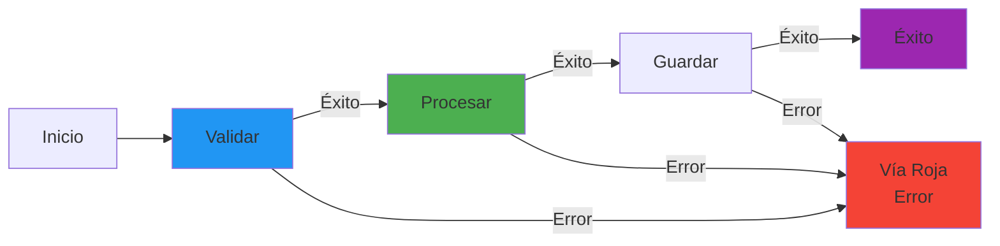
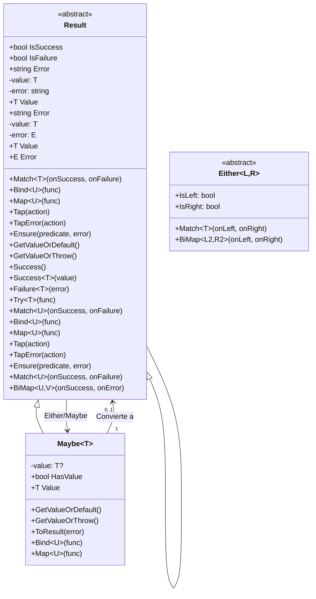
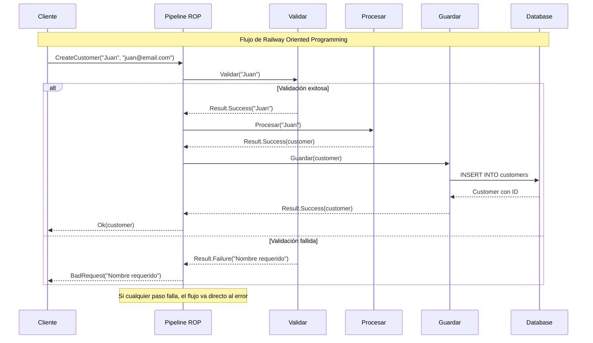

- [12. Railway Oriented Programming (ROP) en .NET](#12-railway-oriented-programming-rop-en-net)
  - [12.1. Fundamentos de ROP](#121-fundamentos-de-rop)
    - [12.1.1. 🧠 Analogía: Vías de tren](#1211--analogía-vías-de-tren)
  - [12.2. La clase Result](#122-la-clase-result)
    - [12.2.1. La clase Result: El vagón del tren](#1221-la-clase-result-el-vagón-del-tren)
    - [12.2.2. Métodos Principales (La API de ROP)](#1222-métodos-principales-la-api-de-rop)
      - [A. Creación (Entrar a la vía)](#a-creación-entrar-a-la-vía)
      - [B. Transformación (La vía verde)](#b-transformación-la-vía-verde)
      - [C. Efectos Secundarios (Mirar el tren pasar)](#c-efectos-secundarios-mirar-el-tren-pasar)
      - [D. Validación (Cambio de vía)](#d-validación-cambio-de-vía)
      - [E. Salida (La estación final)](#e-salida-la-estación-final)
    - [12.2.3. ROP en el mundo Asíncrono](#1223-rop-en-el-mundo-asíncrono)
    - [12.2.4. Interoperabilidad y Extensiones útiles](#1224-interoperabilidad-y-extensiones-útiles)
  - [12.3. Operaciones encadenadas](#123-operaciones-encadenadas)
  - [12.4. Result vs Excepciones](#124-result-vs-excepciones)
  - [12.5. Either y Maybe](#125-either-y-maybe)
  - [12.6. Integración con ASP.NET Core](#126-integración-con-aspnet-core)
  - [12.6. Resumen](#126-resumen)

# 12. Railway Oriented Programming (ROP) en .NET

Railway Oriented Programming (ROP) es un patrón funcional para manejar errores de forma explícita sin usar excepciones. El código fluye como un tren en dos vías paralelas: éxito y fracaso.







## 12.1. Fundamentos de ROP

### 12.1.1. 🧠 Analogía: Vías de tren

Imagina un tren con dos vías paralelas:
- **Vía verde (Success)**: Todo sale bien, el tren continúa
- **Vía roja (Failure)**: Algo falló, el tren se desvía y va directo al final

Una vez en la vía roja, el tren se salta todas las estaciones restantes. No hay excepciones que rompan el flujo abruptamente.

```csharp
namespace ROP.Fundamentos
{
    public class ROPFundamentos(ICustomerContext context)
    {
        private readonly ICustomerContext _context = context;

        // Instalar: dotnet add package CSharpFunctionalExtensions

        // ❌ Con excepciones - flujo roto con try-catch
        public Customer CreateCustomer(string name, string email)
        {
            try
            {
                if (string.IsNullOrEmpty(name))
                    throw new ArgumentException("Nombre requerido");

                if (!email.Contains("@"))
                    throw new ArgumentException("Email inválido");

                var customer = new Customer(name, email);
                _context.Customers.Add(customer);
                _context.SaveChanges();
                return customer;
            }
            catch (Exception ex)
            {
                throw new InvalidOperationException("Error creando cliente", ex);
            }
        }

        // ✅ Con ROP - flujo lineal sin excepciones
        public Result<Customer> CreateCustomerROP(string name, string email)
        {
            return ValidarNombre(name)
                .Bind(n => ValidarEmail(email))
                .Bind(e => CrearCustomer(name, email))
                .Tap(c => _context.SaveChanges());
        }

        private Result<string> ValidarNombre(string name)
        {
            if (string.IsNullOrEmpty(name))
                return Result.Failure<string>("Nombre requerido");
            return Result.Success(name);
        }

        private Result<string> ValidarEmail(string email)
        {
            if (!email.Contains("@"))
                return Result.Failure<string>("Email inválido");
            return Result.Success(email);
        }

        private Result<Customer> CrearCustomer(string name, string email)
        {
            var customer = new Customer(name, email);
            return Result.Success(customer);
        }
    }

    public record Customer(string Name, string Email);
    public interface ICustomerContext
    {
        DbSet<Customer> Customers { get; }
        void SaveChanges();
    }
}
```

## 12.2. La clase Result

He analizado tus apuntes. **El concepto general es correcto**, has entendido la filosofía detrás de ROP (evitar excepciones, flujo lineal, tipos de retorno explícitos).

Para implementar esto en .NET, el estándar de facto es la librería `CSharpFunctionalExtensions`.

```bash
dotnet add package CSharpFunctionalExtensions

```

### 12.2.1. La clase Result: El vagón del tren

La clase `Result` actúa como un contenedor (o envoltorio) que nos dice si una operación tuvo éxito o falló.

Existen tres variantes principales que debemos conocer:

1. **`Result` (Simple):** Solo indica éxito o fallo. Es el equivalente a un método `void` que puede fallar.
2. **`Result<T>`:** Devuelve un valor `T` si hay éxito, o un mensaje de error (`string`) si falla.
3. **`Result<T, E>`:** La versión más robusta. Devuelve `T` si hay éxito, o un objeto de error tipado `E` si falla. Esto es vital cuando necesitamos categorizar errores (ej: `ErrorDeBaseDeDatos`, `ErrorDeValidacion`).

**¿Por qué usar esto en lugar de Excepciones?**

* **Honestidad:** La firma del método `public Result<User> GetUser(id)` te "grita" que puede fallar. Un `public User GetUser(id)` te miente, porque podría lanzar una excepción oculta.
* **Rendimiento:** Lanzar excepciones (`throw`) es costoso para la CPU (stack trace). `Result` es solo un objeto normal.
* **Legibilidad:** El código se lee de arriba a abajo, sin saltos abruptos de flujo.

### 12.2.2. Métodos Principales (La API de ROP)

Para entender ROP, hay que categorizar los métodos según su función en la "vía del tren".

#### A. Creación (Entrar a la vía)

Métodos estáticos para iniciar el flujo.

* `Result.Success()` / `Result.Success(valor)`: Crea un resultado exitoso.
* `Result.Failure(error)`: Crea un resultado fallido inmediatamente.
* `Result.Failure<T>(error)`: Crea un fallo tipado para un retorno esperado.

#### B. Transformación (La vía verde)

Estos métodos solo se ejecutan si el resultado anterior fue **Exitoso**. Si hubo fallo, se saltan.

* **`Map(func)`**: Transforma el valor dentro del Result (de `T` a `K`).
* *Ejemplo:* Convertir un `Result<User>` a `Result<UserDto>`.
* *Nota:* La función `func` no puede fallar.


* **`Bind(func)`**: Encadena una operación que **también devuelve un Result**. Es el corazón de ROP.
* *Ejemplo:* Validar usuario (devuelve Result) -> Guardar en BD (devuelve Result).
* *Clave:* Si la primera falla, `Bind` no ejecuta la segunda y pasa el error.


#### C. Efectos Secundarios (Mirar el tren pasar)

Ejecutan acciones sin cambiar el valor del resultado (Logs, notificaciones).

* **`Tap(action)`**: Ejecuta una acción si es exitoso y sigue adelante. Ideal para logs o enviar emails de "todo ok".
* `TapError(action)`: Ejecuta una acción solo si hubo fallo (ej: log de errores).

#### D. Validación (Cambio de vía)

* **`Ensure(predicado, error)`**: Verifica una condición. Si es `true`, sigue en la vía verde. Si es `false`, descarrila a la vía roja con el error proporcionado.

#### E. Salida (La estación final)

Extraen el valor final para devolverlo a la API o al usuario.

* **`Match(onSuccess, onFailure)`**: Desempaqueta el resultado. Obliga a definir qué devolver en ambos casos.
* *Uso:* `return result.Match(val => Ok(val), err => BadRequest(err));`


* **`IsSuccess` / `IsFailure**`: Booleanos para comprobaciones manuales (menos recomendado en estilo funcional puro).

---

### 12.2.3. ROP en el mundo Asíncrono

**Nota para el alumno:** En versiones modernas de `CSharpFunctionalExtensions`, **NO** solemos usar sufijos como `BindAsync` o `MapAsync`.

La librería utiliza **sobrecarga de métodos**. Esto significa que el método se sigue llamando `Bind` o `Map`, pero acepta `Task` o `Task<Result>`.

* **`Bind(func)` asíncrono**: Si tienes un `Task<Result<T>>` y quieres encadenar otra tarea asíncrona, usas `.Bind()`. La librería gestiona el `await` internamente.
* **`Map(func)` asíncrono**: Igual que el síncrono, pero maneja futuros.

**Ejemplo de flujo completo (Síncrono vs Asíncrono):**

```csharp
// Ejemplo de un flujo ROP real
public Task<IActionResult> RegistrarUsuario(UserDto dto)
{
    // Inicio del tren
    return ValidarDto(dto)                    // Devuelve Result<User>
        .Bind(user => GuardarEnBaseDatos(user)) // Bind porque Guardar devuelve Result (puede fallar)
        .Tap(user => EnviarEmailBienvenida(user)) // Tap porque el email no debe detener el flujo principal
        .Map(user => new UserResponse(user))    // Map transforma de Dominio a DTO de respuesta
        .Match<UserResponse, IActionResult>(    // Match finaliza y convierte a HTTP
            success => Ok(success),
            failure => BadRequest(failure)
        );
}

```

### 12.2.4. Interoperabilidad y Extensiones útiles

Métodos auxiliares para conectar con código que no usa ROP:

* **`Maybe<T>`**: Similar a `Result` pero para valores opcionales (puede ser null o tener valor, pero sin mensaje de error).
* **`ToResult(error)`**: Método de extensión para convertir un `Maybe` o un `bool` en un `Result`.
* *Ejemplo:* `usuarioExiste.ToResult("El usuario no existe")`.


* **`Try(func)`**: Envuelve código peligroso (que lanza excepciones) y lo convierte en un `Result`.
* *Uso:* Capturar errores de librerías de terceros que no controlamos.


```csharp
namespace ROP.Result
{
    public class ResultExamples
    {
        // Result simple - solo éxito/fallo
        public void DemoResultSimple()
        {
            Result resultadoExitoso = Result.Success();
            Result resultadoFallido = Result.Failure("Algo falló");

            if (resultadoExitoso.IsSuccess)
                Console.WriteLine("Éxito!");
            else
                Console.WriteLine($"Error: {resultadoFallido.Error}");
        }

        // Result<T> - retorna valor o error
        public void DemoResultT()
        {
            Result<int> exito = Result.Success(42);
            Result<int> fallo = Result.Failure<int>("No se pudo obtener");

            // Match - desempacar
            int valor = exito.Match(
                onSuccess: v => v,
                onFailure: err => -1
            );

            // Valor directo con getter
            if (exito.IsSuccess)
                Console.WriteLine($"Valor: {exito.Value}");
            else
                Console.WriteLine($"Error: {exito.Error}");
        }

        // Result<T, E> - valor o error tipado
        public void DemoResultTE()
        {
            Result<int, ErrorType> resultado = Result.Success<int, ErrorType>(42);
            
            resultado.Match(
                onSuccess: v => Console.WriteLine($"Valor: {v}"),
                onFailure: err => Console.WriteLine($"Error: {err.Message}")
            );
        }

        // Métodos de creación
        public void DemoCreacion()
        {
            // Success
            var success1 = Result.Success();
            var success2 = Result.Success(42);
            
            // Failure
            var failure1 = Result.Failure("Error message");
            var failure2 = Result.Failure<int>("Error int");
            
            // From Try - envolver código que puede fallar
            var fromTry = Result.Try(() => int.Parse("42"));
            var fromTryWithError = Result.Try(() => int.Parse("abc"), 
                ex => "Parse error");
        }
    }

    public enum ErrorType
    {
        Validation,
        NotFound,
        Conflict
    }
}
```

## 12.3. Operaciones encadenadas

```csharp
namespace ROP.Operaciones
{
    public class ChainingExamples(ILogger<ChainingExamples> logger)
    {
        private readonly ILogger<ChainingExamples> _logger = logger;

        // Map - transformar el valor
        public void DemoMap()
        {
            Result<int> resultado = Result.Success(10);

            // Transformar int a string
            Result<string> mapeado = resultado.Map(n => $"El número es {n}");

            // Map con error
            Result<int> fallo = Result.Failure<int>("Error");
            Result<string> mapeadoFallo = fallo.Map(n => $"El número es {n}");
            // Resultado: Failure("Error")
        }

        // Bind - encadenar operaciones que retornan Result
        public void DemoBind()
        {
            Result<int> resultado = Result.Success(10);

            Result<string> encadenado = resultado
                .Bind(n => ValidarYProcesar(n))
                .Bind(s => FormatearRespuesta(s));

            Result<int> ValidarYProcesar(int n)
            {
                if (n < 0) return Result.Failure<int>("No puede ser negativo");
                return Result.Success(n * 2);
            }

            Result<string> FormatearRespuesta(int n)
            {
                return Result.Success($"Resultado: {n}");
            }
        }

        // Tap - efectos secundarios (logs, etc.)
        public void DemoTap()
        {
            Result<int> resultado = Result.Success(10);

            resultado
                .Tap(n => Console.WriteLine($"Procesando: {n}"))
                .Tap(n => _logger.LogInformation("Proceso exitoso"))
                .Map(n => n * 2)
                .TapError(err => Console.WriteLine($"Error: {err}"));
        }

        // Ensure - validar condiciones
        public void DemoEnsure()
        {
            Result<int> resultado = Result.Success(15);

            Result<int> validado = resultado
                .Ensure(n => n > 0, "Debe ser positivo")
                .Ensure(n => n < 100, "Debe ser menor a 100")
                .Ensure(n => n % 2 == 0, "Debe ser par");
        }

        // Combine - combinar múltiples resultados
        public void DemoCombine()
        {
            Result<int> a = Result.Success(10);
            Result<int> b = Result.Success(20);
            Result<int> c = Result.Failure<int>("Error en C");

            // Combinar dos
            var ab = Result.Combine(a, b);

            // Combinar con proyección
            var suma = Result.Combine(a, b, (x, y) => x + y);

            // Si alguno falla, retorna el primer error
            var ac = Result.Combine(a, c); // Fallo con "Error en C"
        }

        // FirstFailure - obtener el primer error
        public void DemoFirstFailure()
        {
            Result<int> a = Result.Success(10);
            Result<int> b = Result.Failure<int>("Error B");
            Result<int> c = Result.Failure<int>("Error C");

            var combined = Result.Combine(a, b, c);

            if (combined.IsFailure)
            {
                // Obtiene "Error B" (el primer failure)
                Console.WriteLine(combined.Error);
            }
        }
    }
}
```

## 12.4. Result vs Excepciones

```csharp
namespace ROP.Comparacion
{
    public class ComparisonExamples(ILogger<ComparisonExamples> logger)
    {
        private readonly ILogger<ComparisonExamples> _logger = logger;

        // Performance - Result es más rápido
        public void DemoPerformance()
        {
            var sw = Stopwatch.StartNew();

            for (int i = 0; i < 100000; i++)
            {
                var result = OperationWithResult();
            }
            sw.Stop();
            Console.WriteLine($"Result: {sw.ElapsedMilliseconds}ms");
        }

        private Result<int> OperationWithResult()
        {
            return Result.Success(42);
        }

        // Cuando usar cada uno
        public void WhenToUse()
        {
            // ✅ Usar Result cuando:
            // - El error es parte esperada del flujo
            // - Necesitas encadenar operaciones
            // - El error puede recuperarse
            // - Estilo funcional

            // ⚠️ Usar Excepciones cuando:
            // - Error truly excepcional
            // - Caso no recuperable
            // - APIs de terceros que lanzan
            // - InvalidOperationException, NullReferenceException
        }

        // Try-catch con Result
        public void DemoTryCatch()
        {
            // Envolver excepciones en Result
            var resultado = Result.Try(
                () => DangerousOperation(),
                ex => $"Error: {ex.Message}"
            );
        }

        private int DangerousOperation()
        {
            throw new InvalidOperationException("Boom!");
        }

        // Manejo de errores complejos
        public void DemoErroresComplejos()
        {
            // Con Either para errores tipados
            Result<User, ValidationError> resultado = ValidateUser("juan@email.com");

            resultado.Match(
                onSuccess: user => Console.WriteLine($"Usuario: {user.Email}"),
                onFailure: error => Console.WriteLine($"Error: {error.Message}")
            );
        }

        private Result<User, ValidationError> ValidateUser(string email)
        {
            if (string.IsNullOrEmpty(email))
                return Result.Failure<User, ValidationError>(
                    new ValidationError("Email requerido"));

            if (!email.Contains("@"))
                return Result.Failure<User, ValidationError>(
                    new ValidationError("Email inválido"));

            return Result.Success<User, ValidationError>(
                new User(email));
        }
    }

    public class ValidationError(string message)
    {
        public string Message { get; } = message;
    }

    public record User(string Email);
}
```

## 12.5. Either y Maybe

```csharp
namespace ROP.EitherMaybe
{
    public class EitherMaybeExamples
    {
        // Maybe<T> - valor opcional (nullable semántico)
        public void DemoMaybe()
        {
            Maybe<int> conValor = 42;
            Maybe<int> vacio = Maybe<int>.None;

            // Verificar
            if (conValor.HasValue)
                Console.WriteLine($"Valor: {conValor.Value}");

            // LINQ operations
            var resultado = from a in Maybe<int>.FromValue(10)
                           from b in Maybe<int>.FromValue(20)
                           select a + b;

            // Convertir de nullable
            int? nullable = null;
            Maybe<int> maybe = Maybe.FromNullable(nullable);

            // ToResult desde Maybe
            Result<int> result = maybe.ToResult("No hay valor");
        }

        // Either<L, R> - uno de dos tipos
        public void DemoEither()
        {
            Either<string, int> success = 42; // Right
            Either<string, int> failure = "Error"; // Left

            // Match
            success.Match(
                left: str => Console.WriteLine($"String: {str}"),
                right: num => Console.WriteLine($"Int: {num}")
            );

            // LINQ con Either
            var resultado = from a in GetEitherA()
                           from b in GetEitherB()
                           select a + b;
        }

        private Either<string, int> GetEitherA() => 10;
        private Either<string, int> GetEitherB() => 20;

        // TryParse idiom
        public void DemoTryParse()
        {
            var result = "123".ToResult<int>("No es número");
            var fallback = "abc".ToResult<int>("No es número");
            
            var valor = result.GetValueOrDefault(0);
            var valorOrThrow = result.GetValueOrThrow();
            var valorConDefault = result.GetValueOrDefault(fallback);
        }
    }

    public class EitherExamples
    {
        // Case analysis con Switch
        public void DemoSwitch()
        {
            Either<Error, Success> resultado = GetResult();

            resultado.Switch(
                left: error => Console.WriteLine($"Error: {error.Message}"),
                right: success => Console.WriteLine($"Éxito: {success.Data}")
            );

            // BiMap - transformar ambos lados
            var mapeado = resultado.BiMap(
                error => new Error(error.Message.ToUpper()),
                success => new Success(success.Data * 2)
            );

            // Map - transformar solo el éxito
            var mapSuccess = resultado.Map(success => new Success(success.Data * 2));

            // MapLeft - transformar solo el error
            var mapError = resultado.MapLeft(error => new Error(error.Message.ToUpper()));
        }

        private Either<Error, Success> GetResult() 
            => new Success(42);

        public record Error(string Message);
        public record Success(int Data);
    }
}
```

## 12.6. Integración con ASP.NET Core

```csharp
namespace ROP.AspNetCore
{
    public static class EndpointExtensions
    {
        public static void MapROPEndpoints(this WebApplication app)
        {
            // Endpoint que retorna Result
            app.MapPost("/customers", (CreateCustomerRequest request, 
                ICustomerService service) =>
            {
                var resultado = service.CreateCustomer(request.Name, request.Email);
                
                return resultado.Match(
                    onSuccess: customer => Results.Created($"/customers/{customer.Id}", customer),
                    onFailure: error => Results.BadRequest(new { error })
                );
            });

            // Endpoint con IResult
            app.MapGet("/customers/{id}", async (
                int id, 
                ICustomerService service) =>
            {
                var resultado = await service.GetCustomer(id);
                
                return resultado.Match(
                    onSuccess: customer => Results.Ok(customer),
                    onFailure: error => error switch
                    {
                        NotFoundError => Results.NotFound(new { error.Message }),
                        ValidationError => Results.BadRequest(new { error.Message }),
                        _ => Results.Problem(error.Message)
                    }
                );
            });

            // Múltiples resultados
            app.MapGet("/orders/{id}/ship", async (
                int id, 
                IShipmentService service) =>
            {
                var resultado = await service.ShipOrder(id);
                
                return resultado.Match(
                    onSuccess: shipment => Results.Ok(shipment),
                    onFailure: error => Results.BadRequest(new { error })
                );
            });
        }
    }

    public interface ICustomerService
    {
        Result<Customer> CreateCustomer(string name, string email);
        Task<Result<Customer>> GetCustomer(int id);
        Result<Customer> UpdateCustomer(int id, string name);
        Result<Customer> DeleteCustomer(int id);
    }

    public record CreateCustomerRequest(string Name, string Email);
    public record CustomerResponse(int Id, string Name, string Email);
}
```

## 12.7. Resumen

**Railway Oriented Programming**
- Maneja errores como parte del flujo normal
- Dos vías: éxito (verde) y error (roja)
- Encadena operaciones con Bind y Map

**La clase Result**
- `Result`: Solo éxito/fallo
- `Result<T>`: Valor o mensaje de error
- `Result<T, E>`: Valor o error tipado

**Operaciones**
- `Map`: Transforma el valor
- `Bind`: Encadena operaciones que retornan Result
- `Tap`: Efectos secundarios
- `Ensure`: Validaciones
- `Match`: Desempacar resultado

**Cuándo usar ROP**
- Validaciones de negocio
- APIs que retornan resultados
- Flujos de procesamiento complejos
- Estilo funcional

**Cuándo usar Excepciones**
- Errores truly excepcionales
- APIs de terceros
- Errores irrecuperables