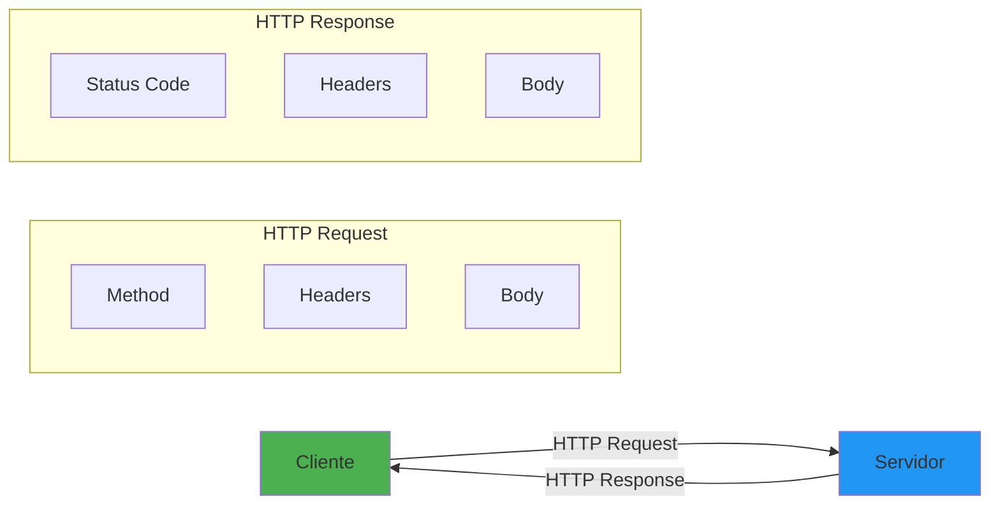

- [13. HTTP, REST y Clientes HTTP en .NET](#13-http-rest-y-clientes-http-en-net)
  - [13.1. Fundamentos de HTTP](#131-fundamentos-de-http)
    - [13.1.1. 🧠 Analogía: HTTP como servicio de correos](#1311--analogía-http-como-servicio-de-correos)
  - [13.2. Verbos y códigos HTTP](#132-verbos-y-códigos-http)
  - [13.3. HttpClient en .NET](#133-httpclient-en-net)
  - [13.4. IHttpClientFactory](#134-ihttpclientfactory)
  - [13.5. Refit: Cliente HTTP tipado](#135-refit-cliente-http-tipado)
  - [13.6. JWT y autenticación](#136-jwt-y-autenticación)
  - [13.7. Polly para resiliencia](#137-polly-para-resiliencia)
  - [13.8. Resumen](#138-resumen)

# 13. HTTP, REST y Clientes HTTP en .NET

HTTP es el protocolo fundamental de la comunicación web. Comprender cómo funciona HTTP y cómo consumir APIs REST en .NET es esencial para cualquier desarrollador backend.



### 13.0. Instalación de Librerías HTTP

Para trabajar con clientes HTTP y resiliencia en .NET, necesitas instalar los siguientes paquetes NuGet:

```bash
# Refit - Cliente HTTP tipado
dotnet add package Refit

# Polly - Resiliencia y manejo de fallos
dotnet add package Polly
dotnet add package Polly.Extensions.Http

# JWT Authentication
dotnet add package Microsoft.AspNetCore.Authentication.JwtBearer

# HttpClient extensions
dotnet add package Microsoft.Extensions.Http
```

## 13.1. Fundamentos de HTTP

### 13.1.1. 🧠 Analogía: HTTP como servicio de correos

| Elemento HTTP | Analogía de correos |
|--------------|---------------------|
| **Request** | Carta que envías |
| **Response** | Carta de respuesta |
| **Headers** | Metadatos del sobre (remitente, destinatario, fecha) |
| **Body** | Contenido de la carta |
| **Status Code** | Código de seguimiento del servicio postal |

```csharp
namespace HTTP.Fundamentos
{
    public class HttpComponents
    {
        // Anatomía de una petición HTTP
        public async Task DemoAnatomia()
        {
            using var httpClient = new HttpClient();
            
            // Request
            var request = new HttpRequestMessage(HttpMethod.Get, "https://api.ejemplo.com/users");
            
            // Headers
            request.Headers.Accept.Add(new MediaTypeWithQualityHeaderValue("application/json"));
            request.Headers.Authorization = new AuthenticationHeaderValue("Bearer", "token");
            request.Headers.UserAgent.ParseAdd("MyApp/1.0");
            
            // Body (para POST, PUT, PATCH)
            request.Content = new StringContent(
                JsonSerializer.Serialize(new { Name = "Juan" }),
                Encoding.UTF8,
                "application/json"
            );
            
            // Enviar
            var response = await httpClient.SendAsync(request);
            
            // Response
            var statusCode = response.StatusCode;
            var headers = response.Headers;
            var body = await response.Content.ReadAsStringAsync();
        }

        // Uri y Query Strings
        public void DemoUri()
        {
            var uri = new Uri("https://api.ejemplo.com/users?name=Juan&active=true");
            
            var query = HttpUtility.ParseQueryString(uri.Query);
            var name = query["name"]; // "Juan"
            var active = query["active"]; // "true"
            
            // Construir URI
            var builder = new UriBuilder("https://api.ejemplo.com/users")
            {
                Query = "page=1&size=10"
            };
        }
    }
}
```

## 13.2. Verbos y códigos HTTP

```csharp
namespace HTTP.Verbos
{
    public class HttpVerbsExamples
    {
        // Verbos HTTP y su uso
        public async Task DemoVerbos(HttpClient client)
        {
            // GET - Obtener recurso
            var getResponse = await client.GetAsync("/users/1");
            var user = await getResponse.Content.ReadFromJsonAsync<User>();

            // POST - Crear recurso
            var newUser = new { Name = "Ana", Email = "ana@email.com" };
            var postResponse = await client.PostAsJsonAsync("/users", newUser);
            var createdUser = await postResponse.Content.ReadFromJsonAsync<User>();
            
            // Con headers de Location
            var location = postResponse.Headers.Location;

            // PUT - Reemplazar completamente
            var updateUser = new { Name = "Ana Updated", Email = "ana@new.com" };
            await client.PutAsJsonAsync("/users/1", updateUser);

            // PATCH - Actualización parcial
            var patchContent = new StringContent(
                "{\"email\":\"ana@new.com\"}",
                Encoding.UTF8,
                "application/json"
            );
            await client.PatchAsync("/users/1", patchContent);

            // DELETE - Eliminar recurso
            await client.DeleteAsync("/users/1");

            // HEAD - Solo headers
            var headResponse = await client.SendAsync(
                new HttpRequestMessage(HttpMethod.Head, "/users/1"));
            
            // OPTIONS - Ver métodos disponibles
            var optionsResponse = await client.SendAsync(
                new HttpRequestMessage(HttpMethod.Options, "/users"));
        }

        // Códigos de estado
        public void DemoStatusCodes(HttpResponseMessage response)
        {
            // 2xx Éxito
            if (response.StatusCode == HttpStatusCode.OK) { }
            if (response.StatusCode == HttpStatusCode.Created) { }
            if (response.StatusCode == HttpStatusCode.NoContent) { }

            // 3xx Redirección
            if (response.StatusCode == HttpStatusCode.Redirect) { }
            if (response.StatusCode == HttpStatusCode.NotModified) { }

            // 4xx Error del cliente
            if (response.StatusCode == HttpStatusCode.BadRequest) { }
            if (response.StatusCode == HttpStatusCode.Unauthorized) { }
            if (response.StatusCode == HttpStatusCode.Forbidden) { }
            if (response.StatusCode == HttpStatusCode.NotFound) { }
            if (response.StatusCode == HttpStatusCode.Conflict) { }
            if (response.StatusCode == HttpStatusCode.TooManyRequests) { }

            // 5xx Error del servidor
            if (response.StatusCode == HttpStatusCode.InternalServerError) { }
            if (response.StatusCode == HttpStatusCode.ServiceUnavailable) { }

            // Verificación rápida
            if (response.IsSuccessStatusCode) { /* 2xx-3xx */ }
            else { /* 4xx-5xx */ }
        }
    }

    public record User(int Id, string Name, string Email);
}
```

## 13.3. HttpClient en .NET

```csharp
namespace HTTP.HttpClient
{
    public class HttpClientExamples
    {
        // Crear HttpClient
        public async Task DemoHttpClient()
        {
            using var httpClient = new HttpClient();
            
            // Configuración
            httpClient.BaseAddress = new Uri("https://api.ejemplo.com/");
            httpClient.Timeout = TimeSpan.FromSeconds(30);
            httpClient.DefaultRequestHeaders.Accept.Clear();
            httpClient.DefaultRequestHeaders.Accept.Add(
                new MediaTypeWithQualityHeaderValue("application/json"));
            httpClient.DefaultRequestHeaders.UserAgent.ParseAdd("MyApp/1.0");
            
            // GET simple
            var response = await httpClient.GetAsync("users");
            response.EnsureSuccessStatusCode(); // Lanza si no es 2xx
            
            var content = await response.Content.ReadAsStringAsync();
            var users = JsonSerializer.Deserialize<List<User>>(content);

            // GET con query string
            var query = new Dictionary<string, string>
            {
                ["page"] = "1",
                ["size"] = "10",
                ["sort"] = "name"
            };
            var queryString = new FormUrlEncodedContent(query);
            var url = $"users?{await queryString.ReadAsStringAsync()}";
            
            // POST con JSON
            var newUser = new { Name = "Juan", Email = "juan@email.com" };
            var jsonContent = new StringContent(
                JsonSerializer.Serialize(newUser),
                Encoding.UTF8,
                "application/json"
            );
            var postResponse = await httpClient.PostAsync("users", jsonContent);
            
            // Leer headers de respuesta
            var location = postResponse.Headers.Location;
            var pagination = postResponse.Headers.GetValues("X-Pagination");
        }

        // Enviar requests personalizados
        public async Task DemoCustomRequest()
        {
            using var httpClient = new HttpClient();
            
            var request = new HttpRequestMessage(HttpMethod.Post, "users");
            request.Headers.Add("X-Custom-Header", "value");
            request.Content = new StringContent(
                "{\"name\":\"Juan\"}",
                Encoding.UTF8,
                "application/json"
            );
            
            var response = await httpClient.SendAsync(request);
        }

        // Manejo de errores
        public async Task DemoErrorHandling()
        {
            using var httpClient = new HttpClient();
            
            try
            {
                var response = await httpClient.GetAsync("users/999");
                
                if (response.StatusCode == HttpStatusCode.NotFound)
                {
                    Console.WriteLine("Usuario no encontrado");
                }
                else if (response.StatusCode == HttpStatusCode.Unauthorized)
                {
                    Console.WriteLine("Token inválido");
                }
                else
                {
                    response.EnsureSuccessStatusCode();
                }
            }
            catch (HttpRequestException ex)
            {
                Console.WriteLine($"Error de red: {ex.Message}");
            }
            catch (TaskCanceledException ex) when (ex.CancellationToken != null)
            {
                Console.WriteLine("Request cancelado");
            }
            catch (TaskCanceledException)
            {
                Console.WriteLine("Timeout");
            }
        }
    }
}
```

## 13.4. IHttpClientFactory

```csharp
namespace HTTP.Factory
{
    public static class HttpClientFactorySetup
    {
        public static void AddHttpClients(this IServiceCollection services)
        {
            // HttpClient básico
            services.AddHttpClient();

            // HttpClient nombrado
            services.AddHttpClient("UserApi", client =>
            {
                client.BaseAddress = new Uri("https://api.users.com/");
                client.DefaultRequestHeaders.Add("Accept", "application/json");
            });

            // HttpClient tipado
            services.AddHttpClient<IUserApi, UserApiService>();

            // Con configuración
            services.AddHttpClient<IProductApi, ProductApiService>(client =>
            {
                client.BaseAddress = new Uri("https://api.products.com/");
            })
            .ConfigurePrimaryHttpMessageHandler(() => new HttpClientHandler
            {
                AutomaticDecompression = DecompressionMethods.GZip | DecompressionMethods.Deflate
            })
            .AddPolicyHandler(GetRetryPolicy())
            .AddPolicyHandler(GetCircuitBreakerPolicy());
        }

        // Políticas de retry
        private static IAsyncPolicy<HttpResponseMessage> GetRetryPolicy()
        {
            return HttpPolicyExtensions
                .HandleTransientHttpError()
                .OrResult(msg => msg.StatusCode == HttpStatusCode.NotFound)
                .WaitAndRetryAsync(3, retryAttempt => 
                    TimeSpan.FromSeconds(Math.Pow(2, retryAttempt)));
        }

        // Circuit Breaker
        private static IAsyncPolicy<HttpResponseMessage> GetCircuitBreakerPolicy()
        {
            return HttpPolicyExtensions
                .HandleTransientHttpError()
                .CircuitBreakerAsync(5, TimeSpan.FromSeconds(30));
        }
    }

    public class UserApiService(HttpClient client)
    {
        private readonly HttpClient _client = client;

        public async Task<List<User>> GetUsersAsync()
        {
            return await _client.GetFromJsonAsync<List<User>>("/users");
        }

        public async Task<User?> GetUserAsync(int id)
        {
            var response = await _client.GetAsync($"/users/{id}");

            if (response.StatusCode == HttpStatusCode.NotFound)
                return null;

            response.EnsureSuccessStatusCode();
            return await response.Content.ReadFromJsonAsync<User>();
        }

        public async Task<User> CreateUserAsync(User user)
        {
            var response = await _client.PostAsJsonAsync("/users", user);
            response.EnsureSuccessStatusCode();
            return await response.Content.ReadFromJsonAsync<User>();
        }
    }

    public record User(int Id, string Name, string Email);
}
```

## 13.5. Refit: Cliente HTTP tipado

Una alternativa a HttpClient es usar Refit, que permite definir interfaces para APIs REST y genera automáticamente el cliente HTTP. Es similar a Retrofit y simplifica mucho el código.

Para usar Refit, primero instala el paquete NuGet:
```bash
dotnet add package Refit
```

Pasos básicos para usar Refit:
1. Define una interfaz con métodos anotados con atributos HTTP.
2. Registra el cliente Refit
3. Inyecta y usa el cliente en tu código.


```csharp
namespace HTTP.Refit
{
    public class RefitExamples
    {
        public static void ConfigureRefit(IServiceCollection services)
        {
            // Instalar: dotnet add package Refit

            services.AddRefitClient<IGitHubApi>()
                .ConfigureHttpClient(c =>
                {
                    c.BaseAddress = new Uri("https://api.github.com/");
                    c.DefaultRequestHeaders.Add("Accept", "application/vnd.github.v3+json");
                    c.DefaultRequestHeaders.UserAgent.ParseAdd("MyApp");
                })
                .AddPolicyHandler(GetRetryPolicy());
        }

        // Definir interfaz de API
        public interface IGitHubApi
        {
            [Get("/users/{username}")]
            Task<GitHubUser> GetUserAsync(string username);

            [Get("/users")]
            Task<List<GitHubUser>> GetUsersAsync();

            [Post("/users")]
            Task<GitHubUser> CreateUserAsync([Body] GitHubUser user);

            [Put("/users/{username}")]
            Task<GitHubUser> UpdateUserAsync(string username, [Body] GitHubUser user);

            [Delete("/users/{username}")]
            Task DeleteUserAsync(string username);

            [Get("/users/{username}/repos")]
            Task<List<GitHubRepo>> GetRepositoriesAsync(string username);

            [Get("/search/repositories")]
            Task<SearchResult> SearchRepositoriesAsync(
                [Query] string q, 
                [Query] string sort = "stars",
                [Query] int order = 1);
        }

        // Uso del cliente
        public async Task DemoUsage(IGitHubApi api)
        {
            var user = await api.GetUserAsync("octocat");
            Console.WriteLine($"Usuario: {user.Login}");

            var repos = await api.GetRepositoriesAsync("octocat");
            foreach (var repo in repos.Take(5))
            {
                Console.WriteLine($"Repo: {repo.Name}");
            }

            var searchResult = await api.SearchRepositoriesAsync("C#", sort: "stars");
            Console.WriteLine($"Encontrados: {searchResult.TotalCount}");
        }

        // Headers personalizados
        public interface IAuthApi
        {
            [Get("/secure")]
            [Headers("Authorization: Bearer")]
            Task<SecureData> GetSecureDataAsync();
        }

        // Form content
        public interface IFormApi
        {
            [Post("/submit")]
            Task SubmitFormAsync([Body(BodySerializationMethod.UrlEncoded)] 
                Dictionary<string, string> formData);
        }
    }

    public class GitHubUser(string Login, string Name, string Email, int PublicRepos)
    {
        public string Login { get; set; } = Login;
        public string Name { get; set; } = Name;
        public string Email { get; set; } = Email;
        public int PublicRepos { get; set; } = PublicRepos;
    }

    public class GitHubRepo(string Name, string Description, int StargazersCount)
    {
        public string Name { get; set; } = Name;
        public string Description { get; set; } = Description;
        public int StargazersCount { get; set; } = StargazersCount;
    }

    public class SearchResult(int TotalCount, List<GitHubRepo> Items)
    {
        public int TotalCount { get; set; } = TotalCount;
        public List<GitHubRepo> Items { get; set; } = Items;
    }

    public record SecureData(string Data);
}
```

## 13.6. JWT y autenticación
La autenticación basada en tokens JWT (JSON Web Tokens) es común en APIs REST. Un token JWT contiene claims que representan la identidad y permisos del usuario.

Para usar JWT en .NET:
1. Configura la autenticación JWT en `Startup.cs` o `Program.cs`.
2. Genera tokens JWT al autenticar usuarios.
3. Usa el token en el header `Authorization: Bearer <token>`.

```csharp
namespace HTTP.Authentication
{
    public class JwtExamples
    {
        public static void ConfigureJwt(IServiceCollection services)
        {
            services.AddAuthentication(JwtBearerDefaults.AuthenticationScheme)
                .AddJwtBearer(options =>
                {
                    options.TokenValidationParameters = new TokenValidationParameters
                    {
                        ValidateIssuer = true,
                        ValidateAudience = true,
                        ValidateLifetime = true,
                        ValidateIssuerSigningKey = true,
                        ValidIssuer = "mi-api",
                        ValidAudience = "mi-app",
                        IssuerSigningKey = new SymmetricSecurityKey(
                            Encoding.UTF8.GetBytes("SECRET_KEY_LARGA_Y_SEGURA"))
                    };
                });

            services.AddAuthorization();
        }

        // Generar token JWT
        public string GenerateToken(string username, string role)
        {
            var tokenHandler = new JwtTokenHandler();
            var key = Encoding.UTF8.GetBytes("SECRET_KEY_LARGA_Y_SEGURA");

            var tokenDescriptor = new SecurityTokenDescriptor
            {
                Subject = new ClaimsIdentity(new[]
                {
                    new Claim(ClaimTypes.Name, username),
                    new Claim(ClaimTypes.Role, role),
                    new Claim("custom", "value")
                }),
                Expires = DateTime.UtcNow.AddHours(1),
                SigningCredentials = new SigningCredentials(
                    new SymmetricSecurityKey(key),
                    SecurityAlgorithms.HmacSha256Signature)
            };

            var token = tokenHandler.CreateToken(tokenDescriptor);
            return tokenHandler.WriteToken(token);
        }

        // Client con JWT
        public async Task DemoAuthenticatedClient(HttpClient client)
        {
            var token = GenerateToken("user", "admin");
            client.DefaultRequestHeaders.Authorization = 
                new AuthenticationHeaderValue("Bearer", token);

            var response = await client.GetAsync("api/protected");
            // Authorization: Bearer eyJhbG...
        }

        // JWT en HttpClientFactory
        public static void ConfigureJwtClient(IServiceCollection services)
        {
            services.AddHttpClient("AuthenticatedApi", client =>
            {
                client.BaseAddress = new Uri("https://api.secure.com/");
            })
            .AddHttpMessageHandler<JwtTokenHandler>();
        }

        public class JwtTokenHandler : DelegatingHandler
        {
            private readonly string _token;

            public JwtTokenHandler()
            {
                _token = GenerateToken("service", "api");
            }

            protected override Task<HttpResponseMessage> SendAsync(
                HttpRequestMessage request, 
                CancellationToken cancellationToken)
            {
                request.Headers.Authorization = 
                    new AuthenticationHeaderValue("Bearer", _token);
                return base.SendAsync(request, cancellationToken);
            }
        }
    }
}
```

## 13.7. Polly para resiliencia

```csharp
namespace HTTP.Polly
{
    public static class PollySetup
    {
        public static void AddPollyPolicies(IServiceCollection services)
        {
            // Retry policy
            var retryPolicy = Policy
                .HandleResult<HttpResponseMessage>(r => 
                    r.StatusCode == HttpStatusCode.InternalServerError ||
                    r.StatusCode == HttpStatusCode.ServiceUnavailable)
                .WaitAndRetryAsync(3, retryAttempt => 
                    TimeSpan.FromSeconds(Math.Pow(2, retryAttempt)));

            // Circuit breaker
            var circuitBreakerPolicy = Policy
                .HandleResult<HttpResponseMessage>(r => 
                    r.StatusCode == HttpStatusCode.ServiceUnavailable)
                .CircuitBreakerAsync(
                    handledEventsAllowedBeforeBreaking: 5,
                    durationOfBreak: TimeSpan.FromSeconds(30));

            // Timeout
            var timeoutPolicy = Policy
                .TimeoutAsync<HttpResponseMessage>(TimeSpan.FromSeconds(10));

            // Bulkhead
            var bulkheadPolicy = Policy
                .BulkheadAsync<HttpResponseMessage>(
                    maxParallelization: 10,
                    maxQueuedActions: 100);

            // Combinar políticas
            var combinedPolicy = Policy
                .WrapAsync(retryPolicy, circuitBreakerPolicy, timeoutPolicy);

            services.AddHttpClient("ResilientApi", client =>
            {
                client.BaseAddress = new Uri("https://api.resilient.com/");
            })
            .AddPolicyHandler(combinedPolicy)
            .AddPolicyHandler(retryPolicy) // Retry transitorio
            .AddPolicyHandler(circuitBreakerPolicy); // Circuit breaker
        }

        // Uso de Polly directamente
        public async Task DemoPollyDirect()
        {
            var policy = Policy
                .Handle<HttpRequestException>()
                .OrResult<HttpResponseMessage>(r => 
                    !r.IsSuccessStatusCode)
                .WaitAndRetryAsync(3, retryAttempt => 
                    TimeSpan.FromSeconds(Math.Pow(2, retryAttempt)));

            using var httpClient = new HttpClient();
            
            var result = await policy.ExecuteAsync(async () =>
            {
                var response = await httpClient.GetAsync("https://api.com/data");
                response.EnsureSuccessStatusCode();
                return response;
            });

            var content = await result.Content.ReadAsStringAsync();
        }
    }
}
```

## 13.8. Resumen

Ten en cuenta estos puntos clave:

**HTTP Fundamentals**
- Request/Response con headers, body y status code
- Verbos: GET, POST, PUT, PATCH, DELETE
- Códigos 2xx (éxito), 4xx (cliente), 5xx (servidor)

**HttpClient**
- Usar IHttpClientFactory para mejor gestión
- Evitar crear HttpClient directamente en loop
- Configurar timeout, headers y políticas

**Refit**
- Clientes HTTP tipados basados en interfaces
- Anotaciones para definir endpoints
- Integración con DI

**Autenticación JWT**
- Bearer tokens en Authorization header
- Claims para información del usuario
- Validar issuer, audience y signing key

**Polly**
- Retry con backoff exponencial
- Circuit breaker para evitar cascading failures
- Timeout y bulkhead para control de recursos