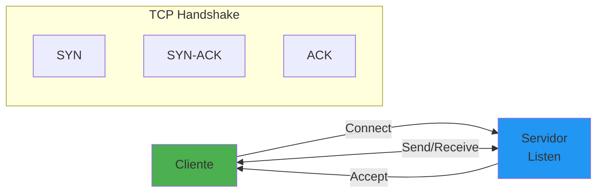
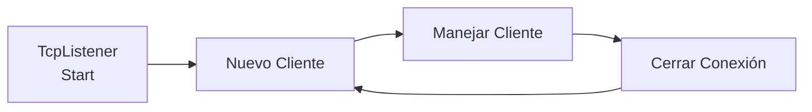
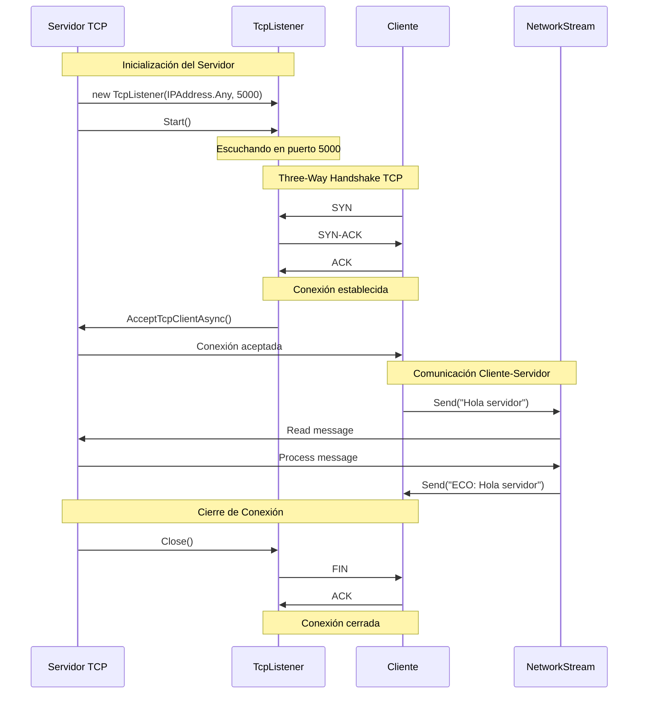
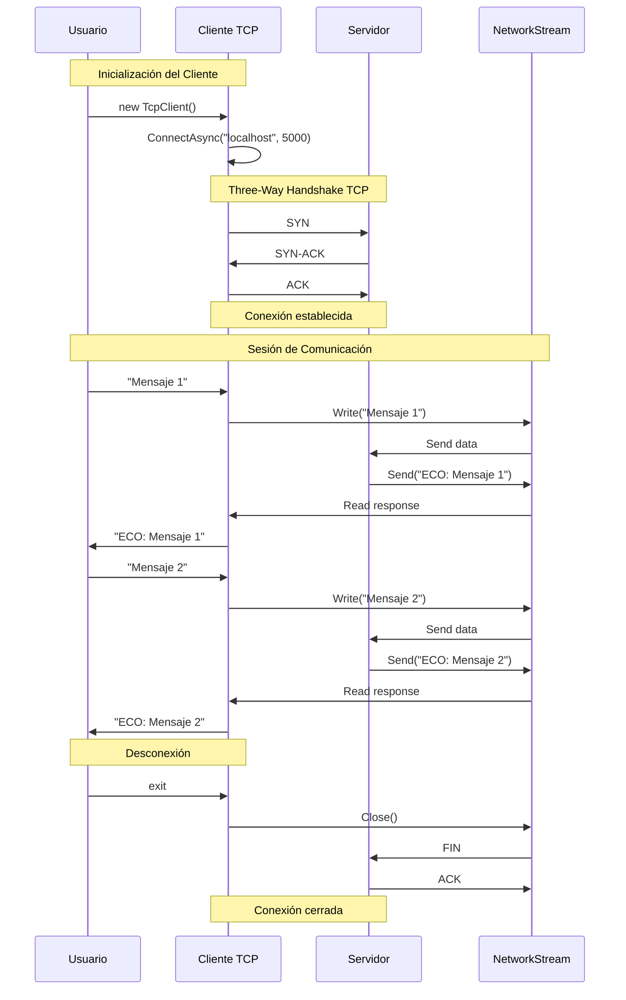

- [14. Programación Distribuida con Sockets en .NET](#14-programación-distribuida-con-sockets-en-net)
  - [14.1. Fundamentos de sockets](#141-fundamentos-de-sockets)
    - [14.1.1. 🧠 Analogía: Sockets como teléfono](#1411--analogía-sockets-como-teléfono)
  - [14.2. Servidor TCP](#142-servidor-tcp)
  - [14.3. Cliente TCP](#143-cliente-tcp)
  - [14.4. Protocolos estructurados](#144-protocolos-estructurados)
  - [14.5. UDP sockets](#145-udp-sockets)
  - [14.6. WebSockets](#146-websockets)
  - [14.7. Resumen](#147-resumen)

# 14. Programación Distribuida con Sockets en .NET

Los sockets permiten comunicación directa entre procesos en red. Son la base de toda comunicación de red, desde HTTP hasta protocolos personalizados.



## 14.1. Fundamentos de sockets

### 14.1.1. 🧠 Analogía: Sockets como teléfono

| Socket | Teléfono |
|--------|----------|
| **Socket** | Teléfono (punto de conexión) |
| **IP Address** | Número de teléfono del edificio |
| **Puerto** | Extensión específica |
| **Servidor** | Persona esperando llamadas |
| **Cliente** | Persona que marca |

```csharp
namespace Sockets.Fundamentos
{
    public class SocketFundamentals
    {
        // Componentes básicos de un socket
        public void DemoComponents()
        {
            // TCP: Orientado a conexión, fiable
            var tcpClient = new TcpClient();
            
            // UDP: Sin conexión, rápido
            var udpClient = new UdpClient();
            
            // Socket de bajo nivel
            var socket = new Socket(
                AddressFamily.InterNetwork,  // IPv4
                SocketType.Stream,            // TCP
                ProtocolType.Tcp
            );
            
            // Endpoint - combinación de IP y puerto
            var endpoint = new IPEndPoint(IPAddress.Parse("192.168.1.1"), 8080);
        }

        // Direcciones IP
        public void DemoIPAddresses()
        {
            // Obtener IP local
            var hostName = Dns.GetHostName();
            var ipAddresses = Dns.GetHostAddresses(hostName);
            
            // IPv4
            var ipv4 = ipAddresses.FirstOrDefault(ip => 
                ip.AddressFamily == AddressFamily.InterNetwork);
            
            // Parsear IP
            var ip = IPAddress.Parse("192.168.1.1");
            
            // IPAny - cualquier IP
            var any = IPAddress.Any; // 0.0.0.0
            var loopback = IPAddress.Loopback; // 127.0.0.1
            var broadcast = IPAddress.Broadcast; // 255.255.255.255
        }

        // Puertos comunes
        public void DemoPorts()
        {
            // Puertos well-known (0-1023): HTTP 80, HTTPS 443, SSH 22
            // Puertos registrados (1024-49151): SQL Server 1433, MySQL 3306
            // Puertos dinámicos (49152-65535): Asignados por el sistema
        }
    }
}
```

## 14.2. Servidor TCP
Un servidor TCP escucha conexiones entrantes y maneja la comunicación con los clientes.
Generalmente sigue estos pasos:
1. Crear un `TcpListener` en una IP y puerto específicos.
2. Llamar a `Start()` para comenzar a escuchar.
3. Aceptar conexiones con `AcceptTcpClientAsync()`.
4. Manejar la comunicación (leer/escribir datos).
5. Cerrar la conexión cuando termine.
6. Repetir para nuevos clientes.
7. Implementar manejo de errores y limpieza adecuada.






```csharp
namespace Sockets.TCP
{
    public class TcpServerExamples
    {
        private const int Port = 5000;

        // Servidor TCP básico
        public async Task ServidorBasico()
        {
            var servidor = new TcpListener(IPAddress.Any, Port);
            servidor.Start();
            Console.WriteLine($"Servidor iniciado en puerto {Port}");

            // Aceptar clientes en bucle
            while (true)
            {
                var cliente = await servidor.AcceptTcpClientAsync();
                Console.WriteLine($"Cliente conectado: {cliente.Client.RemoteEndPoint}");
                
                // Manejar en hilo separado, no bloquear el accept
                _ = Task.Run(() => ManejarCliente(cliente));
            }
        }

        // Manejador de cliente
        private async Task ManejarCliente(TcpClient cliente)
        {
            using var stream = cliente.GetStream();
            using var reader = new StreamReader(stream);
            using var writer = new StreamWriter(stream) { AutoFlush = true };

            try
            {
                string? mensaje;
                while ((mensaje = await reader.ReadLineAsync()) != null)
                {
                    Console.WriteLine($"Recibido: {mensaje}");
                    
                    // Eco
                    await writer.WriteLineAsync($"ECO: {mensaje}");
                }
            }
            catch (Exception ex)
            {
                Console.WriteLine($"Error con cliente: {ex.Message}");
            }
            finally
            {
                cliente.Close();
            }
        }

        // Servidor con protocolo estructurado
        public async Task ServidorConProtocolo()
        {
            var servidor = new TcpListener(IPAddress.Any, Port);
            servidor.Start();

            while (true)
            {
                var cliente = await servidor.AcceptTcpClientAsync();
                _ = Task.Run(async () =>
                {
                    using var stream = cliente.GetStream();
                    
                    while (true)
                    {
                        var mensaje = await RecibirMensajeAsync(stream);
                        if (mensaje == null) break;
                        
                        Console.WriteLine($"Recibido: {mensaje}");
                        
                        // Procesar y responder
                        var respuesta = $"SERVER: {mensaje}";
                        await EnviarMensajeAsync(stream, respuesta);
                    }
                });
            }
        }

        // Enviar mensaje con header de longitud
        private async Task EnviarMensajeAsync(NetworkStream stream, string mensaje)
        {
            var bytes = Encoding.UTF8.GetBytes(mensaje);
            var longitud = BitConverter.GetBytes(bytes.Length);
            
            await stream.WriteAsync(longitud, 0, 4);
            await stream.WriteAsync(bytes, 0, bytes.Length);
        }

        private async Task<string?> RecibirMensajeAsync(NetworkStream stream)
        {
            var bufferLongitud = new byte[4];
            var leido = await stream.ReadAsync(bufferLongitud, 0, 4);
            
            if (leido == 0) return null;
            
            var longitud = BitConverter.ToInt32(bufferLongitud);
            var buffer = new byte[longitud];
            var totalLeido = 0;
            
            while (totalLeido < longitud)
            {
                leido = await stream.ReadAsync(buffer, totalLeido, longitud - totalLeido);
                if (leido == 0) return null;
                totalLeido += leido;
            }
            
            return Encoding.UTF8.GetString(buffer);
        }

        // Servidor asíncrono con SemaphoreSlim
        private readonly SemaphoreSlim _conexiones = new(100);

        public async Task ServidorConLimitacion()
        {
            var servidor = new TcpListener(IPAddress.Any, Port);
            servidor.Start();

            while (true)
            {
                await _conexiones.WaitAsync();
                
                var cliente = await servidor.AcceptTcpClientAsync();
                _ = Task.Run(async () =>
                {
                    try
                    {
                        await ManejarCliente(cliente);
                    }
                    finally
                    {
                        _conexiones.Release();
                    }
                });
            }
        }

        // Servidor con autenticación
        public async Task ServidorConAuth()
        {
            var servidor = new TcpListener(IPAddress.Any, Port);
            servidor.Start();

            while (true)
            {
                var cliente = await servidor.AcceptTcpClientAsync();
                _ = Task.Run(async () =>
                {
                    var stream = cliente.GetStream();
                    var reader = new StreamReader(stream);
                    var writer = new StreamWriter(stream) { AutoFlush = true };

                    // Autenticar
                    await writer.WriteLineAsync("AUTH_REQUIRED");
                    var credentials = await reader.ReadLineAsync();
                    
                    if (!ValidateCredentials(credentials))
                    {
                        await writer.WriteLineAsync("AUTH_FAILED");
                        return;
                    }
                    
                    await writer.WriteLineAsync("AUTH_OK");
                    
                    // Mantener sesión
                    while (await reader.ReadLineAsync() != null)
                    {
                        // Procesar comandos
                    }
                });
            }
        }

        private bool ValidateCredentials(string credentials)
        {
            // credentials = "username:password"
            return !string.IsNullOrEmpty(credentials);
        }
    }
}
```

## 14.3. Cliente TCP




```csharp
namespace Sockets.TCPClient
{
    public class TcpClientExamples
    {
        // Cliente básico
        public async Task ClienteBasico()
        {
            using var cliente = new TcpClient();
            await cliente.ConnectAsync("localhost", 5000);

            var stream = cliente.GetStream();
            var reader = new StreamReader(stream);
            var writer = new StreamWriter(stream) { AutoFlush = true };

            // Enviar mensaje
            await writer.WriteLineAsync("Hola servidor!");
            
            // Recibir respuesta
            var respuesta = await reader.ReadLineAsync();
            Console.WriteLine($"Servidor: {respuesta}");
        }

        // Cliente con protocolo estructurado
        public async Task ClienteConProtocolo()
        {
            using var cliente = new TcpClient();
            await cliente.ConnectAsync("localhost", 5000);

            var stream = cliente.GetStream();
            var encoder = new MessageEncoder(stream);

            // Enviar mensaje
            await encoder.SendMessageAsync("Comando:STATUS");
            
            // Recibir respuesta
            var respuesta = await encoder.ReceiveMessageAsync();
            Console.WriteLine($"Respuesta: {respuesta}");
        }

        // Cliente con reconexión automática
        public async Task ClienteConReconnection()
        {
            const int maxIntentos = 3;
            var intento = 0;

            while (intento < maxIntentos)
            {
                try
                {
                    using var cliente = new TcpClient();
                    await cliente.ConnectAsync("localhost", 5000);
                    
                    Console.WriteLine("Conectado!");
                    
                    await ManejarSesion(cliente);
                    break;
                }
                catch (SocketException ex) when (ex.SocketErrorCode == 
                    SocketError.ConnectionRefused)
                {
                    intento++;
                    Console.WriteLine($"Intento {intento} fallido. Reintentando...");
                    await Task.Delay(TimeSpan.FromSeconds(Math.Pow(2, intento)));
                }
            }
        }

        private async Task ManejarSesion(TcpClient cliente)
        {
            var stream = cliente.GetStream();
            var reader = new StreamReader(stream);
            var writer = new StreamWriter(stream) { AutoFlush = true };

            while (true)
            {
                var linea = Console.ReadLine();
                if (linea == "exit") break;
                
                await writer.WriteLineAsync(linea);
                var respuesta = await reader.ReadLineAsync();
                Console.WriteLine($"> {respuesta}");
            }
        }

        // Cliente con timeout
        public async Task ClienteConTimeout()
        {
            using var cliente = new TcpClient();
            cliente.ReceiveTimeout = 5000;
            cliente.SendTimeout = 5000;

            await cliente.ConnectAsync("localhost", 5000);
            
            var stream = cliente.GetStream();
            var cts = new CancellationTokenSource(5000);
            
            try
            {
                var reader = new StreamReader(stream);
                var linea = await reader.ReadLineAsync(cts.Token);
            }
            catch (OperationCanceledException)
            {
                Console.WriteLine("Timeout esperando respuesta");
            }
        }
    }

    // Codificador de mensajes
    public class MessageEncoder(NetworkStream stream)
    {
        private readonly NetworkStream _stream = stream;

        public async Task SendMessageAsync(string message)
        {
            var bytes = Encoding.UTF8.GetBytes(message);
            var longitud = BitConverter.GetBytes(bytes.Length);
            
            await _stream.WriteAsync(longitud, 0, 4);
            await _stream.WriteAsync(bytes, 0, bytes.Length);
        }

        public async Task<string> ReceiveMessageAsync()
        {
            var bufferLongitud = new byte[4];
            await ReadFullyAsync(_stream, bufferLongitud);
            
            var longitud = BitConverter.ToInt32(bufferLongitud);
            var buffer = new byte[longitud];
            await ReadFullyAsync(_stream, buffer);
            
            return Encoding.UTF8.GetString(buffer);
        }

        private async Task ReadFullyAsync(NetworkStream stream, byte[] buffer)
        {
            int totalLeido = 0;
            while (totalLeido < buffer.Length)
            {
                var leido = await stream.ReadAsync(buffer, totalLeido, buffer.Length - totalLeido);
                if (leido == 0) throw new EndOfStreamException();
                totalLeido += leido;
            }
        }
    }
}
```

## 14.4. Protocolos estructurados

```csharp
namespace Sockets.Protocols
{
    public class StructuredProtocols
    {
        // Protocolo con delimitadores
        public class DelimiterProtocol(NetworkStream stream)
        {
            private readonly NetworkStream _stream = stream;
            private readonly string _delimiter = "\n";

            public async Task<string> ReceiveUntilDelimiterAsync()
            {
                var buffer = new StringBuilder();
                var byteBuffer = new byte[1024];
                var delimitadorBytes = Encoding.UTF8.GetBytes(_delimiter);

                while (true)
                {
                    var leido = await _stream.ReadAsync(byteBuffer, 0, byteBuffer.Length);
                    if (leido == 0) return null;

                    var data = Encoding.UTF8.GetString(byteBuffer, 0, leido);
                    buffer.Append(data);

                    if (buffer.ToString().Contains(_delimiter))
                    {
                        var result = buffer.ToString();
                        var index = result.IndexOf(_delimiter);
                        return result.Substring(0, index);
                    }
                }
            }
        }

        // Protocolo binario con length prefix
        public class BinaryProtocol
        {
            public record Message(string Type, byte[] Payload);

            public async Task SendMessageAsync(NetworkStream stream, Message message)
            {
                var typeBytes = Encoding.UTF8.GetBytes(message.Type);
                var typeLength = (byte)typeBytes.Length;
                
                var lengthBytes = BitConverter.GetBytes(message.Payload.Length);
                
                await stream.WriteAsync(new[]
                {
                    typeLength
                }, 0, 1);
                
                await stream.WriteAsync(typeBytes, 0, typeLength);
                await stream.WriteAsync(lengthBytes, 0, 4);
                await stream.WriteAsync(message.Payload, 0, message.Payload.Length);
            }

            public async Task<Message?> ReceiveMessageAsync(NetworkStream stream)
            {
                var typeLengthBuffer = new byte[1];
                var read = await stream.ReadAsync(typeLengthBuffer, 0, 1);
                if (read == 0) return null;

                var typeLength = typeLengthBuffer[0];
                var typeBuffer = new byte[typeLength];
                await stream.ReadAsync(typeBuffer, 0, typeLength);
                var type = Encoding.UTF8.GetString(typeBuffer);

                var lengthBuffer = new byte[4];
                await stream.ReadAsync(lengthBuffer, 0, 4);
                var payloadLength = BitConverter.ToInt32(lengthBuffer);
                
                var payload = new byte[payloadLength];
                await stream.ReadAsync(payload, 0, payloadLength);
                
                return new Message(type, payload);
            }
        }

        // Protocolo JSON sobre TCP
        public class JsonProtocol(NetworkStream stream)
        {
            private readonly NetworkStream _stream = stream;
            private readonly JsonSerializerOptions _options = new()
            {
                PropertyNamingPolicy = JsonNamingPolicy.CamelCase
            };

            public async Task SendJsonAsync<T>(T obj)
            {
                var json = JsonSerializer.Serialize(obj, _options);
                var bytes = Encoding.UTF8.GetBytes(json);
                var length = BitConverter.GetBytes(bytes.Length);
                
                await _stream.WriteAsync(length, 0, 4);
                await _stream.WriteAsync(bytes, 0, bytes.Length);
            }

            public async Task<T?> ReceiveJsonAsync<T>()
            {
                var lengthBuffer = new byte[4];
                await ReadFullyAsync(_stream, lengthBuffer);
                var length = BitConverter.ToInt32(lengthBuffer);
                
                var jsonBuffer = new byte[length];
                await ReadFullyAsync(_stream, jsonBuffer);
                
                var json = Encoding.UTF8.GetString(jsonBuffer);
                return JsonSerializer.Deserialize<T>(json, _options);
            }

            private async Task ReadFullyAsync(NetworkStream stream, byte[] buffer)
            {
                int totalLeido = 0;
                while (totalLeido < buffer.Length)
                {
                    var leido = await stream.ReadAsync(buffer, totalLeido, buffer.Length - totalLeido);
                    if (leido == 0) throw new EndOfStreamException();
                    totalLeido += leido;
                }
            }
        }
    }
}
```

## 14.5. UDP sockets
Los sockets UDP permiten comunicación sin conexión, ideal para aplicaciones que requieren baja latencia y pueden tolerar pérdida de datos.

```csharp
namespace Sockets.UDP
{
    public class UdpExamples
    {
        // Servidor UDP
        public async Task ServidorUDP()
        {
            var servidor = new UdpClient(5001);
            Console.WriteLine("Servidor UDP iniciado en puerto 5001");

            while (true)
            {
                var remote = new IPEndPoint(IPAddress.Any, 0);
                var datos = await servidor.ReceiveAsync(ref remote);
                
                var mensaje = Encoding.UTF8.GetString(datos.Buffer);
                Console.WriteLine($"De {remote}: {mensaje}");
                
                // Responder
                var respuesta = Encoding.UTF8.GetBytes($"ECO: {mensaje}");
                await servidor.SendAsync(respuesta, respuesta.Length, remote);
            }
        }

        // Cliente UDP
        public async Task ClienteUDP()
        {
            var cliente = new UdpClient();
            var servidorEP = new IPEndPoint(IPAddress.Parse("localhost"), 5001);

            var mensaje = Encoding.UTF8.GetBytes("Hola UDP");
            await cliente.SendAsync(mensaje, mensaje.Length, servidorEP);

            // Recibir respuesta
            var resultado = await cliente.ReceiveAsync();
            var respuesta = Encoding.UTF8.GetString(resultado.Buffer);
            Console.WriteLine($"Respuesta: {respuesta}");
        }

        // UDP con broadcast
        public async Task BroadcastExample()
        {
            var cliente = new UdpClient();
            cliente.EnableBroadcast = true;

            var broadcastEP = new IPEndPoint(IPAddress.Broadcast, 5001);
            var mensaje = Encoding.UTF8.GetBytes("DISCOVER");
            
            await cliente.SendAsync(mensaje, mensaje.Length, broadcastEP);

            // Escuchar respuestas
            var respuestaEP = new IPEndPoint(IPAddress.Any, 0);
            var datos = await cliente.ReceiveAsync(ref respuestaEP);
            Console.WriteLine($"De {respuestaEP}: {Encoding.UTF8.GetString(datos.Buffer)}");
        }

        // UDP multicast
        public async Task MulticastExample()
        {
            const string multicastGroup = "239.0.0.1";
            const int port = 5001;

            var cliente = new UdpClient();
            cliente.JoinMulticastGroup(IPAddress.Parse(multicastGroup));

            var multicastEP = new IPEndPoint(IPAddress.Parse(multicastGroup), port);

            // Enviar al grupo
            var mensaje = Encoding.UTF8.GetBytes("Mensaje multicast");
            await cliente.SendAsync(mensaje, mensaje.Length, multicastEP);

            // Recibir del grupo
            var receivedEP = new IPEndPoint(IPAddress.Any, port);
            var datos = await cliente.ReceiveAsync(ref receivedEP);
            Console.WriteLine($"Multicast: {Encoding.UTF8.GetString(datos.Buffer)}");
        }

        // Cliente UDP con timeout
        public async Task UdpConTimeout()
        {
            var cliente = new UdpClient();
            cliente.Client.ReceiveTimeout = 5000;
            cliente.Client.SendTimeout = 5000;

            var servidorEP = new IPEndPoint(IPAddress.Parse("localhost"), 5001);
            
            var mensaje = Encoding.UTF8.GetBytes("Ping");
            await cliente.SendAsync(mensaje, mensaje.Length, servidorEP);

            try
            {
                var receivedEP = new IPEndPoint(IPAddress.Any, 0);
                var datos = await cliente.ReceiveAsync(ref receivedEP);
                Console.WriteLine($"Pong: {Encoding.UTF8.GetString(datos.Buffer)}");
            }
            catch (SocketException ex) when (ex.SocketErrorCode == 
                SocketError.TimedOut)
            {
                Console.WriteLine("Timeout - sin respuesta");
            }
        }
    }
}
```

## 14.6. WebSockets
Los WebSockets permiten comunicación full-duplex sobre HTTP, ideal para aplicaciones en tiempo real como chats o notificaciones.

```csharp
namespace Sockets.WebSockets
{
    public class WebSocketExamples
    {
        // Servidor WebSocket con ASP.NET Core
        public static void MapWebSocketEndpoint(this WebApplication app)
        {
            app.UseWebSockets(new WebSocketOptions
            {
                KeepAliveInterval = TimeSpan.FromMinutes(2)
            });

            app.Map("/ws", async context =>
            {
                if (context.WebSockets.IsWebSocketRequest)
                {
                    using var ws = await context.WebSockets.AcceptWebSocketAsync();
                    await ManejarWebSocket(ws);
                }
                else
                {
                    context.Response.StatusCode = 400;
                }
            });

            app.Map("/ws/{username}", async (string username, HttpContext context) =>
            {
                if (context.WebSockets.IsWebSocketRequest)
                {
                    using var ws = await context.WebSockets.AcceptWebSocketAsync();
                    await ManejarClienteWebSocket(username, ws);
                }
                else
                {
                    context.Response.StatusCode = 400;
                }
            });
        }

        private static async Task ManejarWebSocket(WebSocket ws)
        {
            var buffer = new byte[1024];

            while (ws.State == WebSocketState.Open)
            {
                var result = await ws.ReceiveAsync(
                    new ArraySegment<byte>(buffer), 
                    CancellationToken.None);

                if (result.MessageType == WebSocketMessageType.Close)
                {
                    await ws.CloseAsync(
                        WebSocketCloseStatus.NormalClosure, 
                        "Cierre", 
                        CancellationToken.None);
                    break;
                }

                if (result.MessageType == WebSocketMessageType.Text)
                {
                    var mensaje = Encoding.UTF8.GetString(buffer, 0, result.Count);
                    Console.WriteLine($"Recibido: {mensaje}");

                    // Eco con procesamiento
                    var respuesta = $"Servidor recibió: {mensaje}";
                    var respuestaBytes = Encoding.UTF8.GetBytes(respuesta);
                    
                    await ws.SendAsync(
                        new ArraySegment<byte>(respuestaBytes),
                        WebSocketMessageType.Text,
                        true,
                        CancellationToken.None);
                }
            }
        }

        private static async Task ManejarClienteWebSocket(string username, WebSocket ws)
        {
            var buffer = new byte[1024];

            // Enviar mensaje de bienvenida
            var bienvenida = Encoding.UTF8.GetBytes($"Bienvenido {username}!");
            await ws.SendAsync(
                new ArraySegment<byte>(bienvenida),
                WebSocketMessageType.Text,
                true,
                CancellationToken.None);

            while (ws.State == WebSocketState.Open)
            {
                var result = await ws.ReceiveAsync(
                    new ArraySegment<byte>(buffer),
                    CancellationToken.None);

                if (result.MessageType == WebSocketMessageType.Close)
                    break;

                var mensaje = Encoding.UTF8.GetString(buffer, 0, result.Count);
                Console.WriteLine($"{username}: {mensaje}");

                // Broadcast a todos los clientes
                // En un caso real, usaríamos un ConcurrentDictionary de WebSockets
            }
        }

        // Cliente WebSocket
        public class WebSocketClient
        {
            private ClientWebSocket _ws;

            public async Task ConnectAsync(string uri)
            {
                _ws = new ClientWebSocket();
                await _ws.ConnectAsync(new Uri(uri), CancellationToken.None);

                _ = Task.Run(RecibirMensajes);
            }

            public async Task EnviarAsync(string mensaje)
            {
                var bytes = Encoding.UTF8.GetBytes(mensaje);
                await _ws.SendAsync(
                    new ArraySegment<byte>(bytes),
                    WebSocketMessageType.Text,
                    true,
                    CancellationToken.None);
            }

            private async Task RecibirMensajes()
            {
                var buffer = new byte[1024];

                while (_ws.State == WebSocketState.Open)
                {
                    var result = await _ws.ReceiveAsync(
                        new ArraySegment<byte>(buffer),
                        CancellationToken.None);

                    if (result.MessageType == WebSocketMessageType.Text)
                    {
                        var mensaje = Encoding.UTF8.GetString(buffer, 0, result.Count);
                        Console.WriteLine($"Recibido: {mensaje}");
                    }
                }
            }

            public async Task CloseAsync()
            {
                await _ws.CloseOutputAsync(
                    WebSocketCloseStatus.NormalClosure,
                    "Cierre",
                    CancellationToken.None);
            }
        }
    }
}
```

## 14.7. Resumen

A la hora de diseñar aplicaciones distribuidas, elegir el tipo de socket y protocolo adecuado es crucial para el rendimiento y la fiabilidad.

**Sockets TCP**
- Orientados a conexión, fiables, ordenados
- Servidor: Listen → Accept → Handle
- Cliente: Connect → Send/Receive → Close

**Protocolos estructurados**
- Length prefix: enviar tamaño antes del mensaje
- Delimiter: usar carácter especial como separador
- JSON sobre TCP: serializar objetos

**UDP**
- Sin conexión, rápido, no garantizado
- Broadcast para descubrir servicios
- Multicast para comunicación grupal

**WebSockets**
- Comunicación full-duplex sobre HTTP
- Conexión persistente
- Ideal para real-time (chat, notifications)