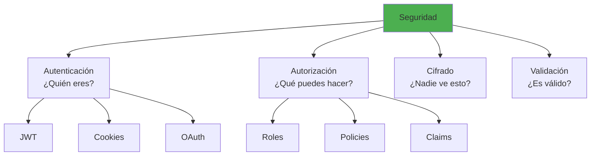

- [15. Seguridad en Aplicaciones de Servidor en .NET](#15-seguridad-en-aplicaciones-de-servidor-en-net)
  - [15.1. Fundamentos de seguridad](#151-fundamentos-de-seguridad)
    - [15.1.1. 🧠 Analogía: Seguridad como hotel](#1511--analogía-seguridad-como-hotel)
  - [15.2. Autenticación y autorización](#152-autenticación-y-autorización)
  - [15.3. JWT en .NET](#153-jwt-en-net)
  - [15.4. Cifrado y hashing](#154-cifrado-y-hashing)
  - [15.5. HTTPS y TLS](#155-https-y-tls)
  - [15.6. Mejores prácticas](#156-mejores-prácticas)
  - [15.7. OWASP Top 10](#157-owasp-top-10)
  - [15.8. Resumen](#158-resumen)

# 15. Seguridad en Aplicaciones de Servidor en .NET

La seguridad es fundamental en cualquier aplicación. Este capítulo cubre los aspectos esenciales para proteger aplicaciones .NET contra amenazas comunes.



### 15.0. Instalación de Librerías de Seguridad

Para implementar seguridad en .NET, necesitas instalar los siguientes paquetes NuGet:

```bash
# BCrypt para hashing de contraseñas
dotnet add package BCrypt.Net-Next

# JWT Authentication
dotnet add package Microsoft.AspNetCore.Authentication.JwtBearer

# Data Protection (cifrado de datos)
dotnet add package Microsoft.AspNetCore.DataProtection

# Cifrado simétrico (incluido en .NET BCL)
# System.Security.Cryptography.Aes, RSA, etc.

# Rate Limiting
dotnet add package AspNetCoreRateLimit
```

## 15.1. Fundamentos de seguridad

### 15.1.1. 🧠 Analogía: Seguridad como hotel

| Concepto | Analogía del hotel |
|----------|-------------------|
| **Autenticación** | Recepción verifica tu identificación |
| **Autorización** | Llave de tarjeta limita a tu habitación |
| **Cifrado** | Las conversaciones son privadas |
| **Logging** | Cámaras de seguridad |
| **Rate Limiting** | Portero que no deja entrar a todos |

```csharp
namespace Seguridad.Fundamentos
{
    public class SecurityConcepts
    {
        // Defense in Depth
        public void DemoDefenseInDepth()
        {
            // Capa 1: Validación de entrada
            if (string.IsNullOrEmpty(input))
                throw new ArgumentException("Input requerido");

            // Capa 2: Autenticación
            // app.UseAuthentication();

            // Capa 3: Autorización
            // [Authorize]

            // Capa 4: Cifrado
            // HTTPS + Data Protection

            // Capa 5: Logging
            // _logger.LogInformation("Acción realizada");
        }

        // Principio de mínimo privilegio
        public void DemoLeastPrivilege()
        {
            // Ejecutar con mínimos permisos necesarios
            // No usar admin para tareas de lectura
        }
    }
}
```

## 15.2. Autenticación y autorización
**Autenticación**: Verificar identidad del usuario (login).  
**Autorización**: Controlar acceso a recursos según roles/claims.

```csharp
namespace Seguridad.Auth
{
    public static class AuthConfiguration
    {
        public static void ConfigureAuthentication(IServiceCollection services)
        {
            // JWT Bearer
            services.AddAuthentication(options =>
            {
                options.DefaultAuthenticateScheme = JwtBearerDefaults.AuthenticationScheme;
                options.DefaultChallengeScheme = JwtBearerDefaults.AuthenticationScheme;
            })
            .AddJwtBearer(options =>
            {
                options.TokenValidationParameters = new TokenValidationParameters
                {
                    ValidateIssuer = true,
                    ValidateAudience = true,
                    ValidateLifetime = true,
                    ValidateIssuerSigningKey = true,
                    ValidIssuer = "mi-api",
                    ValidAudience = "mi-app",
                    IssuerSigningKey = new SymmetricSecurityKey(
                        Encoding.UTF8.GetBytes("SECRET_KEY_MUY_LARGA_Y_SEGURA_12345"))
                };
            });

            // Cookies (para MVC)
            services.AddAuthentication(CookieAuthenticationDefaults.AuthenticationScheme)
                .AddCookie(options =>
                {
                    options.Cookie.HttpOnly = true;
                    options.Cookie.SecurePolicy = CookieSecurePolicy.Always;
                    options.Cookie.SameSite = SameSiteMode.Strict;
                });
        }

        public static void ConfigureAuthorization(IServiceCollection services)
        {
            services.AddAuthorization(options =>
            {
                // Política simple
                options.AddPolicy("RequireAdmin", policy =>
                    policy.RequireRole("Admin"));

                // Política con claims
                options.AddPolicy("RequireEmail", policy =>
                    policy.RequireClaim("email"));

                // Política compleja
                options.AddPolicy("AdultUser", policy =>
                    policy.RequireAssertion(ctx =>
                        ctx.User.HasClaim(c => 
                            c.Type == "age" && 
                            int.Parse(c.Value) >= 18)));

                // Multiple roles/claims
                options.AddPolicy("ManagerOrAdmin", policy =>
                    policy.RequireAssertion(ctx =>
                        ctx.User.IsInRole("Manager") || 
                        ctx.User.IsInRole("Admin")));
            });
        }
    }

    // Uso de atributos
    [ApiController]
    [Route("api/[controller]")]
    public class UsersController : ControllerBase
    {
        [HttpGet]
        [Authorize]
        public IActionResult GetUsers()
        {
            return Ok("Lista de usuarios");
        }

        [HttpGet("{id}")]
        [Authorize(Policy = "RequireAdmin")]
        public IActionResult GetUser(int id)
        {
            return Ok($"Usuario {id}");
        }

        [HttpPost]
        [Authorize(Roles = "Admin")]
        public IActionResult CreateUser([FromBody] UserDto dto)
        {
            return Ok("Usuario creado");
        }

        [HttpDelete("{id}")]
        [Authorize(Policy = "AdultUser")]
        public IActionResult DeleteUser(int id)
        {
            return Ok("Usuario eliminado");
        }
    }
}
```

## 15.3. JWT en .NET

```csharp
namespace Seguridad.JWT
{
    public class JwtService(IConfiguration config)
    {
        public string GenerateToken(string username, string role)
        {
            var key = new SymmetricSecurityKey(
                Encoding.UTF8.GetBytes(config["Jwt:Secret"]!));

            var claims = new List<Claim>
            {
                new Claim(ClaimTypes.Name, username),
                new Claim(ClaimTypes.Role, role),
                new Claim(JwtRegisteredClaimNames.Jti, Guid.NewGuid().ToString()),
                new Claim(JwtRegisteredClaimNames.Iat, 
                    DateTimeOffset.UtcNow.ToUnixTimeSeconds().ToString(), 
                    ClaimValueTypes.Integer64)
            };

            var tokenDescriptor = new SecurityTokenDescriptor
            {
                Subject = new ClaimsIdentity(claims),
                Expires = DateTime.UtcNow.AddHours(1),
                SigningCredentials = new SigningCredentials(
                    key, 
                    SecurityAlgorithms.HmacSha256Signature),
                Issuer = config["Jwt:Issuer"],
                Audience = config["Jwt:Audience"]
            };

            var tokenHandler = new JwtSecurityTokenHandler();
            var token = tokenHandler.CreateToken(tokenDescriptor);
            return tokenHandler.WriteToken(token);
        }

        public ClaimsPrincipal? ValidateToken(string token)
        {
            var key = new SymmetricSecurityKey(
                Encoding.UTF8.GetBytes(config["Jwt:Secret"]!));

            var validationParameters = new TokenValidationParameters
            {
                ValidateIssuer = true,
                ValidateAudience = true,
                ValidateLifetime = true,
                ValidateIssuerSigningKey = true,
                ValidIssuer = config["Jwt:Issuer"],
                ValidAudience = config["Jwt:Audience"],
                IssuerSigningKey = key,
                ClockSkew = TimeSpan.Zero
            };

            try
            {
                var tokenHandler = new JwtSecurityTokenHandler();
                var principal = tokenHandler.ValidateToken(
                    token, 
                    validationParameters, 
                    out _);
                return principal;
            }
            catch
            {
                return null;
            }
        }

        public (string token, string refreshToken) GenerateTokens(string username)
        {
            var token = GenerateToken(username, "User");
            var refreshToken = Guid.NewGuid().ToString();
            return (token, refreshToken);
        }

        public string RefreshToken(string refreshToken)
        {
            return GenerateToken("user", "User");
        }
    }

    public class JwtMiddleware(RequestDelegate next)
    {
        public async Task Invoke(HttpContext context, IJwtService jwtService)
        {
            var token = context.Request.Headers["Authorization"]
                .FirstOrDefault()?.Split(" ").Last();

            if (token != null)
            {
                var principal = jwtService.ValidateToken(token);
                if (principal != null)
                {
                    context.User = principal;
                }
            }

            await next(context);
        }
    }
}
```

## 15.4. Cifrado y hashing
- **Hashing**: Transformar datos en una cadena fija (irreversible).  
- **Cifrado simétrico**: Misma clave para cifrar/descifrar.  
- **Cifrado asimétrico**: Clave pública para cifrar, privada para descifrar.

```csharp
namespace Seguridad.Crypto
{
    public class EncryptionExamples
    {
        // Hash con BCrypt
        public void DemoBCrypt()
        {
            // Instalar: dotnet add package BCrypt.Net-Next

            // Hash password
            string password = "MiPassword123!";
            string hash = BCrypt.Net.BCrypt.HashPassword(password);

            // Verificar password
            bool valid = BCrypt.Net.BCrypt.Verify(password, hash);
            bool invalid = BCrypt.Net.BCrypt.Verify("WrongPassword", hash);

            // Hash con trabajo configurable
            string strongHash = BCrypt.Net.BCrypt.HashPassword(
                password, 
                workFactor: 12);
        }

        // Hash con PBKDF2
        public void DemoPBKDF2()
        {
            var password = "MiPassword123!";
            byte[] salt = RandomNumberGenerator.GetBytes(16);

            var hash = Rfc2898DeriveBytes.Pbkdf2(
                password,
                salt,
                iterations: 100000,
                hashAlgorithm: HashAlgorithmName.SHA256,
                outputLength: 32);

            // Verificar
            var verify = Rfc2898DeriveBytes.Pbkdf2(
                password,
                salt,
                iterations: 100000,
                hashAlgorithm: HashAlgorithmName.SHA256,
                outputLength: 32);

            bool match = hash.SequenceEqual(verify);
        }

        // Cifrado simétrico (AES)
        public void DemoAES()
        {
            string plaintext = "Texto secreto";
            string key = "ClaveSecreta1234"; // 16/24/32 bytes

            var aes = Aes.Create();
            aes.Key = Encoding.UTF8.GetBytes(key.PadRight(32).Substring(0, 32));
            aes.IV = RandomNumberGenerator.GetBytes(16);

            // Cifrar
            var encryptor = aes.CreateEncryptor();
            var plaintextBytes = Encoding.UTF8.GetBytes(plaintext);
            var ciphertextBytes = encryptor.TransformFinalBlock(plaintextBytes, 0, plaintextBytes.Length);

            // Descifrar
            var decryptor = aes.CreateDecryptor();
            var decryptedBytes = decryptor.TransformFinalBlock(ciphertextBytes, 0, ciphertextBytes.Length);
            var decrypted = Encoding.UTF8.GetString(decryptedBytes);
        }

        // Cifrado asimétrico (RSA)
        public void DemoRSA()
        {
            using var rsa = RSA.Create(2048);

            // Exportar claves
            var publicKey = rsa.ExportRSAPublicKey();
            var privateKey = rsa.ExportRSAPrivateKey();

            // Cifrar con pública
            var plaintext = "Mensaje secreto";
            var plaintextBytes = Encoding.UTF8.GetBytes(plaintext);
            var ciphertextBytes = rsa.Encrypt(plaintextBytes, RSAEncryptionPadding.OaepSHA256);

            // Descifrar con privada
            var decryptedBytes = rsa.Decrypt(ciphertextBytes, RSAEncryptionPadding.OaepSHA256);
            var decrypted = Encoding.UTF8.GetString(decryptedBytes);

            // Firmar
            var signature = rsa.SignData(plaintextBytes, 
                HashAlgorithmName.SHA256, 
                RSASignaturePadding.Pkcs1);

            // Verificar firma
            bool valid = rsa.VerifyData(plaintextBytes, signature, 
                HashAlgorithmName.SHA256, 
                RSASignaturePadding.Pkcs1);
        }

        // Protected Data (Windows DPAPI)
        public void DemoProtectedData()
        {
            string data = "Dato sensible";
            byte[] dataBytes = Encoding.UTF8.GetBytes(data);

            // Cifrar
            byte[] encrypted = ProtectedData.Protect(
                dataBytes,
                entropy: null,
                DataProtectionScope.CurrentUser);

            // Descifrar
            byte[] decrypted = ProtectedData.Unprotect(
                encrypted,
                entropy: null,
                DataProtectionScope.CurrentUser);

            Console.WriteLine(Encoding.UTF8.GetString(decrypted));
        }
    }
}
```

## 15.5. HTTPS y TLS
- **HTTPS**: Protocolo seguro para comunicación web.  
- **TLS**: Protocolo de seguridad para cifrado de datos en tránsito.

```csharp
namespace Seguridad.HTTPS
{
    public static class HttpsConfiguration
    {
        public static void ConfigureHttps(WebApplicationBuilder builder)
        {
            // Redirección HTTPS
            builder.Services.AddHttpsRedirection(options =>
            {
                options.RedirectStatusCode = StatusCodes.Status307TemporaryRedirect;
                options.HttpsPort = 5001;
            });

            // HSTS
            builder.Services.AddHsts(options =>
            {
                options.MaxAge = TimeSpan.FromDays(365);
                options.IncludeSubDomains();
                options.Preload = true;
            });
        }

        public static void ConfigureTls(WebHostBuilderContext context, 
            SslOptions options)
        {
            options.SslProtocols = SslProtocols.Tls12 | SslProtocols.Tls13;
            options.ClientCertificateMode = ClientCertificateMode.NoCertificate;
        }
    }

    // Certificado autofirmado para desarrollo
    public class SelfSignedCertificate
    {
        public static void CreateCertificate()
        {
            using var rsa = RSA.Create(2048);

            var request = new CertificateRequest(
                "CN=localhost",
                rsa,
                HashAlgorithmName.SHA256,
                RSASignaturePadding.Pkcs1);

            request.CertificateExtensions.Add(
                new X509KeyUsageExtension(
                    X509KeyUsageFlags.DigitalSignature,
                    critical: true));

            request.CertificateExtensions.Add(
                new X509EnhancedKeyUsageExtension(
                    new OidCollection { new Oid("1.3.6.1.5.5.7.3.1") }, // Server Auth
                    critical: false));

            var sanBuilder = new SubjectAlternativeNameBuilder();
            sanBuilder.AddDnsName("localhost");
            sanBuilder.AddIpAddress(IPAddress.Loopback);
            request.CertificateExtensions.Add(sanBuilder.Build());

            var certificate = request.CreateSelfSigned(
                DateTimeOffset.UtcNow.AddDays(-1),
                DateTimeOffset.UtcNow.AddYears(1));

            File.WriteAllBytes("cert.pfx", certificate.Export(
                X509ContentType.Pfx, "password"));
        }
    }
}
```

## 15.6. Mejores prácticas

```csharp
namespace Seguridad.BestPractices
{
    public class BestPracticesExamples
    {
        // ✅ CORRECTO
        public void CorrectExamples()
        {
            // Usar parámetros (evita SQL Injection)
            var query = "SELECT * FROM users WHERE id = @id";
            await connection.QueryAsync(query, new { id = userId });

            // Validar inputs
            if (string.IsNullOrWhiteSpace(input))
                return BadRequest("Input requerido");

            // Usar hash para passwords
            var hash = BCrypt.Net.BCrypt.HashPassword(password);

            // HTTPS
            app.UseHttpsRedirection();

            // Data Protection
            services.AddDataProtection();

            // Rate limiting
            services.AddRateLimiter(options =>
            {
                options.AddPolicy("api", context =>
                    context.HttpContext.Request.Path.StartsWithSegments("/api")
                        ? RateLimitPartition.GetFixedWindowLimiter(
                            context.HttpContext.User.Identity?.Name ?? "anonymous",
                            new FixedWindowRateLimiterOptions
                            {
                                PermitLimit = 100,
                                Window = TimeSpan.FromMinutes(1)
                            })
                        : null);
            });
        }

        // ❌ INCORRECTO
        public void IncorrectExamples()
        {
            // SQL Injection - NUNCA hacer esto
            // var query = $"SELECT * FROM users WHERE id = {userId}";

            // Passwords en texto - NUNCA
            // var password = "secret123";

            // Hardcoded keys - NUNCA
            // var secretKey = "mi-clave-secreta-123";

            // Timeout infinito - NUNCA
            // client.Timeout = Timeout.InfiniteTimeSpan;

            // Validation bypass - NUNCA
            // if (userInput == null) return; // Sin validación
        }

        // Headers de seguridad
        public static void ConfigureSecurityHeaders(
            IApplicationBuilder app)
        {
            app.Use(async (context, next) =>
            {
                context.Response.Headers.Append("X-Content-Type-Options", "nosniff");
                context.Response.Headers.Append("X-Frame-Options", "DENY");
                context.Response.Headers.Append("X-XSS-Protection", "1; mode=block");
                context.Response.Headers.Append("Referrer-Policy", "strict-origin-when-cross-origin");
                context.Response.Headers.Append(
                    "Content-Security-Policy", 
                    "default-src 'self'; script-src 'self' 'unsafe-inline'");
                context.Response.Headers.Append(
                    "Strict-Transport-Security", 
                    "max-age=31536000; includeSubDomains; preload");

                await next();
            });
        }

        // Rate limiting
        public static void ConfigureRateLimiting(IServiceCollection services)
        {
            services.AddRateLimiter(options =>
            {
                options.GlobalLimiter = PartitionedRateLimiter.Create<HttpContext, string>(
                    context => RateLimitPartition.GetFixedWindowLimiter(
                        context.User.Identity?.Name ?? "anonymous",
                        new FixedWindowRateLimiterOptions
                        {
                            PermitLimit = 100,
                            Window = TimeSpan.FromMinutes(1),
                            QueueProcessingOrder = QueueProcessingOrder.OldestFirst
                        }));

                options.OnRejected = async (context, token) =>
                {
                    context.HttpContext.Response.StatusCode = StatusCodes.Status429TooManyRequests;
                    await context.HttpContext.Response.WriteAsync(
                        "Too many requests. Please try again later.", 
                        token);
                };
            });
        }

        // CORS seguro
        public static void ConfigureCors(IServiceCollection services)
        {
            services.AddCors(options =>
            {
                options.AddPolicy("AllowSpecificOrigins", policy =>
                {
                    policy.WithOrigins("https://trusted.com")
                          .AllowAnyHeader()
                          .AllowAnyMethod()
                          .AllowCredentials();
                });

                options.AddPolicy("DenyAll", policy =>
                {
                    policy.WithOrigins("*")
                          .AllowAnyHeader()
                          .AllowAnyMethod();
                });
            });
        }
    }
}
```

## 15.7. OWASP Top 10
OWASP Top 10 es una lista de las vulnerabilidades de seguridad más críticas en aplicaciones web. Aquí tienes ejemplos de cómo mitigar cada una en .NET:

```csharp
namespace Seguridad.OWASP
{
    public class OWASPProtection
    {
        // A01: Broken Access Control
        public void ProtectAccessControl()
        {
            // ✅ CORRECTO
            [Authorize]
        public IActionResult GetMyData()
        {
            var userId = User.FindFirst(ClaimTypes.NameIdentifier)?.Value;
            var data = _repo.GetByUserId(userId);
            return Ok(data);
        }

            // ❌ INCORRECTO - IDOR
            [Authorize]
            public IActionResult GetData(int id) // Sin verificar propiedad
            {
                return Ok(_repo.GetById(id));
            }
        }

        // A02: Cryptographic Failures
        public void ProtectCryptography()
        {
            // ✅ Usar algoritmos modernos
            // SHA256, AES-256, PBKDF2 con 100k+ iteraciones

            // ❌ Evitar
            // MD5, SHA1, DES, ECB mode
        }

        // A03: Injection
        public void PreventInjection()
        {
            // ✅ SQL Injection - Parámetros
            await connection.QueryAsync(
                "SELECT * FROM users WHERE email = @Email", 
                new { Email = email });

            // ✅ XSS - Encoding
            @Html.Encode(userInput)

            // ✅ Command Injection - Avoid
            // Process.Start("rm -rf /", input) // NUNCA
        }

        // A04: Insecure Design
        public void SecureDesign()
        {
            // Rate limiting
            // Account lockout después de intentos fallidos
        }

        // A05: Security Misconfiguration
        public void PreventMisconfiguration()
        {
            // No exponer información de errores en producción
            // Deshabilitar debug en producción
            // Configurar headers de seguridad
        }

        // A06: Vulnerable Components
        public void UpdateComponents()
        {
            // dotnet list package --outdated
            // Dependabot
            // Renovate
        }

        // A07: Identification and Authentication Failures
        public void SecureAuthentication()
        {
            // Password policy
            // MFA
            // Session timeout
            // Secure cookies
        }

        // A08: Software and Data Integrity Failures
        public void ProtectIntegrity()
        {
            // Firmar serialización
            // Verificar integridad de datos
            // No confiar en datos no verificados
        }

        // A09: Security Logging and Monitoring Failures
        public void ImplementLogging()
        {
            // Loguear intentos de login fallidos
            // Loguear operaciones privilegiadas
            // Alertas en actividad sospechosa
        }

        // A10: Server-Side Request Forgery (SSRF)
        public void PreventSSRF()
        {
            // ✅ Validar URLs
            var uri = new Uri(url);
            if (uri.Host != "api.trusted.com")
                throw new Exception("Dominio no permitido");

            // ❌ No hacer
            // using var response = await httpClient.GetAsync(url);
        }
    }
}
```

## 15.8. Resumen

Ten en en cuenta estos puntos clave para asegurar tus aplicaciones .NET:

**Fundamentos de Seguridad**
- Defense in Depth: múltiples capas de protección
- Principio de mínimo privilegio

**Autenticación y Autorización**
- JWT Bearer tokens
- Claims y roles
- Policies personalizadas

**Cifrado**
- BCrypt/PBKDF2 para passwords
- AES para cifrado simétrico
- RSA para cifrado asimétrico

**HTTPS**
- Redirección HTTP → HTTPS
- HSTS para forzar HTTPS
- Certificados válidos

**Mejores Prácticas**
- Validación de inputs
- Rate limiting
- Headers de seguridad
- CORS configurado

**OWASP Top 10**
- Access Control
- Cryptographic Failures
- Injection
- Security Misconfiguration