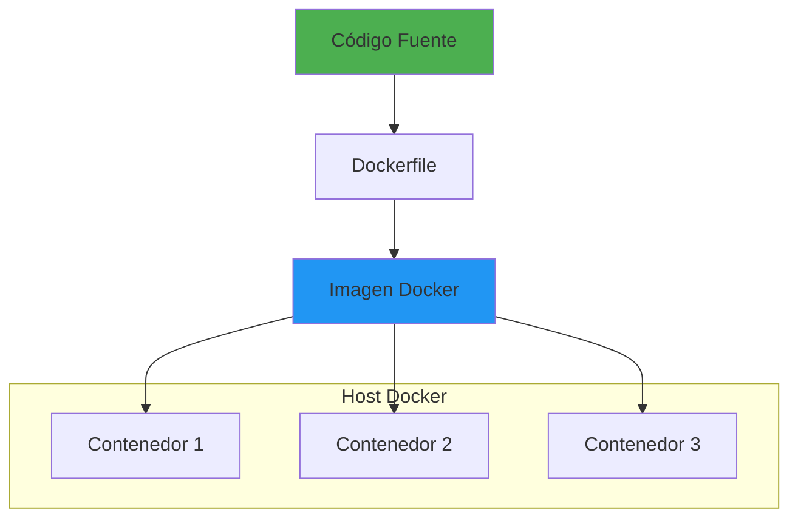

- [16. Dockerización de Aplicaciones .NET](#16-dockerización-de-aplicaciones-net)
  - [16.1. Fundamentos de Docker](#161-fundamentos-de-docker)
    - [16.1.1. 🧠 Analogía: Contenedores como barcos de carga](#1611--analogía-contenedores-como-barcos-de-carga)
  - [16.2. Dockerfile](#162-dockerfile)
  - [16.3. Multi-stage builds](#163-multi-stage-builds)
  - [16.4. Docker Compose](#164-docker-compose)
  - [16.5. Buenas prácticas](#165-buenas-prácticas)
  - [16.6. Resumen](#166-resumen)

# 16. Dockerización de Aplicaciones .NET

Docker permite empaquetar aplicaciones en contenedores portátiles y reproducibles, eliminando el clásico "funciona en mi máquina".



## 16.1. Fundamentos de Docker

### 16.1.1. 🧠 Analogía: Contenedores como barcos de carga

| Concepto | Analogía |
|----------|----------|
| **Imagen** | Plano/blueprint del contenedor |
| **Contenedor** | Barco construido desde el plano |
| **Dockerfile** | Instrucciones de construcción |
| **Registry** | Almacén de planos (Docker Hub) |
| **Dockerfile** | Receta de cocina |

```csharp
// No hay código aquí - conceptos conceptuales
```

## 16.2. Dockerfile

```dockerfile
# Dockerfile básico para .NET
FROM mcr.microsoft.com/dotnet/sdk:8.0 AS build
WORKDIR /src

# Copiar solo archivos de proyecto primero (mejor caché)
COPY *.csproj ./
RUN dotnet restore

# Copiar todo y compilar
COPY . ./
RUN dotnet publish -c Release -o /publish

# Imagen de ejecución
FROM mcr.microsoft.com/dotnet/aspnet:8.0
WORKDIR /publish

# Copiar salida de compilación
COPY --from=build /publish .

# Configuración
EXPOSE 80
ENV ASPNETCORE_URLS=http://+:80
ENV DOTNET_RUNNING_IN_CONTAINER=true

# Usuario no root
RUN adduser -u 1000 appuser
USER appuser

ENTRYPOINT ["dotnet", "MiApi.dll"]
```

## 16.3. Multi-stage builds

```dockerfile
# ETAPA 1: Compilación
FROM mcr.microsoft.com/dotnet/sdk:8.0 AS build
WORKDIR /src

# Restaurar dependencias
COPY src/MiApi/*.csproj src/MiApi/
RUN dotnet restore src/MiApi/MiApi.csproj

# Copiar y compilar
COPY src/MiApi/ src/MiApi/
WORKDIR /src/src/MiApi
RUN dotnet publish -c Release -o /publish --no-restore

# ETAPA 2: Testing (opcional)
FROM build AS test
WORKDIR /src
COPY tests/ tests/
RUN dotnet test --no-restore --verbosity quiet

# ETAPA 3: Producción
FROM mcr.microsoft.com/dotnet/aspnet:8.0 AS runtime
WORKDIR /publish

# Instalar herramientas de monitoring
RUN apt-get update && apt-get install -y --no-install-recommends \
    curl \
    && rm -rf /var/lib/apt/lists/*

# Copiar desde build
COPY --from=build /publish .

# Health check
HEALTHCHECK --interval=30s --timeout=3s --start-period=5s --retries=3 \
    CMD curl -f http://localhost/health || exit 1

# Usuario no root
RUN adduser -u 1000 appuser
USER appuser

ENTRYPOINT ["dotnet", "MiApi.dll"]
```

## 16.4. Docker Compose

```yaml
version: '3.8'

services:
  # API principal
  api:
    build:
      context: .
      dockerfile: Dockerfile
    container_name: miapi
    ports:
      - "5000:80"
    environment:
      - ASPNETCORE_ENVIRONMENT=Production
      - ConnectionStrings__DefaultConnection=Host=db;Database=app;Username=postgres;Password=secret
      - Redis__Host=redis
      - RABBITMQ__Host=rabbitmq
    depends_on:
      db:
        condition: service_healthy
      redis:
        condition: service_started
    healthcheck:
      test: ["CMD", "curl", "-f", "http://localhost/health"]
      interval: 30s
      timeout: 10s
      retries: 3
    networks:
      - app-network
    volumes:
      - ./logs:/app/logs

  # Base de datos PostgreSQL
  db:
    image: postgres:15-alpine
    container_name: postgres
    environment:
      POSTGRES_DB: app
      POSTGRES_USER: postgres
      POSTGRES_PASSWORD: secret
    volumes:
      - postgres_data:/var/lib/postgresql/data
    ports:
      - "5432:5432"
    healthcheck:
      test: ["CMD-SHELL", "pg_isready -U postgres"]
      interval: 10s
      timeout: 5s
      retries: 5
    networks:
      - app-network

  # Redis para caché
  redis:
    image: redis:7-alpine
    container_name: redis
    ports:
      - "6379:6379"
    volumes:
      - redis_data:/data
    networks:
      - app-network

  # RabbitMQ para mensajería
  rabbitmq:
    image: rabbitmq:3-management-alpine
    container_name: rabbitmq
    ports:
      - "5672:5672"
      - "15672:15672"
    environment:
      RABBITMQ_DEFAULT_USER: admin
      RABBITMQ_DEFAULT_PASS: secret
    volumes:
      - rabbitmq_data:/var/lib/rabbitmq
    networks:
      - app-network

  # PgAdmin para gestión de PostgreSQL
  pgadmin:
    image: dpage/pgadmin4:8
    container_name: pgadmin
    environment:
      PGADMIN_DEFAULT_EMAIL: admin@admin.com
      PGADMIN_DEFAULT_PASSWORD: secret
    ports:
      - "5050:80"
    depends_on:
      - db
    networks:
      - app-network

volumes:
  postgres_data:
  redis_data:
  rabbitmq_data:

networks:
  app-network:
    driver: bridge
```

## 16.5. Buenas prácticas

```dockerfile
# ✅ USAR .dockerignore
node_modules
bin
obj
*.csproj.user
.vs
.git
.gitignore
*.md
.DS_Store

# ✅ MULTI-STAGE para reducir tamaño
# Ver Dockerfile anterior

# ✅ USAR usuario no root
RUN adduser -u 1000 appuser
USER appuser

# ✅ HEALTH CHECKS
HEALTHCHECK --interval=30s --timeout=3s \
    CMD curl -f http://localhost/health || exit 1

# ✅ Labels para metadata
LABEL maintainer="dev@empresa.com" \
      version="1.0.0" \
      description="API REST .NET"

# ✅ Optimizar caché
# Copiar csproj primero, luego código
COPY *.csproj ./
RUN dotnet restore
COPY . ./

# ✅ No exponer secretos en imagen
# Usar runtime environment variables

# ✅ Usar versión específica de imagen
# ❌ FROM mcr.microsoft.com/dotnet/sdk:latest
# ✅ FROM mcr.microsoft.com/dotnet/sdk:8.0
```

## 16.6. Resumen

Docker revoluciona el despliegue de aplicaciones .NET al garantizar portabilidad, reproducibilidad y aislamiento. Una **imagen** es una plantilla inmutable que define el sistema de archivos y configuración, mientras que un **contenedor** es una instancia en ejecución de esa imagen. El **Dockerfile** actúa como la receta de construcción que transforma el código fuente en una imagen lista para producción.

Las **multi-stage builds** permiten separar las etapas de compilación y ejecución, reduciendo significativamente el tamaño final de la imagen y mejorando la seguridad al no incluir el SDK en producción. Esto resulta en imágenes más pequeñas, rápidas de descargar y con menor superficie de ataque.

**Docker Compose** simplifica la orquestación de múltiples servicios, definiendo dependencias entre contenedores, variables de entorno, volúmenes persistentes y redes. Esto permite replicar entornos complejos de desarrollo y producción con un solo comando.

Las **buenas prácticas** incluyen usar `.dockerignore` para excluir archivos innecesarios, implementar health checks para monitorización, ejecutar contenedores con usuarios no root por seguridad, utilizar versiones específicas de imágenes en lugar de `latest`, y nunca exponer secretos directamente en las imágenes.

```mermaid
flowchart LR
    subgraph "Conceptos Clave"
        A[Imagen] --> B[Contenedor]
        C[Dockerfile] --> A
        D[Docker Compose] --> E[Orquestación]
    end

    subgraph "Beneficios"
        F[Portabilidad] --> G[DevOps]
        H[Aislamiento] --> G
        I[Reproducibilidad] --> G
    end

    style A fill:#2196F3
    style B fill:#4CAF50
    style C fill:#FF9800
    style D fill:#9C27B0