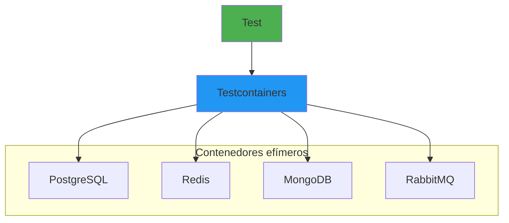

- [17. Testcontainers en .NET](#17-testcontainers-en-net)
  - [17.1. Fundamentos de Testcontainers](#171-fundamentos-de-testcontainers)
    - [17.1.1. 🧠 Analogía: Entornos de prueba efímeros](#1711--analogía-entornos-de-prueba-efímeros)
  - [17.2. Configuración](#172-configuración)
  - [17.3. PostgreSQL](#173-postgresql)
  - [17.4. Redis](#174-redis)
  - [17.5. Múltiples contenedores](#175-múltiples-contenedores)
  - [17.6. Buenas prácticas](#176-buenas-prácticas)
  - [17.7. Resumen](#177-resumen)

# 17. Testcontainers en .NET

Testcontainers permite ejecutar tests de integración con servicios reales (bases de datos, colas, etc.) en contenedores Docker efímeros.



## 17.1. Fundamentos de Testcontainers

### 17.1.1. 🧠 Analogía: Entornos de prueba efímeros

Imagina que cada test tiene su propio servidor nuevo de Base de Datos que se crea, se usa, y se destruye después. Sin contaminación entre tests, sin "funciona en mi máquina".

```bash
dotnet add package Testcontainers
dotnet add package Testcontainers.PostgreSql
dotnet add package Testcontainers.Redis
```

## 17.2. Configuración

```csharp
namespace Testcontainers.Config
{
    public static class TestConfiguration
    {
        // Configuración global
        public static void ConfigureTestcontainers()
        {
            TestcontainersSettings.ResourceReaperTimeout = TimeSpan.FromMinutes(5);
            TestcontainersSettings.Logger = new TestcontainersLogger();
        }

        // Configuration con Docker Compose
        public static ITestContainersBuilder<PostgreSqlContainer> ConfigurePostgres(
            this ITestContainersBuilder<PostgreSqlContainer> builder,
            string database = "testdb",
            string username = "postgres",
            string password = "secret")
        {
            return builder
                .WithImage("postgres:15-alpine")
                .WithDatabase(database)
                .WithUsername(username)
                .WithPassword(password)
                .WithCleanUp(true)
                .WithResourceMapping(new Dictionary<string, string>
                {
                    { "/docker-entrypoint-initdb.d", "./init-scripts" }
                });
        }
    }

    // Logger personalizado
    public class TestcontainersLogger : ITestcontainersLogger
    {
        public void Write(string message)
        {
            Console.WriteLine($"[Testcontainers] {message}");
        }
    }
}
```

## 17.3. PostgreSQL

```csharp
namespace Testcontainers.PostgreSQL
{
    [TestFixture]
    public class CustomerRepositoryTests
    {
        private PostgreSqlContainer _container = null!;
        private AppDbContext _context = null!;
        private CustomerRepository _repository = null!;

        [OneTimeSetUp]
        public async Task OneTimeSetUp()
        {
            _container = new PostgreSqlBuilder()
                .WithImage("postgres:15-alpine")
                .WithDatabase("testdb")
                .WithUsername("postgres")
                .WithPassword("secret")
                .WithCleanUp(true)
                .Build();
            
            await _container.StartAsync();

            var options = new DbContextOptionsBuilder<AppDbContext>()
                .UseNpgsql(_container.GetConnectionString())
                .Options;
                
            _context = new AppDbContext(options);
            await _context.Database.EnsureCreatedAsync();
            _repository = new CustomerRepository(_context);
        }

        [OneTimeTearDown]
        public async Task OneTimeTearDown()
        {
            await _container.StopAsync();
        }

        [SetUp]
        public void SetUp()
        {
            _context.Customers.RemoveRange(_context.Customers);
            _context.SaveChanges();
        }

        [Test]
        public async Task AddCustomer_ShouldPersist()
        {
            var customer = new Customer 
            { 
                Name = "Test Customer",
                Email = "test@email.com" 
            };

            await _repository.AddAsync(customer);

            var loaded = await _repository.GetByIdAsync(customer.Id);
            
            Assert.That(loaded, Is.Not.Null);
            Assert.That(loaded!.Name, Is.EqualTo("Test Customer"));
        }

        [Test]
        public async Task GetAll_ShouldReturnAllCustomers()
        {
            var customers = new[]
            {
                new Customer { Name = "Customer 1", Email = "c1@email.com" },
                new Customer { Name = "Customer 2", Email = "c2@email.com" },
                new Customer { Name = "Customer 3", Email = "c3@email.com" }
            };

            foreach (var c in customers)
                await _repository.AddAsync(c);

            var all = await _repository.GetAllAsync();

            Assert.That(all.Count, Is.EqualTo(3));
        }

        [Test]
        public async Task UpdateCustomer_ShouldPersist()
        {
            var customer = await _repository.AddAsync(
                new Customer { Name = "Original", Email = "original@email.com" });

            customer.Name = "Updated";
            await _repository.UpdateAsync(customer);

            var loaded = await _repository.GetByIdAsync(customer.Id);
            
            Assert.That(loaded!.Name, Is.EqualTo("Updated"));
        }

        [Test]
        public async Task DeleteCustomer_ShouldRemove()
        {
            var customer = await _repository.AddAsync(
                new Customer { Name = "ToDelete", Email = "delete@email.com" });

            await _repository.DeleteAsync(customer);

            var loaded = await _repository.GetByIdAsync(customer.Id);
            
            Assert.That(loaded, Is.Null);
        }

        [Test]
        public async Task Exists_ShouldReturnTrueForExisting()
        {
            var customer = await _repository.AddAsync(
                new Customer { Name = "Exists", Email = "exists@email.com" });

            var exists = await _repository.ExistsAsync(customer.Id);

            Assert.That(exists, Is.True);
        }
    }

    // DbContext
    public class AppDbContext : DbContext
    {
        public DbSet<Customer> Customers { get; set; } = null!;

        public AppDbContext(DbContextOptions<AppDbContext> options) : base(options) { }

        protected override void OnModelCreating(ModelBuilder modelBuilder)
        {
            modelBuilder.Entity<Customer>(entity =>
            {
                entity.ToTable("customers");
                entity.HasKey(e => e.Id);
                entity.Property(e => e.Name).IsRequired().HasMaxLength(100);
                entity.Property(e => e.Email).IsRequired().HasMaxLength(200);
            });
        }
    }

    public record Customer
    {
        public int Id { get; set; }
        public string Name { get; set; } = "";
        public string Email { get; set; } = "";
        public DateTime CreatedAt { get; set; } = DateTime.UtcNow;
    }
}
```

## 17.4. Redis

```csharp
namespace Testcontainers.Redis
{
    [TestFixture]
    public class RedisCacheTests
    {
        private RedisContainer _container = null!;
        private IConnectionMultiplexer _redis = null!;
        private IDatabase _db = null!;

        [OneTimeSetUp]
        public async Task OneTimeSetUp()
        {
            _container = new RedisBuilder()
                .WithImage("redis:7-alpine")
                .WithCleanUp(true)
                .Build();
            
            await _container.StartAsync();

            _redis = ConnectionMultiplexer.Connect(_container.GetConnectionString());
            _db = _redis.GetDatabase();
        }

        [OneTimeTearDown]
        public async Task OneTimeTearDown()
        {
            await _container.StopAsync();
            await _redis.CloseAsync();
        }

        [SetUp]
        public void SetUp()
        {
            _db.KeyDelete("test:*");
        }

        [Test]
        public async Task SetAndGet_ShouldWork()
        {
            const string key = "test:user:1";
            var user = new { Name = "Juan", Age = 30 };
            var json = JsonSerializer.Serialize(user);

            await _db.StringSetAsync(key, json);
            var stored = await _db.StringGetAsync(key);

            Assert.That(stored, Is.Not.Null);
            Assert.That(stored!, Is.EqualTo(json));
        }

        [Test]
        public async Task HashOperations_ShouldWork()
        {
            const string key = "test:user:hash";
            var fields = new Dictionary<string, string>
            {
                ["name"] = "Ana",
                ["email"] = "ana@email.com",
                ["age"] = "25"
            };

            foreach (var field in fields)
                await _db.HashSetAsync(key, field.Key, field.Value);

            var name = await _db.HashGetAsync(key, "name");
            var all = await _db.HashGetAllAsync(key);

            Assert.That(name, Is.EqualTo("Ana"));
            Assert.That(all.Length, Is.EqualTo(3));
        }

        [Test]
        public async Task Expiration_ShouldWork()
        {
            const string key = "test:expiring";
            await _db.StringSetAsync(key, "value");
            await _db.KeyExpireAsync(key, TimeSpan.FromSeconds(1));

            // Inmediatamente después
            Assert.That(await _db.KeyExistsAsync(key), Is.True);

            // Después del timeout
            await Task.Delay(1100);
            Assert.That(await _db.KeyExistsAsync(key), Is.False);
        }

        [Test]
        public async Task ListOperations_ShouldWork()
        {
            const string key = "test:queue";

            await _db.ListRightPushAsync(key, "item1");
            await _db.ListRightPushAsync(key, "item2");
            await _db.ListRightPushAsync(key, "item3");

            var length = await _db.ListLengthAsync(key);
            Assert.That(length, Is.EqualTo(3));

            var first = await _db.ListLeftPopAsync(key);
            Assert.That(first, Is.EqualTo("item1"));
        }

        [Test]
        public async Task PubSub_ShouldWork()
        {
            const string channel = "test:channel";
            var receivedMessages = new List<string>();

            var subscriber = _redis.GetSubscriber();
            await subscriber.SubscribeAsync(channel, (_, message) =>
            {
                receivedMessages.Add(message!);
            });

            await subscriber.PublishAsync(channel, "Hello");
            await Task.Delay(100);

            Assert.That(receivedMessages.Count, Is.EqualTo(1));
            Assert.That(receivedMessages[0], Is.EqualTo("Hello"));
        }
    }
}
```

## 17.5. Múltiples contenedores

```csharp
namespace Testcontainers.MultiContainer
{
    [TestFixture]
    public class IntegrationTests
    {
        private PostgreSqlContainer _postgres = null!;
        private RedisContainer _redis = null!;
        private RabbitMqContainer _rabbitmq = null!;

        private AppDbContext _context = null!;
        private ICacheService _cache = null!;
        private IMessagePublisher _publisher = null!;

        [SetUp]
        public async Task SetUp()
        {
            // Iniciar PostgreSQL
            _postgres = new PostgreSqlBuilder()
                .WithImage("postgres:15-alpine")
                .WithDatabase("testdb")
                .WithUsername("postgres")
                .WithPassword("secret")
                .Build();
            await _postgres.StartAsync();

            // Iniciar Redis
            _redis = new RedisBuilder()
                .WithImage("redis:7-alpine")
                .Build();
            await _redis.StartAsync();

            // Iniciar RabbitMQ
            _rabbitmq = new RabbitMqBuilder()
                .WithImage("rabbitmq:3-management-alpine")
                .WithUsername("guest")
                .WithPassword("guest")
                .Build();
            await _rabbitmq.StartAsync();

            // Configurar DbContext
            var options = new DbContextOptionsBuilder<AppDbContext>()
                .UseNpgsql(_postgres.GetConnectionString())
                .Options;
            _context = new AppDbContext(options);
            await _context.Database.EnsureCreatedAsync();

            // Configurar servicios
            _cache = new RedisCacheService(_redis.GetConnectionString());
            _publisher = new RabbitMqPublisher(_rabbitmq.GetConnectionString());
        }

        [TearDown]
        public async Task TearDown()
        {
            await _context.DisposeAsync();
            await _postgres.StopAsync();
            await _redis.StopAsync();
            await _rabbitmq.StopAsync();
        }

        [Test]
        public async Task Cache_ShouldWorkWithDatabase()
        {
            var customer = new Customer 
            { 
                Name = "Test", 
                Email = "test@email.com" 
            };

            // Guardar en BD
            await _context.Customers.AddAsync(customer);
            await _context.SaveChangesAsync();

            // Cachear
            await _cache.SetAsync($"customer:{customer.Id}", customer);

            // Obtener de cache primero
            var cached = await _cache.GetAsync<Customer>($"customer:{customer.Id}");
            Assert.That(cached, Is.Not.Null);

            // Invalidar cache
            await _cache.DeleteAsync($"customer:{customer.Id}");

            // Obtener de BD
            var fromDb = await _context.Customers.FindAsync(customer.Id);
            Assert.That(fromDb, Is.Not.Null);
        }

        [Test]
        public async Task MessageQueue_ShouldIntegrateWithDatabase()
        {
            var customer = new Customer 
            { 
                Name = "Message Test", 
                Email = "msg@email.com" 
            };

            // Guardar en BD
            await _context.Customers.AddAsync(customer);
            await _context.SaveChangesAsync();

            // Publicar mensaje
            await _publisher.PublishAsync("customer.created", 
                new { CustomerId = customer.Id, Name = customer.Name });

            // Verificar mensaje publicado (con consumidor)
            var message = await ConsumeMessageAsync();
            Assert.That(message, Is.Not.Null);
        }

        private async Task<object?> ConsumeMessageAsync()
        {
            var connection = _rabbitmq.CreateConnection();
            var channel = connection.CreateModel();
            
            channel.QueueDeclare(queue: "test.queue", durable: false);
            
            var result = channel.BasicGet(queue: "test.queue", autoAck: true);
            if (result != null)
            {
                var body = result.Body.ToArray();
                return JsonSerializer.Deserialize<object>(Encoding.UTF8.GetString(body));
            }
            return null;
        }
    }

    // Servicios de prueba
    public interface ICacheService
    {
        Task SetAsync<T>(string key, T value);
        Task<T?> GetAsync<T>(string key);
        Task DeleteAsync(string key);
    }

    public interface IMessagePublisher
    {
        Task PublishAsync(string routingKey, object message);
    }
}
```

## 17.6. Buenas prácticas

```csharp
namespace Testcontainers.BestPractices
{
    [TestFixture]
    public class BestPracticesTests
    {
        private PostgreSqlContainer _container = null!;

        [SetUp]
        public async Task SetUp()
        {
            _container = new PostgreSqlBuilder()
                .WithImage("postgres:15-alpine")
                .WithDatabase("testdb")
                .WithUsername("postgres")
                .WithPassword("secret")
                .WithCleanUp(true)
                .Build();
            
            await _container.StartAsync();
        }

        [TearDown]
        public async Task TearDown()
        {
            await _container.StopAsync();
        }

        [Test]
        public void Practice1_ReuseContainer()
        {
            // ❌ No crear nuevo contenedor para cada test
            // ✅ Reutilizar contenedor cuando sea posible
        }

        [Test]
        public void Practice2_CleanUpBetweenTests()
        {
            // Limpiar datos entre tests
            // Usar transactions que se revierten
        }

        [Test]
        public void Practice3_UseResourceReaper()
        {
            // Testcontainers会自动清理 contenedores
            // Para CI/CD, asegurar timeout adecuado
        }

        [Test]
        public void Practice4_ParallelExecution()
        {
            // Tests de integración pueden ejecutarse en paralelo
            // Usar puertos diferentes para cada contenedor
        }

        [Test]
        public void Practice5_HealthChecks()
        {
            // Esperar a que el contenedor esté healthy
            Assert.That(_container.State, Is.EqualTo(RunningState.Running));
        }
    }

    // Fixture con lifetimes compartidos
    [SetUpFixture]
    public class TestFixtureSetUp
    {
        [OneTimeSetUp]
        public async Task GlobalSetUp()
        {
            // Configuración global
            TestcontainersSettings.ResourceReaperTimeout = TimeSpan.FromMinutes(10);
        }

        [OneTimeTearDown]
        public async Task GlobalTearDown()
        {
            // Cleanup global si es necesario
        }
    }
}
```

## 17.7. Resumen

**Testcontainers**
- Contenedores Docker para tests de integración
- Servicios reales (BD, cache, colas)
- Cleanup automático

**Containers Soportados**
- PostgreSQL, MySQL, MongoDB
- Redis
- RabbitMQ, Kafka
- Elasticsearch, etc.

**Buenas Prácticas**
- Reutilizar contenedores cuando sea posible
- Limpiar datos entre tests
- Esperar a que contenedores estén healthy
- Timeout adecuado para CI/CD

**Integración con Tests**
- NUnit, xUnit, MSTest
- DbContext de EF Core
- Clients de Redis, RabbitMQ