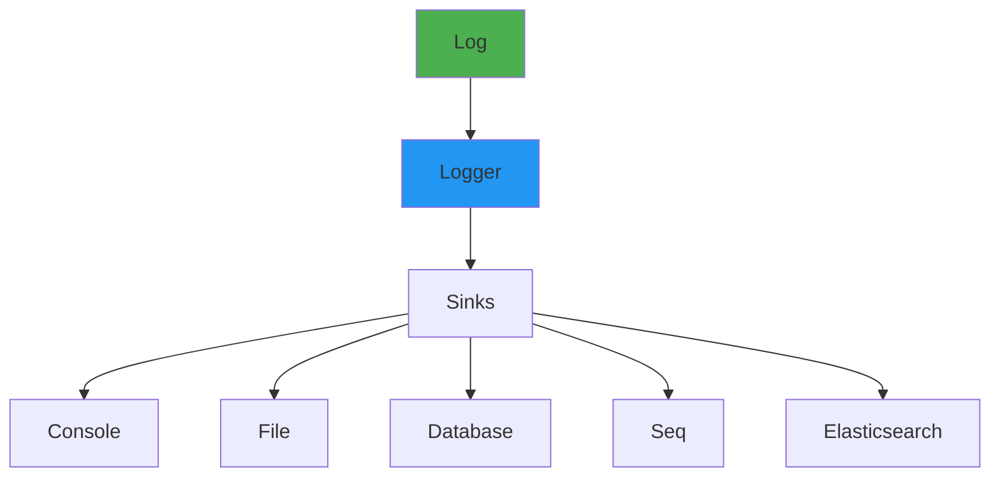

- [18. Logging y Serilog en .NET](#18-logging-y-serilog-en-net)
  - [18.1. Fundamentos de logging](#181-fundamentos-de-logging)
    - [18.1.1. 🧠 Analogía: Logging como caja negra](#1811--analogía-logging-como-caja-negra)
  - [18.2. Microsoft.Extensions.Logging](#182-microsoftextensionslogging)
  - [18.3. Serilog](#183-serilog)
  - [18.4. Sinks y configuración](#184-sinks-y-configuración)
  - [18.5. Estructurado logging](#185-estructurado-logging)
  - [18.6. Correlación de logs](#186-correlación-de-logs)
  - [18.7. Resumen](#187-resumen)

# 18. Logging y Serilog en .NET

El logging es fundamental para monitorear, depurar y auditar aplicaciones. Serilog proporciona logging estructurado que va más allá de texto plano.




## 18.1. Fundamentos de logging

### 18.1.1. 🧠 Analogía: Logging como caja negra

Imagina una caja negra en un avión:
- **Graba todo** lo que sucede
- **No interfiere** con el funcionamiento del avión
- ** Permite investigar** qué pasó si hay un problema

Sin logging, no sabes qué pasó cuando algo falla.

```csharp
namespace Logging.Fundamentos
{
    public class LoggingLevels
    {
        // Niveles de log (del más al menos severo)
        // Trace < Debug < Information < Warning < Error < Critical

        public void DemoLevels(ILogger<LoggingLevels> logger)
        {
            // Trace - detalles muy granulares
            logger.LogTrace("Parámetro de entrada: {Param}", param);

            // Debug - información para debugging
            logger.LogDebug("Usuario encontrado: {UserId}", userId);

            // Information - eventos de negocio
            logger.LogInformation("Usuario {UserId} accedió a {Resource}", 
                userId, resource);

            // Warning - situaciones anómalas pero no errores
            logger.LogWarning("Retry #{Attempt} para {Operation}", 
                attempt, operation);

            // Error - errores que pueden recuperarse
            logger.LogError(ex, "Error procesando orden {OrderId}", orderId);

            // Critical - errores fatales
            logger.LogCritical("Base de datos no disponible. El sistema se detendrá.");
        }
    }
}
```

## 18.2. Microsoft.Extensions.Logging

```csharp
namespace Logging.Microsoft
{
    public static class LoggingConfiguration
    {
        public static void ConfigureLogging(WebApplicationBuilder builder)
        {
            // Logging básico
            builder.Logging.ClearProviders();
            builder.Logging.AddConsole();
            builder.Logging.AddDebug();

            // Filtrado por nivel
            builder.Logging.AddFilter("Microsoft", LogLevel.Warning);
            builder.Logging.AddFilter("Microsoft.AspNetCore", LogLevel.Information);

            // Configuración desde appsettings.json
            // {
            //   "Logging": {
            //     "LogLevel": {
            //       "Default": "Information",
            //       "Microsoft.AspNetCore": "Warning"
            //     }
            //   }
            // }
        }

        // Inyección de ILogger
        public class MyService(ILogger<MyService> logger)
        {
            private readonly ILogger<MyService> _logger = logger;

            public void Process()
            {
                _logger.LogInformation("Procesando...");
            }
        }

        // ILogger<T> - inferencia de categoría
        public class CategoryExample(ILogger<MyController> logger)
        {
            private readonly ILogger<MyController> _logger = logger; // Categoría: "Logging.CategoryExample"
        }

        // ILoggerFactory
        public class FactoryExample(ILoggerFactory factory)
        {
            private readonly ILogger _logger = factory.CreateLogger("Custom.Category");
        }
    }

    [ApiController]
    [Route("api/[controller]")]
    public class UsersController : ControllerBase
    {
        private readonly IUserService _service;
        private readonly ILogger<UsersController> _logger;

        public UsersController(IUserService service, ILogger<UsersController> logger)
        {
            _service = service;
            _logger = logger;
        }

        [HttpGet("{id}")]
        public IActionResult Get(int id)
        {
            _logger.LogInformation("Solicitando usuario {UserId}", id);
            
            try
            {
                var user = _service.GetUser(id);
                return Ok(user);
            }
            catch (Exception ex)
            {
                _logger.LogError(ex, "Error obteniendo usuario {UserId}", id);
                return NotFound();
            }
        }
    }
}
```

## 18.3. Serilog
Serilog es una biblioteca de logging estructurado para .NET que permite capturar datos ricos y contextuales en los logs.

Para configurar Serilog en una aplicación .NET debemos seguir estos pasos:
- Instalar los paquetes NuGet necesarios.
- Configurar Serilog en el host de la aplicación.

Para instalar Serilog y algunos sinks comunes:

- Serilog: núcleo de Serilog
- AspNetCore: integración con ASP.NET Core
- Sinks: destinos de logs (consola, archivo, Seq, etc.)

```bash
dotnet add package Serilog
dotnet add package Serilog.AspNetCore
dotnet add package Serilog.Sinks.Console
dotnet add package Serilog.Sinks.File
dotnet add package Serilog.Sinks.seq
```


```csharp
namespace Logging.Serilog
{
    public static class SerilogConfiguration
    {
        public static void ConfigureSerilog(WebApplicationBuilder builder)
        {
            // Instalar:
            // dotnet add package Serilog.AspNetCore
            // dotnet add package Serilog.Sinks.Console
            // dotnet add package Serilog.Sinks.File
            // dotnet add package Serilog.Sinks.Seq

            builder.Host.UseSerilog((context, services, configuration) => 
                configuration
                    .ReadFrom.Services(services)
                    .ReadFrom.Configuration(context.Configuration)
                    .Enrich.FromLogContext()
                    .Enrich.WithProperty("Application", "MiApi")
                    .Enrich.WithProperty("Environment", 
                        context.HostingEnvironment.EnvironmentName)
                    .WriteTo.Console(
                        outputTemplate: 
                            "[{Timestamp:HH:mm:ss} {Level:u3}] {Message:lj}{NewLine}{Exception}")
                    .WriteTo.File(
                        path: "logs/app-.log",
                        rollingInterval: RollingInterval.Day,
                        outputTemplate: 
                            "[{Timestamp:yyyy-MM-dd HH:mm:ss} {Level:u3}] {Message:lj}{NewLine}{Exception}",
                        retainedFileCountLimit: 31)
            );
        }

        // Configuración en appsettings.json
        // {
        //   "Serilog": {
        //     "Using": [
        //       "Serilog.Sinks.Console",
        //       "Serilog.Sinks.File"
        //     ],
        //     "MinimumLevel": "Information",
        //     "WriteTo": [
        //       {
        //         "Name": "Console"
        //       },
        //       {
        //         "Name": "File",
        //         "Args": {
        //           "path": "logs/app-.log",
        //           "rollingInterval": "Day"
        //         }
        //       }
        //     ],
        //     "Enrich": [ "FromLogContext", "WithMachineName" ],
        //     "Properties": {
        //       "Application": "MiApi"
        //     }
        //   }
        // }
    }

    public class SerilogExamples(ILogger<SerilogExamples> logger)
    {
        private readonly ILogger<SerilogExamples> _logger = logger;

        public void DemoLogging()
        {
            // Mensaje simple
            _logger.LogInformation("Usuario creado");

            // Con propiedades
            _logger.LogInformation("Usuario {UserId} creado por {AdminId}", 
                userId, adminId);

            // Con excepción
            try
            {
                throw new InvalidOperationException("Error de negocio");
            }
            catch (Exception ex)
            {
                _logger.LogError(ex, "Error procesando usuario {UserId}", userId);
            }

            // Log contextual con With()
            using (_logger.BeginScope("OrderId: {OrderId}", orderId))
            {
                _logger.LogInformation("Iniciando procesamiento");
                // Todos los logs dentro tienen OrderId
                
                using (_logger.BeginScope("Operation: {Operation}", "Process"))
                {
                    _logger.LogInformation("Ejecutando operación");
                }
            }
        }
    }
}
```

## 18.4. Sinks y configuración

```csharp
namespace Logging.Sinks
{
    public class SinkConfiguration
    {
        public static void ConfigureSinks(WebApplicationBuilder builder)
        {
            Log.Logger = new LoggerConfiguration()
                // Console - desarrollo
                .WriteTo.Console(
                    theme: AnsiConsoleTheme.Code,
                    outputTemplate: 
                        "[{Timestamp:HH:mm:ss} {Level:u3}] {Message:lj}{NewLine}{Exception}")
                
                // File - logs persistentes
                .WriteTo.File(
                    path: "logs/app-.log",
                    rollingInterval: RollingInterval.Day,
                    retainedFileCountLimit: 7,
                    fileSizeLimitBytes: 10_000_000,
                    rollOnFileSizeLimit: true,
                    buffered: true,
                    flushToDiskInterval: TimeSpan.FromSeconds(10),
                    outputTemplate: 
                        "[{Timestamp:yyyy-MM-dd HH:mm:ss.fff} {Level:u3}] " +
                        "[{CorrelationId}] {Message:lj}{NewLine}{Exception}")
                
                // JSON File - para procesamiento
                .WriteTo.File(
                    path: "logs/app-.json",
                    rollingInterval: RollingInterval.Day,
                    formatter: new CompactJsonFormatter())
                
                // Seq - logging estructurado
                .WriteTo.Seq(
                    serverUrl: "http://localhost:5341",
                    apiKey: "seq-api-key",
                    batchAction: BatchAction.Open,
                    period: TimeSpan.FromSeconds(2))
                
                // Elasticsearch
                .WriteTo.Elasticsearch(
                    nodeUris: "http://localhost:9200",
                    indexFormat: "logs-{0:yyyy.MM.dd}",
                    autoRegisterTemplate: true,
                    autoRegisterTemplateVersion: AutoRegisterTemplateVersion.ESv7)
                
                // Database
                .WriteTo.MariaDB(
                    connectionString: "Server=localhost;Database=logs;Uid=root;Pwd=secret;",
                    tableName: "Logs",
                    batchSizeLimit: 100,
                    period: TimeSpan.FromSeconds(10))
                
                // Application Insights
                .WriteTo.ApplicationInsights(
                    telemetryClient,
                    TelemetryConverter.Traces)
                
                .CreateLogger();
        }
    }
}
```

## 18.5. Estructurado logging

```csharp
namespace Logging.Structured
{
    public class StructuredLoggingExamples(ILogger<StructuredLoggingExamples> logger)
    {
        private readonly ILogger<StructuredLoggingExamples> _logger = logger;

        // Logging estructurado con propiedades
        public void DemoStructured()
        {
            var order = new Order 
            { 
                Id = 12345, 
                CustomerId = 678, 
                Total = 99.99m,
                Items = 3
            };

            // ❌ Logging plano
            // _logger.LogInformation($"Orden {order.Id} creada por {order.CustomerId}");

            // ✅ Logging estructurado
            _logger.LogInformation(
                "Orden {OrderId} creada por {CustomerId} con {ItemCount} items por {Total:C}",
                order.Id,
                order.CustomerId,
                order.Items,
                order.Total);

            // Con objetos complejos
            _logger.LogInformation(
                "Orden creada: {@Order}",
                order); // @ hace serialización del objeto

            // Campos específicos
            _logger.LogInformation(
                "Orden {OrderId} - Customer: {CustomerId} - Total: {Total}",
                order.Id,
                order.CustomerId,
                order.Total);
        }

        // Scopes para contexto
        public void DemoScopes()
        {
            using (_logger.BeginScope("RequestId: {RequestId}", Guid.NewGuid()))
            using (_logger.BeginScope("UserId: {UserId}", userId))
            {
                _logger.LogInformation("Iniciando request");

                ProcessPayment();

                _logger.LogInformation("Request completado");
            }
        }

        // Enriquecedores (Enrichers)
        public void DemoEnrichers()
        {
            // Agrega propiedades a todos los logs
            // Ver SerilogConfiguration
        }

        private void ProcessPayment()
        {
            using (_logger.BeginScope("Operation: {Operation}", "Payment"))
            {
                _logger.LogDebug("Procesando pago...");
            }
        }
    }

    // Custom enricher
    public class CorrelationIdEnricher : ILogEventEnricher
    {
        public void Enrich(LogEvent logEvent, ILogEventPropertyFactory propertyFactory)
        {
            var correlationId = HttpContext.Current?.TraceIdentifier 
                ?? Guid.NewGuid().ToString();
            
            logEvent.AddPropertyIfAbsent(
                propertyFactory.CreateProperty("CorrelationId", correlationId));
        }
    }

    public class Order
    {
        public int Id { get; set; }
        public int CustomerId { get; set; }
        public decimal Total { get; set; }
        public int Items { get; set; }
    }
}
```

## 18.6. Correlación de logs

```csharp
namespace Logging.Correlation
{
    public class CorrelationIdMiddleware(RequestDelegate next)
    {
        private readonly RequestDelegate _next = next;

        public async Task InvokeAsync(HttpContext context)
        {
            // Generar o usar correlation ID existente
            var correlationId = context.Request.Headers["X-Correlation-ID"]
                .FirstOrDefault() ?? Guid.NewGuid().ToString();

            context.Response.Headers["X-Correlation-ID"] = correlationId;
            context.TraceIdentifier = correlationId;

            using (_logger.BeginScope("CorrelationId: {CorrelationId}", correlationId))
            {
                await _next(context);
            }
        }
    }

    public static class CorrelationExtensions
    {
        public static IApplicationBuilder UseCorrelationId(this IApplicationBuilder app)
        {
            return app.UseMiddleware<CorrelationIdMiddleware>();
        }
    }

    // HttpContext.Current para enricher
    public class HttpContextEnricher(IHttpContextAccessor httpContextAccessor)
    {
        private readonly IHttpContextAccessor _httpContextAccessor = httpContextAccessor;

        public void Enrich(LogEvent logEvent, ILogEventPropertyFactory propertyFactory)
        {
            var context = _httpContextAccessor.HttpContext;
            if (context != null)
            {
                logEvent.AddPropertyIfAbsent(
                    propertyFactory.CreateProperty("CorrelationId", 
                        context.TraceIdentifier));
                
                logEvent.AddPropertyIfAbsent(
                    propertyFactory.CreateProperty("RequestPath", 
                        context.Request.Path));
            }
        }
    }

    // Configuración completa
    public static class FullLoggingSetup
    {
        public static void ConfigureFullLogging(WebApplicationBuilder builder)
        {
            builder.Services.AddHttpContextAccessor();

            Log.Logger = new LoggerConfiguration()
                .Enrich.FromLogContext()
                .Enrich.With(new HttpContextEnricher(
                    builder.Services.BuildServiceProvider()
                        .GetRequiredService<IHttpContextAccessor>()))
                .Enrich.WithProperty("Application", "MiApi")
                .Enrich.WithProperty("Environment", 
                    builder.Environment.EnvironmentName)
                .Enrich.WithMachineName()
                .Enrich.WithThreadId()
                .Enrich.WithThreadName()
                .WriteTo.Console(
                    outputTemplate: 
                        "[{Timestamp:HH:mm:ss} {Level:u3}] " +
                        "[{CorrelationId}] " +
                        "[{ThreadId}] " +
                        "{Message:lj}{NewLine}{Exception}")
                .WriteTo.File(
                    path: "logs/app-.log",
                    rollingInterval: RollingInterval.Day,
                    outputTemplate: 
                        "[{Timestamp:yyyy-MM-dd HH:mm:ss.fff} {Level:u3}] " +
                        "[{CorrelationId}] " +
                        "[{ThreadId}] " +
                        "{Message:lj}{NewLine}{Exception}")
                .CreateLogger();

            builder.Host.UseSerilog();
        }
    }
}
```

## 18.7. Resumen

**Logging Fundamentals**
- Niveles: Trace < Debug < Information < Warning < Error < Critical
- ILogger<T> para inyección de dependencias

**Serilog**
- Logging estructurado con propiedades
- Múltiples sinks (Console, File, Seq, Elasticsearch)
- Enriquecedores para contexto adicional

**Sinks**
- Console: desarrollo
- File: persistencia
- Seq: análisis estructurado
- Elasticsearch: agregación
- Database: almacenamiento persistente

**Logging Estructurado**
- Propiedades en lugar de strings interpolados
- Scopes para contexto
- Objetos con @ para serialización

**Correlación**
- X-Correlation-ID para seguir requests
- Middleware para inyectar correlation ID
- Enricher para incluir en todos los logs