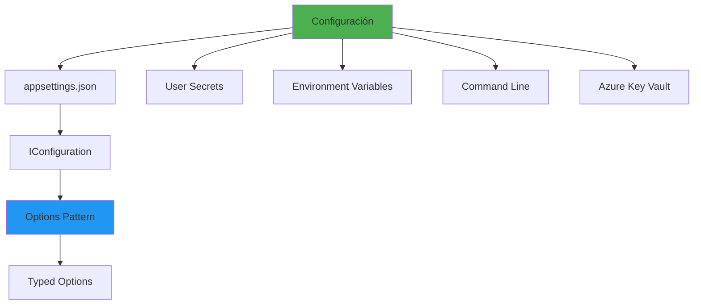

- [19. Configuration y Settings en .NET](#19-configuration-y-settings-en-net)
  - [19.1. Fundamentos de configuración](#191-fundamentos-de-configuración)
    - [19.1.1. 🧠 Analogía: Configuration como panel de control](#1911--analogía-configuration-como-panel-de-control)
  - [19.2. appsettings.json](#192-appsettingsjson)
  - [19.3. IConfiguration](#193-iconfiguration)
  - [19.4. Options Pattern](#194-options-pattern)
  - [19.5. Configuration en diferentes entornos](#195-configuration-en-diferentes-entornos)
  - [19.6. Secrets y configuración sensible](#196-secrets-y-configuración-sensible)
  - [19.7. Variables de entorno](#197-variables-de-entorno)
  - [19.8. Azure App Configuration](#198-azure-app-configuration)
  - [19.9. Resumen](#199-resumen)

# 19. Configuration y Settings en .NET

La configuración es fundamental para crear aplicaciones flexibles y desplegables en diferentes entornos. .NET proporciona un sistema de configuración robusto y extensible.



## 19.1. Fundamentos de configuración

### 19.1.1. 🧠 Analogía: Configuration como panel de control

Imagina un avión:
- **appsettings.json**: Controles estándar del fabricante
- **User Secrets**: Ajustes personales del piloto
- **Environment Variables**: Controles de la torre de control
- **Azure Key Vault**: Caja fuerte con información sensible

Cada fuente tiene su propósito y prioridad en el sistema de configuración.

```csharp
namespace Configuration.Fundamentos
{
    public class ConfigurationConcepts
    {
        // El sistema de configuración de .NET es jerárquico
        // y combina múltiples fuentes de datos

        public void DemoConfiguration()
        {
            // El orden de prioridad (de mayor a menor):
            // 1. Command Line Arguments
            // 2. User Secrets
            // 3. Environment Variables
            // 4. appsettings.{Environment}.json
            // 5. appsettings.json
        }
    }
}
```

## 19.2. appsettings.json

```json
{
  "Logging": {
    "LogLevel": {
      "Default": "Information",
      "Microsoft.AspNetCore": "Warning"
    },
    "Console": {
      "IncludeScopes": true
    }
  },

  "AllowedHosts": "*",

  "Database": {
    "Provider": "postgresql",
    "ConnectionString": "Host=localhost;Database=app",
    "MaxRetryCount": 3,
    "EnableSensitiveDataLogging": false
  },

  "Redis": {
    "Host": "localhost",
    "Port": 6379,
    "Password": null,
    "Ssl": false,
    "DatabaseId": 0
  },

  "Jwt": {
    "SecretKey": "EstaEsUnaClaveSecretaMuyLargaYSegura",
    "Issuer": "MiApi",
    "Audience": "MiApp",
    "ExpirationHours": 1
  },

  "Swagger": {
    "Enabled": true,
    "Title": "Mi API",
    "Version": "v1"
  },

  "Email": {
    "SmtpHost": "smtp.gmail.com",
    "SmtpPort": 587,
    "EnableSsl": true,
    "From": "noreply@miapp.com"
  },

  "FeatureFlags": {
    "EnableNewCheckout": true,
    "EnableBetaFeatures": false
  },

  "ArrayExample": {
    "Items": [
      { "Name": "Item1", "Value": 10 },
      { "Name": "Item2", "Value": 20 }
    ]
  }
}
```

## 19.3. IConfiguration

```csharp
namespace Configuration.IConfiguration
{
    public class ConfigurationExamples(IConfiguration config)
    {
        private readonly IConfiguration _config = config;

        // Acceso básico por key
        public void DemoBasicAccess()
        {
            // Get value
            string? value = _config["Database:ConnectionString"];
            string host = _config["Redis:Host"] ?? "localhost";
            
            // Get con tipo
            int port = _config.GetValue<int>("Redis:Port");
            bool ssl = _config.GetValue<bool>("Redis:Ssl");
            
            // GetSection
            var dbSection = _config.GetSection("Database");
            string connString = dbSection["ConnectionString"];
            
            // Verificar existencia
            bool exists = _config.GetSection("Jwt").Exists();
            
            // Obtener todos los hijos de una sección
            var children = _config.GetSection("Database").GetChildren();
            foreach (var child in children)
            {
                Console.WriteLine($"{child.Key}: {child.Value}");
            }
        }

        // Bind a objeto
        public void DemoBind()
        {
            var dbOptions = new DatabaseOptions();
            _config.GetSection("Database").Bind(dbOptions);
            
            // Get<T> devuelve una instancia nueva
            var jwtOptions = _config.GetSection("Jwt").Get<JwtOptions>();
        }

        // Obtener conexión string
        public void DemoConnectionStrings()
        {
            string? connString = _config.GetConnectionString("DefaultConnection");
            
            // Equivalente a _config["ConnectionStrings:DefaultConnection"]
        }

        // IEnumerable con binds
        public void DemoArrayBinding()
        {
            var items = new List<ItemConfig>();
            _config.GetSection("ArrayExample:Items")
                .Bind(items);
        }

        // Recargar cambios
        public void DemoReload()
        {
            // En appsettings.json, añadir:
            // "reloadOnChange": true
            
            // Para reload manual:
            var changeToken = _config.GetReloadToken();
            changeToken.RegisterChangeCallback(
                state => Console.WriteLine("Configuración cambiada"), 
                null);
        }
    }

    public class DatabaseOptions
    {
        public string Provider { get; set; } = "";
        public string ConnectionString { get; set; } = "";
        public int MaxRetryCount { get; set; }
        public bool EnableSensitiveDataLogging { get; set; }
    }

    public class JwtOptions
    {
        public string SecretKey { get; set; } = "";
        public string Issuer { get; set; } = "";
        public string Audience { get; set; } = "";
        public int ExpirationHours { get; set; }
    }

    public class ItemConfig
    {
        public string Name { get; set; } = "";
        public int Value { get; set; }
    }
}
```

## 19.4. Options Pattern

```csharp
namespace Configuration.Options
{
    // El Options Pattern es la forma recomendada de acceder a configuración
    // Proporciona tipo seguro, validación y código mantenible

    public static class OptionsConfiguration
    {
        public static void ConfigureOptions(IServiceCollection services, 
            IConfiguration config)
        {
            // Opción 1: Configure<T>
            services.Configure<DatabaseOptions>(
                config.GetSection("Database"));

            // Opción 2: Configure con valor
            services.Configure<DatabaseOptions>(
                options =>
                {
                    options.Provider = "postgresql";
                    options.ConnectionString = config["ConnectionString"];
                });

            // Opción 3: Post-configuración
            services.PostConfigure<DatabaseOptions>(options =>
            {
                if (options.MaxRetryCount < 1)
                    options.MaxRetryCount = 3;
            });

            // Opción 4: Named options
            services.Configure<DatabaseOptions>("Primary", 
                config.GetSection("PrimaryDatabase"));
            services.Configure<DatabaseOptions>("Secondary", 
                config.GetSection("SecondaryDatabase"));
        }
    }

    // Inyección de IOptions<T>
    public class DatabaseService(IOptions<DatabaseOptions> options)
    {
        private readonly DatabaseOptions _options = options.Value;

        public void Connect()
        {
            var connString = _options.ConnectionString;
            // Conectar...
        }
    }

    // IOptions<T> vs IOptionsSnapshot<T> vs IOptionsMonitor<T>
    public class OptionsComparison
    {
        // IOptions<T> - Inyectable en cualquier servicio
        // Los valores se cargan al inicio y no cambian
        public void DemoIOptions(IOptions<DatabaseOptions> options)
        {
            var value = options.Value; // Singleton
        }

        // IOptionsSnapshot<T> - Para scope/request
        // Lee la configuración cada request (útil para reload)
        public void DemoIOptionsSnapshot(
            IOptionsSnapshot<DatabaseOptions> options)
        {
            var value = options.Value; // Nuevo cada request si hay reload
        }

        // IOptionsMonitor<T> - Monitorea cambios
        // Útil para escenarios con hot-reload
        public void DemoIOptionsMonitor(
            IOptionsMonitor<DatabaseOptions> options)
        {
            var current = options.CurrentValue;
            
            // Suscribirse a cambios
            options.OnChange(updatedOptions => 
            {
                Console.WriteLine("Configuración actualizada");
            });
        }
    }

    // Validación de opciones
    public static class OptionsValidation
    {
        public static void ConfigureValidatedOptions(
            IServiceCollection services, IConfiguration config)
        {
            // Con DataAnnotations
            services.Configure<ValidatedOptions>(
                config.GetSection("Validated"));
            
            services.AddOptions<ValidatedOptions>()
                .Bind(config.GetSection("Validated"))
                .ValidateDataAnnotations()
                .ValidateOnStart();

            // Con fluent validation
            services.AddOptions<ValidatedOptions>()
                .Bind(config.GetSection("Validated"))
                .Validate(options =>
                {
                    return options.MaxRetryCount > 0 &&
                           options.MaxRetryCount < 10;
                })
                .ValidateOnStart();

            // Con custom validator
            services.AddSingleton<IValidateOptions<ValidatedOptions>, 
                ValidatedOptionsValidator>();
        }
    }

    public class ValidatedOptions
    {
        [Required]
        public string ConnectionString { get; set; } = "";

        [Range(1, 10)]
        public int MaxRetryCount { get; set; }

        [MinLength(8)]
        public string ApiKey { get; set; } = "";
    }

    public class ValidatedOptionsValidator : 
        IValidateOptions<ValidatedOptions>
    {
        public ValidateOptionsResult Validate(string? name, 
            ValidatedOptions options)
        {
            if (string.IsNullOrEmpty(options.ConnectionString))
                return ValidateOptionsResult.Fail(
                    "ConnectionString es requerido");

            if (options.MaxRetryCount < 1)
                return ValidateOptionsResult.Fail(
                    "MaxRetryCount debe ser mayor a 0");

            return ValidateOptionsResult.Success;
        }
    }
}
```

## 19.5. Configuration en diferentes entornos

```csharp
namespace Configuration.Environments
{
    public class EnvironmentConfiguration
    {
        // Archivos por entorno
        // appsettings.json - común a todos
        // appsettings.Development.json - desarrollo local
        // appsettings.Staging.json - pre-producción
        // appsettings.Production.json - producción

        public static void ConfigureEnvironment(WebApplicationBuilder builder)
        {
            // ASP.NET Core usa ASPNETCORE_ENVIRONMENT
            // Desarrollo: Development
            // Pre-producción: Staging
            // Producción: Production

            var environment = builder.Environment.EnvironmentName;
            
            // Cargar configuración específica del entorno
            builder.Configuration
                .AddJsonFile("appsettings.json", optional: false)
                .AddJsonFile($"appsettings.{environment}.json", 
                    optional: true);

            // Para desarrollo, cargar user secrets
            if (environment == "Development")
            {
                builder.Configuration.AddUserSecrets<Program>();
            }

            // Variables de entorno
            builder.Configuration.AddEnvironmentVariables();

            // Command line args
            builder.Configuration.AddCommandLine(args);
        }

        // Obtener entorno actual
        public void GetCurrentEnvironment(IWebHostEnvironment env)
        {
            bool isDevelopment = env.IsDevelopment();
            bool isProduction = env.IsProduction();
            bool isStaging = env.IsStaging();
            
            string environmentName = env.EnvironmentName;
        }

        // Acciones según entorno
        public void ConditionalConfiguration(
            IConfiguration config, 
            IWebHostEnvironment env)
        {
            if (env.IsDevelopment())
            {
                // Habilitar Swagger
                // Console logging detallado
                // Minificar = false
            }
            else if (env.IsProduction())
            {
                // Deshabilitar Swagger
                // Logging mínimo
                // Minificar = true
                // Health checks habilitados
            }
        }
    }

    // Access environment en minimal APIs
    public static class MinimalApiEnvironments
    {
        public static void MapEndpoints(WebApplication app)
        {
            var env = app.Services.GetRequiredService<IWebHostEnvironment>();

            app.MapGet("/env", () => new
            {
                Environment = env.EnvironmentName,
                IsDevelopment = env.IsDevelopment()
            });
        }
    }
}
```

## 19.6. Secrets y configuración sensible

```csharp
namespace Configuration.Secrets
{
    public class SecretsManagement
    {
        // User Secrets - solo desarrollo local
        // dotnet user-secrets init
        // dotnet user-secrets set "Db:Password" "mypassword"

        public static void AddUserSecrets(WebApplicationBuilder builder)
        {
            if (builder.Environment.IsDevelopment())
            {
                builder.Configuration.AddUserSecrets<Program>();
            }
        }

        // Estructura de secrets.json (en %APPDATA%\Microsoft\UserSecrets\<id>\secrets.json)
        /*
        {
            "Database:Password": "mi-password-secreto",
            "Jwt:SecretKey": "clave-jwt-secreta",
            "ApiKeys:ExternalService": "api-key-externa"
        }
        */

        // Azure Key Vault para producción
        public static void ConfigureKeyVault(
            WebApplicationBuilder builder)
        {
            builder.Configuration.AddAzureKeyVault(
                new Uri($"https://{builder.Configuration["KeyVault:Name"]}.vault.azure.net/"),
                new DefaultAzureCredential());

            // appsettings.json referencia Key Vault
            /*
            "KeyVault": {
                "KeyVaultName": "mi-keyvault"
            }
            */
        }

        // Acceso seguro a secrets
        public class SecureConfiguration(IConfiguration config)
        {
            private readonly IConfiguration _config = config;

            public string GetDatabasePassword()
            {
                // No exponer en logs
                var password = _config["Database:Password"];
                
                // Usar directamente, no loggear
                return password ?? throw new InvalidOperationException(
                    "Password no configurado");
            }

            public async Task<string> GetApiKeyAsync()
            {
                // Para Azure Key Vault
                var secret = await _config["ApiKeys:ExternalService"]
                    .GetFromAzureKeyVaultAsync();
                return secret;
            }
        }
    }

    // Extension method para Azure Key Vault
    public static class KeyVaultExtensions
    {
        public static async Task<string> GetFromAzureKeyVaultAsync(
            this string keyVaultKey)
        {
            var credential = new DefaultAzureCredential();
            var client = new SecretClient(
                new Uri($"https://{keyVaultKey.Split('/')[0]}.vault.azure.net/"),
                credential);

            var secret = await client.GetSecretAsync(keyVaultKey.Split('/')[1]);
            return secret.Value.Value;
        }
    }
}
```

## 19.7. Variables de entorno

```csharp
namespace Configuration.EnvironmentVariables
{
    public class EnvironmentVariablesExamples
    {
        // En .NET, las variables de entorno se mapean a configuración
        // Database__ConnectionString -> Database:ConnectionString

        public void DemoEnvironmentVariables()
        {
            // Establecer en Windows
            // set Database__ConnectionString=Host=localhost

            // En Docker
            // docker run -e Database__ConnectionString="Host=db" miapi

            // En Kubernetes
            /*
            env:
              - name: Database__ConnectionString
                valueFrom:
                  secretKeyRef:
                    name: db-secret
                    key: connectionstring
            */

            // En Azure App Service
            // Configuration -> Environment variables
        }

        // Prefijos para filtrar
        public static void AddEnvironmentVariables(
            WebApplicationBuilder builder)
        {
            // Agregar todas las variables con prefijo CUSTOM_
            builder.Configuration.AddEnvironmentVariables(prefix: "CUSTOM_");

            // Solo las que empiecen por CUSTOM_ se incluirán
            // CUSTOM_Database__ConnectionString -> Database:ConnectionString
        }

        // Command Line Arguments
        public static void AddCommandLineArgs(
            string[] args, 
            WebApplicationBuilder builder)
        {
            // dotnet run --Database:ConnectionString="Host=localhost"
            // dotnet run --connectionstring "Host=localhost"
            
            builder.Configuration.AddCommandLine(args);
        }
    }

    // Configuration providers
    public class ConfigurationProviders
    {
        public static void ShowProviders(IConfiguration config)
        {
            var providers = ((IConfigurationRoot)config)
                .Providers
                .ToList();

            foreach (var provider in providers)
            {
                Console.WriteLine(provider.ToString());
            }
            // Orden de providers (último sobrescribe):
            // 1. EnvironmentVariables
            // 2. UserSecrets
            // 3. appsettings.{env}.json
            // 4. appsettings.json
        }
    }
}
```

## 19.8. Azure App Configuration

```csharp
namespace Configuration.Azure
{
    public class AzureAppConfiguration
    {
        // Instalar:
        // dotnet add package Microsoft.Extensions.Configuration.AzureAppConfiguration

        public static void ConfigureAzureAppConfig(
            WebApplicationBuilder builder)
        {
            var connectionString = builder.Configuration[
                "AppConfig:ConnectionString"];

            builder.Configuration.AddAzureAppConfiguration(options =>
            {
                options.Connect(connectionString)
                    .ConfigureRefresh(refresh =>
                    {
                        refresh.Register("Sentinel:RefreshAll")
                            .SetCacheExpiration(TimeSpan.FromSeconds(30));
                    })
                    .UseFeatureFlags(featureFlagOptions =>
                    {
                        featureFlagOptions.CacheExpirationTime = 
                            TimeSpan.FromSeconds(30);
                    });
            });
        }

        // Feature Flags
        public static void ConfigureFeatureFlags(
            IServiceCollection services)
        {
            services.AddFeatureManagement();

            // En Azure App Configuration:
            /*
            Feature Flag: NewCheckout
            {
                "conditions": {
                    "client_filters": [
                        {
                            "name": "Percentage",
                            "parameters": {
                                "Value": 50
                            }
                        }
                    ]
                }
            }
            */

            // Uso
            public async Task UseFeatureFlags(
                IFeatureManager featureManager)
            {
                if (await featureManager.IsEnabledAsync("NewCheckout"))
                {
                    // Mostrar nuevo checkout
                }
                else
                {
                    // Checkout antiguo
                }
            }
        }
    }

    // Configuration en minimal APIs
    public static class MinimalApiConfiguration
    {
        public static void Configure(WebApplication app)
        {
            app.MapGet("/config", (IConfiguration config) =>
            {
                return new
                {
                    Database = config["Database:ConnectionString"],
                    Redis = config["Redis:Host"],
                    JwtIssuer = config["Jwt:Issuer"]
                };
            });

            // Con Options Pattern
            app.MapGet("/options", (
                IOptions<DatabaseOptions> dbOptions,
                IOptions<JwtOptions> jwtOptions) =>
            {
                return new
                {
                    Connection = dbOptions.Value.ConnectionString,
                    Issuer = jwtOptions.Value.Issuer
                };
            });
        }
    }
}
```

## 19.9. Resumen

**Configuration en .NET**
- Sistema jerárquico y extensible
- Múltiples fuentes: JSON, User Secrets, Environment Variables, Command Line, Azure Key Vault
- Acceso mediante IConfiguration

**appsettings.json**
- Formato principal de configuración
- Soporta entornos con appsettings.{Environment}.json
- jerárquico con notación de dos puntos

**Options Pattern**
- IOptions<T>, IOptionsSnapshot<T>, IOptionsMonitor<T>
- Tipo seguro y validación
- Inyección en servicios

**Entornos**
- Development, Staging, Production
- Carga selectiva según entorno
- User Secrets solo en Development

**Seguridad**
- User Secrets para desarrollo local
- Azure Key Vault para producción
- Nunca hacer commit de secrets

**Azure App Configuration**
- Configuración centralizada
- Feature Flags
- Sincronización automática