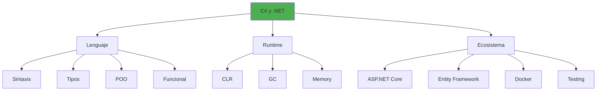
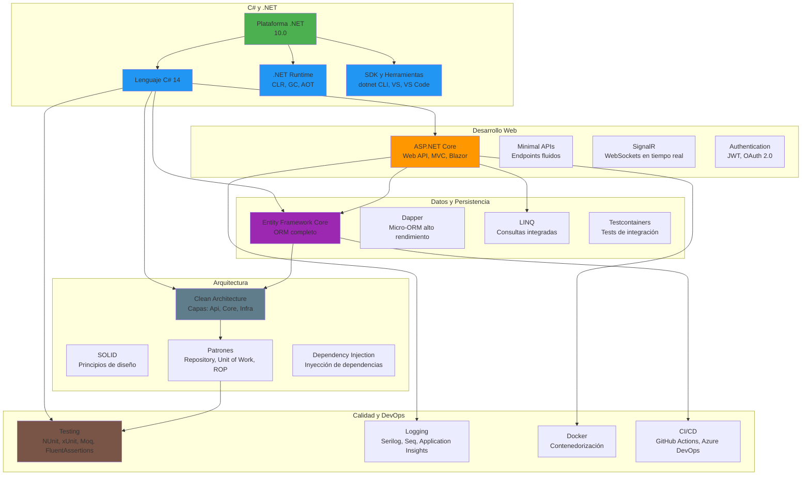

- [20. Resumen de C# y .NET](#20-resumen-de-c-y-net)
  - [20.1. Conceptos fundamentales](#201-conceptos-fundamentales)
    - [Tipos de datos](#tipos-de-datos)
    - [Colecciones](#colecciones)
    - [Programación orientada a objetos](#programación-orientada-a-objetos)
    - [Programación asíncrona](#programación-asíncrona)
    - [Programación funcional](#programación-funcional)
  - [20.2. Mapa mental del ecosistema](#202-mapa-mental-del-ecosistema)
  - [20.3. Patrones y prácticas](#203-patrones-y-prácticas)
    - [Patrones de diseño](#patrones-de-diseño)
    - [Clean Architecture](#clean-architecture)
  - [20.4. Checklist de conocimientos](#204-checklist-de-conocimientos)
    - [Fundamentos de C#](#fundamentos-de-c)
    - [ASP.NET Core](#aspnet-core)
    - [Entity Framework Core](#entity-framework-core)
    - [Testing](#testing)
    - [DevOps y Docker](#devops-y-docker)
    - [Logging y Monitoreo](#logging-y-monitoreo)
    - [Seguridad](#seguridad)

# 20. Resumen de C# y .NET

Este documento consolida los conceptos fundamentales de C# y el ecosistema .NET, sirviendo como referencia rápida y mapa de navegación.




## 20.1. Conceptos fundamentales

### Tipos de datos

```csharp
// Tipos por valor
int numero = 42;              // System.Int32
double precio = 19.99;        // System.Double
bool activo = true;           // System.Boolean
char letra = 'A';             // System.Char
decimal dinero = 99.99m;      // System.Decimal

// Tipos por referencia
string texto = "Hola";        // System.String
object objeto = new object(); // System.Object

// Nullable
int? nullableInt = null;

// Tipos especiales
DateTime fecha = DateTime.Now;
Guid id = Guid.NewGuid();
TimeSpan duracion = TimeSpan.FromHours(2);

// Enums
public enum Estado { Pendiente, Procesado, Completado }
Estado estado = Estado.Pendiente;

// Records (C# 9+)
public record User(int Id, string Name, string Email);

// Structs
public struct Point { public int X; public int Y; }
```

### Colecciones

```csharp
// Arrays
int[] numeros = { 1, 2, 3, 4, 5 };
int[] nuevo = new int[10];

// Listas
List<string> nombres = new List<string>();
nombres.Add("Juan");
nombres.Remove("Ana");

// Diccionarios
Dictionary<int, string> usuarios = new Dictionary<int, string>();
usuarios[1] = "Juan";

// LINQ
var filtrados = numeros.Where(n => n % 2 == 0);
var ordenados = numeros.OrderByDescending(n => n);
var suma = numeros.Sum();

// IAsyncEnumerable (C# 8+)
await foreach (var item in GetAsyncStream())
{
    Process(item);
}
```

### Programación orientada a objetos

```csharp
// Clases y herencia
public class Animal
{
    public string Name { get; set; }
    public virtual void Speak() => Console.WriteLine("Sonido");
}

public class Dog : Animal
{
    public override void Speak() => Console.WriteLine("Guau!");
    
    // Polimorfismo
    public void Speak(int times)
    {
        for (int i = 0; i < times; i++) Speak();
    }
}

// Interfaces
public interface IRepository<T>
{
    Task<T?> GetByIdAsync(int id);
    Task<List<T>> GetAllAsync();
}

// Abstraction
public class AnimalController : ControllerBase
{
    private readonly IAnimalService _service;

    public AnimalController(IAnimalService service) => _service = service;
}
```

### Programación asíncrona

```csharp
// async/await
public async Task<List<User>> GetUsersAsync()
{
    var users = await _repository.GetAllAsync();
    return users;
}

// Task parallel
var tasks = urls.Select(url => DownloadAsync(url));
var results = await Task.WhenAll(tasks);

// Cancellation
public async Task DownloadWithCancel(
    string url, 
    CancellationToken token)
{
    using var cts = new CancellationTokenSource(TimeSpan.FromMinutes(5));
    
    try
    {
        var response = await httpClient.GetAsync(url, cts.Token);
        return await response.Content.ReadAsStringAsync();
    }
    catch (OperationCanceledException)
    {
        return "Timeout";
    }
}
```

### Programación funcional

```csharp
// Lambdas
var cuadrados = numeros.Select(n => n * n);
var filtrados = numeros.Where(n => n > 10);

// Func y Action
Func<int, int, int> suma = (a, b) => a + b;
Action<string> mostrar = msg => Console.WriteLine(msg);

// LINQ
var resultado = numeros
    .Where(n => n % 2 == 0)
    .Select(n => n * n)
    .OrderByDescending(n => n)
    .Take(5)
    .ToList();

// Records con with (C# 9+)
public record User(int Id, string Name, string Email);
var user2 = user1 with { Name = "Ana" };
```

## 20.2. Mapa mental del ecosistema



## 20.3. Patrones y prácticas

### Patrones de diseño

```csharp
// Repository
public interface IUserRepository
{
    Task<User?> GetByIdAsync(int id);
    Task<List<User>> GetAllAsync();
    Task<User> AddAsync(User user);
    Task UpdateAsync(User user);
    Task DeleteAsync(int id);
}

// Unit of Work
public interface IUnitOfWork
{
    IUserRepository Users { get; }
    IOrderRepository Orders { get; }
    Task CommitAsync();
    Task RollbackAsync();
}

// Dependency Injection
builder.Services.AddScoped<IUserRepository, UserRepository>();
builder.Services.AddScoped<IUnitOfWork, UnitOfWork>();

// Options Pattern
builder.Services.Configure<DatabaseOptions>(
    builder.Configuration.GetSection("Database"));

// Result/ROP (Railway Oriented Programming)
public Result<User> CreateUser(string name, string email)
{
    return ValidarNombre(name)
        .Bind(n => ValidarEmail(email))
        .Bind(e => GuardarUsuario(name, email));
}
```

### Clean Architecture

```
src/
├── Api/                    # Controllers, Endpoints
├── Application/           # Casos de uso, DTOs
├── Domain/                # Entidades, reglas de negocio
└── Infrastructure/        # DB, external services
```

## 20.4. Checklist de conocimientos

### Fundamentos de C#
- [ ] Tipos de datos y conversiones
- [ ] Colecciones y LINQ
- [ ] Programación orientada a objetos
- [ ] Programación asíncrona (async/await)
- [ ] Tipos genéricos
- [ ] Null safety y nullable reference types

### ASP.NET Core
- [ ] Web APIs con controllers y minimal APIs
- [ ] Routing y atributos
- [ ] Model binding y validación
- [ ] Middleware
- [ ] Dependency Injection
- [ ] Configuration
- [ ] Health checks

### Entity Framework Core
- [ ] DbContext y DbSet
- [ ] Migraciones
- [ ] Consultas LINQ
- [ ] Relationships
- [ ] Raw SQL
- [ ] Performance (NoTracking, AsNoTracking)

### Testing
- [ ] Unit tests con NUnit/xUnit
- [ ] Mocking con Moq
- [ ] Assertions con FluentAssertions
- [ ] Integration tests
- [ ] Testcontainers

### DevOps y Docker
- [ ] Dockerfile multi-stage
- [ ] Docker Compose
- [ ] CI/CD basics
- [ ] Environment configuration

### Logging y Monitoreo
- [ ] Serilog setup
- [ ] Structured logging
- [ ] Correlation IDs
- [ ] Log sinks (Console, File, Seq)

### Seguridad
- [ ] JWT authentication
- [ ] Authorization policies
- [ ] HTTPS y headers de seguridad
- [ ] Rate limiting
- [ ] OWASP Top 10
