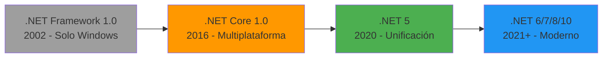
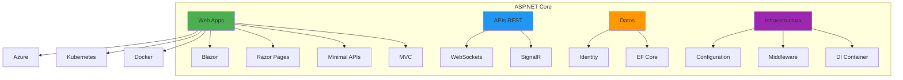
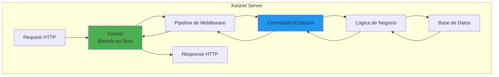
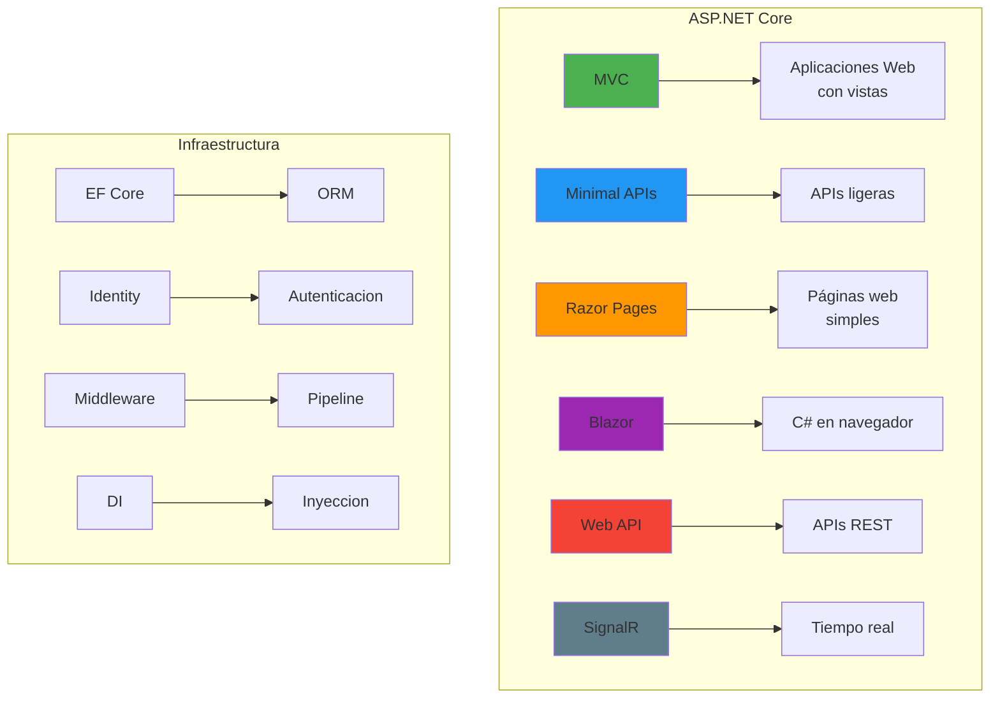
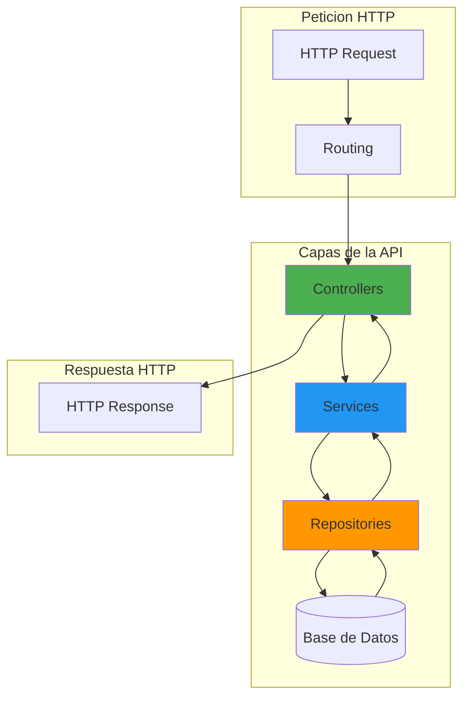
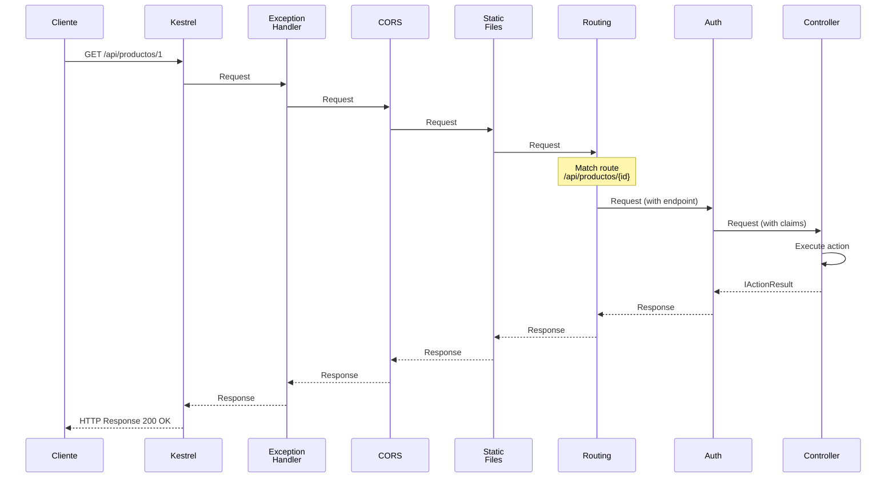
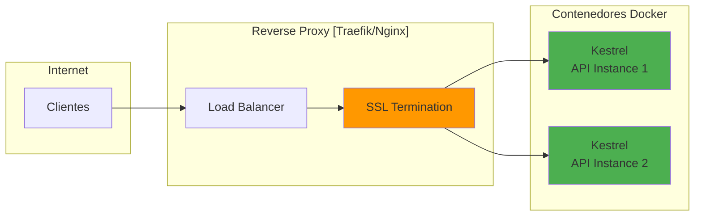
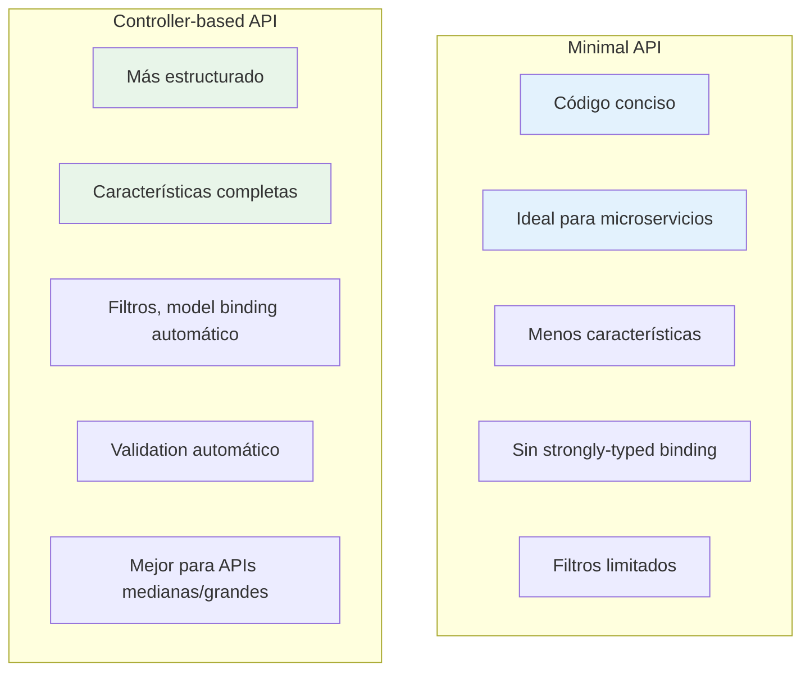
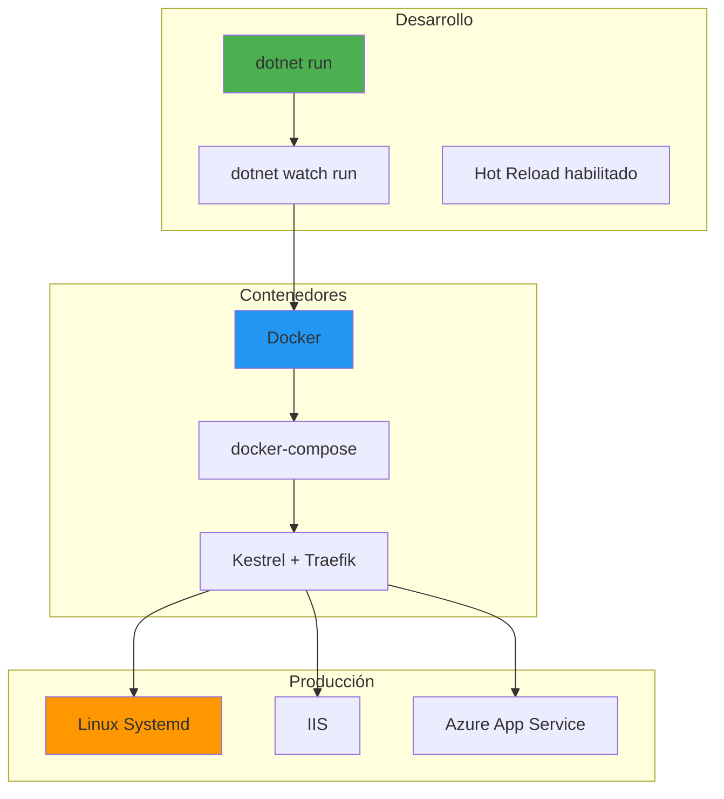

# 3. Arquitectura Global y Pipeline HTTP en ASP.NET Core

## Indice

- [3. Arquitectura Global y Pipeline HTTP en ASP.NET Core](#3-arquitectura-global-y-pipeline-http-en-aspnet-core)
  - [3.1. Fundamentos de .NET y ASP.NET Core](#31-fundamentos-de-net-y-aspnet-core)
    - [3.1.1. ¿Qué es .NET?](#311-qué-es-net)
    - [3.1.2. Evolución de .NET y ASP.NET Core](#312-evolución-de-net-y-aspnet-core)
    - [3.1.3. ¿Qué es ASP.NET Core?](#313-qué-es-aspnet-core)
  - [3.2. Características Clave de ASP.NET Core](#32-características-clave-de-aspnet-core)
    - [3.2.1. Multiplataforma y Alto Rendimiento](#321-multiplataforma-y-alto-rendimiento)
    - [3.2.2. Modularidad](#322-modularidad)
    - [3.2.3. Inyección de Dependencias Integrada](#323-inyección-de-dependencias-integrada)
    - [3.2.4. Configuración Basada en JSON](#324-configuración-basada-en-json)
    - [3.2.5. Soporte para Pruebas](#325-soporte-para-pruebas)
  - [3.3. Módulos Principales de ASP.NET Core](#33-módulos-principales-de-aspnet-core)
    - [3.3.1. ASP.NET Core MVC](#331-aspnet-core-mvc)
    - [3.3.2. ASP.NET Core Minimal APIs](#332-aspnet-core-minimal-apis)
    - [3.3.3. ASP.NET Core Razor Pages](#333-aspnet-core-razor-pages)
    - [3.3.4. ASP.NET Core Web API](#334-aspnet-core-web-api)
    - [3.3.5. Entity Framework Core (EF Core)](#335-entity-framework-core-ef-core)
    - [3.3.6. ASP.NET Core Identity](#336-aspnet-core-identity)
    - [3.3.7. SignalR](#337-signalr)
    - [3.3.8. Blazor](#338-blazor)
  - [3.4. Arquitectura de una Web API](#34-arquitectura-de-una-web-api)
    - [3.4.1. Capas de la Aplicación](#341-capas-de-la-aplicación)
    - [3.4.2. Controllers (Controladores)](#342-controllers-controladores)
    - [3.4.3. Services (Servicios)](#343-services-servicios)
    - [3.4.4. Repositories (Repositorios)](#344-repositories-repositorios)
    - [3.4.5. Models (Modelos)](#345-models-modelos)
    - [3.4.6. DTOs (Data Transfer Objects)](#346-dtos-data-transfer-objects)
  - [3.5. Pipeline HTTP de ASP.NET Core](#35-pipeline-http-de-aspnet-core)
    - [3.5.3. Orden de los Middlewares](#353-orden-de-los-middlewares)
    - [3.5.6. Middleware de Autenticación y Autorización](#356-middleware-de-autenticación-y-autorización)
  - [3.6. Kestrel como Servidor Web](#36-kestrel-como-servidor-web)
    - [3.6.1. ¿Qué es Kestrel?](#361-qué-es-kestrel)
    - [3.6.2. Configuración de Kestrel](#362-configuración-de-kestrel)
    - [3.6.3. Kestrel con Reverse Proxy](#363-kestrel-con-reverse-proxy)
  - [3.7. Program.cs: Estructura y Configuración](#37-programcs-estructura-y-configuración)
    - [3.7.1. Punto de Entrada de la Aplicación](#371-punto-de-entrada-de-la-aplicación)
    - [3.7.2. Registro de Servicios](#372-registro-de-servicios)
    - [3.7.3. Configuración del Pipeline](#373-configuración-del-pipeline)
    - [3.7.4. Minimal APIs vs Controladores](#374-minimal-apis-vs-controladores)
  - [3.8. Servicios e Inyección de Dependencias](#38-servicios-e-inyección-de-dependencias)
    - [3.8.1. Tipos de Servicios Según su Ciclo de Vida](#381-tipos-de-servicios-según-su-ciclo-de-vida)
    - [3.8.3. Inversión de Control e Inyección de Dependencias](#383-inversión-de-control-e-inyección-de-dependencias)
  - [3.9. Configuración y Options Pattern](#39-configuración-y-options-pattern)
  - [3.10. Resumen](#310-resumen)
  - [3.11. Ejercicio Propuesto](#311-ejercicio-propuesto)

---

## 3.1. Fundamentos de .NET y ASP.NET Core

### 3.1.1. ¿Qué es .NET?

**.NET** es una plataforma de desarrollo de código abierto y multiplataforma creada por Microsoft para construir diferentes tipos de aplicaciones: web, móviles, de escritorio, juegos, IoT, y más. Proporciona un entorno de ejecución común llamado **CLR (Common Language Runtime)** que gestiona la ejecución del código, junto con una biblioteca de clases base muy completa que facilita el desarrollo de aplicaciones.

🧠 **Analogía**: .NET es como un taller de herramientas muy completo. Tienes todas las herramientas que necesitas (librería de clases), un sistema de organización eficiente (CLR), y puedes construir cualquier tipo de proyecto (aplicaciones web, móviles, escritorio, etc.).

.NET incluye varios componentes fundamentales:

| Componente   | Descripción                                                       |
| ------------ | ----------------------------------------------------------------- |
| **CLR**      | Common Language Runtime - Máquina virtual que ejecuta código .NET |
| **BCL**      | Base Class Library - Biblioteca con miles de clases útiles        |
| **Roslyn**   | Compilador de C# y VB.NET                                         |
| **.NET SDK** | Herramientas de desarrollo y compilación                          |

### 3.1.2. Evolución de .NET y ASP.NET Core

La historia de .NET ha evolucionado significativamente desde su lanzamiento original, adaptándose a las necesidades cambiantes del desarrollo de software moderno.



**Hitos importantes en la evolución:**

| Año   | Versión            | Cambio Significativo                              |
| ----- | ------------------ | ------------------------------------------------- |
| 2002  | .NET Framework 1.0 | Lanzamiento inicial, solo Windows                 |
| 2016  | .NET Core 1.0      | Primera versión multiplataforma                   |
| 2019  | .NET Core 3.0      | Windows Forms y WPF multiplataforma               |
| 2020  | .NET 5             | Unificación de .NET Framework y Core              |
| 2021+ | .NET 6/7/8/10      | Versiones LTS modernas con rendimiento optimizado |

### 3.1.3. ¿Qué es ASP.NET Core?

**ASP.NET Core** es un framework de código abierto y multiplataforma para construir aplicaciones web modernas, APIs REST, aplicaciones en tiempo real con SignalR, y servicios basados en la nube. Es una reescritura completa de ASP.NET Framework, diseñada desde cero para ser modular, rápida y multiplataforma.

🧠 **Analogía**: Si .NET es el taller de herramientas, ASP.NET Core es el taller especializado en construir aplicaciones web. Tienes todas las herramientas que necesitas en un solo lugar, organizadas y listas para usar, optimizadas específicamente para la web.

**ASP.NET Core fue creado para abordar las limitaciones de ASP.NET Framework y ofrecer:**



✅ **Multiplataforma**: Funciona en Windows, Linux, macOS

✅ **Alto rendimiento**: Uno de los frameworks web más rápidos según TechEmpower Benchmarks

✅ **Modularidad**: Arquitectura basada en paquetes NuGet, solo incluyes lo que necesitas

✅ **Inyección de dependencias integrada**: DI es parte del núcleo del framework

✅ **Integración moderna**: Docker, Kubernetes, Azure, microservicios

✅ **Código abierto**: Desarrollo transparente en GitHub

📝 **Nota del Profesor**: ASP.NET Core es una reescritura completa de ASP.NET Framework, no una versión actualizada. Esto permitió eliminar deuda técnica y diseñar un framework moderno desde cero, libre de las limitaciones históricas del framework original.

## 3.2. Características Clave de ASP.NET Core

### 3.2.1. Multiplataforma y Alto Rendimiento

ASP.NET Core está optimizado para el rendimiento y puede ejecutarse en Windows, Linux y macOS. Utiliza **Kestrel**, un servidor web de alto rendimiento basado en libuv, que es capaz de manejar millones de peticiones por segundo con los recursos adecuados.



💡 **Tip del Examinador**: Kestrel es rápido pero en producción se usa detrás de un reverse proxy (Nginx, IIS) para seguridad y balanceo de carga. Esto permite terminar SSL en el proxy y distribuir peticiones entre múltiples instancias de la aplicación.

**Benchmarks de rendimiento:**

| Framework    | Peticiones por segundo (aprox.) |
| ------------ | ------------------------------- |
| ASP.NET Core | 500,000+                        |
| Node.js      | 200,000+                        |
| Go           | 400,000+                        |

*Nota: Los números varían según la configuración y hardware*

### 3.2.2. Modularidad

ASP.NET Core es modular y ligero. No incluye componentes innecesarios. Todo se instala a través de **paquetes NuGet**, lo que permite incluir solo las dependencias que tu aplicación necesita.

```xml
<!-- Solo lo que necesitas -->
<ItemGroup>
  <PackageReference Include="Microsoft.AspNetCore.Mvc" Version="10.0.0" />
  <PackageReference Include="Microsoft.EntityFrameworkCore.SqlServer" Version="10.0.0" />
  <PackageReference Include="Swashbuckle.AspNetCore" Version="6.5.0" />
</ItemGroup>
```

**Ventajas de la modularidad:**

- **Menor tamaño de aplicación**: Solo incluyes lo que usas
- **Menos vulnerabilidades**: Menos código significa menos superficie de ataque
- **Actualizaciones independientes**: Actualiza componentes sin afectar otros
- **Flexibilidad**: Elige las tecnologías que prefieres

⚠️ **Advertencia**: No instales paquetes que no uses. Cada paquete añade peso y posibles vulnerabilidades de seguridad. Revisa regularmente tus dependencias con `dotnet list package`.

### 3.2.3. Inyección de Dependencias Integrada

ASP.NET Core tiene un **contenedor de inyección de dependencias (IoC Container)** integrado de forma nativa. No necesitas bibliotecas externas como en otros frameworks. El contenedor gestiona la creación y lifetimes de los objetos.

```csharp
// Registro de servicios
builder.Services.AddScoped<IUsuarioService, UsuarioService>();
builder.Services.AddSingleton<ICacheService, CacheService>();

// Inyección automática en controladores
public class MiController : ControllerBase
{
    private readonly IUsuarioService _service;
    
    public MiController(IUsuarioService service)
    {
        _service = service;
    }
}
```

### 3.2.4. Configuración Basada en JSON

La configuración de la aplicación se gestiona a través de archivos JSON, variables de entorno, argumentos de línea de comandos, y más. El sistema de configuración es jerárquico y permite sobreescribir valores según el entorno.

```json
// appsettings.json
{
  "ConnectionStrings": {
    "DefaultConnection": "Server=localhost;Database=MiApp;Trusted_Connection=True;"
  },
  "Logging": {
    "LogLevel": {
      "Default": "Information",
      "Microsoft.AspNetCore": "Warning"
    }
  },
  "AllowedHosts": "*"
}
```

**Fuentes de configuración (en orden de precedencia):**

| Fuente                         | Precedencia | Uso                       |
| ------------------------------ | ----------- | ------------------------- |
| Variables de entorno           | 1           | Secretos en producción    |
| appsettings.json               | 2           | Configuración general     |
| appsettings.{Environment}.json | 3           | Configuración por entorno |
| Argumentos CLI                 | 4           | Override rápido           |
| Secrets de usuario             | 5           | Desarrollo local          |

### 3.2.5. Soporte para Pruebas

ASP.NET Core está diseñado para ser fácilmente testeable con frameworks como **NUnit**, **xUnit** y **MSTest**. La arquitectura basada en interfaces y la inyección de dependencias facilitan el testing unitario.

```csharp
using NUnit.Framework;
using Moq;
using FluentAssertions;

[TestFixture]
public class UsuariosControllerTests
{
    private Mock<IUsuarioRepository> _repositoryMock = null!;
    private UsuariosController _controller = null!;

    [SetUp]
    public void Setup()
    {
        _repositoryMock = new Mock<IUsuarioRepository>();
        _controller = new UsuariosController(_repositoryMock.Object);
    }

    [Test]
    public async Task GetById_ExistingUsuario_ReturnsOkResult()
    {
        // Arrange
        var usuario = new Usuario { Id = 1, Nombre = "Juan" };
        _repositoryMock.Setup(r => r.GetByIdAsync(1))
                       .ReturnsAsync(usuario);

        // Act
        var result = await _controller.GetById(1);

        // Assert
        result.Should().NotBeNull();
        result.Result.Should().BeOfType<OkObjectResult>();
        (result.Result as OkObjectResult)!.Value.Should().Be(usuario);
    }

    [Test]
    public async Task GetById_NonExistingUsuario_ReturnsNotFound()
    {
        // Arrange
        _repositoryMock.Setup(r => r.GetByIdAsync(999))
                       .ReturnsAsync((Usuario?)null);

        // Act
        var result = await _controller.GetById(999);

        // Assert
        result.Should().NotBeNull();
        result.Result.Should().BeOfType<NotFoundResult>();
    }
}
```

**Características que facilitan el testing:**

- **Interfaces para todo**: Servicios, repositorios, etc.
- **HttpContext abstractions**: Mocking de contexto HTTP
- **TestServer**: Servidor en memoria para integración
- **InMemoryDatabase**: Base de datos efímera para tests

## 3.3. Módulos Principales de ASP.NET Core



### 3.3.1. ASP.NET Core MVC

Proporciona el patrón **Modelo-Vista-Controlador (MVC)** para construir aplicaciones web con vistas HTML y APIs REST. Separa la lógica de presentación de la lógica de negocio.

```csharp
[ApiController]
[Route("api/[controller]")]
public class ProductosController : ControllerBase
{
    [HttpGet]
    public ActionResult<IEnumerable<Producto>> GetAll()
    {
        return Ok(new[] { new Producto { Id = 1, Nombre = "Laptop" } });
    }

    [HttpPost]
    public ActionResult<Producto> Create(Producto producto)
    {
        return CreatedAtAction(nameof(GetAll), new { id = producto.Id }, producto);
    }
}
```

**Cuándo usar MVC:**

- Aplicaciones web con vistas HTML
- Necesitas separación clara de responsabilidades
- Equipo grande con roles especializados
- SEO es importante

### 3.3.2. ASP.NET Core Minimal APIs

Las **Minimal APIs** permiten crear APIs RESTful con el mínimo de código, eliminando la fricción arquitectónica. Ideales para microservicios pequeños.

🧠 **Analogía**: Es como comparar un restaurante de servicio completo con un food truck. Ambos sirven comida, pero el food truck es más rápido, ligero y directo.

**¿Por qué es más rápido?**

- **Sin instanciación de clases**: MVC usa reflexión para buscar controladores; Minimal APIs usan delegados directos
- **Menos overhead**: Se salta filtros de acción y unión de modelos compleja
- **Enrutamiento optimizado**: El mapa de rutas se genera al arrancar

**Ejemplo de Minimal APIs:**

```csharp
var builder = WebApplication.CreateBuilder(args);
var app = builder.Build();

// Endpoints directos - sin controladores
app.MapGet("/api/v1/status", () => new { Status = "Online", Version = "1.0" });

app.MapGet("/api/v1/productos", () => 
{
    var productos = new[] { new { Id = 1, Nombre = "Laptop" } };
    return Results.Ok(productos);
});

app.MapPost("/api/v1/productos", (Producto producto) =>
{
    return Results.Created($"/api/v1/productos/{producto.Id}", producto);
});

app.Run();
```

**Comparativa de Flujo:**

| Fase              | ASP.NET Core MVC                    | Minimal APIs                     |
| ----------------- | ----------------------------------- | -------------------------------- |
| **Routing**       | Basado en nombres de clases/métodos | Basado en delegados directos     |
| **Instanciación** | Requiere crear objeto Controller    | Ninguna (función directa)        |
| **Metadatos**     | Carga pesada de Atributos           | Metadatos mínimos                |
| **Ideal para**    | Apps grandes con vistas             | Microservicios, alto rendimiento |

📝 **Nota del Profesor**: Para este curso usaremos **controladores MVC** ya que son más estructurados y apropiados para aprender los conceptos de APIs REST de manera didáctica.

### 3.3.3. ASP.NET Core Razor Pages

Alternativa al patrón MVC para construir páginas web de forma más simple y orientada a páginas. Cada página es autocontenida con su códigobehind.

```csharp
public class IndexModel : PageModel
{
    public string Message { get; set; } = string.Empty;

    public void OnGet()
    {
        Message = "Bienvenido a Razor Pages";
    }
}
```

**Cuándo usar Razor Pages:**

- Aplicaciones web con lógica por página
- Pages simples que no necesitan arquitectura MVC compleja
- Prototipado rápido
- Sitios web con contenido mayormente estático

### 3.3.4. ASP.NET Core Web API

Facilita la creación de **APIs RESTful** usando atributos HTTP como `[HttpGet]`, `[HttpPost]`, etc. Es el módulo que usamos en este curso para crear servicios REST.

```csharp
[ApiController]
[Route("api/[controller]")]
public class UsuariosController : ControllerBase
{
    [HttpGet("{id}")]
    public ActionResult<Usuario> GetById(int id)
    {
        return Ok(new Usuario { Id = id, Nombre = "Juan" });
    }
}
```

### 3.3.5. Entity Framework Core (EF Core)

ORM (Object-Relational Mapper) que simplifica el acceso a bases de datos mediante el mapeo de objetos C# a tablas SQL.

```csharp
public class ApplicationDbContext : DbContext
{
    public DbSet<Usuario> Usuarios { get; set; }

    protected override void OnConfiguring(DbContextOptionsBuilder optionsBuilder)
    {
        optionsBuilder.UseSqlServer("Server=localhost;Database=MiApp;Trusted_Connection=True;");
    }
}
```

### 3.3.6. ASP.NET Core Identity

Proporciona un sistema completo de **autenticación y autorización** con soporte para usuarios, roles, claims, JWT, OAuth.

```csharp
builder.Services.AddIdentity<ApplicationUser, IdentityRole>()
    .AddEntityFrameworkStores<ApplicationDbContext>()
    .AddDefaultTokenProviders();
```

### 3.3.7. SignalR

Biblioteca para agregar **comunicación en tiempo real** a las aplicaciones usando WebSockets y Server-Sent Events.

```csharp
public class ChatHub : Hub
{
    public async Task SendMessage(string user, string message)
    {
        await Clients.All.SendAsync("ReceiveMessage", user, message);
    }
}
```

### 3.3.8. Blazor

Framework para construir **aplicaciones web interactivas** usando C# en lugar de JavaScript. Puede ejecutarse en el servidor (Blazor Server) o en el cliente (Blazor WebAssembly).

## 3.4. Arquitectura de una Web API

### 3.4.1. Capas de la Aplicación

La arquitectura por capas separa responsabilidades y facilita el mantenimiento. Una API bien diseñada sigue el patrón de capas donde cada una tiene una responsabilidad específica.



**Flujo de datos:**

1. El cliente envía una **petición HTTP**
2. El **Controlador** recibe la petición y valida datos
5. La **Base de Datos** persiste o recupera información
6. La respuesta sube por las capas hasta el cliente

### 3.4.2. Controllers (Controladores)

Los **controladores** reciben las solicitudes HTTP, llaman a los servicios apropiados, y devuelven respuestas HTTP. Son el punto de entrada de la API.

```csharp
namespace MiTiendaApi.Controllers;

[ApiController]
[Route("api/[controller]")]
public class ProductosController(IProductoService productoService) : ControllerBase
{
    // GET /api/productos
    [HttpGet]
    public async Task<ActionResult<IEnumerable<Producto>>> GetAll()
    {
        var productos = await productoService.ObtenerTodosAsync();
        return Ok(productos);
    }

    // GET /api/productos/1
    [HttpGet("{id}")]
    public async Task<ActionResult<Producto>> GetById(int id)
    {
        var producto = await productoService.ObtenerPorIdAsync(id);
        return producto == null ? NotFound() : Ok(producto);
    }

    // POST /api/productos
    [HttpPost]
    public async Task<ActionResult<Producto>> Create(ProductoDto dto)
    {
        var producto = await productoService.CrearAsync(dto);
        return CreatedAtAction(nameof(GetById), new { id = producto.Id }, producto);
    }
}
```

**Responsabilidades del controlador:**

- Recibir y validar peticións HTTP
- Llamar a servicios de negocio
- Devolver respuestas HTTP apropiadas
- Manejar errores de alto nivel

### 3.4.3. Services (Servicios)

Los **servicios** encapsulan la lógica de negocio de la aplicación. Contienen las reglas y operaciones que definen cómo funciona la aplicación.

```csharp
public interface IProductoService
{
    Task<IEnumerable<Producto>> ObtenerTodosAsync();
    Task<Producto?> ObtenerPorIdAsync(int id);
    Task<Producto> CrearAsync(ProductoDto dto);
}

public class ProductoService(IProductoRepository repository, ILogger<ProductoService> logger) : IProductoService
{
    public async Task<IEnumerable<Producto>> ObtenerTodosAsync()
    {
        _logger.LogInformation("Obteniendo todos los productos");
        return await repository.GetAllAsync();
    }

    public async Task<Producto?> ObtenerPorIdAsync(int id)
    {
        _logger.LogInformation("Obteniendo producto con ID {Id}", id);
        return await repository.GetByIdAsync(id);
    }

    public async Task<Producto> CrearAsync(ProductoDto dto)
    {
        var producto = new Producto
        {
            Nombre = dto.Nombre,
            Precio = dto.Precio,
            Stock = dto.Stock,
            FechaCreacion = DateTime.UtcNow
        };
        
        await repository.AddAsync(producto);
        _logger.LogInformation("Producto {Nombre} creado", producto.Nombre);
        
        return producto;
    }
}
```

**Responsabilidades del servicio:**

- Contener logica de negocio
- Coordinar operaciones entre repositorios
- Aplicar reglas de validacion de negocio
- Manejar transacciones

### 3.4.4. Repositories (Repositorios)

Los **repositorios** abstraen el acceso a datos. Proporcionan una interfaz unificada para acceder a la base de datos, permitiendo cambiar la implementacion sin afectar las capas superiores.

```csharp
public interface IProductoRepository
{
    Task<IEnumerable<Producto>> GetAllAsync();
    Task<Producto?> GetByIdAsync(int id);
    Task AddAsync(Producto producto);
    Task UpdateAsync(Producto producto);
    Task DeleteAsync(int id);
}

public class ProductoRepository(ApplicationDbContext context) : IProductoRepository
{
    public async Task<IEnumerable<Producto>> GetAllAsync()
    {
        return await context.Productos.ToListAsync();
    }

    public async Task<Producto?> GetByIdAsync(int id)
    {
        return await context.Productos.FindAsync(id);
    }

    public async Task AddAsync(Producto producto)
    {
        await context.Productos.AddAsync(producto);
        await context.SaveChangesAsync();
    }

    public async Task UpdateAsync(Producto producto)
    {
        context.Productos.Update(producto);
        await context.SaveChangesAsync();
    }

    public async Task DeleteAsync(int id)
    {
        var producto = await context.Productos.FindAsync(id);
        if (producto != null)
        {
            context.Productos.Remove(producto);
            await context.SaveChangesAsync();
        }
    }
}
```

**Responsabilidades del repositorio:**

- Abstraer operaciones CRUD
- Ocultar detalles de la base de datos
- Proporcionar operaciones tipadas
- Manejar consultas complejas

### 3.4.5. Models (Modelos)

Los **modelos** representan las entidades de tu dominio. Son las clases que se mapean a tablas de la base de datos.

```csharp
namespace MiTiendaApi.Models;

public class Producto
{
    public int Id { get; set; }
    public string Nombre { get; set; } = string.Empty;
    public decimal Precio { get; set; }
    public int Stock { get; set; }
    public DateTime FechaCreacion { get; set; }
    public DateTime? FechaActualizacion { get; set; }
}
```

### 3.4.6. DTOs (Data Transfer Objects)

Los **DTOs** transfieren datos entre capas, ocultando detalles internos y evitando exponer la estructura completa de tus entidades.

```csharp
namespace MiTiendaApi.DTOs;

public class ProductoDto
{
    public string Nombre { get; set; } = string.Empty;
    public decimal Precio { get; set; }
    public int Stock { get; set; }
}

public class ProductoResponseDto
{
    public int Id { get; set; }
    public string Nombre { get; set; } = string.Empty;
    public decimal Precio { get; set; }
    public int Stock { get; set; }
}
```

**Ventajas de usar DTOs:**

- Ocultan estructura interna de entidades
- Previenen over-posting ( campos extra)
- Permiten renombrar propiedades sin afectar BD
- Validacion separada de la persistencia

## 3.5. Pipeline HTTP de ASP.NET Core

El pipeline HTTP es el corazón de ASP.NET Core. Es una secuencia de componentes (**middlewares**) que procesan cada petición HTTP en orden. Cada middleware puede examinar la petición, modificarla, pasarla al siguiente middleware, o incluso generar una respuesta directamente sin llegar a los controladores.

Un middleware es un componente que se ejecuta en cada petición HTTP. Piensa en él como una tubería por donde pasa la petición: cada middleware puede inspeccionarla, modificarla, o decidir que la petición no debe continuar y devolver una respuesta directamente.

Un middleware en ASP.NET Core es simplemente un delegate que recibe el contexto de la petición y el siguiente middleware en la cadena.

```csharp
// Middleware básico que mide el tiempo de ejecución
app.Use(async (context, next) =>
{
    // 1. Código antes de llamar a next (procesar request)
    var stopwatch = Stopwatch.StartNew();
    
    // 2. Llamar al siguiente middleware
    await next(context);
    
    // 3. Código después de next (procesar response)
    stopwatch.Stop();
    var elapsed = stopwatch.ElapsedMilliseconds;
    
    // Registrar tiempo solo para endpoints de API
    if (context.Request.Path.StartsWithSegments("/api"))
    {
        var logger = context.RequestServices.GetRequiredService<ILogger<TProgram>>();
        logger.LogInformation(
            "{Method} {Path} - {StatusCode} - {Elapsed}ms",
            context.Request.Method,
            context.Request.Path,
            context.Response.StatusCode,
            elapsed);
    }
});
```

**Estructura de un middleware:**

```csharp
app.Use(async (context, next) =>
{
    // FASE 1: Procesar la solicitud ANTES de pasar al siguiente middleware
    // - Leer headers, body, query parameters
    // - Modificar la solicitud si es necesario
    // - Loguear información
    
    await next(context); // Pasar al siguiente middleware
    
    // FASE 2: Procesar la respuesta DESPUÉS de que volvió el siguiente middleware
    // - Leer status code, headers de respuesta
    // - Modificar la respuesta si es necesario
    // - Loguear resultados
});
```

### 3.5.3. Orden de los Middlewares

El orden de los middlewares es crítico. Un middleware configurado antes de la autenticación no tendrá acceso a la información del usuario, mientras que uno configurado después del routing no podrá influir en qué endpoint se ejecuta.

El middleware de routing examina la URL de la petición y determina qué endpoint debe ejecutarse.

```csharp
app.UseRouting();
```

Establece las propiedades `HttpContext.Request.RouteValues` que contienen los parámetros de la ruta.

### 3.5.6. Middleware de Autenticación y Autorización

```csharp
// Configurar CORS antes de authentication
app.UseCors("AllowSpecificOrigins");

// Autenticación - valida credenciales y llena HttpContext.User
app.UseAuthentication();

// Autorización - verifica permisos
app.UseAuthorization();
```

**Flujo del pipeline:**



## 3.6. Kestrel como Servidor Web

### 3.6.1. ¿Qué es Kestrel?

Kestrel es el servidor web integrado en ASP.NET Core. Es ligero, rápido y multiplataforma, funcionando tanto en Windows como en Linux y macOS. Es el equivalente a Node.js http server o Python WSGI, pero optimizado para .NET.

**Características de Kestrel:**

- Servidor HTTP escrito en .NET
- Soporte para HTTP/1.1 y HTTP/2
- Rendimiento muy alto
- Multiplataforma
- Ligero y optimizado

### 3.6.2. Configuración de Kestrel

Puedes personalizar el comportamiento de Kestrel en Program.cs:

```csharp
using Microsoft.AspNetCore.Server.Kestrel.Core;

var builder = WebApplication.CreateBuilder(args);

builder.WebHost.ConfigureKestrel(options =>
{
    // Configurar límites de tamaño de petición

**Configuración mediante appsettings.json:**

```json
{
  "Kestrel": {
    "Endpoints": {
      "Http": {
        "Url": "http://0.0.0.0:5000"
      },
      "Https": {
        "Url": "https://0.0.0.0:5001",
        "Certificate": {
          "Path": "/etc/ssl/certs/cert.pem",
          "KeyPath": "/etc/ssl/private/key.pem"
        }
      }
    },
    "Limits": {
      "MaxRequestBodySize": 10485760,
      "KeepAliveTimeout": "00:02:00",
      "RequestHeadersTimeout": "00:00:30"
    }
  }
}
```

### 3.6.3. Kestrel con Reverse Proxy

En producción, la arquitectura típica incluye Kestrel detrás de un reverse proxy. El reverse proxy (Traefik, Nginx) maneja SSL/TLS, balanceo de carga, y protección DDoS.



**Ventajas del reverse proxy:**

- Terminación SSL centralizada
- Balanceo de carga entre instancias
- Protección DDoS
- Cacheo de respuestas estáticas
- Configuración de seguridad централизованная

## 3.7. Program.cs: Estructura y Configuración

### 3.7.1. Punto de Entrada de la Aplicación

El archivo `Program.cs` es el punto de entrada de la aplicación en ASP.NET Core. Aquí se configura la aplicación desde cero.

```csharp
var builder = WebApplication.CreateBuilder(args);

// Añadir servicios al contenedor
builder.Services.AddControllers();
builder.Services.AddEndpointsApiExplorer();
builder.Services.AddSwaggerGen();

// Configurar Kestrel
builder.WebHost.ConfigureKestrel(options =>
{
    options.ListenLocalhost(5000);
    options.ListenLocalhost(5001, listenOptions =>
    {
        listenOptions.UseHttps();
    });
});

var app = builder.Build();

// Configurar el pipeline de HTTP
if (app.Environment.IsDevelopment())
{
    app.UseSwagger();
    app.UseSwaggerUI();
}

app.UseHttpsRedirection();
app.UseAuthorization();
app.MapControllers();

app.Run();
```

### 3.7.2. Registro de Servicios

Los servicios se registran en el contenedor de DI durante la configuración de la aplicación.

```csharp
var builder = WebApplication.CreateBuilder(args);

// Servicios
builder.Services.AddScoped<IProductoService, ProductoService>();
builder.Services.AddScoped<IProductoRepository, ProductoRepository>();

// DbContext
builder.Services.AddDbContext<ApplicationDbContext>(options =>
    options.UseSqlServer(builder.Configuration.GetConnectionString("DefaultConnection")));

// Controladores
builder.Services.AddControllers()
    .AddJsonOptions(options =>
    {
        options.JsonSerializerOptions.PropertyNamingPolicy = JsonNamingPolicy.CamelCase;
    });

// Swagger/OpenAPI
builder.Services.AddEndpointsApiExplorer();
builder.Services.AddSwaggerGen();
```

### 3.7.3. Configuración del Pipeline

```csharp
var app = builder.Build();

// === 1. Manejo de excepciones (PRIMERO) ===
if (app.Environment.IsDevelopment())
{
    app.UseDeveloperExceptionPage();
}
else
{
    app.UseExceptionHandler("/error");
    app.UseHsts(); // HTTP Strict Transport Security
}

// === 2. Archivos estáticos ===
app.UseStaticFiles();

// === 3. Redirección HTTPS ===
app.UseHttpsRedirection();

// === 4. Routing ===
app.UseRouting();

// === 5. CORS ===
app.UseCors("AllowAll"); // O política específica

// === 6. Autenticación ===
app.UseAuthentication();

// === 7. Autorización ===
app.UseAuthorization();

// === 8. Endpoints ===
app.MapControllers();           // REST API
app.MapGraphQL();               // GraphQL endpoint
app.MapHub<ProductoHub>("/ws/v1/productos");  // WebSockets

app.Run();
```

### 3.7.4. Minimal APIs vs Controladores

**Minimal APIs:**

```csharp
var builder = WebApplication.CreateBuilder(args);
var app = builder.Build();

app.MapGet("/api/productos", () => Results.Ok(new { productos = new[] { "A", "B" } }));

app.MapGet("/api/productos/{id}", (int id) => 
{
    if (id == 0) return Results.NotFound();
    return Results.Ok(new { id, nombre = "Producto" });
});

app.Run();
```

**Controller-based API:**

```csharp
[ApiController]
[Route("api/[controller]")]
public class ProductosController : ControllerBase
{
    private readonly IProductoService _service;
    
    public ProductosController(IProductoService service)
    {
        _service = service;
    }
    
    [HttpGet]
    public async Task<IActionResult> GetAll()
    {
        var productos = await _service.GetAllAsync();
        return Ok(productos);
    }
    
    [HttpGet("{id}")]
    public async Task<IActionResult> GetById(long id)
    {
        var resultado = await _service.GetByIdAsync(id);
        return resultado.Match(Ok, NotFound);
    }
}
```

**Comparación:**



## 3.8. Servicios e Inyección de Dependencias

### 3.8.1. Tipos de Servicios Según su Ciclo de Vida

Los servicios registrados en el contenedor de DI pueden tener diferentes ciclos de vida que determinan cuándo se crean y destruyen sus instancias.

```mermaid
flowchart TD
    A[Registro de Servicios] --> B[Transient]
    A --> C[Scoped]
    A --> D[Singleton]
    
    B --> B1[Nueva instancia<br/>cada solicitud]
    C --> C1[Una instancia<br/>por petición HTTP]

// Scoped - una vez por petición HTTP
builder.Services.AddScoped<IRepositorio, UsuarioRepositorio>();

// Singleton - una vez para toda la app
builder.Services.AddSingleton<ICacheService, CacheService>();
```

### 3.8.3. Inversión de Control e Inyección de Dependencias

**Inversión de Control (IoC)** es un principio donde el **framework** controla la creación y gestión de objetos, en lugar del código de la aplicación.

🧠 **Analogía**: En lugar de construir tu propio coche pieza por pieza cada vez que necesitas viajar, usas un servicio de taxi. Alguien más (el framework) se encarga de mantener el coche.

**Inyección de Dependencias (DI)** es una técnica que implementa IoC. Las dependencias se **inyectan** por el framework, no se crean dentro de la clase.

**Ventajas de DI:**

✅ **Desacoplamiento**: Las clases no dependen de implementaciones concretas

✅ **Testabilidad**: Puedes sustituir dependencias por mocks en tests

✅ **Mantenibilidad**: Cambios en dependencias no afectan a las clases que las usan

✅ **Reutilización**: El mismo servicio puede usarse en múltiples lugares

**Ejemplo sin DI (acoplamiento fuerte):**

```csharp
public class UsuarioController
{
    private readonly UsuarioService _usuarioService;

    public UsuarioController()
    {
        // Acoplamiento fuerte - imposible de testear
        _usuarioService = new UsuarioService(new ApplicationDbContext());
    }
}
```

**Ejemplo con DI (acoplamiento débil):**

```csharp
public class UsuarioController
{
    private readonly IUsuarioService _usuarioService;

    // La dependencia se inyecta - facilmente testable
    public UsuarioController(IUsuarioService usuarioService)
    {
        _usuarioService = usuarioService;
    }
}
```

💡 **Tip del Examinador**: En entrevistas, explica siempre que usas DI porque permite testing unitario fácil y desacoplamiento.

## 3.9. Configuración y Options Pattern

**Usando IConfiguration directamente:**

```csharp
var builder = WebApplication.CreateBuilder(args);

var connectionString = builder.Configuration.GetConnectionString("DefaultConnection");
var apiKey = builder.Configuration["ApiKey"];

Console.WriteLine($"Connection: {connectionString}");
Console.WriteLine($"API Key: {apiKey}");
```

**Usando el patrón Options (recomendado):**

```csharp
// Clase de configuración
public class MiConfiguracion
{
    public string ApiKey { get; set; } = string.Empty;
    public int Timeout { get; set; }
    public ConnectionStringsConfig ConnectionStrings { get; set; } = new();
}

public class ConnectionStringsConfig
{
    public string DefaultConnection { get; set; } = string.Empty;
}

// Registro
builder.Services.Configure<MiConfiguracion>(builder.Configuration.GetSection("MiConfiguracion"));

// Uso en un servicio
public class MiServicio
{
    private readonly MiConfiguracion _config;

    public MiServicio(IOptions<MiConfiguracion> config)
    {
        _config = config.Value;
    }

    public void Ejecutar()
    {
        Console.WriteLine($"API Key: {_config.ApiKey}");
        Console.WriteLine($"Timeout: {_config.Timeout}");
    }
}
```

**appsettings.json:**

```json
{
  "ConnectionStrings": {
    "DefaultConnection": "Server=localhost;Database=MiApp;Trusted_Connection=True;"
  },
  "MiConfiguracion": {
    "ApiKey": "clave-secreta-12345",
    "Timeout": 30
  },
  "Logging": {
    "LogLevel": {
      "Default": "Information"
    }
  }
}
```

## 3.10. Resumen

1. **ASP.NET Core** es un framework multiplataforma y de alto rendimiento para web y APIs

2. **Características clave**: modularidad, DI integrado, configuración JSON, middleware pipeline

3. **Módulos principales**: MVC, Minimal APIs, Razor Pages, Blazor, EF Core, Identity, SignalR

4. **Arquitectura por capas**: Controllers → Services → Repositories → Base de datos

5. **Pipeline HTTP**: Serie de middlewares que procesan cada request/response en orden

6. **Kestrel**: Servidor web ligero y rápido, puede usarse detrás de reverse proxy en producción

7. **Ciclos de vida**: Transient (por solicitud), Scoped (por HTTP), Singleton (por app)

8. **Inversión de Control**: El framework controla la creación de objetos

9. **Inyección de Dependencias**: Las dependencias se pasan al constructor, no se crean internamente

10. **Options Pattern**: Configuración tipada y fuertemente tipada



## 3.11. Ejercicio Propuesto

**Objetivo:** Investigar sobre proyectos y servicios que usen **ASP.NET Core**.

**Tareas:**

1. Identifica al menos **3 proyectos o empresas** que usen ASP.NET Core

2. Para cada proyecto, investiga y documenta:
   - ¿En qué partes de su arquitectura usan ASP.NET Core?
   - ¿Qué módulos o bibliotecas utilizan?
   - ¿Qué ventajas les proporciona?

**Tabla de investigación:**

| Proyecto/Empresa | Uso de ASP.NET Core | Módulos Utilizados  | Ventajas Obtenidas                 |
| :--------------- | :------------------ | :------------------ | :--------------------------------- |
| Stack Overflow   | API REST backend    | MVC, Dapper, Redis  | Alto rendimiento, escalabilidad    |
| Azure Portal     | Microservicios      | Web API, SignalR    | Multiplataforma, integración Azure |
| Microsoft Docs   | Documentación       | Razor Pages, Blazor | Rendimiento, SEO                   |

**Criterios de Evaluación:**

✅ Identifica correctamente los módulos de ASP.NET Core

✅ Relaciona casos de uso reales con ventajas del framework

✅ Presentación clara y organizada

✅ Incluye ejemplos de código si es posible

**Ejercicio Adicional - Crear tu primera API:**

1. Crea un proyecto con `dotnet new webapi`
2. Identifica cada parte del Program.cs
3. Añade un endpoint simple que devuelva un mensaje
4. Configura el pipeline de middlewares
5. Ejecuta y prueba con Swagger
