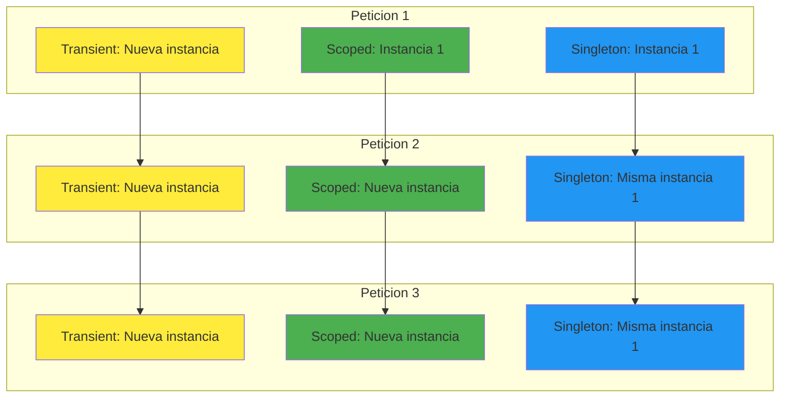
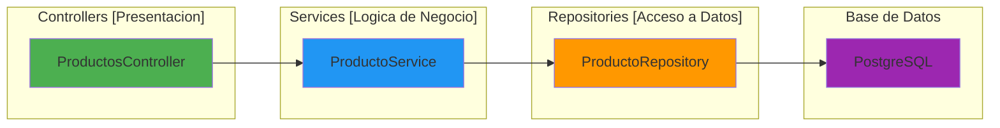
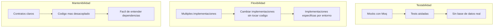
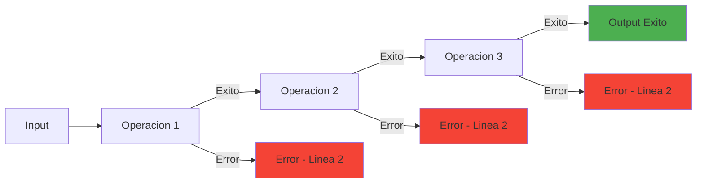

# 4. Inyección de Dependencias y Servicios en ASP.NET Core

## Indice

- [4. Inyección de Dependencias y Servicios en ASP.NET Core](#4-inyección-de-dependencias-y-servicios-en-aspnet-core)
  - [4.1. Fundamentos de la Inyección de Dependencias](#41-fundamentos-de-la-inyección-de-dependencias)
    - [4.1.1. ¿Qué es la Inyección de Dependencias?](#411-qué-es-la-inyección-de-dependencias)
    - [4.1.2. El Problema sin Inyección de Dependencias](#412-el-problema-sin-inyección-de-dependencias)
    - [4.1.3. La Solución con Inyección de Dependencias](#413-la-solución-con-inyección-de-dependencias)
    - [4.1.4. Beneficios de la Inyección de Dependencias](#414-beneficios-de-la-inyección-de-dependencias)
  - [4.2. Tiempos de Vida de los Servicios](#42-tiempos-de-vida-de-los-servicios)
    - [4.2.1. Los Tres Tiempos de Vida](#421-los-tres-tiempos-de-vida)
    - [4.2.2. Comparación Visual de Tiempos de Vida](#422-comparación-visual-de-tiempos-de-vida)
    - [4.2.3. Registro de Servicios con Diferentes Tiempos de Vida](#423-registro-de-servicios-con-diferentes-tiempos-de-vida)
    - [4.2.4. Errores Comunes con Tiempos de Vida](#424-errores-comunes-con-tiempos-de-vida)
  - [4.3. Constructores Primarios de C# 14](#43-constructores-primarios-de-c-14)
    - [4.3.1. Constructor Tradicional vs Constructor Primario](#431-constructor-tradicional-vs-constructor-primario)
    - [4.3.2. Versión Más Concisa](#432-versión-más-concisa)
    - [4.3.3. Constructores Primarios en Controladores](#433-constructores-primarios-en-controladores)
    - [4.3.4. Herencia con Constructores Primarios](#434-herencia-con-constructores-primarios)
    - [4.3.5. Constructores Primarios con Propiedades Adicionales](#435-constructores-primarios-con-propiedades-adicionales)
  - [4.4. Arquitectura de Servicios](#44-arquitectura-de-servicios)
    - [4.4.1. Capas de la Aplicación](#441-capas-de-la-aplicación)
    - [4.4.2. Responsabilidades de Cada Capa](#442-responsabilidades-de-cada-capa)
    - [4.4.3. Estructura de Carpetas Recomendada](#443-estructura-de-carpetas-recomendada)
    - [4.4.4. Flujo de Dependencias Entre Capas](#444-flujo-de-dependencias-entre-capas)
  - [4.5. Interfaces y Abstracciones](#45-interfaces-y-abstracciones)
    - [4.5.1. Definición de Interfaces](#451-definición-de-interfaces)
    - [4.5.2. Implementación de Interfaces](#452-implementación-de-interfaces)
    - [4.5.3. Beneficios de Usar Interfaces](#453-beneficios-de-usar-interfaces)
  - [4.6. Registro de Servicios en Program.cs](#46-registro-de-servicios-en-programcs)
    - [4.6.1. Registro Básico de Servicios](#461-registro-básico-de-servicios)
    - [4.6.2. Métodos de Extensión para Organizar el Registro](#462-métodos-de-extensión-para-organizar-el-registro)
    - [4.6.3. Registro Condicional](#463-registro-condicional)
    - [4.6.4. Registro con Fábricas](#464-registro-con-fábricas)
    - [4.6.5. Open Generics](#465-open-generics)
  - [4.7. Manejo de Excepciones y Errores](#47-manejo-de-excepciones-y-errores)
    - [4.7.1. Excepciones Personalizadas del Dominio](#471-excepciones-personalizadas-del-dominio)
    - [4.7.2. Middleware de Manejo Global de Excepciones](#472-middleware-de-manejo-global-de-excepciones)
    - [4.7.3. Problem Details (RFC 7807)](#473-problem-details-rfc-7807)
  - [4.8. Railway Oriented Programming (ROP) con Result](#48-railway-oriented-programming-rop-con-result)
    - [4.8.1. ¿Qué es Railway Oriented Programming?](#481-qué-es-railway-oriented-programming)
    - [4.8.2. Errores de Dominio Tipados](#482-errores-de-dominio-tipados)
    - [4.8.3. Tipos de Result con Error Tipado](#483-tipos-de-result-con-error-tipado)
    - [4.8.4. Implementación con Result en Servicios](#484-implementación-con-result-en-servicios)
    - [4.8.5. Comparación: Excepciones vs Result](#485-comparación-excepciones-vs-result)
  - [4.9. Caché en ASP.NET Core](#49-caché-en-aspnet-core)
    - [4.9.1. IMemoryCache (Caché en Memoria)](#491-imemorycache-caché-en-memoria)
    - [4.9.2. IDistributedCache (Redis, SQL Server)](#492-idistributedcache-redis-sql-server)
    - [4.9.3. Comparación: IMemoryCache vs IDistributedCache](#493-comparación-imemorycache-vs-idistributedcache)
  - [4.10. Resumen](#410-resumen)
  - [4.11. Ejercicio Propuesto](#411-ejercicio-propuesto)

---

## 4.1. Fundamentos de la Inyección de Dependencias

### 4.1.1. ¿Qué es la Inyección de Dependencias?

La **inyección de dependencias (DI)** es un patrón de diseño donde un objeto no crea sus propias dependencias, sino que las recibe desde el exterior. En ASP.NET Core, DI es el patrón arquitectónico más importante. Es el mecanismo que permite que tus controladores y servicios reciban sus dependencias (repositorios, loggers, servicios externos) en lugar de crearlas internamente.

🧠 **Analogía**: En un restaurante, el mesero (controlador) toma tu pedido, el chef (servicio) prepara la comida siguiendo la receta (lógica de negocio), y el almacenista (repositorio) trae los ingredientes (datos). Cada uno tiene una responsabilidad clara y recibe los materiales que necesita de otros, en lugar de fabricarlos él mismo.

Este patrón facilita el **testing** (puedes pasar mocks en lugar de implementaciones reales), el **mantenimiento** (puedes cambiar implementaciones sin modificar el código consumidor), y la **evolución** del código (puedes añadir nuevas funcionalidades sin afectar las existentes).

### 4.1.2. El Problema sin Inyección de Dependencias

Imagina que tienes un servicio de productos que necesita un repositorio, un logger, y un servicio de caché. Sin DI, el código se vería así: el servicio crearía sus dependencias internamente usando `new`, lo que acopla el código a implementaciones concretas, hace imposible cambiar la implementación sin modificar el servicio, y dificulta el testing porque no puedes substituir las dependencias.

```csharp
// PROBLEMA: Acoplamiento fuerte
public class ProductoService
{
    private readonly ProductoRepository _repository;
    private readonly Logger<ProductoService> _logger;
    private readonly RedisCacheService _cache;
    
    public ProductoService()
    {
        // El servicio crea sus propias dependencias
        _repository = new ProductoRepository("connection string");
        _logger = new Logger<ProductoService>();
        _cache = new RedisCacheService("redis connection");
    }
    
    public async Task<Producto> GetByIdAsync(long id)
    {
        _logger.LogInformation("Buscando producto {Id}", id);
        
        // Si necesitas cambiar la implementación, debes modificar esta clase
        var producto = await _repository.FindByIdAsync(id);
        return producto;
    }
}
```

**Problemas de este enfoque:**

❌ **Acoplamiento fuerte**: El servicio conoce las implementaciones concretas

❌ **Difícil testing**: No puedes substituir dependencias con mocks

❌ **Código frágil**: Cambios en las dependencias requieren cambios en el servicio

❌ **Duplicación**: Cada servicio que necesita Repository crea uno nuevo

### 4.1.3. La Solución con Inyección de Dependencias

Con DI, el servicio declara sus dependencias en el constructor, y el framework se encarga de proporcionar las instancias. El servicio no sabe ni le importa cómo se crean las dependencias, solo sabe que las recibirá.

```csharp
// SOLUCIÓN: Dependencias inyectadas
public class ProductoService
{
    private readonly IProductoRepository _repository;
    private readonly ILogger<ProductoService> _logger;
    private readonly ICacheService _cache;
    
    // Las dependencias se reciben en el constructor
    public ProductoService(
        IProductoRepository repository,
        ILogger<ProductoService> logger,
        ICacheService cache)
    {
        _repository = repository;
        _logger = logger;
        _cache = cache;
    }
    
    public async Task<Producto> GetByIdAsync(long id)
    {
        _logger.LogInformation("Buscando producto {Id}", id);
        
        // El servicio usa las dependencias sin saber cómo fueron creadas
        var cached = await _cache.GetAsync($"producto_{id}");
        if (cached != null) return cached;
        
        var producto = await _repository.FindByIdAsync(id);
        await _cache.SetAsync($"producto_{id}", producto);
        
        return producto;
    }
}
```

**Ventajas de este enfoque:**

✅ **Desacoplamiento**: El servicio solo conoce interfaces, no implementaciones

✅ **Testabilidad**: Puedes pasar mocks en los tests

✅ **Flexibilidad**: Cambiar implementaciones sin modificar el código

✅ **Reutilización**: La misma implementación se comparte entre servicios

### 4.1.4. Beneficios de la Inyección de Dependencias

```mermaid
flowchart TB
    subgraph "Desacoplamiento"
        A1["Servicios no conocen implementaciones"]
        A2["Cambios localizados"]
        A3["Interfaces definen contratos"]
    end
    
    subgraph "Testabilidad"
        B1["Mocks/Stubs fácilmente"]
        B2["Tests aisladas"]
        B3["Sin base de datos real"]
    end
    
    subgraph "Mantenibilidad"
        C1["Código más limpio"]
        C2["Fácil de entender"]
        C3["Cambios seguros"]
    end
    
    subgraph "Flexibilidad"
        D1["Implementaciones intercambiables"]
        D2["Multiple implementations"]
        D3["Configurable por entorno"]
    end
    
    A1 --> A2 --> A3
    B1 --> B2 --> B3
    C1 --> C2 --> C3
    D1 --> D2 --> D3
```



| Beneficio | Descripción |
|-----------|-------------|
| **Desacoplamiento** | Los servicios no dependen de implementaciones concretas |
| **Testabilidad** | Se pueden crear tests unitarios con mocks |
| **Mantenibilidad** | Código más limpio y fácil de entender |
| **Flexibilidad** | Distintas implementaciones según el entorno |
| **Reutilización** | Compartir implementaciones entre servicios |

## 4.2. Tiempos de Vida de los Servicios

### 4.2.1. Los Tres Tiempos de Vida

En ASP.NET Core, cada servicio registrado en el contenedor DI tiene un **tiempo de vida** que determina cuándo se crea y cuándo se destruye la instancia. Elegir el tiempo de vida correcto es crucial para el funcionamiento correcto de tu aplicación y para evitar bugs sutiles relacionados con el estado compartido.

**Transient** crea una nueva instancia cada vez que el servicio es solicitado. Es ideal para servicios ligeros, sin estado, que deben ser independientes entre peticiones. Si solicitas el servicio dos veces en la misma petición, получишь dos instancias diferentes.

**Scoped** crea una nueva instancia una vez por petición HTTP. Todos los servicios Scoped dentro de la misma petición comparten la misma instancia. Es el tiempo de vida más común para servicios de negocio, DbContext, y cualquier cosa que deba ser específica de la petición actual.

**Singleton** crea una única instancia que se reutiliza durante toda la vida de la aplicación. Todos los usuarios y todas las peticiones comparten la misma instancia. Solo debe usarse para servicios verdaderamente globales como configuración, logging, o servicios de caché en memoria.

### 4.2.2. Comparación Visual de Tiempos de Vida



### 4.2.3. Registro de Servicios con Diferentes Tiempos de Vida

```csharp
var builder = WebApplication.CreateBuilder(args);

// === TRANSIENT ===
// Creado cada vez que se solicita
// Útil para servicios ligeros, sin estado
builder.Services.AddTransient<IEmailService, EmailService>();
builder.Services.AddTransient<IDtoValidator<ProductoDto>, ProductoValidator>();

// === SCOPED ===
// Creado una vez por petición HTTP

// Creado una vez y reutilizado
// Para servicios verdaderamente globales
builder.Services.AddSingleton<ILoggerFactory, LoggerFactory>();
builder.Services.AddSingleton<IConfiguration>(builder.Configuration);

// Cache en memoria puede ser singleton
builder.Services.AddMemoryCache();

// Redis connection manager es singleton
builder.Services.AddSingleton<IConnectionMultiplexer>(sp =>
{
    var configuration = sp.GetRequiredService<IConfiguration>();
    var connectionString = configuration.GetConnectionString("Redis");
    return ConnectionMultiplexer.Connect(connectionString);
});
```

| Tiempo de Vida | Cuando Usarlo | Ejemplos |
|----------------|---------------|----------|
| **Transient** | Servicios ligeros, sin estado | Validadores, transformadores |
| **Scoped** | Por petición HTTP, con estado | DbContext, Repositorios, Servicios |

Si registras DbContext como Singleton, múltiples peticiones compartirán la misma instancia, causando condiciones de carrera y errores de concurrencia:

```csharp
// ❌ INCORRECTO - DbContext no es thread-safe
builder.Services.AddSingleton<TiendaDbContext>();

// ✅ CORRECTO - DbContext debe ser Scoped
builder.Services.AddScoped<TiendaDbContext>();
```

**Error 2: Capturar Scope en Singleton**

Un servicio Singleton no debe inyectar servicios Scoped porque vivirían más tiempo que el scope que los creó:

```csharp
// ❌ INCORRECTO - Scoped dentro de Singleton
public class SingletonService
{
    private readonly TiendaDbContext _context;
    
    public SingletonService(TiendaDbContext context)  // Error!
    {
        _context = context;
    }
}

builder.Services.AddSingleton<SingletonService>();
builder.Services.AddScoped<TiendaDbContext>();

// ✅ CORRECTO - Usar IServiceScopeFactory
public class SingletonService
{
    private readonly IServiceScopeFactory _scopeFactory;
    
    public SingletonService(IServiceScopeFactory scopeFactory)
    {
        _scopeFactory = scopeFactory;
    }
    
    public void DoWork()
    {
        using var scope = _scopeFactory.CreateScope();
        var context = scope.ServiceProvider.GetRequiredService<TiendaDbContext>();
        // Usar context...
    }
}
```

📝 **Nota del Profesor**: El error más común es inyectar DbContext en un servicio Singleton. Recuerde: DbContext representa una unidad de trabajo y debe ser específico de cada petición HTTP.

## 4.3. Constructores Primarios de C# 14

### 4.3.1. Constructor Tradicional vs Constructor Primario

Los **constructores primarios** son una característica de C# 14 que elimina el boilerplate de los constructores tradicionales. En lugar de declarar campos privados y asignarlos en el constructor, las dependencias se declaran directamente en la firma de la clase.

```csharp
// Constructor tradicional (C# 12 y anteriores)
public class ProductoService : IProductoService
{
    private readonly IProductoRepository _repository;
    private readonly ILogger<ProductoService> _logger;
    private readonly ICacheService _cache;
    private readonly IMapper _mapper;

    public ProductoService(
        IProductoRepository repository,
        ILogger<ProductoService> logger,
        ICacheService cache,
        IMapper mapper)
    {
        _repository = repository;
        _logger = logger;
        _cache = cache;
        _mapper = mapper;
    }
    
    public async Task<ProductoDto> GetByIdAsync(long id)
    {
        _logger.LogInformation("Buscando producto {Id}", id);
        var producto = await _repository.FindByIdAsync(id);
        return _mapper.Map<ProductoDto>(producto);
    }
}
```

```csharp
// Constructor primario (C# 14)
public class ProductoService(
    IProductoRepository repository,
    ILogger<ProductoService> logger,
    ICacheService cache,
    IMapper mapper) : IProductoService
{
    private readonly IProductoRepository _repository = repository;
    private readonly ILogger<ProductoService> _logger = logger;
    private readonly ICacheService _cache = cache;
    private readonly IMapper _mapper = mapper;

    public async Task<ProductoDto> GetByIdAsync(long id)
    {
        _logger.LogInformation("Buscando producto {Id}", id);
        var producto = await _repository.FindByIdAsync(id);
        return _mapper.Map<ProductoDto>(producto);
    }
}
```

### 4.3.2. Versión Más Concisa

En C# 14, los parámetros del constructor primario son automáticamente accesibles como campos readonly, sin necesidad de declararlos explícitamente:

```csharp
// Constructor primario ultra-conciso (C# 14)
public class ProductoService(
    IProductoRepository repository,
    ILogger<ProductoService> logger,
    ICacheService cache,
    IMapper mapper) : IProductoService
{
    // Los parámetros son automáticamente campos con el mismo nombre
    // No necesitas declararlos como private readonly

    public async Task<ProductoDto> GetByIdAsync(long id)
    {
        logger.LogInformation("Buscando producto {Id}", id);
        var producto = await repository.FindByIdAsync(id);
        return mapper.Map<ProductoDto>(producto);
    }
}
```

### 4.3.3. Constructores Primarios en Controladores

Los controladores también se benefician de los constructores primarios:

```csharp
// Constructor tradicional
public class ProductosController : ControllerBase
{
    private readonly IProductoService _productoService;
    private readonly ICategoriaService _categoriaService;
    private readonly ILogger<ProductosController> _logger;

    public ProductosController(
        IProductoService productoService,
        ICategoriaService categoriaService,
        ILogger<ProductosController> logger)
    {
        _productoService = productoService;
        _categoriaService = categoriaService;
        _logger = logger;
    }

    [HttpGet]
    public async Task<IActionResult> GetAll()
    {
        _logger.LogInformation("Obteniendo todos los productos");
        var productos = await _productoService.GetAllAsync();
        return Ok(productos);
    }
}
```

```csharp
// Constructor primario
public class ProductosController(
    IProductoService productoService,
    ICategoriaService categoriaService,
    ILogger<ProductosController> logger) : ControllerBase
{
    [HttpGet]
    public async Task<IActionResult> GetAll()
    {
        logger.LogInformation("Obteniendo todos los productos");
        var productos = await productoService.GetAllAsync();
        return Ok(productos);
    }
}
```

### 4.3.4. Herencia con Constructores Primarios

Cuando una clase hereda de otra con constructor primario, debes llamar explícitamente al constructor base:

```csharp
public abstract class ServiceBase
{
    protected readonly ILogger _logger;

    protected ServiceBase(ILogger logger)
    {
        _logger = logger;
    }
}

// La clase derivada debe llamar al constructor base
public class ProductoService(
    IProductoRepository repository,
    ILogger<ProductoService> logger) : ServiceBase(logger)
{
    private readonly IProductoRepository _repository = repository;
    
    public async Task<Producto> GetByIdAsync(long id)
    {
        _logger.LogInformation("Buscando producto {Id}", id);
        return await _repository.FindByIdAsync(id);
    }
}
```

### 4.3.5. Constructores Primarios con Propiedades Adicionales

Si necesitas propiedades adicionales que no son dependencias, puedes declararlas normalmente:

```csharp
public class ProductoService(
    IProductoRepository repository,
    ILogger<ProductoService> logger,
    ICacheService cache) : IProductoService
{
    // Dependencia del constructor primario
    private readonly IProductoRepository _repository = repository;
    
    // Propiedad adicional (configuración)
    private readonly bool _useCache;
    
    // Inicialización en el cuerpo del constructor
    public ProductoService(
        IProductoRepository repository,
        ILogger<ProductoService> logger,
        ICacheService cache,
        bool useCache) : this(repository, logger, cache)
    {
        _useCache = useCache;
    }
    
    public async Task<Producto> GetByIdAsync(long id)
    {
        logger.LogInformation("Buscando producto {Id}", id);
        
        if (_useCache)
        {
            var cached = await cache.GetAsync($"producto_{id}");
            if (cached != null) return cached;
        }
        
        var producto = await _repository.FindByIdAsync(id);
        return producto;
    }
}
```

💡 **Tip del Examinador**: Los constructores primarios hacen el código más limpio y legible. En tus proyectos, usa constructores primarios para todas las clases que reciben dependencias.

## 4.4. Arquitectura de Servicios

### 4.4.1. Capas de la Aplicación

Un **servicio** encapsula la lógica de negocio de nuestra aplicación, aplicando el **Principio de Responsabilidad Única (SRP)**.

```mermaid
flowchart TD
    subgraph "Flujo de una petición"
    
| **Controller** | Procesar peticiones HTTP, delegar al servicio | Validar modelo, llamar servicio |
| **Servicio** | Lógica de negocio, validaciones, reglas | Calcular precio, verificar stock |
| **Repositorio** | Acceso a datos abstracto | CRUD en base de datos |

### 4.4.3. Estructura de Carpetas Recomendada

```
MiApi.Core/
├── Interfaces/
│   ├── IServices/
│   │   ├── IProductoService.cs
│   │   └── IUsuarioService.cs
│   ├── IRepositories/
│   │   ├── IProductoRepository.cs
│   │   └── IUsuarioRepository.cs
│   └── IInfrastructure/
│       ├── IEmailService.cs
│       └── ICacheService.cs
│
├── Services/
│   ├── ProductoService.cs
│   └── UsuarioService.cs
│
├── Repositories/
│   ├── ProductoRepository.cs
│   └── UsuarioRepository.cs
│
├── Models/
│   ├── Producto.cs
│   └── Usuario.cs
│
└── Dtos/
    ├── ProductoDto.cs
    └── UsuarioDto.cs
```

### 4.4.4. Flujo de Dependencias Entre Capas



## 4.5. Interfaces y Abstracciones

### 4.5.1. Definición de Interfaces

Las interfaces definen contratos que las implementaciones deben cumplir. Usar interfaces permite fácilmente substituir implementaciones, facilita el testing con mocks, y desacopla el código de dependencias concretas.

```csharp
// IProductoService.cs - Contrato para el servicio de productos
namespace MiApi.Core.Interfaces;

public interface IProductoService
{
    Task<Producto?> GetByIdAsync(int id);
    Task<IEnumerable<Producto>> GetAllAsync();
    Task<Producto> CreateAsync(CreateProductoDto dto);
    Task<Producto?> UpdateAsync(int id, UpdateProductoDto dto);
    Task<bool> DeleteAsync(int id);
}
```

```csharp
// IProductoRepository.cs - Contrato para el repositorio de productos
namespace MiApi.Core.Interfaces;

public interface IProductoRepository
{
    Task<Producto?> GetByIdAsync(int id);
    Task<IEnumerable<Producto>> GetAllAsync();
    Task<Producto> AddAsync(Producto producto);
    Task UpdateAsync(Producto producto);
    Task DeleteAsync(int id);
    Task<bool> ExistsAsync(int id);
}
```

### 4.5.2. Implementación de Interfaces

```csharp
// ProductoService.cs - Implementación del servicio
public class ProductoService(
    IProductoRepository repository,
    ILogger<ProductoService> logger) : IProductoService
{
    public async Task<Producto?> GetByIdAsync(int id)
    {
        logger.LogInformation("Buscando producto {Id}", id);
        
        var producto = await repository.GetByIdAsync(id);
        if (producto == null)
            logger.LogWarning("Producto {Id} no encontrado", id);
        
        return producto;
    }
    
    public async Task<IEnumerable<Producto>> GetAllAsync()
    {
        logger.LogInformation("Obteniendo todos los productos");
        return await repository.GetAllAsync();
    }
    
    public async Task<Producto> CreateAsync(CreateProductoDto dto)
    {
        if (dto.Precio <= 0)
            throw new ValidationException("El precio debe ser mayor que cero");
        
        var producto = new Producto
        {
            Nombre = dto.Nombre,
            Precio = dto.Precio,
            Stock = dto.Stock,
            Categoria = dto.Categoria,
            FechaCreacion = DateTime.UtcNow
        };
        
        await repository.AddAsync(producto);
        logger.LogInformation("Producto {Nombre} creado", producto.Nombre);
        
        return producto;
    }
    
    // Resto de métodos...
}
```

### 4.5.3. Beneficios de Usar Interfaces



## 4.6. Registro de Servicios en Program.cs

### 4.6.1. Registro Básico de Servicios

```csharp
var builder = WebApplication.CreateBuilder(args);

// Registrar servicios uno por uno
builder.Services.AddScoped<IProductoRepository, ProductoRepository>();
builder.Services.AddScoped<ICategoriaRepository, CategoriaRepository>();
builder.Services.AddScoped<IPedidoRepository, PedidoRepository>();

builder.Services.AddScoped<IProductoService, ProductoService>();
builder.Services.AddScoped<ICategoriaService, CategoriaService>();
builder.Services.AddScoped<IPedidosService, PedidosService>();
```

### 4.6.2. Métodos de Extensión para Organizar el Registro

En lugar de acumular todo en Program.cs, es recomendable crear métodos de extensión que agrupen el registro por módulo funcional:

```csharp
// ServiceConfiguration.cs
namespace MiApi.Core.Configuration;

public static class ServiceConfiguration
{
    public static IServiceCollection ConfigureServices(
        this IServiceCollection services,
        IConfiguration configuration)
    {
        // Servicios de repositorios
        services.AddScoped<IProductoRepository, ProductoRepository>();
        services.AddScoped<ICategoriaRepository, CategoriaRepository>();
        services.AddScoped<IPedidoRepository, PedidoRepository>();

        // Servicios de negocio
        services.AddScoped<IProductoService, ProductoService>();
        services.AddScoped<ICategoriaService, CategoriaService>();
        services.AddScoped<IPedidosService, PedidosService>();

        // Servicios de infraestructura
        services.AddScoped<IStorageService, FileSystemStorageService>();
        services.AddSingleton<ICacheService, RedisCacheService>();
        
        return services;
    }

    public static IServiceCollection ConfigureData(
        this IServiceCollection services,
        IConfiguration configuration)
    {
        // DbContext
        var connectionString = configuration.GetConnectionString("DefaultConnection");
        services.AddDbContext<ApplicationDbContext>(options =>
        {
            options.UseSqlServer(connectionString);
        });

        return services;
    }
}
```

```csharp
// Program.cs
using MiApi.Core.Configuration;

var builder = WebApplication.CreateBuilder(args);

// Registro organizado por modulos
builder.Services
    .ConfigureServices(builder.Configuration)
    .ConfigureData(builder.Configuration);

var app = builder.Build();
```

### 4.6.3. Registro Condicional

A veces quieres registrar diferentes implementaciones según el entorno:

```csharp
// Registrar diferentes servicios segun el entorno
if (builder.Environment.IsDevelopment())
{
    // En desarrollo, usar servicios que facilitan el debugging
    builder.Services.AddScoped<IEmailService, MemoryEmailService>();
    builder.Services.AddSingleton<ICacheService, MemoryCacheService>();
}
else
{
    // En producción, usar servicios de producción
    builder.Services.AddScoped<IEmailService, MailKitEmailService>();
    builder.Services.AddSingleton<ICacheService, RedisCacheService>();
}
```

### 4.6.4. Registro con Fábricas

Cuando la creación del servicio es compleja, puedes usar una fábrica:

```csharp
// Registro con fábrica personalizada
builder.Services.AddScoped<IMyService>(sp =>
{
    var logger = sp.GetRequiredService<ILogger<MyService>>();
    var repository = sp.GetRequiredService<IRepository>();
    var config = sp.GetRequiredService<IOptions<MyConfig>>();
    
    return new MyService(logger, repository, config.Value);
});
```

### 4.6.5. Open Generics

Puedes registrar interfaces genéricas y sus implementaciones:

```csharp
// Registro de servicio generico
builder.Services.AddScoped(typeof(IRepository<>), typeof(Repository<>));
```

## 4.7. Manejo de Excepciones y Errores

### 4.7.1. Excepciones Personalizadas del Dominio

Crear excepciones específicas del dominio mejora la claridad y facilita el testing:

```csharp
namespace MiApi.Exceptions;

// Excepcion base
public abstract class DomainException(string message) : Exception(message);

// Recurso no encontrado (404)
public class NotFoundException(string message) : DomainException(message);

// Datos invalidos (400/422)
public class ValidationException(string message) : DomainException(message);

// Conflicto (409) - recurso duplicado
public class ConflictException(string message) : DomainException(message);

// Error de negocio
public class BusinessException(string message) : DomainException(message);
```

**Uso en el servicio:**

```csharp
public class ProductoService
{
    public async Task<Producto> GetByIdAsync(int id)
    {
        var producto = await _repository.GetByIdAsync(id);
        
        if (producto is null)
            throw new NotFoundException($"Producto con ID {id} no encontrado");
        
        return producto;
    }

    public async Task<Producto> CreateAsync(CreateProductoDto dto)
    {
        if (dto.Precio <= 0)
            throw new ValidationException("El precio debe ser mayor que cero");
        
        if (dto.Stock < 0)
            throw new ValidationException("El stock no puede ser negativo");
        
        var producto = new Producto
        {
            Nombre = dto.Nombre,
            Precio = dto.Precio,
            Stock = dto.Stock
        };
        
        await _repository.AddAsync(producto);
        return producto;
    }
}
```

### 4.7.2. Middleware de Manejo Global de Excepciones

Capturar excepciones globalmente mejora la consistencia de las respuestas de error:

```csharp
namespace MiApi.Middleware;

public class GlobalExceptionHandlerMiddleware(RequestDelegate next, ILogger<GlobalExceptionHandlerMiddleware> logger)
{
    public async Task InvokeAsync(HttpContext context)
    {
        try
        {
            await next(context);
        }
        catch (Exception ex)
        {
            logger.LogError(ex, "Excepcion no controlada: {Message}", ex.Message);
            await HandleExceptionAsync(context, ex);
        }
    }

    private static Task HandleExceptionAsync(HttpContext context, Exception exception)
    {
        var (statusCode, title, detail) = exception switch
        {
            NotFoundException notFound => 
                (StatusCodes.Status404NotFound, "Recurso no encontrado", notFound.Message),
            
            ValidationException validation => 
                (StatusCodes.Status400BadRequest, "Datos invalidos", validation.Message),
            
            ConflictException conflict => 
                (StatusCodes.Status409Conflict, "Conflicto", conflict.Message),
            
            _ => 
                (StatusCodes.Status500InternalServerError, "Error interno", 
                 "Ha ocurrido un error inesperado")
        };

        context.Response.ContentType = "application/json";
        context.Response.StatusCode = statusCode;

        var problem = new ProblemDetails
        {
            Status = statusCode,
            Title = title,
            Detail = detail,
            Instance = context.Request.Path,
            Type = $"https://httpstatuses.com/{statusCode}"
        };

        return context.Response.WriteAsJsonAsync(problem);
    }
}
```

### 4.7.3. Problem Details (RFC 7807)

El estándar RFC 7807 define un formato JSON consistente para errores:

```json
{
  "type": "https://api.miapp.com/errors/not-found",
  "title": "Recurso no encontrado",
  "status": 404,
  "detail": "Producto con ID 123 no encontrado",
  "instance": "/api/productos/123",
  "timestamp": "2024-01-15T10:30:00Z"
}
```

## 4.8. Railway Oriented Programming (ROP) con Result

### 4.8.1. ¿Qué es Railway Oriented Programming?

**ROP** es un patrón de programación funcional que modela las operaciones como rieles de tren. En lugar de usar excepciones para errores, usamos valores que pueden ser éxito o failure.

🧠 **Analogía**: Es como una ferrocarril con múltiples vías. El tren (tu código) puede desviarse a la vía de éxito o a la vía de error sin necesidad de lanzar excepciones.



**Instalación:**

```bash
dotnet add package CSharpFunctionalExtensions --version 2.40.0
```

### 4.8.2. Errores de Dominio Tipados

Para usar `Result<T, E>` necesitamos un tipo de error específico del dominio:

```csharp
namespace MiApi.Models.Errors;

/// <summary>
/// Error tipado para operaciones de Producto
/// </summary>
public sealed class ProductoError
{
    public string Code { get; }
    public string Message { get; }
    public HttpStatusCode StatusCode { get; }

    private ProductoError(string code, string message, HttpStatusCode statusCode)
    {
        Code = code;
        Message = message;
        StatusCode = statusCode;
    }

    public static ProductoError NotFound(int id) => new(
        "PRODUCTO_NOT_FOUND",
        $"Producto con ID {id} no encontrado",
        HttpStatusCode.NotFound
    );

    public static ProductoError NotFoundByName(string name) => new(
        "PRODUCTO_NOT_FOUND",
        $"Producto con nombre '{name}' no encontrado",
        HttpStatusCode.NotFound
    );

    public static ProductoError Conflict(string name) => new(
        "PRODUCTO_CONFLICT",
        $"Ya existe un producto con el nombre '{name}'",
        HttpStatusCode.Conflict
    );

    public static ProductoError InvalidData(string field, string message) => new(
        "PRODUCTO_INVALID",
        $"Datos invalidos para el campo '{field}': {message}",
        HttpStatusCode.BadRequest
    );

    public static ProductoError InvalidPrice(decimal price) => new(
        "PRODUCTO_INVALID_PRICE",
        $"El precio {price} no es valido. Debe ser mayor a 0",
        HttpStatusCode.BadRequest
    );

    public static ProductoError OutOfStock(string name) => new(
        "PRODUCTO_OUT_OF_STOCK",
        $"El producto '{name}' no tiene stock disponible",
        HttpStatusCode.Conflict
    );

    public override string ToString() => $"[{Code}] {Message}";
}
```

### 4.8.3. Tipos de Result con Error Tipado

```csharp
// Result<T, TError> puede ser Success<T> o Failure<TError>
Result<Producto, ProductoError> result = await _repository.GetByIdAsync(id);

// Verificar resultado
if (result.IsSuccess)
{
    var producto = result.Value;
    return Ok(producto);
}
else
{
    var error = result.Error;
    return Problem(
        title: error.Code,
        detail: error.Message,
        statusCode: (int)error.StatusCode
    );
}
```

### 4.8.4. Implementación con Result en Servicios

```csharp
public interface IProductoService
{
    Result<Producto, ProductoError> GetById(int id);
    Result<Producto, ProductoError> Create(CreateProductoDto dto);
    Result<Producto, ProductoError> Update(int id, UpdateProductoDto dto);
    Result<Unit, ProductoError> Delete(int id);
}

public class ProductoService(
    IProductoRepository repository,
    ILogger<ProductoService> logger) : IProductoService
{
    public Result<Producto, ProductoError> GetById(int id)
    {
        var producto = repository.GetById(id);
        
        if (producto is null)
            return ProductoError.NotFound(id);
        
        return producto;
    }

    public Result<Producto, ProductoError> Create(CreateProductoDto dto)
    {
        // Validaciones con errores tipados
        if (string.IsNullOrWhiteSpace(dto.Nombre))
            return ProductoError.InvalidData("nombre", "es obligatorio");
        
        if (dto.Precio <= 0)
            return ProductoError.InvalidPrice(dto.Precio);
        
        // Verificar duplicado
        if (repository.ExistsByNombre(dto.Nombre))
            return ProductoError.Conflict(dto.Nombre);
        
        var producto = new Producto
        {
            Nombre = dto.Nombre,
            Precio = dto.Precio,
            Stock = dto.Stock,
            Categoria = dto.Categoria
        };
        
        repository.Add(producto);
        return producto;
    }

    public Result<Producto, ProductoError> Update(int id, UpdateProductoDto dto)
    {
        var producto = repository.GetById(id);
        
        if (producto is null)
            return ProductoError.NotFound(id);
        
        // Validar precio si viene en el DTO
        if (dto.Precio.HasValue && dto.Precio <= 0)
            return ProductoError.InvalidPrice(dto.Precio.Value);
        
        // Actualizar campos
        producto.Nombre = dto.Nombre ?? producto.Nombre;
        producto.Precio = dto.Precio ?? producto.Precio;
        producto.Stock = dto.Stock ?? producto.Stock;
        
        repository.Update(producto);
        return producto;
    }

    public Result<Unit, ProductoError> Delete(int id)
    {
        var producto = repository.GetById(id);
        
        if (producto is null)
            return ProductoError.NotFound(id);
        
        repository.Delete(id);
        return Unit.Value;
    }
}
```

### 4.8.5. Comparación: Excepciones vs Result

| Aspecto | Excepciones | Result<T, E> |
|---------|-------------|--------------|
| **Rendimiento** | Costoso (creación stack trace) | Ligero (solo valor) |
| **Flujo normal** | Interrumpido por catch | Continuo con checks |
| **Tipado** | Solo Exception | Tipado fuerte |
| **Exhaustividad** | Requiere todos los catch | Check isSuccess |
| **Testing** | Requires Assert.Throws | Requires Assert.IsSuccess |
| **Documentación** | Doc comment | Clase de errores autocontenida |

**Con excepciones:**

```csharp
public Producto GetById(int id)
{
    var producto = _repository.GetById(id);
    if (producto is null)
        throw new NotFoundException($"Producto {id} no encontrado");
    return producto;
}
```

**Con Result:**

```csharp
public Result<Producto, ProductoError> GetById(int id)
{
    var producto = _repository.GetById(id);
    if (producto is null)
        return ProductoError.NotFound(id);
    return producto;
}
```

💡 **Tip del Examinador**: ROP es más funcional y eficiente para flujos de negocio. Las excepciones son mejores para errores verdaderamente excepcionales (bug, red caída).

## 4.9. Caché en ASP.NET Core

### 4.9.1. IMemoryCache (Caché en Memoria)

La **caché** es una técnica fundamental para mejorar el rendimiento. Consiste en almacenar datos frecuentemente accedidos en una ubicación de rápido acceso para evitar operaciones costosas.

🧠 **Analogía**: La caché es como la memoria a corto plazo de tu cerebro. Cuando estás estudiando y revisas repetidamente los mismos apuntes, los almacenas en tu memoria RAM mental para acceder a ellos rápidamente.

**Registro:**

```csharp
builder.Services.AddMemoryCache();
```

**Métodos principales:**

| Método | Descripción |
|--------|-------------|
| `TryGet<T>(key, out value)` | Verifica y obtiene valor |
| `Get<T>(key)` | Obtiene valor o default(T) |
| `GetOrCreate<T>(key, factory)` | Obtiene o crea si no existe |
| `Set<T>(key, value, options)` | Almacena con opciones |
| `Remove(key)` | Elimina entrada |

**Implementación:**

```csharp
public class ProductoService
{
    private readonly IProductoRepository _repository;
    private readonly IMemoryCache _cache;
    private readonly TimeSpan _defaultCacheDuration = TimeSpan.FromMinutes(5);

    public ProductoService(IProductoRepository repository, IMemoryCache cache)
    {
        _repository = repository;
        _cache = cache;
    }

    public async Task<Producto?> GetByIdAsync(int id)
    {
        var cacheKey = $"producto:{id}";
        
        // TryGetValue: patrón seguro para leer caché
        if (_cache.TryGetValue(cacheKey, out Producto? cachedProducto))
        {
            Console.WriteLine($"Cache HIT para {cacheKey}");
            return cachedProducto;
        }
        
        Console.WriteLine($"Cache MISS para {cacheKey}");
        
        var producto = await _repository.GetByIdAsync(id);
        
        if (producto != null)
        {
            _cache.Set(cacheKey, producto, _defaultCacheDuration);
            Console.WriteLine($"Guardado en cache: {cacheKey}");
        }
        
        return producto;
    }

    public async Task<IEnumerable<Producto>> GetAllAsync()
    {
        return await _cache.GetOrCreateAsync("producto:all", async entry =>
        {
            entry.AbsoluteExpirationRelativeToNow = TimeSpan.FromMinutes(10);
            return await _repository.GetAllAsync();
        }) ?? Enumerable.Empty<Producto>();
    }

    public async Task<Producto> UpdateAsync(int id, UpdateProductoDto dto)
    {
        var producto = await _repository.GetByIdAsync(id)
            ?? throw new NotFoundException($"Producto {id} no encontrado");
        
        producto.Nombre = dto.Nombre ?? producto.Nombre;
        producto.Precio = dto.Precio ?? producto.Precio;
        
        await _repository.UpdateAsync(producto);
        
        // Invalidar caché
        _cache.Remove($"producto:{id}");
        _cache.Remove("producto:all");
        
        return producto;
    }
}
```

### 4.9.2. IDistributedCache (Redis, SQL Server)

IDistributedCache proporciona caché distribuido, ideal para aplicaciones con múltiples instancias:

```csharp
// Registro con Redis
builder.Services.AddDistributedRedisCache(options =>
{
    options.Configuration = builder.Configuration.GetConnectionString("Redis") 
        ?? "localhost:6379";
    options.InstanceName = "MiApi";
});
```

**Uso:**

```csharp
public class ProductoService
{
    private readonly IProductoRepository _repository;
    private readonly IDistributedCache _cache;

    public ProductoService(IProductoRepository repository, IDistributedCache cache)
    {
        _repository = repository;
        _cache = cache;
    }

    public async Task<Producto?> GetByIdAsync(int id)
    {
        var cacheKey = $"producto:{id}";
        var cached = await _cache.GetStringAsync(cacheKey);
        
        if (!string.IsNullOrEmpty(cached))
            return JsonSerializer.Deserialize<Producto>(cached);
        
        var producto = await _repository.GetByIdAsync(id);
        
        if (producto != null)
        {
            var json = JsonSerializer.Serialize(producto);
            await _cache.SetStringAsync(cacheKey, json, new DistributedCacheEntryOptions
            {
                AbsoluteExpirationRelativeToNow = TimeSpan.FromMinutes(5)
            });
        }
        
        return producto;
    }
}
```

### 4.9.3. Comparación: IMemoryCache vs IDistributedCache

| Aspecto | IMemoryCache | IDistributedCache |
|---------|--------------|-------------------|
| **Almacenamiento** | Memoria del servidor | Servidor externo (Redis, SQL) |
| **Persistencia** | Se pierde al reiniciar | Persistente entre reinicios |
| **Escalabilidad** | Una copia por servidor | Compartido entre instancias |
| **Rendimiento** | Extremadamente rapido | Rapido (requiere red) |
| **Complejidad** | Simple | Mayor configuracion |
| **Casos de uso** | Datos de sesion, cache local | Cache compartido, datos frecuentes |
| **Serializacion** | No requiere | Requiere (string, bytes) |

💡 **Tip del Examinador**: Para la mayoría de APIs, usa IMemoryCache por su simplicidad y velocidad. Solo usa IDistributedCache cuando tengas múltiples instancias y necesites caché compartido.

## 4.10. Resumen

1. **Inyección de dependencias** desacopla el código y facilita el testing

2. **Tiempos de vida**: Transient (nueva instancia cada vez), Scoped (una instancia por petición), Singleton (una instancia global)

5. **Interfaces** definen contratos que permiten fácilmente substituir implementaciones

6. **Excepciones personalizadas** mejoran claridad y testing

7. **Middleware global** maneja excepciones consistentemente

8. **ROP con Result<T, E>** es una alternativa funcional a excepciones con errores tipados

9. **Caché** (IMemoryCache, IDistributedCache) mejora rendimiento

10. **Resultado**: APIs robustas, testeables y mantenibles


## 4.11. Ejercicio Propuesto

**Objetivo:** Implementar un servicio de productos completo con todas las características aprendidas.

**Requisitos:**

1. Modelo Producto con propiedades básicas
2. Interfaz IProductoService e implementación con constructores primarios
3. Interfaz IProductoRepository e implementación con patrón Unit of Work
4. Registro organizado de servicios con métodos de extensión
5. Registro de DbContext con Entity Framework Core
6. Excepciones personalizadas del dominio
7. Middleware de manejo global de errores
8. Implementación de IMemoryCache para mejorar rendimiento

**Pasos:**

1. Crear estructura de carpetas según el patrón
2. Definir interfaces para servicios y repositorios
3. Implementar repositorio con Entity Framework Core
4. Crear servicio con lógica de negocio
5. Configurar Program.cs con métodos de extensión
6. Implementar middleware de errores
7. Crear controlador con endpoints CRUD
8. Configurar caché con IMemoryCache
9. Probar con Swagger y Postman

**Criterios de Evaluación:**

✅ Servicio implementado con arquitectura por capas

✅ Uso correcto de tiempos de vida (Scoped para DbContext y servicios)

✅ Constructores primarios de C# 14

✅ Interfaces para todas las dependencias

✅ Registro organizado con métodos de extensión

✅ Manejo global de excepciones con Problem Details

✅ Caché funcional para operaciones de lectura

✅ Documentación con Swagger

✅ Pruebas exitosas verificando códigos HTTP correctos
