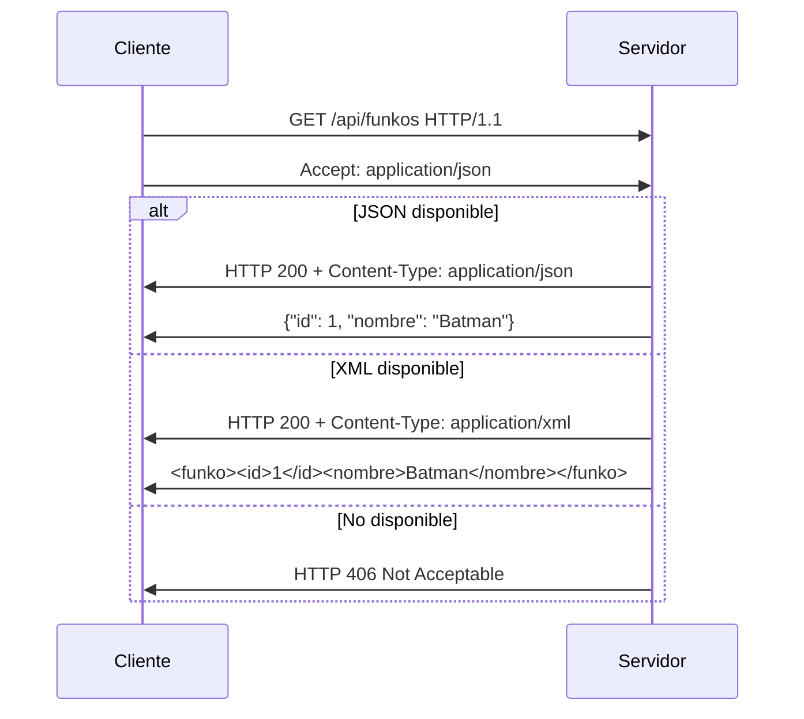
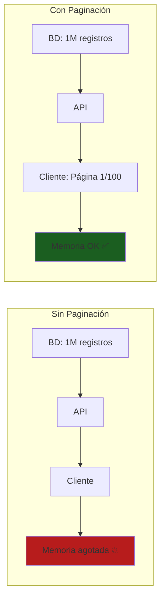
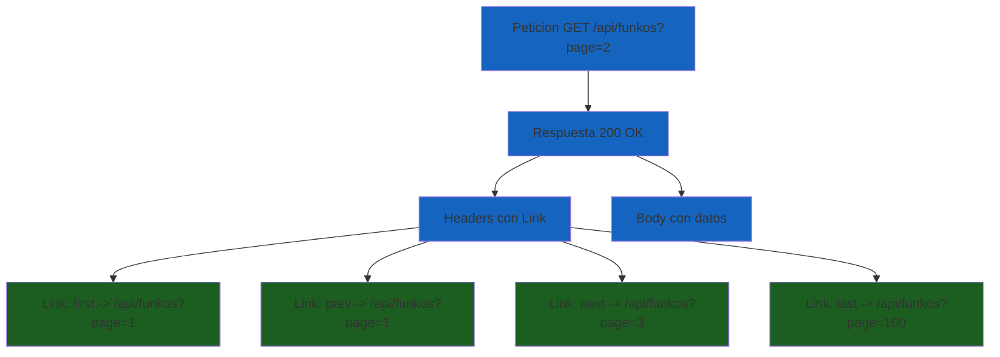
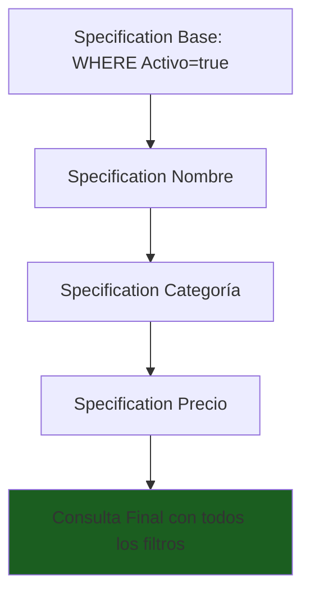
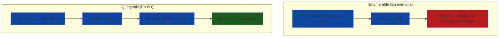
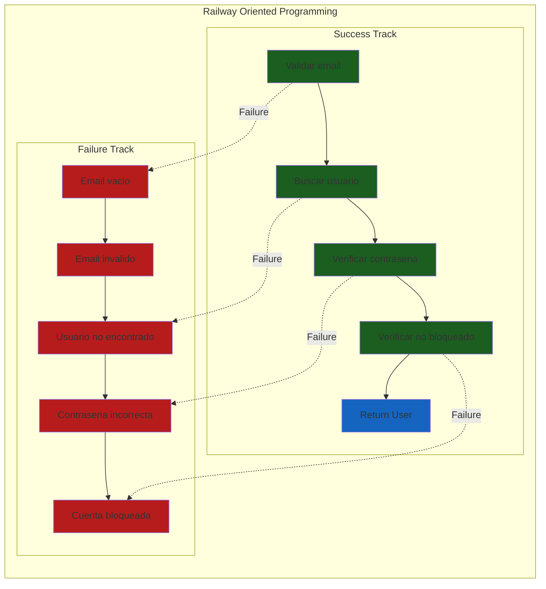
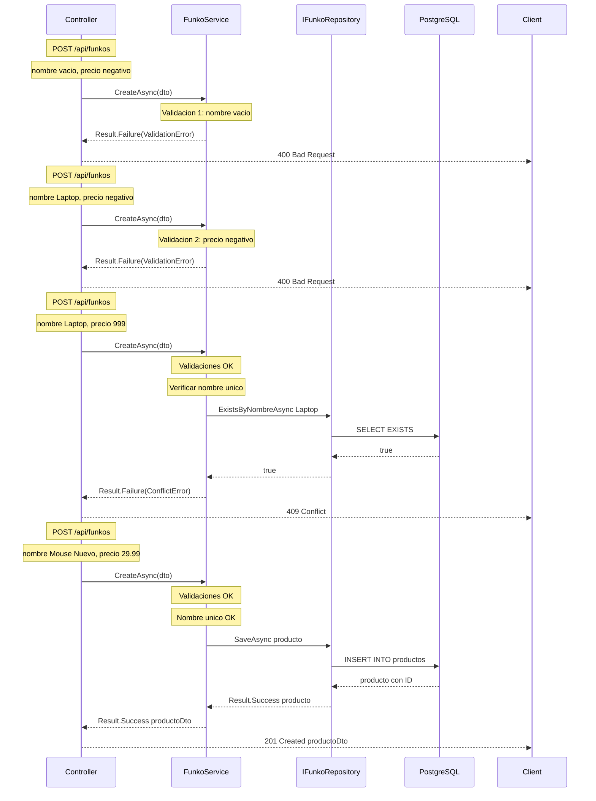
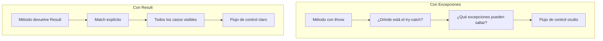

# 5. Resultados Avanzados y Patrón Result en ASP.NET Core

## Indice

- [5. Resultados Avanzados y Patrón Result en ASP.NET Core](#5-resultados-avanzados-y-patrón-result-en-aspnet-core)
  - [5.1. Introducción](#51-introducción)
  - [5.2. Negociación de Contenido](#52-negociación-de-contenido)
    - [5.2.1. ¿Qué es la Negociación de Contenido?](#521-qué-es-la-negociación-de-contenido)
    - [5.2.2. Configuración de XML](#522-configuración-de-xml)
    - [5.2.3. Uso desde el Cliente](#523-uso-desde-el-cliente)
  - [5.3. Paginación y Ordenación](#53-paginación-y-ordenación)
    - [5.3.1. ¿Por qué Paginación?](#531-por-qué-paginación)
    - [5.3.2. Modelo de Paginación](#532-modelo-de-paginación)
    - [5.3.3. PagedList - Clase de Ayuda](#533-pagedlist---clase-de-ayuda)
    - [5.3.4. Parámetros de Paginación](#534-parámetros-de-paginación)
    - [5.3.5. Implementación en el Repositorio](#535-implementación-en-el-repositorio)
    - [5.3.6. Implementación en el Servicio](#536-implementación-en-el-servicio)
    - [5.3.7. Implementación en el Controlador](#537-implementación-en-el-controlador)
  - [5.4. Enlaces de Paginación en Headers](#54-enlaces-de-paginación-en-headers)
    - [5.4.1. HATEOAS y Links de Paginación](#541-hateoas-y-links-de-paginación)
    - [5.4.2. Servicio de Enlaces de Paginación](#542-servicio-de-enlaces-de-paginación)
    - [5.4.3. Uso en el Controlador](#543-uso-en-el-controlador)
  - [5.5. Filtrado Dinámico con Specifications](#55-filtrado-dinámico-con-specifications)
    - [5.5.1. Patrón Specification](#551-patrón-specification)
    - [5.5.2. Implementación de Specifications](#552-implementación-de-specifications)
    - [5.5.3. Uso en el Repositorio](#553-uso-en-el-repositorio)
    - [5.5.4. Uso en el Servicio](#554-uso-en-el-servicio)
    - [5.5.5. Uso en el Controlador](#555-uso-en-el-controlador)
  - [5.6. Optimización con IQueryable](#56-optimización-con-iqueryable)
    - [5.6.1. ¿Qué es IQueryable?](#561-qué-es-iqueryable)
    - [5.6.2. Uso de IQueryable](#562-uso-de-iqueryable)
  - [5.7. El Patrón Result: Fundamentos](#57-el-patrón-result-fundamentos)
    - [5.7.1. Por Qué Excepciones No Son Para Errores de Negocio](#571-por-qué-excepciones-no-son-para-errores-de-negocio)
    - [5.7.2. El Problema con las Excepciones](#572-el-problema-con-las-excepciones)
    - [5.7.3. La Solución con el Patrón Result](#573-la-solución-con-el-patrón-result)
    - [5.7.4. Comparación de Rendimiento](#574-comparación-de-rendimiento)
    - [5.7.5. Flujo Completo de una Operación con Result Pattern](#575-flujo-completo-de-una-operación-con-result-pattern)
  - [5.8. CSharpFunctionalExtensions: Result\<T, Error\>](#58-csharpfunctionalextensions-resultt-error)
    - [5.8.1. Instalación](#581-instalación)
    - [5.8.2. Tipos Básicos de Result](#582-tipos-básicos-de-result)
    - [5.8.3. Métodos Comunes de Result](#583-métodos-comunes-de-result)
    - [5.8.4. Combinar Múltiples Results](#584-combinar-múltiples-results)
  - [5.9. DomainError y ErrorType Enum](#59-domainerror-y-errortype-enum)
    - [5.9.1. Definición de ErrorType](#591-definición-de-errortype)
    - [5.9.2. Definición de DomainError](#592-definición-de-domainerror)
    - [5.9.3. Uso de DomainError en Servicios](#593-uso-de-domainerror-en-servicios)
  - [5.10. Result.Match() en Servicios](#510-resultmatch-en-servicios)
    - [5.10.1. Sintaxis Básica de Match](#5101-sintaxis-básica-de-match)
    - [5.10.2. Match con Encadenamiento](#5102-match-con-encadenamiento)
    - [5.10.3. Match con Resultado Diferente](#5103-match-con-resultado-diferente)
  - [5.11. UnitResult para Operaciones Sin Retorno](#511-unitresult-para-operaciones-sin-retorno)
    - [5.11.1. Cuándo Usar UnitResult](#5111-cuándo-usar-unitresult)
    - [5.11.2. Implementación con UnitResult](#5112-implementación-con-unitresult)
  - [5.12. Integración Result + Controladores](#512-integración-result--controladores)
    - [5.12.1. Controlador con Result Pattern](#5121-controlador-con-result-pattern)
    - [5.12.2. Ayudante para Errores de Validación](#5122-ayudante-para-errores-de-validación)
  - [5.13. Ventajas del Patrón Result](#513-ventajas-del-patrón-result)
    - [5.13.1. Legibilidad y Explicitud](#5131-legibilidad-y-explicitud)
    - [5.13.2. Testabilidad](#5132-testabilidad)
    - [5.13.3. Rendimiento](#5133-rendimiento)
    - [5.13.4. Tabla Comparativa](#5134-tabla-comparativa)
  - [5.14. Ejemplo Completo Integrado](#514-ejemplo-completo-integrado)
    - [5.14.1. Parámetros de Consulta](#5141-parámetros-de-consulta)
    - [5.14.2. Specifications de Funkos](#5142-specifications-de-funkos)
    - [5.14.3. Repositorio](#5143-repositorio)
    - [5.14.4. Servicio](#5144-servicio)
    - [5.14.5. Controlador](#5145-controlador)
  - [5.15. Testing de Paginación y Filtrado](#515-testing-de-paginación-y-filtrado)
    - [5.15.1. Test del Repositorio](#5151-test-del-repositorio)
    - [5.15.2. Test del Controlador](#5152-test-del-controlador)
  - [5.16. Buenas Prácticas](#516-buenas-prácticas)
  - [5.17. Resumen](#517-resumen)
  - [5.18. Ejercicio Propuesto](#518-ejercicio-propuesto)

---

## 5.1. Introducción

En este capítulo aprenderás a implementar **resultados avanzados** para tus APIs REST: negociación de contenido, paginación, ordenación, filtrado dinámico, enlaces HATEOAS y el patrón Result. Estas técnicas son esenciales para crear APIs profesionales, eficientes, usables y mantenibles.

```mermaid
flowchart TD
    subgraph "Resultados Avanzados"
        A[Negociación de Contenido] --> B[Paginación]
        B --> C[Ordenación]
        C --> D[Filtrado]
        D --> E[HATEOAS Links]
        E --> F[Patrón Result]
    end
    
    subgraph "Beneficios"
        G[Eficiencia de Red]
        H[Mejor UX]
        I[Escalabilidad]
        J[API Profesional]
        K[ Código Mantenible]
    end
    
    A --> G
    B --> H
    C --> I
    D --> J
    E --> G
    F --> K

    style A fill:#1B5E20
    style B fill:#0D47A1
    style C fill:#E65100
    style D fill:#4A148C
    style E fill:#B71C1C
    style F fill:#3E2723
```



🧠 **Analogía**: Piensa en una API como un restaurante. La negociación de contenido es como pedir el plato en diferente presentación (plato hondo, bowl, tupper). La paginación es como servir la comida por platos, no todo junto. Los filtros son como pedir sin gluten o vegano. Los links HATEOAS son como el camarero que te indica dónde está el baño y la salida. El patrón Result es como el chef que te dice claramente si el plato está listo o qué problema hay, en lugar de lanzar alertas cuando algo falta.

---

## 5.2. Negociación de Contenido

### 5.2.1. ¿Qué es la Negociación de Contenido?

La **negociación de contenido** es un mecanismo que permite al cliente especificar el formato de los datos que desea recibir. El servidor examina la petición y devuelve el resultado en el formato solicitado (JSON, XML, etc.). Este mecanismo está definido en el estándar HTTP y permite que una misma API sirva datos en múltiples formatos sin cambiar el código de negocio.

La negociación de contenido es fundamental para APIs profesionales porque permite que diferentes tipos de clientes consuman la misma API según sus necesidades. Un cliente móvil moderno puede preferir JSON, mientras que un sistema empresarial legacy puede necesitar XML. Sin negociación de contenido, tendrías que crear endpoints diferentes para cada formato o mantener múltiples versiones de la API.



**Ventajas de la negociación de contenido:**

✅ **Flexibilidad**: Diferentes clientes pueden consumir la API en diferentes formatos según sus capacidades y necesidades

✅ **Compatibilidad**: Soporte para clientes legacy que requieren XML sin duplicar endpoints

✅ **Interoperabilidad**: Integración con sistemas heterogéneos que pueden hablar diferentes lenguajes de datos

✅ **Futuro-proof**: La API puede añadir nuevos formatos (como HAL+JSON, MessagePack) sin romper clientes existentes

📝 **Nota del Profesor**: Por defecto, ASP.NET Core solo soporta JSON por simplicidad y rendimiento. Para añadir otros formatos, necesitas configurar los formateadores apropiados. JSON es el estándar de facto para APIs modernas por su ligereza y legibilidad.

### 5.2.2. Configuración de XML

**Instalar paquete NuGet:**

```bash
dotnet add package Microsoft.AspNetCore.Mvc.Formatters.Xml
```

**Configurar en Program.cs:**

```csharp
using Microsoft.AspNetCore.Mvc;

var builder = WebApplication.CreateBuilder(args);

builder.Services.AddControllers()
    .AddXmlSerializerFormatters()
    .AddJsonOptions(options =>
    {
        options.JsonSerializerOptions.PropertyNamingPolicy = JsonNamingPolicy.CamelCase;
        options.JsonSerializerOptions.ReferenceHandler = ReferenceHandler.IgnoreCycles;
        options.JsonSerializerOptions.WriteIndented = false;
    });

var app = builder.Build();

app.MapControllers();

app.Run();
```

**Configuración avanzada:**

```csharp
builder.Services.AddControllers(options =>
{
    // Mapear formatos a media types específicos
    options.FormatterMappings.SetMediaTypeMappingForFormat("xml", "application/xml");
    options.FormatterMappings.SetMediaTypeMappingForFormat("json", "application/json");
    
    // Devolver 406 si el formato no es aceptable
    options.ReturnHttpNotAcceptable = true;
})
.AddXmlSerializerFormatters()
.AddJsonOptions(options =>
{
    options.JsonSerializerOptions.WriteIndented = true;
    options.JsonSerializerOptions.PropertyNameCaseInsensitive = true;
    options.JsonSerializerOptions.DefaultIgnoreCondition = JsonIgnoreCondition.WhenWritingNull;
});
```

💡 **Tip del Examinador**: XMLSerializer requiere que las clases tengan constructores sin parámetros y propiedades públicas con getters y setters. Si usas records (que son inmutables), asegúrate de que el serializer pueda manejar la deserialización o usa DTOs con setters públicos.

### 5.2.3. Uso desde el Cliente

**1. Usando el header `Accept`:**

```http
GET /api/funkos HTTP/1.1
Host: localhost:5000
Accept: application/xml
```

```http
GET /api/funkos HTTP/1.1
Host: localhost:5000
Accept: application/json
```

**2. Usando query parameter para formato:**

```csharp
builder.Services.AddControllers(options =>
{
    options.RespectBrowserAcceptHeader = true;
    options.ReturnHttpNotAcceptable = true;
})
.AddXmlSerializerFormatters()
.AddJsonOptions(options =>
{
    options.JsonSerializerOptions.PropertyNamingPolicy = JsonNamingPolicy.CamelCase;
});
```

**Uso:**

```http
GET /api/funkos?format=xml HTTP/1.1
GET /api/funkos?format=json HTTP/1.1
```

**Respuesta XML:**

```xml
<?xml version="1.0" encoding="UTF-8"?>
<ArrayOfFunkoResponseDto>
    <FunkoResponseDto>
        <Id>1</Id>
        <Nombre>Batman</Nombre>
        <Precio>29.99</Precio>
        <Cantidad>10</Cantidad>
        <Categoria>DC</Categoria>
    </FunkoResponseDto>
    <FunkoResponseDto>
        <Id>2</Id>
        <Nombre>Iron Man</Nombre>
        <Precio>34.99</Precio>
        <Cantidad>5</Cantidad>
        <Categoria>Marvel</Categoria>
    </FunkoResponseDto>
</ArrayOfFunkoResponseDto>
```

⚠️ **Advertencia importante**: `ReturnHttpNotAcceptable = true` devolverá un error 406 (Not Acceptable) si el cliente solicita un formato que no está configurado. Esto es más estricto pero más correcto según HTTP. Si quieres un comportamiento más permisivo, puedes omitir esta opción y solo configurar los formateadores que soportas.

---

## 5.3. Paginación y Ordenación

### 5.3.1. ¿Por qué Paginación?

La **paginación** es el proceso de dividir grandes conjuntos de datos en páginas manejables. Es una de las características más importantes de cualquier API que devuelva colecciones, especialmente cuando el volumen de datos puede ser grande.

Imagina que tienes una base de datos con un millón de registros. Si un cliente hace una petición GET a `/api/funkos` sin paginación, la API intentaría devolver un millón de registros en una sola respuesta. Esto causaría problemas graves: la memoria del servidor se saturaría al intentar cargar todos los registros, la red se congestionaría al transferir megabytes o gigabytes de datos, el cliente podría quedarse sin memoria al procesar la respuesta, y la experiencia de usuario sería terrible al tener que esperar mucho tiempo y procesar una lista enorme.

La paginación resuelve todos estos problemas al devolver solo un subconjunto de datos en cada petición, junto con metadatos que permiten al cliente navegar por las páginas restantes de forma eficiente.



**Beneficios de la paginación:**

✅ **Eficiencia de red**: Solo se transfieren los datos necesarios en cada petición, reduciendo el consumo de ancho de banda

✅ **Experiencia de usuario**: Datos manejables y predecibles que el usuario puede procesar incrementalmente

✅ **Rendimiento del servidor**: Menor carga en base de datos y memoria al no procesar conjuntos masivos

✅ **Escalabilidad**: Capacidad de manejar grandes volúmenes de datos sin degradar el rendimiento

✅ **Predictibilidad**: Los clientes saben exactamente cuántos datos esperar en cada respuesta

🧠 **Analogía**: Es como leer un libro. No lees todas las páginas de golpe, sino una página a la vez, navegando entre ellas con el índice o las páginas siguientes. Esto hace que la lectura sea manejable y organizada.

### 5.3.2. Modelo de Paginación

El modelo de paginación estándar define una estructura que incluye tanto los datos de la página como los metadatos de paginación.

```csharp
namespace MiApi.Models.Pagination;

/// <summary>
/// Respuesta paginada estándar que incluye datos y metadatos
/// </summary>
public record PageResponse<T>
{
    /// <summary>
    /// Los elementos de la página actual
    /// </summary>
    public IEnumerable<T> Content { get; init; } = Enumerable.Empty<T>();
    
    /// <summary>
    /// Número total de páginas
    /// </summary>
    public int TotalPages { get; init; }
    
    /// <summary>
    /// Número total de elementos en todas las páginas
    /// </summary>
    public long TotalElements { get; init; }
    
    /// <summary>
    /// Tamaño de cada página
    /// </summary>
    public int PageSize { get; init; }
    
    /// <summary>
    /// Número de la página actual (1-indexed)
    /// </summary>
    public int PageNumber { get; init; }
    
    /// <summary>
    /// Elementos en esta página
    /// </summary>
    public int TotalPageElements { get; init; }
    
    /// <summary>
    /// Indica si la página está vacía
    /// </summary>
    public bool Empty { get; init; }
    
    /// <summary>
    /// Indica si es la primera página
    /// </summary>
    public bool First { get; init; }
    
    /// <summary>
    /// Indica si es la última página
    /// </summary>
    public bool Last { get; init; }
    
    /// <summary>
    /// Campo por el que se ordenó
    /// </summary>
    public string? SortBy { get; init; }
    
    /// <summary>
    /// Dirección de ordenación (asc/desc)
    /// </summary>
    public string? Direction { get; init; }
}
```

**Ejemplo de respuesta:**

```json
{
  "content": [
    { "id": 1, "nombre": "Batman", "precio": 29.99, "categoria": "DC", "cantidad": 10 },
    { "id": 2, "nombre": "Iron Man", "precio": 34.99, "categoria": "Marvel", "cantidad": 5 }
  ],
  "totalPages": 100,
  "totalElements": 1000,
  "pageSize": 10,
  "pageNumber": 1,
  "totalPageElements": 10,
  "empty": false,
  "first": true,
  "last": false,
  "sortBy": "nombre",
  "direction": "asc"
}
```

### 5.3.3. PagedList - Clase de Ayuda

La clase `PagedList<T>` es un helper que simplifica la creación de páginas paginadas con Entity Framework Core.

```csharp
using Microsoft.EntityFrameworkCore;

namespace MiApi.Models.Pagination;

/// <summary>
/// Clase auxiliar para crear listas paginadas de forma eficiente
/// </summary>
public class PagedList<T>
{
    public List<T> Items { get; }
    public int PageNumber { get; }
    public int PageSize { get; }
    public int TotalCount { get; }
    
    public int TotalPages => (int)Math.Ceiling(TotalCount / (double)PageSize);
    
    public bool HasPrevious => PageNumber > 1;
    
    public bool HasNext => PageNumber < TotalPages;
    
    public bool IsFirst => PageNumber == 1;
    
    public bool IsLast => PageNumber == TotalPages;

    private PagedList(List<T> items, int count, int pageNumber, int pageSize)
    {
        Items = items;
        TotalCount = count;
        PageNumber = pageNumber;
        PageSize = pageSize;
    }

    /// <summary>
    /// Crea una página paginada de forma asíncrona
    /// </summary>
    /// <param name="source">Queryable fuente de datos</param>
    /// <param name="pageNumber">Número de página (1-indexed)</param>
    /// <param name="pageSize">Tamaño de página</param>
    /// <param name="cancellationToken">Token de cancelación</param>
    public static async Task<PagedList<T>> CreateAsync(
        IQueryable<T> source,
        int pageNumber,
        int pageSize,
        CancellationToken cancellationToken = default)
    {
        // Count debe ejecutarse primero para obtener el total
        var count = await source.CountAsync(cancellationToken);
        
        // Skip y Take se traducen a SQL, ejecutándose en la BD
        var items = await source
            .Skip((pageNumber - 1) * pageSize)
            .Take(pageSize)
            .ToListAsync(cancellationToken);

        return new PagedList<T>(items, count, pageNumber, pageSize);
    }

    /// <summary>
    /// Convierte a PageResponse con información de ordenación
    /// </summary>
    public PageResponse<T> ToPageResponse(string? sortBy = null, string? direction = null)
    {
        return new PageResponse<T>
        {
            Content = Items,
            TotalPages = TotalPages,
            TotalElements = TotalCount,
            PageSize = PageSize,
            PageNumber = PageNumber,
            TotalPageElements = Items.Count,
            Empty = !Items.Any(),
            First = IsFirst,
            Last = IsLast,
            SortBy = sortBy,
            Direction = direction
        };
    }
}
```

💡 **Tip del Examinador**: `PagedList<T>` es ideal para Entity Framework Core porque tanto `CountAsync` como `ToListAsync` se ejecutan en la base de datos mediante SQL, no en memoria. Esto es crucial para el rendimiento con grandes conjuntos de datos.

### 5.3.4. Parámetros de Paginación

Los parámetros de paginación se reciben del cliente y definen qué página y tamaño desea el cliente.

```csharp
namespace MiApi.Models.Pagination;

/// <summary>
/// Parámetros de paginación recibidos del cliente
/// </summary>
public record PaginationParams
{
    private const int MaxPageSize = 100;
    private const int DefaultPageSize = 10;
    
    /// <summary>
    /// Número de página (1-indexed). Por defecto 1.
    /// </summary>
    public int PageNumber { get; init; } = 1;
    
    /// <summary>
    /// Tamaño de página. Por defecto 10, máximo 100.
    /// </summary>
    public int PageSize
    {
        get => _pageSize;
        init => _pageSize = value > MaxPageSize ? MaxPageSize : (value <= 0 ? DefaultPageSize : value);
    }
    private int _pageSize = DefaultPageSize;
    
    /// <summary>
    /// Campo por el que ordenar
    /// </summary>
    public string SortBy { get; init; } = "Id";
    
    /// <summary>
    /// Dirección de ordenación: asc o desc
    /// </summary>
    public string Direction { get; init; } = "asc";
    
    /// <summary>
    /// Calcula el número de elementos a saltar
    /// </summary>
    public int Skip => (PageNumber - 1) * PageSize;
    
    /// <summary>
    /// Calcula el Take para EF Core
    /// </summary>
    public int Take => PageSize;
}
```

⚠️ **Advertencia de seguridad**: Siempre limita el `PageSize` máximo para evitar que clientes malintencionados o mal configurados soliciten páginas enormes que puedan agotar los recursos del servidor. Un valor de 100 es un límite razonable para la mayoría de APIs.

### 5.3.5. Implementación en el Repositorio

El repositorio implementa la lógica de paginación utilizando IQueryable para que las operaciones se ejecuten en la base de datos.

```csharp
using System.Linq.Expressions;
using Microsoft.EntityFrameworkCore;

namespace MiApi.Repositories;

public interface IFunkoRepository
{
    Task<PagedList<Funko>> GetAllPagedAsync(
        PaginationParams paginationParams,
        CancellationToken cancellationToken = default);

    Task<PagedList<Funko>> GetAllPagedAsync(
        Expression<Func<Funko, bool>>? filter,
        PaginationParams paginationParams,
        CancellationToken cancellationToken = default);
}

public class FunkoRepository : IFunkoRepository
{
    private readonly ApplicationDbContext _context;

    public FunkoRepository(ApplicationDbContext context)
    {
        _context = context;
    }

    public async Task<PagedList<Funko>> GetAllPagedAsync(
        PaginationParams paginationParams,
        CancellationToken cancellationToken = default)
    {
        // Solo Funkos activos
        var query = _context.Funkos
            .Where(f => f.Activo)
            .AsQueryable();

        return await GetPagedAsync(query, paginationParams, cancellationToken);
    }

    public async Task<PagedList<Funko>> GetAllPagedAsync(
        Expression<Func<Funko, bool>>? filter,
        PaginationParams paginationParams,
        CancellationToken cancellationToken = default)
    {
        var query = _context.Funkos
            .Where(f => f.Activo)
            .AsQueryable();

        if (filter is not null)
        {
            query = query.Where(filter);
        }

        return await GetPagedAsync(query, paginationParams, cancellationToken);
    }

    private async Task<PagedList<Funko>> GetPagedAsync(
        IQueryable<Funko> query,
        PaginationParams paginationParams,
        CancellationToken cancellationToken)
    {
        // Aplicar ordenación antes de paginar
        query = ApplySorting(query, paginationParams.SortBy, paginationParams.Direction);

        // EF Core traduce Skip y Take a SQL
        return await PagedList<Funko>.CreateAsync(
            query,
            paginationParams.PageNumber,
            paginationParams.PageSize,
            cancellationToken);
    }

    private IQueryable<Funko> ApplySorting(
        IQueryable<Funko> query, 
        string sortBy, 
        string direction)
    {
        var isAscending = direction.Equals("asc", StringComparison.OrdinalIgnoreCase);

        // Ordenación switch expression para múltiples campos
        return sortBy.ToLowerInvariant() switch
        {
            "nombre" => isAscending 
                ? query.OrderBy(f => f.Nombre) 
                : query.OrderByDescending(f => f.Nombre),
            "precio" => isAscending 
                ? query.OrderBy(f => f.Precio) 
                : query.OrderByDescending(f => f.Precio),
            "cantidad" => isAscending 
                ? query.OrderBy(f => f.Cantidad) 
                : query.OrderByDescending(f => f.Cantidad),
            "categoria" => isAscending 
                ? query.OrderBy(f => f.Categoria) 
                : query.OrderByDescending(f => f.Categoria),
            "fechacreacion" => isAscending 
                ? query.OrderBy(f => f.FechaCreacion) 
                : query.OrderByDescending(f => f.FechaCreacion),
            // Por defecto ordenar por ID
            _ => isAscending 
                ? query.OrderBy(f => f.Id) 
                : query.OrderByDescending(f => f.Id)
        };
    }
}
```

### 5.3.6. Implementación en el Servicio

El servicio utiliza el repositorio y transforma los resultados a DTOs.

```csharp
namespace MiApi.Services;

public interface IFunkoService
{
    Task<PageResponse<FunkoResponseDto>> GetAllPagedAsync(
        PaginationParams paginationParams,
        CancellationToken cancellationToken = default);
}

public class FunkoService : IFunkoService
{
    private readonly IFunkoRepository _repository;
    private readonly IMapper _mapper;
    private readonly ILogger<FunkoService> _logger;

    public FunkoService(
        IFunkoRepository repository, 
        IMapper mapper,
        ILogger<FunkoService> logger)
    {
        _repository = repository;
        _mapper = mapper;
        _logger = logger;
    }

    public async Task<PageResponse<FunkoResponseDto>> GetAllPagedAsync(
        PaginationParams paginationParams,
        CancellationToken cancellationToken = default)
    {
        _logger.LogDebug(
            "Obteniendo funkos paginados: página {Page}, tamaño {PageSize}",
            paginationParams.PageNumber,
            paginationParams.PageSize);

        // Obtener datos paginados del repositorio
        var pagedFunkos = await _repository.GetAllPagedAsync(
            paginationParams, 
            cancellationToken);

        // Mapear a DTOs
        var funkosDto = _mapper.Map<List<FunkoResponseDto>>(pagedFunkos.Items);

        // Crear respuesta paginada
        return new PageResponse<FunkoResponseDto>
        {
            Content = funkosDto,
            TotalPages = pagedFunkos.TotalPages,
            TotalElements = pagedFunkos.TotalCount,
            PageSize = pagedFunkos.PageSize,
            PageNumber = pagedFunkos.PageNumber,
            TotalPageElements = funkosDto.Count,
            Empty = !funkosDto.Any(),
            First = pagedFunkos.IsFirst,
            Last = pagedFunkos.IsLast,
            SortBy = paginationParams.SortBy,
            Direction = paginationParams.Direction
        };
    }
}
```

### 5.3.7. Implementación en el Controlador

El controlador expone el endpoint HTTP que recibe los parámetros de paginación.

```csharp
namespace MiApi.Controllers;

[ApiController]
[Route("api/[controller]")]
public class FunkosController(IFunkoService service) : ControllerBase
{
    /// <summary>
    /// Obtiene todos los funkos con paginación y ordenación
    /// </summary>
    /// <param name="pageNumber">Número de página (por defecto 1)</param>
    /// <param name="pageSize">Elementos por página (por defecto 10, máximo 100)</param>
    /// <param name="sortBy">Campo de ordenación: Id, Nombre, Precio, Cantidad, Categoria</param>
    /// <param name="direction">Dirección: asc o desc</param>
    /// <returns>Respuesta paginada con metadatos</returns>
    [HttpGet]
    [ProducesResponseType(typeof(PageResponse<FunkoResponseDto>), StatusCodes.Status200OK)]
    public async Task<ActionResult<PageResponse<FunkoResponseDto>>> GetAll(
        [FromQuery] int pageNumber = 1,
        [FromQuery] int pageSize = 10,
        [FromQuery] string sortBy = "Id",
        [FromQuery] string direction = "asc")
    {
        var paginationParams = new PaginationParams
        {
            PageNumber = pageNumber,
            PageSize = pageSize,
            SortBy = sortBy,
            Direction = direction
        };

        var result = await service.GetAllPagedAsync(paginationParams);

        return Ok(result);
    }
}
```

**Ejemplo de llamada:**

```http
GET /api/funkos?pageNumber=2&pageSize=20&sortBy=nombre&direction=asc HTTP/1.1
Accept: application/json
```

---

## 5.4. Enlaces de Paginación en Headers

### 5.4.1. HATEOAS y Links de Paginación

**HATEOAS** (Hypertext As The Engine Of Application State) es un principio REST que indica que la respuesta debe incluir enlaces para navegar por los estados de la aplicación. Para paginación, esto significa incluir enlaces a la primera página, página anterior, página siguiente y última página.

Los enlaces de paginación en headers son una práctica profesional que sigue el estándar RFC 5988 (Web Linking). Esto permite que los clientes naveguen por las páginas sin tener que construir las URLs manualmente, y separa claramente los datos de los metadatos de navegación.



**Ventajas de los links en headers:**

✅ **Conformidad con estándares REST (HATEOAS)**: La API es más profesional y cumple con las mejores prácticas de REST

✅ **Separación de preocupaciones**: El body solo contiene datos, los metadatos de navegación van en headers

✅ **Mejor cacheabilidad**: Los proxies HTTP cachean mejor las respuestas sin metadatos de navegación

✅ **Flexibilidad para el cliente**: El cliente puede navegar sin conocer la estructura de URLs

✅ **Facilita la integración**: Los clientes pueden descubrir los enlaces disponibles

### 5.4.2. Servicio de Enlaces de Paginación

```csharp
using Microsoft.AspNetCore.Http;

namespace MiApi.Services.Pagination;

public interface IPaginationLinksService
{
    string CreateLinkHeader<T>(PagedList<T> pagedList, HttpRequest request);
}

public class PaginationLinksService : IPaginationLinksService
{
    public string CreateLinkHeader<T>(PagedList<T> pagedList, HttpRequest request)
    {
        var links = new List<string>();

        // Primera página
        if (pagedList.PageNumber > 1)
        {
            links.Add(CreateLink(request, 1, pagedList.PageSize, "first"));
        }

        // Página anterior
        if (pagedList.HasPrevious)
        {
            links.Add(CreateLink(request, pagedList.PageNumber - 1, pagedList.PageSize, "prev"));
        }

        // Página siguiente
        if (pagedList.HasNext)
        {
            links.Add(CreateLink(request, pagedList.PageNumber + 1, pagedList.PageSize, "next"));
        }

        // Última página
        if (pagedList.PageNumber < pagedList.TotalPages)
        {
            links.Add(CreateLink(request, pagedList.TotalPages, pagedList.PageSize, "last"));
        }

        return string.Join(", ", links);
    }

    private string CreateLink(HttpRequest request, int pageNumber, int pageSize, string rel)
    {
        var scheme = request.Scheme;
        var host = request.Host.Value;
        var path = request.Path.Value;
        var queryString = request.QueryString.Value;

        // Construir parámetros de query preservando filtros existentes
        var queryParams = new Dictionary<string, string>
        {
            ["pageNumber"] = pageNumber.ToString(),
            ["pageSize"] = pageSize.ToString()
        };

        // Preservar otros parámetros de query (filtros, ordenación)
        foreach (var key in request.Query.Keys)
        {
            if (key != "pageNumber" && key != "pageSize")
            {
                queryParams[key] = request.Query[key].ToString();
            }
        }

        var query = string.Join("&", queryParams.Select(kvp => $"{kvp.Key}={kvp.Value}"));
        var url = $"{scheme}://{host}{path}?{query}";

        // Formato RFC 5988: <url>; rel="rel"
        return $"<{url}>; rel=\"{rel}\"";
    }
}
```

**Registrar en Program.cs:**

```csharp
builder.Services.AddScoped<IPaginationLinksService, PaginationLinksService>();
```

### 5.4.3. Uso en el Controlador

```csharp
namespace MiApi.Controllers;

[ApiController]
[Route("api/[controller]")]
public class FunkosController(
    IFunkoService service, 
    IPaginationLinksService paginationLinksService) : ControllerBase
{
    [HttpGet]
    public async Task<ActionResult<PageResponse<FunkoResponseDto>>> GetAll(
        [FromQuery] PaginationParams paginationParams)
    {
        var pagedFunkos = await service.GetAllPagedAsync(paginationParams);

        // Generar header Link
        var linkHeader = paginationLinksService.CreateLinkHeader(pagedFunkos, Request);
        Response.Headers.Add("Link", linkHeader);

        return Ok(pagedFunkos.ToPageResponse(paginationParams.SortBy, paginationParams.Direction));
    }
}
```

**Respuesta:**

```http
HTTP/1.1 200 OK
Content-Type: application/json
Link: </api/funkos?pageNumber=1&pageSize=10>; rel="first", </api/funkos?pageNumber=1&pageSize=10>; rel="prev", </api/funkos?pageNumber=3&pageSize=10>; rel="next", </api/funkos?pageSize=10>; rel="last"

{
  "content": [...],
  "totalPages": 100,
  "totalElements": 1000,
  "pageSize": 10,
  "pageNumber": 2,
  ...
}
```

---

## 5.5. Filtrado Dinámico con Specifications

### 5.5.1. Patrón Specification

El **patrón Specification** permite construir consultas dinámicas y reutilizables. En lugar de escribir código de filtrado monolítico,分解es en specifications individuales que pueden combinarse.

Este patrón es especialmente útil cuando tienes múltiples filtros que pueden combinarse de diferentes maneras. Cada specification encapsula una condición de filtrado, y puedes combinarlas lógicamente (AND, OR, NOT).

🧠 **Analogía**: Es como un filtro de café. Cada specification es una capa de filtro que añade o modifica la consulta base. Puedes tener un filtro para café molido, otro para tamaño, otro para intensidad, y combinarlos para obtener exactamente lo que buscas.



### 5.5.2. Implementación de Specifications

```csharp
using System.Linq.Expressions;

namespace MiApi.Specifications;

/// <summary>
/// Interfaz base para todas las specifications
/// </summary>
public interface ISpecification<T>
{
    Expression<Func<T, bool>>? Criteria { get; }
    List<Expression<Func<T, object>>> Includes { get; }
    Expression<Func<T, object>>? OrderBy { get; }
    Expression<Func<T, object>>? OrderByDescending { get; }
    int? Take { get; }
    int? Skip { get; }
}

/// <summary>
/// Implementación base de specification
/// </summary>
public abstract class BaseSpecification<T> : ISpecification<T>
{
    public Expression<Func<T, bool>>? Criteria { get; }
    public List<Expression<Func<T, object>>> Includes { get; } = new();
    public Expression<Func<T, object>>? OrderBy { get; private set; }
    public Expression<Func<T, object>>? OrderByDescending { get; private set; }
    public int? Take { get; private set; }
    public int? Skip { get; private set; }

    protected BaseSpecification(Expression<Func<T, bool>>? criteria = null)
    {
        Criteria = criteria;
    }

    protected void AddInclude(Expression<Func<T, object>> includeExpression)
    {
        Includes.Add(includeExpression);
    }

    protected void ApplyOrderBy(Expression<Func<T, object>> orderByExpression)
    {
        OrderBy = orderByExpression;
    }

    protected void ApplyOrderByDescending(Expression<Func<T, object>> orderByDescExpression)
    {
        OrderByDescending = orderByDescExpression;
    }

    protected void ApplyTake(int take)
    {
        Take = take;
    }

    protected void ApplySkip(int skip)
    {
        Skip = skip;
    }
}

/// <summary>
/// Specification para filtrar y ordenar Funkos
/// </summary>
public class FunkosSpecification : BaseSpecification<Funko>
{
    public FunkosSpecification(FunkoFilterParams filterParams) 
        : base(CreateCriteria(filterParams))
    {
        ApplySorting(filterParams.SortBy, filterParams.Direction);
    }

    private static Expression<Func<Funko, bool>> CreateCriteria(FunkoFilterParams filterParams)
    {
        // Criteria base: solo activos
        Expression<Func<Funko, bool>> criteria = f => f.Activo;

        // Combinar filtros con AND
        if (!string.IsNullOrWhiteSpace(filterParams.Nombre))
        {
            var nombre = filterParams.Nombre.ToLower();
            criteria = CombineExpressions(criteria, 
                f => f.Nombre.ToLower().Contains(nombre));
        }

        if (!string.IsNullOrWhiteSpace(filterParams.Categoria))
        {
            criteria = CombineExpressions(criteria, 
                f => f.Categoria == filterParams.Categoria);
        }

        if (filterParams.PrecioMin.HasValue)
        {
            criteria = CombineExpressions(criteria, 
                f => f.Precio >= filterParams.PrecioMin.Value);
        }

        if (filterParams.PrecioMax.HasValue)
        {
            criteria = CombineExpressions(criteria, 
                f => f.Precio <= filterParams.PrecioMax.Value);
        }

        if (filterParams.StockMin.HasValue)
        {
            criteria = CombineExpressions(criteria, 
                f => f.Cantidad >= filterParams.StockMin.Value);
        }

        if (filterParams.StockMax.HasValue)
        {
            criteria = CombineExpressions(criteria, 
                f => f.Cantidad <= filterParams.StockMax.Value);
        }

        return criteria;
    }

    private static Expression<Func<T, bool>> CombineExpressions<T>(
        Expression<Func<T, bool>> first,
        Expression<Func<T, bool>> second)
    {
        var parameter = Expression.Parameter(typeof(T));
        var leftVisitor = new ReplaceExpressionVisitor(first.Parameters[0], parameter);
        var left = leftVisitor.Visit(first.Body);
        var rightVisitor = new ReplaceExpressionVisitor(second.Parameters[0], parameter);
        var right = rightVisitor.Visit(second.Body);
        return Expression.Lambda<Func<T, bool>>(Expression.AndAlso(left!, right!), parameter);
    }

    private void ApplySorting(string sortBy, string direction)
    {
        var isAscending = direction.Equals("asc", StringComparison.OrdinalIgnoreCase);

        var sortExpression = sortBy.ToLowerInvariant() switch
        {
            "nombre" => (Expression<Func<Funko, object>>)(f => f.Nombre),
            "precio" => f => f.Precio,
            "cantidad" => f => f.Cantidad,
            "categoria" => f => f.Categoria,
            "fechacreacion" => f => f.FechaCreacion,
            _ => f => f.Id
        };

        if (isAscending)
            ApplyOrderBy(sortExpression);
        else
            ApplyOrderByDescending(sortExpression);
    }
}

/// <summary>
/// Visitor para reemplazar parámetros en expresiones
/// </summary>
internal class ReplaceExpressionVisitor : ExpressionVisitor
{
    private readonly Expression _oldValue;
    private readonly Expression _newValue;

    public ReplaceExpressionVisitor(Expression oldValue, Expression newValue)
    {
        _oldValue = oldValue;
        _newValue = newValue;
    }

    public override Expression? Visit(Expression? node)
    {
        return node == _oldValue ? _newValue : base.Visit(node);
    }
}
```

### 5.5.3. Uso en el Repositorio

```csharp
public async Task<PagedList<Funko>> GetAllPagedAsync(
    ISpecification<Funko> specification,
    PaginationParams paginationParams,
    CancellationToken cancellationToken = default)
{
    var query = ApplySpecification(specification);

    return await PagedList<Funko>.CreateAsync(
        query,
        paginationParams.PageNumber,
        paginationParams.PageSize,
        cancellationToken);
}

private IQueryable<Funko> ApplySpecification(ISpecification<Funko> spec)
{
    var query = _context.Funkos.AsQueryable();

    // Aplicar Criteria (Where)
    if (spec.Criteria is not null)
    {
        query = query.Where(spec.Criteria);
    }

    // Aplicar Includes (Eager loading)
    query = spec.Includes.Aggregate(
        query, 
        (current, include) => current.Include(include));

    // Aplicar ordenación
    if (spec.OrderBy is not null)
    {
        query = query.OrderBy(spec.OrderBy);
    }
    else if (spec.OrderByDescending is not null)
    {
        query = query.OrderByDescending(spec.OrderByDescending);
    }

    // Aplicar Skip y Take
    if (spec.Skip.HasValue)
    {
        query = query.Skip(spec.Skip.Value);
    }

    if (spec.Take.HasValue)
    {
        query = query.Take(spec.Take.Value);
    }

    return query;
}
```

### 5.5.4. Uso en el Servicio

```csharp
public async Task<PageResponse<FunkoResponseDto>> GetAllPagedAsync(
    FunkoFilterParams filterParams,
    PaginationParams paginationParams,
    CancellationToken cancellationToken = default)
{
    // Crear specification con filtros
    var specification = new FunkosSpecification(filterParams);

    // Obtener datos paginados
    var pagedFunkos = await _repository.GetAllPagedAsync(
        specification,
        paginationParams,
        cancellationToken);

    // Mapear y devolver
    var funkosDto = _mapper.Map<List<FunkoResponseDto>>(pagedFunkos.Items);

    return pagedFunkos.ToPageResponse(paginationParams.SortBy, paginationParams.Direction);
}
```

### 5.5.5. Uso en el Controlador

```csharp
[HttpGet]
public async Task<ActionResult<PageResponse<FunkoResponseDto>>> GetAll(
    [FromQuery] FunkoFilterParams filterParams,
    [FromQuery] PaginationParams paginationParams)
{
    var result = await _service.GetAllPagedAsync(filterParams, paginationParams);

    var linkHeader = _paginationLinksService.CreateLinkHeader(result, Request);
    Response.Headers.Add("Link", linkHeader);

    return Ok(result);
}
```

---

## 5.6. Optimización con IQueryable

### 5.6.1. ¿Qué es IQueryable?

`IQueryable<T>` es una interfaz que permite construir consultas que se ejecutan en la base de datos en lugar de en memoria. Cuando usas LINQ con `IQueryable`, las operaciones se traducen a SQL y se ejecutan en el motor de base de datos, lo que es mucho más eficiente que traer todos los datos a memoria y filtrarlos ahí.

La diferencia entre `IEnumerable` e `IQueryable` es crucial para el rendimiento. `IEnumerable` es para colecciones en memoria: aplicas filtros después de que todos los datos están en .NET. `IQueryable` es para consultas diferidas a base de datos: los filtros se convierten a SQL y la base de datos hace el trabajo.



🧠 **Analogía**: `IQueryable` es como escribir una carta a la base de datos preguntando exactamente lo que necesitas. `IEnumerable` sería como traer todos los archivos de la base de datos a tu casa y buscar manualmente lo que necesitas.

### 5.6.2. Uso de IQueryable

```csharp
public async Task<PagedList<Funko>> GetAllPagedAsync(
    Expression<Func<Funko, bool>>? filter = null,
    Func<IQueryable<Funko>, IOrderedQueryable<Funko>>? orderBy = null,
    PaginationParams? paginationParams = null,
    CancellationToken cancellationToken = default)
{
    IQueryable<Funko> query = _context.Funkos;

    // Aplicar filtro si existe
    if (filter is not null)
    {
        query = query.Where(filter);
    }

    // Aplicar ordenación si existe
    if (orderBy is not null)
    {
        query = orderBy(query);
    }

    // Valores por defecto para paginación
    paginationParams ??= new PaginationParams();

    // EF Core traduce Skip y Take a SQL OFFSET y LIMIT
    return await PagedList<Funko>.CreateAsync(
        query,
        paginationParams.PageNumber,
        paginationParams.PageSize,
        cancellationToken);
}
```

**Optimizaciones recomendadas:**

```csharp
// 1. Usar AsNoTracking() para consultas de solo lectura (mejora rendimiento)
return await _context.Funkos
    .AsNoTracking()
    .Where(f => f.Activo)
    .ToListAsync();

// 2. Usar proyecciones para devolver solo campos necesarios
return await _context.Funkos
    .Select(f => new FunkoDto 
    { 
        Id = f.Id, 
        Nombre = f.Nombre 
    })
    .ToListAsync();

// 3. Índices en la base de datos para campos filtrados frecuentemente
protected override void OnModelCreating(ModelBuilder modelBuilder)
{
    modelBuilder.Entity<Funko>()
        .HasIndex(f => f.Nombre);
    
    modelBuilder.Entity<Funko>()
        .HasIndex(f => f.Categoria);
    
    modelBuilder.Entity<Funko>()
        .HasIndex(f => new { f.Categoria, f.Precio });
}
```

---

## 5.7. El Patrón Result: Fundamentos

### 5.7.1. Por Qué Excepciones No Son Para Errores de Negocio

Las excepciones están diseñadas para situaciones excepcionales e inesperadas: un archivo que no existe, una conexión a base de datos que falla, un error de programación. Sin embargo, en una API de negocio, muchas situaciones que los clientes consideran "normales" requieren devolver un error: credenciales inválidas, recurso no encontrado, datos duplicados, validación fallida.

Usar excepciones para estos casos hace el código más lento, más difícil de seguir, y oculta el flujo de control. Las excepciones tienen overhead significativo porque necesitan crear un stack trace, buscar catch blocks, y pueden causar presión en el recolector de basura. Además, es fácil olvidar capturar una excepción y que el error llegue al cliente en un formato inesperado.

### 5.7.2. El Problema con las Excepciones

Imagina un método que valida el login de un usuario. Hay múltiples formas en que puede fallar: email vacío, email no válido, contraseña incorrecta, cuenta bloqueada. Si usas excepciones para cada caso, terminas con un try-catch gigante.

```csharp
// ❌ INCORRECTO: Excepciones para errores de negocio
public class AuthService
{
    public User Login(string email, string password)
    {
        if (string.IsNullOrEmpty(email))
            throw new ValidationException("Email es obligatorio");
        
        if (!IsValidEmail(email))
            throw new ValidationException("Email inválido");
        
        var user = _repository.FindByEmail(email);
        if (user == null)
            throw new NotFoundException("Usuario no encontrado");
        
        if (!VerifyPassword(password, user.PasswordHash))
            throw new UnauthorizedException("Contraseña incorrecta");
        
        if (user.IsLocked)
            throw new ForbiddenException("Cuenta bloqueada");
        
        return user;
    }
}

// El cliente tiene que capturar múltiples excepciones
try
{
    var user = authService.Login(email, password);
}
catch (ValidationException ex) { /* mostrar error de validación */ }
catch (NotFoundException ex) { /* mostrar usuario no encontrado */ }
catch (UnauthorizedException ex) { /* mostrar contraseña incorrecta */ }
catch (ForbiddenException ex) { /* mostrar cuenta bloqueada */ }
```

### 5.7.3. La Solución con el Patrón Result

Con el patrón Result, cada método devuelve explícitamente si tuvo éxito o falló, junto con el valor o el error. El código es auto-documentado: puedes ver todos los posibles resultados leyendo la firma del método. No hay excepciones ocultas, el flujo de control es explícito, y el rendimiento es óptimo.



```csharp
// ✅ CORRECTO: Result Pattern
public class AuthService
{
    public Result<User, DomainError> Login(string email, string password)
    {
        if (string.IsNullOrEmpty(email))
            return Result.Failure<User, DomainError>(
                DomainError.Validation("Email es obligatorio"));
        
        if (!IsValidEmail(email))
            return Result.Failure<User, DomainError>(
                DomainError.Validation("Email inválido"));
        
        var user = _repository.FindByEmail(email);
        if (user == null)
            return Result.Failure<User, DomainError>(
                DomainError.NotFound("Usuario no encontrado"));
        
        if (!VerifyPassword(password, user.PasswordHash))
            return Result.Failure<User, DomainError>(
                DomainError.Unauthorized("Contraseña incorrecta"));
        
        if (user.IsLocked)
            return Result.Failure<User, DomainError>(
                DomainError.Forbidden("Cuenta bloqueada"));
        
        return Result.Success<User, DomainError>(user);
    }
}

// El cliente usa Match para manejar ambos casos
var resultado = authService.Login(email, password);
resultado.Match(
    onSuccess: user => { /* usar el usuario */ },
    onFailure: error => { /* mostrar error */ });
```

### 5.7.4. Comparación de Rendimiento

Las excepciones son aproximadamente 100 veces más lentas que devolver un Result porque necesitan crear un stack trace, buscar catch blocks, y pueden causar presión en el recolector de basura. Para errores de negocio que son frecuentes y esperados, el overhead de excepciones es inaceptable.

| Aspecto              | Excepciones            | Result Pattern      |
| -------------------- | ---------------------- | ------------------- |
| **Rendimiento**      | Bajo (~100x más lento) | Alto (sin overhead) |
| **Stack trace**      | Siempre presente       | Opcional            |
| **Flujo de control** | Implícito (try-catch)  | Explícito (Match)   |
| **Legibilidad**      | Media                  | Alta                |

### 5.7.5. Flujo Completo de una Operación con Result Pattern



---

## 5.8. CSharpFunctionalExtensions: Result

### 5.8.1. Instalación

```bash
dotnet add package CSharpFunctionalExtensions
```

### 5.8.2. Tipos Básicos de Result

```csharp
using CSharpFunctionalExtensions;

// Result<T, TError> - Para operaciones que devuelven un valor o un error
Result<User, string> loginResult = Result.Success<User, string>(user);
Result<User, string> errorResult = Result.Failure<User, string>("Email inválido");

// UnitResult<TError> - Para operaciones sin valor de retorno (como void)
UnitResult<string> deleteResult = UnitResult.Success<string>();
UnitResult<string> deleteError = UnitResult.Failure<string>("Usuario no encontrado");

// Result<T> - Cuando solo te importa éxito/fracaso sin tipo de error específico
Result<User> createResult = Result.Success(user);
Result<User> failureResult = Result.Failure("Error al crear");
```

### 5.8.3. Métodos Comunes de Result

```csharp
// Verificar estado
if (resultado.IsSuccess)
{
    var usuario = resultado.Value;
    // usar usuario
}
else
{
    var error = resultado.Error;
    // manejar error
}

// Map: transformar el valor si es éxito
Result<string, string> nombreResult = resultado
    .Map(user => user.Nombre);

// Bind: encadenar operaciones que pueden fallar
Result<User, string> validarResult = resultado
    .Bind(user => ValidarUsuario(user))
    .Bind(user => VerificarSuscripcion(user));

// Tap: ejecutar acción sin transformar
resultado
    .Tap(user => Log.Info($"Login exitoso: {user.Email}"))
    .TapError(error => Log.Warn($"Login fallido: {error}"));
```

### 5.8.4. Combinar Múltiples Results

```csharp
// Combine: múltiples operaciones deben ser éxito
Result<(User user, Producto producto), string> combined = 
    Result.Combine(
        userResult,      // Result<User, string>
        productoResult,  // Result<Producto, string>
        (user, producto) => (user, producto)
    );

// Sequence: convertir List<Result<T>> en Result<List<T>>
var results = new List<Result<Producto, string>>
{
    Result.Success(producto1),
    Result.Success(producto2),
    Result.Success(producto3)
};

Result<List<Producto>, string> allProducts = results.Sequence();

// FirstFailureOrSuccess: obtener el primer error o el último éxito
var finalResult = Result.FirstFailureOrSuccess(result1, result2, result3);
```

---

## 5.9. DomainError y ErrorType Enum

### 5.9.1. Definición de ErrorType

```csharp
namespace MiApi.Core.Errors;

public enum ErrorType
{
    Validation,      // 400 Bad Request - Datos inválidos
    NotFound,        // 404 Not Found - Recurso no existe
    Unauthorized,    // 401 Unauthorized - No autenticado
    Forbidden,       // 403 Forbidden - Autenticado pero sin permisos
    Conflict,        // 409 Conflict - Conflicto con estado actual
    BusinessRule,    // 422 Unprocessable Entity - Regla de negocio violada
    Internal         // 500 Internal Server Error - Error inesperado
}
```

### 5.9.2. Definición de DomainError

```csharp
namespace MiApi.Core.Errors;

public class DomainError
{
    public string Message { get; }
    public ErrorType Type { get; }
    public List<string>? ValidationErrors { get; }

    private DomainError(string message, ErrorType type, List<string>? validationErrors = null)
    {
        Message = message;
        Type = type;
        ValidationErrors = validationErrors;
    }

    // Factory methods para errores comunes
    public static DomainError Validation(string message, List<string>? errors = null) =>
        new(message, ErrorType.Validation, errors);

    public static DomainError NotFound(string message) =>
        new(message, ErrorType.NotFound);

    public static DomainError Unauthorized(string message) =>
        new(message, ErrorType.Unauthorized);

    public static DomainError Forbidden(string message) =>
        new(message, ErrorType.Forbidden);

    public static DomainError Conflict(string message) =>
        new(message, ErrorType.Conflict);

    public static DomainError BusinessRule(string message) =>
        new(message, ErrorType.BusinessRule);

    public static DomainError Internal(string message) =>
        new(message, ErrorType.Internal);

    public static DomainError Validation(string message, params string[] errors) =>
        new(message, ErrorType.Validation, errors.ToList());
}
```

### 5.9.3. Uso de DomainError en Servicios

```csharp
public class FunkoService
{
    public Result<FunkoDto, DomainError> GetById(long id)
    {
        // Error de no encontrado
        if (id <= 0)
            return Result.Failure<FunkoDto, DomainError>(
                DomainError.NotFound($"Funko {id} no encontrado"));
        
        var funko = _repository.FindById(id);
        if (funko == null)
            return Result.Failure<FunkoDto, DomainError>(
                DomainError.NotFound($"Funko {id} no encontrado"));
        
        return Result.Success<FunkoDto, DomainError>(funko.ToDto());
    }

    public Result<FunkoDto, DomainError> Create(CreateFunkoDto dto)
    {
        // Error de validación
        if (string.IsNullOrEmpty(dto.Nombre))
            return Result.Failure<FunkoDto, DomainError>(
                DomainError.Validation("El nombre es obligatorio"));
        
        if (dto.Precio <= 0)
            return Result.Failure<FunkoDto, DomainError>(
                DomainError.Validation("El precio debe ser mayor a 0"));
        
        // Error de conflicto
        if (_repository.ExistsByNombre(dto.Nombre))
            return Result.Failure<FunkoDto, DomainError>(
                DomainError.Conflict($"Ya existe un funko con el nombre '{dto.Nombre}'"));
        
        var funko = new Funko(dto);
        var guardado = _repository.Save(funko);
        
        return Result.Success<FunkoDto, DomainError>(guardado.ToDto());
    }
}
```

---

## 5.10. Result.Match() en Servicios

### 5.10.1. Sintaxis Básica de Match

```csharp
public class FunkoService
{
    public Result<FunkoDto, DomainError> GetById(long id)
    {
        var funko = _repository.FindById(id);
        
        return funko
            .Map(f => f.ToDto())
            .MapError(error => DomainError.NotFound($"Funko {id} no encontrado"));
    }

    public async Task<IActionResult> CreateAsync(CreateFunkoDto dto)
    {
        var resultado = await _service.CreateAsync(dto);
        
        // Match en el controlador
        return resultado.Match(
            onSuccess: funko => CreatedAtAction(
                nameof(GetById),
                new { id = funko.Id },
                funko),
            onFailure: error => error.Type switch
            {
                ErrorType.Validation => BadRequest(new { error.Message }),
                ErrorType.NotFound => NotFound(new { error.Message }),
                ErrorType.Conflict => Conflict(new { error.Message }),
                ErrorType.BusinessRule => UnprocessableEntity(new { error.Message }),
                _ => StatusCode(500, new { error.Message })
            });
    }
}
```

### 5.10.2. Match con Encadenamiento

```csharp
public Result<OrderConfirmationDto, DomainError> ProcessOrder(OrderDto order)
{
    // Encadenar validaciones y transformaciones
    return ValidarOrden(order)
        .Bind(ord => CalcularTotal(ord))
        .Bind(ord => AplicarDescuentos(ord))
        .Bind(ord => ReservarInventario(ord))
        .Map(ord => ord.ToConfirmationDto())
        .Match(
            confirmation => Result.Success<OrderConfirmationDto, DomainError>(confirmation),
            error => Result.Failure<OrderConfirmationDto, DomainError>(error));
}
```

### 5.10.3. Match con Resultado Diferente

```csharp
[HttpGet("{id:long}")]
public IActionResult GetById(long id)
{
    var resultado = _service.GetById(id);
    
    // Convertir Result a IActionResult
    return resultado.IsSuccess
        ? Ok(resultado.Value)
        : resultado.Error.Type switch
        {
            ErrorType.NotFound => NotFound(new { resultado.Error.Message }),
            ErrorType.Unauthorized => Unauthorized(new { resultado.Error.Message }),
            _ => BadRequest(new { resultado.Error.Message })
        };
}
```

---

## 5.11. UnitResult para Operaciones Sin Retorno

### 5.11.1. Cuándo Usar UnitResult

Usa `UnitResult` cuando el método no necesita devolver ningún dato en caso de éxito, solo confirmar que la operación se completó. Es análogo a usar `void` pero con soporte para errores.

```csharp
public interface IFunkoService
{
    // Para operaciones con valor de retorno
    Result<FunkoDto, DomainError> GetById(long id);
    Result<List<FunkoDto>, DomainError> GetAll();
    Result<FunkoDto, DomainError> Create(CreateFunkoDto dto);
    
    // Para operaciones sin valor de retorno
    UnitResult<DomainError> Delete(long id);
    UnitResult<DomainError> UpdateStock(long id, int cantidad);
}
```

### 5.11.2. Implementación con UnitResult

```csharp
public class FunkoService
{
    public UnitResult<DomainError> Delete(long id)
    {
        var funko = _repository.FindById(id);
        
        if (funko == null)
            return UnitResult.Failure<DomainError>(
                DomainError.NotFound($"Funko {id} no encontrado"));
        
        if (funko.TienePedidosPendientes)
            return UnitResult.Failure<DomainError>(
                DomainError.BusinessRule("No se puede eliminar un funko con pedidos pendientes"));
        
        _repository.Delete(funko);
        
        return UnitResult.Success<DomainError>();
    }

    public async Task<IActionResult> DeleteAsync(long id)
    {
        var resultado = await _service.DeleteAsync(id);
        
        if (resultado.IsSuccess)
            return NoContent();
        
        return resultado.Error.Type switch
        {
            ErrorType.NotFound => NotFound(new { resultado.Error.Message }),
            ErrorType.BusinessRule => UnprocessableEntity(new { resultado.Error.Message }),
            _ => StatusCode(500, new { resultado.Error.Message })
        };
    }
}
```

---

## 5.12. Integración Result + Controladores

### 5.12.1. Controlador con Result Pattern

```csharp
[ApiController]
[Route("api/[controller]")]
public class FunkosController(IFunkoService service) : ControllerBase
{
    [HttpGet("{id:long}")]
    public async Task<IActionResult> GetById(long id)
    {
        var resultado = await service.GetByIdAsync(id);
        
        return resultado.Match(
            funko => Ok(funko),
            error => GetHttpResult(error));
    }

    [HttpGet]
    public async Task<IActionResult> GetAll([FromQuery] int page = 1, [FromQuery] int pageSize = 10)
    {
        var resultado = await service.GetPagedAsync(page, pageSize);
        
        return resultado.Match(
            paged => Ok(paged),
            error => GetHttpResult(error));
    }

    [HttpPost]
    public async Task<IActionResult> Create([FromBody] CreateFunkoDto dto)
    {
        var resultado = await service.CreateAsync(dto);
        
        return resultado.Match(
            funko => CreatedAtAction(
                nameof(GetById),
                new { id = funko.Id },
                funko),
            error => GetHttpResult(error));
    }

    [HttpDelete("{id:long}")]
    public async Task<IActionResult> Delete(long id)
    {
        var resultado = await service.DeleteAsync(id);
        
        return resultado.IsSuccess
            ? NoContent()
            : GetHttpResult(resultado.Error);
    }

    [HttpPut("{id:long}")]
    public async Task<IActionResult> Update(long id, [FromBody] FunkoUpdateDto dto)
    {
        var resultado = await service.UpdateAsync(id, dto);
        
        return resultado.Match(
            funko => Ok(funko),
            error => GetHttpResult(error));
    }

    private IActionResult GetHttpResult(DomainError error)
    {
        return error.Type switch
        {
            ErrorType.Validation => BadRequest(new
            {
                message = error.Message,
                errors = error.ValidationErrors
            }),
            ErrorType.NotFound => NotFound(new { message = error.Message }),
            ErrorType.Unauthorized => Unauthorized(new { message = error.Message }),
            ErrorType.Forbidden => StatusCode(403, new { message = error.Message }),
            ErrorType.Conflict => Conflict(new { message = error.Message }),
            ErrorType.BusinessRule => UnprocessableEntity(new { message = error.Message }),
            _ => StatusCode(500, new { message = "Ha ocurrido un error interno" })
        };
    }
}
```

### 5.12.2. Ayudante para Errores de Validación

```csharp
private IActionResult GetHttpResult(DomainError error)
{
    var response = new
    {
        message = error.Message,
        code = error.Type.ToString(),
        traceId = HttpContext.TraceIdentifier
    };

    return error.Type switch
    {
        ErrorType.Validation => BadRequest(new
        {
            response.message,
            response.code,
            response.traceId,
            errors = error.ValidationErrors != null
                ? error.ValidationErrors.Select((msg, i) => new { id = i, message = msg })
                : null
        }),
        ErrorType.NotFound => NotFound(response),
        ErrorType.Conflict => Conflict(response),
        ErrorType.BusinessRule => UnprocessableEntity(response),
        ErrorType.Unauthorized => Unauthorized(response),
        ErrorType.Forbidden => StatusCode(403, response),
        _ => StatusCode(500, new
        {
            message = "Ha ocurrido un error interno",
            code = "INTERNAL_ERROR",
            traceId = HttpContext.TraceIdentifier
        })
    };
}
```

---

## 5.13. Ventajas del Patrón Result

### 5.13.1. Legibilidad y Explicitud

El código con Result es más fácil de leer porque todos los posibles caminos están explícitos. No hay try-catch ocultos, no hay excepciones que "pueden" saltar. La firma del método dice exactamente qué puede salir mal, y el Match fuerza a manejar todos los casos.



### 5.13.2. Testabilidad

Los tests con Result son más directos: solo necesitas verificar IsSuccess/IsFailure y los valores/error correspondientes.

```csharp
[Test]
public void GetById_FunkoNoExistente_ReturnsNotFound()
{
    // Arrange
    var service = new FunkoService(_repositoryMock.Object);
    _repositoryMock.Setup(r => r.FindById(999))
        .Returns((Funko)null!);
    
    // Act
    var resultado = service.GetById(999);
    
    // Assert
    resultado.IsSuccess.Should().BeFalse();
    resultado.Error.Type.Should().Be(ErrorType.NotFound);
    resultado.Error.Message.Should().Contain("999");
}

[Test]
public void Create_FunkoValido_ReturnsSuccess()
{
    // Arrange
    var dto = new CreateFunkoDto { Nombre = "Laptop", Precio = 999 };
    _repositoryMock.Setup(r => r.ExistsByNombre("Laptop"))
        .Returns(false);
    _repositoryMock.Setup(r => r.Save(It.IsAny<Funko>()))
        .Returns((Funko p) => p);
    
    // Act
    var resultado = _service.Create(dto);
    
    // Assert
    resultado.IsSuccess.Should().BeTrue();
    resultado.Value.Nombre.Should().Be("Laptop");
}
```

### 5.13.3. Rendimiento

El Result no tiene el overhead de las excepciones: no stack trace, no búsqueda de catch blocks, no presión en el recolector de basura.

### 5.13.4. Tabla Comparativa

| Aspecto          | Excepciones              | Result Pattern             |
| ---------------- | ------------------------ | -------------------------- |
| **Legibilidad**  | Media (try-catch oculto) | Alta (explícito)           |
| **Rendimiento**  | Bajo (overhead ~100x)    | Alto (sin overhead)        |
| **Completitud**  | Fácil olvidar capturar   | Match fuerza manejar todos |
| **Testabilidad** | Requiere Assert.Throws   | Tests directos             |
| **Stack trace**  | Siempre presente         | Opcional                   |

---

## 5.14. Ejemplo Completo Integrado

### 5.14.1. Parámetros de Consulta

```csharp
namespace MiApi.Models;

public record FunkoFilterParams
{
    public string? Nombre { get; init; }
    public string? Categoria { get; init; }
    public decimal? PrecioMin { get; init; }
    public decimal? PrecioMax { get; init; }
    public int? StockMin { get; init; }
    public int? StockMax { get; init; }
    public string SortBy { get; init; } = "Id";
    public string Direction { get; init; } = "asc";
}
```

### 5.14.2. Specifications de Funkos

```csharp
public class FunkosSpecification : BaseSpecification<Funko>
{
    public FunkosSpecification(FunkoFilterParams filterParams)
        : base(BuildCriteria(filterParams))
    {
        ApplySorting(filterParams.SortBy, filterParams.Direction);
    }

    private static Expression<Func<Funko, bool>> BuildCriteria(FunkoFilterParams filter)
    {
        Expression<Func<Funko, bool>> criteria = f => f.Activo;

        if (!string.IsNullOrWhiteSpace(filter.Nombre))
        {
            criteria = criteria.And(f => f.Nombre.ToLower().Contains(filter.Nombre.ToLower()));
        }

        if (!string.IsNullOrWhiteSpace(filter.Categoria))
        {
            criteria = criteria.And(f => f.Categoria == filter.Categoria);
        }

        if (filter.PrecioMin.HasValue)
        {
            criteria = criteria.And(f => f.Precio >= filter.PrecioMin.Value);
        }

        if (filter.PrecioMax.HasValue)
        {
            criteria = criteria.And(f => f.Precio <= filter.PrecioMax.Value);
        }

        if (filter.StockMin.HasValue)
        {
            criteria = criteria.And(f => f.Cantidad >= filter.StockMin.Value);
        }

        if (filter.StockMax.HasValue)
        {
            criteria = criteria.And(f => f.Cantidad <= filter.StockMax.Value);
        }

        return criteria;
    }

    private void ApplySorting(string sortBy, string direction)
    {
        var isAscending = direction.Equals("asc", StringComparison.OrdinalIgnoreCase);

        var sortExpression = sortBy.ToLowerInvariant() switch
        {
            "nombre" => (Expression<Func<Funko, object>>)(f => f.Nombre),
            "precio" => f => f.Precio,
            "cantidad" => f => f.Cantidad,
            "categoria" => f => f.Categoria,
            "fechacreacion" => f => f.FechaCreacion,
            _ => f => f.Id
        };

        if (isAscending)
            ApplyOrderBy(sortExpression);
        else
            ApplyOrderByDescending(sortExpression);
    }
}
```

### 5.14.3. Repositorio

```csharp
public async Task<PagedList<Funko>> GetAllPagedAsync(
    ISpecification<Funko> specification,
    PaginationParams paginationParams,
    CancellationToken cancellationToken = default)
{
    var query = ApplySpecification(specification);

    return await PagedList<Funko>.CreateAsync(
        query,
        paginationParams.PageNumber,
        paginationParams.PageSize,
        cancellationToken);
}

private IQueryable<Funko> ApplySpecification(ISpecification<Funko> spec)
{
    var query = _context.Funkos.AsQueryable();

    if (spec.Criteria is not null)
    {
        query = query.Where(spec.Criteria);
    }

    query = spec.Includes.Aggregate(
        query, 
        (current, include) => current.Include(include));

    if (spec.OrderBy is not null)
    {
        query = query.OrderBy(spec.OrderBy);
    }
    else if (spec.OrderByDescending is not null)
    {
        query = query.OrderByDescending(spec.OrderByDescending);
    }

    return query;
}
```

### 5.14.4. Servicio

```csharp
public async Task<PageResponse<FunkoResponseDto>> GetAllPagedAsync(
    FunkoFilterParams filterParams,
    PaginationParams paginationParams,
    CancellationToken cancellationToken = default)
{
    var specification = new FunkosSpecification(filterParams);

    var pagedFunkos = await _repository.GetAllPagedAsync(
        specification,
        paginationParams,
        cancellationToken);

    var funkosDto = _mapper.Map<List<FunkoResponseDto>>(pagedFunkos.Items);

    return new PageResponse<FunkoResponseDto>
    {
        Content = funkosDto,
        TotalPages = pagedFunkos.TotalPages,
        TotalElements = pagedFunkos.TotalCount,
        PageSize = pagedFunkos.PageSize,
        PageNumber = pagedFunkos.PageNumber,
        TotalPageElements = funkosDto.Count,
        Empty = !funkosDto.Any(),
        First = pagedFunkos.IsFirst,
        Last = pagedFunkos.IsLast,
        SortBy = paginationParams.SortBy,
        Direction = paginationParams.Direction
    };
}
```

### 5.14.5. Controlador

```csharp
/// <summary>
/// Obtiene funkos con filtrado, paginación y ordenación
/// </summary>
[HttpGet]
[ProducesResponseType(typeof(PageResponse<FunkoResponseDto>), StatusCodes.Status200OK)]
public async Task<ActionResult<PageResponse<FunkoResponseDto>>> GetAll(
    [FromQuery] string? nombre,
    [FromQuery] string? categoria,
    [FromQuery] decimal? precioMin,
    [FromQuery] decimal? precioMax,
    [FromQuery] int stockMin,
    [FromQuery] int stockMax,
    [FromQuery] int pageNumber = 1,
    [FromQuery] int pageSize = 10,
    [FromQuery] string sortBy = "Id",
    [FromQuery] string direction = "asc")
{
    var filterParams = new FunkoFilterParams
    {
        Nombre = nombre,
        Categoria = categoria,
        PrecioMin = precioMin,
        PrecioMax = precioMax,
        StockMin = stockMin,
        StockMax = stockMax,
        SortBy = sortBy,
        Direction = direction
    };

    var paginationParams = new PaginationParams
    {
        PageNumber = pageNumber,
        PageSize = pageSize,
        SortBy = sortBy,
        Direction = direction
    };

    var pagedFunkos = await _service.GetAllPagedAsync(filterParams, paginationParams);

    var linkHeader = _paginationLinksService.CreateLinkHeader(pagedFunkos, Request);
    Response.Headers.Add("Link", linkHeader);

    return Ok(pagedFunkos);
}
```

**Ejemplo de llamada:**

```http
GET /api/funkos?nombre=iron&categoria=Marvel&precioMin=20&precioMax=50&stockMin=5&pageNumber=1&pageSize=10&sortBy=precio&direction=desc HTTP/1.1
Accept: application/json
```

---

## 5.15. Testing de Paginación y Filtrado

### 5.15.1. Test del Repositorio

```csharp
using Microsoft.EntityFrameworkCore;
using Moq;
using NUnit.Framework;
using FluentAssertions;

namespace MiApi.Tests.Repositories;

[TestFixture]
public class FunkoRepositoryTests
{
    private ApplicationDbContext _context = null!;
    private FunkoRepository _repository = null!;

    [SetUp]
    public void Setup()
    {
        var options = new DbContextOptionsBuilder<ApplicationDbContext>()
            .UseInMemoryDatabase(databaseName: Guid.NewGuid().ToString())
            .Options;

        _context = new ApplicationDbContext(options);
        _repository = new FunkoRepository(_context);

        SeedDatabase();
    }

    private void SeedDatabase()
    {
        for (int i = 1; i <= 50; i++)
        {
            _context.Funkos.Add(new Funko
            {
                Id = i,
                Nombre = $"Funko {i}",
                Precio = i * 10m,
                Cantidad = i,
                Categoria = i % 2 == 0 ? "Marvel" : "DC",
                Activo = true
            });
        }
        _context.SaveChanges();
    }

    [Test]
    public async Task GetAllPagedAsync_ReturnsPaginatedResults()
    {
        // Arrange
        var paginationParams = new PaginationParams { PageNumber = 1, PageSize = 10 };

        // Act
        var result = await _repository.GetAllPagedAsync(paginationParams);

        // Assert
        result.Items.Should().HaveCount(10);
        result.PageNumber.Should().Be(1);
        result.TotalCount.Should().Be(50);
        result.TotalPages.Should().Be(5);
    }

    [Test]
    public async Task GetAllPagedAsync_WithFilter_ReturnsFilteredResults()
    {
        // Arrange
        Expression<Func<Funko, bool>> filter = f => f.Categoria == "Marvel";
        var paginationParams = new PaginationParams { PageNumber = 1, PageSize = 10 };

        // Act
        var result = await _repository.GetAllPagedAsync(filter, paginationParams);

        // Assert
        result.Items.Should().AllSatisfy(f => f.Categoria.Should().Be("Marvel"));
        result.TotalCount.Should().Be(25);
    }
}
```

### 5.15.2. Test del Controlador

```csharp
using Microsoft.AspNetCore.Mvc;
using Moq;
using NUnit.Framework;
using FluentAssertions;

namespace MiApi.Tests.Controllers;

[TestFixture]
public class FunkosControllerTests
{
    private Mock<IFunkoService> _serviceMock = null!;
    private Mock<IPaginationLinksService> _linksServiceMock = null!;
    private FunkosController _controller = null!;

    [SetUp]
    public void Setup()
    {
        _serviceMock = new Mock<IFunkoService>();
        _linksServiceMock = new Mock<IPaginationLinksService>();
        _controller = new FunkosController(_serviceMock.Object, _linksServiceMock.Object);
    }

    [Test]
    public async Task GetAll_WithPagination_ReturnsPagedResponse()
    {
        // Arrange
        var pagedResult = new PageResponse<FunkoResponseDto>
        {
            Content = new List<FunkoResponseDto>(),
            TotalPages = 1,
            TotalElements = 0,
            PageSize = 10,
            PageNumber = 1,
            Empty = true,
            First = true,
            Last = true
        };

        _serviceMock
            .Setup(s => s.GetAllPagedAsync(It.IsAny<PaginationParams>(), It.IsAny<CancellationToken>()))
            .ReturnsAsync(pagedResult);

        // Act
        var result = await _controller.GetAll(1, 10, "Id", "asc");

        // Assert
        var okResult = result.Result.Should().BeOfType<OkObjectResult>().Subject;
        okResult.StatusCode.Should().Be(200);
    }

    [Test]
    public async Task GetAll_AddsLinkHeader()
    {
        // Arrange
        var pagedResult = new PageResponse<FunkoResponseDto>
        {
            Content = new List<FunkoResponseDto>(),
            TotalPages = 5,
            TotalElements = 50,
            PageSize = 10,
            PageNumber = 2,
            First = false,
            Last = false
        };

        _serviceMock
            .Setup(s => s.GetAllPagedAsync(It.IsAny<PaginationParams>(), It.IsAny<CancellationToken>()))
            .ReturnsAsync(pagedResult);

        _linksServiceMock
            .Setup(s => s.CreateLinkHeader(It.IsAny<PageResponse<FunkoResponseDto>>(), It.IsAny<HttpRequest>()))
            .Returns("<...>; rel=\"next\"");

        // Act
        var result = await _controller.GetAll(2, 10, "Id", "asc");

        // Assert
        _controller.Response.Headers.TryGetValue("Link", out var linkHeader);
        linkHeader.ToString().Should().Contain("rel=");
    }
}
```

---

## 5.16. Buenas Prácticas

✅ **Limitar PageSize máximo**: Previene ataques DoS y protege los recursos del servidor

```csharp
private const int MaxPageSize = 100;
```

✅ **Índices en BD**: Mejora rendimiento de filtros y ordenaciones

```csharp
protected override void OnModelCreating(ModelBuilder modelBuilder)
{
    modelBuilder.Entity<Funko>().HasIndex(f => f.Nombre);
    modelBuilder.Entity<Funko>().HasIndex(f => f.Categoria);
    modelBuilder.Entity<Funko>().HasIndex(f => new { f.Categoria, f.Precio });
}
```

✅ **AsNoTracking()**: Mejora rendimiento en consultas de solo lectura

```csharp
return await _context.Funkos.AsNoTracking().ToListAsync();
```

✅ **Proyecciones**: Devolver solo campos necesarios

```csharp
return await _context.Funkos
    .Select(f => new FunkoDto { Id = f.Id, Nombre = f.Nombre })
    .ToListAsync();
```

✅ **Documentación Swagger**: Documentar todos los parámetros de paginación y filtrado

✅ **Usar Result para errores de negocio**: Las excepciones son para errores excepcionales

✅ **Match siempre**: Forzar manejo de todos los casos en el código consumidor

---

## 5.17. Resumen

1. **Negociación de contenido** permite que el cliente especifique el formato de respuesta (JSON, XML)

2. **Paginación** es esencial para eficiencia, rendimiento y escalabilidad

3. **PageResponse<T>** define la estructura estándar de respuesta paginada con metadatos

4. **PagedList<T>** simplifica la creación de páginas con Entity Framework Core

5. **HATEOAS** mejora la navegabilidad con enlaces en headers

6. **Patrón Specification** permite filtros dinámicos reutilizables

7. **IQueryable** ejecuta consultas en la base de datos, no en memoria

8. **Limitar PageSize** previene consultas que agoten recursos

9. **Índices en BD** mejoran rendimiento de filtros y ordenaciones

10. **Patrón Result** es preferible a excepciones para errores de negocio

11. **CSharpFunctionalExtensions** proporciona Result<T, Error> y UnitResult<TError>

12. **DomainError** encapsula mensaje, tipo y errores de validación

13. **Match()** fuerza manejo explícito de éxito y fracaso

14. **Tests** deben cubrir casos normales, extremos y de error

---

## 5.18. Ejercicio Propuesto

**Objetivo:** Implementar un sistema avanzado de consultas para la API de Funkos con todos los conceptos aprendidos.

**Requisitos Funcionales:**

1. **Paginación Completa:**
   - Endpoint: `GET /api/funkos`
   - Parámetros: `pageNumber`, `pageSize`, `sortBy`, `direction`
   - Respuesta con metadatos de paginación

2. **Filtrado Avanzado:**
   - Filtros: `nombre` (contiene), `categoria`, `precioMin`, `precioMax`, `stockMin`, `stockMax`
   - Soportar combinación de múltiples filtros

3. **Ordenación:**
   - Campos: `id`, `nombre`, `precio`, `cantidad`, `categoria`, `fechacreacion`
   - Dirección: `asc` y `desc`

4. **HATEOAS:**
   - Links en header `Link`: `first`, `prev`, `next`, `last`

5. **Negociación de Contenido:**
   - Soporte JSON y XML

6. **Patrón Result:**
   - Implementar servicios con Result<T, DomainError>
   - Manejo de errores tipados

**Criterios de Evaluación:**

- ✅ Endpoint funcionando con todos los parámetros
- ✅ Paginación correcta (cálculos de páginas)
- ✅ Filtros funcionando combinados
- ✅ Ordenación por todos los campos
- ✅ Headers Link presentes y correctos
- ✅ Result Pattern implementado
- ✅ Tests unitarios pasando

**Ejemplo de Uso:**

```http
GET /api/funkos?nombre=bat&categoria=DC&precioMin=10&precioMax=50&stockMin=5&pageNumber=1&pageSize=5&sortBy=precio&direction=desc HTTP/1.1
Accept: application/json
```

**Respuesta esperada:**

```http
HTTP/1.1 200 OK
Content-Type: application/json
Link: </api/funkos?nombre=bat&categoria=DC&precioMin=10&precioMax=50&stockMin=5&pageNumber=1&pageSize=5&sortBy=precio&direction=desc>; rel="first", </api/funkos?nombre=bat&categoria=DC&precioMin=10&precioMax=50&stockMin=5&pageNumber=1&pageSize=5&sortBy=precio&direction=desc>; rel="self", </api/funkos?nombre=bat&categoria=DC&precioMin=10&precioMax=50&stockMin=5&pageNumber=2&pageSize=5&sortBy=precio&direction=desc>; rel="next", </api/funkos?nombre=bat&categoria=DC&precioMin=10&precioMax=50&stockMin=5&pageNumber=10&pageSize=5&sortBy=precio&direction=desc>; rel="last"

{
  "content": [
    { "id": 15, "nombre": "Batman v2", "precio": 49.99, "categoria": "DC", "cantidad": 10, "fechacreacion": "2024-01-15" }
  ],
  "totalPages": 10,
  "totalElements": 50,
  "pageSize": 5,
  "pageNumber": 1,
  "totalPageElements": 5,
  "empty": false,
  "first": true,
  "last": false,
  "sortBy": "precio",
  "direction": "desc"
}
```
