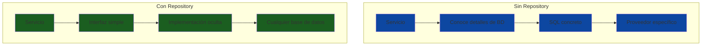
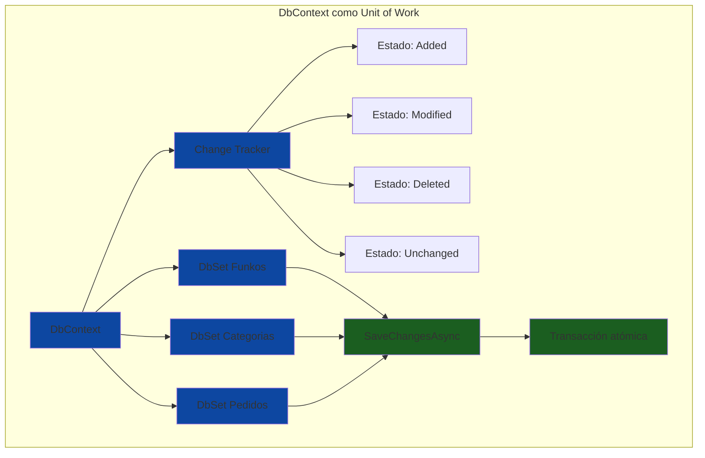
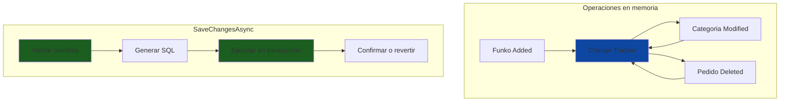
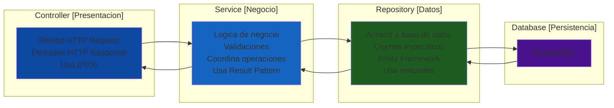

# 6. Repository Pattern

- [6. Repository Pattern](#6-repository-pattern)
  - [6.1. Introducción al Repository Pattern](#61-introducción-al-repository-pattern)
    - [6.1.1. ¿Qué es el Repository Pattern?](#611-qué-es-el-repository-pattern)
    - [6.1.2. El Problema sin Repository Pattern](#612-el-problema-sin-repository-pattern)
    - [6.1.3. La Solución con Repository Pattern](#613-la-solución-con-repository-pattern)
    - [6.1.4. Beneficios del Repository Pattern](#614-beneficios-del-repository-pattern)
  - [6.2. Arquitectura y Componentes](#62-arquitectura-y-componentes)
    - [6.2.1. Interfaz del Repositorio](#621-interfaz-del-repositorio)
    - [6.2.2. Implementación del Repositorio](#622-implementación-del-repositorio)
    - [6.2.3. Relación con DbContext](#623-relación-con-dbcontext)
  - [6.3. Repository Genérico](#63-repository-genérico)
    - [6.3.1. Interfaz IRepository](#631-interfaz-irepository)
    - [6.3.2. Implementación Genérica](#632-implementación-genérica)
    - [6.3.3. Repositorios Específicos](#633-repositorios-específicos)
  - [6.4. Operaciones CRUD](#64-operaciones-crud)
    - [6.4.1. Create (Insertar)](#641-create-insertar)
    - [6.4.2. Read (Leer)](#642-read-leer)
    - [6.4.3. Update (Actualizar)](#643-update-actualizar)
    - [6.4.4. Delete (Eliminar)](#644-delete-eliminar)
  - [6.5. Consultas Específicas](#65-consultas-específicas)
    - [6.5.1. Consultas con IQueryable](#651-consultas-con-iqueryable)
    - [6.5.2. Consultas Compuestas](#652-consultas-compuestas)
    - [6.5.3. Búsquedas y Filtros](#653-búsquedas-y-filtros)
  - [6.6. Unit of Work con EF Core](#66-unit-of-work-con-ef-core)
    - [6.6.1. DbContext como Unit of Work](#661-dbcontext-como-unit-of-work)
    - [6.6.2. Transacciones Explícitas](#662-transacciones-explícitas)
  - [6.7. Separación de Responsabilidades](#67-separación-de-responsabilidades)
    - [6.7.1. Flujo de Capas](#671-flujo-de-capas)
    - [6.7.2. Responsabilidades de Cada Capa](#672-responsabilidades-de-cada-capa)
  - [6.8. Testing con Repositorios](#68-testing-con-repositorios)
    - [6.8.1. Unit Testing con Mocks](#681-unit-testing-con-mocks)
    - [6.8.2. Integration Testing](#682-integration-testing)
  - [6.9. Buenas Prácticas](#69-buenas-prácticas)
  - [6.10. Resumen](#610-resumen)

---

## 6.1. Introducción al Repository Pattern

### 6.1.1. ¿Qué es el Repository Pattern?

El **Repository Pattern** (Patrón Repositorio) es un patrón de diseño que abstrae el acceso a datos, proporcionando una interfaz limpia para las operaciones de CRUD (Create, Read, Update, Delete) y consultas. Este patrón separa la lógica de acceso a datos de la lógica de negocio, permitiendo cambiar la implementación de persistencia (por ejemplo, de PostgreSQL a MongoDB) sin afectar el código de los servicios que lo utilizan.

🧠 **Analogía**: Imagina un biblioteca. En lugar de que cada usuario vaya directamente a la sala de archivos y busque entre miles de libros, existe un bibliotecario (el repositorio) que conoce exactamente dónde está cada libro, cómo buscarlo, y cómo organizarlo. El usuario simplemente le dice al bibliotecario qué libro necesita, y el bibliotecario se encarga de todos los detalles de la búsqueda y recuperación.



### 6.1.2. El Problema sin Repository Pattern

Sin un repositorio, los servicios contienen lógica de acceso a datos mezclada con lógica de negocio. Esto genera varios problemas:

| Problema | Descripción |
|----------|-------------|
| **Acoplamiento** | El servicio conoce detalles específicos de Entity Framework y la base de datos |
| **Dificultad de test** | No se puede facilmente substituir el acceso a base de datos para tests |
| **Duplicación** | La misma lógica de acceso se repite en múltiples servicios |
| **Cambios costivos** | Cambiar la tecnología de persistencia requiere modificar código en múltiples lugares |

```csharp
// INCORRECTO: Lógica de datos en el servicio
public class FunkoService
{
    private readonly ApplicationDbContext _context;
    
    public FunkoService(ApplicationDbContext context)
    {
        _context = context;
    }
    
    public async Task<Funko?> GetById(int id)
    {
        // El servicio conoce detalles de EF Core
        return await _context.Funkos.FindAsync(id);
    }
    
    public async Task<List<Funko>> GetByCategoria(int categoriaId)
    {
        // El servicio construye queries manualmente
        return await _context.Funkos
            .Where(f => f.CategoriaId == categoriaId)
            .Include(f => f.Categoria)
            .ToListAsync();
    }
    
    public async Task<bool> ExistsByNombre(string nombre)
    {
        // El servicio sabe cómo verificar duplicados
        return await _context.Funkos.AnyAsync(f => f.Nombre == nombre);
    }
    
    public async Task<Funko> Create(Funko funko)
    {
        _context.Funkos.Add(funko);
        await _context.SaveChangesAsync();
        return funko;
    }
}
```

💡 **Tip del Examinador**: Un servicio que directamente usa DbContext y construye queries LINQ viola el principio de separación de responsabilidades. El código funciona, pero no es mantenible ni testeable.

### 6.1.3. La Solución con Repository Pattern

Con el Repository Pattern, el servicio solo conoce la interfaz del repositorio, no su implementación. El repositorio encapsula todo el acceso a datos, exponiendo métodos claros y específicos.

```csharp
// CORRECTO: Repository con interfaz
public interface IFunkoRepository
{
    Task<Funko?> FindById(int id);
    Task<List<Funko>> GetAll();
    Task<List<Funko>> GetByCategoriaId(int categoriaId);
    Task<bool> ExistsByNombre(string nombre);
    Task<Funko> Save(Funko funko);
    Task<Funko> Update(Funko funko);
    Task<bool> Delete(int id);
}

public class FunkoRepository(ApplicationDbContext context, ILogger<FunkoRepository> logger) : IFunkoRepository
{
    public async Task<Funko?> FindById(int id)
    {
        _logger.LogDebug("Buscando funko por ID: {Id}", id);
        return await context.Funkos.FindAsync(id);
    }

    public async Task<List<Funko>> GetAll()
    {
        _logger.LogDebug("Obteniendo todos los funkos");
        return await context.Funkos.ToListAsync();
    }

    public async Task<List<Funko>> GetByCategoriaId(int categoriaId)
    {
        _logger.LogDebug("Obteniendo funkos por categoría: {CategoriaId}", categoriaId);
        return await context.Funkos
            .Where(f => f.CategoriaId == categoriaId)
            .ToListAsync();
    }

    public async Task<bool> ExistsByNombre(string nombre)
    {
        return await context.Funkos.AnyAsync(f => f.Nombre == nombre);
    }

    public async Task<Funko> Save(Funko funko)
    {
        _logger.LogInformation("Guardando funko: {Nombre}", funko.Nombre);
        context.Funkos.Add(funko);
        await context.SaveChangesAsync();
        return funko;
    }

    public async Task<Funko> Update(Funko funko)
    {
        _logger.LogInformation("Actualizando funko: {Id}", funko.Id);
        context.Funkos.Update(funko);
        await context.SaveChangesAsync();
        return funko;
    }

    public async Task<bool> Delete(int id)
    {
        var funko = await context.Funkos.FindAsync(id);
        if (funko == null) return false;

        context.Funkos.Remove(funko);
        await _context.SaveChangesAsync();
        return true;
    }
}

// Servicio que usa el repositorio
public class FunkoService
{
    private readonly IFunkoRepository _repository;
    
    // El servicio solo conoce la interfaz
    public FunkoService(IFunkoRepository repository)
    {
        _repository = repository;
    }
    
    public async Task<Funko?> GetById(int id)
    {
        return await _repository.FindById(id);
    }
}
```

### 6.1.4. Beneficios del Repository Pattern


| Beneficio | Descripción |
|-----------|-------------|
| **Desacoplamiento** | Los servicios no dependen de Entity Framework ni de la base de datos específica |
| **Testabilidad** | Se pueden crear mocks del repositorio para tests unitarios |
| **Mantenibilidad** | La lógica de acceso a datos está centralizada en un solo lugar |
| **Reusabilidad** | Los queries complejos se escriben una vez y se reutilizan |
| **Flexibilidad** | Se puede cambiar la implementación sin afectar los consumidores |

---

## 6.2. Arquitectura y Componentes

### 6.2.1. Interfaz del Repositorio

La interfaz del repositorio define qué operaciones están disponibles para una entidad, sin revelar cómo se implementan. Una buena interfaz es específica para la entidad, tiene métodos con nombres claros, y devuelve tipos que se integran naturalmente con el patrón Result.

```csharp
using CSharpFunctionalExtensions;

namespace FunkosApi.Core.Interfaces;

public interface IFunkoRepository
{
    // === CONSULTAS ===
    
    /// <summary>
    /// Busca un funko por su ID
    /// </summary>
    Task<Funko?> FindById(int id);
    
    /// <summary>
    /// Busca un funko por su ID con Result Pattern
    /// </summary>
    Task<Result<Funko, DomainError>> FindByIdAsync(int id);
    
    /// <summary>
    /// Obtiene todos los funkos
    /// </summary>
    Task<List<Funko>> GetAll();
    
    /// <summary>
    /// Obtiene funkos por categoría
    /// </summary>
    Task<List<Funko>> GetByCategoriaId(int categoriaId);
    
    /// <summary>
    /// Obtiene funkos por una lista de IDs
    /// </summary>
    Task<List<Funko>> GetByIds(IEnumerable<int> ids);
    
    // === VERIFICACIONES ===
    
    /// <summary>
    /// Verifica si existe un funko por ID
    /// </summary>
    Task<bool> ExistsById(int id);
    
    /// <summary>
    /// Verifica si existe un funko por nombre
    /// </summary>
    Task<bool> ExistsByNombre(string nombre);
    
    // === BÚSQUEDAS ===
    
    /// <summary>
    /// Busca funkos por término
    /// </summary>
    Task<List<Funko>> Search(string termino, int limite = 10);
    
    // === MODIFICACIÓN ===
    
    /// <summary>
    /// Guarda un nuevo funko
    /// </summary>
    Task<Result<Funko, DomainError>> SaveAsync(Funko funko);
    
    /// <summary>
    /// Actualiza un funko existente
    /// </summary>
    Task<Result<Funko, DomainError>> UpdateAsync(Funko funko);
    
    /// <summary>
    /// Elimina un funko por ID
    /// </summary>
    Task<UnitResult<DomainError>> DeleteAsync(int id);
}
```

📝 **Nota del Profesor**: Observa que la interfaz incluye métodos tanto síncronos como asíncronos. En aplicaciones modernas, siempre preferimos métodos asíncronos para no bloquear hilos del thread pool. Los métodos que devuelven `Result` o `UnitResult` se integran con el patrón Result para manejo explícito de errores.

### 6.2.2. Implementación del Repositorio

La implementación del repositorio usa Entity Framework Core para interactuar con la base de datos. EF Core proporciona métodos asíncronos, change tracking, y queries LINQ que facilitan la implementación.

```csharp
using Microsoft.EntityFrameworkCore;
using Microsoft.Extensions.Logging;

namespace FunkosApi.Core.Repositories;

public class FunkoRepository(
    ApplicationDbContext context,
    ILogger<FunkoRepository> logger) : IFunkoRepository
{
    public async Task<Funko?> FindById(int id)
    {
        _logger.LogDebug("Buscando funko por ID: {Id}", id);
        return await context.Funkos.FindAsync(id);
    }

    public async Task<Result<Funko, DomainError>> FindByIdAsync(int id)
    {
        _logger.LogDebug("Buscando funko por ID: {Id}", id);
        
        var funko = await context.Funkos.FindAsync(id);
        
        if (funko == null)
            return Result.Failure<Funko, DomainError>(
                DomainError.NotFound($"Funko {id} no encontrado"));
        
        return Result.Success<Funko, DomainError>(funko);
    }

    public async Task<List<Funko>> GetAll()
    {
        _logger.LogDebug("Obteniendo todos los funkos");
        return await context.Funkos.ToListAsync();
    }

    public async Task<List<Funko>> GetByCategoriaId(int categoriaId)
    {
        _logger.LogDebug("Obteniendo funkos por categoría: {CategoriaId}", categoriaId);
        
        return await context.Funkos
            .Where(f => f.CategoriaId == categoriaId)
            .ToListAsync();
    }

    public async Task<List<Funko>> GetByIds(IEnumerable<int> ids)
    {
        return await context.Funkos
            .Where(f => ids.Contains(f.Id))
            .ToListAsync();
    }

    public async Task<bool> ExistsById(int id)
    {
        return await context.Funkos.AnyAsync(f => f.Id == id);
    }

    public async Task<bool> ExistsByNombre(string nombre)
    {
        return await context.Funkos.AnyAsync(f => f.Nombre == nombre);
    }

    public async Task<List<Funko>> Search(string termino, int limite = 10)
    {
        return await context.Funkos
            .Where(f => f.Nombre.Contains(termino) || 
                       (f.Descripcion != null && f.Descripcion.Contains(termino)))
            .Take(limite)
            .ToListAsync();
    }

    public async Task<Result<Funko, DomainError>> SaveAsync(Funko funko)
    {
        _logger.LogInformation("Guardando funko: {Nombre}", funko.Nombre);
        
        context.Funkos.Add(funko);
        
        try
        {
            await _context.SaveChangesAsync();
            return Result.Success<Funko, DomainError>(funko);
        }
        catch (DbUpdateException ex)
        {
            _logger.LogError(ex, "Error al guardar funko: {Nombre}", funko.Nombre);
            return Result.Failure<Funko, DomainError>(
                DomainError.Internal("Error al guardar el funko"));
        }
    }

    public async Task<Result<Funko, DomainError>> UpdateAsync(Funko funko)
    {
        _logger.LogInformation("Actualizando funko: {Id}", funko.Id);
        
        _context.Funkos.Update(funko);
        
        try
        {
            await _context.SaveChangesAsync();
            return Result.Success<Funko, DomainError>(funko);
        }
        catch (DbUpdateConcurrencyException ex)
        {
            _logger.LogError(ex, "Concurrencia al actualizar funko: {Id}", funko.Id);
            return Result.Failure<Funko, DomainError>(
                DomainError.Conflict("El funko fue modificado por otro usuario"));
        }
    }

    public async Task<UnitResult<DomainError>> DeleteAsync(int id)
    {
        _logger.LogInformation("Eliminando funko: {Id}", id);
        
        var funko = await _context.Funkos.FindAsync(id);
        if (funko == null)
            return UnitResult.Failure<DomainError>(
                DomainError.NotFound($"Funko {id} no encontrado"));
        
        _context.Funkos.Remove(funko);
        
        try
        {
            await _context.SaveChangesAsync();
            return UnitResult.Success<DomainError>();
        }
        catch (DbUpdateException ex)
        {
            _logger.LogError(ex, "Error al eliminar funko: {Id}", id);
            return UnitResult.Failure<DomainError>(
                DomainError.Internal("Error al eliminar el funko"));
        }
    }
}
```

💡 **Tip del Examinador**: El repositorio siempre debe capturar excepciones específicas como `DbUpdateException` y `DbUpdateConcurrencyException` y convertirlas a errores del dominio. Esto mantiene la consistencia con el patrón Result.

### 6.2.3. Relación con DbContext

Entity Framework Core ya implementa el patrón Unit of Work a través del DbContext. El DbContext mantiene un tracker de cambios y `SaveChangesAsync()` persiste todas las modificaciones pendientes en una sola transacción. Esto significa que no necesitas implementar Unit of Work manualmente.



```csharp
// DbContext actúa como Unit of Work
public class ApplicationDbContext : DbContext
{
    public DbSet<Funko> Funkos { get; set; } = null!;
    public DbSet<Categoria> Categorias { get; set; } = null!;
    public DbSet<Pedido> Pedidos { get; set; } = null!;
    
    // SaveChangesAsync persiste todos los cambios pendientes
    // en una transacción atómica
}

// Uso en un servicio
public class PedidosService
{
    private readonly ApplicationDbContext _context;
    private readonly IFunkoRepository _funkoRepository;
    
    public PedidosService(
        ApplicationDbContext context,
        IFunkoRepository funkoRepository)
    {
        _context = context;
        _funkoRepository = funkoRepository;
    }
    
    public async Task<Pedido> CrearPedido(PedidoCreateDto dto)
    {
        // Múltiples operaciones en una transacción implícita del DbContext
        var pedido = new Pedido { ClienteId = dto.ClienteId };
        _context.Pedidos.Add(pedido);
        
        foreach (var item in dto.Items)
        {
            var funko = await _funkoRepository.FindById(item.FunkoId);
            funko.Stock -= item.Cantidad;
            _context.PedidoItems.Add(new PedidoItem
            {
                Pedido = pedido,
                FunkoId = item.FunkoId,
                Cantidad = item.Cantidad,
                PrecioUnitario = funko.Precio
            });
        }
        
        // SaveChangesAsync persiste TODO en una transacción
        await _context.SaveChangesAsync();
        
        return pedido;
    }
}
```

---

## 6.3. Repository Genérico

### 6.3.1. Interfaz IRepository<T>

Para evitar repetición, puedes crear un repositorio genérico con las operaciones CRUD básicas que todas las entidades comparten.

```csharp
namespace FunkosApi.Core.Interfaces;

public interface IRepository<T> where T : class
{
    // Consultas básicas
    Task<T?> FindById(long id);
    Task<List<T>> GetAll();
    Task<List<T>> GetByIds(IEnumerable<long> ids);
    
    // Verificaciones
    Task<bool> ExistsById(long id);
    
    // Modificación
    Task<T> Save(T entity);
    Task<T> Update(T entity);
    Task<bool> Delete(long id);
}
```

### 6.3.2. Implementación Genérica

```csharp
using Microsoft.EntityFrameworkCore;
using Microsoft.Extensions.Logging;

namespace FunkosApi.Core.Repositories;

public class Repository<T> : IRepository<T> where T : class
{
    protected readonly ApplicationDbContext _context;
    protected readonly ILogger<Repository<T>> _logger;
    protected readonly DbSet<T> _dbSet;

    public Repository(
        ApplicationDbContext context,
        ILogger<Repository<T>> logger)
    {
        _context = context;
        _logger = logger;
        _dbSet = context.Set<T>();
    }

    public virtual async Task<T?> FindById(long id)
    {
        _logger.LogDebug("Buscando entidad {EntityType} por ID: {Id}", typeof(T).Name, id);
        return await _dbSet.FindAsync(id);
    }

    public virtual async Task<List<T>> GetAll()
    {
        _logger.LogDebug("Obteniendo todas las entidades {EntityType}", typeof(T).Name);
        return await _dbSet.ToListAsync();
    }

    public virtual async Task<List<T>> GetByIds(IEnumerable<long> ids)
    {
        return await _dbSet
            .Where(e => EF.Property<long>(e, "Id").In(ids))
            .ToListAsync();
    }

    public virtual async Task<bool> ExistsById(long id)
    {
        return await _dbSet.AnyAsync(e => EF.Property<long>(e, "Id") == id);
    }

    public virtual async Task<T> Save(T entity)
    {
        _logger.LogInformation("Guardando entidad {EntityType}", typeof(T).Name);
        _dbSet.Add(entity);
        await _context.SaveChangesAsync();
        return entity;
    }

    public virtual async Task<T> Update(T entity)
    {
        _logger.LogInformation("Actualizando entidad {EntityType}", typeof(T).Name);
        _dbSet.Update(entity);
        await _context.SaveChangesAsync();
        return entity;
    }

    public virtual async Task<bool> Delete(long id)
    {
        var entity = await FindById(id);
        if (entity == null) return false;

        _dbSet.Remove(entity);
        await _context.SaveChangesAsync();
        return true;
    }
}
```

### 6.3.3. Repositorios Específicos

Los repositorios específicos heredan del repositorio genérico y añaden métodos específicos para cada entidad.

```csharp
// Interfaz específica para Funko
public interface IFunkoRepository : IRepository<Funko>
{
    // Métodos específicos de Funko
    Task<List<Funko>> GetByCategoriaId(int categoriaId);
    Task<bool> ExistsByNombre(string nombre);
    Task<List<Funko>> Search(string termino, int limite = 10);
    Task<List<Funko>> GetConStock();
    Task<decimal> GetPrecioPromedio();
    Task<Dictionary<int, int>> GetStockPorCategoria();
    Task<PagedList<Funko>> GetPaged(int page, int pageSize);
}

// Implementación específica
public class FunkoRepository : Repository<Funko>, IFunkoRepository
{
    public FunkoRepository(
        ApplicationDbContext context,
        ILogger<FunkoRepository> logger)
        : base(context, logger)
    {
    }

    public async Task<List<Funko>> GetByCategoriaId(int categoriaId)
    {
        _logger.LogDebug("Obteniendo funkos por categoría: {CategoriaId}", categoriaId);
        
        return await _context.Funkos
            .Where(f => f.CategoriaId == categoriaId)
            .Include(f => f.Categoria)
            .OrderBy(f => f.Nombre)
            .ToListAsync();
    }

    public async Task<bool> ExistsByNombre(string nombre)
    {
        return await _context.Funkos.AnyAsync(f => f.Nombre == nombre);
    }

    public async Task<List<Funko>> Search(string termino, int limite = 10)
    {
        return await _context.Funkos
            .Where(f => f.Nombre.Contains(termino) || 
                       (f.Descripcion != null && f.Descripcion.Contains(termino)))
            .Take(limite)
            .ToListAsync();
    }

    public async Task<List<Funko>> GetConStock()
    {
        return await _context.Funkos
            .Where(f => f.Stock > 0)
            .OrderBy(f => f.Nombre)
            .ToListAsync();
    }

    public async Task<decimal> GetPrecioPromedio()
    {
        return await _context.Funkos
            .AverageAsync(f => f.Precio);
    }

    public async Task<Dictionary<int, int>> GetStockPorCategoria()
    {
        return await _context.Funkos
            .GroupBy(f => f.CategoriaId)
            .ToDictionaryAsync(
                g => g.Key,
                g => g.Sum(f => f.Stock));
    }

    public async Task<PagedList<Funko>> GetPaged(int page, int pageSize)
    {
        var total = await _context.Funkos.CountAsync();
        var items = await _context.Funkos
            .OrderBy(f => f.Id)
            .Skip((page - 1) * pageSize)
            .Take(pageSize)
            .ToListAsync();
        
        return new PagedList<Funko>(items, total, page, pageSize);
    }
}
```

---

## 6.4. Operaciones CRUD

### 6.4.1. Create (Insertar)

```csharp
public async Task<Result<Funko, DomainError>> CreateAsync(FunkoCreateDto dto)
{
    // Validación de negocio
    if (await _repository.ExistsByNombre(dto.Nombre))
        return Result.Failure<Funko, DomainError>(
            DomainError.Conflict("Ya existe un funko con ese nombre"));
    
    var funko = new Funko
    {
        Nombre = dto.Nombre,
        Descripcion = dto.Descripcion,
        Precio = dto.Precio,
        Stock = dto.Stock,
        CategoriaId = dto.CategoriaId,
        FechaCreacion = DateTime.UtcNow
    };
    
    return await _repository.SaveAsync(funko);
}
```

### 6.4.2. Read (Leer)

```csharp
// Por ID
public async Task<Result<FunkoDto, DomainError>> GetByIdAsync(int id)
{
    var funkoResult = await _repository.FindByIdAsync(id);
    
    return funkoResult.Map(funko => new FunkoDto
    {
        Id = funko.Id,
        Nombre = funko.Nombre,
        Precio = funko.Precio,
        CategoriaNombre = funko.Categoria.Nombre
    });
}

// Todos con paginación
public async Task<PagedList<FunkoDto>> GetAllAsync(int page, int pageSize)
{
    var funkos = await _repository.GetPaged(page, pageSize);
    
    return funkos.Map(funko => new FunkoDto
    {
        Id = funko.Id,
        Nombre = funko.Nombre,
        Precio = funko.Precio
    });
}

// Por categoría
public async Task<List<FunkoDto>> GetByCategoriaAsync(int categoriaId)
{
    var funkos = await _repository.GetByCategoriaId(categoriaId);
    
    return funkos.Select(f => new FunkoDto
    {
        Id = f.Id,
        Nombre = f.Nombre,
        Precio = f.Precio
    }).ToList();
}
```

### 6.4.3. Update (Actualizar)

```csharp
public async Task<Result<FunkoDto, DomainError>> UpdateAsync(int id, FunkoUpdateDto dto)
{
    var funkoResult = await _repository.FindByIdAsync(id);
    
    if (funkoResult.IsFailure)
        return Result.Failure<FunkoDto, DomainError>(funkoResult.Error);
    
    var funko = funkoResult.Value;
    
    // Verificar nombre único (excluyendo el actual)
    if (funko.Nombre != dto.Nombre && 
        await _repository.ExistsByNombre(dto.Nombre))
    {
        return Result.Failure<FunkoDto, DomainError>(
            DomainError.Conflict("Ya existe un funko con ese nombre"));
    }
    
    funko.Nombre = dto.Nombre;
    funko.Descripcion = dto.Descripcion;
    funko.Precio = dto.Precio;
    funko.Stock = dto.Stock;
    funko.FechaActualizacion = DateTime.UtcNow;
    
    var updateResult = await _repository.UpdateAsync(funko);
    
    return updateResult.Map(f => new FunkoDto
    {
        Id = f.Id,
        Nombre = f.Nombre,
        Precio = f.Precio
    });
}
```

### 6.4.4. Delete (Eliminar)

```csharp
public async Task<UnitResult<DomainError>> DeleteAsync(int id)
{
    // Verificar si existe
    if (!await _repository.ExistsById(id))
        return UnitResult.Failure<DomainError>(
            DomainError.NotFound($"Funko {id} no encontrado"));
    
    return await _repository.DeleteAsync(id);
}
```

---

## 6.5. Consultas Específicas

### 6.5.1. Consultas con IQueryable

El uso de `IQueryable` permite construir consultas que se ejecutan en la base de datos, no en memoria. Esto es crucial para el rendimiento cuando se trabaja con grandes volúmenes de datos.

```csharp
public async Task<PagedList<FunkoDto>> GetFunkosFiltradosAsync(
    FunkoFilterParams filterParams,
    PaginationParams paginationParams)
{
    IQueryable<Funko> query = _context.Funkos
        .Include(f => f.Categoria)
        .AsNoTracking(); // Optimización para consultas de solo lectura
    
    // Aplicar filtros dinámicos
    if (!string.IsNullOrEmpty(filterParams.Nombre))
    {
        query = query.Where(f => f.Nombre.Contains(filterParams.Nombre));
    }
    
    if (filterParams.CategoriaId.HasValue)
    {
        query = query.Where(f => f.CategoriaId == filterParams.CategoriaId);
    }
    
    if (filterParams.PrecioMin.HasValue)
    {
        query = query.Where(f => f.Precio >= filterParams.PrecioMin);
    }
    
    if (filterParams.PrecioMax.HasValue)
    {
        query = query.Where(f => f.Precio <= filterParams.PrecioMax);
    }
    
    if (filterParams.SoloConStock)
    {
        query = query.Where(f => f.Stock > 0);
    }
    
    // Ordenación
    query = filterParams.OrdenarPor switch
    {
        "nombre" => filterParams.OrdenAscendente 
            ? query.OrderBy(f => f.Nombre) 
            : query.OrderByDescending(f => f.Nombre),
        "precio" => filterParams.OrdenAscendente 
            ? query.OrderBy(f => f.Precio) 
            : query.OrderByDescending(f => f.Precio),
        "fecha" => filterParams.OrdenAscendente 
            ? query.OrderBy(f => f.FechaCreacion) 
            : query.OrderByDescending(f => f.FechaCreacion),
        _ => query.OrderBy(f => f.Id)
    };
    
    // Crear paginación
    return await PagedList<FunkoDto>.CreateAsync(
        query.Select(f => new FunkoDto
        {
            Id = f.Id,
            Nombre = f.Nombre,
            Precio = f.Precio,
            Stock = f.Stock,
            CategoriaNombre = f.Categoria.Nombre
        }),
        paginationParams.PageNumber,
        paginationParams.PageSize);
}
```

### 6.5.2. Consultas Compuestas

```csharp
public class FunkoRepository : IFunkoRepository
{
    public async Task<Funko?> FindByIdWithCategoria(int id)
    {
        return await _context.Funkos
            .Include(f => f.Categoria)
            .FirstOrDefaultAsync(f => f.Id == id);
    }
    
    public async Task<List<Funko>> GetFunkosConCategoriaYReviews(int categoriaId)
    {
        return await _context.Funkos
            .Where(f => f.CategoriaId == categoriaId)
            .Include(f => f.Categoria)
            .Include(f => f.Reviews)
            .ThenInclude(r => r.Usuario)
            .ToListAsync();
    }
    
    public async Task<Dictionary<string, int>> GetEstadisticasPorCategoria()
    {
        return await _context.Funkos
            .GroupBy(f => f.Categoria.Nombre)
            .OrderByDescending(g => g.Count())
            .ToDictionaryAsync(
                g => g.Key,
                g => g.Count());
    }
    
    public async Task<(List<Funko> Funkos, int Total)> GetFunkosPaginados(
        int page, 
        int pageSize,
        string? nombreFiltro = null)
    {
        var query = _context.Funkos.AsQueryable();
        
        if (!string.IsNullOrEmpty(nombreFiltro))
        {
            query = query.Where(f => f.Nombre.Contains(nombreFiltro));
        }
        
        var total = await query.CountAsync();
        var items = await query
            .OrderBy(f => f.Nombre)
            .Skip((page - 1) * pageSize)
            .Take(pageSize)
            .ToListAsync();
        
        return (items, total);
    }
}
```

### 6.5.3. Búsquedas y Filtros

```csharp
public async Task<List<FunkoDto>> BuscarAsync(string busqueda)
{
    var termino = busqueda.Trim().ToLower();
    
    return await _context.Funkos
        .Where(f => 
            f.Nombre.ToLower().Contains(termino) ||
            f.Descripcion != null && f.Descripcion.ToLower().Contains(termino) ||
            f.Categoria.Nombre.ToLower().Contains(termino))
        .Select(f => new FunkoDto
        {
            Id = f.Id,
            Nombre = f.Nombre,
            Precio = f.Precio,
            CategoriaNombre = f.Categoria.Nombre
        })
        .ToListAsync();
}

public async Task<List<Funko>> GetFunkosPorRangoPrecio(decimal precioMin, decimal precioMax)
{
    return await _context.Funkos
        .Where(f => f.Precio >= precioMin && f.Precio <= precioMax)
        .OrderBy(f => f.Precio)
        .ToListAsync();
}

public async Task<List<Funko>> GetTopFunkosPorStock(int topN)
{
    return await _context.Funkos
        .OrderByDescending(f => f.Stock)
        .Take(topN)
        .ToListAsync();
}
```

---

## 6.6. Unit of Work con EF Core

### 6.6.1. DbContext como Unit of Work

Entity Framework Core ya implementa el patrón Unit of Work internamente. El DbContext rastrea todos los cambios realizados a las entidades y los persiste en una sola transacción cuando llamas a `SaveChangesAsync()`.



```csharp
public class PedidosService
{
    private readonly ApplicationDbContext _context;
    private readonly IFunkoRepository _funkoRepository;

    public PedidosService(
        ApplicationDbContext context,
        IFunkoRepository funkoRepository)
    {
        _context = context;
        _funkoRepository = funkoRepository;
    }

    public async Task<Pedido> CrearPedido(PedidoCreateDto dto)
    {
        // Múltiples operaciones en una transacción implícita del DbContext
        var pedido = new Pedido 
        { 
            ClienteId = dto.ClienteId,
            FechaPedido = DateTime.UtcNow,
            Estado = PedidoEstado.Pendiente
        };
        
        _context.Pedidos.Add(pedido);

        foreach (var item in dto.Items)
        {
            var funko = await _funkoRepository.FindById(item.FunkoId);
            if (funko == null)
                throw new InvalidOperationException($"Funko {item.FunkoId} no encontrado");
            
            if (funko.Stock < item.Cantidad)
                throw new InvalidOperationException($"Stock insuficiente para {funko.Nombre}");
            
            // Actualizar stock
            funko.Stock -= item.Cantidad;
            _context.Funkos.Update(funko);
            
            // Crear ítem de pedido
            _context.PedidoItems.Add(new PedidoItem
            {
                Pedido = pedido,
                FunkoId = item.FunkoId,
                Cantidad = item.Cantidad,
                PrecioUnitario = funko.Precio
            });
        }

        // TODO se persiste en una sola transacción
        await _context.SaveChangesAsync();

        return pedido;
    }
}
```

### 6.6.2. Transacciones Explícitas

Aunque DbContext usa transacciones implícitas, a veces necesitas transacciones explícitas que abarquen múltiples operaciones o múltiples DbContexts.

```csharp
public class PedidosService
{
    private readonly ApplicationDbContext _context;
    private readonly IFunkoRepository _funkoRepository;
    private readonly IInventoryService _inventoryService;

    public async Task<Pedido> CrearPedidoConTransaccion(PedidoCreateDto dto)
    {
        // Iniciar transacción explícita
        using var transaction = await _context.Database.BeginTransactionAsync();
        
        try
        {
            var pedido = new Pedido { ClienteId = dto.ClienteId };
            _context.Pedidos.Add(pedido);
            
            foreach (var item in dto.Items)
            {
                var funko = await _funkoRepository.FindById(item.FunkoId);
                funko.Stock -= item.Cantidad;
                _context.Funkos.Update(funko);
                
                _context.PedidoItems.Add(new PedidoItem
                {
                    Pedido = pedido,
                    FunkoId = item.FunkoId,
                    Cantidad = item.Cantidad,
                    PrecioUnitario = funko.Precio
                });
            }
            
            await _context.SaveChangesAsync();
            
            // Transacción anidada para actualizar inventario
            await _inventoryService.ActualizarInventarioAsync(pedido.Id);
            
            // Confirmar transacción
            await transaction.CommitAsync();
            
            return pedido;
        }
        catch (Exception)
        {
            // Revertir si algo falla
            await transaction.RollbackAsync();
            throw;
        }
    }
}
```

---

## 6.7. Separación de Responsabilidades

### 6.7.1. Flujo de Capas



### 6.7.2. Responsabilidades de Cada Capa

| Capa | Responsabilidad | Ejemplo |
|------|-----------------|---------|
| **Controller** | Recibir HTTP requests, validar inputs básicos, devolver responses | `[HttpPost]`, `return Ok()` |
| **Service** | Lógica de negocio, validaciones, coordinar repositorios, Result Pattern | `CreateAsync()`, `Validate()` |
| **Repository** | Acceso a datos, queries, EF Core, entidades | `FindById()`, `GetByCategoriaId()` |
| **Database** | Persistencia, integridad referencial, transacciones | PostgreSQL |

```csharp
// === CONTROLLER ===
[HttpPost]
public async Task<IActionResult> Create([FromBody] FunkoCreateDto dto)
{
    // El controlador no sabe de base de datos
    var resultado = await _service.CreateAsync(dto);
    
    return resultado.Match(
        funko => CreatedAtAction(nameof(GetById), new { id = funko.Id }, funko),
        error => BadRequest(error));
}

// === SERVICE ===
public async Task<Result<FunkoDto, DomainError>> CreateAsync(FunkoCreateDto dto)
{
    // El servicio no sabe cómo se guarda en la base de datos
    if (await _repository.ExistsByNombre(dto.Nombre))
        return Result.Failure<FunkoDto, DomainError>(
            DomainError.Conflict("Ya existe un funko con ese nombre"));
    
    var funko = dto.ToEntity();
    var resultado = await _repository.SaveAsync(funko);
    
    return resultado.Map(f => f.ToDto());
}

// === REPOSITORY ===
public async Task<Result<Funko, DomainError>> SaveAsync(Funko funko)
{
    // El repositorio no sabe de lógica de negocio
    _context.Funkos.Add(funko);
    await _context.SaveChangesAsync();
    return funko;
}
```

---

## 6.8. Testing con Repositorios

### 6.8.1. Unit Testing con Mocks

```csharp
using NUnit.Framework;
using Moq;
using FluentAssertions;

namespace FunkosApi.Tests.Services;

[TestFixture]
public class FunkoServiceTests
{
    private readonly Mock<IFunkoRepository> _repositoryMock = null!;
    private readonly Mock<ILogger<FunkoService>> _loggerMock = null!;
    private readonly FunkoService _service = null!;

    [SetUp]
    public void Setup()
    {
        _repositoryMock = new Mock<IFunkoRepository>();
        _loggerMock = new Mock<ILogger<FunkoService>>();
        _service = new FunkoService(_repositoryMock.Object, _loggerMock.Object);
    }

    [Test]
    public async Task GetById_ExistingFunko_ReturnsFunko()
    {
        // Arrange
        var funko = new Funko 
        { 
            Id = 1, 
            Nombre = "Iron Man", 
            Precio = 34.99m 
        };
        
        _repositoryMock.Setup(r => r.FindByIdAsync(1))
            .ReturnsAsync(Result.Success<Funko, DomainError>(funko));

        // Act
        var resultado = await _service.GetByIdAsync(1);

        // Assert
        resultado.IsSuccess.Should().BeTrue();
        resultado.Value.Nombre.Should().Be("Iron Man");
    }

    [Test]
    public async Task GetById_NonExistingFunko_ReturnsNotFound()
    {
        // Arrange
        _repositoryMock.Setup(r => r.FindByIdAsync(999))
            .ReturnsAsync(Result.Failure<Funko, DomainError>(
                DomainError.NotFound("Funko 999 no encontrado")));

        // Act
        var resultado = await _service.GetByIdAsync(999);

        // Assert
        resultado.IsFailure.Should().BeTrue();
        resultado.Error.Should().BeOfType<DomainError.NotFound>();
    }

    [Test]
    public async Task Create_DuplicateNombre_ReturnsConflict()
    {
        // Arrange
        var dto = new FunkoCreateDto { Nombre = "Iron Man", Precio = 34.99m };
        
        _repositoryMock.Setup(r => r.ExistsByNombre("Iron Man"))
            .ReturnsAsync(true);

        // Act
        var resultado = await _service.CreateAsync(dto);

        // Assert
        resultado.IsFailure.Should().BeTrue();
        resultado.Error.Should().BeOfType<DomainError.Conflict>();
    }
}
```

### 6.8.2. Integration Testing

```csharp
using Microsoft.EntityFrameworkCore;
using Testcontainers.PostgreSql;
using NUnit.Framework;

namespace FunkosApi.Tests.Integration;

[TestFixture]
public class FunkoRepositoryIntegrationTests : IAsyncLifetime
{
    private PostgreSqlContainer _container = null!;
    private ApplicationDbContext _context = null!;
    private FunkoRepository _repository = null!;

    [SetUp]
    public async Task Setup()
    {
        _container = new PostgreSqlBuilder()
            .WithImage("postgres:latest")
            .Build();
        
        await _container.StartAsync();
        
        var options = new DbContextOptionsBuilder<ApplicationDbContext>()
            .UseNpgsql(_container.GetConnectionString())
            .Options;
        
        _context = new ApplicationDbContext(options);
        _context.Database.Migrate();
        
        var logger = Mock.Of<ILogger<FunkoRepository>>();
        _repository = new FunkoRepository(_context, logger);
    }

    [TearDown]
    public async Task TearDown()
    {
        await _container.StopAsync();
    }

    [Test]
    public async Task Save_NewFunko_ReturnsFunkoWithId()
    {
        // Arrange
        var funko = new Funko 
        { 
            Nombre = "Spider-Man", 
            Precio = 29.99m,
            Stock = 10,
            CategoriaId = 1
        };

        // Act
        var resultado = await _repository.SaveAsync(funko);

        // Assert
        resultado.IsSuccess.Should().BeTrue();
        resultado.Value.Id.Should().BeGreaterThan(0);
    }

    [Test]
    public async Task GetByCategoria_ReturnsFunkosDeCategoria()
    {
        // Arrange
        var categoriaId = 1;
        await _repository.SaveAsync(new Funko { Nombre = "Thor", Precio = 39.99m, CategoriaId = categoriaId });
        await _repository.SaveAsync(new Funko { Nombre = "Hulk", Precio = 44.99m, CategoriaId = categoriaId });
        await _repository.SaveAsync(new Funko { Nombre = "Mario", Precio = 24.99m, CategoriaId = 2 });

        // Act
        var funkos = await _repository.GetByCategoriaId(categoriaId);

        // Assert
        funkos.Should().HaveCount(2);
        funkos.All(f => f.CategoriaId == categoriaId).Should().BeTrue();
    }
}
```

---

## 6.9. Buenas Prácticas


| Buena Práctica | Descripción |
|----------------|-------------|
| **Usa interfaces** | Siempre define una interfaz para el repositorio |
| **Métodos asíncronos** | Usa `async/await` para todas las operaciones de E/S |
| **Logging** | Registra las operaciones importantes para debugging |
| **Result Pattern** | Integra con Result para manejo explícito de errores |
| **Unit testing** | Crea mocks de los repositorios para tests unitarios |
| **Integración testing** | Usa TestContainers para tests de integración |
| **No expongas IQueryable** | Devuelve listas ya ejecutadas, no IQueryable |

💡 **Tip del Examinador**: El Repository Pattern es fundamental para aplicaciones mantenibles y testables. En el examen, se valora que separated la lógica de acceso a datos de la lógica de negocio usando repositorios bien diseñados.

---

## 6.10. Resumen

El Repository Pattern es un patrón de diseño esencial para aplicaciones ASP.NET Core profesionales. A lo largo de este tema hemos aprendido:

| Concepto | Descripción |
|----------|-------------|
| **Repository Pattern** | Abstrae el acceso a datos, desacoplando servicios de la persistencia |
| **Interfaces** | Definen contratos claros que los servicios consumen |
| **DbContext como UoW** | EF Core ya implementa Unit of Work automáticamente |
| **Separación de responsabilidades** | Facilita el testing y mantenimiento del código |

🧠 **Analogía final**: El Repository Pattern es como el departamento de mensajería de una empresa. En lugar de que cada empleado salga a entregar paquetes personalmente (mezclando su trabajo con tareas de mensajería), hay un departamento especializado que se encarga de todas las entregas y recogidas. Esto permite que los empleados se enfoquen en su trabajo principal mientras el departamento de mensajería maneja toda la logística de forma eficiente.

---
