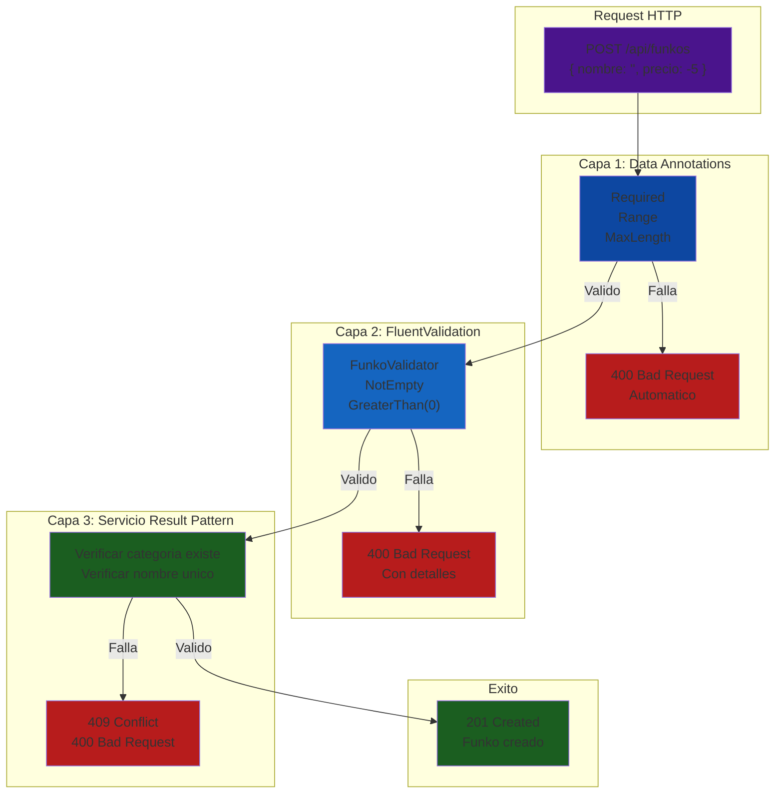
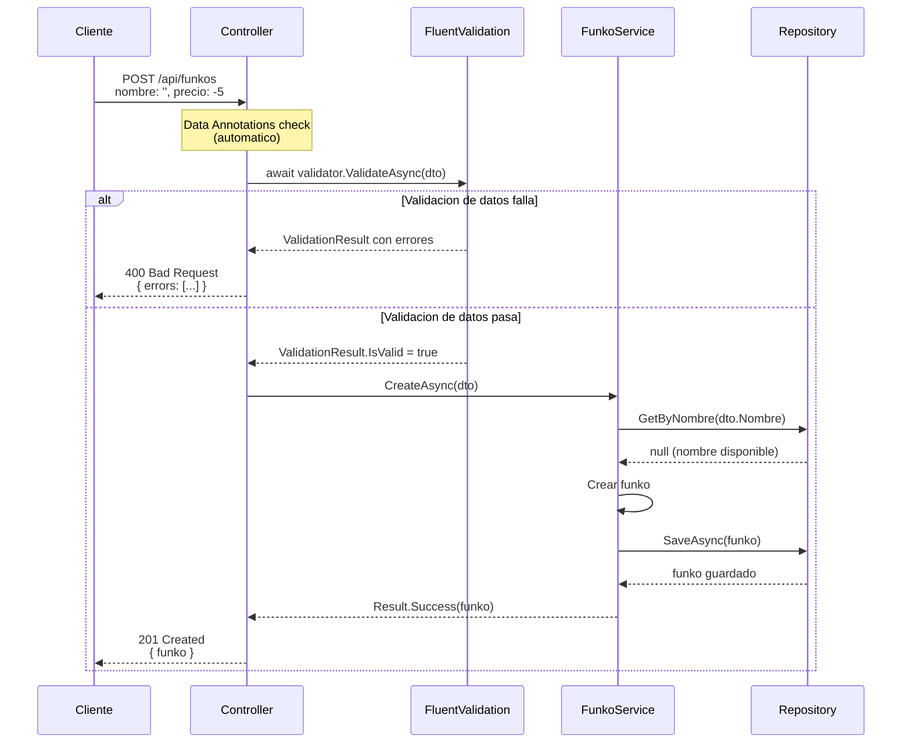

# 7. Validación en Cascada: Data Annotations + FluentValidation

- [7.1. Capas de Validación: Overview](#71-capas-de-validación-overview)
  - [7.1.1. ¿Por Qué Múltiples Capas?](#711-por-qué-múltiples-capas)
  - [7.1.2. Flujo de Validación Completo](#712-flujo-de-validación-completo)
- [7.2. Data Annotations](#72-data-annotations)
  - [7.2.1. Atributos Comunes](#721-atributos-comunes)
  - [7.2.2. Validación Automática en Controladores](#722-validación-automática-en-controladores)
  - [7.2.3. Data Annotations Personalizados](#723-data-annotations-personalizados)
- [7.3. FluentValidation](#73-fluentvalidation)
  - [7.3.1. Instalación y Configuración](#731-instalación-y-configuración)
  - [7.3.2. Validadores Básicos](#732-validadores-básicos)
  - [7.3.3. Validadores con Reglas Complejas](#733-validadores-con-reglas-complejas)
  - [7.3.4. Mensajes de Error Personalizados](#734-mensajes-de-error-personalizados)
- [7.4. Integración con ASP.NET Core](#74-integración-con-aspnet-core)
  - [7.4.1. Configuración Global](#741-configuración-global)
  - [7.4.2. Personalización de Respuestas](#742-personalización-de-respuestas)
  - [7.4.3. Validación Manual](#743-validación-manual)
- [7.5. Cuándo Usar Cada Capa](#75-cuándo-usar-cada-capa)
  - [7.5.1. Data Annotations para Formato](#751-data-annotations-para-formato)
  - [7.5.2. FluentValidation para Reglas de Negocio](#752-fluentvalidation-para-reglas-de-negocio)
  - [7.5.3. Servicios para Validación con Datos](#753-servicios-para-validación-con-datos)
- [7.6. Respuestas de Error Estandarizadas](#76-respuestas-de-error-estandarizadas)
  - [7.6.1. Formato de Error Estándar](#761-formato-de-error-estándar)
  - [7.6.2. Tipos de Errores y Códigos HTTP](#762-tipos-de-errores-y-códigos-http)
  - [7.6.3. Global Exception Handler](#763-global-exception-handler)
- [7.7. Resumen](#77-resumen)

---

## 7.1. Capas de Validación: Overview

La **validación de datos de entrada** es una de las partes más importantes de cualquier API. Una API bien validada rechaza datos inválidos antes de llegar a la lógica de negocio, proporcionando mensajes de error claros y específicos. En ASP.NET Core usamos una arquitectura de validación en tres capas que combina:

1. **Data Annotations** para validación básica de formato
2. **FluentValidation** para reglas complejas de negocio
3. **Servicios con Result Pattern** para validaciones que requieren acceso a datos

🧠 **Analogía**: La validación en cascada es como un sistema de seguridad de tres niveles en un edificio. El primer nivel (Data Annotations) verifica que la identificación sea válida. El segundo nivel (FluentValidation) verifica los permisos de acceso. El tercer nivel (servicio) verifica que la persona tenga autorización para entrar a esa área específica.

### 7.1.1. ¿Por Qué Múltiples Capas?

Cada capa de validación tiene responsabilidades específicas y diferentes. La primera capa verifica el formato básico del JSON de entrada. La segunda capa valida reglas de negocio específicas que no dependen de datos externos. La tercera capa verifica invariantes de negocio que requieren acceso a la base de datos, como verificar si un email ya existe o si una categoría está activa.



| Capa | Responsabilidad | Ejemplos | Cuándo Falla |
|------|-----------------|----------|--------------|
| **Data Annotations** | Formato de datos | Required, StringLength, Range | Datos mal formateados |
| **FluentValidation** | Reglas de negocio | Mínimo 3 caracteres, precio positivo | Reglas de negocio violadas |
| **Servicio** | Validación con datos | Categoría existe, nombre único | Datos no existen en BD |

### 7.1.2. Flujo de Validación Completo



---

## 7.2. Data Annotations

**Data Annotations** son atributos que puedes aplicar a las propiedades de tus DTOs para especificar restricciones de validación. ASP.NET Core automáticamente valida estos atributos cuando el modelo es bindeado, devolviendo errores 400 Bad Request si la validación falla. Son ideales para reglas simples que no requieren lógica compleja.

### 7.2.1. Atributos Comunes

```csharp
using System.ComponentModel.DataAnnotations;

namespace FunkosApi.Core.Dtos;

public class FunkoCreateDto
{
    [Required(ErrorMessage = "El nombre del funko es obligatorio")]
    [StringLength(200, MinimumLength = 3, ErrorMessage = "El nombre debe tener entre 3 y 200 caracteres")]
    public string Nombre { get; set; } = string.Empty;
    
    [Required(ErrorMessage = "El precio es obligatorio")]
    [Range(0.01, 1000000, ErrorMessage = "El precio debe ser mayor a 0 y menor a 1,000,000")]
    public decimal Precio { get; set; }
    
    [Required(ErrorMessage = "La categoría es obligatoria")]
    public long CategoriaId { get; set; }
    
    [StringLength(2000, ErrorMessage = "La descripción no puede exceder 2000 caracteres")]
    public string? Descripcion { get; set; }
    
    [Url(ErrorMessage = "Debe ser una URL válida")]
    public string? ImagenUrl { get; set; }
    
    [RegularExpression(@"^[A-Z0-9]{5,10}$", ErrorMessage = "El SKU debe ser alfanumérico de 5-10 caracteres")]
    public string? Sku { get; set; }
    
    [Range(0, int.MaxValue, ErrorMessage = "El stock no puede ser negativo")]
    public int Stock { get; set; }
}
```

| Atributo | Descripción | Ejemplo |
|----------|-------------|---------|
| `[Required]` | Campo obligatorio | `Nombre`, `Precio` |
| `[StringLength]` | Longitud de string | `Nombre: 3-200 chars` |
| `[Range]` | Rango numérico | `Precio: 0.01-1,000,000` |
| `[EmailAddress]` | Formato email | `usuario@email.com` |
| `[Url]` | Formato URL | `https://...` |
| `[MaxLength]` / `[MinLength]` | Longitud específica | `Descripcion: max 2000` |
| `[RegularExpression]` | Patrón regex | `SKU: 5-10 alfanuméricos` |
| `[Compare]` | Comparar dos campos | `Password == ConfirmPassword` |

### 7.2.2. Validación Automática en Controladores

Cuando usas `[ApiController]`, ASP.NET Core automáticamente valida los Data Annotations antes de que el código del controlador se ejecute. Si la validación falla, devuelve 400 Bad Request con los errores en formato JSON.

```csharp
[ApiController]
[Route("api/[controller]")]
public class FunkosController : ControllerBase
{
    private readonly IFunkoService _service;

    public FunkosController(IFunkoService service)
    {
        _service = service;
    }

    [HttpPost]
    public async Task<ActionResult<FunkoDto>> Create([FromBody] FunkoCreateDto dto)
    {
        // Si Data Annotations fallan, esto NUNCA se ejecuta
        // ASP.NET Core devuelve 400 automaticamente
        var resultado = await _service.CreateAsync(dto);
        
        return resultado.Match(
            funko => CreatedAtAction(nameof(GetById), new { id = funko.Id }, funko),
            error => BadRequest(new { error.Message }));
    }
}
```

```json
// Respuesta cuando Data Annotations fallan
// HTTP 400 Bad Request
{
  "type": "https://tools.ietf.org/html/rfc9110#section-15.5.1",
  "title": "One or more validation errors occurred.",
  "status": 400,
  "errors": {
    "Nombre": ["El nombre del funko es obligatorio"],
    "Precio": ["El precio debe ser mayor a 0 y menor a 1,000,000"],
    "CategoriaId": ["La categoría es obligatoria"]
  }
}
```

### 7.2.3. Data Annotations Personalizados

Puedes crear atributos de validación personalizados para reglas que se repiten en tu aplicación.

```csharp
// Validación de teléfono español
public class SpanishPhoneAttribute : ValidationAttribute
{
    protected override ValidationResult? IsValid(object? value, ValidationContext validationContext)
    {
        if (value == null)
            return ValidationResult.Success;
        
        var phone = value.ToString();
        
        // Teléfono español: 9 dígitos, empieza por 6, 7, 8 o 9
        if (!System.Text.RegularExpressions.Regex.IsMatch(
            phone, @"^[6-9]\d{8}$"))
        {
            return new ValidationResult(
                "Debe ser un teléfono español válido (9 dígitos)",
                new[] { validationContext.MemberName });
        }
        
        return ValidationResult.Success;
    }
}

// Uso
public class ContactoDto
{
    [SpanishPhone]
    public string Telefono { get; set; } = string.Empty;
}
```

💡 **Tip del Examinador**: Data Annotations son perfectos para validación de formato básico. No uses lógica de negocio compleja en los atributos, para eso está FluentValidation.

---

## 7.3. FluentValidation

**FluentValidation** es una librería que permite definir reglas de validación de forma fluida y expresiva, con soporte para reglas complejas, validación condicional, y mensajes de error personalizados. A diferencia de Data Annotations, las reglas se definen en clases separadas, manteniendo los DTOs limpios y enfocados en los datos.

### 7.3.1. Instalación y Configuración

```bash
# Instalar paquetes NuGet
dotnet add package FluentValidation
dotnet add package FluentValidation.DependencyInjection
```

```csharp
// Program.cs
using FluentValidation;

var builder = WebApplication.CreateBuilder(args);

// Registrar FluentValidation automaticamente
builder.Services.AddFluentValidationAutoValidation();
builder.Services.AddFluentValidationClientsideAdapters();

// Registrar validadores del assembly
builder.Services.AddValidatorsFromAssemblyContaining<Program>();
// O especificar el assembly donde están los validadores
builder.Services.AddValidatorsFromAssembly(typeof(FunkoCreateDto).Assembly);

var app = builder.Build();

app.MapControllers();
app.Run();
```

### 7.3.2. Validadores Básicos

```csharp
using FluentValidation;

namespace FunkosApi.Core.Validators;

public class FunkoCreateDtoValidator : AbstractValidator<FunkoCreateDto>
{
    public FunkoCreateDtoValidator()
    {
        // Reglas para Nombre
        RuleFor(x => x.Nombre)
            .NotEmpty().WithMessage("El nombre es obligatorio")
            .Length(3, 200).WithMessage("El nombre debe tener entre 3 y 200 caracteres")
            .Must(nombre => !nombre.Contains("<script>"))
                .WithMessage("El nombre contiene caracteres inválidos");

        // Reglas para Precio
        RuleFor(x => x.Precio)
            .GreaterThan(0).WithMessage("El precio debe ser mayor a 0")
            .LessThanOrEqualTo(1000000)
                .WithMessage("El precio no puede exceder 1,000,000");

        // Reglas para Categoría
        RuleFor(x => x.CategoriaId)
            .GreaterThan(0).WithMessage("Debe seleccionar una categoría válida");

        // Reglas para Descripción
        RuleFor(x => x.Descripcion)
            .MaximumLength(2000).WithMessage("La descripción no puede exceder 2000 caracteres")
            .When(x => !string.IsNullOrEmpty(x.Descripcion));

        // Reglas para SKU (opcional pero si viene, debe ser válido)
        RuleFor(x => x.Sku)
            .Matches(@"^[A-Z0-9]{5,10}$")
                .WithMessage("El SKU debe ser alfanumérico, mayúsculas, 5-10 caracteres")
            .When(x => !string.IsNullOrEmpty(x.Sku));
    }
}
```

### 7.3.3. Validadores con Reglas Complejas

```csharp
using FluentValidation;

namespace FunkosApi.Core.Validators;

public class PedidoCreateDtoValidator : AbstractValidator<PedidoCreateDto>
{
    public PedidoCreateDtoValidator()
    {
        RuleFor(x => x.ClienteId)
            .GreaterThan(0).WithMessage("Debe especificar un cliente válido");

        // Colección con validación anidada
        RuleForEach(x => x.Items)
            .SetValidator(new PedidoItemDtoValidator());

        // Reglas condicionales
        RuleFor(x => x.DireccionEnvio)
            .NotNull().WithMessage("La dirección de envío es obligatoria")
            .When(x => x.TipoEntrega == TipoEntrega.Domicilio);

        // Regla que depende de otro campo
        RuleFor(x => x.Notas)
            .MaximumLength(500)
            .When(x => x.TipoEntrega == TipoEntrega.Tienda);
    }
}

// Validador anidado para items
public class PedidoItemDtoValidator : AbstractValidator<PedidoItemDto>
{
    public PedidoItemDtoValidator()
    {
        RuleFor(x => x.FunkoId)
            .GreaterThan(0).WithMessage("Debe especificar un funko válido");

        RuleFor(x => x.Cantidad)
            .GreaterThan(0).WithMessage("La cantidad debe ser mayor a 0")
            .LessThanOrEqualTo(100).WithMessage("No se pueden pedir más de 100 unidades");
    }
}
```

### 7.3.4. Mensajes de Error Personalizados

```csharp
public class FunkoCreateDtoValidator : AbstractValidator<FunkoCreateDto>
{
    public FunkoCreateDtoValidator()
    {
        RuleFor(x => x.Nombre)
            .NotEmpty().WithMessage("El nombre del funko es obligatorio")
            .Length(3, 200)
                .WithMessage("El nombre '{PropertyValue}' debe tener entre 3 y 200 caracteres. Actualmente tiene {TotalLength}.")
            .Must(nombre => !nombre.Contains("<script>"))
                .WithMessage("El nombre no puede contener etiquetas HTML");
                
        RuleFor(x => x.Precio)
            .GreaterThan(0)
                .WithMessage("El precio debe ser mayor a 0. Valor proporcionado: {PropertyValue}");
                
        // Mensaje con función lambda
        RuleFor(x => x.Stock)
            .GreaterThanOrEqualTo(0)
                .WithMessage(x => $"El stock no puede ser negativo. Valor proporcionado: {x.Stock}");
    }
}
```

📝 **Nota del Profesor**: FluentValidation permite mensajes muy personalizados usando `{PropertyValue}` para mostrar el valor que el usuario envió, y funciones lambda para mensajes dinámicos basados en el contexto.

---

## 7.4. Integración con ASP.NET Core

### 7.4.1. Configuración Global

```csharp
using FluentValidation;

var builder = WebApplication.CreateBuilder(args);

// Registrar FluentValidation
builder.Services.AddFluentValidationAutoValidation();
builder.Services.AddFluentValidationClientsideAdapters();

// Registrar validadores del assembly
builder.Services.AddValidatorsFromAssemblyContaining<Program>();

// Configuración global de ValidatorOptions
ValidatorOptions.Global.LanguageManager = new CustomLanguageManager();
ValidatorOptions.Global.DefaultRuleLevelCascadeMode = CascadeMode.Continue;
ValidatorOptions.Global.PropertyChainBehavior = ChainBehaviorBehavior.CamelCase;

var app = builder.Build();

app.MapControllers();
app.Run();
```

### 7.4.2. Personalización de Respuestas

```csharp
// ValidationExceptionFilter.cs
public class ValidationExceptionFilter : IExceptionFilter
{
    public void OnException(ExceptionContext context)
    {
        if (context.Exception is ValidationException validationException)
        {
            var errors = validationException.Errors
                .GroupBy(e => e.PropertyName)
                .ToDictionary(
                    g => g.Key,
                    g => g.Select(e => e.ErrorMessage).ToArray());

            context.Result = new BadRequestObjectResult(new
            {
                message = "Errores de validación",
                code = "VALIDATION_ERROR",
                errors = errors
            });
            
            context.ExceptionHandled = true;
        }
    }
}

// Registrar en Program.cs
builder.Services.AddControllers(options =>
{
    options.Filters.Add<ValidationExceptionFilter>();
});
```

### 7.4.3. Validación Manual

A veces necesitas validar manualmente, por ejemplo en escenarios complejos o cuando la validación automática no está configurada.

```csharp
[ApiController]
[Route("api/[controller]")]
public class FunkosController(IValidator<FunkoCreateDto> createValidator) : ControllerBase
{
    [HttpPost("validate-only")]
    public async Task<IActionResult> ValidateOnly([FromBody] FunkoCreateDto dto)
    {
        // Validar solo, sin ejecutar la lógica de negocio
        var result = await createValidator.ValidateAsync(dto);
        
        if (result.IsValid)
            return Ok(new { valid = true });
            
        return BadRequest(new
        {
            valid = false,
            errors = result.Errors
                .GroupBy(e => e.PropertyName)
                .ToDictionary(
                    g => g.Key,
                    g => g.Select(e => e.ErrorMessage).ToArray())
        });
    }
}
```

---

## 7.5. Cuándo Usar Cada Capa

### 7.5.1. Data Annotations para Formato

Data Annotations son perfectos para verificar el formato básico de los datos. Esto incluye campos requeridos, longitud de strings, rangos numéricos simples, formatos de email y URL, y expresiones regulares básicas. Data Annotations no deben contener lógica de negocio, solo verificación de formato.

```csharp
// CORRECTO: Validación de formato
public class FunkoCreateDto
{
    [Required]
    [StringLength(200, MinimumLength = 3)]
    public string Nombre { get; set; } = string.Empty;
    
    [Required]
    [Range(0.01, 1000000)]
    public decimal Precio { get; set; }
    
    [Required]
    public long CategoriaId { get; set; }
}

// INCORRECTO: Lógica de negocio en Data Annotations
public class FunkoCreateDto
{
    [Required]
    [CustomValidation(typeof(FunkoValidator), nameof(FunkoValidator.NombreUnico))]
    public string Nombre { get; set; } = string.Empty;  // NO
}
```

### 7.5.2. FluentValidation para Reglas de Negocio

FluentValidation es ideal para reglas que dependen de múltiples campos, validaciones condicionales basadas en otros valores, reglas que requieren acceso a servicios o configuración, y mensajes de error personalizados complejos.

```csharp
public class FunkoCreateDtoValidator : AbstractValidator<FunkoCreateDto>
{
    // CORRECTO: Reglas de negocio
    
    // Dependencia de múltiples campos
    RuleFor(x => x.FechaEntrega)
        .GreaterThan(DateTime.UtcNow)
            .WithMessage("La fecha de entrega debe ser futura")
        .When(x => x.TipoEntrega == TipoEntrega.Domicilio);
    
    // Regla que depende del valor de otro campo
    RuleFor(x => x.DireccionEnvio)
        .NotNull()
            .WithMessage("La dirección es obligatoria para entrega a domicilio")
        .When(x => x.TipoEntrega == TipoEntrega.Domicilio);
    
    // Colección con validación anidada
    RuleForEach(x => x.Items)
        .SetValidator(new FunkoItemValidator());
    
    // Validación condicional compleja
    RuleFor(x => x.CuponDescuento)
        .MustAsync(async (cupon, cancellation) =>
        {
            if (string.IsNullOrEmpty(cupon)) return true;
            return await _cuponService.EsValidoAsync(cupon);
        })
        .WithMessage("El cupón no es válido o ha expirado")
        .When(x => !string.IsNullOrEmpty(x.CuponDescuento));
}
```

### 7.5.3. Servicios para Validación con Datos

Algunas validaciones requieren acceso a la base de datos u otros servicios. Estas deben hacerse en el servicio, no en los validadores.

```csharp
public class FunkoService
{
    private readonly IFunkoRepository _repository;
    private readonly ICategoriaRepository _categoriaRepository;

    public async Task<Result<FunkoDto, DomainError>> CreateAsync(FunkoCreateDto dto)
    {
        // CORRECTO: Validación que requiere acceso a datos
        
        // Verificar que la categoría existe
        var categoria = await _categoriaRepository.FindByIdAsync(dto.CategoriaId);
        if (categoria == null)
            return Result.Failure<FunkoDto, DomainError>(
                DomainError.NotFound($"Categoría {dto.CategoriaId} no encontrada"));
        
        // Verificar que el nombre no existe (único)
        var existente = await _repository.ExistsByNombreAsync(dto.Nombre);
        if (existente)
            return Result.Failure<FunkoDto, DomainError>(
                DomainError.Conflict($"Ya existe un funko con el nombre '{dto.Nombre}'"));
        
        // Crear el funko
        var funko = new Funko
        {
            Nombre = dto.Nombre,
            Precio = dto.Precio,
            CategoriaId = dto.CategoriaId
        };
        
        var guardado = await _repository.SaveAsync(funko);
        return Result.Success<FunkoDto, DomainError>(guardado.ToDto());
    }
}
```

| Tipo de validación | Capa | Ejemplos |
|-------------------|------|----------|
| Formato de datos | Data Annotations | Required, StringLength, Range, Email |
| Reglas de negocio simples | FluentValidation | Mínimo 3 caracteres, precio positivo |
| Reglas condicionales | FluentValidation | Si tipo es X, campo Y es obligatorio |
| Validación con datos | Servicio + Result | Categoría existe, nombre único |
| Integridad referencial | Base de datos | Foreign keys, unique constraints |

---

## 7.6. Respuestas de Error Estandarizadas

Una API profesional devuelve errores en un formato consistente que los clientes pueden parsear fácilmente. Esto incluye un mensaje legible por humanos, un código de error específico para programación, detalles de validación cuando aplica, y correlation ID para debugging.

### 7.6.1. Formato de Error Estándar

```csharp
namespace FunkosApi.Apis.Models;

public class ErrorResponse
{
    public string Message { get; set; } = string.Empty;
    public string? Code { get; set; }
    public Dictionary<string, string[]>? ValidationErrors { get; set; }
    public string? TraceId { get; set; }
    public DateTime Timestamp { get; set; } = DateTime.UtcNow;
}
```

### 7.6.2. Tipos de Errores y Códigos HTTP

```json
// Error de validación (400)
{
  "message": "Errores de validación",
  "code": "VALIDATION_ERROR",
  "validationErrors": {
    "nombre": ["El nombre es obligatorio", "El nombre debe tener entre 3 y 200 caracteres"],
    "precio": ["El precio debe ser mayor a 0"]
  },
  "traceId": "0HN3J4F2K5Q2C:0000001",
  "timestamp": "2024-01-15T10:30:00Z"
}

// Error de recurso no encontrado (404)
{
  "message": "Funko 999 no encontrado",
  "code": "FUNKO_NOT_FOUND",
  "traceId": "0HN3J4F2K5Q2C:0000002",
  "timestamp": "2024-01-15T10:30:01Z"
}

// Error de conflicto (409)
{
  "message": "Ya existe un funko con el nombre 'Iron Man'",
  "code": "FUNKO_CONFLICT",
  "traceId": "0HN3J4F2K5Q2C:0000003",
  "timestamp": "2024-01-15T10:30:02Z"
}

// Error de autorización (403)
{
  "message": "No tiene permiso para eliminar funkos",
  "code": "FORBIDDEN",
  "requiredRole": "Admin",
  "traceId": "0HN3J4F2K5Q2C:0000004",
  "timestamp": "2024-01-15T10:30:03Z"
}
```

### 7.6.3. Global Exception Handler

```csharp
// GlobalExceptionHandler.cs
public class GlobalExceptionHandler : IExceptionHandler
{
    private readonly ILogger<GlobalExceptionHandler> _logger;

    public GlobalExceptionHandler(ILogger<GlobalExceptionHandler> logger)
    {
        _logger = logger;
    }

    public async ValueTask<bool> TryHandleAsync(
        HttpContext httpContext,
        Exception exception,
        CancellationToken cancellationToken)
    {
        var traceId = httpContext.TraceIdentifier;
        var timestamp = DateTime.UtcNow;

        var errorResponse = new ErrorResponse
        {
            TraceId = traceId,
            Timestamp = timestamp
        };

        switch (exception)
        {
            case ValidationException validationEx:
                errorResponse.Message = "Errores de validación";
                errorResponse.Code = "VALIDATION_ERROR";
                errorResponse.ValidationErrors = validationEx.Errors
                    .GroupBy(e => e.PropertyName)
                    .ToDictionary(g => g.Key, g => g.Select(e => e.ErrorMessage).ToArray());
                    
                httpContext.Response.StatusCode = 400;
                break;

            case NotFoundException notFoundEx:
                errorResponse.Message = notFoundEx.Message;
                errorResponse.Code = "NOT_FOUND";
                httpContext.Response.StatusCode = 404;
                break;

            case BusinessException businessEx:
                errorResponse.Message = businessEx.Message;
                errorResponse.Code = "BUSINESS_ERROR";
                httpContext.Response.StatusCode = 400;
                break;

            case UnauthorizedException:
                errorResponse.Message = "No autorizado";
                errorResponse.Code = "UNAUTHORIZED";
                httpContext.Response.StatusCode = 401;
                break;

            default:
                errorResponse.Message = "Ha ocurrido un error interno";
                errorResponse.Code = "INTERNAL_ERROR";
                _logger.LogError(exception, "Unhandled exception: {TraceId}", traceId);
                httpContext.Response.StatusCode = 500;
                break;
        }

        await httpContext.Response.WriteAsJsonAsync(errorResponse, cancellationToken);
        return true;
    }
}

// Registro en Program.cs
builder.Services.AddExceptionHandler<GlobalExceptionHandler>();
```

---

## 7.7. Resumen

La validación en cascada es esencial para APIs profesionales y mantenibles. A lo largo de este tema hemos aprendido:

```mermaid
flowchart TB
    subgraph "Data Annotations"
        A1["Formato basico"]
        A2["Requerido, longitud, rango"]
        A3["No logica de negocio"]
    end
    
    subgraph "FluentValidation"
        B1["Reglas complejas"]
        B2["Validacion condicional"]
        B3["Mensajes personalizados"]
    end
    
    subgraph "Servicios"
        B4["Validacion con datos"]
        B5["Reglas de integridad"]
        B6["Pattern Result"]
    end
    
    subgraph "Respuestas"
        C1["Formato consistente"]
        C2["Codigos HTTP correctos"]
        C3["Detalles de validacion"]
    end
    
    A1 --> A2 --> A3
    B1 --> B2 --> B3 --> B4 --> B5 --> B6
    C1 --> C2 --> C3
    
    style A1 fill:#0D47A1
    style A2 fill:#0D47A1
    style A3 fill:#0D47A1
    style B1 fill:#1565C0
    style B2 fill:#1565C0
    style B3 fill:#1565C0
    style B4 fill:#1565C0
    style B5 fill:#1565C0
    style B6 fill:#1565C0
    style C1 fill:#1B5E20
    style C2 fill:#1B5E20
    style C3 fill:#1B5E20
```



| Concepto | Descripción |
|----------|-------------|
| **Data Annotations** | Validación básica de formato, automática en ASP.NET Core |
| **FluentValidation** | Reglas complejas, condicionales, mensajes personalizados |
| **Capas de validación** | Cada capa tiene responsabilidades específicas |
| **Respuestas estandarizadas** | Formato consistente para todos los tipos de errores |

🧠 **Analogía final**: La validación en cascada es como un proceso de selección de personal. El primer filtro (Data Annotations) verifica que los candidatos tengan el formato correcto de CV. El segundo filtro (FluentValidation) verifica que cumplan los requisitos del puesto. El tercer filtro (servicio) verifica referencias y antecedentes en bases de datos. Solo los candidatos que pasan todos los filtros son contratados.

💡 **Tip del Examinador**: En el examen se valora que你知道 cuándo usar cada capa de validación. Data Annotations para formato simple, FluentValidation para reglas de negocio complejas, y servicios para validaciones que requieren acceso a datos.
