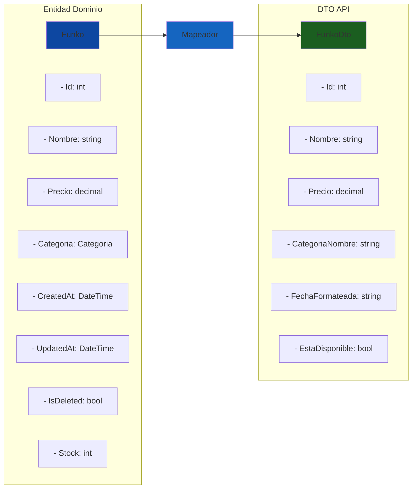
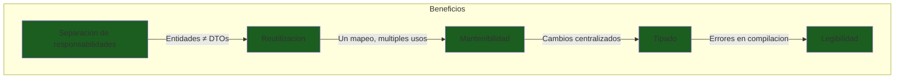
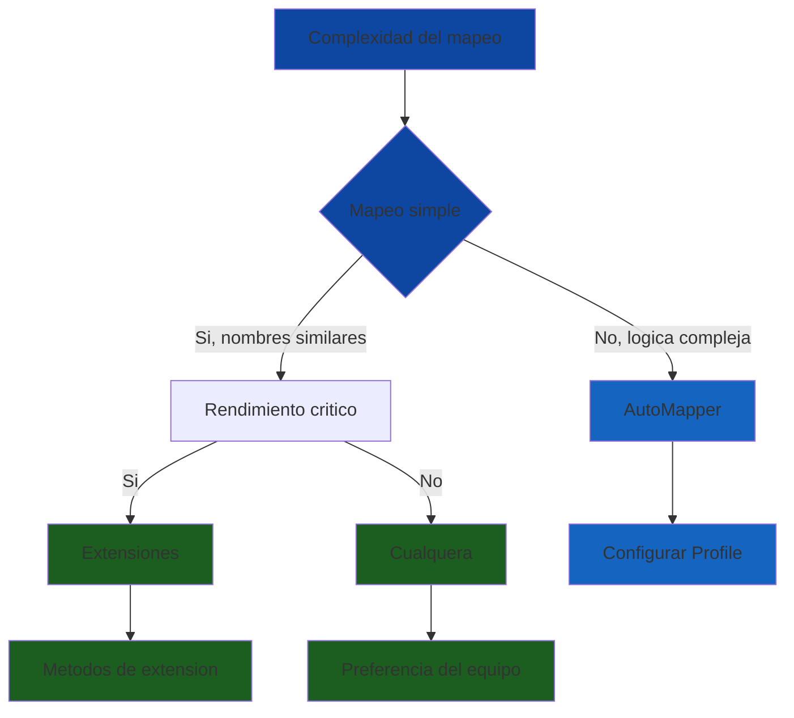
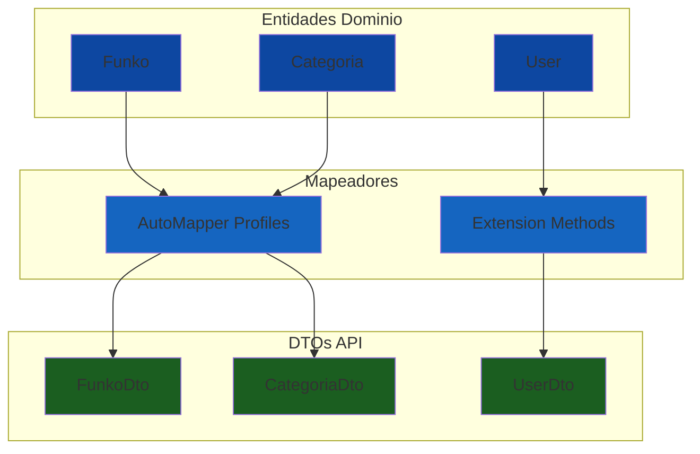

# 8. Mapeadores: AutoMapper vs Funciones de Extensión

- [8.1. ¿Por Qué Usar Mapeadores?](#81-por-qué-usar-mapeadores)
  - [8.1.1. El Problema de Entidades vs DTOs](#811-el-problema-de-entidades-vs-dtos)
  - [8.1.2. Beneficios de los Mapeadores](#812-beneficios-de-los-mapeadores)
- [8.2. AutoMapper](#82-automapper)
  - [8.2.1. Instalación y Configuración](#821-instalación-y-configuración)
  - [8.2.2. MappingProfile](#822-mappingprofile)
  - [8.2.3. Uso en Servicios](#823-uso-en-servicios)
- [8.3. Funciones de Extensión](#83-funciones-de-extensión)
  - [8.3.1. Implementación con Extensiones](#831-implementación-con-extensiones)
  - [8.3.2. Extensiones con Propiedades Calculadas](#832-extensiones-con-propiedades-calculadas)
- [8.4. Comparación AutoMapper vs Extensiones](#84-comparación-automapper-vs-extensiones)
  - [8.4.1. Tabla Comparativa](#841-tabla-comparativa)
  - [8.4.2. Pros y Contras](#842-pros-y-contras)
- [8.5. Benchmarks de Rendimiento](#85-benchmarks-de-rendimiento)
- [8.6. Cuándo Usar Cada Enfoque](#86-cuándo-usar-cada-enfoque)
- [8.7. Patrón Híbrido](#87-patrón-híbrido)
- [8.8. Errores Comunes](#88-errores-comunes)
- [8.9. Resumen](#89-resumen)

---

## 8.1. ¿Por Qué Usar Mapeadores?

En arquitecturas limpias como Clean Architecture, las **entidades** (modelos de dominio) y los **DTOs** (Data Transfer Objects) suelen tener estructuras diferentes. Las entidades contienen toda la información del dominio, incluyendo relaciones, marcas temporales y estados internos. Los DTOs, en cambio, están optimizados para la API y exponen solo los datos necesarios, con formatos específicos para la presentación.

🧠 **Analogía**: Los mapeadores son como traductores en una reunión internacional. La entidad habla "idioma de dominio" (con toda su complejidad interna) y el DTO habla "idioma de API" (simple y presentado). El mapeador traduce automáticamente entre ambos, sin que cada persona tenga que aprender ambos idiomas.

### 8.1.1. El Problema de Entidades vs DTOs



| Aspecto | Entidad | DTO |
|---------|---------|-----|
| **Propósito** | Dominio del negocio | Transferencia de datos |
| **Relaciones** | Incluidas (Categoria) | Solo nombres (CategoriaNombre) |
| **Marcas temporales** | CreatedAt, UpdatedAt | FechaFormateada |
| **Estados internos** | IsDeleted | EstaDisponible |
| **Validaciones** | Data Annotations | Ya validadas |

### 8.1.2. Beneficios de los Mapeadores



| Beneficio | Descripción |
|-----------|-------------|
| **Separación de responsabilidades** | Entidades y DTOs pueden evolucionar independientemente |
| **Reutilización** | Un mapeo se usa en múltiples lugares del código |
| **Mantenibilidad** | Cambios centralizados en un solo lugar |
| **Tipado** | Errores detectados en compilación, no en ejecución |
| **Legibilidad** | Código más limpio y enfocado en lógica de negocio |

---

## 8.2. AutoMapper

**AutoMapper** es una librería popular que automatiza el mapeo entre objetos con estructuras similares. Usa convenciones de nombres para mapear automáticamente propiedades con el mismo nombre, y permite personalización mediante configuraciones.

### 8.2.1. Instalación y Configuración

```bash
# Paquete principal
dotnet add package AutoMapper

# Extension para dependencias
dotnet add package AutoMapper.Extensions.Microsoft.DependencyInjection
```

```csharp
// Program.cs
using AutoMapper;

var builder = WebApplication.CreateBuilder(args);

// Registrar AutoMapper automaticamente
builder.Services.AddAutoMapper(
    typeof(MappingProfile), 
    typeof(FunkoProfile));

var app = builder.Build();

app.MapControllers();
app.Run();
```

### 8.2.2. MappingProfile

El Profile es la clase donde defines los mapeos entre tipos. Puedes tener un Profile global o varios Profiles específicos por dominio.

```csharp
using AutoMapper;
using FunkosApi.Core.Dtos.Categorias;
using FunkosApi.Core.Dtos.Funkos;
using FunkosApi.Core.Dtos.Usuarios;
using FunkosApi.Core.Models;

namespace FunkosApi.Core.Mappers;

public class MappingProfile : Profile
{
    public MappingProfile()
    {
        // Mapeos de categoria
        CreateMap<Categoria, CategoriaDto>();
        CreateMap<CategoriaRequestDto, Categoria>();

        // Mapeos de funko
        CreateMap<Funko, FunkoDto>()
            .ForMember(dest => dest.CategoriaNombre,
                opt => opt.MapFrom(src => src.Categoria.Nombre))
            .ForMember(dest => dest.EstaDisponible,
                opt => opt.MapFrom(src => src.Stock > 0 && !src.IsDeleted));
        CreateMap<FunkoRequestDto, Funko>();

        // Mapeos de usuario
        CreateMap<User, UserDto>();
        CreateMap<RegisterDto, User>();
    }
}
```

```csharp
// FunkoProfile.cs - Perfil especifico
using AutoMapper;
using FunkosApi.Core.Dtos.Funkos;
using FunkosApi.Core.Models;

namespace FunkosApi.Core.Mappers;

public class FunkoProfile : Profile
{
    public FunkoProfile()
    {
        CreateMap<Funko, FunkoDto>()
            .ForMember(dest => dest.CategoriaNombre,
                opt => opt.MapFrom(src => src.Categoria.Nombre))
            .ForMember(dest => dest.FechaFormateada,
                opt => opt.MapFrom(src => src.CreatedAt.ToString("dd/MM/yyyy")));
        
        CreateMap<FunkoRequestDto, Funko>();
        
        CreateMap<Funko, FunkoListDto>()
            .ForMember(dest => dest.CategoriaNombre,
                opt => opt.MapFrom(src => src.Categoria.Nombre));
    }
}
```

### 8.2.3. Uso en Servicios

```csharp
using AutoMapper;

namespace FunkosApi.Core.Services;

public class FunkoService(IFunkoRepository repository, IMapper mapper) : IFunkoService
{
    public async Task<FunkoDto?> GetByIdAsync(int id)
    {
        var funko = await repository.FindByIdAsync(id);
        
        if (funko == null) return null;
        
        // Mapear entidad a DTO
        return mapper.Map<FunkoDto>(funko);
    }

    public async Task<FunkoDto> CreateAsync(FunkoRequestDto dto)
    {
        // Mapear DTO a entidad
        var funko = mapper.Map<Funko>(dto);
        
        var created = await repository.SaveAsync(funko);
        
        return mapper.Map<FunkoDto>(created);
    }

    public async Task<List<FunkoDto>> GetAllAsync()
    {
        var funkos = await repository.GetAllAsync();
        
        // Mapear lista de entidades a lista de DTOs
        return mapper.Map<List<FunkoDto>>(funkos);
    }

    public async Task<PagedList<FunkoDto>> GetPagedAsync(int page, int pageSize)
    {
        var pagedFunkos = await repository.GetPagedAsync(page, pageSize);
        
        return mapper.Map<PagedList<FunkoDto>>(pagedFunkos);
    }
}
```

💡 **Tip del Examinador**: AutoMapper inyecta `IMapper` automáticamente cuando usas `AddAutoMapper()`. Siempre inyecta la interfaz `IMapper`, nunca la implementación concreta `MapperConfiguration`.

---

## 8.3. Funciones de Extensión

Las **funciones de extensión** son métodos que puedes añadir a clases existentes sin modificar su código. Son una alternativa nativa a AutoMapper que ofrece máximo control y rendimiento óptimo.

### 8.3.1. Implementación con Extensiones

```csharp
using FunkosApi.Core.Models;

namespace FunkosApi.Core.Extensions;

// Clase de extensiones para Funko
public static class FunkoExtensions
{
    // Entidad -> DTO
    public static FunkoDto ToDto(this Funko funko)
    {
        return new FunkoDto
        {
            Id = funko.Id,
            Nombre = funko.Nombre,
            Descripcion = funko.Descripcion,
            Precio = funko.Precio,
            Stock = funko.Stock,
            CategoriaNombre = funko.Categoria?.Nombre ?? string.Empty,
            FechaFormateada = funko.CreatedAt.ToString("dd/MM/yyyy"),
            EstaDisponible = funko.Stock > 0 && !funko.IsDeleted
        };
    }

    // DTO -> Entidad
    public static Funko ToEntity(this FunkoRequestDto dto)
    {
        return new Funko
        {
            Nombre = dto.Nombre,
            Descripcion = dto.Descripcion,
            Precio = dto.Precio,
            Stock = dto.Stock,
            CategoriaId = dto.CategoriaId,
            CreatedAt = DateTime.UtcNow
        };
    }

    // Lista de entidades -> lista de DTOs
    public static List<FunkoDto> ToDtoList(this IEnumerable<Funko> funkos)
    {
        return funkos.Select(f => f.ToDto()).ToList();
    }

    // Actualizar entidad desde DTO
    public static void UpdateFromDto(this Funko funko, FunkoUpdateDto dto)
    {
        funko.Nombre = dto.Nombre;
        funko.Descripcion = dto.Descripcion;
        funko.Precio = dto.Precio;
        funko.Stock = dto.Stock;
        funko.UpdatedAt = DateTime.UtcNow;
    }
}
```

```csharp
// Uso en servicios
public class FunkoService(IFunkoRepository repository) : IFunkoService
{
    public async Task<FunkoDto?> GetByIdAsync(int id)
    {
        var funko = await repository.FindByIdAsync(id);
        return funko?.ToDto();  // Extension directa
    }

    public async Task<List<FunkoDto>> GetAllAsync()
    {
        var funkos = await repository.GetAllAsync();
        return funkos.ToDtoList();  // Extension para listas
    }

    public async Task<FunkoDto> CreateAsync(FunkoRequestDto dto)
    {
        var funko = dto.ToEntity();  // DTO a entidad
        var created = await repository.SaveAsync(funko);
        return created.ToDto();  // Entidad a DTO
    }
}
```

### 8.3.2. Extensiones con Propiedades Calculadas

```csharp
public static class FunkoExtensions
{
    public static FunkoDetailDto ToDetailDto(this Funko funko)
    {
        return new FunkoDetailDto
        {
            Id = funko.Id,
            Nombre = funko.Nombre,
            Descripcion = funko.Descripcion,
            Precio = funko.Precio,
            Stock = funko.Stock,
            CategoriaNombre = funko.Categoria?.Nombre ?? string.Empty,
            CategoriaId = funko.CategoriaId,
            
            // Propiedades calculadas
            PrecioFormateado = funko.Precio.ToString("C"),
            EstaDisponible = funko.Stock > 0 && !funko.IsDeleted,
            Valoracion = CalcularValoracion(funko),
            Antiguedad = CalcularAntiguedad(funko.CreatedAt),
            
            // Formateo de fechas
            FechaCreacionFormateada = funko.CreatedAt.ToString("dd 'de' MMMM 'de' yyyy"),
            FechaActualizacionFormateada = funko.UpdatedAt?.ToString("dd/MM/yyyy") ?? "Sin actualizar"
        };
    }

    private static string CalcularValoracion(Funko funko)
    {
        // Lógica de negocio para valoración
        if (funko.Stock == 0) return "Agotado";
        if (funko.Stock < 5) return "Ultimas unidades";
        if (funko.Precio > 50) return "Edicion especial";
        return "Estandar";
    }

    private static string CalcularAntiguedad(DateTime fechaCreacion)
    {
        var dias = (DateTime.UtcNow - fechaCreacion).Days;
        return dias switch
        {
            < 30 => "Nuevo",
            < 90 => "Reciente",
            < 365 => "Establecido",
            _ => "Clasico"
        };
    }
}
```

📝 **Nota del Profesor**: Las extensiones permiten lógica personalizada compleja que AutoMapper no puede manejar fácilmente. Puedes incluir validaciones, cálculos, y transformaciones avanzadas en el mismo método de extensión.

---

## 8.4. Comparación AutoMapper vs Extensiones

```mermaid
flowchart TD
    subgraph "AutoMapper"
        A1["Configuracion declarativa"]
        A2["Naming conventions"]
        A3["ForMember personalizado"]
        A4["Profile por dominio"]
    end
    
    subgraph "Extensiones"
        B1["Codigo imperativo"]
        B2["Control total"]
        B3["Sin dependencias"]
        B4["Metodos nombrados"]
    end
    
    A1 --> A2 --> A3 --> A4
    B1 --> B2 --> B3 --> B4
    
    style A1 fill:#0D47A1
    style A2 fill:#0D47A1
    style A3 fill:#0D47A1
    style A4 fill:#0D47A1
    style B1 fill:#1565C0
    style B2 fill:#1565C0
    style B3 fill:#1565C0
    style B4 fill:#1565C0
```



### 8.4.1. Tabla Comparativa

| Aspecto | AutoMapper | Extensiones |
|---------|------------|-------------|
| **Líneas de código** | Menos (configuración declarativa) | Más (código explícito) |
| **Dependencia** | Sí (paquete externo) | No (nativo de C#) |
| **Rendimiento** | Overhead de reflexión | Rápido (código compilado) |
| **Flexibilidad** | Alta (con configuración) | Máxima (código libre) |
| **Debugging** | Difícil (internals ocultos) | Fácil (código visible) |
| **Tipado** | Runtime (errores en ejecución) | Compilación (errores en build) |
| **Curva aprendizaje** | Media (sintaxis propia) | Baja (C# estándar) |
| **Configuración centralizada** | Sí (Profile) | No (métodos distribuidos) |

### 8.4.2. Pros y Contras


| AutoMapper | Extensiones |
|------------|-------------|
| ✅ Configuración breve y declarativa | ✅ Sin dependencias externas |
| ✅ Reutilizable en toda la aplicación | ✅ Código visible y debuggeable |
| ✅ Documentado y comunidad grande | ✅ Rendimiento óptimo (código compilado) |
| ✅ Organización por Profiles | ✅ Testeable directamente |
| ❌ Dependencia externa | ❌ Más código por escribir |
| ❌ Debugging difícil | ❌ Mantenimiento manual |
| ❌ Overhead de rendimiento | ❌ Sin convenciones automáticas |
| ❌ Errores en runtime | ❌ Repetición de código |

---

## 8.5. Benchmarks de Rendimiento

```csharp
using BenchmarkDotNet.Attributes;
using AutoMapper;

namespace FunkosApi.Benchmarks;

[MemoryDiagnoser]
public class MappersBenchmarks
{
    private readonly IMapper _autoMapper;
    private readonly Funko _funko;

    public MappersBenchmarks()
    {
        // Configurar AutoMapper
        var config = new MapperConfiguration(cfg => 
        {
            cfg.CreateMap<Funko, FunkoDto>()
                .ForMember(dest => dest.CategoriaNombre,
                    opt => opt.MapFrom(src => src.Categoria.Nombre));
        });
        _autoMapper = config.CreateMapper();

        // Datos de prueba
        _funko = new Funko
        {
            Id = 1,
            Nombre = "Iron Man Mark 50",
            Descripcion = "Funko de Iron Man",
            Precio = 34.99m,
            Stock = 10,
            Categoria = new Categoria { Id = 1, Nombre = "Marvel" },
            CreatedAt = DateTime.UtcNow
        };
    }

    [Benchmark]
    public FunkoDto AutoMapper_Benchmark()
    {
        return _autoMapper.Map<FunkoDto>(_funko);
    }

    [Benchmark]
    public FunkoDto Extensions_Benchmark()
    {
        return _funko.ToDto();
    }
}
```

### Resultados Típicos

| Método | Tiempo | Ratio | Memoria |
|--------|--------|-------|---------|
| **Extensions** | ~50 ns | 1x (más rápido) | ~0 B |
| **AutoMapper** | ~200-500 ns | 4-10x más lento | ~100 B |

⚠️ **Nota:** La diferencia es insignificante para la mayoría de aplicaciones. En una API que procesa 1000 peticiones/segundo, el overhead de AutoMapper serían ~0.5 milisegundos adicionales en total.

💡 **Tip del Examinador**: El rendimiento rara vez es el factor decisivo. Elige basado en mantenibilidad, equipo, y complejidad de mapeos, no en benchmarks teóricos.

---

## 8.6. Cuándo Usar Cada Enfoque



| Escenario | Recomendación | Razón |
|-----------|---------------|-------|
| **API simple, pocos mapeos** | Extensiones | Sin dependencia, rápido |
| **Mapeos complejos con lógica** | AutoMapper | Configuración centralizada |
| **Alto rendimiento crítico** | Extensiones | Código compilado, sin overhead |
| **Equipo nuevo en .NET** | Extensiones | Curva más baja |
| **Múltiples perfiles de dominio** | AutoMapper | Organización por Profile |
| **API pública con muchos DTOs** | AutoMapper | Mantenibilidad |

---

## 8.7. Patrón Híbrido

Puedes combinar ambos enfoques según las necesidades de cada mapeo específico.

```csharp
// MappingProfile.cs - Configuración hibrida
public class MappingProfile : Profile
{
    public MappingProfile()
    {
        // Mapeos simples con convenciones
        CreateMap<Categoria, CategoriaDto>();
        CreateMap<User, UserDto>();

        // Mapeos complejos con lógica personalizada
        CreateMap<Funko, FunkoDto>()
            .ForMember(dest => dest.CategoriaNombre,
                opt => opt.MapFrom(src => src.Categoria.Nombre))
            .AfterMap((src, dest) =>
            {
                // Lógica personalizada post-mapeo
                dest.FechaFormateada = src.CreatedAt.ToString("dd/MM/yyyy");
                dest.EstaDisponible = src.Stock > 0 && !src.IsDeleted;
            });
    }
}

// FunkoExtensions.cs - Metodos de extension para logica avanzada
public static class FunkoExtensions
{
    // Logica no trivial que AutoMapper no maneja bien
    public static string GetEstadoStock(this Funko funko)
    {
        return funko.Stock switch
        {
            0 => "Agotado",
            < 5 => "Ultimas unidades",
            < 20 => "Stock limitado",
            _ => "Disponible"
        };
    }

    public static decimal GetPrecioConDescuento(this Funko funko, decimal porcentaje)
    {
        if (porcentaje < 0 || porcentaje > 100)
            throw new ArgumentException("Porcentaje invalido");
        
        return funko.Precio * (1 - porcentaje / 100);
    }
}
```

---

## 8.8. Errores Comunes

### AutoMapper: Miembro no mapeado

```csharp
// Error: No mapea propiedades con nombres diferentes
// Solución: Usar ForMember()
CreateMap<Funko, FunkoDto>()
    .ForMember(dest => dest.CategoriaNombre,
        opt => opt.MapFrom(src => src.Categoria.Nombre));
```

### Extensiones: NullReferenceException

```csharp
// Error: Categoria puede ser null
// Solución: Verificar null con operador null-conditional
public static string GetCategoriaNombre(this Funko funko)
{
    return funko.Categoria?.Nombre ?? string.Empty;
}
```

### Error común: Mapeo bidireccional sin configuración

```csharp
// Error: Mapper.CreateMap<Entidad, DTO>()单向映射
// Si necesitas映射反向,也需要配置CreateMap<DTO, Entidad>()
CreateMap<Funko, FunkoDto>();
CreateMap<FunkoDto, Funko>();  // 反向也需要配置
```

---

## 8.9. Resumen



| Concepto | Descripción |
|----------|-------------|
| **Mapeadores** | Traducen entre entidades de dominio y DTOs de API |
| **AutoMapper** | Dependencia externa con configuración declarativa |
| **Extensiones** | Métodos nativos de C# con control total |
| **Patrón híbrido** | Combina ambos enfoques según necesidad |

🧠 **Analogía final**: Los mapeadores son como el servicio de habitaciones de un hotel. El cliente (API) pide algo del menú (DTO), y el servicio traduce esa petición a la cocina (dominio), prepara el plato (lógica de negocio), y lo sirve de vuelta en el formato adecuado para el cliente.

💡 **Tip del Examinador**: En el examen se valora que conozcas ambos enfoques y sepas cuándo usar cada uno. No hay una respuesta correcta universal, depende del contexto y requisitos del proyecto.
