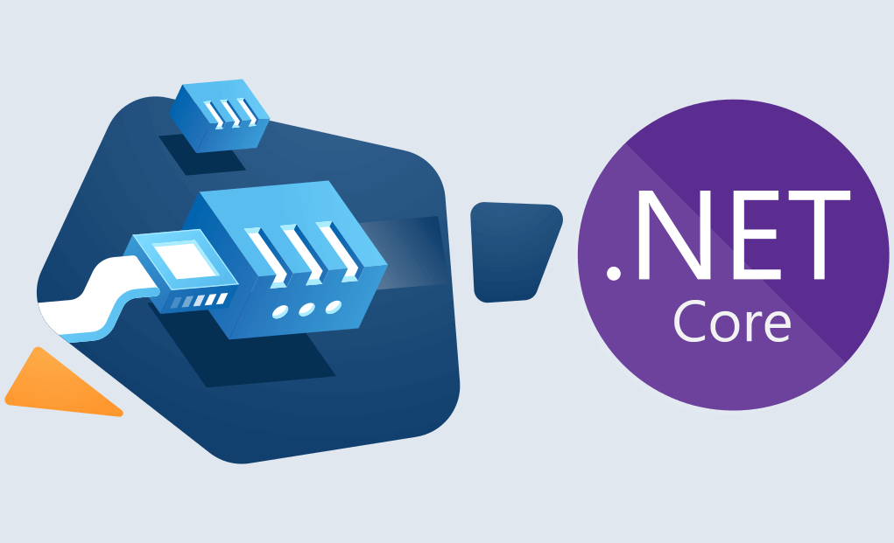

# WebSockets en ASP.NET Core

- [WebSockets en ASP.NET Core](#websockets-en-aspnet-core)
  - [Introducción a WebSockets](#introducción-a-websockets)
  - [Configuración de WebSockets](#configuración-de-websockets)
    - [Habilitar WebSockets en Program.cs](#habilitar-websockets-en-programcs)
  - [Implementación del Manejador WebSocket](#implementación-del-manejador-websocket)
    - [Interfaz IWebSocketHandler](#interfaz-iwebsockethandler)
    - [Implementación WebSocketHandler](#implementación-websockethandler)
    - [Gestión de Conexiones](#gestión-de-conexiones)
  - [Middleware de WebSocket](#middleware-de-websocket)
    - [WebSocketMiddleware](#websocketmiddleware)
  - [Modelo de Notificaciones](#modelo-de-notificaciones)
    - [Estructura de Notificación](#estructura-de-notificación)
    - [DTO de Notificación](#dto-de-notificación)
  - [Integración con Servicios](#integración-con-servicios)
    - [Envío de Notificaciones desde el Servicio](#envío-de-notificaciones-desde-el-servicio)
    - [Ejemplo Completo en FunkoService](#ejemplo-completo-en-funkoservice)
  - [Cliente WebSocket (JavaScript)](#cliente-websocket-javascript)
    - [Cliente HTML/JavaScript](#cliente-htmljavascript)
  - [Testing de WebSockets](#testing-de-websockets)
    - [Test del WebSocketHandler](#test-del-websockethandler)
    - [Test de Integración](#test-de-integración)
  - [Mensajes Periódicos (Keep-Alive)](#mensajes-periódicos-keep-alive)
    - [Servicio de Mensajes Periódicos](#servicio-de-mensajes-periódicos)
  - [Seguridad en WebSockets](#seguridad-en-websockets)
    - [Autenticación JWT en WebSocket](#autenticación-jwt-en-websocket)
  - [Buenas Prácticas](#buenas-prácticas)
  - [Práctica de Clase](#práctica-de-clase)
  - [Proyecto del Curso](#proyecto-del-curso)



---

## Introducción a WebSockets

**WebSocket** es un protocolo de comunicación **bidireccional** y en **tiempo real** que establece una conexión persistente entre cliente y servidor sobre TCP. 

**Diferencias con HTTP:**

| Aspecto | HTTP | WebSocket |
|: --------|:-----|:----------|
| **Comunicación** | Unidireccional (request/response) | Bidireccional |
| **Conexión** | Se cierra después de cada respuesta | Persistente |
| **Latencia** | Mayor (nueva conexión por petición) | Menor (conexión abierta) |
| **Uso** | APIs REST tradicionales | Chat, notificaciones en tiempo real, juegos |

**Casos de uso:**
- ✅ Notificaciones en tiempo real
- ✅ Chat en vivo
- ✅ Actualizaciones de dashboards
- ✅ Juegos multijugador
- ✅ Colaboración en tiempo real


---

## Configuración de WebSockets

### Habilitar WebSockets en Program.cs

```csharp
var builder = WebApplication.CreateBuilder(args);

// Configurar servicios
builder.Services.AddControllers();
builder.Services.AddEndpointsApiExplorer();
builder.Services.AddSwaggerGen();

// Registrar manejadores de WebSocket
builder. Services.AddSingleton<IWebSocketHandler, FunkosWebSocketHandler>();

var app = builder.Build();

// Habilitar WebSockets
app.UseWebSockets(new WebSocketOptions
{
    KeepAliveInterval = TimeSpan.FromSeconds(120) // Ping cada 2 minutos
});

// Mapear endpoint de WebSocket
app.Map("/ws/v1/funkos", async context =>
{
    if (context.WebSockets.IsWebSocketRequest)
    {
        var handler = context.RequestServices.GetRequiredService<IWebSocketHandler>();
        var webSocket = await context.WebSockets.AcceptWebSocketAsync();
        await handler.HandleAsync(context, webSocket);
    }
    else
    {
        context. Response.StatusCode = 400; // Bad Request
    }
});

app.UseHttpsRedirection();
app.UseAuthorization();
app.MapControllers();

app.Run();
```

---

## Implementación del Manejador WebSocket

### Interfaz IWebSocketHandler

```csharp
using System. Net.WebSockets;

namespace FunkosApi.WebSockets;

public interface IWebSocketHandler
{
    /// <summary>
    /// Maneja la conexión WebSocket
    /// </summary>
    Task HandleAsync(HttpContext context, WebSocket webSocket);

    /// <summary>
    /// Envía un mensaje a todos los clientes conectados
    /// </summary>
    Task SendMessageAsync(string message, CancellationToken cancellationToken = default);

    /// <summary>
    /// Envía un mensaje a un cliente específico
    /// </summary>
    Task SendMessageToClientAsync(string connectionId, string message, CancellationToken cancellationToken = default);

    /// <summary>
    /// Obtiene el número de clientes conectados
    /// </summary>
    int GetConnectedClientsCount();
}
```

---

### Implementación WebSocketHandler

```csharp
using System.Collections.Concurrent;
using System. Net.WebSockets;
using System.Text;

namespace FunkosApi.WebSockets;

public class FunkosWebSocketHandler : IWebSocketHandler
{
    private readonly ILogger<FunkosWebSocketHandler> _logger;
    private readonly ConcurrentDictionary<string, WebSocket> _connections = new();
    private const int BufferSize = 1024 * 4; // 4 KB

    public FunkosWebSocketHandler(ILogger<FunkosWebSocketHandler> logger)
    {
        _logger = logger;
    }

    public async Task HandleAsync(HttpContext context, WebSocket webSocket)
    {
        var connectionId = Guid.NewGuid().ToString();
        _connections. TryAdd(connectionId, webSocket);

        _logger.LogInformation("Nueva conexión WebSocket establecida.  ID: {ConnectionId}.  Total:  {Count}",
            connectionId, _connections.Count);

        try
        {
            // Mensaje de bienvenida
            var welcomeMessage = "Conectado al servidor de notificaciones de Funkos";
            await SendMessageToClientAsync(connectionId, welcomeMessage);

            // Bucle de recepción de mensajes
            var buffer = new byte[BufferSize];
            WebSocketReceiveResult?  result = null;

            while (webSocket.State == WebSocketState. Open)
            {
                result = await webSocket.ReceiveAsync(new ArraySegment<byte>(buffer), CancellationToken.None);

                if (result.MessageType == WebSocketMessageType.Close)
                {
                    _logger.LogInformation("Cliente solicita cerrar conexión:  {ConnectionId}", connectionId);
                    await webSocket.CloseAsync(WebSocketCloseStatus.NormalClosure, "Cierre solicitado por el cliente", CancellationToken.None);
                    break;
                }

                // Procesar mensaje recibido (opcional)
                if (result.MessageType == WebSocketMessageType.Text)
                {
                    var receivedMessage = Encoding.UTF8.GetString(buffer, 0, result.Count);
                    _logger.LogInformation("Mensaje recibido de {ConnectionId}: {Message}", connectionId, receivedMessage);

                    // Aquí podrías implementar lógica de chat o respuestas personalizadas
                }
            }
        }
        catch (WebSocketException ex)
        {
            _logger.LogError(ex, "Error de WebSocket en conexión {ConnectionId}", connectionId);
        }
        finally
        {
            // Limpiar conexión
            _connections.TryRemove(connectionId, out _);
            _logger.LogInformation("Conexión WebSocket cerrada. ID: {ConnectionId}. Total: {Count}",
                connectionId, _connections.Count);

            if (webSocket.State != WebSocketState. Closed && webSocket.State != WebSocketState. Aborted)
            {
                await webSocket.CloseAsync(WebSocketCloseStatus.NormalClosure, "Conexión cerrada", CancellationToken.None);
            }

            webSocket.Dispose();
        }
    }

    public async Task SendMessageAsync(string message, CancellationToken cancellationToken = default)
    {
        _logger.LogInformation("Enviando mensaje a {Count} clientes:  {Message}", _connections.Count, message);

        var buffer = Encoding.UTF8.GetBytes(message);
        var segment = new ArraySegment<byte>(buffer);

        var tasks = _connections.Values
            .Where(ws => ws.State == WebSocketState.Open)
            .Select(ws => SendToSocketAsync(ws, segment, cancellationToken));

        await Task.WhenAll(tasks);
    }

    public async Task SendMessageToClientAsync(string connectionId, string message, CancellationToken cancellationToken = default)
    {
        if (!_connections.TryGetValue(connectionId, out var webSocket))
        {
            _logger.LogWarning("Conexión no encontrada: {ConnectionId}", connectionId);
            return;
        }

        if (webSocket.State != WebSocketState.Open)
        {
            _logger.LogWarning("La conexión {ConnectionId} no está abierta", connectionId);
            return;
        }

        var buffer = Encoding.UTF8.GetBytes(message);
        var segment = new ArraySegment<byte>(buffer);

        await SendToSocketAsync(webSocket, segment, cancellationToken);
    }

    private async Task SendToSocketAsync(WebSocket webSocket, ArraySegment<byte> segment, CancellationToken cancellationToken)
    {
        try
        {
            await webSocket.SendAsync(segment, WebSocketMessageType.Text, endOfMessage: true, cancellationToken);
        }
        catch (WebSocketException ex)
        {
            _logger.LogError(ex, "Error al enviar mensaje por WebSocket");
        }
    }

    public int GetConnectedClientsCount() => _connections.Count;
}
```

---

### Gestión de Conexiones

**¿Por qué `ConcurrentDictionary`?**

```csharp
// Thread-safe:  múltiples hilos pueden acceder simultáneamente sin problemas
private readonly ConcurrentDictionary<string, WebSocket> _connections = new();
```

**Alternativas:**
- ❌ `Dictionary<string, WebSocket>`: No thread-safe
- ⚠️ `Dictionary` con `lock`: Funciona pero menos eficiente
- ✅ `ConcurrentDictionary`: Thread-safe y eficiente

---

## Middleware de WebSocket

### WebSocketMiddleware

Si prefieres un enfoque más modular, puedes crear un middleware:

```csharp
public class WebSocketMiddleware
{
    private readonly RequestDelegate _next;
    private readonly IWebSocketHandler _handler;
    private readonly ILogger<WebSocketMiddleware> _logger;

    public WebSocketMiddleware(RequestDelegate next, IWebSocketHandler handler, ILogger<WebSocketMiddleware> logger)
    {
        _next = next;
        _handler = handler;
        _logger = logger;
    }

    public async Task InvokeAsync(HttpContext context)
    {
        if (context.Request.Path == "/ws/v1/funkos")
        {
            if (context.WebSockets.IsWebSocketRequest)
            {
                var webSocket = await context.WebSockets.AcceptWebSocketAsync();
                await _handler.HandleAsync(context, webSocket);
            }
            else
            {
                context.Response.StatusCode = 400;
            }
        }
        else
        {
            await _next(context);
        }
    }
}

// Registrar en Program.cs
app.UseMiddleware<WebSocketMiddleware>();
```

---

## Modelo de Notificaciones

### Estructura de Notificación

```csharp
namespace FunkosApi.Models.Notifications;

public record Notificacion<T>
{
    public string Entidad { get; init; } = string.Empty;
    public TipoNotificacion Tipo { get; init; }
    public T Datos { get; init; } = default!;
    public DateTime Timestamp { get; init; } = DateTime. UtcNow;
}

public enum TipoNotificacion
{
    CREATE,
    UPDATE,
    DELETE
}
```

---

### DTO de Notificación

```csharp
public record FunkoNotificationDto
{
    public int Id { get; init; }
    public string Nombre { get.  init; } = string.Empty;
    public decimal Precio { get.  init; }
    public int Cantidad { get.  init; }
    public string Categoria { get.  init; } = string.Empty;
    public string?  Imagen { get.  init; }
}

// Mapper
public static class FunkoNotificationMapper
{
    public static FunkoNotificationDto ToNotificationDto(this Funko funko)
    {
        return new FunkoNotificationDto
        {
            Id = funko.Id,
            Nombre = funko.Nombre,
            Precio = funko. Precio,
            Cantidad = funko.Cantidad,
            Categoria = funko.Categoria,
            Imagen = funko.Imagen
        };
    }
}
```

---

## Integración con Servicios

### Envío de Notificaciones desde el Servicio

```csharp
using System.Text.Json;

public class FunkoService :  IFunkoService
{
    private readonly IFunkoRepository _repository;
    private readonly IWebSocketHandler _webSocketHandler;
    private readonly ILogger<FunkoService> _logger;

    public FunkoService(
        IFunkoRepository repository,
        IWebSocketHandler webSocketHandler,
        ILogger<FunkoService> logger)
    {
        _repository = repository;
        _webSocketHandler = webSocketHandler;
        _logger = logger;
    }

    private async Task SendNotificationAsync(TipoNotificacion tipo, Funko funko)
    {
        try
        {
            var notificacion = new Notificacion<FunkoNotificationDto>
            {
                Entidad = "FUNKOS",
                Tipo = tipo,
                Datos = funko.ToNotificationDto(),
                Timestamp = DateTime.UtcNow
            };

            var json = JsonSerializer.Serialize(notificacion, new JsonSerializerOptions
            {
                PropertyNamingPolicy = JsonNamingPolicy.CamelCase
            });

            _logger.LogInformation("Enviando notificación WebSocket:  {Tipo} - Funko {Id}", tipo, funko.Id);

            // Enviar en un hilo separado para no bloquear
            _ = Task.Run(async () =>
            {
                try
                {
                    await _webSocketHandler.SendMessageAsync(json);
                }
                catch (Exception ex)
                {
                    _logger.LogError(ex, "Error al enviar notificación WebSocket");
                }
            });
        }
        catch (Exception ex)
        {
            _logger.LogError(ex, "Error al preparar notificación WebSocket");
        }
    }

    public async Task<Result<Funko, FunkoError>> CreateAsync(CreateFunkoDto dto)
    {
        // Validaciones... 

        var funko = new Funko
        {
            Nombre = dto.Nombre,
            Precio = dto.Precio,
            Cantidad = dto.Cantidad,
            Categoria = dto. Categoria,
            Imagen = dto.Imagen
        };

        var created = await _repository.CreateAsync(funko);

        // Enviar notificación
        await SendNotificationAsync(TipoNotificacion.CREATE, created);

        return Result. Success<Funko, FunkoError>(created);
    }

    public async Task<Result<Funko, FunkoError>> UpdateAsync(int id, UpdateFunkoDto dto)
    {
        var funko = await _repository.GetByIdAsync(id);
        if (funko is null)
            return Result.Failure<Funko, FunkoError>(FunkoError.NotFound(id));

        // Actualizar propiedades... 
        funko.Nombre = dto.Nombre;
        funko.Precio = dto.Precio;
        funko.Cantidad = dto. Cantidad;
        funko. Categoria = dto.Categoria;
        funko.Imagen = dto.Imagen;
        funko.FechaActualizacion = DateTime.UtcNow;

        var updated = await _repository.UpdateAsync(funko);

        // Enviar notificación
        await SendNotificationAsync(TipoNotificacion.UPDATE, updated);

        return Result. Success<Funko, FunkoError>(updated);
    }

    public async Task<Result<Unit, FunkoError>> DeleteAsync(int id)
    {
        var funko = await _repository.GetByIdAsync(id);
        if (funko is null)
            return Result.Failure<Unit, FunkoError>(FunkoError.NotFound(id));

        var deleted = await _repository.DeleteAsync(id);
        if (! deleted)
            return Result. Failure<Unit, FunkoError>(FunkoError.NotFound(id));

        // Enviar notificación
        await SendNotificationAsync(TipoNotificacion.DELETE, funko);

        return Result.Success<Unit, FunkoError>(Unit.Value);
    }
}
```

---

### Ejemplo Completo en FunkoService

```csharp
public async Task<Result<Funko, FunkoError>> CreateAsync(CreateFunkoDto dto)
{
    // Validaciones
    if (string.IsNullOrWhiteSpace(dto.Nombre))
        return Result.Failure<Funko, FunkoError>(FunkoError.InvalidData("Nombre", "no puede estar vacío"));

    if (dto.Precio <= 0)
        return Result. Failure<Funko, FunkoError>(FunkoError.InvalidData("Precio", "debe ser mayor a 0"));

    // Verificar nombre duplicado
    if (await _repository.ExistsByNombreAsync(dto.Nombre))
        return Result.Failure<Funko, FunkoError>(FunkoError. Conflict(dto.Nombre));

    // Crear funko
    var funko = new Funko
    {
        Nombre = dto. Nombre,
        Precio = dto.Precio,
        Cantidad = dto.Cantidad,
        Categoria = dto.Categoria,
        Imagen = dto. Imagen,
        FechaCreacion = DateTime.UtcNow,
        FechaActualizacion = DateTime.UtcNow,
        Activo = true
    };

    var created = await _repository.CreateAsync(funko);

    // 🔔 Enviar notificación WebSocket
    await SendNotificationAsync(TipoNotificacion.CREATE, created);

    return Result.Success<Funko, FunkoError>(created);
}
```

---

## Cliente WebSocket (JavaScript)

### Cliente HTML/JavaScript

```html
<!DOCTYPE html>
<html lang="es">
<head>
    <meta charset="UTF-8">
    <meta name="viewport" content="width=device-width, initial-scale=1.0">
    <title>Funkos WebSocket Client</title>
    <style>
        body {
            font-family: Arial, sans-serif;
            max-width: 800px;
            margin: 50px auto;
            padding: 20px;
        }
        #messages {
            border: 1px solid #ccc;
            height: 400px;
            overflow-y:  scroll;
            padding: 10px;
            margin-bottom: 20px;
            background-color: #f9f9f9;
        }
        .message {
            margin-bottom: 10px;
            padding: 10px;
            background-color: #fff;
            border-left: 4px solid #007bff;
        }
        . message.create {
            border-left-color: #28a745;
        }
        . message.update {
            border-left-color: #ffc107;
        }
        .message.delete {
            border-left-color: #dc3545;
        }
        .timestamp {
            font-size: 0.8em;
            color: #666;
        }
        .status {
            padding: 10px;
            margin-bottom: 20px;
            border-radius:  4px;
        }
        .status.connected {
            background-color: #d4edda;
            color:  #155724;
        }
        .status.disconnected {
            background-color: #f8d7da;
            color:  #721c24;
        }
        button {
            padding: 10px 20px;
            margin-right: 10px;
            cursor: pointer;
        }
    </style>
</head>
<body>
    <h1>🔔 Notificaciones en Tiempo Real - Funkos</h1>

    <div id="status" class="status disconnected">
        ❌ Desconectado
    </div>

    <div>
        <button id="connectBtn">Conectar</button>
        <button id="disconnectBtn" disabled>Desconectar</button>
        <button id="clearBtn">Limpiar Mensajes</button>
    </div>

    <h2>Mensajes</h2>
    <div id="messages"></div>

    <script>
        let ws = null;
        const messagesDiv = document.getElementById('messages');
        const statusDiv = document.getElementById('status');
        const connectBtn = document. getElementById('connectBtn');
        const disconnectBtn = document.getElementById('disconnectBtn');
        const clearBtn = document.getElementById('clearBtn');

        // URL del servidor WebSocket (ajusta según tu configuración)
        const WS_URL = 'ws://localhost:5000/ws/v1/funkos';

        connectBtn.addEventListener('click', connect);
        disconnectBtn.addEventListener('click', disconnect);
        clearBtn.addEventListener('click', () => messagesDiv.innerHTML = '');

        function connect() {
            if (ws && ws.readyState === WebSocket.OPEN) {
                addMessage('Ya estás conectado', 'info');
                return;
            }

            ws = new WebSocket(WS_URL);

            ws.onopen = () => {
                console.log('Conectado al servidor WebSocket');
                updateStatus(true);
                addMessage('✅ Conectado al servidor', 'info');
                connectBtn.disabled = true;
                disconnectBtn.disabled = false;
            };

            ws.onmessage = (event) => {
                console.log('Mensaje recibido:', event.data);
                handleMessage(event.data);
            };

            ws.onerror = (error) => {
                console.error('Error de WebSocket:', error);
                addMessage('❌ Error de conexión', 'error');
            };

            ws.onclose = () => {
                console.log('Desconectado del servidor WebSocket');
                updateStatus(false);
                addMessage('❌ Desconectado del servidor', 'info');
                connectBtn.disabled = false;
                disconnectBtn. disabled = true;
            };
        }

        function disconnect() {
            if (ws) {
                ws.close();
                ws = null;
            }
        }

        function handleMessage(data) {
            try {
                const notification = JSON.parse(data);

                if (notification.entidad === 'FUNKOS') {
                    const tipo = notification.tipo. toLowerCase();
                    const funko = notification.datos;
                    const timestamp = new Date(notification.timestamp).toLocaleString();

                    const emoji = {
                        'create': '🆕',
                        'update':  '✏️',
                        'delete':  '🗑️'
                    }[tipo] || '📢';

                    const accion = {
                        'create': 'creado',
                        'update': 'actualizado',
                        'delete': 'eliminado'
                    }[tipo] || 'modificado';

                    const html = `
                        <div class="message ${tipo}">
                            <strong>${emoji} Funko ${accion}</strong><br>
                            <strong>ID:</strong> ${funko.id}<br>
                            <strong>Nombre:</strong> ${funko.nombre}<br>
                            <strong>Precio:</strong> $${funko.precio}<br>
                            <strong>Cantidad:</strong> ${funko.cantidad}<br>
                            <strong>Categoría:</strong> ${funko. categoria}<br>
                            <span class="timestamp">🕒 ${timestamp}</span>
                        </div>
                    `;

                    messagesDiv.insertAdjacentHTML('beforeend', html);
                    messagesDiv.scrollTop = messagesDiv.scrollHeight;
                }
            } catch (error) {
                // Mensaje de texto simple (ej: bienvenida)
                addMessage(data, 'info');
            }
        }

        function addMessage(text, type = 'info') {
            const html = `
                <div class="message ${type}">
                    ${text}<br>
                    <span class="timestamp">🕒 ${new Date().toLocaleString()}</span>
                </div>
            `;
            messagesDiv.insertAdjacentHTML('beforeend', html);
            messagesDiv.scrollTop = messagesDiv.scrollHeight;
        }

        function updateStatus(connected) {
            if (connected) {
                statusDiv.textContent = '✅ Conectado';
                statusDiv.className = 'status connected';
            } else {
                statusDiv. textContent = '❌ Desconectado';
                statusDiv.className = 'status disconnected';
            }
        }

        // Conectar automáticamente al cargar la página
        connect();
    </script>
</body>
</html>
```

---

## Testing de WebSockets

### Test del WebSocketHandler

```csharp
using Moq;
using NUnit.Framework;
using FluentAssertions;
using System.Net.WebSockets;

[TestFixture]
public class FunkosWebSocketHandlerTests
{
    private Mock<ILogger<FunkosWebSocketHandler>> _loggerMock = null!;
    private FunkosWebSocketHandler _handler = null!;

    [SetUp]
    public void Setup()
    {
        _loggerMock = new Mock<ILogger<FunkosWebSocketHandler>>();
        _handler = new FunkosWebSocketHandler(_loggerMock.Object);
    }

    [Test]
    public void GetConnectedClientsCount_InitiallyReturnsZero()
    {
        // Act
        var count = _handler.GetConnectedClientsCount();

        // Assert
        count.Should().Be(0);
    }

    [Test]
    public async Task SendMessageAsync_WithNoClients_DoesNotThrow()
    {
        // Arrange
        var message = "Test message";

        // Act & Assert
        await _handler. Invoking(h => h.SendMessageAsync(message))
            .Should().NotThrowAsync();
    }
}
```

---

### Test de Integración

```csharp
using Microsoft.AspNetCore.Mvc. Testing;
using System.Net.WebSockets;

[TestFixture]
public class WebSocketIntegrationTests
{
    private WebApplicationFactory<Program> _factory = null!;
    private ClientWebSocket _client = null!;

    [OneTimeSetUp]
    public void OneTimeSetup()
    {
        _factory = new WebApplicationFactory<Program>();
    }

    [SetUp]
    public void Setup()
    {
        _client = new ClientWebSocket();
    }

    [TearDown]
    public async Task TearDown()
    {
        if (_client. State == WebSocketState.Open)
        {
            await _client.CloseAsync(WebSocketCloseStatus.NormalClosure, "Test finished", CancellationToken.None);
        }
        _client.Dispose();
    }

    [OneTimeTearDown]
    public void OneTimeTeardown()
    {
        _factory.Dispose();
    }

    [Test]
    public async Task WebSocket_CanConnect()
    {
        // Arrange
        var wsUri = new Uri(_factory.Server.BaseAddress!, "/ws/v1/funkos").ToString().Replace("http", "ws");

        // Act
        await _client.ConnectAsync(new Uri(wsUri), CancellationToken.None);

        // Assert
        _client.State.Should().Be(WebSocketState.Open);
    }

    [Test]
    public async Task WebSocket_ReceivesWelcomeMessage()
    {
        // Arrange
        var wsUri = new Uri(_factory. Server.BaseAddress!, "/ws/v1/funkos").ToString().Replace("http", "ws");
        await _client.ConnectAsync(new Uri(wsUri), CancellationToken.None);

        var buffer = new byte[1024 * 4];

        // Act
        var result = await _client.ReceiveAsync(new ArraySegment<byte>(buffer), CancellationToken.None);

        // Assert
        result. MessageType.Should().Be(WebSocketMessageType.Text);
        var message = Encoding.UTF8.GetString(buffer, 0, result.Count);
        message.Should().Contain("Conectado al servidor");
    }
}
```

---

## Mensajes Periódicos (Keep-Alive)

### Servicio de Mensajes Periódicos

```csharp
public class WebSocketKeepAliveService : BackgroundService
{
    private readonly IWebSocketHandler _handler;
    private readonly ILogger<WebSocketKeepAliveService> _logger;
    private readonly TimeSpan _interval = TimeSpan.FromSeconds(30);

    public WebSocketKeepAliveService(IWebSocketHandler handler, ILogger<WebSocketKeepAliveService> logger)
    {
        _handler = handler;
        _logger = logger;
    }

    protected override async Task ExecuteAsync(CancellationToken stoppingToken)
    {
        _logger.LogInformation("Servicio de Keep-Alive de WebSocket iniciado");

        while (!stoppingToken.IsCancellationRequested)
        {
            try
            {
                await Task.Delay(_interval, stoppingToken);

                var clientsCount = _handler.GetConnectedClientsCount();

                if (clientsCount > 0)
                {
                    var keepAliveMessage = $"{{\"type\": \"keep-alive\",\"timestamp\":\"{DateTime.UtcNow:O}\",\"clients\":{clientsCount}}}";
                    await _handler.SendMessageAsync(keepAliveMessage, stoppingToken);
                    _logger.LogDebug("Mensaje keep-alive enviado a {Count} clientes", clientsCount);
                }
            }
            catch (OperationCanceledException)
            {
                // Normal al detener el servicio
                break;
            }
            catch (Exception ex)
            {
                _logger.LogError(ex, "Error en el servicio de Keep-Alive");
            }
        }

        _logger.LogInformation("Servicio de Keep-Alive de WebSocket detenido");
    }
}

// Registrar en Program.cs
builder.Services.AddHostedService<WebSocketKeepAliveService>();
```

---

## Seguridad en WebSockets

### Autenticación JWT en WebSocket

```csharp
public async Task HandleAsync(HttpContext context, WebSocket webSocket)
{
    // Validar token JWT desde query string
    var token = context.Request.Query["token"].ToString();

    if (string.IsNullOrEmpty(token))
    {
        _logger.LogWarning("Intento de conexión sin token");
        await webSocket.CloseAsync(WebSocketCloseStatus. PolicyViolation, "Token requerido", CancellationToken.None);
        return;
    }

    // Validar token (simplificado)
    try
    {
        // Aquí validarías el token con tu servicio de autenticación
        // var principal = ValidateToken(token);
        // var userId = principal. FindFirst(ClaimTypes. NameIdentifier)?.Value;

        var connectionId = Guid.NewGuid().ToString();
        _connections.TryAdd(connectionId, webSocket);

        // ...  resto del código
    }
    catch (Exception ex)
    {
        _logger.LogError(ex, "Error al validar token");
        await webSocket.CloseAsync(WebSocketCloseStatus.PolicyViolation, "Token inválido", CancellationToken.None);
    }
}
```

**Cliente con token:**

```javascript
const token = 'your-jwt-token';
const ws = new WebSocket(`ws://localhost:5000/ws/v1/funkos?token=${token}`);
```

---

## Buenas Prácticas

✅ **Thread-safe**: Usa `ConcurrentDictionary` para las conexiones

✅ **Dispose resources**: Limpia sockets en `finally`

✅ **Logging**:  Registra conexiones, desconexiones y errores

✅ **Keep-Alive**: Envía pings periódicos para mantener conexiones activas

✅ **Manejo de errores**: Captura `WebSocketException`

✅ **Notificaciones asíncronas**: Usa `Task.Run` para no bloquear el servicio

✅ **Serialización JSON**: Usa `JsonSerializer` con `CamelCase`

✅ **Seguridad**: Valida tokens JWT si es necesario

✅ **Testing**: Crea tests de integración con `ClientWebSocket`

---

## Práctica de Clase

**Objetivo**: Implementar notificaciones en tiempo real para Funkos con WebSockets. 

**Tareas:**

1. ✅ Configurar WebSockets en `Program.cs`
2. ✅ Crear `FunkosWebSocketHandler` con gestión de conexiones
3. ✅ Implementar `Notificacion<T>` y `FunkoNotificationDto`
4. ✅ Integrar notificaciones en `FunkoService` (CREATE, UPDATE, DELETE)
5. ✅ Crear cliente HTML/JavaScript para visualizar notificaciones
6. ✅ Implementar servicio de keep-alive (opcional)
7. ✅ Testear con múltiples clientes conectados

**Criterios de evaluación:**

- ✅ WebSockets configurados correctamente
- ✅ Notificaciones se envían en CREATE, UPDATE y DELETE
- ✅ Cliente HTML recibe y muestra notificaciones
- ✅ Manejo correcto de conexiones y desconexiones
- ✅ Logging adecuado
- ✅ Tests de integración

---

## Proyecto del Curso

Puedes encontrar el proyecto con Entity Framework Core en el repositorio del curso.
- [Proyecto con WebSockets](https://github.com/joseluisgs/ProductosWebsocketMongoRestNet)
- [Proyecto Integrador](https://github.com/joseluisgs/TiendaDawApi-NetCore)
