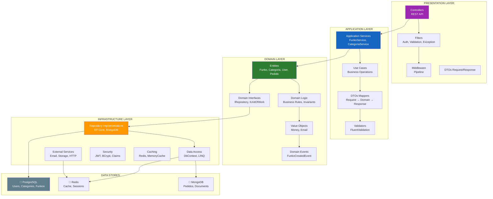
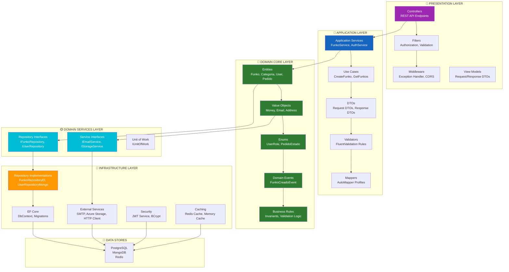
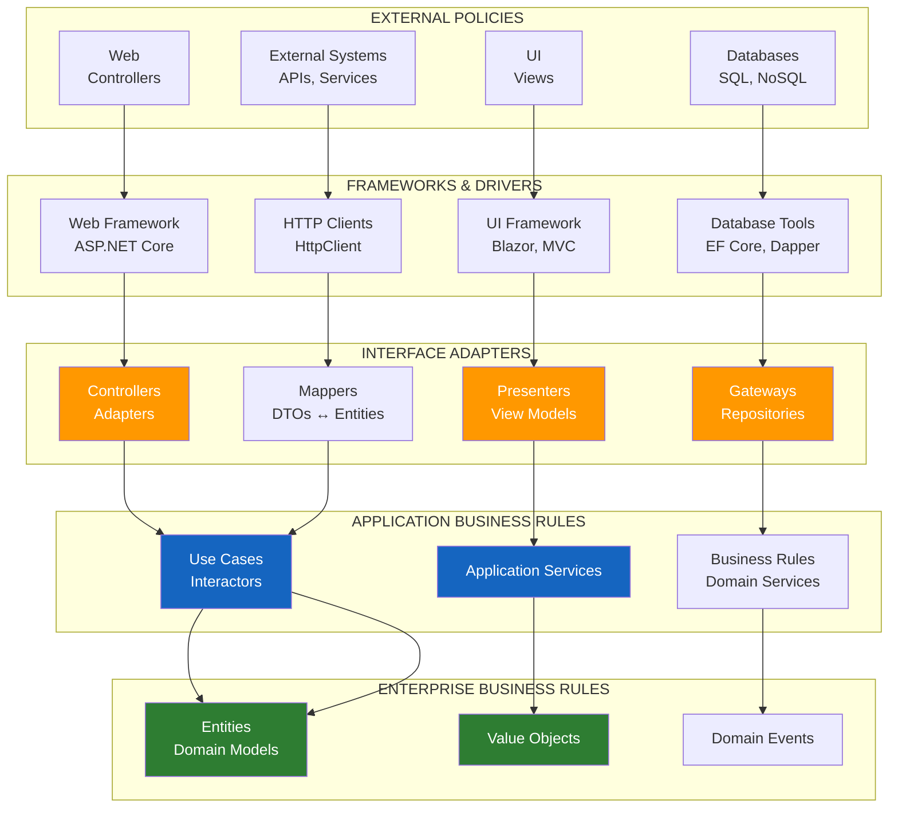
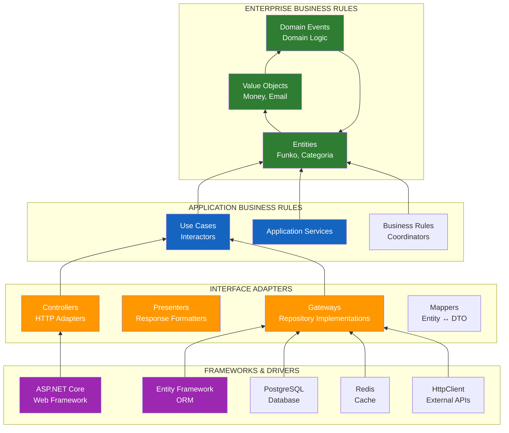
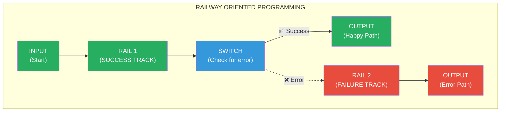

# 9. Arquitecturas en Capas y Clean Architecture

## Indice

- [9.1. Introduccion a las Arquitecturas de Software](#91-introducción-a-las-arquitecturas-de-software)
  - [9.1.1. Que es una Arquitectura de Software](#911-que-es-una-arquitectura-de-software)
  - [9.1.2. Tipos de Arquitecturas](#912-tipos-de-arquitecturas)
- [9.2. Arquitectura en Capas](#92-arquitectura-en-capas)
  - [9.2.1. Conceptos Fundamentales](#921-conceptos-fundamentales)
  - [9.2.2. Capas Tipicas y Responsabilidades](#922-capas-tipicas-y-responsabilidades)
  - [9.2.3. Diagrama de Arquitectura en Capas](#923-diagrama-de-arquitectura-en-capas)
  - [9.2.4. Ventajas y Desventajas](#924-ventajas-y-desventajas)
- [9.3. Arquitectura Onion](#93-arquitectura-onion)
  - [9.3.1. Principios Fundamentales](#931-principios-fundamentales)
  - [9.3.2. Estructura de la Arquitectura Onion](#932-estructura-de-la-arquitectura-onion)
  - [9.3.3. Diagrama Onion Detallado](#933-diagrama-onion-detallado)
  - [9.3.4. Comparación Capas vs Onion](#934-comparación-capas-vs-onion)
- [9.4. Clean Architecture](#94-clean-architecture)
  - [9.4.1. Principios Fundamentales](#941-principios-fundamentales)
  - [9.4.2. Regla de Dependencia](#942-regla-de-dependencia)
  - [9.4.3. Entidades de Dominio](#943-entidades-de-dominio)
  - [9.4.4. Casos de Uso y Reglas de Negocio](#944-casos-de-uso-y-reglas-de-negocio)
  - [9.4.5. Adaptadores de Interfaz](#945-adaptadores-de-interfaz)
  - [9.4.6. Frameworks y Drivers](#946-frameworks-y-drivers)
  - [9.4.7. Diagrama Clean Architecture](#947-diagrama-clean-architecture)
  - [9.4.8. Beneficios y Aplicación Practica](#948-beneficios-y-aplicación-practica)
- [9.5. ROP vs Excepciones en Arquitectura](#95-rop-vs-excepciónes-en-arquitectura)
  - [9.5.1. El Problema con las Excepciones](#951-el-problema-con-las-excepciónes)
  - [9.5.2. Railway Oriented Programming (ROP)](#952-railway-oriented-programming-rop)
  - [9.5.3. implementación de ROP](#953-implementación-de-rop)
  - [9.5.4. Comparación ROP vs Excepciones](#954-comparación-rop-vs-excepciónes)
- [9.6. Estructura del Proyecto](#96-estructura-del-proyecto)
  - [9.6.1. Organización de Directorios](#961-organización-de-directorios)
  - [9.6.2. Capas y sus Contenidos](#962-capas-y-sus-contenidos)
- [9.7. Resumen](#97-resumen)
- [9.8. Ejercicio Propuesto](#98-ejercicio-propuesto)

---

## 9.1. Introduccion a las Arquitecturas de Software

### 9.1.1. Que es una Arquitectura de Software

Una **arquitectura de software** representa las decisiones fundamentales sobre la estructura de un sistema informático. Define cómo se organizan los componentes, cómo se comunican entre sí, y cuáles son las responsabilidades de cada parte. La arquitectura establece el esqueleto sobre el cual se construye todo el sistema, y su calidad determina en gran medida la facilidad con la que el sistema puede evoluciónar, mantenerse y extenderse a lo largo del tiempo.

La arquitectura define las **reglas del juego** para todo el equipo de desarrollo. Cuando estas reglas son claras y se siguen consistentemente, el código se vuelve más fácil de entender, modificar y extender. Sin una arquitectura clara, los proyectos crecen de forma desorganizada, técnicamente conocida como "spaghetti code", donde el acoplamiento entre componentes es alto y la testabilidad es mínima. Esto conlleva a un aumento exponencial en los costes de mantenimiento y una disminución significativa en la productividad del equipo.

La elección de una arquitectura adecuada depende de múltiples factores: el tamaño del equipo, la complejidad del dominio, los requisitos de rendimiento, y las expectativas de evolución del sistema. No existe una arquitectura universal que sea la mejor para todos los casos, pero sí existen principios y patrones que, aplicados correctamente, mejoran significativamente la calidad del software y facilitan su evolución futura.

### 9.1.2. Tipos de Arquitecturas

Existen diversos tipos de arquitecturas que se adaptan a diferentes necesidades y contextos. Cada una tiene sus propias características, ventajas y casos de uso recomendados.

| Arquitectura | Descripción | Caso de Uso | Complejidad |
|--------------|-------------|-------------|-------------|
| **Monolitica** | Todo en un solo deploy | Aplicaciónes pequenas, rapido desarrollo | Baja |
| **Capas** | Separación por responsabilidades | Aplicaciónes empresariales clasicas | Media |
| **Onion** | Capas concentricas con inversión de dependencias | Sistemas con alto acoplamiento al dominio | Media-Alta |
| **Clean** | Independencia total del nucleo de negocio | Sistemas empresariales complejos | Alta |
| **Microservicios** | Servicios pequenos y autonomos | Sistemas distribuidos, alta escalabilidad | Muy Alta |
| **Hexagonal** | Puertos y adaptadores externos | Sistemas con multiples fuentes de datos | Media-Alta |
| **Event-Driven** | Comunicacion por eventos | Sistemas de tiempo real, procesamiento asincrono | Alta |

🧠 **Analogia**: Piensa en las arquitecturas como diferentes tipos de ciudades. Una ciudad monolitica seria un pueblo pequeno donde todo esta cerca. Una arquitectura de capas seria una ciudad con zonas bien definidas (residencial, comercial, industrial). Los microservicios serian ciudades estado independientes que se comunican entre si. Onion architecture seria una ciudad con un centro historico (dominio) que se protege de los cambios externos mediante capas sucesivas de proteccion.

---

## 9.2. Arquitectura en Capas

### 9.2.1. Conceptos Fundamentales

La **arquitectura en capas** (Layered Architecture) es uno de los patrones arquitectonicos mas antiguos y utilizados en el desarrollo de software. Su principio fundamental es organizar el codigo en capas horizontales, donde cada capa tiene una responsabilidad especifica y solo se comunica con las capas adyacentes en una direccion definida. Este patron promueve la separación de preocupaciones y facilita el mantenimiento del sistema al aislar las diferentes areas de responsabilidad.

El concepto clave de esta arquitectura es la **separación de responsabilidades**. Cada capa se enfoca en un aspecto particular del sistema: la capa de presentación maneja la interfaz de usuario, la capa de negocio contiene las reglas del dominio, y la capa de datos gestiona el acceso a almacenamiento. Esta division hace que el sistema sea mas facil de entender, mantener y testear, ya que cada capa puede desarrollarse, modificarse y testearse de forma relativamente independiente.

Una caracteristica esencial de la arquitectura en capas es que las **capas superiores pueden utilizar las inferiores**, pero nunca al reves. Esto crea un flujo de dependencias unidireccional que facilita el intercambio de implementaciónes. Por ejemplo, la capa de datos puede cambiar de SQL Server a PostgreSQL sin afectar la capa de negocio, siempre y cuando se mantenga la misma interfaz. Esta flexibilidad es fundamental para la evolución del sistema a lo largo del tiempo.

### 9.2.2. Capas Tipicas y Responsabilidades

En una aplicación ASP.NET Core tipica, las capas se organizan siguiendo un patron establecido que ha demostrado su eficacia en innumerables proyectos empresariales. Cada capa tiene un proposito bien definido y esperado por todos los miembros del equipo de desarrollo.

| Capa | Responsabilidad | Tecnologias Tipicas | Ejemplos |
|------|-----------------|---------------------|----------|
| **Presentacion** | Interfaz de usuario, entrada/salida HTTP | ASP.NET Core MVC, Web API, Blazor | Controllers, Views, Razor Pages, Endpoints |
| **Aplicación** | Casos de uso, coordinación de servicios | .NET Class Library | Services, Use Cases, Handlers, DTOs |
| **Dominio** | Entidades, reglas de negocio, interfaces | .NET Class Library | Entities, Value Objects, Domain Services, Interfaces |
| **Infraestructura** | Acceso a datos, servicios externos | EF Core, Dapper, HTTP Client | Repositories, DbContext, External Services |

La **capa de presentación** actua como punto de entrada al sistema, traduciendo las solicitudes HTTP en operaciónes que la capa de aplicación puede entender. Esta capa es responsable de manejar la autenticación, autorización, validación basica de entrada, y presentación de resultados. No debe contener logica de negocio, solo transformacion de datos entre el mundo exterior y la capa de aplicación.

La **capa de aplicación** orquestra los casos de uso, coordinando las interacciones entre diferentes partes del sistema. Aqui es donde se implementan los servicios de aplicación que coordinan las operaciónes de negocio. Esta capa conoce el dominio pero no contiene logica de negocio compleja; delega esa responsabilidad en la capa de dominio. Tambien es responsable de las transacciones y la coordinación de múltiples operaciónes.

La **capa de dominio** contiene la logica mas importante del sistema: las reglas de negocio que hacen que el sistema sea unico. Aqui encontramos las entidades con sus comportamientos, los objetos de valor, los eventos de dominio, y los servicios de dominio. Esta capa debe ser completamente independiente de cualquier framework o tecnologia externa.

La **capa de infraestructura** implementa los detalles tecnicos necesarios para que el sistema funcione. Aqui encontramos los repositorios concretos que acceden a las bases de datos, los clientes HTTP para consumir servicios externos, el sistema de archivos para almacenamiento de archivos, y cualquier otra implementación de detalles tecnicos.

### 9.2.3. Diagrama de Arquitectura en Capas



### 9.2.4. Ventajas y Desventajas

| Ventajas | Desventajas |
|----------|-------------|
| **Separación clara de responsabilidades** | Puede ser excesiva para aplicaciónes pequenas |
| **Facil testabilidad** (capas independientes) | Riesgo de "anemica" en capa de dominio |
| **Mantenibilidad mejorada** | Dificultad inicial en diseño de capas |
| **Reutilizacion de codigo** | Acoplamiento accidental entre capas |
| **Escalabilidad horizontal** | Curva de aprendizaje para nuevos desarrolladores |
| **Patron bien conocido** | puede degenerar en "big ball of mud" si no se mantiene la disciplina |
| **Facil de entender** | Las capas superiores pueden volverse demasiado gruesas |

---

## 9.3. Arquitectura Onion

### 9.3.1. Principios Fundamentales

La **Arquitectura Onion** (tambien conocida como arquitectura de capas concentricas o arquitectura de hexagono mejorada) fue propuesta por Jeffrey Palermo como una evolución de la arquitectura en capas tradicional. Su principio fundamental es que **las dependencias siempre apuntan hacia el centro**, donde se encuentra el nucleo de la aplicación. Esta inversión de dependencias es la caracteristica diferenciadora clave que proporciona mayor flexibilidad y testabilidad.

La diferencia principal con la arquitectura de capas tradicional radica en la **inversión de dependencias**. En lugar de que la capa de dominio dependa de abstracciones definidas en la capa de infraestructura (como repositories), en Onion la capa de dominio define las interfaces que necesita, y la capa de infraestructura las implementa. Esto significa que el nucleo de la aplicación no conoce nada sobre los detalles de implementación, lo que lo hace completamente independiente de tecnologias externas.

El centro de la arquitectura Onion contiene las **entidades de dominio** (los objetos que representan los conceptos principales del negocio) y las **reglas de negocio fundamentales**. Estas entidades son puras, sin dependencias externas, lo que las hace faciles de testear y razonar sobre ellas. Alrededor del nucleo se encuentran las **interfaces de dominio**, que definen contratos que las capas externas deben implementar.

🧠 **Analogia**: La arquitectura Onion es como una cebolla. El nucleo es pequeno y contiene lo mas importante: las semillas (entidades) y las raices (reglas de negocio). Las capas externas son como las capas de la cebolla que protegen el nucleo. Puedes quitar capas externas (cambiar de base de datos, de framework web) sin afectar el nucleo. Y al igual que la cebolla, tiene muchas capas, pero todas ellas protegen el centro.

### 9.3.2. Estructura de la Arquitectura Onion

La estructura de la arquitectura Onion se organiza en capas concentricas que giran alrededor del nucleo de dominio. Cada capa tiene un proposito especifico y contiene elementos relacionados con ese proposito.

| Capa | Descripción | Contenido | Depende de |
|------|-------------|-----------|------------|
| **Domain Core** | Centro de la arquitectura | Entities, Value Objects, Enums | Nada (no depende de nadie) |
| **Domain Services** | Interfaces de repositorio | IRepository, IServices | Domain Core |
| **Application Services** | Casos de uso | Services, Use Cases, DTOs | Domain Core, Domain Services |
| **Infrastructure** | implementaciónes concretas | Repositories, External Services | Domain Services |
| **Presentation** | Entry points | Controllers, Middleware | Application Services |

La regla fundamental es que **cada capa solo conoce las capas que estan dentro de ella** (mas cerca del nucleo). Esto significa que la capa de infraestructura conoce las interfaces definidas en el nucleo, pero el nucleo no sabe que existe infraestructura. Esta es la esencia de la **Inversion de Control**, un principio que permite que el nucleo de la aplicación permanezca completamente independiente de los detalles de implementación.

### 9.3.3. Diagrama Onion Detallado



### 9.3.4. Comparación Capas vs Onion

| Aspecto | Capas Tradicional | Onion Architecture |
|---------|-------------------|-------------------|
| **Dependencias** | Capas superiores dependen de inferiores | Capas externas dependen de internas |
| **Nucleo** | Entidades + Servicios de dominio | Solo entidades (puro y sin dependencias) |
| **Interfaces** | En capa de datos | En capa de abstracciones (cerca del nucleo) |
| **Inversion de Dependencias** | No implementada | Si (principio fundamental) |
| **Testabilidad del nucleo** | Buena | Excelente (nucleo sin dependencias) |
| **Flexibilidad** | Media (acoplamiento a DB) | Alta (infraestructura pluggable) |
| **Complejidad** | Baja | Media-Alta |
| **Acoplamiento** | Mayor (dependencia directa) | Menor (solo hacia el centro) |
| **Evolucion** | Limitada por dependencias | Mayor flexibilidad para cambios |
| **Curva de aprendizaje** | Facil | Moderada |

---

## 9.4. Clean Architecture

### 9.4.1. Principios Fundamentales

**Clean Architecture**, propuesta por Robert C. Martin (Uncle Bob), establece que las **reglas de negocio** deben ser independientes de cualquier framework, base de datos, interfaz de usuario o agencia externa. El nucleo de la aplicación (las entidades) no conoce nada sobre los detalles de implementación. Esta independencia se logra mediante la aplicación estricta de la **Regla de Dependencia**, que establece que las dependencias de codigo solo pueden apuntar hacia adentro.

La filosofia detras de Clean Architecture es crear sistemas que sean **resistentes al cambio tecnologico**. Los frameworks, bases de datos y interfaces de usuario son detalles que pueden y deben cambiar con el tiempo, pero las reglas de negocio deben permanecer estables. Al aislar las reglas de negocio de los detalles de implementación, el sistema puede evoluciónar tecnologicamente sin afectar la logica central del negocio.

Los principios fundamentales de Clean Architecture se derivan de decadas de experiencia en la industria del software y representan las mejores practicas para construir sistemas mantenibles y escalables. Estos principios no son reglas rigidas sino guias que deben aplicarse con criterio y adaptadas al contexto especifico de cada proyecto.

### 9.4.2. Regla de Dependencia

La **Regla de Dependencia** es el principio mas importante de Clean Architecture. Establece que las **dependencias de codigo solo pueden apuntar hacia el centro** del circulo. Esto significa que el codigo en una capa interna no puede conocer ni depender del codigo en capas externas. En otras palabras, los circulos internos no conocen nada sobre los circulos externos.

Esta regla se implementa mediante la **Inversion de Dependencias (DIP)** del principio SOLID. Cuando la capa interna necesita algo de la capa externa, define una interfaz (contrato), y la capa externa implementa esa interfaz. De esta manera, la capa interna no depende de la capa externa, sino que la capa externa depende de la abstraccion definida por la capa interna.



### 9.4.3. Entidades de Dominio

Las **entidades** representan los objetos principales del dominio de negocio. Contienen las **reglas de negocio fundamentales** que deben cumplirse en todo momento. Estas entidades son las mas estables del sistema y no deben depender de ningun framework, base de datos o tecnologia externa.

Las entidades en Clean Architecture son diferentes de las entidades en arquitecturas tradicionales. No son simples contenedores de datos (DTOs), sino objetos que encapsulan comportamiento. Contienen metodos que implementan las reglas de negocio y mantienen las invariantes del dominio. Una entidad bien disehada es aquella que no puede estar en un estado invalido.

```csharp
namespace TiendaApi.Core.Domain.Entities
{
    /// <summary>
    /// Funko entity - representa un producto en la tienda
    /// Encapsula toda la logica de negocio relacionada con un funko
    /// </summary>
    public class Funko : Entity
    {
        public int Id { get; private set; }
        public string Nombre { get; private set; }
        public string Descripción { get; private set; }
        public decimal Precio { get; private set; }
        public int Stock { get; private set; }
        public int CategoriaId { get; private set; }
        public string? ImagenUrl { get; private set; }
        public bool IsDeleted { get; private set; }
        public DateTime CreatedAt { get; private set; }
        public DateTime? UpdatedAt { get; private set; }

        // Constructor protegido para EF Core
        protected Funko() { }

        // Constructor con validación de dominio
        public Funko(string nombre, string descripción, decimal precio, int stock, int categoriaId)
        {
            ValidateConstraints(nombre, precio, stock, categoriaId);
            
            Nombre = nombre;
            Descripción = descripción;
            Precio = precio;
            Stock = stock;
            CategoriaId = categoriaId;
            IsDeleted = false;
            CreatedAt = DateTime.UtcNow;
        }

        // Reglas de negocio - no puede haber estado invalido
        private void ValidateConstraints(string nombre, decimal precio, int stock, int categoriaId)
        {
            if (string.IsNullOrWhiteSpace(nombre))
                throw new ArgumentException("El nombre es obligatorio", nameof(nombre));
            
            if (nombre.Length < 3 || nombre.Length > 100)
                throw new ArgumentException("El nombre debe tener entre 3 y 100 caracteres", nameof(nombre));
            
            if (precio <= 0)
                throw new ArgumentException("El precio debe ser mayor a 0", nameof(precio));
            
            if (precio > 9999.99m)
                throw new ArgumentException("El precio no puede exceder 9999.99", nameof(precio));
            
            if (stock < 0)
                throw new ArgumentException("El stock no puede ser negativo", nameof(stock));
            
            if (categoriaId <= 0)
                throw new ArgumentException("La categoria debe ser valida", nameof(categoriaId));
        }

        // Comportamiento de dominio
        public void ActualizarStock(int cantidad)
        {
            var nuevoStock = Stock + cantidad;
            if (nuevoStock < 0)
                throw new InvalidOperationException(
                    $"No hay suficiente stock. Stock actual: {Stock}, cantidad a modificar: {cantidad}");
            
            Stock = nuevoStock;
            UpdatedAt = DateTime.UtcNow;
        }

        public void ActualizarInformacion(string? nombre, decimal? precio, string? descripción)
        {
            if (nombre != null)
            {
                if (nombre.Length < 3 || nombre.Length > 100)
                    throw new ArgumentException("El nombre debe tener entre 3 y 100 caracteres", nameof(nombre));
                Nombre = nombre;
            }
            
            if (precio.HasValue)
            {
                if (precio.Value <= 0)
                    throw new ArgumentException("El precio debe ser mayor a 0", nameof(precio));
                Precio = precio.Value;
            }
            
            if (descripción != null)
                Descripción = descripción;
            
            UpdatedAt = DateTime.UtcNow;
        }

        public void MarcarComoEliminado()
        {
            IsDeleted = true;
            UpdatedAt = DateTime.UtcNow;
        }

        public bool EstaDisponible => Stock > 0 && !IsDeleted;
        public bool EstaAgotado => Stock == 0 || IsDeleted;
    }
}
```

### 9.4.4. Casos de Uso y Reglas de Negocio

Los **casos de uso** representan las operaciónes que el sistema puede realizar. Contienen la logica de orquestación que coordina las interacciones entre diferentes partes del sistema para lograr un objetivo especifico. Los casos de uso son especificos de la aplicación y no deben contener reglas de negocio fundamentales (que van en las entidades).

Los casos de uso reciben peticones de la capa de presentación, interactuan con las entidades y servicios del dominio, y retornan respuestas. Son el "pegamento" que mantiene unida la logica de la aplicación.

```csharp
namespace TiendaApi.Core.Application.UseCases.Funkos.Create
{
    /// <summary>
    /// Command para crear un nuevo funko
    /// </summary>
    public record CreateFunkoCommand(
        string Nombre,
        string Descripción,
        decimal Precio,
        int Stock,
        int CategoriaId,
        string? ImagenUrl
    ) : IRequest<Result<FunkoResponseDto, DomainError>>;

    /// <summary>
    /// Handler para el command de creación
    /// Implementa el caso de uso "Crear Funko"
    /// </summary>
    public class CreateFunkoHandler : IRequestHandler<CreateFunkoCommand, Result<FunkoResponseDto, DomainError>>
    {
        private readonly IFunkoRepository _funkoRepository;
        private readonly ICategoriaRepository _categoriaRepository;
        private readonly IMapper _mapper;
        private readonly ILogger<CreateFunkoHandler> _logger;

        public CreateFunkoHandler(
            IFunkoRepository funkoRepository,
            ICategoriaRepository categoriaRepository,
            IMapper mapper,
            ILogger<CreateFunkoHandler> logger)
        {
            _funkoRepository = funkoRepository;
            _categoriaRepository = categoriaRepository;
            _mapper = mapper;
            _logger = logger;
        }

        public async Task<Result<FunkoResponseDto, DomainError>> Handle(
            CreateFunkoCommand request,
            CancellationToken cancellationToken)
        {
            _logger.LogInformation("Iniciando creación de funko: {Nombre}", request.Nombre);

            // Verificar que la categoria existe
            var categoriaExists = await _categoriaRepository.ExistsByIdAsync(request.CategoriaId);
            if (!categoriaExists)
                return Result.Failure<FunkoResponseDto, DomainError>(
                    DomainError.NotFound($"Categoria {request.CategoriaId} no encontrada"));

            // Verificar nombre unico
            var nombreExiste = await _funkoRepository.ExistsByNombreAsync(request.Nombre);
            if (nombreExiste)
                return Result.Failure<FunkoResponseDto, DomainError>(
                    DomainError.Conflict($"Ya existe un funko con el nombre '{request.Nombre}'"));

            // Crear entidad de dominio (las validaciónes de negocioestan en el constructor)
            var funko = new Funko(
                request.Nombre,
                request.Descripción,
                request.Precio,
                request.Stock,
                request.CategoriaId)
            {
                ImagenUrl = request.ImagenUrl
            };

            // Persistir
            var result = await _funkoRepository.AddAsync(funko);
            if (result.IsFailure)
                return Result.Failure<FunkoResponseDto, DomainError>(result.Error);

            var savedFunko = result.Value;
            _logger.LogInformation("Funko creado exitosamente con ID: {Id}", savedFunko.Id);

            // Mapear a DTO de respuesta
            return Result.Success<FunkoResponseDto, DomainError>(
                _mapper.Map<FunkoResponseDto>(savedFunko));
        }
    }
}
```

### 9.4.5. Adaptadores de Interfaz

Los **adaptadores de interfaz** convierten los datos de los casos de uso a un formato que los frameworks y drivers pueden entender, y viceversa. Esta capa contiene los Controllers, Presenters, Gateways y Mappers. Su unica responsabilidad es la conversion de datos entre las capas internas y externas.

```csharp
namespace TiendaApi.Api.Controllers.V1
{
    [ApiController]
    [Route("api/v1/funkos")]
    [Produces("application/json")]
    public class FunkosController(ISender mediator) : ControllerBase
    {
        [HttpGet("{id}")]
        [ProducesResponseType(typeof(FunkoResponseDto), StatusCodes.Status200OK)]
        [ProducesResponseType(typeof(ErrorResponse), StatusCodes.Status404NotFound)]
        public async Task<IActionResult> GetById(int id)
        {
            var query = new GetFunkoByIdQuery(id);
            var result = await mediator.Send(query);
            
            return result.Match(
                onSuccess: funko => Ok(funko),
                onFailure: error => error.Type switch
                {
                    ErrorType.NotFound => NotFound(new { error.Message }),
                    _ => BadRequest(new { error.Message })
                });
        }

        [HttpPost]
        [ProducesResponseType(typeof(FunkoResponseDto), StatusCodes.Status201Created)]
        [ProducesResponseType(typeof(ValidationProblemDetails), StatusCodes.Status400BadRequest)]
        [Authorize(Roles = "Admin")]
        public async Task<IActionResult> Create([FromBody] CreateFunkoRequest request)
        {
            var command = new CreateFunkoCommand(
                request.Nombre,
                request.Descripción,
                request.Precio,
                request.Stock,
                request.CategoriaId,
                request.ImagenUrl);
                
            var result = await mediator.Send(command);
            
            return result.Match(
                onSuccess: funko => CreatedAtAction(
                    nameof(GetById), 
                    new { id = funko.Id }, 
                    funko),
                onFailure: error => BadRequest(new { error.Code, error.Message }));
        }
    }
}
```

### 9.4.6. Frameworks y Drivers

La capa mas externa contiene los **frameworks y drivers**: bases de datos, frameworks web, dispositivos de entrada/salida, etc. Esta capa contiene solo detalles de implementación que pueden cambiar sin afectar las capas internas.

```csharp
// Infrastructure Layer - Entity Framework Core Implementation
namespace TiendaApi.Infrastructure.Data.Repositories
{
    public class FunkoRepository(FunkosDbContext context, ILogger<FunkoRepository> logger) : IFunkoRepository
    {
        public async Task<Result<Funko, DomainError>> GetByIdAsync(int id)
        {
            _logger.LogDebug("Buscando funko por ID: {Id}", id);
            
            var funko = await context.Funkos
                .Include(f => f.Categoria)
                .FirstOrDefaultAsync(f => f.Id == id && !f.IsDeleted);
                
            if (funko == null)
                return Result.Failure<Funko, DomainError>(DomainError.NotFound($"Funko {id} no encontrado"));
                
            return Result.Success(funko);
        }

        public async Task<Result<Funko, DomainError>> AddAsync(Funko funko)
        {
            _logger.LogInformation("Guardando funko: {Nombre}", funko.Nombre);
            
            try
            {
                context.Funkos.Add(funko);
                await context.SaveChangesAsync();
                return Result.Success(funko);
            }
            catch (DbUpdateException ex)
            {
                _logger.LogError(ex, "Error al guardar funko: {Nombre}", funko.Nombre);
                return Result.Failure<Funko, DomainError>(
                    DomainError.Internal("Error al guardar el funko"));
            }
        }

        // implementación de otros metodos...
    }
}
```

### 9.4.7. Diagrama Clean Architecture



### 9.4.8. Beneficios y Aplicación Practica

Clean Architecture proporciona beneficios tangibles que impactan directamente en la calidad y mantenibilidad del software a largo plazo.

| Beneficio | Descripción | Impacto |
|-----------|-------------|---------|
| **Testabilidad** | El nucleo puede testearse sin frameworks | Alta (facilita TDD) |
| **Independencia de frameworks** | El nucleo no conoce ASP.NET, EF, etc. | Alta (evita lock-in) |
| **Independencia de UI** | La UI puede cambiar sin afectar el nucleo | Media (flexibilidad) |
| **Independencia de DB** | Se puede cambiar de SQL a MongoDB | Alta (flexibilidad) |
| **Mantenibilidad** | Cambios localizados | Muy Alta |
| **Escalabilidad** | Facil extension del sistema | Alta |

---

## 9.5. ROP vs Excepciones en Arquitectura

### 9.5.1. El Problema con las Excepciones

Las excepciónes fueron diseñadas para manejar situaciones excepciónales, errores inesperados que interrumpen el flujo normal de ejecución. Sin embargo, en arquitecturas bien diseñadas, el manejo de errores de negocio no deberia depender de excepciónes por varias razones fundamentales que afectan la calidad y mantenibilidad del codigo.

El primer problema es que las **excepciónes rompen el flujo de ejecución** de manera no local. Cuando se lanza una excepción, el call stack se desenrolla hasta encontrar un bloque catch, lo cual es costoso en terminos de rendimiento y hace que el flujo del programa sea dificil de seguir. Esto contrasta con el principio de que elcodigo deberia ser lineal y predecible.

El segundo problema es la **mezcla de errores de infraestructura con errores de negocio**. Las excepciónes pueden ser de muchos tipos (ArgumentNullException, InvalidOperationException, SqlException, etc.), y cada una indica un tipo diferente de problema. Esto hace que el manejo de errores sea inconsistente y propenso a errores cuando se intenta normalizar diferentes tipos de excepciónes en respuestas de API consistentes.

### 9.5.2. Railway Oriented Programming (ROP)

**Railway Oriented Programming (ROP)** es un patron funcional introducido por Scott Wlaschin que permite encadenar operaciónes de forma segura, manejando errores como valores en lugar de excepciónes. La metfora del railway es poderosa: imagine dos vias de tren (tracks), una para el camino feliz (success) y otra para errores (failure). Cada operación puede continuar por la via principal o desviarse a la via de error.



### 9.5.3. implementación de ROP

```csharp
// Definicion de errores de dominio
public sealed class DomainError
{
    public string Code { get; }
    public string Message { get; }
    
    public DomainError(string code, string message)
    {
        Code = code;
        Message = message;
    }
    
    public static readonly DomainError NotFound = 
        new("ENTITY_NOT_FOUND", "Entidad no encontrada");
    public static readonly DomainError InvalidState = 
        new("INVALID_STATE", "Estado invalido");
    public static readonly DomainError ValidationError = 
        new("VALIDATION_ERROR", "Error de validación");
}

// implementación de servicio con ROP
public class FunkoService : IFunkoService
{
    public async Task<Result<FunkoDto, DomainError>> CreateAsync(CreateFunkoDto dto)
    {
        return await Validate(dto)
            .Bind(ValidateStockAsync)
            .Bind(CreateFunkoAsync)
            .Map(funko => _mapper.Map<FunkoDto>(funko));
    }
    
    private Result<CreateFunkoDto, DomainError> Validate(CreateFunkoDto dto)
    {
        if (string.IsNullOrWhiteSpace(dto.Nombre))
            return Result.Failure<CreateFunkoDto, DomainError>(
                new DomainError("NOMBRE_REQUERIDO", "El nombre es obligatorio"));
        return Result.Success(dto);
    }
}
```

### 9.5.4. Comparación ROP vs Excepciones

| Aspecto | Excepciones | ROP |
|---------|-------------|-----|
| **Representación de errores** | Tipos de excepción | Valores (Result<T, TError>) |
| **Flujo de control** | Saltos no locales | Lineal, composicional |
| **Tipado** | Exception generica | Tipo de error en firma |
| **Composicion** | Dificil | Natural (Bind, Map) |
| **Rendimiento** | Costoso | Barato |
| **Exhaustividad** | Facil olvidar casos | Compilador强制检查 |
| **Testing** | Requires Assert.Throws | Assert.IsSuccess |

---

## 9.6. Estructura del Proyecto

### 9.6.1. Organización de Directorios

```
src/
├── TiendaApi.Api/                              # Capa de presentación
│   ├── Controllers/
│   │   ├── V1/
│   │   │   ├── FunkosController.cs
│   │   │   ├── CategoriasController.cs
│   │   │   └── AuthController.cs
│   │   └── V2/
│   ├── Middleware/
│   │   └── ExceptionHandlerMiddleware.cs
│   ├── Program.cs
│   └── TiendaApi.Api.csproj
│
├── TiendaApi.Application/                      # Capa de aplicación
│   ├── UseCases/
│   │   ├── Funkos/
│   │   │   ├── Create/
│   │   │   │   ├── CreateFunkoCommand.cs
│   │   │   │   ├── CreateFunkoHandler.cs
│   │   │   │   └── CreateFunkoValidator.cs
│   │   │   ├── Get/
│   │   │   └── Delete/
│   │   └── Common/
│   ├── DTOs/
│   │   ├── Funkos/
│   │   │   ├── FunkoResponseDto.cs
│   │   │   └── CreateFunkoRequest.cs
│   │   └── Common/
│   ├── Interfaces/
│   │   └── IServices/
│   └── TiendaApi.Application.csproj
│
├── TiendaApi.Domain/                           # Capa de dominio
│   ├── Entities/
│   │   ├── Funko.cs
│   │   ├── Categoria.cs
│   │   ├── User.cs
│   │   └── Pedido.cs
│   ├── Interfaces/
│   │   ├── IRepository/
│   │   │   ├── IFunkoRepository.cs
│   │   │   └── ICategoriaRepository.cs
│   │   └── IServices/
│   ├── ValueObjects/
│   ├── Events/
│   ├── Errors/
│   │   └── DomainErrors.cs
│   └── TiendaApi.Domain.csproj
│
└── TiendaApi.Infrastructure/                   # Capa de infraestructura
    ├── Data/
    │   ├── Context/
    │   │   └── FunkosDbContext.cs
    │   └── Repositories/
    │       ├── FunkoRepository.cs
    │       └── CategoriaRepository.cs
    ├── Services/
    │   ├── EmailService.cs
    │   └── StorageService.cs
    ├── Auth/
    │   └── JwtService.cs
    ├── Cache/
    │   └── RedisCacheService.cs
    └── TiendaApi.Infrastructure.csproj
```

### 9.6.2. Capas y sus Contenidos

| Capa | Proposito | Contenido Principal |
|------|-----------|---------------------|
| **Api** | Entry points HTTP | Controllers, Middleware, Filters, Program.cs |
| **Application** | Casos de uso | Handlers, Commands, Queries, DTOs, Validators |
| **Domain** | Nucleo de negocio | Entities, Interfaces, Value Objects, Errors, Events |
| **Infrastructure** | implementaciónes | Repositories, DbContext, External Services, Cache |

---

## 9.7. Resumen

| Concepto | Descripción |
|----------|-------------|
| **Arquitectura en Capas** | Organización horizontal con flujo de dependencias unidireccional |
| **Arquitectura Onion** | Capas concentricas con inversión de dependencias hacia el centro |
| **Clean Architecture** | Independencia total del nucleo de negocio mediante regla de dependencia |
| **Regla de Dependencia** | Las dependencias solo apuntan hacia el centro |
| **Entidades** | Objetos de dominio con comportamiento encapsulado |
| **Casos de Uso** | Orquestacion de operaciónes de negocio |
| **Adaptadores** | Conversion entre capas internas y externas |
| **ROP** | Railway Oriented Programming para manejo de errores funcional |
, TError>**| **Result<T | Tipo que encapsula exito o fallo sin excepciónes |

---

## 9.8. Ejercicio Propuesto

**Objetivo:** Disenar la estructura de una API para gestion de una biblioteca usando Clean Architecture con Onion.

**Requisitos:**

1. **Entidades:** Libro, Autor, Usuario, Prestamo
2. **Reglas de negocio:**
   - Un libro puede tener varios autores
   - Un usuario puede tener varios prestamos activos
   - No se puede prestar un libro si no hay stock
   - Un prestamo tiene fecha de devolución esperada

**Estructura a implementar:**

```
BibliotecaApi/
├── Api/                      # Controllers, Middleware
├── Application/              # Use Cases, DTOs, Validators
├── Domain/                   # Entities, Interfaces, Errors
└── Infrastructure/           # Repositories, Services
```

**Criterios de evaluación:**

| Criterio | Puntos |
|----------|--------|
| Separación correcta de capas (Onion) | 3.0 |
| Interfaces en dominio | 2.0 |
| implementaciónes en infraestructura | 2.0 |
| Uso de ROP para errores | 2.0 |
| Entidades con logica de dominio | 1.0 |

**Total: 10 puntos**

**Entregable:** Diagrama Mermaid de la arquitectura y estructura de carpetas propuesta.
