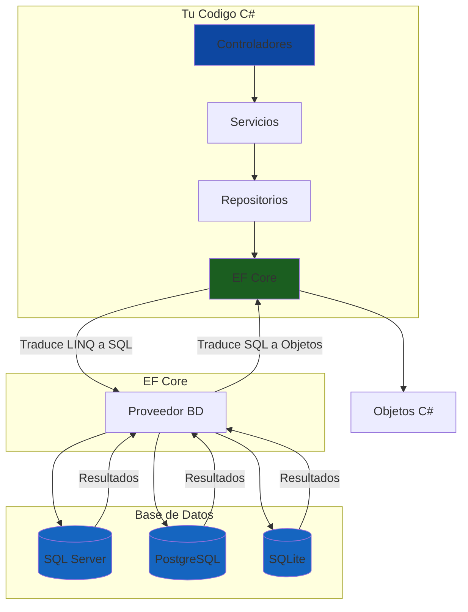
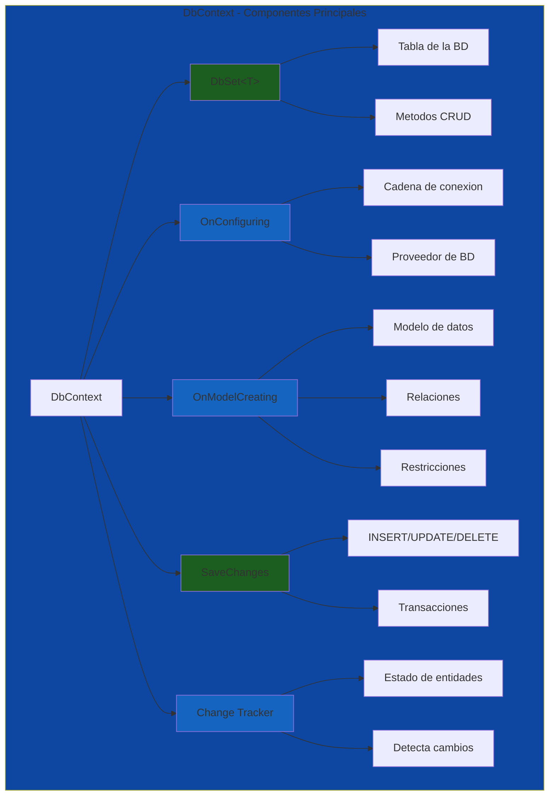
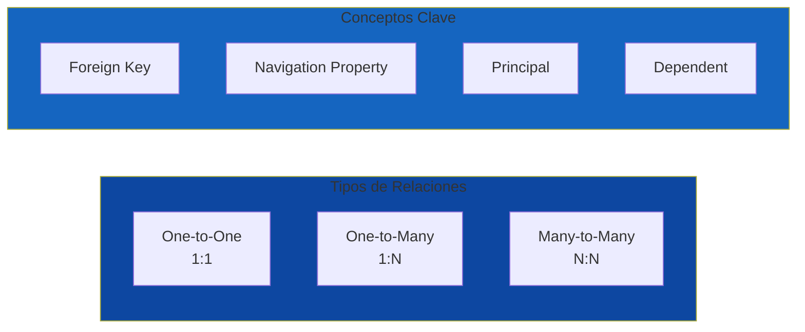
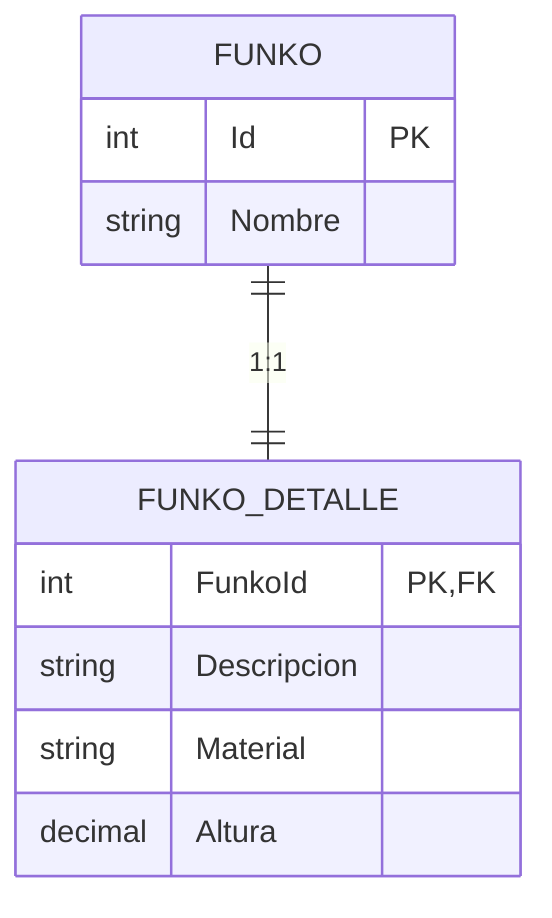
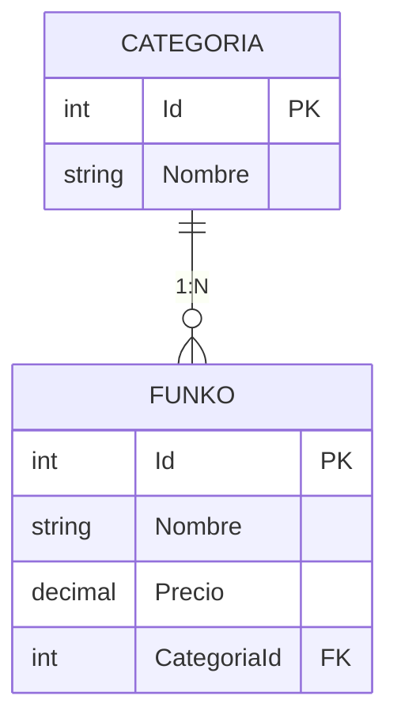
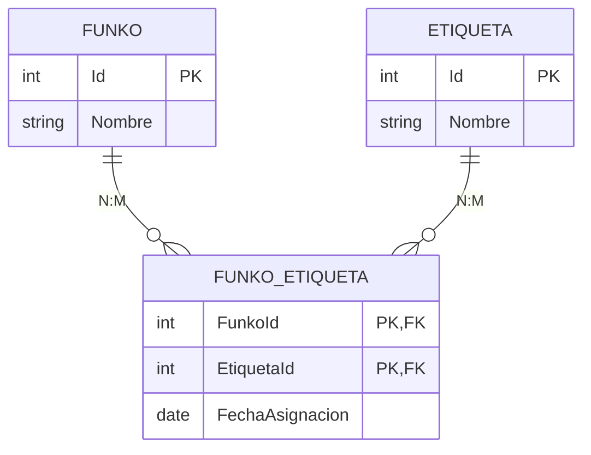
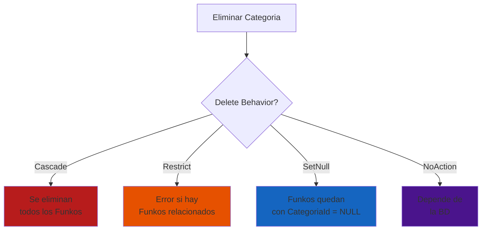

# 10. Entity Framework Core

- [10.1. Fundamentos de Entity Framework Core](#101-fundamentos-de-entity-framework-core)
  - [10.1.1. ¿Qué es un ORM?](#1011-qué-es-un-orm)
  - [10.1.2. ¿Qué es el DbContext?](#1012-qué-es-el-dbcontext)
  - [10.1.3. Componentes del DbContext](#1013-componentes-del-dbcontext)
  - [10.1.4. Ventajas de EF Core](#1014-ventajas-de-ef-core)
- [10.2. Configuración Inicial](#102-configuración-inicial)
  - [10.2.1. Instalación de Paquetes NuGet](#1021-instalación-de-paquetes-nuget)
  - [10.2.2. Configuración de la Conexión](#1022-configuración-de-la-conexión)
  - [10.2.3. Registro del DbContext](#1023-registro-del-dbcontext)
- [10.3. Configuración del Modelo: Data Annotations vs Fluent API](#103-configuración-del-modelo-data-annotations-vs-fluent-api)
  - [10.3.1. Data Annotations](#1031-data-annotations)
  - [10.3.2. Fluent API](#1032-fluent-api)
  - [10.3.3. Enfoque Híbrido Recomendado](#1033-enfoque-híbrido-recomendado)
- [10.4. Definiendo Entidades](#104-definiendo-entidades)
  - [10.4.1. Identificadores](#1041-identificadores)
  - [10.4.2. Propiedades Básicas](#1042-propiedades-básicas)
  - [10.4.3. Propiedades de Configuración](#1043-propiedades-de-configuración)
  - [10.4.4. Marcas Temporales (Timestamps)](#1044-marcas-temporales-timestamps)
- [10.5. Relaciones entre Entidades](#105-relaciones-entre-entidades)
  - [10.5.1. Conceptos Previos](#1051-conceptos-previos)
  - [10.5.2. Relación Uno a Uno (One-to-One)](#1052-relación-uno-a-uno-one-to-one)
  - [10.5.3. Relación Uno a Muchos (One-to-Many)](#1053-relación-uno-a-muchos-one-to-many)
  - [10.5.4. Relación Muchos a Muchos (Many-to-Many)](#1054-relación-muchos-a-muchos-many-to-many)
  - [10.5.5. Navegabilidad Unidireccional vs Bidireccional](#1055-navegabilidad-unidireccional-vs-bidireccional)
  - [10.5.6. Opciones de Cascada (Delete Behavior)](#1056-opciones-de-cascada-delete-behavior)
- [10.6. Carga de Datos (Eager vs Lazy Loading)](#106-carga-de-datos-eager-vs-lazy-loading)
  - [10.6.1. Eager Loading (Carga Ansiosa)](#1061-eager-loading-carga-ansiosa)
  - [10.6.2. Lazy Loading (Carga Perezosa)](#1062-lazy-loading-carga-perezosa)
  - [10.6.3. Explicit Loading (Carga Explícita)](#1063-explicit-loading-carga-explícita)
- [10.7. SaveChanges y Transacciones](#107-savechanges-y-transacciones)
  - [10.7.1. Funcionamiento de SaveChanges](#1071-funcionamiento-de-savechanges)
  - [10.7.2. Transacción Explícita](#1072-transacción-explícita)
- [10.8. Borrado Lógico vs Físico](#108-borrado-lógico-vs-físico)
  - [10.8.1. Borrado Físico](#1081-borrado-físico)
  - [10.8.2. Borrado Lógico con Query Filters](#1082-borrado-lógico-con-query-filters)
- [10.9. Migraciones](#109-migraciones)
  - [10.9.1. Crear una Migración](#1091-crear-una-migración)
  - [10.9.2. Aplicar Migraciones](#1092-aplicar-migraciones)
  - [10.9.3. Comandos Útiles](#1093-comandos-útiles)
- [10.10. Seed Data (Datos Iniciales)](#1010-seed-data-datos-iniciales)
  - [10.10.1. Seed Data con HasData](#10101-seed-data-con-hasdata)
  - [10.10.2. Seed Data con Servicio](#10102-seed-data-con-servicio)
  - [10.10.3. Seed Data con Archivos SQL](#10103-seed-data-con-archivos-sql)
- [10.11. Consultas con LINQ](#1011-consultas-con-linq)
  - [10.11.1. Consultas Básicas](#10111-consultas-básicas)
  - [10.11.2. Consultas SQL Nativas](#10112-consultas-sql-nativas)
- [10.12. Control de Concurrencia](#1012-control-de-concurrencia)
  - [10.12.1. Enfoque Optimista: RowVersion](#10121-enfoque-optimista-rowversion)
  - [10.12.2. Enfoque Pesimista: Transacciones](#10122-enfoque-pesimista-transacciones)
- [10.13. Shadow Properties y Global Query Filters](#1013-shadow-properties-y-global-query-filters)
  - [10.13.1. Shadow Properties](#10131-shadow-properties)
  - [10.13.2. Global Query Filters](#10132-global-query-filters)
- [10.14. Testing con EF Core](#1014-testing-con-ef-core)
  - [10.14.1. InMemory Database](#10141-inmemory-database)
  - [10.14.2. TestContainers](#10142-testcontainers)
- [10.15. Resumen](#1015-resumen)

---

## 10.1. Fundamentos de Entity Framework Core

**Entity Framework Core (EF Core)** es un ORM (Object-Relational Mapper) moderno, ligero y extensible para .NET. Permite trabajar con bases de datos relacionales usando objetos .NET, eliminando la necesidad de escribir SQL manualmente en la mayoría de los casos. EF Core es la versión reimaginada de Entity Framework, optimizada para ser más ligera, rápida y multiplataforma.

🧠 **Analogía**: EF Core actúa como un **traductor bidireccional** en una negociación internacional. Tú le hablas en C# (objetos, listas, consultas LINQ) y él traduce a SQL (SELECT, INSERT, UPDATE). Luego traduce los resultados de vuelta a objetos C# que puedes usar en tu aplicación, como si el traductor convertiera los documentos en el idioma que necesites.



### 10.1.1. ¿Qué es un ORM?

Un **ORM (Object-Relational Mapper)** es una herramienta que permite convertir datos entre sistemas de tipos incompatibles: las bases de datos relacionales (que trabajan con tablas, filas, columnas y SQL) y los objetos orientados (que trabajan con clases, instancias, propiedades y métodos). En lugar de escribir SQL manualmente para cada operación, trabajas con objetos C# y el ORM genera el SQL correspondiente.

| Enfoque | Descripción | Ejemplo |
|---------|-------------|---------|
| **SQL Puro** | Escribes INSERT, SELECT, UPDATE directamente | `INSERT INTO Funkos (Nombre, Precio) VALUES ('Iron Man', 34.99)` |
| **ORM (EF Core)** | Trabajas con objetos C# y el ORM genera SQL | `_context.Funkos.Add(new Funko { Nombre = "Iron Man", Precio = 34.99m })` |

**Ejemplo de transformación automática:**

```csharp
// Tu código C# (qué quieres obtener)
var funkos = await _context.Funkos
    .Where(f => f.Precio > 20)
    .OrderBy(f => f.Nombre)
    .Include(f => f.Categoria)
    .ToListAsync();

// EF Core lo traduce a SQL
SELECT f.*, c.* 
FROM Funkos f
LEFT JOIN Categorias c ON f.CategoriaId = c.Id
WHERE f.Precio > 20
ORDER BY f.Nombre
```

### 10.1.2. ¿Qué es el DbContext?

El **DbContext** es la clase principal en EF Core que representa una sesión con la base de datos. Es el punto de entrada para todas las operaciones de acceso a datos, permitiendo consultar entidades, guardar cambios y gestionar relaciones entre entidades. El DbContext actúa como un **carrito de compras** en un supermercado.

🧠 **Analogía**: El DbContext es como un **carrito de compras** en un supermercado. El carrito te permite:
- **Añadir productos** (agregar entidades con `Add()`)
- **Ver qué llevas** (consultar con `Find()` o `Where()`)
- **Quitar productos** (eliminar con `Remove()`)
- **Pagar todo junto** (guardar cambios con `SaveChanges()`)

### 10.1.3. Componentes del DbContext



| Componente | Descripción | Ejemplo |
|------------|-------------|---------|
| **DbSet<T>** | Representa una tabla en la BD | `public DbSet<Funko> Funkos { get; set; }` |
| **OnConfiguring** | Configura la conexión a la BD | `options.UseSqlServer(connectionString)` |
| **OnModelCreating** | Define el modelo (entidades, relaciones) | `modelBuilder.Entity<Funko>()...` |
| **SaveChanges** | Guarda todos los cambios en la BD | `await context.SaveChangesAsync()` |
| **Change Tracker** | Rastrea el estado de las entidades | Added, Modified, Deleted, Unchanged |

**Ejemplo completo de DbContext:**

```csharp
using Microsoft.EntityFrameworkCore;

namespace FunkosApi.Core.Data;

public class FunkosDbContext : DbContext
{
    // 1. DbSet<T> - Representan las tablas
    public DbSet<Funko> Funkos { get; set; } = null!;
    public DbSet<Categoria> Categorias { get; set; } = null!;
    public DbSet<Pedido> Pedidos { get; set; } = null!;
    
    // 2. Constructor con opciones
    public FunkosDbContext(DbContextOptions<FunkosDbContext> options)
        : base(options) { }
    
    // 3. Configuración del modelo
    protected override void OnModelCreating(ModelBuilder modelBuilder)
    {
        base.OnModelCreating(modelBuilder);
        
        // Configurar entidades
        modelBuilder.Entity<Funko>(entity =>
        {
            entity.HasKey(e => e.Id);
            entity.Property(e => e.Nombre).IsRequired().HasMaxLength(100);
            entity.Property(e => e.Precio).HasPrecision(18, 2);
            
            // Configurar relaciones
            entity.HasOne(e => e.Categoria)
                  .WithMany(c => c.Funkos)
                  .HasForeignKey(e => e.CategoriaId);
        });
    }
}
```

### 10.1.4. Ventajas de EF Core

| Ventaja | Descripción |
|---------|-------------|
| **Productividad** | Menos código SQL, más código C# legible |
| **Seguridad de tipos** | IntelliSense y compile-time checking |
| **Portabilidad** | Cambio de BD (SQL Server ↔ PostgreSQL ↔ SQLite) con solo cambiar el proveedor |
| **Migraciones** | Control de versiones del esquema de base de datos |
| **Testabilidad** | Facilita tests con InMemory Database |
| **Rendimiento** | Optimizado para .NET con compiled queries |
| **Multiplataforma** | Funciona en .NET Framework, .NET Core y .NET 5+ |

💡 **Tip del Examinador**: En el examen se valora que conozcas tanto las ventajas como las limitaciones de EF Core. No es la solución para todos los escenarios: operaciones bulk o queries muy complejas pueden beneficiarse de SQL puro.

---

## 10.2. Configuración Inicial

### 10.2.1. Instalación de Paquetes NuGet

**Proveedor de base de datos:**

```bash
# SQL Server (más común en ASP.NET Core)
dotnet add package Microsoft.EntityFrameworkCore.SqlServer

# PostgreSQL
dotnet add package Npgsql.EntityFrameworkCore.PostgreSQL

# SQLite (ideal para desarrollo y pruebas)
dotnet add package Microsoft.EntityFrameworkCore.Sqlite

# MySQL
dotnet add package Pomelo.EntityFrameworkCore.MySql

# InMemory (para tests)
dotnet add package Microsoft.EntityFrameworkCore.InMemory
```

**Herramientas CLI:**

```bash
# Instalar herramientas EF Core globally
dotnet tool install --global dotnet-ef

# Verificar instalación
dotnet ef --version
```

### 10.2.2. Configuración de la Conexión

**appsettings.json:**

```json
{
  "ConnectionStrings": {
    "DefaultConnection": "Server=localhost;Database=FunkosDb;Trusted_Connection=True;TrustServerCertificate=true",
    "PostgreSQLConnection": "Host=localhost;Database=FunkosDb;Username=postgres;Password=secret",
    "SQLiteConnection": "Data Source=funkos.db"
  }
}
```

### 10.2.3. Registro del DbContext

**Program.cs:**

```csharp
using Microsoft.EntityFrameworkCore;
using FunkosApi.Core.Data;

var builder = WebApplication.CreateBuilder(args);

// Registrar DbContext con SQL Server
builder.Services.AddDbContext<FunkosDbContext>(options =>
    options.UseSqlServer(
        builder.Configuration.GetConnectionString("DefaultConnection")));

// O con PostgreSQL
builder.Services.AddDbContext<FunkosDbContext>(options =>
    options.UseNpgsql(
        builder.Configuration.GetConnectionString("PostgreSQLConnection")));

// O con SQLite (para desarrollo)
builder.Services.AddDbContext<FunkosDbContext>(options =>
    options.UseSqlite(
        builder.Configuration.GetConnectionString("SQLiteConnection")));

var app = builder.Build();

// Aplicar migraciones al inicio
using (var scope = app.Services.CreateScope())
{
    var db = scope.ServiceProvider.GetRequiredService<FunkosDbContext>();
    db.Database.Migrate();
}

app.MapControllers();
app.Run();
```

📝 **Nota del Profesor**: El DbContext debe registrarse con **Scoped lifetime** (el default con `AddDbContext`) porque representa una sesión de base de datos por request HTTP.

---

## 10.3. Configuración del Modelo: Data Annotations vs Fluent API

Puedes configurar tu modelo de datos de dos maneras: **Data Annotations** (atributos en las clases) o **Fluent API** (código fluido en el DbContext).

### 10.3.1. Data Annotations

Los atributos se colocan directamente en las propiedades de las clases. Son ideales para configuraciones simples y mantienen la configuración junto al código.

```csharp
using System.ComponentModel.DataAnnotations;
using System.ComponentModel.DataAnnotations.Schema;

namespace FunkosApi.Core.Models;

public class Funko
{
    [Key]  // Clave primaria
    public int Id { get; set; }

    [Required]  // No puede ser null
    [StringLength(100)]  // Longitud máxima
    public string Nombre { get; set; } = string.Empty;

    [Column(TypeName = "decimal(18,2)")]  // Tipo específico en BD
    public decimal Precio { get; set; }

    [Range(0, int.MaxValue)]  // Rango de valores
    public int Stock { get; set; }

    [MaxLength(500)]  // Longitud máxima para string
    public string? Descripcion { get; set; }

    [Url]  // Debe ser una URL válida
    public string? ImagenUrl { get; set; }

    public DateTime FechaLanzamiento { get; set; }

    public int CategoriaId { get; set; }

    // Relación
    public Categoria Categoria { get; set; } = null!;
}

public class Categoria
{
    [Key]
    public int Id { get; set; }

    [Required]
    [StringLength(50)]
    public string Nombre { get; set; } = string.Empty;

    [MaxLength(200)]
    public string? Descripcion { get; set; }

    // Relación inversa
    public ICollection<Funko> Funkos { get; set; } = new List<Funko>();
}
```

### 10.3.2. Fluent API

La Fluent API se configura en el método `OnModelCreating` del DbContext. Ofrece mayor flexibilidad y control sobre la configuración, especialmente para relaciones complejas.

```csharp
protected override void OnModelCreating(ModelBuilder modelBuilder)
{
    base.OnModelCreating(modelBuilder);

    // Configuración de Funko
    modelBuilder.Entity<Funko>(entity =>
    {
        // Clave primaria
        entity.HasKey(e => e.Id);

        // Propiedades
        entity.Property(e => e.Nombre)
              .IsRequired()
              .HasMaxLength(100)
              .IsUnicode();

        entity.Property(e => e.Precio)
              .HasPrecision(18, 2)
              .IsRequired();

        entity.Property(e => e.Stock)
              .IsRequired()
              .HasDefaultValue(0);

        entity.Property(e => e.Descripcion)
              .HasMaxLength(500);

        entity.Property(e => e.ImagenUrl)
              .HasMaxLength(500);

        // Marcas temporales
        entity.Property(e => e.FechaCreacion)
              .IsRequired()
              .HasDefaultValueSql("CURRENT_TIMESTAMP");

        entity.Property(e => e.FechaActualizacion)
              .IsRequired()
              .ValueGeneratedOnUpdate();

        // Relaciones
        entity.HasOne(e => e.Categoria)
              .WithMany(c => c.Funkos)
              .HasForeignKey(e => e.CategoriaId)
              .OnDelete(DeleteBehavior.Cascade);

        // Índices
        entity.HasIndex(e => e.Nombre).IsUnique();
        entity.HasIndex(e => e.Precio);
        entity.HasIndex(e => e.CategoriaId);
    });

    // Configuración de Categoria
    modelBuilder.Entity<Categoria>(entity =>
    {
        entity.HasKey(e => e.Id);

        entity.Property(e => e.Nombre)
              .IsRequired()
              .HasMaxLength(50)
              .IsUnicode();

        entity.Property(e => e.Descripcion)
              .HasMaxLength(200);

        entity.HasIndex(e => e.Nombre).IsUnique();
    });
}
```

**Configuraciones separadas (IEntityTypeConfiguration):**

```csharp
using Microsoft.EntityFrameworkCore;
using Microsoft.EntityFrameworkCore.Metadata.Builders;

namespace FunkosApi.Core.Data.Configurations;

public class FunkoConfiguration : IEntityTypeConfiguration<Funko>
{
    public void Configure(EntityTypeBuilder<Funko> builder)
    {
        builder.ToTable("funkos");
        
        builder.HasKey(e => e.Id);
        
        builder.Property(e => e.Nombre)
            .IsRequired()
            .HasMaxLength(100);
        
        builder.Property(e => e.Precio)
            .HasPrecision(18, 2)
            .IsRequired();
        
        builder.HasOne(e => e.Categoria)
            .WithMany(c => c.Funkos)
            .HasForeignKey(e => e.CategoriaId);
        
        builder.HasIndex(e => e.Nombre).IsUnique();
    }
}

// En DbContext
protected override void OnModelCreating(ModelBuilder modelBuilder)
{
    base.OnModelCreating(modelBuilder);
    
    modelBuilder.ApplyConfiguration(new FunkoConfiguration());
    modelBuilder.ApplyConfiguration(new CategoriaConfiguration());
}
```

### 10.3.3. Enfoque Híbrido Recomendado

El enfoque **híbrido** combina lo mejor de ambos mundos: Data Annotations para validaciones básicas y documentación del modelo, Fluent API para configuraciones avanzadas y relaciones complejas.

```csharp
// Funko.cs - Data Annotations para documentación y validaciones básicas
public class Funko
{
    [Key]
    public int Id { get; set; }

    [Required]
    [StringLength(100)]
    public string Nombre { get; set; } = string.Empty;

    [Column(TypeName = "decimal(18,2)")]
    public decimal Precio { get; set; }

    public int Stock { get; set; }

    public int CategoriaId { get; set; }
    public Categoria Categoria { get; set; } = null!;
}

// FunkosDbContext.cs - Fluent API para configuraciones avanzadas
protected override void OnModelCreating(ModelBuilder modelBuilder)
{
    base.OnModelCreating(modelBuilder);

    modelBuilder.Entity<Funko>(entity =>
    {
        // Configuraciones avanzadas
        entity.Property(e => e.Nombre)
              .IsRequired()
              .HasMaxLength(100)
              .IsUnicode();

        // Índices
        entity.HasIndex(e => e.Nombre).IsUnique();

        // Configuración de relaciones
        entity.HasOne(e => e.Categoria)
              .WithMany(c => c.Funkos)
              .HasForeignKey(e => e.CategoriaId)
              .OnDelete(DeleteBehavior.Cascade);
    });
}
```

| Aspecto | Data Annotations | Fluent API |
|---------|------------------|------------|
| **Legibilidad** | ✅ En la clase | ⚠️ Fuera de la clase |
| **Complejidad** | ✅ Simple | ⚠️ Más código |
| **Validaciones** | ✅ Integradas | ❌ Manual |
| **Relaciones** | ⚠️ Limitado | ✅ Completo |
| **Configuración avanzada** | ❌ No | ✅ Sí |

💡 **Tip del Examinador**: El enfoque híbrido es el más profesional. Usa Data Annotations para lo básico y Fluent API para lo avanzado. Esto mantiene el código limpio y mantenible.

---

## 10.4. Definiendo Entidades

### 10.4.1. Identificadores

#### Identity (Autoincremental)

El tipo más común. La base de datos genera automáticamente un número secuencial.

```csharp
public class Funko
{
    [Key]
    public int Id { get; set; }  // Se genera automáticamente: 1, 2, 3...
    
    public string Nombre { get; set; } = string.Empty;
}
```

#### GUID/UUID

Identificadores únicos globales. Útiles para sistemas distribuidos o cuando necesitas IDs antes de insertar.

```csharp
public class Funko
{
    [Key]
    public Guid Id { get; set; } = Guid.NewGuid();  // "550e8400-e29b-41d4-a716-446655440000"
    
    public string Nombre { get; set; } = string.Empty;
}
```

**Comparación:**

| Aspecto | Identity (int) | GUID (Guid) |
|---------|----------------|-------------|
| **Tamaño** | 4 bytes | 16 bytes |
| **Legibilidad** | ✅ 1, 2, 3... | ❌ xxxx-xxxx-xxxx |
| **URL-friendly** | ✅ Sí | ⚠️ Base64 necesario |
| **Performance** | ✅ Mejor (índice más pequeño) | ⚠️ Peor (índice más grande) |
| **Merging datos** | ❌ Conflictos posibles | ✅ Sin conflictos |
| **Seguridad** | ❌ Predecible | ✅ Aleatorio |

### 10.4.2. Propiedades Básicas

```csharp
public class Funko
{
    // Clave primaria
    public int Id { get; set; }

    // Requerida (no puede ser null)
    [Required]
    [StringLength(100)]
    public string Nombre { get; set; } = string.Empty;

    // Opcional (nullable)
    [MaxLength(500)]
    public string? Descripcion { get; set; }

    // Con valor por defecto
    public int Stock { get; set; } = 0;

    // Tipo de dato específico en BD
    [Column(TypeName = "decimal(18,2)")]
    public decimal Precio { get; set; }

    // URL validada
    [Url]
    public string? ImagenUrl { get; set; }

    // Fecha
    public DateTime FechaLanzamiento { get; set; }

    // Fecha UTC
    public DateTime FechaCreacion { get; set; } = DateTime.UtcNow;

    // Fecha nullable
    public DateTime? FechaActualizacion { get; set; }

    // Booleano
    public bool IsDeleted { get; set; } = false;
}
```

### 10.4.3. Propiedades de Configuración

```csharp
protected override void OnModelCreating(ModelBuilder modelBuilder)
{
    modelBuilder.Entity<Funko>(entity =>
    {
        // Configuración de propiedades
        entity.Property(e => e.Id)
              .ValueGeneratedOnAdd();  // Se genera al añadir

        entity.Property(e => e.Nombre)
              .IsRequired()                    // No puede ser null
              .HasMaxLength(100)               // Longitud máxima
              .IsUnicode()                     // Soporta caracteres Unicode
              .HasDefaultValue("Sin nombre");  // Valor por defecto

        entity.Property(e => e.Precio)
              .HasPrecision(18, 2)            // Precisión: 18 dígitos, 2 decimales
              .HasDefaultValue(0.00m);        // Valor por defecto

        entity.Property(e => e.FechaCreacion)
              .IsRequired()
              .ValueGeneratedOnAdd()           // Se genera al INSERTAR
              .HasDefaultValueSql("CURRENT_TIMESTAMP");  // SQL que genera el valor

        entity.Property(e => e.FechaActualizacion)
              .IsRequired()
              .ValueGeneratedOnUpdate();       // Se genera al ACTUALIZAR

        entity.Property(e => e.ImagenUrl)
              .HasMaxLength(500)
              .IsUnicode(false);               // Solo ASCII
    });
}
```

### 10.4.4. Marcas Temporales (Timestamps)

Las marcas temporales son campos que EF Core puede gestionar automáticamente para auditoría.

```csharp
using System.ComponentModel.DataAnnotations;

public class Funko
{
    public int Id { get; set; }
    public string Nombre { get; set; } = string.Empty;

    // EF Core gestiona estos automáticamente
    public DateTime CreatedAt { get; set; }
    public DateTime? UpdatedAt { get; set; }
}

// Configuración en Fluent API
protected override void OnModelCreating(ModelBuilder modelBuilder)
{
    modelBuilder.Entity<Funko>(entity =>
    {
        entity.Property(e => e.CreatedAt)
              .IsRequired()
              .ValueGeneratedOnAdd()
              .HasDefaultValueSql("CURRENT_TIMESTAMP");

        entity.Property(e => e.UpdatedAt)
              .IsRequired()
              .ValueGeneratedOnUpdate();
    });
}
```

**Interceptor automático de timestamps:**

```csharp
using Microsoft.EntityFrameworkCore;
using Microsoft.EntityFrameworkCore.Diagnostics;

public class TimestampInterceptor : SaveChangesInterceptor
{
    public override int SavedChanges(SaveChangesCompletedEventData eventData, int result)
    {
        UpdateTimestamps(eventData.Context);
        return base.SavedChanges(eventData, result);
    }

    public override ValueTask<int> SavedChangesAsync(
        SaveChangesCompletedEventData eventData,
        int result,
        CancellationToken cancellationToken = default)
    {
        UpdateTimestamps(eventData.Context);
        return base.SavedChangesAsync(eventData, result, cancellationToken);
    }

    private void UpdateTimestamps(DbContext? context)
    {
        if (context == null) return;

        var entries = context.ChangeTracker.Entries()
            .Where(e => e.State == EntityState.Added || e.State == EntityState.Modified);

        foreach (var entry in entries)
        {
            if (entry.State == EntityState.Added)
            {
                entry.Property("CreatedAt").CurrentValue = DateTime.UtcNow;
            }
            if (entry.State == EntityState.Added || entry.State == EntityState.Modified)
            {
                entry.Property("UpdatedAt").CurrentValue = DateTime.UtcNow;
            }
        }
    }
}
```

---

## 10.5. Relaciones entre Entidades

### 10.5.1. Conceptos Previos



| Concepto | Descripción | Ejemplo |
|----------|-------------|---------|
| **Foreign Key** | Campo que referencia a otra tabla | `CategoriaId` en `Funko` |
| **Navigation Property** | Referencia al objeto relacionado | `Categoria` en `Funko` |
| **Principal** | La entidad "principal" de la relación | `Categoria` |
| **Dependent** | La entidad que depende de otra | `Funko` depende de `Categoria` |

### 10.5.2. Relación Uno a Uno (One-to-One)

Un `Funko` tiene un `Detalle`, y un `Detalle` pertenece a un `Funko`.

```csharp
// Entidad principal
public class Funko
{
    public int Id { get; set; }
    public string Nombre { get; set; } = string.Empty;
    
    // Relación 1:1
    public FunkoDetalle? Detalle { get; set; }
}

// Entidad dependiente
public class FunkoDetalle
{
    public int FunkoId { get; set; }  // PK y FK simultáneamente
    
    public string Descripcion { get; set; } = string.Empty;
    public string Material { get; set; } = string.Empty;
    public decimal Altura { get; set; }
    
    // Navigation property inversa
    public Funko Funko { get; set; } = null!;
}

// Configuración en DbContext
protected override void OnModelCreating(ModelBuilder modelBuilder)
{
    modelBuilder.Entity<FunkoDetalle>(entity =>
    {
        // PK también es FK
        entity.HasKey(e => e.FunkoId);
        
        // Relación 1:1
        entity.HasOne(e => e.Funko)
              .WithOne(f => f.Detalle)
              .HasForeignKey<FunkoDetalle>(e => e.FunkoId);
    });
}
```



### 10.5.3. Relación Uno a Muchos (One-to-Many)

Una `Categoria` tiene muchos `Funkos`, pero cada `Funko` pertenece a una `Categoria`.

```csharp
// Entidad principal (uno)
public class Categoria
{
    public int Id { get; set; }
    public string Nombre { get; set; } = string.Empty;
    
    // Colección de funkos (muchos)
    public ICollection<Funko> Funkos { get; set; } = new List<Funko>();
}

// Entidad dependiente (muchos)
public class Funko
{
    public int Id { get; set; }
    public string Nombre { get; set; } = string.Empty;
    public decimal Precio { get; set; }
    
    // Foreign Key
    public int CategoriaId { get; set; }
    
    // Navigation property
    public Categoria Categoria { get; set; } = null!;
}

// Configuración en DbContext
protected override void OnModelCreating(ModelBuilder modelBuilder)
{
    modelBuilder.Entity<Funko>(entity =>
    {
        entity.HasOne(f => f.Categoria)
              .WithMany(c => c.Funkos)
              .HasForeignKey(f => f.CategoriaId)
              .OnDelete(DeleteBehavior.Cascade);
    });
}
```



### 10.5.4. Relación Muchos a Muchos (Many-to-Many)

Un `Funko` puede tener muchas `Etiquetas`, y una `Etiqueta` puede pertenecer a muchos `Funkos`.

**Sin entidad de unión (EF Core 5+):**

```csharp
public class Funko
{
    public int Id { get; set; }
    public string Nombre { get; set; } = string.Empty;
    
    public ICollection<Etiqueta> Etiquetas { get; set; } = new List<Etiqueta>();
}

public class Etiqueta
{
    public int Id { get; set; }
    public string Nombre { get; set; } = string.Empty;
    
    public ICollection<Funko> Funkos { get; set; } = new List<Funko>();
}

// Configuración
protected override void OnModelCreating(ModelBuilder modelBuilder)
{
    modelBuilder.Entity<Funko>(entity =>
    {
        entity.HasMany(f => f.Etiquetas)
              .WithMany(e => e.Funkos)
              .UsingEntity(j => j.ToTable("FunkoEtiquetas"));
    });
}
```

**Con entidad de unión (más control):**

```csharp
// Entidad de unión
public class FunkoEtiqueta
{
    public int FunkoId { get; set; }
    public int EtiquetaId { get; set; }
    public DateTime FechaAsignacion { get; set; } = DateTime.UtcNow();
    
    public Funko Funko { get; set; } = null!;
    public Etiqueta Etiqueta { get; set; } = null!;
}

public class Funko
{
    public int Id { get; set; }
    public string Nombre { get; set; } = string.Empty;
    
    public ICollection<FunkoEtiqueta> FunkoEtiquetas { get; set; } = new List<FunkoEtiqueta>();
}

public class Etiqueta
{
    public int Id { get; set; }
    public string Nombre { get; set; } = string.Empty;
    
    public ICollection<FunkoEtiqueta> FunkoEtiquetas { get; set; } = new List<FunkoEtiqueta>();
}

// Configuración
protected override void OnModelCreating(ModelBuilder modelBuilder)
{
    modelBuilder.Entity<FunkoEtiqueta>(entity =>
    {
        entity.HasKey(fe => new { fe.FunkoId, fe.EtiquetaId });
        
        entity.HasOne(fe => fe.Funko)
              .WithMany(f => f.FunkoEtiquetas)
              .HasForeignKey(fe => fe.FunkoId);
        
        entity.HasOne(fe => fe.Etiqueta)
              .WithMany(e => e.FunkoEtiquetas)
              .HasForeignKey(fe => fe.EtiquetaId);
    });
}
```



### 10.5.5. Navegabilidad Unidireccional vs Bidireccional

| Tipo | Descripción | Ejemplo |
|------|-------------|---------|
| **Unidireccional** | Solo una entidad tiene navigation property | `Funko.Categoria` (pero `Categoria` no tiene `Funkos`) |
| **Bidireccional** | Ambas entidades tienen navigation property | `Funko.Categoria` y `Categoria.Funkos` |

```csharp
// Unidireccional
public class Funko
{
    public int CategoriaId { get; set; }
    public Categoria? Categoria { get; set; }
}

public class Categoria
{
    // ⚠️ NO tiene ICollection<Funko> - unidireccional
}

// Bidireccional
public class Funko
{
    public int CategoriaId { get; set; }
    public Categoria Categoria { get; set; } = null!;
}

public class Categoria
{
    public ICollection<Funko> Funkos { get; set; } = new List<Funko>();
}
```

### 10.5.6. Opciones de Cascada (Delete Behavior)

El **Delete Behavior** define qué ocurre con las entidades dependientes cuando se elimina la entidad principal.



| Comportamiento | Descripción | Ejemplo |
|----------------|-------------|---------|
| **Cascade** | Se eliminan automáticamente | Eliminar categoría → eliminar funkos |
| **Restrict** | Evita eliminar si hay dependientes | Error si hay funkos |
| **SetNull** | FK se establece a NULL | `CategoriaId = NULL` (la propiedad debe ser nullable) |
| **NoAction** | Sin acción (base de datos decide) | Depende de FK |

```csharp
protected override void OnModelCreating(ModelBuilder modelBuilder)
{
    modelBuilder.Entity<Funko>(entity =>
    {
        // Cascade: Si se elimina la categoría, se eliminan sus funkos
        entity.HasOne(f => f.Categoria)
              .WithMany(c => c.Funkos)
              .HasForeignKey(f => f.CategoriaId)
              .OnDelete(DeleteBehavior.Cascade);

        // Restrict: Evita eliminar si hay funkos
        // entity.HasOne(f => f.Categoria)
        //       .WithMany(c => c.Funkos)
        //       .HasForeignKey(f => f.CategoriaId)
        //       .OnDelete(DeleteBehavior.Restrict);

        // SetNull: FK se pone a NULL
        // entity.HasOne(f => f.Categoria)
        //       .WithMany(c => c.Funkos)
        //       .HasForeignKey(f => f.CategoriaId)
        //       .OnDelete(DeleteBehavior.SetNull);
    });
}
```

⚠️ **Advertencia**: `Cascade` es útil, pero ten cuidado en producción. Un误删除 puede eliminar miles de registros.

---

## 10.6. Carga de Datos (Eager vs Lazy Loading)

### 10.6.1. Eager Loading (Carga Ansiosa)

Carga todas las entidades relacionadas **en una sola consulta** usando `Include`. Es el método **recomendado** porque evita el problema N+1.

```csharp
// Cargar Funkos CON su Categoría
var funkos = await _context.Funkos
    .Include(f => f.Categoria)  // Incluye la categoría
    .ToListAsync();

// Carga anidada: Funko -> Categoria
var funkosConCategoria = await _context.Funkos
    .Include(f => f.Categoria)
    .ThenInclude(c => c.Descripcion)  // Si hubiera más niveles
    .ToListAsync();

// Filtrado en la carga
var funkosMarvel = await _context.Funkos
    .Include(f => f.Categoria)
    .Where(f => f.Categoria.Nombre == "Marvel")
    .ToListAsync();

// Múltiples inclusiones
var funkosConReviews = await _context.Funkos
    .Include(f => f.Categoria)
    .Include(f => f.Reviews)
    .ToListAsync();
```

### 10.6.2. Lazy Loading (Carga Perezosa)

Carga las entidades relacionadas **automáticamente** cuando se accede a la propiedad. Requiere proxies de EF Core.

```csharp
// Habilitar en Program.cs
builder.Services.AddDbContext<FunkosDbContext>(options =>
    options.UseSqlServer(connectionString)
           .UseLazyLoadingProxies());

// La categoría se carga automáticamente al acceder
var funko = await _context.Funkos.FindAsync(1);
var categoriaNombre = funko.Categoria.Nombre;  // 💥 Segunda consulta a la BD
```

⚠️ **Advertencia**: El lazy loading puede causar el **problema N+1** donde se ejecuta una consulta adicional por cada entidad relacionada.

### 10.6.3. Explicit Loading (Carga Explícita)

Carga manualmente las entidades relacionadas bajo demanda.

```csharp
var funko = await _context.Funkos.FindAsync(1);

// Cargar explícitamente la categoría
await _context.Entry(funko)
    .Reference(f => f.Categoria)
    .LoadAsync();

// Cargar colección explícitamente con filtro
await _context.Entry(funko)
    .Collection(f => f.Reviews)
    .Query()
    .Where(r => r.Calificacion >= 4)
    .LoadAsync();
```

💡 **Tip del Examinador**: Usa **Eager Loading** (`Include`) como patrón predeterminado. Es más predecible y eficiente que Lazy Loading. Solo usa Lazy Loading cuando tengas una razón específica y controles los accesos.

---

## 10.7. SaveChanges y Transacciones

### 10.7.1. Funcionamiento de SaveChanges

El método `SaveChanges()` persiste todos los cambios pendientes en una transacción atómica.

```csharp
public class FunkoService(FunkosDbContext context)
{
    public async Task<Funko> CreateAsync(Funko funko)
    {
        context.Funkos.Add(funko);
        await context.SaveChangesAsync();  // Persiste en una transacción
        return funko;
    }

    public async Task<bool> DeleteAsync(int id)
    {
        var funko = await context.Funkos.FindAsync(id);
        if (funko == null) return false;
        
        context.Funkos.Remove(funko);
        await context.SaveChangesAsync();
        return true;
    }
}
```

### 10.7.2. Transacción Explícita

Para operaciones que requieren múltiples cambios en una sola transacción:

```csharp
public async Task<bool> TransferirStockAsync(int funkoOrigenId, int funkoDestinoId, int cantidad)
{
    using var transaction = await context.Database.BeginTransactionAsync();
    
    try
    {
        var origen = await context.Funkos.FindAsync(funkoOrigenId);
        var destino = await context.Funkos.FindAsync(funkoDestinoId);
        
        if (origen == null || destino == null)
            return false;
        
        if (origen.Stock < cantidad)
            throw new InvalidOperationException("Stock insuficiente");
        
        origen.Stock -= cantidad;
        destino.Stock += cantidad;
        
        await context.SaveChangesAsync();
        await transaction.CommitAsync();
        return true;
    }
    catch
    {
        await transaction.RollbackAsync();
        throw;
    }
}
```

---

## 10.8. Borrado Lógico vs Físico

### 10.8.1. Borrado Físico

Elimina permanentemente el registro de la base de datos.

```csharp
var funko = await _context.Funkos.FindAsync(1);
_context.Funkos.Remove(funko);
await _context.SaveChangesAsync();
```

### 10.8.2. Borrado Lógico con Query Filters

Marca el registro como eliminado sin eliminarlo físicamente, manteniendo los datos para auditoría.

```csharp
public class Funko
{
    public int Id { get; set; }
    public string Nombre { get; set; } = string.Empty;
    
    // Campos de borrado lógico
    public bool IsDeleted { get; set; } = false;
    public DateTime? DeletedAt { get; set; }
    public string? DeletedBy { get; set; }
}

// Query filter global (automáticamente filtra eliminados)
protected override void OnModelCreating(ModelBuilder modelBuilder)
{
    modelBuilder.Entity<Funko>(entity =>
    {
        entity.HasQueryFilter(f => !f.IsDeleted);  // ⚠️ Filtra automáticamente
    });
}

// Eliminar lógicamente
var funko = await _context.Funkos.FindAsync(1);
funko.IsDeleted = true;
funko.DeletedAt = DateTime.UtcNow;
_context.Funkos.Update(funko);
await _context.SaveChangesAsync();

// Consultar eliminados (ignorar filtro)
var eliminados = await _context.Funkos
    .IgnoreQueryFilters()  // Ignora el filtro global
    .Where(f => f.IsDeleted)
    .ToListAsync();
```

---

## 10.9. Migraciones

### 10.9.1. Crear una Migración

```bash
# Crear migración inicial
dotnet ef migrations add InitialCreate

# Crear migración con nombre específico
dotnet ef migrations add AddFunkoTable

# Crear migración en proyecto específico
dotnet ef migrations add AddCreatedAt -p ../FunkosApi.Core/FunkosApi.Core.csproj
```

### 10.9.2. Aplicar Migraciones

```bash
# Aplicar todas las migraciones pendientes
dotnet ef database update

# Aplicar hasta una migración específica
dotnet ef database update AddFunkoTable

# Revertir a migración anterior
dotnet ef database update PreviousMigrationName

# Generar script SQL sin ejecutar
dotnet ef migrations script -o migrations.sql
```

### 10.9.3. Comandos Útiles

```bash
# Listar migraciones
dotnet ef migrations list

# Eliminar última migración (no aplicada)
dotnet ef migrations remove

# Ver información del DbContext
dotnet ef dbcontext info

# Generar SQL sin aplicar
dotnet ef migrations script
```

---

## 10.10. Seed Data (Datos Iniciales)

### 10.10.1. Seed Data con HasData

```csharp
protected override void OnModelCreating(ModelBuilder modelBuilder)
{
    base.OnModelCreating(modelBuilder);

    // Seed de Categorías
    modelBuilder.Entity<Categoria>().HasData(
        new Categoria { Id = 1, Nombre = "Marvel", Descripcion = "Personajes del universo Marvel" },
        new Categoria { Id = 2, Nombre = "DC", Descripcion = "Personajes del universo DC" },
        new Categoria { Id = 3, Nombre = "Animación", Descripcion = "Personajes de series animadas" },
        new Categoria { Id = 4, Nombre = "Videojuegos", Descripcion = "Personajes de videojuegos" },
        new Categoria { Id = 5, Nombre = "Películas", Descripcion = "Personajes de películas" }
    );

    // Seed de Funkos
    modelBuilder.Entity<Funko>().HasData(
        new Funko { Id = 1, Nombre = "Iron Man Mark 50", Precio = 34.99m, Stock = 15, CategoriaId = 1 },
        new Funko { Id = 2, Nombre = "Batman Dark Knight", Precio = 39.99m, Stock = 8, CategoriaId = 2 },
        new Funko { Id = 3, Nombre = "Mario Bros Super", Precio = 24.99m, Stock = 20, CategoriaId = 4 }
    );
}
```

### 10.10.2. Seed Data con Servicio

```csharp
public class DataSeeder
{
    private readonly FunkosDbContext _context;
    private readonly ILogger<DataSeeder> _logger;

    public async Task SeedAsync()
    {
        _logger.LogInformation("Iniciando Seed Data...");

        // Seed de categorías
        if (!await _context.Categorias.AnyAsync())
        {
            var categorias = new List<Categoria>
            {
                new Categoria { Nombre = "Marvel", Descripcion = "Personajes del universo Marvel" },
                new Categoria { Nombre = "DC", Descripcion = "Personajes del universo DC" },
                new Categoria { Nombre = "Animación", Descripcion = "Personajes de series animadas" },
                new Categoria { Nombre = "Videojuegos", Descripcion = "Personajes de videojuegos" },
                new Categoria { Nombre = "Películas", Descripcion = "Personajes de películas" }
            };

            _context.Categorias.AddRange(categorias);
            await _context.SaveChangesAsync();
            _logger.LogInformation("Categorías sembradas");
        }

        _logger.LogInformation("Seed Data completado");
    }
}

// En Program.cs
using (var scope = app.Services.CreateScope())
{
    var seeder = scope.ServiceProvider.GetRequiredService<DataSeeder>();
    await seeder.SeedAsync();
}
```

### 10.10.3. Seed Data con Archivos SQL

```sql
-- seed.sql
INSERT INTO categorias (nombre, descripcion) VALUES
('Marvel', 'Personajes del universo Marvel'),
('DC', 'Personajes del universo DC'),
('Animación', 'Personajes de series animadas')
ON CONFLICT DO NOTHING;
```

```csharp
// En Program.cs
using var scope = app.Services.CreateScope();
using var connection = new NpgsqlConnection(connectionString);
await connection.OpenAsync();

var sql = File.ReadAllText("Data/seed.sql");
await connection.ExecuteAsync(sql);
```

---

## 10.11. Consultas con LINQ

### 10.11.1. Consultas Básicas

```csharp
// Obtener todos
var todos = await _context.Funkos.ToListAsync();

// Obtener por ID
var funko = await _context.Funkos.FindAsync(id);

// Filtrar
var funkosCaros = await _context.Funkos
    .Where(f => f.Precio > 30)
    .ToListAsync();

// Ordenar
var funkosOrdenados = await _context.Funkos
    .OrderBy(f => f.Nombre)
    .ToListAsync();

// Proyección (solo campos necesarios)
var nombres = await _context.Funkos
    .Select(f => new { f.Id, f.Nombre })
    .ToListAsync();

// Paginación
var pagina = await _context.Funkos
    .OrderBy(f => f.Id)
    .Skip((page - 1) * pageSize)
    .Take(pageSize)
    .ToListAsync();

// Agregados
var total = await _context.Funkos.CountAsync();
var precioPromedio = await _context.Funkos.AverageAsync(f => f.Precio);
var stockTotal = await _context.Funkos.SumAsync(f => f.Stock);
```

### 10.11.2. Consultas SQL Nativas

```csharp
// Query SQL simple
var funkos = await _context.Funkos
    .FromSqlRaw("SELECT * FROM Funkos WHERE Precio > {0}", 20)
    .ToListAsync();

// Con parámetros
var nombre = "Iron Man";
var funko = await _context.Funkos
    .FromSqlInterpolated($"SELECT * FROM Funkos WHERE Nombre = {nombre}")
    .FirstOrDefaultAsync();

// Ejecutar SQL directo (sin mapeo a entidad)
var count = await _context.Database
    .ExecuteSqlRawAsync("UPDATE Funkos SET Stock = Stock - 1 WHERE Id = {0}", id);

// SQL con JOIN y proyección
var detalles = await _context.Database
    .SqlQueryRaw<FunkoDetalle>(
        "SELECT f.Nombre, c.Nombre as Categoria, f.Precio FROM Funkos f JOIN Categorias c ON f.CategoriaId = c.Id")
    .ToListAsync();
```

---

## 10.12. Control de Concurrencia

### 10.12.1. Enfoque Optimista: RowVersion

Usa un campo `RowVersion` que EF Core verifica automáticamente.

```csharp
public class Funko
{
    public int Id { get; set; }
    public string Nombre { get; set; } = string.Empty;
    public int Stock { get; set; }
    
    [Timestamp]
    public byte[] RowVersion { get; set; } = null!;
}

// En Fluent API
modelBuilder.Entity<Funko>(entity =>
{
    entity.Property(e => e.RowVersion)
          .IsRowVersion();
});
```

**Manejo de conflictos:**

```csharp
public async Task<Result<Funko, DomainError>> UpdateStockAsync(int id, int nuevoStock)
{
    var funko = await _context.Funkos.FindAsync(id);
    if (funko == null)
        return Result.Failure<Funko, DomainError>(DomainError.NotFound("Funko no encontrado"));
    
    funko.Stock = nuevoStock;
    
    try
    {
        await _context.SaveChangesAsync();
        return Result.Success<Funko, DomainError>(funko);
    }
    catch (DbUpdateConcurrencyException ex)
    {
        // Obtener valores actuales de la BD
        var entry = ex.Entries[0];
        var databaseValues = await entry.GetDatabaseValuesAsync();
        
        if (databaseValues == null)
        {
            return Result.Failure<Funko, DomainError>(
                DomainError.NotFound("El funko fue eliminado"));
        }
        
        return Result.Failure<Funko, DomainError>(
            DomainError.Conflict("El funko fue modificado por otro usuario. Actualice y reintente."));
    }
}
```

### 10.12.2. Enfoque Pesimista: Transacciones

Usa transacciones con aislamiento Serializable para bloquear registros.

```csharp
public async Task<bool> ActualizarStockAsync(int id, int cantidad)
{
    using var transaction = await _context.Database.BeginTransactionAsync(
        System.Data.IsolationLevel.Serializable);
    
    try
    {
        // Bloquear el registro
        var funko = await _context.Funkos
            .FromSqlRaw("SELECT * FROM Funkos WHERE Id = {0} FOR UPDATE", id)
            .FirstOrDefaultAsync();
        
        if (funko == null)
            return false;
        
        funko.Stock += cantidad;
        await _context.SaveChangesAsync();
        await transaction.CommitAsync();
        return true;
    }
    catch
    {
        await transaction.RollbackAsync();
        throw;
    }
}
```

---

## 10.13. Shadow Properties y Global Query Filters

### 10.13.1. Shadow Properties

Propiedades que existen en la base de datos pero no en la clase .NET.

```csharp
protected override void OnModelCreating(ModelBuilder modelBuilder)
{
    // Shadow properties
    modelBuilder.Entity<Funko>()
        .Property<DateTime>("CreatedAt");
    
    modelBuilder.Entity<Funko>()
        .Property<string>("CreatedBy")
        .HasMaxLength(100);
    
    modelBuilder.Entity<Funko>()
        .Property<string>("LastModifiedBy")
        .HasMaxLength(100);
}

// Uso
context.Entry(funko)["CreatedAt"] = DateTime.UtcNow;
context.Entry(funko)["CreatedBy"] = "admin@funkos.com";
```

### 10.13.2. Global Query Filters

Filtros automáticos que se aplican a todas las consultas de una entidad.

```csharp
protected override void OnModelCreating(ModelBuilder modelBuilder)
{
    // Soft delete automático
    modelBuilder.Entity<Funko>(entity =>
    {
        entity.HasQueryFilter(f => !f.IsDeleted);  // Filtra eliminados
    });
    
    // Filtro por tenant (multitenant)
    modelBuilder.Entity<Pedido>(entity =>
    {
        entity.HasQueryFilter(p => p.TenantId == _currentTenantId);
    });
}

// Ignorar filtros para ver todos
var eliminados = await _context.Funkos
    .IgnoreQueryFilters()  // Ignora todos los filtros globales
    .Where(f => f.IsDeleted)
    .ToListAsync();
```

---

## 10.14. Testing con EF Core

### 10.14.1. InMemory Database

Ideal para tests unitarios rápidos. No es una base de datos real.

```csharp
// Arrange
var options = new DbContextOptionsBuilder<FunkosDbContext>()
    .UseInMemoryDatabase(databaseName: "TestDb")
    .Options;

using var context = new FunkosDbContext(options);
var repository = new FunkoRepository(context, Mock.Of<ILogger<FunkoRepository>>());

// Act
var funko = new Funko { Nombre = "Test Funko", Precio = 19.99m, Stock = 10, CategoriaId = 1 };
var result = await repository.SaveAsync(funko);

// Assert
Assert.True(result.IsSuccess);
Assert.Equal("Test Funko", result.Value.Nombre);
```

### 10.14.2. TestContainers

Para tests de integración con base de datos real.

```csharp
public class FunkoRepositoryIntegrationTests : IAsyncLifetime
{
    private PostgreSqlContainer _container = null!;
    private FunkosDbContext _context = null!;
    private FunkoRepository _repository = null!;

    public async Task InitializeAsync()
    {
        _container = new PostgreSqlBuilder()
            .WithImage("postgres:latest")
            .Build();
        
        await _container.StartAsync();
        
        var options = new DbContextOptionsBuilder<FunkosDbContext>()
            .UseNpgsql(_container.GetConnectionString())
            .Options;
        
        _context = new FunkosDbContext(options);
        _context.Database.Migrate();
        
        _repository = new FunkoRepository(_context, Mock.Of<ILogger<FunkoRepository>>());
    }

    public async Task DisposeAsync()
    {
        await _container.StopAsync();
    }

    [Test]
    public async Task Save_NewFunko_ReturnsFunkoWithId()
    {
        // Arrange
        var funko = new Funko 
        { 
            Nombre = "Spider-Man", 
            Precio = 29.99m, 
            Stock = 10, 
            CategoriaId = 1 
        };

        // Act
        var result = await _repository.SaveAsync(funko);

        // Assert
        result.IsSuccess.Should().BeTrue();
        result.Value.Id.Should().BeGreaterThan(0);
    }
}
```

---

## 10.15. Resumen


| Concepto | Descripción |
|----------|-------------|
| **ORM** | Traduce objetos C# a SQL y viceversa |
| **DbContext** | Sesión con la base de datos, punto de entrada |
| **Fluent API** | Configuración avanzada de entidades |
| **Relaciones** | One-to-One, One-to-Many, Many-to-Many |
| **Eager Loading** | Cargar relacionados con `Include()` |
| **Migraciones** | Versionado del esquema de base de datos |
| **Seed Data** | Datos iniciales para la aplicación |
| **Control de concurrencia** | Optimista (RowVersion) o Pesimista (transacciones) |

🧠 **Analogía final**: EF Core es como un **traductor profesional** que domina muchos idiomas (SQL Server, PostgreSQL, SQLite, MySQL). Tú le hablas en tu idioma nativo (C#) y él traduce perfectamente a cualquiera de los idiomas de base de datos. Además, mantiene un registro de todo lo que has cambiado (Change Tracker) y solo persiste los cambios cuando dices "guardar" (SaveChanges).

💡 **Tip del Examinador**: En el examen se valora que conozcas las opciones de configuración, especialmente Fluent API vs Data Annotations, las diferentes estrategias de carga de datos (Eager vs Lazy), y cómo manejar migraciones en producción.
