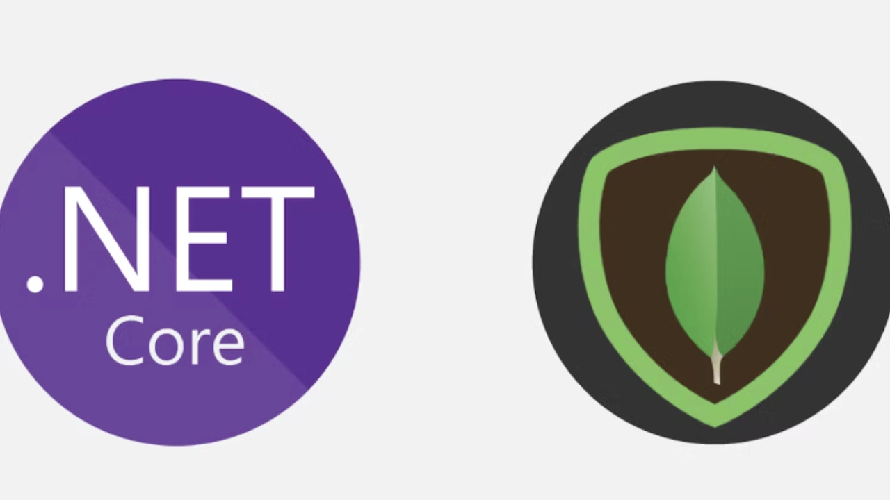

# NoSQL con MongoDB en ASP.NET Core

- [NoSQL con MongoDB en ASP.NET Core](#nosql-con-mongodb-en-aspnet-core)
  - [Introducción a NoSQL y MongoDB](#introducción-a-nosql-y-mongodb)
    - [Ventajas de NoSQL](#ventajas-de-nosql)
    - [Desventajas de NoSQL](#desventajas-de-nosql)
    - [¿Qué es MongoDB?](#qué-es-mongodb)
  - [Diseño en MongoDB](#diseño-en-mongodb)
    - [Documentos Embebidos vs Referencias](#documentos-embebidos-vs-referencias)
  - [Consultas en MongoDB](#consultas-en-mongodb)
    - [Operaciones CRUD](#operaciones-crud)
    - [Comparativa SQL vs MongoDB](#comparativa-sql-vs-mongodb)
  - [MongoDB Driver para .NET](#mongodb-driver-para-net)
    - [Instalación](#instalación)
    - [Configuración](#configuración)
    - [Modelos y Colecciones](#modelos-y-colecciones)
  - [Relaciones en MongoDB](#relaciones-en-mongodb)
    - [Referencias Manuales](#referencias-manuales)
    - [Documentos Embebidos](#documentos-embebidos)
  - [Repositorio con MongoDB](#repositorio-con-mongodb)
    - [Interfaz del Repositorio](#interfaz-del-repositorio)
    - [Implementación del Repositorio](#implementación-del-repositorio)
  - [Servicio con MongoDB](#servicio-con-mongodb)
  - [Testing con MongoDB](#testing-con-mongodb)
    - [MongoDB en Memoria (Testcontainers)](#mongodb-en-memoria-testcontainers)
    - [Test del Repositorio](#test-del-repositorio)
    - [Test del Servicio](#test-del-servicio)
  - [Integración Completa:  Pedidos](#integración-completa--pedidos)
    - [Modelos](#modelos)
    - [Repositorio de Pedidos](#repositorio-de-pedidos)
    - [Servicio de Pedidos](#servicio-de-pedidos)
    - [Controlador de Pedidos](#controlador-de-pedidos)
  - [Buenas Prácticas](#buenas-prácticas)
  - [Práctica de Clase](#práctica-de-clase)
  - [Proyecto del Curso](#proyecto-del-curso)



---

## Introducción a NoSQL y MongoDB

**NoSQL** ("Not Only SQL") describe bases de datos que no utilizan el modelo relacional tradicional. 

### Ventajas de NoSQL

✅ **Escalabilidad horizontal**: Fácil de distribuir en múltiples servidores
✅ **Esquema flexible**: No requiere estructura fija
✅ **Alto rendimiento**: Optimizado para lectura/escritura masiva
✅ **Modelo de datos intuitivo**: Documentos JSON/BSON

### Desventajas de NoSQL

❌ **Consistencia eventual**: Puede haber retraso en actualizaciones distribuidas
❌ **Menos maduro**: Menos herramientas y experiencia que SQL
❌ **Sin estándar**: Cada BD NoSQL tiene su propio lenguaje de consulta

### ¿Qué es MongoDB?

**MongoDB** es una base de datos NoSQL **orientada a documentos** que almacena datos en formato **BSON** (JSON binario).

**Características:**
- ✅ Modelo de datos flexible
- ✅ Escalabilidad horizontal (sharding)
- ✅ Alta disponibilidad (replicación)
- ✅ Consultas complejas con agregación

---

## Diseño en MongoDB

### Documentos Embebidos vs Referencias

**1. Documentos Embebidos** (para relaciones 1:1 y 1:N pequeñas):

```json
{
  "_id": "pedido123",
  "cliente": {
    "nombre": "Juan Pérez",
    "email": "juan@example.com"
  },
  "lineas": [
    { "producto": "Funko Iron Man", "cantidad": 2, "precio": 29.99 },
    { "producto": "Funko Batman", "cantidad": 1, "precio": 34.99 }
  ]
}
```

**2. Referencias** (para relaciones N:M y documentos grandes):

```json
{
  "_id": "pedido123",
  "clienteId": "cliente456",
  "lineas": [
    { "funkoId": "funko789", "cantidad": 2, "precio": 29.99 }
  ]
}
```

---

## Consultas en MongoDB

### Operaciones CRUD

**Create:**
```javascript
db.productos.insertOne({ nombre: "Funko", precio: 29.99 })
```

**Read:**
```javascript
db.productos.find({ precio: { $lte: 100 } })
```

**Update:**
```javascript
db.productos.updateOne({ _id: "123" }, { $set: { precio: 34.99 } })
```

**Delete:**
```javascript
db.productos.deleteOne({ _id: "123" })
```

---

### Comparativa SQL vs MongoDB

| Operación | SQL | MongoDB |
|: ----------|:----|:--------|
| **Insertar** | `INSERT INTO productos (nombre, precio) VALUES ('Funko', 29.99)` | `db.productos.insertOne({ nombre: "Funko", precio: 29.99 })` |
| **Seleccionar** | `SELECT * FROM productos WHERE precio <= 100` | `db.productos.find({ precio: { $lte: 100 } })` |
| **Actualizar** | `UPDATE productos SET precio = 34.99 WHERE id = 1` | `db.productos.updateOne({ _id: "1" }, { $set: { precio:  34.99 } })` |
| **Eliminar** | `DELETE FROM productos WHERE id = 1` | `db.productos.deleteOne({ _id: "1" })` |

---

## MongoDB Driver para .NET

### Instalación

```bash
dotnet add package MongoDB.Driver
dotnet add package MongoDB. Bson
```

---

### Configuración

**appsettings.json:**

```json
{
  "MongoDB": {
    "ConnectionString":  "mongodb://localhost:27017",
    "DatabaseName": "FunkosDb",
    "Collections": {
      "Pedidos": "pedidos",
      "Funkos": "funkos"
    }
  }
}
```

**Clase de configuración:**

```csharp
namespace FunkosApi.Configuration;

public class MongoDbSettings
{
    public string ConnectionString { get; set; } = string.Empty;
    public string DatabaseName { get; set; } = string.Empty;
    public CollectionSettings Collections { get; set; } = new();
}

public class CollectionSettings
{
    public string Pedidos { get; set; } = "pedidos";
    public string Funkos { get; set; } = "funkos";
}
```

**Registrar en Program.cs:**

```csharp
using MongoDB.Driver;

// Configurar MongoDB
builder.Services.Configure<MongoDbSettings>(
    builder.Configuration.GetSection("MongoDB")
);

builder.Services.AddSingleton<IMongoClient>(sp =>
{
    var settings = sp.GetRequiredService<IOptions<MongoDbSettings>>().Value;
    return new MongoClient(settings.ConnectionString);
});

builder.Services.AddScoped(sp =>
{
    var settings = sp.GetRequiredService<IOptions<MongoDbSettings>>().Value;
    var client = sp.GetRequiredService<IMongoClient>();
    return client.GetDatabase(settings. DatabaseName);
});
```

---

### Modelos y Colecciones

```csharp
using MongoDB.Bson;
using MongoDB.Bson.Serialization.Attributes;

namespace FunkosApi.Models. MongoDB;

public class Producto
{
    [BsonId]
    [BsonRepresentation(BsonType.ObjectId)]
    public string?  Id { get; set; }

    [BsonElement("nombre")]
    public string Nombre { get; set; } = string.Empty;

    [BsonElement("precio")]
    public decimal Precio { get; set; }

    [BsonElement("stock")]
    public int Stock { get; set; }

    [BsonElement("fechaCreacion")]
    public DateTime FechaCreacion { get; set; } = DateTime.UtcNow;
}
```

**Anotaciones importantes:**
- `[BsonId]`: Marca el campo como `_id` en MongoDB
- `[BsonRepresentation(BsonType.ObjectId)]`: Convierte string a ObjectId
- `[BsonElement("nombre")]`: Mapea el nombre del campo en MongoDB

---

## Relaciones en MongoDB

### Referencias Manuales

```csharp
public class Pedido
{
    [BsonId]
    [BsonRepresentation(BsonType.ObjectId)]
    public string? Id { get; set; }

    [BsonElement("clienteId")]
    [BsonRepresentation(BsonType.ObjectId)]
    public string ClienteId { get; set; } = string.Empty;

    // No se guarda en MongoDB (propiedad calculada)
    [BsonIgnore]
    public Cliente?  Cliente { get; set; }

    [BsonElement("lineas")]
    public List<LineaPedido> Lineas { get; set; } = new();
}
```

---

### Documentos Embebidos

```csharp
public class Pedido
{
    [BsonId]
    [BsonRepresentation(BsonType.ObjectId)]
    public string? Id { get; set; }

    // Cliente embebido (datos se guardan en el pedido)
    [BsonElement("cliente")]
    public ClienteEmbebido Cliente { get.  set; } = new();

    [BsonElement("lineas")]
    public List<LineaPedido> Lineas { get; set; } = new();

    [BsonElement("total")]
    public decimal Total { get; set; }
}

public class ClienteEmbebido
{
    [BsonElement("nombre")]
    public string Nombre { get.  set; } = string.Empty;

    [BsonElement("email")]
    public string Email { get. set; } = string.Empty;

    [BsonElement("direccion")]
    public Direccion Direccion { get.  set; } = new();
}

public class Direccion
{
    [BsonElement("calle")]
    public string Calle { get. set; } = string.Empty;

    [BsonElement("ciudad")]
    public string Ciudad { get. set; } = string.Empty;

    [BsonElement("codigoPostal")]
    public string CodigoPostal { get. set; } = string.Empty;
}

public class LineaPedido
{
    [BsonElement("funkoId")]
    [BsonRepresentation(BsonType. ObjectId)]
    public string FunkoId { get.  set; } = string.Empty;

    [BsonElement("nombre")]
    public string Nombre { get. set; } = string. Empty;

    [BsonElement("cantidad")]
    public int Cantidad { get. set; }

    [BsonElement("precio")]
    public decimal Precio { get. set; }

    [BsonElement("subtotal")]
    public decimal Subtotal => Cantidad * Precio;
}
```

---

## Repositorio con MongoDB

### Interfaz del Repositorio

```csharp
public interface IPedidoRepository
{
    Task<IEnumerable<Pedido>> GetAllAsync(CancellationToken cancellationToken = default);
    Task<Pedido? > GetByIdAsync(string id, CancellationToken cancellationToken = default);
    Task<Pedido> CreateAsync(Pedido pedido, CancellationToken cancellationToken = default);
    Task<Pedido> UpdateAsync(string id, Pedido pedido, CancellationToken cancellationToken = default);
    Task<bool> DeleteAsync(string id, CancellationToken cancellationToken = default);
    Task<IEnumerable<Pedido>> GetByClienteIdAsync(string clienteId, CancellationToken cancellationToken = default);
}
```

---

### Implementación del Repositorio

```csharp
using MongoDB.Driver;
using Microsoft.Extensions.Options;

public class PedidoRepository : IPedidoRepository
{
    private readonly IMongoCollection<Pedido> _pedidos;
    private readonly ILogger<PedidoRepository> _logger;

    public PedidoRepository(
        IMongoDatabase database,
        IOptions<MongoDbSettings> settings,
        ILogger<PedidoRepository> logger)
    {
        _pedidos = database.GetCollection<Pedido>(settings.Value.Collections.Pedidos);
        _logger = logger;
    }

    public async Task<IEnumerable<Pedido>> GetAllAsync(CancellationToken cancellationToken = default)
    {
        return await _pedidos.Find(_ => true).ToListAsync(cancellationToken);
    }

    public async Task<Pedido?> GetByIdAsync(string id, CancellationToken cancellationToken = default)
    {
        return await _pedidos.Find(p => p.Id == id).FirstOrDefaultAsync(cancellationToken);
    }

    public async Task<Pedido> CreateAsync(Pedido pedido, CancellationToken cancellationToken = default)
    {
        await _pedidos.InsertOneAsync(pedido, cancellationToken:  cancellationToken);
        _logger.LogInformation("Pedido creado con ID: {Id}", pedido.Id);
        return pedido;
    }

    public async Task<Pedido> UpdateAsync(string id, Pedido pedido, CancellationToken cancellationToken = default)
    {
        var result = await _pedidos.ReplaceOneAsync(
            p => p.Id == id,
            pedido,
            cancellationToken: cancellationToken
        );

        if (result. MatchedCount == 0)
            throw new KeyNotFoundException($"Pedido con ID {id} no encontrado");

        _logger.LogInformation("Pedido actualizado con ID: {Id}", id);
        return pedido;
    }

    public async Task<bool> DeleteAsync(string id, CancellationToken cancellationToken = default)
    {
        var result = await _pedidos.DeleteOneAsync(p => p.Id == id, cancellationToken);
        _logger.LogInformation("Pedido eliminado con ID: {Id}", id);
        return result. DeletedCount > 0;
    }

    public async Task<IEnumerable<Pedido>> GetByClienteIdAsync(string clienteId, CancellationToken cancellationToken = default)
    {
        return await _pedidos. Find(p => p.Cliente. Id == clienteId).ToListAsync(cancellationToken);
    }
}
```

---

## Servicio con MongoDB

```csharp
public interface IPedidoService
{
    Task<IEnumerable<PedidoResponseDto>> GetAllAsync(CancellationToken cancellationToken = default);
    Task<PedidoResponseDto? > GetByIdAsync(string id, CancellationToken cancellationToken = default);
    Task<PedidoResponseDto> CreateAsync(CreatePedidoDto dto, CancellationToken cancellationToken = default);
}

public class PedidoService : IPedidoService
{
    private readonly IPedidoRepository _pedidoRepository;
    private readonly IFunkoRepository _funkoRepository;
    private readonly ILogger<PedidoService> _logger;

    public PedidoService(
        IPedidoRepository pedidoRepository,
        IFunkoRepository funkoRepository,
        ILogger<PedidoService> logger)
    {
        _pedidoRepository = pedidoRepository;
        _funkoRepository = funkoRepository;
        _logger = logger;
    }

    public async Task<PedidoResponseDto> CreateAsync(CreatePedidoDto dto, CancellationToken cancellationToken = default)
    {
        // Validar stock
        foreach (var linea in dto.Lineas)
        {
            var funko = await _funkoRepository.GetByIdAsync(linea.FunkoId, cancellationToken);
            if (funko is null)
                throw new NotFoundException($"Funko con ID {linea.FunkoId} no encontrado");

            if (funko. Cantidad < linea.Cantidad)
                throw new InvalidOperationException($"Stock insuficiente para {funko.Nombre}");
        }

        // Crear pedido
        var pedido = new Pedido
        {
            Cliente = new ClienteEmbebido
            {
                Nombre = dto.Cliente.Nombre,
                Email = dto.Cliente.Email,
                Direccion = dto.Cliente.Direccion
            },
            Lineas = new List<LineaPedido>(),
            FechaCreacion = DateTime. UtcNow
        };

        // Agregar líneas y actualizar stock
        foreach (var lineaDto in dto.Lineas)
        {
            var funko = await _funkoRepository. GetByIdAsync(lineaDto.FunkoId, cancellationToken);

            pedido.Lineas.Add(new LineaPedido
            {
                FunkoId = funko! .Id. ToString(),
                Nombre = funko.Nombre,
                Cantidad = lineaDto.Cantidad,
                Precio = funko.Precio
            });

            // Descontar stock
            funko. Cantidad -= lineaDto.Cantidad;
            await _funkoRepository.UpdateAsync(funko.Id, funko, cancellationToken);
        }

        // Calcular total
        pedido.Total = pedido.Lineas.Sum(l => l.Subtotal);

        // Guardar
        var created = await _pedidoRepository. CreateAsync(pedido, cancellationToken);

        return created. ToResponseDto();
    }

    // ...  otros métodos
}
```

---

## Testing con MongoDB

### MongoDB en Memoria (Testcontainers)

```csharp
using Testcontainers.MongoDb;

[TestFixture]
public class PedidoRepositoryTests
{
    private MongoDbContainer _mongoContainer = null!;
    private IMongoDatabase _database = null!;
    private PedidoRepository _repository = null!;

    [OneTimeSetUp]
    public async Task OneTimeSetup()
    {
        _mongoContainer = new MongoDbBuilder()
            .WithImage("mongo:6.0")
            .Build();

        await _mongoContainer.StartAsync();
    }

    [SetUp]
    public void Setup()
    {
        var client = new MongoClient(_mongoContainer.GetConnectionString());
        _database = client.GetDatabase("testdb");

        var settings = Options.Create(new MongoDbSettings
        {
            Collections = new CollectionSettings { Pedidos = "pedidos" }
        });

        var logger = new Mock<ILogger<PedidoRepository>>().Object;

        _repository = new PedidoRepository(_database, settings, logger);
    }

    [TearDown]
    public async Task TearDown()
    {
        await _database.DropCollectionAsync("pedidos");
    }

    [OneTimeTearDown]
    public async Task OneTimeTeardown()
    {
        await _mongoContainer.DisposeAsync();
    }

    // Tests... 
}
```

---

### Test del Repositorio

```csharp
[Test]
public async Task CreateAsync_CreatesNewPedido()
{
    // Arrange
    var pedido = new Pedido
    {
        Cliente = new ClienteEmbebido
        {
            Nombre = "Juan Pérez",
            Email = "juan@example.com"
        },
        Lineas = new List<LineaPedido>
        {
            new() { FunkoId = "funko123", Nombre = "Iron Man", Cantidad = 2, Precio = 29.99m }
        },
        Total = 59.98m
    };

    // Act
    var result = await _repository.CreateAsync(pedido);

    // Assert
    result.Should().NotBeNull();
    result.Id.Should().NotBeNullOrEmpty();
    result.Cliente.Nombre.Should().Be("Juan Pérez");
    result. Lineas.Should().HaveCount(1);
}

[Test]
public async Task GetByIdAsync_WithExistingId_ReturnsPedido()
{
    // Arrange
    var pedido = new Pedido
    {
        Cliente = new ClienteEmbebido { Nombre = "Test" },
        Lineas = new List<LineaPedido>(),
        Total = 0
    };
    var created = await _repository.CreateAsync(pedido);

    // Act
    var result = await _repository. GetByIdAsync(created.Id! );

    // Assert
    result.Should().NotBeNull();
    result! .Id.Should().Be(created.Id);
}
```

---

### Test del Servicio

```csharp
[TestFixture]
public class PedidoServiceTests
{
    private Mock<IPedidoRepository> _pedidoRepositoryMock = null!;
    private Mock<IFunkoRepository> _funkoRepositoryMock = null! ;
    private Mock<ILogger<PedidoService>> _loggerMock = null!;
    private PedidoService _service = null!;

    [SetUp]
    public void Setup()
    {
        _pedidoRepositoryMock = new Mock<IPedidoRepository>();
        _funkoRepositoryMock = new Mock<IFunkoRepository>();
        _loggerMock = new Mock<ILogger<PedidoService>>();

        _service = new PedidoService(
            _pedidoRepositoryMock.Object,
            _funkoRepositoryMock.Object,
            _loggerMock.Object
        );
    }

    [Test]
    public async Task CreateAsync_WithSufficientStock_CreatesPedido()
    {
        // Arrange
        var dto = new CreatePedidoDto
        {
            Cliente = new ClienteDto { Nombre = "Juan", Email = "juan@example.com" },
            Lineas = new List<LineaPedidoDto>
            {
                new() { FunkoId = 1, Cantidad = 2 }
            }
        };

        var funko = new Funko { Id = 1, Nombre = "Iron Man", Precio = 29.99m, Cantidad = 10 };

        _funkoRepositoryMock
            .Setup(r => r.GetByIdAsync(1, default))
            .ReturnsAsync(funko);

        _pedidoRepositoryMock
            .Setup(r => r.CreateAsync(It.IsAny<Pedido>(), default))
            .ReturnsAsync((Pedido p, CancellationToken _) => p);

        // Act
        var result = await _service.CreateAsync(dto);

        // Assert
        result. Should().NotBeNull();
        result.Lineas.Should().HaveCount(1);

        _funkoRepositoryMock.Verify(r => r.UpdateAsync(1, It.IsAny<Funko>(), default), Times.Once);
    }

    [Test]
    public void CreateAsync_WithInsufficientStock_ThrowsException()
    {
        // Arrange
        var dto = new CreatePedidoDto
        {
            Cliente = new ClienteDto { Nombre = "Juan", Email = "juan@example.com" },
            Lineas = new List<LineaPedidoDto>
            {
                new() { FunkoId = 1, Cantidad = 10 }
            }
        };

        var funko = new Funko { Id = 1, Nombre = "Iron Man", Precio = 29.99m, Cantidad = 5 };

        _funkoRepositoryMock
            .Setup(r => r.GetByIdAsync(1, default))
            .ReturnsAsync(funko);

        // Act & Assert
        Assert.ThrowsAsync<InvalidOperationException>(async () => await _service.CreateAsync(dto));
    }
}
```

---

## Integración Completa:  Pedidos

### Modelos

```csharp
public record CreatePedidoDto
{
    public ClienteDto Cliente { get.  init; } = new();
    public List<LineaPedidoDto> Lineas { get. init; } = new();
}

public record ClienteDto
{
    public string Nombre { get.  init; } = string.Empty;
    public string Email { get.  init; } = string.Empty;
    public DireccionDto Direccion { get. init; } = new();
}

public record DireccionDto
{
    public string Calle { get. init; } = string.Empty;
    public string Ciudad { get. init; } = string.Empty;
    public string CodigoPostal { get.  init; } = string.Empty;
}

public record LineaPedidoDto
{
    public int FunkoId { get. init; }
    public int Cantidad { get. init; }
}

public record PedidoResponseDto
{
    public string Id { get. init; } = string. Empty;
    public ClienteDto Cliente { get. init; } = new();
    public List<LineaPedidoResponseDto> Lineas { get.  init; } = new();
    public decimal Total { get. init; }
    public DateTime FechaCreacion { get. init; }
}
```

---

### Repositorio de Pedidos

(Ya mostrado anteriormente)

---

### Servicio de Pedidos

(Ya mostrado anteriormente)

---

### Controlador de Pedidos

```csharp
[ApiController]
[Route("api/[controller]")]
public class PedidosController : ControllerBase
{
    private readonly IPedidoService _service;

    public PedidosController(IPedidoService service)
    {
        _service = service;
    }

    [HttpGet]
    public async Task<ActionResult<IEnumerable<PedidoResponseDto>>> GetAll()
    {
        var pedidos = await _service.GetAllAsync();
        return Ok(pedidos);
    }

    [HttpGet("{id}")]
    public async Task<ActionResult<PedidoResponseDto>> GetById(string id)
    {
        var pedido = await _service.GetByIdAsync(id);
        if (pedido is null)
            return NotFound();

        return Ok(pedido);
    }

    [HttpPost]
    public async Task<ActionResult<PedidoResponseDto>> Create(CreatePedidoDto dto)
    {
        try
        {
            var pedido = await _service.CreateAsync(dto);
            return CreatedAtAction(nameof(GetById), new { id = pedido.Id }, pedido);
        }
        catch (NotFoundException ex)
        {
            return NotFound(new { message = ex. Message });
        }
        catch (InvalidOperationException ex)
        {
            return BadRequest(new { message = ex.Message });
        }
    }
}
```

---

## Buenas Prácticas

✅ **Usa ObjectId**:  Deja que MongoDB genere IDs únicos

✅ **Documenta embebidos para 1:N pequeños**: Reduce consultas adicionales

✅ **Referencias para N:M**: Evita duplicación de datos

✅ **Índices**:  Crea índices en campos de búsqueda frecuente

✅ **Proyecciones**: Usa `.Project()` para devolver solo campos necesarios

✅ **Transacciones**: Usa transacciones para operaciones multi-documento

✅ **Testing**: Usa Testcontainers para tests reales de MongoDB

✅ **Logging**: Registra operaciones y errores

---

## Práctica de Clase

**Objetivo**: Implementar sistema completo de Pedidos con MongoDB. 

**Tareas:**

1. ✅ Configurar MongoDB Driver en ASP.NET Core
2. ✅ Crear modelos `Pedido`, `ClienteEmbebido`, `LineaPedido`
3. ✅ Implementar repositorio de Pedidos
4. ✅ Implementar servicio de Pedidos con validación de stock
5. ✅ Crear controlador de Pedidos
6. ✅ Integrar con repositorio de Funkos (SQL) para validar stock
7. ✅ Testear repositorio y servicio con Testcontainers
8. ✅ Documentar endpoints con Swagger

**Criterios de evaluación:**

- ✅ MongoDB configurado correctamente
- ✅ Modelos correctos (embebidos y referencias)
- ✅ Repositorio funciona correctamente
- ✅ Servicio valida stock antes de crear pedido
- ✅ Stock se actualiza correctamente al crear/eliminar pedido
- ✅ Tests completos (unitarios e integración)
- ✅ Documentación Swagger clara

---

## Proyecto del Curso

Puedes encontrar el proyecto con Entity Framework Core en el repositorio del curso.
- [Proyecto con MongoDB](https://github.com/joseluisgs/ProductosMongoRestNet)
- [Proyecto Integrador](https://github.com/joseluisgs/TiendaDawApi-NetCore)