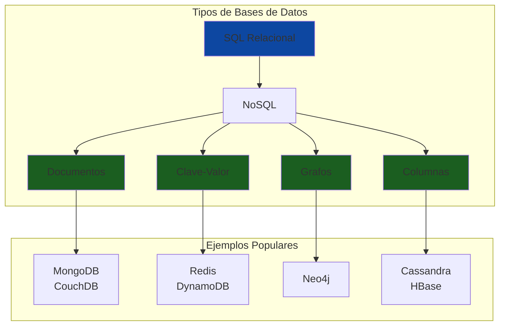
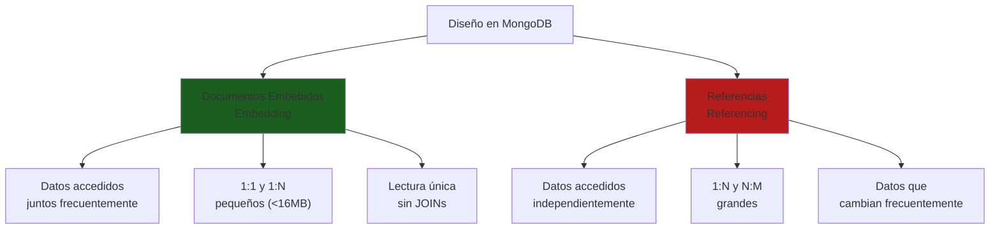

# 11. NoSQL con MongoDB

- [11.1. Fundamentos de NoSQL y MongoDB](#111-fundamentos-de-nosql-y-mongodb)
  - [11.1.1. ¿Qué es NoSQL?](#1111-qué-es-nosql)
  - [11.1.2. ¿Qué es MongoDB?](#1112-qué-es-mongodb)
  - [11.1.3. Comparativa SQL vs NoSQL](#1113-comparativa-sql-vs-nosql)
- [11.2. Diseño de Datos en MongoDB](#112-diseño-de-datos-en-mongodb)
  - [11.2.1. Documentos Embebidos vs Referencias](#1121-documentos-embebidos-vs-referencias)
  - [11.2.2. Cuándo Usar Cada Enfoque](#1122-cuándo-usar-cada-enfoque)
- [11.3. MongoDB Driver para .NET](#113-mongodb-driver-para-net)
  - [11.3.1. Instalación](#1131-instalación)
  - [11.3.2. Configuración](#1132-configuración)
  - [11.3.3. Modelos y Colecciones](#1133-modelos-y-colecciones)
  - [11.3.4. Operaciones CRUD](#1134-operaciones-crud)
- [11.4. Entity Framework Core con MongoDB](#114-entity-framework-core-con-mongodb)
  - [11.4.1. Instalación del Proveedor](#1141-instalación-del-proveedor)
  - [11.4.2. Configuración del DbContext](#1142-configuración-del-dbcontext)
  - [11.4.3. Definición de Entidades](#1143-definición-de-entidades)
  - [11.4.4. Consultas LINQ con MongoDB](#1144-consultas-linq-con-mongodb)
  - [11.4.5. Operaciones CRUD](#1145-operaciones-crud)
- [11.5. Consultas Avanzadas](#115-consultas-avanzadas)
  - [11.5.1. Filtros y Agregación](#1151-filtros-y-agregación)
  - [11.5.2. Índices](#1152-índices)
- [11.6. Repositorio con MongoDB](#116-repositorio-con-mongodb)
- [11.7. Testing con MongoDB](#117-testing-con-mongodb)
- [11.8. Cuándo Usar MongoDB Driver vs EF Core](#118-cuándo-usar-mongodb-driver-vs-ef-core)
- [11.9. Resumen](#119-resumen)

---

## 11.1. Fundamentos de NoSQL y MongoDB

**NoSQL** ("Not Only SQL") describe un conjunto de bases de datos que no utilizan el modelo relacional tradicional. En lugar de tablas con filas y columnas, las bases de datos NoSQL utilizan otros modelos como documentos, grafos, clave-valor o columnas anchas. MongoDB es una base de datos **orientada a documentos** que almacena datos en formato **BSON** (Binary JSON), una representación binaria de JSON que permite un procesamiento más eficiente.

🧠 **Analogía**: Si SQL es como un archivador muy estructurado con carpetas y subcarpetas ordenadas siguiendo un protocolo estricto, MongoDB es como una serie de cajas donde cada caja puede contener cualquier cosa en cualquier formato. No hay una estructura rígida, lo que te permite adaptar los datos a tus necesidades cambiantes sin tener que modificar el esquema de toda la base de datos.



### 11.1.1. ¿Qué es NoSQL?

Las bases de datos NoSQL surgieron para abordar las limitaciones de las bases de datos relacionales en ciertos escenarios modernos: grandes volúmenes de datos que requieren procesamiento distribuido, necesidad de escalabilidad horizontal para manejar millones de usuarios concurrentes, esquemas flexibles que evolucionen con el negocio, y alta velocidad de acceso para operaciones de lectura y escritura masivas.

Las características fundamentales de NoSQL incluyen la ausencia de un esquema fijo y predefinido, la capacidad de escalar horizontalmente añadiendo más servidores en lugar de mejorar el hardware, y la optimización para casos de uso específicos como búsquedas rápidas, almacenamiento en caché o procesamiento de grafos sociales.

### 11.1.2. ¿Qué es MongoDB?

**MongoDB** es una base de datos NoSQL orientada a documentos creada en 2007 que ha become una de las bases de datos más populares del mundo. Almacena datos en documentos similares a JSON, lo que hace que el modelo de datos sea intuitivo para desarrolladores que ya trabajan con este formato en sus aplicaciones.

| Característica | Descripción |
|---------------|-------------|
| **Modelo de datos flexible** | Documentos BSON con estructura variable, cada documento puede tener campos diferentes |
| **Escalabilidad horizontal** | Sharding automático para distribuir datos entre múltiples servidores |
| **Alta disponibilidad** | Replicación con réplicas automáticas y failover integrado |
| **Consultas complejas** | Pipeline de agregación, índices, búsqueda de texto completo |
| **Transacciones** | Soporte para transacciones ACID multi-documento desde la versión 4.0 |
| **Modelo de consulta rico** | Consultas ad-hoc, índices, aggregación, y búsqueda geoespacial |

### 11.1.3. Comparativa SQL vs NoSQL

| Aspecto | SQL Relacional | MongoDB (NoSQL) |
|---------|----------------|-------------------|
| **Modelo de datos** | Tablas con filas y columnas | Documentos BSON/JSON |
| **Esquema** | Fijo, predefinido, requiere migraciones | Flexible, dinámico, sin migraciones |
| **Lenguaje de consulta** | SQL estándar | MongoDB Query Language (similar a JSON) |
| **JOINs** | Nativos y eficientes | No nativos, se simula con múltiples consultas o $lookup |
| **Escalabilidad** | Vertical (mejor hardware) | Horizontal (añadir servidores) |
| **Transacciones** | ACID completo por defecto | Transacciones multi-documento disponibles pero con overhead |
| **Rendimiento en lecturas** | Optimizado con índices y query optimizer maduro | Rápido para documentos completos, más lento para JOINs complejos |
| **Rendimiento en escrituras** | Depende del aislamiento transaccional | Muy rápido con acknowledgment configurable |

💡 **Tip del Examinador**: MongoDB es ideal para catálogos de productos, gestión de inventarios, contenido dinámico con estructuras variables, sesiones de usuario, logs de eventos, y datos de sensores IoT. Para datos transaccionales con relaciones complejas, SQL sigue siendo la mejor opción.

---

## 11.2. Diseño de Datos en MongoDB

### 11.2.1. Documentos Embebidos vs Referencias

En MongoDB existen dos estrategias principales para modelar relaciones entre datos: **documentos embebidos** y **referencias**. La elección correcta depende de los patrones de acceso a datos de tu aplicación.



**1. Documentos Embebidos** (datos relacionados en el mismo documento):

```json
// Colección: pedidos
{
  "_id": "pedido123",
  "numeroPedido": "PED-2024-001",
  "cliente": {
    "id": "cliente456",
    "nombre": "Juan Pérez García",
    "email": "juan@example.com",
    "telefono": "+34 600 123 456"
  },
  "direccionEnvio": {
    "calle": "Gran Vía 42",
    "ciudad": "Madrid",
    "codigoPostal": "28001",
    "pais": "España"
  },
  "lineas": [
    {
      "productoId": "prod001",
      "nombre": "Funko Iron Man",
      "cantidad": 2,
      "precioUnitario": 29.99,
      "subtotal": 59.98
    },
    {
      "productoId": "prod002", 
      "nombre": "Funko Batman",
      "cantidad": 1,
      "precioUnitario": 34.99,
      "subtotal": 34.99
    }
  ],
  "subtotal": 94.97,
  "impuestos": 19.94,
  "total": 114.91,
  "estado": "entregado",
  "fechaPedido": "2024-01-15T10:30:00Z",
  "fechaEntrega": "2024-01-18T16:45:00Z"
}
```

**2. Referencias** (referencias a otros documentos por ID):

```json
// Colección: pedidos
{
  "_id": "pedido456",
  "numeroPedido": "PED-2024-002",
  "clienteId": "cliente789",
  "lineasPedido": [
    { "productoId": "prod003", "cantidad": 1, "precioUnitario": 24.99 },
    { "productoId": "prod004", "cantidad": 3, "precioUnitario": 19.99 }
  ],
  "total": 84.96,
  "estado": "pendiente",
  "fechaPedido": "2024-01-20T14:00:00Z"
}

// Colección: clientes (separada)
{
  "_id": "cliente789",
  "nombre": "María López",
  "email": "maria@example.com",
  "telefono": "+34 610 987 654",
  "direcciones": [
    { "tipo": "envio", "calle": "Paseo de la Castellana 100", "ciudad": "Madrid" },
    { "tipo": "facturacion", "calle": "Gran Vía 42", "ciudad": "Madrid" }
  ],
  "historicoPedidos": ["pedido123", "pedido456"]
}
```

### 11.2.2. Cuándo Usar Cada Enfoque

| Criterio | Documentos Embebidos | Referencias |
|-----------|---------------------|-------------|
| **Patrón de lectura** | Datos siempre se leen juntos | Datos se acceden independientemente |
| **Frecuencia de escritura** | Datos relacionados cambian juntos | Datos cambian independientemente |
| **Tamaño del documento** | Pequeño (<16MB total) | Grande, con potencial de crecimiento |
| **Cardinalidad** | 1:1 y 1:N pequeños (≤100 items) | 1:N grandes o N:M |
| **Consistencia** | Fuertes garantías de consistencia | Consistencia eventual o consultas separadas |

**Ejemplo de decisión:**

```csharp
// ❌ INCORRECTO: Embebir demasiados datos que cambian frecuentemente
// Un pedido con 10,000 líneas de detalle podría superar el límite de 16MB
{
  "_id": "pedido-grande",
  "lineas": [...10000 items...]  // ❌ PROBLEMA
}

// ✅ CORRECTO: Usar referencias para colecciones grandes
{
  "_id": "pedido-grande",
  "lineasPedidoIds": ["lp001", "lp002", ...]  // ✅ OK
}

// Colección separada para líneas de pedido
{
  "_id": "lp001",
  "pedidoId": "pedido-grande",
  "productoId": "prod001",
  "cantidad": 1
}
```

⚠️ **Advertencia importante**: MongoDB tiene un límite estricto de 16MB por documento. Si tus documentos embebidos pueden crecer indefinidamente, usa referencias en su lugar.

🧠 **Analogía práctica**: Piensa en un libro. Los capítulos (embebidos) pertenecen al libro y siempre se leen juntos como parte de la experiencia de lectura completa. Pero si tienes un índice de autores que aparece referenciado en múltiples libros, tiene más sentido mantenerlo como un documento separado que se referencia, no embeberlo en cada libro.

---

## 11.3. MongoDB Driver para .NET

### 11.3.1. Instalación

```bash
# Driver oficial de MongoDB para .NET
dotnet add package MongoDB.Driver

# Este paquete incluye:
# - MongoDB.Driver.Core
# - MongoDB.Bson
# - MongoDB.Driver.Legacy
```

### 11.3.2. Configuración

La configuración de MongoDB en ASP.NET Core sigue el patrón de opciones configurable que ya conoces, permitiendo diferentes configuraciones por entorno.

```csharp
namespace FunkosApi.Core.Configuration;

public class MongoDbSettings
{
    public string ConnectionString { get; set; } = string.Empty;
    public string DatabaseName { get; set; } = string.Empty;
    public MongoDbCollectionSettings Collections { get; set; } = new();
}

public class MongoDbCollectionSettings
{
    public string Funkos { get; set; } = "funkos";
    public string Categorias { get; set; } = "categorias";
    public string Pedidos { get; set; } = "pedidos";
    public string AuditLogs { get; set; } = "audit_logs";
}
```

**appsettings.json:**

```json
{
  "MongoDB": {
    "ConnectionString": "mongodb://localhost:27017",
    "DatabaseName": "FunkosDb",
    "Collections": {
      "Funkos": "funkos",
      "Categorias": "categorias",
      "Pedidos": "pedidos",
      "AuditLogs": "audit_logs"
    }
  }
}
```

**Registro en Program.cs:**

```csharp
using MongoDB.Driver;
using Microsoft.Extensions.Options;

var builder = WebApplication.CreateBuilder(args);

// Configuración de MongoDB
builder.Services.Configure<MongoDbSettings>(
    builder.Configuration.GetSection("MongoDB"));

// Registrar cliente MongoDB como singleton (una conexión compartida)
builder.Services.AddSingleton<IMongoClient>(sp =>
{
    var settings = sp.GetRequiredService<IOptions<MongoDbSettings>>().Value;
    var mongoClientSettings = MongoClientSettings.FromConnectionString(settings.ConnectionString);
    
    // Configuración adicional del cliente
    mongoClientSettings.MaxConnectionIdleTime = TimeSpan.FromMinutes(5);
    mongoClientSettings.MaxConnectionPoolSize = 100;
    mongoClientSettings.MinConnectionPoolSize = 10;
    mongoClientSettings.ServerSelectionTimeout = TimeSpan.FromSeconds(10);
    
    return new MongoClient(mongoClientSettings);
});

// Registrar base de datos (scoped - una por request HTTP)
builder.Services.AddScoped(sp =>
{
    var settings = sp.GetRequiredService<IOptions<MongoDbSettings>>().Value;
    var client = sp.GetRequiredService<IMongoClient>();
    return client.GetDatabase(settings.DatabaseName);
});

// Registrar colecciones específicas
builder.Services.AddScoped(sp =>
{
    var settings = sp.GetRequiredService<IOptions<MongoDbSettings>>().Value;
    var database = sp.GetRequiredService<IMongoDatabase>();
    return database.GetCollection<FunkoDocument>(settings.Collections.Funkos);
});

var app = builder.Build();
app.Run();
```

### 11.3.3. Modelos y Colecciones

Los modelos para MongoDB utilizan anotaciones del espacio de nombres `MongoDB.Bson` para definir cómo se mapean las propiedades a documentos BSON.

```csharp
using MongoDB.Bson;
using MongoDB.Bson.Serialization.Attributes;
using MongoDB.Bson.Serialization.Serializers;

namespace FunkosApi.Core.Models.MongoDB;

/// <summary>
/// Modelo de Funko para MongoDB.
/// No hereda de Entity porque MongoDB usa ObjectId como identificador.
/// </summary>
public class FunkoDocument
{
    /// <summary>
    /// Identificador único del documento en MongoDB.
    /// Se genera automáticamente si no se proporciona.
    /// </summary>
    [BsonId]
    [BsonRepresentation(BsonType.ObjectId)]
    public string? Id { get; set; }

    /// <summary>
    /// Nombre del funko (obligatorio).
    /// </summary>
    [BsonElement("nombre")]
    [BsonRequired]
    [BsonStringSerializer(Representation.String)]
    public string Nombre { get; set; } = string.Empty;

    /// <summary>
    /// Descripción opcional del funko.
    /// </summary>
    [BsonElement("descripcion")]
    [BsonIgnoreIfNull]
    public string? Descripcion { get; set; }

    /// <summary>
    /// Precio del funko con precisión decimal.
    /// </summary>
    [BsonElement("precio")]
    [BsonRequired]
    [BsonRepresentation(BsonType.Decimal128)]
    public decimal Precio { get; set; }

    /// <summary>
    /// Stock disponible del funko.
    /// </summary>
    [BsonElement("stock")]
    [BsonRequired]
    [BsonDefaultValue(0)]
    public int Stock { get; set; }

    /// <summary>
    /// Categoría del funko (referencia por nombre, no por ID).
    /// </summary>
    [BsonElement("categoria")]
    [BsonRequired]
    public string Categoria { get; set; } = string.Empty;

    /// <summary>
    /// URL de la imagen del funko.
    /// </summary>
    [BsonElement("imagenUrl")]
    [BsonIgnoreIfNull]
    public string? ImagenUrl { get; set; }

    /// <summary>
    /// Indica si el funko está activo (para soft delete).
    /// </summary>
    [BsonElement("activo")]
    [BsonDefaultValue(true)]
    public bool Activo { get; set; } = true;

    /// <summary>
    /// Fecha de creación del registro.
    /// </summary>
    [BsonElement("fechaCreacion")]
    [BsonRequired]
    [BsonDateTimeOptions(DateTimeOnly = false, Kind = DateTimeKind.Utc)]
    public DateTime FechaCreacion { get; set; } = DateTime.UtcNow;

    /// <summary>
    /// Fecha de última actualización.
    /// </summary>
    [BsonElement("fechaActualizacion")]
    [BsonIgnoreIfNull]
    [BsonDateTimeOptions(DateTimeOnly = false, Kind = DateTimeKind.Utc)]
    public DateTime? FechaActualizacion { get; set; }

    /// <summary>
    /// Usuario que creó el registro.
    /// </summary>
    [BsonElement("creadoPor")]
    [BsonIgnoreIfNull]
    public string? CreadoPor { get; set; }
}
```

**Anotaciones de BSON importantes:**

| Anotación | Descripción | Ejemplo |
|------------|-------------|---------|
| `[BsonId]` | Marca el campo como `_id` (clave primaria) | `public string? Id { get; set; }` |
| `[BsonElement("nombre")]` | Mapea a campo con nombre específico | `nombre` en BSON |
| `[BsonRequired]` | El campo es obligatorio | Error si es null |
| `[BsonIgnoreIfNull]` | No guardar si es null | Ahorra espacio |
| `[BsonIgnoreIfDefault]` | No guardar si es valor por defecto | Optimización |
| `[BsonRepresentation(tipo)]` | Conversión automática de tipos | `BsonType.ObjectId` |

### 11.3.4. Operaciones CRUD con MongoDB Driver

```csharp
using MongoDB.Driver;
using CSharpFunctionalExtensions;

namespace FunkosApi.Core.Repositories.MongoDB;

/// <summary>
/// Repositorio de Funko usando MongoDB Driver nativo.
/// Proporciona control de bajo nivel sobre las operaciones.
/// </summary>
public class FunkoMongoRepository(
    IMongoCollection<FunkoDocument> collection,
    ILogger<FunkoMongoRepository> logger)
{
    /// <summary>
    /// Inserta un nuevo funko en la colección.
    /// </summary>
    public async Task<Result<FunkoDocument, DomainError>> InsertAsync(FunkoDocument funko)
    {
        try
        {
            // Validaciones de dominio antes de insertar
            if (string.IsNullOrEmpty(funko.Nombre))
                return Result.Failure<FunkoDocument, DomainError>(
                    DomainError.Validation("El nombre es obligatorio"));

            if (funko.Precio < 0)
                return Result.Failure<FunkoDocument, DomainError>(
                    DomainError.Validation("El precio no puede ser negativo"));

            // Generar ID si no existe
            if (string.IsNullOrEmpty(funko.Id))
            {
                funko.Id = ObjectId.GenerateNewId().ToString();
            }

            funko.FechaCreacion = DateTime.UtcNow;
            funko.Activo = true;

            await collection.InsertOneAsync(funko);
            logger.LogInformation("Funko creado: {Id} - {Nombre}", funko.Id, funko.Nombre);

            return Result.Success<FunkoDocument, DomainError>(funko);
        }
        catch (MongoException ex)
        {
            logger.LogError(ex, "Error al insertar funko: {Nombre}", funko.Nombre);
            return Result.Failure<FunkoDocument, DomainError>(
                DomainError.Internal("Error al guardar el funko en la base de datos"));
        }
    }

    /// <summary>
    /// Busca un funko por su ID.
    /// </summary>
    public async Task<Result<FunkoDocument, DomainError>> FindByIdAsync(string id)
    {
        if (!ObjectId.TryParse(id, out _))
            return Result.Failure<FunkoDocument, DomainError>(
                DomainError.Validation("ID de funko inválido"));

        var funko = await collection
            .Find(f => f.Id == id && f.Activo)
            .FirstOrDefaultAsync();

        if (funko == null)
            return Result.Failure<FunkoDocument, DomainError>(
                DomainError.NotFound($"Funko {id} no encontrado"));

        return Result.Success<FunkoDocument, DomainError>(funko);
    }

    /// <summary>
    /// Obtiene todos los funkos activos.
    /// </summary>
    public async Task<Result<List<FunkoDocument>, DomainError>> GetAllAsync()
    {
        try
        {
            var funkos = await _collection
                .Find(f => f.Activo)
                .SortBy(f => f.Nombre)
                .ToListAsync();

            return Result.Success<List<FunkoDocument>, DomainError>(funkos);
        }
        catch (MongoException ex)
        {
            _logger.LogError(ex, "Error al obtener funkos");
            return Result.Failure<List<FunkoDocument>, DomainError>(
                DomainError.Internal("Error al obtener los funkos"));
        }
    }

    /// <summary>
    /// Obtiene funkos por categoría.
    /// </summary>
    public async Task<Result<List<FunkoDocument>, DomainError>> GetByCategoriaAsync(string categoria)
    {
        var filter = Builders<FunkoDocument>.Filter.And(
            Builders<FunkoDocument>.Filter.Eq(f => f.Categoria, categoria),
            Builders<FunkoDocument>.Filter.Eq(f => f.Activo, true)
        );

        var funkos = await _collection
            .Find(filter)
            .SortBy(f => f.Precio)
            .ToListAsync();

        return Result.Success<List<FunkoDocument>, DomainError>(funkos);
    }

    /// <summary>
    /// Busca funkos por nombre (búsqueda parcial, insensitive).
    /// </summary>
    public async Task<Result<List<FunkoDocument>, DomainError>> SearchByNombreAsync(string termino)
    {
        var filter = Builders<FunkoDocument>.Filter.And(
            Builders<FunkoDocument>.Filter.Regex(
                f => f.Nombre, 
                new BsonRegularExpression($"/{termino}/i")),
            Builders<FunkoDocument>.Filter.Eq(f => f.Activo, true)
        );

        var funkos = await _collection
            .Find(filter)
            .Limit(20)
            .ToListAsync();

        return Result.Success<List<FunkoDocument>, DomainError>(funkos);
    }

    /// <summary>
    /// Actualiza un funko existente.
    /// </summary>
    public async Task<Result<FunkoDocument, DomainError>> UpdateAsync(string id, FunkoDocument funkoActualizado)
    {
        if (id != funkoActualizado.Id)
            return Result.Failure<FunkoDocument, DomainError>(
                DomainError.Validation("El ID del funko no coincide"));

        funkoActualizado.FechaActualizacion = DateTime.UtcNow;

        var result = await _collection
            .ReplaceOneAsync(f => f.Id == id, funkoActualizado);

        if (result.MatchedCount == 0)
            return Result.Failure<FunkoDocument, DomainError>(
                DomainError.NotFound($"Funko {id} no encontrado"));

        _logger.LogInformation("Funko actualizado: {Id}", id);

        return Result.Success<FunkoDocument, DomainError>(funkoActualizado);
    }

    /// <summary>
    /// Eliminación lógica (soft delete).
    /// </summary>
    public async Task<UnitResult<DomainError>> SoftDeleteAsync(string id)
    {
        var update = Builders<FunkoDocument>.Update
            .Set(f => f.Activo, false)
            .Set(f => f.FechaActualizacion, DateTime.UtcNow);

        var result = await _collection.UpdateOneAsync(f => f.Id == id, update);

        if (result.MatchedCount == 0)
            return UnitResult.Failure<DomainError>(
                DomainError.NotFound($"Funko {id} no encontrado"));

        _logger.LogInformation("Funko eliminado lógicamente: {Id}", id);

        return UnitResult.Success<DomainError>();
    }

    /// <summary>
    /// Actualiza el stock de un funko.
    /// </summary>
    public async Task<Result<FunkoDocument, DomainError>> UpdateStockAsync(string id, int nuevoStock)
    {
        if (nuevoStock < 0)
            return Result.Failure<FunkoDocument, DomainError>(
                DomainError.Validation("El stock no puede ser negativo"));

        var update = Builders<FunkoDocument>.Update
            .Set(f => f.Stock, nuevoStock)
            .Set(f => f.FechaActualizacion, DateTime.UtcNow);

        var funkoResult = await FindByIdAsync(id);
        if (funkoResult.IsFailure)
            return funkoResult;

        var result = await _collection.UpdateOneAsync(f => f.Id == id, update);

        if (result.ModifiedCount == 0)
            return Result.Failure<FunkoDocument, DomainError>(
                DomainError.Internal("Error al actualizar el stock"));

        return await FindByIdAsync(id);
    }

    /// <summary>
    /// Obtiene estadísticas agregadas por categoría.
    /// </summary>
    public async Task<Dictionary<string, FunkoEstadisticas>> GetEstadisticasPorCategoriaAsync()
    {
        var pipeline = new BsonDocument[]
        {
            new("$match", new BsonDocument("activo", true)),
            new("$group", new BsonDocument
            {
                ["_id"] = "$categoria",
                ["totalFunkos"] = new BsonDocument("$sum", 1),
                ["precioPromedio"] = new BsonDocument("$avg", "$precio"),
                ["stockTotal"] = new BsonDocument("$sum", "$stock"),
                ["precioMin"] = new BsonDocument("$min", "$precio"),
                ["precioMax"] = new BsonDocument("$max", "$precio")
            }),
            new("$sort", new BsonDocument("totalFunkos", -1))
        };

        var results = await _collection.AggregateAsync<BsonDocument>(pipeline);

        return results.ToDictionary(
            r => r["_id"].AsString,
            r => new FunkoEstadisticas
            {
                TotalFunkos = r["totalFunkos"].AsInt32,
                PrecioPromedio = r["precioPromedio"].AsDecimal,
                StockTotal = r["stockTotal"].AsInt32,
                PrecioMinimo = r["precioMin"].AsDecimal,
                PrecioMaximo = r["precioMax"].AsDecimal
            });
    }
}

public class FunkoEstadisticas
{
    public int TotalFunkos { get; set; }
    public decimal PrecioPromedio { get; set; }
    public int StockTotal { get; set; }
    public decimal PrecioMinimo { get; set; }
    public decimal PrecioMaximo { get; set; }
}
```

---

## 11.4. Entity Framework Core con MongoDB

### 11.4.1. Instalación del Proveedor

EF Core para MongoDB usa el proveedor oficial de MongoDB que permite usar el mismo patrón familiar que con SQL Server o PostgreSQL.

```bash
# Proveedor oficial de EF Core para MongoDB
dotnet add package MongoDB.EntityFrameworkCore

# Versión actual compatible con EF Core 8.x
# Verificar compatibilidad en: https://www.nuget.org/packages/MongoDB.EntityFrameworkCore
```

### 11.4.2. Configuración del DbContext

La configuración de EF Core con MongoDB es similar a otros proveedores, con algunas diferencias en las opciones de configuración.

```csharp
using Microsoft.EntityFrameworkCore;
using MongoDB.EntityFrameworkCore.Extensions;

namespace FunkosApi.Core.Data.MongoDB;

/// <summary>
/// DbContext para MongoDB.
/// Sigue el mismo patrón que otros DbContext de EF Core.
/// </summary>
public class FunkosMongoDbContext : DbContext
{
    private readonly IConfiguration _configuration;

    public FunkosMongoDbContext(
        DbContextOptions<FunkosMongoDbContext> options,
        IConfiguration configuration)
        : base(options)
    {
        _configuration = configuration;
    }

    // DbSet para la colección de funkos
    public DbSet<FunkoDocument> Funkos => Set<FunkoDocument>();
    
    // DbSet para categorías
    public DbSet<CategoriaDocument> Categorias => Set<CategoriaDocument>();

    protected override void OnModelCreating(ModelBuilder modelBuilder)
    {
        base.OnModelCreating(modelBuilder);

        // Configurar la colección para Funko
        modelBuilder.Entity<FunkoDocument>(entity =>
        {
            // Nombre de la colección en MongoDB
            entity.ToCollection("funkos");

            // Clave primaria
            entity.HasKey(e => e.Id);

            // Índices para mejorar rendimiento de consultas
            entity.HasIndex(e => e.Nombre);
            entity.HasIndex(e => e.Categoria);
            entity.HasIndex(e => e.Activo);
            entity.HasIndex(e => new { e.Categoria, e.Activo });
            entity.HasIndex(e => e.Precio);
        });

        // Configurar la colección para Categoría
        modelBuilder.Entity<CategoriaDocument>(entity =>
        {
            entity.ToCollection("categorias");
            entity.HasKey(e => e.Id);
            entity.HasIndex(e => e.Nombre).IsUnique();
        });
    }
}
```

**Registro en Program.cs:**

```csharp
using Microsoft.EntityFrameworkCore;
using FunkosApi.Core.Data.MongoDB;

var builder = WebApplication.CreateBuilder(args);

// Configuración de MongoDB
var mongoConnection = builder.Configuration.GetConnectionString("MongoDB")
    ?? "mongodb://localhost:27017";
var mongoDatabaseName = builder.Configuration["MongoDB:DatabaseName"] ?? "FunkosDb";

// Registrar DbContext de MongoDB
builder.Services.AddDbContext<FunkosMongoDbContext>(options =>
{
    options.UseMongoDB(mongoConnection, mongoDatabaseName);
});
```

### 11.4.3. Definición de Entidades

Las entidades para EF Core con MongoDB usan atributos similares a las de SQL, pero con el namespace de MongoDB para configuraciones específicas.

```csharp
using MongoDB.EntityFrameworkCore.Extensions;
using System.ComponentModel.DataAnnotations;

namespace FunkosApi.Core.Models.MongoDB.EFCore;

/// <summary>
/// Entidad de Funko para EF Core con MongoDB.
/// Tiene las mismas anotaciones que las entidades para SQL,
/// más las específicas de MongoDB.
/// </summary>
[Collection("funkos")]  // Nombre de la colección en MongoDB
public class FunkoDocument
{
    /// <summary>
    /// Identificador único (ObjectId de MongoDB).
    /// </summary>
    [Key]
    [BsonId]
    [BsonRepresentation(MongoDB.Bson.BsonType.ObjectId)]
    public string Id { get; set; } = string.Empty;

    /// <summary>
    /// Nombre del funko.
    /// </summary>
    [Required]
    [MaxLength(200)]
    public string Nombre { get; set; } = string.Empty;

    /// <summary>
    /// Descripción opcional.
    /// </summary>
    [MaxLength(2000)]
    public string? Descripcion { get; set; }

    /// <summary>
    /// Precio del funko.
    /// </summary>
    [Range(0, 1000000)]
    public decimal Precio { get; set; }

    /// <summary>
    /// Stock disponible.
    /// </summary>
    [Range(0, int.MaxValue)]
    public int Stock { get; set; }

    /// <summary>
    /// Categoría del funko.
    /// </summary>
    [Required]
    [MaxLength(100)]
    public string Categoria { get; set; } = string.Empty;

    /// <summary>
    /// URL de la imagen.
    /// </summary>
    [MaxLength(500)]
    public string? ImagenUrl { get; set; }

    /// <summary>
    /// Indica si está activo (soft delete).
    /// </summary>
    public bool Activo { get; set; } = true;

    /// <summary>
    /// Fecha de creación.
    /// </summary>
    public DateTime FechaCreacion { get; set; } = DateTime.UtcNow;

    /// <summary>
    /// Fecha de última actualización.
    /// </summary>
    public DateTime? FechaActualizacion { get; set; }
}

/// <summary>
/// Entidad de Categoría para EF Core con MongoDB.
/// </summary>
[Collection("categorias")]
public class CategoriaDocument
{
    [Key]
    [BsonId]
    [BsonRepresentation(MongoDB.Bson.BsonType.ObjectId)]
    public string Id { get; set; } = string.Empty;

    [Required]
    [MaxLength(100)]
    public string Nombre { get; set; } = string.Empty;

    [MaxLength(500)]
    public string? Descripcion { get; set; }

    public bool Activa { get; set; } = true;

    public DateTime FechaCreacion { get; set; } = DateTime.UtcNow;
}
```

### 11.4.4. Consultas LINQ con MongoDB

Una de las ventajas de usar EF Core con MongoDB es la capacidad de usar LINQ para consultas, con una sintaxis muy similar a la de SQL.

```csharp
using Microsoft.EntityFrameworkCore;
using FunkosApi.Core.Data.MongoDB;
using FunkosApi.Core.Models.MongoDB.EFCore;

namespace FunkosApi.Core.Repositories.MongoDB.EFCore;

public interface IFunkoEfCoreRepository
{
    Task<FunkoDocument?> FindByIdAsync(string id);
    Task<List<FunkoDocument>> GetAllAsync();
    Task<List<FunkoDocument>> GetByCategoriaAsync(string categoria);
    Task<List<FunkoDocument>> SearchAsync(string termino);
    Task<FunkoDocument> CreateAsync(FunkoDocument funko);
    Task UpdateAsync(FunkoDocument funko);
    Task DeleteAsync(FunkoDocument funko);
}

public class FunkoEfCoreRepository(FunkosMongoDbContext context) : IFunkoEfCoreRepository
{
    public async Task<FunkoDocument?> FindByIdAsync(string id)
    {
        return await context.Funkos
            .FirstOrDefaultAsync(f => f.Id == id && f.Activo);
    }

    public async Task<List<FunkoDocument>> GetAllAsync()
    {
        return await context.Funkos
            .Where(f => f.Activo)
            .OrderBy(f => f.Nombre)
            .ToListAsync();
    }

    public async Task<List<FunkoDocument>> GetByCategoriaAsync(string categoria)
    {
        return await context.Funkos
            .Where(f => f.Categoria == categoria && f.Activo)
            .OrderByDescending(f => f.Stock)
            .ToListAsync();
    }

    public async Task<List<FunkoDocument>> SearchAsync(string termino)
    {
        var terminoLower = termino.ToLowerInvariant();
        
        return await context.Funkos
            .Where(f => f.Activo && 
                   (f.Nombre.ToLower().Contains(terminoLower) ||
                    (f.Descripcion != null && f.Descripcion.ToLower().Contains(terminoLower))))
            .ToListAsync();
    }

    public async Task<FunkoDocument> CreateAsync(FunkoDocument funko)
    {
        funko.FechaCreacion = DateTime.UtcNow;
        funko.Activo = true;
        
        context.Funkos.Add(funko);
        await context.SaveChangesAsync();
        
        return funko;
    }

    public async Task UpdateAsync(FunkoDocument funko)
    {
        funko.FechaActualizacion = DateTime.UtcNow;
        
        _context.Funkos.Update(funko);
        await _context.SaveChangesAsync();
    }

    public async Task DeleteAsync(FunkoDocument funko)
    {
        // Soft delete
        funko.Activo = false;
        funko.FechaActualizacion = DateTime.UtcNow;
        
        _context.Funkos.Update(funko);
        await _context.SaveChangesAsync();
    }

    /// <summary>
    /// Consulta paginada con filtros.
    /// </summary>
    public async Task<(List<FunkoDocument> Items, int Total)> GetPagedAsync(
        int page, 
        int pageSize, 
        string? categoria = null,
        decimal? precioMin = null,
        decimal? precioMax = null,
        string? ordenPor = "nombre",
        bool ascendente = true)
    {
        var query = _context.Funkos.Where(f => f.Activo);

        // Aplicar filtros
        if (!string.IsNullOrEmpty(categoria))
        {
            query = query.Where(f => f.Categoria == categoria);
        }

        if (precioMin.HasValue)
        {
            query = query.Where(f => f.Precio >= precioMin.Value);
        }

        if (precioMax.HasValue)
        {
            query = query.Where(f => f.Precio <= precioMax.Value);
        }

        // Contar total (antes de paginación)
        var total = await query.CountAsync();

        // Aplicar ordenación
        query = ordenPor switch
        {
            "precio" => ascendente 
                ? query.OrderBy(f => f.Precio) 
                : query.OrderByDescending(f => f.Precio),
            "stock" => ascendente 
                ? query.OrderBy(f => f.Stock) 
                : query.OrderByDescending(f => f.Stock),
            "fecha" => ascendente 
                ? query.OrderBy(f => f.FechaCreacion) 
                : query.OrderByDescending(f => f.FechaCreacion),
            _ => query.OrderBy(f => f.Nombre)  // Por defecto, por nombre
        };

        // Aplicar paginación
        var items = await query
            .Skip((page - 1) * pageSize)
            .Take(pageSize)
            .ToListAsync();

        return (items, total);
    }
}
```

### 11.4.5. Operaciones CRUD

```csharp
public class FunkoEfCoreRepository : IFunkoEfCoreRepository
{
    private readonly FunkosMongoDbContext _context;
    private readonly ILogger<FunkoEfCoreRepository> _logger;

    public FunkoEfCoreRepository(
        FunkosMongoDbContext context,
        ILogger<FunkoEfCoreRepository> logger)
    {
        _context = context;
        _logger = logger;
    }

    public async Task<Result<FunkoDocument, DomainError>> CreateAsync(FunkoDocument funko)
    {
        try
        {
            // Validaciones de dominio
            if (string.IsNullOrWhiteSpace(funko.Nombre))
                return Result.Failure<FunkoDocument, DomainError>(
                    DomainError.Validation("El nombre es obligatorio"));

            if (funko.Precio < 0)
                return Result.Failure<FunkoDocument, DomainError>(
                    DomainError.Validation("El precio no puede ser negativo"));

            // Verificar nombre único
            var existe = await _context.Funkos
                .AnyAsync(f => f.Nombre == funko.Nombre && f.Activo);

            if (existe)
                return Result.Failure<FunkoDocument, DomainError>(
                    DomainError.Conflict($"Ya existe un funko con el nombre '{funko.Nombre}'"));

            funko.FechaCreacion = DateTime.UtcNow;
            funko.Activo = true;

            _context.Funkos.Add(funko);
            await _context.SaveChangesAsync();

            _logger.LogInformation("Funko creado: {Id} - {Nombre}", funko.Id, funko.Nombre);

            return Result.Success<FunkoDocument, DomainError>(funko);
        }
        catch (DbUpdateException ex)
        {
            _logger.LogError(ex, "Error al crear funko");
            return Result.Failure<FunkoDocument, DomainError>(
                DomainError.Internal("Error al guardar el funko"));
        }
    }

    public async Task<Result<FunkoDocument, DomainError>> UpdateAsync(int id, FunkoUpdateDto dto)
    {
        var funko = await _context.Funkos.FindAsync(id);
        
        if (funko == null || !funko.Activo)
            return Result.Failure<FunkoDocument, DomainError>(
                DomainError.NotFound($"Funko {id} no encontrado"));

        // Verificar nombre único si se está cambiando
        if (dto.Nombre != null && dto.Nombre != funko.Nombre)
        {
            var existe = await _context.Funkos
                .AnyAsync(f => f.Nombre == dto.Nombre && f.Activo && f.Id != id);

            if (existe)
                return Result.Failure<FunkoDocument, DomainError>(
                    DomainError.Conflict($"Ya existe un funko con el nombre '{dto.Nombre}'"));
        }

        // Actualizar campos
        if (dto.Nombre != null) funko.Nombre = dto.Nombre;
        if (dto.Descripcion != null) funko.Descripcion = dto.Descripcion;
        if (dto.Precio.HasValue) funko.Precio = dto.Precio.Value;
        if (dto.Stock.HasValue) funko.Stock = dto.Stock.Value;
        funko.FechaActualizacion = DateTime.UtcNow;

        try
        {
            _context.Funkos.Update(funko);
            await _context.SaveChangesAsync();

            _logger.LogInformation("Funko actualizado: {Id}", funko.Id);

            return Result.Success<FunkoDocument, DomainError>(funko);
        }
        catch (DbUpdateConcurrencyException ex)
        {
            _logger.LogError(ex, "Concurrencia al actualizar funko: {Id}", id);
            return Result.Failure<FunkoDocument, DomainError>(
                DomainError.Conflict("El funko fue modificado por otro proceso"));
        }
    }
}
```

---

## 11.5. Consultas Avanzadas

### 11.5.1. Filtros y Agregación

```csharp
using Microsoft.EntityFrameworkCore;
using MongoDB.EntityFrameworkCore;

namespace FunkosApi.Core.Repositories.MongoDB.EFCore;

public class FunkoAggregationRepository
{
    private readonly FunkosMongoDbContext _context;

    public FunkoAggregationRepository(FunkosMongoDbContext context)
    {
        _context = context;
    }

    /// <summary>
    /// Agrupa funkos por categoría con estadísticas.
    /// </summary>
    public async Task<List<CategoriaEstadistica>> GetEstadisticasPorCategoriaAsync()
    {
        // Usando LINQ GroupBy (más limitado en MongoDB EF Core)
        return await _context.Funkos
            .Where(f => f.Activo)
            .GroupBy(f => f.Categoria)
            .Select(g => new CategoriaEstadistica
            {
                Categoria = g.Key,
                TotalFunkos = g.Count(),
                PrecioPromedio = g.Average(f => f.Precio),
                StockTotal = g.Sum(f => f.Stock),
                PrecioMinimo = g.Min(f => f.Precio),
                PrecioMaximo = g.Max(f => f.Precio)
            })
            .OrderByDescending(x => x.TotalFunkos)
            .ToListAsync();
    }

    /// <summary>
    /// Búsqueda con filtros múltiples usando IQueryable.
    /// </summary>
    public async Task<List<FunkoDocument>> BuscarConFiltrosAsync(
        string? categoria = null,
        decimal? precioMin = null,
        decimal? precioMax = null,
        bool? conStock = null,
        string? ordenarPor = null,
        bool ascendente = true,
        int pagina = 1,
        int tamanoPagina = 20)
    {
        var query = _context.Funkos.Where(f => f.Activo);

        // Filtros
        if (!string.IsNullOrEmpty(categoria))
            query = query.Where(f => f.Categoria == categoria);

        if (precioMin.HasValue)
            query = query.Where(f => f.Precio >= precioMin.Value);

        if (precioMax.HasValue)
            query = query.Where(f => f.Precio <= precioMax.Value);

        if (conStock.HasValue && conStock.Value)
            query = query.Where(f => f.Stock > 0);

        // Ordenación
        query = ordenarPor switch
        {
            "precio" => ascendente 
                ? query.OrderBy(f => f.Precio) 
                : query.OrderByDescending(f => f.Precio),
            "stock" => ascendente 
                ? query.OrderBy(f => f.Stock) 
                : query.OrderByDescending(f => f.Stock),
            "fecha" => ascendente 
                ? query.OrderBy(f => f.FechaCreacion) 
                : query.OrderByDescending(f => f.FechaCreacion),
            _ => query.OrderBy(f => f.Nombre)
        };

        // Paginación
        return await query
            .Skip((pagina - 1) * tamanoPagina)
            .Take(tamanoPagina)
            .ToListAsync();
    }
}

public class CategoriaEstadistica
{
    public string Categoria { get; set; } = string.Empty;
    public int TotalFunkos { get; set; }
    public decimal PrecioPromedio { get; set; }
    public int StockTotal { get; set; }
    public decimal PrecioMinimo { get; set; }
    public decimal PrecioMaximo { get; set; }
}
```

### 11.5.2. Índices

Los índices en MongoDB (tanto con Driver como con EF Core) son fundamentales para el rendimiento de las consultas.

```csharp
protected override void OnModelCreating(ModelBuilder modelBuilder)
{
    base.OnModelCreating(modelBuilder);

    modelBuilder.Entity<FunkoDocument>>(entity =>
    {
        entity.ToCollection("funkos");

        // Índice único en nombre
        entity.HasIndex(e => e.Nombre)
            .IsUnique();

        // Índice compuesto para búsquedas frecuentes
        entity.HasIndex(e => new { e.Categoria, e.Activo });

        // Índice en precio para ordenación
        entity.HasIndex(e => e.Precio);

        // Índice en fecha para filtrado por tiempo
        entity.HasIndex(e => e.FechaCreacion);

        // Índice texto para búsqueda en nombre y descripción
        entity.HasIndex(e => e.Nombre)
            .Has collation("en")
            .HasTextIndexDefaultLanguage("spanish");
    });
}
```

---

## 11.6. Repositorio con MongoDB

```csharp
using Microsoft.EntityFrameworkCore;
using CSharpFunctionalExtensions;

namespace FunkosApi.Core.Repositories.MongoDB.EFCore;

/// <summary>
/// Interfaz del repositorio de Funko.
/// Define el contrato independiente de la implementación.
/// </summary>
public interface IFunkoRepository
{
    Task<Result<FunkoDocument, DomainError>> FindByIdAsync(string id);
    Task<Result<FunkoDocument, DomainError>> FindByNombreAsync(string nombre);
    Task<List<FunkoDocument>> GetAllAsync();
    Task<List<FunkoDocument>> GetByCategoriaAsync(string categoria);
    Task<List<FunkoDocument>> SearchAsync(string termino);
    Task<(List<FunkoDocument> Items, int Total)> GetPagedAsync(int page, int pageSize);
    Task<Result<FunkoDocument, DomainError>> CreateAsync(FunkoDocument funko);
    Task<Result<FunkoDocument, DomainError>> UpdateAsync(string id, FunkoDocument funko);
    Task<UnitResult<DomainError>> DeleteAsync(string id);
}

/// <summary>
/// Implementación del repositorio usando EF Core.
/// </summary>
public class FunkoRepository(
    FunkosMongoDbContext context,
    ILogger<FunkoRepository> logger) : IFunkoRepository
{
    public async Task<Result<FunkoDocument, DomainError>> FindByIdAsync(string id)
    {
        var funko = await context.Funkos
            .FirstOrDefaultAsync(f => f.Id == id && f.Activo);

        if (funko == null)
            return Result.Failure<FunkoDocument, DomainError>(
                DomainError.NotFound($"Funko {id} no encontrado"));

        return Result.Success<FunkoDocument, DomainError>(funko);
    }

    // Implementar los demás métodos...
}
```

---

## 11.7. Testing con MongoDB

```csharp
using Microsoft.EntityFrameworkCore;
using NUnit.Framework;
using FluentAssertions;
using Moq;
using Testcontainers.MongoDb;
using FunkosApi.Core.Data.MongoDB;
using FunkosApi.Core.Models.MongoDB.EFCore;

namespace FunkosApi.Tests.MongoDB;

[TestFixture]
public class FunkoRepositoryTests : IAsyncLifetime
{
    private MongoDbContainer _container = null!;
    private FunkosMongoDbContext _context = null!;
    private IFunkoRepository _repository = null!;
    private readonly Mock<ILogger<FunkoRepository>> _loggerMock = new();

    public async Task InitializeAsync()
    {
        // Iniciar contenedor MongoDB con TestContainers
        _container = new MongoDbBuilder()
            .WithImage("mongo:latest")
            .Build();
        
        await _container.StartAsync();
        
        // Configurar DbContext con conexión al contenedor
        var options = new DbContextOptionsBuilder<FunkosMongoDbContext>()
            .UseMongoDB(_container.GetConnectionString(), "TestDb")
            .Options;
        
        _context = new FunkosMongoDbContext(
            Options.Create(new MongoDbSettings()), 
            Mock.Of<IConfiguration>());
        _context.Database.EnsureCreated();
        
        _repository = new FunkoRepository(_context, _loggerMock.Object);
    }

    public async Task DisposeAsync()
    {
        await _container.StopAsync();
    }

    [Test]
    public async Task Create_ValidFunko_ReturnsSuccess()
    {
        // Arrange
        var funko = new FunkoDocument
        {
            Nombre = "Iron Man Test",
            Precio = 29.99m,
            Stock = 10,
            Categoria = "Marvel"
        };

        // Act
        var result = await _repository.CreateAsync(funko);

        // Assert
        result.IsSuccess.Should().BeTrue();
        result.Value.Should().NotBeNull();
        result.Value.Id.Should().NotBeNullOrEmpty();
        result.Value.Nombre.Should().Be("Iron Man Test");
    }

    [Test]
    public async Task Create_DuplicateNombre_ReturnsConflict()
    {
        // Arrange
        var funko = new FunkoDocument
        {
            Nombre = "Duplicate Test",
            Precio = 29.99m,
            Stock = 10,
            Categoria = "Marvel"
        };
        
        await _repository.CreateAsync(funko);

        // Act
        var duplicate = new FunkoDocument
        {
            Nombre = "Duplicate Test",
            Precio = 34.99m,
            Stock = 5,
            Categoria = "DC"
        };
        var result = await _repository.CreateAsync(duplicate);

        // Assert
        result.IsFailure.Should().BeTrue();
        result.Error.Should().BeOfType<DomainError.Conflict>();
    }

    [Test]
    public async Task GetByCategoria_ReturnsOnlyFunkosDeCategoria()
    {
        // Arrange
        await _repository.CreateAsync(new FunkoDocument 
        { 
            Nombre = "Iron Man", 
            Precio = 29.99m, 
            Stock = 10, 
            Categoria = "Marvel" 
        });
        
        await _repository.CreateAsync(new FunkoDocument 
        { 
            Nombre = "Batman", 
            Precio = 34.99m, 
            Stock = 5, 
            Categoria = "DC" 
        });

        // Act
        var marvelFunkos = await _repository.GetByCategoriaAsync("Marvel");

        // Assert
        marvelFunkos.Should().HaveCount(1);
        marvelFunkos[0].Categoria.Should().Be("Marvel");
    }

    [Test]
    public async Task FindById_ExistingFunko_ReturnsFunko()
    {
        // Arrange
        var funko = new FunkoDocument
        {
            Nombre = "Spider-Man",
            Precio = 39.99m,
            Stock = 15,
            Categoria = "Marvel"
        };
        var created = await _repository.CreateAsync(funko);
        created.IsSuccess.Should().BeTrue();

        // Act
        var result = await _repository.FindByIdAsync(created.Value.Id);

        // Assert
        result.IsSuccess.Should().BeTrue();
        result.Value.Should().NotBeNull();
        result.Value.Nombre.Should().Be("Spider-Man");
    }

    [Test]
    public async Task FindById_NonExistingFunko_ReturnsNotFound()
    {
        // Act
        var result = await _repository.FindByIdAsync("nonexistentid123");

        // Assert
        result.IsFailure.Should().BeTrue();
        result.Error.Should().BeOfType<DomainError.NotFound>();
    }

    [Test]
    public async Task UpdateStock_ValidStock_ReturnsSuccess()
    {
        // Arrange
        var funko = new FunkoDocument
        {
            Nombre = "Hulk",
            Precio = 44.99m,
            Stock = 10,
            Categoria = "Marvel"
        };
        var created = await _repository.CreateAsync(funko);
        created.IsSuccess.Should().BeTrue();

        // Act
        var result = await _repository.UpdateStockAsync(created.Value.Id, 25);

        // Assert
        result.IsSuccess.Should().BeTrue();
        result.Value.Should().NotBeNull();
        result.Value.Stock.Should().Be(25);
    }

    [Test]
    public async Task SoftDelete_ExistingFunko_ReturnsSuccess()
    {
        // Arrange
        var funko = new FunkoDocument
        {
            Nombre = "Thor",
            Precio = 49.99m,
            Stock = 8,
            Categoria = "Marvel"
        };
        var created = await _repository.CreateAsync(funko);
        created.IsSuccess.Should().BeTrue();

        // Act
        var result = await _repository.DeleteAsync(created.Value.Id);

        // Assert
        result.IsSuccess.Should().BeTrue();
        
        // Verificar que ya no se encuentra (soft delete)
        var findResult = await _repository.FindByIdAsync(created.Value.Id);
        findResult.IsFailure.Should().BeTrue();
    }
}
```

---

## 11.8. Cuándo Usar MongoDB Driver vs EF Core

| Aspecto | MongoDB Driver | EF Core para MongoDB |
|---------|---------------|-------------------|
| **Control de bajo nivel** | ✅ Completo | ❌ Limitado |
| **Sintaxis LINQ** | ❌ No nativo | ✅ Completo |
| **Código familiar (SQL)** | ❌ Diferente | ✅ Similar a SQL |
| **Cambio tracking** | ❌ Manual | ✅ Automático |
| **Rendimiento** | ✅ Óptimo | ⚠️ Overhead menor |
| **Curva de aprendizaje** | Media | Baja |
| **Consultas complejas** | ✅ Builders API | ✅ LINQ |

**Recomendación:**
- **Usa EF Core** si:vienes de SQL, quieres usar LINQ, prefieres código consistente con otras bases de datos.
- **Usa MongoDB Driver** si:necesitas control total, rendimiento máximo, o operaciones específicas de MongoDB.

---

## 11.9. Resumen

```mermaid
flowchart TB
    subgraph "Conceptos Fundamentales"
        A1["NoSQL vs SQL"]
        A2["Documentos BSON"]
        A3["Embebidos vs Referencias"]
    end
    
    subgraph "Implementaciones"
        B1["MongoDB Driver"]
        B2["EF Core MongoDB"]
        B3["TestContainers"]
    end
    
    subgraph "Operaciones"
        C1["CRUD básico"]
        C2["Consultas LINQ"]
        C3["Agregación"]
        C4["Índices"]
    end
    
    A1 --> A2 --> A3
    B1 --> B2 --> B3
    C1 --> C2 --> C3 --> C4
    
    style A1 fill:#0D47A1
    style A2 fill:#0D47A1
    style A3 fill:#0D47A1
    style B1 fill:#1565C0
    style B2 fill:#1565C0
    style B3 fill:#1565C0
    style C1 fill:#1B5E20
    style C2 fill:#1B5E20
    style C3 fill:#1B5E20
    style C4 fill:#1B5E20
```



| Concepto | Descripción |
|----------|-------------|
| **NoSQL** | Bases de datos no relacionales con esquema flexible |
| **MongoDB** | Base de datos orientada a documentos BSON |
| **Embebidos** | Datos relacionados dentro del mismo documento (1:1, 1:N pequeños) |
| **Referencias** | IDs que referencian otros documentos (N:M, 1:N grandes) |
| **MongoDB Driver** | Control de bajo nivel, máxima flexibilidad |
| **EF Core MongoDB** | Sintaxis LINQ familiar, código consistente |

🧠 **Analogía final**: MongoDB es como una biblioteca moderna donde cada libro (documento) puede tener una estructura diferente. Algunos libros incluyen sus propios apéndices y notas (embebidos), mientras que otros simplemente referencian documentos de archivo externos (referencias). La flexibilidad te permite organizar la información de la manera más eficiente para cada caso de uso, ya sea un catálogo de productos con variantes, un sistema de inventarios dinámico, o una colección de contenido que evoluciona constantemente.

💡 **Tip del Examinador**: En el examen se valora que conozcas cuándo usar documentos embebidos vs referencias (considerando patrones de acceso, tamaño y frecuencia de cambios), y que entiendas las diferencias entre usar el Driver nativo de MongoDB vs EF Core. MongoDB no es mejor ni peor que SQL, son herramientas complementarias para diferentes necesidades.

---

**Tema 11: NoSQL con MongoDB completado**
