# 12. Redis Caching

## Indice

- [12. Redis Caching](#12-redis-caching)
- [12. Redis Caching](#12-redis-caching-1)
  - [12.1. Introducción](#121-introducción)
    - [12.1.1. ¿Qué es un Caché?](#1211-qué-es-un-caché)
    - [12.1.2. ¿Por qué usar Caché?](#1212-por-qué-usar-caché)
    - [12.1.3. Arquitectura de un Sistema con Caché](#1213-arquitectura-de-un-sistema-con-caché)
  - [12.2. Tipos de Caché](#122-tipos-de-caché)
    - [12.2.1. Caché en Memoria (Local)](#1221-caché-en-memoria-local)
    - [12.2.2. Caché Distribuido](#1222-caché-distribuido)
    - [12.2.3. Comparativa: MemoryCache vs IDistributedCache](#1223-comparativa-memorycache-vs-idistributedcache)
    - [12.2.4. ¿Cuándo Usar Cada Uno?](#1224-cuándo-usar-cada-uno)
  - [12.3. Algoritmos de Caché](#123-algoritmos-de-caché)
    - [12.3.1. LRU - Least Recently Used](#1231-lru---least-recently-used)
    - [12.3.2. LFU - Least Frequently Used](#1232-lfu---least-frequently-used)
    - [12.3.3. FIFO - First In First Out](#1233-fifo---first-in-first-out)
    - [12.3.4. TTL - Time To Live](#1234-ttl---time-to-live)
    - [12.3.5. Comparativa de Algoritmos](#1235-comparativa-de-algoritmos)
  - [12.4. Redis: Fundamentos](#124-redis-fundamentos)
    - [12.4.1. ¿Qué es Redis?](#1241-qué-es-redis)
    - [12.4.2. Estructuras de Datos en Redis](#1242-estructuras-de-datos-en-redis)
    - [12.4.3. Modo de Persistencia](#1243-modo-de-persistencia)
    - [12.4.4. Redis vs Otras BBDD en Memoria](#1244-redis-vs-otras-bbdd-en-memoria)
  - [12.5. Configuración de Redis](#125-configuración-de-redis)
    - [12.5.1. Docker Compose](#1251-docker-compose)
    - [12.5.2. Configuración de Conexión](#1252-configuración-de-conexión)
    - [12.5.3. Configuración en ASP.NET Core](#1253-configuración-en-aspnet-core)
  - [12.6. Interfaz ICacheService](#126-interfaz-icacheservice)
  - [12.7. Implementaciones de Caché](#127-implementaciones-de-caché)
    - [12.7.1. MemoryCacheService (Local)](#1271-memorycacheservice-local)
    - [12.7.2. RedisCacheService (Distribuido)](#1272-rediscacheservice-distribuido)
  - [12.8. Estrategias de Caché](#128-estrategias-de-caché)
    - [12.8.1. Cache-Aside (Lazy Loading)](#1281-cache-aside-lazy-loading)
    - [12.8.2. Write-Through](#1282-write-through)
    - [12.8.3. Write-Behind (Write-Back)](#1283-write-behind-write-back)
    - [12.8.4. Refresh-Ahead](#1284-refresh-ahead)
    - [12.8.5. Cual Elegir](#1285-cual-elegir)
  - [12.9. ¿Qué Cachear?](#129-qué-cachear)
    - [12.9.1. Elementos Individuales](#1291-elementos-individuales)
    - [12.9.2. Colecciones y Listas](#1292-colecciones-y-listas)
    - [12.9.3. Resultados de Consultas](#1293-resultados-de-consultas)
    - [12.9.4. Datos de Sesión](#1294-datos-de-sesión)
    - [12.9.5. ¿Qué NO Cachear?](#1295-qué-no-cachear)
  - [12.10. Invalidación de Caché](#1210-invalidación-de-caché)
    - [12.10.1. Invalidación por TTL](#12101-invalidación-por-ttl)
    - [12.10.2. Invalidación por Operación (CRUD)](#12102-invalidación-por-operación-crud)
      - [12.10.2.1. Dos Estrategias: Cachear vs Invalidar](#121021-dos-estrategias-cachear-vs-invalidar)
      - [12.10.2.2. Factores de Decisión](#121022-factores-de-decisión)
      - [12.10.2.3. Matriz de Decisión](#121023-matriz-de-decisión)
      - [12.10.2.4. Análisis: Crear - ¿Cachear o Invalidar?](#121024-análisis-crear---cachear-o-invalidar)
      - [12.10.2.5. Análisis: Actualizar - ¿Recachear o Invalidar?](#121025-análisis-actualizar---recachear-o-invalidar)
      - [12.10.2.6. Implementación Flexible](#121026-implementación-flexible)
    - [12.10.3. Invalidación en Cascada](#12103-invalidación-en-cascada)
    - [12.10.4. Invalidacion Event-Driven](#12104-invalidacion-event-driven)
    - [12.10.5. Versionado de Caché](#12105-versionado-de-caché)
  - [12.11. Aplicación Práctica: CRUD con Caché](#1211-aplicación-práctica-crud-con-caché)
    - [12.11.1. Create: Cachear el Nuevo Elemento](#12111-create-cachear-el-nuevo-elemento)
    - [12.11.2. Read: Obtener del Cache o BD](#12112-read-obtener-del-cache-o-bd)
    - [12.11.3. Update: Invalidar y Recachear](#12113-update-invalidar-y-recachear)
    - [12.11.4. Delete: Invalidar](#12114-delete-invalidar)
    - [12.11.5. Diagrama de Flujo CRUD](#12115-diagrama-de-flujo-crud)
  - [12.12. Decorator Pattern para Caché](#1212-decorator-pattern-para-caché)
  - [12.13. Monitoreo y Métricas](#1213-monitoreo-y-métricas)
  - [12.14. Testing](#1214-testing)
    - [12.14.1. Unit Testing con Mocks](#12141-unit-testing-con-mocks)
    - [12.14.2. Integration Testing](#12142-integration-testing)
  - [12.15. Buenas Prácticas](#1215-buenas-prácticas)
  - [12.16. Resumen](#1216-resumen)
  - [12.17. Ejercicio Propuesto](#1217-ejercicio-propuesto)

---

# 12. Redis Caching

## 12.1. Introducción

### 12.1.1. ¿Qué es un Caché?

Un **caché** es una capa de almacenamiento temporal de alta velocidad que guarda copias de datos frecuentemente accedidos, permitiendo recuperarlos más rápido en solicitudes futuras. El objetivo principal es reducir la latencia y la carga en sistemas más lentos (como bases de datos) almacenando temporalmente datos que son costosos de obtener pero que se acceden con frecuencia.

🧠 **Analogía**: Imagina un supermercado. En lugar de ir a buscar cada producto al almacén gigante del sótano cada vez que un cliente lo pide, el personal mantiene los productos más populares en los estantes del frente (caché). Cuando un cliente pide "leche", en lugar de bajar al sótano, simplemente toman uno de los estantes frontales. Solo cuando se agota el estante, bajan al almacén a traer más. Esto hace que el servicio sea mucho más rápido para los productos populares.

### 12.1.2. ¿Por qué usar Caché?

El caché resuelve uno de los problemas más fundamentales en arquitectura de software: la **brecha de velocidad** entre la memoria (datos en código) y el almacenamiento persistente (bases de datos).

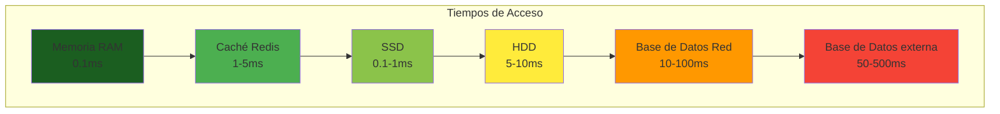

| Nivel | Tecnología | Latencia Típica | Throughput |
|-------|------------|-----------------|------------|
| **L1** | Memoria CPU | 0.5-1 ns | ~1 TB/s |
| **L2** | Caché CPU | 5-10 ns | ~500 GB/s |
| **RAM** | Memoria RAM | 100 ns | ~50 GB/s |
| **Redis** | Caché en memoria | 1-5 ms | ~100K ops/s |
| **SSD** | Almacenamiento | 0.1-1 ms | ~500 MB/s |
| **HDD** | Disco magnético | 5-10 ms | ~100 MB/s |
| **BD** | Red a BD | 10-100 ms | Limitado por red |

📝 **Nota del Profesor**: El rendimiento de Redis es tan bueno porque mantiene todos los datos en memoria RAM. A diferencia de una base de datos tradicional que puede necesitar múltiples lecturas de disco para completar una consulta, Redis responde en milisegundos porque todo está ya en memoria.

### 12.1.3. Arquitectura de un Sistema con Caché

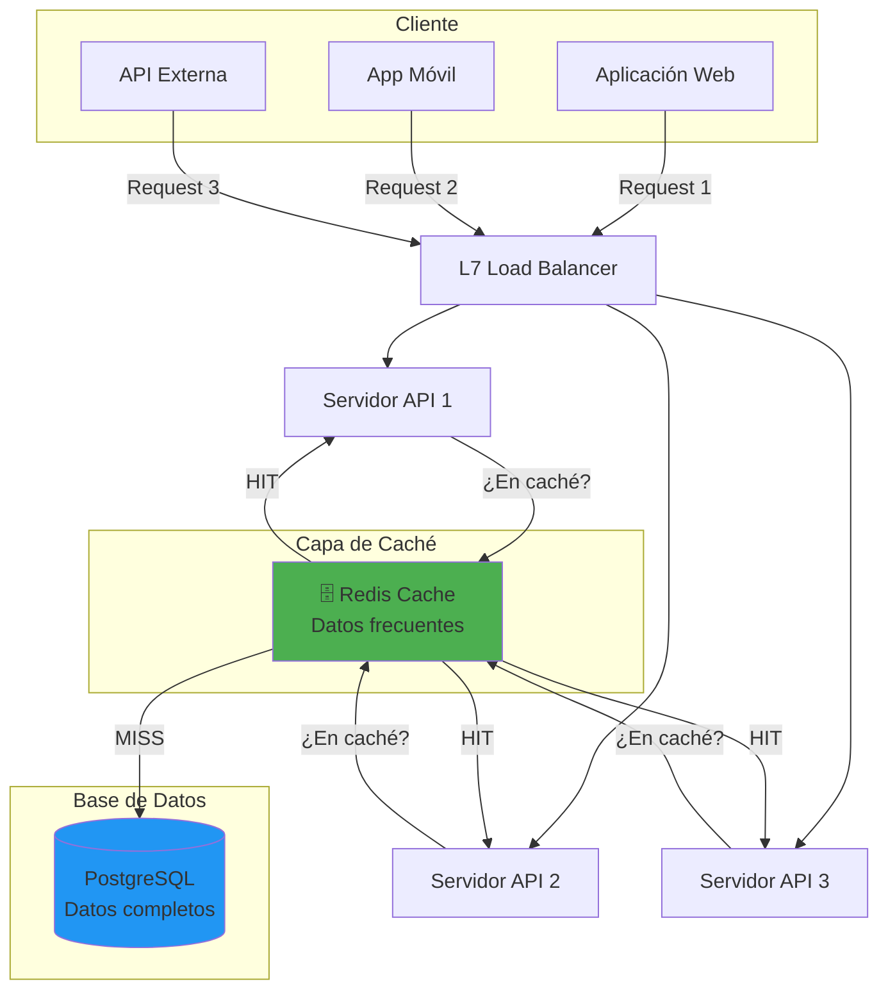

---

## 12.2. Tipos de Caché

### 12.2.1. Caché en Memoria (Local)

El caché en memoria (local) almacena datos en la RAM del propio proceso de la aplicación. Es el tipo de caché más rápido porque no requiere ninguna comunicación de red.

```csharp
using Microsoft.Extensions.Caching.Memory;

public class LocalCacheExample
{
    private readonly IMemoryCache _cache;
    
    public LocalCacheExample(IMemoryCache cache)
    {
        _cache = cache;
    }
    
    public async Task<Product?> GetProduct(int id)
    {
        // TryGetValue: verificar si existe sin crear
        if (_cache.TryGetValue($"product:{id}", out Product? product))
        {
            return product; // Cache HIT
        }
        
        // Cache MISS - obtener de BD
        product = await _repository.GetByIdAsync(id);
        
        if (product != null)
        {
            // Guardar en caché
            _cache.Set($"product:{id}", product, TimeSpan.FromMinutes(30));
        }
        
        return product;
    }
}
```

**Características del caché local:**

| Aspecto | Descripción |
|---------|-------------|
| **Velocidad** | Extremadamente rápido (mismo proceso) |
| **Latencia** | ~0.001 ms (overhead mínimo) |
| **Compartición** | No compartido entre instancias |
| **Persistencia** | Se pierde al reiniciar |
| **Memoria** | Limitada al proceso |

### 12.2.2. Caché Distribuido

Un caché distribuido es un servicio independiente que múltiples instancias de aplicación pueden compartir. Redis es el ejemplo más popular.

```csharp
using Microsoft.Extensions.Caching.Distributed;
using StackExchange.Redis;

public class DistributedCacheExample
{
    private readonly IDistributedCache _cache;
    private readonly IConnectionMultiplexer _redis;
    
    public DistributedCacheExample(
        IDistributedCache cache,
        IConnectionMultiplexer redis)
    {
        _cache = cache;
        _redis = redis;
    }
    
    public async Task<Product?> GetProduct(int id)
    {
        var key = $"product:{id}";
        var data = await _cache.GetStringAsync(key);
        
        if (data != null)
        {
            return JsonSerializer.Deserialize<Product>(data); // Cache HIT
        }
        
        // Cache MISS
        var product = await _repository.GetByIdAsync(id);
        
        if (product != null)
        {
            var options = new DistributedCacheEntryOptions
            {
                AbsoluteExpirationRelativeToNow = TimeSpan.FromMinutes(30)
            };
            
            await _cache.SetStringAsync(
                key, 
                JsonSerializer.Serialize(product), 
                options);
        }
        
        return product;
    }
}
```

**Características del caché distribuido:**

| Aspecto | Descripción |
|---------|-------------|
| **Velocidad** | Muy rápido (red local) |
| **Latencia** | ~1-5 ms (overhead de red) |
| **Compartición** | Compartido entre todas las instancias |
| **Persistencia** | Configurable (RDB, AOF) |
| **Memoria** | Dedicada y escalable |

### 12.2.3. Comparativa: MemoryCache vs IDistributedCache

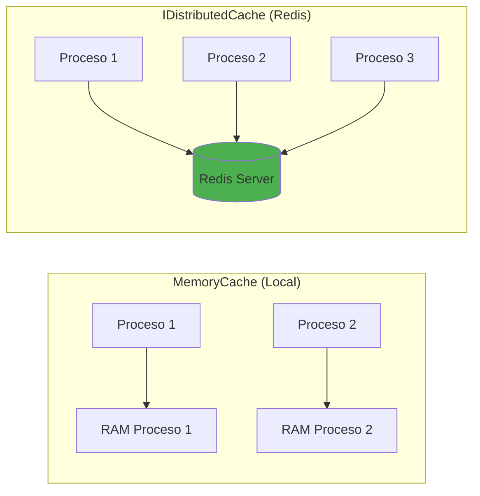

| Característica | MemoryCache (Local) | IDistributedCache (Redis) |
|----------------|---------------------|---------------------------|
| **Compartido entre procesos** | ❌ No | ✅ Sí |
| **Persistencia** | ❌ Se pierde al reiniciar | ✅ Opcional (RDB/AOF) |
| **Escalabilidad horizontal** | ❌ Limitado | ✅ Ilimitado |
| **Latencia** | ~0.001 ms | ~1-5 ms |
| **Overhead de red** | ❌ Ninguno | ✅ Requiere red |
| **Monitorización** | ❌ Básica | ✅ Redis Commander, CLI |
| **Memoria disponible** | Limitada al proceso | Dedicada al servidor |
| **Alta disponibilidad** | ❌ No | ✅ Con Sentinel/Cluster |
| **Costo de infraestructura** | Gratuito | Servidor dedicado |

💡 **Tip del Examinador**: En entrevistas, enfatiza que la elección entre caché local y distribuido depende del caso de uso. Para datos que no cambian frecuentemente y son leídos por múltiples instancias, Redis es ideal. Para datos específicos de una sesión o que cambian muy frecuentemente, el caché local puede ser suficiente.

### 12.2.4. ¿Cuándo Usar Cada Uno?

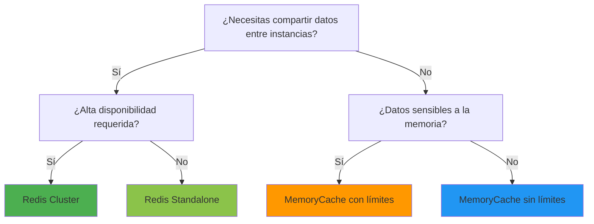

| Escenario | Recomendación | Razón |
|-----------|---------------|-------|
| Single instance app | MemoryCache | Más rápido, sin overhead de red |
| Multi-instance app | Redis | Compartido entre todas las instancias |
| Datos críticos | Redis + Persistencia | No perder datos en reinicio |
| Sesiones de usuario | Redis | Persistente entre reinicios |
| Datos muy volátiles | MemoryCache | Invalidación rápida y local |
| Cache de consultas | Redis | Compartido, reduce carga en BD |
| Configuración | Redis | Sincronizado entre instancias |
| Contadores/rate limiting | Redis | Operaciones atómicas |

---

## 12.3. Algoritmos de Caché

### 12.3.1. LRU - Least Recently Used

**LRU** (Least Recently Used) elimina primero los elementos que no han sido usados durante más tiempo. Es el algoritmo más común y funciona bien cuando los patrones de acceso tienen localidad temporal.

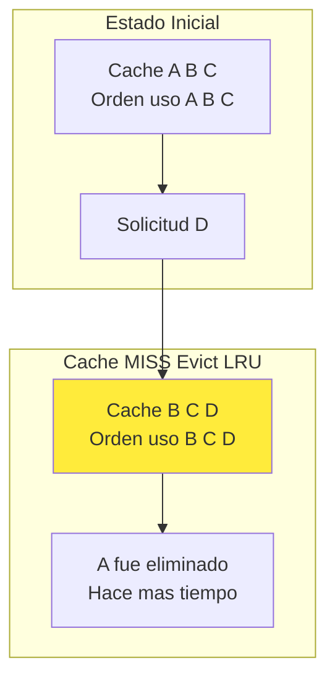

**Cómo funciona LRU:**
1. Cada entrada tiene un timestamp de último acceso
2. Cuando el caché está lleno y entra un nuevo elemento
3. Se elimina el elemento con el timestamp más antiguo
4. Al acceder a un elemento, se actualiza su timestamp

**Ventajas de LRU:**
- ✅ Simple de implementar
- ✅ Buenos resultados en la mayoría de casos
- ✅ Se adapta automáticamente a patrones de acceso

**Desventajas de LRU:**
- ❌ Mantener timestamps tiene overhead
- ❌ Un acceso esporádico a datos antiguos puede evictar datos útiles

### 12.3.2. LFU - Least Frequently Used

**LFU** (Least Frequently Used) elimina primero los elementos menos frecuentemente accedidos. Funciona mejor cuando la frecuencia de acceso es predecible.

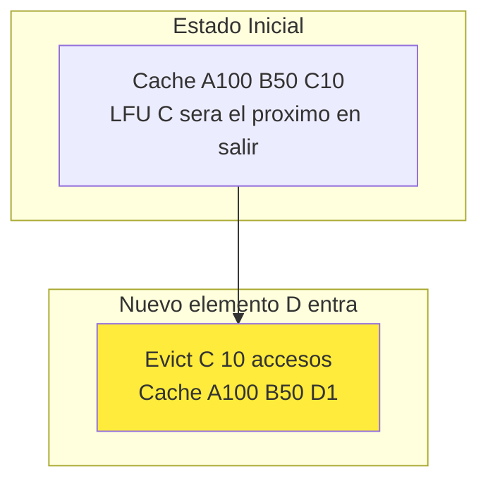

**Cuándo usar LFU:**
- Datos con distribución de frecuencia estable
- Datos de los mas populares (top products, trending)
- Situaciones donde la frecuencia es mas importante que la recencia

### 12.3.3. FIFO - First In First Out

**FIFO** elimina los elementos en el orden en que fueron añadidos, independientemente de como se accedan.

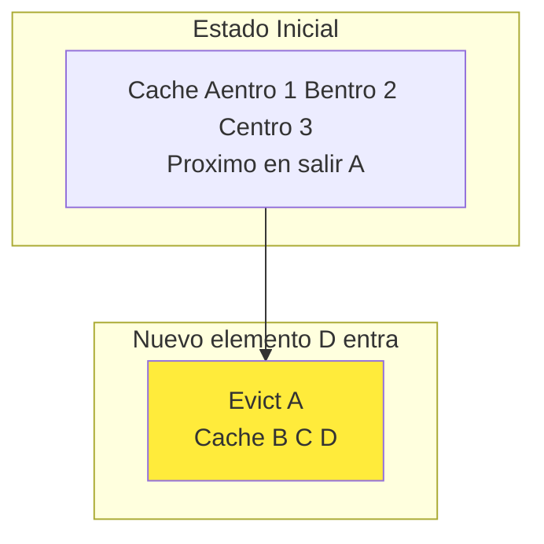

**Cuándo usar FIFO:**
- Datos con vida útil basada en tiempo de entrada
- Sistemas de buffering
- Datos que "caducan" por ser antiguos

### 12.3.4. TTL - Time To Live

**TTL** no es un algoritmo de evict propiamente dicho, sino una política complementaria. Cada entrada tiene un tiempo de vida después del cual se elimina automáticamente.

```csharp
var options = new MemoryCacheEntryOptions
{
    // Expira 30 minutos después de ahora
    AbsoluteExpirationRelativeToNow = TimeSpan.FromMinutes(30),
    
    // O expira en una fecha específica
    AbsoluteExpiration = DateTimeOffset.Now.AddHours(1),
    
    // Expira si no se accede durante 10 minutos
    SlidingExpiration = TimeSpan.FromMinutes(10),
    
    // Prioridad de evict (solo para MemoryCache)
    Priority = CacheItemPriority.Normal
};
```

### 12.3.5. Comparativa de Algoritmos

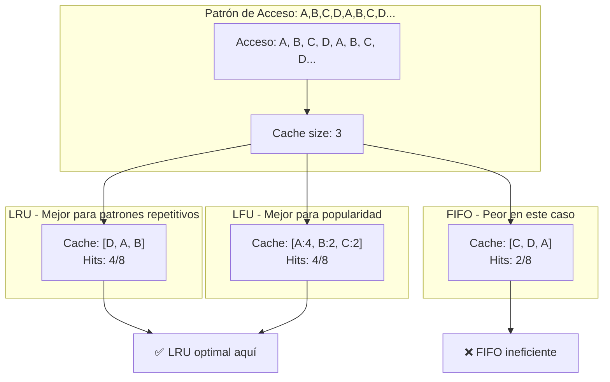

| Algoritmo | Mejor Caso | Peor Caso | Complejidad | Uso Típico |
|-----------|------------|-----------|-------------|------------|
| **LRU** | Patrones repetitivos, locality temporal | Acceso secuencial sin repetición | O(1) | Aplicaciones web generales |
| **LFU** | Popularidad estable | Cambios frecuentes de popularidad | O(log n) | Rankings, trending |
| **FIFO** | Datos que caducan por edad | Patrones repetitivos | O(1) | Buffering, streaming |
| **TTL** | Datos que caducan naturalmente | Datos permanentes | O(1) | Tokens, sesiones, caches |

---

## 12.4. Redis: Fundamentos

### 12.4.1. ¿Qué es Redis?

**Redis** (Remote Dictionary Server) es una base de datos en memoria de código abierto que funciona como almacén de estructuras de datos clave-valor. Es extremadamente rápido porque mantiene todos los datos en memoria RAM.

📝 **Nota del Profesor**: Redis fue creado por Salvatore Sanfilippo en 2009 para resolver problemas de escalabilidad en su startup. Fue diseñado con un enfoque en la simplicidad y el rendimiento. En 2015, Redis Labs (ahora Redis Inc.) adquirió los derechos del proyecto.

### 12.4.2. Estructuras de Datos en Redis

A diferencia de un simple key-value store, Redis soporta múltiples estructuras de datos:

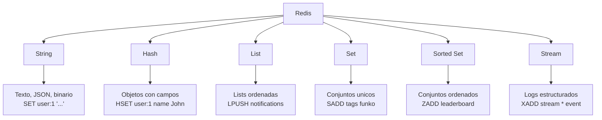

| Estructura | Uso en Aplicaciones | Ejemplo |
|------------|---------------------|---------|
| **String** | Cacheo de JSON, contadores | `SET product:1 '{"id":1}'` |
| **Hash** | Objetos con campos | `HSET user:1 name "John"` |
| **List** | Colas, feeds, notificaciones | `LPUSH queue:orders order_id` |
| **Set** | Tags, pertenencia | `SADD product:tags marvel` |
| **Sorted Set** | Leaderboards, rankings | `ZADD leaderboard 100 user:1` |
| **Stream** | Logging, eventos | `XADD events * type login` |

### 12.4.3. Modo de Persistencia

Redis puede configurarse para persistir datos a disco:

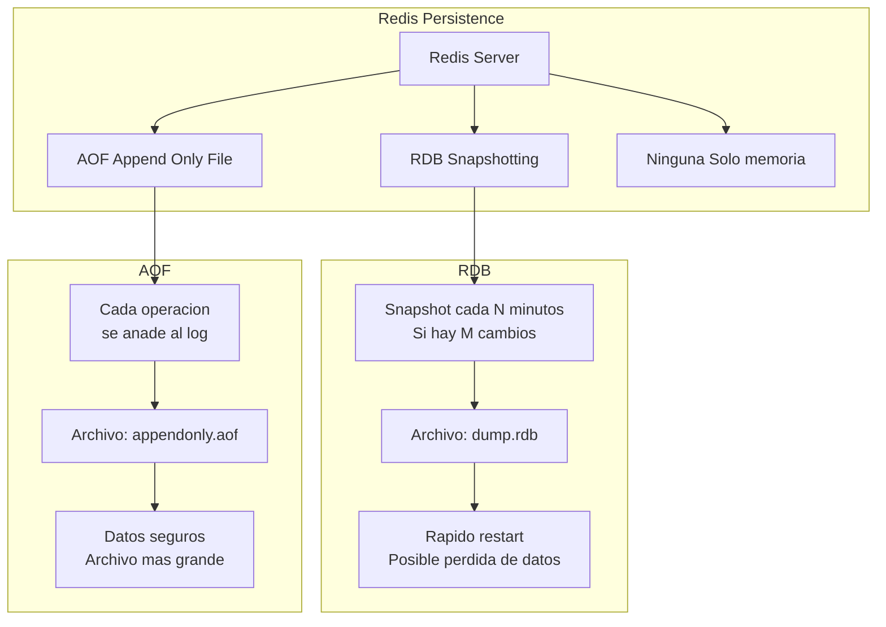

**Configuración recomendada para producción:**

```bash
# redis.conf
appendonly yes
appendfsync everysec
save 900 1
save 300 10
save 60 10000
maxmemory 2gb
maxmemory-policy allkeys-lru
```

### 12.4.4. Redis vs Otras BBDD en Memoria

| Característica | Redis | Memcached | Hazelcast |
|----------------|-------|-----------|-----------|
| **Estructuras de datos** | ✅ Múltiples | ❌ Solo strings | ✅ Múltiples |
| **Persistencia** | ✅ RDB + AOF | ❌ No | ✅ Opcional |
| **Cluster** | ✅ Nativo | ✅ Fragmentación | ✅ Nativo |
| **Lua scripting** | ✅ Sí | ❌ No | ✅ Sí |
| **Pub/Sub** | ✅ Sí | ❌ No | ✅ Sí |
| **Geospatial** | ✅ Sí | ❌ No | ❌ No |

---

## 12.5. Configuración de Redis

### 12.5.1. Docker Compose

**docker-compose.yml:**

```yaml
version: '3.8'

services:
  redis-db:
    image: redis:7-alpine
    container_name: funkos-redis
    restart: always
    command: >
      redis-server
      --requirepass ${REDIS_PASSWORD}
      --appendonly yes
      --appendfsync everysec
      --maxmemory 512mb
      --maxmemory-policy allkeys-lru
    ports:
      - "${REDIS_PORT}:6379"
    volumes:
      - redis-data:/data
    networks:
      - funkos-network
    healthcheck:
      test: ["CMD", "redis-cli", "-a", "${REDIS_PASSWORD}", "ping"]
      interval: 30s
      timeout: 5s
      retries: 3
    deploy:
      resources:
        limits:
          memory: 512M
        reservations:
          memory: 256M

  redis-commander:
    image: rediscommander/redis-commander:latest
    container_name: redis-commander
    restart: always
    ports:
      - "8082:8081"
    environment:
      REDIS_HOSTS: local:redis-db:${REDIS_PORT}:0:${REDIS_PASSWORD}
    depends_on:
      - redis-db
    networks:
      - funkos-network

volumes:
  redis-data:

networks:
  funkos-network:
    driver: bridge
```

**.env:**

```bash
REDIS_HOST=localhost
REDIS_PORT=6379
REDIS_PASSWORD=miPasswordSeguro123
```

### 12.5.2. Configuración de Conexión

```csharp
// Connection string estilo Redis
"redis-db:6379,password=miPassword123,ssl=false,abortConnect=false,connectTimeout=3000,syncTimeout=3000"

// Componentes de la conexión
// - Host:puerto obligatorio
// - password: autenticación
// - ssl: encriptación
// - abortConnect: reconexión automática
// - connectTimeout: timeout de conexión
// - syncTimeout: timeout de operaciones sync
```

### 12.5.3. Configuración en ASP.NET Core

**Paquetes NuGet:**

```bash
dotnet add package Microsoft.Extensions.Caching.StackExchangeRedis
dotnet add package Microsoft.Extensions.Caching.Memory
```

**Program.cs:**

```csharp
var builder = WebApplication.CreateBuilder(args);

// Configurar según el entorno
if (builder.Environment.IsDevelopment())
{
    // Desarrollo: MemoryCache (más rápido para debug)
    builder.Services.AddMemoryCache();
    builder.Services.AddSingleton<ICacheService, MemoryCacheService>();
    Console.WriteLine("🔧 Desarrollo: Usando MemoryCache");
}
else
{
    // Producción: Redis Cache
    var redisConnection = builder.Configuration["Redis:Configuration"];
    var redisInstanceName = builder.Configuration["Redis:InstanceName"];
    
    builder.Services.AddStackExchangeRedisCache(options =>
    {
        options.Configuration = redisConnection;
        options.InstanceName = redisInstanceName;
    });
    
    builder.Services.AddSingleton<ICacheService, RedisCacheService>();
    Console.WriteLine("🚀 Producción: Usando Redis");
}

// Configurar opciones de caché
builder.Services.Configure<CacheOptions>(
    builder.Configuration.GetSection("Cache"));

builder.Services.AddControllers();

var app = builder.Build();

app.UseRouting();
app.MapControllers();

app.Run();
```

**appsettings.json:**

```json
{
  "Cache": {
    "DefaultExpirationMinutes": 60,
    "SlidingExpirationMinutes": 10
  },
  "Redis": {
    "Configuration": "localhost:6379,password=miPassword123",
    "InstanceName": "FunkosApi:Prod:",
    "Database": 0,
    "ConnectTimeout": 3000,
    "SyncTimeout": 3000
  }
}
```

---

## 12.6. Interfaz ICacheService

```csharp
using System.Text.Json;

namespace FunkosApi.Core.Interfaces.Cache;

/// <summary>
/// Interfaz abstracta para operaciones de caché.
/// Permite cambiar entre MemoryCache y Redis sin modificar código.
/// </summary>
public interface ICacheService
{
    /// <summary>
    /// Obtiene un valor del caché de forma asíncrona.
    /// </summary>
    Task<T?> GetAsync<T>(string key, CancellationToken cancellationToken = default);

    /// <summary>
    /// Guarda un valor en el caché con TTL opcional.
    /// </summary>
    Task SetAsync<T>(string key, T value, TimeSpan? expiration = null, CancellationToken cancellationToken = default);

    /// <summary>
    /// Elimina un elemento del caché.
    /// </summary>
    Task RemoveAsync(string key, CancellationToken cancellationToken = default);

    /// <summary>
    /// Elimina todos los elementos que coincidan con un prefijo.
    /// </summary>
    Task RemoveByPrefixAsync(string prefix, CancellationToken cancellationToken = default);

    /// <summary>
    /// Verifica si una clave existe en el caché.
    /// </summary>
    Task<bool> ExistsAsync(string key, CancellationToken cancellationToken = default);

    /// <summary>
    /// Obtiene un valor del caché o lo crea si no existe.
    /// Patrón atómico que evita race conditions.
    /// </summary>
    Task<T?> GetOrSetAsync<T>(string key, Func<Task<T>> factory, TimeSpan? expiration = null, CancellationToken cancellationToken = default);

    /// <summary>
    /// Refresca el TTL de una clave existente.
    /// </summary>
    Task RefreshAsync(string key, TimeSpan? expiration = null, CancellationToken cancellationToken = default);
}
```

💡 **Tip del Examinador**: El método `GetOrSetAsync` es crucial para evitar el problema "cache stampede" donde múltiples hilos intentan cargar el mismo dato simultáneamente. La operación es atómica: si el dato existe, lo devuelve; si no, ejecuta el factory y lo cachea.

---

## 12.7. Implementaciones de Caché

### 12.7.1. MemoryCacheService (Local)

```csharp
using Microsoft.Extensions.Caching.Memory;
using System.Text.Json;

namespace FunkosApi.Core.Services.Cache;

/// <summary>
/// Implementación de caché en memoria local.
/// Útil para desarrollo o aplicaciones de instancia única.
/// </summary>
public class MemoryCacheService(
    IMemoryCache cache,
    IOptions<CacheOptions> options,
    ILogger<MemoryCacheService> logger) : ICacheService
{
    private readonly TimeSpan _defaultExpiration = TimeSpan.FromMinutes(options.Value.DefaultExpirationMinutes);
    private readonly TimeSpan _slidingExpiration = TimeSpan.FromMinutes(options.Value.SlidingExpirationMinutes);
    private readonly Dictionary<string, HashSet<string>> _keysByPrefix = new(StringComparer.OrdinalIgnoreCase);

    public Task<T?> GetAsync<T>(string key, CancellationToken cancellationToken = default)
    {
        cancellationToken.ThrowIfCancellationRequested();
        
        if (cache.TryGetValue(key, out T? value))
        {
            logger.LogDebug("✅ MemoryCache HIT: {Key}", key);
            return Task.FromResult(value);
        }

        logger.LogDebug("❌ MemoryCache MISS: {Key}", key);
        return Task.FromResult<T?>(default);
    }

    public Task SetAsync<T>(string key, T value, TimeSpan? expiration = null, CancellationToken cancellationToken = default)
    {
        cancellationToken.ThrowIfCancellationRequested();
        
        var cacheEntryOptions = new MemoryCacheEntryOptions
        {
            AbsoluteExpirationRelativeToNow = expiration ?? _defaultExpiration,
            SlidingExpiration = _slidingExpiration,
            Priority = CacheItemPriority.Normal,
            Size = 1
        };

        cacheEntryOptions.RegisterPostEvictionCallback((k, v, reason, state) =>
        {
            logger.LogDebug("🗑️ MemoryCache evicted: {Key}, Razón: {Reason}", k, reason);
            RemoveFromPrefixTracking(k.ToString()!);
        });

        cache.Set(key, value, cacheEntryOptions);
        logger.LogDebug("💾 MemoryCache SET: {Key} (TTL: {Expiration})", 
            key, expiration ?? _defaultExpiration);

        return Task.CompletedTask;
    }

    public Task RemoveAsync(string key, CancellationToken cancellationToken = default)
    {
        cancellationToken.ThrowIfCancellationRequested();
        cache.Remove(key);
        RemoveFromPrefixTracking(key);
        logger.LogDebug("🗑️ MemoryCache REMOVE: {Key}", key);
        return Task.CompletedTask;
    }

    public Task RemoveByPrefixAsync(string prefix, CancellationToken cancellationToken = default)
    {
        cancellationToken.ThrowIfCancellationRequested();
        
        if (_keysByPrefix.TryGetValue(prefix, out var keys))
        {
            foreach (var key in keys.ToList())
            {
                _cache.Remove(key);
            }
            keys.Clear();
            _logger.LogDebug("🗑️ MemoryCache REMOVE by prefix: {Prefix} ({Count} keys)", 
                prefix, keys.Count);
        }
        else
        {
            _logger.LogWarning("⚠️ No hay claves registradas con prefijo: {Prefix}", prefix);
        }

        return Task.CompletedTask;
    }

    public Task<bool> ExistsAsync(string key, CancellationToken cancellationToken = default)
    {
        cancellationToken.ThrowIfCancellationRequested();
        return Task.FromResult(_cache.TryGetValue(key, out _));
    }

    public async Task<T?> GetOrSetAsync<T>(string key, Func<Task<T>> factory, 
        TimeSpan? expiration = null, CancellationToken cancellationToken = default)
    {
        cancellationToken.ThrowIfCancellationRequested();
        
        if (_cache.TryGetValue(key, out T? cached))
        {
            _logger.LogDebug("✅ GetOrSet - MemoryCache HIT: {Key}", key);
            return cached;
        }

        _logger.LogDebug("❌ GetOrSet - MemoryCache MISS: {Key}, ejecutando factory...", key);
        var value = await factory();

        if (value != null)
        {
            await SetAsync(key, value, expiration, cancellationToken);
        }

        return value;
    }

    public Task RefreshAsync(string key, TimeSpan? expiration = null, CancellationToken cancellationToken = default)
    {
        cancellationToken.ThrowIfCancellationRequested();
        
        if (_cache.TryGetValue(key, out _))
        {
            var options = new MemoryCacheEntryOptions
            {
                AbsoluteExpirationRelativeToNow = expiration ?? _defaultExpiration,
                SlidingExpiration = _slidingExpiration
            };
            _cache.Set(key, _cache.Get(key), options);
            _logger.LogDebug("🔄 MemoryCache REFRESH: {Key}", key);
        }

        return Task.CompletedTask;
    }

    private void RemoveFromPrefixTracking(string key)
    {
        foreach (var prefix in _keysByPrefix.Keys)
        {
            _keysByPrefix[prefix]?.Remove(key);
        }
    }
}
```

### 12.7.2. RedisCacheService (Distribuido)

```csharp
using Microsoft.Extensions.Caching.Distributed;
using StackExchange.Redis;
using System.Text.Json;

namespace FunkosApi.Core.Services.Cache;

/// <summary>
/// Implementación de caché distribuido con Redis.
/// Para producción y aplicaciones multi-instancia.
/// </summary>
public class RedisCacheService(
    IDistributedCache cache,
    IConnectionMultiplexer redis,
    IOptions<CacheOptions> options,
    ILogger<RedisCacheService> logger) : ICacheService
{
    private readonly TimeSpan _defaultExpiration = TimeSpan.FromMinutes(options.Value.DefaultExpirationMinutes);
    private readonly string _instanceName = options.Value.InstanceName;

    public async Task<T?> GetAsync<T>(string key, CancellationToken cancellationToken = default)
    {
        cancellationToken.ThrowIfCancellationRequested();
        
        var fullKey = $"{_instanceName}{key}";
        var data = await cache.GetStringAsync(fullKey, cancellationToken);

        if (data is null)
        {
            logger.LogDebug("❌ Redis MISS: {Key}", fullKey);
            return default;
        }

        logger.LogDebug("✅ Redis HIT: {Key}", fullKey);
        return JsonSerializer.Deserialize<T>(data);
    }

    public async Task SetAsync<T>(string key, T value, TimeSpan? expiration = null, CancellationToken cancellationToken = default)
    {
        cancellationToken.ThrowIfCancellationRequested();
        
        var fullKey = $"{_instanceName}{key}";
        var cacheOptions = new DistributedCacheEntryOptions
        {
            AbsoluteExpirationRelativeToNow = expiration ?? _defaultExpiration
        };

        var data = JsonSerializer.Serialize(value);
        await cache.SetStringAsync(fullKey, data, cacheOptions, cancellationToken);
        logger.LogDebug("💾 Redis SET: {Key} (TTL: {Expiration})", fullKey, expiration ?? _defaultExpiration);
    }

    public async Task RemoveAsync(string key, CancellationToken cancellationToken = default)
    {
        cancellationToken.ThrowIfCancellationRequested();
        
        var fullKey = $"{_instanceName}{key}";
        await _cache.RemoveAsync(fullKey, cancellationToken);
        _logger.LogDebug("🗑️ Redis REMOVE: {Key}", fullKey);
    }

    public async Task RemoveByPrefixAsync(string prefix, CancellationToken cancellationToken = default)
    {
        cancellationToken.ThrowIfCancellationRequested();
        
        var db = _redis.GetDatabase();
        var server = _redis.GetServer(_redis.GetEndPoints()[0]);
        
        var fullPrefix = $"{_instanceName}{prefix}*";
        var keys = server.Keys(pattern: fullPrefix).ToArray();
        
        if (keys.Length > 0)
        {
            await db.KeyDeleteAsync(keys);
            _logger.LogDebug("🗑️ Redis REMOVE by prefix: {Prefix} ({Count} keys)", 
                fullPrefix, keys.Length);
        }
    }

    public Task<bool> ExistsAsync(string key, CancellationToken cancellationToken = default)
    {
        cancellationToken.ThrowIfCancellationRequested();
        
        var fullKey = $"{_instanceName}{key}";
        var data = _cache.Get(fullKey);
        return Task.FromResult(data is not null);
    }

    public async Task<T?> GetOrSetAsync<T>(string key, Func<Task<T>> factory, 
        TimeSpan? expiration = null, CancellationToken cancellationToken = default)
    {
        cancellationToken.ThrowIfCancellationRequested();
        
        var cached = await GetAsync<T>(key, cancellationToken);
        if (cached is not null) return cached;

        var value = await factory();
        await SetAsync(key, value, expiration, cancellationToken);
        return value;
    }

    public async Task RefreshAsync(string key, TimeSpan? expiration = null, CancellationToken cancellationToken = default)
    {
        cancellationToken.ThrowIfCancellationRequested();
        
        var fullKey = $"{_instanceName}{key}";
        var data = await _cache.GetStringAsync(fullKey, cancellationToken);
        
        if (data is not null)
        {
            var options = new DistributedCacheEntryOptions
            {
                AbsoluteExpirationRelativeToNow = expiration ?? _defaultExpiration
            };
            await _cache.SetStringAsync(fullKey, data, options, cancellationToken);
            _logger.LogDebug("🔄 Redis REFRESH: {Key}", fullKey);
        }
    }
}
```

📝 **Nota del Profesor**: Observa que Redis añade un prefijo de instancia (`_instanceName`) a todas las claves. Esto es importante en entornos multi-tenant o cuando múltiples aplicaciones comparten la misma instancia de Redis.

---

## 12.8. Estrategias de Caché

### 12.8.1. Cache-Aside (Lazy Loading)

El patrón **Cache-Aside** (tambien llamado Lazy Loading) carga datos en el caché solo cuando se necesitan por primera vez.

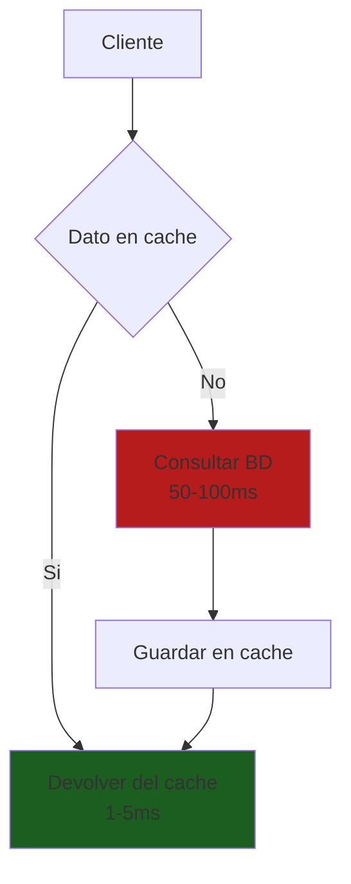

**Implementación:**

```csharp
public async Task<Product?> GetProductAsync(int id)
{
    var cacheKey = $"product:{id}";
    
    // 1. Intentar obtener del caché
    var cached = await _cache.GetAsync<Product>(cacheKey);
    if (cached != null)
    {
        _logger.LogDebug("✅ Cache HIT para producto {Id}", id);
        return cached;
    }
    
    // 2. Cache MISS - obtener de la base de datos
    _logger.LogDebug("❌ Cache MISS para producto {Id}, consultando BD", id);
    var product = await _repository.GetByIdAsync(id);
    
    // 3. Guardar en caché para próximas solicitudes
    if (product != null)
    {
        await _cache.SetAsync(cacheKey, product, TimeSpan.FromMinutes(30));
    }
    
    return product;
}
```

**Ventajas:**
- ✅ Implementación simple
- ✅ Los datos se cargan bajo demanda
- ✅ No hay datos stale (excepto por TTL)
- ✅ Ideal para datos con acceso impredecible

**Desventajas:**
- ❌ El primer acceso es lento (cache miss)
- ❌ Posible cache stampede (múltiples threads cargando el mismo dato)
- ❌ Datos pueden estar desactualizados si no se invalidan

### 12.8.2. Write-Through

El patrón **Write-Through** escribe simultaneamente en el caché y en la base de datos.

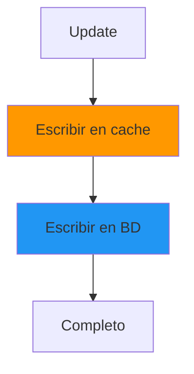

**Implementación:**

```csharp
public async Task<Product> UpdateProductAsync(int id, UpdateProductDto dto)
{
    // 1. Actualizar en base de datos
    var product = await _repository.UpdateAsync(id, dto);
    
    // 2. Escribir en caché (Write-Through)
    var cacheKey = $"product:{id}";
    await _cache.SetAsync(cacheKey, product, TimeSpan.FromMinutes(30));
    
    return product;
}
```

**Ventajas:**
- El cache siempre esta sincronizado con la BD
- Lecturas siempre devuelven datos actualizados
- Sin necesidad de invalidacion

**Desventajas:**
- Writes son mas lentos (dos operaciones)
- Se escriben datos que nunca se leeran
- Overhead en cada write

### 12.8.3. Write-Behind (Write-Back)

El patrón **Write-Behind** escribe primero en el caché y luego, de forma asincrona, en la base de datos.

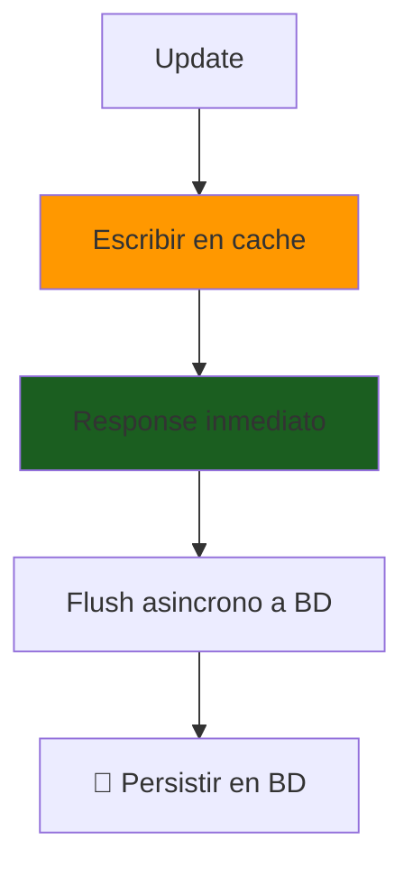

**Ventajas:**
- ✅ Writes muy rápidos (respuesta inmediata)
- ✅ Reduce carga en BD
- ✅ Batch writes posibles

**Desventajas:**
- ❌ Riesgo de pérdida de datos si el caché falla
- ❌ Complexidad de implementación
- ❌ Posibles inconsistencias

### 12.8.4. Refresh-Ahead

El patrón **Refresh-Ahead** refresca automáticamente los datos antes de que expiren.

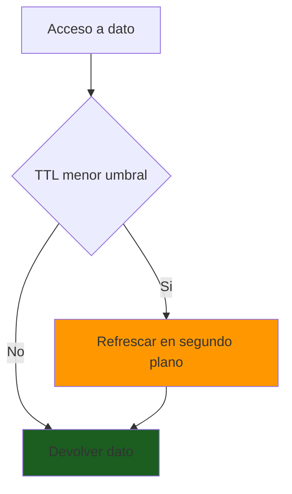

### 12.8.5. Cual Elegir

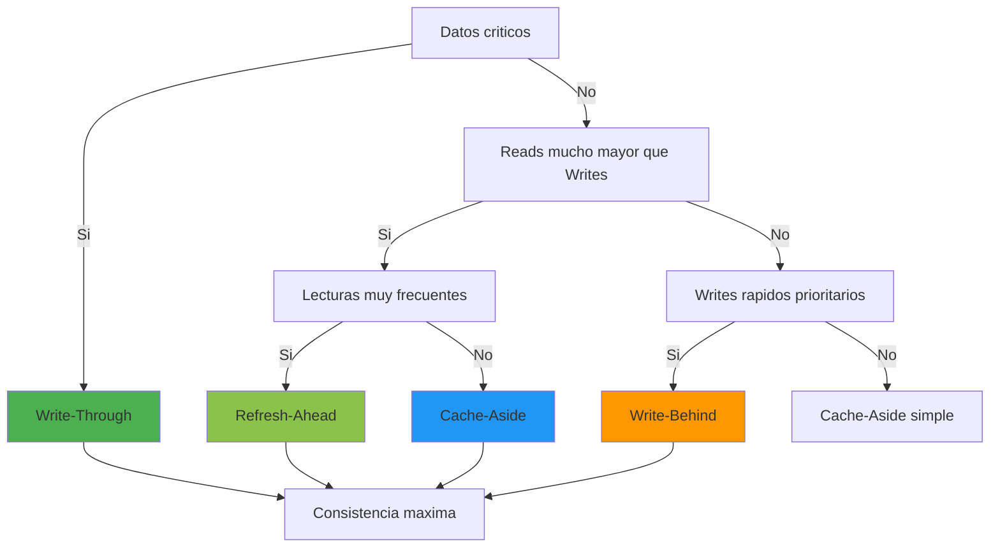

| Estrategia | Mejor Para | Evitar En |
|------------|------------|-----------|
| **Cache-Aside** | Reads frecuentes, datos no críticos | Datos que cambian constantemente |
| **Write-Through** | Datos que deben estar siempre actualizados | Writes de alto volumen |
| **Write-Behind** | Alta escritura, tolerancia a pérdida | Transacciones financieras |
| **Refresh-Ahead** | Datos muy populares, baja latencia | Datos muy volátiles |

💡 **Tip del Examinador**: Para la mayoría de aplicaciones web, **Cache-Aside** es la mejor elección. Es simple, efectivo y fácil de debuggear. Añade invalidación correcta y TTL apropiado.

---

## 12.9. ¿Qué Cachear?

### 12.9.1. Elementos Individuales

**Cachear elementos individuales** cuando:

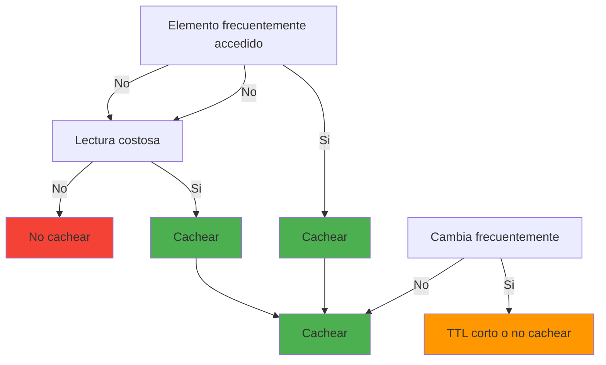

**Ejemplo: Producto individual**

```csharp
private const string PRODUCT_KEY = "product";
private string GetProductKey(int id) => $"{PRODUCT_KEY}:{id}";

public async Task<Product?> GetProductAsync(int id)
{
    return await _cache.GetOrSetAsync(
        GetProductKey(id),
        async () => await _repository.GetByIdAsync(id),
        TimeSpan.FromMinutes(30) // TTL: productos cambian moderadamente
    );
}
```

### 12.9.2. Colecciones y Listas

**Cachear colecciones** cuando:

| Criterio | Descripción | Ejemplo |
|----------|-------------|---------|
| **Stabilidad** | La colección no cambia frecuentemente | Categorías, tags |
| **Popularidad** | Es accedida muy frecuentemente | Top products |
| **Costo** | La consulta es costosa (joins, agregaciones) | Reportes, estadísticas |
| **Size** | La colección no es enorme | < 10,000 items |

**Ejemplo: Lista de categorías**

```csharp
private const string CATEGORIES_KEY = "categories:all";

public async Task<List<Category>> GetCategoriesAsync()
{
    return await _cache.GetOrSetAsync(
        CATEGORIES_KEY,
        async () => await _repository.GetAllAsync(),
        TimeSpan.FromHours(24) // TTL largo: categorías rara vez cambian
    ) ?? new List<Category>();
}
```

### 12.9.3. Resultados de Consultas

**Cachear resultados de consultas** cuando:

- La consulta involucra múltiples tablas (JOINs costosos)
- La consulta requiere agregaciones (SUM, AVG, COUNT)
- Los parámetros de búsqueda son predecibles

### 12.9.4. Datos de Sesión

**Cachear sesiones de usuario** cuando:

- Datos de sesión pequeños
- Necesitas acceso rápido
- Sharing entre múltiples servers

### 12.9.5. ¿Qué NO Cachear?

| Tipo de Dato | Razón | Alternativa |
|--------------|-------|-------------|
| **Datos sensibles** | Seguridad, exposición de credenciales | No cachear, cifrar si es necesario |
| **Datos en tiempo real** | Stocks financieros, posiciones GPS | Cachear con TTL muy corto o no cachear |
| **Datos grandes** | Imágenes, archivos, blobs | Cachear metadatos, no el contenido |
| **Datos muy volátiles** | Contadores que cambian cada segundo | Redis atomic operations |
| **Datos personales** | GDPR, privacidad | Minimizar cacheo, anonimizar |

---

## 12.10. Invalidación de Caché

### 12.10.1. Invalidación por TTL

La forma más simple de invalidación es usar **TTL (Time To Live)**:

```csharp
// Cachear con TTL
await _cache.SetAsync(key, value, TimeSpan.FromMinutes(30));

// El dato se elimina automáticamente después de 30 minutos
```

### 12.10.2. Invalidación por Operación (CRUD)

La invalidación por operación puede seguir dos estrategias diferentes. No hay una regla universal: depende del patrón de acceso de tu aplicación.

#### 12.10.2.1. Dos Estrategias: Cachear vs Invalidar

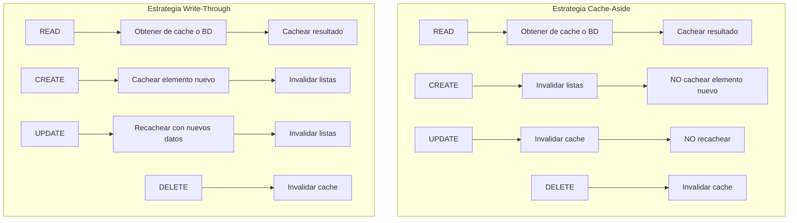

#### 12.10.2.2. Factores de Decisión

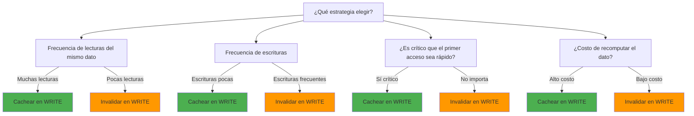

#### 12.10.2.3. Matriz de Decisión

| Escenario | Frecuencia | Recomendación | Razón |
|-----------|------------|---------------|-------|
| **Catálogo de productos** | Lecturas >> escrituras | Cachear en WRITE | Productos leídos frecuentemente, cambian poco |
| **Datos de usuario en sesión** | Lecturas frecuentes | Cachear en WRITE | Múltiples lecturas del mismo usuario |
| **Contadores de visitas** | Escrituras muy frecuentes | Invalidar en WRITE | Cambian constantemente, lectura única |
| **Carrito de compra** | Datos volátiles | Invalidar en WRITE | Datos efímeros, corta vida útil |
| **Configuración global** | Lecturas >> escrituras | Cachear en WRITE | Leída frecuentemente, cambia poco |
| **Inventario en tiempo real** | Cambios frecuentes | Invalidar en WRITE | Datos muy volátiles |
| **Historial de pedidos** | Lecturas frecuentes | Cachear en WRITE | Leído frecuentemente, cambia poco |
| **Datos de streaming** | Datos efímeros | Invalidar en WRITE | Una sola lectura por dato |

#### 12.10.2.4. Análisis: Crear - ¿Cachear o Invalidar?

```mermaid
flowchart TD
    subgraph "Opcion 1: Invalidar listas (Cache-Aside)"
        A1[POST crear funko] --> A2[Guardar en BD]
        A2 --> A3[Invalidar funkos:all]
        A3 --> A4[El nuevo funko NO se cachea]
        A4 --> A5[Primer GET despues: cachea el nuevo]
    end
    
    subgraph "Opcion 2: Cachear elemento + invalidar listas (Write-Through)"
        B1[POST crear funko] --> B2[Guardar en BD]
        B2 --> B3[Cachear el nuevo funko]
        B3 --> B4[Invalidar funkos:all]
        B4 --> B5[Primer GET: YA esta en cache]
    end
    
    style A5 fill:#FF9800
    style B5 fill:#4CAF50
```

- **Si cacheamos el nuevo funko**: El primer `GET /funkos/{id}` será rápido (ya está en cache)
- **Si solo invalidamos listas**: El primer `GET /funkos/{id}` irá a BD
- **Trade-off**: Cachear añade overhead en el WRITE pero mejora el primer READ posterior

#### 12.10.2.5. Análisis: Actualizar - ¿Recachear o Invalidar?

```mermaid
flowchart TD
    subgraph "Opcion 1: Invalidar (Cache-Aside)"
        A1[PUT actualizar funko] --> A2[Actualizar en BD]
        A2 --> A3[Invalidar funko:1]
        A3 --> A4[El funko cacheado queda INVALIDO]
        A4 --> A5[Primer GET despues: cachea version nueva]
    end
    
    subgraph "Opcion 2: Recachear (Write-Through)"
        B1[PUT actualizar funko] --> B2[Actualizar en BD]
        B2 --> B3[Cachear funko:1 con nuevos datos]
        B3 --> B4[El funko cacheado es la version NUEVA]
        B4 --> B5[Primer GET: YA tiene datos nuevos]
    end
    
    style A5 fill:#FF9800
    style B5 fill:#4CAF50
```

- **Si recacheamos**: El caché siempre tiene datos frescos, pero hacemos 2 operaciones (BD + cache)
- **Si invalidamos**: El caché queda obsoleto hasta el próximo READ, pero solo 1 operación
- **Trade-off**: Recachear garantiza consistencia inmediata; invalidar es más simple

#### 12.10.2.6. Implementación Flexible

```csharp
public class FunkoService : IFunkoService
{
    private readonly IFunkoRepository _repository;
    private readonly ICacheService _cache;
    private readonly CacheOptions _options;
    
    // Factores de decisión configurables
    private bool ShouldCacheOnWrite => _options.Strategy == CacheStrategy.WriteThrough;
    private bool ShouldRecacheOnUpdate => _options.Strategy == CacheStrategy.WriteThrough;
    
    public async Task<Result<FunkoDto, DomainError>> CreateAsync(CreateFunkoDto dto)
    {
        var result = await _repository.CreateAsync(dto);
        
        if (result.IsSuccess)
        {
            var funko = result.Value;
            
            if (ShouldCacheOnWrite)
            {
                // Estrategia Write-Through: cachear el nuevo elemento
                await _cache.SetAsync(KeyFunko(funko.Id), funko);
            }
            
            // Invalidar listas siempre (el listado cambió)
            await _cache.RemoveAsync(KeyAllFunkos());
        }
        
        return result.Map(f => f.ToDto());
    }
    
    public async Task<Result<FunkoDto, DomainError>> UpdateAsync(int id, UpdateFunkoDto dto)
    {
        var existingResult = await _repository.GetByIdAsync(id);
        if (existingResult.IsFailure)
        {
            return Result.Failure<FunkoDto, DomainError>(existingResult.Error);
        }
        
        var updateResult = await _repository.UpdateAsync(id, dto);
        
        if (updateResult.IsSuccess)
        {
            var funko = updateResult.Value;
            
            if (ShouldRecacheOnUpdate)
            {
                // Estrategia Write-Through: recachear con datos nuevos
                await _cache.SetAsync(KeyFunko(id), funko);
            }
            else
            {
                // Estrategia Cache-Aside: solo invalidar
                await _cache.RemoveAsync(KeyFunko(id));
            }
            
            // Invalidar listas siempre
            await _cache.RemoveAsync(KeyAllFunkos());
        }
        
        return updateResult.Map(f => f.ToDto());
    }
    
    public async Task<UnitResult<DomainError>> DeleteAsync(int id)
    {
        var deleteResult = await _repository.DeleteAsync(id);
        
        if (deleteResult.IsSuccess)
        {
            // DELETE siempre invalida, nunca cachea (el dato ya no existe)
            await _cache.RemoveAsync(KeyFunko(id));
            await _cache.RemoveAsync(KeyAllFunkos());
        }
        
        return deleteResult;
    }
}

// Configuración por escenario
public enum CacheStrategy
{
    CacheAside,     // Invalidar en WRITE
    WriteThrough    // Cachear en WRITE
}

public class CacheOptions
{
    public CacheStrategy Strategy { get; set; } = CacheStrategy.CacheAside;
}
```

**Regla de Oro de uso de la Cache:**

| Operación | Elemento Individual | Listas/Colecciones | Justificación |
|-----------|---------------------|-------------------|---------------|
| **CREATE** | Cachear O invalidar | Invalidar | Cachear si lecturas frecuentes del nuevo elemento |
| **READ** | Cachear resultado | No invalidar | Patrón Cache-Aside básico |
| **UPDATE** | Invalidar O recachear | Invalidar | Recachear si consistencia inmediata crítica |
| **DELETE** | Invalidar | Invalidar | El dato ya no existe |

💡 **Tip del Examinador**: No hay una respuesta correcta universal. La mejor estrategia depende de tu patrón de acceso específico. Explica los trade-offs en el examen: cachear mejora el primer READ posterior pero añade overhead en el WRITE; invalidar es más simple pero el primer READ puede ser más lento.

### 12.10.3. Invalidación en Cascada

Cuando un dato relacionado cambia, **todas las caché derivadas** deben invalidarse:

```mermaid
flowchart TD
    subgraph "Entidades"
        C[Categoria Marvel]
    end
    
    subgraph "Caches de Categoria"
        C1[category:1]
    end
    
    subgraph "Caches de Funkos"
        F1[funko:1 Iron Man]
        F2[funko:2 Thor]
        F3[funko:3 Batman]
    end
    
    subgraph "Caches de Listas"
        L1[funkos all]
        L2[funkos categoria 1 Marvel]
        L3[funkos categoria 2 DC]
    end
    
    C -->|Change| F1
    C -->|Change| F2
    F1 -->|Invalidate| L1
    F1 -->|Invalidate| L2
    F2 -->|Invalidate| L1
    F2 -->|Invalidate| L2
    
    style C fill:#B71C1C
    style L1 fill:#FF9800
    style L2 fill:#FF9800
```

### 12.10.4. Invalidacion Event-Driven

Para invalidacion sofisticada, usar un **bus de eventos**:

```mermaid
flowchart TD
    subgraph "Application"
        S[Servicio] -->|Publish| E[Event Bus]
    end
    
    E -->|Subscribe| C[Cache Service]
    E -->|Subscribe| O[Otros servicios]
    
    C -->|Invalidate| Cache[(Redis Cache)]
    
    style E fill:#FF9800
    style C fill:#4CAF50
```

### 12.10.5. Versionado de Caché

Usar **versiones en las claves** para invalidación atómica:

```csharp
public class CacheKeyManager
{
    private const string VERSION = "v1";
    private readonly string _prefix;
    
    public CacheKeyManager(string prefix)
    {
        _prefix = $"{prefix}:{VERSION}:";
    }
    
    public string GetKey(string entity, int id) => $"{_prefix}{entity}:{id}";
    public string GetAllKey(string entity) => $"{_prefix}{entity}:all";
    
    public async Task InvalidateVersionAsync(string entity)
    {
        await _cache.RemoveByPrefixAsync($"{_prefix}{entity}:");
    }
}
```

---

## 12.11. Aplicación Práctica: CRUD con Caché

### 12.11.1. Create: Cachear el Nuevo Elemento

```mermaid
flowchart TD
    A[POST api funkos] --> B[Validar DTO]
    B --> C[Crear en BD]
    C --> D[Cachear funko nuevo]
    D --> E[Invalidar listas]
    E --> F[Return 201 Created]
    
    style D fill:#4CAF50
    style E fill:#FF9800
```

### 12.11.2. Read: Obtener del Cache o BD

```mermaid
flowchart TD
    A[GET api funkos 1] --> B{En cache}
    B -->|Si| C[Devolver del cache<br/>Response inmediato]
    B -->|No| D[Consultar BD]
    D --> E[Cachear resultado]
    E --> C
    
    style C fill:#4CAF50
    style D fill:#FF9800
```

### 12.11.3. Update: Invalidar y Recachear

```mermaid
flowchart TD
    A[PUT api funkos 1] --> B[Obtener funko actual]
    B --> C[Actualizar en BD]
    C --> D[Cachear con nuevos datos]
    D --> E[Invalidar listas]
    E --> F[Return 200 OK]
    
    style D fill:#4CAF50
    style E fill:#FF9800
```

### 12.11.4. Delete: Invalidar

```mermaid
flowchart TD
    A[DELETE api funkos 1] --> B[Eliminar de BD]
    B --> C[Invalidar funko cacheado]
    C --> D[Invalidar listas]
    D --> E[Return 204 No Content]
    
    style C fill:#FF9800
    style D fill:#FF9800
```

### 12.11.5. Diagrama de Flujo CRUD

```mermaid
flowchart TD
    subgraph "CREATE"
        A1[Crear en BD] --> A2[Invalidar listas]
        A2 --> A3{Opcional: Cachear<br/>elemento nuevo}
        A3 -->|Si| A4[Cachear nuevo funko]
        A3 -->|No| A5[No cachear]
    end
    
    subgraph "READ"
        B1{En cache} -->|Si| B2[Devolver cache]
        B1 -->|No| B3[Consultar BD]
        B3 --> B4[Cachear resultado]
        B4 --> B2
    end
    
    subgraph "UPDATE"
        C1[Actualizar BD] --> C2{¿Recachear?}
        C2 -->|Si| C3[Recachear con nuevos datos]
        C2 -->|No| C4[Invalidar cache]
        C3 --> C5[Invalidar listas]
        C4 --> C5
    end
    
    subgraph "DELETE"
        D1[Eliminar BD] --> D2[Invalidar elemento]
        D2 --> D3[Invalidar listas]
    end
    
    style A4 fill:#4CAF50
    style B2 fill:#4CAF50
    style B4 fill:#4CAF50
    style C3 fill:#4CAF50
    style D2 fill:#FF9800
    style D3 fill:#FF9800
```

**Regla de Oro CORREGIDA:**

| Operación | Elemento Individual | Listas/Colecciones | Justificación |
|-----------|---------------------|-------------------|---------------|
| **CREATE** | Cachear O invalidar | Invalidar | Cachear si lecturas frecuentes del nuevo elemento |
| **READ** | Cachear resultado | No invalidar | Patrón Cache-Aside básico |
| **UPDATE** | Invalidar O recachear | Invalidar | Recachear si consistencia inmediata crítica |
| **DELETE** | Invalidar | Invalidar | El dato ya no existe |

💡 **Tip del Examinador**: No hay una respuesta correcta universal. La mejor estrategia depende del patrón de acceso específico de tu aplicación. Analiza si las lecturas del mismo elemento son frecuentes antes de decidir cachear en WRITE.

---

## 12.12. Decorator Pattern para Caché

```csharp
// 1. Interfaz del servicio
public interface IFunkoService
{
    Task<Result<FunkoDto, DomainError>> GetByIdAsync(int id);
    Task<Result<FunkoDto, DomainError>> CreateAsync(CreateFunkoDto dto);
}

// 2. Decorador con caché
public class CachedFunkoService : IFunkoService
{
    private readonly IFunkoService _inner;
    private readonly ICacheService _cache;
    
    public async Task<Result<FunkoDto, DomainError>> GetByIdAsync(int id)
    {
        var cacheKey = $"funko:{id}";
        
        var cached = await _cache.GetAsync<FunkoDto>(cacheKey);
        if (cached != null)
        {
            return Result.Success<FunkoDto, DomainError>(cached);
        }
        
        var result = await _inner.GetByIdAsync(id);
        
        if (result.IsSuccess)
        {
            await _cache.SetAsync(cacheKey, result.Value, TimeSpan.FromMinutes(30));
        }
        
        return result;
    }
    
    public Task<Result<FunkoDto, DomainError>> CreateAsync(CreateFunkoDto dto)
        => _inner.CreateAsync(dto);
}

// 3. Registro en Program.cs
builder.Services.AddScoped<IFunkoService, FunkoService>();
builder.Services.Decorate<IFunkoService, CachedFunkoService>();
```

**Ventajas del patrón Decorator:**
- ✅ Separación de responsabilidades
- ✅ Fácil de añadir/quitar caché
- ✅ El código de negocio no sabe que hay caché

---

## 12.13. Monitoreo y Métricas

```csharp
public class CacheMetricsService
{
    public async Task<CacheMetrics> GetMetricsAsync()
    {
        var server = _redis.GetServer(_redis.GetEndPoints()[0]);
        
        return new CacheMetrics
        {
            ConnectedClients = server.ConnectedClients,
            UsedMemory = server.UsedMemory,
            KeyCount = await _redis.GetDatabase().DatabaseSizeAsync(),
            Uptime = server.Uptime
        };
    }
}
```

---

## 12.14. Testing

### 12.14.1. Unit Testing con Mocks

```csharp
using NUnit.Framework;
using Moq;
using FluentAssertions;

[TestFixture]
public class FunkoServiceCacheTests
{
    private Mock<IFunkoRepository> _repositoryMock = null!;
    private Mock<ICacheService> _cacheMock = null!;
    private FunkoService _service = null!;

    [SetUp]
    public void Setup()
    {
        _repositoryMock = new Mock<IFunkoRepository>();
        _cacheMock = new Mock<ICacheService>();
        _service = new FunkoService(_repositoryMock.Object, _cacheMock.Object);
    }

    [Test]
    public async Task GetById_WhenInCache_ReturnsFromCache()
    {
        // Arrange
        var funko = new Funko { Id = 1, Nombre = "Iron Man" };
        _cacheMock.Setup(c => c.GetAsync<Funko>("funko:1", It.IsAny<CancellationToken>()))
                  .ReturnsAsync(funko);

        // Act
        var result = await _service.GetByIdAsync(1);

        // Assert
        result.IsSuccess.Should().BeTrue();
        result.Value.Nombre.Should().Be("Iron Man");
        _repositoryMock.Verify(r => r.GetByIdAsync(1), Times.Never);
    }

    [Test]
    public async Task Create_InvalidatesCacheLists()
    {
        // Arrange
        var dto = new CreateFunkoDto { Nombre = "Spider-Man" };
        var funko = new Funko { Id = 1, Nombre = "Spider-Man" };
        _repositoryMock.Setup(r => r.CreateAsync(dto))
                       .ReturnsAsync(Result.Success<Funko, DomainError>(funko));

        // Act
        var result = await _service.CreateAsync(dto);

        // Assert
        result.IsSuccess.Should().BeTrue();
        _cacheMock.Verify(c => c.RemoveAsync("funkos:all", It.IsAny<CancellationToken>()), Times.Once);
    }
}
```

### 12.14.2. Integration Testing

```csharp
using Testcontainers.Redis;
using NUnit.Framework;

[TestFixture]
public class RedisCacheServiceIntegrationTests : IAsyncLifetime
{
    private RedisContainer _container = null!;
    private IDistributedCache _cache = null!;

    [SetUp]
    public async Task Setup()
    {
        _container = new RedisBuilder().WithImage("redis:7-alpine").Build();
        await _container.StartAsync();
        _cache = new DistributedCache(new DistributedCacheOptions
        {
            ConnectionString = _container.GetConnectionString()
        });
    }

    [TearDown]
    public async Task TearDown()
    {
        await _container.StopAsync();
    }

    [Test]
    public async Task SetAndGet_ReturnsCorrectValue()
    {
        // Arrange
        var key = "test:product";
        var product = new Funko { Id = 1, Nombre = "Test Funko" };

        // Act
        await _cache.SetStringAsync(key, JsonSerializer.Serialize(product));
        var result = await _cache.GetStringAsync(key);

        // Assert
        result.Should().NotBeNull();
    }
}
```

---

## 12.15. Buenas Prácticas

| Práctica | Descripción |
|----------|-------------|
| **Abstracción** | Usa interfaz ICacheService |
| **Claves descriptivas** | Nombra las claves claramente |
| **TTL apropiado** | Ajusta TTL según volatilidad |
| **Invalidación** | Invalidar en escrituras |
| **Logs** | Loggea HIT/MISS para debug |
| **Métricas** | Monitoriza hit rate (> 90% objetivo) |

---

## 12.16. Resumen

| Concepto | Descripción |
|----------|-------------|
| **Caché** | Almacenamiento temporal de alta velocidad |
| **MemoryCache** | Caché local, muy rápido, no compartido |
| **Redis** | Caché distribuido, compartido entre instancias |
| **LRU** | Algoritmo que elimina el menos usado recientemente |
| **TTL** | Tiempo de vida de cada entrada en caché |
| **Cache-Aside** | Patrón que carga datos bajo demanda |
| **Invalidación** | Proceso de eliminar datos obsoletos del caché |

🧠 **Analogía Final**: El caché es como la **memoria a corto plazo** de tu aplicación. Al igual que tu cerebro recuerda lo que usaste recientemente, el caché guarda los datos que se usaron recientemente. Pero como la memoria humana, tiene capacidad limitada y necesita "olvidar" (invalidar) datos antiguos para hacer espacio a nuevos.

💡 **Tip del Examinador**: En el examen, enfatiza que el caché no es magia. Sin una estrategia de invalidación correcta, los datos obsoletos pueden causar bugs difíciles de detectar. La invalidación es uno de los dos problemas más difíciles en informática (junto con naming things).

---

## 12.17. Ejercicio Propuesto

**Objetivo:** Implementar un sistema de caché completo para una API de Funkos.

**Requisitos:**

1. **Configurar Redis** en Docker Compose con persistencia
2. **Implementar** `MemoryCacheService` y `RedisCacheService`
3. **Aplicar estrategia Cache-Aside** en el servicio de Funkos
4. **Implementar invalidación** correcta para operaciones CRUD
5. **Crear tests unitarios** con mocks para el servicio cacheado
6. **Crear tests de integración** con TestContainers

**Criterios de Evaluación:**

| Criterio | Puntos |
|----------|--------|
| Configuración correcta de Redis | 2 |
| Implementación de ICacheService | 2 |
| Cache-Aside implementado correctamente | 3 |
| Invalidación en cascada | 2 |
| Tests unitarios con NUnit | 3 |
| Tests de integración | 2 |
| Documentación del código | 2 |

**Bonus Points:**

- Implementar Decorator Pattern
- Añadir métricas de hit rate
- Implementar refresh-ahead
- Añadir circuit breaker para fallos de Redis
