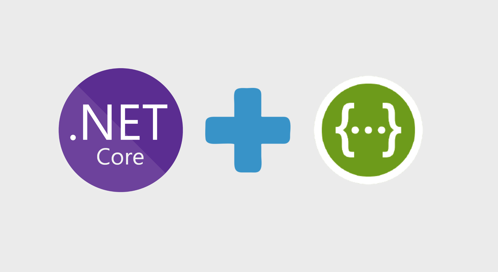

# Documentación con Swagger/OpenAPI en ASP.NET Core

- [Documentación con Swagger/OpenAPI en ASP.NET Core](#documentación-con-swaggeropenapi-en-aspnet-core)
  - [CORS (Cross-Origin Resource Sharing)](#cors-cross-origin-resource-sharing)
    - [¿Qué es CORS?](#qué-es-cors)
    - [Importancia de CORS](#importancia-de-cors)
    - [Configuración de CORS en ASP. NET Core](#configuración-de-cors-en-asp-net-core)
      - [Política Permisiva (Desarrollo)](#política-permisiva-desarrollo)
      - [Política Restrictiva (Producción)](#política-restrictiva-producción)
      - [Múltiples Políticas](#múltiples-políticas)
  - [Swagger y OpenAPI](#swagger-y-openapi)
    - [¿Qué es OpenAPI?](#qué-es-openapi)
    - [¿Qué es Swagger?](#qué-es-swagger)
    - [Instalación de Swashbuckle](#instalación-de-swashbuckle)
    - [Configuración Básica](#configuración-básica)
    - [Configuración Avanzada](#configuración-avanzada)
  - [Documentar Endpoints](#documentar-endpoints)
    - [Atributos de Documentación](#atributos-de-documentación)
    - [Ejemplo Completo de Endpoint Documentado](#ejemplo-completo-de-endpoint-documentado)
  - [Documentar Modelos y DTOs](#documentar-modelos-y-dtos)
    - [Atributos de Schema](#atributos-de-schema)
    - [Ejemplo Completo de Modelo Documentado](#ejemplo-completo-de-modelo-documentado)
  - [Documentar Autenticación JWT](#documentar-autenticación-jwt)
    - [Configuración de Seguridad en Swagger](#configuración-de-seguridad-en-swagger)
    - [Uso en Swagger UI](#uso-en-swagger-ui)
  - [Documentar Respuestas de Error](#documentar-respuestas-de-error)
    - [Modelo de Error](#modelo-de-error)
    - [Uso en Endpoints](#uso-en-endpoints)
  - [Versionado de API](#versionado-de-api)
    - [Instalación](#instalación)
    - [Configuración](#configuración)
    - [Uso en Controladores](#uso-en-controladores)
  - [Ejemplos de Solicitudes](#ejemplos-de-solicitudes)
  - [Filtros Personalizados](#filtros-personalizados)
    - [Filtro para Agregar Ejemplos](#filtro-para-agregar-ejemplos)
  - [Buenas Prácticas](#buenas-prácticas)
  - [Práctica de Clase](#práctica-de-clase)
  - [Proyecto del Curso](#proyecto-del-curso)



---

## CORS (Cross-Origin Resource Sharing)

### ¿Qué es CORS? 

**CORS** es un mecanismo de seguridad de los navegadores que **controla** las solicitudes HTTP entre diferentes dominios. 

**Sin CORS:**
```
https://mi-frontend.com → ❌ https://mi-api.com/api/funkos
```

**Con CORS configurado:**
```
https://mi-frontend.com → ✅ https://mi-api.com/api/funkos
```

---

### Importancia de CORS

✅ **Protección contra CSRF**: Evita ataques de falsificación de solicitudes entre sitios
✅ **Compartir recursos**: Permite que frontends en otros dominios accedan a tu API
✅ **Acceso controlado**: Solo dominios autorizados pueden consumir tu API
✅ **Seguridad**: Previene accesos no autorizados desde sitios maliciosos

---

### Configuración de CORS en ASP. NET Core

#### Política Permisiva (Desarrollo)

```csharp
var builder = WebApplication.CreateBuilder(args);

// Configurar CORS (desarrollo)
builder.Services.AddCors(options =>
{
    options.AddPolicy("AllowAll", policy =>
    {
        policy. AllowAnyOrigin()
              .AllowAnyMethod()
              .AllowAnyHeader();
    });
});

var app = builder.Build();

// Aplicar CORS
app.UseCors("AllowAll");

app.UseAuthentication();
app.UseAuthorization();
app.MapControllers();
app.Run();
```

⚠️ **Solo para desarrollo**.  No usar en producción. 

---

#### Política Restrictiva (Producción)

```csharp
builder.Services.AddCors(options =>
{
    options.AddPolicy("Production", policy =>
    {
        policy.WithOrigins(
                "https://mi-frontend.com",
                "https://admin.mi-frontend.com"
            )
            .WithMethods("GET", "POST", "PUT", "DELETE")
            .WithHeaders("Content-Type", "Authorization")
            .AllowCredentials(); // Permitir cookies
    });
});

var app = builder.Build();

app.UseCors("Production");
```

---

#### Múltiples Políticas

```csharp
builder.Services.AddCors(options =>
{
    // Política para API pública
    options.AddPolicy("PublicApi", policy =>
    {
        policy.AllowAnyOrigin()
              .WithMethods("GET")
              .AllowAnyHeader();
    });

    // Política para administración
    options.AddPolicy("AdminApi", policy =>
    {
        policy.WithOrigins("https://admin.mi-app.com")
              .AllowAnyMethod()
              .AllowAnyHeader()
              .AllowCredentials();
    });
});
```

**Uso en controladores:**

```csharp
[ApiController]
[Route("api/[controller]")]
[EnableCors("PublicApi")] // Aplicar política específica
public class FunkosController : ControllerBase
{
    // ... 
}

[ApiController]
[Route("api/admin/[controller]")]
[EnableCors("AdminApi")]
public class AdminController : ControllerBase
{
    // ...
}
```

---

## Swagger y OpenAPI

### ¿Qué es OpenAPI? 

**OpenAPI** es una especificación estándar para describir APIs REST (formato JSON/YAML).

**Beneficios:**
- ✅ Documentación estandarizada
- ✅ Generación automática de clientes
- ✅ Validación de contratos
- ✅ Pruebas interactivas

---

### ¿Qué es Swagger?

**Swagger** es un conjunto de herramientas para trabajar con OpenAPI: 
- **Swagger UI**: Interfaz interactiva para probar la API
- **Swagger Editor**: Editor en línea para especificaciones OpenAPI
- **Swagger Codegen**: Generación de clientes/servidores

---

### Instalación de Swashbuckle

```bash
dotnet add package Swashbuckle. AspNetCore
dotnet add package Swashbuckle.AspNetCore.Annotations
```

---

### Configuración Básica

```csharp
var builder = WebApplication.CreateBuilder(args);

builder.Services.AddControllers();
builder.Services.AddEndpointsApiExplorer();
builder.Services.AddSwaggerGen();

var app = builder. Build();

// Habilitar Swagger en desarrollo
if (app.Environment.IsDevelopment())
{
    app.UseSwagger();
    app.UseSwaggerUI();
}

app.UseHttpsRedirection();
app.UseAuthorization();
app.MapControllers();
app.Run();
```

**Acceder a Swagger UI:**
```
https://localhost:5001/swagger/index.html
```

---

### Configuración Avanzada

```csharp
using Microsoft.OpenApi.Models;

builder.Services.AddSwaggerGen(options =>
{
    // Información general de la API
    options.SwaggerDoc("v1", new OpenApiInfo
    {
        Version = "v1.0.0",
        Title = "Funkos API",
        Description = "API REST para gestión de Funkos - Curso ASP.NET Core 2024",
        TermsOfService = new Uri("https://example.com/terms"),
        Contact = new OpenApiContact
        {
            Name = "Tu Nombre",
            Email = "tu. email@example.com",
            Url = new Uri("https://example.com/contact")
        },
        License = new OpenApiLicense
        {
            Name = "MIT License",
            Url = new Uri("https://opensource.org/licenses/MIT")
        }
    });

    // Incluir comentarios XML
    var xmlFile = $"{Assembly.GetExecutingAssembly().GetName().Name}.xml";
    var xmlPath = Path. Combine(AppContext.BaseDirectory, xmlFile);
    options.IncludeXmlComments(xmlPath);

    // Habilitar anotaciones
    options.EnableAnnotations();
});
```

**Habilitar comentarios XML en . csproj:**

```xml
<PropertyGroup>
  <GenerateDocumentationFile>true</GenerateDocumentationFile>
  <NoWarn>$(NoWarn);1591</NoWarn>
</PropertyGroup>
```

---

## Documentar Endpoints

### Atributos de Documentación

```csharp
using Swashbuckle.AspNetCore.Annotations;

[ApiController]
[Route("api/[controller]")]
[Produces("application/json")]
[SwaggerTag("Gestión de Funkos")]
public class FunkosController : ControllerBase
{
    /// <summary>
    /// Obtiene todos los funkos con paginación
    /// </summary>
    /// <param name="pageNumber">Número de página (default: 1)</param>
    /// <param name="pageSize">Tamaño de página (default: 10)</param>
    /// <returns>Lista paginada de funkos</returns>
    /// <response code="200">Devuelve la lista de funkos</response>
    [HttpGet]
    [SwaggerOperation(
        Summary = "Obtener todos los funkos",
        Description = "Devuelve una lista paginada de funkos con filtros opcionales",
        OperationId = "GetAllFunkos",
        Tags = new[] { "Funkos" }
    )]
    [SwaggerResponse(200, "Lista de funkos obtenida correctamente", typeof(PageResponse<FunkoResponseDto>))]
    [SwaggerResponse(400, "Parámetros inválidos")]
    public async Task<ActionResult<PageResponse<FunkoResponseDto>>> GetAll(
        [FromQuery, SwaggerParameter("Número de página", Required = false)] int pageNumber = 1,
        [FromQuery, SwaggerParameter("Tamaño de página", Required = false)] int pageSize = 10)
    {
        // ... 
    }

    /// <summary>
    /// Obtiene un funko por su ID
    /// </summary>
    /// <param name="id">ID del funko</param>
    /// <returns>Funko encontrado</returns>
    /// <response code="200">Devuelve el funko</response>
    /// <response code="404">Funko no encontrado</response>
    [HttpGet("{id}")]
    [SwaggerOperation(Summary = "Obtener funko por ID")]
    [SwaggerResponse(200, "Funko encontrado", typeof(FunkoResponseDto))]
    [SwaggerResponse(404, "Funko no encontrado", typeof(ProblemDetails))]
    public async Task<ActionResult<FunkoResponseDto>> GetById(
        [FromRoute, SwaggerParameter("ID del funko", Required = true)] int id)
    {
        // ...
    }

    /// <summary>
    /// Crea un nuevo funko
    /// </summary>
    /// <param name="dto">Datos del funko a crear</param>
    /// <returns>Funko creado</returns>
    /// <response code="201">Funko creado correctamente</response>
    /// <response code="400">Datos inválidos</response>
    /// <response code="401">No autorizado</response>
    [HttpPost]
    [Authorize(Roles = Roles.Admin)]
    [SwaggerOperation(Summary = "Crear nuevo funko", Description = "Solo administradores")]
    [SwaggerResponse(201, "Funko creado", typeof(FunkoResponseDto))]
    [SwaggerResponse(400, "Datos inválidos", typeof(ValidationProblemDetails))]
    [SwaggerResponse(401, "No autorizado")]
    public async Task<ActionResult<FunkoResponseDto>> Create(
        [FromBody, SwaggerRequestBody("Datos del funko", Required = true)] CreateFunkoDto dto)
    {
        // ...
    }
}
```

---

### Ejemplo Completo de Endpoint Documentado

```csharp
/// <summary>
/// Actualiza un funko existente
/// </summary>
/// <param name="id">ID del funko a actualizar</param>
/// <param name="dto">Nuevos datos del funko</param>
/// <returns>Funko actualizado</returns>
/// <response code="200">Funko actualizado correctamente</response>
/// <response code="400">Datos inválidos</response>
/// <response code="401">No autorizado</response>
/// <response code="404">Funko no encontrado</response>
[HttpPut("{id}")]
[Authorize(Roles = Roles.Admin)]
[SwaggerOperation(
    Summary = "Actualizar funko",
    Description = "Actualiza todos los campos de un funko.  Solo administradores pueden ejecutar esta operación.",
    OperationId = "UpdateFunko"
)]
[SwaggerResponse(200, "Funko actualizado correctamente", typeof(FunkoResponseDto))]
[SwaggerResponse(400, "Datos inválidos o incompletos", typeof(ValidationProblemDetails))]
[SwaggerResponse(401, "Usuario no autenticado")]
[SwaggerResponse(403, "Usuario no tiene permisos de administrador")]
[SwaggerResponse(404, "Funko no encontrado", typeof(ProblemDetails))]
public async Task<ActionResult<FunkoResponseDto>> Update(
    [FromRoute, SwaggerParameter("ID del funko", Required = true)] int id,
    [FromBody, SwaggerRequestBody("Datos actualizados del funko", Required = true)] UpdateFunkoDto dto)
{
    var result = await _service.UpdateAsync(id, dto);
    return result. Match<ActionResult<FunkoResponseDto>>(
        success => Ok(success),
        error => error switch
        {
            FunkoError. NotFound => NotFound(new ProblemDetails { Detail = error.Message }),
            FunkoError.InvalidData => BadRequest(new ValidationProblemDetails()),
            _ => StatusCode(500)
        }
    );
}
```

---

## Documentar Modelos y DTOs

### Atributos de Schema

```csharp
using System.ComponentModel;
using System.ComponentModel.DataAnnotations;
using Swashbuckle.AspNetCore.Annotations;

/// <summary>
/// DTO para crear un funko
/// </summary>
[SwaggerSchema(Description = "Datos necesarios para crear un funko")]
public record CreateFunkoDto
{
    /// <summary>
    /// Nombre del funko
    /// </summary>
    /// <example>Iron Man</example>
    [Required(ErrorMessage = "El nombre es obligatorio")]
    [StringLength(100, MinimumLength = 3, ErrorMessage = "El nombre debe tener entre 3 y 100 caracteres")]
    [SwaggerSchema(Description = "Nombre del funko", Nullable = false)]
    public string Nombre { get; init; } = string.Empty;

    /// <summary>
    /// Precio del funko en euros
    /// </summary>
    /// <example>29.99</example>
    [Required(ErrorMessage = "El precio es obligatorio")]
    [Range(0.01, 9999.99, ErrorMessage = "El precio debe estar entre 0.01 y 9999.99")]
    [SwaggerSchema(Description = "Precio del funko en euros", Format = "decimal", Nullable = false)]
    public decimal Precio { get; init; }

    /// <summary>
    /// Cantidad en stock
    /// </summary>
    /// <example>10</example>
    [Required(ErrorMessage = "La cantidad es obligatoria")]
    [Range(0, int.MaxValue, ErrorMessage = "La cantidad no puede ser negativa")]
    [SwaggerSchema(Description = "Cantidad disponible en stock", Nullable = false)]
    public int Cantidad { get.  init; }

    /// <summary>
    /// Categoría del funko
    /// </summary>
    /// <example>Marvel</example>
    [Required(ErrorMessage = "La categoría es obligatoria")]
    [StringLength(50, ErrorMessage = "La categoría no puede exceder 50 caracteres")]
    [SwaggerSchema(Description = "Categoría a la que pertenece el funko", Nullable = false)]
    public string Categoria { get.  init; } = string.Empty;

    /// <summary>
    /// URL de la imagen del funko
    /// </summary>
    /// <example>https://example.com/images/ironman.jpg</example>
    [Url(ErrorMessage = "La imagen debe ser una URL válida")]
    [SwaggerSchema(Description = "URL de la imagen del funko", Format = "uri", Nullable = true)]
    public string? Imagen { get. init; }
}
```

---

### Ejemplo Completo de Modelo Documentado

```csharp
/// <summary>
/// Respuesta de un funko
/// </summary>
[SwaggerSchema(Description = "Representación completa de un funko")]
public record FunkoResponseDto
{
    /// <summary>
    /// Identificador único del funko
    /// </summary>
    /// <example>1</example>
    [SwaggerSchema(Description = "ID único del funko", ReadOnly = true)]
    public int Id { get.  init; }

    /// <summary>
    /// Nombre del funko
    /// </summary>
    /// <example>Spider-Man</example>
    [SwaggerSchema(Description = "Nombre del funko")]
    public string Nombre { get. init; } = string.Empty;

    /// <summary>
    /// Precio del funko
    /// </summary>
    /// <example>34.99</example>
    [SwaggerSchema(Description = "Precio en euros", Format = "decimal")]
    public decimal Precio { get. init; }

    /// <summary>
    /// Cantidad disponible
    /// </summary>
    /// <example>5</example>
    [SwaggerSchema(Description = "Stock disponible")]
    public int Cantidad { get. init; }

    /// <summary>
    /// Categoría
    /// </summary>
    /// <example>Marvel</example>
    [SwaggerSchema(Description = "Categoría del funko")]
    public string Categoria { get. init; } = string.Empty;

    /// <summary>
    /// URL de la imagen
    /// </summary>
    /// <example>https://example.com/images/spiderman.jpg</example>
    [SwaggerSchema(Description = "URL de la imagen", Format = "uri")]
    public string? Imagen { get. init; }

    /// <summary>
    /// Fecha de creación
    /// </summary>
    /// <example>2024-01-15T10:30:00Z</example>
    [SwaggerSchema(Description = "Fecha de creación del registro", Format = "date-time", ReadOnly = true)]
    public DateTime FechaCreacion { get. init; }

    /// <summary>
    /// Fecha de última actualización
    /// </summary>
    /// <example>2024-01-20T15:45:00Z</example>
    [SwaggerSchema(Description = "Fecha de última actualización", Format = "date-time", ReadOnly = true)]
    public DateTime?  FechaActualizacion { get. init; }
}
```

---

## Documentar Autenticación JWT

### Configuración de Seguridad en Swagger

```csharp
builder.Services.AddSwaggerGen(options =>
{
    // Configuración anterior...

    // Definir esquema de seguridad JWT
    options.AddSecurityDefinition("Bearer", new OpenApiSecurityScheme
    {
        Name = "Authorization",
        Type = SecuritySchemeType.Http,
        Scheme = "Bearer",
        BearerFormat = "JWT",
        In = ParameterLocation.Header,
        Description = "Ingrese 'Bearer' seguido de un espacio y el token JWT.\n\nEjemplo: \"Bearer eyJhbGciOiJIUzI1NiIsInR5cCI6IkpXVCJ9...\""
    });

    // Aplicar esquema de seguridad globalmente
    options.AddSecurityRequirement(new OpenApiSecurityRequirement
    {
        {
            new OpenApiSecurityScheme
            {
                Reference = new OpenApiReference
                {
                    Type = ReferenceType.SecurityScheme,
                    Id = "Bearer"
                }
            },
            Array.Empty<string>()
        }
    });
});
```

---

### Uso en Swagger UI

1. **Hacer clic en "Authorize"** (botón con candado)
2. **Ingresar token**: 
   ```
   Bearer eyJhbGciOiJIUzI1NiIsInR5cCI6IkpXVCJ9...
   ```
3. **Probar endpoints protegidos**

---

## Documentar Respuestas de Error

### Modelo de Error

```csharp
/// <summary>
/// Detalle de un error
/// </summary>
[SwaggerSchema(Description = "Información detallada de un error")]
public class ApiError
{
    /// <summary>
    /// Código de estado HTTP
    /// </summary>
    /// <example>404</example>
    [SwaggerSchema(Description = "Código HTTP del error")]
    public int Status { get.  set; }

    /// <summary>
    /// Título del error
    /// </summary>
    /// <example>Recurso no encontrado</example>
    [SwaggerSchema(Description = "Descripción breve del error")]
    public string Title { get. set; } = string.Empty;

    /// <summary>
    /// Detalle del error
    /// </summary>
    /// <example>El funko con ID 999 no existe</example>
    [SwaggerSchema(Description = "Explicación detallada del error")]
    public string Detail { get. set; } = string.Empty;

    /// <summary>
    /// Timestamp del error
    /// </summary>
    /// <example>2024-01-20T10:30:00Z</example>
    [SwaggerSchema(Description = "Momento en que ocurrió el error", Format = "date-time")]
    public DateTime Timestamp { get. set; } = DateTime.UtcNow;
}
```

---

### Uso en Endpoints

```csharp
[HttpGet("{id}")]
[SwaggerOperation(Summary = "Obtener funko por ID")]
[SwaggerResponse(200, "Funko encontrado", typeof(FunkoResponseDto))]
[SwaggerResponse(404, "Funko no encontrado", typeof(ApiError))]
[SwaggerResponse(500, "Error interno del servidor", typeof(ApiError))]
public async Task<ActionResult<FunkoResponseDto>> GetById(int id)
{
    try
    {
        var funko = await _service.GetByIdAsync(id);
        if (funko is null)
        {
            return NotFound(new ApiError
            {
                Status = 404,
                Title = "Funko no encontrado",
                Detail = $"No existe un funko con ID {id}"
            });
        }
        return Ok(funko);
    }
    catch (Exception ex)
    {
        return StatusCode(500, new ApiError
        {
            Status = 500,
            Title = "Error interno",
            Detail = ex.Message
        });
    }
}
```

---

## Versionado de API

### Instalación

```bash
dotnet add package Microsoft.AspNetCore.Mvc. Versioning
dotnet add package Microsoft.AspNetCore. Mvc.Versioning.ApiExplorer
```

---

### Configuración

```csharp
builder.Services.AddApiVersioning(options =>
{
    options. AssumeDefaultVersionWhenUnspecified = true;
    options.DefaultApiVersion = new ApiVersion(1, 0);
    options.ReportApiVersions = true;
});

builder.Services.AddVersionedApiExplorer(options =>
{
    options.GroupNameFormat = "'v'VVV";
    options.SubstituteApiVersionInUrl = true;
});

builder.Services.AddSwaggerGen(options =>
{
    options.SwaggerDoc("v1", new OpenApiInfo { Title = "Funkos API", Version = "v1" });
    options.SwaggerDoc("v2", new OpenApiInfo { Title = "Funkos API", Version = "v2" });
});

var app = builder.Build();

app.UseSwagger();
app.UseSwaggerUI(options =>
{
    options.SwaggerEndpoint("/swagger/v1/swagger.json", "Funkos API V1");
    options.SwaggerEndpoint("/swagger/v2/swagger.json", "Funkos API V2");
});
```

---

### Uso en Controladores

```csharp
[ApiController]
[ApiVersion("1.0")]
[Route("api/v{version:apiVersion}/[controller]")]
public class FunkosV1Controller : ControllerBase
{
    // Endpoints V1
}

[ApiController]
[ApiVersion("2.0")]
[Route("api/v{version: apiVersion}/[controller]")]
public class FunkosV2Controller : ControllerBase
{
    // Endpoints V2
}
```

---

## Ejemplos de Solicitudes

```csharp
[HttpPost]
[SwaggerOperation(
    Summary = "Crear funko",
    Description = "Crea un nuevo funko con los datos proporcionados"
)]
[SwaggerRequestExample(typeof(CreateFunkoDto), typeof(CreateFunkoExample))]
public async Task<ActionResult<FunkoResponseDto>> Create(CreateFunkoDto dto)
{
    // ...
}

public class CreateFunkoExample :  IExamplesProvider<CreateFunkoDto>
{
    public CreateFunkoDto GetExamples()
    {
        return new CreateFunkoDto
        {
            Nombre = "Iron Man Mark 50",
            Precio = 34.99m,
            Cantidad = 15,
            Categoria = "Marvel",
            Imagen = "https://example.com/images/ironman-mk50.jpg"
        };
    }
}
```

---

## Filtros Personalizados

### Filtro para Agregar Ejemplos

```csharp
public class SwaggerExamplesFilter : IOperationFilter
{
    public void Apply(OpenApiOperation operation, OperationFilterContext context)
    {
        if (operation.RequestBody?. Content != null)
        {
            foreach (var content in operation.RequestBody.Content)
            {
                if (content.Key == "application/json")
                {
                    content.Value. Example = new OpenApiString(@"{
                        ""nombre"": ""Batman"",
                        ""precio"": 29.99,
                        ""cantidad"": 10,
                        ""categoria"": ""DC"",
                        ""imagen"":  ""https://example.com/batman.jpg""
                    }");
                }
            }
        }
    }
}

// Registrar filtro
builder.Services.AddSwaggerGen(options =>
{
    options. OperationFilter<SwaggerExamplesFilter>();
});
```

---

## Buenas Prácticas

✅ **Documentar todos los endpoints**:  Incluye resúmenes y descripciones

✅ **Documentar parámetros**:  Explica qué espera cada parámetro

✅ **Documentar respuestas**:  Incluye todos los códigos HTTP posibles

✅ **Ejemplos claros**: Proporciona ejemplos realistas

✅ **Modelos documentados**: Documenta todos los DTOs y modelos

✅ **Versionado**: Versiona tu API desde el inicio

✅ **Autenticación**: Documenta cómo autenticarse

✅ **Errores**: Documenta todos los posibles errores

---

## Práctica de Clase

**Objetivo**: Documentar completamente la API de Funkos con Swagger.  

**Tareas:**

1. ✅ Configurar Swagger con información completa de la API
2. ✅ Documentar todos los endpoints de Funkos
3. ✅ Documentar todos los DTOs (CreateFunkoDto, UpdateFunkoDto, FunkoResponseDto)
4. ✅ Configurar autenticación JWT en Swagger
5. ✅ Documentar respuestas de error
6. ✅ Agregar ejemplos a las solicitudes
7. ✅ Configurar CORS para permitir acceso desde frontend
8. ✅ Probar todos los endpoints desde Swagger UI

**Criterios de evaluación:**

- ✅ Swagger configurado correctamente
- ✅ Todos los endpoints documentados
- ✅ DTOs documentados con ejemplos
- ✅ Autenticación JWT funciona en Swagger
- ✅ Códigos de respuesta documentados
- ✅ CORS configurado correctamente
- ✅ Swagger UI funcional y fácil de usar

---

## Proyecto del Curso

Puedes encontrar el proyecto con Swagger completamente configurado en el repositorio del curso.