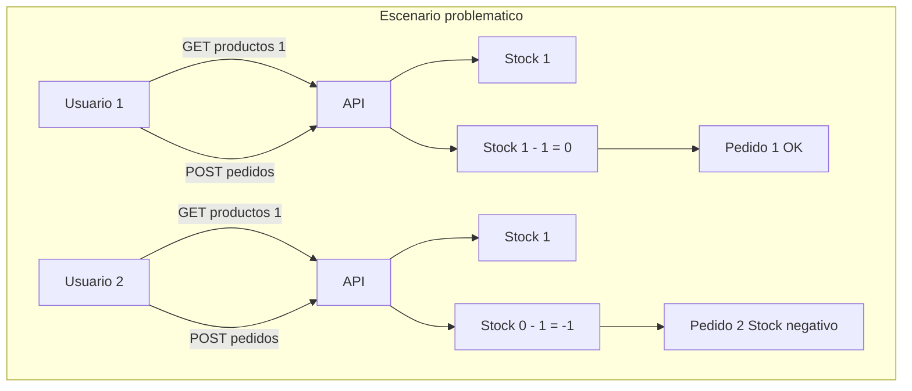
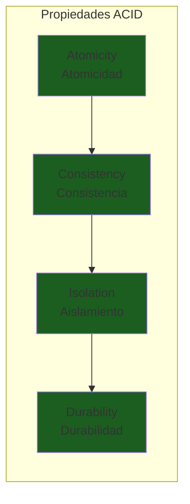
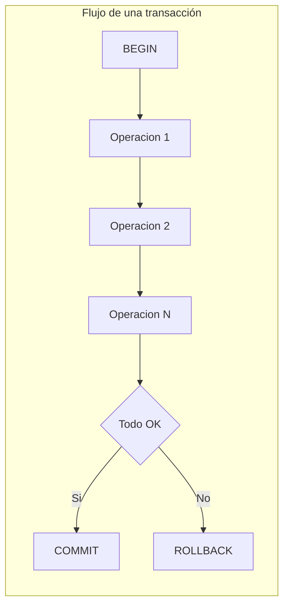
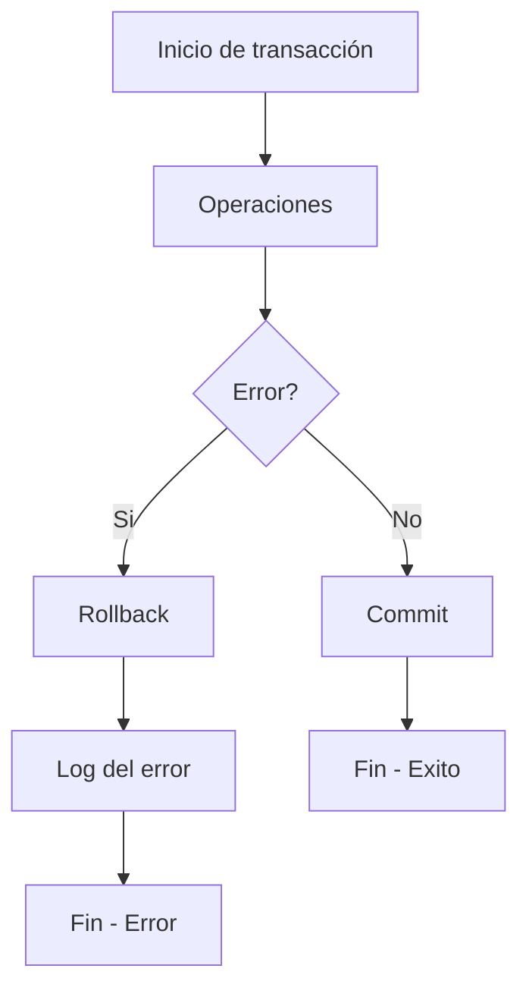
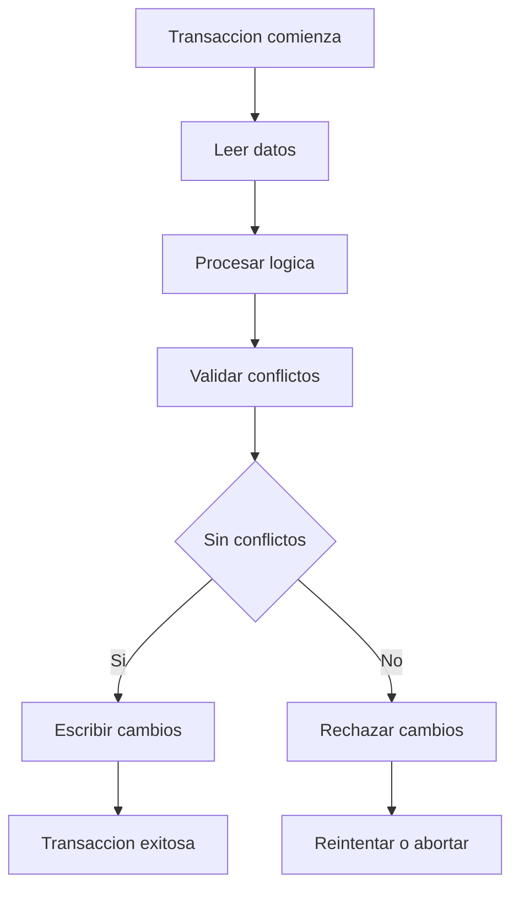
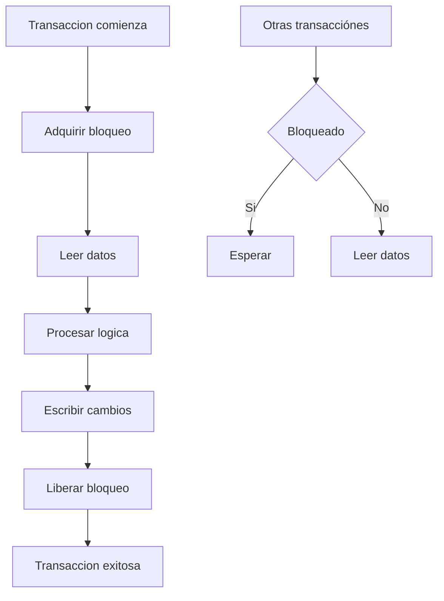
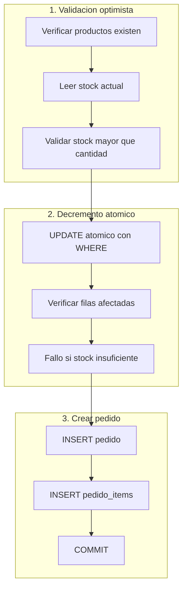
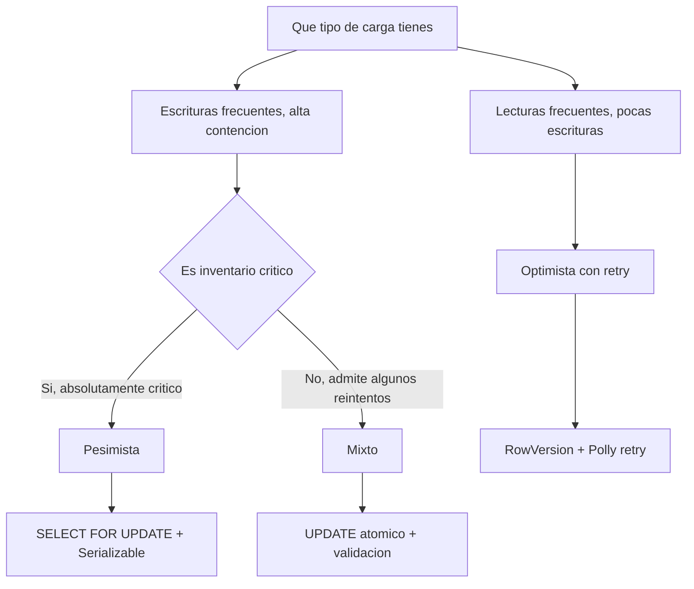
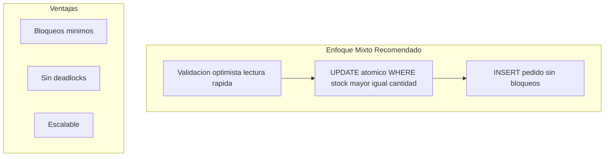

# 13. Transacciones y Control de Concurrencia

## Indice

- [13. Transacciones y Control de Concurrencia](#13-transacciónes-y-control-de-concurrencia)
  - [13.1. El Problema de la Concurrencia en Pedidos](#131-el-problema-de-la-concurrencia-en-pedidos)
    - [13.1.1. Escenario Real: Venta del Ultimo Producto](#1311-escenario-real-venta-del-ultimo-producto)
    - [13.1.2. Impacto del Problema](#1312-impacto-del-problema)
  - [13.2. Conceptos Fundamentales de Transacciones](#132-conceptos-fundamentales-de-transacciónes)
    - [13.2.1. Que es una Transaccion](#1321-que-es-una-transacción)
    - [13.2.2. Propiedades ACID](#1322-propiedades-acid)
    - [13.2.3. Transacciones en EF Core](#1323-transacciónes-en-ef-core)
  - [13.3. Implementacion de Transacciones](#133-implementacion-de-transacciónes)
    - [13.3.1. Transaccion Implicita con SaveChanges](#1331-transacción-implicita-con-savechanges)
    - [13.3.2. Transaccion Explicita](#1332-transacción-explicita)
    - [13.3.3. Manejo de Errores y Rollback](#1333-manejo-de-errores-y-rollback)
  - [13.4. Enfoque Optimista](#134-enfoque-optimista)
    - [13.4.1. Concepto y Caracteristicas](#1341-concepto-y-caracteristicas)
    - [13.4.2. Implementacion con RowVersion](#1342-implementacion-con-rowversion)
    - [13.4.3. Manejo de DbUpdateConcurrencyException](#1343-manejo-de-dbupdateconcurrencyexception)
    - [13.4.4. Reintentos Automaticos con Polly](#1344-reintentos-automaticos-con-polly)
  - [13.5. Enfoque Pesimista](#135-enfoque-pesimista)
    - [13.5.1. Concepto y Caracteristicas](#1351-concepto-y-caracteristicas)
    - [13.5.2. Niveles de Aislamiento](#1352-niveles-de-aislamiento)
    - [13.5.3. SELECT FOR UPDATE](#1353-select-for-update)
    - [13.5.4. Serializable Isolation](#1354-serializable-isolation)
  - [13.6. Enfoque Mixto](#136-enfoque-mixto)
    - [13.6.1. Arquitectura del Enfoque Mixto](#1361-arquitectura-del-enfoque-mixto)
    - [13.6.2. Fase 1: Validacion Optimista](#1362-fase-1-validacion-optimista)
    - [13.6.3. Fase 2: Decremento Atomico](#1363-fase-2-decremento-atomico)
    - [13.6.4. Fase 3: Crear Pedido](#1364-fase-3-crear-pedido)
  - [13.7. Comparativa de Enfoques](#137-comparativa-de-enfoques)
    - [13.7.1. Tabla Comparativa](#1371-tabla-comparativa)
    - [13.7.2. Cuando Usar Cada Enfoque](#1372-cuando-usar-cada-enfoque)
  - [13.8. Errores de Dominio](#138-errores-de-dominio)
  - [13.9. Controller](#139-controller)
  - [13.10. Testing](#1310-testing)
    - [13.10.1. Unit Testing de Transacciones](#13101-unit-testing-de-transacciónes)
    - [13.10.2. Unit Testing de Concurrencia Optimista](#13102-unit-testing-de-concurrencia-optimista)
    - [13.10.3. Integration Testing](#13103-integration-testing)
  - [13.11. Buenas Practicas](#1311-buenas-practicas)
  - [13.12. Resumen](#1312-resumen)

---

# 13. Transacciones y Control de Concurrencia

## 13.1. El Problema de la Concurrencia en Pedidos

Cuando multiples usuarios intentan comprar el mismo producto simultaneamente, surgen problemas de concurrencia que pueden llevar a inconsistencias en el inventario. Sin mecanismos adecuados, podriamos vender mas productos de los que realmente tenemos en stock.



### 13.1.1. Escenario Real: Venta del Ultimo Producto

Imaginemos que tenemos un producto con stock = 1. Dos usuarios intentan comprarlo al mismo tiempo:

| Tiempo | Usuario 1 | Usuario 2 | Stock en DB |
|--------|-----------|-----------|-------------|
| T1 | Lee producto | - | 1 |
| T2 | - | Lee producto | 1 |
| T3 | Crea pedido | - | 1 |
| T4 | Decrementa stock | - | 0 |
| T5 | - | Crea pedido | 0 |
| T6 | - | Decrementa stock | **-1** |

El resultado es que vendemos 2 productos cuando solo teniamos 1 en stock.

### 13.1.2. Impacto del Problema

| Problema | Impacto | Solucion |
|----------|---------|----------|
| Stock negativo | Inventario inconsistente | Validacion de stock mayor que 0 |
| Sobrecarga de pedidos | Frustracion del cliente | Cancelacion automatica |
| Perdida de ventas | Impacto economico | Notificacion al usuario |
| Datos corruptos | Reportes incorrectos | Transacciones atomicas |

📝 **Nota del Profesor**: Este es uno de los problemas mas criticos en aplicaciones de comercio electronico. Un error aqui puede significar perdidas economicas reales y problemas legales con clientes.

## 13.2. Conceptos Fundamentales de Transacciones

### 13.2.1. Que es una Transaccion

Una **transacción** es un conjunto de operaciones que se ejecutan como una unidad indivisible. Todas las operaciones se completan exitosamente o ninguna se aplica, garantizando la consistencia de los datos.

🧠 **Analogia**: Piensa en una transacción como transferir dinero entre dos cuentas bancarias. No puedes sacar dinero de una cuenta sin asegurarte de que se deposite en la otra. Si algo falla a mitad del proceso, todo debe revertirse.

### 13.2.2. Propiedades ACID



| Propiedad | Descripcion | Ejemplo |
|-----------|-------------|---------|
| **Atomicidad** | Todo o nada | Si el pedido falla, el stock no se decrementa |
| **Consistencia** | Datos siempre validos | Stock nunca negativo, pedidos siempre validos |
| **Aislamiento** | Transacciones paralelas no interfieren | Dos pedidos del mismo producto se procesan secuencialmente |
| **Durabilidad** | Commits persistentes | Si el servidor cae despues del commit, los datos sobreviven |

### 13.2.3. Transacciones en EF Core



## 13.3. Implementacion de Transacciones

### 13.3.1. Transaccion Implicita con SaveChanges

Por defecto, EF Core envuelve cada llamada a `SaveChanges()` en una transacción implicita:

```csharp
// Cada SaveChanges es una transacción automatica
_context.Productos.Add(producto);
await _context.SaveChangesAsync();  // Transaccion automatica

_context.Pedidos.Add(pedido);
await _context.SaveChangesAsync();  // Otra transacción automatica
```

**Problema**: Si tienes multiples operaciones que deben ser atomicas, necesitas una transacción explicita.

### 13.3.2. Transaccion Explicita

```csharp
using Microsoft.EntityFrameworkCore;
using Microsoft.EntityFrameworkCore.Storage;

public class PedidoService(TiendaDbContext context, ILogger<PedidoService> logger)
{
    public async Task<Result<Pedido, Error>> CreatePedidoAsync(
        CreatePedidoRequest request)
    {
        // Usar transacción explicita
        await using var transaction = await context.Database.BeginTransactionAsync();

        try
        {
            // 1. Verificar productos y stock
            var productos = await context.Productos
                .Where(p => request.Items.Select(i => i.ProductoId).Contains(p.Id))
                .ToListAsync();

            // Validar que todos los productos existen
            if (productos.Count != request.Items.Count)
            {
                await transaction.RollbackAsync();
                return Result.Failure<Pedido, Error>(Errors.Pedidos.ProductoNoEncontrado);
            }

            // 2. Validar stock disponible
            foreach (var item in request.Items)
            {
                var producto = productos.First(p => p.Id == item.ProductoId);
                if (producto.Stock < item.Cantidad)
                {
                    await transaction.RollbackAsync();
                    return Result.Failure<Pedido, Error>(
                        Errors.Pedidos.StockInsuficiente(
                            producto.Nombre, 
                            producto.Stock, 
                            item.Cantidad));
                }
            }

            // 3. Crear el pedido
            var pedido = new Pedido
            {
                UsuarioId = request.UsuarioId,
                Estado = PedidoEstado.Pendiente,
                CreatedAt = DateTime.UtcNow,
                Items = request.Items.Select(item => new PedidoItem
                {
                    ProductoId = item.ProductoId,
                    Cantidad = item.Cantidad,
                    PrecioUnitario = productos.First(p => p.Id == item.ProductoId).Precio
                }).ToList()
            };

            context.Pedidos.Add(pedido);

            // 4. Decrementar stock
            foreach (var item in request.Items)
            {
                var producto = await context.Productos
                    .FirstAsync(p => p.Id == item.ProductoId);
                producto.Stock -= item.Cantidad;
            }

            // 5. Guardar cambios (dentro de la transacción)
            await context.SaveChangesAsync();

            // 6. Commit de la transacción
            await transaction.CommitAsync();

            logger.LogInformation(
                "Pedido {PedidoId} creado exitosamente para usuario {UsuarioId}",
                pedido.Id, pedido.UsuarioId);

            return pedido;
        }
        catch (Exception ex)
        {
            await transaction.RollbackAsync();
            _logger.LogError(ex, "Error creando pedido para usuario {UsuarioId}", 
                request.UsuarioId);
            
            return Result.Failure<Pedido, Error>(Errors.Pedidos.ErrorInesperado);
        }
    }
}
```

### 13.3.3. Manejo de Errores y Rollback



**Regla de Oro**: Siempre hacer rollback en el bloque catch, incluso si el error es esperado.

## 13.4. Enfoque Optimista

### 13.4.1. Concepto y Caracteristicas

El **control de concurrencia optimista** asume que los conflictos son raros y permite que las transacciónes procedan sin bloqueos. Los cambios se validan al final, y si otro proceso ha modificado los datos, se rechaza la transacción.



| Aspecto | Descripcion |
|---------|-------------|
| **Suposicion** | Pocos conflictos entre transacciónes |
| **Bloqueos** | Sin bloqueos durante la ejecucion |
| **Validacion** | Al final, verificando versiones |
| **Rendimiento** | Mejor cuando conflictos son raros |
| **Casos de uso** | Lecturas frecuentes, escrituras pocas |

### 13.4.2. Implementacion con RowVersion

```csharp
// Entity con RowVersion para optimistic concurrency
public class Producto
{
    public long Id { get; set; }
    public string Nombre { get; set; } = string.Empty;
    public decimal Precio { get; set; }
    public int Stock { get; set; }
    
    // Timestamp de version para concurrency
    [Timestamp]
    public byte[] RowVersion { get; set; } = null!;
}

// En Fluent API
modelBuilder.Entity<Producto>(entity =>
{
    entity.Property(p => p.RowVersion)
          .IsRowVersion();
});
```

### 13.4.3. Manejo de DbUpdateConcurrencyException

```csharp
public class PedidoService
{
    private readonly TiendaDbContext _context;
    private readonly ILogger<PedidoService> _logger;

    public async Task<Result<Pedido, Error>> CreatePedidoConOptimisticLockAsync(
        CreatePedidoRequest request)
    {
        await using var transaction = await _context.Database.BeginTransactionAsync();

        try
        {
            var productos = new List<Producto>();

            foreach (var item in request.Items)
            {
                // EF Core genera UPDATE con WHERE RowVersion = valor_leido
                var producto = await _context.Productos
                    .FirstOrDefaultAsync(p => p.Id == item.ProductoId);

                if (producto == null)
                {
                    await transaction.RollbackAsync();
                    return Result.Failure<Pedido, Error>(
                        Errors.Productos.NoEncontrados);
                }

                if (producto.Stock < item.Cantidad)
                {
                    await transaction.RollbackAsync();
                    return Result.Failure<Pedido, Error>(
                        Errors.Pedidos.StockInsuficiente(
                            producto.Nombre, producto.Stock, item.Cantidad));
                }

                productos.Add(producto);
            }

            foreach (var item in request.Items)
            {
                var producto = await _context.Productos
                    .FirstAsync(p => p.Id == item.ProductoId);
                producto.Stock -= item.Cantidad;
            }

            var pedido = new Pedido
            {
                UsuarioId = request.UsuarioId,
                Estado = PedidoEstado.Pendiente,
                CreatedAt = DateTime.UtcNow,
                Items = request.Items.Select(item => new PedidoItem
                {
                    ProductoId = item.ProductoId,
                    Cantidad = item.Cantidad,
                    PrecioUnitario = productos
                        .First(p => p.Id == item.ProductoId).Precio
                }).ToList()
            };

            _context.Pedidos.Add(pedido);
            await _context.SaveChangesAsync();

            await transaction.CommitAsync();

            return pedido;
        }
        catch (DbUpdateConcurrencyException ex)
        {
            await transaction.RollbackAsync();
            
            var entry = ex.Entries.First();
            var databaseValues = await entry.GetDatabaseValuesAsync();
            
            if (databaseValues == null)
            {
                _logger.LogWarning("El producto fue eliminado por otro proceso");
                return Result.Failure<Pedido, Error>(
                    Errors.Productos.NoEncontrados);
            }

            _logger.LogWarning(
                "Conflicto de concurrencia: el stock fue modificado. " +
                "Valor actual en DB: {Stock}", 
                databaseValues.GetValue<int>("Stock"));

            return Result.Failure<Pedido, Error>(
                Errors.Pedidos.ConflictoConcurrencia);
        }
        catch (Exception ex)
        {
            await transaction.RollbackAsync();
            _logger.LogError(ex, "Error creando pedido");
            return Result.Failure<Pedido, Error>(Errors.Pedidos.ErrorInesperado);
        }
    }
}
```

### 13.4.4. Reintentos Automaticos con Polly

```csharp
using Polly;
using Polly.Retry;

public class PedidoService
{
    private readonly AsyncRetryPolicy _retryPolicy;

    public PedidoService()
    {
        _retryPolicy = Policy
            .Handle<DbUpdateConcurrencyException>()
            .WaitAndRetryAsync(
                retryCount: 3,
                sleepDurationProvider: retryAttempt => 
                    TimeSpan.FromMilliseconds(100 * Math.Pow(2, retryAttempt)),
                onRetry: (outcome, timespan, retryAttempt, context) =>
                {
                    Console.WriteLine($"Reintento {retryAttempt}...");
                });
    }

    public async Task<Result<Pedido, Error>> CreatePedidoAsync(
        CreatePedidoRequest request)
    {
        return await _retryPolicy.ExecuteAsync(async () =>
        {
            return await CreatePedidoInternoAsync(request);
        });
    }
}
```

## 13.5. Enfoque Pesimista

### 13.5.1. Concepto y Caracteristicas

El **control de concurrencia pesimista** asume que los conflictos son frecuentes y utiliza bloqueos para prevenir que otros procesos accedan a los datos modificados.



| Aspecto | Descripcion |
|---------|-------------|
| **Suposicion** | Conflictos frecuentes |
| **Bloqueos** | Adquiridos al leer, liberados al commit |
| **Rendimiento** | Peor con alta contencion |
| **Consistencia** | Garantizada siempre |
| **Casos de uso** | Inventario critico, financieras |

### 13.5.2. Niveles de Aislamiento

| Nivel | Dirty Read | Non-repeatable | Phantom | Bloqueo |
|-------|------------|----------------|---------|---------|
| **Read Uncommitted** | Permitido | Permitido | Permitido | Ninguno |
| **Read Committed** | Protegido | Permitido | Permitido | Filas |
| **Repeatable Read** | Protegido | Protegido | Permitido | Filas |
| **Serializable** | Protegido | Protegido | Protegido | Tabla |

### 13.5.3. SELECT FOR UPDATE

```csharp
public async Task<Result<Pedido, Error>> CreatePedidoConPesimistaAsync(
    CreatePedidoRequest request)
{
    await using var transaction = await _context.Database.BeginTransactionAsync();

    try
    {
        // Usar SQL nativo con SELECT FOR UPDATE para bloquear filas
        var productoIds = request.Items.Select(i => i.ProductoId).ToList();
        
        // FOR UPDATE bloquea las filas hasta el commit
        var productos = await _context.Productos
            .FromSqlInterpolated($@"
                SELECT * FROM Productos 
                WHERE Id IN ({string.Join(",", productoIds)})
                FOR UPDATE")
            .ToListAsync();

        if (productos.Count != productoIds.Count)
        {
            await transaction.RollbackAsync();
            return Result.Failure<Pedido, Error>(
                Errors.Pedidos.ProductoNoEncontrado);
        }

        foreach (var item in request.Items)
        {
            var producto = productos.First(p => p.Id == item.ProductoId);
            if (producto.Stock < item.Cantidad)
            {
                await transaction.RollbackAsync();
                return Result.Failure<Pedido, Error>(
                    Errors.Pedidos.StockInsuficiente(
                        producto.Nombre, producto.Stock, item.Cantidad));
            }
        }

        foreach (var item in request.Items)
        {
            var producto = await _context.Productos
                .FirstAsync(p => p.Id == item.ProductoId);
            producto.Stock -= item.Cantidad;
        }

        var pedido = new Pedido
        {
            UsuarioId = request.UsuarioId,
            Estado = PedidoEstado.Pendiente,
            CreatedAt = DateTime.UtcNow,
            Items = request.Items.Select(item => new PedidoItem
            {
                ProductoId = item.ProductoId,
                Cantidad = item.Cantidad,
                PrecioUnitario = productos
                    .First(p => p.Id == item.ProductoId).Precio
            }).ToList()
        };

        _context.Pedidos.Add(pedido);
        await _context.SaveChangesAsync();

        await transaction.CommitAsync();

        return pedido;
    }
    catch (Exception ex)
    {
        await transaction.RollbackAsync();
        _logger.LogError(ex, "Error creando pedido");
        return Result.Failure<Pedido, Error>(Errors.Pedidos.ErrorInesperado);
    }
}
```

### 13.5.4. Serializable Isolation

```csharp
public async Task<Result<Pedido, Error>> CreatePedidoSerializableAsync(
    CreatePedidoRequest request)
{
    // Usar aislamiento Serializable para maxima consistencia
    await using var transaction = await _context.Database
        .BeginTransactionAsync(IsolationLevel.Serializable);

    try
    {
        var productos = await _context.Productos
            .Where(p => request.Items.Select(i => i.ProductoId).Contains(p.Id))
            .ToListAsync();

        // ... resto de la logica ...

        await transaction.CommitAsync();
        return pedido;
    }
    catch (Exception ex)
    {
        await transaction.RollbackAsync();
        throw;
    }
}
```

## 13.6. Enfoque Mixto

### 13.6.1. Arquitectura del Enfoque Mixto

El **enfoque mixto** combina las ventajas de ambos metodos: usa operaciones atomicas para el decremento de stock (pesimista) y optimistic locking para la validacion general.



### 13.6.2. Fase 1: Validacion Optimista

```csharp
// FASE 1: Verificacion optimista
// Obtenemos productos sin bloquear para validar rapido
var productos = await _context.Productos
    .AsNoTracking()
    .Where(p => request.Items.Select(i => i.ProductoId).Contains(p.Id))
    .ToDictionaryAsync(p => p.Id);

if (productos.Count != request.Items.Count)
{
    await transaction.RollbackAsync();
    return Result.Failure<Pedido, Error>(Errors.Pedidos.ProductoNoEncontrado);
}

foreach (var item in request.Items)
{
    var producto = productos[item.ProductoId];
    if (producto.Stock < item.Cantidad)
    {
        await transaction.RollbackAsync();
        return Result.Failure<Pedido, Error>(
            Errors.Pedidos.StockInsuficiente(
                producto.Nombre, producto.Stock, item.Cantidad));
    }
}
```

### 13.6.3. Fase 2: Decremento Atomico

```csharp
// FASE 2: Decremento atomico (pesimista ligero)
foreach (var item in request.Items)
{
    var filasAfectadas = await DecrementarStockAtomicoAsync(
        item.ProductoId, item.Cantidad);

    if (filasAfectadas == 0)
    {
        await transaction.RollbackAsync();
        
        var productoActual = await _context.Productos
            .AsNoTracking()
            .Where(p => p.Id == item.ProductoId)
            .Select(p => new { p.Nombre, p.Stock })
            .FirstOrDefaultAsync();

        if (productoActual == null)
        {
            return Result.Failure<Pedido, Error>(
                Errors.Productos.NoEncontrados);
        }

        return Result.Failure<Pedido, Error>(
            Errors.Pedidos.StockInsuficiente(
                productoActual.Nombre, 
                productoActual.Stock, 
                item.Cantidad));
    }
}

private async Task<int> DecrementarStockAtomicoAsync(long productoId, int cantidad)
{
    // UPDATE atomico: decrementa solo si hay suficiente stock
    var sql = @"
        UPDATE Productos 
        SET Stock = Stock - @cantidad
        WHERE Id = @productoId AND Stock >= @cantidad";

    return await _context.Database
        .ExecuteSqlRawAsync(sql,
            new SqlParameter("@cantidad", cantidad),
            new SqlParameter("@productoId", productoId));
}
```

### 13.6.4. Fase 3: Crear Pedido

```csharp
// FASE 3: Crear pedido (sin bloqueos)
var pedido = new Pedido
{
    UsuarioId = request.UsuarioId,
    Estado = PedidoEstado.Pendiente,
    CreatedAt = DateTime.UtcNow,
    Items = request.Items.Select(item => new PedidoItem
    {
        ProductoId = item.ProductoId,
        Cantidad = item.Cantidad,
        PrecioUnitario = productos[item.ProductoId].Precio
    }).ToList()
};

_context.Pedidos.Add(pedido);
await _context.SaveChangesAsync();

await transaction.CommitAsync();
```

## 13.7. Comparativa de Enfoques

### 13.7.1. Tabla Comparativa

| Criterio | Optimista | Pesimista | Mixto |
|----------|-----------|-----------|-------|
| **Bloqueos** | Ninguno | Largo periodo | Breve |
| **Deadlocks** | Raros | Frecuentes | Raros |
| **Rendimiento** | Alto sin contencion | Bajo con contencion | Optimizado |
| **Consistencia** | Verificacion al final | Garantizada | Garantizada |
| **Codigo complejo** | Moderado | Simple | Moderado |
| **Retry necesario** | Si | No | Opcional |
| **Latencia** | Variable | Alta | Baja |

### 13.7.2. Cuando Usar Cada Enfoque



## 13.8. Errores de Dominio

```csharp
public static class Errors
{
    public static class Pedidos
    {
        public static Error ProductoNoEncontrado = new(
            "Pedidos.ProductoNoEncontrado",
            "Uno o mas productos no fueron encontrados");

        public static Error StockInsuficiente(
            string producto, int disponible, int solicitado) => new(
            "Pedidos.StockInsuficiente",
            $"El producto '{producto}' no tiene stock suficiente. " +
            $"Disponible: {disponible}, Solicitado: {solicitado}");

        public static Error ConflictoConcurrencia = new(
            "Pedidos.ConflictoConcurrencia",
            "El pedido no pudo ser procesado debido a un conflicto de concurrencia. " +
            "Por favor, intentalo de nuevo.");

        public static Error ErrorInesperado = new(
            "Pedidos.ErrorInesperado",
            "Ocurrio un error inesperado al procesar el pedido");
    }
}
```

## 13.9. Controller

```csharp
[ApiController]
[Route("api/[controller]")]
public class PedidosController(IPedidoService pedidoService) : ControllerBase
{
    [HttpPost]
    [ProducesResponseType(typeof(PedidoResponse), StatusCodes.Status201Created)]
    [ProducesResponseType(typeof(ProblemDetails), StatusCodes.Status400BadRequest)]
    [ProducesResponseType(typeof(ProblemDetails), StatusCodes.Status409Conflict)]
    public async Task<IActionResult> CreatePedido([FromBody] CreatePedidoRequest request)
    {
        var result = await pedidoService.CreatePedidoAsync(request);

        return result.Match(
            pedido => CreatedAtAction(
                actionName: nameof(GetPedido),
                routeValues: new { id = pedido.Id },
                value: PedidoResponse.FromPedido(pedido)),
            error =>
            {
                return error.Code switch
                {
                    "Pedidos.StockInsuficiente" or "Pedidos.ProductoNoEncontrado" 
                        => BadRequest(new ProblemDetails
                        {
                            Title = "Error de validacion",
                            Detail = error.Message,
                            Status = StatusCodes.Status400BadRequest,
                            Extensions = { ["code"] = error.Code }
                        }),
                    "Pedidos.ConflictoConcurrencia"
                        => Conflict(new ProblemDetails
                        {
                            Title = "Conflicto de recursos",
                            Detail = error.Message,
                            Status = StatusCodes.Status409Conflict,
                            Extensions = { ["code"] = error.Code }
                        }),
                    _ => StatusCode(
                        StatusCodes.Status500InternalServerError,
                        new ProblemDetails
                        {
                            Title = "Error interno",
                            Detail = "Ocurrio un error inesperado",
                            Status = StatusCodes.Status500InternalServerError
                        })
                };
            });
    }

    [HttpGet("{id:long}")]
    [ProducesResponseType(typeof(PedidoResponse), StatusCodes.Status200OK)]
    [ProducesResponseType(StatusCodes.Status404NotFound)]
    public async Task<IActionResult> GetPedido(long id)
    {
        return Ok();
    }
}
```

## 13.10. Testing

### 13.10.1. Unit Testing de Transacciones

```csharp
using NUnit.Framework;
using Moq;
using FluentAssertions;
using Microsoft.EntityFrameworkCore;
using Microsoft.EntityFrameworkCore.Storage;

namespace FunkosApi.Tests.Services;

[TestFixture]
public class PedidoServiceTransactionTests
{
    private Mock<TiendaDbContext> _contextMock = null!;
    private Mock<ILogger<PedidoService>> _loggerMock = null!;
    private PedidoService _service = null!;
    private Mock<IDbContextTransaction> _transactionMock = null!;

    [SetUp]
    public void Setup()
    {
        _contextMock = new Mock<TiendaDbContext>();
        _loggerMock = new Mock<ILogger<PedidoService>>();
        
        _transactionMock = new Mock<IDbContextTransaction>();
        
        _contextMock.Setup(c => c.Database.BeginTransactionAsync(It.IsAny<CancellationToken>()))
                    .ReturnsAsync(_transactionMock.Object);
        
        _contextMock.Setup(c => c.Productos)
                    .Returns(MockDbSet(new List<Producto>()));
        
        _service = new PedidoService(_contextMock.Object, _loggerMock.Object);
    }

    [Test]
    public async Task CreatePedido_ConStockValido_CommitTransaccion()
    {
        // Arrange
        var producto = new Producto 
        { 
            Id = 1, 
            Nombre = "Iron Man", 
            Stock = 10,
            Precio = 34.99m
        };
        
        var productos = new List<Producto> { producto };
        var productoDbSet = CreateDbSet(productos);
        
        _contextMock.Setup(c => c.Productos)
                    .Returns(productoDbSet.Object);
        _contextMock.Setup(c => c.Pedidos)
                    .Returns(MockDbSet(new List<Pedido>()).Object);
        
        var request = new CreatePedidoRequest
        {
            UsuarioId = 1,
            Items = new List<CreatePedidoItemRequest>
            {
                new CreatePedidoItemRequest { ProductoId = 1, Cantidad = 2 }
            }
        };

        // Act
        var result = await _service.CreatePedidoAsync(request);

        // Assert
        result.IsSuccess.Should().BeTrue();
        _transactionMock.Verify(t => t.CommitAsync(It.IsAny<CancellationToken>()), Times.Once);
    }

    [Test]
    public async Task CreatePedido_ConStockInsuficiente_RollbackTransaccion()
    {
        // Arrange
        var producto = new Producto 
        { 
            Id = 1, 
            Nombre = "Iron Man", 
            Stock = 1,
            Precio = 34.99m
        };
        
        var productos = new List<Producto> { producto };
        var productoDbSet = CreateDbSet(productos);
        
        _contextMock.Setup(c => c.Productos)
                    .Returns(productoDbSet.Object);
        
        var request = new CreatePedidoRequest
        {
            UsuarioId = 1,
            Items = new List<CreatePedidoItemRequest>
            {
                new CreatePedidoItemRequest { ProductoId = 1, Cantidad = 5 }
            }
        };

        // Act
        var result = await _service.CreatePedidoAsync(request);

        // Assert
        result.IsFailure.Should().BeTrue();
        result.Error.Should().BeOfType<DomainError.Conflict>();
        _transactionMock.Verify(t => t.RollbackAsync(It.IsAny<CancellationToken>()), Times.Once);
    }
    
    private static Mock<DbSet<T>> CreateDbSet<T>(IEnumerable<T> data) where T : class
    {
        var queryable = data.AsQueryable();
        var mockSet = new Mock<DbSet<T>>();
        
        mockSet.As<IQueryable<T>>().Setup(m => m.Provider).Returns(queryable.Provider);
        mockSet.As<IQueryable<T>>().Setup(m => m.Expression).Returns(queryable.Expression);
        mockSet.As<IQueryable<T>>().Setup(m => m.ElementType).Returns(queryable.ElementType);
        mockSet.As<IQueryable<T>>().Setup(m => m.GetEnumerator()).Returns(queryable.GetEnumerator());
        
        return mockSet;
    }
}
```

### 13.10.2. Unit Testing de Concurrencia Optimista

```csharp
[TestFixture]
public class PedidoServiceConcurrencyTests
{
    private Mock<TiendaDbContext> _contextMock = null!;
    private Mock<ILogger<PedidoService>> _loggerMock = null!;
    private PedidoService _service = null!;

    [SetUp]
    public void Setup()
    {
        _contextMock = new Mock<TiendaDbContext>();
        _loggerMock = new Mock<ILogger<PedidoService>>();
        _service = new PedidoService(_contextMock.Object, _loggerMock.Object);
    }

    [Test]
    public async Task CreatePedido_ConcurrenciaException_RetornaConflicto()
    {
        // Arrange
        var producto = new Producto 
        { 
            Id = 1, 
            Nombre = "Iron Man", 
            Stock = 5,
            RowVersion = new byte[] { 0x01 }
        };
        
        var productos = new List<Producto> { producto };
        var productoDbSet = CreateDbSet(productos);
        
        _contextMock.Setup(c => c.Productos)
                    .Returns(productoDbSet.Object);
        _contextMock.Setup(c => c.Pedidos)
                    .Returns(MockDbSet(new List<Pedido>()).Object);
        
        _contextMock.Setup(c => c.SaveChangesAsync(It.IsAny<CancellationToken>()))
                    .ThrowsAsync(new DbUpdateConcurrencyException());
        
        var request = new CreatePedidoRequest
        {
            UsuarioId = 1,
            Items = new List<CreatePedidoItemRequest>
            {
                new CreatePedidoItemRequest { ProductoId = 1, Cantidad = 1 }
            }
        };

        // Act
        var result = await _service.CreatePedidoAsync(request);

        // Assert
        result.IsFailure.Should().BeTrue();
        result.Error.Should().BeOfType<DomainError.Conflict>();
    }
}
```

### 13.10.3. Integration Testing

```csharp
using Microsoft.EntityFrameworkCore;
using Testcontainers.PostgreSql;
using NUnit.Framework;

namespace FunkosApi.Tests.Integration;

[TestFixture]
public class PedidoTransactionIntegrationTests : IAsyncLifetime
{
    private PostgreSqlContainer _container = null!;
    private TiendaDbContext _context = null!;
    private PedidoService _service = null!;

    [SetUp]
    public async Task Setup()
    {
        _container = new PostgreSqlBuilder()
            .WithImage("postgres:latest")
            .Build();
        
        await _container.StartAsync();
        
        var options = new DbContextOptionsBuilder<TiendaDbContext>()
            .UseNpgsql(_container.GetConnectionString())
            .Options;
        
        _context = new TiendaDbContext(options);
        _context.Database.Migrate();
        
        _service = new PedidoService(_context, Mock.Of<ILogger<PedidoService>>());
    }

    [TearDown]
    public async Task TearDown()
    {
        await _container.StopAsync();
    }

    [Test]
    public async Task CreatePedido_DosPedidosMismoStock_SoloUnoExitoso()
    {
        // Arrange
        var producto = new Producto 
        { 
            Id = 1, 
            Nombre = "Iron Man", 
            Stock = 1,
            Precio = 34.99m
        };
        
        _context.Productos.Add(producto);
        await _context.SaveChangesAsync();
        
        var request1 = new CreatePedidoRequest
        {
            UsuarioId = 1,
            Items = new List<CreatePedidoItemRequest>
            {
                new CreatePedidoItemRequest { ProductoId = 1, Cantidad = 1 }
            }
        };
        
        var request2 = new CreatePedidoRequest
        {
            UsuarioId = 2,
            Items = new List<CreatePedidoItemRequest>
            {
                new CreatePedidoItemRequest { ProductoId = 1, Cantidad = 1 }
            }
        };

        // Act
        var result1 = await _service.CreatePedidoAsync(request1);
        var result2 = await _service.CreatePedidoAsync(request2);

        // Assert
        result1.IsSuccess.Should().BeTrue();
        result2.IsFailure.Should().BeTrue();
    }
}
```

## 13.11. Buenas Practicas

| Practica | Descripcion |
|----------|-------------|
| **Siempre usar transacciónes** | Para operaciones que involucran multiples entidades |
| **Rollback en catch** | Siempre hacer rollback en caso de excepcion |
| **Niveles de aislamiento apropiados** | Elegir el nivel correcto segun el caso de uso |
| **Evitar transacciónes largas** | Minimizar el tiempo de la transacción |
| **Retry para optimista** | Usar Polly para reintentos automaticos |
| **UPDATE atomico** | Usar WHERE stock >= cantidad en lugar de decremento simple |

## 13.12. Resumen

### Arquitectura de Concurrencia



### Checklist de Implementacion

| Paso | Descripcion | Estado |
|------|-------------|--------|
| 1 | Validar que productos existen | Listo |
| 2 | Validar stock preliminar | Listo |
| 3 | UPDATE atomico con WHERE | Listo |
| 4 | Verificar filas afectadas | Listo |
| 5 | Crear pedido si todo OK | Listo |
| 6 | Commit de transacción | Listo |

🧠 **Analogia Final**: El enfoque mixto es como hacer la compra en el supermercado. Primero verificas rapidamente que tienes dinero suficiente (validacion optimista), luego pasas por caja donde se descuenta el dinero instantaneamente (UPDATE atomico), y finalmente te llevas los productos (crear pedido). Si en el ultimo momento no tienes suficiente dinero, todo se cancela sin que el supermercado perda inventario.

💡 **Tip del Examinador**: En el examen, explica el por que del enfoque mixto. Combina lo mejor de ambos mundos: la rapidez de la validacion optimista con la seguridad del UPDATE atomico, evitando los problemas de bloqueos largos del enfoque pesimista puro.
