# 14. Autenticación JWT con ASP.NET Core

## Indice

- [14. Autenticación JWT con ASP.NET Core](#14-autenticación-jwt-con-aspnet-core)
  - [14.1. Concepto de Autenticación Stateless](#141-concepto-de-autenticación-stateless)
  - [14.2. JWT en Profundidad](#142-jwt-en-profundidad)
  - [14.3. Enfoques de Implementación](#143-enfoques-de-implementación)
  - [14.4. BCrypt: Hash de Contraseñas](#144-bcrypt-hash-de-contraseñas)
  - [14.5. ASP.NET Core Identity - Implementación Completa](#145-aspnet-core-identity---implementación-completa)
  - [14.6. Configuración de JWT en Program.cs](#146-configuración-de-jwt-en-programcs)
  - [14.7. JwtService - Generación y Validación de Tokens](#147-jwtservice---generación-y-validación-de-tokens)
  - [14.8. Autenticación Personalizada - Implementación](#148-autenticación-personalizada---implementación)
  - [14.9. Errores de Autenticación](#149-errores-de-autenticación)
  - [14.10. AuthController - Endpoints](#1410-authcontroller---endpoints)
  - [14.11. DTOs de Autenticación](#1411-dtos-de-autenticación)
  - [14.12. Configuración de Appsettings.json](#1412-configuración-de-appsettingsjson)
  - [14.13. Flujo de Autenticación Completo](#1413-flujo-de-autenticación-completo)
  - [14.14. Arquitectura de Autenticación](#1414-arquitectura-de-autenticación)
  - [14.15. Comparación del Middleware](#1415-comparación-del-middleware)
  - [14.16. Buenas Prácticas de Seguridad](#1416-buenas-prácticas-de-seguridad)
  - [14.17. Resumen](#1417-resumen)
  - [14.18. Recursos Adicionales](#1418-recursos-adicionales)

---

## 14.1. Concepto de Autenticación Stateless

### ¿Qué significa Stateless (Sin Estado)?

En una arquitectura **stateful** (con estado), el servidor mantiene información de sesión del usuario. Esto requiere:
- Almacenamiento de sesión en servidor (memoria, base de datos)
- Affinity/session stickiness en load balancers
- El servidor "recuerda" al usuario entre requests

En una arquitectura **stateless** (sin estado):
- Cada request contiene toda la información necesaria
- No hay sesión en el servidor
- El servidor no almacena información del usuario
- Escalabilidad horizontal simple (cualquier servidor puede atender cualquier request)

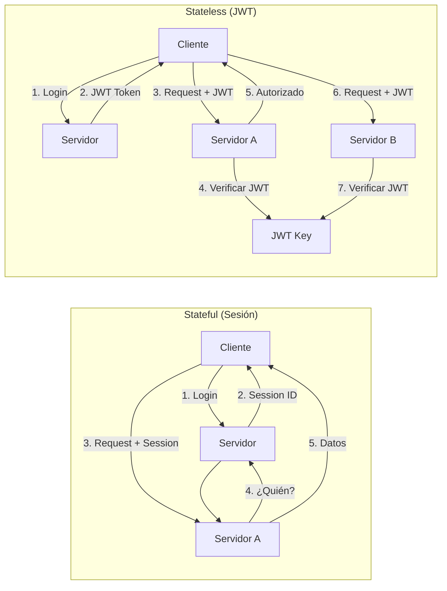

### ¿Por qué Stateless para APIs?

| Aspecto | Stateful | Stateless |
|---------|----------|-----------|
| **Escalabilidad** | Difícil (requiere sticky sessions) | Fácil (cualquier servidor) |
| **Almacenamiento** | Sesiones en servidor | Token en cliente |
| **Rendimiento** | Lookup de sesión | Verificación de firma |
| **Simplicidad** | Gestión de sesiones | JWT auto-contenido |
| **Mobile/API** | Incompatible | Ideal |

---

## 14.2. JWT en Profundidad

### Estructura del JWT

Un JWT está compuesto por tres partes separadas por puntos:

```
HEADER.PAYLOAD.SIGNATURE
```

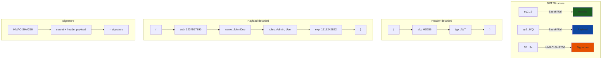

### Header

```json
{
  "alg": "HS256",
  "typ": "JWT"
}
```

| Campo | Descripción |
|-------|-------------|
| `alg` | Algoritmo de firma (HS256, RS256, ES256) |
| `typ` | Tipo de token (siempre "JWT") |

### Payload (Claims)

```json
{
  "sub": "1234567890",
  "name": "John Doe",
  "email": "john@example.com",
  "roles": ["Admin", "User"],
  "iat": 1516239022,
  "exp": 1516242622,
  "iss": "TiendaApi",
  "aud": "TiendaApiClients",
  "jti": "unique-token-id"
}
```

| Claim | Significado |
|-------|-------------|
| `sub` | Subject (identificador principal) |
| `iss` | Issuer (quién emite) |
| `aud` | Audience (para quién) |
| `exp` | Expiration Time |
| `nbf` | Not Before |
| `iat` | Issued At |
| `jti` | JWT ID (identificador único) |

### Signature

```csharp
var key = new SymmetricSecurityKey(Encoding.UTF8.GetBytes(secretKey));
var creds = new SigningCredentials(key, SecurityAlgorithms.HmacSha256);

var token = new JwtSecurityToken(
    issuer: "TiendaApi",
    audience: "TiendaApiClients",
    claims: userClaims,
    expires: DateTime.UtcNow.AddMinutes(15),
    signingCredentials: creds
);
```

> **Nota sobre algoritmos de firma:** Nuestro proyecto usa **HS256** (HMAC-SHA256) por su buen balance entre seguridad y rendimiento. La clave JWT de 94 caracteres excede ampliamente el mínimo requerido.

---

## 14.3. Enfoques de Implementación

### 14.3.1. ASP.NET Core Identity

ASP.NET Core Identity es un sistema completo de membership que permite:
- Registrar/iniciar sesión de usuarios
- Almacenar usuarios en base de datos
- Gestionar passwords (hash, complejidad)
- Roles y autorización
- Confirmación de email
- Two-Factor Authentication
- External logins (Google, Facebook, etc.)

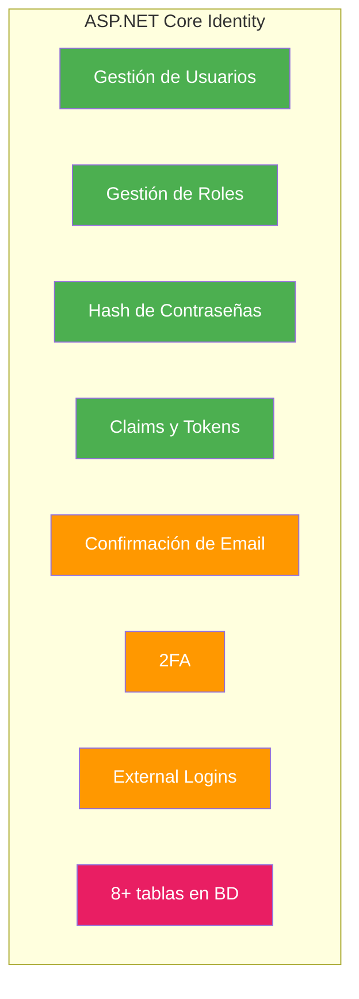

### 14.3.2. Autenticación Personalizada (JWT Manual)

La autenticación personalizada implica implementar JWT sin usar ASP.NET Core Identity, utilizando BCrypt para el hashing de contraseñas. Este enfoque es más ligero y flexible.

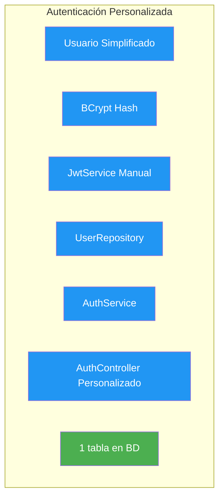

### 14.3.3. Comparación de Enfoques

| Aspecto | ASP.NET Core Identity | Personalizado |
|---------|----------------------|---------------|
| **Complejidad** | Alta (muchas features) | Baja (solo lo necesario) |
| **Tablas BD** | 8+ tablas | 1 tabla |
| **Curva aprendizaje** | Grande | Pequeña |
| **Flexibilidad** | Media | Alta |
| **External Logins** | Integrado | Requiere implementación |
| **2FA** | Integrado | Requiere implementación |
| **Contraseñas** | PBKDF2 | BCrypt |
| **Mantenimiento** | Microsoft mantiene | Mantienes tú |

### 14.3.4. Cuándo Usar Cada Enfoque

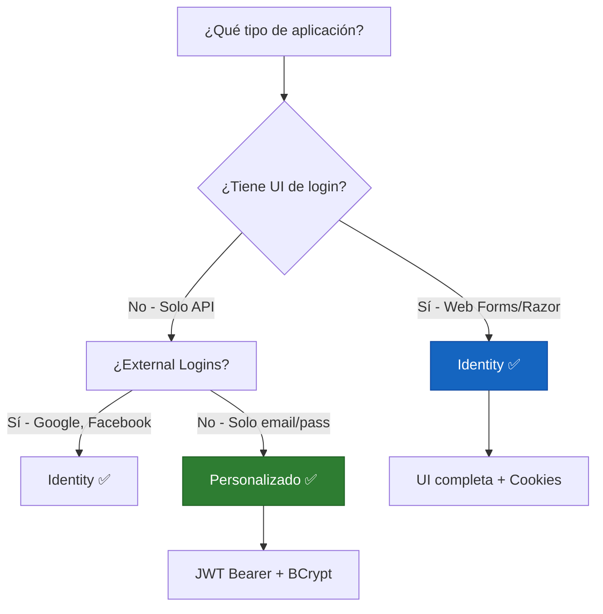

| Escenario | Recomendación | Razón |
|-----------|---------------|-------|
| **API REST simple** | Personalizado ✅ | Ligero, control total |
| **Razor Pages** | Identity ✅ | Cookies + UI login |
| **Blazor Server** | Identity ✅ | Integración completa |
| **SPA + API Backend** | Personalizado en API ✅ | JWT es natural para SPAs |
| **Google/Facebook Login** | Identity ✅ | External logins incluidos |
| **2FA obligatorio** | Identity ✅ | Integrado |

---

## 14.4. BCrypt: Hash de Contraseñas

### ¿Qué es BCrypt?

**BCrypt** es un algoritmo de hashing de contraseñas diseñado para ser lento y costoso computacionalmente. Esto lo hace resistente a ataques de fuerza bruta.

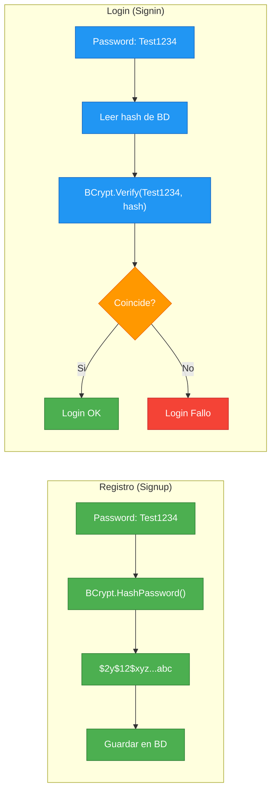

| Característica | Descripción |
|----------------|-------------|
| **Work Factor** | Configurable (12 por defecto). Más alto = más lento |
| **Salt Automático** | Cada hash tiene un salt único |
| **Resistente a Rainbow Tables** | El salt único hace inútiles las tablas precalculadas |

### Comparación de Algoritmos

| Algoritmo | Velocidad | Resistencia | Recomendado |
|-----------|-----------|-------------|-------------|
| **MD5** | Muy rápido | Baja | ❌ No usar |
| **SHA-256** | Rápido | Media | ❌ No para passwords |
| **PBKDF2** | Lento | Buena | ✅ Aceptable |
| **BCrypt** | Muy lento | Excelente | ✅ Recomendado |
| **Argon2** | Muy lento | Excelente | ✅ El mejor |

---

## 14.5. ASP.NET Core Identity - Implementación Completa

### Entity Framework Core con Identity

```csharp
using Microsoft.AspNetCore.Identity;
using Microsoft.AspNetCore.Identity.EntityFrameworkCore;
using Microsoft.EntityFrameworkCore;

namespace TiendaApi.Core.Models;

/// <summary>
/// Usuario personalizado que hereda de IdentityUser
/// </summary>
public class User : IdentityUser<long>
{
    [PersonalData]
    public string? FirstName { get; set; }

    [PersonalData]
    public string? LastName { get; set; }

    public DateTime CreatedAt { get; set; } = DateTime.UtcNow;

    public DateTime? LastLoginAt { get; set; }

    public bool IsActive { get; set; } = true;

    public string? RefreshToken { get; set; }

    public DateTime? RefreshTokenExpiry { get; set; }
}

/// <summary>
/// Rol personalizado
/// </summary>
public class Role : IdentityRole<long>
{
    public string? Description { get; set; }
}

/// <summary>
/// DbContext que combina Identity con el resto del modelo
/// </summary>
public class TiendaDbContext : IdentityDbContext<User, Role, long>
{
    public TiendaDbContext(DbContextOptions<TiendaDbContext> options)
        : base(options)
    {
    }

    public DbSet<Producto> Productos { get; set; } = null!;
    public DbSet<Categoria> Categorias { get; set; } = null!;
    public DbSet<Pedido> Pedidos { get; set; } = null!;

    protected override void OnModelCreating(ModelBuilder modelBuilder)
    {
        base.OnModelCreating(modelBuilder);

        modelBuilder.Entity<User>().ToTable("users");
        modelBuilder.Entity<Role>().ToTable("roles");
        modelBuilder.Entity<IdentityUserClaim<long>>().ToTable("user_claims");
        modelBuilder.Entity<IdentityUserRole<long>>().ToTable("user_roles");
        modelBuilder.Entity<IdentityUserLogin<long>>().ToTable("user_logins");
        modelBuilder.Entity<IdentityUserToken<long>>().ToTable("user_tokens");
        modelBuilder.Entity<IdentityRoleClaim<long>>().ToTable("role_claims");

        modelBuilder.Entity<User>()
            .HasIndex(u => u.NormalizedEmail)
            .HasDatabaseName("IX_Users_Email");

        modelBuilder.Entity<User>()
            .HasIndex(u => u.NormalizedUserName)
            .HasDatabaseName("IX_Users_Username");
    }
}
```

---

## 14.6. Configuración de JWT en Program.cs

```csharp
using Microsoft.AspNetCore.Authentication.JwtBearer;
using Microsoft.AspNetCore.Identity;
using Microsoft.EntityFrameworkCore;
using Microsoft.IdentityModel.Tokens;
using System.Text;

var builder = WebApplication.CreateBuilder(args);

var connectionString = builder.Configuration.GetConnectionString("PostgreSQL");
builder.Services.AddDbContext<TiendaDbContext>(options =>
    options.UseNpgsql(connectionString));

builder.Services.AddIdentity<User, Role>(options =>
{
    options.Password.RequireDigit = true;
    options.Password.RequireLowercase = true;
    options.Password.RequireUppercase = true;
    options.Password.RequireNonAlphanumeric = false;
    options.Password.RequiredLength = 8;
    options.Password.MaxLength = 100;

    options.User.RequireUniqueEmail = true;
    options.User.AllowedUserNameCharacters = 
        "abcdefghijklmnopqrstuvwxyzABCDEFGHIJKLMNOPQRSTUVWXYZ0123456789-._@+";

    options.Lockout.DefaultLockoutTimeSpan = TimeSpan.FromMinutes(15);
    options.Lockout.MaxFailedAccessAttempts = 5;
    options.Lockout.AllowedForNewUsers = true;

    options.SignIn.RequireConfirmedEmail = false;
    options.SignIn.RequireConfirmedAccount = false;
    options.SignIn.RequireConfirmedPhoneNumber = false;
})
.AddEntityFrameworkStores<TiendaDbContext>()
.AddDefaultTokenProviders()
.AddErrorDescriber<SpanishIdentityErrorDescriber>();

var jwtSettings = builder.Configuration.GetSection("Jwt");
var secretKey = jwtSettings["Secret"] ?? throw new InvalidOperationException("JWT Secret requerido");

builder.Services.AddAuthentication(options =>
{
    options.DefaultAuthenticateScheme = JwtBearerDefaults.AuthenticationScheme;
    options.DefaultChallengeScheme = JwtBearerDefaults.AuthenticationScheme;
    options.DefaultScheme = JwtBearerDefaults.AuthenticationScheme;
})
.AddJwtBearer(options =>
{
    options.TokenValidationParameters = new TokenValidationParameters
    {
        ValidateIssuer = true,
        ValidIssuer = jwtSettings["Issuer"],
        ValidateAudience = true,
        ValidAudience = jwtSettings["Audience"],
        ValidateIssuerSigningKey = true,
        IssuerSigningKey = new SymmetricSecurityKey(Encoding.UTF8.GetBytes(secretKey)),
        ValidateLifetime = true,
        ClockSkew = TimeSpan.Zero,
        RoleClaimType = "http://schemas.microsoft.com/ws/2008/06/identity/claims/role",
        NameClaimType = "http://schemas.xmlsoap.org/ws/2005/05/identity/claims/name"
    };

    options.Events = new JwtBearerEvents
    {
        OnMessageReceived = context =>
        {
            var token = context.Request.Headers["Authorization"]
                .FirstOrDefault(x => x.StartsWith("Bearer "));
            
            if (!string.IsNullOrEmpty(token))
            {
                context.Token = token.Substring("Bearer ".Length);
            }

            return Task.CompletedTask;
        },

        OnTokenValidated = context =>
        {
            var logger = context.HttpContext.RequestServices
                .GetRequiredService<ILogger<Program>>();
            logger.LogInformation("Token validado exitosamente");
            return Task.CompletedTask;
        },

        OnAuthenticationFailed = context =>
        {
            var logger = context.HttpContext.RequestServices
                .GetRequiredService<ILogger<Program>>();
            logger.LogWarning("Fallo de autenticación: {Message}", context.Exception.Message);
            return Task.CompletedTask;
        },

        OnForbidden = context =>
        {
            var logger = context.HttpContext.RequestServices
                .GetRequiredService<ILogger<Program>>();
            logger.LogWarning("Acceso prohibido para: {Path}", context.Request.Path);
            return Task.CompletedTask;
        }
    };
});

builder.Services.AddAuthorization();

builder.Services.AddScoped<JwtService>();
builder.Services.AddScoped<IUserClaimsPrincipalFactory<User>, CustomUserClaimsPrincipalFactory>();

var app = builder.Build();

app.UseAuthentication();
app.UseAuthorization();

using (var scope = app.Services.CreateScope())
{
    var roleManager = scope.ServiceProvider.GetRequiredService<RoleManager<Role>>();
    var userManager = scope.ServiceProvider.GetRequiredService<UserManager<User>>();

    await InitializeRolesAndAdminAsync(roleManager, userManager);
}

app.Run();

async Task InitializeRolesAndAdminAsync(RoleManager<Role> roleManager, UserManager<User> userManager)
{
    var roles = new[] { "Admin", "Manager", "User" };
    foreach (var role in roles)
    {
        if (!await roleManager.RoleExistsAsync(role))
        {
            var newRole = new Role { Name = role, Description = $"Rol de {role}" };
            await roleManager.CreateAsync(newRole);
        }
    }

    const string adminEmail = "admin@tienda.com";
    const string adminPassword = "Admin123!";
    
    var adminUser = await userManager.FindByEmailAsync(adminEmail);
    if (adminUser == null)
    {
        var user = new User
        {
            Email = adminEmail,
            UserName = adminEmail,
            FirstName = "Administrador",
            LastName = "Sistema",
            CreatedAt = DateTime.UtcNow,
            IsActive = true
        };

        var result = await userManager.CreateAsync(user, adminPassword);
        if (result.Succeeded)
        {
            await userManager.AddToRoleAsync(user, "Admin");
        }
    }
}
```

---

## 14.7. JwtService - Generación y Validación de Tokens

```csharp
using System.IdentityModel.Tokens.Jwt;
using System.Security.Claims;
using System.Security.Cryptography;
using System.Text;
using Microsoft.AspNetCore.Identity;
using Microsoft.IdentityModel.Tokens;
using TiendaApi.Core.Models;

namespace TiendaApi.Core.Services;

/// <summary>
/// Servicio para generación y validación de JWT tokens
/// </summary>
public class JwtService
{
    private readonly UserManager<User> _userManager;
    private readonly IConfiguration _configuration;
    private readonly ILogger<JwtService> _logger;

    private readonly string _secretKey;
    private readonly string _issuer;
    private readonly string _audience;
    private readonly int _accessTokenExpiryMinutes;
    private readonly int _refreshTokenExpiryDays;

    public JwtService(
        UserManager<User> userManager,
        IConfiguration configuration,
        ILogger<JwtService> logger)
    {
        _userManager = userManager;
        _configuration = configuration;
        _logger = logger;

        var jwtSection = configuration.GetSection("Jwt");
        _secretKey = jwtSection["Secret"] ?? 
            throw new InvalidOperationException("JWT Secret no configurado");
        _issuer = jwtSection["Issuer"] ?? "TiendaApi";
        _audience = jwtSection["Audience"] ?? "TiendaApiClients";
        _accessTokenExpiryMinutes = jwtSection.GetValue<int>("AccessTokenExpiryMinutes", 15);
        _refreshTokenExpiryDays = jwtSection.GetValue<int>("RefreshTokenExpiryDays", 7);
    }

    public async Task<TokenResponse> GenerateTokensAsync(User user)
    {
        var roles = await _userManager.GetRolesAsync(user);
        
        var accessToken = GenerateAccessToken(user, roles);
        var refreshToken = GenerateRefreshToken();
        
        user.RefreshToken = refreshToken;
        user.RefreshTokenExpiry = DateTime.UtcNow.AddDays(_refreshTokenExpiryDays);
        
        await _userManager.UpdateAsync(user);

        return new TokenResponse
        {
            AccessToken = accessToken,
            RefreshToken = refreshToken,
            TokenType = "Bearer",
            ExpiresIn = _accessTokenExpiryMinutes * 60,
            UserId = user.Id.ToString(),
            Email = user.Email ?? "",
            Roles = roles.ToList()
        };
    }

    private string GenerateAccessToken(User user, IList<string> roles)
    {
        var key = new SymmetricSecurityKey(Encoding.UTF8.GetBytes(_secretKey));
        var creds = new SigningCredentials(key, SecurityAlgorithms.HmacSha256);

        var claims = new List<Claim>
        {
            new(JwtRegisteredClaimNames.Sub, user.Id.ToString()),
            new(JwtRegisteredClaimNames.Email, user.Email ?? ""),
            new(JwtRegisteredClaimNames.Jti, Guid.NewGuid().ToString()),
            new(JwtRegisteredClaimNames.Iat, 
                DateTimeOffset.UtcNow.ToUnixTimeSeconds().ToString(), 
                ClaimValueTypes.Integer64),
            new(JwtRegisteredClaimNames.Exp, 
                DateTimeOffset.UtcNow.AddMinutes(_accessTokenExpiryMinutes)
                    .ToUnixTimeSeconds().ToString(), 
                ClaimValueTypes.Integer64),
            new(JwtRegisteredClaimNames.Nbf, 
                DateTimeOffset.UtcNow.ToUnixTimeSeconds().ToString(), 
                ClaimValueTypes.Integer64),
            new(JwtRegisteredClaimNames.Iss, _issuer),
            new(JwtRegisteredClaimNames.Aud, _audience),
            new Claim("displayName", $"{user.FirstName} {user.LastName}".Trim()),
            new Claim("userId", user.Id.ToString()),
            new Claim("email", user.Email ?? ""),
            new Claim("createdAt", user.CreatedAt.ToString("O", CultureInfo.InvariantCulture)),
        };

        foreach (var role in roles)
        {
            claims.Add(new Claim(ClaimTypes.Role, role));
            claims.Add(new Claim("roles", role));
        }

        var token = new JwtSecurityToken(
            issuer: _issuer,
            audience: _audience,
            claims: claims,
            expires: DateTime.UtcNow.AddMinutes(_accessTokenExpiryMinutes),
            signingCredentials: creds
        );

        return new JwtSecurityTokenHandler().WriteToken(token);
    }

    private string GenerateRefreshToken()
    {
        var randomNumber = new byte[32];
        using var rng = RandomNumberGenerator.Create();
        rng.GetBytes(randomNumber);
        return Convert.ToBase64String(randomNumber)
            .Replace("/", "_")
            .Replace("+", "-");
    }

    public ClaimsPrincipal? ValidateAccessToken(string accessToken)
    {
        var tokenHandler = new JwtSecurityTokenHandler();
        
        try
        {
            var key = new SymmetricSecurityKey(Encoding.UTF8.GetBytes(_secretKey));
            
            var validationParameters = new TokenValidationParameters
            {
                ValidateIssuer = true,
                ValidIssuer = _issuer,
                ValidateAudience = true,
                ValidAudience = _audience,
                ValidateIssuerSigningKey = true,
                IssuerSigningKey = key,
                ValidateLifetime = true,
                ClockSkew = TimeSpan.Zero
            };

            var principal = tokenHandler.ValidateToken(
                accessToken, 
                validationParameters, 
                out _);

            return principal;
        }
        catch (Exception ex)
        {
            _logger.LogWarning(ex, "Error validando access token");
            return null;
        }
    }

    public async Task<Result<TokenResponse, Error>> RefreshTokensAsync(
        string accessToken, 
        string refreshToken)
    {
        var principal = ValidateAccessToken(accessToken);
        if (principal == null)
        {
            return Result.Failure<TokenResponse, Error>(Errors.Auth.InvalidToken);
        }

        var userIdClaim = principal.FindFirst("userId") ?? 
            principal.FindFirst(JwtRegisteredClaimNames.Sub);
        
        if (userIdClaim == null || !long.TryParse(userIdClaim.Value, out var userId))
        {
            return Result.Failure<TokenResponse, Error>(Errors.Auth.InvalidToken);
        }

        var user = await _userManager.FindByIdAsync(userId.ToString());
        if (user == null)
        {
            return Result.Failure<TokenResponse, Error>(Errors.Auth.UsuarioNoEncontrado);
        }

        if (user.RefreshToken != refreshToken ||
            user.RefreshTokenExpiry < DateTime.UtcNow)
        {
            return Result.Failure<TokenResponse, Error>(Errors.Auth.RefreshTokenInvalido);
        }

        return await GenerateTokensAsync(user);
    }
}

public class TokenResponse
{
    public string AccessToken { get; set; } = string.Empty;
    public string RefreshToken { get; set; } = string.Empty;
    public string TokenType { get; set; } = "Bearer";
    public int ExpiresIn { get; set; }
    public long UserId { get; set; }
    public string Email { get; set; } = string.Empty;
    public List<string> Roles { get; set; } = new();
}
```

---

## 14.8. Autenticación Personalizada - Implementación

### Modelo de Usuario Simplificado

```csharp
using System.ComponentModel.DataAnnotations;

namespace TiendaApi.Core.Models;

public class User
{
    public long Id { get; set; }

    [Required]
    [MaxLength(255)]
    public string Email { get; set; } = string.Empty;

    [Required]
    [MaxLength(255)]
    public string Username { get; set; } = string.Empty;

    [Required]
    [MaxLength(255)]
    public string PasswordHash { get; set; } = string.Empty;

    public string Role { get; set; } = "User";
    public string? Avatar { get; set; }
    public bool IsDeleted { get; set; }
    public DateTime CreatedAt { get; init; } = DateTime.UtcNow;
    public DateTime UpdatedAt { get; set; } = DateTime.UtcNow;
    public DateTime? LastLoginAt { get; set; }
    public string? RefreshToken { get; set; }
    public DateTime? RefreshTokenExpiry { get; set; }
}

public static class UserRoles
{
    public const string ADMIN = "ADMIN";
    public const string USER = "USER";
}
```

### UserRepository con DbContext

```csharp
using Microsoft.EntityFrameworkCore;
using TiendaApi.Core.Interfaces.IRepositories;

namespace TiendaApi.Core.Repositories;

public interface IUserRepository
{
    Task<User?> FindByEmailAsync(string email);
    Task<User?> FindByIdAsync(long id);
    Task<User> CreateAsync(User user);
    Task<User> UpdateAsync(User user);
}

public class UserRepository(TiendaDbContext context) : IUserRepository
{
    private readonly TiendaDbContext _context = context;

    public async Task<User?> FindByEmailAsync(string email)
    {
        return await _context.Users
            .FirstOrDefaultAsync(u => u.Email == email && !u.IsDeleted);
    }

    public async Task<User?> FindByIdAsync(long id)
    {
        return await _context.Users.FindAsync(id);
    }

    public async Task<User> CreateAsync(User user)
    {
        _context.Users.Add(user);
        await _context.SaveChangesAsync();
        return user;
    }

    public async Task<User> UpdateAsync(User user)
    {
        _context.Users.Update(user);
        await _context.SaveChangesAsync();
        return user;
    }
}
```

### AuthService con BCrypt

```csharp
using BCrypt.Net;

namespace TiendaApi.Core.Services;

public interface IAuthService
{
    Task<Result<(User User, TokenResponse Tokens), Error>> SignupAsync(SignupRequest request);
    Task<Result<(User User, TokenResponse Tokens), Error>> SigninAsync(string email, string password);
    Task<Result<Unit, Error>> LogoutAsync(long userId);
}

public class AuthService(
    IUserRepository userRepository,
    JwtService jwtService,
    ILogger<AuthService> logger) : IAuthService
{
    public async Task<Result<(User User, TokenResponse Tokens), Error>> SignupAsync(SignupRequest request)
    {
        var existingUser = await userRepository.FindByEmailAsync(request.Email);
        if (existingUser != null)
        {
            return Result.Failure<(User, TokenResponse), Error>(Errors.Auth.EmailDuplicado);
        }

        var user = new User
        {
            Email = request.Email,
            Username = request.Username,
            PasswordHash = BCrypt.Net.BCrypt.HashPassword(request.Password),
            Role = UserRoles.USER,
            CreatedAt = DateTime.UtcNow
        };

        user = await userRepository.CreateAsync(user);
        var tokens = await jwtService.GenerateTokensAsync(user);

        logger.LogInformation("Usuario registrado: {UserId}", user.Id);

        return Result.Success<(User, TokenResponse), Error>((user, tokens));
    }

    public async Task<Result<(User User, TokenResponse Tokens), Error>> SigninAsync(string email, string password)
    {
        var user = await userRepository.FindByEmailAsync(email);
        if (user == null)
        {
            return Result.Failure<(User, TokenResponse), Error>(Errors.Auth.CredencialesInvalidas);
        }

        if (user.IsDeleted)
        {
            return Result.Failure<(User, TokenResponse), Error>(Errors.Auth.UsuarioEliminado);
        }

        if (!BCrypt.Net.BCrypt.Verify(password, user.PasswordHash))
        {
            return Result.Failure<(User, TokenResponse), Error>(Errors.Auth.CredencialesInvalidas);
        }

        user.LastLoginAt = DateTime.UtcNow;
        await userRepository.UpdateAsync(user);

        var tokens = await jwtService.GenerateTokensAsync(user);

        logger.LogInformation("Login exitoso: {UserId}", user.Id);

        return Result.Success<(User, TokenResponse), Error>((user, tokens));
    }

    public async Task<Result<Unit, Error>> LogoutAsync(long userId)
    {
        var user = await userRepository.FindByIdAsync(userId);
        if (user == null)
        {
            return Result.Failure<Unit, Error>(Errors.Auth.UsuarioNoEncontrado);
        }

        user.RefreshToken = null;
        user.RefreshTokenExpiry = null;
        await userRepository.UpdateAsync(user);

        return Result.Success<Unit, Error>(Unit.Value);
    }
}
```

### Configuración de Usuario

```csharp
public class UserConfiguration : IEntityTypeConfiguration<User>
{
    public void Configure(EntityTypeBuilder<User> builder)
    {
        builder.ToTable("users");

        builder.HasKey(u => u.Id);
        builder.Property(u => u.Id).UseNpgsqlIdentityColumn();

        builder.Property(u => u.Email)
            .IsRequired()
            .HasMaxLength(255);

        builder.Property(u => u.Username)
            .IsRequired()
            .HasMaxLength(255);

        builder.Property(u => u.PasswordHash)
            .IsRequired()
            .HasMaxLength(255);

        builder.Property(u => u.Role)
            .IsRequired()
            .HasMaxLength(50);

        builder.HasIndex(u => u.Email).IsUnique();
    }
}
```

---

## 14.9. Errores de Autenticación

```csharp
namespace TiendaApi.Core.Models.Errors;

public static partial class Errors
{
    public static class Auth
    {
        public static Error CredencialesInvalidas => new(
            "Auth.CredencialesInvalidas",
            "El email o contraseña son incorrectos");

        public static Error UsuarioNoEncontrado => new(
            "Auth.UsuarioNoEncontrado",
            "No se encontró un usuario con ese email");

        public static Error UsuarioEliminado => new(
            "Auth.UsuarioEliminado",
            "La cuenta de usuario ha sido eliminada");

        public static Error EmailDuplicado => new(
            "Auth.EmailDuplicado",
            "El email ya está registrado");

        public static Error TokenExpirado => new(
            "Auth.TokenExpirado",
            "El token de autenticación ha expirado");

        public static Error RefreshTokenInvalido => new(
            "Auth.RefreshTokenInvalido",
            "El refresh token es inválido o ha expirado");

        public static Error InvalidToken => new(
            "Auth.InvalidToken",
            "El token de autenticación es inválido");
    }
}
```

---

## 14.10. AuthController - Endpoints

```csharp
using Microsoft.AspNetCore.Authorization;
using Microsoft.AspNetCore.Mvc;

namespace TiendaApi.Apis.Controllers;

[ApiController]
[Route("api/v1/auth")]
public class AuthController(
    IAuthService authService,
    JwtService jwtService,
    UserManager<User> userManager,
    ILogger<AuthController> logger) : ControllerBase
{
    [HttpPost("signup")]
    [ProducesResponseType(typeof(ApiResponse<TokenResponse>), StatusCodes.Status201Created)]
    [ProducesResponseType(typeof(ApiResponse), StatusCodes.Status409Conflict)]
    public async Task<IActionResult> Signup([FromBody] SignupRequest request)
    {
        var result = await authService.SignupAsync(request);

        return result.Match(
            userTokens => CreatedAtAction(nameof(Signup), 
                new ApiResponse<TokenResponse>(true, "Usuario registrado", userTokens.Tokens)),
            error => Conflict(new ApiResponse(false, error.Message))
        );
    }

    [HttpPost("signin")]
    [ProducesResponseType(typeof(ApiResponse<TokenResponse>), StatusCodes.Status200OK)]
    [ProducesResponseType(typeof(ApiResponse), StatusCodes.Status401Unauthorized)]
    public async Task<IActionResult> Signin([FromBody] SigninRequest request)
    {
        var result = await authService.SigninAsync(request.Email, request.Password);

        return result.Match(
            userTokens => Ok(new ApiResponse<TokenResponse>(true, "Login exitoso", userTokens.Tokens)),
            error => Unauthorized(new ApiResponse(false, error.Message))
        );
    }

    [HttpPost("refresh")]
    [ProducesResponseType(typeof(ApiResponse<TokenResponse>), StatusCodes.Status200OK)]
    [ProducesResponseType(typeof(ApiResponse), StatusCodes.Status401Unauthorized)]
    public async Task<IActionResult> Refresh([FromBody] RefreshRequest request)
    {
        if (string.IsNullOrEmpty(request.AccessToken) || string.IsNullOrEmpty(request.RefreshToken))
        {
            return BadRequest(new ApiResponse(false, "Tokens requeridos"));
        }

        var result = await jwtService.RefreshTokensAsync(request.AccessToken, request.RefreshToken);

        return result.Match(
            tokens => Ok(new ApiResponse<TokenResponse>(true, "Token renovado", tokens)),
            error => Unauthorized(new ApiResponse(false, error.Message))
        );
    }

    [HttpPost("logout")]
    [Authorize]
    [ProducesResponseType(typeof(ApiResponse), StatusCodes.Status200OK)]
    public async Task<IActionResult> Logout()
    {
        var userIdClaim = User.FindFirst("userId");
        if (userIdClaim == null || !long.TryParse(userIdClaim.Value, out var userId))
        {
            return Unauthorized(new ApiResponse(false, "Token inválido"));
        }

        await authService.LogoutAsync(userId);

        return Ok(new ApiResponse(true, "Sesión cerrada correctamente"));
    }

    [HttpGet("me")]
    [Authorize]
    [ProducesResponseType(typeof(ApiResponse<UserInfoResponse>), StatusCodes.Status200OK)]
    public async Task<IActionResult> GetCurrentUser()
    {
        var userIdClaim = User.FindFirst("userId");
        if (userIdClaim == null || !long.TryParse(userIdClaim.Value, out var userId))
        {
            return Unauthorized(new ApiResponse(false, "Token inválido"));
        }

        var user = await userManager.FindByIdAsync(userId.ToString());
        if (user == null)
        {
            return NotFound(new ApiResponse(false, "Usuario no encontrado"));
        }

        var roles = await userManager.GetRolesAsync(user);

        var response = new UserInfoResponse
        {
            Id = user.Id,
            Email = user.Email ?? "",
            FirstName = user.FirstName ?? "",
            LastName = user.LastName ?? "",
            Roles = roles.ToList(),
            CreatedAt = user.CreatedAt,
            LastLoginAt = user.LastLoginAt
        };

        return Ok(new ApiResponse<UserInfoResponse>(true, "Usuario actual", response));
    }
}
```

---

## 14.11. DTOs de Autenticación

```csharp
using System.ComponentModel.DataAnnotations;
using System.Text.Json.Serialization;

namespace TiendaApi.Core.Models.Dto;

public class SignupRequest
{
    [Required(ErrorMessage = "El email es obligatorio")]
    [EmailAddress(ErrorMessage = "El formato del email no es válido")]
    [MaxLength(255)]
    public string Email { get; set; } = string.Empty;

    [Required(ErrorMessage = "El username es obligatorio")]
    [MaxLength(255)]
    public string Username { get; set; } = string.Empty;

    [Required(ErrorMessage = "La contraseña es obligatoria")]
    [MinLength(8, ErrorMessage = "Mínimo 8 caracteres")]
    [MaxLength(100)]
    [RegularExpression(@"^(?=.*[a-z])(?=.*[A-Z])(?=.*\d).*$", 
        ErrorMessage = "Debe tener mayúscula, minúscula y número")]
    [JsonPropertyName("password")]
    public string Password { get; set; } = string.Empty;

    [Required]
    [Compare("Password", ErrorMessage = "Las contraseñas no coinciden")]
    [JsonPropertyName("confirmPassword")]
    public string ConfirmPassword { get; set; } = string.Empty;
}

public class SigninRequest
{
    [Required(ErrorMessage = "El email es obligatorio")]
    [EmailAddress]
    public string Email { get; set; } = string.Empty;

    [Required(ErrorMessage = "La contraseña es obligatoria")]
    public string Password { get; set; } = string.Empty;
}

public class RefreshRequest
{
    public string AccessToken { get; set; } = string.Empty;
    public string RefreshToken { get; set; } = string.Empty;
}

public class UserInfoResponse
{
    public long Id { get; set; }
    public string Email { get; set; } = string.Empty;
    public string FirstName { get; set; } = string.Empty;
    public string LastName { get; set; } = string.Empty;
    public List<string> Roles { get; set; } = new();
    public DateTime CreatedAt { get; set; }
    public DateTime? LastLoginAt { get; set; }
}

public class ApiResponse<T>
{
    public bool Success { get; set; }
    public string Message { get; set; } = string.Empty;
    public T? Data { get; set; }

    public ApiResponse(bool success, string message, T? data = default)
    {
        Success = success;
        Message = message;
        Data = data;
    }
}

public class ApiResponse
{
    public bool Success { get; set; }
    public string Message { get; set; } = string.Empty;
    public IEnumerable<string>? Errors { get; set; }

    public ApiResponse(bool success, string message, IEnumerable<string>? errors = null)
    {
        Success = success;
        Message = message;
        Errors = errors;
    }
}
```

---

## 14.12. Configuración de Appsettings.json

```json
{
  "Jwt": {
    "Secret": "TuClaveSecretaSuperLargaYSeguraDeAlMenos32Caracteres!",
    "Issuer": "TiendaApi",
    "Audience": "TiendaApiClients",
    "AccessTokenExpiryMinutes": 15,
    "RefreshTokenExpiryDays": 7
  },
  "ConnectionStrings": {
    "PostgreSQL": "Host=localhost;Database=TiendaDb;Username=postgres;Password=postgres"
  }
}
```

---

## 14.13. Flujo de Autenticación Completo

### Flujo de Registro

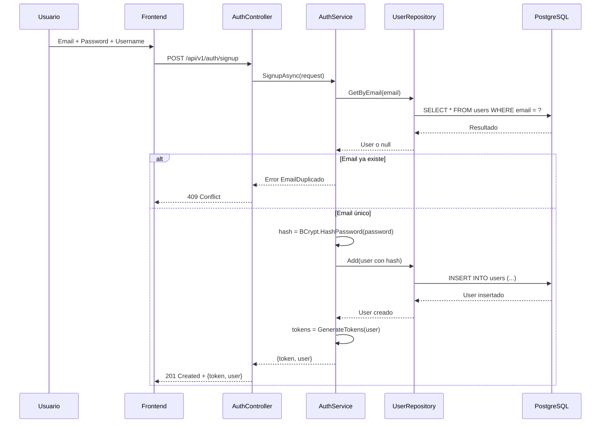

### Flujo de Login

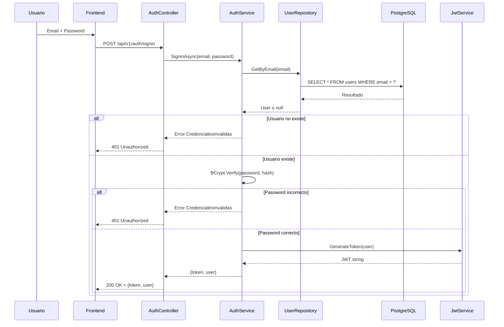

### Flujo de Petición Autorizada

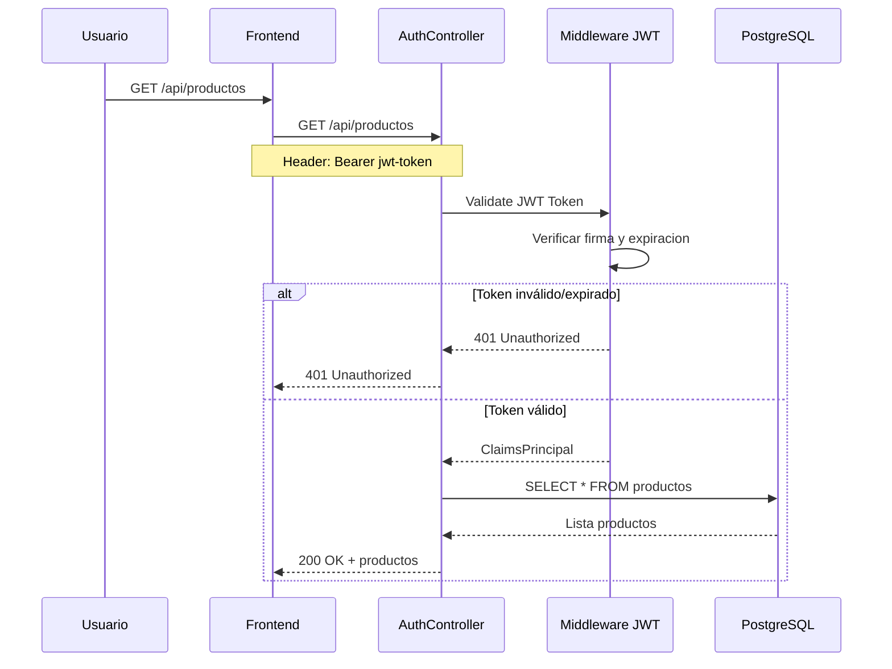

---

## 14.14. Arquitectura de Autenticación

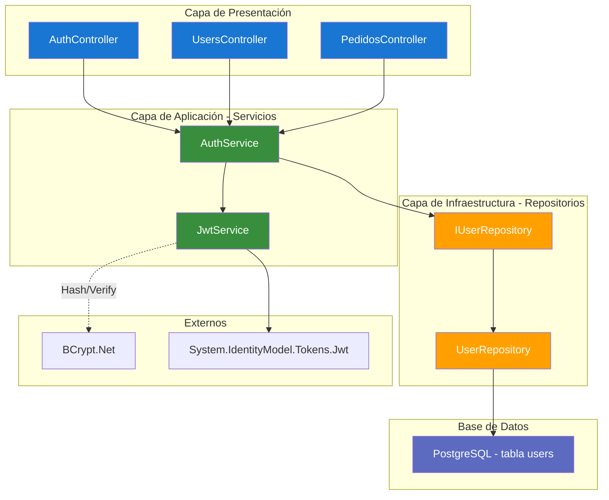

### Tablas de Identity vs Nuestra Tabla

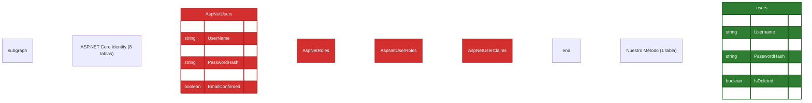

---

## 14.15. Comparación del Middleware

El middleware de autenticación y autorización funciona **independientemente** de cómo gestionemos los usuarios.

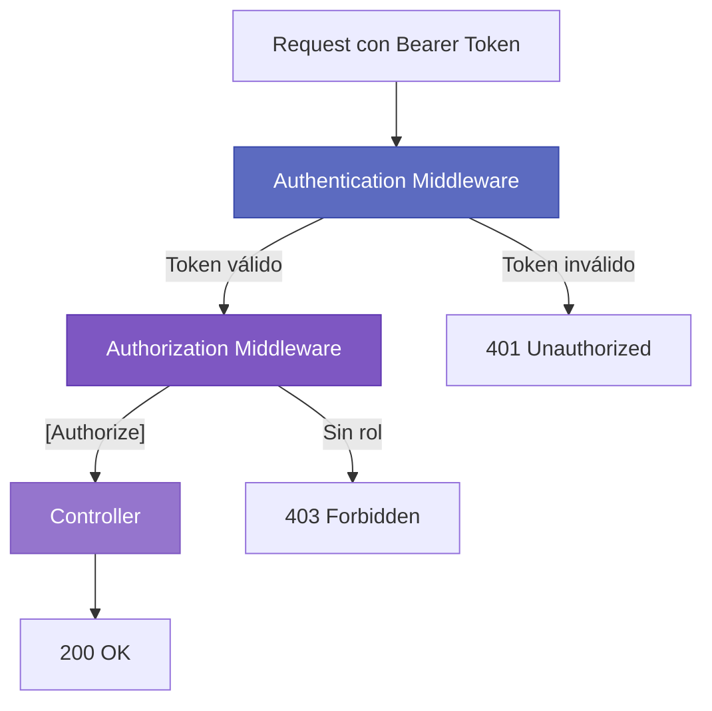

| Aspecto | Con Identity | Personalizado |
|---------|-------------|---------------|
| **Authentication Middleware** | `AddIdentityCookies()` | `AddJwtBearer()` |
| **Authorization Middleware** | `AddAuthorization()` | `AddAuthorization()` (igual) |
| `[Authorize]` | ✅ | ✅ |
| `[Authorize(Roles="Admin")]` | ✅ | ✅ |
| `User.Identity.Name` | ✅ | ✅ |
| `User.IsInRole("ADMIN")` | ✅ | ✅ |

### Lo que Funciona Exactamente Igual

| Funcionalidad | Identity | Personalizado |
|---------------|----------|---------------|
| `[Authorize]` | ✅ | ✅ |
| `[Authorize(Roles="ADMIN")]` | ✅ | ✅ |
| `User.Identity.IsAuthenticated` | ✅ | ✅ |
| `User.Identity.Name` | ✅ | ✅ |
| `User.IsInRole("ADMIN")` | ✅ | ✅ |

---

## 14.16. Buenas Prácticas de Seguridad

```mermaid
flowchart TB
    subgraph "Token Security"
        A1["HTTPS siempre"]
        A2["Secret >= 32 caracteres"]
        A3["Expiration corto (15-30 min)"]
        A4["ClockSkew = 0"]
    end
    
    subgraph "Password Security"
        B1["Hash con bcrypt/argon2"]
        B2["Complexity requirements"]
        B3["Rate limiting"]
        B4["Max failed attempts"]
    end
    
    subgraph "Refresh Token"
        C1["Almacenar en BD"]
        C2["Revocar en logout"]
        C3["Rotar en cada refresh"]
    end
    
    subgraph "Monitoring"
        D1["Log de logins"]
        D2["Alertas de actividad sospechosa"]
        D3["Audit trail"]
    end
    
    A1 --> A2 --> A3 --> A4
    B1 --> B2 --> B3 --> B4
    C1 --> C2 --> C3
    D1 --> D2 --> D3
```

✅ **Mejores prácticas:**
- Usar HTTPS siempre en producción
- Secret de al menos 32 caracteres
- Expiración corta para access tokens (15-30 min)
- ClockSkew = 0 para expiración exacta
- Hash de contraseñas con bcrypt
- Almacenar refresh tokens en base de datos
- Revocar tokens en logout
- Implementar rate limiting

---

## 14.17. Resumen

| Concepto | Descripción |
|----------|-------------|
| **Stateless** | Cada request contiene toda la información de autenticación |
| **JWT** | Token autocontenido con claims firmados criptográficamente |
| **Identity** | Framework completo de gestión de usuarios |
| **Personalizado** | Alternativa ligera para APIs simples |
| **Access Token** | Token corto (15-30 min) para acceso a APIs |
| **Refresh Token** | Token largo (7-30 días) para renovar access tokens |
| **BCrypt** | Algoritmo de hashing seguro para contraseñas |

🧠 **Puntos clave:**
- JWT permite autenticación stateless escalable
- ASP.NET Core Identity o personalizado según necesidades
- Access tokens cortos para seguridad, refresh tokens largos para UX
- El middleware de autorización funciona igual con ambos enfoques

---

## 14.18. Recursos Adicionales

- JWT.io: https://jwt.io/
- RFC 7519 (JWT): https://datatracker.ietf.org/doc/html/rfc7519
- ASP.NET Core Identity: https://learn.microsoft.com/aspnet/core/security/authentication/
- Microsoft JWT Authentication: https://learn.microsoft.com/aspnet/core/security/authentication/jwt-authn
- BCrypt: https://github.com/BcryptNet/bcrypt.net
- OWASP Authentication Cheat Sheet: https://cheatsheetseries.owasp.org/cheatsheets/Authentication_Cheat_Sheet.html
