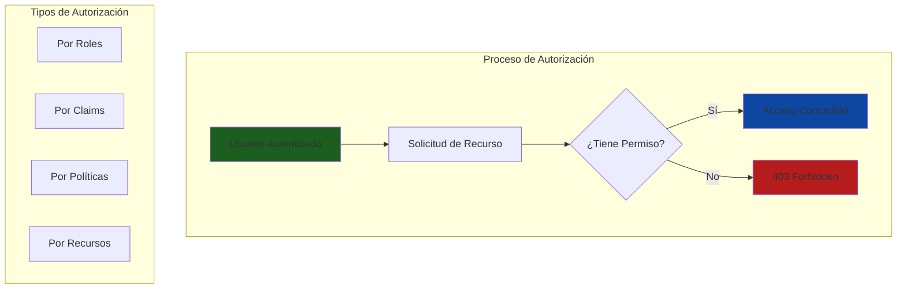
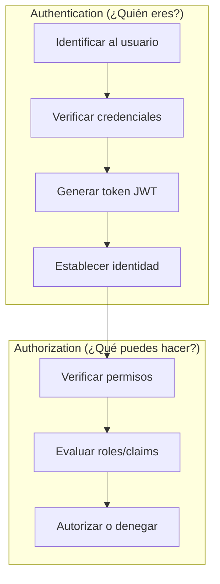
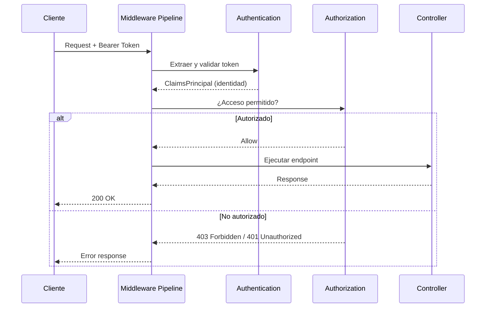
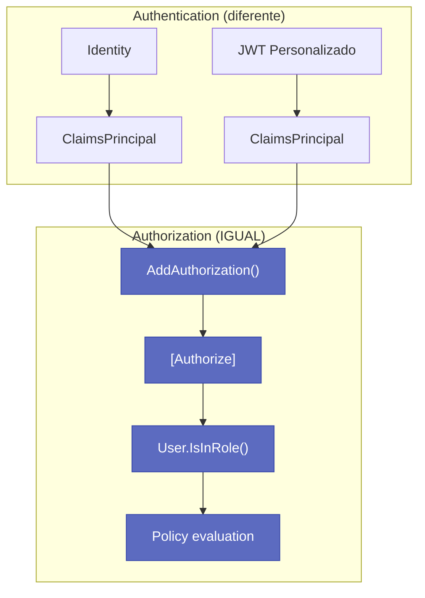

# 15. Autorización y Roles en ASP.NET Core

## Indice

- [15. Autorización y Roles en ASP.NET Core](#15-autorización-y-roles-en-aspnet-core)
  - [15.1. Fundamentos de Autorización](#151-fundamentos-de-autorización)
  - [15.2. La Autorización Funciona Igual con Identity o Personalizado](#152-la-autorización-funciona-igual-con-identity-o-personalizado)
  - [15.3. Autorización Basada en Roles](#153-autorización-basada-en-roles)
  - [15.4. Políticas de Autorización (Policies)](#154-políticas-de-autorización-policies)
  - [15.5. Requirements Personalizados](#155-requirements-personalizados)
  - [15.6. Autorización Basada en Recursos](#156-autorización-basada-en-recursos)
  - [15.7. Autorización con Scopes (OAuth2)](#157-autorización-con-scopes-oauth2)
  - [15.8. Roles vs Claims](#158-roles-vs-claims)
  - [15.9. Resumen de Métodos de Autorización](#159-resumen-de-métodos-de-autorización)
  - [15.10. Comparación de Enfoques](#1510-comparación-de-enfoques)
  - [15.11. Buenas Prácticas de Autorización](#1511-buenas-prácticas-de-autorización)
  - [15.12. Resumen](#1512-resumen)
  - [15.13. Recursos Adicionales](#1513-recursos-adicionales)

---

## 15.1. Fundamentos de Autorización

### ¿Qué es la Autorización?

La **autorización** es el proceso de determinar qué recursos puede acceder un usuario autenticado y qué operaciones puede realizar sobre dichos recursos. Es el paso posterior a la autenticación y define los permisos y accesos del sistema.



### Diferencias entre Autenticación y Autorización



| Aspecto | Autenticación | Autorización |
|---------|---------------|--------------|
| **Pregunta** | ¿Quién eres? | ¿Qué puedes hacer? |
| **Proceso** | Verificar identidad | Verificar permisos |
| **Outcome** | ClaimsPrincipal | Allow/Deny |
| **HTTP Header** | Authorization: Bearer | [Authorize] attribute |
| **Mecanismo** | JWT validation | Policy evaluation |

### Middleware de Autorización

```csharp
var app = builder.Build();

app.UseAuthentication();   // 1. Autenticar (extraer ClaimsPrincipal del token)
app.UseAuthorization();    // 2. Autorizar (evaluar políticas)

app.MapControllers();

app.Run();
```



---

## 15.2. La Autorización Funciona Igual con Identity o Personalizado

El sistema de autorización de ASP.NET Core es **independiente** del sistema de autenticación. Esto significa que `[Authorize]`, `User.IsInRole()` y las políticas funcionan **exactamente igual** tanto si usamos ASP.NET Core Identity como si usamos nuestro método personalizado con JWT.



### Lo que Funciona Igual

| Funcionalidad | Con Identity | Personalizado |
|---------------|--------------|---------------|
| `[Authorize]` | ✅ | ✅ |
| `[Authorize(Roles="ADMIN")]` | ✅ | ✅ |
| `User.IsInRole("ADMIN")` | ✅ | ✅ |
| `User.Identity.Name` | ✅ | ✅ |
| Políticas personalizadas | ✅ | ✅ |

---

## 15.3. Autorización Basada en Roles

Los roles son una forma simple de agrupar permisos. Un usuario puede tener uno o varios roles, y el sistema verifica si el usuario tiene el rol requerido antes de permitir el acceso a un recurso.

### Definición de Roles

En el sistema TiendaApi, definimos los siguientes roles:

| Rol | Descripción | Permisos |
|-----|-------------|----------|
| **Admin** | Administrador del sistema | Acceso total a todos los recursos |
| **Manager** | Gestor de contenido | CRUD productos, ver pedidos, ver usuarios |
| **User** | Usuario estándar | Ver productos, gestionar sus pedidos |
| **Guest** | Usuario sin registrar | Solo lectura de productos públicos |

### Roles con Atributos [Authorize]

```csharp
using Microsoft.AspNetCore.Authorization;
using Microsoft.AspNetCore.Mvc;

namespace TiendaApi.Apis.Controllers;

/// <summary>
/// Controlador de productos con autorización basada en roles
/// </summary>
[ApiController]
[Route("api/[controller]")]
public class ProductosController : ControllerBase
{
    private readonly IProductoService _productoService;

    public ProductosController(IProductoService productoService)
    {
        _productoService = productoService;
    }

    /// <summary>
    /// GET /api/productos
    /// Acceso: Usuarios autenticados (User, Manager, Admin)
    /// </summary>
    [HttpGet]
    [Authorize]
    [ProducesResponseType(typeof(ApiResponse<List<ProductoDto>>), StatusCodes.Status200OK)]
    public async Task<IActionResult> GetAll()
    {
        var productos = await _productoService.GetAllAsync();
        return Ok(new ApiResponse(true, "Productos obtenidos", productos));
    }

    /// <summary>
    /// GET /api/productos/{id}
    /// Acceso: Usuarios autenticados
    /// </summary>
    [HttpGet("{id:long}")]
    [Authorize]
    public async Task<IActionResult> GetById(long id)
    {
        var result = await _productoService.GetByIdAsync(id);
        return result.Match(Ok, Error => NotFound(Error));
    }

    /// <summary>
    /// POST /api/productos
    /// Acceso: Solo Admin y Manager
    /// </summary>
    [HttpPost]
    [Authorize(Roles = "Admin,Manager")]
    [ProducesResponseType(typeof(ApiResponse<ProductoDto>), StatusCodes.Status201Created)]
    [ProducesResponseType(StatusCodes.Status403Forbidden)]
    public async Task<IActionResult> Create([FromBody] CreateProductoRequest request)
    {
        var result = await _productoService.CreateAsync(request);
        
        if (result.IsFailure)
        {
            return BadRequest(new ApiResponse(false, result.Error.Message));
        }

        return CreatedAtAction(nameof(GetById), 
            new { id = result.Value.Id }, 
            new ApiResponse(true, "Producto creado", result.Value));
    }

    /// <summary>
    /// PUT /api/productos/{id}
    /// Acceso: Solo Admin y Manager
    /// </summary>
    [HttpPut("{id:long}")]
    [Authorize(Roles = "Admin,Manager")]
    public async Task<IActionResult> Update(long id, [FromBody] UpdateProductoRequest request)
    {
        var result = await _productoService.UpdateAsync(id, request);
        return result.Match(Ok, Error => NotFound(Error));
    }

    /// <summary>
    /// DELETE /api/productos/{id}
    /// Acceso: Solo Admin
    /// </summary>
    [HttpDelete("{id:long}")]
    [Authorize(Roles = "Admin")]
    [ProducesResponseType(StatusCodes.Status204NoContent)]
    [ProducesResponseType(StatusCodes.Status403Forbidden)]
    public async Task<IActionResult> Delete(long id)
    {
        var result = await _productoService.DeleteAsync(id);
        
        if (result.IsFailure)
        {
            return NotFound(new ApiResponse(false, result.Error.Message));
        }

        return NoContent();
    }

    /// <summary>
    /// GET /api/productos/export
    /// Acceso: Solo Admin (reporte completo)
    /// </summary>
    [HttpGet("export")]
    [Authorize(Roles = "Admin")]
    public async Task<IActionResult> Export()
    {
        var report = await _productoService.ExportReportAsync();
        return File(report, "application/pdf", "reporte-productos.pdf");
    }
}
```

### Autorización Mixta: Roles + Política

Se pueden combinar múltiples atributos de autorización para crear reglas más complejas. En este ejemplo, se requiere que el usuario tenga el rol Admin O Manager, Y además cumpla con una política personalizada:

```csharp
[Authorize(Roles = "Admin,Manager")]
[Authorize(Policy = "CanManageProducts")]
public async Task<IActionResult> ManageProduct(...)
```

### Verificación de Roles en Código

Además de los atributos, se puede verificar roles programáticamente usando el ClaimsPrincipal:

```csharp
// Verificar si el usuario tiene un rol específico
if (User.IsInRole("Admin"))
{
    // El usuario es administrador
}

// Verificar múltiples roles (OR implícito)
if (User.IsInRole("Admin") || User.IsInRole("Manager"))
{
    // El usuario es admin o manager
}

// Obtener todos los roles del usuario
var roles = User.FindAll(ClaimTypes.Role).Select(c => c.Value).ToList();
```

---

## 15.4. Políticas de Autorización (Policies)

### Políticas Simples

```csharp
builder.Services.AddAuthorization(options =>
{
    options.AddPolicy("RequireAdmin", policy =>
        policy.RequireRole("Admin"));

    options.AddPolicy("RequireManagerOrAdmin", policy =>
        policy.RequireAssertion(context =>
            context.User.IsInRole("Admin") || 
            context.User.IsInRole("Manager")));
});
```

### Políticas con Claims

```csharp
builder.Services.AddAuthorization(options =>
{
    options.AddPolicy("EmailVerified", policy =>
        policy.RequireClaim("emailVerified", "true"));

    options.AddPolicy("ActiveUser", policy =>
    {
        policy.RequireAssertion(context =>
        {
            var isActive = context.User.FindFirst("isActive")?.Value;
            return isActive?.ToLower() == "true";
        });
    });

    options.AddPolicy("AdminPanelAccess", policy =>
    {
        policy.RequireAssertion(context =>
        {
            var isAdmin = context.User.IsInRole("Admin");
            var hasAdminAccess = context.User.HasClaim(c => 
                c.Type == "adminPanelAccess" && c.Value == "true");
            return isAdmin || hasAdminAccess;
        });
    });
});
```

### Políticas con Múltiples Requisitos

```csharp
builder.Services.AddAuthorization(options =>
{
    options.AddPolicy("AdminVerified", policy =>
    {
        policy.RequireRole("Admin");
        policy.RequireClaim("emailVerified", "true");
    });

    options.AddPolicy("PremiumUser", policy =>
    {
        policy.RequireAssertion(context =>
        {
            var isPremium = context.User.HasClaim("subscriptionTier", "premium");
            var isUser = context.User.IsInRole("User") || 
                        context.User.IsInRole("Admin") ||
                        context.User.IsInRole("Manager");
            return isPremium && isUser;
        });
    });
});
```

### Políticas Temporales

```csharp
builder.Services.AddAuthorization(options =>
{
    options.AddPolicy("BusinessHours", policy =>
    {
        policy.RequireAssertion(context =>
        {
            var now = DateTime.UtcNow.TimeOfDay;
            var start = new TimeSpan(9, 0, 0);
            var end = new TimeSpan(18, 0, 0);
            return now >= start && now <= end;
        });
    });
});
```

### Uso de Políticas en Controladores

```csharp
[ApiController]
[Route("api/[controller]")]
public class AdminController : ControllerBase
{
    [HttpGet("dashboard")]
    [Authorize(Policy = "RequireAdmin")]
    public IActionResult Dashboard()
    {
        return Ok(new { message = "Dashboard administrativo" });
    }

    [HttpGet("users")]
    [Authorize(Policy = "AdminVerified")]
    public IActionResult GetUsers()
    {
        return Ok(new { message: "Lista de usuarios" });
    }

    [HttpPost("settings")]
    [Authorize(Policy = "BusinessHours")]
    public IActionResult UpdateSettings()
    {
        return Ok(new { message = "Settings actualizados" });
    }

    [HttpGet("reports")]
    [Authorize(Policy = "PremiumUser")]
    public IActionResult GetReports()
    {
        return Ok(new { message = "Reportes premium" });
    }
}
```

---

## 15.5. Requirements Personalizados

### IAuthorizationRequirement

```csharp
using Microsoft.AspNetCore.Authorization;

namespace TiendaApi.Core.Authorization;

public interface IAuthorizationRequirement
{
}
```

### MinimumAgeRequirement

```csharp
public class MinimumAgeRequirement(int minimumAge) : IAuthorizationRequirement
{
    public int MinimumAge { get; } = minimumAge;
}

public class MinimumAgeHandler(
    IHttpContextAccessor httpContextAccessor,
    ILogger<MinimumAgeHandler> logger) : AuthorizationHandler<MinimumAgeRequirement>
{
    protected override Task HandleRequirementAsync(
        AuthorizationHandlerContext context,
        MinimumAgeRequirement requirement)
    {
        var birthDateClaim = context.User.FindFirst("birthDate");
        
        if (birthDateClaim == null)
        {
            birthDateClaim = context.User.FindFirst(ClaimTypes.DateOfBirth);
        }

        if (birthDateClaim == null || 
            !DateTime.TryParse(birthDateClaim.Value, out var birthDate))
        {
            logger.LogWarning("No se encontró fecha de nacimiento en los claims");
            return Task.CompletedTask;
        }

        var age = DateTime.UtcNow.Year - birthDate.Year;
        if (birthDate > DateTime.UtcNow.AddYears(-age))
        {
            age--;
        }

        if (age >= requirement.MinimumAge)
        {
            logger.LogInformation(
                "Edad verificada: {Age} >= {MinimumAge}", 
                age, requirement.MinimumAge);
            context.Succeed(requirement);
        }
        else
        {
            logger.LogWarning(
                "Edad insuficiente: {Age} < {MinimumAge}", 
                age, requirement.MinimumAge);
        }

        return Task.CompletedTask;
    }
}
```

### ResourceOwnerRequirement

```csharp
public class ResourceOwnerRequirement(
    string resourceIdParameterName = "id",
    string ownerIdClaimType = "userId") : IAuthorizationRequirement
{
    public string ResourceIdParameterName { get; } = resourceIdParameterName;
    public string OwnerIdClaimType { get; } = ownerIdClaimType;
}

public class ResourceOwnerHandler(
    IHttpContextAccessor httpContextAccessor,
    IProductoRepository productoRepository,
    ILogger<ResourceOwnerHandler> logger) : AuthorizationHandler<ResourceOwnerRequirement>
{
    protected override async Task HandleRequirementAsync(
        AuthorizationHandlerContext context,
        ResourceOwnerRequirement requirement)
    {
        var httpContext = httpContextAccessor.HttpContext;
        if (httpContext == null)
        {
            return;
        }

        var routeId = httpContext.Request.RouteValues[requirement.ResourceIdParameterName]?.ToString();
        
        if (string.IsNullOrEmpty(routeId) || 
            !long.TryParse(routeId, out var resourceId))
        {
            logger.LogWarning("No se pudo obtener ID del recurso de la ruta");
            return;
        }

        if (context.User.IsInRole("Admin"))
        {
            context.Succeed(requirement);
            return;
        }

        var userIdClaim = context.User.FindFirst(requirement.OwnerIdClaimType);
        if (userIdClaim == null || 
            !long.TryParse(userIdClaim.Value, out var userId))
        {
            return;
        }

        var producto = await productoRepository.GetByIdAsync(resourceId);
        if (producto.IsSuccess && producto.Value.CreatedByUserId == userId)
        {
            context.Succeed(requirement);
        }
    }
}
```

### Registro de Handlers

```csharp
builder.Services.AddScoped<IAuthorizationHandler, MinimumAgeHandler>();
builder.Services.AddScoped<IAuthorizationHandler, ResourceOwnerHandler>();

builder.Services.AddAuthorization(options =>
{
    options.AddPolicy("MinimumAge18", policy =>
        policy.Requirements.Add(new MinimumAgeRequirement(18)));

    options.AddPolicy("ResourceOwner", policy =>
        policy.Requirements.Add(new ResourceOwnerRequirement()));
});
```

---

## 15.6. Autorización Basada en Recursos

### IAuthorizationService

```csharp
using Microsoft.AspNetCore.Authorization;

namespace TiendaApi.Core.Services;

public class AuthorizationService(
    Microsoft.AspNetCore.Authorization.IAuthorizationService authorizationService,
    IHttpContextAccessor httpContextAccessor)
{
    public async Task<bool> CanAsync<TResource>(
        string policyName, 
        TResource resource)
    {
        var result = await authorizationService.AuthorizeAsync(
            httpContextAccessor.HttpContext!.User, 
            resource, 
            policyName);
        
        return result.Succeeded;
    }

    public async Task<bool> IsOwnerAsync<TResource>(TResource resource)
    {
        return await CanAsync("ResourceOwner", resource);
    }
}
```

### Uso en Servicios

```csharp
public class ProductoService(
    IProductoRepository repository,
    IAuthorizationService authorizationService,
    IHttpContextAccessor httpContextAccessor)
{
    public async Task<Result<Producto, Error>> UpdateAsync(
        long id, 
        UpdateProductoRequest request)
    {
        var productoResult = await repository.GetByIdAsync(id);
        if (productoResult.IsFailure)
        {
            return productoResult;
        }

        var producto = productoResult.Value;

        var authorizationResult = await authorizationService.AuthorizeAsync(
            httpContextAccessor.HttpContext!.User, 
            producto, 
            "ResourceOwner");

        if (!authorizationResult.Succeeded)
        {
            return Result.Failure<Producto, Error>(Errors.Auth.AccesoDenegado);
        }

        producto.Nombre = request.Nombre ?? producto.Nombre;
        
        return await repository.UpdateAsync(producto);
    }
}
```

---

## 15.7. Autorización con Scopes (OAuth2)

```csharp
builder.Services.AddAuthorization(options =>
{
    options.AddPolicy("ReadProducts", policy =>
        policy.RequireAssertion(context =>
            context.User.HasScope("products.read") ||
            context.User.HasScope("products.all")));

    options.AddPolicy("WriteProducts", policy =>
        policy.RequireAssertion(context =>
            context.User.HasScope("products.write") ||
            context.User.HasScope("products.all")));

    options.AddPolicy("AdminScope", policy =>
    {
        policy.RequireAssertion(context =>
            context.User.HasScope("admin") &&
            context.User.IsInRole("Admin"));
    });
});
```

---

## 15.8. Roles vs Claims

| Concepto   | Uso                    | Ejemplo                      |
| ---------- | ---------------------- | ---------------------------- |
| **Roles**  | Permisos grupales      | `ADMIN`, `USER`, `MODERADOR` |
| **Claims** | Información específica | `nombre`, `avatar`, `email`  |

### Roles (Grupos de Permisos)

```csharp
[Authorize(Roles = "ADMIN")]
public IActionResult AdminPanel() => View();

[Authorize(Roles = "ADMIN,MODERADOR")]
public IActionResult ModerationPanel() => View();

builder.Services.AddAuthorization(options =>
{
    options.AddPolicy("AdminOnly", policy => policy.RequireRole("ADMIN"));
});
```

### Claims (Información del Usuario)

```csharp
ClaimTypes.Name           // "Juan García"
ClaimTypes.Email          // "juan@email.com"
ClaimTypes.Role           // "USER"
ClaimTypes.NameIdentifier // ID del usuario

new Claim("avatar", user.Avatar ?? "")
new Claim("fullname", $"{user.Nombre} {user.Apellidos}")
```

### ¿Cuál usar?

| Escenario             | Recomendación |
| --------------------- | ------------- |
| Acceso a admin panels | **Roles**     |
| Permisos generales    | **Roles**     |
| Información de perfil | **Claims**    |
| Datos contextuales    | **Claims**    |

---

## 15.9. Resumen de Métodos de Autorización

| Método | Uso | Ejemplo |
|--------|-----|---------|
| `[Authorize]` | Requiere autenticación | `[Authorize]` |
| `[Authorize(Roles="Admin")]` | Rol específico | `[Authorize(Roles = "Admin")]` |
| `[Authorize(Roles="A,B")]` | Múltiples roles (OR) | `[Authorize(Roles = "Admin,Manager")]` |
| `[Authorize(Policy="Name")]` | Política | `[Authorize(Policy = "EmailVerified")]` |
| `IAuthorizationService` | Autorización programática | `await service.AuthorizeAsync(user, resource, policy)` |
| Claims-based | Claims personalizados | `context.User.HasClaim(...)` |
| Resource-based | Según el recurso | Handler personalizado |

---

## 15.10. Comparación de Enfoques

```mermaid
flowchart TB
    subgraph "Role-Based"
        A1["[Authorize(Roles)]"]
        A2["Simple"]
        A3["Binario si/no"]
        A4["Difícil combinar"]
    end
    
    subgraph "Policy-Based"
        B1["[Authorize(Policy)]"]
        B2["Flexible"]
        B3["Reutilizable"]
        B4["Múltiples condiciones"]
    end
    
    subgraph "Claims-Based"
        C1["HasClaim"]
        C2["Dinámico"]
        C3["Sin configuración"]
        C4["Control granular"]
    end
    
    subgraph "Resource-Based"
        D1["IAuthorizationService"]
        D2["Depende del recurso"]
        D3["Verificación runtime"]
        D4["Patrón propietario"]
    end
    
    A1 --> A2 --> A3 --> A4
    B1 --> B2 --> B3 --> B4
    C1 --> C2 --> C3 --> C4
    D1 --> D2 --> D3 --> D4
```



🧠 **Cuándo usar cada enfoque:**
- **Roles**: Permisos simples y binarios
- **Policies**: Condiciones reutilizables y complejas
- **Claims**: Datos del usuario ya en el token
- **Resource**: Lógica que depende del objeto específico

---

## 15.11. Buenas Prácticas de Autorización

```mermaid
flowchart TB
    subgraph "Diseño"
        A1["Principio de mínimo privilegio"]
        A2["Denegar por defecto"]
        A3["Roles granulares"]
        A4["Documentar políticas"]
    end
    
    subgraph "Seguridad"
        B1["Validar en cada request"]
        B2["No confiar en cliente"]
        B3["Logs de autorización denegada"]
        B4["Rate limiting"]
    end
    
    subgraph "Rendimiento"
        C1["Autorización ligera"]
        C2["Cache de decisiones"]
        C3["Evitar consultas BD"]
    end
    
    subgraph "Mantenimiento"
        D1["Nombres claros de políticas"]
        D2["Tests de autorización"]
        D3["Refactorizar roles"]
    end
    
    A1 --> A2 --> A3 --> A4
    B1 --> B2 --> B3 --> B4
    C1 --> C2 --> C3
    D1 --> D2 --> D3
```



✅ **Mejores prácticas:**
- Principio de mínimo privilegio
- Denegar por defecto, permitir explícitamente
- Documentar todas las políticas
- Tests de autorización covering todos los casos
- Logs de accesos denegados para auditoría
- Evitar consultas a base de datos en handlers

---

## 15.12. Resumen

| Concepto | Descripción |
|----------|-------------|
| **Autorización** | Determina qué puede hacer un usuario autenticado |
| **Roles** | Agrupación simple de permisos |
| **Policies** | Condiciones complejas y reutilizables |
| **Claims** | Datos del usuario para autorización |
| **Handlers** | Lógica personalizada de autorización |
| **Resource-based** | Autorización según el objeto específico |

🧠 **Puntos clave:**
- La autorización siempre sigue a la autenticación
- Usar roles para permisos simples, políticas para complejos
- Los handlers personalizados permiten lógica arbitraria
- Resource-based authorization para objetos específicos
- El sistema de autorización es independiente del de autenticación

---

## 15.13. Recursos Adicionales

- ASP.NET Core Authorization: https://learn.microsoft.com/aspnet/core/security/authorization/
- Policy-based Authorization: https://learn.microsoft.com/aspnet/core/security/authorization/policies
- Resource-based Authorization: https://learn.microsoft.com/aspnet/core/security/authorization/resourcebased
- Custom Authorization Handlers: https://learn.microsoft.com/aspnet/core/security/authorization/customizingauthorizationdatamodel
- OWASP Authorization Cheat Sheet: https://cheatsheetseries.owasp.org/cheatsheets/Authorization_Cheat_Sheet.html
