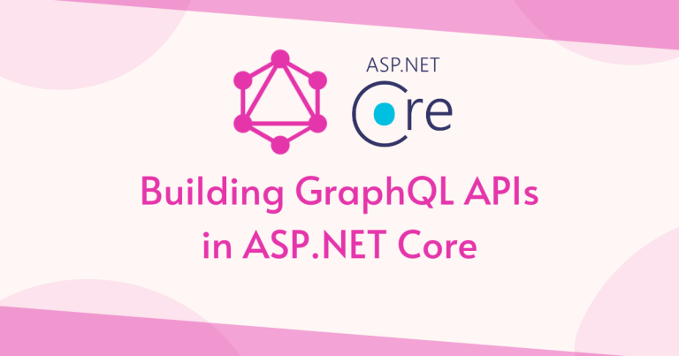

# GraphQL en ASP.NET Core con HotChocolate

- [GraphQL en ASP.NET Core con HotChocolate](#graphql-en-aspnet-core-con-hotchocolate)
  - [1. ¿Qué es GraphQL? ¿Por qué es especial?](#1-qué-es-graphql-por-qué-es-especial)
    - [Ventajas y Características](#ventajas-y-características)
    - [Comparación con REST](#comparación-con-rest)
  - [2. Sintaxis básica de GraphQL](#2-sintaxis-básica-de-graphql)
    - [2.1. Elementos del esquema](#21-elementos-del-esquema)
    - [2.2. Tipos soportados](#22-tipos-soportados)
    - [2.3. Ejemplo de sintaxis](#23-ejemplo-de-sintaxis)
  - [3. Instalación y configuración en ASP.NET Core](#3-instalación-y-configuración-en-aspnet-core)
    - [3.1. Paquetes NuGet](#31-paquetes-nuget)
    - [3.2. Configuración básica](#32-configuración-básica)
  - [4. Definiendo el esquema GraphQL](#4-definiendo-el-esquema-graphql)
    - [Schema Code-First (Recomendado en HotChocolate)](#schema-code-first-recomendado-en-hotchocolate)
  - [5. Implementación de Queries, Mutations y Subscriptions](#5-implementación-de-queries-mutations-y-subscriptions)
    - [5.1. Queries](#51-queries)
    - [5.2. Mutations](#52-mutations)
    - [5.3. Subscriptions (Tiempo Real)](#53-subscriptions-tiempo-real)
    - [5.4. Resolvers Personalizados](#54-resolvers-personalizados)
  - [6. Ejemplos de consultas, mutaciones y suscripciones](#6-ejemplos-de-consultas-mutaciones-y-suscripciones)
    - [6.1. Obtener todos los productos con su categoría](#61-obtener-todos-los-productos-con-su-categoría)
    - [6.2. Crear un producto](#62-crear-un-producto)
    - [6.3. Actualizar un producto](#63-actualizar-un-producto)
    - [6.4. Eliminar un producto](#64-eliminar-un-producto)
    - [6.5. Consulta de una categoría y sus productos](#65-consulta-de-una-categoría-y-sus-productos)
    - [6.6. Suscripción a productos creados](#66-suscripción-a-productos-creados)
  - [7. Integración con Entity Framework Core](#7-integración-con-entity-framework-core)
    - [7.1. Configuración](#71-configuración)
    - [7.2. Queries con EF Core](#72-queries-con-ef-core)
  - [8. Paginación, Filtros y Ordenamiento](#8-paginación-filtros-y-ordenamiento)
    - [8.1. Paginación](#81-paginación)
    - [8.2. Filtros](#82-filtros)
    - [8.3. Ordenamiento](#83-ordenamiento)
  - [9. Autenticación y Autorización](#9-autenticación-y-autorización)
    - [9.1. Configurar autenticación](#91-configurar-autenticación)
    - [9.2. Proteger Queries/Mutations](#92-proteger-queriesmutations)
  - [10. DataLoader (Evitar problema N+1)](#10-dataloader-evitar-problema-n1)
  - [11. Testing de GraphQL](#11-testing-de-graphql)
  - [12. Consejos y buenas prácticas](#12-consejos-y-buenas-prácticas)
  - [13. Ejercicio propuesto: API GraphQL de Funkos](#13-ejercicio-propuesto-api-graphql-de-funkos)
    - [Requisitos](#requisitos)
  - [14. Recursos y enlaces útiles](#14-recursos-y-enlaces-útiles)





---

## 1. ¿Qué es GraphQL? ¿Por qué es especial?

**GraphQL** es un lenguaje de consulta para APIs y un entorno de ejecución para tus datos.  Fue creado por Facebook en 2012 y liberado en 2015. 

### Ventajas y Características

- **Consulta flexible:** El cliente pide exactamente los datos que necesita
- **Un solo endpoint:** Se accede siempre a `/graphql`
- **Tipo fuerte:** El esquema define los tipos y validaciones
- **Consultas anidadas y relaciones:** Puedes obtener objetos relacionados en una sola petición
- **Introspección:** El cliente puede explorar el esquema automáticamente
- **Mutaciones:** Permite modificar datos de forma estructurada
- **Suscripciones:** Notificaciones en tiempo real
- **Evolución sin versionado:** El esquema puede crecer sin romper clientes antiguos

### Comparación con REST

| REST | GraphQL |
|: -----|:--------|
| Múltiples URLs | Un solo endpoint |
| Respuestas fijas | El cliente elige los campos |
| Overfetching | Solo lo que pides |
| Underfetching | Consultas anidadas |
| Versionado | No es necesario |

---

## 2. Sintaxis básica de GraphQL

### 2.1. Elementos del esquema

- **type**:  Define un objeto (como una clase C#)
- **input**: Define tipos de entrada para mutaciones
- **enum**:  Conjunto finito de valores posibles
- **Query**: Operaciones de lectura
- **Mutation**:  Operaciones de escritura (crear, modificar, borrar)
- **Subscription**:  Operaciones en tiempo real (push de eventos)
- **interface**: Contrato que deben implementar varios tipos
- **union**: Un campo puede ser uno de varios tipos

### 2.2. Tipos soportados

- **Escalares**:
  - `Int` (número entero)
  - `Float` (número decimal)
  - `String` (texto)
  - `Boolean` (true/false)
  - `ID` (identificador único)
  - `DateTime` (fecha y hora - HotChocolate)
  - `UUID` (GUID - HotChocolate)
- **Enum**: Enumerados
- **Objetos**: Definidos con `type`
- **Listas**: `[Tipo]`
- **Campos obligatorios**: `!`
- **Campos opcionales**:  sin `!`

### 2.3. Ejemplo de sintaxis

```graphql
type Producto {
    id: ID!
    nombre:  String!
    precio: Float! 
    categoria: Categoria!
    etiquetas: [String!]! 
}

type Categoria {
    id: ID!
    nombre: String!
    productos: [Producto!]! 
}
```

---

## 3. Instalación y configuración en ASP.NET Core

### 3.1. Paquetes NuGet

```bash
dotnet add package HotChocolate.AspNetCore
dotnet add package HotChocolate.AspNetCore.Authorization
dotnet add package HotChocolate.Data.EntityFramework
dotnet add package HotChocolate. Subscriptions.InMemory
```

### 3.2. Configuración básica

**Program.cs:**

```csharp
using HotChocolate;
using HotChocolate. AspNetCore;
using FunkosApi.GraphQL;

var builder = WebApplication.CreateBuilder(args);

// Configurar GraphQL
builder.Services
    .AddGraphQLServer()
    .AddQueryType<Query>()
    .AddMutationType<Mutation>()
    .AddSubscriptionType<Subscription>()
    .AddInMemorySubscriptions() // Para suscripciones en tiempo real
    .AddAuthorization(); // Para autenticación/autorización

var app = builder.Build();

// Habilitar GraphQL
app.MapGraphQL();

// Habilitar Banana Cake Pop (Playground de HotChocolate)
if (app.Environment.IsDevelopment())
{
    // Banana Cake Pop está incluido por defecto en /graphql
}

app.Run();
```

**Acceder al Playground:**
```
https://localhost:5001/graphql
```

---

## 4. Definiendo el esquema GraphQL

### Schema Code-First (Recomendado en HotChocolate)

**Models:**

```csharp
namespace FunkosApi.Models. GraphQL;

public class Producto
{
    public int Id { get; set; }
    public string Nombre { get; set; } = string.Empty;
    public decimal Precio { get; set; }
    public int Stock { get; set; }
    public int CategoriaId { get; set; }
    public Categoria Categoria { get; set; } = null!;
    public DateTime FechaCreacion { get; set; }
}

public class Categoria
{
    public int Id { get; set; }
    public string Nombre { get; set; } = string.Empty;
    public ICollection<Producto> Productos { get; set; } = new List<Producto>();
}
```

**Input Types:**

```csharp
namespace FunkosApi.GraphQL. Inputs;

public record ProductoInput(
    string Nombre,
    decimal Precio,
    int Stock,
    int CategoriaId
);

public record CategoriaInput(
    string Nombre
);
```

---

## 5. Implementación de Queries, Mutations y Subscriptions

### 5.1. Queries

```csharp
using HotChocolate;
using HotChocolate. Types;
using FunkosApi.Services;

namespace FunkosApi.GraphQL;

public class Query
{
    /// <summary>
    /// Obtiene todos los productos
    /// </summary>
    [UsePaging]
    [UseFiltering]
    [UseSorting]
    public IQueryable<Producto> GetProductos([Service] ApplicationDbContext context)
    {
        return context.Productos. Include(p => p.Categoria);
    }

    /// <summary>
    /// Obtiene un producto por ID
    /// </summary>
    public async Task<Producto? > GetProductoById(
        int id,
        [Service] IProductoService service)
    {
        return await service.GetByIdAsync(id);
    }

    /// <summary>
    /// Obtiene todas las categorías
    /// </summary>
    public async Task<List<Categoria>> GetCategorias([Service] ICategoriaService service)
    {
        return await service.GetAllAsync();
    }

    /// <summary>
    /// Obtiene una categoría por ID
    /// </summary>
    public async Task<Categoria?> GetCategoriaById(
        int id,
        [Service] ICategoriaService service)
    {
        return await service.GetByIdAsync(id);
    }
}
```

---

### 5.2. Mutations

```csharp
using HotChocolate;
using HotChocolate. Subscriptions;
using FunkosApi.GraphQL.Inputs;

namespace FunkosApi.GraphQL;

public class Mutation
{
    /// <summary>
    /// Crea un nuevo producto
    /// </summary>
    public async Task<Producto> CrearProducto(
        ProductoInput input,
        [Service] IProductoService service,
        [Service] ITopicEventSender eventSender)
    {
        var producto = await service.CreateAsync(new CreateProductoDto
        {
            Nombre = input.Nombre,
            Precio = input.Precio,
            Stock = input.Stock,
            CategoriaId = input. CategoriaId
        });

        // Enviar evento de suscripción
        await eventSender.SendAsync(nameof(Subscription.ProductoCreado), producto);

        return producto;
    }

    /// <summary>
    /// Actualiza un producto existente
    /// </summary>
    public async Task<Producto> ActualizarProducto(
        int id,
        ProductoInput input,
        [Service] IProductoService service,
        [Service] ITopicEventSender eventSender)
    {
        var producto = await service. UpdateAsync(id, new UpdateProductoDto
        {
            Nombre = input.Nombre,
            Precio = input.Precio,
            Stock = input.Stock,
            CategoriaId = input.CategoriaId
        });

        // Enviar evento de suscripción
        await eventSender.SendAsync(nameof(Subscription.ProductoActualizado), producto);

        return producto;
    }

    /// <summary>
    /// Elimina un producto
    /// </summary>
    public async Task<bool> EliminarProducto(
        int id,
        [Service] IProductoService service,
        [Service] ITopicEventSender eventSender)
    {
        await service.DeleteAsync(id);

        // Enviar evento de suscripción
        await eventSender.SendAsync(nameof(Subscription.ProductoEliminado), id);

        return true;
    }

    /// <summary>
    /// Crea una nueva categoría
    /// </summary>
    public async Task<Categoria> CrearCategoria(
        CategoriaInput input,
        [Service] ICategoriaService service)
    {
        return await service.CreateAsync(new CreateCategoriaDto
        {
            Nombre = input.Nombre
        });
    }
}
```

---

### 5.3. Subscriptions (Tiempo Real)

```csharp
using HotChocolate;
using HotChocolate.Execution;
using HotChocolate.Subscriptions;

namespace FunkosApi.GraphQL;

public class Subscription
{
    /// <summary>
    /// Notifica cuando se crea un producto
    /// </summary>
    [Subscribe]
    [Topic(nameof(ProductoCreado))]
    public Producto ProductoCreado([EventMessage] Producto producto)
    {
        return producto;
    }

    /// <summary>
    /// Notifica cuando se actualiza un producto
    /// </summary>
    [Subscribe]
    [Topic(nameof(ProductoActualizado))]
    public Producto ProductoActualizado([EventMessage] Producto producto)
    {
        return producto;
    }

    /// <summary>
    /// Notifica cuando se elimina un producto
    /// </summary>
    [Subscribe]
    [Topic(nameof(ProductoEliminado))]
    public int ProductoEliminado([EventMessage] int id)
    {
        return id;
    }
}
```

---

### 5.4. Resolvers Personalizados

```csharp
using HotChocolate;
using HotChocolate.Types;

namespace FunkosApi.GraphQL. Resolvers;

[ExtendObjectType(typeof(Producto))]
public class ProductoResolvers
{
    /// <summary>
    /// Resolver personalizado para categoría
    /// </summary>
    public async Task<Categoria> GetCategoria(
        [Parent] Producto producto,
        [Service] ICategoriaService service)
    {
        return await service.GetByIdAsync(producto.CategoriaId);
    }
}
```

---

## 6. Ejemplos de consultas, mutaciones y suscripciones

### 6.1. Obtener todos los productos con su categoría

```graphql
query {
  productos {
    id
    nombre
    precio
    stock
    categoria {
      id
      nombre
    }
  }
}
```

**Con paginación:**

```graphql
query {
  productos(first: 10, after: "cursor") {
    nodes {
      id
      nombre
      precio
    }
    pageInfo {
      hasNextPage
      endCursor
    }
  }
}
```

---

### 6.2. Crear un producto

```graphql
mutation {
  crearProducto(input: {
    nombre: "Funko Iron Man"
    precio: 29.99
    stock: 10
    categoriaId: 1
  }) {
    id
    nombre
    precio
    categoria {
      nombre
    }
  }
}
```

---

### 6.3. Actualizar un producto

```graphql
mutation {
  actualizarProducto(
    id: 1
    input: {
      nombre: "Funko Iron Man Edición Especial"
      precio: 39.99
      stock: 5
      categoriaId: 1
    }
  ) {
    id
    nombre
    precio
  }
}
```

---

### 6.4. Eliminar un producto

```graphql
mutation {
  eliminarProducto(id: 1)
}
```

---

### 6.5. Consulta de una categoría y sus productos

```graphql
query {
  categoriaById(id: 1) {
    id
    nombre
    productos {
      id
      nombre
      precio
      stock
    }
  }
}
```

---

### 6.6. Suscripción a productos creados

```graphql
subscription {
  productoCreado {
    id
    nombre
    precio
  }
}
```

**En el playground, se mantiene abierta la conexión WebSocket y recibe notificaciones en tiempo real.**

---

## 7. Integración con Entity Framework Core

### 7.1. Configuración

```csharp
builder.Services
    .AddGraphQLServer()
    .AddQueryType<Query>()
    .AddMutationType<Mutation>()
    .AddSubscriptionType<Subscription>()
    .AddFiltering()
    .AddSorting()
    .AddProjections()
    .RegisterDbContext<ApplicationDbContext>(DbContextKind. Pooled);
```

---

### 7.2. Queries con EF Core

```csharp
public class Query
{
    [UseProjection]
    [UseFiltering]
    [UseSorting]
    public IQueryable<Producto> GetProductos([Service] ApplicationDbContext context)
    {
        return context. Productos;
    }
}
```

**Consulta con proyección:**

```graphql
query {
  productos {
    id
    nombre
    # Solo estos campos se cargan de la BD
  }
}
```

---

## 8. Paginación, Filtros y Ordenamiento

### 8.1. Paginación

```csharp
[UsePaging(MaxPageSize = 50)]
public IQueryable<Producto> GetProductos([Service] ApplicationDbContext context)
{
    return context.Productos;
}
```

**Uso:**

```graphql
query {
  productos(first: 10) {
    nodes {
      id
      nombre
    }
    pageInfo {
      hasNextPage
      hasPreviousPage
      startCursor
      endCursor
    }
  }
}
```

---

### 8.2. Filtros

```csharp
[UseFiltering]
public IQueryable<Producto> GetProductos([Service] ApplicationDbContext context)
{
    return context. Productos;
}
```

**Uso:**

```graphql
query {
  productos(where: {
    precio:  { gt: 20 }
    nombre: { contains: "Iron" }
  }) {
    id
    nombre
    precio
  }
}
```

---

### 8.3. Ordenamiento

```csharp
[UseSorting]
public IQueryable<Producto> GetProductos([Service] ApplicationDbContext context)
{
    return context.Productos;
}
```

**Uso:**

```graphql
query {
  productos(order:  { precio: DESC }) {
    id
    nombre
    precio
  }
}
```

---

## 9. Autenticación y Autorización

### 9.1. Configurar autenticación

```csharp
builder.Services
    .AddGraphQLServer()
    .AddAuthorization();

// En mutations/queries
[Authorize]
public async Task<Producto> CrearProducto(...)
{
    // ... 
}

[Authorize(Roles = "Admin")]
public async Task<bool> EliminarProducto(...)
{
    // ...
}
```

---

### 9.2. Proteger Queries/Mutations

```csharp
using HotChocolate.AspNetCore.Authorization;

public class Mutation
{
    [Authorize]
    public async Task<Producto> CrearProducto(...)
    {
        // Solo usuarios autenticados
    }

    [Authorize(Roles = "Admin")]
    public async Task<bool> EliminarProducto(...)
    {
        // Solo administradores
    }
}
```

---

## 10. DataLoader (Evitar problema N+1)

```csharp
using GreenDonut;

public class CategoriaByIdDataLoader :  BatchDataLoader<int, Categoria>
{
    private readonly IDbContextFactory<ApplicationDbContext> _dbContextFactory;

    public CategoriaByIdDataLoader(
        IDbContextFactory<ApplicationDbContext> dbContextFactory,
        IBatchScheduler batchScheduler)
        : base(batchScheduler)
    {
        _dbContextFactory = dbContextFactory;
    }

    protected override async Task<IReadOnlyDictionary<int, Categoria>> LoadBatchAsync(
        IReadOnlyList<int> keys,
        CancellationToken cancellationToken)
    {
        await using var context = await _dbContextFactory.CreateDbContextAsync(cancellationToken);
        return await context.Categorias
            .Where(c => keys.Contains(c.Id))
            .ToDictionaryAsync(c => c. Id, cancellationToken);
    }
}

// Registrar
builder.Services
    .AddGraphQLServer()
    .AddDataLoader<CategoriaByIdDataLoader>();

// Uso en resolver
public async Task<Categoria> GetCategoria(
    [Parent] Producto producto,
    CategoriaByIdDataLoader dataLoader)
{
    return await dataLoader.LoadAsync(producto.CategoriaId);
}
```

---

## 11. Testing de GraphQL

```csharp
[TestFixture]
public class ProductoGraphQLTests
{
    [Test]
    public async Task Query_GetProductos_ReturnsProducts()
    {
        // Arrange
        var executor = await new ServiceCollection()
            .AddGraphQL()
            .AddQueryType<Query>()
            .AddInMemorySubscriptions()
            .BuildRequestExecutorAsync();

        // Act
        var result = await executor.ExecuteAsync(@"
            query {
                productos {
                    id
                    nombre
                }
            }
        ");

        // Assert
        result.ToJson().Should().Contain("productos");
    }
}
```

---

## 12. Consejos y buenas prácticas

✅ **Usa DataLoaders**:  Evita el problema N+1

✅ **Paginación**: Siempre en listas grandes

✅ **Filtros y ordenamiento**: Delega en la BD

✅ **Proyecciones**: Solo carga los campos necesarios

✅ **Autorización**: Protege mutations sensibles

✅ **Documentación**: Usa `<summary>` en C#, aparece en el schema

✅ **Validación**: Valida inputs antes de guardar

✅ **Errores**: Usa `GraphQLException` para errores personalizados

---

## 13. Ejercicio propuesto: API GraphQL de Funkos

### Requisitos

1. **Entidades**:
   - Funko:  id, nombre, precio, stock, imagen, categoría
   - Categoria: id, nombre, lista de funkos
2. **Operaciones**:
   - Queries: todos los funkos, funko por id, todas las categorías, categoría por id
   - Mutations: crear, actualizar, eliminar funkos y categorías
   - Subscriptions: notificar cuando se crea un funko
3. **Relaciones**:
   - Cada Funko pertenece a una categoría
   - Cada categoría puede tener muchos Funkos
4. **Extras**:
   - Paginación
   - Filtros (por nombre, rango de precio)
   - Ordenamiento
   - Validaciones (precio > 0, stock >= 0)
   - Autenticación (solo admins pueden crear/eliminar)
5. **Entrega**:
   - Implementar Queries, Mutations, Subscriptions
   - DataLoaders para optimizar
   - Tests automatizados
   - Ejemplos de consultas en README

---

## 14. Recursos y enlaces útiles

- [Documentación oficial de GraphQL](https://graphql.org/learn/)
- [HotChocolate Documentation](https://chillicream.com/docs/hotchocolate/v13)
- [GraphQL Playground online](https://graphqlbin.com/v2/new)
- [Banana Cake Pop](https://chillicream.com/products/bananacakepop) (Cliente GraphQL de HotChocolate)
- [Repositorio GitHub de HotChocolate](https://github.com/ChilliCream/hotchocolate)

