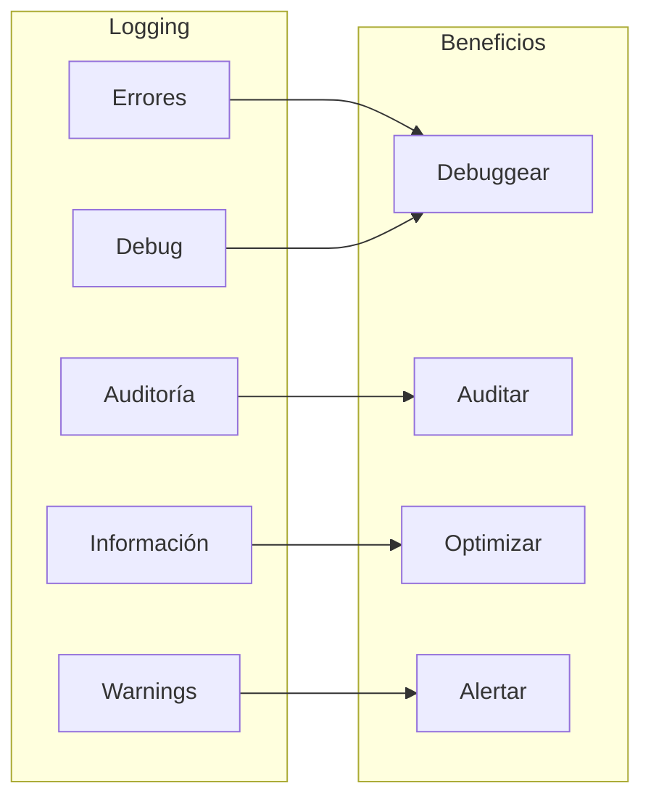
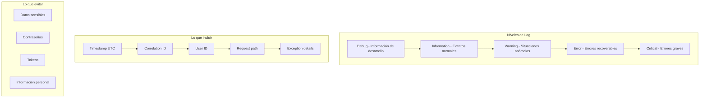

# 16. Logging y Monitoreo

## Indice

- [16. Logging y Monitoreo](#16-logging-y-monitoreo)
  - [16.1. Fundamentos de Logging](#161-fundamentos-de-logging)
    - [16.1.1. ¿Qué es el Logging?](#1611-qué-es-el-logging)
    - [16.1.2. ¿Qué es el Monitoreo?](#1612-qué-es-el-monitoreo)
    - [16.1.3. Logging Estructurado vs Texto Plano](#1613-logging-estructurado-vs-texto-plano)
  - [16.2. Serilog: Logging Estructurado](#162-serilog-logging-estructurado)
    - [16.2.1. Instalación de Paquetes](#1621-instalación-de-paquetes)
    - [16.2.2. Configuración Básica](#1622-configuración-básica)
    - [16.2.3. Configuración desde appsettings.json](#1623-configuración-desde-appsettingsjson)
    - [16.2.4. Sinks y Formateadores](#1624-sinks-y-formateadores)
    - [16.2.5. Enriquecedores de Log](#1625-enriquecedores-de-log)
  - [16.3. Uso de Logging en Servicios](#163-uso-de-logging-en-servicios)
    - [16.3.1. Inyección de ILogger](#1631-inyección-de-ilogger)
    - [16.3.2. Niveles de Log](#1632-niveles-de-log)
    - [16.3.3. Scopes de Log](#1633-scopes-de-log)
    - [16.3.4. Logueo de Excepciones](#1634-logueo-de-excepciones)
  - [16.4. Correlation ID para Trazabilidad](#164-correlation-id-para-trazabilidad)
    - [16.4.1. Middleware de Correlation ID](#1641-middleware-de-correlation-id)
    - [16.4.2. Uso del Correlation ID](#1642-uso-del-correlation-id)
  - [16.5. Métricas con Application Insights](#165-métricas-con-application-insights)
    - [16.5.1. Instalación](#1651-instalación)
    - [16.5.2. Configuración](#1652-configuración)
    - [16.5.3. Custom Metrics](#1653-custom-metrics)
  - [16.6. OpenTelemetry (Alternativa Moderna)](#166-opentelemetry-alternativa-moderna)
  - [16.7. Health Checks](#167-health-checks)
    - [16.7.1. Health Checks Básicos](#1671-health-checks-básicos)
    - [16.7.2. Custom Health Check](#1672-custom-health-check)
  - [16.8. Buenas Prácticas de Logging](#168-buenas-prácticas-de-logging)
  - [16.9. Resumen](#169-resumen)
  - [16.10. Ejercicio Propuesto](#1610-ejercicio-propuesto)
  - [16.11. Testing](#1611-testing)

---

## 16.1. Fundamentos de Logging

### 16.1.1. ¿Qué es el Logging?

El **logging** es el proceso de registrar eventos, errores y información relevante que ocurre durante la ejecución de una aplicación. Estos registros son fundamentales para el debugging, la auditoría de seguridad, el análisis de rendimiento y la resolución de problemas en producción. Sin un sistema de logging adecuado, diagnosticar errores en entornos de producción se convierte en una tarea casi imposible.

El logging efectivo permite a los desarrolladores y operadores entender qué está ocurriendo en la aplicación en tiempo real, reconstruir eventos que llevaron a un error, identificar patrones problemáticos y optimizar el rendimiento. Un buen sistema de logging debe ser configurable, eficiente y proporcionar información contextual relevante.



### 16.1.2. ¿Qué es el Monitoreo?

El **monitoreo** es el proceso de supervisar continuamente la salud, disponibilidad y rendimiento de una aplicación en producción. A diferencia del logging, que registra eventos discretos, el monitoreo proporciona una visión agregada del estado del sistema a través de métricas, dashboards y alertas.

El monitoreo efectivo permite detectar problemas antes de que afecten a los usuarios, identificar cuellos de botella de rendimiento, planificar capacidad y asegurar el cumplimiento de SLAs. Incluye métricas como tiempo de respuesta, tasa de errores, uso de recursos y disponibilidad.

| Problema | Impacto | Solución con Logging/Monitoreo |
|----------|---------|-------------------------------|
| Errores no detectados | Tiempo de inactividad prolongado | Logs de errores + alertas |
| Sin trazabilidad | Dificultad para debuggear | Correlation ID + structured logging |
| Sin métricas | Decisiones sin datos | Métricas + dashboards |
| Sin alertas | Respuesta lenta a incidentes | Health checks + alertas |

### 16.1.3. Logging Estructurado vs Texto Plano

El **logging estructurado** almacena los logs en formato JSON con campos clave-valor, permitiendo queries eficientes y análisis. En contraste, el **logging de texto plano** usa líneas de texto que son difíciles de parsear y buscar.

```mermaid
flowchart TD
    subgraph "Texto Plano"
        A1["[ERROR] 2024-01-15 10:30:45 - Error al procesar pedido 123"]
        A2["Difícil de parsear"]
        A3["Búsqueda limitada"]
        A4["Sin campos estructurados"]
    end
    
    subgraph "Logging Estructurado"
        B1[{"timestamp": "2024-01-15T10:30:45Z", "level": "Error", "message": "Error al procesar pedido", "pedidoId": 123, "error": "TimeoutException"}]
        B2["Fácil de parsear"]
        B3["Búsqueda avanzada"]
        B4["Campos indexados"]
    end
    
    style B1 fill:#0D47A1
    style B2 fill:#1B5E20
    style B3 fill:#1B5E20
    style B4 fill:#1B5E20
```

✅ **Ventajas del logging estructurado**:
- Queries eficientes con SQL o herramientas como Seq
- Filtrado por campos específicos
- Análisis estadístico de errores
- Correlación de eventos

❌ **Desventajas**:
- Mayor tamaño de logs
- Requiere herramientas de visualización

🧠 **Analogía**: El logging de texto plano es como escribir notas en un cuaderno desordenado. El logging estructurado es como usar una base de datos donde cada dato tiene su campo específico y se puede buscar instantáneamente.

---

## 16.2. Serilog: Logging Estructurado

### 16.2.1. Instalación de Paquetes

Serilog es la biblioteca de logging estructurado más popular en .NET. Ofrece excelente rendimiento, múltiples sinks de salida y configuración flexible.

```bash
dotnet add package Serilog.AspNetCore
dotnet add package Serilog.Sinks.Console
dotnet add package Serilog.Sinks.File
dotnet add package Serilog.Sinks.PostgreSQL
dotnet add package Serilog.Exceptions
```

### 16.2.2. Configuración Básica

```csharp
using Serilog;
using Serilog.Events;
using Serilog.Exceptions;

var builder = WebApplication.CreateBuilder(args);

Log.Logger = new LoggerConfiguration()
    .MinimumLevel.Debug()
    .MinimumLevel.Override("Microsoft", LogEventLevel.Information)
    .MinimumLevel.Override("Microsoft.AspNetCore", LogEventLevel.Warning)
    .Enrich.FromLogContext()
    .Enrich.WithExceptionDetails()
    .Enrich.WithProperty("Application", "TiendaApi")
    .Enrich.WithProperty("Environment", builder.Environment.EnvironmentName)
    
    // Console sink
    .WriteTo.Console(
        outputTemplate: "[{Timestamp:HH:mm:ss} {Level:u3}] {Message:lj}{NewLine}{Exception}")
    
    // File sink
    .WriteTo.File(
        path: "logs/api-.log",
        rollingInterval: RollingInterval.Day,
        rollOnFileSizeLimit: true,
        fileSizeLimitBytes: 10_000_000,
        retainedFileCountLimit: 30,
        outputTemplate: "[{Timestamp:yyyy-MM-dd HH:mm:ss} {Level:u3}] {Message:lj}{NewLine}{Exception}")
    
    // JSON file para análisis
    .WriteTo.File(
        path: "logs/api-json-.log",
        rollingInterval: RollingInterval.Hour,
        formatter: new Serilog.Formatting.Json.JsonFormatter())
    
    // PostgreSQL sink (opcional)
    .WriteTo.PostgreSQL(
        connectionString: builder.Configuration.GetConnectionString("PostgreSQL"),
        tableName: "logs",
        autoCreateSqlTable: true)
    
    // Seq sink (para desarrollo)
    .WriteTo.Seq("http://localhost:5341")
    
    .CreateLogger();

builder.Host.UseSerilog();

var app = builder.Build();

// Middleware para logging de requests
app.UseSerilogRequestLogging(options =>
{
    options.EnrichDiagnosticContext = (diagnosticContext, httpContext) =>
    {
        diagnosticContext.Set("RequestHost", httpContext.Request.Host.Value);
        diagnosticContext.Set("RequestScheme", httpContext.Request.Scheme);
        diagnosticContext.Set("UserAgent", httpContext.Request.Headers["User-Agent"].ToString());
        
        if (httpContext.User.Identity?.IsAuthenticated == true)
        {
            diagnosticContext.Set("UserId", httpContext.User.FindFirst(ClaimTypes.NameIdentifier)?.Value);
        }
    };

    options.GetLevel = (httpContext, elapsed, ex) =>
    {
        if (elapsed.TotalSeconds > 1)
            return LogEventLevel.Warning;
        
        if (ex != null)
            return LogEventLevel.Error;
        
        return LogEventLevel.Information;
    };
});

app.UseSerilogLogContext();

app.Run();
```

### 16.2.3. Configuración desde appsettings.json

```json
{
  "Serilog": {
    "Using": [
      "Serilog.Sinks.Console",
      "Serilog.Sinks.File",
      "Serilog.Exceptions"
    ],
    "MinimumLevel": {
      "Default": "Debug",
      "Override": {
        "Microsoft": "Information",
        "Microsoft.AspNetCore": "Warning",
        "System": "Warning"
      }
    },
    "Enrich": [
      "FromLogContext",
      "WithExceptionDetails",
      {
        "Name": "WithProperty",
        "Args": { "Name": "Application", "Value": "TiendaApi" }
      }
    ],
    "WriteTo": [
      {
        "Name": "Console",
        "Args": {
          "outputTemplate": "[{Timestamp:HH:mm:ss} {Level:u3}] {Message:lj}{NewLine}{Exception}"
        }
      },
      {
        "Name": "File",
        "Args": {
          "path": "logs/api-.log",
          "rollingInterval": "Day",
          "rollOnFileSizeLimit": true,
          "fileSizeLimitBytes": "10000000",
          "retainedFileCountLimit": "30"
        }
      }
    ],
    "Properties": {
      "Application": "TiendaApi",
      "Environment": "Development"
    }
  }
}
```

```csharp
using Serilog;
using Serilog.Events;

var builder = WebApplication.CreateBuilder(args);

var serilogConfig = builder.Configuration.GetSection("Serilog");

Log.Logger = new LoggerConfiguration()
    .ReadFrom.Configuration(serilogConfig)
    .CreateLogger();

builder.Host.UseSerilog();
```

### 16.2.4. Sinks y Formateadores

| Sink | Uso | Ejemplo |
|------|-----|---------|
| Console | Desarrollo | `WriteTo.Console()` |
| File | Persistencia | `WriteTo.File("logs/api-.log")` |
| PostgreSQL | Base de datos | `WriteTo.PostgreSQL()` |
| Seq | Búsqueda avanzada | `WriteTo.Seq("http://localhost:5341")` |
| Application Insights | Azure Monitor | `WriteTo.ApplicationInsights()` |

### 16.2.5. Enriquecedores de Log

Los **enriquecedores** añaden información contextual a todos los logs.

```csharp
Log.Logger = new LoggerConfiguration()
    .Enrich.FromLogContext()
    .Enrich.WithExceptionDetails()
    .Enrich.WithProperty("Application", "TiendaApi")
    .Enrich.WithProperty("Environment", builder.Environment.EnvironmentName)
    .Enrich.WithEnvironmentName()
    .Enrich.WithMachineName()
    .CreateLogger();
```

---

## 16.3. Uso de Logging en Servicios

### 16.3.1. Inyección de ILogger

```csharp
using Microsoft.Extensions.Logging;
using Serilog;

namespace TiendaApi.Core.Services;

public class ProductoService(IProductoRepository repository, ILogger<ProductoService> logger)
{
    public async Task<Result<Producto, Error>> GetByIdAsync(long id)
    {
        try
        {
            logger.LogInformation("Buscando producto {ProductoId}", id);

            var producto = await repository.GetByIdAsync(id);

            if (producto == null)
            {
                logger.LogWarning("Producto {ProductoId} no encontrado", id);
                return Result.Failure<Producto, Error>(Errors.Productos.NoEncontrados);
            }

            logger.LogInformation(
                "Producto {ProductoId} encontrado: {Nombre}", 
                id, producto.Nombre);

            return producto;
        }
        catch (Exception ex)
        {
            logger.LogError(ex, "Error buscando producto {ProductoId}", id);
            return Result.Failure<Producto, Error>(Errors.Productos.ErrorInesperado);
        }
    }
}

    public async Task<Result<Producto, Error>> GetByIdAsync(long id)
    {
        try
        {
            _logger.LogInformation("Buscando producto {ProductoId}", id);

            var producto = await _repository.GetByIdAsync(id);

            if (producto == null)
            {
                _logger.LogWarning("Producto {ProductoId} no encontrado", id);
                return Result.Failure<Producto, Error>(Errors.Productos.NoEncontrados);
            }

            _logger.LogInformation(
                "Producto {ProductoId} encontrado: {Nombre}", 
                id, producto.Nombre);

            return producto;
        }
        catch (Exception ex)
        {
            _logger.LogError(ex, "Error buscando producto {ProductoId}", id);
            return Result.Failure<Producto, Error>(Errors.Productos.ErrorInesperado);
        }
    }
```

### 16.3.2. Niveles de Log

| Nivel | Uso | Cuándo Usar |
|-------|-----|-------------|
| **Debug** | Información detallada | Debugging, desarrollo |
| **Information** | Eventos normales | Requests exitosos, operaciones completadas |
| **Warning** | Situaciones anómalas | Retries, timeouts, valores inusuales |
| **Error** | Errores recoverable | Excepciones capturadas, fallos parciales |
| **Critical** | Errores graves | Crash inminente, datos corruptos |

```csharp
_logger.LogDebug("Consultando producto {ProductoId}", id);
_logger.LogInformation("Producto {ProductoId} obtenido exitosamente", id);
_logger.LogWarning("Stock bajo para producto {ProductoId}: {Stock}", id, stock);
_logger.LogError(ex, "Error al procesar producto {ProductoId}", id);
_logger.LogCritical("Error crítico: {Message}", ex.Message);
```

### 16.3.3. Scopes de Log

Los **scopes** agrupan logs relacionados bajo un contexto común.

```csharp
public async Task<Result<List<Producto>, Error>> GetByCategoriaAsync(long categoriaId)
{
    using var _ = _logger.BeginScope("Obteniendo productos por categoría {CategoriaId}", categoriaId);

    _logger.LogDebug("Iniciando consulta de productos");

    var productos = await _repository.GetByCategoriaIdAsync(categoriaId);

    _logger.LogDebug("Consulta completada. {Count} productos encontrados", productos.Count);

    return productos;
}
```

### 16.3.4. Logueo de Excepciones

```csharp
try
{
    var result = await _repository.AddAsync(producto);
    
    if (result.IsSuccess)
    {
        _logger.LogInformation(
            "Producto creado {@Producto}", 
            new
            {
                result.Value.Id,
                result.Value.Nombre,
                result.Value.Precio,
                result.Value.CategoriaId
            });
    }
}
catch (DbUpdateException ex)
{
    _logger.LogError(ex, "Error de base de datos al crear producto {Nombre}", producto.Nombre);
    throw;
}
```

---

## 16.4. Correlation ID para Trazabilidad

### 16.4.1. Middleware de Correlation ID

El **correlation ID** es un identificador único que sigue una request a través de todos los servicios y logs, permitiendo reconstruir el flujo completo de una operación.

```csharp
public class CorrelationIdMiddleware(RequestDelegate next)
{
    public async Task InvokeAsync(HttpContext context)
    {
        var correlationId = context.Request.Headers["X-Correlation-ID"].FirstOrDefault();
        
        if (string.IsNullOrEmpty(correlationId))
        {
            correlationId = Guid.NewGuid().ToString();
        }

        context.Response.Headers["X-Correlation-ID"] = correlationId;
        context.Items["CorrelationId"] = correlationId;

        using var logScope = Log.BeginScope(new Dictionary<string, object>
        {
            ["CorrelationId"] = correlationId
        });

        await next(context);
    }
}

app.UseMiddleware<CorrelationIdMiddleware>();
```

### 16.4.2. Uso del Correlation ID

```csharp
public class ProductoService
{
    private readonly ILogger<ProductoService> _logger;

    public async Task<Result<Producto, Error>> GetByIdAsync(long id)
    {
        var correlationId = _logger.IsEnabled(LogLevel.Information) 
            ? HttpContextAccessor.HttpContext?.Items["CorrelationId"]?.ToString() 
            : null;

        _logger.LogInformation(
            "Buscando producto {ProductoId} (CorrelationId: {CorrelationId})",
            id, correlationId);

        // ...
    }
}
```

---

## 16.5. Métricas con Application Insights

### 16.5.1. Instalación

```bash
dotnet add package Microsoft.ApplicationInsights.AspNetCore
dotnet add package Microsoft.ApplicationInsights.PerfCounterCollector
```

### 16.5.2. Configuración

```csharp
builder.Services.AddApplicationInsightsTelemetry(options =>
{
    options.ConnectionString = builder.Configuration["ApplicationInsights:ConnectionString"];
    options.EnableQuickPulseMetricStream = true;
    options.EnableAdaptiveSampling = true;
});
```

### 16.5.3. Custom Metrics

```csharp
using Microsoft.ApplicationInsights;
using Microsoft.ApplicationInsights.DataContracts;

public class MetricsService(TelemetryClient telemetryClient)
{
    public void TrackPedidoCreado(decimal monto)
    {
        telemetryClient.TrackEvent("PedidoCreado", new Dictionary<string, string>
        {
            ["Monto"] = monto.ToString()
        });

        telemetryClient.GetMetric("PedidosCreados").TrackValue(1);
        telemetryClient.GetMetric("MontoPedidos").TrackValue((double)monto);
    }

    public void TrackCacheHit(string cacheType)
    {
        telemetryClient.GetMetric($"CacheHits_{cacheType}").TrackValue(1);
    }

    public void TrackCacheMiss(string cacheType)
    {
        telemetryClient.GetMetric($"CacheMisses_{cacheType}").TrackValue(1);
    }
}
```

---

## 16.6. OpenTelemetry (Alternativa Moderna)

OpenTelemetry es el estándar emergente para telemetría distribuida.

```bash
dotnet add package OpenTelemetry.Extensions.Hosting
dotnet add package OpenTelemetry.Exporter.Console
dotnet add package OpenTelemetry.Exporter.Otlp
dotnet add package OpenTelemetry.Instrumentation.AspNetCore
```

```csharp
builder.Services.AddOpenTelemetryMetrics(options =>
{
    options.SetResourceBuilder(ResourceBuilder.CreateDefault()
        .AddService(serviceName: "TiendaApi", serviceVersion: "1.0.0"))
        .AddAspNetCoreInstrumentation()
        .AddRuntimeInstrumentation()
        .AddOtlpExporter(otlpOptions =>
        {
            otlpOptions.Endpoint = new Uri("http://localhost:4317");
        });
});

builder.Services.AddOpenTelemetryTracing(options =>
{
    options.SetResourceBuilder(ResourceBuilder.CreateDefault()
        .AddService(serviceName: "TiendaApi", serviceVersion: "1.0.0"))
        .AddAspNetCoreInstrumentation()
        .AddEntityFrameworkCoreInstrumentation()
        .AddOtlpExporter(otlpOptions =>
        {
            otlpOptions.Endpoint = new Uri("http://localhost:4317");
        });
});
```

---

## 16.7. Health Checks

### 16.7.1. Health Checks Básicos

```csharp
builder.Services.AddHealthChecks()
    .AddCheck("self", () => HealthCheckResult.Healthy())
    .AddNpgSql(
        connectionString: builder.Configuration.GetConnectionString("PostgreSQL"),
        name: "postgresql",
        tags: ["database", "sql"])
    .AddRedis(
        connectionString: builder.Configuration.GetConnectionString("Redis"),
        name: "redis",
        tags: ["cache"])
    .AddUrlGroup(
        new Uri("https://api.external-service.com/health"),
        name: "external-api",
        tags: ["external"]);

app.MapHealthChecks("/health");
app.MapHealthChecks("/health/ready", new HealthCheckOptions
{
    Predicate = check => check.Tags.Contains("ready"),
    ResponseWriter = UIResponseWriter.WriteHealthCheckUIResponse
});
```

### 16.7.2. Custom Health Check

```csharp
public class CustomHealthCheck(IServiceScopeFactory scopeFactory) : IHealthCheck
{
    public async Task<HealthCheckResult> CheckHealthAsync(
        HealthCheckContext context,
        CancellationToken cancellationToken = default)
    {
        try
        {
            using var scope = scopeFactory.CreateScope();
            var contextDb = scope.ServiceProvider.GetRequiredService<TiendaDbContext>();

            var canConnect = await contextDb.Database.CanConnectAsync(cancellationToken);
            
            if (canConnect)
            {
                return HealthCheckResult.Healthy("Base de datos conectada");
            }

            return HealthCheckResult.Degraded("No se puede conectar a la base de datos");
        }
        catch (Exception ex)
        {
            return HealthCheckResult.Unhealthy(
                $"Error verificando base de datos: {ex.Message}");
        }
    }
}

builder.Services.AddHealthChecks()
    .AddCheck<CustomHealthCheck>("database-check");
```

---

## 16.8. Buenas Prácticas de Logging



✅ **Mejores prácticas**:
- Usar logging estructurado con Serilog
- Incluir correlation ID en todos los logs
- Configurar niveles apropiados por ambiente
- No loguear datos sensibles
- Usar enrichers para contexto
- Implementar health checks
- Configurar alertas en producción

---

## 16.9. Resumen

| Concepto | Descripción |
|----------|-------------|
| **Logging** | Registro de eventos para debugging y auditoría |
| **Serilog** | Biblioteca de logging estructurado |
| **Structured Logging** | Logs en formato JSON con campos |
| **Correlation ID** | Identificador único para trazabilidad |
| **Application Insights** | Métricas y monitoreo en Azure |
| **OpenTelemetry** | Estándar moderno de telemetría |
| **Health Checks** | Verificación de salud de la aplicación |

🧠 **Puntos clave**:
- Logging estructurado facilita debugging en producción
- Correlation ID permite rastrear requests completos
- Health checks detectan problemas proactivamente
- Métricas ayudan a optimizar rendimiento

---

## 16.10. Ejercicio Propuesto

**Objetivo**: Implementar un sistema completo de logging y monitoreo.

**Requisitos**:
1. Configurar Serilog con Console y File sinks
2. Implementar middleware de Correlation ID
3. Crear servicio de métricas con Application Insights
4. Implementar health checks para PostgreSQL y Redis
5. Escribir tests unitarios para logging

**Criterios de aceptación**:
- Logs estructurados en formato JSON
- Correlation ID presente en todos los logs
- Health checks responden correctamente
- Tests cubren casos happy path y errores

---

## 16.11. Testing

```csharp
using FluentAssertions;
using Microsoft.Extensions.Logging;
using Moq;
using NUnit.Framework;
using TiendaApi.Core.Services;

namespace TiendaApi.Core.Tests.Services;

[TestFixture]
public class LoggingTests
{
    private Mock<ILogger<ProductoService>> _loggerMock = null!;
    private ProductoService _service = null!;

    [SetUp]
    public void SetUp()
    {
        _loggerMock = new Mock<ILogger<ProductoService>>();
        _service = new ProductoService(
            Mock.Of<IProductoRepository>(),
            _loggerMock.Object);
    }

    [Test]
    public async Task GetByIdAsync_ConProductoExistente_LogInformation()
    {
        var producto = new Producto { Id = 1, Nombre = "Test" };
        var repositoryMock = new Mock<IProductoRepository>();
        repositoryMock.Setup(r => r.GetByIdAsync(1))
            .ReturnsAsync(Result.Success(producto));

        var service = new ProductoService(repositoryMock.Object, _loggerMock.Object);

        var result = await service.GetByIdAsync(1);

        result.IsSuccess.Should().BeTrue();
        _loggerMock.Verify(
            x => x.Log(
                LogLevel.Information,
                It.IsAny<EventId>(),
                It.IsAny<It.IsAnyType>(),
                It.IsAny<Exception>(),
                It.IsAny<Func<It.IsAnyType, Exception, string>>()),
            Times.Once);
    }

    [Test]
    public async Task GetByIdAsync_ConProductoNoExistente_LogWarning()
    {
        var repositoryMock = new Mock<IProductoRepository>();
        repositoryMock.Setup(r => r.GetByIdAsync(999))
            .ReturnsAsync(Result.Failure<Producto>(Errors.Productos.NoEncontrados));

        var service = new ProductoService(repositoryMock.Object, _loggerMock.Object);

        var result = await service.GetByIdAsync(999);

        result.IsFailure.Should().BeTrue();
        _loggerMock.Verify(
            x => x.Log(
                LogLevel.Warning,
                It.IsAny<EventId>(),
                It.IsAny<It.IsAnyType>(),
                It.IsAny<Exception>(),
                It.IsAny<Func<It.IsAnyType, Exception, string>>()),
            Times.Once);
    }

    [Test]
    public async Task GetByIdAsync_ConExcepcion_LogError()
    {
        var repositoryMock = new Mock<IProductoRepository>();
        repositoryMock.Setup(r => r.GetByIdAsync(1))
            .Throws(new Exception("Error de base de datos"));

        var service = new ProductoService(repositoryMock.Object, _loggerMock.Object);

        var result = await service.GetByIdAsync(1);

        result.IsFailure.Should().BeTrue();
        _loggerMock.Verify(
            x => x.Log(
                LogLevel.Error,
                It.IsAny<EventId>(),
                It.IsAny<It.IsAnyType>(),
                It.IsAny<Exception>(),
                It.IsAny<Func<It.IsAnyType, Exception, string>>()),
            Times.Once);
    }
}
```
