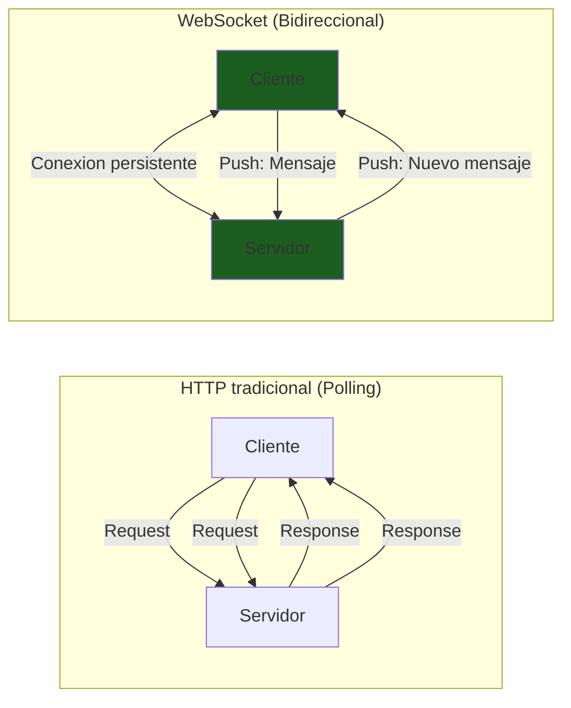
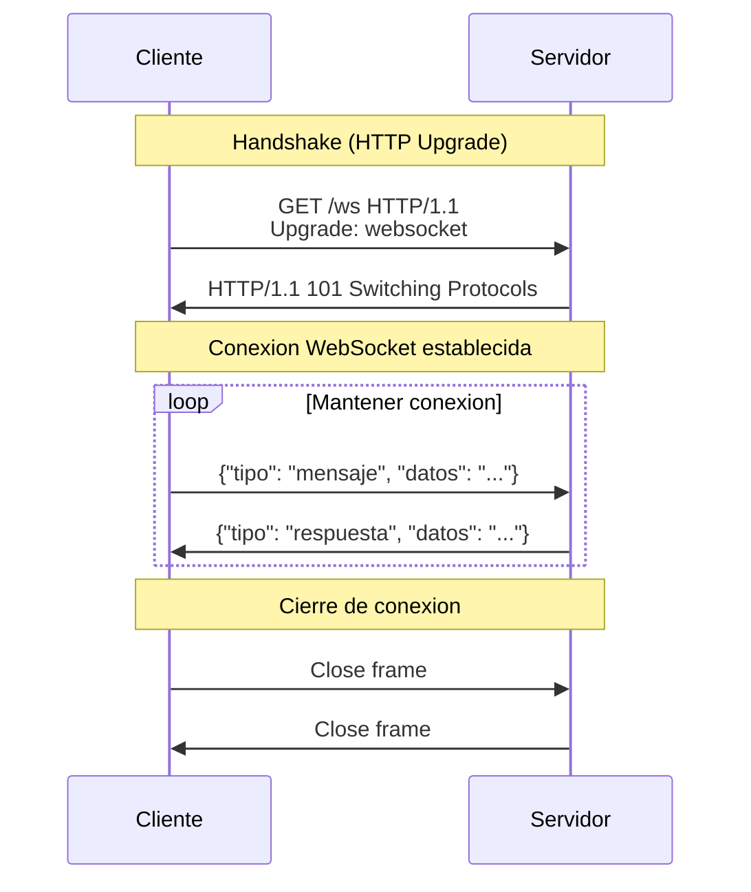
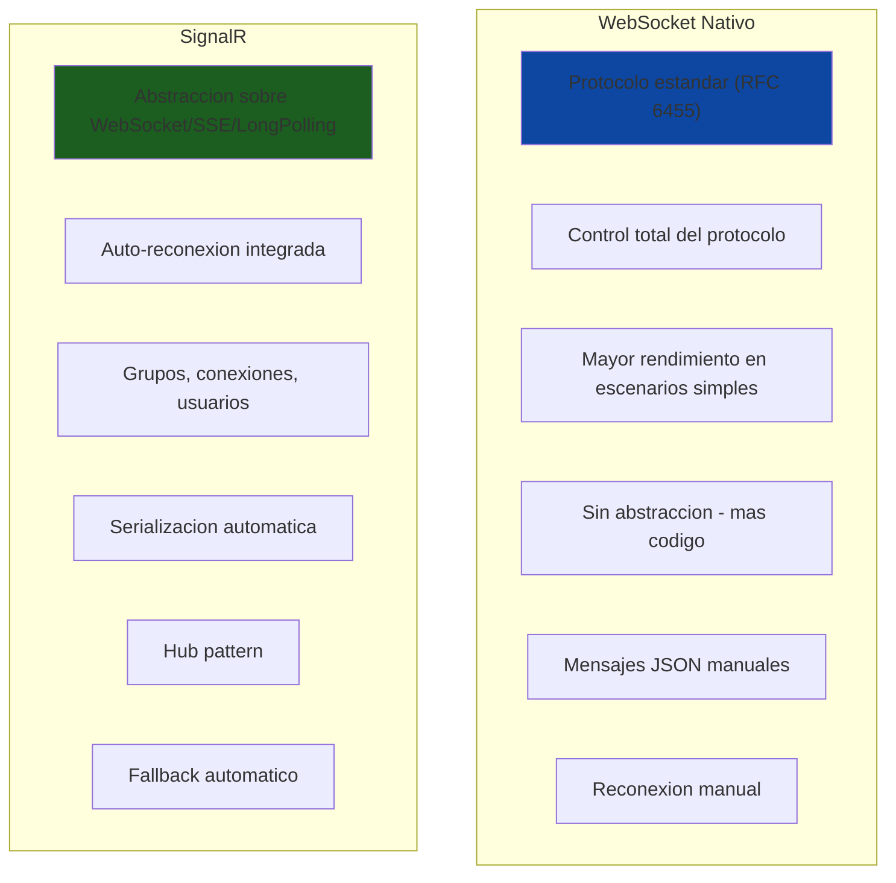
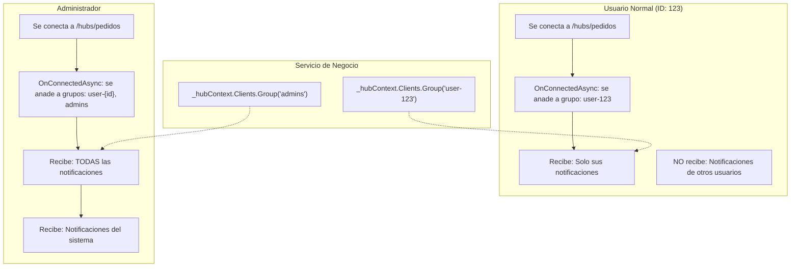
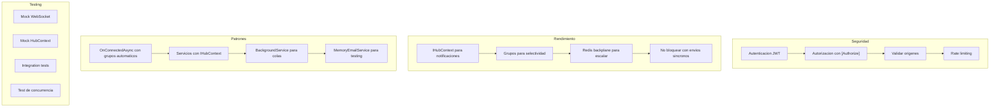

# 17. WebSockets y SignalR

## Indice

- [17. WebSockets y SignalR](#17-websockets-y-signalr)
  - [17.1. Fundamentos de Comunicacion en Tiempo Real](#171-fundamentos-de-comunicacion-en-tiempo-real)
    - [17.1.1. ¿Qué es la Comunicacion en Tiempo Real?](#1711-qué-es-la-comunicacion-en-tiempo-real)
    - [17.1.2. Diferencias con HTTP](#1712-diferencias-con-http)
    - [17.1.3. Casos de Uso](#1713-casos-de-uso)
    - [17.1.4. Funcionamiento de WebSocket](#1714-funcionamiento-de-websocket)
  - [17.2. WebSocket vs SignalR](#172-websocket-vs-signalr)
    - [17.2.1. Comparacion Fundamental](#1721-comparacion-fundamental)
    - [17.2.2. Tabla Comparativa](#1722-tabla-comparativa)
    - [17.2.3. Cuándo Usar WebSocket Puro vs SignalR](#1723-cuándo-usar-websocket-puro-vs-signalr)
  - [17.3. Conceptos Basicos](#173-conceptos-basicos)
    - [17.3.1. WebSocket Handler](#1731-websocket-handler)
    - [17.3.2. SignalR Hub](#1732-signalr-hub)
    - [17.3.3. IHubContext](#1733-ihubcontext)
    - [17.3.4. Comparacion Conceptual](#1734-comparacion-conceptual)
  - [17.4. WebSocket Nativo en ASP.NET Core](#174-websocket-nativo-en-aspnet-core)
    - [17.4.1. Configuracion de WebSockets](#1741-configuracion-de-websockets)
    - [17.4.2. WebSocketConnectionManager](#1742-websocketconnectionmanager)
    - [17.4.3. WebSocketHandler](#1743-websockethandler)
    - [17.4.4. Endpoint WebSocket](#1744-endpoint-websocket)
  - [17.5. SignalR en ASP.NET Core](#175-signalr-en-aspnet-core)
    - [17.5.1. Configuracion de SignalR](#1751-configuracion-de-signalr)
    - [17.5.2. SignalR Hub Basico](#1752-signalr-hub-basico)
    - [17.5.3. OnConnectedAsync y OnDisconnectedAsync](#1753-onconnectedasync-y-ondisconnectedasync)
  - [17.6. SignalR + Identity: Autenticacion y Autorizacion](#176-signalr--identity-autenticacion-y-autorizacion)
    - [17.6.1. Proteccion de Hubs con [Authorize](#1761-proteccion-de-hubs-con-authorize)
    - [17.6.2. Obtencion de Claims en el Hub](#1762-obtencion-de-claims-en-el-hub)
    - [17.6.3. Grupos Automaticos con Identity](#1763-grupos-automaticos-con-identity)
    - [17.6.4. Configuracion con JWT](#1764-configuracion-con-jwt)
  - [17.7. Sistema de Grupos para Notificaciones Selectivas](#177-sistema-de-grupos-para-notificaciones-selectivas)
    - [17.7.1. Patron de Grupos del Proyecto](#1771-patron-de-grupos-del-proyecto)
    - [17.7.2. Grupo user-{id} para Notificaciones Privadas](#1772-grupo-user-id-para-notificaciones-privadas)
    - [17.7.3. Grupo admins para Notificaciones de Administracion](#1773-grupo-admins-para-notificaciones-de-administracion)
    - [17.7.4. Envio desde Servicios de Negocio](#1774-envio-desde-servicios-de-negocio)
  - [17.8. IHubContext: El Patron del Proyecto](#178-ihubcontext-el-patron-del-proyecto)
    - [17.8.1. Inyeccion de Dependencias](#1781-inyeccion-de-dependencias)
    - [17.8.2. Notificaciones a Grupos Especificos](#1782-notificaciones-a-grupos-especificos)
    - [17.8.3. Broadcast a Todos](#1783-broadcast-a-todos)
  - [17.9. Integracion con Servicios de Negocio](#179-integracion-con-servicios-de-negocio)
    - [17.9.1. Ejemplo Completo en PedidoService](#1791-ejemplo-completo-en-pedidoservice)
    - [17.9.2. Notificaciones de Productos](#1792-notificaciones-de-productos)
    - [17.9.3. Notificaciones Privadas vs Publicas](#1793-notificaciones-privadas-vs-publicas)
  - [17.10. Seguridad en WebSockets y SignalR](#1710-seguridad-en-websockets-y-signalr)
    - [17.10.1. Autenticacion JWT en WebSocket](#17101-autenticacion-jwt-en-websocket)
    - [17.10.2. Validacion de Origen](#17102-validacion-de-origen)
    - [17.10.3. Rate Limiting](#17103-rate-limiting)
    - [17.10.4. Seguridad en SignalR](#17104-seguridad-en-signalr)
  - [17.11. Cliente JavaScript WebSocket](#1711-cliente-javascript-websocket)
    - [17.11.1. Cliente WebSocket Basico](#17111-cliente-websocket-basico)
    - [17.11.2. Manejo de Eventos](#17112-manejo-de-eventos)
    - [17.11.3. Reconexion Automatica](#17113-reconexion-automatica)
  - [17.12. Cliente JavaScript SignalR](#1712-cliente-javascript-signalr)
    - [17.12.1. SignalR Client Basico](#17121-signalr-client-basico)
    - [17.12.2. Autenticacion con JWT](#17122-autenticacion-con-jwt)
    - [17.12.3. Suscripcion a Grupos](#17123-suscripcion-a-grupos)
  - [17.13. SignalR: Escalabilidad con Redis](#1713-signalr-escalabilidad-con-redis)
  - [17.14. Buenas Practicas](#1714-buenas-practicas)
  - [17.15. Resumen](#1715-resumen)
  - [17.16. Ejercicio Propuesto](#1716-ejercicio-propuesto)
  - [17.17. Testing](#1717-testing)

---

## 17.1. Fundamentos de Comunicacion en Tiempo Real

### 17.1.1. ¿Qué es la Comunicacion en Tiempo Real?

La **comunicacion en tiempo real** permite que el servidor envíe datos a los clientes sin que estos lo soliciten, eliminando el patrón tradicional de request-response donde el cliente siempre debe iniciar la comunicación. Esta capacidad es fundamental para aplicaciones modernas que requieren actualizaciones instantáneas como notificaciones push, chat en vivo, dashboards de métricas en tiempo real y colaboración multiplayer.

En el modelo tradicional HTTP, el cliente envía una solicitud y espera la respuesta del servidor. Si no hay nueva información, el cliente debe seguir preguntando (polling), lo cual es ineficiente y tiene latencia. Con comunicación en tiempo real, el servidor puede enviar actualizaciones inmediatamente cuando ocurren, reduciendo la latencia y el consumo de recursos de red.



🧠 **Analogía**: HTTP es como pedir un taxi cada vez que quieres ir a algún lugar (cada request/response es un viaje completo). WebSocket es como contratar un chófer permanente que se queda contigo todo el día, disponible para llevarte a cualquier lugar instantáneamente sin tener que llamar cada vez.

### 17.1.2. Diferencias con HTTP

| Aspecto | HTTP | WebSocket |
|---------|------|-----------|
| **Comunicacion** | Unidireccional (request/response) | Bidireccional |
| **Conexion** | Se cierra despues de cada respuesta | Persistente |
| **Latencia** | Mayor (nueva conexion por peticion) | Menor (conexion abierta) |
| **Overhead** | Headers grandes en cada peticion | Headers solo al conectar |
| **Uso** | APIs REST tradicionales | Chat, notificaciones, tiempo real |
| **Puerto** | 80/443 | 80/443 (mismo que HTTP) |

✅ **Ventajas de WebSocket**:
- Comunicacion bidireccional verdadera
- Latencia minima
- Reduccion de overhead de red
- Ideal para tiempo real

### 17.1.3. Casos de Uso

| Caso de uso | Ejemplo | Recomendacion |
|-------------|---------|---------------|
| **Notificaciones push** | "Tu pedido ha sido enviado" | WebSocket o SignalR |
| **Chat en tiempo real** | Chat de soporte al cliente | WebSocket o SignalR |
| **Live updates** | Dashboard de metricas | WebSocket o SignalR |
| **Colaboracion** | Editores colaborativos (Google Docs) | WebSocket o SignalR |
| **Gaming** | Multiplayer en tiempo real | WebSocket (RAW) |
| **API simple** | Consultas esporadicas | REST |

### 17.1.4. Funcionamiento de WebSocket

El proceso de conexion WebSocket comienza con un **handshake** (saludo inicial) que parece una peticion HTTP normal pero incluye headers especiales indicando que se desea actualizar la conexion al protocolo WebSocket.



**Handshake del cliente:**
```http
GET /ws HTTP/1.1
Host: localhost:5000
Upgrade: websocket
Connection: Upgrade
Sec-WebSocket-Key: dGhlIHNhbXBsZSBub25jZQ==
Sec-WebSocket-Version: 13
```

**Respuesta del servidor:**
```http
HTTP/1.1 101 Switching Protocols
Upgrade: websocket
Connection: Upgrade
Sec-WebSocket-Accept: s3pPLMBiTxaq9kYG3hVMrTJSsWw=
```

---

## 17.2. WebSocket vs SignalR

### 17.2.1. Comparacion Fundamental

**WebSocket nativo** es la implementacion directa del protocolo WebSocket definido en RFC 6455. Ofrece control total sobre la conexion y el rendimiento máximo, pero requiere escribir mas codigo para funcionalidades comunes como grupos, reconexion automatica y serializacion.

**SignalR** es una abstraccion sobre WebSocket que simplifica enormemente el desarrollo. Proporciona grupos integrados, reconexion automatica, serializacion automatica y fallback a SSE o LongPolling si WebSocket no esta disponible. La desventaja es un pequeno overhead y menor control sobre el protocolo.



### 17.2.2. Tabla Comparativa

| Aspecto | WebSocket Nativo | SignalR |
|---------|------------------|---------|
| **Protocolo** | Solo WebSocket | WebSocket + fallback |
| **Conexion persistente** | Manual | Automatica |
| **Grupos** | Implementar tu | Integrado |
| **Reconexion** | Manual | Automatica |
| **Serializacion** | JSON manual | Automatica |
| **Rendimiento** | Mejor | Bueno |
| **Simplicidad** | Mas codigo | Mas facil |
| **Escalabilidad** | Redis Pub/Sub manual | Redis backplane |
| **Debugging** | Mas dificil | Mas facil |

### 17.2.3. Cuándo Usar WebSocket Puro vs SignalR

| Funcionalidad | WebSocket Nativo | SignalR |
|---------------|------------------|---------|
| **Gestion de conexiones** | Manual (~50 líneas) | Automática (0 líneas) |
| **Grupos** | Dictionary manual | Groups.AddToGroupAsync() |
| **Serializacion** | JsonSerializer manual | Automatico con tipos |
| **Reconexion** | setTimeout + retry | AutoReconnect (configurable) |
| **Typed messages** | String + switch case | Generic SendAsync<T>() |
| **Autenticacion** | JWT header manual | accessTokenFactory |
| **Autorizacion** | Manual con middleware | [Authorize] integrado |
| **Identity Integration** | No nativo | Total con Claims |
| **Escalabilidad** | Redis Pub/Sub manual | Redis Backplane integrado |
| **Fallback** | No disponible | SSE/LongPolling automatico |
| **Lineas de codigo** | ~200-300 | ~80-100 |

🧠 **Analogía**: WebSocket nativo es como conducir un coche manual - tienes control total pero debes cambiar marchas manualmente. SignalR es como un coche automatic - mas comodo pero menos control sobre el motor.

---

## 17.3. Conceptos Basicos

### 17.3.1. WebSocket Handler

Un **Handler** es una clase que gestiona la conexion WebSocket y el intercambio de mensajes. Es responsable de aceptar la conexion, recibir mensajes del cliente, procesar esos mensajes y enviar respuestas.

```csharp
using System.Net.WebSockets;
using System.Text;

namespace TiendaApi.Core.WebSockets;

public class WebSocketHandler
{
    private readonly WebSocket _webSocket;
    private readonly ILogger<WebSocketHandler> _logger;
    private const int BufferSize = 4096;

    public WebSocketHandler(WebSocket webSocket, ILogger<WebSocketHandler> logger)
    {
        _webSocket = webSocket;
        _logger = logger;
    }

    public async Task HandleAsync()
    {
        var buffer = new byte[BufferSize];

        while (_webSocket.State == WebSocketState.Open)
        {
            var result = await _webSocket.ReceiveAsync(
                new ArraySegment<byte>(buffer),
                CancellationToken.None);

            if (result.MessageType == WebSocketMessageType.Close)
            {
                await _webSocket.CloseAsync(
                    WebSocketCloseStatus.NormalClosure, 
                    "Cerrado", 
                    CancellationToken.None);
                break;
            }

            if (result.MessageType == WebSocketMessageType.Text)
            {
                var message = Encoding.UTF8.GetString(buffer, 0, result.Count);
                await ProcessMessageAsync(message);
            }
        }
    }

    private async Task ProcessMessageAsync(string message)
    {
        _logger.LogInformation("Mensaje recibido: {Message}", message);
        
        var response = $"Echo: {message}";
        await _webSocket.SendAsync(
            new ArraySegment<byte>(Encoding.UTF8.GetBytes(response)),
            WebSocketMessageType.Text,
            true,
            CancellationToken.None);
    }
}
```

### 17.3.2. SignalR Hub

Un **Hub** es una abstraccion de nivel superior que SignalR proporciona sobre WebSocket. Permite llamar metodos entre cliente y servidor de forma sencilla. El Hub proporciona propiedades importantes como `Context.ConnectionId`, `Context.User`, `Groups` y `Clients`.

```csharp
using Microsoft.AspNetCore.SignalR;

namespace TiendaApi.Core.Hubs;

public class ChatHub(ILogger<ChatHub> logger) : Hub
{
    // Context.ConnectionId - ID unico de la conexion
    // Context.User - Usuario autenticado (si aplica)
    // Groups - Gestion de grupos
    // Clients - Referencia a todos los clientes conectados

    public override async Task OnConnectedAsync()
    {
        await base.OnConnectedAsync();
        logger.LogInformation("Cliente conectado: {ConnectionId}", Context.ConnectionId);
    }

    public override async Task OnDisconnectedAsync(Exception? exception)
    {
        await base.OnDisconnectedAsync(exception);
        logger.LogInformation("Cliente desconectado: {ConnectionId}", Context.ConnectionId);
    }

    // Metodo que puede ser llamado por el cliente
    public async Task SendMessage(string user, string message)
    {
        // Enviar a todos los clientes
        await Clients.All.SendAsync("ReceiveMessage", user, message);
    }

    // Enviar a un usuario especifico (usando grupos)
    public async Task SendToUser(string targetUser, string message)
    {
        await Clients.Group($"user-{targetUser}").SendAsync("PrivateMessage", message);
    }

    // Unirse a un grupo
    public async Task JoinGroup(string groupName)
    {
        await Groups.AddToGroupAsync(Context.ConnectionId, groupName);
        await Clients.Group(groupName).SendAsync("UserJoined", Context.ConnectionId, groupName);
    }
}
```

### 17.3.3. IHubContext

El **IHubContext** permite enviar mensajes desde servicios de negocio sin tener acceso directo al Hub. Esto es crucial para el patrón del proyecto donde los servicios de negocio notifican a los clientes.

```csharp
using Microsoft.AspNetCore.SignalR;

namespace TiendaApi.Core.Services;

public interface INotificationService
{
    Task NotifyUserAsync(long userId, object message);
    Task NotifyAdminsAsync(object message);
    Task BroadcastAsync(object message);
}

public class SignalRNotificationService(
    IHubContext<PedidosHub> hubContext,
    ILogger<SignalRNotificationService> logger) : INotificationService
{
    // Notificar SOLO al usuario especifico
    public async Task NotifyUserAsync(long userId, object message)
    {
        await _hubContext.Clients
            .Group($"user-{userId}")
            .SendAsync("Notificacion", message);
    }

    // Notificar SOLO a administradores
    public async Task NotifyAdminsAsync(object message)
    {
        await _hubContext.Clients
            .Group("admins")
            .SendAsync("AdminNotification", message);
    }

    // Broadcast a todos
    public async Task BroadcastAsync(object message)
    {
        await _hubContext.Clients.All.SendAsync("Broadcast", message);
    }
}
```

### 17.3.4. Comparacion Conceptual

```mermaid
flowchart TB
    subgraph "WebSocket Nativo"
        A1["WebSocket Handler"]
        A2["Gestion manual de conexiones con ConcurrentDictionary"]
        A3["Envio manual de mensajes con SendAsync"]
        A4["Grupos: Dictionary<string, HashSet<string>>"]
        A5["Serializacion JSON manual"]
        A6["Reconexion manual con setTimeout"]
    end

    subgraph "SignalR"
        B1["Hub"]
        B2["Conexiones automaticas gestionadas por SignalR"]
        B3["Clients.All.SendAsync() / Clients.Group().SendAsync()"]
        B4["Groups.AddToGroupAsync() / Groups.RemoveFromGroupAsync()"]
        B5["Serializacion automatica con System.Text.Json"]
        B6["Auto-reconexion configurada"]
    end

    A1 --> A2 --> A3 --> A4 --> A5 --> A6
    B1 --> B2 --> B3 --> B4 --> B5 --> B6
```



---

## 17.4. WebSocket Nativo en ASP.NET Core

### 17.4.1. Configuracion de WebSockets

```csharp
using Microsoft.AspNetCore.WebSockets;

var builder = WebApplication.CreateBuilder(args);

builder.Services.AddControllers();
builder.Services.AddEndpointsApiExplorer();
builder.Services.AddSwaggerGen();

// Registrar manejadores de WebSocket
builder.Services.AddSingleton<IWebSocketHandler, FunkosWebSocketHandler>();
builder.Services.AddSingleton<IWebSocketConnectionManager, WebSocketConnectionManager>();

var app = builder.Build();

if (app.Environment.IsDevelopment())
{
    app.UseSwagger();
    app.UseSwaggerUI();
}

// Configurar CORS para WebSockets
app.UseCors(policy =>
{
    policy.WithOrigins("http://localhost:3000")
          .AllowAnyHeader()
          .AllowAnyMethod()
          .AllowCredentials();
});

// Habilitar WebSockets
app.UseWebSockets(new WebSocketOptions
{
    KeepAliveInterval = TimeSpan.FromSeconds(120),
    AllowedOrigins = { "http://localhost:3000" }
});

app.MapControllers();

app.Run();
```

### 17.4.2. WebSocketConnectionManager

El **ConnectionManager** gestiona todas las conexiones WebSocket activas, permitiendo enviar mensajes a clientes especificos o hacer broadcast.

```csharp
using System.Collections.Concurrent;
using System.Net.WebSockets;
using System.Text;
using System.Text.Json;

namespace TiendaApi.Core.WebSockets;

public class WebSocketConnectionManager
{
    private readonly ConcurrentDictionary<string, WebSocket> _connections = new();
    private readonly ConcurrentDictionary<string, HashSet<string>> _userConnections = new();
    private readonly ILogger<WebSocketConnectionManager> _logger;

    public WebSocketConnectionManager(ILogger<WebSocketConnectionManager> logger)
    {
        _logger = logger;
    }

    public string AddConnection(WebSocket webSocket)
    {
        var connectionId = Guid.NewGuid().ToString();
        _connections.TryAdd(connectionId, webSocket);
        _logger.LogInformation("Conexion agregada: {ConnectionId}. Total: {Count}", 
            connectionId, _connections.Count);
        return connectionId;
    }

    public void RemoveConnection(string connectionId)
    {
        if (_connections.TryRemove(connectionId, out var webSocket))
        {
            foreach (var kvp in _userConnections)
            {
                kvp.Value.Remove(connectionId);
            }
            _logger.LogInformation("Conexion eliminada: {ConnectionId}. Total: {Count}", 
                connectionId, _connections.Count);
        }
    }

    public WebSocket? GetConnection(string connectionId)
    {
        _connections.TryGetValue(connectionId, out var webSocket);
        return webSocket;
    }

    public async Task SendMessageAsync(string connectionId, string message)
    {
        if (_connections.TryGetValue(connectionId, out var webSocket) && 
            webSocket.State == WebSocketState.Open)
        {
            var bytes = Encoding.UTF8.GetBytes(message);
            await webSocket.SendAsync(
                new ArraySegment<byte>(bytes),
                WebSocketMessageType.Text,
                true,
                CancellationToken.None);
        }
    }

    public async Task BroadcastAsync(string message)
    {
        var connections = _connections
            .Where(kvp => kvp.Value.State == WebSocketState.Open)
            .ToList();
        
        _logger.LogInformation("Broadcast a {Count} conexiones", connections.Count);

        foreach (var (connectionId, webSocket) in connections)
        {
            await SendMessageAsync(connectionId, message);
        }
    }

    public async Task SendToGroupAsync(string groupName, string message)
    {
        if (_userConnections.TryGetValue(groupName, out var connections))
        {
            var tasks = connections
                .Where(id => _connections.TryGetValue(id, out var ws) && ws.State == WebSocketState.Open)
                .Select(id => SendMessageAsync(id, message));

            await Task.WhenAll(tasks);
        }
    }

    public void AddToGroup(string connectionId, string groupName)
    {
        _userConnections.GetOrAdd(groupName, _ => new HashSet<string>()).Add(connectionId);
    }

    public void RemoveFromGroup(string connectionId, string groupName)
    {
        if (_userConnections.TryGetValue(groupName, out var connections))
        {
            connections.Remove(connectionId);
        }
    }

    public IEnumerable<WebSocket> GetAllConnections()
    {
        return _connections.Values.Where(c => c.State == WebSocketState.Open);
    }
}

public class WebSocketMessage
{
    public string Type { get; set; } = string.Empty;
    public string? Payload { get; set; }
    public DateTime Timestamp { get; set; } = DateTime.UtcNow;
}
```

### 17.4.3. WebSocketHandler

```csharp
using System.Net.WebSockets;
using System.Text;
using System.Text.Json;

namespace TiendaApi.Core.WebSockets;

public class WebSocketHandler
{
    private readonly WebSocketConnectionManager _manager;
    private readonly ILogger<WebSocketHandler> _logger;
    private const int BufferSize = 4096;

    public WebSocketHandler(
        WebSocketConnectionManager manager,
        ILogger<WebSocketHandler> logger)
    {
        _manager = manager;
        _logger = logger;
    }

    public async Task HandleConnectionAsync(WebSocket webSocket)
    {
        var connectionId = _manager.AddConnection(webSocket);
        _logger.LogInformation("WebSocket conectado: {ConnectionId}", connectionId);

        var buffer = new byte[BufferSize];

        try
        {
            while (webSocket.State == WebSocketState.Open)
            {
                var result = await webSocket.ReceiveAsync(
                    new ArraySegment<byte>(buffer),
                    CancellationToken.None);

                if (result.MessageType == WebSocketMessageType.Close)
                {
                    _logger.LogInformation(
                        "WebSocket cerrado: {ConnectionId}, Reason: {Reason}",
                        connectionId, result.CloseStatusDescription);
                    break;
                }

                if (result.MessageType == WebSocketMessageType.Text)
                {
                    var message = Encoding.UTF8.GetString(buffer, 0, result.Count);
                    await ProcessMessageAsync(connectionId, message);
                }
            }
        }
        catch (WebSocketException ex)
        {
            _logger.LogError(ex, "Error en WebSocket: {ConnectionId}", connectionId);
        }
        finally
        {
            _manager.RemoveConnection(connectionId);
        }
    }

    private async Task ProcessMessageAsync(string connectionId, string message)
    {
        try
        {
            var wsMessage = JsonSerializer.Deserialize<WebSocketMessage>(
                message, 
                new JsonSerializerOptions { PropertyNameCaseInsensitive = true });

            if (wsMessage == null) return;

            switch (wsMessage.Type.ToLower())
            {
                case "subscribe":
                    await HandleSubscriptionAsync(connectionId, wsMessage.Payload);
                    break;
                    
                case "unsubscribe":
                    await HandleUnsubscriptionAsync(connectionId, wsMessage.Payload);
                    break;
                    
                case "ping":
                    await SendPongAsync(connectionId);
                    break;
                    
                case "message":
                    await _manager.BroadcastAsync(wsMessage.Payload ?? message);
                    break;
                    
                case "message-to-group":
                    if (!string.IsNullOrEmpty(wsMessage.Payload))
                    {
                        await _manager.SendToGroupAsync(wsMessage.Payload, message);
                    }
                    break;
            }
        }
        catch (JsonException ex)
        {
            _logger.LogError(ex, "Error parseando mensaje WebSocket");
        }
    }

    private async Task SendPongAsync(string connectionId)
    {
        var pongMessage = JsonSerializer.Serialize(new
        {
            type = "pong",
            timestamp = DateTime.UtcNow
        });
        await _manager.SendMessageAsync(connectionId, pongMessage);
    }

    private async Task HandleSubscriptionAsync(string connectionId, string? topic)
    {
        if (string.IsNullOrEmpty(topic)) return;
        
        _manager.AddToGroup(connectionId, topic);
        
        var response = JsonSerializer.Serialize(new
        {
            type = "subscribed",
            topic = topic,
            timestamp = DateTime.UtcNow
        });
        await _manager.SendMessageAsync(connectionId, response);
        
        _logger.LogInformation("Conexion {ConnectionId} suscrita al topic {Topic}", connectionId, topic);
    }

    private async Task HandleUnsubscriptionAsync(string connectionId, string? topic)
    {
        if (string.IsNullOrEmpty(topic)) return;
        
        _manager.RemoveFromGroup(connectionId, topic);
        
        var response = JsonSerializer.Serialize(new
        {
            type = "unsubscribed",
            topic = topic,
            timestamp = DateTime.UtcNow
        });
        await _manager.SendMessageAsync(connectionId, response);
    }
}
```

### 17.4.4. Endpoint WebSocket

```csharp
app.Map("/ws", async context =>
{
    if (context.WebSocket.IsWebSocketRequest)
    {
        var webSocket = await context.WebSocket.AcceptWebSocketAsync();
        var handler = context.RequestServices.GetRequiredService<IWebSocketHandler>();
        await handler.HandleConnectionAsync(webSocket);
    }
    else
    {
        context.Response.StatusCode = StatusCodes.Status400BadRequest;
    }
});
```

---

## 17.5. SignalR en ASP.NET Core

### 17.5.1. Configuracion de SignalR

```csharp
using Microsoft.AspNetCore.SignalR;

var builder = WebApplication.CreateBuilder(args);

// SignalR se configura asi:
builder.Services.AddSignalR();

// Configurar CORS para SignalR
builder.Services.AddCors(options =>
{
    options.AddPolicy("AllowSignalR", policy =>
    {
        policy.WithOrigins("http://localhost:3000")
              .AllowAnyHeader()
              .AllowAnyMethod()
              .AllowCredentials();
    });
});

var app = builder.Build();

app.UseCors("AllowSignalR");

// Mapear Hubs
app.MapHub<NotificacionesHub>("/hubs/notificaciones");
app.MapHub<ChatHub>("/hubs/chat");
app.MapHub<PedidosHub>("/hubs/pedidos");

app.Run();
```

### 17.5.2. SignalR Hub Basico

```csharp
using Microsoft.AspNetCore.SignalR;
using System.Security.Claims;

namespace TiendaApi.Core.Hubs;

[AllowAnonymous]  // O [Authorize] para requerir autenticacion
public class ChatHub : Hub
{
    private readonly ILogger<ChatHub> _logger;

    public ChatHub(ILogger<ChatHub> logger)
    {
        _logger = logger;
    }

    public override async Task OnConnectedAsync()
    {
        await base.OnConnectedAsync();
        _logger.LogInformation("Cliente conectado: {ConnectionId}", Context.ConnectionId);
        
        // Notificar a todos que alguien se conecto
        await Clients.All.SendAsync("UserConnected", Context.ConnectionId);
    }

    public override async Task OnDisconnectedAsync(Exception? exception)
    {
        await base.OnDisconnectedAsync(exception);
        _logger.LogInformation("Cliente desconectado: {ConnectionId}", Context.ConnectionId);
        
        await Clients.All.SendAsync("UserDisconnected", Context.ConnectionId);
    }

    // Metodo que el cliente puede invocar
    public async Task SendMessage(string user, string message)
    {
        _logger.LogInformation("Mensaje de {User}: {Message}", user, message);
        
        // Enviar a todos los clientes conectados
        await Clients.All.SendAsync("ReceiveMessage", user, message, DateTime.UtcNow);
    }

    // Enviar a un grupo especifico
    public async Task SendToGroup(string groupName, string user, string message)
    {
        await Clients.Group(groupName).SendAsync("ReceiveMessage", user, message, DateTime.UtcNow);
    }

    // Unirse a un grupo
    public async Task JoinGroup(string groupName)
    {
        await Groups.AddToGroupAsync(Context.ConnectionId, groupName);
        await Clients.Caller.SendAsync("JoinedGroup", groupName);
    }

    // Salir de un grupo
    public async Task LeaveGroup(string groupName)
    {
        await Groups.RemoveFromGroupAsync(Context.ConnectionId, groupName);
        await Clients.Caller.SendAsync("LeftGroup", groupName);
    }
}
```

### 17.5.3. OnConnectedAsync y OnDisconnectedAsync

Estos metodos del ciclo de vida del Hub permiten ejecutar logica cuando un cliente se conecta o desconecta.

```csharp
public override async Task OnConnectedAsync()
{
    await base.OnConnectedAsync();
    
    var httpContext = Context.GetHttpContext();
    var userAgent = httpContext.Request.Headers["User-Agent"].ToString();
    
    _logger.LogInformation(
        "Nuevo cliente conectado: {ConnectionId}, UserAgent: {UserAgent}",
        Context.ConnectionId,
        userAgent);
}

public override async Task OnDisconnectedAsync(Exception? exception)
{
    if (exception != null)
    {
        _logger.LogError(exception, 
            "Cliente {ConnectionId} desconectado con error",
            Context.ConnectionId);
    }
    else
    {
        _logger.LogInformation("Cliente {ConnectionId} desconectado", Context.ConnectionId);
    }

    await base.OnDisconnectedAsync(exception);
}
```

---

## 17.6. SignalR + Identity: Autenticacion y Autorizacion

### 17.6.1. Proteccion de Hubs con [Authorize]

SignalR se integra nativamente con el sistema de autenticacion y autorizacion de ASP.NET Core. Se puede proteger un Hub completo con el atributo `[Authorize]`.

```csharp
using Microsoft.AspNetCore.Authorization;
using Microsoft.AspNetCore.SignalR;
using System.Security.Claims;

[Authorize]  // Requiere autenticacion JWT
public class PedidosHub : Hub
{
    private readonly IHubContext<PedidosHub> _hubContext;
    private readonly ILogger<PedidosHub> _logger;

    public PedidosHub(
        IHubContext<PedidosHub> hubContext,
        ILogger<PedidosHub> logger)
    {
        _hubContext = hubContext;
        _logger = logger;
    }

    public override async Task OnConnectedAsync()
    {
        var userId = Context.User?.FindFirst(ClaimTypes.NameIdentifier)?.Value;
        var isAdmin = Context.User?.IsInRole("Admin") == true;

        _logger.LogInformation(
            "Usuario conectado: {UserId}, IsAdmin: {IsAdmin}",
            userId,
            isAdmin);

        await base.OnConnectedAsync();
    }
}
```

### 17.6.2. Obtencion de Claims en el Hub

Una vez que el usuario esta autenticado, se pueden obtener sus claims en el Hub para tomar decisiones de autorizacion.

```csharp
[Authorize]
public class PedidosHub : Hub
{
    public async Task GetConnectionInfo()
    {
        var userId = Context.User?.FindFirst(ClaimTypes.NameIdentifier)?.Value;
        var userName = Context.User?.FindFirst(ClaimTypes.Name)?.Value;
        var email = Context.User?.FindFirst(ClaimTypes.Email)?.Value;
        var roles = Context.User?.Claims
            .Where(c => c.Type == ClaimTypes.Role)
            .Select(c => c.Value)
            .ToList();
        var connectionId = Context.ConnectionId;

        await Clients.Caller.SendAsync("ConnectionInfo", new
        {
            UserId = userId,
            UserName = userName,
            Email = email,
            Roles = roles,
            ConnectionId = connectionId
        });
    }

    public async Task AccessAdminFeatures()
    {
        var isAdmin = Context.User?.IsInRole("Admin") == true;
        
        if (!isAdmin)
        {
            await Clients.Caller.SendAsync("AccessDenied", "Solo administradores pueden acceder");
            return;
        }

        await Clients.Caller.SendAsync("AdminAccessGranted");
    }
}
```

### 17.6.3. Grupos Automaticos con Identity

En `OnConnectedAsync`, se pueden añadir automaticamente a los usuarios a grupos segun su identidad. Esto es crucial para notificaciones selectivas.

```csharp
[Authorize]
public class PedidosHub : Hub
{
    public override async Task OnConnectedAsync()
    {
        var userId = Context.User?.FindFirst(ClaimTypes.NameIdentifier)?.Value;
        var userRole = Context.User?.FindFirst(ClaimTypes.Role)?.Value;
        var isPremium = Context.User?.HasClaim("subscription", "premium") == true;

        // Grupo por ID de usuario - recibe solo sus notificaciones
        if (userId != null)
        {
            await Groups.AddToGroupAsync(Context.ConnectionId, $"user-{userId}");
            _logger.LogInformation("Usuario {UserId} anadido al grupo user-{UserId}", userId, userId);
        }

        // Grupo por rol - admins reciben todas las notificaciones
        if (userRole == "Admin")
        {
            await Groups.AddToGroupAsync(Context.ConnectionId, "admins");
            _logger.LogInformation("Admin conectado anadido al grupo admins");
        }

        // Grupo por tipo de usuario
        if (isPremium)
        {
            await Groups.AddToGroupAsync(Context.ConnectionId, "premium-users");
        }

        await base.OnConnectedAsync();
    }
}
```

### 17.6.4. Configuracion con JWT

SignalR soporta autenticacion JWT a traves de `accessTokenFactory` en el cliente.

```csharp
// En el cliente JavaScript
const connection = new signalR.HubConnectionBuilder()
    .withUrl("/hubs/pedidos", {
        accessTokenFactory: () => localStorage.getItem('jwtToken'),
        transport: signalR.HttpTransportType.WebSockets
    })
    .withAutomaticReconnect([0, 1000, 5000, 10000])
    .build();

await connection.start();
```

---

## 17.7. Sistema de Grupos para Notificaciones Selectivas

### 17.7.1. Patron de Grupos del Proyecto

El sistema de grupos es fundamental para enviar notificaciones solo a los usuarios que deben recibirlas. El patron mas poderoso de SignalR es usar grupos para enviar mensajes solo a usuarios o roles especificos.



### 17.7.2. Grupo user-{id} para Notificaciones Privadas

Este grupo contiene un solo usuario y recibe todas sus notificaciones privadas.

```csharp
[Authorize]
public class PedidosHub : Hub
{
    public override async Task OnConnectedAsync()
    {
        var userId = Context.User?.FindFirst(ClaimTypes.NameIdentifier)?.Value;

        if (userId != null)
        {
            // El usuario se anade automaticamente a su grupo personal
            await Groups.AddToGroupAsync(Context.ConnectionId, $"user-{userId}");
        }

        await base.OnConnectedAsync();
    }
}

// Desde un servicio:
public class PedidoService
{
    private readonly IHubContext<PedidosHub> _hubContext;

    public async Task NotificarPedidoCreado(long pedidoId, long usuarioId)
    {
        // Notificar SOLO al usuario que hizo el pedido
        await _hubContext.Clients
            .Group($"user-{usuarioId}")
            .SendAsync("PedidoCreado", new
            {
                PedidoId = pedidoId,
                Estado = "Pendiente",
                Mensaje = "Tu pedido ha sido creado correctamente"
            });
    }
}
```

### 17.7.3. Grupo admins para Notificaciones de Administracion

```csharp
[Authorize]
public class AdminHub : Hub
{
    public override async Task OnConnectedAsync()
    {
        var isAdmin = Context.User?.IsInRole("Admin") == true;

        if (isAdmin)
        {
            await Groups.AddToGroupAsync(Context.ConnectionId, "admins");
        }

        await base.OnConnectedAsync();
    }
}

// Desde un servicio:
public class InventarioService(IHubContext<AdminHub> hubContext)
{
    public async Task NotificarStockBajo(long productoId, int stock)
    {
        // Notificar SOLO a administradores
        await hubContext.Clients
            .Group("admins")
            .SendAsync("StockBajo", new
            {
                ProductoId = productoId,
                Stock = stock,
                Nivel = stock <= 10 ? "Critico" : "Alerta"
            });
    }
}
```

### 17.7.4. Envio desde Servicios de Negocio

```csharp
public class PedidoService(IHubContext<PedidosHub> hubContext, ILogger<PedidoService> logger)
{
    public async Task CreatePedidoAsync(Pedido pedido)
    {
        await _repository.SaveAsync(pedido);

        // 🚀 TRUCO: Notificacion selectiva usando grupos
        
        // 1. Notificar SOLO al usuario que hizo el pedido
        await hubContext.Clients
            .Group($"user-{pedido.UsuarioId}")
            .SendAsync("PedidoCreado", new
            {
                pedido.Id,
                Estado = "Pendiente",
                Total = pedido.Total,
                Timestamp = DateTime.UtcNow
            });

        // 2. Notificar a TODOS los administradores
        await hubContext.Clients
            .Group("admins")
            .SendAsync("NuevoPedido", new
            {
                pedido.Id,
                UsuarioId = pedido.UsuarioId,
                Total = pedido.Total,
                Timestamp = DateTime.UtcNow
            });

        _logger.LogInformation("Pedido {PedidoId} creado y notificaciones enviadas", pedido.Id);
    }

    public async Task UpdateEstadoAsync(long pedidoId, string nuevoEstado, long usuarioId)
    {
        await _repository.UpdateEstadoAsync(pedidoId, nuevoEstado);

        // Notificar al usuario especifico
        await _hubContext.Clients
            .Group($"user-{usuarioId}")
            .SendAsync("PedidoEstadoActualizado", new
            {
                PedidoId = pedidoId,
                Estado = nuevoEstado,
                Timestamp = DateTime.UtcNow
            });

        // Notificar a admins
        await _hubContext.Clients
            .Group("admins")
            .SendAsync("PedidoActualizado", new
            {
                PedidoId = pedidoId,
                Estado = nuevoEstado,
                UsuarioId = usuarioId,
                Timestamp = DateTime.UtcNow
            });
    }
}
```

---

## 17.8. IHubContext: El Patron del Proyecto

### 17.8.1. Inyeccion de Dependencias

SignalR registra automaticamente `IHubContext<T>` en el contenedor DI, por lo que se puede injectar directamente en los servicios.

```csharp
// En Program.cs - NO se necesita registro adicional
// SignalR registra automaticamente IHubContext<T>

public class MiServicio
{
    private readonly IHubContext<MiHub> _hubContext;

    // SignalR registra automaticamente IHubContext<MiHub>
    public MiServicio(IHubContext<MiHub> hubContext)
    {
        _hubContext = hubContext;
    }
}
```

### 17.8.2. Notificaciones a Grupos Especificos

```csharp
public interface INotificationService
{
    Task NotifyUserAsync(long userId, string eventName, object data);
    Task NotifyAdminsAsync(string eventName, object data);
    Task NotifyGroupAsync(string groupName, string eventName, object data);
    Task BroadcastAsync(string eventName, object data);
}

public class NotificationService : INotificationService
{
    private readonly IHubContext<PedidosHub> _hubContext;
    private readonly ILogger<NotificationService> _logger;

    public NotificationService(
        IHubContext<PedidosHub> hubContext,
        ILogger<NotificationService> logger)
    {
        _hubContext = hubContext;
        _logger = logger;
    }

    public async Task NotifyUserAsync(long userId, string eventName, object data)
    {
        _logger.LogInformation("Notificando a usuario {UserId}: {Event}", userId, eventName);
        
        await _hubContext.Clients
            .Group($"user-{userId}")
            .SendAsync(eventName, data);
    }

    public async Task NotifyAdminsAsync(string eventName, object data)
    {
        _logger.LogInformation("Notificando a admins: {Event}", eventName);
        
        await _hubContext.Clients
            .Group("admins")
            .SendAsync(eventName, data);
    }

    public async Task NotifyGroupAsync(string groupName, string eventName, object data)
    {
        await _hubContext.Clients
            .Group(groupName)
            .SendAsync(eventName, data);
    }

    public async Task BroadcastAsync(string eventName, object data)
    {
        await _hubContext.Clients.All.SendAsync(eventName, data);
    }
}
```

### 17.8.3. Broadcast a Todos

```csharp
public class BroadcastService(IHubContext<NotificacionesHub> hubContext)
{
    public async Task AnunciarMantenimiento(DateTime fecha)
    {
        await hubContext.Clients.All.SendAsync("MantenimientoProgramado", new
        {
            Mensaje = "Habra mantenimiento el " + fecha.ToString("dd/MM/yyyy"),
            Fecha = fecha,
            Importancia = "alta"
        });
    }
}
```

---

## 17.9. Integracion con Servicios de Negocio

### 17.9.1. Ejemplo Completo en PedidoService

```csharp
public class PedidoService(
    IPedidoRepository pedidoRepository,
    IHubContext<PedidosHub> hubContext,
    ILogger<PedidoService> logger)
{
    public async Task<Pedido> CreateAsync(CreatePedidoRequest request)
    {
        var pedido = new Pedido
        {
            UsuarioId = request.UsuarioId,
            Items = request.Items,
            Total = request.Items.Sum(i => i.Precio * i.Cantidad),
            Estado = PedidoEstado.Pendiente,
            CreatedAt = DateTime.UtcNow
        };

        var savedPedido = await pedidoRepository.AddAsync(pedido);

        // 🚀 PATRON DEL PROYECTO: Notificacion selectiva
        // El usuario YA esta en el grupo "user-{id}" gracias a OnConnectedAsync en el Hub

        // Notificar SOLO al usuario que hizo el pedido
        await _hubContext.Clients
            .Group($"user-{request.UsuarioId}")
            .SendAsync("PedidoCreado", new
            {
                savedPedido.Id,
                savedPedido.Estado,
                savedPedido.Total,
                savedPedido.CreatedAt,
                items = savedPedido.Items.Select(i => new { i.ProductoId, i.Nombre, i.Cantidad, i.Precio })
            });

        // Notificar a TODOS los administradores
        await _hubContext.Clients
            .Group("admins")
            .SendAsync("NuevoPedido", new
            {
                savedPedido.Id,
                request.UsuarioId,
                savedPedido.Total,
                itemCount = savedPedido.Items.Count
            });

        _logger.LogInformation(
            "Pedido {PedidoId} creado. Notificaciones enviadas a usuario {UserId} y admins",
            savedPedido.Id,
            request.UsuarioId);

        return savedPedido;
    }

    public async Task UpdateEstadoAsync(long pedidoId, string nuevoEstado)
    {
        var pedido = await _pedidoRepository.GetByIdAsync(pedidoId);
        if (pedido == null) throw new Exception("Pedido no encontrado");

        pedido.Estado = nuevoEstado;
        await _pedidoRepository.UpdateAsync(pedido);

        // Notificar al usuario
        await _hubContext.Clients
            .Group($"user-{pedido.UsuarioId}")
            .SendAsync("PedidoActualizado", new
            {
                pedidoId,
                nuevoEstado,
                timestamp = DateTime.UtcNow
            });

        // Notificar a admins
        await _hubContext.Clients
            .Group("admins")
            .SendAsync("PedidoCambiado", new
            {
                pedidoId,
                nuevoEstado,
                usuarioId = pedido.UsuarioId
            });
    }
}
```

### 17.9.2. Notificaciones de Productos

```csharp
public class ProductoService
{
    private readonly IHubContext<ProductosHub> _hubContext;
    private readonly IProductoRepository _repository;

    public ProductoService(
        IHubContext<ProductosHub> hubContext,
        IProductoRepository repository)
    {
        _hubContext = hubContext;
        _repository = repository;
    }

    public async Task<Producto> CreateAsync(ProductoRequestDto dto)
    {
        var producto = await _repository.SaveAsync(dto.ToEntity());
        var resultDto = producto.ToDto();

        // 🚀 Fire & forget - notificar a todos los clientes conectados
        _ = Task.Run(async () =>
        {
            try
            {
                await _hubContext.Clients.All.SendAsync("ProductoCreado", new
                {
                    productoId = resultDto.Id,
                    nombre = resultDto.Nombre,
                    precio = resultDto.Precio,
                    timestamp = DateTime.UtcNow
                });
            }
            catch (Exception ex)
            {
                // Log error pero no fallar la operacion
            }
        });

        return resultDto;
    }

    public async Task UpdateAsync(long id, ProductoRequestDto dto)
    {
        var producto = await _repository.UpdateAsync(id, dto);
        var resultDto = producto.ToDto();

        _ = Task.Run(async () =>
        {
            await _hubContext.Clients.All.SendAsync("ProductoActualizado", new
            {
                productoId = resultDto.Id,
                nombre = resultDto.Nombre,
                stock = resultDto.Stock,
                timestamp = DateTime.UtcNow
            });
        });

        return resultDto;
    }

    public async Task DeleteAsync(long id)
    {
        await _repository.DeleteAsync(id);

        _ = Task.Run(async () =>
        {
            await _hubContext.Clients.All.SendAsync("ProductoEliminado", new
            {
                productoId = id,
                timestamp = DateTime.UtcNow
            });
        });
    }
}
```

### 17.9.3. Notificaciones Privadas vs Publicas

| Escenario | Hub | Grupo | Uso |
|-----------|-----|-------|-----|
| **Productos** | `[AllowAnonymous]` | - | `_hubContext.Clients.All` |
| **Pedidos usuario** | `[Authorize]` | `user-{id}` | `_hubContext.Clients.Group("user-{id}")` |
| **Panel admin** | `[Authorize]` | `admins` | `_hubContext.Clients.Group("admins")` |
| **Sala de chat** | `[AllowAnonymous]` | `chat-{sala}` | `_hubContext.Clients.Group("chat-{sala}")` |

---

## 17.10. Seguridad en WebSockets y SignalR

### 17.10.1. Autenticacion JWT en WebSocket

```csharp
// Middleware para autenticar conexiones WebSocket
app.Use(async (context, next) =>
{
    if (context.Request.Path == "/ws" && context.WebSockets.IsWebSocketRequest)
    {
        var token = context.Request.Query["token"].FirstOrDefault();
        
        if (string.IsNullOrEmpty(token))
        {
            context.Response.StatusCode = StatusCodes.Status401Unauthorized;
            await context.Response.WriteAsync("Token requerido");
            return;
        }

        try
        {
            var handler = new JwtSecurityTokenHandler();
            var key = Encoding.UTF8.GetBytes(jwtSettings["Secret"]);
            
            var principal = handler.ValidateToken(token, new TokenValidationParameters
            {
                ValidateIssuer = true,
                ValidateAudience = true,
                ValidateIssuerSigningKey = true,
                IssuerSigningKey = new SymmetricSecurityKey(key),
                ValidIssuer = jwtSettings["Issuer"],
                ValidAudience = jwtSettings["Audience"]
            }, out _);

            context.User = principal;
            await next(context);
        }
        catch (Exception ex)
        {
            context.Response.StatusCode = StatusCodes.Status401Unauthorized;
            await context.Response.WriteAsync("Token invalido: " + ex.Message);
        }
    }
    else
    {
        await next(context);
    }
});
```

### 17.10.2. Validacion de Origen

```csharp
// WebSocket
var webSocketOptions = new WebSocketOptions
{
    KeepAliveInterval = TimeSpan.FromMinutes(2),
    AllowedOrigins = new[] 
    { 
        "https://www.tienda.com",
        "https://app.tienda.com"
    }
};

// SignalR
builder.Services.AddSignalR().AddHubOptions<MiHub>(options =>
{
    options.AllowedHubProtocols.Add(HubProtocols.MessagePack);
});
```

### 17.10.3. Rate Limiting

```csharp
// Implementar rate limiting en el Hub
public class ChatHub : Hub
{
    private static readonly Dictionary<string, DateTime> _lastMessageTime = new();
    private const int MinIntervalMs = 1000; // 1 segundo entre mensajes

    public async Task SendMessage(string message)
    {
        var connectionId = Context.ConnectionId;
        var now = DateTime.UtcNow;

        if (_lastMessageTime.TryGetValue(connectionId, out var lastTime))
        {
            if ((now - lastTime).TotalMilliseconds < MinIntervalMs)
            {
                await Clients.Caller.SendAsync("Error", "Rate limit excedido");
                return;
            }
        }

        _lastMessageTime[connectionId] = now;
        await Clients.All.SendAsync("ReceiveMessage", Context.User?.Identity?.Name, message);
    }
}
```

### 17.10.4. Seguridad en SignalR

```csharp
// Configurar politicas de seguridad en SignalR
builder.Services.AddSignalR()
    .AddHubOptions<MiHub>(options =>
    {
        // Limitar tamano de mensaje
        options.MaximumReceiveMessageSize = 1024 * 1024; // 1MB
        
        // Disable detailed errors en produccion
        options.DisableDetailedErrors = !builder.Environment.IsDevelopment();
    });

// Usar [Authorize] con politicas
[Authorize(Policy = "EmailVerified")]
public class SecureHub : Hub
{
    public async Task AccessSensitiveData()
    {
        var emailVerified = Context.User?.HasClaim("emailVerified", "true") == true;
        if (!emailVerified)
        {
            throw new HubException("Email no verificado");
        }
    }
}
```

---

## 17.11. Cliente JavaScript WebSocket

### 17.11.1. Cliente WebSocket Basico

```html
<!DOCTYPE html>
<html>
<head>
    <title>WebSocket Client</title>
</head>
<body>
    <h1>WebSocket Client</h1>
    <div id="status">Desconectado</div>
    <input type="text" id="message" placeholder="Mensaje">
    <button onclick="sendMessage()">Enviar</button>
    <div id="messages"></div>

    <script>
        const socket = new WebSocket('ws://localhost:5000/ws?token=' + localStorage.getItem('token'));

        socket.onopen = () => {
            document.getElementById('status').textContent = 'Conectado';
            document.getElementById('status').style.color = 'green';
        };

        socket.onmessage = (event) => {
            const data = JSON.parse(event.data);
            const div = document.createElement('div');
            div.textContent = data.type + ': ' + JSON.stringify(data);
            document.getElementById('messages').appendChild(div);
        };

        socket.onclose = (event) => {
            document.getElementById('status').textContent = 'Desconectado';
            document.getElementById('status').style.color = 'red';
        };

        function sendMessage() {
            const message = document.getElementById('message').value;
            socket.send(JSON.stringify({
                type: 'message',
                payload: message
            }));
        }
    </script>
</body>
</html>
```

### 17.11.2. Manejo de Eventos

```javascript
class WebSocketClient {
    constructor(url, token) {
        this.url = url + '?token=' + token;
        this.socket = null;
        this.handlers = new Map();
        this.reconnectAttempts = 0;
        this.maxReconnectAttempts = 5;
        this.reconnectDelay = 3000;
    }

    connect() {
        this.socket = new WebSocket(this.url);

        this.socket.onopen = () => {
            console.log('WebSocket conectado');
            this.reconnectAttempts = 0;
            this.emit('connected');
        };

        this.socket.onmessage = (event) => {
            try {
                const data = JSON.parse(event.data);
                this.handleMessage(data);
            } catch (error) {
                console.error('Error parseando mensaje:', error);
            }
        };

        this.socket.onclose = (event) => {
            console.log('WebSocket cerrado:', event.code, event.reason);
            this.emit('disconnected', event);
            this.scheduleReconnect();
        };

        this.socket.onerror = (error) => {
            console.error('Error WebSocket:', error);
            this.emit('error', error);
        };
    }

    scheduleReconnect() {
        if (this.reconnectAttempts < this.maxReconnectAttempts) {
            this.reconnectAttempts++;
            console.log(`Reconectando (${this.reconnectAttempts}/${this.maxReconnectAttempts})...`);
            setTimeout(() => this.connect(), this.reconnectDelay);
        }
    }

    handleMessage(data) {
        const handler = this.handlers.get(data.type);
        if (handler) {
            handler(data);
        }
        this.emit('message', data);
    }

    send(type, payload) {
        if (this.socket?.readyState === WebSocket.OPEN) {
            this.socket.send(JSON.stringify({ type, payload }));
        }
    }

    subscribe(topic) {
        this.send('subscribe', topic);
    }

    on(event, handler) {
        if (!this.handlers.has(event)) {
            this.handlers.set(event, []);
        }
        this.handlers.get(event).push(handler);
    }

    emit(event, data) {
        const handlers = this.handlers.get(event);
        if (handlers) {
            handlers.forEach(h => h(data));
        }
    }

    disconnect() {
        this.socket?.close(1000, 'Cierre por el cliente');
    }
}
```

### 17.11.3. Reconexion Automatica

```javascript
class ReconnectingWebSocket {
    constructor(url, options = {}) {
        this.url = url;
        this.reconnectInterval = options.reconnectInterval || 3000;
        this.maxRetries = options.maxRetries || 10;
        this.retries = 0;
        this.socket = null;
        this.handlers = {};
        
        this.connect();
    }

    connect() {
        this.socket = new WebSocket(this.url);

        this.socket.onopen = () => {
            this.retries = 0;
            this.trigger('open');
        };

        this.socket.onclose = () => {
            this.trigger('close');
            
            if (this.retries < this.maxRetries) {
                this.retries++;
                console.log(`Reconectando (${this.retries}/${this.maxRetries})...`);
                setTimeout(() => this.connect(), this.reconnectInterval);
            }
        };

        this.socket.onmessage = (e) => this.trigger('message', JSON.parse(e.data));
        this.socket.onerror = (e) => this.trigger('error', e);
    }

    send(data) {
        if (this.socket?.readyState === WebSocket.OPEN) {
            this.socket.send(JSON.stringify(data));
        }
    }

    on(event, handler) {
        this.handlers[event] = handler;
    }

    trigger(event, data) {
        if (this.handlers[event]) {
            this.handlers[event](data);
        }
    }

    close() {
        this.socket?.close();
    }
}
```

---

## 17.12. Cliente JavaScript SignalR

### 17.12.1. SignalR Client Basico

```html
<script src="https://cdnjs.cloudflare.com/ajax/libs/microsoft-signalr/8.0.0/signalr.min.js"></script>
<script>
class SignalRClient {
    constructor(url) {
        this.url = url;
        this.connection = null;
        this.handlers = new Map();
    }

    async connect() {
        this.connection = new signalR.HubConnectionBuilder()
            .withUrl(this.url)
            .withAutomaticReconnect([0, 1000, 5000, 10000, 30000])
            .configureLogging(signalR.LogLevel.Information)
            .build();

        this.connection.onclose((error) => {
            console.log('SignalR desconectado:', error);
            this.emit('disconnected', error);
        });

        this.connection.onreconnecting((error) => {
            console.log('SignalR reconectando...');
            this.emit('reconnecting', error);
        });

        this.connection.onreconnected((connectionId) => {
            console.log('SignalR reconectado:', connectionId);
            this.emit('reconnected', connectionId);
        });

        await this.connection.start();
        console.log('SignalR conectado');
        this.emit('connected');
    }

    on(event, handler) {
        this.connection.on(event, (data) => {
            handler(data);
            this.emit(event, data);
        });
    }

    async invoke(method, ...args) {
        await this.connection.invoke(method, ...args);
    }

    emit(event, data) {
        const handlers = this.handlers.get(event);
        if (handlers) {
            handlers.forEach(h => h(data));
        }
    }

    onEvent(event, handler) {
        if (!this.handlers.has(event)) {
            this.handlers.set(event, []);
        }
        this.handlers.get(event).push(handler);
    }

    async disconnect() {
        await this.connection.stop();
    }
}

// Uso
const client = new SignalRClient('http://localhost:5000/hubs/pedidos');

client.onEvent('connected', () => {
    console.log('¡Conectado a SignalR!');
});

client.onEvent('pedido_creado', (data) => {
    console.log('Nuevo pedido:', data);
});

client.connect();
</script>
```

### 17.12.2. Autenticacion con JWT

```javascript
const connection = new signalR.HubConnectionBuilder()
    .withUrl("/hubs/pedidos", {
        accessTokenFactory: () => localStorage.getItem('jwtToken'),
        transport: signalR.HttpTransportType.WebSockets,
        skipNegotiation: false
    })
    .withAutomaticReconnect([0, 1000, 5000, 10000])
    .build();

await connection.start();
```

### 17.12.3. Suscripcion a Grupos

```javascript
// Suscribirse a notificaciones de un pedido especifico
async function subscribeToPedido(pedidoId) {
    await connection.invoke("SubscribeToPedido", pedidoId);
    console.log(`Suscrito al pedido ${pedidoId}`);
}

// Suscribirse a notificaciones personales
async function subscribeToUser(userId) {
    // El usuario YA esta en el grupo gracias a OnConnectedAsync en el Hub
    console.log(`Recibiendo notificaciones para usuario ${userId}`);
}

// Recibir notificaciones
connection.on("PedidoCreado", (data) => {
    console.log('Tu pedido ha sido creado:', data);
});

connection.on("PedidoActualizado", (data) => {
    console.log('Estado de tu pedido actualizado:', data);
});
```

---

## 17.13. SignalR: Escalabilidad con Redis

Para escalar SignalR en múltiples instancias, usar Redis Backplane:

```csharp
// Instalacion
dotnet add package Microsoft.AspNetCore.SignalR.StackExchangeRedis

// Configuracion
builder.Services.AddSignalR()
    .AddStackExchangeRedis(options =>
    {
        options.ConnectionFactory = async writer =>
        {
            var config = new ConfigurationOptions
            {
                EndPoints = { { "localhost", 6379 } },
                AbortOnConnectFail = false
            };

            var connection = await ConnectionMultiplexer.ConnectAsync(config);
            return connection;
        };
    });
```

---

## 17.14. Buenas Practicas



✅ **Mejores practicas**:
- Usar SignalR para la mayoria de casos
- WebSocket nativo solo para rendimiento extremo
- Siempre autenticar conexiones con JWT
- Autorizar Hubs con [Authorize]
- Usar grupos para notificaciones selectivas
- Crear grupos automaticamente en OnConnectedAsync
- Usar IHubContext desde servicios de negocio
- Implementar reconexion automatica en clientes
- Logging de conexiones y desconexiones

---

## 17.15. Resumen

| Concepto | Descripcion |
|----------|-------------|
| **WebSocket** | Protocolo bidireccional persistente sobre TCP |
| **SignalR** | Abstraccion sobre WebSocket con features adicionales |
| **Hub** | Clase SignalR que gestiona conexiones y metodos |
| **IHubContext** | Permite enviar mensajes desde servicios |
| **ConnectionManager** | Gestiona conexiones WebSocket activas |
| **Grupos** | Subdivisiones de clientes para notificaciones selectivas |
| **OnConnectedAsync** | Lifecycle hook para configurar grupos |

**Patron del proyecto (Crucial):**

```csharp
// 1. Hub con OnConnectedAsync
[Authorize]
public class PedidosHub : Hub
{
    public override async Task OnConnectedAsync()
    {
        var userId = Context.User.FindFirstValue(ClaimTypes.NameIdentifier);
        var isAdmin = Context.User.IsInRole("Admin");
        
        await Groups.AddToGroupAsync(Context.ConnectionId, $"user-{userId}");
        if (isAdmin) await Groups.AddToGroupAsync(Context.ConnectionId, "admins");
    }
}

// 2. Servicio con IHubContext
public class PedidoService
{
    private readonly IHubContext<PedidosHub> _hubContext;
    
    public async Task CreateAsync(Pedido pedido)
    {
        await _repository.SaveAsync(pedido);
        
        // Notificar SOLO al usuario
        await _hubContext.Clients.Group($"user-{pedido.UsuarioId}")
            .SendAsync("PedidoCreado", new { pedido.Id });
        
        // Notificar SOLO a admins
        await _hubContext.Clients.Group("admins")
            .SendAsync("NuevoPedido", new { pedido.Id });
    }
}
```

🧠 **Puntos clave**:
- **SignalR** es mas facil que WebSocket nativo
- **IHubContext** es el patron clave para notificaciones
- **Grupos** permiten notificaciones selectivas
- **OnConnectedAsync** con Identity crea grupos automaticos
- **JWT** se pasa via accessTokenFactory en el cliente

---

## 17.16. Ejercicio Propuesto

**Objetivo**: Implementar un sistema completo de notificaciones en tiempo real.

**Requisitos**:
1. Crear SignalR Hub con autenticacion JWT
2. Implementar OnConnectedAsync con grupos automaticos (user-{id}, admins)
3. Crear servicio de notificaciones con IHubContext
4. Cliente JavaScript con reconexion automatica
5. Notificaciones privadas por usuario y broadcast a admins
6. Rate limiting en el Hub
7. Tests unitarios para NotificationService

**Criterios de aceptacion**:
- Hub protege endpoints con [Authorize]
- OnConnectedAsync crea grupos correctos
- IHubContext permite notificaciones selectivas
- Cliente JS se reconecta automaticamente
- Tests cubren happy path y edge cases

---

## 17.17. Testing

```csharp
using FluentAssertions;
using Microsoft.AspNetCore.Http;
using Microsoft.AspNetCore.SignalR;
using Microsoft.Extensions.Logging;
using Moq;
using NUnit.Framework;
using System.Security.Claims;
using TiendaApi.Core.Hubs;
using TiendaApi.Core.Services;
using TiendaApi.Core.WebSockets;

namespace TiendaApi.Core.Tests.WebSockets;

[TestFixture]
public class SignalRHubTests
{
    private Mock<IHubCallerClients> _clientsMock = null!;
    private Mock<IGroupManager> _groupsMock = null!;
    private Mock<ILogger<PedidosHub>> _loggerMock = null!;
    private ClaimsPrincipal _user = null!;
    private HubCallerContext _hubContext = null!;
    private PedidosHub _hub = null!;

    [SetUp]
    public void SetUp()
    {
        _clientsMock = new Mock<IHubCallerClients>();
        _groupsMock = new Mock<IGroupManager>();
        _loggerMock = new Mock<ILogger<PedidosHub>>();
        
        _user = new ClaimsPrincipal(new ClaimsIdentity(new[]
        {
            new Claim(ClaimTypes.NameIdentifier, "123"),
            new Claim(ClaimTypes.Name, "testuser"),
            new Claim(ClaimTypes.Role, "User")
        }, "Test"));

        _hubContext = new DefaultHubContext(_hubCallerClients: null!);
        _hubContext = new DefaultHubContext(
            _clientsMock.Object,
            _groupsMock.Object,
            _user,
            "test-connection-id");

        _hub = new PedidosHub(_loggerMock.Object)
        {
            Context = _hubContext,
            Groups = _groupsMock.Object,
            Clients = _clientsMock.Object
        };
    }

    [Test]
    public async Task OnConnectedAsync_AddsUserToGroup()
    {
        _groupsMock.Setup(g => g.AddToGroupAsync("test-connection-id", "user-123", It.IsAny<CancellationToken>()))
            .Returns(Task.CompletedTask);

        await _hub.OnConnectedAsync();

        _groupsMock.Verify(g => g.AddToGroupAsync(
            "test-connection-id",
            "user-123",
            It.IsAny<CancellationToken>()), Times.Once);
    }

    [Test]
    public async Task OnConnectedAsync_AdminAddsToAdminGroup()
    {
        var adminUser = new ClaimsPrincipal(new ClaimsIdentity(new[]
        {
            new Claim(ClaimTypes.NameIdentifier, "1"),
            new Claim(ClaimTypes.Role, "Admin")
        }, "Test"));

        var adminContext = new DefaultHubContext(
            _clientsMock.Object,
            _groupsMock.Object,
            adminUser,
            "admin-connection-id");

        var adminHub = new PedidosHub(_loggerMock.Object)
        {
            Context = adminContext,
            Groups = _groupsMock.Object,
            Clients = _clientsMock.Object
        };

        _groupsMock.Setup(g => g.AddToGroupAsync("admin-connection-id", "user-1", It.IsAny<CancellationToken>()))
            .Returns(Task.CompletedTask);
        _groupsMock.Setup(g => g.AddToGroupAsync("admin-connection-id", "admins", It.IsAny<CancellationToken>()))
            .Returns(Task.CompletedTask);

        await adminHub.OnConnectedAsync();

        _groupsMock.Verify(g => g.AddToGroupAsync(
            "admin-connection-id",
            "admins",
            It.IsAny<CancellationToken>()), Times.Once);
    }

    [Test]
    public async Task SendMessage_SendsToAllClients()
    {
        var mockCaller = new Mock<IClientProxy>();
        _clientsMock.Setup(c => c.All).Returns(mockCaller.Object);
        mockCaller.Setup(c => c.SendAsync("ReceiveMessage", "user", "message", It.IsAny<DateTime>()))
            .Returns(Task.CompletedTask);

        await _hub.SendMessage("user", "message");

        mockCaller.Verify(c => c.SendAsync("ReceiveMessage", "user", "message", It.IsAny<DateTime>()), Times.Once);
    }
}

[TestFixture]
public class WebSocketConnectionManagerTests
{
    private WebSocketConnectionManager _manager = null!;
    private Mock<ILogger<WebSocketConnectionManager>> _loggerMock = null!;

    [SetUp]
    public void SetUp()
    {
        _loggerMock = new Mock<ILogger<WebSocketConnectionManager>>();
        _manager = new WebSocketConnectionManager(_loggerMock.Object);
    }

    [Test]
    public void AddConnection_AddsWebSocket_ReturnsConnectionId()
    {
        var mockWebSocket = new Mock<WebSocket>();
        mockWebSocket.SetupGet(x => x.State).Returns(WebSocketState.Open);

        var connectionId = _manager.AddConnection(mockWebSocket.Object);

        connectionId.Should().NotBeNullOrEmpty();
        _manager.GetConnection(connectionId).Should().Be(mockWebSocket.Object);
    }

    [Test]
    public void RemoveConnection_RemovesWebSocket()
    {
        var mockWebSocket = new Mock<WebSocket>();
        mockWebSocket.SetupGet(x => x.State).Returns(WebSocketState.Open);

        var connectionId = _manager.AddConnection(mockWebSocket.Object);
        _manager.RemoveConnection(connectionId);

        _manager.GetConnection(connectionId).Should().BeNull();
    }

    [Test]
    public void AddToGroup_AddsConnectionToGroup()
    {
        var mockWebSocket = new Mock<WebSocket>();
        mockWebSocket.SetupGet(x => x.State).Returns(WebSocketState.Open);

        var connectionId = _manager.AddConnection(mockWebSocket.Object);
        _manager.AddToGroup(connectionId, "test-group");

        _manager.GetConnection(connectionId).Should().NotBeNull();
    }

    [Test]
    public async Task BroadcastAsync_SendsToAllOpenConnections()
    {
        var openSocket1 = new Mock<WebSocket>();
        openSocket1.SetupGet(x => x.State).Returns(WebSocketState.Open);
        
        var openSocket2 = new Mock<WebSocket>();
        openSocket2.SetupGet(x => x.State).Returns(WebSocketState.Open);
        
        var closedSocket = new Mock<WebSocket>();
        closedSocket.SetupGet(x => x.State).Returns(WebSocketState.Closed);

        _manager.AddConnection(openSocket1.Object);
        _manager.AddConnection(openSocket2.Object);
        _manager.AddConnection(closedSocket.Object);

        await _manager.BroadcastAsync("test message");

        openSocket1.Verify(s => s.SendAsync(
            It.IsAny<ArraySegment<byte>>(),
            WebSocketMessageType.Text,
            true,
            It.IsAny<CancellationToken>()), Times.Once);
        
        openSocket2.Verify(s => s.SendAsync(
            It.IsAny<ArraySegment<byte>>(),
            WebSocketMessageType.Text,
            true,
            It.IsAny<CancellationToken>()), Times.Once);
    }
}

[TestFixture]
public class NotificationServiceTests
{
    private Mock<IHubContext<PedidosHub>> _hubContextMock = null!;
    private Mock<ILogger<NotificationService>> _loggerMock = null!;
    private NotificationService _service = null!;
    private Mock<IClientProxy> _clientsMock = null!;

    [SetUp]
    public void SetUp()
    {
        _hubContextMock = new Mock<IHubContext<PedidosHub>>();
        _loggerMock = new Mock<ILogger<NotificationService>>();
        _clientsMock = new Mock<IClientProxy>();
        
        var clients = new Mock<IHubClients>();
        clients.Setup(c => c.Group("user-123")).Returns(_clientsMock.Object);
        clients.Setup(c => c.Group("admins")).Returns(_clientsMock.Object);
        _hubContextMock.Setup(h => h.Clients).Returns(clients.Object);

        _service = new NotificationService(_hubContextMock.Object, _loggerMock.Object);
    }

    [Test]
    public async Task NotifyUserAsync_SendsToUserGroup()
    {
        _clientsMock.Setup(c => c.SendAsync("Notificacion", It.IsAny<object>(), It.IsAny<CancellationToken>()))
            .Returns(Task.CompletedTask);

        await _service.NotifyUserAsync(123, "test-message", new { data = "test" });

        _clientsMock.Verify(c => c.SendAsync("Notificacion", It.IsAny<object>(), It.IsAny<CancellationToken>()), Times.Once);
    }

    [Test]
    public async Task NotifyAdminsAsync_SendsToAdminGroup()
    {
        _clientsMock.Setup(c => c.SendAsync("AdminNotification", It.IsAny<object>(), It.IsAny<CancellationToken>()))
            .Returns(Task.CompletedTask);

        await _service.NotifyAdminsAsync("admin-alert", new { alert = "critical" });

        _clientsMock.Verify(c => c.SendAsync("AdminNotification", It.IsAny<object>(), It.IsAny<CancellationToken>()), Times.Once);
    }
}
```
