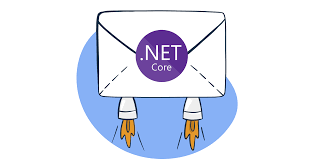

# ASP.NET Core y servicios de Email


- [ASP.NET Core y servicios de Email](#aspnet-core-y-servicios-de-email)
  - [🤔 ¿Por qué necesitamos un servicio de email?](#-por-qué-necesitamos-un-servicio-de-email)
    - [Casos de uso comunes](#casos-de-uso-comunes)
    - [Beneficios](#beneficios)
  - [⚙️ Configuración inicial](#️-configuración-inicial)
    - [1. Paquetes NuGet](#1-paquetes-nuget)
    - [2. Variables de entorno (.  env)](#2-variables-de-entorno---env)
    - [3. Configuración en appsettings.json](#3-configuración-en-appsettingsjson)
  - [📬 Configuración de Mailtrap para desarrollo](#-configuración-de-mailtrap-para-desarrollo)
    - [¿Qué es Mailtrap?](#qué-es-mailtrap)
    - [✅ Ventajas de Mailtrap](#-ventajas-de-mailtrap)
    - [📝 Cómo configurar Mailtrap](#-cómo-configurar-mailtrap)
  - [🏗️ Arquitectura del servicio](#️-arquitectura-del-servicio)
    - [Patrón de diseño utilizado](#patrón-de-diseño-utilizado)
    - [¿Por qué esta arquitectura?](#por-qué-esta-arquitectura)
  - [🛠️ Implementación paso a paso](#️-implementación-paso-a-paso)
    - [Paso 1: Modelos de configuración](#paso-1-modelos-de-configuración)
    - [Paso 2: Interfaz genérica de Email](#paso-2-interfaz-genérica-de-email)
    - [Paso 3: Implementación del servicio genérico](#paso-3-implementación-del-servicio-genérico)
    - [Paso 4: Servicio específico para pedidos](#paso-4-servicio-específico-para-pedidos)
    - [Paso 5: Implementación con templates HTML](#paso-5-implementación-con-templates-html)
  - [🔗 Integración con el servicio de pedidos](#-integración-con-el-servicio-de-pedidos)
    - [Inyección de dependencia](#inyección-de-dependencia)
    - [Envío asíncrono con Task](#envío-asíncrono-con-task)
  - [🧪 Testing con Mailtrap](#-testing-con-mailtrap)
    - [Controlador de pruebas](#controlador-de-pruebas)
    - [Tests unitarios](#tests-unitarios)
  - [⚠️ Manejo de errores y buenas prácticas](#️-manejo-de-errores-y-buenas-prácticas)
    - [1. Principio de "Fail gracefully"](#1-principio-de-fail-gracefully)
    - [2. Logging detallado](#2-logging-detallado)
    - [3. Configuración por entornos](#3-configuración-por-entornos)
  - [🛠️ Debugging común](#️-debugging-común)
  - [📊 Resumen de beneficios](#-resumen-de-beneficios)
  - [🚀 Próximos pasos recomendados](#-próximos-pasos-recomendados)
  - [Práctica de clase](#práctica-de-clase)
  - [📚 Recursos adicionales](#-recursos-adicionales)

---





## 🤔 ¿Por qué necesitamos un servicio de email?

### Casos de uso comunes

- ✅ **Confirmación de pedidos** (nuestro caso)
- 🔐 **Verificación de cuentas**
- 🔄 **Recuperación de contraseñas**
- 📊 **Notificaciones de estado**
- 📈 **Reportes automáticos**

### Beneficios

- **Mejor experiencia de usuario**:  El cliente recibe confirmación inmediata
- **Profesionalidad**: Emails bien formateados dan confianza
- **Trazabilidad**: Registro de todas las comunicaciones
- **Automatización**: Reduce trabajo manual del equipo

---

## ⚙️ Configuración inicial

### 1. Paquetes NuGet

```bash
# MailKit (biblioteca robusta para email)
dotnet add package MailKit

# MimeKit (para construir mensajes MIME)
dotnet add package MimeKit
```

**¿Por qué MailKit?**
- ✅ Open source y multiplataforma
- ✅ Soporte completo de SMTP/IMAP/POP3
- ✅ Manejo robusto de errores
- ✅ Soporte para autenticación OAuth2
- ✅ Recomendada por Microsoft

### 2. Variables de entorno (.  env)

```bash
# Email Configuration - DESARROLLO con Mailtrap
MAIL_HOST=sandbox.smtp.mailtrap.io
MAIL_PORT=2525
MAIL_USERNAME=tu-mailtrap-username
MAIL_PASSWORD=tu-mailtrap-password
MAIL_FROM_NAME=Tienda Funkos
MAIL_FROM_ADDRESS=noreply@funkos.dev

# Email Configuration - PRODUCCIÓN con Gmail (comentado)
# MAIL_HOST=smtp.gmail.com
# MAIL_PORT=587
# MAIL_USERNAME=tu-email@gmail.com
# MAIL_PASSWORD=tu-app-password-de-gmail
# MAIL_FROM_NAME=Tienda Funkos
# MAIL_FROM_ADDRESS=noreply@funkos.com
```

### 3. Configuración en appsettings.json

**appsettings.Development.json:**

```json
{
  "Logging": {
    "LogLevel": {
      "Default": "Debug",
      "FunkosApi. Services.Email": "Debug"
    }
  },
  "EmailSettings": {
    "SmtpServer": "sandbox.smtp.mailtrap.io",
    "SmtpPort": 2525,
    "SmtpUsername": "${MAIL_USERNAME}",
    "SmtpPassword": "${MAIL_PASSWORD}",
    "FromName": "Tienda Funkos Dev",
    "FromAddress": "noreply@funkos.dev",
    "EnableSsl": false,
    "Timeout": 5000
  }
}
```

**appsettings.Production.json:**

```json
{
  "Logging": {
    "LogLevel": {
      "Default": "Warning",
      "FunkosApi.Services.Email": "Information"
    }
  },
  "EmailSettings": {
    "SmtpServer": "${MAIL_HOST}",
    "SmtpPort": 587,
    "SmtpUsername": "${MAIL_USERNAME}",
    "SmtpPassword": "${MAIL_PASSWORD}",
    "FromName": "Tienda Funkos",
    "FromAddress": "noreply@funkos.com",
    "EnableSsl": true,
    "Timeout": 10000
  }
}
```

---

## 📬 Configuración de Mailtrap para desarrollo

### ¿Qué es Mailtrap? 

Mailtrap es un **servicio de testing de emails** que intercepta todos los emails enviados desde tu aplicación y los muestra en una interfaz web, **sin enviarlos realmente**.

### ✅ Ventajas de Mailtrap

- **🛡️ Seguro**: No envía emails reales por error
- **👀 Visual**: Interfaz web para ver todos los emails
- **📱 Responsive testing**: Previsualización en diferentes dispositivos
- **🆓 Gratuito**: Plan gratuito suficiente para desarrollo
- **🔍 Debugging**: Headers, HTML, texto plano todo visible
- **⚡ Rápido**: Setup en menos de 5 minutos

### 📝 Cómo configurar Mailtrap

1. **Crear cuenta**:  [mailtrap.io](https://mailtrap.io/)
2. **Crear inbox**: Dashboard → "Add Inbox" → "Funkos-Dev"
3. **Obtener credenciales**:  SMTP Settings → Copiar username/password
4. **Configurar en .env**:  Actualizar `MAIL_USERNAME` y `MAIL_PASSWORD`

---

## 🏗️ Arquitectura del servicio

### Patrón de diseño utilizado

```
PedidosController → PedidosService → PedidoEmailService → EmailService → MailKit → Mailtrap
       ↓                 ↓                  ↓               ↓           ↓          ↓
     HTTP          Lógica de         Emails de        Envío      Protocolo   Inbox de
                   pedidos          pedidos        genérico       SMTP     desarrollo
```

### ¿Por qué esta arquitectura?

1. **Separación de responsabilidades**: Cada capa tiene una función específica
2. **Testabilidad**: Podemos testear cada componente por separado
3. **Reutilización**: El servicio de email se puede usar en otros lugares
4. **Mantenibilidad**: Cambios en el email no afectan la lógica de negocio

---

## 🛠️ Implementación paso a paso

### Paso 1: Modelos de configuración

```csharp
namespace FunkosApi.Configuration;

public class EmailSettings
{
    public string SmtpServer { get; set; } = string.Empty;
    public int SmtpPort { get; set; }
    public string SmtpUsername { get; set; } = string.Empty;
    public string SmtpPassword { get; set; } = string.Empty;
    public string FromName { get; set; } = string.Empty;
    public string FromAddress { get; set; } = string.Empty;
    public bool EnableSsl { get; set; }
    public int Timeout { get.  set; } = 5000;
}
```

**Registro en Program.cs:**

```csharp
// Configurar EmailSettings
builder.Services.Configure<EmailSettings>(
    builder.Configuration.GetSection("EmailSettings")
);

// Registrar servicios de email
builder.Services.AddScoped<IEmailService, EmailService>();
builder.Services.AddScoped<IPedidoEmailService, PedidoEmailService>();
```

---

### Paso 2: Interfaz genérica de Email

```csharp
namespace FunkosApi.Services.Email;

public interface IEmailService
{
    /// <summary>
    /// Envía un email simple (texto plano)
    /// </summary>
    Task SendSimpleEmailAsync(string to, string subject, string body, CancellationToken cancellationToken = default);
    
    /// <summary>
    /// Envía un email con HTML
    /// </summary>
    Task SendHtmlEmailAsync(string to, string subject, string htmlBody, CancellationToken cancellationToken = default);
}
```

**¿Por qué una interfaz? **
- **Abstracción**: El cliente no necesita saber cómo se implementa
- **Flexibilidad**:  Podemos cambiar la implementación sin afectar el código cliente
- **Testing**: Podemos crear mocks fácilmente
- **Principios SOLID**: Dependency Inversion Principle

---

### Paso 3: Implementación del servicio genérico

```csharp
using MailKit.Net.Smtp;
using MailKit.Security;
using Microsoft.Extensions.Options;
using MimeKit;

namespace FunkosApi.Services. Email;

public class EmailService :  IEmailService
{
    private readonly EmailSettings _emailSettings;
    private readonly ILogger<EmailService> _logger;

    public EmailService(
        IOptions<EmailSettings> emailSettings,
        ILogger<EmailService> logger)
    {
        _emailSettings = emailSettings. Value;
        _logger = logger;
    }

    public async Task SendSimpleEmailAsync(
        string to,
        string subject,
        string body,
        CancellationToken cancellationToken = default)
    {
        try
        {
            _logger.LogInformation("📧 Enviando email simple a:  {To}", to);

            var message = new MimeMessage();
            message. From.Add(new MailboxAddress(_emailSettings.FromName, _emailSettings.FromAddress));
            message.To.Add(MailboxAddress.Parse(to));
            message.Subject = subject;
            message.Body = new TextPart("plain") { Text = body };

            await SendEmailAsync(message, cancellationToken);

            _logger.LogInformation("✅ Email simple enviado correctamente a: {To}", to);
        }
        catch (Exception ex)
        {
            _logger.LogError(ex, "❌ Error enviando email simple a {To}", to);
            throw;
        }
    }

    public async Task SendHtmlEmailAsync(
        string to,
        string subject,
        string htmlBody,
        CancellationToken cancellationToken = default)
    {
        try
        {
            _logger.LogInformation("📧 Enviando email HTML a: {To}", to);

            var message = new MimeMessage();
            message.From. Add(new MailboxAddress(_emailSettings.FromName, _emailSettings.FromAddress));
            message.To.Add(MailboxAddress.Parse(to));
            message.Subject = subject;
            message.Body = new TextPart("html") { Text = htmlBody };

            await SendEmailAsync(message, cancellationToken);

            _logger.LogInformation("✅ Email HTML enviado correctamente a: {To}", to);
        }
        catch (Exception ex)
        {
            _logger.LogError(ex, "❌ Error enviando email HTML a {To}", to);
            throw;
        }
    }

    private async Task SendEmailAsync(MimeMessage message, CancellationToken cancellationToken)
    {
        using var client = new SmtpClient();

        try
        {
            // Configurar timeout
            client. Timeout = _emailSettings.Timeout;

            // Conectar al servidor SMTP
            var secureSocketOptions = _emailSettings.EnableSsl
                ? SecureSocketOptions.StartTls
                : SecureSocketOptions.None;

            await client.ConnectAsync(
                _emailSettings.SmtpServer,
                _emailSettings.SmtpPort,
                secureSocketOptions,
                cancellationToken
            );

            // Autenticar
            if (! string.IsNullOrEmpty(_emailSettings.SmtpUsername))
            {
                await client. AuthenticateAsync(
                    _emailSettings.SmtpUsername,
                    _emailSettings.SmtpPassword,
                    cancellationToken
                );
            }

            // Enviar email
            await client.SendAsync(message, cancellationToken);

            // Desconectar
            await client.DisconnectAsync(true, cancellationToken);
        }
        catch (Exception ex)
        {
            _logger. LogError(ex, "❌ Error en conexión SMTP");
            throw;
        }
    }
}
```

**Puntos clave:**
- **MailKit**: Biblioteca robusta y multiplataforma
- **MimeMessage**: Construcción flexible de mensajes
- **SecureSocketOptions**: Configuración de SSL/TLS según entorno
- **Async/await**: Operaciones no bloqueantes
- **Timeout configurables**: Control de conexiones lentas

---

### Paso 4: Servicio específico para pedidos

```csharp
namespace FunkosApi.Services.Email;

public interface IPedidoEmailService
{
    /// <summary>
    /// Envía email de confirmación de pedido en HTML
    /// </summary>
    Task EnviarConfirmacionPedidoAsync(Pedido pedido, CancellationToken cancellationToken = default);
}
```

---

### Paso 5: Implementación con templates HTML

```csharp
using System. Globalization;

namespace FunkosApi.Services. Email;

public class PedidoEmailService : IPedidoEmailService
{
    private readonly IEmailService _emailService;
    private readonly ILogger<PedidoEmailService> _logger;

    public PedidoEmailService(
        IEmailService emailService,
        ILogger<PedidoEmailService> logger)
    {
        _emailService = emailService;
        _logger = logger;
    }

    public async Task EnviarConfirmacionPedidoAsync(
        Pedido pedido,
        CancellationToken cancellationToken = default)
    {
        try
        {
            _logger.LogInformation(
                "📧 Enviando confirmación de pedido {PedidoId} a {Email}",
                pedido.Id,
                pedido.Cliente.Email
            );

            var subject = $"✅ Confirmación de tu pedido #{pedido.Id}";
            var htmlBody = CrearCuerpoEmailPedido(pedido);

            await _emailService.SendHtmlEmailAsync(
                pedido. Cliente.Email,
                subject,
                htmlBody,
                cancellationToken
            );

            _logger.LogInformation(
                "✅ Confirmación de pedido {PedidoId} enviada correctamente",
                pedido.Id
            );
        }
        catch (Exception ex)
        {
            _logger.LogWarning(
                ex,
                "❌ Error enviando confirmación de pedido {PedidoId}",
                pedido.Id
            );
            // No relanzamos - el pedido ya está guardado
        }
    }

    private string CrearCuerpoEmailPedido(Pedido pedido)
    {
        var culture = new CultureInfo("es-ES");
        var fechaFormato = pedido.FechaCreacion.ToString("dd/MM/yyyy HH:mm", culture);

        var lineasHtml = string.Join("", pedido.LineasPedido.Select(linea =>
            $@"
            <tr style=""border-bottom: 1px solid #eee;"">
                <td style=""padding: 12px 8px;"">{linea.Producto. Nombre}</td>
                <td style=""padding: 12px 8px; text-align: center;"">{linea.Cantidad}</td>
                <td style=""padding: 12px 8px; text-align: right;"">{linea.PrecioProducto: C}</td>
                <td style=""padding: 12px 8px; text-align: right; font-weight: bold;"">{linea.Total:C}</td>
            </tr>"
        ));

        return $@"
<! DOCTYPE html>
<html lang=""es"">
<head>
    <meta charset=""UTF-8"">
    <meta name=""viewport"" content=""width=device-width, initial-scale=1.0"">
    <title>Confirmación de Pedido</title>
</head>
<body style=""font-family: 'Segoe UI', Tahoma, Geneva, Verdana, sans-serif; line-height: 1.6; color: #333; margin: 0; padding: 20px; background-color: #f4f4f4;"">
    <div style=""max-width: 600px; margin: 0 auto; background-color: white; padding: 30px; border-radius: 10px; box-shadow: 0 2px 10px rgba(0,0,0,0.1);"">
        
        <!-- Header -->
        <div style=""text-align: center; margin-bottom: 30px;"">
            <h1 style=""color:  #4CAF50; margin: 0; font-size:  28px;"">¡Pedido Confirmado!  🎉</h1>
            <p style=""color:  #666; margin: 10px 0 0 0;"">Gracias por tu compra</p>
        </div>

        <!-- Saludo -->
        <p style=""font-size: 16px; margin-bottom: 20px;"">
            <strong>¡Hola {pedido. Cliente.Nombre}!</strong>
        </p>
        <p style=""margin-bottom: 20px;"">
            Tu pedido ha sido confirmado y está siendo procesado.
        </p>

        <hr style=""border: none; border-top: 2px solid #eee; margin: 30px 0;"">

        <!-- Información del Pedido -->
        <h2 style=""color: #4CAF50; font-size: 20px; margin-bottom: 15px;"">📝 Información del Pedido</h2>
        <table style=""width: 100%; margin-bottom: 20px;"">
            <tr>
                <td style=""padding: 8px 0; color: #666;""><strong>Número: </strong></td>
                <td style=""padding: 8px 0; text-align: right;"">#{pedido.Id}</td>
            </tr>
            <tr>
                <td style=""padding: 8px 0; color: #666;""><strong>Fecha:</strong></td>
                <td style=""padding: 8px 0; text-align: right;"">{fechaFormato}</td>
            </tr>
            <tr>
                <td style=""padding: 8px 0; color: #666;""><strong>Estado:</strong></td>
                <td style=""padding: 8px 0; text-align: right; color: #4CAF50; font-weight: bold;"">Confirmado</td>
            </tr>
        </table>

        <!-- Datos del Cliente -->
        <h2 style=""color: #4CAF50; font-size: 20px; margin:  30px 0 15px 0;"">👤 Datos del Cliente</h2>
        <table style=""width: 100%; margin-bottom: 20px;"">
            <tr>
                <td style=""padding: 8px 0; color: #666;""><strong>Nombre: </strong></td>
                <td style=""padding: 8px 0; text-align: right;"">{pedido.Cliente. Nombre}</td>
            </tr>
            <tr>
                <td style=""padding: 8px 0; color: #666;""><strong>Email:</strong></td>
                <td style=""padding: 8px 0; text-align: right;"">{pedido.Cliente.Email}</td>
            </tr>
            <tr>
                <td style=""padding: 8px 0; color: #666;""><strong>Teléfono:</strong></td>
                <td style=""padding: 8px 0; text-align: right;"">{pedido.Cliente.Telefono}</td>
            </tr>
        </table>

        <!-- Dirección de Entrega -->
        <h2 style=""color: #4CAF50; font-size: 20px; margin: 30px 0 15px 0;"">🚚 Dirección de Entrega</h2>
        <div style=""background-color: #f9f9f9; padding: 15px; border-radius: 5px; margin-bottom: 20px;"">
            <p style=""margin: 5px 0;""> {pedido.Cliente.Direccion. Calle}, {pedido.Cliente.Direccion. Numero}</p>
            <p style=""margin: 5px 0;"">{pedido.Cliente. Direccion.CodigoPostal} {pedido.Cliente.Direccion.Ciudad}</p>
            <p style=""margin: 5px 0;"">{pedido.Cliente. Direccion. Provincia}, {pedido.Cliente.Direccion. Pais}</p>
        </div>

        <!-- Detalles del Pedido -->
        <h2 style=""color: #4CAF50; font-size: 20px; margin: 30px 0 15px 0;"">🛒 Detalles del Pedido</h2>
        <table style=""width: 100%; border-collapse: collapse; margin-bottom: 20px;"">
            <thead>
                <tr style=""background-color: #4CAF50; color: white;"">
                    <th style=""padding: 12px 8px; text-align: left;"">Producto</th>
                    <th style=""padding: 12px 8px; text-align: center;"">Cant.</th>
                    <th style=""padding: 12px 8px; text-align: right;"">Precio</th>
                    <th style=""padding:  12px 8px; text-align: right;"">Total</th>
                </tr>
            </thead>
            <tbody>
                {lineasHtml}
            </tbody>
        </table>

        <!-- Total -->
        <div style=""background-color: #4CAF50; color: white; padding: 20px; text-align: center; border-radius: 5px; margin:  30px 0;"">
            <p style=""margin: 0; font-size: 14px;"">Total de artículos: {pedido.TotalItems}</p>
            <h3 style=""margin: 10px 0 0 0; font-size:  24px;"">TOTAL: {pedido.Total:C}</h3>
        </div>

        <!-- Información adicional -->
        <div style=""background-color: #f9f9f9; padding:  15px; border-radius:  5px; margin:  20px 0;"">
            <p style=""margin: 5px 0;""><strong>🕐 Tu pedido será procesado en las próximas 24-48 horas. </strong></p>
            <p style=""margin: 5px 0;"">📧 Te mantendremos informado sobre el estado de tu envío.</p>
        </div>

        <hr style=""border: none; border-top: 2px solid #eee; margin: 30px 0;"">

        <!-- Footer -->
        <div style=""text-align: center; color: #666;"">
            <p style=""margin: 10px 0;""><strong>¡Gracias por confiar en nosotros!</strong></p>
            <p style=""margin: 10px 0; font-style: italic;"">El equipo de Tienda Funkos</p>
            <p style=""font-size: 12px; margin: 20px 0 0 0; color: #999;"">
                Este es un email automático, por favor no respondas a este mensaje.
            </p>
        </div>

    </div>
</body>
</html>";
    }
}
```

---

## 🔗 Integración con el servicio de pedidos

### Inyección de dependencia

```csharp
public class PedidoService : IPedidoService
{
    private readonly IPedidoRepository _repository;
    private readonly IPedidoEmailService _emailService;
    private readonly ILogger<PedidoService> _logger;

    public PedidoService(
        IPedidoRepository repository,
        IPedidoEmailService emailService,
        ILogger<PedidoService> logger)
    {
        _repository = repository;
        _emailService = emailService;
        _logger = logger;
    }

    public async Task<Pedido> CreateAsync(CreatePedidoDto dto)
    {
        _logger.LogInformation("💾 Creando pedido");

        // 1. Validar y procesar pedido
        var pedido = await _repository.CreateAsync(dto);

        _logger.LogInformation("✅ Pedido {PedidoId} creado correctamente", pedido.Id);

        // 2. Enviar email de confirmación (asíncrono)
        _ = EnviarEmailConfirmacionAsync(pedido);

        return pedido;
    }
}
```

### Envío asíncrono con Task

```csharp
/// <summary>
/// Envía email de confirmación en un Task separado
/// ¿Por qué asíncrono? 
/// - No bloquea la respuesta al usuario
/// - Si falla el email, no afecta al pedido
/// - Mejor experiencia de usuario
/// </summary>
private Task EnviarEmailConfirmacionAsync(Pedido pedido)
{
    return Task.Run(async () =>
    {
        try
        {
            _logger. LogInformation(
                "🚀 Iniciando envío de email para pedido {PedidoId}",
                pedido.Id
            );

            await _emailService.EnviarConfirmacionPedidoAsync(pedido);

            _logger. LogInformation(
                "✅ Email de confirmación enviado para pedido {PedidoId}",
                pedido. Id
            );
        }
        catch (Exception ex)
        {
            _logger.LogWarning(
                ex,
                "❌ Error enviando email para pedido {PedidoId}",
                pedido.Id
            );
            // El error no se propaga - el pedido ya está guardado
        }
    });
}
```

**¿Por qué Task. Run?**
- **No bloqueante**: La respuesta HTTP se envía inmediatamente
- **Fire-and-forget**: El email se envía en segundo plano
- **Resiliente**: Si falla el email, no afecta al pedido

---

## 🧪 Testing con Mailtrap

### Controlador de pruebas

```csharp
[ApiController]
[Route("api/[controller]")]
public class TestEmailController : ControllerBase
{
    private readonly IPedidoService _pedidoService;

    public TestEmailController(IPedidoService pedidoService)
    {
        _pedidoService = pedidoService;
    }

    [HttpPost("pedido-prueba")]
    public async Task<ActionResult<string>> CrearPedidoPrueba()
    {
        var dto = new CreatePedidoDto
        {
            Cliente = new ClienteDto
            {
                Nombre = "Juan Pérez Estudiante",
                Email = "juan. perez@estudiante.com", // 📧 Cambia por tu email
                Telefono = "+34 666 777 888",
                Direccion = new DireccionDto
                {
                    Calle = "Calle Falsa",
                    Numero = "123",
                    Ciudad = "Madrid",
                    Provincia = "Madrid",
                    Pais = "España",
                    CodigoPostal = "28001"
                }
            },
            LineasPedido = new List<LineaPedidoDto>
            {
                new() { ProductoId = 1, Cantidad = 2, Precio = 29.99m },
                new() { ProductoId = 2, Cantidad = 1, Precio = 15.50m }
            }
        };

        var pedido = await _pedidoService.CreateAsync(dto);

        return Ok($"✅ Pedido de prueba creado: {pedido.Id}.  Revisa tu inbox de Mailtrap!");
    }
}
```

---

### Tests unitarios

```csharp
[TestFixture]
public class PedidoEmailServiceTests
{
    private Mock<IEmailService> _emailServiceMock = null!;
    private PedidoEmailService _pedidoEmailService = null!;

    [SetUp]
    public void Setup()
    {
        _emailServiceMock = new Mock<IEmailService>();
        var logger = new Mock<ILogger<PedidoEmailService>>().Object;
        _pedidoEmailService = new PedidoEmailService(_emailServiceMock. Object, logger);
    }

    [Test]
    public async Task EnviarConfirmacionPedidoAsync_DeberiaEnviarEmail()
    {
        // Arrange
        var pedido = new Pedido
        {
            Id = 1,
            Cliente = new Cliente
            {
                Nombre = "Test",
                Email = "test@test.com"
            },
            LineasPedido = new List<LineaPedido>
            {
                new() { ProductoId = 1, Cantidad = 1, PrecioProducto = 10m }
            }
        };

        // Act
        await _pedidoEmailService.EnviarConfirmacionPedidoAsync(pedido);

        // Assert
        _emailServiceMock.Verify(
            x => x.SendHtmlEmailAsync(
                "test@test.com",
                It.IsAny<string>(),
                It.IsAny<string>(),
                It.IsAny<CancellationToken>()
            ),
            Times.Once
        );
    }
}
```

---

## ⚠️ Manejo de errores y buenas prácticas

### 1. Principio de "Fail gracefully"

```csharp
try
{
    await _emailService.EnviarConfirmacionPedidoAsync(pedido);
}
catch (Exception ex)
{
    // NO relanzamos la excepción
    // El pedido ya está guardado y es lo importante
    _logger.LogWarning(ex, "❌ Error enviando email");

    // Opcional: guardar en tabla de emails fallidos para reintentar
}
```

### 2. Logging detallado

```csharp
_logger.LogInformation("🚀 Iniciando envío de email");
_logger.LogInformation("✅ Email enviado correctamente");
_logger.LogWarning("❌ Error en email:  {Error}", ex.Message);
```

### 3. Configuración por entornos

| Aspecto | Desarrollo (Mailtrap) | Producción (Gmail/SendGrid) |
|: -------|: ---------------------|: ----------------------------|
| Host | sandbox.smtp.mailtrap.io | smtp.gmail.com |
| Puerto | 2525 | 587 |
| SSL/TLS | No requerido | Requerido |
| Logging | Debug | Warning |
| Emails reales | ❌ No se envían | ✅ Se envían realmente |

---

## 🛠️ Debugging común

1. **"SmtpException: Authentication failed"**
   - ✅ Verificar credenciales de Mailtrap
   - ✅ Revisar variables de entorno
   - ✅ Confirmar configuración en appsettings.json

2. **"Email no aparece en Mailtrap"**
   - ✅ Verificar logs de aplicación
   - ✅ Confirmar conexión SMTP exitosa
   - ✅ Revisar inbox correcto en Mailtrap

3. **"Task no se ejecuta"**
   - ✅ Verificar logs de inicio de Task
   - ✅ Revisar manejo de excepciones
   - ✅ Confirmar que no hay deadlocks

---

## 📊 Resumen de beneficios

✅ **Lo que hemos conseguido:**

1. **🔧 Setup completo**: Mailtrap configurado para desarrollo seguro
2. **🎯 Automatización completa**: Email automático con cada pedido
3. **🎨 Experiencia profesional**: HTML estilizado y responsive
4. **⚡ Rendimiento**: Envío asíncrono sin bloquear la aplicación
5. **🛡️ Robustez**: Manejo de errores sin afectar el negocio principal
6. **📈 Escalabilidad**: Arquitectura preparada para más tipos de email
7. **🧪 Testing fácil**: Mailtrap para probar sin enviar emails reales
8. **🔍 Debugging**:  Logs detallados con emojis para fácil seguimiento

---

## 🚀 Próximos pasos recomendados

**Para el curso:**
1. 📝 Templates externos con Razor
2. 📊 Más tipos de email:  Activación de cuenta, recuperación de password
3. 🔄 Reintentos:  Sistema de cola para emails fallidos
4. 📈 Métricas: Contar emails enviados/fallidos

**Para producción:**
1. ☁️ Proveedores cloud: SendGrid, AWS SES, Mailgun
2. 📬 Colas de mensajes: Azure Service Bus/RabbitMQ para emails masivos
3. 📊 Analytics: Tracking de apertura y clicks
4. 🎨 Templates avanzados: Sistema de plantillas dinámicas

---

## Práctica de clase

**Requisitos:**

1. ✅ Implementar servicio de email con MailKit
2. ✅ Configurar Mailtrap para desarrollo
3. ✅ Crear template HTML para confirmación de pedidos
4. ✅ Integrar con servicio de pedidos (envío asíncrono)
5. ✅ Implementar email de bienvenida al registrar usuario
6. ✅ Implementar email de confirmación de pedido de Funkos
7. ✅ Crear tests unitarios para servicios de email
8. ✅ Documentar configuración y uso en README

**Criterios de evaluación:**

- ✅ Emails se envían correctamente a Mailtrap
- ✅ Template HTML responsive y profesional
- ✅ Envío asíncrono no bloquea la aplicación
- ✅ Manejo robusto de errores
- ✅ Logs detallados y útiles
- ✅ Tests completos
- ✅ Documentación clara

---

## 📚 Recursos adicionales

- [MailKit Documentation](https://github.com/jstedfast/MailKit)
- [MimeKit Documentation](https://github.com/jstedfast/MimeKit)
- [Mailtrap Documentation](https://help.mailtrap.io/)
- [HTML Email Best Practices](https://www.campaignmonitor.com/css/)
- [Microsoft Email Guidelines](https://docs.microsoft.com/en-us/aspnet/core/fundamentals/configuration/)

---
