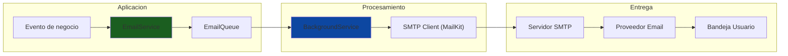

# 18. Email Services

## Indice

- [18. Email Services](#18-email-services)
  - [18.1. Fundamentos del Sistema de Emails](#181-fundamentos-del-sistema-de-emails)
    - [18.1.1. ¿Por Qué un Sistema de Emails Robusto?](#1811-por-qué-un-sistema-de-emails-robusto)
    - [18.1.2. Casos de Uso](#1812-casos-de-uso)
    - [18.1.3. Desafios del Sistema de Emails](#1813-desafios-del-sistema-de-emails)
  - [18.2. Instalacion de MailKit](#182-instalacion-de-mailkit)
  - [18.3. Interfaz IEmailService](#183-interfaz-iemailservice)
  - [18.4. Implementacion con MailKit](#184-implementacion-con-mailkit)
    - [18.4.1. MailKitEmailService](#1841-mailkitemailservice)
    - [18.4.2. Configuracion SMTP](#1842-configuracion-smtp)
    - [18.4.3. Envio de Adjuntos](#1843-envío-de-adjuntos)
  - [18.5. Servicio de Desarrollo (MemoryEmailService)](#185-servicio-de-desarrollo-memoryemailservice)
  - [18.6. Sistema de Plantillas](#186-sistema-de-plantillas)
    - [18.6.1. ITemplateService](#1861-itemplateservice)
    - [18.6.2. Renderizado de Plantillas](#1862-renderizado-de-plantillas)
  - [18.7. Cola de Emails con BackgroundService](#187-cola-de-emails-con-backgroundservice)
    - [18.7.1. EmailQueueService](#1871-emailqueueservice)
    - [18.7.2. Procesamiento de Cola](#1872-procesamiento-de-cola)
  - [18.8. Integracion con Servicios de Negocio](#188-integracion-con-servicios-de-negocio)
  - [18.9. Configuracion de Appsettings.json](#189-configuracion-de-appsettingsjson)
  - [18.10. Buenas Practicas](#1810-buenas-practicas)
  - [18.11. Resumen](#1811-resumen)
  - [18.12. Ejercicio Propuesto](#1812-ejercicio-propuesto)
  - [18.13. Testing](#1813-testing)

---

## 18.1. Fundamentos del Sistema de Emails

### 18.1.1. ¿Por Qué un Sistema de Emails Robusto?

El envío de emails es fundamental para la comunicación con usuarios en aplicaciones modernas. Las notificaciones por email incluyen confirmaciones de pedidos, restablecimiento de contraseñas, notificaciones de envío, receipts fiscales y alertas de seguridad. Un sistema bien diseñado debe ser confiable, eficiente y fácil de probar.

Un sistema de emails robusto necesita manejar fallos de red, reintentos automaticos, colas asincronas para no bloquear la aplicacion principal, y plantillas reutilizables para mantener consistencia visual. Tambien debe permitir testing sin enviar emails reales durante el desarrollo.



🧠 **Analogía**: El sistema de emails es como el servicio de correo de una empresa. Los empleados (aplicacion) entregan las cartas (emails) al departamento de correo (EmailService). El departamento las procesa en batch (BackgroundService) y las entrega al correo (SMTP) para que lleguen a los destinatarios finales.

### 18.1.2. Casos de Uso

| Caso de Uso | Trigger | Importancia |
|-------------|---------|-------------|
| **Confirmacion de pedido** | Pedido creado | Alta |
| **Restablecer contrasena** | Solicitud usuario | Critica |
| **Notificacion de envío** | Pedido enviado | Media |
| **Newsletter** | Campana marketing | Baja |
| **Alerta de seguridad** | Login sospechoso | Alta |
| **Recibo fiscal** | Pago completado | Alta |

### 18.1.3. Desafios del Sistema de Emails

| Desafio | Solucion |
|---------|----------|
| **Fiabilidad** | Cola asincrona con reintentos |
| **Rendimiento** | BackgroundService no bloqueante |
| **Testing** | Servicio de memoria para tests |
| **Templates** | Sistema de plantillas HTML |
| **Cola persistente** | Redis o base de datos |

---

## 18.2. Instalacion de MailKit

MailKit es la biblioteca mas popular para envío de emails en .NET. Es moderna, rapida y soporta los principales protocolos de email incluyendo SMTP, IMAP y POP3.

```bash
# Instalacion mediante .NET CLI
dotnet add package MailKit

# Instalacion mediante NuGet Package Manager
Install-Package MailKit
```

MailKit incluye **MimeKit** como dependencia, que se encarga de la construccion de mensajes MIME con soporte completo para HTML, texto plano, adjuntos y codificacion de caracteres.

```bash
# MimeKit se instala automaticamente con MailKit
dotnet add package MimeKit
```

---

## 18.3. Interfaz IEmailService

```csharp
namespace TiendaApi.Core.Interfaces;

public interface IEmailService
{
    Task SendAsync(EmailMessage message, CancellationToken cancellationToken = default);
    Task SendBatchAsync(IEnumerable<EmailMessage> messages, CancellationToken cancellationToken = default);
    Task<EmailTemplate?> GetTemplateAsync(string templateName, CancellationToken cancellationToken = default);
}

public class EmailMessage
{
    public required string To { get; init; }
    public required string Subject { get; init; }
    public required string Body { get; init; }
    public bool IsHtml { get; init; } = true;
    public string? From { get; init; }
    public string? ReplyTo { get; init; }
    public List<string> Cc { get; init; } = new();
    public List<string> Bcc { get; init; } = new();
    public List<EmailAttachment> Attachments { get; init; } = new();
    public Dictionary<string, string> Headers { get; init; } = new();
}

public class EmailAttachment
{
    public required string FileName { get; init; }
    public required byte[] Content { get; init; }
    public string? ContentType { get; init; }
}

public class EmailTemplate
{
    public string Name { get; init; } = string.Empty;
    public string Subject { get; init; } = string.Empty;
    public string BodyHtml { get; init; } = string.Empty;
    public string? BodyText { get; init; }
}
```

---

## 18.4. Implementacion con MailKit

### 18.4.1. MailKitEmailService

```csharp
using MailKit.Net.Smtp;
using MailKit.Security;
using Microsoft.Extensions.Configuration;
using Microsoft.Extensions.Logging;
using MimeKit;
using MimeKit.Text;

namespace TiendaApi.Core.Services;

public class MailKitEmailService(
    IConfiguration configuration,
    ILogger<MailKitEmailService> logger,
    ITemplateService templateService) : IEmailService
{
    public async Task SendAsync(EmailMessage message, CancellationToken cancellationToken = default)
    {
        var smtpConfig = GetSmtpConfiguration();

        var mimeMessage = new MimeMessage
        {
            Subject = message.Subject,
            Body = new TextPart(message.IsHtml ? TextFormat.Html : TextFormat.Plain)
            {
                Text = message.Body
            }
        };

        mimeMessage.From.Add(new MailboxAddress(
            smtpConfig.DisplayName,
            smtpConfig.From));

        mimeMessage.To.Add(new MailboxAddress("", message.To));

        foreach (var cc in message.Cc)
        {
            mimeMessage.Cc.Add(new MailboxAddress("", cc));
        }

        foreach (var bcc in message.Bcc)
        {
            mimeMessage.Bcc.Add(new MailboxAddress("", bcc));
        }

        if (!string.IsNullOrEmpty(message.ReplyTo))
        {
            mimeMessage.ReplyTo.Add(new MailboxAddress("", message.ReplyTo));
        }

        foreach (var header in message.Headers)
        {
            mimeMessage.Headers.Add(header.Key, header.Value);
        }

        foreach (var attachment in message.Attachments)
        {
            var memory = new MemoryStream(attachment.Content);
            mimeMessage.Attachments.Add(new MimePart(
                attachment.ContentType ?? "application/octet-stream",
                attachment.FileName)
            {
                Content = new MimeContent(memory)
            });
        }

        logger.LogInformation(
            "Enviando email a {To} con asunto: {Subject}",
            message.To, message.Subject);

        try
        {
            using var smtpClient = new SmtpClient();

            await smtpClient.ConnectAsync(
                smtpConfig.Host,
                smtpConfig.Port,
                GetSecureSocket(smtpConfig.Security),
                cancellationToken);

            if (!string.IsNullOrEmpty(smtpConfig.Username))
            {
                await smtpClient.AuthenticateAsync(
                    smtpConfig.Username,
                    smtpConfig.Password,
                    cancellationToken);
            }

            await smtpClient.SendAsync(mimeMessage, cancellationToken);
            await smtpClient.DisconnectAsync(true, cancellationToken);

            _logger.LogInformation(
                "Email enviado exitosamente a {To}", message.To);
        }
        catch (Exception ex)
        {
            _logger.LogError(ex,
                "Error enviando email a {To}: {Error}",
                message.To, ex.Message);
            throw;
        }
    }

    public async Task SendBatchAsync(IEnumerable<EmailMessage> messages,
        CancellationToken cancellationToken = default)
    {
        var messageList = messages.ToList();
        _logger.LogInformation(
            "Iniciando envío masivo de {Count} emails",
            messageList.Count);

        var sentCount = 0;
        var failedCount = 0;

        foreach (var message in messageList)
        {
            cancellationToken.ThrowIfCancellationRequested();

            try
            {
                await SendAsync(message, cancellationToken);
                sentCount++;
            }
            catch (Exception ex)
            {
                _logger.LogError(ex,
                    "Error enviando email batch a {To}", message.To);
                failedCount++;
            }
        }

        _logger.LogInformation(
            "Envio masivo completado. Enviados: {Sent}, Fallidos: {Failed}",
            sentCount, failedCount);
    }

    public async Task<EmailTemplate?> GetTemplateAsync(string templateName,
        CancellationToken cancellationToken = default)
    {
        return await _templateService.GetTemplateAsync(templateName, cancellationToken);
    }

    private SmtpConfiguration GetSmtpConfiguration()
    {
        return new SmtpConfiguration
        {
            Host = _configuration["Email:Smtp:Host"] ?? "localhost",
            Port = int.Parse(_configuration["Email:Smtp:Port"] ?? "25"),
            Username = _configuration["Email:Smtp:Username"],
            Password = _configuration["Email:Smtp:Password"],
            From = _configuration["Email:From"] ?? "noreply@tienda.com",
            DisplayName = _configuration["Email:DisplayName"] ?? "TiendaDAW",
            Security = _configuration["Email:Smtp:Security"] ?? "None"
        };
    }

    private static SecureSocketOptions GetSecureSocket(string security)
    {
        return security?.ToLowerInvariant() switch
        {
            "ssl" => SecureSocketOptions.SslOnConnect,
            "tls" => SecureSocketOptions.StartTls,
            "none" => SecureSocketOptions.None,
            _ => SecureSocketOptions.Auto
        };
    }

    private class SmtpConfiguration
    {
        public string Host { get; set; } = string.Empty;
        public int Port { get; set; }
        public string? Username { get; set; }
        public string? Password { get; set; }
        public string From { get; set; } = string.Empty;
        public string DisplayName { get; set; } = string.Empty;
        public string Security { get; set; } = string.Empty;
    }
}
```

### 18.4.2. Configuracion SMTP

```csharp
private SmtpConfiguration GetSmtpConfiguration()
{
    return new SmtpConfiguration
    {
        Host = _configuration["Email:Smtp:Host"] ?? "localhost",
        Port = int.Parse(_configuration["Email:Smtp:Port"] ?? "25"),
        Username = _configuration["Email:Smtp:Username"],
        Password = _configuration["Email:Smtp:Password"],
        From = _configuration["Email:From"] ?? "noreply@tienda.com",
        DisplayName = _configuration["Email:DisplayName"] ?? "TiendaDAW",
        Security = _configuration["Email:Smtp:Security"] ?? "Auto"
    };
}
```

### 18.4.3. Envio de Adjuntos

```csharp
foreach (var attachment in message.Attachments)
{
    var memory = new MemoryStream(attachment.Content);
    mimeMessage.Attachments.Add(new MimePart(
        attachment.ContentType ?? "application/octet-stream",
        attachment.FileName)
    {
        Content = new MimeContent(memory)
    });
}
```

---

## 18.5. Servicio de Desarrollo (MemoryEmailService)

```csharp
using Microsoft.Extensions.Logging;

namespace TiendaApi.Core.Services;

/// <summary>
/// Servicio de email que almacena los emails en memoria.
/// Util para desarrollo y testing sin configurar SMTP.
/// </summary>
public class MemoryEmailService : IEmailService
{
    private readonly ILogger<MemoryEmailService> _logger;
    public static readonly List<EmailMessage> SentEmails = new();
    public static readonly List<FailedEmail> FailedEmails = new();

    public MemoryEmailService(ILogger<MemoryEmailService> logger)
    {
        _logger = logger;
    }

    public Task SendAsync(EmailMessage message, CancellationToken cancellationToken = default)
    {
        _logger.LogInformation(
            "[MOCK EMAIL] Para: {To}, Asunto: {Subject}",
            message.To, message.Subject);

        SentEmails.Add(message);
        _logger.LogInformation(
            "Email simulado almacenado. Total en cola: {Count}",
            SentEmails.Count);

        return Task.CompletedTask;
    }

    public Task SendBatchAsync(IEnumerable<EmailMessage> messages,
        CancellationToken cancellationToken = default)
    {
        var messageList = messages.ToList();
        SentEmails.AddRange(messageList);

        _logger.LogInformation(
            "[MOCK EMAIL] Envio masivo simulado: {Count} emails",
            messageList.Count);

        return Task.CompletedTask;
    }

    public Task<EmailTemplate?> GetTemplateAsync(string templateName,
        CancellationToken cancellationToken = default)
    {
        var template = new EmailTemplate
        {
            Name = templateName,
            Subject = $"[TEST] Plantilla {templateName}",
            BodyHtml = $"<h1>Plantilla de prueba: {templateName}</h1>"
        };

        return Task.FromResult<EmailTemplate?>(template);
    }

    public static void Clear()
    {
        SentEmails.Clear();
        FailedEmails.Clear();
    }

    public static EmailMessage? GetLastEmail(string to)
    {
        return SentEmails.LastOrDefault(e => e.To.Equals(to, StringComparison.OrdinalIgnoreCase));
    }
}

public record FailedEmail
{
    public required EmailMessage Message { get; init; }
    public required Exception Exception { get; init; }
    public DateTime FailedAt { get; init; } = DateTime.UtcNow;
}
```

---

## 18.6. Sistema de Plantillas

### 18.6.1. ITemplateService

```csharp
using System.Text.RegularExpressions;

namespace TiendaApi.Core.Interfaces;

public interface ITemplateService
{
    Task<EmailTemplate?> GetTemplateAsync(string templateName, CancellationToken cancellationToken = default);
    string Render(string templateName, Dictionary<string, object> data);
}

public class TemplateService : ITemplateService
{
    private readonly Dictionary<string, EmailTemplate> _templates;
    private readonly ILogger<TemplateService> _logger;
    private readonly IWebHostEnvironment _environment;

    public TemplateService(
        IWebHostEnvironment environment,
        ILogger<TemplateService> logger)
    {
        _environment = environment;
        _logger = logger;
        _templates = LoadTemplates();
    }

    private Dictionary<string, EmailTemplate> LoadTemplates()
    {
        var templatesPath = Path.Combine(_environment.ContentRootPath, "Templates", "Emails");
        
        if (!Directory.Exists(templatesPath))
        {
            _logger.LogWarning("Directorio de plantillas no encontrado: {Path}", templatesPath);
            return new Dictionary<string, EmailTemplate>();
        }

        var templates = new Dictionary<string, EmailTemplate>(StringComparer.OrdinalIgnoreCase);

        foreach (var templateDir in Directory.GetDirectories(templatesPath))
        {
            var templateName = Path.GetFileName(templateDir);
            
            var subjectFile = Path.Combine(templateDir, "subject.txt");
            var htmlFile = Path.Combine(templateDir, "body.html");
            var textFile = Path.Combine(templateDir, "body.txt");

            if (File.Exists(subjectFile) && File.Exists(htmlFile))
            {
                templates[templateName] = new EmailTemplate
                {
                    Name = templateName,
                    Subject = File.ReadAllText(subjectFile).Trim(),
                    BodyHtml = File.ReadAllText(htmlFile),
                    BodyText = File.Exists(textFile) ? File.ReadAllText(textFile) : null
                };
            }
        }

        _logger.LogInformation("Cargadas {Count} plantillas de email", templates.Count);
        return templates;
    }

    public Task<EmailTemplate?> GetTemplateAsync(string templateName, CancellationToken cancellationToken = default)
    {
        return Task.FromResult(
            _templates.TryGetValue(templateName, out var template) 
                ? template 
                : null);
    }

    public string Render(string templateName, Dictionary<string, object> data)
    {
        if (!_templates.TryGetValue(templateName, out var template))
        {
            throw new KeyNotFoundException($"Plantilla '{templateName}' no encontrada");
        }

        var result = template.BodyHtml;
        foreach (var kvp in data)
        {
            result = result.Replace($"{{{{ {kvp.Key} }}}}", kvp.Value?.ToString() ?? "");
        }

        return result;
    }
}
```

### 18.6.2. Renderizado de Plantillas

Las plantillas se almacenan en archivos separados:

```
Templates/
└── Emails/
    ├── pedido-confirmado/
    │   ├── subject.txt
    │   ├── body.html
    │   └── body.txt
    ├── pedido-enviado/
    │   ├── subject.txt
    │   ├── body.html
    │   └── body.txt
    └── reset-password/
        ├── subject.txt
        ├── body.html
        └── body.txt
```

**Ejemplo de plantilla (body.html):**
```html
<h1>Hola {{ name }},</h1>
<p>Tu pedido #{{ pedidoId }} ha sido confirmado.</p>
<p>Total: {{ total }}</p>
<p>Gracias por comprar en TiendaDAW</p>
```

---

## 18.7. Cola de Emails con BackgroundService

### 18.7.1. EmailQueueService

```csharp
using System.Collections.Concurrent;

namespace TiendaApi.Core.Services;

public class EmailQueueService
{
    private readonly ConcurrentQueue<EmailMessage> _queue = new();
    private readonly SemaphoreSlim _signal = new(0);

    public void Enqueue(EmailMessage email)
    {
        _queue.Enqueue(email);
        _signal.Release();
    }

    public async Task<EmailMessage?> DequeueAsync(CancellationToken cancellationToken)
    {
        await _signal.WaitAsync(cancellationToken);
        
        if (_queue.TryDequeue(out var email))
        {
            return email;
        }

        return null;
    }

    public int Count => _queue.Count;
}
```

### 18.7.2. Procesamiento de Cola

```csharp
public class EmailBackgroundWorker : BackgroundService
{
    private readonly EmailQueueService _queue;
    private readonly IEmailService _emailService;
    private readonly ILogger<EmailBackgroundWorker> _logger;

    public EmailBackgroundWorker(
        EmailQueueService queue,
        IEmailService emailService,
        ILogger<EmailBackgroundWorker> logger)
    {
        _queue = queue;
        _emailService = emailService;
        _logger = logger;
    }

    protected override async Task ExecuteAsync(CancellationToken stoppingToken)
    {
        _logger.LogInformation("Email worker iniciado");

        while (!stoppingToken.IsCancellationRequested)
        {
            try
            {
                var email = await _queue.DequeueAsync(stoppingToken);
                if (email != null)
                {
                    await _emailService.SendAsync(email, stoppingToken);
                    _logger.LogInformation("Email procesado: {To}", email.To);
                }
            }
            catch (OperationCanceledException)
            {
                break;
            }
            catch (Exception ex)
            {
                _logger.LogError(ex, "Error procesando email de la cola");
            }
        }

        _logger.LogInformation("Email worker detenido");
    }
}
```

---

## 18.8. Integracion con Servicios de Negocio

```csharp
public class PedidoService
{
    private readonly IPedidoRepository _repository;
    private readonly IEmailService _emailService;
    private readonly EmailQueueService _emailQueue;
    private readonly ILogger<PedidoService> _logger;

    public PedidoService(
        IPedidoRepository repository,
        IEmailService emailService,
        EmailQueueService emailQueue,
        ILogger<PedidoService> logger)
    {
        _repository = repository;
        _emailService = emailService;
        _emailQueue = emailQueue;
        _logger = logger;
    }

    public async Task<Result<Pedido, Error>> CreateAsync(CreatePedidoRequest request)
    {
        var pedido = new Pedido
        {
            UsuarioId = request.UsuarioId,
            Estado = PedidoEstado.Pendiente,
            CreatedAt = DateTime.UtcNow
        };

        var result = await _repository.AddAsync(pedido);

        if (result.IsSuccess)
        {
            var template = await _emailService.GetTemplateAsync("pedido-confirmado");
            
            var email = new EmailMessage
            {
                To = "cliente@email.com",
                Subject = $"Pedido #{pedido.Id} confirmado",
                Body = $"Tu pedido #{pedido.Id} ha sido confirmado.",
                IsHtml = false
            };

            _emailQueue.Enqueue(email);
            _logger.LogInformation("Email de confirmacion encolado para pedido {PedidoId}", pedido.Id);
        }

        return result;
    }
}
```

---

## 18.9. Configuracion de Appsettings.json

```json
{
  "Email": {
    "From": "noreply@tienda.com",
    "DisplayName": "TiendaDAW",
    "Smtp": {
      "Host": "smtp.tiemail.com",
      "Port": 587,
      "Username": "tu-cuenta@tiemail.com",
      "Password": "tu-password",
      "Security": "TLS"
    }
  }
}
```

Para desarrollo local, se puede usar un servidor SMTP local como Mailhog:

```json
{
  "Email": {
    "Smtp": {
      "Host": "localhost",
      "Port": 1025,
      "Security": "None"
    }
  }
}
```

---

## 18.10. Buenas Practicas

```mermaid
flowchart TB
    subgraph "Confiabilidad"
        A1["Cola asincrona"]
        A2["Reintentos automaticos"]
        A3["Dead letter queue"]
        A4["Logging de envíos"]
    end
    
    subgraph "Testing"
        B1["MemoryEmailService"]
        B2["Mock SMTP server"]
        B3["Tests unitarios"]
        B4["Tests de integracion"]
    end
    
    subgraph "Templates"
        C1["Archivos externos"]
        C2["Variables reemplazables"]
        C3["Versionado de templates"]
        C4["Fallback por defecto"]
    end
    
    subgraph "Rendimiento"
        D1["BackgroundService"]
        D2["Batch processing"]
        D3["Connection pooling"]
        D4["Rate limiting SMTP"]
    end
    
    A1 --> A2 --> A3 --> A4
    B1 --> B2 --> B3 --> B4
    C1 --> C2 --> C3 --> C4
    D1 --> D2 --> D3 --> D4
```



✅ **Mejores practicas**:
- Usar cola asincrona para no bloquear la aplicacion
- Implementar MemoryEmailService para testing
- Almacenar plantillas en archivos externos
- Usar BackgroundService para procesamiento
- Configurar reintentos para fallos temporales
- No enviar emails sincronamente en requests HTTP

---

## 18.11. Resumen

| Concepto | Descripcion |
|----------|-------------|
| **MailKit** | Biblioteca moderna para envío de emails |
| **IEmailService** | Interfaz abstracta para el servicio de email |
| **MemoryEmailService** | Implementacion para desarrollo y testing |
| **TemplateService** | Sistema de plantillas HTML externas |
| **EmailQueueService** | Cola en memoria para procesamiento asincrono |
| **BackgroundService** | Procesamiento en segundo plano |

🧠 **Puntos clave**:
- Separar abstraccion (IEmailService) de implementacion (MailKitEmailService)
- Usar cola asincrona para evitar bloquear requests HTTP
- Implementar MemoryEmailService para facilitar testing
- Almacenar plantillas en archivos para facilitar cambios

---

## 18.12. Ejercicio Propuesto

**Objetivo**: Implementar un sistema completo de envío de emails.

**Requisitos**:
1. Crear interfaz IEmailService con metodos basicos
2. Implementar MailKitEmailService con soporte para adjuntos
3. Implementar MemoryEmailService para testing
4. Crear sistema de plantillas HTML
5. Implementar cola de emails con BackgroundService
6. Escribir tests unitarios

**Criterios de aceptacion**:
- Emails se envian correctamente via SMTP
- MemoryEmailService almacena emails en memoria
- Plantillas se cargan y renderizan correctamente
- Cola procesa emails en segundo plano
- Tests cubren happy path y casos de error

---

## 18.13. Testing

```csharp
using FluentAssertions;
using Microsoft.Extensions.Logging;
using Moq;
using NUnit.Framework;
using TiendaApi.Core.Services;

namespace TiendaApi.Core.Tests.Services;

[TestFixture]
public class EmailServiceTests
{
    private Mock<ILogger<MailKitEmailService>> _loggerMock = null!;
    private Mock<IConfiguration> _configurationMock = null!;
    private Mock<ITemplateService> _templateServiceMock = null!;
    private MemoryEmailService _memoryEmailService = null!;

    [SetUp]
    public void SetUp()
    {
        _loggerMock = new Mock<ILogger<MailKitEmailService>>();
        _configurationMock = new Mock<IConfiguration>();
        _templateServiceMock = new Mock<ITemplateService>();
        _memoryEmailService = new MemoryEmailService(_loggerMock.Object);
        MemoryEmailService.Clear();
    }

    [Test]
    public void SendAsync_AddsEmailToInMemoryCollection()
    {
        var email = new EmailMessage
        {
            To = "test@example.com",
            Subject = "Test Subject",
            Body = "Test Body",
            IsHtml = false
        };

        _memoryEmailService.SendAsync(email);

        MemoryEmailService.SentEmails.Should().HaveCount(1);
        MemoryEmailService.SentEmails[0].To.Should().Be("test@example.com");
    }

    [Test]
    public void SendAsync_StoresCorrectSubject()
    {
        var email = new EmailMessage
        {
            To = "user@example.com",
            Subject = "Confirmacion de Pedido",
            Body = "Tu pedido ha sido confirmado",
            IsHtml = true
        };

        _memoryEmailService.SendAsync(email);

        var sent = MemoryEmailService.GetLastEmail("user@example.com");
        sent.Should().NotBeNull();
        sent!.Subject.Should().Be("Confirmacion de Pedido");
    }

    [Test]
    public void SendBatchAsync_AddsMultipleEmails()
    {
        var emails = new List<EmailMessage>
        {
            new EmailMessage { To = "user1@example.com", Subject = "Email 1", Body = "Body 1", IsHtml = false },
            new EmailMessage { To = "user2@example.com", Subject = "Email 2", Body = "Body 2", IsHtml = false },
            new EmailMessage { To = "user3@example.com", Subject = "Email 3", Body = "Body 3", IsHtml = false }
        };

        _memoryEmailService.SendBatchAsync(emails);

        MemoryEmailService.SentEmails.Should().HaveCount(3);
    }

    [Test]
    public void Clear_RemovesAllSentEmails()
    {
        var email = new EmailMessage
        {
            To = "test@example.com",
            Subject = "Test",
            Body = "Test",
            IsHtml = false
        };

        _memoryEmailService.SendAsync(email);
        MemoryEmailService.SentEmails.Should().HaveCount(1);

        MemoryEmailService.Clear();

        MemoryEmailService.SentEmails.Should().BeEmpty();
    }

    [Test]
    public void GetTemplateAsync_ReturnsTemplate()
    {
        var template = _memoryEmailService.GetTemplateAsync("test-template").Result;

        template.Should().NotBeNull();
        template!.Name.Should().Be("test-template");
    }

    [Test]
    public void SendAsync_ConAdjunto_AlmacenaInformacion()
    {
        var email = new EmailMessage
        {
            To = "test@example.com",
            Subject = "Email con adjunto",
            Body = "Body",
            IsHtml = false,
            Attachments = new List<EmailAttachment>
            {
                new EmailAttachment
                {
                    FileName = "documento.pdf",
                    Content = new byte[] { 0x25, 0x50, 0x44, 0x46 },
                    ContentType = "application/pdf"
                }
            }
        };

        _memoryEmailService.SendAsync(email);

        var sent = MemoryEmailService.GetLastEmail("test@example.com");
        sent.Should().NotBeNull();
        sent!.Attachments.Should().HaveCount(1);
        sent.Attachments[0].FileName.Should().Be("documento.pdf");
    }
}

[TestFixture]
public class EmailQueueServiceTests
{
    [Test]
    public void Enqueue_AddsMessageToQueue()
    {
        var queue = new EmailQueueService();
        var email = new EmailMessage
        {
            To = "test@example.com",
            Subject = "Test",
            Body = "Test",
            IsHtml = false
        };

        queue.Enqueue(email);

        queue.Count.Should().Be(1);
    }

    [Test]
    public async Task DequeueAsync_RemovesMessageFromQueue()
    {
        var queue = new EmailQueueService();
        var email = new EmailMessage
        {
            To = "test@example.com",
            Subject = "Test",
            Body = "Test",
            IsHtml = false
        };

        queue.Enqueue(email);

        var dequeued = await queue.DequeueAsync(CancellationToken.None);

        dequeued.Should().NotBeNull();
        dequeued!.To.Should().Be("test@example.com");
        queue.Count.Should().Be(0);
    }
}
```
