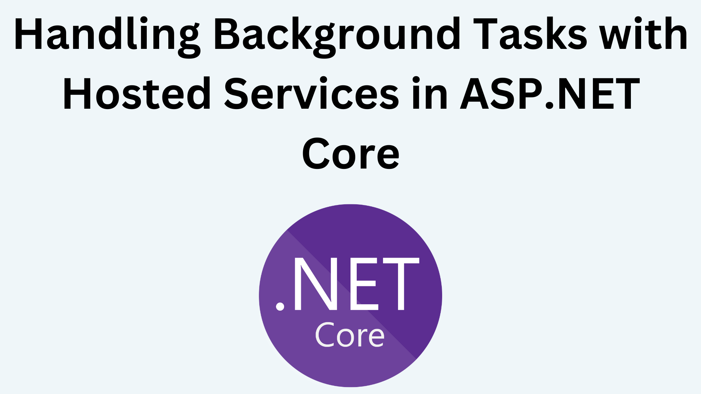

# Tutorial: Tareas Programadas en ASP.NET Core

- [Tutorial: Tareas Programadas en ASP.NET Core](#tutorial-tareas-programadas-en-aspnet-core)
  - [1. ¿Qué son las tareas programadas?](#1-qué-son-las-tareas-programadas)
  - [2. Opciones para implementar tareas programadas](#2-opciones-para-implementar-tareas-programadas)
  - [3. Implementación con IHostedService](#3-implementación-con-ihostedservice)
    - [3.1. Tarea simple con BackgroundService](#31-tarea-simple-con-backgroundservice)
    - [3.2. Tarea con intervalo configurable](#32-tarea-con-intervalo-configurable)
  - [4. Implementación con NCronTab (Expresiones Cron)](#4-implementación-con-ncrontab-expresiones-cron)
    - [4.1. Instalación](#41-instalación)
    - [4.2. Servicio base con Cron](#42-servicio-base-con-cron)
    - [4.3. Ejemplo: Limpieza diaria de caché](#43-ejemplo-limpieza-diaria-de-caché)
  - [5. Implementación con Hangfire (Recomendado para producción)](#5-implementación-con-hangfire-recomendado-para-producción)
    - [5.1. Instalación](#51-instalación)
    - [5.2. Configuración](#52-configuración)
    - [5.3. Crear tareas recurrentes](#53-crear-tareas-recurrentes)
  - [6. Ejemplo avanzado: Enviar correos con novedades](#6-ejemplo-avanzado-enviar-correos-con-novedades)
    - [6.1. Con BackgroundService](#61-con-backgroundservice)
    - [6.2. Con Hangfire](#62-con-hangfire)
  - [7. Monitoreo y Logging](#7-monitoreo-y-logging)
  - [8. Testing de tareas programadas](#8-testing-de-tareas-programadas)
  - [9. Buenas prácticas](#9-buenas-prácticas)
  - [10. Comparación de opciones](#10-comparación-de-opciones)
  - [11. Desafío Propuesto](#11-desafío-propuesto)
  - [12. Recursos útiles](#12-recursos-útiles)

---



## 1. ¿Qué son las tareas programadas?

Las tareas programadas ("scheduled tasks" o "background jobs") permiten ejecutar automáticamente fragmentos de código en momentos concretos o con intervalos regulares. Son perfectas para: 

- 🧹 Limpieza de datos antiguos
- 📧 Envío de correos programados
- 📊 Generación de reportes
- 🔄 Sincronización de datos
- 💾 Copias de seguridad
- 🗑️ Eliminación de archivos temporales

---

## 2. Opciones para implementar tareas programadas

En ASP.NET Core hay varias formas de implementar tareas programadas:

| Opción | Complejidad | Características | Uso recomendado |
|: -------|:------------|:----------------|: ----------------|
| **IHostedService** | Baja | Integrado en . NET | Tareas simples |
| **BackgroundService** | Baja | Más sencillo que IHostedService | Tareas con intervalos fijos |
| **NCronTab** | Media | Expresiones Cron | Tareas con horarios específicos |
| **Hangfire** | Media-Alta | Dashboard, persistencia, reintentos | Producción |
| **Quartz.NET** | Alta | Muy completo y robusto | Sistemas empresariales complejos |

Para el curso, nos centraremos en **BackgroundService** y **Hangfire**. 

---

## 3. Implementación con IHostedService

### 3.1. Tarea simple con BackgroundService

```csharp
using Microsoft.Extensions.Hosting;
using Microsoft. Extensions. Logging;

namespace FunkosApi.Services. Background;

public class SimpleScheduledTask : BackgroundService
{
    private readonly ILogger<SimpleScheduledTask> _logger;
    private readonly TimeSpan _period = TimeSpan.FromSeconds(10);

    public SimpleScheduledTask(ILogger<SimpleScheduledTask> logger)
    {
        _logger = logger;
    }

    protected override async Task ExecuteAsync(CancellationToken stoppingToken)
    {
        _logger.LogInformation("🚀 Tarea programada iniciada");

        while (!stoppingToken.IsCancellationRequested)
        {
            try
            {
                _logger. LogInformation("⏰ Ejecutando tarea:  {Time}", DateTime.Now);
                
                // Aquí va tu lógica
                await DoWorkAsync();

                // Esperar antes de la siguiente ejecución
                await Task. Delay(_period, stoppingToken);
            }
            catch (Exception ex)
            {
                _logger.LogError(ex, "❌ Error en tarea programada");
                // Esperar un poco más si hay error
                await Task.Delay(TimeSpan.FromMinutes(1), stoppingToken);
            }
        }

        _logger.LogInformation("🛑 Tarea programada detenida");
    }

    private async Task DoWorkAsync()
    {
        // Tu lógica aquí
        await Task.Delay(100); // Simular trabajo
        _logger.LogInformation("✅ Trabajo completado");
    }
}
```

**Registro en Program.cs:**

```csharp
builder.Services.AddHostedService<SimpleScheduledTask>();
```

---

### 3.2. Tarea con intervalo configurable

```csharp
public class ConfigurableScheduledTask : BackgroundService
{
    private readonly ILogger<ConfigurableScheduledTask> _logger;
    private readonly IConfiguration _configuration;
    private TimeSpan _interval;

    public ConfigurableScheduledTask(
        ILogger<ConfigurableScheduledTask> logger,
        IConfiguration configuration)
    {
        _logger = logger;
        _configuration = configuration;
        
        // Leer intervalo de configuración (en segundos)
        var intervalSeconds = _configuration.GetValue<int>("ScheduledTasks:IntervalSeconds", 60);
        _interval = TimeSpan.FromSeconds(intervalSeconds);
    }

    protected override async Task ExecuteAsync(CancellationToken stoppingToken)
    {
        _logger.LogInformation(
            "🚀 Tarea configurable iniciada (intervalo: {Interval})",
            _interval
        );

        while (!stoppingToken.IsCancellationRequested)
        {
            try
            {
                await DoWorkAsync();
                await Task.Delay(_interval, stoppingToken);
            }
            catch (OperationCanceledException)
            {
                _logger.LogInformation("🛑 Tarea cancelada");
            }
            catch (Exception ex)
            {
                _logger. LogError(ex, "❌ Error en tarea");
                await Task.Delay(TimeSpan.FromMinutes(1), stoppingToken);
            }
        }
    }

    private async Task DoWorkAsync()
    {
        _logger.LogInformation("⏰ Ejecutando tarea:  {Time}", DateTime.Now);
        // Tu lógica aquí
        await Task.CompletedTask;
    }
}
```

**appsettings.json:**

```json
{
  "ScheduledTasks": {
    "IntervalSeconds": 300
  }
}
```

---

## 4. Implementación con NCronTab (Expresiones Cron)

### 4.1. Instalación

```bash
dotnet add package NCronTab
```

### 4.2. Servicio base con Cron

```csharp
using NCrontab;

namespace FunkosApi.Services.Background;

public abstract class CronScheduledService : BackgroundService
{
    private readonly CrontabSchedule _schedule;
    private DateTime _nextRun;
    protected readonly ILogger Logger;

    protected abstract string Schedule { get; }

    protected CronScheduledService(ILogger logger)
    {
        Logger = logger;
        _schedule = CrontabSchedule.Parse(Schedule);
        _nextRun = _schedule.GetNextOccurrence(DateTime.Now);
    }

    protected override async Task ExecuteAsync(CancellationToken stoppingToken)
    {
        Logger.LogInformation(
            "🚀 Tarea Cron iniciada.  Próxima ejecución:  {NextRun}",
            _nextRun
        );

        while (!stoppingToken.IsCancellationRequested)
        {
            var now = DateTime.Now;
            if (now >= _nextRun)
            {
                try
                {
                    Logger.LogInformation("⏰ Ejecutando tarea programada");
                    await DoWorkAsync();
                    
                    _nextRun = _schedule.GetNextOccurrence(DateTime.Now);
                    Logger.LogInformation(
                        "✅ Tarea completada. Próxima ejecución: {NextRun}",
                        _nextRun
                    );
                }
                catch (Exception ex)
                {
                    Logger.LogError(ex, "❌ Error en tarea Cron");
                    _nextRun = _schedule.GetNextOccurrence(DateTime.Now);
                }
            }

            // Esperar 1 minuto antes de verificar de nuevo
            await Task.Delay(TimeSpan.FromMinutes(1), stoppingToken);
        }
    }

    protected abstract Task DoWorkAsync();
}
```

### 4.3. Ejemplo: Limpieza diaria de caché

```csharp
public class DailyCacheCleanupTask : CronScheduledService
{
    private readonly ICacheService _cacheService;

    // Todos los días a las 2:00 AM
    protected override string Schedule => "0 2 * * *";

    public DailyCacheCleanupTask(
        ICacheService cacheService,
        ILogger<DailyCacheCleanupTask> logger) :  base(logger)
    {
        _cacheService = cacheService;
    }

    protected override async Task DoWorkAsync()
    {
        Logger.LogInformation("🧹 Iniciando limpieza de caché");
        
        // Limpiar caché antigua
        await _cacheService.RemoveExpiredAsync();
        
        Logger.LogInformation("✅ Limpieza de caché completada");
    }
}
```

**Expresiones Cron comunes:**

| Expresión | Descripción |
| :-------- |: ------------|
| `* * * * *` | Cada minuto |
| `0 * * * *` | Cada hora (minuto 0) |
| `0 */2 * * *` | Cada 2 horas |
| `0 9 * * *` | Todos los días a las 9:00 AM |
| `0 9 * * 1` | Todos los lunes a las 9:00 AM |
| `0 0 1 * *` | El primer día de cada mes a medianoche |
| `0 0 * * 0` | Todos los domingos a medianoche |

🔗 [Generador de expresiones Cron](https://crontab.guru/)

---

## 5. Implementación con Hangfire (Recomendado para producción)

### 5.1. Instalación

```bash
dotnet add package Hangfire.Core
dotnet add package Hangfire.AspNetCore
dotnet add package Hangfire.SqlServer
# O para PostgreSQL: 
# dotnet add package Hangfire. PostgreSql
```

### 5.2. Configuración

**Program.cs:**

```csharp
using Hangfire;
using Hangfire.SqlServer;

var builder = WebApplication.CreateBuilder(args);

// Configurar Hangfire
builder.Services. AddHangfire(configuration => configuration
    .SetDataCompatibilityLevel(CompatibilityLevel.Version_180)
    .UseSimpleAssemblyNameTypeSerializer()
    .UseRecommendedSerializerSettings()
    .UseSqlServerStorage(
        builder.Configuration.GetConnectionString("HangfireConnection"),
        new SqlServerStorageOptions
        {
            CommandBatchMaxTimeout = TimeSpan.FromMinutes(5),
            SlidingInvisibilityTimeout = TimeSpan.FromMinutes(5),
            QueuePollInterval = TimeSpan.Zero,
            UseRecommendedIsolationLevel = true,
            DisableGlobalLocks = true
        }
    ));

builder.Services.AddHangfireServer();

var app = builder.Build();

// Dashboard de Hangfire (solo en desarrollo)
if (app.Environment. IsDevelopment())
{
    app.UseHangfireDashboard("/hangfire");
}

// Configurar tareas recurrentes
ConfigureRecurringJobs();

app.Run();

void ConfigureRecurringJobs()
{
    // Tarea cada 10 minutos
    RecurringJob.AddOrUpdate<CleanupService>(
        "cleanup-temp-files",
        service => service.CleanupTempFiles(),
        "*/10 * * * *"
    );

    // Tarea diaria a las 2:00 AM
    RecurringJob.AddOrUpdate<BackupService>(
        "daily-backup",
        service => service.CreateBackup(),
        Cron.Daily(2)
    );

    // Tarea semanal los lunes a las 9:00 AM
    RecurringJob.AddOrUpdate<ReportService>(
        "weekly-report",
        service => service. GenerateWeeklyReport(),
        Cron.Weekly(DayOfWeek.Monday, 9)
    );
}
```

### 5.3. Crear tareas recurrentes

```csharp
public class CleanupService
{
    private readonly ILogger<CleanupService> _logger;

    public CleanupService(ILogger<CleanupService> logger)
    {
        _logger = logger;
    }

    public async Task CleanupTempFiles()
    {
        _logger.LogInformation("🧹 Iniciando limpieza de archivos temporales");
        
        // Tu lógica aquí
        await Task.CompletedTask;
        
        _logger.LogInformation("✅ Limpieza completada");
    }
}
```

**Ventajas de Hangfire:**
- ✅ Dashboard visual para monitorear tareas
- ✅ Persistencia en base de datos
- ✅ Reintentos automáticos
- ✅ Múltiples servidores (escalabilidad)
- ✅ Soporte para tareas diferidas y colas

---

## 6. Ejemplo avanzado: Enviar correos con novedades

### 6.1. Con BackgroundService

```csharp
public class NovedadesEmailTask : BackgroundService
{
    private readonly IServiceProvider _serviceProvider;
    private readonly ILogger<NovedadesEmailTask> _logger;
    private DateTime _ultimaEjecucion = DateTime.Now. AddDays(-1);

    public NovedadesEmailTask(
        IServiceProvider serviceProvider,
        ILogger<NovedadesEmailTask> logger)
    {
        _serviceProvider = serviceProvider;
        _logger = logger;
    }

    protected override async Task ExecuteAsync(CancellationToken stoppingToken)
    {
        while (!stoppingToken.IsCancellationRequested)
        {
            var ahora = DateTime.Now;

            // Ejecutar todos los días a las 8:30 AM
            if (ahora. Hour == 8 && ahora. Minute == 30)
            {
                using var scope = _serviceProvider.CreateScope();
                var productoService = scope.ServiceProvider. GetRequiredService<IProductoService>();
                var emailService = scope.ServiceProvider. GetRequiredService<IEmailService>();
                var userService = scope.ServiceProvider.GetRequiredService<IUserService>();

                try
                {
                    _logger.LogInformation("📧 Enviando novedades diarias");

                    var nuevosProductos = await productoService
                        .GetProductosNuevosDesdeAsync(_ultimaEjecucion);

                    if (nuevosProductos.Any())
                    {
                        var htmlBody = GenerarHtmlNovedades(nuevosProductos);
                        var usuarios = await userService.GetAllAsync();

                        foreach (var usuario in usuarios. Where(u => ! string.IsNullOrEmpty(u.Email)))
                        {
                            await emailService.SendHtmlEmailAsync(
                                usuario.Email,
                                "🆕 Novedades en la tienda",
                                htmlBody
                            );
                        }

                        _logger.LogInformation(
                            "✅ Novedades enviadas a {Count} usuarios",
                            usuarios.Count()
                        );
                    }

                    _ultimaEjecucion = ahora;

                    // Esperar 24 horas
                    await Task.Delay(TimeSpan.FromHours(24), stoppingToken);
                }
                catch (Exception ex)
                {
                    _logger. LogError(ex, "❌ Error enviando novedades");
                    await Task.Delay(TimeSpan.FromHours(1), stoppingToken);
                }
            }

            // Verificar cada minuto
            await Task.Delay(TimeSpan.FromMinutes(1), stoppingToken);
        }
    }

    private string GenerarHtmlNovedades(IEnumerable<Producto> productos)
    {
        var items = string.Join("", productos.Select(p =>
            $"<li><strong>{p.Nombre}</strong> - {p.Precio:C}</li>"
        ));

        return $@"
<! DOCTYPE html>
<html>
<head>
    <meta charset=""UTF-8"">
</head>
<body>
    <h1>🆕 Nuevos productos en la tienda</h1>
    <ul>
        {items}
    </ul>
    <p>¡No te los pierdas!</p>
</body>
</html>";
    }
}
```

### 6.2. Con Hangfire

```csharp
public class NovedadesEmailService
{
    private readonly IProductoService _productoService;
    private readonly IEmailService _emailService;
    private readonly IUserService _userService;
    private readonly ILogger<NovedadesEmailService> _logger;

    public NovedadesEmailService(
        IProductoService productoService,
        IEmailService emailService,
        IUserService userService,
        ILogger<NovedadesEmailService> logger)
    {
        _productoService = productoService;
        _emailService = emailService;
        _userService = userService;
        _logger = logger;
    }

    public async Task EnviarNovedadesDiarias()
    {
        _logger.LogInformation("📧 Enviando novedades diarias");

        var ayer = DateTime.Now.AddDays(-1);
        var nuevosProductos = await _productoService. GetProductosNuevosDesdeAsync(ayer);

        if (! nuevosProductos.Any())
        {
            _logger.LogInformation("ℹ️ No hay productos nuevos");
            return;
        }

        var htmlBody = GenerarHtmlNovedades(nuevosProductos);
        var usuarios = await _userService.GetAllAsync();

        foreach (var usuario in usuarios.Where(u => !string. IsNullOrEmpty(u. Email)))
        {
            await _emailService.SendHtmlEmailAsync(
                usuario.Email,
                "🆕 Novedades en la tienda",
                htmlBody
            );
        }

        _logger.LogInformation("✅ Novedades enviadas a {Count} usuarios", usuarios.Count());
    }

    private string GenerarHtmlNovedades(IEnumerable<Producto> productos)
    {
        // Mismo código que antes
    }
}
```

**Configuración en Program.cs:**

```csharp
// Tarea diaria a las 8:30 AM
RecurringJob.AddOrUpdate<NovedadesEmailService>(
    "novedades-diarias",
    service => service.EnviarNovedadesDiarias(),
    "30 8 * * *"
);
```

---

## 7. Monitoreo y Logging

```csharp
public class MonitoredScheduledTask : BackgroundService
{
    private readonly ILogger<MonitoredScheduledTask> _logger;
    private readonly IMetricsService _metrics;

    protected override async Task ExecuteAsync(CancellationToken stoppingToken)
    {
        while (!stoppingToken.IsCancellationRequested)
        {
            var stopwatch = System.Diagnostics.Stopwatch.StartNew();

            try
            {
                _logger.LogInformation("⏰ Iniciando tarea programada");

                await DoWorkAsync();

                stopwatch.Stop();
                _metrics.RecordTaskExecution("scheduled-task", stopwatch.ElapsedMilliseconds, success: true);

                _logger.LogInformation(
                    "✅ Tarea completada en {Duration}ms",
                    stopwatch.ElapsedMilliseconds
                );
            }
            catch (Exception ex)
            {
                stopwatch.Stop();
                _metrics.RecordTaskExecution("scheduled-task", stopwatch.ElapsedMilliseconds, success: false);

                _logger.LogError(
                    ex,
                    "❌ Error en tarea programada (duración: {Duration}ms)",
                    stopwatch.ElapsedMilliseconds
                );
            }

            await Task.Delay(TimeSpan.FromMinutes(5), stoppingToken);
        }
    }

    private async Task DoWorkAsync()
    {
        // Tu lógica aquí
        await Task.CompletedTask;
    }
}
```

---

## 8. Testing de tareas programadas

```csharp
[TestFixture]
public class ScheduledTaskTests
{
    [Test]
    public async Task DoWorkAsync_DeberiaEjecutarseCorrectamente()
    {
        // Arrange
        var loggerMock = new Mock<ILogger<SimpleScheduledTask>>();
        var task = new SimpleScheduledTask(loggerMock.Object);

        // Act & Assert
        await task.StartAsync(CancellationToken.None);
        await Task.Delay(TimeSpan. FromSeconds(1));
        await task. StopAsync(CancellationToken.None);

        // Verificar que se ejecutó
        loggerMock.Verify(
            x => x.Log(
                LogLevel.Information,
                It. IsAny<EventId>(),
                It.Is<It.IsAnyType>((v, t) => v.ToString().Contains("Ejecutando tarea")),
                It.IsAny<Exception>(),
                It.IsAny<Func<It.IsAnyType, Exception?, string>>()
            ),
            Times.AtLeastOnce
        );
    }
}
```

---

## 9. Buenas prácticas

✅ **Usa scopes**:  En BackgroundService, crea scopes para servicios con lifetime Scoped

```csharp
using var scope = _serviceProvider.CreateScope();
var service = scope.ServiceProvider.GetRequiredService<IMyService>();
```

✅ **Manejo de errores robusto**:  No dejes que una excepción detenga toda la tarea

✅ **Logging detallado**: Registra inicio, fin, duración y errores

✅ **Configuración flexible**:  Usa appsettings.json para intervalos y horarios

✅ **Idempotencia**: Las tareas deben poder ejecutarse múltiples veces sin efectos secundarios

✅ **Timeout**: Implementa timeouts para tareas que puedan colgarse

✅ **Monitoreo**:  Implementa métricas y alertas

✅ **Testing**: Testea la lógica de negocio separada de la planificación

---

## 10. Comparación de opciones

| Característica   | BackgroundService | NCronTab | Hangfire             |
| :--------------- | :---------------- | :------- | :------------------- |
| Complejidad      | ⭐                 | ⭐⭐       | ⭐⭐⭐                  |
| Expresiones Cron | ❌                 | ✅        | ✅                    |
| Dashboard        | ❌                 | ❌        | ✅                    |
| Persistencia     | ❌                 | ❌        | ✅                    |
| Escalabilidad    | ⭐                 | ⭐        | ⭐⭐⭐                  |
| Reintentos       | Manual            | Manual   | Automático           |
| Costo            | Gratis            | Gratis   | Gratis (open source) |

**Recomendación:**
- **Desarrollo/Aprendizaje**: BackgroundService
- **Proyectos simples**: NCronTab
- **Producción**: Hangfire

---

## 11. Desafío Propuesto

1. ✅ Crea una tarea que borre productos sin stock que lleven más de 6 meses sin actualizarse
2. ✅ Implementa una tarea que envíe un resumen semanal de ventas los lunes a las 9:00 AM
3. ✅ Crea una tarea que registre en la base de datos cada vez que se ejecuta una tarea programada
4. ✅ Implementa un sistema de notificaciones para productos con stock bajo
5. ✅ Crea una tarea que genere reportes automáticos en PDF y los envíe por email

---

## 12. Recursos útiles

- [Microsoft:  Background tasks with hosted services](https://docs.microsoft.com/en-us/aspnet/core/fundamentals/host/hosted-services)
- [Hangfire Documentation](https://docs.hangfire.io/)
- [NCronTab GitHub](https://github.com/atifaziz/NCrontab)
- [Crontab Guru (generador)](https://crontab.guru/)
- [Quartz. NET Documentation](https://www.quartz-scheduler.net/)

---

