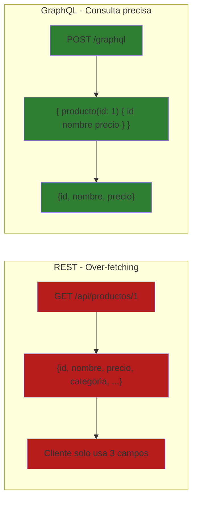
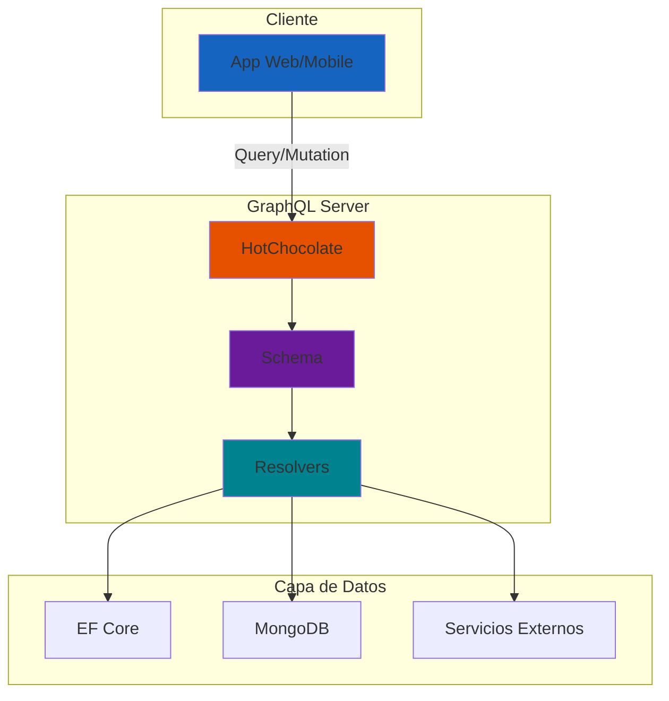
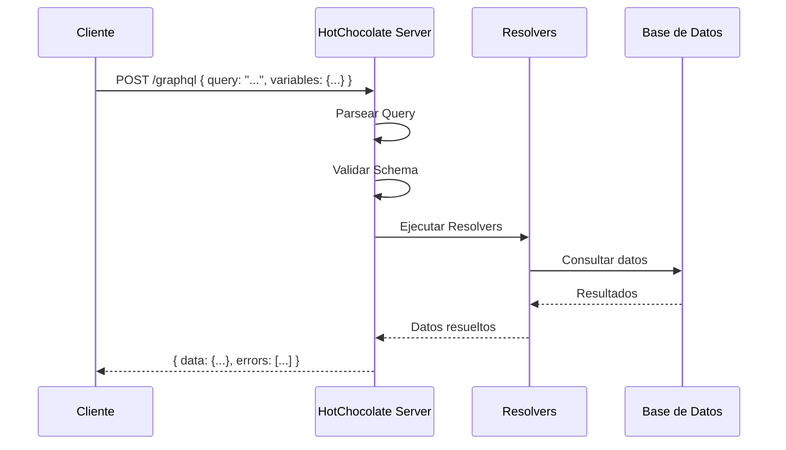
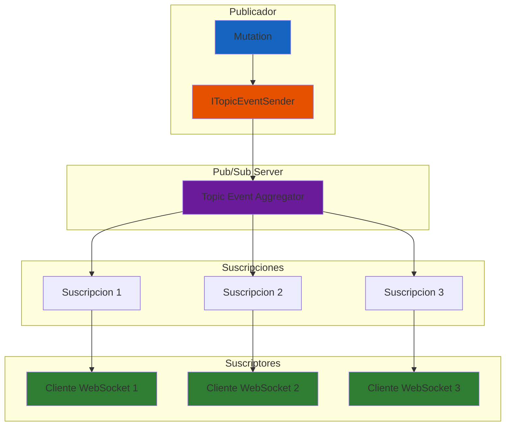
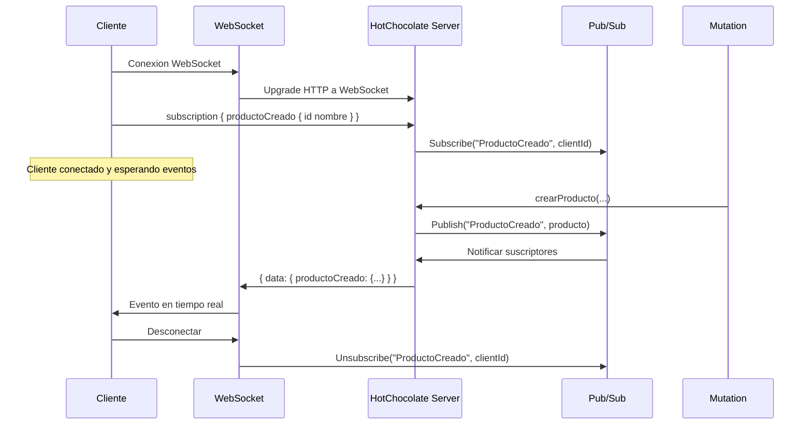
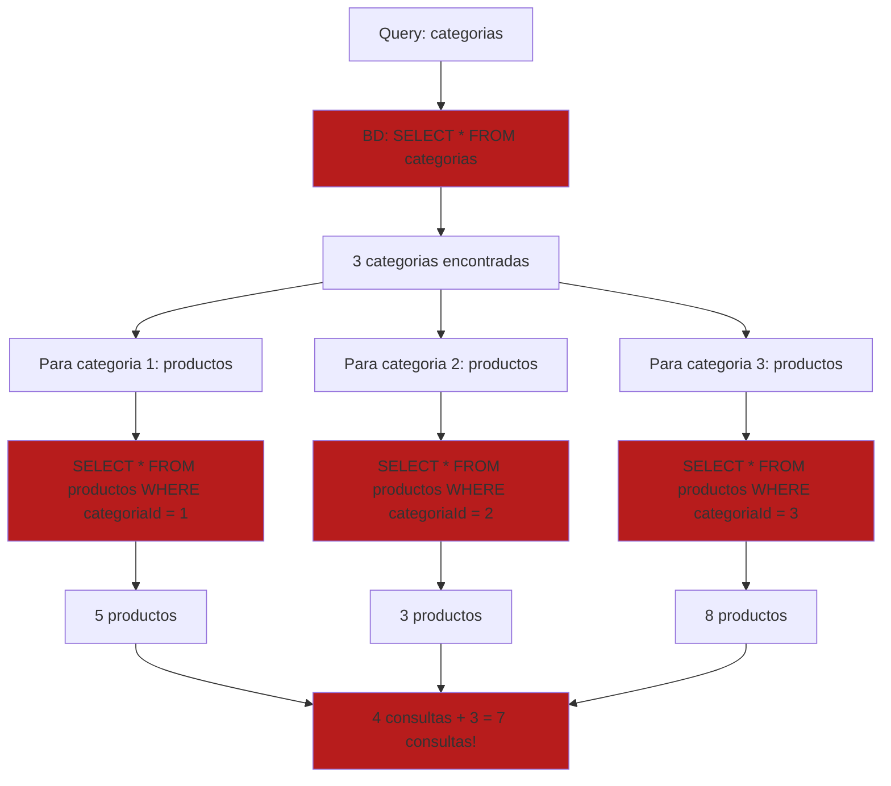
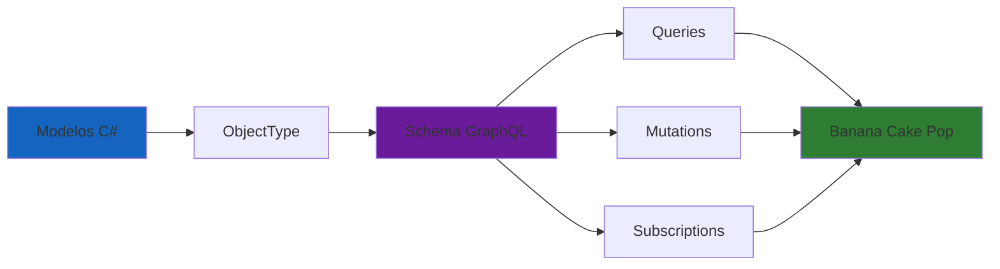

# 19. GraphQL con HotChocolate

## Indice

- [19.1. Conceptos Fundamentales](#191-conceptos-fundamentales)
- [19.2. HotChocolate en ASP.NET Core](#192-hotchocolate-en-aspnet-core)
- [19.3. Tipos y Esquema](#193-tipos-y-esquema)
- [19.4. Inputs](#194-inputs)
- [19.5. Queries](#195-queries)
- [19.6. Mutations](#196-mutations)
- [19.7. Subscriptions y Patron Pub/Sub](#197-subscriptions-y-patron-pubsub)
- [19.8. DataLoaders y Problema N+1](#198-dataloaders-y-problema-n1)
- [19.9. Autorizacion](#199-autorizacion)
- [19.10. Testing](#1910-testing)
- [19.11. Resumen](#1911-resumen)
- [19.12. Ejercicio Propuesto](#1912-ejercicio-propuesto)

---

## 19.1. Conceptos Fundamentales

GraphQL es un lenguaje de consulta desarrollado por Facebook que permite al cliente especificar exactamente que datos necesita.

### Que es GraphQL



🧠 **Analogia**: REST es como un menu con platos combinados donde recibes todo aunque solo quieras una parte. GraphQL es como personalizar tu pedido exactamente: "pollo sin piel, con verduras al vapor". El chef prepara exactamente lo que pides.

### REST vs GraphQL

| Aspecto | REST | GraphQL |
|---------|------|---------|
| **Endpoints** | Multiple URLs | Un solo endpoint |
| **Datos** | Servidor define respuesta | Cliente elige campos |
| **Over-fetching** | Si | No |
| **Under-fetching** | Si | No |
| **Versionado** | Comun (/v1/) | No necesario |
| **Cache** | HTTP nativo | Mas complejo |
| **Documentacion** | Manual/ Swagger | Automatica |

### Arquitectura GraphQL



### Cuando Usar GraphQL

✅ **GraphQL:**
- Clientes moviles/web diferentes
- Consultas complejas anidadas
- Reducir llamadas API
- API publica con muchos clientes

❌ **REST:**
- API simple
- Cacheo prioritario
- Equipo nuevo
- Microservicios independientes

---

## 19.2. HotChocolate en ASP.NET Core

HotChocolate es la implementación mas popular de GraphQL para .NET con enfoque Code-First.

### Paquetes NuGet

```bash
# Paquete principal
dotnet add package HotChocolate.AspNetCore

# Autorizacion integrada
dotnet add package HotChocolate.AspNetCore.Authorization

# Integracion con EF Core
dotnet add package HotChocolate.Data.EntityFramework

# Suscripciones
dotnet add package HotChocolate.Subscriptions.InMemory

# DataLoaders
dotnet add package GreenDonut
```

### Configuracion en Program.cs

```csharp
using HotChocolate;
using HotChocolate.AspNetCore;

var builder = WebApplication.CreateBuilder(args);

// DbContext
builder.Services.AddDbContext<ApplicationDbContext>(options =>
    options.UseSqlServer(builder.Configuration.GetConnectionString("Default")));

// GraphQL Server
builder.Services
    .AddGraphQLServer()
    .AddQueryType(d => d.Name("Query"))
    .AddMutationType(d => d.Name("Mutation"))
    .AddSubscriptionType(d => d.Name("Subscription"))
    .AddType<ProductoType>()
    .AddType<CategoriaType>()
    .AddInMemorySubscriptions()
    .AddAuthorization()
    .AddFiltering()
    .AddSorting()
    .AddProjections();

var app = builder.Build();

// Endpoint GraphQL
app.MapGraphQL();

// Playground (solo desarrollo)
if (app.Environment.IsDevelopment())
{
    Console.WriteLine("GraphQL Playground: https://localhost:5001/graphql");
}

app.Run();
```

### Flujo de Peticion GraphQL



### Banana Cake Pop

El playground de HotChocolate accesible en `/graphql` permite:

- Explorar el esquema automaticamente
- Ejecutar consultas
- Ver documentacion
- Depurar suscripciones
- Administrar esquemas

---

## 19.3. Tipos y Esquema

HotChocolate usa **Code-First**, generando el esquema GraphQL automaticamente desde clases C#.

### ObjectType Basico

```csharp
using HotChocolate.Types;

namespace TiendaApi.Apis.GraphQL.Types;

public class ProductoType : ObjectType<Producto>
{
    protected override void Configure(IObjectTypeDescriptor<Producto> descriptor)
    {
        descriptor.Name("Producto");
        descriptor.Description("Entidad Producto de la tienda");

        descriptor.Field(p => p.Id)
            .Type<NonNullType<IdType>>()
            .Description("El ID unico del producto");

        descriptor.Field(p => p.Nombre)
            .Type<NonNullType<StringType>>()
            .Description("El nombre del producto");

        descriptor.Field(p => p.Precio)
            .Type<NonNullType<DecimalType>>()
            .Description("El precio del producto");

        descriptor.Field(p => p.Stock)
            .Type<NonNullType<IntType>>()
            .Description("Cantidad en stock");

        descriptor.Field(p => p.Descripcion)
            .Type<StringType>()
            .Description("Descripcion del producto");

        descriptor.Field(p => p.ImagenUrl)
            .Type<StringType>()
            .Description("URL de la imagen del producto");

        descriptor.Field(p => p.Categoria)
            .Type<NonNullType<CategoriaType>>()
            .Description("Categoria del producto");
    }
}
```

### Tipos GraphQL Disponibles

| GraphQL Type | .NET Type | Descripcion |
|--------------|-----------|-------------|
| `ID` | `string` o `Guid` | Identificador unico |
| `String` | `string` | Cadena de texto |
| `Int` | `int` | Entero de 32 bits |
| `Float` | `double` | Numero decimal |
| `Boolean` | `bool` | Verdadero/Falso |
| `DateTime` | `DateTime` | Fecha y hora |
| `Date` | `DateOnly` | Solo fecha |
| `Decimal` | `decimal` | Decimal preciso monetario |
| `[Type!]!` | `ICollection<T>` | Lista no nula de no nulos |

### Tipos de Coleccion

```csharp
// Lista de strings
public IEnumerable<string> Tags { get; set; } = new List<string>();

// GraphQL: [String!]

// Lista de objetos no nula
public List<Producto> Productos { get; set; }

// GraphQL: [Producto!]!

// Lista nullable
public List<Producto>? Productos { get; set; }

// GraphQL: [Producto]
```

### EnumType

```csharp
using HotChocolate.Types;

namespace TiendaApi.Apis.GraphQL.Types;

public enum CategoriaEnum
{
    Marvel = 1,
    DC = 2,
    Anime = 3,
    Videojuegos = 4,
    Peliculas = 5
}

public class CategoriaEnumType : EnumType<CategoriaEnum>
{
    protected override void Configure(IEnumTypeDescriptor<CategoriaEnum> descriptor)
    {
        descriptor.Name("CategoriaEnum");
        descriptor.Description("Enumeracion de categorias de productos");
        
        descriptor.Value(CategoriaEnum.Marvel)
            .Description("Productos de Marvel");
            
        descriptor.Value(CategoriaEnum.DC)
            .Description("Productos de DC Comics");
    }
}
```

### InterfaceType

```csharp
using HotChocolate.Types;

namespace TiendaApi.Apis.GraphQL.Types;

public interface IEntity
{
    long Id { get; set; }
    string Nombre { get; set; }
}

public class ProductoType : ObjectType<Producto>, IInterfaceType
{
    public new interface IEntity Entity => this;
    
    protected override void Configure(IObjectTypeDescriptor<Producto> descriptor)
    {
        descriptor.Implements<IEntity>();
        // ... campos
    }
}
```

### Resolvers Personalizados

```csharp
using HotChocolate;
using HotChocolate.Types;
using GreenDonut;

namespace TiendaApi.Apis.GraphQL.Resolvers;

[ExtendObjectType(typeof(Producto))]
public class ProductoResolvers
{
    /// <summary>
    /// Campo calculado: disponible si hay stock
    /// </summary>
    public bool GetEstaDisponible([Parent] Producto producto)
    {
        return producto.Stock > 0;
    }

    /// <summary>
    /// Campo calculado: precio con descuento
    /// </summary>
    public decimal GetPrecioConDescuento(
        [Parent] Producto producto,
        [GraphQLNonNullType] int porcentaje)
    {
        return producto.Precio * (100 - porcentaje) / 100;
    }

    /// <summary>
    /// Resolver con DataLoader para evitar N+1
    /// </summary>
    public async Task<Categoria> GetCategoria(
        [Parent] Producto producto,
        [Service] IDataLoader<long, Categoria> categoriaLoader)
    {
        return await categoriaLoader.LoadAsync(producto.CategoriaId);
    }
}
```

### UnionType

```csharp
using HotChocolate.Types;

namespace TiendaApi.Apis.GraphQL.Types;

public class ErrorType : ObjectType<Error>
{
    protected override void Configure(IObjectTypeDescriptor<Error> descriptor)
    {
        descriptor.Field(e => e.Mensaje).Type<NonNullType<StringType>>();
    }
}

public class BusquedaResultType : UnionType<SearchResult>
{
    protected override void Configure(IUnionTypeDescriptor descriptor)
    {
        descriptor.Type<ProductoType>();
        descriptor.Type<CategoriaType>();
        descriptor.Type<ErrorType>();
    }
}
```

---

## 19.4. Inputs

Los Input Types representan datos de entrada para Mutations, comparables a DTOs en REST.

### Input Record Simple

```csharp
namespace TiendaApi.Apis.GraphQL.Inputs;

public record CreateProductoInput(
    string Nombre,
    string? Descripcion,
    decimal Precio,
    int Stock,
    long CategoriaId
);
```

### Input con Validacion

```csharp
using HotChocolate;
using System.ComponentModel.DataAnnotations;

namespace TiendaApi.Apis.GraphQL.Inputs;

public class CreateProductoInput : IValidatableObject
{
    [Required]
    [StringLength(100, MinimumLength = 3)]
    public string Nombre { get; set; } = string.Empty;

    [StringLength(500)]
    public string? Descripcion { get; set; }

    [Range(0.01, 10000)]
    public decimal Precio { get; set; }

    [Range(0, int.MaxValue)]
    public int Stock { get; set; }

    public long CategoriaId { get; set; }

    public IEnumerable<ValidationResult> Validate(
        ValidationContext validationContext)
    {
        if (Precio <= 0 && Stock > 0)
        {
            yield return new ValidationResult(
                "El precio debe ser mayor a 0 si hay stock",
                new[] { nameof(Precio) });
        }
    }
}
```

### Input para Actualizacion (Partial Update)

```csharp
namespace TiendaApi.Apis.GraphQL.Inputs;

public record UpdateProductoInput(
    string? Nombre,
    string? Descripcion,
    decimal? Precio,
    int? Stock,
    long? CategoriaId
);
```

### Input con Campos Calculados

```csharp
namespace TiendaApi.Apis.GraphQL.Inputs;

public class BusquedaInput
{
    public string? Termino { get; set; }
    public decimal? PrecioMin { get; set; }
    public decimal? PrecioMax { get; set; }
    public long? CategoriaId { get; set; }
    public bool? SoloDisponibles { get; set; }
    public List<string>? Tags { get; set; }
    public string? OrdenarPor { get; set; } = "nombre";
    public bool Ascendente { get; set; } = true;
}
```

### Input para Filtros de Paginacion

```csharp
namespace TiendaApi.Apis.GraphQL.Inputs;

public class PaginationInput
{
    public int? Skip { get; set; }
    public int? Take { get; set; }
    public string? Cursor { get; set; }
}
```

---

## 19.5. Queries

Las Queries son operaciones de solo lectura equivalentes a GET en REST.

### Query Basica

```csharp
using HotChocolate;
using HotChocolate.Types;
using HotChocolate.Data;

namespace TiendaApi.Apis.GraphQL.Types;

public class Query
{
    /// <summary>
    /// Obtiene todos los productos con paginacion
    /// </summary>
    [UsePaging(MaxPageSize = 50, DefaultPageSize = 10)]
    [UseFiltering]
    [UseSorting]
    public IQueryable<Producto> GetProductos([Service] ApplicationDbContext context)
    {
        return context.Productos.Include(p => p.Categoria);
    }

    /// <summary>
    /// Obtiene un producto por ID
    /// </summary>
    [UseFirstOrDefault]
    public async Task<Producto?> GetProducto(
        long id,
        [Service] IProductoService service)
    {
        return await service.GetByIdAsync(id);
    }

    /// <summary>
    /// Obtiene categorias
    /// </summary>
    [UsePaging]
    public IQueryable<Categoria> GetCategorias([Service] ApplicationDbContext context)
    {
        return context.Categorias;
    }
}
```

### Query con Filtros Personalizados

```csharp
using HotChocolate;
using System.Linq;

public class Query
{
    /// <summary>
    /// Busqueda de productos con termino
    /// </summary>
    [UseFiltering]
    public IQueryable<Producto> BuscarProductos(
        string termino,
        [Service] ApplicationDbContext context)
    {
        if (string.IsNullOrWhiteSpace(termino))
            return Enumerable.Empty<Producto>().AsQueryable();

        return context.Productos
            .Where(p => p.Nombre.Contains(termino) ||
                       p.Descripcion.Contains(termino))
            .Include(p => p.Categoria);
    }

    /// <summary>
    /// Productos mas vendidos (campo calculado)
    /// </summary>
    [UsePaging]
    public IQueryable<Producto> GetProductosPopulares(
        [Service] IProductoService service)
    {
        return service.GetMasVendidos(10);
    }

    /// <summary>
    /// Busqueda avanzada con input
    /// </summary>
    [UseFiltering]
    public IQueryable<Producto> BusquedaAvanzada(
        BusquedaInput input,
        [Service] ApplicationDbContext context)
    {
        var query = context.Productos.AsQueryable();

        if (!string.IsNullOrEmpty(input.Termino))
        {
            var term = input.Termino.ToLower();
            query = query.Where(p => 
                p.Nombre.ToLower().Contains(term) ||
                p.Descripcion.ToLower().Contains(term));
        }

        if (input.PrecioMin.HasValue)
            query = query.Where(p => p.Precio >= input.PrecioMin.Value);

        if (input.PrecioMax.HasValue)
            query = query.Where(p => p.Precio <= input.PrecioMax.Value);

        if (input.CategoriaId.HasValue)
            query = query.Where(p => p.CategoriaId == input.CategoriaId.Value);

        if (input.SoloDisponibles == true)
            query = query.Where(p => p.Stock > 0);

        return query;
    }
}
```

### Consultas GraphQL de Ejemplo

**Obtener productos paginados:**

```graphql
query {
  productos(first: 10, skip: 0) {
    nodes {
      id
      nombre
      precio
      stock
      estaDisponible
    }
    pageInfo {
      hasNextPage
      hasPreviousPage
      totalCount
    }
  }
}
```

**Con filtrado:**

```graphql
query {
  productos(
    where: { 
      precio: { gt: 20, lte: 100 }
      categoria: { nombre: { contains: "Marvel" } }
    }
    order: { precio: DESC }
    first: 10
  ) {
    nodes {
      id
      nombre
      precio
      categoria {
        nombre
      }
    }
  }
}
```

**Consulta anidada:**

```graphql
query {
  categorias {
    id
    nombre
    productos(first: 5, order: { precio: DESC }) {
      nodes {
        id
        nombre
        precio
      }
    }
  }
}
```

### Operadores de Filtro Disponibles

| Operador | Descripcion | Ejemplo |
|----------|-------------|---------|
| `eq` | Igual a | `precio: { eq: 29.99 }` |
| `neq` | Diferente a | `stock: { neq: 0 }` |
| `gt` | Mayor que | `precio: { gt: 20 }` |
| `gte` | Mayor o igual | `stock: { gte: 10 }` |
| `lt` | Menor que | `precio: { lt: 50 }` |
| `lte` | Menor o igual | `precio: { lte: 100 }` |
| `contains` | Contiene texto | `nombre: { contains: "Iron" }` |
| `startsWith` | Empieza con | `nombre: { startsWith: "Funko" }` |
| `in` | En lista | `categoriaId: { in: [1, 2, 3] }` |
| `some` | Algun elemento | `tags: { some: { eq: "novedad" } }` |

---

## 19.6. Mutations

Las Mutations son operaciones que modifican datos, equivalentes a POST, PUT, PATCH, DELETE en REST.

### Mutation de Crear

```csharp
using HotChocolate;
using HotChocolate.Subscriptions;
using TiendaApi.Apis.GraphQL.Inputs;
using TiendaApi.Apis.Services;

namespace TiendaApi.Apis.GraphQL.Types;

public class Mutation
{
    /// <summary>
    /// Crea un nuevo producto
    /// </summary>
    [Authorize(Roles = new[] { "Admin", "Editor" })]
    public async Task<Producto> CrearProducto(
        CreateProductoInput input,
        [Service] IProductoService service,
        [Service] ITopicEventSender eventSender)
    {
        var dto = new CreateProductoDto
        {
            Nombre = input.Nombre,
            Descripcion = input.Descripcion,
            Precio = input.Precio,
            Stock = input.Stock,
            CategoriaId = input.CategoriaId
        };

        var producto = await service.CreateAsync(dto);

        // Publicar evento para suscripciones
        await eventSender.SendAsync("ProductoCreado", producto);

        return producto;
    }
}
```

### Mutation de Actualizar

```csharp
public class Mutation
{
    /// <summary>
    /// Actualiza un producto existente
    /// </summary>
    [Authorize(Roles = new[] { "Admin", "Editor" })]
    public async Task<Producto?> ActualizarProducto(
        long id,
        UpdateProductoInput input,
        [Service] IProductoService service,
        [Service] ITopicEventSender eventSender)
    {
        var dto = new UpdateProductoDto
        {
            Nombre = input.Nombre,
            Descripcion = input.Descripcion,
            Precio = input.Precio,
            Stock = input.Stock
        };

        var producto = await service.UpdateAsync(id, dto);

        if (producto != null)
        {
            await eventSender.SendAsync("ProductoActualizado", producto);
        }

        return producto;
    }
}
```

### Mutation de Eliminar

```csharp
public class Mutation
{
    /// <summary>
    /// Elimina un producto
    /// </summary>
    [Authorize(Roles = new[] { "Admin" })]
    public async Task<bool> EliminarProducto(
        long id,
        [Service] IProductoService service,
        [Service] ITopicEventSender eventSender)
    {
        var eliminado = await service.DeleteAsync(id);

        if (eliminado)
        {
            await eventSender.SendAsync("ProductoEliminado", id);
        }

        return eliminado;
    }
}
```

### Mutation con Transaccion

```csharp
public class Mutation
{
    /// <summary>
    /// Compra multiple productos
    /// </summary>
    [Authorize]
    public async Task<ResultadoCompra> RealizarCompra(
        RealizarCompraInput input,
        [Service] ICompraService compraService,
        [Service] ITopicEventSender eventSender)
    {
        using var transaction = await compraService.BeginTransactionAsync();
        
        try
        {
            var resultado = await compraService.ProcesarCompraAsync(input);
            await transaction.CommitAsync();
            
            // Notificar actualizacion de stock
            foreach (var item in input.Items)
            {
                await eventSender.SendAsync("StockActualizado", 
                    new { productoId = item.ProductoId, cantidad = item.Cantidad });
            }
            
            return resultado;
        }
        catch
        {
            await transaction.RollbackAsync();
            throw;
        }
    }
}
```

### Mutations GraphQL de Ejemplo

**Crear producto:**

```graphql
mutation CrearProducto {
  crearProducto(input: {
    nombre: "Funko Iron Man"
    descripcion: "Funko de Iron Man modelo 2024"
    precio: 29.99
    stock: 15
    categoriaId: 1
  }) {
    id
    nombre
    precio
    estaDisponible
  }
}
```

**Actualizar producto:**

```graphql
mutation ActualizarProducto {
  actualizarProducto(
    id: 1
    input: { 
      precio: 34.99
      stock: 20
    }
  ) {
    id
    nombre
    precio
    stock
  }
}
```

**Eliminar producto:**

```graphql
mutation EliminarProducto {
  eliminarProducto(id: 1)
}
```

**Ejecutar compra:**

```graphql
mutation RealizarCompra {
  realizarCompra(input: {
    usuarioId: 1
    items: [
      { productoId: 1, cantidad: 2 }
      { productoId: 2, cantidad: 1 }
    ]
    direccionEnvio: "Calle Principal 123"
  }) {
    id
    total
    estado
    items {
      productoId
      cantidad
    }
  }
}
```

---

## 19.7. Subscriptions y Patron Pub/Sub

Las Subscriptions permiten recibir actualizaciones en tiempo real mediante WebSockets usando el patron Publicacion/Suscripcion.

### Patron Pub/Sub



### Implementacion de Subscription

```csharp
using HotChocolate;
using HotChocolate.Subscriptions;

namespace TiendaApi.Apis.GraphQL.Types;

public class Subscription
{
    /// <summary>
    /// Notifica cuando se crea un nuevo producto
    /// </summary>
    [Subscribe]
    [Topic(nameof(ProductoCreado))]
    public Producto ProductoCreado([EventMessage] Producto producto)
    {
        return producto;
    }

    /// <summary>
    /// Notifica cuando se actualiza un producto
    /// </summary>
    [Subscribe]
    [Topic(nameof(ProductoActualizado))]
    public Producto ProductoActualizado([EventMessage] Producto producto)
    {
        return producto;
    }

    /// <summary>
    /// Notifica cuando se elimina un producto
    /// </summary>
    [Subscribe]
    [Topic(nameof(ProductoEliminado))]
    public long ProductoEliminado([EventMessage] long id)
    {
        return id;
    }

    /// <summary>
    /// Notifica cambios de stock
    /// </summary>
    [Subscribe]
    [Topic("StockActualizado")]
    public StockUpdate StockActualizado([EventMessage] StockUpdate update)
    {
        return update;
    }
}

public class StockUpdate
{
    public long ProductoId { get; set; }
    public int CantidadAnterior { get; set; }
    public int CantidadNueva { get; set; }
    public DateTime FechaActualizacion { get; set; } = DateTime.UtcNow;
}
```

### Suscripciones GraphQL de Ejemplo

**Suscribirse a nuevos productos:**

```graphql
subscription OnProductoCreado {
  productoCreado {
    id
    nombre
    precio
    categoria {
      nombre
    }
    estaDisponible
  }
}
```

**Suscribirse a actualizaciones:**

```graphql
subscription OnProductoActualizado {
  productoActualizado {
    id
    nombre
    precio
    stock
  }
}
```

**Suscribirse a cambios de stock:**

```graphql
subscription OnStockChange {
  stockActualizado {
    productoId
    cantidadAnterior
    cantidadNueva
    fechaActualizacion
  }
}
```

### Flujo de Subscription



### Configuracion de WebSockets

```csharp
var builder = WebApplication.CreateBuilder(args);

// Configurar WebSockets
builder.Services.AddServerSentEvents();

var app = builder.Build();

// Habilitar WebSockets para suscripciones
app.UseWebSockets(new WebSocketOptions
{
    KeepAliveInterval = TimeSpan.FromMinutes(2)
});

app.MapGraphQL();

app.Run();
```

### TopicEventSender

```csharp
using HotChocolate.Subscriptions;

public class MiMutation
{
    public async Task<Producto> CrearProducto(
        CreateProductoInput input,
        [Service] IProductoService service,
        [Service] ITopicEventSender eventSender)
    {
        var producto = await service.CreateAsync(input);
        
        // Enviar mensaje a un topic
        await eventSender.SendAsync(
            "ProductoCreado",  // Topic name
            producto);         // Event message
        
        return producto;
    }

    public async Task<StockUpdate> ActualizarStock(
        long productoId,
        int nuevaCantidad,
        [Service] IProductoService service,
        [Service] ITopicEventSender eventSender)
    {
        var producto = await service.GetByIdAsync(productoId);
        var cantidadAnterior = producto.Stock;
        
        producto.Stock = nuevaCantidad;
        await service.UpdateAsync(producto);
        
        var update = new StockUpdate
        {
            ProductoId = productoId,
            CantidadAnterior = cantidadAnterior,
            CantidadNueva = nuevaCantidad
        };
        
        // Enviar a topic especifico por ID
        await eventSender.SendAsync(
            $"StockActualizado_{productoId}",
            update);
        
        return update;
    }
}
```

---

## 19.8. DataLoaders y Problema N+1

El problema N+1 ocurre cuando una query causa N+1 consultas a la base de datos.

### Problema N+1



### Solucion con DataLoader

```mermaid
graph TD
    A[Query: categorias con productos] --> B[BD: SELECT * FROM categorias]
    B --> C[3 categorias]
    
    C --> D[DataLoader agrupa por categoriaId]
    
    D --> E[BD: SELECT * FROM productos WHERE categoriaId IN (1,2,3)]
    E --> F[16 productos]
    
    F --> G[DataLoader asigna a cada categoria]
    G --> H[1 consulta + 1 consulta = 2 consultas]
    
    style B fill:#2E7D32
:#2E7D32
    style H fill:#    style E fill2E7D32
```

### Implementacion de DataLoader

```csharp
using GreenDonut;
using Microsoft.EntityFrameworkCore;
using TiendaApi.Apis.Data;
using TiendaApi.Apis.Models;

namespace TiendaApi.Apis.GraphQL.DataLoaders;

/// <summary>
/// DataLoader para cargar categorias por ID
/// </summary>
public class CategoriaByIdDataLoader : BatchDataLoader<long, Categoria>
{
    private readonly IDbContextFactory<ApplicationDbContext> _dbContextFactory;

    public CategoriaByIdDataLoader(
        IDbContextFactory<ApplicationDbContext> dbContextFactory,
        IBatchScheduler batchScheduler)
        : base(batchScheduler)
    {
        _dbContextFactory = dbContextFactory;
    }

    protected override async Task<IReadOnlyDictionary<long, Categoria>> LoadBatchAsync(
        IReadOnlyList<long> keys,
        CancellationToken cancellationToken)
    {
        await using var context = await _dbContextFactory.CreateDbContextAsync(cancellationToken);
        
        var categorias = await context.Categorias
            .Where(c => keys.Contains(c.Id))
            .ToDictionaryAsync(c => c.Id, cancellationToken);

        return categorias;
    }
}

/// <summary>
/// DataLoader para cargar productos por categoria
/// </summary>
public class ProductoByCategoriaDataLoader : GroupedDataLoader<long, Producto>
{
    private readonly IDbContextFactory<ApplicationDbContext> _dbContextFactory;

    public ProductoByCategoriaDataLoader(
        IDbContextFactory<ApplicationDbContext> dbContextFactory,
        IBatchScheduler batchScheduler)
        : base(batchScheduler)
    {
        _dbContextFactory = dbContextFactory;
    }

    protected override async Task<ILookup<long, Producto>> LoadGroupedBatchAsync(
        IReadOnlyList<long> keys,
        CancellationToken cancellationToken)
    {
        await using var context = await _dbContextFactory.CreateDbContextAsync(cancellationToken);
        
        var productos = await context.Productos
            .Where(p => keys.Contains(p.CategoriaId))
            .ToListAsync(cancellationToken);
        
        return productos.ToLookup(p => p.CategoriaId);
    }
}

/// <summary>
/// DataLoader para cargar productos por ID
/// </summary>
public class ProductoByIdDataLoader : BatchDataLoader<long, Producto>
{
    private readonly IDbContextFactory<ApplicationDbContext> _dbContextFactory;

    public ProductoByIdDataLoader(
        IDbContextFactory<ApplicationDbContext> dbContextFactory,
        IBatchScheduler batchScheduler)
        : base(batchScheduler)
    {
        _dbContextFactory = dbContextFactory;
    }

    protected override async Task<IReadOnlyDictionary<long, Producto>> LoadBatchAsync(
        IReadOnlyList<long> keys,
        CancellationToken cancellationToken)
    {
        await using var context = await _dbContextFactory.CreateDbContextAsync(cancellationToken);
        
        var productos = await context.Productos
            .Where(p => keys.Contains(p.Id))
            .ToDictionaryAsync(p => p.Id, cancellationToken);

        return productos;
    }
}
```

### Registro de DataLoaders

```csharp
builder.Services
    .AddGraphQLServer()
    .AddDataLoader<CategoriaByIdDataLoader>()
    .AddDataLoader<ProductoByIdDataLoader>()
    .AddDataLoader<ProductoByCategoriaDataLoader>();
```

### Uso de DataLoaders en Resolvers

```csharp
[ExtendObjectType(typeof(Categoria))]
public class CategoriaResolvers
{
    public async Task<IEnumerable<Producto>> GetProductos(
        [Parent] Categoria categoria,
        [Service] ProductoByCategoriaDataLoader dataLoader)
    {
        return await dataLoader.LoadAsync(categoria.Id);
    }
}

[ExtendObjectType(typeof(Producto))]
public class ProductoResolvers
{
    public async Task<Categoria> GetCategoria(
        [Parent] Producto producto,
        [Service] CategoriaByIdDataLoader dataLoader)
    {
        return await dataLoader.LoadAsync(producto.CategoriaId);
    }
}
```

---

## 19.9. Autorizacion

HotChocolate se integra con ASP.NET Core Identity y JWT.

### Configuracion de Autenticacion y Autorizacion

```csharp
builder.Services
    .AddAuthentication(JwtBearerDefaults.AuthenticationScheme)
    .AddJwtBearer(options =>
    {
        options.TokenValidationParameters = new TokenValidationParameters
        {
            ValidateIssuer = true,
            ValidateAudience = true,
            ValidateLifetime = true,
            ValidateIssuerSigningKey = true,
            ValidIssuer = builder.Configuration["Jwt:Issuer"],
            ValidAudience = builder.Configuration["Jwt:Audience"],
            IssuerSigningKey = new SymmetricSecurityKey(
                Encoding.UTF8.GetBytes(builder.Configuration["Jwt:Key"]))
        };
    });

builder.Services.AddAuthorization();

builder.Services
    .AddGraphQLServer()
    .AddAuthorization();
```

### Proteger Queries y Mutations

```csharp
public class Query
{
    /// <summary>
    /// Query publica - cualquiera puede ver productos
    /// </summary>
    [UsePaging]
    public IQueryable<Producto> GetProductos([Service] ApplicationDbContext context)
    {
        return context.Productos;
    }

    /// <summary>
    /// Query protegida - requiere autenticacion
    /// </summary>
    [Authorize]
    public async Task<Producto?> GetProductoAdmin(
        long id, 
        [Service] IProductoService service)
    {
        return await service.GetByIdAsync(id);
    }

    /// <summary>
    /// Solo administradores pueden ver productos eliminados
    /// </summary>
    [Authorize(Roles = new[] { "Admin" })]
    public async Task<List<Producto>> GetProductosEliminados(
        [Service] IProductoService service)
    {
        return await service.GetEliminadosAsync();
    }

    /// <summary>
    /// Acceso basado en politica
    /// </summary>
    [Authorize(Policy = "AdminGerente")]
    public async Task<decimal> GetIngresosTotales(
        [Service] IReportService reportService)
    {
        return await reportService.GetIngresosTotalesAsync();
    }
}

public class Mutation
{
    /// <summary>
    /// Admin o Editor pueden crear productos
    /// </summary>
    [Authorize(Roles = new[] { "Admin", "Editor" })]
    public async Task<Producto> CrearProducto(
        CreateProductoInput input, 
        [Service] IProductoService service)
    {
        return await service.CreateAsync(input);
    }

    /// <summary>
    /// Solo Admin puede eliminar
    /// </summary>
    [Authorize(Roles = new[] { "Admin" })]
    public async Task<bool> EliminarProducto(
        long id, 
        [Service] IProductoService service)
    {
        return await service.DeleteAsync(id);
    }

    /// <summary>
    /// Politica personalizada
    /// </summary>
    [Authorize(Policy = "PremiumUser")]
    public async Task<List<Producto>> GetFavoritos(
        [Service] IFavoritoService service,
        [GlobalState("userId")] long userId)
    {
        return await service.GetFavoritosAsync(userId);
    }
}
```

### Definir Politicas en Program.cs

```csharp
builder.Services.AddAuthorization(options =>
{
    options.AddPolicy("AdminGerente", policy =>
        policy.RequireRole("Admin").RequireRole("Gerente"));

    options.AddPolicy("PremiumUser", policy =>
        policy.RequireAssertion(ctx =>
            ctx.User.HasClaim(c => 
                c.Type == "subscription_type" && 
                c.Value == "premium")));

    options.AddPolicy("OwnerOnly", policy =>
        policy.RequireAssertion(ctx =>
        {
            var resourceId = ctx.Resource; // ID del recurso
            var userId = ctx.User.FindFirst("sub")?.Value;
            return resourceId == userId;
        }));
});
```

### Atributos de Autorizacion

| Atributo | Descripcion | Ejemplo |
|----------|-------------|---------|
| `[Authorize]` | Requiere autenticacion | Cualquier usuario logueado |
| `[Authorize(Roles = "Admin")]` | Requiere rol especifico | Solo administradores |
| `[Authorize(Roles = "Admin,Editor")]` | Requiere uno de los roles | Admin o Editor |
| `[Authorize(Policy = "Name")]` | Requiere politica personalizada | Definida en DI |

---

## 19.10. Testing

```csharp
using HotChocolate;
using HotChocolate.Types;
using Microsoft.EntityFrameworkCore;
using NUnit.Framework;
using FluentAssertions;
using TiendaApi.Apis.Data;
using TiendaApi.Apis.GraphQL;

namespace TiendaApi.Apis.Tests.GraphQL;

[TestFixture]
public class ProductoGraphQLTests
{
    private ApplicationDbContext _context = null!;
    private IRequestExecutor _executor = null!;

    [SetUp]
    public void Setup()
    {
        _context = new ApplicationDbContext(
            new DbContextOptionsBuilder<ApplicationDbContext>()
                .UseInMemoryDatabase(databaseName: $"TestDb_{Guid.NewGuid()}")
                .Options);

        // Seed data
        _context.Categorias.Add(new Categoria { Id = 1, Nombre = "Marvel" });
        _context.Productos.Add(new Producto 
        { 
            Id = 1, 
            Nombre = "Iron Man", 
            Precio = 29.99m, 
            Stock = 10,
            CategoriaId = 1 
        });
        _context.Productos.Add(new Producto 
        { 
            Id = 2, 
            Nombre = "Spider-Man", 
            Precio = 24.99m, 
            Stock = 5,
            CategoriaId = 1 
        });
        _context.SaveChanges();

        _executor = new ServiceCollection()
            .AddDbContext<ApplicationDbContext>(p => 
                p.UseInMemoryDatabase($"TestDb_{Guid.NewGuid()}"))
            .AddGraphQL()
            .AddQueryType<Query>()
            .AddMutationType<Mutation>()
            .AddSubscriptionType<Subscription>()
            .AddInMemorySubscriptions()
            .AddFiltering()
            .AddSorting()
            .AddProjections()
            .Services
            .BuildServiceProvider()
            .GetRequiredService<IRequestExecutor>();
    }

    [TearDown]
    public void TearDown()
    {
        _context.Dispose();
    }

    [Test]
    public async Task Query_GetProductos_ReturnsAllProducts()
    {
        // Arrange
        var query = @"
            query {
                productos {
                    nodes {
                        id
                        nombre
                        precio
                        stock
                    }
                }
            }
        ";

        // Act
        var result = await _executor.ExecuteAsync(query);

        // Assert
        result.ToJson().Should().Contain("Iron Man");
        result.ToJson().Should().Contain("Spider-Man");
    }

    [Test]
    public async Task Query_GetProductoById_ReturnsProduct()
    {
        // Arrange
        var query = @"
            query {
                producto(id: 1) {
                    id
                    nombre
                    precio
                    stock
                }
            }
        ";

        // Act
        var result = await _executor.ExecuteAsync(query);

        // Assert
        result.ToJson().Should().Contain("Iron Man");
        result.ToJson().Should().Contain("29.99");
    }

    [Test]
    public async Task Query_GetProductos_WithFilter_ReturnsFilteredResults()
    {
        // Arrange
        var query = @"
            query {
                productos(where: { precio: { gt: 25 } }) {
                    nodes {
                        id
                        nombre
                        precio
                    }
                }
            }
        ";

        // Act
        var result = await _executor.ExecuteAsync(query);

        // Assert
        result.ToJson().Should().Contain("Iron Man");
        result.ToJson().Should().NotContain("Spider-Man");
    }

    [Test]
    public async Task Query_GetProductos_WithSorting_ReturnsSortedResults()
    {
        // Arrange
        var query = @"
            query {
                productos(order: { precio: DESC }) {
                    nodes {
                        id
                        nombre
                        precio
                    }
                }
            }
        ";

        // Act
        var result = await _executor.ExecuteAsync(query);

        // Assert
        var json = result.ToJson();
        json.Should().Contain("Iron Man");
        json.Should().Contain("Spider-Man");
        // Iron Man ($29.99) should come before Spider-Man ($24.99)
        var ironManPosition = json.IndexOf("Iron Man");
        var spiderManPosition = json.IndexOf("Spider-Man");
        ironManPosition.Should().BeLessThan(spiderManPosition);
    }

    [Test]
    public async Task Mutation_CrearProducto_ReturnsNewProduct()
    {
        // Arrange
        var mutation = @"
            mutation {
                crearProducto(input: {
                    nombre: ""Batman""
                    precio: 29.99
                    stock: 15
                    categoriaId: 1
                }) {
                    id
                    nombre
                    precio
                }
            }
        ";

        // Act
        var result = await _executor.ExecuteAsync(mutation);

        // Assert
        result.ToJson().Should().Contain("Batman");
        result.ToJson().Should().Contain("29.99");
    }

    [Test]
    public async Task Query_GetCategorias_ReturnsCategories()
    {
        // Arrange
        var query = @"
            query {
                categorias {
                    nodes {
                        id
                        nombre
                    }
                }
            }
        ";

        // Act
        var result = await _executor.ExecuteAsync(query);

        // Assert
        result.ToJson().Should().Contain("Marvel");
    }
}
```

---

## 19.11. Resumen

| Concepto | Descripcion |
|----------|-------------|
| **GraphQL** | Lenguaje de consulta que permite al cliente especificar exactamente que datos necesita |
| **HotChocolate** | Implementacion mas popular de GraphQL para .NET con enfoque Code-First |
| **ObjectType** | Define tipos de objeto en el esquema GraphQL |
| **Input Type** | Representa datos de entrada para mutations |
| **Query** | Operaciones de solo lectura equivalentes a GET en REST |
| **Mutation** | Operaciones de escritura equivalentes a POST, PUT, DELETE |
| **Subscription** | Notificaciones en tiempo real mediante WebSockets |
| **ITopicEventSender** | Envio de eventos para el patron Pub/Sub |
| **DataLoader** | Solucion al problema N+1 agrupando consultas |
| **Schema Code-First** | Definicion del esquema mediante clases C# |

### Ventajas de GraphQL

✅ Un solo endpoint para toda la API
✅ El cliente decide que datos recibir
✅ Consultas anidadas sin multiples llamadas
✅ Tipado fuerte con validacion automatica
✅ Documentacion automatica del esquema
✅ Tiempo real con subscriptions

### Desventajas de GraphQL

❌ Curva de aprendizaje mas alta
❌ Cacheo mas complejo que REST
❌ Overhead en parsing de queries complejas
❌ No es ideal para APIs simples

### Flujo de Desarrollo



---

## 19.12. Ejercicio Propuesto

Implementar una API GraphQL completa para gestionar una tienda de Funkos.

### Entidades

```csharp
public class Funko
{
    public long Id { get; set; }
    public string Nombre { get; set; } = string.Empty;
    public decimal Precio { get; set; }
    public int Stock { get; set; }
    public string? Descripcion { get; set; }
    public string? ImagenUrl { get; set; }
    public long CategoriaId { get; set; }
    public Categoria Categoria { get; set; } = null!;
    public DateTime FechaLanzamiento { get; set; }
    public bool Activo { get; set; } = true;
}

public class Categoria
{
    public long Id { get; set; }
    public string Nombre { get; set; } = string.Empty;
    public string? Descripcion { get; set; }
    public string? ImagenUrl { get; set; }
    public ICollection<Funko> Funkos { get; set; } = new List<Funko>();
}
```

### Schema GraphQL Requerido

```graphql
# Tipos
type Funko {
  id: ID!
  nombre: String!
  precio: Decimal!
  stock: Int!
  descripcion: String
  imagenUrl: String
  categoria: Categoria!
  estaDisponible: Boolean!
  categoriaId: Long!
}

type Categoria {
  id: ID!
  nombre: String!
  descripcion: String
  imagenUrl: String
  funkos(first: Int): [Funko!]!
}

# Inputs
input CreateFunkoInput {
  nombre: String!
  descripcion: String
  precio: Decimal!
  stock: Int!
  categoriaId: Long!
}

input UpdateFunkoInput {
  nombre: String
  descripcion: String
  precio: Decimal
  stock: Int
}

# Queries
type Query {
  funkos(first: Int, skip: Int, where: FunkoFilter, order: FunkoOrder): FunkoConnection!
  funko(id: Long!): Funko
  categorias(first: Int): CategoriaConnection!
  categoria(id: Long!): Categoria
}

# Mutations
type Mutation {
  crearFunko(input: CreateFunkoInput!): Funko!
  actualizarFunko(id: Long!, input: UpdateFunkoInput!): Funko
  eliminarFunko(id: Long!): Boolean!
}

# Subscriptions
type Subscription {
  funkoCreado: Funko!
  funkoActualizado: Funko!
  funkoEliminado: Long!
  stockActualizado(productoId: Long!): StockUpdate!
}
```

### Criterios de Evaluacion

| Criterio | Puntos |
|----------|--------|
| ObjectTypes correctamente definidos | 2 |
| Queries con paginacion, filtrado y ordenamiento | 2 |
| Mutations con inputs validados | 2 |
| Subscriptions con ITopicEventSender | 2 |
| DataLoaders para evitar N+1 | 1 |
| Autorizacion en mutations sensibles | 1 |
| Tests unitarios | 2 |

### Extras

- Filtros personalizados por rango de precio
- Busqueda por texto completo (LIKE)
- Documentacion con Banana Cake Pop
- Integracion con Redis para suscripciones
- Campos calculados (estaDisponible)
