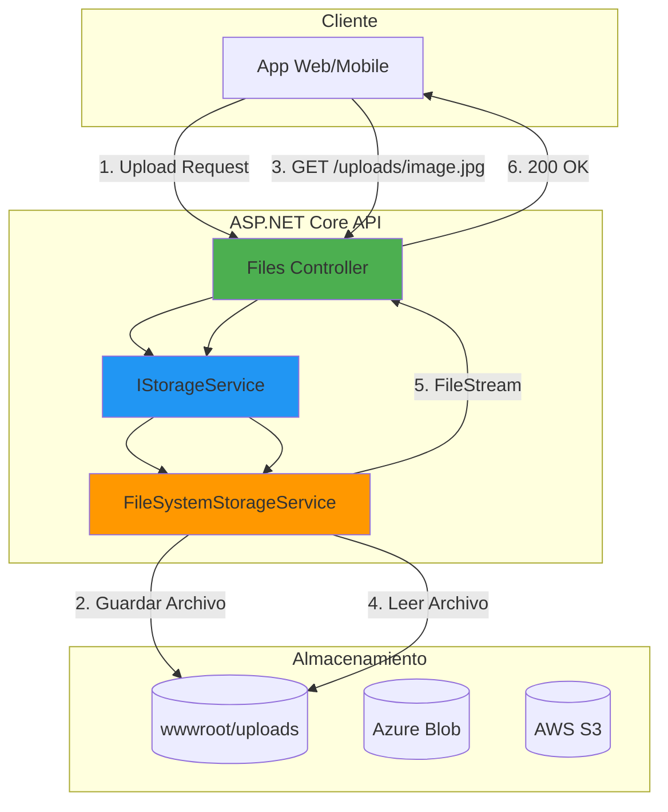
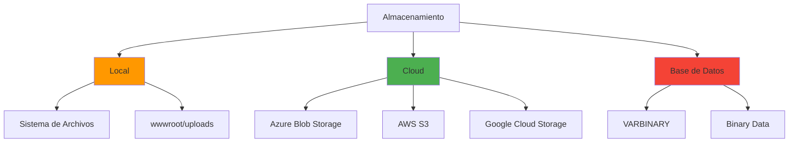
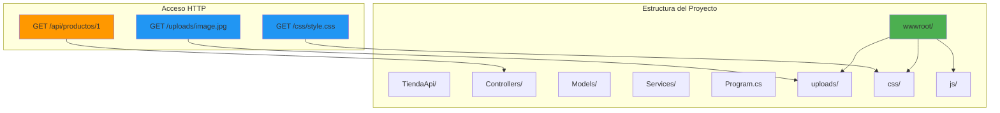
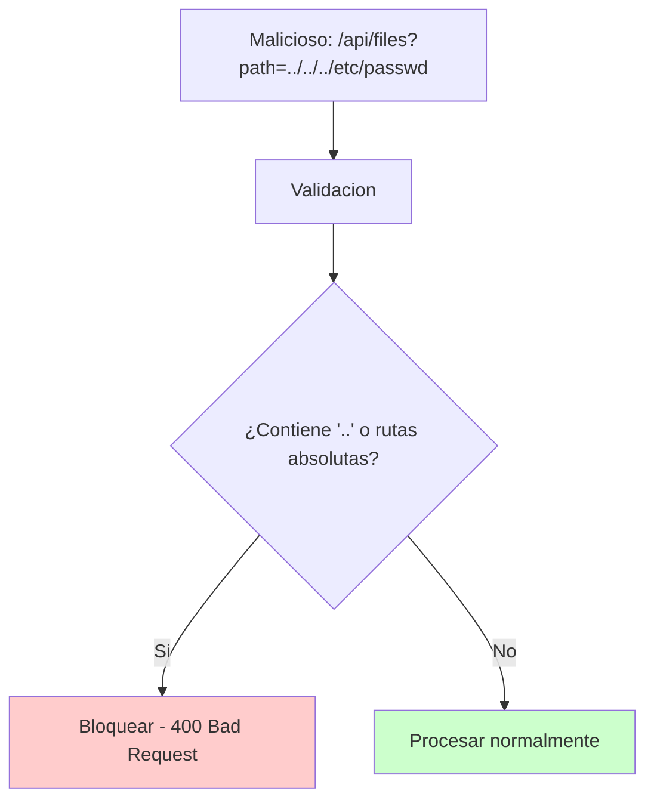
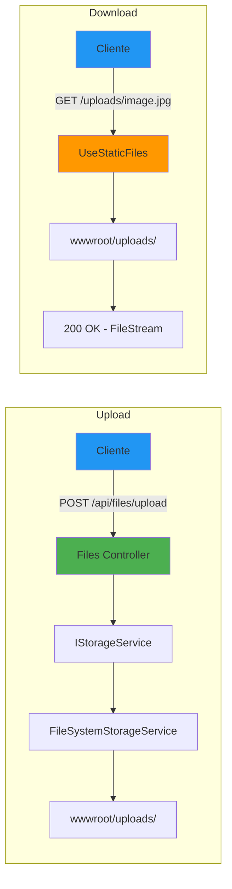

# 20. File Storage: Almacenamiento de Archivos

## Indice

- [20.1. Conceptos Fundamentales](#201-conceptos-fundamentales)
- [20.2. wwwroot y Archivos Estaticos](#202-wwwroot-y-archivos-estaticos)
- [20.3. UseStaticFiles](#203-usestaticfiles)
- [20.4. IStorageService](#204-istorageservice)
- [20.5. FileSystemStorageService](#205-filesystemstorageservice)
- [20.6. Controlador de Archivos](#206-controlador-de-archivos)
- [20.7. Validaciones de Seguridad](#207-validaciones-de-seguridad)
- [20.8. Integracion con Entidades](#208-integracion-con-entidades)
- [20.9. Azure Blob Storage](#209-azure-blob-storage)
- [20.10. Testing](#2010-testing)
- [20.11. Resumen](#2011-resumen)
- [20.12. Ejercicio Propuesto](#2012-ejercicio-propuesto)

---

## 20.1. Conceptos Fundamentales

El almacenamiento de archivos es una funcionalidad común en aplicaciones web modernas que permite recibir, guardar, organizar y servir archivos como imágenes, documentos, videos, etc.

### Arquitectura de Almacenamiento



🧠 **Analogia**: El almacenamiento de archivos es como el almacen de un restaurante. Cuando un cliente pide un plato especial, el mesero va al almacen, busca el ingrediente, y lo trae a la cocina. El almacen puede ser fisico (disco local) o externo (nube).

### Tipos de Archivos Comunes

| Tipo | Extensiones | Uso Tipico |
|------|-------------|------------|
| **Imagenes** | .jpg, .jpeg, .png, .gif, .webp | Avatares, productos, galerias |
| **Documentos** | .pdf, .doc, .docx, .xlsx | Facturas, contratos, reportes |
| **Videos** | .mp4, .mov, .avi | Contenido multimedia |
| **Audio** | .mp3, .wav, .flac | Podcasts, musica |

### Enfoques de Almacenamiento



| Enfoque | Ventajas | Desventajas | Cuando Usar |
|---------|----------|--------------|-------------|
| **Local (wwwroot)** | Simple, rapido, gratuito | No escalable | Desarrollo, apps pequenas |
| **Azure Blob** | Escalable, redundante, barato | Requiere internet | Produccion, apps medianas |
| **AWS S3** | Muy escalable | Mas complejo, costoso | Apps grandes, enterprise |
| **Base de Datos** | Integrado, backup automatico | Lento, BD grande | Archivos pequenos, criticos |

### Configuracion en appsettings.json

```json
{
  "Storage": {
    "UploadPath": "wwwroot/uploads",
    "MaxFileSize": 5242880,
    "AllowedExtensions": [".jpg", ".jpeg", ".png", ".gif", ".webp"],
    "AllowedContentTypes": ["image/jpeg", "image/png", "image/gif", "image/webp"]
  }
}
```

### Estructura de Directorios

```
TuProyecto/
├── wwwroot/                    # Directorio raiz para archivos estaticos
│   ├── uploads/                # Archivos subidos por usuarios
│   │   ├── images/             # Imagenes de productos
│   │   ├── avatars/            # Avatares de usuarios
│   │   ├── documents/          # Documentos varios
│   │   └── temp/               # Archivos temporales
│   ├── css/                    # Estilos CSS
│   ├── js/                     # JavaScript
│   └── lib/                    # Librerias externas
├── appsettings.json
└── Program.cs
```

---

## 20.2. wwwroot y Archivos Estaticos

El directorio **wwwroot** es el directorio especial de ASP.NET Core para servir archivos estaticos directamente al cliente.

### Que es wwwroot

El directorio `wwwroot` es el unico directorio accesible publicamente via HTTP. Todos los archivos fuera de wwwroot no son accesibles directamente.



### Configuracion de Limites

Por defecto, ASP.NET Core limita el tamanho de las peticiones. Para permitir uploads de archivos, debemos configurar los limites.

```csharp
using Microsoft.AspNetCore.HttpFeatures;

var builder = WebApplication.CreateBuilder(args);

// Configurar limite de formularios multipart
builder.Services.Configure<FormOptions>(options =>
{
    options.MultipartBodyLengthLimit = 10 * 1024 * 1024; // 10 MB
});

// Configurar limite del request body
builder.WebHost.ConfigureKestrel(options =>
{
    options.Limits.MaxRequestBodySize = 10 * 1024 * 1024; // 10 MB
});
```

### Clase de Configuracion

```csharp
namespace TiendaApi.Apis.Configuration;

public class StorageSettings
{
    /// <summary>
    /// Ruta base donde se guardan los archivos
    /// </summary>
    public string RootPath { get; set; } = "wwwroot/uploads";
    
    /// <summary>
    /// Tamanio maximo en bytes (5 MB por defecto)
    /// </summary>
    public long MaxFileSize { get; set; } = 5 * 1024 * 1024;
    
    /// <summary>
    /// Extensiones permitidas
    /// </summary>
    public string[] AllowedExtensions { get; set; } = 
        { ".jpg", ".jpeg", ".png", ".gif", ".webp" };
    
    /// <summary>
    /// Tipos MIME permitidos
    /// </summary>
    public string[] AllowedContentTypes { get; set; } = 
        { "image/jpeg", "image/png", "image/gif", "image/webp" };
    
    /// <summary>
    /// Subdirectorio para imagenes
    /// </summary>
    public string ImagesFolder { get; set; } = "images";
    
    /// <summary>
    /// Subdirectorio para documentos
    /// </summary>
    public string DocumentsFolder { get; set; } = "documents";
}
```

---

## 20.3. UseStaticFiles

El middleware `UseStaticFiles` permite servir archivos desde wwwroot y otros directorios.

### Configuracion Basica

```csharp
var builder = WebApplication.CreateBuilder(args);

var app = builder.Build();

// Habilitar archivos estaticos desde wwwroot
app.UseStaticFiles();

app.Run();
```

### Configuracion Avanzada

```csharp
using Microsoft.AspNetCore.StaticFiles;

var provider = new FileExtensionContentTypeProvider();
provider.Mappings[".webp"] = "image/webp";
provider.Mappings[".svg"] = "image/svg+xml";

app.UseStaticFiles(new StaticFileOptions
{
    FileProvider = new PhysicalFileProvider(
        Path.Combine(builder.Environment.ContentRootPath, "wwwroot")),
    RequestPath = "/static",
    ServeUnknownFileTypes = false,
    DefaultContentType = "application/octet-stream",
    ContentTypeProvider = provider,
    OnPrepareResponse = context =>
    {
        // Headers de cache para archivos estaticos
        context.Context.Response.Headers["Cache-Control"] = 
            "public, max-age=31536000";
    }
});
```

### Servir Archivos de Uploads

```csharp
// Servir archivos desde wwwroot/uploads con RequestPath /uploads
app.UseStaticFiles(new StaticFileOptions
{
    FileProvider = new PhysicalFileProvider(
        Path.Combine(app.Environment.WebRootPath, "uploads")),
    RequestPath = "/uploads",
    ServeUnknownFileTypes = false,
    OnPrepareResponse = context =>
    {
        // No cachear archivos de usuarios
        context.Context.Response.Headers["Cache-Control"] = "no-cache";
    }
});
```

### Diferencia WebRootPath vs ContentRootPath

```csharp
// En Program.cs
Console.WriteLine($"WebRootPath: {app.Environment.WebRootPath}");
// Salida: C:\...\TuProyecto\wwwroot

Console.WriteLine($"ContentRootPath: {app.Environment.ContentRootPath}");
// Salida: C:\...\TuProyecto
```

| Propiedad | Descripcion | Uso |
|-----------|-------------|-----|
| **WebRootPath** | Ruta a `wwwroot` | Archivos estaticos publicos |
| **ContentRootPath** | Raiz del proyecto | Configuracion, logs, migraciones |

### Inicializacion del Directorio de Storage

```csharp
var storagePath = Path.Combine(
    app.Environment.WebRootPath,
    "uploads");

var storageDirectory = new DirectoryInfo(storagePath);

if (app.Environment.IsDevelopment())
{
    // Desarrollo: Limpiar y crear directorio
    if (storageDirectory.Exists)
    {
        foreach (var file in storageDirectory.GetFiles())
            file.Delete();
        foreach (var dir in storageDirectory.GetDirectories())
            dir.Delete(true);
    }
    if (!storageDirectory.Exists)
        storageDirectory.Create();
}
else
{
    // Produccion: Solo crear si no existe
    if (!storageDirectory.Exists)
        storageDirectory.Create();
}
```

---

## 20.4. IStorageService

La interfaz `IStorageService` define el contrato para operaciones de almacenamiento, permitiendo diferentes implementaciones.

### Interfaz Completa

```csharp
using Microsoft.AspNetCore.Http;

namespace TiendaApi.Apis.Services.Storage;

public interface IStorageService
{
    /// <summary>
    /// Inicializa el almacenamiento
    /// </summary>
    Task InitAsync(CancellationToken cancellationToken = default);

    /// <summary>
    /// Almacena un archivo y devuelve el nombre generado
    /// </summary>
    Task<string> StoreAsync(
        IFormFile file, 
        string? folder = null, 
        CancellationToken cancellationToken = default);

    /// <summary>
    /// Almacena un archivo desde un stream
    /// </summary>
    Task<string> StoreAsync(
        Stream stream,
        string fileName,
        string? folder = null,
        CancellationToken cancellationToken = default);

    /// <summary>
    /// Carga un archivo como stream
    /// </summary>
    Task<Stream> LoadAsStreamAsync(
        string fileName, 
        string? folder = null,
        CancellationToken cancellationToken = default);

    /// <summary>
    /// Obtiene la ruta completa del archivo
    /// </summary>
    string GetFilePath(string fileName, string? folder = null);

    /// <summary>
    /// Obtiene la URL publica del archivo
    /// </summary>
    string GetUrl(string fileName, string? folder = null);

    /// <summary>
    /// Verifica si un archivo existe
    /// </summary>
    bool Exists(string fileName, string? folder = null);

    /// <summary>
    /// Elimina un archivo
    /// </summary>
    Task<bool> DeleteAsync(
        string fileName, 
        string? folder = null,
        CancellationToken cancellationToken = default);

    /// <summary>
    /// Lista todos los archivos de una carpeta
    /// </summary>
    Task<IEnumerable<string>> ListFilesAsync(string? folder = null);
}
```

---

## 20.5. FileSystemStorageService

Implementacion de `IStorageService` que almacena archivos en el sistema de archivos local.

### Implementacion Completa

```csharp
using TiendaApi.Apis.Configuration;
using TiendaApi.Apis.Services.Storage;
using Microsoft.Extensions.Options;

namespace TiendaApi.Apis.Services.Storage.Implementation;

public class FileSystemStorageService(
    IOptions<StorageSettings> settings,
    ILogger<FileSystemStorageService> logger) : IStorageService
{
    private readonly string _rootPath;

    public FileSystemStorageService()
    {
        _rootPath = Path.GetFullPath(Path.Combine(
            AppContext.BaseDirectory, 
            "..", "..", "..", 
            settings.Value.RootPath));
        
        _rootPath = Path.GetFullPath(_rootPath);
    }

    public Task InitAsync(CancellationToken cancellationToken = default)
    {
        return Task.Run(() =>
        {
            var directories = new[]
            {
                _rootPath,
                Path.Combine(_rootPath, settings.Value.ImagesFolder),
                Path.Combine(_rootPath, settings.Value.DocumentsFolder),
                Path.Combine(_rootPath, "temp")
            };

            foreach (var dir in directories)
            {
                if (!Directory.Exists(dir))
                {
                    Directory.CreateDirectory(dir);
                    logger.LogInformation("Directorio creado: {Path}", dir);
                }
            }
        }, cancellationToken);
    }

    public async Task<string> StoreAsync(
        IFormFile file, 
        string? folder = null,
        CancellationToken cancellationToken = default)
    {
        if (file == null || file.Length == 0)
            throw new ArgumentException("El archivo es nulo o vacio", nameof(file));

        if (file.Length > settings.Value.MaxFileSize)
            throw new FileSizeExceededException(
                $"El archivo excede el tamanho maximo de {settings.Value.MaxFileSize / 1024 / 1024}MB");

        var extension = Path.GetExtension(file.FileName).ToLowerInvariant();
        if (!settings.Value.AllowedExtensions.Contains(extension))
            throw new InvalidFileTypeException(
                $"Tipo de archivo no permitido: {extension}");

        var fileName = GenerateFileName(file.FileName);
        var folderPath = GetFolderPath(folder);
        var filePath = Path.Combine(folderPath, fileName);

        Directory.CreateDirectory(folderPath);

        await using var stream = new FileStream(filePath, FileMode.Create);
        await file.CopyToAsync(stream, cancellationToken);

        logger.LogInformation("Archivo guardado: {FileName} ({Size} bytes)", 
            fileName, file.Length);

        return fileName;
    }

    public async Task<string> StoreAsync(
        Stream stream,
        string fileName,
        string? folder = null,
        CancellationToken cancellationToken = default)
    {
        if (stream == null)
            throw new ArgumentNullException(nameof(stream));
        
        var extension = Path.GetExtension(fileName).ToLowerInvariant();
        if (!_settings.AllowedExtensions.Contains(extension))
            throw new InvalidFileTypeException(
                $"Tipo de archivo no permitido: {extension}");

        var fileNameGenerated = GenerateFileName(fileName);
        var folderPath = GetFolderPath(folder);
        var filePath = Path.Combine(folderPath, fileNameGenerated);

        Directory.CreateDirectory(folderPath);

        await using var fileStream = new FileStream(filePath, FileMode.Create);
        await stream.CopyToAsync(fileStream, cancellationToken);

        return fileNameGenerated;
    }

    public Task<Stream> LoadAsStreamAsync(
        string fileName, 
        string? folder = null,
        CancellationToken cancellationToken = default)
    {
        var filePath = GetFilePath(fileName, folder);
        
        if (!File.Exists(filePath))
            throw new FileNotFoundException($"Archivo no encontrado: {fileName}");

        var stream = new FileStream(filePath, FileMode.Open, FileAccess.Read);
        return Task.FromResult<Stream>(stream);
    }

    public string GetFilePath(string fileName, string? folder = null)
    {
        return Path.Combine(GetFolderPath(folder), fileName);
    }

    public string GetUrl(string fileName, string? folder = null)
    {
        var path = folder != null ? $"/uploads/{folder}/{fileName}" : $"/uploads/{fileName}";
        return path.Replace("\\", "/");
    }

    public bool Exists(string fileName, string? folder = null)
    {
        var filePath = GetFilePath(fileName, folder);
        return File.Exists(filePath);
    }

    public async Task<bool> DeleteAsync(
        string fileName, 
        string? folder = null,
        CancellationToken cancellationToken = default)
    {
        var filePath = GetFilePath(fileName, folder);
        
        if (!File.Exists(filePath))
            return false;

        File.Delete(filePath);
        _logger.LogInformation("Archivo eliminado: {FileName}", fileName);
        
        return true;
    }

    public Task<IEnumerable<string>> ListFilesAsync(string? folder = null)
    {
        var folderPath = GetFolderPath(folder);
        
        if (!Directory.Exists(folderPath))
            return Task.FromResult<IEnumerable<string>>(Array.Empty<string>());

        var files = Directory.GetFiles(folderPath)
            .Select(Path.GetFileName);
        
        return Task.FromResult(files);
    }

    private string GetFolderPath(string? folder)
    {
        if (string.IsNullOrEmpty(folder))
            return _rootPath;

        var folderPath = Path.Combine(_rootPath, folder);
        return Path.GetFullPath(folderPath);
    }

    private static string GenerateFileName(string originalFileName)
    {
        var extension = Path.GetExtension(originalFileName);
        var uniqueName = Guid.NewGuid().ToString("N")[..16];
        var timestamp = DateTime.UtcNow.ToString("yyyyMMddHHmmss");
        return $"{timestamp}_{uniqueName}{extension}";
    }
}
```

### Excepciones Personalizadas

```csharp
namespace TiendaApi.Apis.Models.Exceptions;

public class FileSizeExceededException : Exception
{
    public long MaxSize { get; }
    public long ActualSize { get; }

    public FileSizeExceededException(string message) : base(message) { }

    public FileSizeExceededException(string message, long maxSize, long actualSize)
        : base(message)
    {
        MaxSize = maxSize;
        ActualSize = actualSize;
    }
}

public class InvalidFileTypeException : Exception
{
    public string? FileType { get; }
    public string[]? AllowedTypes { get; }

    public InvalidFileTypeException(string message) : base(message) { }
}
```

### Registro en DI

```csharp
builder.Services.AddScoped<IStorageService, FileSystemStorageService>();

builder.Services.Configure<StorageSettings>(
    builder.Configuration.GetSection("Storage"));
```

---

## 20.6. Controlador de Archivos

El controlador expone endpoints REST para las operaciones de almacenamiento.

### FilesController

```csharp
using Microsoft.AspNetCore.Mvc;
using TiendaApi.Apis.Services.Storage;

namespace TiendaApi.Apis.Controllers;

[ApiController]
[Route("api/[controller]")]
public class FilesController : ControllerBase
{
    private readonly IStorageService _storageService;
    private readonly ILogger<FilesController> _logger;

    public FilesController(
        IStorageService storageService,
        ILogger<FilesController> logger)
    {
        _storageService = storageService;
        _logger = logger;
    }

    /// <summary>
    /// Sube un archivo al servidor
    /// </summary>
    [HttpPost("upload")]
    [ProducesResponseType(typeof(FileUploadResponse), StatusCodes.Status200OK)]
    [ProducesResponseType(typeof(ProblemDetails), StatusCodes.Status400BadRequest)]
    public async Task<IActionResult> Upload(
        IFormFile file,
        [FromQuery] string? folder = "images")
    {
        try
        {
            if (file == null || file.Length == 0)
                return BadRequest(new ProblemDetails
                {
                    Title = "Archivo invalido",
                    Detail = "Debe proporcionar un archivo valido"
                });

            var fileName = await _storageService.StoreAsync(file, folder);
            var url = _storageService.GetUrl(fileName, folder);

            _logger.LogInformation("Archivo subido: {FileName}", fileName);

            return Ok(new FileUploadResponse
            {
                FileName = fileName,
                OriginalName = file.FileName,
                Size = file.Length,
                ContentType = file.ContentType,
                Url = url,
                UploadedAt = DateTime.UtcNow
            });
        }
        catch (FileSizeExceededException ex)
        {
            return BadRequest(new ProblemDetails
            {
                Title = "Archivo muy grande",
                Detail = ex.Message,
                Status = 400
            });
        }
        catch (InvalidFileTypeException ex)
        {
            return BadRequest(new ProblemDetails
            {
                Title = "Tipo no permitido",
                Detail = ex.Message,
                Status = 400
            });
        }
    }

    /// <summary>
    /// Descarga un archivo
    /// </summary>
    [HttpGet("download/{fileName}")]
    [ProducesResponseType(typeof(FileContentResult), StatusCodes.Status200OK)]
    [ProducesResponseType(StatusCodes.Status404NotFound)]
    public async Task<IActionResult> Download(
        string fileName,
        [FromQuery] string? folder = "images")
    {
        try
        {
            var stream = await _storageService.LoadAsStreamAsync(fileName, folder);
            var contentType = GetContentType(fileName);

            return File(stream, contentType, fileName);
        }
        catch (FileNotFoundException)
        {
            return NotFound(new ProblemDetails
            {
                Title = "Archivo no encontrado",
                Detail = $"El archivo '{fileName}' no existe"
            });
        }
    }

    /// <summary>
    /// Obtiene la URL de un archivo
    /// </summary>
    [HttpGet("url/{fileName}")]
    [ProducesResponseType(typeof(FileUrlResponse), StatusCodes.Status200OK)]
    [ProducesResponseType(StatusCodes.Status404NotFound)]
    public IActionResult GetUrl(string fileName, [FromQuery] string? folder = "images")
    {
        if (!_storageService.Exists(fileName, folder))
            return NotFound();

        return Ok(new FileUrlResponse
        {
            FileName = fileName,
            Url = _storageService.GetUrl(fileName, folder)
        });
    }

    /// <summary>
    /// Elimina un archivo
    /// </summary>
    [HttpDelete("{fileName}")]
    [ProducesResponseType(StatusCodes.Status204NoContent)]
    [ProducesResponseType(typeof(ProblemDetails), StatusCodes.Status404NotFound)]
    public async Task<IActionResult> Delete(
        string fileName,
        [FromQuery] string? folder = "images")
    {
        var deleted = await _storageService.DeleteAsync(fileName, folder);
        
        if (!deleted)
            return NotFound(new ProblemDetails
            {
                Title = "Archivo no encontrado",
                Detail = $"El archivo '{fileName}' no existe"
            });

        _logger.LogInformation("Archivo eliminado: {FileName}", fileName);

        return NoContent();
    }

    /// <summary>
    /// Lista archivos de una carpeta
    /// </summary>
    [HttpGet]
    [ProducesResponseType(typeof(FileListResponse), StatusCodes.Status200OK)]
    public async Task<IActionResult> List([FromQuery] string? folder = "images")
    {
        var files = await _storageService.ListFilesAsync(folder);
        
        return Ok(new FileListResponse
        {
            Folder = folder,
            Files = files.Select(f => new FileInfoDto
            {
                Name = f,
                Url = _storageService.GetUrl(f, folder)
            }).ToList(),
            Count = files.Count()
        });
    }

    private static string GetContentType(string fileName)
    {
        var extension = Path.GetExtension(fileName).ToLowerInvariant();
        return extension switch
        {
            ".jpg" or ".jpeg" => "image/jpeg",
            ".png" => "image/png",
            ".gif" => "image/gif",
            ".webp" => "image/webp",
            ".pdf" => "application/pdf",
            _ => "application/octet-stream"
        };
    }
}

public class FileUploadResponse
{
    public string FileName { get; set; } = string.Empty;
    public string OriginalName { get; set; } = string.Empty;
    public long Size { get; set; }
    public string ContentType { get; set; } = string.Empty;
    public string Url { get; set; } = string.Empty;
    public DateTime UploadedAt { get; set; }
}

public class FileUrlResponse
{
    public string FileName { get; set; } = string.Empty;
    public string Url { get; set; } = string.Empty;
}

public class FileListResponse
{
    public string? Folder { get; set; }
    public List<FileInfoDto> Files { get; set; } = new();
    public int Count { get; set; }
}

public class FileInfoDto
{
    public string Name { get; set; } = string.Empty;
    public string Url { get; set; } = string.Empty;
}
```

---

## 20.7. Validaciones de Seguridad

### Validar Extension y Tipo MIME

```csharp
using System.ComponentModel.DataAnnotations;

namespace TiendaApi.Apis.Models.Validation;

public class AllowedExtensionsAttribute : ValidationAttribute
{
    private readonly string[] _extensions;

    public AllowedExtensionsAttribute(params string[] extensions)
    {
        _extensions = extensions;
        ErrorMessage = "Tipo de archivo no permitido. Archivos permitidos: {0}";
    }

    protected override ValidationResult? IsValid(
        object? value, 
        ValidationContext validationContext)
    {
        if (value is not IFormFile file)
            return ValidationResult.Success;

        var extension = Path.GetExtension(file.FileName)?.ToLowerInvariant();
        
        if (string.IsNullOrEmpty(extension) || 
            !_extensions.Contains(extension))
        {
            var allowed = string.Join(", ", _extensions);
            return new ValidationResult(
                string.Format(ErrorMessage, allowed),
                new[] { validationContext.MemberName });
        }

        if (!string.IsNullOrEmpty(file.ContentType) && 
            !file.ContentType.StartsWith("image/"))
        {
            return new ValidationResult(
                "El archivo debe ser una imagen",
                new[] { validationContext.MemberName });
        }

        return ValidationResult.Success;
    }
}
```

### Validar Tamanio

```csharp
using System.ComponentModel.DataAnnotations;

namespace TiendaApi.Apis.Models.Validation;

public class MaxFileSizeAttribute : ValidationAttribute
{
    private readonly long _maxSizeInBytes;

    public MaxFileSizeAttribute(long maxSizeInBytes)
    {
        _maxSizeInBytes = maxSizeInBytes;
        ErrorMessage = $"El archivo no puede superar los {_maxSizeInBytes / 1024 / 1024}MB";
    }

    protected override ValidationResult? IsValid(
        object? value, 
        ValidationContext validationContext)
    {
        if (value is not IFormFile file)
            return ValidationResult.Success;

        if (file.Length > _maxSizeInBytes)
        {
            return new ValidationResult(
                ErrorMessage,
                new[] { validationContext.MemberName });
        }

        return ValidationResult.Success;
    }
}
```

### Proteccion contra Path Traversal



```csharp
// En FileSystemStorageService
var filename = Path.GetFileName(file.FileName);
if (filename.Contains("..") || filename.Contains('/') || filename.Contains('\\'))
{
    throw new InvalidFileTypeException("Nombre de archivo invalido");
}
```

### Validar Nombre de Archivo

```csharp
using System.Text.RegularExpressions;

namespace TiendaApi.Apis.Models.Validation;

public static class FileNameValidator
{
    private static readonly Regex ValidFileNameRegex = 
        new(@"^[\w\-. ]+$", RegexOptions.Compiled);

    public static bool IsValidFileName(string fileName)
    {
        if (string.IsNullOrWhiteSpace(fileName))
            return false;

        if (fileName.Length > 255)
            return false;

        if (!ValidFileNameRegex.IsMatch(fileName))
            return false;

        var dangerousExtensions = new[]
        {
            ".exe", ".bat", ".cmd", ".com", ".pif", ".scr", ".sh", 
            ".php", ".asp", ".aspx", ".jsp", ".cgi", ".pl"
        };
        
        var extension = Path.GetExtension(fileName)?.ToLowerInvariant();
        return !dangerousExtensions.Contains(extension);
    }

    public static string SanitizeFileName(string fileName)
    {
        var invalidChars = Path.GetInvalidFileNameChars();
        var sanitized = new string(fileName
            .Where(c => !invalidChars.Contains(c))
            .ToArray());

        return string.IsNullOrWhiteSpace(sanitized) 
            ? "archivo" 
            : sanitized;
    }
}
```

---

## 20.8. Integracion con Entidades

### Modelo con Campo de Imagen

```csharp
using System.ComponentModel.DataAnnotations;

namespace TiendaApi.Apis.Models;

public class Producto
{
    [Key]
    public long Id { get; set; }

    [Required]
    [StringLength(100)]
    public string Nombre { get; set; } = string.Empty;

    [Required]
    [Range(0.01, 10000)]
    public decimal Precio { get; set; }

    public int Stock { get; set; }

    /// <summary>
    /// Nombre del archivo de imagen
    /// </summary>
    [StringLength(200)]
    public string? Imagen { get; set; }

    public DateTime FechaCreacion { get; set; } = DateTime.UtcNow;

    public bool Activo { get; set; } = true;
}
```

### Endpoint para Actualizar Imagen de Producto

```csharp
/// <summary>
/// Actualiza la imagen de un producto
/// </summary>
[HttpPost("{id}/imagen")]
[ProducesResponseType(typeof(ProductoResponseDto), StatusCodes.Status200OK)]
[ProducesResponseType(StatusCodes.Status404NotFound)]
public async Task<IActionResult> UpdateImage(
    long id,
    IFormFile imagen,
    [FromServices] IProductoService productoService,
    [FromServices] IStorageService storageService)
{
    var producto = await productoService.GetByIdAsync(id);
    if (producto == null)
        return NotFound();

    // Eliminar imagen anterior si existe
    if (!string.IsNullOrEmpty(producto.Imagen))
    {
        await storageService.DeleteAsync(producto.Imagen, "productos");
    }

    // Guardar nueva imagen
    var fileName = await storageService.StoreAsync(imagen, "productos");
    producto.Imagen = fileName;

    await productoService.UpdateAsync(producto);

    return Ok(new ProductoResponseDto
    {
        Id = producto.Id,
        Nombre = producto.Nombre,
        Precio = producto.Precio,
        Imagen = storageService.GetUrl(fileName, "productos")
    });
}
```

---

## 20.9. Azure Blob Storage

Para produccion, Azure Blob Storage ofrece seguridad, redundancia y escalabilidad automaticas.

### AzureBlobStorageService

```csharp
using Azure.Storage.Blobs;
using TiendaApi.Apis.Configuration;
using TiendaApi.Apis.Services.Storage;
using Microsoft.Extensions.Options;

namespace TiendaApi.Apis.Services.Storage.Implementation;

public class AzureBlobStorageService : IStorageService
{
    private readonly BlobServiceClient _blobServiceClient;
    private readonly string _containerName;
    private readonly ILogger<AzureBlobStorageService> _logger;

    public AzureBlobStorageService(
        IOptions<AzureBlobSettings> settings,
        ILogger<AzureBlobStorageService> logger)
    {
        _logger = logger;
        _containerName = settings.Value.ContainerName;
        
        _blobServiceClient = new BlobServiceClient(settings.Value.ConnectionString);
    }

    public async Task InitAsync(CancellationToken cancellationToken = default)
    {
        var containerClient = _blobServiceClient.GetBlobContainerClient(_containerName);
        await containerClient.CreateIfNotExistsAsync(
            Azure.Storage.Blobs.Models.PublicAccessType.Blob, 
            cancellationToken: cancellationToken);
    }

    public async Task<string> StoreAsync(
        IFormFile file, 
        string? folder = null,
        CancellationToken cancellationToken = default)
    {
        var fileName = GenerateFileName(file.FileName);
        var blobPath = GetBlobPath(fileName, folder);

        var containerClient = _blobServiceClient.GetBlobContainerClient(_containerName);
        var blobClient = containerClient.GetBlobClient(blobPath);

        await using var stream = file.OpenReadStream();
        await blobClient.UploadAsync(stream, cancellationToken);

        return blobPath;
    }

    public async Task<Stream> LoadAsStreamAsync(
        string fileName, 
        string? folder = null,
        CancellationToken cancellationToken = default)
    {
        var blobPath = GetBlobPath(fileName, folder);
        var containerClient = _blobServiceClient.GetBlobContainerClient(_containerName);
        var blobClient = containerClient.GetBlobClient(blobPath);

        var response = await blobClient.DownloadAsync(cancellationToken);
        return response.Value.Content;
    }

    public string GetUrl(string fileName, string? folder = null)
    {
        var blobPath = GetBlobPath(fileName, folder);
        var containerClient = _blobServiceClient.GetBlobContainerClient(_containerName);
        var blobClient = containerClient.GetBlobClient(blobPath);
        return blobClient.Uri.ToString();
    }

    private string GetBlobPath(string fileName, string? folder)
    {
        return folder != null ? $"{folder}/{fileName}" : fileName;
    }

    private static string GenerateFileName(string originalFileName)
    {
        var extension = Path.GetExtension(originalFileName);
        var uniqueName = Guid.NewGuid().ToString("N")[..16];
        var timestamp = DateTime.UtcNow.ToString("yyyyMMddHHmmss");
        return $"{timestamp}_{uniqueName}{extension}";
    }
}
```

### appsettings.json para Azure

```json
{
  "AzureBlob": {
    "ConnectionString": "DefaultEndpointsProtocol=https;AccountName=...;AccountKey=...;EndpointSuffix=core.windows.net",
    "ContainerName": "uploads"
  }
}
```

### Cambio entre Proveedores

```csharp
// En Program.cs
if (builder.Environment.IsDevelopment())
{
    builder.Services.AddScoped<IStorageService, FileSystemStorageService>();
}
else
{
    builder.Services.AddScoped<IStorageService, AzureBlobStorageService>();
}
```

---

## 20.10. Testing

```csharp
using Microsoft.Extensions.Options;
using Moq;
using NUnit.Framework;
using FluentAssertions;
using TiendaApi.Apis.Configuration;
using TiendaApi.Apis.Services.Storage.Implementation;

namespace TiendaApi.Apis.Tests.Services;

[TestFixture]
public class FileSystemStorageServiceTests
{
    private FileSystemStorageService _service = null!;
    private string _testFolder = null!;

    [SetUp]
    public void Setup()
    {
        _testFolder = Path.Combine(Path.GetTempPath(), $"test_{Guid.NewGuid()}");
        
        var settings = Options.Create(new StorageSettings
        {
            RootPath = _testFolder,
            MaxFileSize = 5 * 1024 * 1024,
            AllowedExtensions = new[] { ".jpg", ".png", ".gif" }
        });

        var logger = Mock.Of<ILogger<FileSystemStorageService>>();
        _service = new FileSystemStorageService(settings, logger);
    }

    [TearDown]
    public void TearDown()
    {
        if (Directory.Exists(_testFolder))
        {
            Directory.Delete(_testFolder, recursive: true);
        }
    }

    [Test]
    public async Task InitAsync_CreatesDirectories()
    {
        await _service.InitAsync();

        Directory.Exists(_testFolder).Should().BeTrue();
        Directory.Exists(Path.Combine(_testFolder, "images")).Should().BeTrue();
    }

    [Test]
    public async Task StoreAsync_WithValidFile_SavesFile()
    {
        await _service.InitAsync();
        var content = "dummy image content"u8.ToArray();
        var stream = new MemoryStream(content);
        var fileName = "test.jpg";

        var result = await _service.StoreAsync(stream, fileName, "images");

        result.Should().NotBeNullOrEmpty();
        result.Should().EndWith(".jpg");
        _service.Exists(result, "images").Should().BeTrue();
    }

    [Test]
    public async Task StoreAsync_WithInvalidExtension_ThrowsException()
    {
        await _service.InitAsync();
        var content = "malicious content"u8.ToArray();
        var stream = new MemoryStream(content);
        var fileName = "test.exe";

        Assert.ThrowsAsync<InvalidFileTypeException>(async () =>
            await _service.StoreAsync(stream, fileName, "images"));
    }

    [Test]
    public async Task DeleteAsync_WithExistingFile_DeletesFile()
    {
        await _service.InitAsync();
        var content = "file to delete"u8.ToArray();
        var stream = new MemoryStream(content);
        var fileName = await _service.StoreAsync(stream, "delete_test.jpg", "images");

        var result = await _service.DeleteAsync(fileName, "images");

        result.Should().BeTrue();
        _service.Exists(fileName, "images").Should().BeFalse();
    }

    [Test]
    public async Task ListFilesAsync_ReturnsAllFiles()
    {
        await _service.InitAsync();
        await _service.StoreAsync(new MemoryStream("file1"u8.ToArray()), "file1.jpg", "images");
        await _service.StoreAsync(new MemoryStream("file2"u8.ToArray()), "file2.jpg", "images");

        var files = await _service.ListFilesAsync("images");

        files.Should().HaveCount(2);
    }

    [Test]
    public async Task GetUrl_ReturnsCorrectUrl()
    {
        await _service.InitAsync();
        var content = "test"u8.ToArray();
        var fileName = await _service.StoreAsync(new MemoryStream(content), "test.jpg", "images");

        var url = _service.GetUrl(fileName, "images");

        url.Should().Contain("/uploads/images/");
        url.Should().Contain(fileName);
    }
}
```

### Test del Controlador

```csharp
using Microsoft.AspNetCore.Http;
using Microsoft.AspNetCore.Mvc;
using Moq;
using NUnit.Framework;
using FluentAssertions;
using TiendaApi.Apis.Controllers;
using TiendaApi.Apis.Services.Storage;

namespace TiendaApi.Apis.Tests.Controllers;

[TestFixture]
public class FilesControllerTests
{
    private FilesController _controller = null!;
    private Mock<IStorageService> _storageMock = null!;
    private Mock<ILogger<FilesController>> _loggerMock = null!;

    [SetUp]
    public void Setup()
    {
        _storageMock = new Mock<IStorageService>();
        _loggerMock = new Mock<ILogger<FilesController>>();
        _controller = new FilesController(_storageMock.Object, _loggerMock.Object);
    }

    [Test]
    public async Task Upload_WithValidFile_ReturnsOk()
    {
        var content = new byte[] { 0xFF, 0xD8, 0xFF };
        var stream = new MemoryStream(content);
        var fileMock = new Mock<IFormFile>();
        fileMock.Setup(f => f.FileName).Returns("test.jpg");
        fileMock.Setup(f => f.Length).Returns(content.Length);
        fileMock.Setup(f => f.ContentType).Returns("image/jpeg");
        fileMock.Setup(f => f.CopyToAsync(It.IsAny<Stream>(), It.IsAny<CancellationToken>()))
            .Returns(Task.CompletedTask);

        _storageMock.Setup(s => s.StoreAsync(fileMock.Object, "images", It.IsAny<CancellationToken>()))
            .ReturnsAsync("20240101_abc123.jpg");

        _storageMock.Setup(s => s.GetUrl("20240101_abc123.jpg", "images"))
            .Returns("/uploads/images/20240101_abc123.jpg");

        var result = await _controller.Upload(fileMock.Object, "images");

        result.Should().BeOfType<OkObjectResult>();
    }

    [Test]
    public async Task Upload_WithNullFile_ReturnsBadRequest()
    {
        var result = await _controller.Upload(null!, "images");

        result.Should().BeOfType<BadRequestObjectResult>();
    }

    [Test]
    public async Task Delete_WithExistingFile_ReturnsNoContent()
    {
        _storageMock.Setup(s => s.DeleteAsync("test.jpg", "images", It.IsAny<CancellationToken>()))
            .ReturnsAsync(true);

        var result = await _controller.Delete("test.jpg", "images");

        result.Should().BeOfType<NoContentResult>();
    }

    [Test]
    public async Task Delete_WithNonExistingFile_ReturnsNotFound()
    {
        _storageMock.Setup(s => s.DeleteAsync("missing.jpg", "images", It.IsAny<CancellationToken>()))
            .ReturnsAsync(false);

        var result = await _controller.Delete("missing.jpg", "images");

        result.Should().BeOfType<NotFoundObjectResult>();
    }
}
```

---

## 20.11. Resumen

| Concepto | Descripcion |
|----------|-------------|
| **wwwroot** | Directorio especial de ASP.NET Core para archivos estaticos publicos |
| **UseStaticFiles** | Middleware que sirve archivos desde wwwroot |
| **IStorageService** | Interfaz que abstrae operaciones de almacenamiento |
| **FileSystemStorageService** | Implementacion para almacenamiento local |
| **Path Traversal** | Ataque que intenta acceder a archivos fuera del directorio permitido |
| **Azure Blob Storage** | Servicio de almacenamiento en la nube de Azure |

### Registro en DI

```csharp
builder.Services.AddScoped<IStorageService, FileSystemStorageService>();
builder.Services.Configure<StorageSettings>(
    builder.Configuration.GetSection("Storage"));
```

### Consideraciones de Seguridad

✅ Siempre validar extension y tipo MIME
✅ Generar nombres unicos (GUID) para evitar colisiones
✅ Usar `Path.GetFullPath()` para evitar path traversal
✅ Validar tamanho maximo de archivo
✅ No confiar solo en la validacion del cliente

### Flujo de Archivos



---

## 20.12. Ejercicio Propuesto

Implementar un sistema completo de almacenamiento de archivos para una API de tienda.

### Entidades

```csharp
public class Producto
{
    public long Id { get; set; }
    public string Nombre { get; set; } = string.Empty;
    public decimal Precio { get; set; }
    public int Stock { get; set; }
    public string? Descripcion { get; set; }
    public string? ImagenUrl { get; set; }
    public long CategoriaId { get; set; }
    public DateTime FechaCreacion { get; set; } = DateTime.UtcNow;
}

public class Categoria
{
    public long Id { get; set; }
    public string Nombre { get; set; } = string.Empty;
    public string? Descripcion { get; set; }
    public string? ImagenUrl { get; set; }
}
```

### Operaciones

| Operacion | Endpoint | Descripcion |
|-----------|----------|-------------|
| **Subir imagen producto** | `POST /api/productos/{id}/imagen` | Sube imagen de producto |
| **Subir imagen categoria** | `POST /api/categorias/{id}/imagen` | Sube imagen de categoria |
| **Subir avatar usuario** | `POST /api/usuarios/{id}/avatar` | Sube avatar de usuario |
| **Eliminar archivo** | `DELETE /api/files/{fileName}` | Elimina archivo por nombre |

### Criterios de Evaluacion

| Criterio | Puntos |
|----------|--------|
| wwwroot configurado correctamente | 2 |
| UseStaticFiles configurado | 2 |
| IStorageService correctamente definido | 2 |
| FileSystemStorageService implementado | 2 |
| Validaciones de seguridad completas | 2 |
| Integracion con entidades | 2 |
| Tests unitarios | 2 |

### Extras

- Implementar AzureBlobStorageService
- Agregar procesamiento de imagenes (resize)
- Implementar limites de almacenamiento por usuario
- Agregar soporte para multiples archivos
- Documentar API con Swagger
