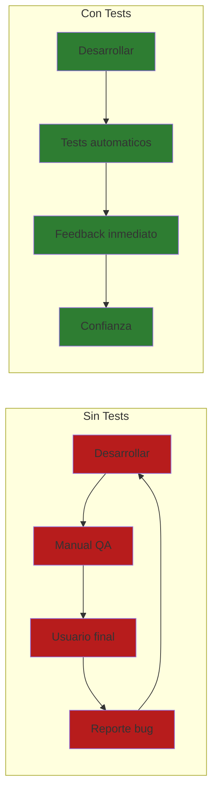
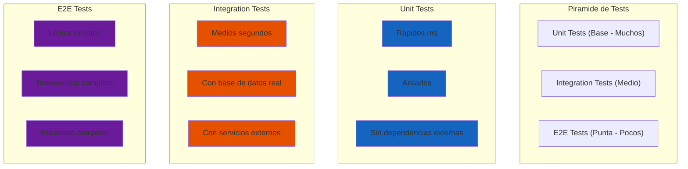
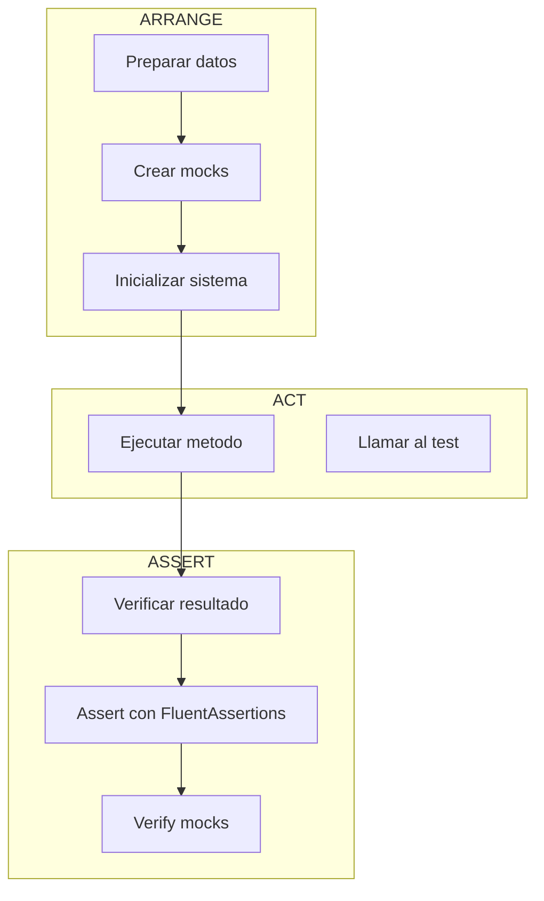
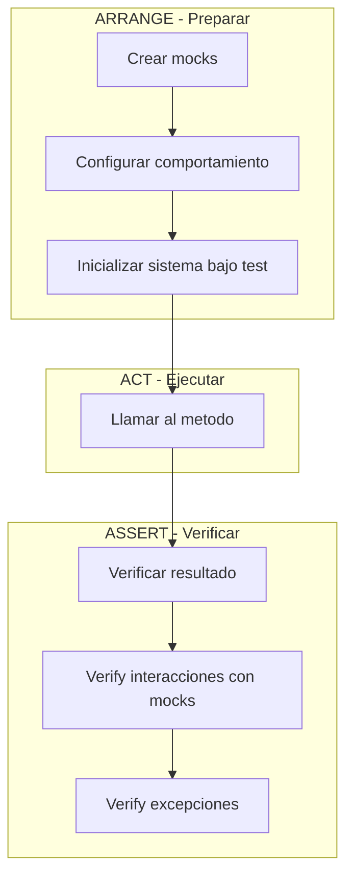
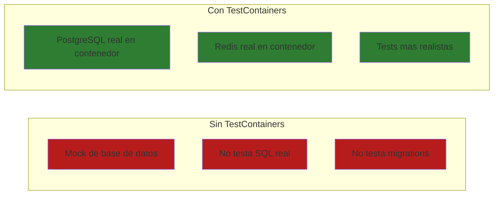

# 21. Testing con NUnit

## Indice

- [21. Testing con NUnit](#21-testing-con-nunit)
  - [21.1. Conceptos Fundamentales](#211-conceptos-fundamentales)
    - [Por que hacer Testing](#por-que-hacer-testing)
    - [Beneficios del Testing](#beneficios-del-testing)
  - [21.2. Tipos de Tests](#212-tipos-de-tests)
    - [Piramide de Testing](#piramide-de-testing)
    - [Test Unitario](#test-unitario)
    - [Test de Integracion](#test-de-integracion)
    - [Test E2E](#test-e2e)
  - [21.3. Frameworks de Testing en .NET](#213-frameworks-de-testing-en-net)
    - [Librerias Principales](#librerias-principales)
  - [21.4. Estructura del Proyecto de Tests](#214-estructura-del-proyecto-de-tests)
    - [Archivo de Proyecto (.csproj)](#archivo-de-proyecto-csproj)
  - [21.5. Anatomia de un Test Unitario](#215-anatomia-de-un-test-unitario)
    - [Partes del Test](#partes-del-test)
  - [21.6. NUnit Basics](#216-nunit-basics)
    - [Atributos Principales](#atributos-principales)
    - [Ejemplo Completo](#ejemplo-completo)
  - [21.7. FluentAssertions](#217-fluentassertions)
    - [Assertions Comunes](#assertions-comunes)
  - [21.8. Moq - Creando Mocks](#218-moq---creando-mocks)
    - [Conceptos de Moq](#conceptos-de-moq)
    - [Ejemplos de Moq](#ejemplos-de-moq)
  - [21.9. TestContainers](#219-testcontainers)
    - [Por que usar TestContainers](#por-que-usar-testcontainers)
    - [Fixture con TestContainers](#fixture-con-testcontainers)
    - [Test de Repository con TestContainers](#test-de-repository-con-testcontainers)
  - [21.10. Tests de Controladores](#2110-tests-de-controladores)
    - [WebApplicationFactory](#webapplicationfactory)
    - [Tests de Controlador Completos](#tests-de-controlador-completos)
  - [21.11. Tests en Paralelo vs Secuenciales](#2111-tests-en-paralelo-vs-secuenciales)
    - [Configuracion de Paralelismo](#configuracion-de-paralelismo)
    - [Niveles de Paralelismo](#niveles-de-paralelismo)
    - [Cuando Usar Paralelismo vs Secuencial](#cuando-usar-paralelismo-vs-secuencial)
  - [21.12. Resumen](#2112-resumen)
    - [Comandos Utiles](#comandos-utiles)
  - [21.13. Ejercicio Propuesto](#2113-ejercicio-propuesto)
    - [Requisitos](#requisitos)
    - [Entidades](#entidades)
    - [Tareas](#tareas)
    - [Criterios de Evaluacion](#criterios-de-evaluacion)

---

## 21.1. Conceptos Fundamentales

**Testing** es el proceso de verificar que el codigo funciona correctamente. En lugar de esperar que los usuarios encuentren errores, los tests automatizados detectan problemas antes de llegar a produccion.

### Por que hacer Testing



🧠 **Analogia**: Los tests son como el entrenamiento de un atleta. Antes de competir en una carrera importante (producción), el atleta entrena exhaustivamente en diferentes condiciones (tests unitarios, integración, E2E) para asegurar que su rendimiento será óptimo cuando importa de verdad.

### Beneficios del Testing

| Problema sin Tests | Solucion con Tests |
|-------------------|-------------------|
| Errores detectados tarde | Deteccion inmediata |
| Miedo a refactorizar | Refactorizacion segura |
| Regresiones no detectadas | Tests regresivos automaticos |
| Deploys arriesgados | Confianza en el codigo |

---

## 21.2. Tipos de Tests

No todos los tests son iguales. Cada tipo tiene un proposito diferente.

### Piramide de Testing



| Tipo | Que testea | Velocidad | Aislamiento | Cantidad |
|------|------------|-----------|-------------|----------|
| **Unit** | Una unidad de codigo | Rapido (~ms) | Alto | Muchos |
| **Integration** | Multiples componentes juntos | Medio (~s) | Medio | Medio |
| **E2E** | Flujo completo de usuario | Lento (~min) | Bajo | Pocos |

### Test Unitario

Un test unitario verifica que una **unica unidad** de codigo funciona correctamente. Esta unidad suele ser un metodo. Un buen test unitario:

1. **Es rapido**: Se ejecuta en milisegundos
2. **Es aislado**: No depende de bases de datos, redes o archivos
3. **Es determinista**: Siempre da el mismo resultado
4. **Es independiente**: No depende de otros tests

### Test de Integracion

Los tests de integracion prueban multiples componentes trabajando juntos sin mocks o con mocks limitados.

### Test E2E

Los tests End-to-End simulan un usuario real, probando la aplicación completa desde la interfaz.

---

## 21.3. Frameworks de Testing en .NET

.NET tiene tres frameworks principales de testing:

| Framework | Caracteristicas |
|-----------|-----------------|
| **NUnit** | Popular, sintaxis elegante, attributes ricos |
| **xUnit** | Moderno, creado por ASP.NET Core team |
| **MSTest** | De Microsoft, menos flexible |

En este proyecto usamos **NUnit** por su sintaxis clara y atributos descriptivos.

### Librerias Principales

| Libreria | Proposito |
|----------|-----------|
| **NUnit** | Framework de testing |
| **FluentAssertions** | Assertions mas legibles |
| **Moq** | Crear mocks |
| **TestContainers** | Contenedores Docker para tests de integracion |
| **coverlet** | Medir cobertura de codigo |

---

## 21.4. Estructura del Proyecto de Tests

```
TuProyecto.Tests/
├── Unit/
│   ├── Services/
│   │   ├── ProductoServiceTests.cs
│   │   └── CategoriaServiceTests.cs
│   ├── Validators/
│   │   └── ProductoValidatorTests.cs
│   └── Repositories/
│       └── ProductoRepositoryTests.cs
├── Integration/
│   ├── Controllers/
│   │   └── ProductosControllerTests.cs
│   ├── Repositories/
│   │   └── ProductoRepositoryIntegrationTests.cs
│   └── Services/
│       └── ProductoServiceIntegrationTests.cs
├── Fixtures/
│   ├── TuApiWebApplicationFactory.cs
│   └── TestContainersFixture.cs
├── Helpers/
│   ├── TestDataFactory.cs
│   └── AssertionHelpers.cs
└── TuProyecto.Tests.csproj
```

### Archivo de Proyecto (.csproj)

```xml
<Project Sdk="Microsoft.NET.Sdk">

  <PropertyGroup>
    <TargetFramework>net8.0</TargetFramework>
    <ImplicitUsings>enable</ImplicitUsings>
    <IsPackable>false</IsPackable>
    <IsTestProject>true</IsTestProject>
  </PropertyGroup>

  <!-- Paquetes de testing -->
  <ItemGroup>
    <PackageReference Include="Microsoft.NET.Test.Sdk" Version="17.8.0" />
    <PackageReference Include="NUnit" Version="4.2.2" />
    <PackageReference Include="NUnit3TestAdapter" Version="4.5.0" />
    <PackageReference Include="FluentAssertions" Version="6.12.0" />
    <PackageReference Include="Moq" Version="4.20.70" />
    <PackageReference Include="TestContainers" Version="3.8.0" />
    <PackageReference Include="TestContainers.PostgreSql" Version="3.8.0" />
    <PackageReference Include="coverlet.collector" Version="6.0.0" />
    <PackageReference Include="Microsoft.AspNetCore.Mvc.Testing" Version="8.0.0" />
    <PackageReference Include="Microsoft.EntityFrameworkCore.InMemory" Version="8.0.0" />
  </ItemGroup>

  <!-- Referencia al proyecto principal -->
  <ItemGroup>
    <ProjectReference Include="..\TuApi.Core\TuApi.Core.csproj" />
    <ProjectReference Include="..\TuApi.Apis\TuApi.Apis.csproj" />
  </ItemGroup>

</Project>
```

---

## 21.5. Anatomia de un Test Unitario

Un test unitario sigue el patron **Arrange-Act-Assert**:

```csharp
using FluentAssertions;
using Moq;
using NUnit.Framework;
using TuApi.Core.Interfaces;
using TuApi.Core.Models;
using TuApi.Core.Services;

namespace TuApi.Tests.Unit.Services;

[TestFixture]
public class ProductoServiceTests
{
    [Test]
    public void GetById_ProductoExistente_ReturnSuccess()
    {
        // =====================================
        // ARRANGE: Preparar el escenario
        // =====================================
        var productoId = 1L;
        var productoEsperado = new Producto
        {
            Id = productoId,
            Nombre = "Laptop",
            Precio = 999.99m
        };

        // Crear mock del repositorio
        var repositoryMock = new Mock<IProductoRepository>();
        repositoryMock.Setup(r => r.GetByIdAsync(productoId))
            .ReturnsAsync(productoEsperado);

        // Crear el servicio con el mock
        var service = new ProductoService(repositoryMock.Object);

        // =====================================
        // ACT: Ejecutar la accion a testear
        // =====================================
        var resultado = service.GetByIdAsync(productoId);

        // =====================================
        // ASSERT: Verificar el resultado
        // =====================================
        resultado.Should().NotBeNull();
        resultado.Result.Should().BeSuccess();
        resultado.Result.Value.Should().NotBeNull();
        resultado.Result.Value.Nombre.Should().Be("Laptop");
        resultado.Result.Value.Precio.Should().Be(999.99m);
    }
}
```

### Partes del Test



---

## 21.6. NUnit Basics

### Atributos Principales

| Atributo | Proposito | Ejemplo |
|----------|-----------|---------|
| `[Test]` | Metodo de test | `public void Test() {}` |
| `[TestCase]` | Test con parametros | `[TestCase(1, 2, 3)]` |
| `[SetUp]` | Se ejecuta antes de cada test | `SetUp() {}` |
| `[TearDown]` | Se ejecuta despues de cada test | `TearDown() {}` |
| `[OneTimeSetUp]` | Una vez antes de todos | `OneTimeSetUp() {}` |
| `[OneTimeTearDown]` | Una vez despues de todos | `OneTimeTearDown() {}` |
| `[Category]` | Categorizar tests | `[Category("Slow")]` |
| `[Ignore]` | Omitir test | `[Ignore("Pendiente")]` |
| `[Retry]` | Reintentar test | `[Retry(3)]` |
| `[Timeout]` | Limite de tiempo | `[Timeout(5000)]` |

### Ejemplo Completo

```csharp
using FluentAssertions;
using Moq;
using NUnit.Framework;
using TuApi.Core.Interfaces;
using TuApi.Core.Models;
using TuApi.Core.Services;

namespace TuApi.Tests.Unit.Services;

[TestFixture]
public class ProductoServiceTests
{
    private Mock<IProductoRepository> _repositoryMock = null!;
    private ProductoService _service = null!;

    [SetUp]
    public void SetUp()
    {
        _repositoryMock = new Mock<IProductoRepository>();
        _service = new ProductoService(_repositoryMock.Object);
    }

    [TearDown]
    public void TearDown()
    {
        _repositoryMock.VerifyAll();
    }

    [Test]
    public void GetById_ProductoExistente_ReturnSuccess()
    {
        // Arrange
        var productoId = 1L;
        var producto = new Producto { Id = productoId, Nombre = "Laptop" };
        
        _repositoryMock.Setup(r => r.GetByIdAsync(productoId))
            .ReturnsAsync(producto);

        // Act
        var result = _service.GetByIdAsync(productoId);

        // Assert
        result.Should().NotBeNull();
        result.Result.IsSuccess.Should().BeTrue();
    }

    [Test]
    public void GetById_ProductoNoExistente_ReturnFailure()
    {
        // Arrange
        var productoId = 999L;
        
        _repositoryMock.Setup(r => r.GetByIdAsync(productoId))
            .ReturnsAsync((Producto?)null);

        // Act
        var result = _service.GetByIdAsync(productoId);

        // Assert
        result.Result.IsFailure.Should().BeTrue();
    }

    [TestCase(1L)]
    [TestCase(2L)]
    [TestCase(100L)]
    public void GetById_DiferentesIds_ReturnCorrecto(long productoId)
    {
        // Arrange
        var producto = new Producto { Id = productoId, Nombre = "Producto" };
        
        _repositoryMock.Setup(r => r.GetByIdAsync(productoId))
            .ReturnsAsync(producto);

        // Act
        var result = _service.GetByIdAsync(productoId);

        // Assert
        result.Result.IsSuccess.Should().BeTrue();
        result.Result.Value.Id.Should().Be(productoId);
    }
}
```

---

## 21.7. FluentAssertions

**FluentAssertions** permite escribir assertions de forma mas legible y con mensajes de error claros.

### Assertions Comunes

```csharp
using FluentAssertions;

public class FluentAssertionsExamples
{
    [Test]
    public void StringExamples()
    {
        var nombre = "Laptop Gaming";

        nombre.Should().NotBeNull();
        nombre.Should().Be("Laptop Gaming");
        nombre.Should().NotBeEmpty();
        nombre.Should().HaveLength(14);
        nombre.Should().StartWith("Laptop");
        nombre.Should().EndWith("Gaming");
        nombre.Should().Contain("Gaming");
        nombre.Should().Match("* *");
    }

    [Test]
    public void NumericExamples()
    {
        var precio = 999.99m;

        precio.Should().Be(999.99m);
        precio.Should().BeGreaterThan(100);
        precio.Should().BeLessThan(1000);
        precio.Should().BeInRange(100, 1000);
        precio.Should().BePositive();
        precio.Should().NotBe(0);
    }

    [Test]
    public void CollectionExamples()
    {
        var productos = new List<Producto>
        {
            new() { Id = 1, Nombre = "A" },
            new() { Id = 2, Nombre = "B" }
        };

        productos.Should().NotBeNull();
        productos.Should().HaveCount(2);
        productos.Should().Contain(p => p.Nombre == "A");
        productos.Should().ContainSingle(p => p.Id == 1);
        productos.Should().BeInAscendingOrder(p => p.Id);
    }

    [Test]
    public void ObjectExamples()
    {
        var producto = new Producto { Id = 1, Nombre = "Laptop" };

        producto.Should().NotBeNull();
        producto.Should().BeOfType<Producto>();
        producto.Should().Match<Producto>(p => p.Id > 0);
    }

    [Test]
    public void ResultExamples()
    {
        var successResult = Result.Success<int, Error>(42);
        var failureResult = Result.Failure<int, Error>(Error.NotFound());

        successResult.IsSuccess.Should().BeTrue();
        successResult.IsFailure.Should().BeFalse();
        successResult.Value.Should().Be(42);

        failureResult.IsFailure.Should().BeTrue();
    }

    [Test]
    public void ExceptionExamples()
    {
        Action action = () => throw new ArgumentException("Error");

        action.Should().Throw<ArgumentException>();
        action.Should().Throw<ArgumentException>().WithMessage("Error");
    }
}
```

---

## 21.8. Moq - Creando Mocks

**Moq** es una libreria que permite crear objetos falsos (mocks) para aislar el codigo bajo test.

### El Patron AAA con Moq

Todo test con Moq debe seguir el patron **Arrange-Act-Assert**:



### 21.8.1. Configurar Comportamiento con Setup

```csharp
[TestFixture]
public class ProductoServiceTests
{
    private Mock<IProductoRepository> _repositoryMock = null!;
    private Mock<ILogger<ProductoService>> _loggerMock = null!;
    private ProductoService _service = null!;

    [SetUp]
    public void SetUp()
    {
        _repositoryMock = new Mock<IProductoRepository>();
        _loggerMock = new Mock<ILogger<ProductoService>>();
        _service = new ProductoService(
            _repositoryMock.Object,
            _loggerMock.Object);
    }

    [Test]
    public void GetById_ProductoExistente_ReturnSuccess()
    {
        // =====================================
        // ARRANGE: Preparar el escenario
        // =====================================
        var productoId = 1L;
        var productoEsperado = new Producto
        {
            Id = productoId,
            Nombre = "Laptop Gaming",
            Precio = 1499.99m,
            Stock = 10,
            CategoriaId = 1
        };

        // CONFIGURAR el mock: cuando se llame a GetById con 1, devuelve el producto
        _repositoryMock
            .Setup(r => r.GetByIdAsync(productoId))
            .ReturnsAsync(productoEsperado);

        // =====================================
        // ACT: Ejecutar la accion
        // =====================================
        var resultado = _service.GetByIdAsync(productoId);

        // =====================================
        // ASSERT: Verificar el resultado
        // =====================================
        resultado.Should().NotBeNull();
        resultado.Result.IsSuccess.Should().BeTrue();
        resultado.Result.Value.Nombre.Should().Be("Laptop Gaming");

        // VERIFY: Verificar que se llamo al metodo exactamente una vez
        _repositoryMock.Verify(
            r => r.GetByIdAsync(productoId), 
            Times.Once);
    }
}
```

### 21.8.2. Tipos de Setup

```csharp
[Test]
public void SetupExamples()
{
    // Setup con valor fijo
    _repositoryMock
        .Setup(r => r.GetCountAsync())
        .ReturnsAsync(42);

    // Setup con expresion lambda
    _repositoryMock
        .Setup(r => r.GetByIdAsync(It.IsAny<long>()))
        .ReturnsAsync((long id) => new Producto { Id = id });

    // Setup con condicion
    _repositoryMock
        .Setup(r => r.GetByIdAsync(It.Is<long>(id => id > 0)))
        .ReturnsAsync((long id) => new Producto { Id = id });

    // Setup que lanza excepcion
    _repositoryMock
        .Setup(r => r.DeleteAsync(It.IsAny<long>()))
        .ThrowsAsync(new InvalidOperationException("No encontrado"));

    // Setup que devuelve null
    _repositoryMock
        .Setup(r => r.GetByIdAsync(It.IsAny<long>()))
        .ReturnsAsync((Producto?)null);

    // SetupSequence - diferentes valores en cada llamada
    _repositoryMock
        .SetupSequence(r => r.GetCountAsync())
        .ReturnsAsync(0)
        .ReturnsAsync(1)
        .ReturnsAsync(2)
        .ReturnsAsync(3);
}
```

### 21.8.3. Verify - Verificar Interacciones

El **Verify** es crucial para asegurar que el codigo llama las dependencias correctamente.

```csharp
[Test]
public void VerifyExamples()
{
    // Arrange
    var productoId = 1L;
    var producto = new Producto { Id = productoId, Nombre = "Test" };

    _repositoryMock
        .Setup(r => r.GetByIdAsync(productoId))
        .ReturnsAsync(producto);

    // Act
    var resultado = await _service.GetByIdAsync(productoId);

    // =====================================
    // ASSERT - Verificar con Moq Verify
    // =====================================

    // Verify basic: verificar que se llamo una vez
    _repositoryMock.Verify(
        r => r.GetByIdAsync(productoId), 
        Times.Once);

    // Verify que nunca se llamo
    _repositoryMock.Verify(
        r => r.DeleteAsync(It.IsAny<long>()), 
        Times.Never);

    // Verify que se llamo al menos una vez
    _repositoryMock.Verify(
        r => r.GetByIdAsync(It.IsAny<long>()), 
        Times.AtLeastOnce());

    // Verify con numero exacto de llamadas
    _repositoryMock.Verify(
        r => r.GetByIdAsync(It.IsAny<long>()), 
        Times.Exactly(2));

    // VerifyGet - verificar que se leyo una propiedad
    _repositoryMock.VerifyGet(
        r => r.Count, 
        Times.Once);

    // VerifySet - verificar que se asigno una propiedad
    _repositoryMock.VerifySet(
        r => r.LastModified, 
        Times.Once);

    // Verificar con callback
    var capturedId = 0L;
    _repositoryMock
        .Setup(r => r.GetByIdAsync(It.IsAny<long>()))
        .Callback<long>(id => capturedId = id)
        .ReturnsAsync((long id) => new Producto { Id = id });

    await _service.GetByIdAsync(5);
    capturedId.Should().Be(5);

    // VerifyAll - verificar todos los setups
    _repositoryMock.VerifyAll();

    // VerifyNoOtherCalls - verificar que no hubo otras llamadas
    _repositoryMock.VerifyNoOtherCalls();
}
```

### 21.8.4. It - Matchers de Moq

```csharp
[Test]
public void ItMatchersExamples()
{
    // It.IsAny<T> - cualquier valor del tipo
    _repositoryMock
        .Setup(r => r.GetByIdAsync(It.IsAny<long>()))
        .ReturnsAsync(new Producto());

    // It.Is<T> - valor que cumple una condicion
    _repositoryMock
        .Setup(r => r.GetByIdAsync(It.Is<long>(id => id > 0)))
        .ReturnsAsync((long id) => new Producto { Id = id });

    // It.IsInRange - valor dentro de un rango
    _repositoryMock
        .Setup(r => r.GetByIdAsync(It.IsInRange(1L, 100L, Range.Inclusive)))
        .ReturnsAsync(new Producto());

    // It.IsIn - valor en una lista
    _repositoryMock
        .Setup(r => r.GetByIdAsync(It.IsIn(1L, 2L, 3L)))
        .ReturnsAsync(new Producto());

    // Combinacion de matchers
    _repositoryMock
        .Setup(r => r.GetByIdAsync(
            It.Is<long>(id => id > 0 && id < 1000)))
        .ReturnsAsync(new Producto());
}
```

### 21.8.5. Ejemplo Completo de Test con Moq

```csharp
[TestFixture]
public class ProductoServiceCompleteTests
{
    private Mock<IProductoRepository> _repositoryMock = null!;
    private Mock<ICacheService> _cacheMock = null!;
    private Mock<ILogger<ProductoService>> _loggerMock = null!;
    private ProductoService _service = null!;

    private readonly List<Producto> _productosTest = new()
    {
        new Producto { Id = 1, Nombre = "Laptop", Precio = 999.99m, Stock = 10 },
        new Producto { Id = 2, Nombre = "Mouse", Precio = 29.99m, Stock = 50 },
        new Producto { Id = 3, Nombre = "Teclado", Precio = 79.99m, Stock = 25 }
    };

    [SetUp]
    public void SetUp()
    {
        _repositoryMock = new Mock<IProductoRepository>();
        _cacheMock = new Mock<ICacheService>();
        _loggerMock = new Mock<ILogger<ProductoService>>();

        _service = new ProductoService(
            _repositoryMock.Object,
            _cacheMock.Object,
            _loggerMock.Object);
    }

    [Test]
    public async Task GetAllAsync_CacheHit_ReturnsFromCache()
    {
        // Arrange
        var cachedProductos = _productosTest;
        _cacheMock
            .Setup(c => c.GetAsync<IEnumerable<Producto>>("productos:all"))
            .ReturnsAsync(cachedProductos);

        // Act
        var resultado = await _service.GetAllAsync();

        // Assert
        resultado.IsSuccess.Should().BeTrue();
        resultado.Value.Should().HaveCount(3);

        // Verify: NO debe llamar a la base de datos
        _repositoryMock.Verify(
            r => r.GetAllAsync(), 
            Times.Never);

        // Verify: SI debe haber consultado el cache
        _cacheMock.Verify(
            c => c.GetAsync<IEnumerable<Producto>>("productos:all"), 
            Times.Once);

        // Verify: SI debe haber guardado en cache (lazy loading)
        _cacheMock.Verify(
            c => c.SetAsync(
                "productos:all",
                It.IsAny<IEnumerable<Producto>>(),
                It.IsAny<TimeSpan>()), 
            Times.Once);
    }

    [Test]
    public async Task GetAllAsync_CacheMiss_QueriesDbAndCaches()
    {
        // Arrange
        _cacheMock
            .Setup(c => c.GetAsync<IEnumerable<Producto>>("productos:all"))
            .ReturnsAsync((IEnumerable<Producto>?)null);

        _repositoryMock
            .Setup(r => r.GetAllAsync())
            .ReturnsAsync(_productosTest);

        // Act
        var resultado = await _service.GetAllAsync();

        // Assert
        resultado.IsSuccess.Should().BeTrue();
        resultado.Value.Should().HaveCount(3);

        // Verify: SI debe haber consultado el cache
        _cacheMock.Verify(
            c => c.GetAsync<IEnumerable<Producto>>("productos:all"), 
            Times.Once);

        // Verify: SI debe haber consultado la base de datos
        _repositoryMock.Verify(
            r => r.GetAllAsync(), 
            Times.Once);

        // Verify: SI debe haber guardado en cache
        _cacheMock.Verify(
            c => c.SetAsync(
                "productos:all",
                resultado.Value,
                It.IsAny<TimeSpan>()), 
            Times.Once);
    }

    [Test]
    public async Task GetByIdAsync_ProductoExistente_ReturnSuccess()
    {
        // Arrange
        var productoId = 1L;
        var productoEsperado = _productosTest[0];

        _cacheMock
            .Setup(c => c.GetAsync<Producto>($"productos:{productoId}"))
            .ReturnsAsync((Producto?)null);

        _repositoryMock
            .Setup(r => r.GetByIdAsync(productoId))
            .ReturnsAsync(productoEsperado);

        // Act
        var resultado = await _service.GetByIdAsync(productoId);

        // Assert
        resultado.IsSuccess.Should().BeTrue();
        resultado.Value.Nombre.Should().Be("Laptop");

        // Verify interacciones
        _repositoryMock.Verify(
            r => r.GetByIdAsync(productoId), 
            Times.Once);

        _cacheMock.Verify(
            c => c.SetAsync(
                $"productos:{productoId}",
                productoEsperado,
                It.IsAny<TimeSpan>()), 
            Times.Once);
    }

    [Test]
    public async Task GetByIdAsync_ProductoNoExistente_ReturnFailure()
    {
        // Arrange
        var productoId = 999L;

        _cacheMock
            .Setup(c => c.GetAsync<Producto>($"productos:{productoId}"))
            .ReturnsAsync((Producto?)null);

        _repositoryMock
            .Setup(r => r.GetByIdAsync(productoId))
            .ReturnsAsync((Producto?)null);

        // Act
        var resultado = await _service.GetByIdAsync(productoId);

        // Assert
        resultado.IsFailure.Should().BeTrue();
        resultado.Error.Code.Should().Be("PRODUCTO_NOT_FOUND");

        // Verify: se consulto cache y base de datos
        _cacheMock.Verify(
            c => c.GetAsync<Producto>($"productos:{productoId}"), 
            Times.Once);

        _repositoryMock.Verify(
            r => r.GetByIdAsync(productoId), 
            Times.Once);
    }

    [Test]
    public async Task CreateAsync_ProductoValido_ReturnSuccess()
    {
        // Arrange
        var nuevoProducto = new CreateProductoDto
        {
            Nombre = "Nuevo Producto",
            Precio = 99.99m,
            Stock = 10,
            CategoriaId = 1
        };

        var productoCreado = new Producto
        {
            Id = 4,
            Nombre = nuevoProducto.Nombre,
            Precio = nuevoProducto.Precio,
            Stock = nuevoProducto.Stock
        };

        _repositoryMock
            .Setup(r => r.GetByNombreAsync(nuevoProducto.Nombre))
            .ReturnsAsync((Producto?)null);

        _repositoryMock
            .Setup(r => r.CreateAsync(It.IsAny<Producto>()))
            .ReturnsAsync(productoCreado);

        // Act
        var resultado = await _service.CreateAsync(nuevoProducto);

        // Assert
        resultado.IsSuccess.Should().BeTrue();
        resultado.Value.Id.Should().Be(4);

        // Verify: se verifico duplicado
        _repositoryMock.Verify(
            r => r.GetByNombreAsync(nuevoProducto.Nombre), 
            Times.Once);

        // Verify: se creo el producto
        _repositoryMock.Verify(
            r => r.CreateAsync(It.Is<Producto>(
                p => p.Nombre == nuevoProducto.Nombre &&
                     p.Precio == nuevoProducto.Precio)), 
            Times.Once);

        // Verify: se limpio el cache
        _cacheMock.Verify(
            c => c.RemoveAsync("productos:all"), 
            Times.Once);
    }

    [Test]
    public async Task CreateAsync_Duplicado_ReturnConflict()
    {
        // Arrange
        var nuevoProducto = new CreateProductoDto
        {
            Nombre = "Laptop", // Ya existe
            Precio = 99.99m,
            Stock = 10
        };

        var productoExistente = new Producto
        {
            Id = 1,
            Nombre = "Laptop"
        };

        _repositoryMock
            .Setup(r => r.GetByNombreAsync(nuevoProducto.Nombre))
            .ReturnsAsync(productoExistente);

        // Act
        var resultado = await _service.CreateAsync(nuevoProducto);

        // Assert
        resultado.IsFailure.Should().BeTrue();
        resultado.Error.Code.Should().Be("PRODUCTO_CONFLICT");

        // Verify: NO debe crear
        _repositoryMock.Verify(
            r => r.CreateAsync(It.IsAny<Producto>()), 
            Times.Never);
    }

    [Test]
    public async Task DeleteAsync_ProductoExistente_ReturnSuccess()
    {
        // Arrange
        var productoId = 1L;

        _repositoryMock
            .Setup(r => r.DeleteAsync(productoId))
            .ReturnsAsync(true);

        // Act
        var resultado = await _service.DeleteAsync(productoId);

        // Assert
        resultado.IsSuccess.Should().BeTrue();

        // Verify: se elimino
        _repositoryMock.Verify(
            r => r.DeleteAsync(productoId), 
            Times.Once);

        // Verify: se limpio el cache
        _cacheMock.Verify(c => c.RemoveAsync($"productos:{productoId}"), Times.Once);
        _cacheMock.Verify(c => c.RemoveAsync("productos:all"), Times.Once);
    }
}
```

### Resumen de Moq

| Concepto | Descripcion | Ejemplo |
|----------|-------------|---------|
| `Mock<T>` | Crear mock de una interfaz | `new Mock<IProductoRepository>()` |
| `.Setup()` | Configurar comportamiento | `Setup(r => r.GetByIdAsync(1))` |
| `.ReturnsAsync()` | Valor de retorno async | `ReturnsAsync(producto)` |
| `.ThrowsAsync()` | Lanzar excepcion | `ThrowsAsync(new Exception())` |
| `.Verify()` | Verificar llamada | `Verify(r => r.GetByIdAsync(1), Times.Once)` |
| `Times.Once` | Una vez | Verifica exactamente una llamada |
| `Times.Never` | Nunca | Verifica que no se llamo |
| `It.IsAny<T>()` | Cualquier valor | `GetByIdAsync(It.IsAny<long>())` |
| `It.Is<T>(condition)` | Condicion especifica | `GetByIdAsync(It.Is<long>(id => id > 0))` |

---

## 21.9. TestContainers

**TestContainers** es una libreria que permite crear contenedores Docker durante los tests de integracion. Esto proporciona bases de datos reales y otros servicios en entornos aislados.

### Por que usar TestContainers



| Aspecto | Base de datos en memoria | TestContainers |
|---------|-------------------------|----------------|
| **Realismo** | Bajo | Alto |
| **SQL features** | Limitado | Completo |
| **Migrations** | No testeadas | Testeadas |
| **Velocidad** | Rapido | Mas lento |
| **Setup** | Easy | Requiere Docker |

### Fixture con TestContainers

```csharp
using NUnit.Framework;
using TestContainers.PostgreSql;

namespace TuApi.Tests.Fixtures;

[TestFixture]
[Parallelizable(ParallelScope.None)]
public class IntegrationTestBase : IDisposable
{
    protected PostgreSqlContainer _postgresContainer = null!;
    protected TuDbContext _context = null!;

    [SetUp]
    public async Task SetUpAsync()
    {
        _postgresContainer = new PostgreSqlBuilder()
            .WithImage("postgres:15-alpine")
            .WithDatabase("tiendadb_test")
            .WithUsername("test")
            .WithPassword("test")
            .WithCleanUp(true)
            .Build();

        await _postgresContainer.StartAsync();

        var options = new DbContextOptionsBuilder<TuDbContext>()
            .UseNpgsql(_postgresContainer.GetConnectionString())
            .Options;

        _context = new TuDbContext(options);
        _context.Database.EnsureCreated();
    }

    [TearDown]
    public async Task TearDownAsync()
    {
        await _context.DisposeAsync();
        await _postgresContainer.DisposeAsync();
    }

    protected async Task SeedDataAsync(params object[] entities)
    {
        foreach (var entity in entities)
        {
            _context.Add(entity);
        }
        await _context.SaveChangesAsync();
    }

    public void Dispose()
    {
        _context?.Dispose();
    }
}
```

### Test de Repository con TestContainers

```csharp
using FluentAssertions;
using Microsoft.EntityFrameworkCore;
using NUnit.Framework;
using TuApi.Core.Data;
using TuApi.Core.Models;
using TuApi.Tests.Fixtures;

namespace TuApi.Tests.Integration.Repositories;

public class ProductoRepositoryIntegrationTests : IntegrationTestBase
{
    private ProductoRepository _repository = null!;

    [SetUp]
    public override async Task SetUpAsync()
    {
        await base.SetUpAsync();
        _repository = new ProductoRepository(_context);
    }

    [Test]
    public async Task AddAsync_ProductoValido_ReturnSuccess()
    {
        // Arrange
        var producto = new Producto
        {
            Nombre = "Laptop Gaming",
            Descripcion = "Potente laptop para gaming",
            Precio = 1499.99m,
            Stock = 10,
            CategoriaId = 1
        };

        // Act
        var result = await _repository.AddAsync(producto);

        // Assert
        result.IsSuccess.Should().BeTrue();
        producto.Id.Should().BeGreaterThan(0);
    }

    [Test]
    public async Task GetByIdAsync_ProductoExistente_ReturnProducto()
    {
        // Arrange
        var producto = new Producto
        {
            Nombre = "Mouse Inalambrico",
            Precio = 29.99m,
            Stock = 100,
            CategoriaId = 1
        };

        await SeedDataAsync(producto);

        // Act
        var result = await _repository.GetByIdAsync(producto.Id);

        // Assert
        result.IsSuccess.Should().BeTrue();
        result.Value.Nombre.Should().Be("Mouse Inalambrico");
    }
}
```

---

## 21.10. Tests de Controladores

Los tests de controladores verifican que los endpoints de la API funcionan correctamente usando `HttpClient` para simular requests.

### WebApplicationFactory

```csharp
using Microsoft.AspNetCore.Mvc.Testing;
using Microsoft.EntityFrameworkCore;
using Microsoft.Extensions.DependencyInjection;
using TuApi.Core.Data;

namespace TuApi.Tests.Integration;

public class TuApiWebApplicationFactory : WebApplicationFactory<Program>
{
    protected override void ConfigureWebHost(IWebHostBuilder builder)
    {
        builder.ConfigureServices(services =>
        {
            var descriptor = services.SingleOrDefault(
                d => d.ServiceType == typeof(DbContextOptions<TuDbContext>));
            if (descriptor != null)
                services.Remove(descriptor);

            services.AddDbContext<TuDbContext>(options =>
            {
                options.UseInMemoryDatabase("TestDatabase");
            });
        });
    }
}
```

### Tests de Controlador Completos

```csharp
using FluentAssertions;
using Microsoft.AspNetCore.Mvc.Testing;
using NUnit.Framework;
using System.Net;
using System.Net.Http.Json;
using TuApi.Core.Models.Dto;

namespace TuApi.Tests.Integration.Controllers;

public class ProductosControllerTests
{
    private WebApplicationFactory<Program> _factory = null!;
    private HttpClient _client = null!;

    [SetUp]
    public void SetUp()
    {
        _factory = new TuApiWebApplicationFactory();
        _client = _factory.CreateClient();
    }

    [TearDown]
    public void TearDown()
    {
        _factory.Dispose();
        _client.Dispose();
    }

    [Test]
    public async Task Get_Productos_ReturnsOkWithLista()
    {
        // Act
        var response = await _client.GetAsync("/api/productos");

        // Assert
        response.StatusCode.Should().Be(HttpStatusCode.OK);
        
        var productos = await response.Content.ReadFromJsonAsync<List<Producto>>();
        productos.Should().NotBeNull();
    }

    [Test]
    public async Task Get_ProductoExistente_ReturnsOk()
    {
        // Arrange
        var productoId = 1L;

        // Act
        var response = await _client.GetAsync($"/api/productos/{productoId}");

        // Assert
        response.StatusCode.Should().BeOneOf(HttpStatusCode.OK, HttpStatusCode.NotFound);
    }

    [Test]
    public async Task Post_ProductoValido_ReturnsCreated()
    {
        // Arrange
        var request = new CreateProductoRequest
        {
            Nombre = "Teclado Mecanico",
            Descripcion = "Teclado con switches rojos",
            Precio = 149.99m,
            Stock = 10,
            CategoriaId = 1
        };

        // Act
        var response = await _client.PostAsJsonAsync("/api/productos", request);

        // Assert
        response.StatusCode.Should().Be(HttpStatusCode.Created);
        
        var producto = await response.Content.ReadFromJsonAsync<Producto>();
        producto.Should().NotBeNull();
        producto.Id.Should().BeGreaterThan(0);
    }

    [Test]
    public async Task Post_ProductoInvalido_ReturnsBadRequest()
    {
        // Arrange
        var request = new CreateProductoRequest
        {
            Nombre = "",
            Precio = -10,
            CategoriaId = 0
        };

        // Act
        var response = await _client.PostAsJsonAsync("/api/productos", request);

        // Assert
        response.StatusCode.Should().Be(HttpStatusCode.BadRequest);
    }
}
```

---

## 21.11. Tests en Paralelo vs Secuenciales

NUnit puede ejecutar tests en paralelo para acelerar el tiempo de ejecucion.

### Configuracion de Paralelismo

```csharp
using NUnit.Framework;

[assembly: LevelOfParallelism(4)]

namespace TuApi.Tests.Unit.Services;

[TestFixture]
[Parallelizable(ParallelScope.All)]
public class ProductoServiceTests
{
    private Mock<IProductoRepository> _repositoryMock = null!;
    private ProductoService _service = null!;

    [SetUp]
    public void SetUp()
    {
        _repositoryMock = new Mock<IProductoRepository>();
        _service = new ProductoService(_repositoryMock.Object);
    }

    [Test]
    public void GetById_ProductoExistente_ReturnSuccess()
    {
        // Este test se ejecutara en paralelo con otros
        var producto = new Producto { Id = 1, Nombre = "Laptop" };
        _repositoryMock.Setup(r => r.GetByIdAsync(1)).ReturnsAsync(producto);

        var result = _service.GetByIdAsync(1);

        result.Result.IsSuccess.Should().BeTrue();
    }
}
```

### Niveles de Paralelismo

```csharp
[Parallelizable(ParallelScope.None)]           // No paralelizable
[Parallelizable(ParallelScope.Self)]            // Solo esta clase
[Parallelizable(ParallelScope.Children)]        // Tests dentro de la clase
[Parallelizable(ParallelScope.All)]             // Todo
```

### Cuando Usar Paralelismo vs Secuencial

| Escenario | Recomendacion | Razon |
|-----------|---------------|-------|
| Tests unitarios con mocks | **Paralelo** | Rapidos, sin estado compartido |
| Tests que comparten base de datos | **Secuencial** | Evitar conflictos |
| Tests con TestContainers | **Limitado** | Cada contenedor es pesado |
| Tests de integracion | **Limitado** | Recursos externos limitados |

---

## 21.12. Resumen

| Concepto | Descripcion |
|----------|-------------|
| **Test Unitario** | Prueba una unidad de codigo de forma aislada con mocks |
| **Test de Integracion** | Prueba multiples componentes juntos |
| **Test E2E** | Simula un usuario real en la aplicacion completa |
| **NUnit** | Framework de testing con atributos descriptivos |
| **FluentAssertions** | Assertions legibles y expresivos |
| **Moq** | Creacion de objetos mocks para dependencias |
| **TestContainers** | Contenedores Docker para tests de integracion |
| **WebApplicationFactory** | Servidor en memoria para tests de API |
| **Patron AAA** | Arrange-Act-Assert para estructurar tests |

### Comandos Utiles

```bash
# Ejecutar todos los tests
dotnet test

# Ejecutar tests con cobertura
dotnet test --collect:"XPlat Code Coverage"

# Tests especificos
dotnet test --filter "FullyQualifiedName~ProductoServiceTests"

# Tests de integracion
dotnet test --filter "Category=Integration"

# Tests paralelos
dotnet test --max-cpu-count 4
```

---

## 21.13. Ejercicio Propuesto

### Requisitos

Implementar una suite completa de tests unitarios y de integracion para un servicio de gestion de productos.

### Entidades

```csharp
public class Producto
{
    public long Id { get; set; }
    public string Nombre { get; set; } = string.Empty;
    public string? Descripcion { get; set; }
    public decimal Precio { get; set; }
    public int Stock { get; set; }
    public long CategoriaId { get; set; }
    public Categoria Categoria { get; set; } = null!;
    public DateTime FechaCreacion { get; set; } = DateTime.UtcNow;
    public bool Activo { get; set; } = true;
}

public class Categoria
{
    public long Id { get; set; }
    public string Nombre { get; set; } = string.Empty;
    public string? Descripcion { get; set; }
    public ICollection<Producto> Productos { get; set; } = new List<Producto>();
}
```

### Tareas

1. Crear proyecto de tests con NUnit, FluentAssertions y Moq
2. Implementar tests unitarios para `ProductoService`
   - Mockear `IProductoRepository`
   - Testear CRUD completo
   - Verificar casos de exito y error
3. Implementar tests unitarios para `ProductosController`
   - Mockear `IProductoService`
   - Verificar codigos HTTP correctos
4. Implementar tests de integracion usando `WebApplicationFactory`
5. Generar reporte de cobertura (>80%)

### Criterios de Evaluacion

| Criterio | Puntos |
|----------|--------|
| Proyecto de tests configurado correctamente | 1 |
| Tests unitarios del servicio con mocks | 2 |
| Tests unitarios del controlador | 2 |
| Tests de integracion completos | 2 |
| Cobertura >80% | 2 |
| Uso correcto de FluentAssertions | 1 |
