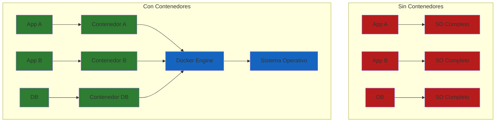
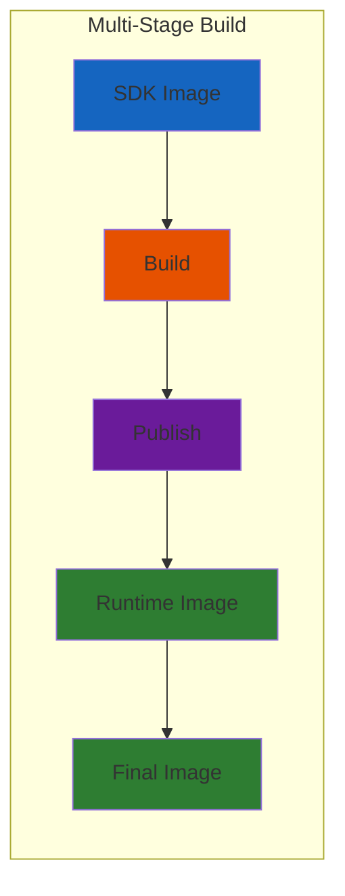

# 22. Docker y Contenedores

## Indice

- [22.1. Conceptos Fundamentales](#221-conceptos-fundamentales)
- [22.2. ¿Que es Docker?](#222-que-es-docker)
- [22.3. Dockerfile](#223-dockerfile)
- [22.4. Multi-Stage Build](#224-multi-stage-build)
- [22.5. Docker Compose](#225-docker-compose)
- [22.6. Variables de Entorno](#226-variables-de-entorno)
- [22.7. Health Checks](#227-health-checks)
- [22.8. Optimizacion de Imagenes](#228-optimizacion-de-imagenes)
- [22.9. Despliegue en Cloud](#229-despliegue-en-cloud)
- [22.10. CI/CD con GitHub Actions](#2210-cicd-con-github-actions)
- [22.11. Resumen](#2211-resumen)
- [22.12. Ejercicio Propuesto](#2212-ejercicio-propuesto)

---

## 22.1. Conceptos Fundamentales

### ¿Que es un Contenedor?

Un **contenedor** es una unidad de software que incluye todo lo necesario para ejecutar una aplicación: código, runtime, herramientas del sistema, librerías y configuraciones. A diferencia de las máquinas virtuales, los contenedores comparten el kernel del sistema operativo y son más ligeros.



🧠 **Analogia**: Un contenedor es como un contenedor de الشحن (shipping container). Cada contenedor tiene todo lo necesario dentro y se puede mover facilmente entre diferentes lugares (servidores) sin necesidad de adaptar nada.

### Ventajas de los Contenedores

| Aspecto | Beneficio |
|---------|-----------|
| **Consistencia** | Mismo entorno en desarrollo, testing y producción |

# Ver contenedores en ejecución
docker ps

# Ver todos los contenedores
docker ps -a

# Ver logs del contenedor
docker logs -f miapi

# Detener un contenedor
docker stop miapi

# Eliminar un contenedor
docker rm miapi

# Eliminar una imagen
docker rmi miapi:latest
```

---

## 22.3. Dockerfile

El **Dockerfile** es un archivo de texto que contiene instrucciones para construir una imagen Docker.

### Estructura del Proyecto

```
TuProyecto/
├── src/
│   ├── TuApi.Apis/
│   │   ├── Program.cs
│   │   └── TuApi.Apis.csproj
│   ├── TuApi.Core/
│   └── TuApi.Tests/
├── Dockerfile
├── .dockerignore
└── docker-compose.yml
```

### Dockerfile Basico

```dockerfile
FROM mcr.microsoft.com/dotnet/aspnet:8.0
WORKDIR /app
COPY ./publish . 
EXPOSE 80
EXPOSE 443
ENTRYPOINT ["dotnet", "TuApi.Apis.dll"]
```

### Explicacion de Instrucciones

| Instruccion | Proposito |
|-------------|-----------|
| `FROM` | Imagen base |
| `WORKDIR` | Directorio de trabajo |
| `COPY` | Copiar archivos |
| `RUN` | Ejecutar comandos |
| `ENV` | Variables de entorno |
| `EXPOSE` | Puerto que expone el contenedor |
| `USER` | Usuario que ejecuta |
| `ENTRYPOINT` | Comando que se ejecuta al iniciar |
| `HEALTHCHECK` | Verificacion de salud |

---

## 22.4. Multi-Stage Build

El **multi-stage build** permite construir la aplicación en una etapa y copiar solo los archivos necesarios a una imagen final más pequeña. Esto reduce el tamaño de la imagen y mejora la seguridad.

### Dockerfile Multi-Stage Completo

```dockerfile
# ==================================================
# ETAPA 1: BUILD - Compilar la aplicacion
# ==================================================
FROM mcr.microsoft.com/dotnet/sdk:8.0 AS build
WORKDIR /src

# Restaurar dependencias
COPY ["TuApi.Apis/TuApi.Apis.csproj", "TuApi.Apis/"]
COPY ["TuApi.Core/TuApi.Core.csproj", "TuApi.Core/"]
RUN dotnet restore "TuApi.Apis/TuApi.Apis.csproj"

# Copiar codigo fuente
COPY . .
WORKDIR "/src/TuApi.Apis"

# Construir
RUN dotnet build "TuApi.Apis.csproj" -c Release -o /app/build

# ==================================================
# ETAPA 2: PUBLISH
# ==================================================
FROM build AS publish
RUN dotnet publish "TuApi.Apis.csproj" -c Release -o /app/publish

# ==================================================
# ETAPA 3: RUNTIME - Imagen final
# ==================================================
FROM mcr.microsoft.com/dotnet/aspnet:8.0 AS final
WORKDIR /app

# Usuario no-root para seguridad
RUN addgroup --system --gid 1000 appgroup \
    && adduser --system --uid 1000 --ingroup appgroup --shell /bin/sh appuser

COPY --from=publish /app/publish .
RUN chown -R appuser:appgroup /app
USER appuser

EXPOSE 8080

ENV ASPNETCORE_URLS=http://+:8080
ENV ASPNETCORE_ENVIRONMENT=Production

HEALTHCHECK --interval=30s --timeout=3s --start-period=5s --retries=3 \
    CMD curl --fail http://localhost:8080/health || exit 1

ENTRYPOINT ["dotnet", "TuApi.Apis.dll"]
```

### Flujo de Multi-Stage Build



### Comparacion de Tamanos

| Tipo de Build | Tamanio Aproximado |
|---------------|-------------------|
| Single-stage con SDK | ~800 MB |
| Multi-stage con aspnet | ~200 MB |
| Multi-stage con alpine | ~150 MB |

---

## 22.5. Docker Compose

**Docker Compose** es una herramienta para definir y ejecutar aplicaciones Docker multi-contenedor usando un archivo YAML.

### docker-compose.yml Completo

```yaml
version: '3.8'

services:
  api:
    build:
      context: .
      dockerfile: Dockerfile
    container_name: tuapi
    ports:
      - "8080:8080"
    environment: 
      - ASPNETCORE_ENVIRONMENT=Production
      - ConnectionStrings__DefaultConnection=Host=db;Port=5432;Database=tiendadb;Username=postgres;Password=${DB_PASSWORD}
      - Jwt__Secret=${JWT_SECRET}
    depends_on:
      db:
        condition: service_healthy
    restart: unless-stopped
    networks:
      - tuapi-network
    healthcheck:
      test: ["CMD", "curl", "-f", "http://localhost:8080/health"]
      interval: 30s
      timeout: 3s
      retries: 3

  db:
    image: postgres:15-alpine
    container_name: tuapi-postgres
    environment:
      POSTGRES_DB: tiendadb
      POSTGRES_USER: postgres
      POSTGRES_PASSWORD: ${DB_PASSWORD}
    ports:
      - "5432:5432"
    volumes: 
      - postgres_data:/var/lib/postgresql/data
    healthcheck:
      test: ["CMD-SHELL", "pg_isready -U postgres"]
      interval: 10s
      timeout: 5s
      retries: 5
    restart: unless-stopped
    networks:
      - tuapi-network

  redis:
    image: redis:7-alpine
    container_name: tuapi-redis
    ports:
      - "6379:6379"
    volumes:
      - redis_data:/data
    restart: unless-stopped
    networks:
      - tuapi-network

volumes:
  postgres_data:
  redis_data:

networks:
  tuapi-network:
    driver: bridge
```

### Comandos de Docker Compose

| Comando | Descripcion |
|---------|-------------|
| `docker-compose up -d` | Iniciar todos los servicios en background |
| `docker-compose down` | Detener todos los servicios |
| `docker-compose logs -f api` | Ver logs de la API |
| `docker-compose build api` | Reconstruir imagen de la API |
| `docker-compose restart api` | Reiniciar solo la API |
| `docker-compose ps` | Ver estado de los servicios |

---

## 22.6. Variables de Entorno

Las variables de entorno permiten configurar la aplicacion sin modificar el codigo.

### Archivo .env

```bash
# .env
DB_PASSWORD=Postgres123!
MONGO_PASSWORD=Mongo123!
JWT_SECRET=mi-clave-secreta-produccion-muy-larga-y-segura-de-al-menos-32-caracteres
```

### Uso en docker-compose.yml

```yaml
services:
  api:
    build: .
    env_file:
      - .env
    environment:
      - ConnectionStrings__DefaultConnection=Host=postgres;Database=tiendadb;Username=postgres;Password=${DB_PASSWORD}
      - Jwt__Secret=${JWT_SECRET}
```

### Agregar al .gitignore

```gitignore
.env
.env.local
.env.*.local
secrets.json
```

---

## 22.7. Health Checks

Los health checks monitorizan la salud de la aplicacion y permiten al orquestador tomar decisiones.

### Endpoint de Salud en ASP.NET Core

```csharp
builder.Services.AddHealthChecks()
    .AddDbContextCheck<ApplicationDbContext>("database")
    .AddMongoDb(
        builder.Configuration.GetConnectionString("MongoConnection")!,
        "mongodb"
    );

var app = builder.Build();

app.MapHealthChecks("/health");
app.MapHealthChecks("/health/ready", new HealthCheckOptions
{
    Predicate = check => check.Tags.Contains("ready")
});
app.MapHealthChecks("/health/live", new HealthCheckOptions
{
    Predicate = _ => false
});
```

### Healthcheck en Dockerfile

```dockerfile
HEALTHCHECK --interval=30s --timeout=3s --start-period=10s --retries=3 \
    CMD curl --fail http://localhost:8080/health || exit 1
```

### Healthcheck en docker-compose.yml

```yaml
services:
  api:
    healthcheck:
      test: ["CMD", "curl", "-f", "http://localhost:8080/health"]
      interval: 30s
      timeout: 3s
      retries: 3
      start_period: 10s
```

---

## 22.8. Optimizacion de Imagenes

### Usar Alpine Linux

```dockerfile
# Usar imagenes Alpine (mas ligeras)
FROM mcr.microsoft.com/dotnet/sdk:8.0-alpine AS build
FROM mcr.microsoft.com/dotnet/aspnet:8.0-alpine AS final
```

### .dockerignore

```
.git
.gitignore
.vs
.vscode
*.suo
*.user
bin/
obj/
out/
coverage/
**/*.md
**/Dockerfile*
**/docker-compose*
.env
.secrets
```

---

## 22.9. Despliegue en Cloud

### Azure App Service

```bash
# Login
az login

# Crear Resource Group
az group create --name tuapi-rg --location eastus

# Crear App Service Plan
az appservice plan create \
  --name tuapi-plan \
  --resource-group tuapi-rg \
  --sku B1 \
  --is-linux

# Crear Web App
az webapp create \
  --name tuapi \
  --resource-group tuapi-rg \
  --plan tuapi-plan \
  --runtime "DOTNET|8.0"

# Desplegar desde ZIP
dotnet publish -c Release -o ./publish
cd publish
zip -r ../publish.zip .
az webapp deployment source config-zip \
  --resource-group tuapi-rg \
  --name tuapi \
  --src ../publish.zip
```

### Azure Container Instances

```bash
# Login a Azure Container Registry
az acr login --name miacr

# Build y push imagen
docker build -t miacr.azurecr.io/tuapi:latest .
docker push miacr.azurecr.io/tuapi:latest

# Crear Container Instance
az container create \
  --resource-group tuapi-rg \
  --name tuapi \
  --image miacr.azurecr.io/tuapi:latest \
  --cpu 1 \
  --memory 1 \
  --registry-login-server miacr.azurecr.io \
  --registry-username <username> \
  --registry-password <password> \
  --dns-name-label tuapi \
  --ports 80 443
```

---

## 22.10. CI/CD con GitHub Actions

### Workflow Completo

```yaml
name: CI/CD Pipeline

on:
  push:
    branches: [main, develop]
  pull_request:
    branches: [main]
  workflow_dispatch:

env:
  REGISTRY: ghcr.io
  IMAGE_NAME: ${{ github.repository }}
  DOTNET_VERSION: '8.0.x'

jobs:
  build:
    name: Build
    runs-on: ubuntu-latest

    steps:
      - name: Checkout code
        uses: actions/checkout@v4

      - name: Setup .NET
        uses: actions/setup-dotnet@v4
        with:
          dotnet-version: ${{ env.DOTNET_VERSION }}

      - name: Restore dependencies
        run: dotnet restore

      - name: Build
        run: dotnet build --configuration Release --no-restore

      - name: Set up Docker Buildx
        uses: docker/setup-buildx-action@v3

      - name: Log in to Container Registry
        uses: docker/login-action@v3
        with:
          registry: ${{ env.REGISTRY }}
          username: ${{ github.actor }}
          password: ${{ secrets.GITHUB_TOKEN }}

      - name: Extract metadata for Docker
        id: meta
        uses: docker/metadata-action@v5
        with:
          images: ${{ env.REGISTRY }}/${{ env.IMAGE_NAME }}
          tags: |
            type=raw,value=latest,enable={{is_default_branch}}
            type=ref,event=branch
            type=sha

      - name: Build and push Docker image
        uses: docker/build-push-action@v5
        with:
          context: .
          push: ${{ github.event_name == 'push' }}
          tags: ${{ steps.meta.outputs.tags }}
          labels: ${{ steps.meta.outputs.labels }}
          cache-from: type=gha
          cache-to: type=gha,mode=max

  test:
    name: Test
    needs: build
    runs-on: ubuntu-latest

    services:
      postgres:
        image: postgres:15-alpine
        env:
          POSTGRES_USER: postgres
          POSTGRES_PASSWORD: postgres
          POSTGRES_DB: Tiendadb
        ports:
          - 5432:5432
        options: >-
          --health-cmd pg_isready
          --health-interval 10s
          --health-timeout 5s
          --health-retries 5

    steps:
      - name: Checkout code
        uses: actions/checkout@v4

      - name: Setup .NET
        uses: actions/setup-dotnet@v4
        with:
          dotnet-version: ${{ env.DOTNET_VERSION }}

      - name: Restore dependencies
        run: dotnet restore

      - name: Build
        run: dotnet build --configuration Release --no-restore

      - name: Run tests
        run: |
          dotnet test \
            --configuration Release \
            --no-build \
            --collect:"XPlat Code Coverage"

  deploy-staging:
    name: Deploy to Staging
    needs: [build, test]
    if: github.event_name == 'push' && github.ref == 'refs/heads/develop'
    runs-on: ubuntu-latest

    steps:
      - name: Deploy to Staging
        run: |
          echo "Deploying to staging..."
```

---

## 22.11. Resumen

| Concepto | Descripcion |
|----------|-------------|
| **Contenedor** | Unidad de software portable con todas las dependencias |
| **Imagen Docker** | Plantilla de solo lectura para crear contenedores |
| **Dockerfile** | Instrucciones para construir una imagen |
| **Multi-stage** | Construir en etapas para reducir tamano final |
| **Docker Compose** | Orquestar multiples contenedores |
| **Health Check** | Verificacion de salud del contenedor |
| **CI/CD** | Automatizacion de build, test y deploy |
| **GitHub Actions** | Plataforma de CI/CD integrada en GitHub |

### Buenas Practicas

✅ Multi-stage builds para reducir tamano de imagen
✅ Usuario no-root para seguridad
✅ Variables de entorno para secretos
✅ Health checks para monitorizacion
✅ .dockerignore para excluir archivos
✅ Cache de layers en CI/CD

---

## 22.12. Ejercicio Propuesto

### Requisitos

Desplegar la API completamente con Docker Compose.

### Archivos Esperados

```
TuApi/
├── Dockerfile
├── docker-compose.yml
├── .env
├── .dockerignore
├── .github/workflows/
│   └── ci-cd.yml
└── README.md
```

### Criterios de Evaluacion

| Criterio | Puntos |
|----------|--------|
| Dockerfile optimizado con multi-stage | 2 |
| docker-compose.yml funcional | 2 |
| Variables de entorno configuradas | 1 |
| Health checks implementados | 1 |
| Persistencia de datos configurada | 1 |
| CI/CD con GitHub Actions | 2 |
| Documentacion completa | 1 |
