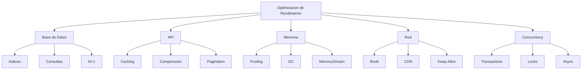
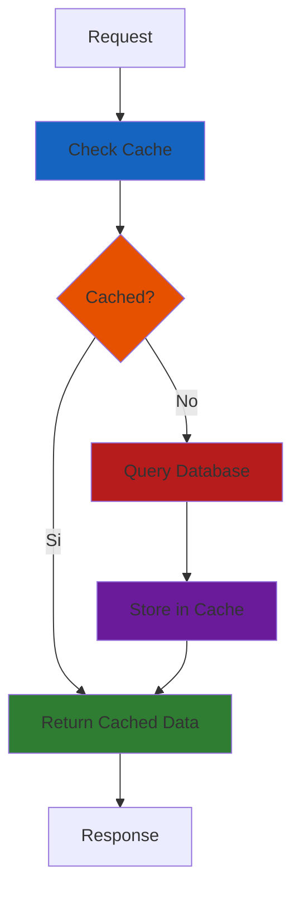

# 23. Optimizacion de Rendimiento

## Indice

- [23.1. Conceptos Fundamentales](#231-conceptos-fundamentales)
- [23.2. Optimizacion de Consultas a BD](#232-optimizacion-de-consultas-a-bd)
- [23.3. Caching](#233-caching)
- [23.4. Optimizacion de API](#234-optimizacion-de-api)
- [23.5. Concurrency y Transacciones](#235-concurrency-y-transacciones)
- [23.6. Optimizacion de Memoria](#236-optimizacion-de-memoria)
- [23.7. Compression](#237-compression)
- [23.8. Rate Limiting](#238-rate-limiting)
- [23.9. Monitoring y Profiling](#239-monitoring-y-profiling)
- [23.10. Resumen](#2310-resumen)
- [23.11. Ejercicio Propuesto](#2311-ejercicio-propuesto)

---

## 23.1. Conceptos Fundamentales

La **optimizacion de rendimiento** es el proceso de mejorar la velocidad, eficiencia y escalabilidad de una aplicacion. En APIs de alto trafico, cada milisegundo cuenta.

### Areas de Optimizacion



🧠 **Analogia**: Optimizar una API es como afinar un coche de carreras. Cada pequena mejora (neumaticos, aerodinamica, motor) se suma para obtener un mejor tiempo en la pista. No hay una sola solucion magica, son muchas pequenas optimizaciones.

### Principios de Optimizacion

✅ **Medir antes de optimizar**: No optimices ciegamente, mide primero
✅ **80/20 Rule**: El 80% del tiempo se pasa en el 20% del codigo
✅ **Caching is king**: El cache es la optimizacion mas efectiva
✅ **Lazy loading**: Carga recursos solo cuando se necesitan
✅ **Batch operations**: Agrupa operaciones para reducir overhead

---

## 23.2. Optimizacion de Consultas a BD

### Selects Optimizados

```csharp
// ❌ MAL: Carga todas las propiedades
var producto = await context.Productos.FindAsync(id);

// ✅ BIEN: Solo las necesarias
var producto = await context.Productos
    .AsNoTracking()
    .Where(p => p.Id == id)
    .Select(p => new ProductoDto
    {
        Id = p.Id,
        Nombre = p.Nombre,
        Precio = p.Precio
    })
    .FirstOrDefaultAsync();
```

### Include Eficiente

```csharp
// ❌ MAL: Include todo sin control
var productos = await context.Productos
    .Include(p => p.Categoria)
    .Include(p => p.Reviews)
    .Include(p => p.Imagenes)
    .ToListAsync();

// ✅ BIEN: Include solo lo necesario con ThenInclude
var productos = await context.Productos
    .Include(p => p.Categoria)
        .ThenInclude(c => c.Productos)
    .Where(p => p.Activo)
    .Select(p => new ProductoDto
    {
        Id = p.Id,
        Nombre = p.Nombre,
        Categoria = new CategoriaDto
        {
            Id = p.Categoria.Id,
            Nombre = p.Categoria.Nombre
        }
    })
    .ToListAsync();
```

### Indices en EF Core

```csharp
protected override void OnModelCreating(ModelBuilder modelBuilder)
{
    modelBuilder.Entity<Producto>(entity =>
    {
        // Indice simple
        entity.HasIndex(p => p.Nombre);
        
        // Indice compuesto
        entity.HasIndex(p => new { p.CategoriaId, p.Activo });
        
        // Indice unico
        entity.HasIndex(p => p.Sku).IsUnique();
        
        // Indice con filtro
        entity.HasIndex(p => p.Activo)
            .HasFilter("IsDeleted = 0");
        
        // Index covering (incluye columnas adicionales)
        entity.HasIndex(p => p.CategoriaId)
            .IncludeProperties(p => new { p.Nombre, p.Precio });
    });
}
```

### Split Queries

```csharp
// ❌ MAL: Query unica con muchos includes (N+1 en memoria)
var productos = await context.Productos
    .Include(p => p.Reviews)
    .Include(p => p.Imagenes)
    .ToListAsync();

// ✅ BIEN: Split queries para evitar Cartesian explosion
var productos = await context.Productos
    .AsSplitQuery()
    .Include(p => p.Reviews)
    .Include(p => p.Imagenes)
    .ToListAsync();
```

### Pagination

```csharp
public async Task<PagedResult<ProductoDto>> GetProductosAsync(
    int page = 1, 
    int pageSize = 20)
{
    var query = context.Productos
        .AsNoTracking()
        .Where(p => p.Activo)
        .OrderBy(p => p.Nombre);

    var total = await query.CountAsync();
    var items = await query
        .Skip((page - 1) * pageSize)
        .Take(pageSize)
        .Select(p => new ProductoDto
        {
            Id = p.Id,
            Nombre = p.Nombre,
            Precio = p.Precio
        })
        .ToListAsync();

    return new PagedResult<ProductoDto>(items, total, page, pageSize);
}
```

---

## 23.3. Caching

El caching es una de las optimizaciones mas efectivas.

### Memory Cache

```csharp
builder.Services.AddMemoryCache();

public class ProductoService(IMemoryCache cache)
{
    private readonly TimeSpan _cacheDuration = TimeSpan.FromMinutes(10);

    public async Task<Producto?> GetByIdAsync(long id)
    {
        var cacheKey = $"producto:{id}";
        
        if (cache.TryGetValue(cacheKey, out Producto? producto))
        {
            return producto;
        }

        producto = await _context.Productos.FindAsync(id);
        
        if (producto != null)
        {
            cache.Set(cacheKey, producto, _cacheDuration);
        }

        return producto;
    }

    public async Task InvalidateCacheAsync(long id)
    {
        var cacheKey = $"producto:{id}";
        cache.Remove(cacheKey);
    }
}
```

### Distributed Cache con Redis

```csharp
builder.Services.AddStackExchangeRedisCache(options =>
{
    options.Configuration = 
        builder.Configuration.GetConnectionString("Redis")!;
    options.InstanceName = "TuApi:";
});

public class ProductoCacheService(
    IDistributedCache cache,
    IJsonSerializer serializer)
{
    public async Task<ProductoDto?> GetCachedAsync(long id)
    {
        var cacheKey = $"producto:{id}";
        var cached = await cache.GetStringAsync(cacheKey);
        
        if (cached != null)
        {
            return serializer.Deserialize<ProductoDto>(cached);
        }

        return null;
    }

    public async Task SetCacheAsync(ProductoDto producto)
    {
        var cacheKey = $"producto:{producto.Id}";
        var serialized = serializer.Serialize(producto);
        
        await cache.SetStringAsync(cacheKey, serialized, new DistributedCacheEntryOptions
        {
            AbsoluteExpirationRelativeToNow = TimeSpan.FromMinutes(10),
            SlidingExpiration = TimeSpan.FromMinutes(2)
        });
    }

    public async Task InvalidateAsync(long id)
    {
        var cacheKey = $"producto:{id}";
        await cache.RemoveAsync(cacheKey);
    }
}
```

### Cache-Aside Pattern



### Response Caching

```csharp
builder.Services.AddResponseCaching();

var app = builder.Build();

app.UseResponseCaching();

app.MapGet("/api/productos", async (context) =>
{
    context.Response.GetTypedHeaders().CacheControl = 
        new CacheControlHeaderValue
        {
            Public = true,
            MaxAge = TimeSpan.FromMinutes(5)
        };
    
    var productos = await context.Services.GetRequiredService<IProductoService>()
        .GetAllAsync();
    
    await context.Response.WriteAsJsonAsync(productos);
});
```

---

## 23.4. Optimizacion de API

### Gzip Compression

```csharp
builder.Services.AddResponseCompression(options =>
{
    options.EnableForHttps = true;
    options.MimeTypes = new[] 
    { 
        "application/json",
        "application/xml",
        "text/plain"
    };
});

app.UseResponseCompression();
```

### Compression con Brotli

```csharp
builder.Services.AddResponseCompression(options =>
{
    options.Providers.Add<BrotliCompressionProvider>();
    options.Providers.Add<GzipCompressionProvider>();
    options.MimeTypes = ResponseCompressionDefaults.MimeTypes.Concat(
        new[] { "application/json" });
});

builder.Services.Configure<BrotliCompressionProviderOptions>(options =>
{
    options.Level = CompressionLevel.Optimal;
});
```

### Minima Peticion HTTP

```csharp
// ❌ MAL: Multiples endpoints
var productos = await httpClient.GetAsync("/api/productos");
var categorias = await httpClient.GetAsync("/api/categorias");
var carrito = await httpClient.GetAsync("/api/carrito");

// ✅ BIEN: Endpoint unico con toda la data
var dashboard = await httpClient.GetAsync(
    "/api/dashboard?secciones=productos,categorias,carrito");
```

### Query Tracking

```csharp
// ❌ MAL: Tracking implicito (consume mas memoria)
var productos = await context.Productos.ToListAsync();

// ✅ BIEN: No tracking para solo lectura
var productos = await context.Productos
    .AsNoTracking()
    .ToListAsync();

// ✅ BIEN: No tracking con chache de cambio
var productos = await context.Productos
    .AsNoTrackingWithIdentityResolution()
    .ToListAsync();
```

---

## 23.5. Concurrency y Transacciones

### Transacciones Optimizadas

```csharp
// ❌ MAL: Transaccion larga
using var transaction = await context.Database.BeginTransactionAsync();

try
{
    var producto = await context.Productos.FindAsync(id);
    producto.Stock -= cantidad;
    await context.SaveChangesAsync();
    
    await transaction.CommitAsync(); // Muy tarde!
}
catch
{
    await transaction.RollbackAsync();
    throw;
}

// ✅ BIEN: Transaccion corta
using var transaction = await context.Database.BeginTransactionAsync(
    System.Data.IsolationLevel.ReadCommitted);

try
{
    var producto = await context.Productos
        .FirstAsync(p => p.Id == id);
    
    producto.Stock -= cantidad;
    await context.SaveChangesAsync();
    
    await transaction.CommitAsync();
}
catch
{
    await transaction.RollbackAsync();
    throw;
}
```

### Optimistic Concurrency

```csharp
public class Producto
{
    [Key]
    public long Id { get; set; }
    
    public int Stock { get; set; }
    
    [Timestamp]
    public byte[] RowVersion { get; set; } = null!;
}

// En el servicio
public async Task<bool> ActualizarStockAsync(long productoId, int cantidad)
{
    var producto = await context.Productos.FindAsync(productoId);
    
    producto.Stock -= cantidad;
    
    try
    {
        await context.SaveChangesAsync();
        return true;
    }
    catch (DbUpdateConcurrencyException)
    {
        // Manejar conflicto
        return false;
    }
}
```

### Parallel Execution

```csharp
// ❌ MAL: Ejecucion secuencial
var producto = await GetProductoAsync(id1);
var categoria = await GetCategoriaAsync(producto.CategoriaId);
var imagenes = await GetImagenesAsync(id1);

// ✅ BIEN: Ejecucion paralela
var productoTask = GetProductoAsync(id1);
var categoriaTask = productoTask.ContinueWith(async t => 
{
    var p = await t;
    return await GetCategoriaAsync(p.CategoriaId);
});
var imagenesTask = GetImagenesAsync(id1);

await Task.WhenAll(productoTask, categoriaTask, imagenesTask);

// ✅ MEJOR: Task.WhenAll
var producto = await GetProductoAsync(id1);
var categoriaTask = GetCategoriaAsync(producto.CategoriaId);
var imagenesTask = GetImagenesAsync(id1);

await Task.WhenAll(categoriaTask, imagenesTask);
```

---

## 23.6. Optimizacion de Memoria

### Object Pooling

```csharp
builder.Services.AddObjectPool(() => new HttpRequestMessage());

// O con HttpClientFactory (recomendado)
builder.Services.AddHttpClient<IProductoService, ProductoService>()
    .SetHandlerLifetime(TimeSpan.FromMinutes(5));
```

### Use Stream Directly

```csharp
// ❌ MAL: Cargar todo en memoria
var bytes = await File.ReadAllBytesAsync("archivo.json");
var datos = JsonSerializer.Deserialize<Datos>(bytes);

// ✅ BIEN: Stream directo
await using var stream = File.OpenRead("archivo.json");
var datos = await JsonSerializer.DeserializeAsync<Datos>(stream);
```

### Large Object Heap (LOH)

```csharp
// ❌ MAL: Arrays grandes van al LOH
var buffer = new byte[100_000_000]; // >85KB

// ✅ BIEN: ArrayPool
var buffer = ArrayPool<byte>.Shared.Rent(100_000_000);
try
{
    // Usar buffer
}
finally
{
    ArrayPool<byte>.Shared.Return(buffer);
}
```

### Evitar Boxing/Unboxing

```csharp
// ❌ MAL: Boxing con tipos valor
var lista = new List<object>();
lista.Add(42); // Boxing
lista.Add("texto");
lista.Add(DateTime.Now);

// ✅ BIEN: Tipos genericos
var lista = new List<int>();
lista.Add(42); // Sin boxing
```

---

## 23.7. Compression

### Response Compression Middleware

```csharp
builder.Services.AddResponseCompression(options =>
{
    options.EnableForHttps = true;
    options.MimeTypes = new[] 
    { 
        "application/json",
        "text/plain",
        "text/html",
        "text/css",
        "application/javascript"
    };
    
    options.Providers.Add<BrotliCompressionProvider>();
    options.Providers.Add<GzipCompressionProvider>();
});

builder.Services.Configure<BrotliCompressionProviderOptions>(options =>
{
    options.Level = CompressionLevel.Optimal;
});

builder.Services.Configure<GzipCompressionProviderOptions>(options =>
{
    options.Level = CompressionLevel.Fastest;
});

var app = builder.Build();

app.UseResponseCompression();
```

### Comprimir en el Controlador

```csharp
[HttpGet("export")]
public async Task<IActionResult> ExportarDatos(
    [FromServices] ICompressor compressor)
{
    var datos = await _service.GetAllDataAsync();
    
    using var ms = new MemoryStream();
    await using (var gzip = new GZipStream(ms, CompressionMode.Compress))
    await using (var writer = new StreamWriter(gzip))
    {
        await writer.WriteAsync(JsonSerializer.Serialize(datos));
    }
    
    return File(ms.ToArray(), "application/json", "datos.json.gz");
}
```

---

## 23.8. Rate Limiting

### Rate Limiting con AspNetCoreRateLimiting

```csharp
builder.Services.AddRateLimiter(options =>
{
    options.AddPolicy("api", context =>
    {
        var ip = context.Connection.RemoteIpAddress?.ToString() ?? "unknown";
        return RateLimitPartition.GetFixedWindowLimiter(
            ip,
            partition => new FixedWindowRateLimiterOptions
            {
                PermitLimit = 100,
                Window = TimeSpan.FromMinutes(1),
                QueueProcessingOrder = QueueProcessingOrder.OldestFirst
            });
    });

    options.AddPolicy("premium", context =>
    {
        var userId = context.User.FindFirst("sub")?.Value ?? "anonymous";
        return RateLimitPartition.GetFixedWindowLimiter(
            userId,
            partition => new FixedWindowRateLimiterOptions
            {
                PermitLimit = 1000,
                Window = TimeSpan.FromMinutes(1)
            });
    });
});

app.MapGet("/api/productos", 
    [EnableRateLimiting("api")]
async (IProductoService service) => { });
```

### Token Bucket Algorithm

```csharp
public class TokenBucketRateLimiter
{
    private readonly SemaphoreSlim _semaphore;
    private readonly int _maxTokens;
    private readonly TimeSpan _refillInterval;
    private int _currentTokens;
    private DateTime _nextRefill;

    public TokenBucketRateLimiter(int maxTokens, TimeSpan refillInterval)
    {
        _maxTokens = maxTokens;
        _refillInterval = refillInterval;
        _currentTokens = maxTokens;
        _semaphore = new SemaphoreSlim(maxTokens, maxTokens);
    }

    public async Task<bool> TryAcquireAsync()
    {
        await _semaphore.WaitAsync();
        try
        {
            RefillIfNeeded();
            if (_currentTokens > 0)
            {
                _currentTokens--;
                return true;
            }
            return false;
        }
        finally
        {
            _semaphore.Release();
        }
    }

    private void RefillIfNeeded()
    {
        var now = DateTime.UtcNow;
        if (now >= _nextRefill)
        {
            _currentTokens = _maxTokens;
            _nextRefill = now.Add(_refillInterval);
        }
    }
}
```

---

## 23.9. Monitoring y Profiling

### Health Checks Avanzados

```csharp
builder.Services.AddHealthChecks()
    .AddCheck("database", new SqlConnectionHealthCheck(
        builder.Configuration.GetConnectionString("Default")!))
    .AddCheck("redis", new RedisHealthCheck(
        builder.Configuration.GetConnectionString("Redis")!))
    .AddCheck("external-api", new HttpHealthCheck(
        "https://api.external.com/health", timeout: TimeSpan.FromSeconds(5))
    {
        UseBasicHealthCheck = true
    });

app.MapHealthChecks("/health", new HealthCheckOptions
{
    ResponseWriter = async (context, report) =>
    {
        context.Response.ContentType = "application/json";
        var response = new
        {
            status = report.Status.ToString(),
            checks = report.Entries.Select(e => new
            {
                name = e.Key,
                status = e.Value.Status.ToString(),
                duration = e.Value.Duration.TotalMilliseconds
            })
        };
        await context.Response.WriteAsJsonAsync(response);
    }
});
```

### Application Metrics

```csharp
builder.Services.AddApplicationInsightsTelemetry();

// Custom metrics
var productoCounter = _metrics.CreateCounter<long>(
    "productos_consultados_total",
    description: "Total de consultas de productos");

[HttpGet("productos")]
public async Task<IActionResult> GetProductos()
{
    productoCounter.Add(1);
    // ...
}
```

### Performance Profiling

```csharp
// MiniProfiler
builder.Services.AddMiniProfiler(options =>
{
    options.RouteBasePath = "/profiler";
    options.ShouldProfile = request => 
        request.HttpContext.Request.Query.ContainsKey("profile");
});

app.UseMiniProfiler();
```

---

## 23.10. Resumen

| Area | Tecnica | Impacto |
|------|---------|---------|
| **BD** | Indices | Alto |
| **BD** | AsNoTracking | Medio |
| **BD** | Pagination | Alto |
| **Caching** | Redis/Memory | Muy Alto |
| **API** | Compression | Medio |
| **API** | Rate Limiting | Medio |
| **Memoria** | Object Pooling | Medio |
| **Concurrency** | Parallel execution | Alto |
| **Monitoring** | Health checks | Bajo |

### Checklist de Optimizacion

✅ Indices en columnas frecuentemente consultadas
✅ AsNoTracking para solo lectura
✅ Pagination en listados
✅ Caching de datos frecuentes
✅ Compression de respuestas
✅ Rate limiting para proteccion
✅ Parallel execution cuando sea posible
✅ Health checks para monitorizacion

---

## 23.11. Ejercicio Propuesto

### Requisitos

Optimizar una API de productos existente.

### Tareas

1. **Optimizacion de Consultas**
   - Agregar indices necesarios
   - Implementar pagination
   - Usar AsNoTracking

2. **Implementar Caching**
   - Redis para datos frecuentes
   - Memory cache para sesion
   - Response caching

3. **Optimizacion de API**
   - Compression Brotli
   - Rate limiting
   - Parallel execution

4. **Monitoring**
   - Health checks
   - Application Insights
   - Logging estructurado

### Criterios de Evaluacion

| Criterio | Puntos |
|----------|--------|
| Indices correctamente definidos | 2 |
| Pagination implementada | 2 |
| Caching con Redis | 2 |
| Compression configurada | 1 |
| Rate limiting | 1 |
| Health checks | 1 |
| Documentacion de optimizaciones | 1 |
