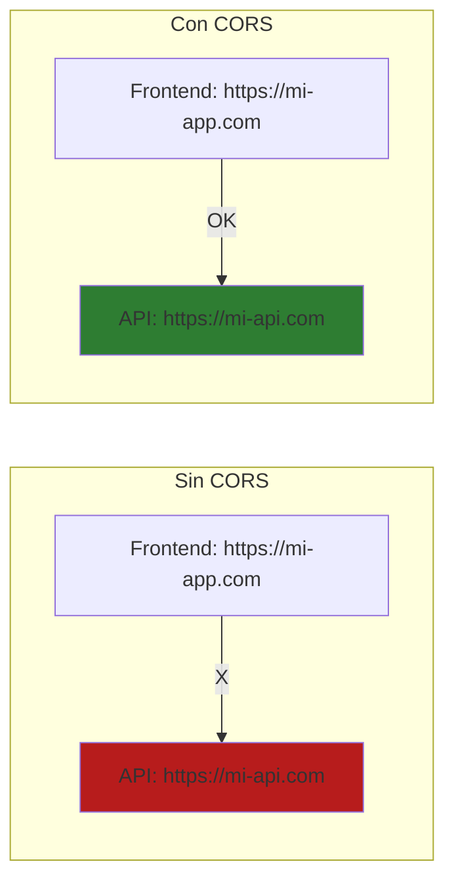
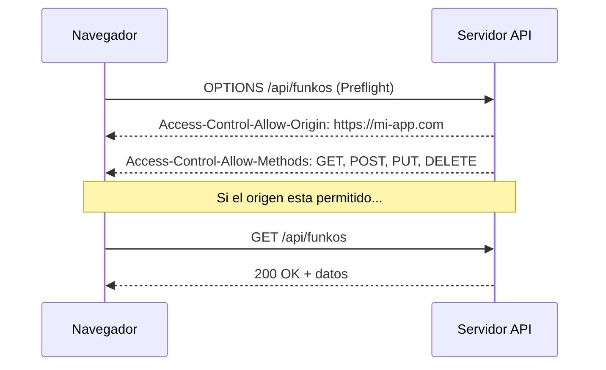
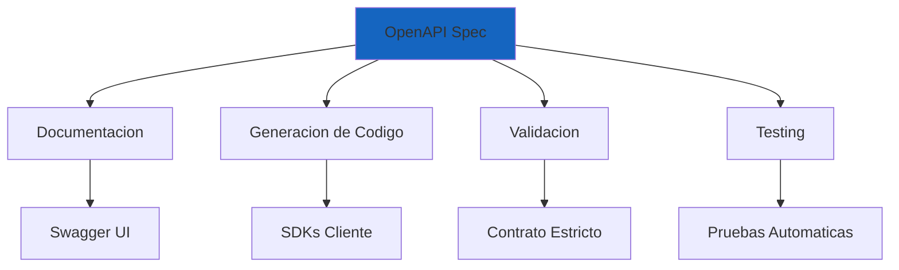
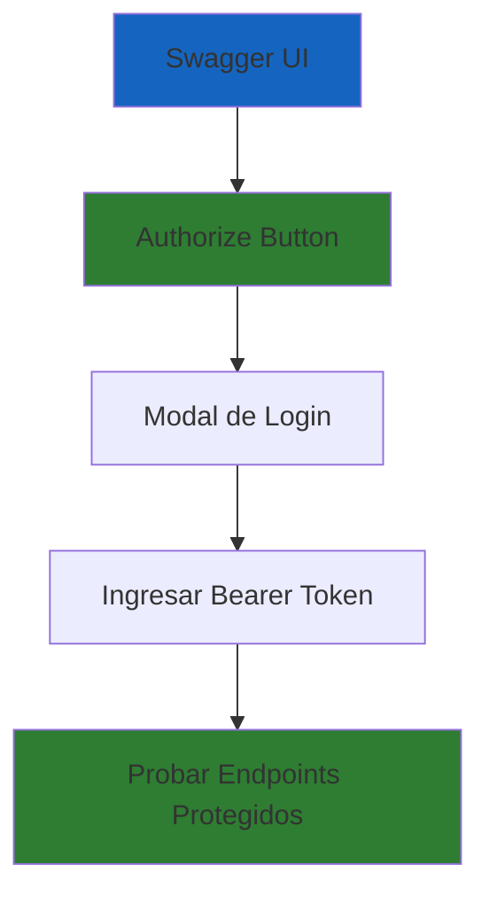

# 24. Documentacion con Swagger/OpenAPI en ASP.NET Core

## Indice

- [24.1. CORS (Cross-Origin Resource Sharing)](#241-cors-cross-origin-resource-sharing)
  - [24.1.1. Que es CORS](#2411-que-es-cors)
  - [24.1.2. Importancia de CORS](#2412-importancia-de-cors)
  - [24.1.3. Configuracion de CORS en ASP.NET Core](#2413-configuracion-de-cors-en-aspnet-core)
- [24.2. Swagger y OpenAPI](#242-swagger-y-openapi)
  - [24.2.1. Que es OpenAPI](#2421-que-es-openapi)
  - [24.2.2. Que es Swagger](#2422-que-es-swagger)
  - [24.2.3. Instalacion de Swashbuckle](#2423-instalacion-de-swashbuckle)
  - [24.2.4. Configuracion Basica](#2424-configuracion-basica)
  - [24.2.5. Configuracion Avanzada](#2425-configuracion-avanzada)
- [24.3. Documentar Endpoints](#243-documentar-endpoints)
  - [24.3.1. Atributos de Documentacion](#2431-atributos-de-documentacion)
  - [24.3.2. Ejemplo Completo de Endpoint Documentado](#2432-ejemplo-completo-de-endpoint-documentado)
- [24.4. Documentar Modelos y DTOs](#244-documentar-modelos-y-dtos)
  - [24.4.1. Atributos de Schema](#2441-atributos-de-schema)
  - [24.4.2. Ejemplo Completo de Modelo Documentado](#2442-ejemplo-completo-de-modelo-documentado)
- [24.5. Documentar Autenticacion JWT](#245-documentar-autenticacion-jwt)
  - [24.5.1. Configuracion de Seguridad en Swagger](#2451-configuracion-de-seguridad-en-swagger)
  - [24.5.2. Uso en Swagger UI](#2452-uso-en-swagger-ui)
- [24.6. Documentar Respuestas de Error](#246-documentar-respuestas-de-error)
  - [24.6.1. Modelo de Error](#2461-modelo-de-error)
  - [24.6.2. Uso en Endpoints](#2462-uso-en-endpoints)
- [24.7. Versionado de API](#247-versionado-de-api)
  - [24.7.1. Instalacion y Configuracion](#2471-instalacion-y-configuracion)
  - [24.7.2. Uso en Controladores](#2472-uso-en-controladores)
- [24.8. Ejemplos de Solicitudes](#248-ejemplos-de-solicitudes)
- [24.9. Filtros Personalizados](#249-filtros-personalizados)
- [24.10. Buenas Practicas](#2410-buenas-practicas)
- [24.11. Resumen](#2411-resumen)
- [24.12. Ejercicio Propuesto](#2412-ejercicio-propuesto)

---

## 24.1. CORS (Cross-Origin Resource Sharing)

### 24.1.1. Que es CORS

**CORS** es un mecanismo de seguridad de los navegadores que controla las solicitudes HTTP entre diferentes dominios. Sin CORS, los navegadores bloquean solicitudes a dominios diferentes por defecto.



**Flujo de una solicitud CORS:**



### 24.1.2. Importancia de CORS

| Beneficio | Descripción |
|-----------|-------------|
| **Protección contra CSRF** | Evita ataques de falsificación de solicitudes entre sitios |
| **Compartir recursos** | Permite que frontends en otros dominios accedan a tu API |
| **Acceso controlado** | Solo dominios autorizados pueden consumir tu API |
| **Seguridad** | Previene accesos no autorizados desde sitios maliciosos |

🧠 **Analogía**: Piensa en CORS como el portero de un edificio. Solo permite entrar a las personas que tienen autorización para acceder a zonas específicas. Sin el portero, cualquiera podría entrar a cualquier parte.

📝 **Nota del Profesor**: CORS solo afecta a solicitudes desde navegadores. Aplicaciones servidor a servidor no están afectadas por CORS.

### 24.1.3. Configuración de CORS en ASP.NET Core

**Política Permisiva (Desarrollo):**

```csharp
var builder = WebApplication.CreateBuilder(args);

// Configurar CORS (desarrollo)
builder.Services.AddCors(options =>
{
    options.AddPolicy("AllowAll", policy =>
    {
        policy.AllowAnyOrigin()
              .AllowAnyMethod()
              .AllowAnyHeader();
    });
});

var app = builder.Build();

app.UseCors("AllowAll");

app.UseAuthentication();
app.UseAuthorization();
app.MapControllers();
app.Run();
```

⚠️ **Advertencia**: Nunca uses "AllowAll" en producción. Esto permite que cualquier dominio acceda a tu API, lo cual es un riesgo de seguridad.

**Política Restringida (Producción):**

```csharp
builder.Services.AddCors(options =>
{
    options.AddPolicy("Production", policy =>
    {
        policy.WithOrigins(
                "https://mi-frontend.com",
                "https://admin.mi-frontend.com"
            )
            .WithMethods("GET", "POST", "PUT", "DELETE")
            .WithHeaders("Content-Type", "Authorization")
            .AllowCredentials();
    });
});
```

**Múltiples Políticas:**

```csharp
builder.Services.AddCors(options =>
{
    // Política para API pública (solo lectura)
    options.AddPolicy("PublicApi", policy =>
    {
        policy.AllowAnyOrigin()
              .WithMethods("GET")
              .AllowAnyHeader();
    });

    // Política para administración (acceso completo)
    options.AddPolicy("AdminApi", policy =>
    {
        policy.WithOrigins("https://admin.mi-app.com")
              .AllowAnyMethod()
              .AllowAnyHeader()
              .AllowCredentials();
    });
});
```

**Uso en controladores:**

```csharp
[ApiController]
[Route("api/[controller]")]
[EnableCors("PublicApi")]
public class FunkosController : ControllerBase
{
    // Endpoints públicos
}

[ApiController]
[Route("api/admin/[controller]")]
[EnableCors("AdminApi")]
public class AdminController : ControllerBase
{
    // Endpoints de administración
}
```

💡 **Tip del Examinador**: Usa atributos `[EnableCors]` y `[DisableCors]` en controladores o acciones específicas para control granular.

---

## 24.2. Swagger y OpenAPI

### 24.2.1. Que es OpenAPI

**OpenAPI** es una especificacion estandar para describir APIs REST en formato JSON/YAML.



**Beneficios:**

| Beneficio | Descripcion |
|-----------|-------------|
| Documentacion estandarizada | Machine-readable y auto-descriptiva |
| Generacion automatica de SDKs | Clientes en multiples lenguajes |
| Validacion de contratos | Verificacion automatica de compliance |
| Pruebas interactivas | Testing desde la propia documentacion |

### 24.2.2. Que es Swagger

**Swagger** es un conjunto de herramientas que implementa la especificacion OpenAPI:

| Herramienta | Descripcion |
|-------------|-------------|
| **Swagger UI** | Interfaz web interactiva para explorar y probar la API |
| **Swagger Editor** | Editor en linea para crear especificaciones OpenAPI |
| **Swagger Codegen** | Genera codigo cliente y servidor desde la especificacion |

### 24.2.3. Instalacion de Swashbuckle

```bash
# Paquetes principales
dotnet add package Swashbuckle.AspNetCore
dotnet add package Swashbuckle.AspNetCore.Annotations
```

### 24.2.4. Configuracion Basica

```csharp
var builder = WebApplication.CreateBuilder(args);

builder.Services.AddControllers();
builder.Services.AddEndpointsApiExplorer();
builder.Services.AddSwaggerGen();

var app = builder.Build();

// Habilitar Swagger en desarrollo
if (app.Environment.IsDevelopment())
{
    app.UseSwagger();
    app.UseSwaggerUI();
}

app.UseHttpsRedirection();
app.UseAuthorization();
app.MapControllers();
app.Run();
```

**Acceder a Swagger UI:**
```
https://localhost:5001/swagger/index.html
```

### 24.2.5. Configuracion Avanzada

```csharp
using Microsoft.OpenApi.Models;

builder.Services.AddSwaggerGen(options =>
{
    // Informacion general de la API
    options.SwaggerDoc("v1", new OpenApiInfo
    {
        Version = "v1.0.0",
        Title = "Funkos API",
        Description = "API REST para gestion de Funkos - Curso ASP.NET Core",
        TermsOfService = new Uri("https://example.com/terms"),
        Contact = new OpenApiContact
        {
            Name = "Jose Luis Gonzalez",
            Email = "jose@example.com",
            Url = new Uri("https://example.com/contact")
        },
        License = new OpenApiLicense
        {
            Name = "MIT License",
            Url = new Uri("https://opensource.org/licenses/MIT")
        }
    });

    // Incluir comentarios XML
    var xmlFile = $"{Assembly.GetExecutingAssembly().GetName().Name}.xml";
    var xmlPath = Path.Combine(AppContext.BaseDirectory, xmlFile);
    options.IncludeXmlComments(xmlPath);

    // Habilitar anotaciones
    options.EnableAnnotations();
});
```

**Habilitar comentarios XML en .csproj:**

```xml
<PropertyGroup>
  <GenerateDocumentationFile>true</GenerateDocumentationFile>
  <NoWarn>$(NoWarn);1591</NoWarn>
</PropertyGroup>
```

🧠 **Analogia**: Los comentarios XML son como las notas del profesor en el margen del libro. Swagger los lee y los convierte en documentacion bonita.

---

## 24.3. Documentar Endpoints

### 24.3.1. Atributos de Documentacion

```csharp
using Swashbuckle.AspNetCore.Annotations;

[ApiController]
[Route("api/[controller]")]
[Produces("application/json")]
[SwaggerTag("Gestion de Funkos")]
public class FunkosController : ControllerBase
{
    /// <summary>
    /// Obtiene todos los funkos con paginacion
    /// </summary>
    /// <param name="pageNumber">Numero de pagina (default: 1)</param>
    /// <param name="pageSize">Tamano de pagina (default: 10)</param>
    /// <returns>Lista paginada de funkos</returns>
    /// <response code="200">Devuelve la lista de funkos</response>
    [HttpGet]
    [SwaggerOperation(
        Summary = "Obtener todos los funkos",
        Description = "Devuelve una lista paginada de funkos con filtros opcionales",
        OperationId = "GetAllFunkos",
        Tags = new[] { "Funkos" }
    )]
    [SwaggerResponse(200, "Lista de funkos obtenida correctamente", typeof(PageResponse<FunkoResponseDto>))]
    [SwaggerResponse(400, "Parametros invalidos")]
    public async Task<ActionResult<PageResponse<FunkoResponseDto>>> GetAll(
        [FromQuery, SwaggerParameter("Numero de pagina", Required = false)] int pageNumber = 1,
        [FromQuery, SwaggerParameter("Tamano de pagina", Required = false)] int pageSize = 10)
    {
        // ...
    }
```

### 24.3.2. Ejemplo Completo de Endpoint Documentado

```csharp
/// <summary>
/// Actualiza un funko existente
/// </summary>
/// <param name="id">ID del funko a actualizar</param>
/// <param name="dto">Nuevos datos del funko</param>
/// <returns>Funko actualizado</returns>
/// <response code="200">Funko actualizado correctamente</response>
/// <response code="400">Datos invalidos</response>
/// <response code="401">No autorizado</response>
/// <response code="404">Funko no encontrado</response>
[HttpPut("{id}")]
[Authorize(Roles = Roles.Admin)]
[SwaggerOperation(
    Summary = "Actualizar funko",
    Description = "Actualiza todos los campos de un funko. Solo administradores pueden ejecutar esta operacion",
    OperationId = "UpdateFunko"
)]
[SwaggerResponse(200, "Funko actualizado correctamente", typeof(FunkoResponseDto))]
[SwaggerResponse(400, "Datos invalidos o incompletos", typeof(ValidationProblemDetails))]
[SwaggerResponse(401, "Usuario no autenticado")]
[SwaggerResponse(403, "Usuario no tiene permisos de administrador")]
[SwaggerResponse(404, "Funko no encontrado", typeof(ProblemDetails))]
public async Task<ActionResult<FunkoResponseDto>> Update(
    [FromRoute, SwaggerParameter("ID del funko", Required = true)] int id,
    [FromBody, SwaggerRequestBody("Datos actualizados del funko", Required = true)] UpdateFunkoDto dto)
{
    var result = await _service.UpdateAsync(id, dto);
    return result.Match<ActionResult<FunkoResponseDto>>(
        success => Ok(success),
        error => error switch
        {
            FunkoError.NotFound => NotFound(new ProblemDetails { Detail = error.Message }),
            FunkoError.InvalidData => BadRequest(new ValidationProblemDetails()),
            _ => StatusCode(500)
        }
    );
}
```

---

## 24.4. Documentar Modelos y DTOs

### 24.4.1. Atributos de Schema

```csharp
using System.ComponentModel;
using System.ComponentModel.DataAnnotations;
using Swashbuckle.AspNetCore.Annotations;

/// <summary>
/// DTO para crear un funko
/// </summary>
[SwaggerSchema(Description = "Datos necesarios para crear un funko")]
public record CreateFunkoDto
{
    /// <summary>
    /// Nombre del funko
    /// </summary>
    /// <example>Iron Man</example>
    [Required(ErrorMessage = "El nombre es obligatorio")]
    [StringLength(100, MinimumLength = 3, ErrorMessage = "El nombre debe tener entre 3 y 100 caracteres")]
    [SwaggerSchema(Description = "Nombre del funko", Nullable = false)]
    public string Nombre { get; init; } = string.Empty;

    /// <summary>
    /// Precio del funko en euros
    /// </summary>
    /// <example>29.99</example>
    [Required(ErrorMessage = "El precio es obligatorio")]
    [Range(0.01, 9999.99, ErrorMessage = "El precio debe estar entre 0.01 y 9999.99")]
    [SwaggerSchema(Description = "Precio del funko en euros", Format = "decimal", Nullable = false)]
    public decimal Precio { get; init; }

    /// <summary>
    /// Cantidad en stock
    /// </summary>
    /// <example>10</example>
    [Required(ErrorMessage = "La cantidad es obligatoria")]
    [Range(0, int.MaxValue, ErrorMessage = "La cantidad no puede ser negativa")]
    [SwaggerSchema(Description = "Cantidad disponible en stock", Nullable = false)]
    public int Cantidad { get; init; }

    /// <summary>
    /// Categoria del funko
    /// </summary>
    /// <example>Marvel</example>
    [Required(ErrorMessage = "La categoria es obligatoria")]
    [StringLength(50, ErrorMessage = "La categoria no puede exceder 50 caracteres")]
    [SwaggerSchema(Description = "Categoria a la que pertenece el funko", Nullable = false)]
    public string Categoria { get; init; } = string.Empty;

    /// <summary>
    /// URL de la imagen del funko
    /// </summary>
    /// <example>https://example.com/images/ironman.jpg</example>
    [Url(ErrorMessage = "La imagen debe ser una URL valida")]
    [SwaggerSchema(Description = "URL de la imagen del funko", Format = "uri", Nullable = true)]
    public string? Imagen { get; init; }
}
```

### 24.4.2. Ejemplo Completo de Modelo Documentado

```csharp
/// <summary>
/// Respuesta de un funko
/// </summary>
[SwaggerSchema(Description = "Representacion completa de un funko")]
public record FunkoResponseDto
{
    /// <summary>
    /// Identificador unico del funko
    /// </summary>
    /// <example>1</example>
    [SwaggerSchema(Description = "ID unico del funko", ReadOnly = true)]
    public int Id { get; init; }

    /// <summary>
    /// Nombre del funko
    /// </summary>
    /// <example>Spider-Man</example>
    [SwaggerSchema(Description = "Nombre del funko")]
    public string Nombre { get; init; } = string.Empty;

    /// <summary>
    /// Precio del funko
    /// </summary>
    /// <example>34.99</example>
    [SwaggerSchema(Description = "Precio en euros", Format = "decimal")]
    public decimal Precio { get; init; }

    /// <summary>
    /// Cantidad disponible
    /// </summary>
    /// <example>5</example>
    [SwaggerSchema(Description = "Stock disponible")]
    public int Cantidad { get; init; }

    /// <summary>
    /// Categoria
    /// </summary>
    /// <example>Marvel</example>
    [SwaggerSchema(Description = "Categoria del funko")]
    public string Categoria { get; init; } = string.Empty;

    /// <summary>
    /// URL de la imagen
    /// </summary>
    /// <example>https://example.com/images/spiderman.jpg</example>
    [SwaggerSchema(Description = "URL de la imagen", Format = "uri")]
    public string? Imagen { get; init; }

    /// <summary>
    /// Fecha de creacion
    /// </summary>
    /// <example>2024-01-15T10:30:00Z</example>
    [SwaggerSchema(Description = "Fecha de creacion del registro", Format = "date-time", ReadOnly = true)]
    public DateTime FechaCreacion { get; init; }
}
```

💡 **Tip del Examinador**: Usa el tag `<example>` para mostrar valores de ejemplo en Swagger. Esto ayuda mucho a los desarrolladores que consumen tu API.

---

## 24.5. Documentar Autenticacion JWT

### 24.5.1. Configuracion de Seguridad en Swagger

```csharp
builder.Services.AddSwaggerGen(options =>
{
    // Configuracion anterior...

    // Definir esquema de seguridad JWT
    options.AddSecurityDefinition("Bearer", new OpenApiSecurityScheme
    {
        Name = "Authorization",
        Type = SecuritySchemeType.Http,
        Scheme = "Bearer",
        BearerFormat = "JWT",
        In = ParameterLocation.Header,
        Description = "Ingrese 'Bearer' seguido de un espacio y el token JWT.\n\nEjemplo: \"Bearer eyJhbGciOiJIUzI1NiIsInR5cCI6IkpXVCJ9...\""
    });

    // Aplicar esquema de seguridad globalmente
    options.AddSecurityRequirement(new OpenApiSecurityRequirement
    {
        {
            new OpenApiSecurityScheme
            {
                Reference = new OpenApiReference
                {
                    Type = ReferenceType.SecurityScheme,
                    Id = "Bearer"
                }
            },
            Array.Empty<string>()
        }
    });
});
```

### 24.5.2. Uso en Swagger UI



**Pasos para usar autenticacion en Swagger:**

1. **Hacer clic en "Authorize"** (boton con candado)
2. **Ingresar token**: `Bearer eyJhbGciOiJIUzI1NiIsInR5cCI6IkpXVCJ9...`
3. **Probar endpoints protegidos**

📝 **Nota del Profesor**: El boton Authorize aparece automaticamente cuando configuras el esquema de seguridad en Swagger.

---

## 24.6. Documentar Respuestas de Error

### 24.6.1. Modelo de Error

```csharp
/// <summary>
/// Detalle de un error
/// </summary>
[SwaggerSchema(Description = "Informacion detallada de un error")]
public class ApiError
{
    /// <summary>
    /// Codigo de estado HTTP
    /// </summary>
    /// <example>404</example>
    [SwaggerSchema(Description = "Codigo HTTP del error")]
    public int Status { get; set; }

    /// <summary>
    /// Titulo del error
    /// </summary>
    /// <example>Recurso no encontrado</example>
    [SwaggerSchema(Description = "Descripcion breve del error")]
    public string Title { get; set; } = string.Empty;

    /// <summary>
    /// Detalle del error
    /// </summary>
    /// <example>El funko con ID 999 no existe</example>
    [SwaggerSchema(Description = "Explicacion detallada del error")]
    public string Detail { get; set; } = string.Empty;

    /// <summary>
    /// Timestamp del error
    /// </summary>
    /// <example>2024-01-20T10:30:00Z</example>
    [SwaggerSchema(Description = "Momento en que ocurrio el error", Format = "date-time")]
    public DateTime Timestamp { get; set; } = DateTime.UtcNow;
}
```

### 24.6.2. Uso en Endpoints

```csharp
[HttpGet("{id}")]
[SwaggerOperation(Summary = "Obtener funko por ID")]
[SwaggerResponse(200, "Funko encontrado", typeof(FunkoResponseDto))]
[SwaggerResponse(404, "Funko no encontrado", typeof(ApiError))]
[SwaggerResponse(500, "Error interno del servidor", typeof(ApiError))]
public async Task<ActionResult<FunkoResponseDto>> GetById(int id)
{
    try
    {
        var funko = await _service.GetByIdAsync(id);
        if (funko is null)
        {
            return NotFound(new ApiError
            {
                Status = 404,
                Title = "Funko no encontrado",
                Detail = $"No existe un funko con ID {id}"
            });
        }
        return Ok(funko);
    }
    catch (Exception ex)
    {
        return StatusCode(500, new ApiError
        {
            Status = 500,
            Title = "Error interno",
            Detail = ex.Message
        });
    }
}
```

---

## 24.7. Versionado de API

### 24.7.1. Instalacion y Configuracion

```bash
dotnet add package Microsoft.AspNetCore.Mvc.Versioning
dotnet add package Microsoft.AspNetCore.Mvc.Versioning.ApiExplorer
```

```csharp
builder.Services.AddApiVersioning(options =>
{
    options.AssumeDefaultVersionWhenUnspecified = true;
    options.DefaultApiVersion = new ApiVersion(1, 0);
    options.ReportApiVersions = true;
});

builder.Services.AddVersionedApiExplorer(options =>
{
    options.GroupNameFormat = "'v'VVV";
    options.SubstituteApiVersionInUrl = true;
});

builder.Services.AddSwaggerGen(options =>
{
    options.SwaggerDoc("v1", new OpenApiInfo { Title = "Funkos API", Version = "v1" });
    options.SwaggerDoc("v2", new OpenApiInfo { Title = "Funkos API", Version = "v2" });
});

app.UseSwagger();
app.UseSwaggerUI(options =>
{
    options.SwaggerEndpoint("/swagger/v1/swagger.json", "Funkos API V1");
    options.SwaggerEndpoint("/swagger/v2/swagger.json", "Funkos API V2");
});
```

### 24.7.2. Uso en Controladores

```csharp
[ApiController]
[ApiVersion("1.0")]
[Route("api/v{version:apiVersion}/[controller]")]
public class FunkosV1Controller : ControllerBase
{
    // Endpoints V1 - Version original
}

[ApiController]
[ApiVersion("2.0")]
[Route("api/v{version:apiVersion}/[controller]")]
public class FunkosV2Controller : ControllerBase
{
    // Endpoints V2 - Nueva version con cambios
}
```

---

## 24.8. Ejemplos de Solicitudes

```csharp
[HttpPost]
[SwaggerOperation(
    Summary = "Crear funko",
    Description = "Crea un nuevo funko con los datos proporcionados"
)]
[SwaggerRequestExample(typeof(CreateFunkoDto), typeof(CreateFunkoExample))]
public async Task<ActionResult<FunkoResponseDto>> Create(CreateFunkoDto dto)
{
    // ...
}

public class CreateFunkoExample : IExamplesProvider<CreateFunkoDto>
{
    public CreateFunkoDto GetExamples()
    {
        return new CreateFunkoDto
        {
            Nombre = "Iron Man Mark 50",
            Precio = 34.99m,
            Cantidad = 15,
            Categoria = "Marvel",
            Imagen = "https://example.com/images/ironman-mk50.jpg"
        };
    }
}
```

---

## 24.9. Filtros Personalizados

```csharp
public class SwaggerExamplesFilter : IOperationFilter
{
    public void Apply(OpenApiOperation operation, OperationFilterContext context)
    {
        if (operation.RequestBody?.Content != null)
        {
            foreach (var content in operation.RequestBody.Content)
            {
                if (content.Key == "application/json")
                {
                    content.Value.Example = new OpenApiString(@"{
                        ""nombre"": ""Batman"",
                        ""precio"": 29.99,
                        ""cantidad"": 10,
                        ""categoria"": ""DC"",
                        ""imagen"": ""https://example.com/batman.jpg""
                    }");
                }
            }
        }
    }
}

// Registrar filtro
builder.Services.AddSwaggerGen(options =>
{
    options.OperationFilter<SwaggerExamplesFilter>();
});
```

---

## 24.10. Buenas Practicas

| Practica | Descripcion |
|----------|-------------|
| **Documentar todos los endpoints** | Incluye resumenes y descripciones claras |
| **Documentar parametros** | Explica que espera cada parametro y su formato |
| **Documentar respuestas** | Incluye todos los codigos HTTP posibles |
| **Ejemplos claros** | Proporciona ejemplos realistas con valores de ejemplo |
| **Modelos documentados** | Documenta todos los DTOs y modelos con descripciones |
| **Versionado** | Versiona tu API desde el inicio para evitar breaking changes |
| **Autenticacion** | Documenta como autenticarse e incluye el esquema JWT |
| **Errores** | Documenta todos los posibles errores que puede retornar la API |

⚠️ **Advertencia**: La documentacion desactualizada es peor que ninguna documentacion. Manten siempre sincronizada la documentacion con el codigo.

---

## 24.11. Resumen

| Concepto | Descripcion |
|----------|-------------|
| **CORS** | Controla el acceso cross-domain y es esencial para APIs que consumen frontends |
| **Swagger/OpenAPI** | Genera documentacion interactiva automaticamente |
| **Swashbuckle** | Integra Swagger en ASP.NET Core |
| **Atributos de documentacion** | Enriquecen la documentacion con descripciones |
| **Ejemplos** | Ayudan a los desarrolladores a entender como usar la API |
| **CORS restrictivo** | En produccion mejora la seguridad |
| **JWT en Swagger** | Permite probar endpoints protegidos |
| **Versionado de API** | Permite evolucionar sin romper clientes existentes |
| **Filtros personalizados** | Permiten customize la documentacion |
| **Documentacion viva** | Debe mantenerse actualizada con el codigo |

---

## 24.12. Ejercicio Propuesto

**Objetivo:** Documentar completamente la API de Funkos con Swagger/OpenAPI y configurar CORS.

**Requisitos Funcionales:**

1. **Configuracion de Swagger:**
   - Informacion completa de la API (titulo, descripcion, version, contacto)
   - Comentarios XML habilitados
   - Anotaciones habilitadas

2. **Documentacion de Endpoints:**
   - Todos los endpoints de Funkos documentados
   - Resumen y descripcion en cada endpoint
   - Codigos de respuesta documentados

3. **Documentacion de Modelos:**
   - CreateFunkoDto con ejemplos
   - UpdateFunkoDto con ejemplos
   - FunkoResponseDto con descripciones
   - Modelos de error documentados

4. **Seguridad JWT:**
   - Esquema Bearer configurado
   - Boton Authorize funcional
   - Endpoints protegidos documentados

5. **CORS Configurado:**
   - Politica restrictiva para produccion
   - Diferentes politicas para diferentes controladores
   - Headers Authorization permitidos

**Requisitos No Funcionales:**

| Requisito | Verificacion |
|-----------|--------------|
| Comments XML generados | ✅ |
| Ejemplos realistas en DTOs | ✅ |
| Error responses documentados | ✅ |
| CORS habilitado correctamente | ✅ |
| Swagger UI accesible | ✅ |

**Criterios de Evaluacion:**

| Criterio | Puntos |
|----------|--------|
| Swagger configurado con informacion completa | 1.5 |
| Todos los endpoints documentados | 2.0 |
| DTOs documentados con ejemplos | 1.5 |
| Autenticacion JWT funciona en Swagger | 1.5 |
| Codigos de respuesta documentados | 1.0 |
| CORS configurado correctamente | 1.0 |
| Modelos de error documentados | 0.5 |
| Ejemplos claros y realistas | 1.0 |

**Total: 10 puntos**

**Ejemplo de Documentacion Esperada:**

```
Funkos API v1.0.0

GET /api/funkos
  Summary: Obtener todos los funkos
  Description: Devuelve una lista paginada de funkos
  Parameters:
    - pageNumber (query, optional): Numero de pagina
    - pageSize (query, optional): Tamano de pagina
  Responses:
    - 200: Lista de funkos obtenida correctamente
    - 400: Parametros invalidos

POST /api/funkos
  Summary: Crear nuevo funko
  Description: Solo administradores pueden crear funkos
  Request Body: CreateFunkoDto
  Responses:
    - 201: Funko creado correctamente
    - 400: Datos invalidos
    - 401: No autorizado
```
