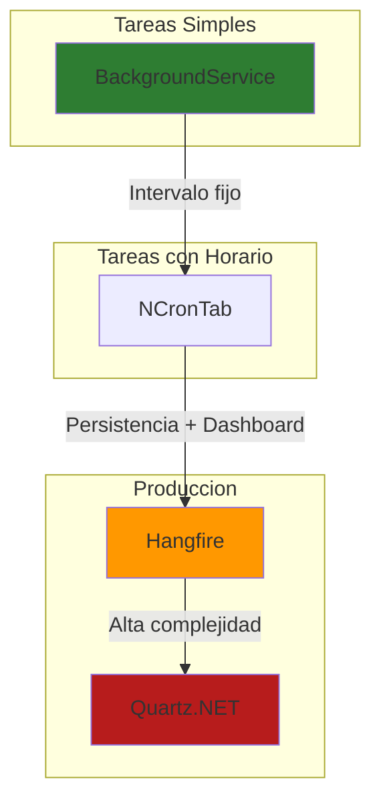
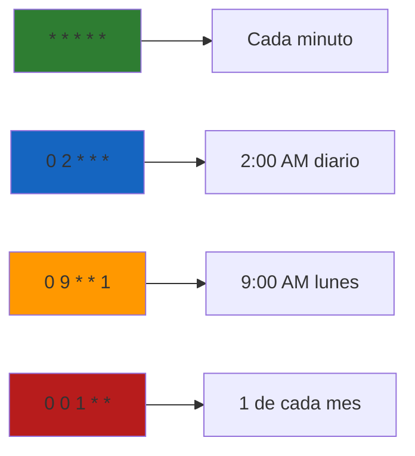
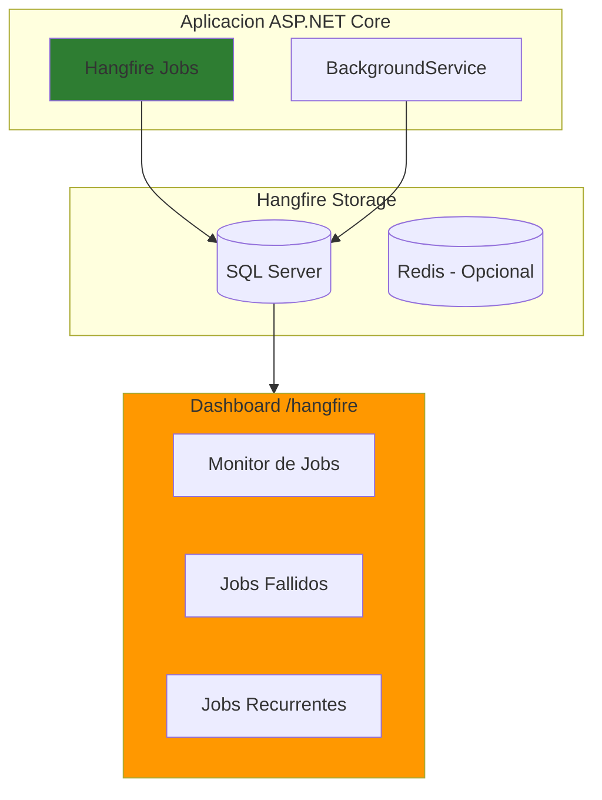

# 26. Tareas Programadas en ASP.NET Core

## Indice

- [26. Tareas Programadas en ASP.NET Core](#26-tareas-programadas-en-aspnet-core)
  - [26.1. Introduccion](#261-introduccion)
    - [26.1.1. Que son las tareas programadas](#2611-que-son-las-tareas-programadas)
    - [26.1.2. Casos de uso comunes](#2612-casos-de-uso-comunes)
  - [26.2. Opciones para implementar tareas programadas](#262-opciones-para-implementar-tareas-programadas)
  - [26.3. Implementacion con BackgroundService](#263-implementación-con-backgroundservice)
    - [26.3.1. Tarea simple con intervalo fijo](#2631-tarea-simple-con-intervalo-fijo)
    - [26.3.2. Tarea con intervalo configurable](#2632-tarea-con-intervalo-configurable)
    - [26.3.3. Tarea con expresion Cron](#2633-tarea-con-expresion-cron)
  - [26.4. Implementacion con NCronTab](#264-implementación-con-ncrontab)
    - [26.4.1. Instalacion](#2641-instalacion)
    - [26.4.2. Servicio base con Cron](#2642-servicio-base-con-cron)
    - [26.4.3. Ejemplo: Limpieza diaria de cache](#2643-ejemplo-limpieza-diaria-de-cache)
    - [26.4.4. Expresiones Cron comunes](#2644-expresiones-cron-comunes)
  - [26.5. Implementacion con Hangfire (Produccion)](#265-implementación-con-hangfire-produccion)
    - [26.5.1. Instalacion](#2651-instalacion)
    - [26.5.2. Configuracion](#2652-configuración)
    - [26.5.3. Crear tareas recurrentes](#2653-crear-tareas-recurrentes)
    - [26.5.4. Dashboard de monitoreo](#2654-dashboard-de-monitoreo)
  - [26.6. Ejemplo avanzado: Servicio de novedades por email](#266-ejemplo-avanzado-servicio-de-novedades-por-email)
    - [26.6.1. Con BackgroundService](#2661-con-backgroundservice)
    - [26.6.2. Con Hangfire](#2662-con-hangfire)
  - [26.7. Monitoreo y Logging](#267-monitoreo-y-logging)
  - [26.8. Testing de tareas programadas](#268-testing-de-tareas-programadas)
  - [26.9. Buenas practicas](#269-buenas-practicas)
  - [26.10. Comparacion de opciones](#2610-comparacion-de-opciones)
  - [26.11. Resumen](#2611-resumen)
  - [26.12. Ejercicio Propuesto: Sistema de Tareas para Funkos](#2612-ejercicio-propuesto-sistema-de-tareas-para-funkos)
    - [26.12.1. Requisitos](#26121-requisitos)

---

## 26.1. Introduccion

### 26.1.1. Que son las tareas programadas

Las **tareas programadas** (scheduled tasks o background jobs) son fragmentos de código que se ejecutan automaticamente en momentos especificos o con intervalos regulares, sin intervencion manual. Son esenciales para automatizar procesos repetitivos en aplicaciones modernas.

🧠 **Analogia**: Imagina un empleado diligentisimo que cada mañana a las 8:00 AM revisa el correo, genera reportes semanales todos los lunes, y hace copias de seguridad cada noche a las 2:00 AM. Las tareas programadas son exactamente eso: empleados virtuales que trabajan incansablemente en segundo plano.

### 26.1.2. Casos de uso comunes

| Categoria | Ejemplo | Frecuencia tipica |
|:----------|:--------|:------------------|
| **Mantenimiento** | Limpieza de datos antiguos | Diaria |
| **Reportes** | Generacion de estadisticas de ventas | Semanal |
| **Comunicacion** | Envio de newsletters | Diaria/semanal |
| **Sincronizacion** | Importar datos de proveedores | Horaria |
| **Copia de seguridad** | Backup de base de datos | Nocturna |
| **Alertas** | Notificar stock bajo | Continua |
| **Limpieza** | Eliminar archivos temporales | Diaria |

💡 **Tip del Examinador**: En entrevistas, menciona que las tareas programadas son fundamentales en arquitecturas de microservicios para manejar cross-cutting concerns como logging, metricas, y mantenimiento automatico.

---

## 26.2. Opciones para implementar tareas programadas

En ASP.NET Core existen varias formas de implementar tareas programadas, cada una con diferentes niveles de complejidad y caracteristicas.

| Opcion | Complejidad | Caracteristicas | Uso recomendado |
|:-------|:------------|:----------------|:----------------|
| **IHostedService** | Baja | Integrado en .NET, simple | Tareas basicas |
| **BackgroundService** | Baja | Mas sencillo que IHostedService | Tareas con intervalos fijos |
| **NCronTab** | Media | Expresiones Cron precisas | Tareas con horarios especificos |
| **Hangfire** | Media-Alta | Dashboard, persistencia, reintentos | Produccion con monitoreo |
| **Quartz.NET** | Alta | Muy completo y robusto | Sistemas empresariales complejos |



📝 **Nota del Profesor**: Para este curso, nos centraremos en **BackgroundService** para desarrollo (simple y efectivo) y **Hangfire** para produccion (robusto con monitoreo).

---

## 26.3. Implementacion con BackgroundService

### 26.3.1. Tarea simple con intervalo fijo

```csharp
using Microsoft.Extensions.Hosting;
using Microsoft.Extensions.Logging;

namespace FunkosApi.Services.Background;

public class SimpleScheduledTask(ILogger<SimpleScheduledTask> logger) : BackgroundService
{
    private readonly TimeSpan _interval = TimeSpan.FromSeconds(30);

    protected override async Task ExecuteAsync(CancellationToken stoppingToken)
    {
        logger.LogInformation("Tarea programada iniciada");

        while (!stoppingToken.IsCancellationRequested)
        {
            try
            {
                logger.LogInformation("Ejecutando tarea: {Time}", DateTime.Now);
                
                await DoWorkAsync();

                await Task.Delay(_interval, stoppingToken);
            }
            catch (OperationCanceledException)
            {
                logger.LogInformation("Tarea cancelada por shutdown");
                break;
            }
            catch (Exception ex)
            {
                logger.LogError(ex, "Error en tarea programada");
                await Task.Delay(TimeSpan.FromMinutes(1), stoppingToken);
            }
        }

        logger.LogInformation("Tarea programada detenida");
    }

    private async Task DoWorkAsync()
    {
        await Task.Delay(100);
        logger.LogInformation("Trabajo completado");
    }
}
```

**Registro en Program.cs:**

```csharp
builder.Services.AddHostedService<SimpleScheduledTask>();
```

### 26.3.2. Tarea con intervalo configurable

```csharp
public class ConfigurableScheduledTask(
    ILogger<ConfigurableScheduledTask> logger,
    IConfiguration configuration) : BackgroundService
{
    private TimeSpan _interval;

    public ConfigurableScheduledTask()
    {
        var intervalSeconds = configuration.GetValue<int>("ScheduledTasks:IntervalSeconds", 60);
        _interval = TimeSpan.FromSeconds(intervalSeconds);
    }

    protected override async Task ExecuteAsync(CancellationToken stoppingToken)
    {
        logger.LogInformation("Tarea configurable iniciada (intervalo: {Interval})", _interval);

        while (!stoppingToken.IsCancellationRequested)
        {
            try
            {
                await DoWorkAsync();
                await Task.Delay(_interval, stoppingToken);
            }
            catch (OperationCanceledException)
            {
                _logger.LogInformation("Tarea cancelada");
                break;
            }
            catch (Exception ex)
            {
                _logger.LogError(ex, "Error en tarea");
                await Task.Delay(TimeSpan.FromMinutes(1), stoppingToken);
            }
        }
    }

    private async Task DoWorkAsync()
    {
        _logger.LogInformation("Ejecutando tarea: {Time}", DateTime.Now);
        await Task.CompletedTask;
    }
}
```

**appsettings.json:**

```json
{
  "ScheduledTasks": {
    "IntervalSeconds": 300,
    "CacheCleanup": {
      "Hour": 2,
      "Minute": 0
    }
  }
}
```

### 26.3.3. Tarea con expresion Cron

Para tareas que necesitan ejecutarse en horarios especificos (como "a las 2:00 AM cada dia"), puedes combinar BackgroundService con expresiones Cron.

```csharp
public class CronScheduledTask : BackgroundService
{
    private readonly ILogger<CronScheduledTask> _logger;
    private readonly TimeSpan _checkInterval = TimeSpan.FromMinutes(1);
    private readonly string _cronExpression = "0 2 * * *"; // 2:00 AM diario
    private DateTime _nextRun;

    public CronScheduledTask(ILogger<CronScheduledTask> logger)
    {
        _logger = logger;
        _nextRun = CalculateNextRun();
    }

    protected override async Task ExecuteAsync(CancellationToken stoppingToken)
    {
        _logger.LogInformation("Tarea Cron iniciada. Proxima ejecucion: {NextRun}", _nextRun);

        while (!stoppingToken.IsCancellationRequested)
        {
            if (DateTime.Now >= _nextRun)
            {
                try
                {
                    _logger.LogInformation("Ejecutando tarea programada");
                    await DoWorkAsync();
                    _nextRun = CalculateNextRun();
                    _logger.LogInformation("Tarea completada. Proxima: {NextRun}", _nextRun);
                }
                catch (Exception ex)
                {
                    _logger.LogError(ex, "Error en tarea Cron");
                }
            }

            await Task.Delay(_checkInterval, stoppingToken);
        }
    }

    private DateTime CalculateNextRun()
    {
        var now = DateTime.Now;
        var parts = _cronExpression.Split(' ');
        var minute = int.Parse(parts[0]);
        var hour = int.Parse(parts[1]);
        var nextRun = now.Date.AddHours(hour).AddMinutes(minute);
        
        return nextRun > now ? nextRun : nextRun.AddDays(1);
    }

    private async Task DoWorkAsync()
    {
        _logger.LogInformation("Ejecutando limpieza programada");
        await Task.CompletedTask;
    }
}
```

⚠️ **Advertencia**: En BackgroundService, debes crear un nuevo scope para acceder a servicios con lifetime Scoped (como DbContext).

```csharp
using var scope = _serviceProvider.CreateScope();
var dbContext = scope.ServiceProvider.GetRequiredService<ApplicationDbContext>();
```

---

## 26.4. Implementacion con NCronTab

### 26.4.1. Instalacion

```bash
# Paquete NCronTab para expresiones Cron
dotnet add package NCronTab
```

### 26.4.2. Servicio base con Cron

```csharp
using NCronTab;

namespace FunkosApi.Services.Background;

public abstract class CronScheduledService : BackgroundService
{
    private readonly CrontabSchedule _schedule;
    private DateTime _nextRun;
    protected readonly ILogger Logger;

    protected abstract string Schedule { get; }

    protected CronScheduledService(ILogger logger)
    {
        Logger = logger;
        _schedule = CrontabSchedule.Parse(Schedule);
        _nextRun = _schedule.GetNextOccurrence(DateTime.Now);
    }

    protected override async Task ExecuteAsync(CancellationToken stoppingToken)
    {
        Logger.LogInformation("Tarea Cron iniciada. Proxima ejecucion: {NextRun}", _nextRun);

        while (!stoppingToken.IsCancellationRequested)
        {
            var now = DateTime.Now;
            if (now >= _nextRun)
            {
                try
                {
                    Logger.LogInformation("Ejecutando tarea programada");
                    await DoWorkAsync();
                    
                    _nextRun = _schedule.GetNextOccurrence(DateTime.Now);
                    Logger.LogInformation("Tarea completada. Proxima: {NextRun}", _nextRun);
                }
                catch (Exception ex)
                {
                    Logger.LogError(ex, "Error en tarea Cron");
                    _nextRun = _schedule.GetNextOccurrence(DateTime.Now);
                }
            }

            await Task.Delay(TimeSpan.FromMinutes(1), stoppingToken);
        }
    }

    protected abstract Task DoWorkAsync();
}
```

### 26.4.3. Ejemplo: Limpieza diaria de cache

```csharp
public class DailyCacheCleanupTask : CronScheduledService
{
    private readonly ICacheService _cacheService;

    protected override string Schedule => "0 2 * * *"; // Todos los dias a las 2:00 AM

    public DailyCacheCleanupTask(
        ICacheService cacheService,
        ILogger<DailyCacheCleanupTask> logger) : base(logger)
    {
        _cacheService = cacheService;
    }

    protected override async Task DoWorkAsync()
    {
        Logger.LogInformation("Iniciando limpieza de cache");
        
        await _cacheService.RemoveExpiredAsync();
        await _cacheService.RemoveByPrefixAsync("temp:");
        
        Logger.LogInformation("Limpieza de cache completada");
    }
}
```

### 26.4.4. Expresiones Cron comunes

| Expresion | Descripcion | Ejemplo practico |
|:----------|:------------|:-----------------|
| `* * * * *` | Cada minuto | Monitoreo continuo |
| `0 * * * *` | Cada hora (minuto 0) | Limpieza horaria |
| `0 */2 * * *` | Cada 2 horas | Sincronizacion cada 2h |
| `0 9 * * *` | Todos los dias a las 9:00 AM | Envio de reportes diarios |
| `0 9 * * 1` | Todos los lunes a las 9:00 AM | Resumen semanal |
| `0 0 1 * *` | Primer dia de cada mes | Reporte mensual |
| `0 0 * * 0` | Domingos a medianoche | Backup semanal |
| `30 8 * * 1-5` | Lun-Vie a las 8:30 AM | Notificaciones laborales |

🧠 **Analogia**: La expresion Cron se divide en 5 campos: `minuto hora dia-del-mes mes dia-de-la-semana`. Es como configurar una alarma de reloj pero mucho mas flexible.

💡 **Tip del Examinador**: Usa [crontab.guru](https://crontab.guru/) para generar y verificar expresiones Cron visualmente.



---

## 26.5. Implementacion con Hangfire (Produccion)

### 26.5.1. Instalacion

```bash
# Paquetes principales de Hangfire
dotnet add package Hangfire.Core
dotnet add package Hangfire.AspNetCore

# Almacenamiento en SQL Server
dotnet add package Hangfire.SqlServer
```

### 26.5.2. Configuracion

**Program.cs:**

```csharp
using Hangfire;
using Hangfire.SqlServer;

var builder = WebApplication.CreateBuilder(args);

// Configurar Hangfire
builder.Services.AddHangfire(configuration => configuration
    .SetDataCompatibilityLevel(CompatibilityLevel.Version_180)
    .UseSimpleAssemblyNameTypeSerializer()
    .UseRecommendedSerializerSettings()
    .UseSqlServerStorage(
        builder.Configuration.GetConnectionString("HangfireConnection"),
        new SqlServerStorageOptions
        {
            CommandBatchMaxTimeout = TimeSpan.FromMinutes(5),
            SlidingInvisibilityTimeout = TimeSpan.FromMinutes(5),
            QueuePollInterval = TimeSpan.Zero,
            UseRecommendedIsolationLevel = true,
            DisableGlobalLocks = true,
            DistributedLockTimeout = TimeSpan.FromMinutes(10)
        }
    );

builder.Services.AddHangfireServer();

var app = builder.Build();

// Dashboard de Hangfire (proteger en produccion)
if (app.Environment.IsDevelopment())
{
    app.UseHangfireDashboard("/hangfire");
}

// Configurar tareas recurrentes
ConfigureRecurringJobs();

app.Run();

void ConfigureRecurringJobs()
{
    // Tarea cada 10 minutos
    RecurringJob.AddOrUpdate<CleanupService>(
        "cleanup-temp-files",
        service => service.CleanupTempFiles(),
        "*/10 * * * *"
    );

    // Tarea diaria a las 2:00 AM
    RecurringJob.AddOrUpdate<BackupService>(
        "daily-backup",
        service => service.CreateBackup(),
        Cron.Daily(2)
    );

    // Tarea semanal los lunes a las 9:00 AM
    RecurringJob.AddOrUpdate<ReportService>(
        "weekly-report",
        service => service.GenerateWeeklyReport(),
        Cron.Weekly(DayOfWeek.Monday, 9)
    );

    // Tarea mensual el dia 1 a las 3:00 AM
    RecurringJob.AddOrUpdate<AnalyticsService>(
        "monthly-analytics",
        service => service.GenerateMonthlyAnalytics(),
        Cron.Monthly(1, 3)
    );
}
```

**appsettings.json:**

```json
{
  "ConnectionStrings": {
    "HangfireConnection": "Server=localhost;Database=Hangfire;Trusted_Connection=true;MultipleActiveResultSets=true"
  }
}
```

### 26.5.3. Crear tareas recurrentes

```csharp
namespace FunkosApi.Services.Background;

public class CleanupService
{
    private readonly ILogger<CleanupService> _logger;
    private readonly IWebHostEnvironment _environment;

    public CleanupService(
        ILogger<CleanupService> logger,
        IWebHostEnvironment environment)
    {
        _logger = logger;
        _environment = environment;
    }

    public async Task CleanupTempFiles()
    {
        _logger.LogInformation("Iniciando limpieza de archivos temporales");
        
        var tempPath = Path.Combine(_environment.ContentRootPath, "Temp");
        if (Directory.Exists(tempPath))
        {
            var files = Directory.GetFiles(tempPath)
                .Where(f => File.GetCreationTime(f) < DateTime.Now.AddDays(-7));
            
            foreach (var file in files)
            {
                File.Delete(file);
                _logger.LogDebug("Eliminado: {File}", file);
            }
        }
        
        _logger.LogInformation("Limpieza completada");
    }
}
```

### 26.5.4. Dashboard de monitoreo

Hangfire incluye un dashboard visual para monitorear tareas:

```csharp
// En Program.cs - Proteccion del dashboard
if (app.Environment.IsDevelopment())
{
    app.UseHangfireDashboard("/hangfire");
}
```

**Proteger dashboard en produccion:**

```csharp
app.UseHangfireDashboard("/hangfire", new DashboardOptions
{
    Authorization = new[] { new HangfireAuthorizationFilter() }
});

public class HangfireAuthorizationFilter : IDashboardAuthorizationFilter
{
    public bool Authorize(DashboardContext context)
    {
        var httpContext = context.GetHttpContext();
        return httpContext.User.IsInRole("Admin");
    }
}
```

📝 **Nota del Profesor**: El dashboard de Hangfire muestra:
- Tareas recurrentes programadas
- Historial de ejecuciones
- Tareas fallidas con reintentos automaticos
- Colas de procesamiento
- Metric as de rendimiento



---

## 26.6. Ejemplo avanzado: Servicio de novedades por email

### 26.6.1. Con BackgroundService

```csharp
public class NovedadesEmailTask : BackgroundService
{
    private readonly IServiceProvider _serviceProvider;
    private readonly ILogger<NovedadesEmailTask> _logger;
    private DateTime _ultimaEjecucion;

    public NovedadesEmailTask(
        IServiceProvider serviceProvider,
        ILogger<NovedadesEmailTask> logger)
    {
        _serviceProvider = serviceProvider;
        _logger = logger;
        _ultimaEjecucion = DateTime.Now.AddDays(-1);
    }

    protected override async Task ExecuteAsync(CancellationToken stoppingToken)
    {
        while (!stoppingToken.IsCancellationRequested)
        {
            var ahora = DateTime.Now;

            // Ejecutar todos los dias a las 8:30 AM
            if (ahora.Hour == 8 && ahora.Minute == 30)
            {
                await EnviarNovedadesAsync();
                _ultimaEjecucion = ahora;
                await Task.Delay(TimeSpan.FromHours(24), stoppingToken);
            }

            await Task.Delay(TimeSpan.FromMinutes(1), stoppingToken);
        }
    }

    private async Task EnviarNovedadesAsync()
    {
        using var scope = _serviceProvider.CreateScope();
        var funkOService = scope.ServiceProvider.GetRequiredService<IFunkoService>();
        var emailService = scope.ServiceProvider.GetRequiredService<IEmailService>();
        var userService = scope.ServiceProvider.GetRequiredService<IUserService>();

        try
        {
            _logger.LogInformation("Enviando novedades diarias");

            var nuevosFunkos = await funkOService.GetNuevosDesdeAsync(_ultimaEjecucion);

            if (nuevosFunkos.Any())
            {
                var htmlBody = GenerarHtmlNovedades(nuevosFunkos);
                var usuarios = await userService.GetAllSuscritosAsync();

                foreach (var usuario in usuarios)
                {
                    await emailService.SendHtmlEmailAsync(
                        usuario.Email,
                        "Nuevos Funkos",
                        htmlBody
                    );
                }

                _logger.LogInformation("Novedades enviadas a {Count} usuarios", usuarios.Count());
            }
        }
        catch (Exception ex)
        {
            _logger.LogError(ex, "Error enviando novedades");
        }
    }

    private string GenerarHtmlNovedades(IEnumerable<Funko> funkos)
    {
        var items = string.Join("", funkos.Select(f =>
            $@"<div style=""margin-bottom: 20px; padding: 15px; border: 1px solid #eee; border-radius: 8px;"">
                <h3 style=""margin: 0 0 10px 0; color: #4CAF50;"">{f.Nombre}</h3>
                <p><strong>Precio:</strong> {f.Precio:C}</p>
                <p><strong>Categoria:</strong> {f.Categoria.Nombre}</p>
            </div>"
        ));

        return $@"<!DOCTYPE html>
<html>
<head><meta charset=""UTF-8""></head>
<body style=""font-family: Arial, sans-serif; padding: 20px;"">
    <h1 style=""color: #4CAF50;"">Nuevos Funkos disponibles!</h1>
    {items}
    <p style=""color: #666; margin-top: 30px;"">No te los pierdas!</p>
</body>
</html>";
    }
}
```

### 26.6.2. Con Hangfire

```csharp
public class NovedadesEmailService
{
    private readonly IFunkoService _funkoService;
    private readonly IEmailService _emailService;
    private readonly IUserService _userService;
    private readonly ILogger<NovedadesEmailService> _logger;

    public NovedadesEmailService(
        IFunkoService funkoService,
        IEmailService emailService,
        IUserService userService,
        ILogger<NovedadesEmailService> logger)
    {
        _funkoService = funkoService;
        _emailService = emailService;
        _userService = userService;
        _logger = logger;
    }

    public async Task EnviarNovedadesDiarias()
    {
        _logger.LogInformation("Enviando novedades diarias");

        var ayer = DateTime.Now.AddDays(-1);
        var nuevosFunkos = await _funkoService.GetNuevosDesdeAsync(ayer);

        if (!nuevosFunkos.Any())
        {
            _logger.LogInformation("No hay funkos nuevos para enviar");
            return;
        }

        var htmlBody = GenerarHtmlNovedades(nuevosFunkos);
        var usuarios = await _userService.GetAllSuscritosAsync();

        foreach (var usuario in usuarios)
        {
            await _emailService.SendHtmlEmailAsync(
                usuario.Email,
                "Nuevos Funkos en la tienda",
                htmlBody
            );
        }

        _logger.LogInformation("Novedades enviadas a {Count} usuarios", usuarios.Count());
    }

    private string GenerarHtmlNovedades(IEnumerable<Funko> funkos)
    {
        // Mismo codigo que antes
    }
}
```

**Registro en Program.cs:**

```csharp
// Tarea diaria a las 8:30 AM
RecurringJob.AddOrUpdate<NovedadesEmailService>(
    "novedades-diarias",
    service => service.EnviarNovedadesDiarias(),
    "30 8 * * *"
);

// Tambien puedes usar helpers
RecurringJob.AddOrUpdate<NovedadesEmailService>(
    "novedades-diarias",
    service => service.EnviarNovedadesDiarias(),
    Cron.Daily(8, 30)  // 8:30 AM
);
```

💡 **Tip del Examinador**: Hangfire maneja automaticamente los reintentos. Si un email falla, Hangfire lo reintentara automaticamente segun la configuración.

---

## 26.7. Monitoreo y Logging

```csharp
public class MonitoredScheduledTask : BackgroundService
{
    private readonly ILogger<MonitoredScheduledTask> _logger;
    private readonly TimeSpan _interval;

    public MonitoredScheduledTask(ILogger<MonitoredScheduledTask> logger)
    {
        _logger = logger;
        _interval = TimeSpan.FromMinutes(5);
    }

    protected override async Task ExecuteAsync(CancellationToken stoppingToken)
    {
        while (!stoppingToken.IsCancellationRequested)
        {
            var stopwatch = Stopwatch.StartNew();

            try
            {
                _logger.LogInformation("Iniciando tarea programada");

                await DoWorkAsync();

                stopwatch.Stop();
                _logger.LogInformation(
                    "Tarea completada en {Duration}ms",
                    stopwatch.ElapsedMilliseconds
                );
            }
            catch (Exception ex)
            {
                stopwatch.Stop();
                _logger.LogError(
                    ex,
                    "Error en tarea programada (duracion: {Duration}ms)",
                    stopwatch.ElapsedMilliseconds
                );
            }

            await Task.Delay(_interval, stoppingToken);
        }
    }

    private async Task DoWorkAsync()
    {
        await Task.CompletedTask;
    }
}
```

**Metricas personalizadas:**

```csharp
public interface IMetricsService
{
    void RecordTaskExecution(string taskName, long durationMs, bool success);
    void IncrementJobsProcessed(string jobType);
}

public class MetricsService : IMetricsService
{
    private readonly ILogger<MetricsService> _logger;

    public MetricsService(ILogger<MetricsService> logger)
    {
        _logger = logger;
    }

    public void RecordTaskExecution(string taskName, long durationMs, bool success)
    {
        _logger.LogInformation(
            "Metricas - Tarea: {Task}, Duracion: {Duration}ms, Exito: {Success}",
            taskName, durationMs, success
        );
    }

    public void IncrementJobsProcessed(string jobType)
    {
        _logger.LogDebug("Job procesado: {JobType}", jobType);
    }
}
```

🧠 **Analogia**: El monitoreo de tareas programadas es como tener un panel de control en una fabrica. Te muestra que maquinas estan trabajando, cuantas piezas producen, y si hay algum problema.

---

## 26.8. Testing de tareas programadas

```csharp
using Moq;
using NUnit.Framework;
using FluentAssertions;

namespace FunkosApi.Tests.Background;

[TestFixture]
public class SimpleScheduledTaskTests
{
    [Test]
    public async Task ExecuteAsync_DeberiaEjecutarseSinErrores()
    {
        // Arrange
        var loggerMock = new Mock<ILogger<SimpleScheduledTask>>();
        using var cts = new CancellationTokenSource();
        
        var task = new SimpleScheduledTask(loggerMock.Object);

        // Act
        await task.StartAsync(cts.Token);
        await Task.Delay(TimeSpan.FromSeconds(2), cts.Token);
        await task.StopAsync(cts.Token);

        // Assert
        loggerMock.Invocations.Should().Contain(x => 
            x.Arguments[0]?.ToString()?.Contains("Ejecutando tarea") == true);
    }

    [Test]
    public async Task StopAsync_DeberiaCancelarEjecucion()
    {
        // Arrange
        var loggerMock = new Mock<ILogger<SimpleScheduledTask>>();
        using var cts = new CancellationTokenSource();
        
        var task = new SimpleScheduledTask(loggerMock.Object);

        // Act
        await task.StartAsync(cts.Token);
        await Task.Delay(TimeSpan.FromSeconds(1));
        cts.Cancel();
        await Task.Delay(TimeSpan.FromSeconds(1));
        await task.StopAsync(cts.Token);

        // Assert
        loggerMock.Invocations.Should().Contain(x => 
            x.Arguments[0]?.ToString()?.Contains("cancelada") == true);
    }
}
```

**Test de servicio con dependencias:**

```csharp
[TestFixture]
public class CleanupServiceTests
{
    [Test]
    public async Task CleanupTempFiles_DeberiaLimpiarArchivosAntiguos()
    {
        // Arrange
        var loggerMock = new Mock<ILogger<CleanupService>>();
        var environmentMock = new Mock<IWebHostEnvironment>();
        environmentMock.Setup(e => e.ContentRootPath).Returns("/tmp");
        
        var service = new CleanupService(loggerMock.Object, environmentMock.Object);

        // Act
        await service.CleanupTempFiles();

        // Assert
        loggerMock.Invocations.Should().Contain(x =>
            x.Arguments[0]?.ToString()?.Contains("Limpieza completada") == true);
    }
}
```

---

## 26.9. Buenas practicas

| Practica | Descripcion | Ejemplo |
|:---------|:------------|:--------|
| **Usar scopes** | Crear scopes para servicios Scoped | `using var scope = ...` |
| **Manejo de errores** | No dejar que excepciones detengan la tarea | try-catch en cada iteracion |
| **Logging detallado** | Registrar inicio, fin, duracion y errores | `LogInformation` en cada paso |
| **Configuracion flexible** | Usar appsettings.json para intervalos | `_configuration.GetValue()` |
| **Idempotencia** | La tarea debe poder ejecutarse multiples veces | Verificar antes de crear |
| **Timeout** | Implementar timeouts para evitar bloqueos | `CancellationToken` |
| **Monitoreo** | Metricas y alertas para tareas criticas | Application Insights |
| **Testing** | Testear logica separada de planificacion | Mock del scheduler |

⚠️ **Advertencias importantes:**

1. **Nunca uses servicios Scoped directamente** en BackgroundService sin crear un scope primero
2. **Maneja OperationCanceledException** cuando la aplicacion se cierra
3. **Usa CancellationToken** para permitir shutdown graceful
4. **No uses Thread.Sleep** - usa Task.Delay con CancellationToken
5. **Evita fire-and-forget** sin manejo de errores

```csharp
// Correcto
protected override async Task ExecuteAsync(CancellationToken stoppingToken)
{
    while (!stoppingToken.IsCancellationRequested)
    {
        await DoWorkAsync();
        await Task.Delay(_interval, stoppingToken);
    }
}

// Incorrecto
protected override async Task ExecuteAsync(CancellationToken stoppingToken)
{
    while (!stoppingToken.IsCancellationRequested)
    {
        await DoWorkAsync();
        Thread.Sleep(10000);  // No hacer esto
    }
}
```

---

## 26.10. Comparacion de opciones

| Caracteristica | BackgroundService | NCronTab | Hangfire | Quartz.NET |
|:---------------|:------------------|:---------|:---------|:-----------|
| **Complejidad** | Simple | Media | Media-Alta | Alta |
| **Expresiones Cron** | Manual | Automatico | Automatico | Automatico |
| **Dashboard** | No | No | Si | Opcional |
| **Persistencia** | No (en memoria) | No (en memoria) | Si (base de datos) | Si (base de datos) |
| **Reintentos** | Manual | Manual | Automatico | Automatico |
| **Escalabilidad** | Limitada | Limitada | Alta | Alta |
| **Dependencias** | Ninguna extra | NCronTab | Hangfire.SqlServer | Quartz |

**Recomendacion por escenario:**

| Escenario | Opcion recomendada |
|:----------|:-------------------|
| Desarrollo/Aprendizaje | BackgroundService |
| Proyectos personales | BackgroundService + NCronTab |
| Produccion pequena | Hangfire |
| Produccion enterprise | Hangfire o Quartz.NET |
| Microservicios | Hangfire con Redis |

📝 **Nota del Profesor**: Para la mayoria de proyectos academicos y aplicaciones de pequeno/mediano tamano, **BackgroundService** es suficiente. Usa **Hangfire** cuando necesites dashboard, persistencia, o alta disponibilidad.

---

## 26.11. Resumen

| Concepto | Descripcion |
|----------|-------------|
| **BackgroundService** | Forma mas simple de implementar tareas programadas, ideal para desarrollo y proyectos simples |
| **NCronTab** | Anade soporte para expresiones Cron precisas, util cuando necesitas horarios especificos complejos |
| **Hangfire** | Opcion recomendada para produccion, ofreciendo dashboard visual, persistencia en BD, reintentos automaticos y alta escalabilidad |
| **Expresiones Cron** | Siguen el formato `minuto hora dia-mes mes dia-semana` y permiten definir horarios precisos |
| **Monitoreo y logging** | Es crucial para identificar problemas en tareas que ejecutan en segundo plano |
| **Buenas practicas** | Incluyen usar scopes, manejar errores, CancellationToken, y testing |
| **Configuracion flexible** | Mediante appsettings.json permite cambiar intervalos sin recompilar |

---

## 26.12. Ejercicio Propuesto: Sistema de Tareas para Funkos

### 26.12.1. Requisitos

**Objetivo**: Implementar un sistema completo de tareas programadas para la aplicacion de Funkos.

**Tareas a implementar:**

| # | Tarea | Frecuencia | Complejidad |
|:---|:------|:-----------|:------------|
| 1 | Limpieza de Funkos sin stock (>6 meses) | Diaria | Simple |
| 2 | Resumen semanal de ventas | Semanal (Lunes 9:00) | Media |
| 3 | Registro de ejecuciones en BD | Cada ejecucion | Simple |
| 4 | Alerta de stock bajo (<10 unidades) | Horaria | Media |
| 5 | Generacion de reporte PDF con estadisticas | Mensual | Alta |

**Pasos a implementar:**

| # | Paso | Verificacion |
|:---|:-----|:-------------|
| 1 | Implementar BackgroundService base | ✅ |
| 2 | Crear servicio de limpieza de Funkos eliminados | ✅ |
| 3 | Implementar resumen semanal con envio de email | ✅ |
| 4 | Crear tabla de logs de tareas ejecutadas | ✅ |
| 5 | Implementar alerta de stock bajo | ✅ |
| 6 | Configurar Hangfire para produccion | ✅ |
| 7 | Crear dashboard de monitoreo | ✅ |
| 8 | Escribir tests unitarios | ✅ |
| 9 | Documentar configuración | ✅ |

**Criterios de Evaluacion:**

| Criterio | Puntos |
|:---------|:-------|
| Limpieza de datos funciona correctamente | 1.5 |
| Resumen semanal se genera y envia | 2.0 |
| Sistema de logging de ejecuciones | 1.5 |
| Alertas de stock bajo | 1.5 |
| Configuracion de Hangfire | 1.5 |
| Tests unitarios | 1.0 |
| Documentacion | 1.0 |

**Total: 10 puntos**

**Extras (opcional):**

- Implementar tarea de sincronizacion con proveedor externo
- Crear sistema de dependencias entre tareas
- Implementar dashboard personalizado
- Anadir notificaciones por Slack/Teams

**Recursos utiles:**

| Recurso | Descripcion |
|:--------|:------------|
| [Microsoft: Background tasks](https://docs.microsoft.com/en-us/aspnet/core/fundamentals/host/hosted-services) | Documentacion oficial de BackgroundService |
| [Hangfire Documentation](https://docs.hangfire.io/) | Documentacion completa de Hangfire |
| [NCronTab GitHub](https://github.com/atifaziz/NCrontab) | Repositorio oficial de NCronTab |
| [Crontab Guru](https://crontab.guru/) | Generador visual de expresiones Cron |
| [Quartz.NET](https://www.quartz-scheduler.net/) | Scheduler empresarial |
| [CronMaker](http://www.cronmaker.com/) | Generador de expresiones Cron online |
