# 27. Organizacion de Program.cs y Formas de Estructurar el Startup

## Indice

- [27.1. El Problema del Program.cs Monolitico](#271-el-problema-del-programcs-monolitico)
- [27.2. Patron de Extension Methods para Configuracion](#272-patron-de-extension-methods-para-configuración)
  - [27.2.1. Concepto Fundamental](#2721-concepto-fundamental)
  - [27.2.2. Beneficios del Patron](#2722-beneficios-del-patron)
  - [27.2.3. Organizacion por Modulos Funcionales](#2723-organización-por-modulos-funcionales)
- [27.3. Estructura de Carpetas: Infrastructures](#273-estructura-de-carpetas-infrastructures)
  - [27.3.1. Estructura de la Carpeta](#2731-estructura-de-la-carpeta)
  - [27.3.2. Convenciones de Nomenclatura](#2732-convenciones-de-nomenclatura)
  - [27.3.3. Flujo de Configuracion](#2733-flujo-de-configuración)
- [27.4. Ejemplos de Implementacion](#274-ejemplos-de-implementación)
  - [27.4.1. Ejemplo 1: Configuracion de Base de Datos](#2741-ejemplo-1-configuración-de-base-de-datos)
  - [27.4.2. Ejemplo 2: Configuracion de Autenticacion JWT](#2742-ejemplo-2-configuración-de-autenticacion-jwt)
  - [27.4.3. Ejemplo 3: Configuracion de WebSockets](#2743-ejemplo-3-configuración-de-websockets)
  - [27.4.4. Ejemplo 4: Configuracion de GraphQL](#2744-ejemplo-4-configuración-de-graphql)
  - [27.4.5. Ejemplo 5: Configuracion de Cache](#2745-ejemplo-5-configuración-de-cache)
- [27.5. Program.cs Refactorizado](#275-programcs-refactorizado)
  - [27.5.1. Comparacion de Metricas](#2751-comparacion-de-metricas)
- [27.6. Otras Formas de Estructurar el Startup](#276-otras-formas-de-estructurar-el-startup)
  - [27.6.1. Opcion 1: Modulos con Clase de Configuracion](#2761-opcion-1-modulos-con-clase-de-configuración)
  - [27.6.2. Opcion 2: Clase Startup Separada](#2762-opcion-2-clase-startup-separada)
  - [27.6.3. Opcion 3: Multiples Archivos de Configuracion con Directorio](#2763-opcion-3-multiples-archivos-de-configuración-con-directorio)
  - [27.6.4. Opcion 4: Usando Minimal APIs con Registros](#2764-opcion-4-usando-minimal-apis-con-registros)
  - [27.6.5. Comparacion de Enfoques](#2765-comparacion-de-enfoques)
- [27.7. Buenas Practicas y Recomendaciones](#277-buenas-practicas-y-recomendaciones)
  - [27.7.1. Principios de Diseno](#2771-principios-de-diseno)
  - [27.7.2. Organizacion Recomendada](#2772-organización-recomendada)
  - [27.7.3. Documentacion de Configuraciones](#2773-documentacion-de-configuraciones)
  - [27.7.4. Manejo de Errores en Configuracion](#2774-manejo-de-errores-en-configuración)
  - [27.7.5. Testing de Configuraciones](#2775-testing-de-configuraciones)
- [27.8. Resumen](#278-resumen)
- [27.9. Ejercicio Propuesto](#279-ejercicio-propuesto)

---

## 27.1. El Problema del Program.cs Monolitico

Cuando una aplicacion ASP.NET Core crece, el archivo `Program.cs` puede volverse monolítico y difícil de mantener. Este crecimiento desorganizado genera varios problemas que afectan la mantenibilidad y la calidad del codigo a largo plazo.

El primer problema es la **dificultad de navegacion**: un archivo de mas de 500 lineas hace que encontrar una configuración especifica sea tedioso. Cuando necesitas modificar la configuración de autenticacion, debes hacer scroll entre decenas de configuraciones irrelevantes para llegar a esa seccion.

El segundo problema es el **acoplamiento temporal**: todas las configuraciones estan en el mismo archivo y se ejecutan en un orden especifico, pero no hay separacion clara de responsabilidades. Si quieres reutilizar la configuración de bases de datos en otro proyecto, debes copiar y pegar el codigo relevante, lo cual viola el principio DRY (Don't Repeat Yourself).

El tercer problema es la **dificultad de testing**: cuando toda la configuración esta en un solo archivo, es practicamente imposible probar una configuración de forma aislada.

El cuarto problema es la **falta de cohesion**: el archivo contiene configuraciones de naturaleza completamente diferente, desde Logging hasta bases de datos, desde autenticacion hasta Swagger.

### Ejemplo de Program.cs Monolitico

```csharp
using Serilog;
using Microsoft.EntityFrameworkCore;
using Microsoft.AspNetCore.Authentication.JwtBearer;
using Microsoft.OpenApi.Models;

var builder = WebApplication.CreateBuilder(args);

// Serilog
Log.Logger = new LoggerConfiguration()
    .WriteTo.Console()
    .CreateLogger();
builder.Host.UseSerilog();

// Controllers
builder.Services.AddControllers();
builder.Services.AddFluentValidation();

// API Versioning
builder.Services.AddApiVersioning(options =>
{
    options.DefaultApiVersion = new ApiVersion(1, 0);
    options.AssumeDefaultVersionWhenUnspecified = true;
});

// Swagger
builder.Services.AddSwaggerGen(c =>
{
    c.SwaggerDoc("v1", new OpenApiInfo { Title = "My API", Version = "v1" });
});

// CORS
builder.Services.AddCors(options =>
{
    options.AddPolicy("AllowAll", builder =>
    {
        builder.AllowAnyOrigin()
               .AllowAnyMethod()
               .AllowAnyHeader();
    });
});

// Database - PostgreSQL
var connectionString = builder.Configuration.GetConnectionString("PostgreSQL");
builder.Services.AddDbContext<AppDbContext>(options =>
    options.UseNpgsql(connectionString));

// Database - MongoDB
var mongoConnection = builder.Configuration.GetConnectionString("MongoDB");
builder.Services.AddSingleton<IMongoClient>(new MongoClient(mongoConnection));

// Redis Cache
builder.Services.AddSingleton<IConnectionMultiplexer>(
    ConnectionMultiplexer.Connect(builder.Configuration.GetConnectionString("Redis")));

// Authentication
builder.Services.AddAuthentication(JwtBearerDefaults.AuthenticationScheme)
    .AddJwtBearer(options =>
    {
        options.TokenValidationParameters = new TokenValidationParameters
        {
            ValidateIssuer = true,
            ValidateAudience = true,
            ValidateLifetime = true,
            ValidateIssuerSigningKey = true,
            ValidIssuer = builder.Configuration["Jwt:Issuer"],
            ValidAudience = builder.Configuration["Jwt:Audience"],
            IssuerSigningKey = new SymmetricSecurityKey(
                Encoding.UTF8.GetBytes(builder.Configuration["Jwt:Key"]))
        };
    });

// Repositories
builder.Services.AddScoped<IProductoRepository, ProductoRepository>();
builder.Services.AddScoped<ICategoriaRepository, CategoriaRepository>();
builder.Services.AddScoped<IPedidoRepository, PedidoRepository>();
builder.Services.AddScoped<IUserRepository, UserRepository>();

// Services
builder.Services.AddScoped<IProductoService, ProductoService>();
builder.Services.AddScoped<ICategoriaService, CategoriaService>();
builder.Services.AddScoped<IPedidosService, PedidosService>();
builder.Services.AddScoped<IAuthService, AuthService>();

// AutoMapper
builder.Services.AddAutoMapper(typeof(MappingProfile));

// Build
var app = builder.Build();

// Development middleware
if (app.Environment.IsDevelopment())
{
    app.UseSwagger();
    app.UseSwaggerUI();
}

// Exception Handler
app.UseExceptionHandler(errorApp =>
{
    errorApp.Run(async context =>
    {
        context.Response.StatusCode = 500;
        await context.Response.WriteAsync("An error occurred.");
    });
}

// HTTPS
app.UseHttpsRedirection();

// CORS
app.UseCors("AllowAll");

// Authentication & Authorization
app.UseAuthentication();
app.UseAuthorization();

// WebSockets
app.UseWebSockets();
app.MapWebSocketHandlers("/ws/productos", "/ws/pedidos");

// Static Files
app.UseStaticFiles();

// Map Controllers
app.MapControllers();

// GraphQL
app.MapGraphQL();

// Initialize Database
using (var scope = app.Services.CreateScope())
{
    var context = scope.ServiceProvider.GetRequiredService<AppDbContext>();
    context.Database.EnsureCreated();
    if (app.Environment.IsDevelopment())
    {
        context.SeedData();
    }
}

// Startup Info
var port = builder.Configuration["ASPNETCORE_URLS"]?.Split(':').LastOrDefault() ?? "5000";
Console.WriteLine("========================================");
Console.WriteLine($"API iniciada en http://localhost:{port}");
Console.WriteLine("Swagger: http://localhost:{Port}/swagger");
Console.WriteLine("========================================");

// Run
app.Run();
```

🧠 **Analogia**: Imagina que tu cocina tiene todos los ingredientes, utensilios y recetas en una sola habitacion desordenada. Cocinar seria caotico y lento. Una cocina bien organizada tiene cada cosa en su lugar: ingredientes en un area, utensilios en otra, recetas en un libro. Asi funciona un Program.cs bien estructurado.

---

## 27.2. Patron de Extension Methods para Configuracion

El patron de extension methods es una tecnica elegante para organizar el codigo de configuración de ASP.NET Core. Consiste en crear metodos de extension para `IServiceCollection` (para configuración de servicios) y `WebApplication` (para configuración de middlewares), agrupando configuraciones relacionadas en archivos separados.

### 27.2.1. Concepto Fundamental

Un extension method es un metodo estatico que puede llamarse como si fuera un metodo de instancia. Esta caracteristica de C# permite crear una sintaxis fluida y legible para configurar servicios.

```csharp
using Microsoft.Extensions.DependencyInjection;

namespace TiendaApi.Apis.Infrastructures;

public static class DatabaseConfig
{
    public static IServiceCollection AddDatabases(
        this IServiceCollection services,
        IConfiguration configuration)
    {
        var connectionString = configuration.GetConnectionString("PostgreSQL");
        services.AddDbContext<TiendaDbContext>(options =>
            options.UseNpgsql(connectionString));

        var mongoConnection = configuration.GetConnectionString("MongoDB");
        services.AddSingleton<IMongoClient>(new MongoClient(mongoConnection));

        return services;
    }
}
```

Este metodo puede llamarse desde `Program.cs` con una sintaxis intuitiva:

```csharp
// La palabra "this" hace que sea un extension method
services.AddDatabases(configuration);
```

### 27.2.2. Beneficios del Patron

El patron de extension methods proporciona multiples beneficios:

| Beneficio | Descripcion |
|-----------|-------------|
| **Lectura mejorada** | `Program.cs` se convierte en un indice legible |
| **Reutilizacion** | Configuraciones pueden reutilizarse en otros proyectos |
| **Testing simplificado** | Cada configuración puede probarse de forma aislada |
| **Separacion de responsabilidades** | Cada archivo tiene una unica responsabilidad |
| **Facilidad de navegacion** | Encontrar configuración es tan simple como abrir el archivo |

### 27.2.3. Organizacion por Modulos Funcionales

La clave para una buena organización es agrupar configuraciones relacionadas en modulos funcionales:

| Modulo | Contenido |
|--------|-----------|
| **Core** | Controladores, validacion, versionado de API, AutoMapper |
| **API** | Swagger, CORS, middleware de excepciones |
| **Data** | Bases de datos (PostgreSQL, MongoDB), cache (Redis, MemoryCache), repositorios |
| **Auth** | Autenticacion JWT, autorizacion por roles, politicas |
| **Business** | Servicios de negocio especificos de la aplicacion |
| **Additional** | Email, almacenamiento de archivos, WebSockets, GraphQL |

---

## 27.3. Estructura de Carpetas: Infrastructures

La carpeta `Infrastructures/` (o `Infrastructure/`) es el lugar recomendado para almacenar todos los metodos de extension relacionados con la configuración de la aplicacion.

### 27.3.1. Estructura de la Carpeta

```
TiendaApi.Apis/
├── Program.cs
├── Infrastructures/
│   ├── SerilogConfig.cs
│   ├── ControllersConfig.cs
│   ├── ApiVersioningConfig.cs
│   ├── SwaggerConfig.cs
│   ├── CorsConfig.cs
│   ├── DatabaseConfig.cs
│   ├── AuthenticationConfig.cs
│   ├── RepositoriesConfig.cs
│   ├── ServicesConfig.cs
│   ├── CacheConfig.cs
│   ├── EmailConfig.cs
│   ├── StorageConfig.cs
│   ├── WebSocketsConfig.cs
│   ├── GraphQLConfig.cs
│   ├── AutoMapperConfig.cs
│   ├── SwaggerExtensions.cs
│   ├── GraphQLExtensions.cs
│   ├── CorsExtensions.cs
│   ├── WebSocketExtensions.cs
│   ├── DatabaseInitializationExtensions.cs
│   └── StorageInitializationExtensions.cs
```

### 27.3.2. Convenciones de Nomenclatura

| Sufijo | Contenido | Ejemplo |
|--------|-----------|---------|
| `*Config.cs` | Configuraciones de servicios (registro en DI) | `DatabaseConfig.cs` |
| `*Extensions.cs` | Configuraciones del pipeline de middlewares | `CorsExtensions.cs` |

### 27.3.3. Flujo de Configuracion

```mermaid
flowchart TB
    subgraph "Program.cs"
        P["Program.cs\n(~120 lineas)"]
    end
    
    subgraph "Configuracion de Servicios"
        C1["SerilogConfig\nLogging"]
        C2["ControllersConfig\nControllers + Validation"]
        C3["ApiVersioningConfig\nVersioning"]
        C4["SwaggerConfig\nSwagger"]
        C5["CorsConfig\nCORS"]
        C6["DatabaseConfig\nPostgreSQL + MongoDB"]
        C7["AuthenticationConfig\nJWT"]
        C8["RepositoriesConfig\nRepositorios"]
        C9["ServicesConfig\nServicios"]
        C10["CacheConfig\nRedis/Memory"]
        C11["EmailConfig\nEmail"]
        C12["StorageConfig\nArchivos"]
        C13["WebSocketsConfig\nWebSockets"]
        C14["GraphQLConfig\nGraphQL"]
        C15["AutoMapperConfig\nMappings"]
    end
    
    subgraph "Configuracion de Pipeline"
        E1["SwaggerExtensions\nSwagger UI"]
        E2["GraphQLExtensions\nGraphiQL"]
        E3["CorsExtensions\nCORS Policy"]
        E4["WebSocketExtensions\nWebSocket Routes"]
        E5["DatabaseInitializationExtensions\nSeed Data"]
        E6["StorageInitializationExtensions\nStorage Setup"]
    end
    
    P --> C1
    P --> C2
    P --> C3
    P --> C4
    P --> C5
    P --> C6
    P --> C7
    P --> C8
    P --> C9
    P --> C10
    P --> C11
    P --> C12
    P --> C13
    P --> C14
    P --> C15
    
    P --> E1
    P --> E2
    P --> E3
    P --> E4
    P --> E5
    P --> E6
    
    style P fill:#1565C0
    style C1 fill:#2E7D32
    style E1 fill:#FF9800
```



---

## 27.4. Ejemplos de Implementacion

### 27.4.1. Ejemplo 1: Configuracion de Base de Datos

```csharp
using Microsoft.EntityFrameworkCore;
using Microsoft.Extensions.DependencyInjection;
using Serilog;
using TiendaApi.Apis.Data;
using MongoDB.Driver;

namespace TiendaApi.Apis.Infrastructures;

public static class DatabaseConfig
{
    public static IServiceCollection AddDatabases(
        this IServiceCollection services,
        IConfiguration configuration)
    {
        var postgresConnection = configuration.GetConnectionString("PostgreSQL");
        services.AddDbContext<TiendaDbContext>(options =>
        {
            options.UseNpgsql(postgresConnection);
            if (configuration.IsDevelopment())
            {
                options.EnableSensitiveDataLogging();
                options.EnableDetailedErrors();
            }
        });
        Log.Information("PostgreSQL configurado");

        var mongoConnection = configuration.GetConnectionString("MongoDB");
        services.AddSingleton<IMongoClient>(new MongoClient(mongoConnection));
        services.AddScoped<IMongoDatabase>(sp =>
        {
            var client = sp.GetRequiredService<IMongoClient>();
            return client.GetDatabase("TiendaDb");
        });
        Log.Information("MongoDB configurado");

        return services;
    }
}
```

### 27.4.2. Ejemplo 2: Configuracion de Autenticacion JWT

```csharp
using System.Text;
using Microsoft.AspNetCore.Authentication.JwtBearer;
using Microsoft.IdentityModel.Tokens;
using Microsoft.Extensions.DependencyInjection;
using Serilog;
using TiendaApi.Apis.Models;

namespace TiendaApi.Apis.Infrastructures;

public static class AuthenticationConfig
{
    public static IServiceCollection AddAuthentication(
        this IServiceCollection services,
        IConfiguration configuration)
    {
        var jwtSettings = configuration.GetSection("Jwt");
        var secretKey = jwtSettings["Key"] ?? throw new InvalidOperationException("JWT Key no configurada");
        var key = new SymmetricSecurityKey(Encoding.UTF8.GetBytes(secretKey));

        services.AddAuthentication(options =>
        {
            options.DefaultAuthenticateScheme = JwtBearerDefaults.AuthenticationScheme;
            options.DefaultChallengeScheme = JwtBearerDefaults.AuthenticationScheme;
        })
        .AddJwtBearer(options =>
        {
            options.TokenValidationParameters = new TokenValidationParameters
            {
                ValidateIssuer = true,
                ValidateAudience = true,
                ValidateLifetime = true,
                ValidateIssuerSigningKey = true,
                ValidIssuer = jwtSettings["Issuer"],
                ValidAudience = jwtSettings["Audience"],
                IssuerSigningKey = key,
                ClockSkew = TimeSpan.Zero
            };

            options.Events = new JwtBearerEvents
            {
                OnAuthenticationFailed = context =>
                {
                    Log.Warning("Autenticacion fallida: {Error}", context.Exception.Message);
                    return Task.CompletedTask;
                }
            };
        });

        services.AddAuthorization(options =>
        {
            options.AddPolicy("AdminOnly", policy => 
                policy.RequireRole(Roles.Admin));
            options.AddPolicy("UserOrAdmin", policy => 
                policy.RequireAssertion(ctx => 
                    ctx.User.IsInRole(Roles.Admin) || 
                    ctx.User.IsInRole(Roles.User)));
        });

        Log.Information("JWT Authentication configurado");
        return services;
    }
}
```

### 27.4.3. Ejemplo 3: Configuracion de WebSockets

```csharp
using Microsoft.AspNetCore.Builder;
using Serilog;
using TiendaApi.Apis.WebSockets.Pedidos;
using TiendaApi.Apis.WebSockets.Productos;

namespace TiendaApi.Apis.Infrastructures;

public static class WebSocketsConfig
{
    public static IServiceCollection AddWebSockets(this IServiceCollection services)
    {
        services.AddSingleton<ProductosWebSocketHandler>();
        services.AddSingleton<PedidosWebSocketHandler>();
        
        services.AddCors(options =>
        {
            options.AddPolicy("WebSocketPolicy", builder =>
            {
                builder.WithOrigins("http://localhost:3000", "http://localhost:8080")
                       .AllowAnyHeader()
                       .AllowAnyMethod()
                       .AllowCredentials();
            });
        });
        
        Log.Information("WebSockets configurado");
        return services;
    }
}

public static class WebSocketExtensions
{
    public static IApplicationBuilder MapWebSocketEndpoints(this IApplicationBuilder app)
    {
        var productosHandler = app.ApplicationServices.GetRequiredService<ProductosWebSocketHandler>();
        var pedidosHandler = app.ApplicationServices.GetRequiredService<PedidosWebSocketHandler>();
        
        app.Map("/ws/v1/productos", builder => 
            builder.UseWebSockets().Use(productosHandler.HandleAsync));
        
        app.Map("/ws/v1/pedidos", builder => 
            builder.UseWebSockets().Use(pedidosHandler.HandleAsync));
        
        Log.Information("WebSocket endpoints mapeados");
        return app;
    }
}
```

### 27.4.4. Ejemplo 4: Configuracion de GraphQL

```csharp
using HotChocolate;
using HotChocolate.Execution.Configuration;
using Microsoft.Extensions.DependencyInjection;
using Serilog;
using TiendaApi.Apis.GraphQL.Types;
using TiendaApi.Apis.GraphQL.Queries;
using TiendaApi.Apis.GraphQL.Mutations;

namespace TiendaApi.Apis.Infrastructures;

public static class GraphQLConfig
{
    public static IServiceCollection AddGraphQL(
        this IServiceCollection services,
        IWebHostEnvironment environment)
    {
        services
            .AddGraphQLServer()
            .AddQueryType<Query>()
            .AddMutationType<Mutation>()
            .AddType<ProductoType>()
            .AddType<CategoriaType>()
            .AddType<PedidoType>()
            .ModifyRequestOptions(opt =>
            {
                if (environment.IsDevelopment())
                {
                    opt.IncludeExceptionDetails = true;
                }
            })
            .AddTracing(tracing => tracing.IncludeException = true);

        Log.Information("GraphQL configurado");
        return services;
    }
}

public static class GraphQLExtensions
{
    public static IApplicationBuilder UseGraphiQL(this IApplicationBuilder app)
    {
        app.UseGraphiQL("/graphiql");
        Log.Information("GraphiQL UI disponible en /graphiql");
        return app;
    }
}
```

### 27.4.5. Ejemplo 5: Configuracion de Cache

```csharp
using Microsoft.Extensions.DependencyInjection;
using Microsoft.Extensions.DependencyInjection.Extensions;
using Serilog;
using StackExchange.Redis;
using TiendaApi.Apis.Services.Cache;

namespace TiendaApi.Apis.Infrastructures;

public static class CacheConfig
{
    public static IServiceCollection AddCache(
        this IServiceCollection services,
        IWebHostEnvironment environment)
    {
        if (environment.IsDevelopment())
        {
            services.AddMemoryCache();
            services.TryAddSingleton<ICacheService, MemoryCacheService>();
            Log.Information("Cache en memoria configurado (DESARROLLO)");
        }
        else
        {
            var redisConnection = environment.Configuration.GetConnectionString("Redis");
            services.AddSingleton<IConnectionMultiplexer>(ConnectionMultiplexer.Connect(redisConnection));
            services.TryAddSingleton<ICacheService, RedisCacheService>();
            Log.Information("Redis configurado (PRODUCCION)");
        }

        return services;
    }
}
```

---

## 27.5. Program.cs Refactorizado

El resultado de aplicar este patron es un `Program.cs` limpio, legible y mantenible:

```csharp
using Serilog;
using TiendaApi.Apis;
using TiendaApi.Apis.Data;
using TiendaApi.Apis.Data.Seed.Mongo;
using TiendaApi.Apis.Infrastructures;
using TiendaApi.Apis.Middleware;
using TiendaApi.Apis.WebSockets.Pedidos;
using TiendaApi.Apis.WebSockets.Productos;

Log.Logger = SerilogConfig.Configure().CreateLogger();
builder.Host.UseSerilog();

Log.Information("Inicializando TiendaApi...");

var services = builder.Services;
var configuration = builder.Configuration;
var environment = builder.Environment;

// === CONFIGURACION DE SERVICIOS ===
services.AddMvcControllers();
services.AddFluentValidation();

services.AddApiVersioningPolicy();
services.AddSwagger();
services.AddCorsPolicy();

services.AddDatabases(configuration);
services.AddAuthentication(configuration);

services.AddRepositories();
services.AddServices();

services.AddCache(environment);
services.AddEmail(environment);
services.AddStorage();
services.AddWebSockets();

services.AddGraphQL(environment);
services.AddAutoMapper();

// === CONSTRUCCION DE LA APLICACION ===
var app = builder.Build();
var isDevelopment = app.Environment.IsDevelopment();

Log.Information("Aplicacion construida");

// === PIPELINE DE MIDDLEWARES ===
app.UseSwaggerUI(isDevelopment);
app.UseGraphiQL();
app.UseGlobalExceptionHandler();
app.UseHttpsRedirection();
app.UseCorsPolicy();
app.UseAuthentication();
app.UseAuthorization();
app.UseWebSockets();
app.MapWebSocketEndpoints();
app.UseStaticFiles();
app.MapControllers();
app.MapGraphQL();

// === INICIALIZACION ===
await app.InitializeDatabaseAsync(isDevelopment);
app.InitializeStorage(isDevelopment);

PrintStartupInfo(isDevelopment, configuration);

// === ARRANQUE ===
try
{
    app.Run();
}
catch (Exception ex)
{
    Log.Fatal(ex, "La aplicacion fallo al iniciar");
    throw;
}
finally
{
    Log.CloseAndFlush();
}

static void PrintStartupInfo(bool isDevelopment, IConfiguration configuration)
{
    var urls = configuration["ASPNETCORE_URLS"]?.Split(';') ?? new[] { "http://localhost:5000" };
    var port = urls.FirstOrDefault()?.Split(':').LastOrDefault() ?? "5000";

    Log.Information("========================================");
    Log.Information("TiendaApi - API REST Educativa");
    Log.Information("========================================");
    Log.Information("Swagger: http://localhost:{Port}/", port);
    Log.Information("GraphiQL: http://localhost:{Port}/graphiql", port);
    Log.Information("========================================");
    Log.Information("Aplicacion iniciada en {Mode}", 
        isDevelopment ? "DESARROLLO" : "PRODUCCION");
}
```

### 27.5.1. Comparacion de Metricas

| Metrica | Antes | Despues |
|---------|-------|---------|
| Lineas de Program.cs | ~600 | ~120 |
| Archivos de configuración | 1 | 22 |
| Tiempo para encontrar configuración | ~2 minutos | ~5 segundos |
| Reutilizacion entre proyectos | Dificil | Facil |
| Testing de configuración | Practicamente imposible | Aislado y sencillo |

---

## 27.6. Otras Formas de Estructurar el Startup

### 27.6.1. Opcion 1: Modulos con Clase de Configuracion

```csharp
public static class DatabaseModule
{
    public static IServiceCollection AddDatabase(
        this IServiceCollection services,
        IConfiguration configuration)
    {
        // Configuracion de PostgreSQL
        services.AddDbContext<AppDbContext>(options =>
            options.UseNpgsql(configuration.GetConnectionString("PostgreSQL")));
        
        // Configuracion de MongoDB
        services.AddSingleton<IMongoClient>(new MongoClient(
            configuration.GetConnectionString("MongoDB")));
        
        return services;
    }
    
    public static IApplicationBuilder UseDatabase(this IApplicationBuilder app)
    {
        // Inicializacion de base de datos
        using var scope = app.ApplicationServices.CreateScope();
        var context = scope.ServiceProvider.GetRequiredService<AppDbContext>();
        context.Database.EnsureCreated();
        
        return app;
    }
}
```

### 27.6.2. Opcion 2: Clase Startup Separada

```csharp
public class Startup
{
    private readonly IConfiguration _configuration;
    private readonly IWebHostEnvironment _environment;
    
    public Startup(IConfiguration configuration, IWebHostEnvironment environment)
    {
        _configuration = configuration;
        _environment = environment;
    }
    
    public void ConfigureServices(IServiceCollection services)
    {
        services.AddControllers();
        services.AddDbContext<AppDbContext>(options =>
            options.UseNpgsql(_configuration.GetConnectionString("PostgreSQL")));
        services.AddAuthentication(JwtBearerDefaults.AuthenticationScheme)
            .AddJwtBearer(/* ... */);
        // Mas configuraciones...
    }
    
    public void Configure(WebApplication app)
    {
        if (_environment.IsDevelopment())
        {
            app.UseSwagger();
            app.UseSwaggerUI();
        }
        
        app.UseHttpsRedirection();
        app.UseAuthentication();
        app.UseAuthorization();
        app.MapControllers();
    }
}
```

### 27.6.3. Opcion 3: Multiples Archivos de Configuracion con Directorio

```
Configuration/
├── Database/
│   ├── PostgreSQLConfig.cs
│   ├── MongoDBConfig.cs
│   └── CacheConfig.cs
├── Security/
│   ├── AuthenticationConfig.cs
│   ├── AuthorizationConfig.cs
│   └── CorsConfig.cs
├── Api/
│   ├── VersioningConfig.cs
│   ├── SwaggerConfig.cs
│   └── RoutingConfig.cs
└── Infrastructure/
    ├── LoggingConfig.cs
    ├── HealthChecksConfig.cs
    └── TelemetryConfig.cs
```

### 27.6.4. Opcion 4: Usando Minimal APIs con Registros

```csharp
var builder = WebApplication.CreateBuilder(args);

builder.Services
    .AddDatabaseConfiguration(builder.Configuration)
    .AddAuthenticationConfiguration(builder.Configuration)
    .AddCorsConfiguration(builder.Configuration);

var app = builder.Build();

app
    .UseCorsConfiguration()
    .UseAuthenticationConfiguration()
    .MapApiEndpoints();

app.Run();
```

### 27.6.5. Comparacion de Enfoques

| Enfoque | Pros | Contras |
|---------|------|---------|
| Extension Methods (nuestro enfoque) | Simple, familiar, extensible | Requiere multiples archivos |
| Clase Startup | Estructura tradicional de ASP.NET Core | Menos flexible para proyectos pequenos |
| Directorios por modulo | Muy organizado para proyectos grandes | Mayor complejidad inicial |
| Registros fluidos | Sintaxis muy legible | Puede ser confuso para principiantes |

---

## 27.7. Buenas Practicas y Recomendaciones

### 27.7.1. Principios de Diseno

Al organizar el codigo de configuración, es importante seguir una serie de principios que garantizan la calidad y mantenibilidad del codigo a largo plazo.

| Principio | Descripcion |
|-----------|-------------|
| **Responsabilidad unica** | Cada archivo de configuración debe tener una unica razon para cambiar |
| **Convencion sobre configuración** | Seguir convenciones consistentes reduce la carga cognitiva |
| **Apertura/cierre** | Los archivos de configuración deben ser extensibles sin modificar el codigo existente |

### 27.7.2. Organizacion Recomendada

| Tamano de Proyecto | Organizacion Recomendada |
|:-------------------|:-------------------------|
| Pequeno | Carpeta `Infrastructures/` simple |
| Mediano | Subcarpetas dentro de `Infrastructures/` |
| Enterprise | Paquetes NuGet reutilizables para configuraciones comunes |

### 27.7.3. Documentacion de Configuraciones

Cada archivo de configuración debe incluir documentacion XML:

```csharp
/// <summary>
/// Configura los servicios de base de datos de la aplicacion.
/// Registra PostgreSQL con Entity Framework Core y MongoDB.
/// </summary>
/// <param name="services">Coleccion de servicios donde registrar las configuraciones.</param>
/// <param name="configuration">Configuracion de la aplicacion.</param>
/// <returns>La coleccion de servicios modificada para encadenamiento.</returns>
public static IServiceCollection AddDatabases(
    this IServiceCollection services,
    IConfiguration configuration)
{
    // ...
}
```

### 27.7.4. Manejo de Errores en Configuracion

Las configuraciones deben validar los parametros requeridos:

```csharp
public static IServiceCollection AddDatabases(
    this IServiceCollection services,
    IConfiguration configuration)
{
    var postgresConnection = configuration.GetConnectionString("PostgreSQL")
        ?? throw new InvalidOperationException(
            "Connection string 'PostgreSQL' no encontrada en configuration");
    
    // ...
}
```

### 27.7.5. Testing de Configuraciones

```csharp
[TestFixture]
public class DatabaseConfigTests
{
    [Test]
    public void AddDatabases_ValidConfiguration_RegistersServices()
    {
        // Arrange
        var services = new ServiceCollection();
        var configuration = new ConfigurationBuilder()
            .AddInMemoryCollection(new Dictionary<string, string>
            {
                { "ConnectionStrings:PostgreSQL", "Host=localhost;Database=Test" },
                { "ConnectionStrings:MongoDB", "mongodb://localhost:27017" }
            })
            .Build();

        // Act
        services.AddDatabases(configuration);

        // Assert
        var provider = services.BuildServiceProvider();
        using var scope = provider.CreateScope();
        var dbContext = scope.ServiceProvider.GetRequiredService<AppDbContext>();
        var mongoClient = scope.ServiceProvider.GetRequiredService<IMongoClient>();
        
        dbContext.Should().NotBeNull();
        mongoClient.Should().NotBeNull();
    }
}
```

---

## 27.8. Resumen

A lo largo de este documento hemos explorado el problema del `Program.cs` monolítico y presentado soluciones practicas para organizar el codigo de configuración de aplicaciones ASP.NET Core.

### Puntos Clave

El patron de extension methods es una tecnica poderosa para organizar el codigo de configuración. Permite separar responsabilidades, mejorar la legibilidad, facilitar el testing, y reutilizar configuraciones entre proyectos. La carpeta `Infrastructures/` es el lugar recomendado para almacenar estos metodos de extension, siguiendo convenciones de nomenclatura consistentes.

### Beneficios del Enfoque

| Beneficio | Descripcion |
|-----------|-------------|
| **Legibilidad** | `Program.cs` se convierte en un indice claro |
| **Mantenibilidad** | Cambios localizados en archivos especificos |
| **Reutilizacion** | Configuraciones compartibles entre proyectos |
| **Testabilidad** | Pruebas aisladas de cada configuración |
| **Escalabilidad** | Facil anadir nuevas configuraciones |

---

## 27.9. Ejercicio Propuesto

**Objetivo:** Refactorizar un Program.cs monolítico utilizando el patron de extension methods.

**Requisitos Funcionales:**

1. **Identificar secciones del Program.cs original:**
   - Logging
   - Controladores
   - Versionado de API
   - Swagger
   - CORS
   - Base de datos
   - Autenticacion
   - Repositorios
   - Servicios
   - Middlewares

2. **Crear archivos de configuración separados:**
   - LoggingConfig.cs
   - ControllersConfig.cs
   - ApiVersioningConfig.cs
   - SwaggerConfig.cs
   - CorsConfig.cs
   - DatabaseConfig.cs
   - AuthenticationConfig.cs
   - RepositoriesConfig.cs
   - ServicesConfig.cs
   - MiddlewareExtensions.cs

3. **Refactorizar Program.cs:**
   - Mantener menos de 150 lineas
   - Usar extension methods
   - Mantener legibilidad

**Criterios de Evaluacion:**

| Criterio | Puntos |
|:---------|:-------|
| Identificacion correcta de secciones | 1.5 |
| Creacion de archivos de configuración | 3.0 |
| Implementacion de extension methods | 2.5 |
| Program.cs refactorizado (<150 lineas) | 1.5 |
| Documentacion XML en cada archivo | 1.5 |

**Total: 10 puntos**

**Comparacion esperada:**

| Metrica | Antes | Despues |
|---------|-------|---------|
| Lineas de Program.cs | ~600 | <150 |
| Archivos de configuración | 1 | 11 |
| Tiempo de busqueda de configuración | ~2 min | ~10 seg |

**Recursos adicionales:**

- [Documentacion de extensibilidad de ASP.NET Core](https://docs.microsoft.com/aspnet/core/fundamentals/extensibility)
- [Patrones de startup en ASP.NET Core](https://docs.microsoft.com/aspnet/core/fundamentals/startup)
- [Mejores practicas de configuración](https://docs.microsoft.com/aspnet/core/fundamentals/configuration/options)
